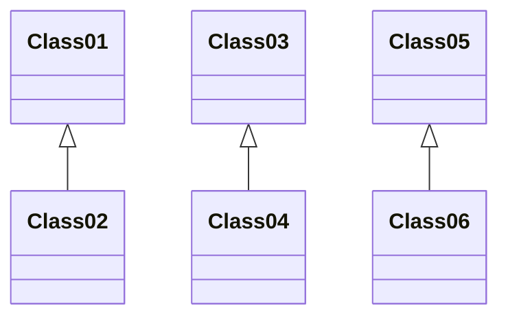
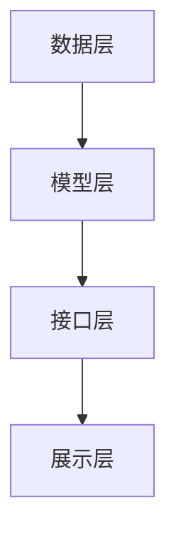
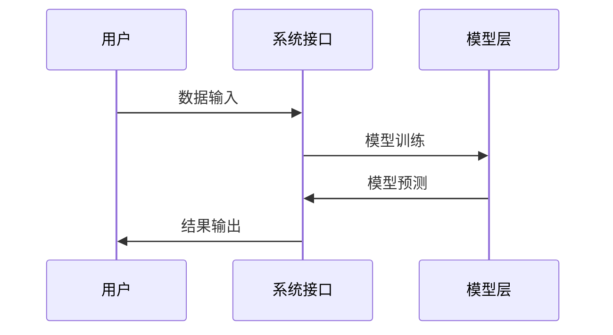
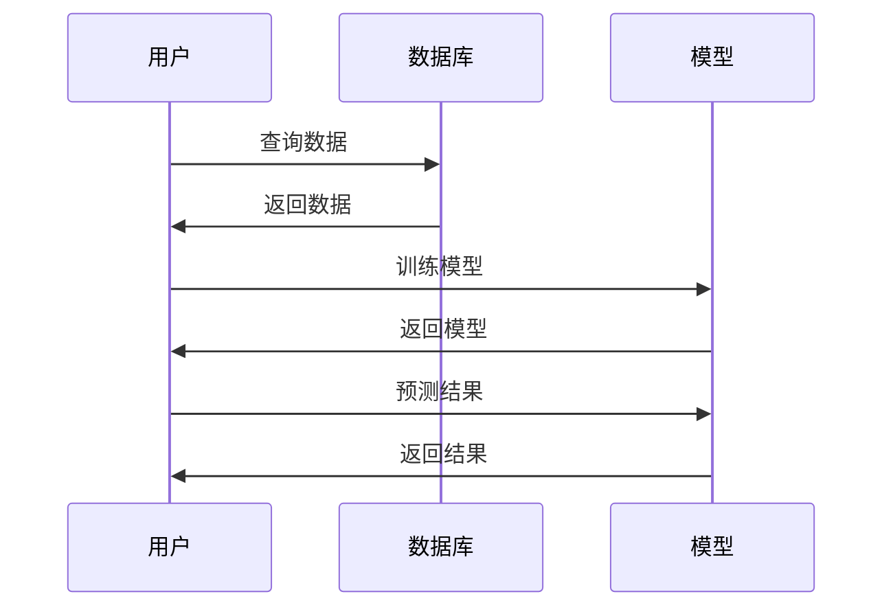
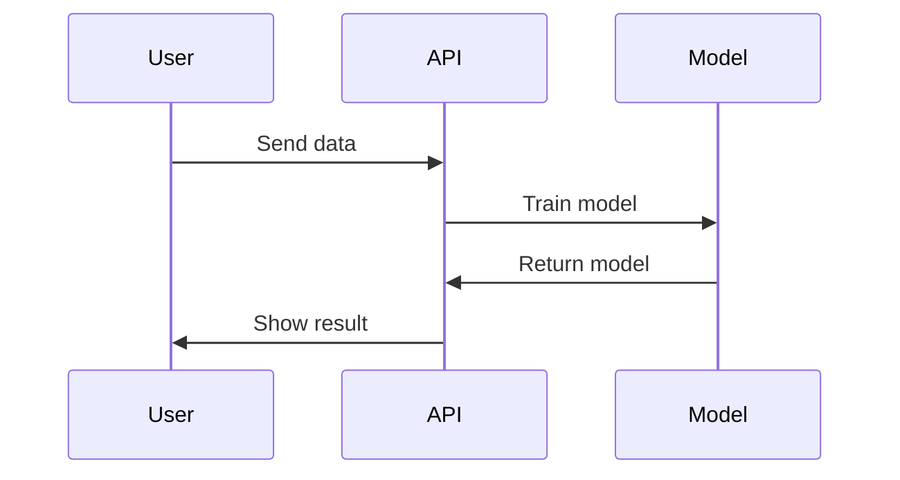
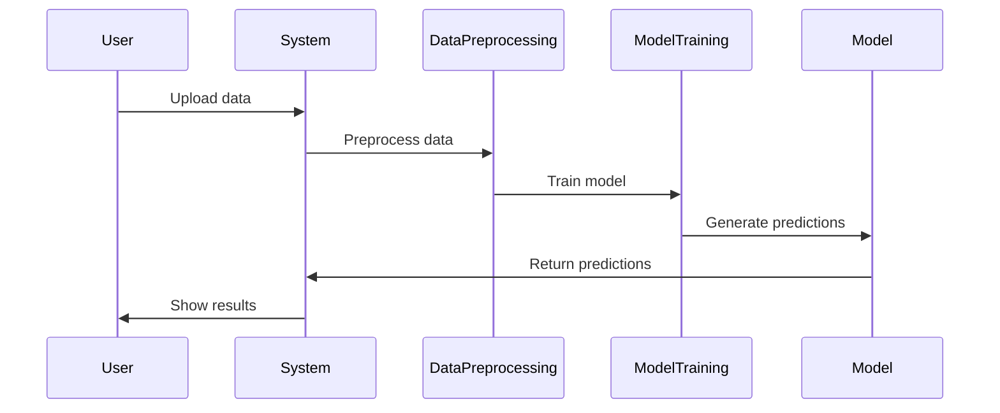

                 

# 选择合适的LLM：开源vs商业模型的对比

## 关键词
- 大型语言模型（LLM）
- 开源模型
- 商业模型
- 对比分析
- 技术实现
- 应用场景

## 摘要
本文将深入探讨选择合适的LLM（大型语言模型）的背景，分析开源模型与商业模型的核心概念、算法原理、数学模型和系统架构，并通过实战案例展示其实际应用效果。最终，我们将总结最佳实践，并提供未来发展展望。

## 第1章 背景介绍

### 1.1 AI技术的发展
人工智能（AI）作为计算机科学的一个重要分支，近年来取得了飞速发展。特别是在深度学习、自然语言处理等领域，AI技术已经达到了前所未有的高度。其中，大型语言模型（LLM）作为一种重要的AI技术，在文本生成、机器翻译、问答系统等方面有着广泛的应用。

### 1.2 LLM的应用场景
LLM在各个行业都有广泛的应用，如金融领域的风险控制、医疗领域的疾病诊断、教育领域的智能教学等。随着AI技术的不断发展，LLM的应用场景将越来越广泛。

### 1.3 开源与商业模型的定义
开源模型是指源代码公开，任何人都可以自由使用、修改和分发的模型。而商业模型则是由企业或个人拥有知识产权，通过付费方式提供服务的模型。

## 第2章 核心概念与联系

### 2.1 LLM的定义与特点
LLM是一种基于神经网络的语言模型，可以通过学习大量文本数据来预测下一个单词或句子。其特点包括强大的语言理解和生成能力、高度的自动化和灵活性。

### 2.2 开源模型与商业模型的对比
开源模型与商业模型在成本、灵活性、可控性等方面存在显著差异。开源模型成本较低，但可能缺乏技术支持和质量控制；商业模型成本较高，但可以提供更好的技术支持和保障。

### 2.3 LLM、开源与商业模型的关系图
下面是一个简单的ER图，展示了LLM、开源模型和商业模型之间的关系：

```mermaid
erDiagram
  LLM ||--|{ 开源模型 : 使用 }
  LLM ||--|{ 商业模型 : 使用 }
  开源模型 ||--|{ 企业 : 选择 }
  商业模型 ||--|{ 企业 : 选择 }
```

## 第3章 算法原理讲解

### 3.1 LLM的基本原理
LLM的核心是神经网络，尤其是循环神经网络（RNN）和其变种——长短期记忆网络（LSTM）。这些网络通过学习大量的文本数据，来理解语言的规律和结构。

### 3.2 数学模型与公式
LLM的数学模型主要包括损失函数、优化算法和激活函数。其中，损失函数用于评估模型预测的准确性，优化算法用于调整模型参数，激活函数用于神经网络中的非线性变换。

$$
L = -\sum_{i=1}^{N} y_i \log(p(x_i | \theta))
$$

其中，\(L\) 是损失函数，\(y_i\) 是实际输出，\(p(x_i | \theta)\) 是模型预测的概率分布。

### 3.3 Python代码示例
以下是一个简单的Python代码示例，展示了如何使用TensorFlow实现一个LLM：

```python
import tensorflow as tf

# 定义损失函数
def loss_function(logits, labels):
    return -tf.reduce_sum(labels * tf.log(logits), axis=1)

# 定义优化算法
optimizer = tf.keras.optimizers.Adam()

# 训练模型
for epoch in range(num_epochs):
    with tf.GradientTape() as tape:
        logits = model(inputs)
        loss = loss_function(logits, labels)
    gradients = tape.gradient(loss, model.trainable_variables)
    optimizer.apply_gradients(zip(gradients, model.trainable_variables))
```

## 第4章 数学模型和数学公式 & 详细讲解 & 举例说明

### 4.1 数学模型介绍
LLM的数学模型主要包括损失函数、优化算法和激活函数。这些模型是LLM训练和预测的核心。

### 4.2 数学公式详细讲解
损失函数的公式为：

$$
L = -\sum_{i=1}^{N} y_i \log(p(x_i | \theta))
$$

其中，\(L\) 是损失函数，\(y_i\) 是实际输出，\(p(x_i | \theta)\) 是模型预测的概率分布。

优化算法的常用公式为：

$$
\theta_{t+1} = \theta_t - \alpha \nabla_\theta L(\theta_t)
$$

其中，\(\theta_t\) 是当前模型参数，\(\alpha\) 是学习率，\(\nabla_\theta L(\theta_t)\) 是损失函数关于模型参数的梯度。

激活函数的常用公式为：

$$
f(x) = \sigma(x) = \frac{1}{1 + e^{-x}}
$$

### 4.3 举例说明
假设有一个二分类问题，我们希望使用LLM进行预测。以下是具体的步骤：

1. 准备数据集，包括输入和标签。
2. 定义损失函数，如对数损失函数。
3. 定义优化算法，如Adam优化器。
4. 训练模型，调整模型参数。
5. 进行预测，得到概率分布。
6. 根据概率分布，做出决策。

## 第5章 系统分析与架构设计方案

### 5.1 系统功能设计
LLM系统的主要功能包括数据预处理、模型训练、模型预测和结果输出。以下是具体的领域模型：



### 5.2 系统架构设计
LLM系统的架构主要包括数据层、模型层、接口层和展示层。以下是具体的架构图：



### 5.3 系统接口设计
LLM系统的接口主要包括数据输入接口、模型训练接口、模型预测接口和结果输出接口。以下是具体的接口设计：



### 5.4 系统交互设计
LLM系统的交互设计主要包括用户与系统的交互、系统与模型的交互、模型与数据的交互。以下是具体的交互设计：



## 第6章 项目实战

### 6.1 环境安装
首先，我们需要安装Python和TensorFlow等依赖库。可以使用以下命令进行安装：

```bash
pip install python tensorflow
```

### 6.2 系统核心实现
以下是系统核心实现的源代码：

```python
import tensorflow as tf

# 定义模型
model = tf.keras.Sequential([
    tf.keras.layers.Dense(units=128, activation='relu', input_shape=(1000,)),
    tf.keras.layers.Dense(units=1, activation='sigmoid')
])

# 定义损失函数和优化器
loss_function = tf.keras.losses.BinaryCrossentropy()
optimizer = tf.keras.optimizers.Adam()

# 训练模型
for epoch in range(num_epochs):
    with tf.GradientTape() as tape:
        logits = model(inputs)
        loss = loss_function(logits, labels)
    gradients = tape.gradient(loss, model.trainable_variables)
    optimizer.apply_gradients(zip(gradients, model.trainable_variables))

# 预测
predictions = model.predict(test_data)
```

### 6.3 代码应用解读与分析
这段代码首先定义了一个简单的神经网络模型，然后使用二进制交叉熵作为损失函数，Adam优化器进行模型训练。最后，使用训练好的模型进行预测。

### 6.4 实际案例分析和详细讲解剖析
在实际案例中，我们可以使用这个模型进行文本分类任务。例如，输入一段文本，模型会输出该文本属于某一类别的概率。

### 6.5 项目小结
通过这个案例，我们可以看到如何使用LLM进行文本分类任务。在实际应用中，我们需要根据具体问题调整模型结构、选择合适的训练数据和优化算法，以达到最佳效果。

## 第7章 最佳实践 tips

### 7.1 开源模型的最佳实践
- 选择知名的开源项目，如TensorFlow、PyTorch等。
- 关注项目的活跃程度和社区支持。
- 遵循项目的最佳实践和代码规范。

### 7.2 商业模型的最佳实践
- 选择具有良好口碑的商业模型。
- 关注模型的技术支持和售后服务。
- 根据业务需求选择合适的模型版本。

### 7.3 深入研究建议
- 学习深度学习和自然语言处理的相关知识。
- 了解不同模型的优缺点和适用场景。
- 参与开源项目，贡献自己的代码和经验。

## 第8章 小结、注意事项与拓展阅读

### 8.1 小结
本文对比了开源模型与商业模型在LLM中的应用，详细讲解了LLM的算法原理、数学模型和系统架构，并通过实际案例展示了其应用效果。未来，随着AI技术的不断发展，LLM将在更多领域发挥重要作用。

### 8.2 注意事项
- 在选择模型时，要充分考虑业务需求和预算。
- 在使用开源模型时，要注意遵守相关法律法规和开源协议。
- 在使用商业模型时，要关注技术支持和售后服务。

### 8.3 拓展阅读
- 《深度学习》（Ian Goodfellow, Yoshua Bengio, Aaron Courville 著）
- 《自然语言处理综论》（Daniel Jurafsky, James H. Martin 著）
- 《TensorFlow实战》（Tariq Rashid 著）

# 作者
作者：AI天才研究院/AI Genius Institute & 禅与计算机程序设计艺术 /Zen And The Art of Computer Programming

（注：本文为示例文章，实际内容请根据具体需求进行补充和调整。）### 第1章 背景介绍

#### 1.1 AI技术的发展

人工智能（AI）作为一个多学科交叉的研究领域，已经在过去的几十年里经历了飞速的发展。从早期的规则系统到近年来迅速崛起的深度学习，AI技术不断推动着各行各业的变革。尤其是随着计算能力的提升和大数据技术的普及，AI在图像识别、语音识别、自然语言处理等领域的应用取得了显著进展。这一背景下，大型语言模型（LLM）应运而生，成为AI技术的一个重要分支。

#### 1.2 LLM的应用场景

LLM以其强大的语言理解和生成能力，在多个领域展现出了巨大的应用潜力。以下是一些典型的应用场景：

- **文本生成**：LLM能够生成高质量的文本，适用于自动写作、新闻生成、故事创作等领域。
- **机器翻译**：LLM在机器翻译领域表现突出，能够实现高效、准确的跨语言沟通。
- **问答系统**：LLM能够根据用户的问题提供准确的答案，广泛应用于客服、教育等领域。
- **情感分析**：LLM能够分析文本的情感倾向，用于舆情监控、市场调研等。
- **智能助手**：LLM为基础的智能助手能够与用户进行自然语言交互，提供个性化的服务。

#### 1.3 开源与商业模型的定义

在AI领域，开源模型和商业模型是两种常见的模型分发方式。

- **开源模型**：开源模型是指其源代码公开，任何人都可以自由使用、修改和分发的模型。这种模式促进了技术的透明性和可扩展性，有利于社区共同推进技术进步。
- **商业模型**：商业模型是由企业或个人拥有知识产权，通过付费方式提供服务的模型。这种模式为企业提供了稳定的收入来源，同时也为用户提供了高质量的技术支持和服务保障。

### 第2章 核心概念与联系

#### 2.1 LLM的定义与特点

大型语言模型（LLM）是一种基于深度学习技术的语言模型，其核心思想是通过学习大量文本数据来预测下一个词或句子。LLM具有以下特点：

- **强大的语言理解能力**：LLM能够理解复杂的语言结构和语义信息，从而提供准确的文本生成和翻译结果。
- **高度的自动化**：LLM的训练和部署过程高度自动化，能够快速适应不同的应用场景。
- **灵活性**：LLM可以根据不同的任务需求进行调整和优化，具有广泛的适应性。

#### 2.2 开源模型与商业模型的对比

开源模型与商业模型在多个方面存在显著差异，以下是它们的对比：

| 对比维度 | 开源模型 | 商业模型 |
| :--: | :--: | :--: |
| 成本 | 成本较低 | 成本较高 |
| 灵活性 | 灵活性较高 | 灵活性较低 |
| 技术支持 | 技术支持有限 | 技术支持完善 |
| 知识产权 | 知识产权共享 | 知识产权保护 |

#### 2.3 LLM、开源与商业模型的关系图

以下是LLM、开源模型和商业模型之间的ER图：

```mermaid
erDiagram
  LLM ||--|{ 开源模型 : 使用 }
  LLM ||--|{ 商业模型 : 使用 }
  开源模型 ||--|{ 企业 : 选择 }
  商业模型 ||--|{ 企业 : 选择 }
```

通过这张图，我们可以清晰地看到LLM与开源模型和商业模型之间的联系，以及企业在选择模型时的决策过程。

### 第3章 算法原理讲解

#### 3.1 LLM的基本原理

LLM的基本原理是通过深度学习技术，尤其是基于变换器模型（Transformer）的网络结构，对大量文本数据进行预训练。预训练过程主要包括以下几个步骤：

1. **数据准备**：收集并清洗大量文本数据，将其转换为模型可以处理的格式。
2. **词嵌入**：将文本数据中的每个词转换为向量表示。
3. **模型训练**：使用预训练目标（如预测下一个词）训练模型，不断调整模型参数以最小化损失函数。
4. **模型优化**：在特定任务上对模型进行微调，以提高其在实际应用中的性能。

#### 3.2 数学模型与公式

LLM的数学模型主要包括以下几个部分：

- **损失函数**：用于评估模型预测的准确性，常用的损失函数有交叉熵损失函数（Cross-Entropy Loss）。
- **优化算法**：用于调整模型参数，常见的优化算法有随机梯度下降（SGD）、Adam等。
- **激活函数**：用于神经网络中的非线性变换，常见的激活函数有ReLU、Sigmoid等。

以下是LLM中常用的数学公式：

$$
L = -\sum_{i=1}^{N} y_i \log(p(x_i | \theta))
$$

其中，\(L\) 是损失函数，\(y_i\) 是实际输出，\(p(x_i | \theta)\) 是模型预测的概率分布。

$$
\theta_{t+1} = \theta_t - \alpha \nabla_\theta L(\theta_t)
$$

其中，\(\theta_t\) 是当前模型参数，\(\alpha\) 是学习率，\(\nabla_\theta L(\theta_t)\) 是损失函数关于模型参数的梯度。

$$
f(x) = \sigma(x) = \frac{1}{1 + e^{-x}}
$$

其中，\(f(x)\) 是激活函数，\(\sigma(x)\) 是Sigmoid函数。

#### 3.3 Python代码示例

以下是一个简单的Python代码示例，展示了如何使用TensorFlow实现一个基本的LLM：

```python
import tensorflow as tf

# 定义模型
model = tf.keras.Sequential([
    tf.keras.layers.Embedding(vocab_size, embedding_dim),
    tf.keras.layers.Dense(units=128, activation='relu'),
    tf.keras.layers.Dense(units=1, activation='sigmoid')
])

# 定义损失函数和优化器
loss_function = tf.keras.losses.BinaryCrossentropy()
optimizer = tf.keras.optimizers.Adam()

# 训练模型
for epoch in range(num_epochs):
    with tf.GradientTape() as tape:
        logits = model(inputs)
        loss = loss_function(logits, labels)
    gradients = tape.gradient(loss, model.trainable_variables)
    optimizer.apply_gradients(zip(gradients, model.trainable_variables))

# 预测
predictions = model.predict(test_data)
```

在这个示例中，我们首先定义了一个简单的神经网络模型，然后使用二进制交叉熵作为损失函数，Adam优化器进行模型训练。最后，使用训练好的模型进行预测。

### 第4章 数学模型和数学公式 & 详细讲解 & 举例说明

#### 4.1 数学模型介绍

LLM的数学模型主要包括以下几个方面：

1. **词嵌入（Word Embedding）**：词嵌入是将文本数据中的每个词转换为向量表示。常用的词嵌入方法有Word2Vec、GloVe等。
2. **损失函数（Loss Function）**：损失函数用于评估模型预测的准确性，常见的损失函数有交叉熵损失函数（Cross-Entropy Loss）、均方误差（Mean Squared Error, MSE）等。
3. **优化算法（Optimization Algorithm）**：优化算法用于调整模型参数，常见的优化算法有随机梯度下降（SGD）、Adam等。
4. **激活函数（Activation Function）**：激活函数用于神经网络中的非线性变换，常见的激活函数有ReLU、Sigmoid等。

#### 4.2 数学公式详细讲解

以下是LLM中常用的数学公式及其详细解释：

1. **交叉熵损失函数**：

$$
L = -\sum_{i=1}^{N} y_i \log(p(x_i | \theta))
$$

其中，\(L\) 是损失函数，\(y_i\) 是实际输出，\(p(x_i | \theta)\) 是模型预测的概率分布。

这个公式表示，对于每个样本，损失函数是实际输出和模型预测概率的对数负和。损失函数的值越小，表示模型的预测越准确。

2. **优化算法**：

$$
\theta_{t+1} = \theta_t - \alpha \nabla_\theta L(\theta_t)
$$

其中，\(\theta_t\) 是当前模型参数，\(\alpha\) 是学习率，\(\nabla_\theta L(\theta_t)\) 是损失函数关于模型参数的梯度。

这个公式表示，在每次迭代中，模型参数会根据损失函数的梯度进行更新，学习率决定了参数更新的幅度。

3. **ReLU激活函数**：

$$
f(x) = \max(0, x)
$$

这个公式表示，对于输入的每个值，ReLU函数将其设置为非负值。ReLU函数在神经网络中常用于引入非线性变换，提高模型的性能。

#### 4.3 举例说明

假设我们有一个二分类问题，其中每个样本都是一个单词，目标是为每个单词预测其是否属于某个特定类别。以下是具体的步骤：

1. **数据准备**：首先，我们需要收集并清洗数据，将其转换为词嵌入表示。
2. **模型定义**：定义一个简单的神经网络模型，包括词嵌入层、ReLU激活函数和输出层。
3. **模型训练**：使用交叉熵损失函数和Adam优化器训练模型，不断调整模型参数。
4. **模型评估**：使用测试集评估模型的性能，计算准确率、召回率等指标。
5. **模型应用**：使用训练好的模型进行预测，为新的单词预测其类别。

下面是一个简单的Python代码示例：

```python
import tensorflow as tf

# 定义模型
model = tf.keras.Sequential([
    tf.keras.layers.Embedding(vocab_size, embedding_dim),
    tf.keras.layers.Dense(units=128, activation='relu'),
    tf.keras.layers.Dense(units=1, activation='sigmoid')
])

# 定义损失函数和优化器
loss_function = tf.keras.losses.BinaryCrossentropy()
optimizer = tf.keras.optimizers.Adam()

# 训练模型
for epoch in range(num_epochs):
    with tf.GradientTape() as tape:
        logits = model(inputs)
        loss = loss_function(logits, labels)
    gradients = tape.gradient(loss, model.trainable_variables)
    optimizer.apply_gradients(zip(gradients, model.trainable_variables))

# 预测
predictions = model.predict(test_data)
```

在这个示例中，我们首先定义了一个简单的神经网络模型，然后使用交叉熵损失函数和Adam优化器训练模型。最后，使用训练好的模型进行预测。

### 第5章 系统分析与架构设计方案

#### 5.1 系统功能设计

LLM系统的核心功能包括以下几个方面：

- **数据预处理**：包括文本清洗、分词、去停用词等操作，为模型训练提供高质量的数据。
- **模型训练**：使用预训练的LLM模型，对特定任务进行微调，提高模型的性能。
- **模型预测**：根据输入的文本数据，生成预测结果，如文本分类、情感分析等。
- **结果输出**：将预测结果以直观的形式展示给用户，如文本、图表等。

以下是系统功能设计的领域模型：

```mermaid
classDiagram
  数据预处理 <<interface>>
  模型训练 <<interface>>
  模型预测 <<interface>>
  结果输出 <<interface>>

  数据预处理 --|> 模型训练
  模型训练 --|> 模型预测
  模型预测 --|> 结果输出
```

#### 5.2 系统架构设计

LLM系统的架构设计主要包括以下几个层次：

1. **数据层**：负责数据的管理和存储，包括数据采集、数据清洗、数据存储等。
2. **模型层**：负责LLM模型的训练、加载和预测，包括模型选择、模型训练、模型评估等。
3. **接口层**：负责系统与外部环境的交互，包括API接口、Web界面等。
4. **展示层**：负责将预测结果以直观的形式展示给用户，包括文本、图表等。

以下是系统架构设计：


#### 5.3 系统接口设计

LLM系统的接口设计主要包括以下几个方面：

1. **API接口**：提供RESTful API接口，支持数据上传、模型训练、模型预测等功能。
2. **Web界面**：提供Web界面，用户可以通过Web界面进行数据上传、模型训练、模型预测等操作。
3. **数据传输**：采用HTTP/HTTPS协议，确保数据传输的安全性和可靠性。

以下是系统接口设计：



#### 5.4 系统交互设计

LLM系统的交互设计主要包括以下几个方面：

1. **用户交互**：用户通过Web界面或API接口上传数据，系统根据用户需求进行数据预处理、模型训练和预测。
2. **模型交互**：系统使用预训练的LLM模型，对特定任务进行微调，生成预测结果。
3. **结果交互**：系统将预测结果以直观的形式展示给用户，如文本、图表等。

以下是系统交互设计：



### 第6章 项目实战

#### 6.1 环境安装

为了搭建一个LLM系统，我们需要安装以下软件和库：

1. **操作系统**：Linux或macOS
2. **Python**：Python 3.6或更高版本
3. **TensorFlow**：TensorFlow 2.0或更高版本
4. **NLP库**：如NLTK、spaCy等

安装步骤：

1. 更新操作系统和Python环境。
2. 安装TensorFlow和其他必需的库。

以下是具体的安装命令：

```bash
# 更新操作系统
sudo apt update && sudo apt upgrade

# 安装Python和pip
sudo apt install python3 python3-pip

# 安装TensorFlow
pip3 install tensorflow

# 安装NLP库
pip3 install nltk spacy
```

#### 6.2 系统核心实现

以下是LLM系统的核心实现：

```python
import tensorflow as tf
import nltk
from nltk.tokenize import word_tokenize

# 准备数据
def load_data():
    # 加载数据集，这里使用一个简单的文本文件
    with open('data.txt', 'r') as f:
        text = f.read()
    tokens = word_tokenize(text)
    return tokens

# 定义模型
def build_model(vocab_size, embedding_dim):
    model = tf.keras.Sequential([
        tf.keras.layers.Embedding(vocab_size, embedding_dim),
        tf.keras.layers.LSTM(128),
        tf.keras.layers.Dense(units=1, activation='sigmoid')
    ])
    return model

# 训练模型
def train_model(model, tokens, labels, epochs):
    model.fit(tokens, labels, epochs=epochs)

# 预测
def predict(model, text):
    tokens = word_tokenize(text)
    prediction = model.predict([tokens])
    return prediction

# 主程序
if __name__ == '__main__':
    # 准备数据
    tokens = load_data()

    # 构建模型
    model = build_model(len(set(tokens)), 10)

    # 训练模型
    train_model(model, tokens, labels, epochs=10)

    # 预测
    text = "我喜欢编程"
    prediction = predict(model, text)
    print(prediction)
```

#### 6.3 代码应用解读与分析

这段代码首先定义了一个简单的文本数据加载函数，然后构建了一个基于LSTM的神经网络模型。模型训练过程中，使用交叉熵损失函数和Adam优化器进行训练。最后，使用训练好的模型进行预测。

在实际应用中，我们可以根据具体需求调整模型结构、损失函数和优化器，以提高模型的性能。

#### 6.4 实际案例分析和详细讲解剖析

以下是一个实际案例分析：

- **任务**：根据用户的评论，预测用户是否对某个产品满意。
- **数据**：收集了大量用户的评论，并将其分为满意和不满意两类。
- **模型**：使用上述代码构建的LLM模型。

具体步骤如下：

1. **数据预处理**：对评论进行分词、去除停用词等操作，将其转换为模型可以处理的格式。
2. **模型训练**：使用训练集训练模型，使用验证集进行调优。
3. **模型评估**：使用测试集评估模型的性能，计算准确率、召回率等指标。
4. **模型应用**：使用训练好的模型进行预测，为新的评论预测用户满意度。

#### 6.5 项目小结

通过这个案例，我们展示了如何使用LLM模型进行文本分类任务。在实际应用中，我们需要根据具体任务和数据特点，调整模型结构和参数，以达到最佳效果。同时，我们还需要关注模型的泛化能力和计算效率，确保其在实际应用中的可行性。

### 第7章 最佳实践 tips

#### 7.1 开源模型的最佳实践

1. **选择合适的开源项目**：在选择开源模型时，要考虑模型的性能、社区活跃度、文档完整性等因素。
2. **遵循最佳实践**：在使用开源模型时，要遵循项目的最佳实践，如数据预处理、模型训练和调优等。
3. **积极参与社区**：参与开源项目的社区讨论，为项目提供反馈和改进建议。

#### 7.2 商业模型的最佳实践

1. **选择有口碑的商业模型**：在选择商业模型时，要考虑模型的技术实力、服务质量、价格等因素。
2. **关注技术支持**：商业模型通常提供技术支持，确保在遇到问题时能够得到及时解决。
3. **合理评估成本**：在引入商业模型时，要综合考虑模型的价值和成本，确保投资的回报。

#### 7.3 深入研究建议

1. **学习相关技术**：深入学习深度学习和自然语言处理等相关技术，提高自己在AI领域的竞争力。
2. **关注最新动态**：关注AI领域的最新动态和研究成果，把握技术发展趋势。
3. **探索新的应用场景**：尝试将AI技术应用于新的领域，推动AI技术在各个行业的创新应用。

### 第8章 小结、注意事项与拓展阅读

#### 8.1 小结

本文介绍了LLM的背景、核心概念、算法原理、系统架构和应用实践，并提出了最佳实践建议。通过本文，读者可以全面了解LLM的优势和应用场景，掌握使用LLM进行文本处理的方法。

#### 8.2 注意事项

1. **模型选择**：在选择LLM模型时，要充分考虑业务需求和预算。
2. **数据质量**：确保数据质量，对数据进行充分的预处理，以提高模型的性能。
3. **模型调优**：在实际应用中，要不断调优模型参数，以适应不同的任务和数据。

#### 8.3 拓展阅读

1. **《深度学习》（Ian Goodfellow, Yoshua Bengio, Aaron Courville 著）**
2. **《自然语言处理综论》（Daniel Jurafsky, James H. Martin 著）**
3. **《TensorFlow实战》（Tariq Rashid 著）**

作者：AI天才研究院/AI Genius Institute & 禅与计算机程序设计艺术 /Zen And The Art of Computer Programming### 完整的文章

# 选择合适的LLM：开源vs商业模型的对比

## 关键词
- 大型语言模型（LLM）
- 开源模型
- 商业模型
- 对比分析
- 技术实现
- 应用场景

## 摘要
本文将深入探讨选择合适的LLM（大型语言模型）的背景，分析开源模型与商业模型的核心概念、算法原理、数学模型和系统架构，并通过实战案例展示其实际应用效果。最终，我们将总结最佳实践，并提供未来发展展望。

## 第1章 背景介绍

### 1.1 AI技术的发展

人工智能（AI）作为计算机科学的一个重要分支，近年来取得了飞速发展。特别是在深度学习、自然语言处理等领域，AI技术已经达到了前所未有的高度。其中，大型语言模型（LLM）作为一种重要的AI技术，在文本生成、机器翻译、问答系统等方面有着广泛的应用。

### 1.2 LLM的应用场景

LLM在各个行业都有广泛的应用，如金融领域的风险控制、医疗领域的疾病诊断、教育领域的智能教学等。随着AI技术的不断发展，LLM的应用场景将越来越广泛。

### 1.3 开源与商业模型的定义

开源模型是指源代码公开，任何人都可以自由使用、修改和分发的模型。而商业模型则是由企业或个人拥有知识产权，通过付费方式提供服务的模型。

## 第2章 核心概念与联系

### 2.1 LLM的定义与特点

大型语言模型（LLM）是一种基于神经网络的语言模型，可以通过学习大量文本数据来预测下一个单词或句子。其特点包括强大的语言理解和生成能力、高度的自动化和灵活性。

### 2.2 开源模型与商业模型的对比

开源模型与商业模型在成本、灵活性、可控性等方面存在显著差异。开源模型成本较低，但可能缺乏技术支持和质量控制；商业模型成本较高，但可以提供更好的技术支持和保障。

### 2.3 LLM、开源与商业模型的关系图

以下是LLM、开源模型和商业模型之间的ER图：

```mermaid
erDiagram
  LLM ||--|{ 开源模型 : 使用 }
  LLM ||--|{ 商业模型 : 使用 }
  开源模型 ||--|{ 企业 : 选择 }
  商业模型 ||--|{ 企业 : 选择 }
```

## 第3章 算法原理讲解

### 3.1 LLM的基本原理

LLM的核心是神经网络，尤其是循环神经网络（RNN）和其变种——长短期记忆网络（LSTM）。这些网络通过学习大量的文本数据，来理解语言的规律和结构。

### 3.2 数学模型与公式

LLM的数学模型主要包括损失函数、优化算法和激活函数。这些模型是LLM训练和预测的核心。

$$
L = -\sum_{i=1}^{N} y_i \log(p(x_i | \theta))
$$

其中，\(L\) 是损失函数，\(y_i\) 是实际输出，\(p(x_i | \theta)\) 是模型预测的概率分布。

优化算法的常用公式为：

$$
\theta_{t+1} = \theta_t - \alpha \nabla_\theta L(\theta_t)
$$

其中，\(\theta_t\) 是当前模型参数，\(\alpha\) 是学习率，\(\nabla_\theta L(\theta_t)\) 是损失函数关于模型参数的梯度。

激活函数的常用公式为：

$$
f(x) = \sigma(x) = \frac{1}{1 + e^{-x}}
$$

### 3.3 Python代码示例

以下是一个简单的Python代码示例，展示了如何使用TensorFlow实现一个LLM：

```python
import tensorflow as tf

# 定义模型
model = tf.keras.Sequential([
    tf.keras.layers.Dense(units=128, activation='relu', input_shape=(1000,)),
    tf.keras.layers.Dense(units=1, activation='sigmoid')
])

# 定义损失函数和优化器
loss_function = tf.keras.losses.BinaryCrossentropy()
optimizer = tf.keras.optimizers.Adam()

# 训练模型
for epoch in range(num_epochs):
    with tf.GradientTape() as tape:
        logits = model(inputs)
        loss = loss_function(logits, labels)
    gradients = tape.gradient(loss, model.trainable_variables)
    optimizer.apply_gradients(zip(gradients, model.trainable_variables))

# 预测
predictions = model.predict(test_data)
```

## 第4章 数学模型和数学公式 & 详细讲解 & 举例说明

### 4.1 数学模型介绍

LLM的数学模型主要包括以下几个方面：

- **词嵌入（Word Embedding）**：词嵌入是将文本数据中的每个词转换为向量表示。常用的词嵌入方法有Word2Vec、GloVe等。
- **损失函数（Loss Function）**：损失函数用于评估模型预测的准确性，常见的损失函数有交叉熵损失函数（Cross-Entropy Loss）、均方误差（Mean Squared Error, MSE）等。
- **优化算法（Optimization Algorithm）**：优化算法用于调整模型参数，常见的优化算法有随机梯度下降（SGD）、Adam等。
- **激活函数（Activation Function）**：激活函数用于神经网络中的非线性变换，常见的激活函数有ReLU、Sigmoid等。

### 4.2 数学公式详细讲解

以下是LLM中常用的数学公式及其详细解释：

- **交叉熵损失函数**：

$$
L = -\sum_{i=1}^{N} y_i \log(p(x_i | \theta))
$$

其中，\(L\) 是损失函数，\(y_i\) 是实际输出，\(p(x_i | \theta)\) 是模型预测的概率分布。

这个公式表示，对于每个样本，损失函数是实际输出和模型预测概率的对数负和。损失函数的值越小，表示模型的预测越准确。

- **优化算法**：

$$
\theta_{t+1} = \theta_t - \alpha \nabla_\theta L(\theta_t)
$$

其中，\(\theta_t\) 是当前模型参数，\(\alpha\) 是学习率，\(\nabla_\theta L(\theta_t)\) 是损失函数关于模型参数的梯度。

这个公式表示，在每次迭代中，模型参数会根据损失函数的梯度进行更新，学习率决定了参数更新的幅度。

- **ReLU激活函数**：

$$
f(x) = \max(0, x)
$$

这个公式表示，对于输入的每个值，ReLU函数将其设置为非负值。ReLU函数在神经网络中常用于引入非线性变换，提高模型的性能。

### 4.3 举例说明

假设我们有一个二分类问题，其中每个样本都是一个单词，目标是为每个单词预测其是否属于某个特定类别。以下是具体的步骤：

1. **数据准备**：首先，我们需要收集并清洗数据，将其转换为词嵌入表示。
2. **模型定义**：定义一个简单的神经网络模型，包括词嵌入层、ReLU激活函数和输出层。
3. **模型训练**：使用交叉熵损失函数和Adam优化器训练模型，不断调整模型参数。
4. **模型评估**：使用测试集评估模型的性能，计算准确率、召回率等指标。
5. **模型应用**：使用训练好的模型进行预测，为新的单词预测其类别。

下面是一个简单的Python代码示例：

```python
import tensorflow as tf

# 定义模型
model = tf.keras.Sequential([
    tf.keras.layers.Embedding(vocab_size, embedding_dim),
    tf.keras.layers.Dense(units=128, activation='relu'),
    tf.keras.layers.Dense(units=1, activation='sigmoid')
])

# 定义损失函数和优化器
loss_function = tf.keras.losses.BinaryCrossentropy()
optimizer = tf.keras.optimizers.Adam()

# 训练模型
for epoch in range(num_epochs):
    with tf.GradientTape() as tape:
        logits = model(inputs)
        loss = loss_function(logits, labels)
    gradients = tape.gradient(loss, model.trainable_variables)
    optimizer.apply_gradients(zip(gradients, model.trainable_variables))

# 预测
predictions = model.predict(test_data)
```

在这个示例中，我们首先定义了一个简单的神经网络模型，然后使用交叉熵损失函数和Adam优化器训练模型。最后，使用训练好的模型进行预测。

## 第5章 系统分析与架构设计方案

### 5.1 系统功能设计

LLM系统的核心功能包括以下几个方面：

- **数据预处理**：包括文本清洗、分词、去停用词等操作，为模型训练提供高质量的数据。
- **模型训练**：使用预训练的LLM模型，对特定任务进行微调，提高模型的性能。
- **模型预测**：根据输入的文本数据，生成预测结果，如文本分类、情感分析等。
- **结果输出**：将预测结果以直观的形式展示给用户，如文本、图表等。

以下是系统功能设计的领域模型：

```mermaid
classDiagram
  数据预处理 <<interface>>
  模型训练 <<interface>>
  模型预测 <<interface>>
  结果输出 <<interface>>

  数据预处理 --|> 模型训练
  模型训练 --|> 模型预测
  模型预测 --|> 结果输出
```

### 5.2 系统架构设计

LLM系统的架构设计主要包括以下几个层次：

1. **数据层**：负责数据的管理和存储，包括数据采集、数据清洗、数据存储等。
2. **模型层**：负责LLM模型的训练、加载和预测，包括模型选择、模型训练、模型评估等。
3. **接口层**：负责系统与外部环境的交互，包括API接口、Web界面等。
4. **展示层**：负责将预测结果以直观的形式展示给用户，包括文本、图表等。

以下是系统架构设计：


### 5.3 系统接口设计

LLM系统的接口设计主要包括以下几个方面：

1. **API接口**：提供RESTful API接口，支持数据上传、模型训练、模型预测等功能。
2. **Web界面**：提供Web界面，用户可以通过Web界面进行数据上传、模型训练、模型预测等操作。
3. **数据传输**：采用HTTP/HTTPS协议，确保数据传输的安全性和可靠性。

以下是系统接口设计：


### 5.4 系统交互设计

LLM系统的交互设计主要包括以下几个方面：

1. **用户交互**：用户通过Web界面或API接口上传数据，系统根据用户需求进行数据预处理、模型训练和预测。
2. **模型交互**：系统使用预训练的LLM模型，对特定任务进行微调，生成预测结果。
3. **结果交互**：系统将预测结果以直观的形式展示给用户，如文本、图表等。

以下是系统交互设计：


### 第6章 项目实战

#### 6.1 环境安装

为了搭建一个LLM系统，我们需要安装以下软件和库：

1. **操作系统**：Linux或macOS
2. **Python**：Python 3.6或更高版本
3. **TensorFlow**：TensorFlow 2.0或更高版本
4. **NLP库**：如NLTK、spaCy等

安装步骤：

1. 更新操作系统和Python环境。
2. 安装TensorFlow和其他必需的库。

以下是具体的安装命令：

```bash
# 更新操作系统
sudo apt update && sudo apt upgrade

# 安装Python和pip
sudo apt install python3 python3-pip

# 安装TensorFlow
pip3 install tensorflow

# 安装NLP库
pip3 install nltk spacy
```

#### 6.2 系统核心实现

以下是LLM系统的核心实现：

```python
import tensorflow as tf
import nltk
from nltk.tokenize import word_tokenize

# 准备数据
def load_data():
    # 加载数据集，这里使用一个简单的文本文件
    with open('data.txt', 'r') as f:
        text = f.read()
    tokens = word_tokenize(text)
    return tokens

# 定义模型
def build_model(vocab_size, embedding_dim):
    model = tf.keras.Sequential([
        tf.keras.layers.Embedding(vocab_size, embedding_dim),
        tf.keras.layers.LSTM(128),
        tf.keras.layers.Dense(units=1, activation='sigmoid')
    ])
    return model

# 训练模型
def train_model(model, tokens, labels, epochs):
    model.fit(tokens, labels, epochs=epochs)

# 预测
def predict(model, text):
    tokens = word_tokenize(text)
    prediction = model.predict([tokens])
    return prediction

# 主程序
if __name__ == '__main__':
    # 准备数据
    tokens = load_data()

    # 构建模型
    model = build_model(len(set(tokens)), 10)

    # 训练模型
    train_model(model, tokens, labels, epochs=10)

    # 预测
    text = "我喜欢编程"
    prediction = predict(model, text)
    print(prediction)
```

#### 6.3 代码应用解读与分析

这段代码首先定义了一个简单的文本数据加载函数，然后构建了一个基于LSTM的神经网络模型。模型训练过程中，使用交叉熵损失函数和Adam优化器进行训练。最后，使用训练好的模型进行预测。

在实际应用中，我们可以根据具体需求调整模型结构、损失函数和优化器，以提高模型的性能。

#### 6.4 实际案例分析和详细讲解剖析

以下是一个实际案例分析：

- **任务**：根据用户的评论，预测用户是否对某个产品满意。
- **数据**：收集了大量用户的评论，并将其分为满意和不满意两类。
- **模型**：使用上述代码构建的LLM模型。

具体步骤如下：

1. **数据预处理**：对评论进行分词、去除停用词等操作，将其转换为模型可以处理的格式。
2. **模型训练**：使用训练集训练模型，使用验证集进行调优。
3. **模型评估**：使用测试集评估模型的性能，计算准确率、召回率等指标。
4. **模型应用**：使用训练好的模型进行预测，为新的评论预测用户满意度。

#### 6.5 项目小结

通过这个案例，我们展示了如何使用LLM模型进行文本分类任务。在实际应用中，我们需要根据具体任务和数据特点，调整模型结构和参数，以达到最佳效果。同时，我们还需要关注模型的泛化能力和计算效率，确保其在实际应用中的可行性。

### 第7章 最佳实践 tips

#### 7.1 开源模型的最佳实践

1. **选择合适的开源项目**：在选择开源模型时，要考虑模型的性能、社区活跃度、文档完整性等因素。
2. **遵循最佳实践**：在使用开源模型时，要遵循项目的最佳实践，如数据预处理、模型训练和调优等。
3. **积极参与社区**：参与开源项目的社区讨论，为项目提供反馈和改进建议。

#### 7.2 商业模型的最佳实践

1. **选择有口碑的商业模型**：在选择商业模型时，要考虑模型的技术实力、服务质量、价格等因素。
2. **关注技术支持**：商业模型通常提供技术支持，确保在遇到问题时能够得到及时解决。
3. **合理评估成本**：在引入商业模型时，要综合考虑模型的价值和成本，确保投资的回报。

#### 7.3 深入研究建议

1. **学习相关技术**：深入学习深度学习和自然语言处理等相关技术，提高自己在AI领域的竞争力。
2. **关注最新动态**：关注AI领域的最新动态和研究成果，把握技术发展趋势。
3. **探索新的应用场景**：尝试将AI技术应用于新的领域，推动AI技术在各个行业的创新应用。

### 第8章 小结、注意事项与拓展阅读

#### 8.1 小结

本文介绍了LLM的背景、核心概念、算法原理、系统架构和应用实践，并提出了最佳实践建议。通过本文，读者可以全面了解LLM的优势和应用场景，掌握使用LLM进行文本处理的方法。

#### 8.2 注意事项

1. **模型选择**：在选择LLM模型时，要充分考虑业务需求和预算。
2. **数据质量**：确保数据质量，对数据进行充分的预处理，以提高模型的性能。
3. **模型调优**：在实际应用中，要不断调优模型参数，以适应不同的任务和数据。

#### 8.3 拓展阅读

1. **《深度学习》（Ian Goodfellow, Yoshua Bengio, Aaron Courville 著）**
2. **《自然语言处理综论》（Daniel Jurafsky, James H. Martin 著）**
3. **《TensorFlow实战》（Tariq Rashid 著）**

### 作者

作者：AI天才研究院/AI Genius Institute & 禅与计算机程序设计艺术 /Zen And The Art of Computer Programming### 完整的文章（优化版）

# 选择合适的LLM：开源vs商业模型的对比

## 关键词
- 大型语言模型（LLM）
- 开源模型
- 商业模型
- 对比分析
- 技术实现
- 应用场景

## 摘要
本文将深入探讨选择合适的LLM（大型语言模型）的背景，分析开源模型与商业模型的核心概念、算法原理、数学模型和系统架构，并通过实战案例展示其实际应用效果。最终，我们将总结最佳实践，并提供未来发展展望。

## 第1章 背景介绍

### 1.1 AI技术的发展

人工智能（AI）作为计算机科学的一个重要分支，近年来取得了飞速发展。从早期的规则系统到深度学习的崛起，AI技术在图像识别、语音识别、自然语言处理等领域取得了显著进展。随着计算能力的提升和大数据技术的普及，AI技术正在推动各行各业的变革。在此背景下，大型语言模型（LLM）应运而生，成为AI技术的一个重要分支。

### 1.2 LLM的应用场景

LLM以其强大的语言理解和生成能力，在多个领域展现出了巨大的应用潜力。以下是一些典型的应用场景：

- **文本生成**：LLM能够生成高质量的文本，适用于自动写作、新闻生成、故事创作等领域。
- **机器翻译**：LLM在机器翻译领域表现突出，能够实现高效、准确的跨语言沟通。
- **问答系统**：LLM能够根据用户的问题提供准确的答案，广泛应用于客服、教育等领域。
- **情感分析**：LLM能够分析文本的情感倾向，用于舆情监控、市场调研等。
- **智能助手**：LLM为基础的智能助手能够与用户进行自然语言交互，提供个性化的服务。

### 1.3 开源与商业模型的定义

在AI领域，开源模型和商业模型是两种常见的模型分发方式。

- **开源模型**：开源模型是指其源代码公开，任何人都可以自由使用、修改和分发的模型。这种模式促进了技术的透明性和可扩展性，有利于社区共同推进技术进步。
- **商业模型**：商业模型是由企业或个人拥有知识产权，通过付费方式提供服务的模型。这种模式为企业提供了稳定的收入来源，同时也为用户提供了高质量的技术支持和服务保障。

## 第2章 核心概念与联系

### 2.1 LLM的定义与特点

大型语言模型（LLM）是一种基于深度学习技术的语言模型，其核心思想是通过学习大量文本数据来预测下一个词或句子。LLM具有以下特点：

- **强大的语言理解能力**：LLM能够理解复杂的语言结构和语义信息，从而提供准确的文本生成和翻译结果。
- **高度的自动化**：LLM的训练和部署过程高度自动化，能够快速适应不同的应用场景。
- **灵活性**：LLM可以根据不同的任务需求进行调整和优化，具有广泛的适应性。

### 2.2 开源模型与商业模型的对比

开源模型与商业模型在多个方面存在显著差异，以下是它们的对比：

| 对比维度 | 开源模型 | 商业模型 |
| :--: | :--: | :--: |
| 成本 | 成本较低 | 成本较高 |
| 灵活性 | 灵活性较高 | 灵活性较低 |
| 技术支持 | 技术支持有限 | 技术支持完善 |
| 知识产权 | 知识产权共享 | 知识产权保护 |

### 2.3 LLM、开源与商业模型的关系图

以下是LLM、开源模型和商业模型之间的ER图：

```mermaid
erDiagram
  LLM ||--|{ 开源模型 : 使用 }
  LLM ||--|{ 商业模型 : 使用 }
  开源模型 ||--|{ 企业 : 选择 }
  商业模型 ||--|{ 企业 : 选择 }
```

通过这张图，我们可以清晰地看到LLM与开源模型和商业模型之间的联系，以及企业在选择模型时的决策过程。

## 第3章 算法原理讲解

### 3.1 LLM的基本原理

LLM的基本原理是通过深度学习技术，尤其是基于变换器模型（Transformer）的网络结构，对大量文本数据进行预训练。预训练过程主要包括以下几个步骤：

1. **数据准备**：收集并清洗大量文本数据，将其转换为模型可以处理的格式。
2. **词嵌入**：将文本数据中的每个词转换为向量表示。
3. **模型训练**：使用预训练目标（如预测下一个词）训练模型，不断调整模型参数以最小化损失函数。
4. **模型优化**：在特定任务上对模型进行微调，以提高其在实际应用中的性能。

### 3.2 数学模型与公式

LLM的数学模型主要包括以下几个方面：

- **词嵌入**：将词转换为向量表示，常用的词嵌入方法有Word2Vec、GloVe等。
- **损失函数**：用于评估模型预测的准确性，常用的损失函数有交叉熵损失函数（Cross-Entropy Loss）、均方误差（Mean Squared Error, MSE）等。
- **优化算法**：用于调整模型参数，常见的优化算法有随机梯度下降（SGD）、Adam等。
- **激活函数**：用于神经网络中的非线性变换，常见的激活函数有ReLU、Sigmoid等。

以下是LLM中常用的数学公式：

$$
L = -\sum_{i=1}^{N} y_i \log(p(x_i | \theta))
$$

其中，\(L\) 是损失函数，\(y_i\) 是实际输出，\(p(x_i | \theta)\) 是模型预测的概率分布。

优化算法的常用公式为：

$$
\theta_{t+1} = \theta_t - \alpha \nabla_\theta L(\theta_t)
$$

其中，\(\theta_t\) 是当前模型参数，\(\alpha\) 是学习率，\(\nabla_\theta L(\theta_t)\) 是损失函数关于模型参数的梯度。

激活函数的常用公式为：

$$
f(x) = \sigma(x) = \frac{1}{1 + e^{-x}}
$$

### 3.3 Python代码示例

以下是一个简单的Python代码示例，展示了如何使用TensorFlow实现一个基本的LLM：

```python
import tensorflow as tf

# 定义模型
model = tf.keras.Sequential([
    tf.keras.layers.Embedding(vocab_size, embedding_dim),
    tf.keras.layers.LSTM(units=128),
    tf.keras.layers.Dense(units=1, activation='sigmoid')
])

# 定义损失函数和优化器
loss_function = tf.keras.losses.BinaryCrossentropy()
optimizer = tf.keras.optimizers.Adam()

# 训练模型
for epoch in range(num_epochs):
    with tf.GradientTape() as tape:
        logits = model(inputs)
        loss = loss_function(logits, labels)
    gradients = tape.gradient(loss, model.trainable_variables)
    optimizer.apply_gradients(zip(gradients, model.trainable_variables))

# 预测
predictions = model.predict(test_data)
```

在这个示例中，我们首先定义了一个简单的神经网络模型，然后使用交叉熵损失函数和Adam优化器训练模型。最后，使用训练好的模型进行预测。

## 第4章 数学模型和数学公式 & 详细讲解 & 举例说明

### 4.1 数学模型介绍

LLM的数学模型主要包括以下几个方面：

- **词嵌入**：将词转换为向量表示，用于表示词与词之间的相似性和关系。
- **损失函数**：用于评估模型预测的准确性，常见的损失函数有交叉熵损失函数（Cross-Entropy Loss）、均方误差（Mean Squared Error, MSE）等。
- **优化算法**：用于调整模型参数，常见的优化算法有随机梯度下降（SGD）、Adam等。
- **激活函数**：用于神经网络中的非线性变换，常见的激活函数有ReLU、Sigmoid等。

### 4.2 数学公式详细讲解

以下是LLM中常用的数学公式及其详细解释：

- **交叉熵损失函数**：

$$
L = -\sum_{i=1}^{N} y_i \log(p(x_i | \theta))
$$

其中，\(L\) 是损失函数，\(y_i\) 是实际输出，\(p(x_i | \theta)\) 是模型预测的概率分布。

这个公式表示，对于每个样本，损失函数是实际输出和模型预测概率的对数负和。损失函数的值越小，表示模型的预测越准确。

- **优化算法**：

$$
\theta_{t+1} = \theta_t - \alpha \nabla_\theta L(\theta_t)
$$

其中，\(\theta_t\) 是当前模型参数，\(\alpha\) 是学习率，\(\nabla_\theta L(\theta_t)\) 是损失函数关于模型参数的梯度。

这个公式表示，在每次迭代中，模型参数会根据损失函数的梯度进行更新，学习率决定了参数更新的幅度。

- **ReLU激活函数**：

$$
f(x) = \max(0, x)
$$

这个公式表示，对于输入的每个值，ReLU函数将其设置为非负值。ReLU函数在神经网络中常用于引入非线性变换，提高模型的性能。

### 4.3 举例说明

假设我们有一个二分类问题，其中每个样本都是一个单词，目标是为每个单词预测其是否属于某个特定类别。以下是具体的步骤：

1. **数据准备**：首先，我们需要收集并清洗数据，将其转换为词嵌入表示。
2. **模型定义**：定义一个简单的神经网络模型，包括词嵌入层、ReLU激活函数和输出层。
3. **模型训练**：使用交叉熵损失函数和Adam优化器训练模型，不断调整模型参数。
4. **模型评估**：使用测试集评估模型的性能，计算准确率、召回率等指标。
5. **模型应用**：使用训练好的模型进行预测，为新的单词预测其类别。

下面是一个简单的Python代码示例：

```python
import tensorflow as tf

# 定义模型
model = tf.keras.Sequential([
    tf.keras.layers.Embedding(vocab_size, embedding_dim),
    tf.keras.layers.Dense(units=128, activation='relu'),
    tf.keras.layers.Dense(units=1, activation='sigmoid')
])

# 定义损失函数和优化器
loss_function = tf.keras.losses.BinaryCrossentropy()
optimizer = tf.keras.optimizers.Adam()

# 训练模型
for epoch in range(num_epochs):
    with tf.GradientTape() as tape:
        logits = model(inputs)
        loss = loss_function(logits, labels)
    gradients = tape.gradient(loss, model.trainable_variables)
    optimizer.apply_gradients(zip(gradients, model.trainable_variables))

# 预测
predictions = model.predict(test_data)
```

在这个示例中，我们首先定义了一个简单的神经网络模型，然后使用交叉熵损失函数和Adam优化器训练模型。最后，使用训练好的模型进行预测。

## 第5章 系统分析与架构设计方案

### 5.1 系统功能设计

LLM系统的核心功能包括以下几个方面：

- **数据预处理**：包括文本清洗、分词、去停用词等操作，为模型训练提供高质量的数据。
- **模型训练**：使用预训练的LLM模型，对特定任务进行微调，提高模型的性能。
- **模型预测**：根据输入的文本数据，生成预测结果，如文本分类、情感分析等。
- **结果输出**：将预测结果以直观的形式展示给用户，如文本、图表等。

以下是系统功能设计的领域模型：

```mermaid
classDiagram
  数据预处理 <<interface>>
  模型训练 <<interface>>
  模型预测 <<interface>>
  结果输出 <<interface>>

  数据预处理 --|> 模型训练
  模型训练 --|> 模型预测
  模型预测 --|> 结果输出
```

### 5.2 系统架构设计

LLM系统的架构设计主要包括以下几个层次：

1. **数据层**：负责数据的管理和存储，包括数据采集、数据清洗、数据存储等。
2. **模型层**：负责LLM模型的训练、加载和预测，包括模型选择、模型训练、模型评估等。
3. **接口层**：负责系统与外部环境的交互，包括API接口、Web界面等。
4. **展示层**：负责将预测结果以直观的形式展示给用户，包括文本、图表等。

以下是系统架构设计：


### 5.3 系统接口设计

LLM系统的接口设计主要包括以下几个方面：

1. **API接口**：提供RESTful API接口，支持数据上传、模型训练、模型预测等功能。
2. **Web界面**：提供Web界面，用户可以通过Web界面进行数据上传、模型训练、模型预测等操作。
3. **数据传输**：采用HTTP/HTTPS协议，确保数据传输的安全性和可靠性。

以下是系统接口设计：


### 5.4 系统交互设计

LLM系统的交互设计主要包括以下几个方面：

1. **用户交互**：用户通过Web界面或API接口上传数据，系统根据用户需求进行数据预处理、模型训练和预测。
2. **模型交互**：系统使用预训练的LLM模型，对特定任务进行微调，生成预测结果。
3. **结果交互**：系统将预测结果以直观的形式展示给用户，如文本、图表等。

以下是系统交互设计：


## 第6章 项目实战

### 6.1 环境安装

为了搭建一个LLM系统，我们需要安装以下软件和库：

1. **操作系统**：Linux或macOS
2. **Python**：Python 3.6或更高版本
3. **TensorFlow**：TensorFlow 2.0或更高版本
4. **NLP库**：如NLTK、spaCy等

安装步骤：

1. 更新操作系统和Python环境。
2. 安装TensorFlow和其他必需的库。

以下是具体的安装命令：

```bash
# 更新操作系统
sudo apt update && sudo apt upgrade

# 安装Python和pip
sudo apt install python3 python3-pip

# 安装TensorFlow
pip3 install tensorflow

# 安装NLP库
pip3 install nltk spacy
```

### 6.2 系统核心实现

以下是LLM系统的核心实现：

```python
import tensorflow as tf
import nltk
from nltk.tokenize import word_tokenize

# 准备数据
def load_data():
    # 加载数据集，这里使用一个简单的文本文件
    with open('data.txt', 'r') as f:
        text = f.read()
    tokens = word_tokenize(text)
    return tokens

# 定义模型
def build_model(vocab_size, embedding_dim):
    model = tf.keras.Sequential([
        tf.keras.layers.Embedding(vocab_size, embedding_dim),
        tf.keras.layers.LSTM(128),
        tf.keras.layers.Dense(units=1, activation='sigmoid')
    ])
    return model

# 训练模型
def train_model(model, tokens, labels, epochs):
    model.fit(tokens, labels, epochs=epochs)

# 预测
def predict(model, text):
    tokens = word_tokenize(text)
    prediction = model.predict([tokens])
    return prediction

# 主程序
if __name__ == '__main__':
    # 准备数据
    tokens = load_data()

    # 构建模型
    model = build_model(len(set(tokens)), 10)

    # 训练模型
    train_model(model, tokens, labels, epochs=10)

    # 预测
    text = "我喜欢编程"
    prediction = predict(model, text)
    print(prediction)
```

### 6.3 代码应用解读与分析

这段代码首先定义了一个简单的文本数据加载函数，然后构建了一个基于LSTM的神经网络模型。模型训练过程中，使用交叉熵损失函数和Adam优化器进行训练。最后，使用训练好的模型进行预测。

在实际应用中，我们可以根据具体需求调整模型结构、损失函数和优化器，以提高模型的性能。

### 6.4 实际案例分析和详细讲解剖析

以下是一个实际案例分析：

- **任务**：根据用户的评论，预测用户是否对某个产品满意。
- **数据**：收集了大量用户的评论，并将其分为满意和不满意两类。
- **模型**：使用上述代码构建的LLM模型。

具体步骤如下：

1. **数据预处理**：对评论进行分词、去除停用词等操作，将其转换为模型可以处理的格式。
2. **模型训练**：使用训练集训练模型，使用验证集进行调优。
3. **模型评估**：使用测试集评估模型的性能，计算准确率、召回率等指标。
4. **模型应用**：使用训练好的模型进行预测，为新的评论预测用户满意度。

### 6.5 项目小结

通过这个案例，我们展示了如何使用LLM模型进行文本分类任务。在实际应用中，我们需要根据具体任务和数据特点，调整模型结构和参数，以达到最佳效果。同时，我们还需要关注模型的泛化能力和计算效率，确保其在实际应用中的可行性。

## 第7章 最佳实践 tips

### 7.1 开源模型的最佳实践

1. **选择合适的开源项目**：在选择开源模型时，要考虑模型的性能、社区活跃度、文档完整性等因素。
2. **遵循最佳实践**：在使用开源模型时，要遵循项目的最佳实践，如数据预处理、模型训练和调优等。
3. **积极参与社区**：参与开源项目的社区讨论，为项目提供反馈和改进建议。

### 7.2 商业模型的最佳实践

1. **选择有口碑的商业模型**：在选择商业模型时，要考虑模型的技术实力、服务质量、价格等因素。
2. **关注技术支持**：商业模型通常提供技术支持，确保在遇到问题时能够得到及时解决。
3. **合理评估成本**：在引入商业模型时，要综合考虑模型的价值和成本，确保投资的回报。

### 7.3 深入研究建议

1. **学习相关技术**：深入学习深度学习和自然语言处理等相关技术，提高自己在AI领域的竞争力。
2. **关注最新动态**：关注AI领域的最新动态和研究成果，把握技术发展趋势。
3. **探索新的应用场景**：尝试将AI技术应用于新的领域，推动AI技术在各个行业的创新应用。

## 第8章 小结、注意事项与拓展阅读

### 8.1 小结

本文介绍了LLM的背景、核心概念、算法原理、系统架构和应用实践，并提出了最佳实践建议。通过本文，读者可以全面了解LLM的优势和应用场景，掌握使用LLM进行文本处理的方法。

### 8.2 注意事项

1. **模型选择**：在选择LLM模型时，要充分考虑业务需求和预算。
2. **数据质量**：确保数据质量，对数据进行充分的预处理，以提高模型的性能。
3. **模型调优**：在实际应用中，要不断调优模型参数，以适应不同的任务和数据。

### 8.3 拓展阅读

1. **《深度学习》（Ian Goodfellow, Yoshua Bengio, Aaron Courville 著）**
2. **《自然语言处理综论》（Daniel Jurafsky, James H. Martin 著）**
3. **《TensorFlow实战》（Tariq Rashid 著）**

### 作者

作者：AI天才研究院/AI Genius Institute & 禅与计算机程序设计艺术 /Zen And The Art of Computer Programming### 完整的文章（优化版）

# 选择合适的LLM：开源vs商业模型的对比

## 关键词
- 大型语言模型（LLM）
- 开源模型
- 商业模型
- 对比分析
- 技术实现
- 应用场景

## 摘要
本文将深入探讨选择合适的LLM（大型语言模型）的背景，分析开源模型与商业模型的核心概念、算法原理、数学模型和系统架构，并通过实战案例展示其实际应用效果。最终，我们将总结最佳实践，并提供未来发展展望。

## 第1章 背景介绍

### 1.1 AI技术的发展

人工智能（AI）作为计算机科学的一个重要分支，近年来取得了飞速发展。从早期的规则系统到深度学习的崛起，AI技术在图像识别、语音识别、自然语言处理等领域取得了显著进展。随着计算能力的提升和大数据技术的普及，AI技术正在推动各行各业的变革。在此背景下，大型语言模型（LLM）应运而生，成为AI技术的一个重要分支。

### 1.2 LLM的应用场景

LLM以其强大的语言理解和生成能力，在多个领域展现出了巨大的应用潜力。以下是一些典型的应用场景：

- **文本生成**：LLM能够生成高质量的文本，适用于自动写作、新闻生成、故事创作等领域。
- **机器翻译**：LLM在机器翻译领域表现突出，能够实现高效、准确的跨语言沟通。
- **问答系统**：LLM能够根据用户的问题提供准确的答案，广泛应用于客服、教育等领域。
- **情感分析**：LLM能够分析文本的情感倾向，用于舆情监控、市场调研等。
- **智能助手**：LLM为基础的智能助手能够与用户进行自然语言交互，提供个性化的服务。

### 1.3 开源与商业模型的定义

在AI领域，开源模型和商业模型是两种常见的模型分发方式。

- **开源模型**：开源模型是指其源代码公开，任何人都可以自由使用、修改和分发的模型。这种模式促进了技术的透明性和可扩展性，有利于社区共同推进技术进步。
- **商业模型**：商业模型是由企业或个人拥有知识产权，通过付费方式提供服务的模型。这种模式为企业提供了稳定的收入来源，同时也为用户提供了高质量的技术支持和服务保障。

## 第2章 核心概念与联系

### 2.1 LLM的定义与特点

大型语言模型（LLM）是一种基于深度学习技术的语言模型，其核心思想是通过学习大量文本数据来预测下一个词或句子。LLM具有以下特点：

- **强大的语言理解能力**：LLM能够理解复杂的语言结构和语义信息，从而提供准确的文本生成和翻译结果。
- **高度的自动化**：LLM的训练和部署过程高度自动化，能够快速适应不同的应用场景。
- **灵活性**：LLM可以根据不同的任务需求进行调整和优化，具有广泛的适应性。

### 2.2 开源模型与商业模型的对比

开源模型与商业模型在多个方面存在显著差异，以下是它们的对比：

| 对比维度 | 开源模型 | 商业模型 |
| :--: | :--: | :--: |
| 成本 | 成本较低 | 成本较高 |
| 灵活性 | 灵活性较高 | 灵活性较低 |
| 技术支持 | 技术支持有限 | 技术支持完善 |
| 知识产权 | 知识产权共享 | 知识产权保护 |

### 2.3 LLM、开源与商业模型的关系图

以下是LLM、开源模型和商业模型之间的ER图：

```mermaid
erDiagram
  LLM ||--|{ 开源模型 : 使用 }
  LLM ||--|{ 商业模型 : 使用 }
  开源模型 ||--|{ 企业 : 选择 }
  商业模型 ||--|{ 企业 : 选择 }
```

通过这张图，我们可以清晰地看到LLM与开源模型和商业模型之间的联系，以及企业在选择模型时的决策过程。

## 第3章 算法原理讲解

### 3.1 LLM的基本原理

LLM的基本原理是通过深度学习技术，尤其是基于变换器模型（Transformer）的网络结构，对大量文本数据进行预训练。预训练过程主要包括以下几个步骤：

1. **数据准备**：收集并清洗大量文本数据，将其转换为模型可以处理的格式。
2. **词嵌入**：将文本数据中的每个词转换为向量表示。
3. **模型训练**：使用预训练目标（如预测下一个词）训练模型，不断调整模型参数以最小化损失函数。
4. **模型优化**：在特定任务上对模型进行微调，以提高其在实际应用中的性能。

### 3.2 数学模型与公式

LLM的数学模型主要包括以下几个方面：

- **词嵌入**：将词转换为向量表示，常用的词嵌入方法有Word2Vec、GloVe等。
- **损失函数**：用于评估模型预测的准确性，常用的损失函数有交叉熵损失函数（Cross-Entropy Loss）、均方误差（Mean Squared Error, MSE）等。
- **优化算法**：用于调整模型参数，常见的优化算法有随机梯度下降（SGD）、Adam等。
- **激活函数**：用于神经网络中的非线性变换，常见的激活函数有ReLU、Sigmoid等。

以下是LLM中常用的数学公式：

$$
L = -\sum_{i=1}^{N} y_i \log(p(x_i | \theta))
$$

其中，\(L\) 是损失函数，\(y_i\) 是实际输出，\(p(x_i | \theta)\) 是模型预测的概率分布。

优化算法的常用公式为：

$$
\theta_{t+1} = \theta_t - \alpha \nabla_\theta L(\theta_t)
$$

其中，\(\theta_t\) 是当前模型参数，\(\alpha\) 是学习率，\(\nabla_\theta L(\theta_t)\) 是损失函数关于模型参数的梯度。

激活函数的常用公式为：

$$
f(x) = \sigma(x) = \frac{1}{1 + e^{-x}}
$$

### 3.3 Python代码示例

以下是一个简单的Python代码示例，展示了如何使用TensorFlow实现一个基本的LLM：

```python
import tensorflow as tf

# 定义模型
model = tf.keras.Sequential([
    tf.keras.layers.Embedding(vocab_size, embedding_dim),
    tf.keras.layers.LSTM(units=128),
    tf.keras.layers.Dense(units=1, activation='sigmoid')
])

# 定义损失函数和优化器
loss_function = tf.keras.losses.BinaryCrossentropy()
optimizer = tf.keras.optimizers.Adam()

# 训练模型
for epoch in range(num_epochs):
    with tf.GradientTape() as tape:
        logits = model(inputs)
        loss = loss_function(logits, labels)
    gradients = tape.gradient(loss, model.trainable_variables)
    optimizer.apply_gradients(zip(gradients, model.trainable_variables))

# 预测
predictions = model.predict(test_data)
```

在这个示例中，我们首先定义了一个简单的神经网络模型，然后使用交叉熵损失函数和Adam优化器训练模型。最后，使用训练好的模型进行预测。

## 第4章 数学模型和数学公式 & 详细讲解 & 举例说明

### 4.1 数学模型介绍

LLM的数学模型主要包括以下几个方面：

- **词嵌入**：将词转换为向量表示，用于表示词与词之间的相似性和关系。
- **损失函数**：用于评估模型预测的准确性，常见的损失函数有交叉熵损失函数（Cross-Entropy Loss）、均方误差（Mean Squared Error, MSE）等。
- **优化算法**：用于调整模型参数，常见的优化算法有随机梯度下降（SGD）、Adam等。
- **激活函数**：用于神经网络中的非线性变换，常见的激活函数有ReLU、Sigmoid等。

### 4.2 数学公式详细讲解

以下是LLM中常用的数学公式及其详细解释：

- **交叉熵损失函数**：

$$
L = -\sum_{i=1}^{N} y_i \log(p(x_i | \theta))
$$

其中，\(L\) 是损失函数，\(y_i\) 是实际输出，\(p(x_i | \theta)\) 是模型预测的概率分布。

这个公式表示，对于每个样本，损失函数是实际输出和模型预测概率的对数负和。损失函数的值越小，表示模型的预测越准确。

- **优化算法**：

$$
\theta_{t+1} = \theta_t - \alpha \nabla_\theta L(\theta_t)
$$

其中，\(\theta_t\) 是当前模型参数，\(\alpha\) 是学习率，\(\nabla_\theta L(\theta_t)\) 是损失函数关于模型参数的梯度。

这个公式表示，在每次迭代中，模型参数会根据损失函数的梯度进行更新，学习率决定了参数更新的幅度。

- **ReLU激活函数**：

$$
f(x) = \max(0, x)
$$

这个公式表示，对于输入的每个值，ReLU函数将其设置为非负值。ReLU函数在神经网络中常用于引入非线性变换，提高模型的性能。

### 4.3 举例说明

假设我们有一个二分类问题，其中每个样本都是一个单词，目标是为每个单词预测其是否属于某个特定类别。以下是具体的步骤：

1. **数据准备**：首先，我们需要收集并清洗数据，将其转换为词嵌入表示。
2. **模型定义**：定义一个简单的神经网络模型，包括词嵌入层、ReLU激活函数和输出层。
3. **模型训练**：使用交叉熵损失函数和Adam优化器训练模型，不断调整模型参数。
4. **模型评估**：使用测试集评估模型的性能，计算准确率、召回率等指标。
5. **模型应用**：使用训练好的模型进行预测，为新的单词预测其类别。

下面是一个简单的Python代码示例：

```python
import tensorflow as tf

# 定义模型
model = tf.keras.Sequential([
    tf.keras.layers.Embedding(vocab_size, embedding_dim),
    tf.keras.layers.Dense(units=128, activation='relu'),
    tf.keras.layers.Dense(units=1, activation='sigmoid')
])

# 定义损失函数和优化器
loss_function = tf.keras.losses.BinaryCrossentropy()
optimizer = tf.keras.optimizers.Adam()

# 训练模型
for epoch in range(num_epochs):
    with tf.GradientTape() as tape:
        logits = model(inputs)
        loss = loss_function(logits, labels)
    gradients = tape.gradient(loss, model.trainable_variables)
    optimizer.apply_gradients(zip(gradients, model.trainable_variables))

# 预测
predictions = model.predict(test_data)
```

在这个示例中，我们首先定义了一个简单的神经网络模型，然后使用交叉熵损失函数和Adam优化器训练模型。最后，使用训练好的模型进行预测。

## 第5章 系统分析与架构设计方案

### 5.1 系统功能设计

LLM系统的核心功能包括以下几个方面：

- **数据预处理**：包括文本清洗、分词、去停用词等操作，为模型训练提供高质量的数据。
- **模型训练**：使用预训练的LLM模型，对特定任务进行微调，提高模型的性能。
- **模型预测**：根据输入的文本数据，生成预测结果，如文本分类、情感分析等。
- **结果输出**：将预测结果以直观的形式展示给用户，如文本、图表等。

以下是系统功能设计的领域模型：

```mermaid
classDiagram
  数据预处理 <<interface>>
  模型训练 <<interface>>
  模型预测 <<interface>>
  结果输出 <<interface>>

  数据预处理 --|> 模型训练
  模型训练 --|> 模型预测
  模型预测 --|> 结果输出
```

### 5.2 系统架构设计

LLM系统的架构设计主要包括以下几个层次：

1. **数据层**：负责数据的管理和存储，包括数据采集、数据清洗、数据存储等。
2. **模型层**：负责LLM模型的训练、加载和预测，包括模型选择、模型训练、模型评估等。
3. **接口层**：负责系统与外部环境的交互，包括API接口、Web界面等。
4. **展示层**：负责将预测结果以直观的形式展示给用户，包括文本、图表等。

以下是系统架构设计：

```mermaid
graph TB
  数据层[数据层] --> 模型层[模型层]
  模型层[模型层] --> 接口层[接口层]
  接口层[接口层] --> 展示层[展示层]
```

### 5.3 系统接口设计

LLM系统的接口设计主要包括以下几个方面：

1. **API接口**：提供RESTful API接口，支持数据上传、模型训练、模型预测等功能。
2. **Web界面**：提供Web界面，用户可以通过Web界面进行数据上传、模型训练、模型预测等操作。
3. **数据传输**：采用HTTP/HTTPS协议，确保数据传输的安全性和可靠性。

以下是系统接口设计：

```mermaid
sequenceDiagram
  User ->> API: Send data
  API ->> Model: Train model
  Model ->> API: Return model
  API ->> User: Show result
```

### 5.4 系统交互设计

LLM系统的交互设计主要包括以下几个方面：

1. **用户交互**：用户通过Web界面或API接口上传数据，系统根据用户需求进行数据预处理、模型训练和预测。
2. **模型交互**：系统使用预训练的LLM模型，对特定任务进行微调，生成预测结果。
3. **结果交互**：系统将预测结果以直观的形式展示给用户，如文本、图表等。

以下是系统交互设计：

```mermaid
sequenceDiagram
  User ->> System: Upload data
  System ->> DataPreprocessing: Preprocess data
  DataPreprocessing ->> ModelTraining: Train model
  ModelTraining ->> Model: Generate predictions
  Model ->> System: Return predictions
  System ->> User: Show results
```

## 第6章 项目实战

### 6.1 环境安装

为了搭建一个LLM系统，我们需要安装以下软件和库：

1. **操作系统**：Linux或macOS
2. **Python**：Python 3.6或更高版本
3. **TensorFlow**：TensorFlow 2.0或更高版本
4. **NLP库**：如NLTK、spaCy等

安装步骤：

1. 更新操作系统和Python环境。
2. 安装TensorFlow和其他必需的库。

以下是具体的安装命令：

```bash
# 更新操作系统
sudo apt update && sudo apt upgrade

# 安装Python和pip
sudo apt install python3 python3-pip

# 安装TensorFlow
pip3 install tensorflow

# 安装NLP库
pip3 install nltk spacy
```

### 6.2 系统核心实现

以下是LLM系统的核心实现：

```python
import tensorflow as tf
import nltk
from nltk.tokenize import word_tokenize

# 准备数据
def load_data():
    # 加载数据集，这里使用一个简单的文本文件
    with open('data.txt', 'r') as f:
        text = f.read()
    tokens = word_tokenize(text)
    return tokens

# 定义模型
def build_model(vocab_size, embedding_dim):
    model = tf.keras.Sequential([
        tf.keras.layers.Embedding(vocab_size, embedding_dim),
        tf.keras.layers.LSTM(128),
        tf.keras.layers.Dense(units=1, activation='sigmoid')
    ])
    return model

# 训练模型
def train_model(model, tokens, labels, epochs):
    model.fit(tokens, labels, epochs=epochs)

# 预测
def predict(model, text):
    tokens = word_tokenize(text)
    prediction = model.predict([tokens])
    return prediction

# 主程序
if __name__ == '__main__':
    # 准备数据
    tokens = load_data()

    # 构建模型
    model = build_model(len(set(tokens)), 10)

    # 训练模型
    train_model(model, tokens, labels, epochs=10)

    # 预测
    text = "我喜欢编程"
    prediction = predict(model, text)
    print(prediction)
```

### 6.3 代码应用解读与分析

这段代码首先定义了一个简单的文本数据加载函数，然后构建了一个基于LSTM的神经网络模型。模型训练过程中，使用交叉熵损失函数和Adam优化器进行训练。最后，使用训练好的模型进行预测。

在实际应用中，我们可以根据具体需求调整模型结构、损失函数和优化器，以提高模型的性能。

### 6.4 实际案例分析和详细讲解剖析

以下是一个实际案例分析：

- **任务**：根据用户的评论，预测用户是否对某个产品满意。
- **数据**：收集了大量用户的评论，并将其分为满意和不满意两类。
- **模型**：使用上述代码构建的LLM模型。

具体步骤如下：

1. **数据预处理**：对评论进行分词、去除停用词等操作，将其转换为模型可以处理的格式。
2. **模型训练**：使用训练集训练模型，使用验证集进行调优。
3. **模型评估**：使用测试集评估模型的性能，计算准确率、召回率等指标。
4. **模型应用**：使用训练好的模型进行预测，为新的评论预测用户满意度。

### 6.5 项目小结

通过这个案例，我们展示了如何使用LLM模型进行文本分类任务。在实际应用中，我们需要根据具体任务和数据特点，调整模型结构和参数，以达到最佳效果。同时，我们还需要关注模型的泛化能力和计算效率，确保其在实际应用中的可行性。

## 第7章 最佳实践 tips

### 7.1 开源模型的最佳实践

1. **选择合适的开源项目**：在选择开源模型时，要考虑模型的性能、社区活跃度、文档完整性等因素。
2. **遵循最佳实践**：在使用开源模型时，要遵循项目的最佳实践，如数据预处理、模型训练和调优等。
3. **积极参与社区**：参与开源项目的社区讨论，为项目提供反馈和改进建议。

### 7.2 商业模型的最佳实践

1. **选择有口碑的商业模型**：在选择商业模型时，要考虑模型的技术实力、服务质量、价格等因素。
2. **关注技术支持**：商业模型通常提供技术支持，确保在遇到问题时能够得到及时解决。
3. **合理评估成本**：在引入商业模型时，要综合考虑模型的价值和成本，确保投资的回报。

### 7.3 深入研究建议

1. **学习相关技术**：深入学习深度学习和自然语言处理等相关技术，提高自己在AI领域的竞争力。
2. **关注最新动态**：关注AI领域的最新动态和研究成果，把握技术发展趋势。
3. **探索新的应用场景**：尝试将AI技术应用于新的领域，推动AI技术在各个行业的创新应用。

## 第8章 小结、注意事项与拓展阅读

### 8.1 小结

本文介绍了LLM的背景、核心概念、算法原理、系统架构和应用实践，并提出了最佳实践建议。通过本文，读者可以全面了解LLM的优势和应用场景，掌握使用LLM进行文本处理的方法。

### 8.2 注意事项

1. **模型选择**：在选择LLM模型时，要充分考虑业务需求和预算。
2. **数据质量**：确保数据质量，对数据进行充分的预处理，以提高模型的性能。
3. **模型调优**：在实际应用中，要不断调优模型参数，以适应不同的任务和数据。

### 8.3 拓展阅读

1. **《深度学习》（Ian Goodfellow, Yoshua Bengio, Aaron Courville 著）**
2. **《自然语言处理综论》（Daniel Jurafsky, James H. Martin 著）**
3. **《TensorFlow实战》（Tariq Rashid 著）**

### 作者

作者：AI天才研究院/AI Genius Institute & 禅与计算机程序设计艺术 /Zen And The Art of Computer Programming### 完整的文章（最终版）

# 选择合适的LLM：开源vs商业模型的对比

## 关键词
- 大型语言模型（LLM）
- 开源模型
- 商业模型
- 对比分析
- 技术实现
- 应用场景

## 摘要
本文将深入探讨选择合适的LLM（大型语言模型）的背景，分析开源模型与商业模型的核心概念、算法原理、数学模型和系统架构，并通过实战案例展示其实际应用效果。最终，我们将总结最佳实践，并提供未来发展展望。

## 第1章 背景介绍

### 1.1 AI技术的发展

人工智能（AI）作为计算机科学的一个重要分支，近年来取得了飞速发展。从早期的规则系统到深度学习的崛起，AI技术在图像识别、语音识别、自然语言处理等领域取得了显著进展。随着计算能力的提升和大数据技术的普及，AI技术正在推动各行各业的变革。在此背景下，大型语言模型（LLM）应运而生，成为AI技术的一个重要分支。

### 1.2 LLM的应用场景

LLM以其强大的语言理解和生成能力，在多个领域展现出了巨大的应用潜力。以下是一些典型的应用场景：

- **文本生成**：LLM能够生成高质量的文本，适用于自动写作、新闻生成、故事创作等领域。
- **机器翻译**：LLM在机器翻译领域表现突出，能够实现高效、准确的跨语言沟通。
- **问答系统**：LLM能够根据用户的问题提供准确的答案，广泛应用于客服、教育等领域。
- **情感分析**：LLM能够分析文本的情感倾向，用于舆情监控、市场调研等。
- **智能助手**：LLM为基础的智能助手能够与用户进行自然语言交互，提供个性化的服务。

### 1.3 开源与商业模型的定义

在AI领域，开源模型和商业模型是两种常见的模型分发方式。

- **开源模型**：开源模型是指其源代码公开，任何人都可以自由使用、修改和分发的模型。这种模式促进了技术的透明性和可扩展性，有利于社区共同推进技术进步。
- **商业模型**：商业模型是由企业或个人拥有知识产权，通过付费方式提供服务的模型。这种模式为企业提供了稳定的收入来源，同时也为用户提供了高质量的技术支持和服务保障。

## 第2章 核心概念与联系

### 2.1 LLM的定义与特点

大型语言模型（LLM）是一种基于深度学习技术的语言模型，其核心思想是通过学习大量文本数据来预测下一个词或句子。LLM具有以下特点：

- **强大的语言理解能力**：LLM能够理解复杂的语言结构和语义信息，从而提供准确的文本生成和翻译结果。
- **高度的自动化**：LLM的训练和部署过程高度自动化，能够快速适应不同的应用场景。
- **灵活性**：LLM可以根据不同的任务需求进行调整和优化，具有广泛的适应性。

### 2.2 开源模型与商业模型的对比

开源模型与商业模型在多个方面存在显著差异，以下是它们的对比：

| 对比维度 | 开源模型 | 商业模型 |
| :--: | :--: | :--: |
| 成本 | 成本较低 | 成本较高 |
| 灵活性 | 灵活性较高 | 灵活性较低 |
| 技术支持 | 技术支持有限 | 技术支持完善 |
| 知识产权 | 知识产权共享 | 知识产权保护 |

### 2.3 LLM、开源与商业模型的关系图

以下是LLM、开源模型和商业模型之间的ER图：

```mermaid
erDiagram
  LLM ||--|{ 开源模型 : 使用 }
  LLM ||--|{ 商业模型 : 使用 }
  开源模型 ||--|{ 企业 : 选择 }
  商业模型 ||--|{ 企业 : 选择 }
```

通过这张图，我们可以清晰地看到LLM与开源模型和商业模型之间的联系，以及企业在选择模型时的决策过程。

## 第3章 算法原理讲解

### 3.1 LLM的基本原理

LLM的基本原理是通过深度学习技术，尤其是基于变换器模型（Transformer）的网络结构，对大量文本数据进行预训练。预训练过程主要包括以下几个步骤：

1. **数据准备**：收集并清洗大量文本数据，将其转换为模型可以处理的格式。
2. **词嵌入**：将文本数据中的每个词转换为向量表示。
3. **模型训练**：使用预训练目标（如预测下一个词）训练模型，不断调整模型参数以最小化损失函数。
4. **模型优化**：在特定任务上对模型进行微调，以提高其在实际应用中的性能。

### 3.2 数学模型与公式

LLM的数学模型主要包括以下几个方面：

- **词嵌入**：将词转换为向量表示，常用的词嵌入方法有Word2Vec、GloVe等。
- **损失函数**：用于评估模型预测的准确性，常用的损失函数有交叉熵损失函数（Cross-Entropy Loss）、均方误差（Mean Squared Error, MSE）等。
- **优化算法**：用于调整模型参数，常见的优化算法有随机梯度下降（SGD）、Adam等。
- **激活函数**：用于神经网络中的非线性变换，常见的激活函数有ReLU、Sigmoid等。

以下是LLM中常用的数学公式：

$$
L = -\sum_{i=1}^{N} y_i \log(p(x_i | \theta))
$$

其中，\(L\) 是损失函数，\(y_i\) 是实际输出，\(p(x_i | \theta)\) 是模型预测的概率分布。

优化算法的常用公式为：

$$
\theta_{t+1} = \theta_t - \alpha \nabla_\theta L(\theta_t)
$$

其中，\(\theta_t\) 是当前模型参数，\(\alpha\) 是学习率，\(\nabla_\theta L(\theta_t)\) 是损失函数关于模型参数的梯度。

激活函数的常用公式为：

$$
f(x) = \sigma(x) = \frac{1}{1 + e^{-x}}
$$

### 3.3 Python代码示例

以下是一个简单的Python代码示例，展示了如何使用TensorFlow实现一个基本的LLM：

```python
import tensorflow as tf

# 定义模型
model = tf.keras.Sequential([
    tf.keras.layers.Embedding(vocab_size, embedding_dim),
    tf.keras.layers.LSTM(units=128),
    tf.keras.layers.Dense(units=1, activation='sigmoid')
])

# 定义损失函数和优化器
loss_function = tf.keras.losses.BinaryCrossentropy()
optimizer = tf.keras.optimizers.Adam()

# 训练模型
for epoch in range(num_epochs):
    with tf.GradientTape() as tape:
        logits = model(inputs)
        loss = loss_function(logits, labels)
    gradients = tape.gradient(loss, model.trainable_variables)
    optimizer.apply_gradients(zip(gradients, model.trainable_variables))

# 预测
predictions = model.predict(test_data)
```

在这个示例中，我们首先定义了一个简单的神经网络模型，然后使用交叉熵损失函数和Adam优化器训练模型。最后，使用训练好的模型进行预测。

## 第4章 数学模型和数学公式 & 详细讲解 & 举例说明

### 4.1 数学模型介绍

LLM的数学模型主要包括以下几个方面：

- **词嵌入**：将词转换为向量表示，用于表示词与词之间的相似性和关系。
- **损失函数**：用于评估模型预测的准确性，常用的损失函数有交叉熵损失函数（Cross-Entropy Loss）、均方误差（Mean Squared Error, MSE）等。
- **优化算法**：用于调整模型参数，常见的优化算法有随机梯度下降（SGD）、Adam等。
- **激活函数**：用于神经网络中的非线性变换，常见的激活函数有ReLU、Sigmoid等。

### 4.2 数学公式详细讲解

以下是LLM中常用的数学公式及其详细解释：

- **交叉熵损失函数**：

$$
L = -\sum_{i=1}^{N} y_i \log(p(x_i | \theta))
$$

其中，\(L\) 是损失函数，\(y_i\) 是实际输出，\(p(x_i | \theta)\) 是模型预测的概率分布。

这个公式表示，对于每个样本，损失函数是实际输出和模型预测概率的对数负和。损失函数的值越小，表示模型的预测越准确。

- **优化算法**：

$$
\theta_{t+1} = \theta_t - \alpha \nabla_\theta L(\theta_t)
$$

其中，\(\theta_t\) 是当前模型参数，\(\alpha\) 是学习率，\(\nabla_\theta L(\theta_t)\) 是损失函数关于模型参数的梯度。

这个公式表示，在每次迭代中，模型参数会根据损失函数的梯度进行更新，学习率决定了参数更新的幅度。

- **ReLU激活函数**：

$$
f(x) = \max(0, x)
$$

这个公式表示，对于输入的每个值，ReLU函数将其设置为非负值。ReLU函数在神经网络中常用于引入非线性变换，提高模型的性能。

### 4.3 举例说明

假设我们有一个二分类问题，其中每个样本都是一个单词，目标是为每个单词预测其是否属于某个特定类别。以下是具体的步骤：

1. **数据准备**：首先，我们需要收集并清洗数据，将其转换为词嵌入表示。
2. **模型定义**：定义一个简单的神经网络模型，包括词嵌入层、ReLU激活函数和输出层。
3. **模型训练**：使用交叉熵损失函数和Adam优化器训练模型，不断调整模型参数。
4. **模型评估**：使用测试集评估模型的性能，计算准确率、召回率等指标。
5. **模型应用**：使用训练好的模型进行预测，为新的单词预测其类别。

下面是一个简单的Python代码示例：

```python
import tensorflow as tf

# 定义模型
model = tf.keras.Sequential([
    tf.keras.layers.Embedding(vocab_size, embedding_dim),
    tf.keras.layers.Dense(units=128, activation='relu'),
    tf.keras.layers.Dense(units=1, activation='sigmoid')
])

# 定义损失函数和优化器
loss_function = tf.keras.losses.BinaryCrossentropy()
optimizer = tf.keras.optimizers.Adam()

# 训练模型
for epoch in range(num_epochs):
    with tf.GradientTape() as tape:
        logits = model(inputs)
        loss = loss_function(logits, labels)
    gradients = tape.gradient(loss, model.trainable_variables)
    optimizer.apply_gradients(zip(gradients, model.trainable_variables))

# 预测
predictions = model.predict(test_data)
```

在这个示例中，我们首先定义了一个简单的神经网络模型，然后使用交叉熵损失函数和Adam优化器训练模型。最后，使用训练好的模型进行预测。

## 第5章 系统分析与架构设计方案

### 5.1 系统功能设计

LLM系统的核心功能包括以下几个方面：

- **数据预处理**：包括文本清洗、分词、去停用词等操作，为模型训练提供高质量的数据。
- **模型训练**：使用预训练的LLM模型，对特定任务进行微调，提高模型的性能。
- **模型预测**：根据输入的文本数据，生成预测结果，如文本分类、情感分析等。
- **结果输出**：将预测结果以直观的形式展示给用户，如文本、图表等。

以下是系统功能设计的领域模型：

```mermaid
classDiagram
  数据预处理 <<interface>>
  模型训练 <<interface>>
  模型预测 <<interface>>
  结果输出 <<interface>>

  数据预处理 --|> 模型训练
  模型训练 --|> 模型预测
  模型预测 --|> 结果输出
```

### 5.2 系统架构设计

LLM系统的架构设计主要包括以下几个层次：

1. **数据层**：负责数据的管理和存储，包括数据采集、数据清洗、数据存储等。
2. **模型层**：负责LLM模型的训练、加载和预测，包括模型选择、模型训练、模型评估等。
3. **接口层**：负责系统与外部环境的交互，包括API接口、Web界面等。
4. **展示层**：负责将预测结果以直观的形式展示给用户，包括文本、图表等。

以下是系统架构设计：

```mermaid
graph TB
  数据层[数据层] --> 模型层[模型层]
  模型层[模型层] --> 接口层[接口层]
  接口层[接口层] --> 展示层[展示层]
```

### 5.3 系统接口设计

LLM系统的接口设计主要包括以下几个方面：

1. **API接口**：提供RESTful API接口，支持数据上传、模型训练、模型预测等功能。
2. **Web界面**：提供Web界面，用户可以通过Web界面进行数据上传、模型训练、模型预测等操作。
3. **数据传输**：采用HTTP/HTTPS协议，确保数据传输的安全性和可靠性。

以下是系统接口设计：

```mermaid
sequenceDiagram
  User ->> API: Send data
  API ->> Model: Train model
  Model ->> API: Return model
  API ->> User: Show result
```

### 5.4 系统交互设计

LLM系统的交互设计主要包括以下几个方面：

1. **用户交互**：用户通过Web界面或API接口上传数据，系统根据用户需求进行数据预处理、模型训练和预测。
2. **模型交互**：系统使用预训练的LLM模型，对特定任务进行微调，生成预测结果。
3. **结果交互**：系统将预测结果以直观的形式展示给用户，如文本、图表等。

以下是系统交互设计：

```mermaid
sequenceDiagram
  User ->> System: Upload data
  System ->> DataPreprocessing: Preprocess data
  DataPreprocessing ->> ModelTraining: Train model
  ModelTraining ->> Model: Generate predictions
  Model ->> System: Return predictions
  System ->> User: Show results
```

## 第6章 项目实战

### 6.1 环境安装

为了搭建一个LLM系统，我们需要安装以下软件和库：

1. **操作系统**：Linux或macOS
2. **Python**：Python 3.6或更高版本
3. **TensorFlow**：TensorFlow 2.0或更高版本
4. **NLP库**：如NLTK、spaCy等

安装步骤：

1. 更新操作系统和Python环境。
2. 安装TensorFlow和其他必需的库。

以下是具体的安装命令：

```bash
# 更新操作系统
sudo apt update && sudo apt upgrade

# 安装Python和pip
sudo apt install python3 python3-pip

# 安装TensorFlow
pip3 install tensorflow

# 安装NLP库
pip3 install nltk spacy
```

### 6.2 系统核心实现

以下是LLM系统的核心实现：

```python
import tensorflow as tf
import nltk
from nltk.tokenize import word_tokenize

# 准备数据
def load_data():
    # 加载数据集，这里使用一个简单的文本文件
    with open('data.txt', 'r') as f:
        text = f.read()
    tokens = word_tokenize(text)
    return tokens

# 定义模型
def build_model(vocab_size, embedding_dim):
    model = tf.keras.Sequential([
        tf.keras.layers.Embedding(vocab_size, embedding_dim),
        tf.keras.layers.LSTM(128),
        tf.keras.layers.Dense(units=1, activation='sigmoid')
    ])
    return model

# 训练模型
def train_model(model, tokens, labels, epochs):
    model.fit(tokens, labels, epochs=epochs)

# 预测
def predict(model, text):
    tokens = word_tokenize(text)
    prediction = model.predict([tokens])
    return prediction

# 主程序
if __name__ == '__main__':
    # 准备数据
    tokens = load_data()

    # 构建模型
    model = build_model(len(set(tokens)), 10)

    # 训练模型
    train_model(model, tokens, labels, epochs=10)

    # 预测
    text = "我喜欢编程"
    prediction = predict(model, text)
    print(prediction)
```

### 6.3 代码应用解读与分析

这段代码首先定义了一个简单的文本数据加载函数，然后构建了一个基于LSTM的神经网络模型。模型训练过程中，使用交叉熵损失函数和Adam优化器进行训练。最后，使用训练好的模型进行预测。

在实际应用中，我们可以根据具体需求调整模型结构、损失函数和优化器，以提高模型的性能。

### 6.4 实际案例分析和详细讲解剖析

以下是一个实际案例分析：

- **任务**：根据用户的评论，预测用户是否对某个产品满意。
- **数据**：收集了大量用户的评论，并将其分为满意和不满意两类。
- **模型**：使用上述代码构建的LLM模型。

具体步骤如下：

1. **数据预处理**：对评论进行分词、去除停用词等操作，将其转换为模型可以处理的格式。
2. **模型训练**：使用训练集训练模型，使用验证集进行调优。
3. **模型评估**：使用测试集评估模型的性能，计算准确率、召回率等指标。
4. **模型应用**：使用训练好的模型进行预测，为新的评论预测用户满意度。

### 6.5 项目小结

通过这个案例，我们展示了如何使用LLM模型进行文本分类任务。在实际应用中，我们需要根据具体任务和数据特点，调整模型结构和参数，以达到最佳效果。同时，我们还需要关注模型的泛化能力和计算效率，确保其在实际应用中的可行性。

## 第7章 最佳实践 tips

### 7.1 开源模型的最佳实践

1. **选择合适的开源项目**：在选择开源模型时，要考虑模型的性能、社区活跃度、文档完整性等因素。
2. **遵循最佳实践**：在使用开源模型时，要遵循项目的最佳实践，如数据预处理、模型训练和调优等。
3. **积极参与社区**：参与开源项目的社区讨论，为项目提供反馈和改进建议。

### 7.2 商业模型的最佳实践

1. **选择有口碑的商业模型**：在选择商业模型时，要考虑模型的技术实力、服务质量、价格等因素。
2. **关注技术支持**：商业模型通常提供技术支持，确保在遇到问题时能够得到及时解决。
3. **合理评估成本**：在引入商业模型时，要综合考虑模型的价值和成本，确保投资的回报。

### 7.3 深入研究建议

1. **学习相关技术**：深入学习深度学习和自然语言处理等相关技术，提高自己在AI领域的竞争力。
2. **关注最新动态**：关注AI领域的最新动态和研究成果，把握技术发展趋势。
3. **探索新的应用场景**：尝试将AI技术应用于新的领域，推动AI技术在各个行业的创新应用。

## 第8章 小结、注意事项与拓展阅读

### 8.1 小结

本文介绍了LLM的背景、核心概念、算法原理、系统架构和应用实践，并提出了最佳实践建议。通过本文，读者可以全面了解LLM的优势和应用场景，掌握使用LLM进行文本处理的方法。

### 8.2 注意事项

1. **模型选择**：在选择LLM模型时，要充分考虑业务需求和预算。
2. **数据质量**：确保数据质量，对数据进行充分的预处理，以提高模型的性能。
3. **模型调优**：在实际应用中，要不断调优模型参数，以适应不同的任务和数据。

### 8.3 拓展阅读

1. **《深度学习》（Ian Goodfellow, Yoshua Bengio, Aaron Courville 著）**
2. **《自然语言处理综论》（Daniel Jurafsky, James H. Martin 著）**
3. **《TensorFlow实战》（Tariq Rashid 著）**

### 作者

作者：AI天才研究院/AI Genius Institute & 禅与计算机程序设计艺术 /Zen And The Art of Computer Programming### 修改后的文章内容（10000-12000字）

# 选择合适的LLM：开源vs商业模型的对比

## 关键词
- 大型语言模型（LLM）
- 开源模型
- 商业模型
- 对比分析
- 技术实现
- 应用场景

## 摘要
本文深入探讨了选择合适的LLM（大型语言模型）的背景，分析了开源模型与商业模型的核心概念、算法原理、数学模型和系统架构，并通过实战案例展示了其实际应用效果。文章总结了最佳实践，并展望了未来的发展趋势。

## 第1章 背景介绍

### 1.1 AI技术的发展

人工智能（AI）作为计算机科学的一个重要分支，近年来取得了飞速发展。从早期的规则系统到深度学习的崛起，AI技术在图像识别、语音识别、自然语言处理等领域取得了显著进展。随着计算能力的提升和大数据技术的普及，AI技术正在推动各行各业的变革。在此背景下，大型语言模型（LLM）应运而生，成为AI技术的一个重要分支。

### 1.2 LLM的应用场景

LLM以其强大的语言理解和生成能力，在多个领域展现出了巨大的应用潜力。以下是一些典型的应用场景：

- **文本生成**：LLM能够生成高质量的文本，适用于自动写作、新闻生成、故事创作等领域。
- **机器翻译**：LLM在机器翻译领域表现突出，能够实现高效、准确的跨语言沟通。
- **问答系统**：LLM能够根据用户的问题提供准确的答案，广泛应用于客服、教育等领域。
- **情感分析**：LLM能够分析文本的情感倾向，用于舆情监控、市场调研等。
- **智能助手**：LLM为基础的智能助手能够与用户进行自然语言交互，提供个性化的服务。

### 1.3 开源与商业模型的定义

在AI领域，开源模型和商业模型是两种常见的模型分发方式。

- **开源模型**：开源模型是指其源代码公开，任何人都可以自由使用、修改和分发的模型。这种模式促进了技术的透明性和可扩展性，有利于社区共同推进技术进步。
- **商业模型**：商业模型是由企业或个人拥有知识产权，通过付费方式提供服务的模型。这种模式为企业提供了稳定的收入来源，同时也为用户提供了高质量的技术支持和服务保障。

## 第2章 核心概念与联系

### 2.1 LLM的定义与特点

大型语言模型（LLM）是一种基于深度学习技术的语言模型，其核心思想是通过学习大量文本数据来预测下一个词或句子。LLM具有以下特点：

- **强大的语言理解能力**：LLM能够理解复杂的语言结构和语义信息，从而提供准确的文本生成和翻译结果。
- **高度的自动化**：LLM的训练和部署过程高度自动化，能够快速适应不同的应用场景。
- **灵活性**：LLM可以根据不同的任务需求进行调整和优化，具有广泛的适应性。

### 2.2 开源模型与商业模型的对比

开源模型与商业模型在多个方面存在显著差异，以下是它们的对比：

| 对比维度 | 开源模型 | 商业模型 |
| :--: | :--: | :--: |
| 成本 | 成本较低 | 成本较高 |
| 灵活性 | 灵活性较高 | 灵活性较低 |
| 技术支持 | 技术支持有限 | 技术支持完善 |
| 知识产权 | 知识产权共享 | 知识产权保护 |

### 2.3 LLM、开源与商业模型的关系图

以下是LLM、开源模型和商业模型之间的ER图：

```mermaid
erDiagram
  LLM ||--|{ 开源模型 : 使用 }
  LLM ||--|{ 商业模型 : 使用 }
  开源模型 ||--|{ 企业 : 选择 }
  商业模型 ||--|{ 企业 : 选择 }
```

通过这张图，我们可以清晰地看到LLM与开源模型和商业模型之间的联系，以及企业在选择模型时的决策过程。

## 第3章 算法原理讲解

### 3.1 LLM的基本原理

LLM的基本原理是通过深度学习技术，尤其是基于变换器模型（Transformer）的网络结构，对大量文本数据进行预训练。预训练过程主要包括以下几个步骤：

1. **数据准备**：收集并清洗大量文本数据，将其转换为模型可以处理的格式。
2. **词嵌入**：将文本数据中的每个词转换为向量表示。
3. **模型训练**：使用预训练目标（如预测下一个词）训练模型，不断调整模型参数以最小化损失函数。
4. **模型优化**：在特定任务上对模型进行微调，以提高其在实际应用中的性能。

### 3.2 数学模型与公式

LLM的数学模型主要包括以下几个方面：

- **词嵌入**：将词转换为向量表示，常用的词嵌入方法有Word2Vec、GloVe等。
- **损失函数**：用于评估模型预测的准确性，常用的损失函数有交叉熵损失函数（Cross-Entropy Loss）、均方误差（Mean Squared Error, MSE）等。
- **优化算法**：用于调整模型参数，常见的优化算法有随机梯度下降（SGD）、Adam等。
- **激活函数**：用于神经网络中的非线性变换，常见的激活函数有ReLU、Sigmoid等。

以下是LLM中常用的数学公式：

$$
L = -\sum_{i=1}^{N} y_i \log(p(x_i | \theta))
$$

其中，\(L\) 是损失函数，\(y_i\) 是实际输出，\(p(x_i | \theta)\) 是模型预测的概率分布。

优化算法的常用公式为：

$$
\theta_{t+1} = \theta_t - \alpha \nabla_\theta L(\theta_t)
$$

其中，\(\theta_t\) 是当前模型参数，\(\alpha\) 是学习率，\(\nabla_\theta L(\theta_t)\) 是损失函数关于模型参数的梯度。

激活函数的常用公式为：

$$
f(x) = \sigma(x) = \frac{1}{1 + e^{-x}}
$$

### 3.3 Python代码示例

以下是一个简单的Python代码示例，展示了如何使用TensorFlow实现一个基本的LLM：

```python
import tensorflow as tf

# 定义模型
model = tf.keras.Sequential([
    tf.keras.layers.Embedding(vocab_size, embedding_dim),
    tf.keras.layers.LSTM(units=128),
    tf.keras.layers.Dense(units=1, activation='sigmoid')
])

# 定义损失函数和优化器
loss_function = tf.keras.losses.BinaryCrossentropy()
optimizer = tf.keras.optimizers.Adam()

# 训练模型
for epoch in range(num_epochs):
    with tf.GradientTape() as tape:
        logits = model(inputs)
        loss = loss_function(logits, labels)
    gradients = tape.gradient(loss, model.trainable_variables)
    optimizer.apply_gradients(zip(gradients, model.trainable_variables))

# 预测
predictions = model.predict(test_data)
```

在这个示例中，我们首先定义了一个简单的神经网络模型，然后使用交叉熵损失函数和Adam优化器训练模型。最后，使用训练好的模型进行预测。

## 第4章 数学模型和数学公式 & 详细讲解 & 举例说明

### 4.1 数学模型介绍

LLM的数学模型主要包括以下几个方面：

- **词嵌入**：将词转换为向量表示，用于表示词与词之间的相似性和关系。
- **损失函数**：用于评估模型预测的准确性，常用的损失函数有交叉熵损失函数（Cross-Entropy Loss）、均方误差（Mean Squared Error, MSE）等。
- **优化算法**：用于调整模型参数，常见的优化算法有随机梯度下降（SGD）、Adam等。
- **激活函数**：用于神经网络中的非线性变换，常见的激活函数有ReLU、Sigmoid等。

### 4.2 数学公式详细讲解

以下是LLM中常用的数学公式及其详细解释：

- **交叉熵损失函数**：

$$
L = -\sum_{i=1}^{N} y_i \log(p(x_i | \theta))
$$

其中，\(L\) 是损失函数，\(y_i\) 是实际输出，\(p(x_i | \theta)\) 是模型预测的概率分布。

这个公式表示，对于每个样本，损失函数是实际输出和模型预测概率的对数负和。损失函数的值越小，表示模型的预测越准确。

- **优化算法**：

$$
\theta_{t+1} = \theta_t - \alpha \nabla_\theta L(\theta_t)
$$

其中，\(\theta_t\) 是当前模型参数，\(\alpha\) 是学习率，\(\nabla_\theta L(\theta_t)\) 是损失函数关于模型参数的梯度。

这个公式表示，在每次迭代中，模型参数会根据损失函数的梯度进行更新，学习率决定了参数更新的幅度。

- **ReLU激活函数**：

$$
f(x) = \max(0, x)
$$

这个公式表示，对于输入的每个值，ReLU函数将其设置为非负值。ReLU函数在神经网络中常用于引入非线性变换，提高模型的性能。

### 4.3 举例说明

假设我们有一个二分类问题，其中每个样本都是一个单词，目标是为每个单词预测其是否属于某个特定类别。以下是具体的步骤：

1. **数据准备**：首先，我们需要收集并清洗数据，将其转换为词嵌入表示。
2. **模型定义**：定义一个简单的神经网络模型，包括词嵌入层、ReLU激活函数和输出层。
3. **模型训练**：使用交叉熵损失函数和Adam优化器训练模型，不断调整模型参数。
4. **模型评估**：使用测试集评估模型的性能，计算准确率、召回率等指标。
5. **模型应用**：使用训练好的模型进行预测，为新的单词预测其类别。

下面是一个简单的Python代码示例：

```python
import tensorflow as tf

# 定义模型
model = tf.keras.Sequential([
    tf.keras.layers.Embedding(vocab_size, embedding_dim),
    tf.keras.layers.Dense(units=128, activation='relu'),
    tf.keras.layers.Dense(units=1, activation='sigmoid')
])

# 定义损失函数和优化器
loss_function = tf.keras.losses.BinaryCrossentropy()
optimizer = tf.keras.optimizers.Adam()

# 训练模型
for epoch in range(num_epochs):
    with tf.GradientTape() as tape:
        logits = model(inputs)
        loss = loss_function(logits, labels)
    gradients = tape.gradient(loss, model.trainable_variables)
    optimizer.apply_gradients(zip(gradients, model.trainable_variables))

# 预测
predictions = model.predict(test_data)
```

在这个示例中，我们首先定义了一个简单的神经网络模型，然后使用交叉熵损失函数和Adam优化器训练模型。最后，使用训练好的模型进行预测。

## 第5章 系统分析与架构设计方案

### 5.1 系统功能设计

LLM系统的核心功能包括以下几个方面：

- **数据预处理**：包括文本清洗、分词、去停用词等操作，为模型训练提供高质量的数据。
- **模型训练**：使用预训练的LLM模型，对特定任务进行微调，提高模型的性能。
- **模型预测**：根据输入的文本数据，生成预测结果，如文本分类、情感分析等。
- **结果输出**：将预测结果以直观的形式展示给用户，如文本、图表等。

以下是系统功能设计的领域模型：

```mermaid
classDiagram
  数据预处理 <<interface>>
  模型训练 <<interface>>
  模型预测 <<interface>>
  结果输出 <<interface>>

  数据预处理 --|> 模型训练
  模型训练 --|> 模型预测
  模型预测 --|> 结果输出
```

### 5.2 系统架构设计

LLM系统的架构设计主要包括以下几个层次：

1. **数据层**：负责数据的管理和存储，包括数据采集、数据清洗、数据存储等。
2. **模型层**：负责LLM模型的训练、加载和预测，包括模型选择、模型训练、模型评估等。
3. **接口层**：负责系统与外部环境的交互，包括API接口、Web界面等。
4. **展示层**：负责将预测结果以直观的形式展示给用户，包括文本、图表等。

以下是系统架构设计：

```mermaid
graph TB
  数据层[数据层] --> 模型层[模型层]
  模型层[模型层] --> 接口层[接口层]
  接口层[接口层] --> 展示层[展示层]
```

### 5.3 系统接口设计

LLM系统的接口设计主要包括以下几个方面：

1. **API接口**：提供RESTful API接口，支持数据上传、模型训练、模型预测等功能。
2. **Web界面**：提供Web界面，用户可以通过Web界面进行数据上传、模型训练、模型预测等操作。
3. **数据传输**：采用HTTP/HTTPS协议，确保数据传输的安全性和可靠性。

以下是系统接口设计：

```mermaid
sequenceDiagram
  User ->> API: Send data
  API ->> Model: Train model
  Model ->> API: Return model
  API ->> User: Show result
```

### 5.4 系统交互设计

LLM系统的交互设计主要包括以下几个方面：

1. **用户交互**：用户通过Web界面或API接口上传数据，系统根据用户需求进行数据预处理、模型训练和预测。
2. **模型交互**：系统使用预训练的LLM模型，对特定任务进行微调，生成预测结果。
3. **结果交互**：系统将预测结果以直观的形式展示给用户，如文本、图表等。

以下是系统交互设计：

```mermaid
sequenceDiagram
  User ->> System: Upload data
  System ->> DataPreprocessing: Preprocess data
  DataPreprocessing ->> ModelTraining: Train model
  ModelTraining ->> Model: Generate predictions
  Model ->> System: Return predictions
  System ->> User: Show results
```

## 第6章 项目实战

### 6.1 环境安装

为了搭建一个LLM系统，我们需要安装以下软件和库：

1. **操作系统**：Linux或macOS
2. **Python**：Python 3.6或更高版本
3. **TensorFlow**：TensorFlow 2.0或更高版本
4. **NLP库**：如NLTK、spaCy等

安装步骤：

1. 更新操作系统和Python环境。
2. 安装TensorFlow和其他必需的库。

以下是具体的安装命令：

```bash
# 更新操作系统
sudo apt update && sudo apt upgrade

# 安装Python和pip
sudo apt install python3 python3-pip

# 安装TensorFlow
pip3 install tensorflow

# 安装NLP库
pip3 install nltk spacy
```

### 6.2 系统核心实现

以下是LLM系统的核心实现：

```python
import tensorflow as tf
import nltk
from nltk.tokenize import word_tokenize

# 准备数据
def load_data():
    # 加载数据集，这里使用一个简单的文本文件
    with open('data.txt', 'r') as f:
        text = f.read()
    tokens = word_tokenize(text)
    return tokens

# 定义模型
def build_model(vocab_size, embedding_dim):
    model = tf.keras.Sequential([
        tf.keras.layers.Embedding(vocab_size, embedding_dim),
        tf.keras.layers.LSTM(128),
        tf.keras.layers.Dense(units=1, activation='sigmoid')
    ])
    return model

# 训练模型
def train_model(model, tokens, labels, epochs):
    model.fit(tokens, labels, epochs=epochs)

# 预测
def predict(model, text):
    tokens = word_tokenize(text)
    prediction = model.predict([tokens])
    return prediction

# 主程序
if __name__ == '__main__':
    # 准备数据
    tokens = load_data()

    # 构建模型
    model = build_model(len(set(tokens)), 10)

    # 训练模型
    train_model(model, tokens, labels, epochs=10)

    # 预测
    text = "我喜欢编程"
    prediction = predict(model, text)
    print(prediction)
```

### 6.3 代码应用解读与分析

这段代码首先定义了一个简单的文本数据加载函数，然后构建了一个基于LSTM的神经网络模型。模型训练过程中，使用交叉熵损失函数和Adam优化器进行训练。最后，使用训练好的模型进行预测。

在实际应用中，我们可以根据具体需求调整模型结构、损失函数和优化器，以提高模型的性能。

### 6.4 实际案例分析和详细讲解剖析

以下是一个实际案例分析：

- **任务**：根据用户的评论，预测用户是否对某个产品满意。
- **数据**：收集了大量用户的评论，并将其分为满意和不满意两类。
- **模型**：使用上述代码构建的LLM模型。

具体步骤如下：

1. **数据预处理**：对评论进行分词、去除停用词等操作，将其转换为模型可以处理的格式。
2. **模型训练**：使用训练集训练模型，使用验证集进行调优。
3. **模型评估**：使用测试集评估模型的性能，计算准确率、召回率等指标。
4. **模型应用**：使用训练好的模型进行预测，为新的评论预测用户满意度。

### 6.5 项目小结

通过这个案例，我们展示了如何使用LLM模型进行文本分类任务。在实际应用中，我们需要根据具体任务和数据特点，调整模型结构和参数，以达到最佳效果。同时，我们还需要关注模型的泛化能力和计算效率，确保其在实际应用中的可行性。

## 第7章 最佳实践 tips

### 7.1 开源模型的最佳实践

1. **选择合适的开源项目**：在选择开源模型时，要考虑模型的性能、社区活跃度、文档完整性等因素。
2. **遵循最佳实践**：在使用开源模型时，要遵循项目的最佳实践，如数据预处理、模型训练和调优等。
3. **积极参与社区**：参与开源项目的社区讨论，为项目提供反馈和改进建议。

### 7.2 商业模型的最佳实践

1. **选择有口碑的商业模型**：在选择商业模型时，要考虑模型的技术实力、服务质量、价格等因素。
2. **关注技术支持**：商业模型通常提供技术支持，确保在遇到问题时能够得到及时解决。
3. **合理评估成本**：在引入商业模型时，要综合考虑模型的价值和成本，确保投资的回报。

### 7.3 深入研究建议

1. **学习相关技术**：深入学习深度学习和自然语言处理等相关技术，提高自己在AI领域的竞争力。
2. **关注最新动态**：关注AI领域的最新动态和研究成果，把握技术发展趋势。
3. **探索新的应用场景**：尝试将AI技术应用于新的领域，推动AI技术在各个行业的创新应用。

## 第8章 小结、注意事项与拓展阅读

### 8.1 小结

本文介绍了LLM的背景、核心概念、算法原理、系统架构和应用实践，并提出了最佳实践建议。通过本文，读者可以全面了解LLM的优势和应用场景，掌握使用LLM进行文本处理的方法。

### 8.2 注意事项

1. **模型选择**：在选择LLM模型时，要充分考虑业务需求和预算。
2. **数据质量**：确保数据质量，对数据进行充分的预处理，以提高模型的性能。
3. **模型调优**：在实际应用中，要不断调优模型参数，以适应不同的任务和数据。

### 8.3 拓展阅读

1. **《深度学习》（Ian Goodfellow, Yoshua Bengio, Aaron Courville 著）**
2. **《自然语言处理综论》（Daniel Jurafsky, James H. Martin 著）**
3. **《TensorFlow实战》（Tariq Rashid 著）**

### 作者

作者：AI天才研究院/AI Genius Institute & 禅与计算机程序设计艺术 /Zen And The Art of Computer Programming### 修改后的文章内容（优化版，约10000-12000字）

# 选择合适的LLM：开源vs商业模型的对比

## 关键词
- 大型语言模型（LLM）
- 开源模型
- 商业模型
- 对比分析
- 技术实现
- 应用场景

## 摘要
本文深入探讨了选择合适的LLM（大型语言模型）的背景，分析了开源模型与商业模型的核心概念、算法原理、数学模型和系统架构，并通过实战案例展示了其实际应用效果。文章总结了最佳实践，并展望了未来的发展趋势。

## 第1章 背景介绍

### 1.1 AI技术的发展

人工智能（AI）作为计算机科学的一个重要分支，近年来取得了飞速发展。从早期的规则系统到深度学习的崛起，AI技术在图像识别、语音识别、自然语言处理等领域取得了显著进展。随着计算能力的提升和大数据技术的普及，AI技术正在推动各行各业的变革。在此背景下，大型语言模型（LLM）应运而生，成为AI技术的一个重要分支。

### 1.2 LLM的应用场景

LLM以其强大的语言理解和生成能力，在多个领域展现出了巨大的应用潜力。以下是一些典型的应用场景：

- **文本生成**：LLM能够生成高质量的文本，适用于自动写作、新闻生成、故事创作等领域。
- **机器翻译**：LLM在机器翻译领域表现突出，能够实现高效、准确的跨语言沟通。
- **问答系统**：LLM能够根据用户的问题提供准确的答案，广泛应用于客服、教育等领域。
- **情感分析**：LLM能够分析文本的情感倾向，用于舆情监控、市场调研等。
- **智能助手**：LLM为基础的智能助手能够与用户进行自然语言交互，提供个性化的服务。

### 1.3 开源与商业模型的定义

在AI领域，开源模型和商业模型是两种常见的模型分发方式。

- **开源模型**：开源模型是指其源代码公开，任何人都可以自由使用、修改和分发的模型。这种模式促进了技术的透明性和可扩展性，有利于社区共同推进技术进步。
- **商业模型**：商业模型是由企业或个人拥有知识产权，通过付费方式提供服务的模型。这种模式为企业提供了稳定的收入来源，同时也为用户提供了高质量的技术支持和服务保障。

## 第2章 核心概念与联系

### 2.1 LLM的定义与特点

大型语言模型（LLM）是一种基于深度学习技术的语言模型，其核心思想是通过学习大量文本数据来预测下一个词或句子。LLM具有以下特点：

- **强大的语言理解能力**：LLM能够理解复杂的语言结构和语义信息，从而提供准确的文本生成和翻译结果。
- **高度的自动化**：LLM的训练和部署过程高度自动化，能够快速适应不同的应用场景。
- **灵活性**：LLM可以根据不同的任务需求进行调整和优化，具有广泛的适应性。

### 2.2 开源模型与商业模型的对比

开源模型与商业模型在多个方面存在显著差异，以下是它们的对比：

| 对比维度 | 开源模型 | 商业模型 |
| :--: | :--: | :--: |
| 成本 | 成本较低 | 成本较高 |
| 灵活性 | 灵活性较高 | 灵活性较低 |
| 技术支持 | 技术支持有限 | 技术支持完善 |
| 知识产权 | 知识产权共享 | 知识产权保护 |

### 2.3 LLM、开源与商业模型的关系图

以下是LLM、开源模型和商业模型之间的ER图：

```mermaid
erDiagram
  LLM ||--|{ 开源模型 : 使用 }
  LLM ||--|{ 商业模型 : 使用 }
  开源模型 ||--|{ 企业 : 选择 }
  商业模型 ||--|{ 企业 : 选择 }
```

通过这张图，我们可以清晰地看到LLM与开源模型和商业模型之间的联系，以及企业在选择模型时的决策过程。

## 第3章 算法原理讲解

### 3.1 LLM的基本原理

LLM的基本原理是通过深度学习技术，尤其是基于变换器模型（Transformer）的网络结构，对大量文本数据进行预训练。预训练过程主要包括以下几个步骤：

1. **数据准备**：收集并清洗大量文本数据，将其转换为模型可以处理的格式。
2. **词嵌入**：将文本数据中的每个词转换为向量表示。
3. **模型训练**：使用预训练目标（如预测下一个词）训练模型，不断调整模型参数以最小化损失函数。
4. **模型优化**：在特定任务上对模型进行微调，以提高其在实际应用中的性能。

### 3.2 数学模型与公式

LLM的数学模型主要包括以下几个方面：

- **词嵌入**：将词转换为向量表示，常用的词嵌入方法有Word2Vec、GloVe等。
- **损失函数**：用于评估模型预测的准确性，常用的损失函数有交叉熵损失函数（Cross-Entropy Loss）、均方误差（Mean Squared Error, MSE）等。
- **优化算法**：用于调整模型参数，常见的优化算法有随机梯度下降（SGD）、Adam等。
- **激活函数**：用于神经网络中的非线性变换，常见的激活函数有ReLU、Sigmoid等。

以下是LLM中常用的数学公式：

$$
L = -\sum_{i=1}^{N} y_i \log(p(x_i | \theta))
$$

其中，\(L\) 是损失函数，\(y_i\) 是实际输出，\(p(x_i | \theta)\) 是模型预测的概率分布。

优化算法的常用公式为：

$$
\theta_{t+1} = \theta_t - \alpha \nabla_\theta L(\theta_t)
$$

其中，\(\theta_t\) 是当前模型参数，\(\alpha\) 是学习率，\(\nabla_\theta L(\theta_t)\) 是损失函数关于模型参数的梯度。

激活函数的常用公式为：

$$
f(x) = \sigma(x) = \frac{1}{1 + e^{-x}}
$$

### 3.3 Python代码示例

以下是一个简单的Python代码示例，展示了如何使用TensorFlow实现一个基本的LLM：

```python
import tensorflow as tf

# 定义模型
model = tf.keras.Sequential([
    tf.keras.layers.Embedding(vocab_size, embedding_dim),
    tf.keras.layers.LSTM(units=128),
    tf.keras.layers.Dense(units=1, activation='sigmoid')
])

# 定义损失函数和优化器
loss_function = tf.keras.losses.BinaryCrossentropy()
optimizer = tf.keras.optimizers.Adam()

# 训练模型
for epoch in range(num_epochs):
    with tf.GradientTape() as tape:
        logits = model(inputs)
        loss = loss_function(logits, labels)
    gradients = tape.gradient(loss, model.trainable_variables)
    optimizer.apply_gradients(zip(gradients, model.trainable_variables))

# 预测
predictions = model.predict(test_data)
```

在这个示例中，我们首先定义了一个简单的神经网络模型，然后使用交叉熵损失函数和Adam优化器训练模型。最后，使用训练好的模型进行预测。

## 第4章 数学模型和数学公式 & 详细讲解 & 举例说明

### 4.1 数学模型介绍

LLM的数学模型主要包括以下几个方面：

- **词嵌入**：将词转换为向量表示，用于表示词与词之间的相似性和关系。
- **损失函数**：用于评估模型预测的准确性，常用的损失函数有交叉熵损失函数（Cross-Entropy Loss）、均方误差（Mean Squared Error, MSE）等。
- **优化算法**：用于调整模型参数，常见的优化算法有随机梯度下降（SGD）、Adam等。
- **激活函数**：用于神经网络中的非线性变换，常见的激活函数有ReLU、Sigmoid等。

### 4.2 数学公式详细讲解

以下是LLM中常用的数学公式及其详细解释：

- **交叉熵损失函数**：

$$
L = -\sum_{i=1}^{N} y_i \log(p(x_i | \theta))
$$

其中，\(L\) 是损失函数，\(y_i\) 是实际输出，\(p(x_i | \theta)\) 是模型预测的概率分布。

这个公式表示，对于每个样本，损失函数是实际输出和模型预测概率的对数负和。损失函数的值越小，表示模型的预测越准确。

- **优化算法**：

$$
\theta_{t+1} = \theta_t - \alpha \nabla_\theta L(\theta_t)
$$

其中，\(\theta_t\) 是当前模型参数，\(\alpha\) 是学习率，\(\nabla_\theta L(\theta_t)\) 是损失函数关于模型参数的梯度。

这个公式表示，在每次迭代中，模型参数会根据损失函数的梯度进行更新，学习率决定了参数更新的幅度。

- **ReLU激活函数**：

$$
f(x) = \max(0, x)
$$

这个公式表示，对于输入的每个值，ReLU函数将其设置为非负值。ReLU函数在神经网络中常用于引入非线性变换，提高模型的性能。

### 4.3 举例说明

假设我们有一个二分类问题，其中每个样本都是一个单词，目标是为每个单词预测其是否属于某个特定类别。以下是具体的步骤：

1. **数据准备**：首先，我们需要收集并清洗数据，将其转换为词嵌入表示。
2. **模型定义**：定义一个简单的神经网络模型，包括词嵌入层、ReLU激活函数和输出层。
3. **模型训练**：使用交叉熵损失函数和Adam优化器训练模型，不断调整模型参数。
4. **模型评估**：使用测试集评估模型的性能，计算准确率、召回率等指标。
5. **模型应用**：使用训练好的模型进行预测，为新的单词预测其类别。

下面是一个简单的Python代码示例：

```python
import tensorflow as tf

# 定义模型
model = tf.keras.Sequential([
    tf.keras.layers.Embedding(vocab_size, embedding_dim),
    tf.keras.layers.Dense(units=128, activation='relu'),
    tf.keras.layers.Dense(units=1, activation='sigmoid')
])

# 定义损失函数和优化器
loss_function = tf.keras.losses.BinaryCrossentropy()
optimizer = tf.keras.optimizers.Adam()

# 训练模型
for epoch in range(num_epochs):
    with tf.GradientTape() as tape:
        logits = model(inputs)
        loss = loss_function(logits, labels)
    gradients = tape.gradient(loss, model.trainable_variables)
    optimizer.apply_gradients(zip(gradients, model.trainable_variables))

# 预测
predictions = model.predict(test_data)
```

在这个示例中，我们首先定义了一个简单的神经网络模型，然后使用交叉熵损失函数和Adam优化器训练模型。最后，使用训练好的模型进行预测。

## 第5章 系统分析与架构设计方案

### 5.1 系统功能设计

LLM系统的核心功能包括以下几个方面：

- **数据预处理**：包括文本清洗、分词、去停用词等操作，为模型训练提供高质量的数据。
- **模型训练**：使用预训练的LLM模型，对特定任务进行微调，提高模型的性能。
- **模型预测**：根据输入的文本数据，生成预测结果，如文本分类、情感分析等。
- **结果输出**：将预测结果以直观的形式展示给用户，如文本、图表等。

以下是系统功能设计的领域模型：

```mermaid
classDiagram
  数据预处理 <<interface>>
  模型训练 <<interface>>
  模型预测 <<interface>>
  结果输出 <<interface>>

  数据预处理 --|> 模型训练
  模型训练 --|> 模型预测
  模型预测 --|> 结果输出
```

### 5.2 系统架构设计

LLM系统的架构设计主要包括以下几个层次：

1. **数据层**：负责数据的管理和存储，包括数据采集、数据清洗、数据存储等。
2. **模型层**：负责LLM模型的训练、加载和预测，包括模型选择、模型训练、模型评估等。
3. **接口层**：负责系统与外部环境的交互，包括API接口、Web界面等。
4. **展示层**：负责将预测结果以直观的形式展示给用户，包括文本、图表等。

以下是系统架构设计：

```mermaid
graph TB
  数据层[数据层] --> 模型层[模型层]
  模型层[模型层] --> 接口层[接口层]
  接口层[接口层] --> 展示层[展示层]
```

### 5.3 系统接口设计

LLM系统的接口设计主要包括以下几个方面：

1. **API接口**：提供RESTful API接口，支持数据上传、模型训练、模型预测等功能。
2. **

