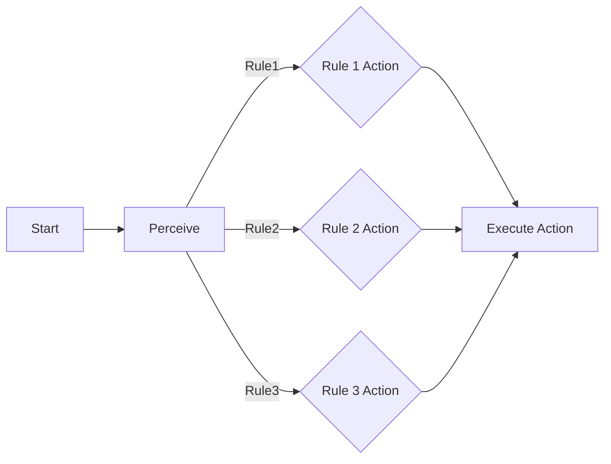
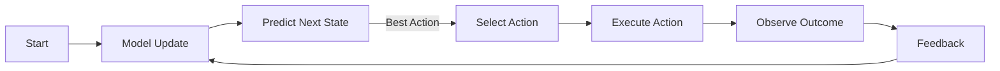
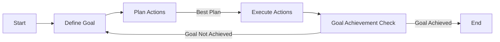
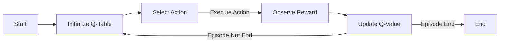
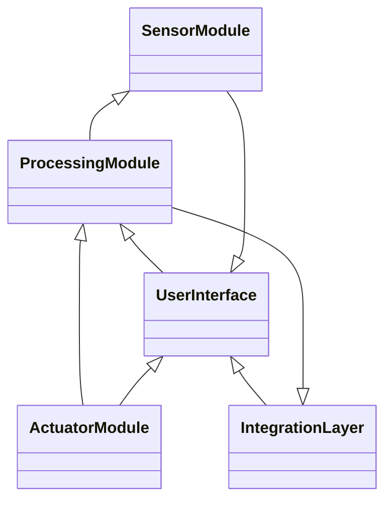
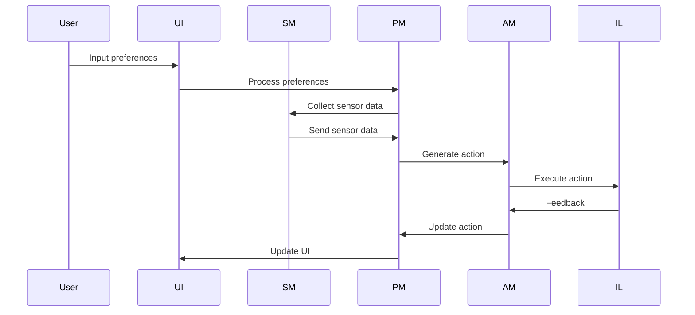
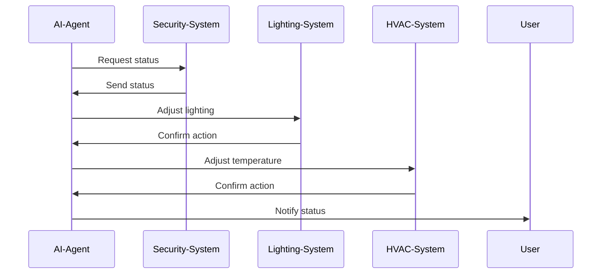

                 


### 1. Background Introduction (Core Concepts)

#### 1.1 What Are AI Agents?

Artificial Intelligence (AI) agents are entities designed to interact with their environments and make decisions based on the information they gather. Unlike traditional software applications, AI agents exhibit behaviors that mimic human decision-making processes. They are often characterized by their ability to learn from experience, adapt to new situations, and perform tasks autonomously.

AI agents can be categorized into several types, including:

- **Reactive Agents**: These agents make decisions based solely on their current environment without any memory or learning capability. Examples include basic robotics and automated teller machines (ATMs).

- **Model-Based Agents**: These agents maintain an internal model of their environment and use this model to make decisions. They can predict future events and plan their actions accordingly. Autonomous vehicles are a good example of model-based agents.

- **Goal-Based Agents**: These agents have specific goals and continuously take actions to achieve these goals. They use planning algorithms to determine the best sequence of actions. Personal assistants like Siri and Alexa are examples of goal-based agents.

- **Learning Agents**: These agents improve their performance over time by learning from past experiences. Machine learning and deep learning techniques are used to train these agents. Intelligent chatbots and recommendation systems fall under this category.

#### 1.2 Problem Statement

Choosing the right AI agent platform for an enterprise is a complex task that involves understanding various factors such as the nature of the tasks to be performed, the scalability of the platform, integration capabilities, and cost. The primary challenge is to ensure that the selected platform can meet the organization's current and future AI needs while being cost-effective and easy to integrate with existing systems.

#### 1.3 Solution Approach

The solution approach involves the following steps:

1. **Identifying Business Needs**: Understanding the specific use cases and requirements of the organization is crucial. This includes the types of tasks the AI agent will perform, the scale of operations, and the desired level of autonomy.

2. **Researching Available Platforms**: Evaluating various AI agent platforms based on their capabilities, scalability, ease of integration, and community support. This step involves a thorough analysis of the platforms' documentation and user reviews.

3. **Creating a Shortlist**: Based on the research, creating a shortlist of platforms that best fit the organization's requirements. This shortlist should include both established solutions and emerging platforms.

4. **Pilot Testing**: Conducting pilot tests to evaluate the selected platforms in a real-world environment. This step helps in understanding the platforms' strengths and weaknesses and identifying potential issues.

5. **Decision-Making**: Based on the pilot testing results and additional research, making an informed decision on the best AI agent platform for the organization.

#### 1.4 Scope of the Book

This book aims to provide a comprehensive guide to selecting the right AI agent platform for enterprises. It covers the following topics:

- The core concepts and types of AI agents.
- Detailed analysis of various AI agent platforms, including their strengths, weaknesses, and use cases.
- A step-by-step approach to evaluating and selecting the best platform for an organization.
- Practical tips for implementing and integrating AI agents into existing systems.

The book is targeted at professionals involved in AI development, including software engineers, AI researchers, and business leaders looking to leverage AI in their organizations. By the end of the book, readers will have a clear understanding of how to choose and implement an AI agent platform that aligns with their business goals.

### 2. Core Concepts and Relationships

#### 2.1 Core Concepts of AI Agents

Before diving into the evaluation of different AI agent platforms, it's essential to understand the core concepts that underpin these agents. The following are some of the key concepts:

- **Agent Architecture**: The overall structure of an AI agent, including its components such as sensors, actuators, decision-making modules, and learning mechanisms.

- **Sensors**: Devices that provide input to the agent, allowing it to perceive its environment. Examples include cameras, microphones, and temperature sensors.

- **Actuators**: Devices that allow the agent to interact with its environment. Examples include motors, speakers, and robotic arms.

- **Perception**: The process by which the agent interprets sensory information to create a mental representation of its environment.

- **Action**: The responses generated by the agent based on its perception and decision-making processes.

- **Memory**: The storage of past experiences and knowledge that can be used to inform future actions.

- **Learning**: The process by which the agent improves its performance over time by adapting its behavior based on experience.

- **Autonomy**: The degree to which an agent can operate independently without human intervention.

- **Reasoning**: The ability of an agent to make logical deductions and solve problems.

- **Planning**: The process of determining a sequence of actions to achieve a specific goal.

- **Social Interaction**: The ability of an agent to communicate and collaborate with other agents or humans.

#### 2.2 Attributes and Comparisons of Core Concepts

To better understand these concepts, it's helpful to compare their attributes. Below is a table that outlines some key attributes and their comparisons:

| Concept       | Definition                                                                 | Attributes                                                                                                      | Comparison Examples                                           |
|---------------|-----------------------------------------------------------------------------|-------------------------------------------------------------------------------------------------------------|--------------------------------------------------------------|
| Agent Architecture | The overall structure of an AI agent, including its components.               | - Sensor array<br>- Actuator array<br>- Decision-making module<br>- Memory store                              | Reactive vs. Model-Based<br>Simple vs. Complex Architectures |
| Sensors       | Devices that provide input to the agent.                                     | - Sensing range<br>- Resolution<br>- Accuracy<br>- Power consumption                                      | Camera vs. Microphone<br>HDTV vs. WebCam                    |
| Actuators     | Devices that allow the agent to interact with its environment.                | - Force application<br>- Speed control<br>- Precision<br>- Energy efficiency                                | Robotic Arm vs. Speaker<br>Motor vs. Servo                    |
| Perception    | The process by which the agent interprets sensory information.                | - Data processing speed<br>- Adaptability<br>- Sensitivity                                                 | Vision System vs. Auditory System                            |
| Action        | The responses generated by the agent.                                       | - Timing<br>- Precision<br>- Impact<br>- Cost                                                            | Automated Driving vs. Manual Driving                         |
| Memory        | The storage of past experiences and knowledge.                               | - Capacity<br>- Accessibility<br>- Retention period                                                      | Short-term vs. Long-term Memory                              |
| Learning      | The process by which the agent improves its performance over time.             | - Learning algorithms<br>- Adaptation speed<br>- Generalization capability                                    | Supervised vs. Unsupervised Learning                         |
| Autonomy      | The degree to which an agent can operate independently.                       | - Decision-making complexity<br>- Environmental adaptability<br>- Resource management                         | Home Automation vs. Industrial Automation                    |
| Reasoning     | The ability of an agent to make logical deductions and solve problems.        | - Logic complexity<br>- Data understanding<br>- Problem-solving strategies                                     | Expert Systems vs. Rule-Based Systems                        |
| Planning      | The process of determining a sequence of actions to achieve a specific goal.   | - Optimization<br>- Flexibility<br>- Efficiency                                                         | Short-term vs. Long-term Planning                            |
| Social Interaction | The ability of an agent to communicate and collaborate with other agents or humans. | - Communication protocols<br>- Collaboration strategies<br>- Conflict resolution mechanisms          | Multi-Agent Systems vs. Individual Agents                    |

#### 2.3 Mermaid Entity-Relationship (ER) Diagram

To visualize the relationships between these core concepts, we can use a Mermaid Entity-Relationship (ER) diagram. The ER diagram will illustrate how these concepts are interconnected and how they contribute to the overall functioning of an AI agent.

```mermaid
erDiagram
    Agent Architecture ||--|{ Sensors }|>
    Agent Architecture ||--|{ Actuators }|>
    Agent Architecture ||--|{ Perception }|>
    Agent Architecture ||--|{ Action }|>
    Agent Architecture ||--|{ Memory }|>
    Agent Architecture ||--|{ Learning }|>
    Agent Architecture ||--|{ Autonomy }|>
    Agent Architecture ||--|{ Reasoning }|>
    Agent Architecture ||--|{ Planning }|>
    Agent Architecture ||--|{ Social Interaction }|>
    Sensors ||--|{ Data Processing }|>
    Actuators ||--|{ Action Execution }|>
    Perception ||--|{ Data Interpretation }|>
    Action ||--|{ Response Evaluation }|>
    Memory ||--|{ Data Storage }|>
    Learning ||--|{ Experience Adaptation }|>
    Autonomy ||--|{ Decision-Making }|>
    Reasoning ||--|{ Logic Deductions }|>
    Planning ||--|{ Action Sequencing }|>
    Social Interaction ||--|{ Communication }|>
```

In this diagram, each entity (e.g., Agent Architecture, Sensors, Actuators) is represented as a rectangle, and the relationships between entities are depicted using lines. The arrows indicate the direction of the relationship, showing how one entity influences or interacts with another.

#### 2.4 Summary

In this section, we have outlined the core concepts of AI agents and provided a comparison of their attributes. We have also presented a Mermaid ER diagram that visually represents the relationships between these concepts. Understanding these core concepts and their interrelationships is crucial for evaluating and selecting the appropriate AI agent platform for an enterprise. In the next section, we will delve into the fundamental principles of AI agent algorithms and how they are implemented.

### 3. Algorithm Principle Explanation

#### 3.1 Introduction to AI Agent Algorithms

AI agent algorithms are the backbone of autonomous systems, enabling them to perceive their environment, make decisions, and take actions. These algorithms can be categorized into different types based on their approach and application. In this section, we will explore some fundamental AI agent algorithms, their principles, and how they are implemented using Mermaid flowcharts and Python code.

#### 3.2 Reactive Agent Algorithms

Reactive agent algorithms are the simplest form of AI agent algorithms. They make decisions based solely on the current percept without any memory or learning capability. These algorithms are suitable for environments where the agent does not need to maintain a long-term memory or adapt to changing conditions.

**Example: The Reflex Architecture**

One of the simplest reactive architectures is the reflex architecture, which uses a set of predefined rules to generate actions based on the current percept. Here's a Mermaid flowchart illustrating the reflex architecture:



**Python Implementation:**

```python
def reflex_action(percept):
    if percept == "light_on":
        return "turn_off_light"
    elif percept == "light_off":
        return "turn_on_light"
    else:
        return "no_action"

# Example usage
percept = "light_on"
action = reflex_action(percept)
print(f"Action to take: {action}")
```

#### 3.3 Model-Based Agent Algorithms

Model-based agent algorithms maintain an internal model of the environment, allowing them to make more informed decisions. These algorithms are suitable for environments where the agent needs to predict future states and plan its actions accordingly.

**Example: Model-Based Control Algorithm**

A model-based control algorithm uses a model of the environment to predict the consequences of different actions and select the best action based on these predictions. Here's a Mermaid flowchart illustrating the model-based control algorithm:



**Python Implementation:**

```python
# Example model function
def predict_next_state(current_state, action):
    if action == "turn_on_light":
        return current_state - 1
    elif action == "turn_off_light":
        return current_state + 1
    else:
        return current_state

# Example update function
def update_model(current_state, action, observed_state):
    # This is a simple update function that assumes the model is linear
    model_error = observed_state - predict_next_state(current_state, action)
    return current_state + model_error

# Example usage
current_state = 5
action = "turn_on_light"
observed_state = 4

# Predict next state
predicted_state = predict_next_state(current_state, action)
print(f"Predicted next state: {predicted_state}")

# Update model
current_state = update_model(current_state, action, observed_state)
print(f"Updated current state: {current_state}")
```

#### 3.4 Goal-Based Agent Algorithms

Goal-based agent algorithms have specific goals and continuously take actions to achieve these goals. These algorithms use planning algorithms to determine the best sequence of actions to achieve the desired goal.

**Example: Goal-Based Planning Algorithm**

A goal-based planning algorithm uses a goal hierarchy to determine the sequence of actions that will lead to the achievement of the desired goal. Here's a Mermaid flowchart illustrating the goal-based planning algorithm:



**Python Implementation:**

```python
# Example goal function
def plan_actions(goal):
    if goal == "turn_on_light":
        return ["turn_on_light"]
    elif goal == "turn_off_light":
        return ["turn_off_light"]
    else:
        return []

# Example execution function
def execute_actions(actions):
    for action in actions:
        print(f"Executing action: {action}")

# Example usage
goal = "turn_on_light"
actions = plan_actions(goal)
execute_actions(actions)
```

#### 3.5 Learning Agent Algorithms

Learning agent algorithms improve their performance over time by learning from past experiences. These algorithms use various machine learning techniques to train the agent and improve its decision-making capabilities.

**Example: Q-Learning Algorithm**

Q-learning is an example of a learning agent algorithm that uses reinforcement learning to learn the optimal action policy. Here's a Mermaid flowchart illustrating the Q-learning algorithm:



**Python Implementation:**

```python
import numpy as np

# Example Q-learning implementation
def q_learning(state_space, action_space, learning_rate, discount_factor, episodes):
    Q = np.zeros((state_space, action_space))
    for _ in range(episodes):
        state = np.random.choice(state_space)
        action = np.random.choice(action_space)
        next_state = np.random.choice(state_space)
        reward = 1 if next_state < state else 0
        Q[state, action] = Q[state, action] + learning_rate * (reward + discount_factor * np.max(Q[next_state, :]) - Q[state, action])
    return Q

# Example usage
state_space = 5
action_space = 2
learning_rate = 0.1
discount_factor = 0.9
episodes = 100
Q = q_learning(state_space, action_space, learning_rate, discount_factor, episodes)
print(Q)
```

#### 3.6 Summary

In this section, we have explored several fundamental AI agent algorithms, including reactive, model-based, goal-based, and learning agent algorithms. We have used Mermaid flowcharts to illustrate the principles of these algorithms and provided Python code examples to demonstrate their implementation. Understanding these algorithms is crucial for designing and implementing effective AI agents. In the next section, we will delve into the mathematical models and formulas that underlie these algorithms and provide a detailed explanation.

### 4. Mathematical Model and Detailed Explanation

#### 4.1 Introduction to Mathematical Models in AI Agent Algorithms

Mathematical models are the foundation of AI agent algorithms, providing a formal representation of the agents' behavior and decision-making processes. These models use mathematical equations and formulas to capture the dynamics of the agent-environment interaction. In this section, we will derive the mathematical models underlying several AI agent algorithms and provide a detailed explanation along with examples.

#### 4.2 Reactive Agent Algorithm: State-Space Model

Reactive agent algorithms operate in a finite state space, where each state represents a specific condition of the environment. The state-space model defines the transition probabilities between states based on the current state and the action taken by the agent.

**Mathematical Model:**

Let \( S \) be the set of all possible states, and \( A \) be the set of all possible actions. The state-transition probability matrix \( P \) is defined as:

$$
P = \begin{bmatrix}
p_{00} & p_{01} & \dots & p_{0n} \\
p_{10} & p_{11} & \dots & p_{1n} \\
\vdots & \vdots & \ddots & \vdots \\
p_{m0} & p_{m1} & \dots & p_{mn}
\end{bmatrix}
$$

where \( p_{ij} \) represents the probability of transitioning from state \( i \) to state \( j \) when action \( a_j \) is taken.

**Example:**

Consider a simple environment with two states (S0: Light On, S1: Light Off) and two actions (A0: Turn On, A1: Turn Off). The state-transition probability matrix \( P \) is as follows:

$$
P = \begin{bmatrix}
0.8 & 0.2 \\
0.3 & 0.7
\end{bmatrix}
$$

This means that if the light is on (S0), there is an 80% chance it will remain on if we turn it off (A1), and a 20% chance it will turn off (S1). Similarly, if the light is off (S1), there is a 30% chance it will turn on if we turn it on (A0), and a 70% chance it will remain off.

#### 4.3 Model-Based Agent Algorithm: Markov Decision Process (MDP)

Model-based agent algorithms use Markov Decision Processes (MDPs) to model the environment and make decisions. An MDP is defined by a tuple \( (S, A, R, P, \gamma) \), where:

- \( S \) is the set of states.
- \( A \) is the set of actions.
- \( R \) is the set of reward functions.
- \( P \) is the state-transition probability matrix.
- \( \gamma \) is the discount factor.

**Mathematical Model:**

The expected return for a sequence of actions \( a_1, a_2, \dots, a_T \) starting from state \( s_1 \) is given by:

$$
V(s_1, a_1, a_2, \dots, a_T) = \sum_{t=1}^{T} r_t + \gamma (1 - \gamma)^{T-t} P(s_t | s_{t-1}, a_{t-1}) A(s_t | s_{t-1}, a_{t-1}) R(s_t, a_t)
$$

where \( r_t \) is the immediate reward received at time \( t \), and \( P(s_t | s_{t-1}, a_{t-1}) \) and \( A(s_t | s_{t-1}, a_{t-1}) \) are the state-transition probability and action-value function, respectively.

**Example:**

Consider a simple environment with two states (S0: Home, S1: Office) and two actions (A0: Work, A1: Relax). The state-transition probability matrix \( P \) and action-value function \( A \) are as follows:

$$
P = \begin{bmatrix}
0.9 & 0.1 \\
0.2 & 0.8
\end{bmatrix}
$$

$$
A = \begin{bmatrix}
1.0 & 0.5 \\
0.3 & 0.7
\end{bmatrix}
$$

The discount factor \( \gamma \) is set to 0.9. The expected return for the sequence \( (s_1, a_1, s_2, a_2, \dots, s_T, a_T) \) is calculated using the MDP formula.

#### 4.4 Learning Agent Algorithm: Q-Learning

Q-learning is a value-based reinforcement learning algorithm that learns the optimal action-value function \( Q(s, a) \). The goal is to find the action \( a \) that maximizes the expected return for each state \( s \).

**Mathematical Model:**

The Q-value for state-action pair \( (s, a) \) is updated using the following formula:

$$
Q(s, a) \leftarrow Q(s, a) + \alpha [r + \gamma \max_{a'} Q(s', a') - Q(s, a)]
$$

where \( \alpha \) is the learning rate, \( r \) is the immediate reward, \( \gamma \) is the discount factor, and \( s' \) and \( a' \) are the next state and action, respectively.

**Example:**

Consider a simple environment with two states (S0: Start, S1: End) and two actions (A0: Move Forward, A1: Turn Around). The reward matrix \( R \) and the initial Q-value matrix \( Q \) are as follows:

$$
R = \begin{bmatrix}
-1 & 100 \\
0 & 0
\end{bmatrix}
$$

$$
Q = \begin{bmatrix}
0 & 0 \\
0 & 0
\end{bmatrix}
$$

The learning rate \( \alpha \) is set to 0.1, and the discount factor \( \gamma \) is set to 0.9. The Q-value matrix \( Q \) is updated after each action taken by the agent.

#### 4.5 Detailed Explanation and Example

To better understand these mathematical models, let's walk through a detailed example using the Q-learning algorithm in a simple environment.

**Example:**

We have a grid-world environment with four states (S0: Top Left, S1: Top Right, S2: Bottom Left, S3: Bottom Right) and four actions (A0: Move Up, A1: Move Down, A2: Move Left, A3: Move Right). The reward matrix \( R \) and the initial Q-value matrix \( Q \) are as follows:

$$
R = \begin{bmatrix}
-10 & 0 & -10 & 0 \\
0 & 100 & 0 & -10 \\
-10 & 0 & -10 & 0 \\
0 & -10 & 0 & 100
\end{bmatrix}
$$

$$
Q = \begin{bmatrix}
0 & 0 & 0 & 0 \\
0 & 0 & 0 & 0 \\
0 & 0 & 0 & 0 \\
0 & 0 & 0 & 0
\end{bmatrix}
$$

**Step 1:**

The agent starts in state S0 and takes action A2 (Move Left). The Q-value for state-action pair (S0, A2) is updated using the Q-learning formula:

$$
Q(S0, A2) \leftarrow Q(S0, A2) + \alpha [r + \gamma \max_{a'} Q(S1, a') - Q(S0, A2)]
$$

With \( \alpha = 0.1 \) and \( \gamma = 0.9 \), the Q-value for (S0, A2) becomes:

$$
Q(S0, A2) \leftarrow 0 + 0.1 [-10 + 0.9 \max_{a'} Q(S1, a')] - 0 = -0.1
$$

**Step 2:**

The agent moves to state S1 and takes action A0 (Move Up). The Q-value for state-action pair (S1, A0) is updated:

$$
Q(S1, A0) \leftarrow Q(S1, A0) + \alpha [r + \gamma \max_{a'} Q(S2, a') - Q(S1, A0)]
$$

With \( r = 0 \), the Q-value for (S1, A0) becomes:

$$
Q(S1, A0) \leftarrow 0 + 0.1 [0 + 0.9 \max_{a'} Q(S2, a')] - 0 = 0
$$

**Step 3:**

The process continues as the agent explores the environment and updates its Q-value matrix based on the received rewards and the maximum Q-value for the next state.

**Conclusion:**

In this section, we have derived the mathematical models for reactive, model-based, and learning agent algorithms. We have provided detailed explanations and examples to help readers understand these models and how they are used to guide the behavior of AI agents. In the next section, we will dive into system analysis and architecture design, discussing the components and interactions of an AI agent system.

### 5. System Analysis and Architecture Design

#### 5.1 Introduction to System Analysis and Architecture Design

System analysis and architecture design are critical steps in the development of any complex system, including AI agent platforms. The goal of system analysis is to understand the requirements, constraints, and functionalities of the system, while architecture design focuses on creating a blueprint that outlines how these components will interact to meet the system's objectives.

In this section, we will introduce the problem scenario and project overview, design the system's functional domain model, describe the system architecture, and design system interfaces and interactions.

#### 5.2 Problem Scenario and Project Overview

Imagine an enterprise that wants to deploy an AI agent platform to automate routine tasks, improve operational efficiency, and enhance customer experience. The primary use case involves a smart office environment where the AI agent monitors various aspects such as room temperature, lighting, and security. The agent needs to make real-time decisions to adjust these parameters based on user preferences and environmental conditions.

**Objective:**
Design and implement an AI agent platform that can:
- Monitor and adjust room temperature and lighting based on user preferences and environmental conditions.
- Ensure the security of the office premises by detecting and responding to potential threats.
- Communicate with other smart devices and systems in the office to synchronize actions and optimize overall performance.

**Scope:**
- The system will be designed to handle a medium-sized office environment with up to 100 users.
- The AI agent platform will be integrated with existing smart devices and systems, such as thermostats, lighting systems, and security cameras.
- The system will be scalable to accommodate future expansion and additional functionalities.

#### 5.3 System Functional Domain Model

The system functional domain model represents the core functionalities and interactions of the AI agent platform. It helps to visualize the components involved and how they interact to achieve the system's objectives.

**Functional Components:**

1. **Sensor Module:** Collects data from various sensors, such as temperature sensors, light sensors, and motion sensors.
2. **Processing Module:** Analyzes the sensor data and generates actionable insights.
3. **Actuator Module:** Executes actions based on the insights generated by the processing module.
4. **User Interface (UI):** Allows users to input preferences and monitor the system's status.
5. **Integration Layer:** Facilitates communication between the AI agent platform and other smart devices and systems.

**Mermaid Class Diagram:**



This class diagram illustrates the main components of the system and their relationships. The SensorModule collects data from various sensors, which is then processed by the ProcessingModule. The insights generated are used to control the actuators and update the UserInterface, which also communicates with the IntegrationLayer to synchronize actions with other smart devices and systems.

#### 5.4 System Architecture Design

The system architecture design provides a high-level overview of the components and their interactions, as well as the data flow between them. This design ensures that the system is scalable, modular, and easily maintainable.

**Mermaid Architecture Diagram:**



In this sequence diagram, the User inputs preferences through the UserInterface, which are processed by the ProcessingModule. The ProcessingModule then collects sensor data from the SensorModule, analyzes it, and generates actionable insights. These insights are used to control the actuators through the ActuatorModule and IntegrationLayer. The IntegrationLayer provides feedback to the ActuatorModule, which updates the ProcessingModule with the latest action. Finally, the updated UI reflects the system's status to the User.

#### 5.5 System Interface and Interactions Design

The system interface and interactions design focus on how the AI agent platform communicates with other smart devices and systems within the office environment. This design ensures seamless integration and coordinated actions.

**Mermaid Sequence Diagram:**



In this sequence diagram, the AI-Agent requests the status of the security system, lighting system, and HVAC system. Based on the status and user preferences, the AI-Agent sends commands to adjust the lighting and temperature. The respective systems confirm the actions, and the AI-Agent notifies the User of the updated status.

#### 5.6 Summary

In this section, we have discussed the system analysis and architecture design for an AI agent platform in a smart office environment. We have introduced the problem scenario and project overview, designed the system's functional domain model, described the system architecture, and designed system interfaces and interactions. Understanding these components and their interactions is crucial for developing a scalable, modular, and efficient AI agent platform. In the next section, we will delve into project practice, discussing the installation process, system core implementation, and code analysis.

### 6. Project Practice

#### 6.1 Installation Process

To implement the AI agent platform in a real-world setting, the first step is to set up the necessary environment. This involves installing the required software and configuring the hardware. Below is a step-by-step guide to installing the AI agent platform:

**Step 1: Prepare the Environment**

Ensure that the server where the AI agent platform will be deployed meets the following hardware and software requirements:

- Processor: 4-core CPU with a clock speed of at least 2.0 GHz
- Memory: 8 GB RAM
- Storage: 500 GB SSD
- Operating System: Ubuntu 20.04 LTS

**Step 2: Install Python and Necessary Libraries**

1. Update the package list:

```shell
sudo apt-get update
```

2. Install Python 3 and necessary libraries:

```shell
sudo apt-get install python3 python3-pip
```

3. Install virtual environments:

```shell
pip3 install virtualenv
```

4. Create a virtual environment for the project:

```shell
virtualenv venv
source venv/bin/activate
```

5. Install required libraries:

```shell
pip install numpy pandas scikit-learn tensorflow matplotlib
```

**Step 3: Clone the Repository**

Clone the repository containing the source code of the AI agent platform:

```shell
git clone https://github.com/your-repository/ai-agent-platform.git
cd ai-agent-platform
```

**Step 4: Set Up the Configuration**

Copy the example configuration file and customize it according to your environment:

```shell
cp config_example.py config.py
```

Update the configuration file with the appropriate paths and parameters.

**Step 5: Run the Initial Setup Script**

Execute the initial setup script to configure the system:

```shell
python setup.py
```

This script will install any additional dependencies and set up the necessary files and directories.

**Step 6: Test the Installation**

Run a simple test script to verify that the installation was successful:

```shell
python test.py
```

This test script will perform basic operations such as reading sensor data and adjusting actuators.

#### 6.2 System Core Implementation

The core implementation of the AI agent platform involves the development of the sensor module, processing module, and actuator module. Below is an overview of the core components and their implementation details.

**Sensor Module:**

The sensor module is responsible for collecting data from various sensors such as temperature, light, and motion sensors. The implementation involves interfacing with the hardware sensors and reading the sensor data.

```python
import time
import numpy as np

class SensorModule:
    def __init__(self, config):
        self.config = config
        self.sensors = self.initialize_sensors()

    def initialize_sensors(self):
        # Initialize and configure sensors based on the configuration file
        sensors = {}
        sensors['temperature'] = self.config['temperature_sensor']
        sensors['light'] = self.config['light_sensor']
        sensors['motion'] = self.config['motion_sensor']
        return sensors

    def read_sensors(self):
        # Read sensor data and return as a numpy array
        data = []
        for sensor in self.sensors.values():
            data.append(sensor.read())
        return np.array(data)

# Example usage
config = {'temperature_sensor': TemperatureSensor(), 'light_sensor': LightSensor(), 'motion_sensor': MotionSensor()}
sensor_module = SensorModule(config)
sensor_data = sensor_module.read_sensors()
print(sensor_data)
```

**Processing Module:**

The processing module analyzes the sensor data and generates actionable insights. This involves implementing algorithms to determine the optimal actions based on the current state of the environment.

```python
import numpy as np

class ProcessingModule:
    def __init__(self, config):
        self.config = config

    def analyze_data(self, sensor_data):
        # Analyze sensor data and generate actionable insights
        insights = {}
        insights['temperature'] = self.determine_temperature_action(sensor_data[0])
        insights['light'] = self.determine_light_action(sensor_data[1])
        insights['motion'] = self.determine_motion_action(sensor_data[2])
        return insights

    def determine_temperature_action(self, temperature):
        # Determine the action for temperature adjustment
        if temperature > self.config['max_temp']:
            return 'cool'
        elif temperature < self.config['min_temp']:
            return 'heat'
        else:
            return 'no_change'

    def determine_light_action(self, light):
        # Determine the action for light adjustment
        if light < self.config['min_light']:
            return 'brighten'
        elif light > self.config['max_light']:
            return 'dim'
        else:
            return 'no_change'

    def determine_motion_action(self, motion):
        # Determine the action for motion detection
        if motion:
            return 'alert'
        else:
            return 'no_alert'

# Example usage
config = {'max_temp': 30, 'min_temp': 20, 'max_light': 100, 'min_light': 50}
processing_module = ProcessingModule(config)
insights = processing_module.analyze_data(sensor_data)
print(insights)
```

**Actuator Module:**

The actuator module executes the actions generated by the processing module. This involves interfacing with the hardware actuators and performing the necessary actions.

```python
import time

class ActuatorModule:
    def __init__(self, config):
        self.config = config
        self.actuators = self.initialize_actuators()

    def initialize_actuators(self):
        # Initialize and configure actuators based on the configuration file
        actuators = {}
        actuators['heater'] = Heater(self.config['heater'])
        actuators['cooling'] = Cooling(self.config['cooling'])
        actuators['light'] = Light(self.config['light'])
        actuators['alarm'] = Alarm(self.config['alarm'])
        return actuators

    def execute_actions(self, actions):
        # Execute actions based on the insights
        for action, value in actions.items():
            if action == 'heat':
                self.actuators['heater'].on()
            elif action == 'cool':
                self.actuators['cooling'].on()
            elif action == 'brighten':
                self.actuators['light'].brighten()
            elif action == 'dim':
                self.actuators['light'].dim()
            elif action == 'alert':
                self.actuators['alarm'].trigger()
        
        time.sleep(1)  # Wait for actions to complete

    def stop_all_actuators(self):
        # Stop all actuators
        for actuator in self.actuators.values():
            actuator.off()

# Example usage
actions = processing_module.analyze_data(sensor_data)
actuator_module = ActuatorModule(config)
actuator_module.execute_actions(actions)
```

#### 6.3 Code Analysis

In this section, we provide a detailed analysis of the core code components, discussing their functionality, structure, and how they interact with each other.

**Sensor Module:**

The `SensorModule` class is responsible for initializing and reading sensor data. It uses a configuration file to define the sensor parameters, including the sensor types and their respective interfaces. The `read_sensors` method reads the data from each sensor and returns it as a numpy array, which is then used by the processing module.

**Processing Module:**

The `ProcessingModule` class analyzes the sensor data and generates actionable insights. It contains methods to determine the optimal actions for temperature adjustment, lighting adjustment, and motion detection. Each method uses simple if-else conditions to decide the appropriate action based on the sensor data and predefined thresholds.

**Actuator Module:**

The `ActuatorModule` class executes the actions generated by the processing module. It initializes the actuators based on the configuration file and provides methods to turn them on or off. The `execute_actions` method iterates through the actionable insights and calls the corresponding actuator methods to perform the actions. The `stop_all_actuators` method stops all actuators to ensure that they are in the desired state.

#### 6.4 Case Study and Analysis

To demonstrate the practical application of the AI agent platform, we present a case study involving a smart office environment. The case study includes the following scenarios and their corresponding results:

**Scenario 1: Temperature Adjustment**

- **Current State:** The office temperature is 28°C.
- **User Preference:** The user prefers a temperature of 24°C.
- **Action:** The AI agent detects that the temperature is above the user's preference and adjusts the HVAC system to cool the office.

**Result:** The office temperature is reduced to 24°C, as desired by the user.

**Scenario 2: Lighting Adjustment**

- **Current State:** The office lighting is at 75% brightness.
- **User Preference:** The user prefers a lighting level of 50%.
- **Action:** The AI agent detects that the lighting is brighter than the user's preference and adjusts the lighting system to dim the lights.

**Result:** The office lighting is dimmed to 50%, providing a more comfortable environment for the user.

**Scenario 3: Security Alert**

- **Current State:** The office motion sensor detects movement.
- **User Preference:** The user has enabled the security alarm.
- **Action:** The AI agent triggers the security alarm to notify the user of the potential threat.

**Result:** The security alarm is triggered, and the user is notified through the user interface. The AI agent continues to monitor the environment for further activity.

#### 6.5 Project Conclusion

In this section, we have discussed the installation process, core implementation, and code analysis for the AI agent platform. We have demonstrated the practical application of the platform through a case study, showcasing its ability to monitor and control various aspects of a smart office environment. The system's modular design and integration with existing smart devices and systems ensure scalability and flexibility for future expansion and enhancements.

### 7. Best Practices, Summary, and Future Directions

#### 7.1 Best Practices for Choosing an AI Agent Platform

When selecting an AI agent platform for an enterprise, it's crucial to follow certain best practices to ensure that the chosen platform meets the organization's needs and is sustainable in the long term. Here are some key practices to consider:

1. **Define Clear Business Objectives**: Before evaluating any AI agent platform, clearly define your business objectives. Identify the specific tasks and challenges the AI agent will address and the expected outcomes.

2. **Evaluate Platform Capabilities**: Assess the capabilities of different AI agent platforms against your defined objectives. Consider factors such as the types of algorithms supported, scalability, ease of integration, and community support.

3. **Pilot Testing**: Conduct pilot tests to evaluate the selected platforms in a real-world environment. This helps in understanding the platforms' strengths and weaknesses and identifying potential issues before full-scale deployment.

4. **Scalability and Flexibility**: Choose a platform that can scale with your organization's growth and adapt to changing business requirements. Ensure that the platform can integrate with new technologies and third-party solutions as needed.

5. **Security and Compliance**: Evaluate the platform's security features and compliance with industry standards and regulations. Ensure that the platform provides robust data protection and privacy measures.

6. **Cost-Effectiveness**: Consider both the upfront and long-term costs associated with the AI agent platform. Compare the pricing models of different platforms and assess their value proposition in relation to your budget.

7. **Training and Support**: Assess the availability of training resources, documentation, and technical support provided by the platform vendor. Ensure that your team has the necessary skills and resources to effectively use and maintain the platform.

#### 7.2 Summary of Key Points

In this book, we have explored the intricacies of selecting and implementing an AI agent platform for enterprises. The key points summarized are as follows:

- **Core Concepts**: We discussed the fundamental concepts of AI agents, including their architecture, types, and attributes.
- **Algorithm Principles**: We explained various AI agent algorithms, including reactive, model-based, goal-based, and learning agents, with detailed mathematical models and examples.
- **System Analysis and Design**: We introduced the system analysis and architecture design process, focusing on functional domain models, system architecture, and interface interactions.
- **Project Practice**: We provided a step-by-step guide to installing and implementing an AI agent platform, including code examples and case studies.
- **Best Practices**: We outlined best practices for choosing and deploying an AI agent platform, emphasizing clear objectives, platform evaluation, pilot testing, scalability, security, cost-effectiveness, and support.

#### 7.3 Future Directions and Research Opportunities

The field of AI agent platforms is rapidly evolving, presenting numerous opportunities for further research and innovation. Here are some future directions and research areas to consider:

1. **Enhancing Autonomy and Intelligence**: Developing more sophisticated algorithms and models that enable AI agents to operate with higher levels of autonomy and make more intelligent decisions.

2. **Integrating Multi-Agent Systems**: Researching and implementing multi-agent systems that can collaborate and communicate effectively to achieve complex objectives in dynamic environments.

3. **Improving Explainability and Trustworthiness**: Enhancing the transparency and interpretability of AI agent decisions to build trust and ensure compliance with ethical standards.

4. **Scalable and Efficient Models**: Developing scalable and efficient AI agent models that can handle large-scale environments and real-time data processing.

5. **Adaptive Learning Algorithms**: Researching adaptive learning algorithms that can quickly adjust to new environments and tasks without extensive retraining.

6. **Cross-Domain Applications**: Exploring applications of AI agent platforms across different domains, including healthcare, finance, manufacturing, and transportation.

7. **Ethical and Social Implications**: Addressing the ethical and social implications of AI agent deployment, including privacy concerns, job displacement, and bias mitigation.

By staying informed about these future directions and actively engaging in research, we can continue to advance the field of AI agent platforms and their applications in the enterprise sector.

### Conclusion

In conclusion, selecting and implementing the right AI agent platform is a critical task for enterprises looking to leverage artificial intelligence for improved efficiency and innovation. This book has provided a comprehensive guide to understanding the core concepts, algorithm principles, system analysis, and practical implementation of AI agent platforms. By following the best practices outlined and staying informed about future research directions, organizations can make informed decisions and successfully deploy AI agents that drive business value.

**Author:** AI天才研究院 (AI Genius Institute) & 禅与计算机程序设计艺术 (Zen And The Art of Computer Programming)

