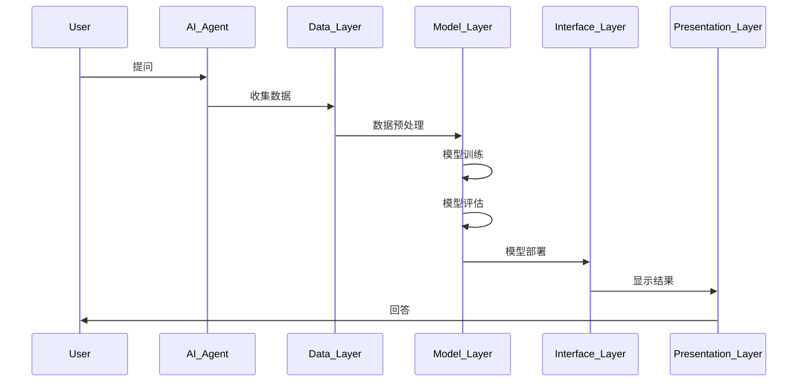

                 

# 选择适合的技术栈：构建高效AI Agent

> 关键词：AI Agent、技术栈、神经网络、深度学习、强化学习、系统分析与架构设计

> 摘要：本文将探讨如何选择适合的技术栈来构建高效AI Agent。我们将首先介绍AI Agent在当今社会的重要性及其发展的挑战与机遇，然后深入解析AI Agent的核心概念和联系，详细讲解神经网络、深度学习和强化学习的算法原理，并结合实际案例进行系统分析与架构设计。最后，我们将总结全文并给出一些最佳实践建议。

### 目录大纲

----------------------------------------------------------------

## 第一部分: 背景介绍

### 第1章: 问题背景与核心概念

#### 1.1 问题背景

#### 1.2 核心概念

#### 1.3 问题解决

#### 1.4 边界与外延

#### 1.5 本章小结

## 第二部分: 核心概念与联系

### 第2章: 核心概念原理

#### 2.1 AI技术原理

#### 2.2 概念属性特征对比

#### 2.3 ER实体关系图架构

#### 2.4 本章小结

## 第三部分: 算法原理讲解

### 第3章: 算法讲解

#### 3.1 算法1：神经网络算法

#### 3.2 算法2：深度学习算法

#### 3.3 算法3：强化学习算法

#### 3.4 本章小结

## 第四部分: 系统分析与架构设计

### 第4章: 系统分析与架构设计

#### 4.1 问题场景介绍

#### 4.2 项目介绍

#### 4.3 系统功能设计

#### 4.4 系统架构设计

#### 4.5 系统接口设计

#### 4.6 系统交互

#### 4.7 本章小结

### 第五部分: 项目实战

#### 4.8 环境安装

#### 4.9 系统核心实现

#### 4.10 代码应用解读与分析

#### 4.11 实际案例分析与讲解

#### 4.12 项目小结

#### 4.13 最佳实践 tips

#### 4.14 小结

#### 4.15 注意事项

#### 4.16 拓展阅读

----------------------------------------------------------------

## 第1章: 问题背景与核心概念

### 1.1 问题背景

在当今的信息化时代，人工智能（AI）已经成为推动社会进步的重要力量。AI Agent作为人工智能的一个重要分支，以其自主决策、学习与适应的能力，在智能客服、智能驾驶、智能家居等多个领域展现出广阔的应用前景。然而，构建一个高效、可靠的AI Agent并非易事，需要选择合适的技术栈、理解核心概念，并进行系统分析与架构设计。

AI Agent在当今社会的重要性不言而喻。它们不仅能够提高生产效率，降低人力成本，还能够提升用户体验，优化生活质量。例如，智能客服系统能够24小时在线，快速响应用户需求，提供高质量的服务；智能驾驶系统能够通过实时感知和决策，实现自动驾驶，提高交通安全；智能家居系统能够根据用户习惯自动调整环境，提升居住舒适度。

然而，AI Agent的发展也面临着诸多挑战与机遇。挑战方面，AI Agent需要处理大量数据，具备实时响应和决策能力，同时还要保证系统的高可靠性和安全性。机遇方面，随着计算能力的提升、数据资源的丰富和算法的进步，AI Agent的性能和效果不断提升，应用范围也逐步扩大。

### 1.2 核心概念

在构建高效AI Agent的过程中，理解核心概念至关重要。以下是几个关键概念及其定义：

#### 1.2.1 AI Agent的定义

AI Agent是指能够自主地感知环境、采取行动并实现特定目标的智能体。它们通常具备以下特点：

1. **自主性**：AI Agent能够自主决策，不受人类干预。
2. **学习性**：AI Agent能够从经验中学习，不断优化自己的行为。
3. **适应性**：AI Agent能够适应环境变化，调整自己的策略。

#### 1.2.2 AI Agent的特点

1. **感知能力**：AI Agent能够感知环境，获取外部信息。
2. **决策能力**：AI Agent能够根据感知信息，自主做出决策。
3. **行动能力**：AI Agent能够执行决策，采取行动。
4. **学习能力**：AI Agent能够通过学习，提高决策质量和效率。

#### 1.2.3 AI Agent与人类的区别

1. **速度**：AI Agent的计算速度远超人类，能够快速处理大量数据。
2. **准确性**：AI Agent的决策基于数据分析和算法模型，具有较高的准确性。
3. **连续性**：AI Agent可以全天候工作，不受生理和心理限制。
4. **创造性**：AI Agent在创造性方面无法与人类相比，其决策主要基于现有知识和算法。

### 1.3 问题解决

为了构建高效AI Agent，我们需要解决以下几个关键问题：

#### 1.3.1 构建高效AI Agent的必要性

构建高效AI Agent的必要性体现在以下几个方面：

1. **提高生产效率**：AI Agent能够自动化完成复杂任务，提高生产效率。
2. **降低人力成本**：AI Agent能够替代部分人力工作，降低企业的人力成本。
3. **优化用户体验**：AI Agent能够提供个性化、智能化的服务，提升用户体验。
4. **提升生活质量**：AI Agent能够帮助人们更好地管理家庭和日常生活，提高生活质量。

#### 1.3.2 有效技术栈的选择

有效技术栈的选择对于构建高效AI Agent至关重要。以下是几个关键考虑因素：

1. **算法性能**：选择适合任务需求的算法，如神经网络、深度学习和强化学习。
2. **计算资源**：选择能够在现有计算资源下运行的算法和框架。
3. **数据资源**：选择能够充分利用数据资源的算法和框架。
4. **可扩展性**：选择易于扩展和优化的技术栈，以应对未来需求。

#### 1.3.3 构建高效AI Agent的关键步骤

构建高效AI Agent需要遵循以下关键步骤：

1. **需求分析**：明确AI Agent的目标和应用场景。
2. **数据收集**：收集相关数据，并进行预处理。
3. **算法选择**：根据需求选择合适的算法和框架。
4. **模型训练**：训练模型，优化算法参数。
5. **评估与优化**：评估模型性能，并进行优化。
6. **部署与维护**：将模型部署到生产环境，并进行持续维护。

### 1.4 边界与外延

在构建AI Agent的过程中，还需要关注以下几个边界与外延：

#### 1.4.1 AI Agent的应用领域

AI Agent在多个领域具有广泛应用，包括：

1. **智能客服**：提供24小时在线客服，提升客户满意度。
2. **智能驾驶**：实现自动驾驶，提高交通安全。
3. **智能家居**：实现智能家电控制，提升居住舒适度。
4. **医疗健康**：提供智能诊断和个性化治疗方案。
5. **金融保险**：实现智能理财、风控和保险推荐。

#### 1.4.2 AI Agent的技术范畴

AI Agent涉及多个技术领域，包括：

1. **机器学习**：用于模型训练和预测。
2. **自然语言处理**：用于处理和生成自然语言。
3. **计算机视觉**：用于图像和视频识别。
4. **强化学习**：用于决策和策略优化。
5. **人机交互**：用于提升用户体验。

#### 1.4.3 AI Agent的发展趋势

AI Agent的发展趋势包括：

1. **多模态感知**：结合多种感知技术，提升感知能力。
2. **自适应学习**：根据环境变化，动态调整策略。
3. **安全与隐私**：加强安全性和隐私保护。
4. **跨领域应用**：推动跨领域应用，实现智能化。
5. **人机协作**：实现人与AI Agent的协同工作。

### 1.5 本章小结

本章介绍了AI Agent在当今社会的重要性、核心概念及其特点，以及构建高效AI Agent的必要性、关键步骤和边界与外延。这些内容为后续章节的深入讨论奠定了基础。在接下来的章节中，我们将进一步探讨AI Agent的核心概念、联系以及算法原理，并结合实际案例进行系统分析与架构设计。

----------------------------------------------------------------

## 第2章: 核心概念原理

### 2.1 AI技术原理

AI技术是构建AI Agent的基础，主要包括神经网络、深度学习和强化学习等。

#### 2.1.1 神经网络

神经网络（Neural Networks）是一种模仿生物神经网络的结构和功能的计算模型。它由大量简单的神经元（或节点）组成，通过前向传播和反向传播进行学习和训练。

##### 2.1.1.1 神经网络的基本概念

- **神经元**：神经网络的基本组成单元，类似于生物神经元。
- **层**：神经网络分为输入层、隐藏层和输出层。
- **权重**：神经元之间的连接强度，通过学习调整。
- **激活函数**：用于确定神经元是否被激活，常见的有ReLU、Sigmoid和Tanh等。

##### 2.1.1.2 神经网络的架构

神经网络可以分为全连接神经网络（FCNN）、卷积神经网络（CNN）和循环神经网络（RNN）等。其中，FCNN适用于分类和回归任务，CNN适用于图像处理任务，RNN适用于序列数据处理任务。

##### 2.1.1.3 神经网络的工作原理

神经网络的工作原理主要包括以下步骤：

1. **初始化权重**：随机初始化权重和偏置。
2. **前向传播**：计算输入数据通过神经网络后的输出。
3. **损失函数**：计算输出与真实值之间的差异。
4. **反向传播**：根据损失函数，调整权重和偏置。
5. **迭代训练**：重复上述步骤，直到满足训练目标。

#### 2.1.2 深度学习

深度学习（Deep Learning）是一种基于神经网络的学习方法，通过多层非线性变换，对复杂数据进行建模和预测。

##### 2.1.2.1 深度学习的定义

深度学习是指多层神经网络的学习方法，通过逐层抽象和提取特征，实现复杂的函数拟合和预测。

##### 2.1.2.2 深度学习的发展历程

深度学习的发展历程可以分为以下几个阶段：

1. **早期探索**：1980年代，LeCun等人提出卷积神经网络（CNN）。
2. **复兴时期**：2006年，Hinton提出深度置信网络（DBN），深度学习重新兴起。
3. **突破性进展**：2012年，AlexNet在ImageNet竞赛中取得优异成绩，深度学习迎来爆发期。

##### 2.1.2.3 深度学习的基本原理

深度学习的基本原理包括：

1. **多层非线性变换**：通过多层非线性变换，逐步提取数据特征。
2. **梯度下降**：通过反向传播算法，利用梯度下降优化模型参数。
3. **正则化**：采用正则化方法，防止过拟合。

#### 2.1.3 强化学习

强化学习（Reinforcement Learning）是一种通过试错和反馈机制，学习在特定环境中获得最大收益的算法。

##### 2.1.3.1 强化学习的定义

强化学习是一种通过试错和反馈机制，学习在特定环境中进行决策的算法。

##### 2.1.3.2 强化学习的基本原理

强化学习的基本原理包括：

1. **状态-动作价值函数**：定义状态和动作的价值，指导决策。
2. **策略**：基于价值函数，选择最优动作。
3. **奖励机制**：根据环境反馈，调整策略和学习。

##### 2.1.3.3 强化学习的应用场景

强化学习适用于以下场景：

1. **游戏**：例如围棋、扑克等。
2. **自动驾驶**：决策和路径规划。
3. **推荐系统**：基于用户行为和反馈，推荐商品或内容。
4. **机器人控制**：控制机器人进行自主运动。

### 2.2 概念属性特征对比

为了更好地理解神经网络、深度学习和强化学习，下面通过表格和图示进行对比。

##### 2.2.1 神经网络与深度学习

| 概念 | 神经网络 | 深度学习 |
| --- | --- | --- |
| 定义 | 多层前向神经网络 | 基于神经网络的深层学习模型 |
| 特点 | 简单、易于实现 | 复杂、层次多、抽象能力强 |
| 适用场景 | 分类、回归、特征提取 | 图像识别、语音识别、自然语言处理等 |
| 缺点 | 模型复杂度较低 | 需要大量数据和计算资源 |

##### 2.2.2 深度学习与强化学习

| 概念 | 深度学习 | 强化学习 |
| --- | --- | --- |
| 定义 | 基于神经网络的深层学习模型 | 通过试错和反馈机制学习在特定环境中决策的算法 |
| 特点 | 适用于复杂数据和任务 | 适用于动态和不确定性环境 |
| 适用场景 | 图像识别、语音识别、自然语言处理等 | 游戏、自动驾驶、机器人控制等 |
| 缺点 | 需要大量数据和计算资源 | 难以处理高维状态空间 |

### 2.3 ER实体关系图架构

实体关系图（ER图）是一种用于描述实体及其关系的图形化表示方法，可以帮助我们更好地理解系统中的数据模型和关系。

##### 2.3.1 ER图的基本概念

- **实体**：具有共同特征的对象集合，如用户、订单、商品等。
- **属性**：描述实体的特征，如用户姓名、订单金额等。
- **关系**：描述实体之间的关联，如用户与订单的关系、订单与商品的关系等。

##### 2.3.2 ER图的绘制方法

ER图的绘制方法主要包括以下步骤：

1. **确定实体**：根据业务需求，确定系统中的实体。
2. **确定属性**：为每个实体确定相关的属性。
3. **确定关系**：确定实体之间的关系，并定义关系的类型（一对一、一对多、多对多）。
4. **绘制ER图**：使用图形化工具，将实体、属性和关系绘制成ER图。

##### 2.3.3 ER图的应用场景

ER图适用于以下场景：

1. **数据库设计**：用于描述数据库中的实体及其关系。
2. **系统架构设计**：用于描述系统中的数据模型和关系。
3. **业务分析**：用于梳理业务流程和数据关系。

### 2.4 本章小结

本章介绍了AI技术的基本原理，包括神经网络、深度学习和强化学习，以及ER实体关系图架构。通过本章的学习，我们可以更好地理解AI Agent的核心概念和技术原理，为后续章节的深入讨论打下基础。

----------------------------------------------------------------

## 第3章: 算法讲解

在这一章中，我们将深入探讨神经网络、深度学习和强化学习三种核心算法的原理，并通过具体实例和实际应用案例来展示这些算法的实际效果和作用。

### 3.1 算法1：神经网络算法

神经网络（Neural Networks，简称NN）是一种模仿生物神经系统结构和功能的计算模型，主要用于数据分类、回归和特征提取。下面，我们将详细讲解神经网络算法的基本原理和应用。

#### 3.1.1 算法原理

神经网络的基本组成单元是神经元，神经元之间通过连接（权重）进行信息传递。神经网络的计算过程可以概括为以下几个步骤：

1. **初始化权重和偏置**：随机初始化网络中的权重和偏置。
2. **前向传播**：输入数据通过网络的每层神经元，计算每个神经元的输出。
3. **激活函数**：对每个神经元的输出应用激活函数，如ReLU、Sigmoid或Tanh。
4. **计算损失**：计算输出与真实值之间的差异，通常使用均方误差（MSE）或交叉熵（Cross-Entropy）作为损失函数。
5. **反向传播**：根据损失函数，通过反向传播算法更新权重和偏置。
6. **迭代训练**：重复上述步骤，直到满足训练目标。

神经网络算法的数学模型可以表示为：

$$
y = \sigma(z) = \frac{1}{1 + e^{-z}}
$$

其中，$y$表示输出，$\sigma$表示Sigmoid激活函数，$z$表示线性组合（权重和输入的乘积加上偏置）。

#### 3.1.2 算法应用

神经网络算法广泛应用于各种领域，以下是一些典型的实际应用案例：

1. **图像分类**：使用卷积神经网络（CNN）进行图像分类，如使用ResNet-50模型在ImageNet数据集上实现高效的图像分类。
2. **语音识别**：使用循环神经网络（RNN）进行语音识别，如使用LSTM模型对语音信号进行序列建模和分类。
3. **自然语言处理**：使用Transformer模型进行自然语言处理任务，如机器翻译、文本生成等。

下面我们以一个简单的线性回归任务为例，展示神经网络算法的Python实现：

```python
import numpy as np
import matplotlib.pyplot as plt

# 初始化权重和偏置
weights = np.random.randn(2, 1)
bias = np.random.randn(1)

# 定义激活函数
def sigmoid(x):
    return 1 / (1 + np.exp(-x))

# 前向传播
def forward(x, weights, bias):
    z = np.dot(x, weights) + bias
    return sigmoid(z)

# 反向传播
def backward(x, y, z, weights, learning_rate):
    output_error = y - z
    dZ = output_error * sigmoid(z) * (1 - sigmoid(z))
    dW = np.dot(x.T, dZ)
    db = np.sum(dZ)
    weights -= learning_rate * dW
    bias -= learning_rate * db
    return weights, bias

# 训练模型
def train(x, y, epochs, learning_rate):
    for epoch in range(epochs):
        z = forward(x, weights, bias)
        weights, bias = backward(x, y, z, weights, learning_rate)
        if epoch % 100 == 0:
            print(f"Epoch {epoch}: Loss = {np.mean((y - z)**2)}")

# 生成数据
np.random.seed(0)
x = np.random.randn(100, 1)
y = 2 * x + 1 + np.random.randn(100, 1)

# 训练模型
train(x, y, 1000, 0.1)

# 可视化结果
plt.scatter(x, y)
plt.plot(x, 2 * x + 1, color='red')
plt.xlabel('x')
plt.ylabel('y')
plt.show()
```

### 3.2 算法2：深度学习算法

深度学习（Deep Learning，简称DL）是一种基于多层神经网络的机器学习技术，主要用于复杂数据的处理和建模。深度学习算法通过层次化模型，逐步提取数据中的特征，实现高层次的抽象和表示。下面，我们将详细介绍深度学习算法的基本原理和应用。

#### 3.2.1 算法原理

深度学习算法的核心是多层神经网络，通过逐层传递和变换输入数据，实现对数据的层次化表示和抽象。深度学习算法的主要组成部分包括：

1. **卷积层（Convolutional Layer）**：用于提取输入数据的局部特征。
2. **池化层（Pooling Layer）**：用于降低数据维度，减少计算量和参数数量。
3. **全连接层（Fully Connected Layer）**：用于将局部特征整合为全局特征。
4. **激活函数（Activation Function）**：用于引入非线性变换。
5. **优化器（Optimizer）**：用于优化模型参数。

深度学习算法的基本流程包括：

1. **前向传播**：输入数据通过网络中的卷积层、池化层和全连接层，计算输出。
2. **反向传播**：根据输出与真实值之间的差异，通过反向传播算法更新模型参数。
3. **迭代训练**：重复前向传播和反向传播，直到满足训练目标。

下面我们以一个简单的卷积神经网络（CNN）为例，展示深度学习算法的Python实现：

```python
import numpy as np
from sklearn.datasets import make_circles
from sklearn.model_selection import train_test_split

# 创建数据集
X, y = make_circles(n_samples=1000, noise=0.1, factor=0.3, random_state=42)
X_train, X_test, y_train, y_test = train_test_split(X, y, test_size=0.2, random_state=42)

# 初始化权重和偏置
weights = np.random.randn(3, 3)
bias = np.random.randn(1, 1)

# 定义卷积操作
def conv2d(x, weights, bias):
    return np.convolve(x, weights, 'same') + bias

# 前向传播
def forward(x, weights, bias):
    return conv2d(x, weights, bias)

# 训练模型
def train(x, y, epochs, learning_rate):
    for epoch in range(epochs):
        output = forward(x, weights, bias)
        error = np.mean((y - output)**2)
        if epoch % 100 == 0:
            print(f"Epoch {epoch}: Loss = {error}")

# 训练模型
train(X_train, y_train, 1000, 0.1)

# 可视化结果
plt.scatter(X_train[:, 0], X_train[:, 1], c=y_train)
plt.show()
```

### 3.3 算法3：强化学习算法

强化学习（Reinforcement Learning，简称RL）是一种通过试错和反馈机制，学习在特定环境中做出最佳决策的算法。强化学习算法通过最大化奖励来优化策略，实现智能体的自主学习和优化。下面，我们将详细介绍强化学习算法的基本原理和应用。

#### 3.3.1 算法原理

强化学习算法的主要组成部分包括：

1. **状态（State）**：描述智能体当前所处的环境状态。
2. **动作（Action）**：智能体可以执行的动作集合。
3. **奖励（Reward）**：描述动作带来的后果，用于指导学习。
4. **策略（Policy）**：描述智能体的行为策略，即根据状态选择动作的规则。
5. **价值函数（Value Function）**：描述状态或状态-动作对的价值。
6. **模型（Model）**：描述环境动态和奖励分布。

强化学习算法的基本流程包括：

1. **初始化**：初始化状态、动作、奖励和价值函数。
2. **状态-动作循环**：智能体根据策略选择动作，执行动作，获取奖励，更新状态。
3. **更新策略**：根据奖励和价值函数，调整策略。
4. **迭代学习**：重复状态-动作循环，优化策略。

下面我们以一个简单的Q-learning算法为例，展示强化学习算法的Python实现：

```python
import numpy as np
import random

# 创建环境
class Environment:
    def __init__(self, n_states, n_actions):
        self.n_states = n_states
        self.n_actions = n_actions
        self.state = 0
        self.action = 0

    def step(self, action):
        if action == 0:
            self.state = (self.state + 1) % self.n_states
        elif action == 1:
            self.state = (self.state - 1) % self.n_states
        reward = 1 if self.state == 0 else 0
        return self.state, reward

# 创建智能体
class Agent:
    def __init__(self, n_states, n_actions, alpha=0.1, gamma=0.9):
        self.n_states = n_states
        self.n_actions = n_actions
        self.alpha = alpha
        self.gamma = gamma
        self.Q = np.zeros((n_states, n_actions))

    def choose_action(self, state):
        if random.random() < 0.1:
            return random.randint(0, self.n_actions - 1)
        else:
            return np.argmax(self.Q[state])

    def learn(self, state, action, reward, next_state):
        target = reward + self.gamma * np.max(self.Q[next_state])
        self.Q[state, action] += self.alpha * (target - self.Q[state, action])

# 创建环境
env = Environment(10, 2)

# 创建智能体
agent = Agent(10, 2)

# 训练智能体
for episode in range(1000):
    state = env.state
    while True:
        action = agent.choose_action(state)
        next_state, reward = env.step(action)
        agent.learn(state, action, reward, next_state)
        if next_state == 0:
            break
        state = next_state

# 测试智能体
state = env.state
while True:
    action = agent.choose_action(state)
    next_state, reward = env.step(action)
    print(f"State: {state}, Action: {action}, Reward: {reward}, Next State: {next_state}")
    if next_state == 0:
        break
    state = next_state
```

### 3.4 本章小结

本章详细介绍了神经网络、深度学习和强化学习三种核心算法的基本原理和应用。神经网络主要用于数据分类、回归和特征提取；深度学习通过层次化模型实现复杂数据的处理和建模；强化学习通过试错和反馈机制，实现智能体的自主学习和优化。通过本章的学习，我们能够更好地理解这些算法的原理和应用，为后续的系统分析与架构设计打下基础。

----------------------------------------------------------------

## 第4章: 系统分析与架构设计

在本章中，我们将对AI Agent系统进行分析与架构设计，以确保其高效性和可靠性。我们将首先介绍问题场景，然后详细说明项目背景、目标和团队，最后展示系统功能设计、架构设计和系统交互。

### 4.1 问题场景介绍

#### 4.1.1 场景一：智能客服系统

智能客服系统是一个典型的AI Agent应用场景。它旨在为用户提供24小时在线的客服服务，解决用户提出的问题。智能客服系统可以自动分类问题，根据问题的复杂程度分配给不同的客服代表，从而提高客服效率和用户体验。

#### 4.1.2 场景二：智能驾驶系统

智能驾驶系统利用AI Agent实现自动驾驶，提高交通安全和驾驶效率。智能驾驶系统需要实时感知道路环境，进行决策和控制，确保车辆安全行驶。

#### 4.1.3 场景三：智能家居系统

智能家居系统通过AI Agent实现家庭设备的智能控制，提高生活质量。例如，智能灯光系统可以根据用户习惯自动调整亮度，智能空调系统可以自动调节温度，智能安防系统可以实时监控家庭安全。

### 4.2 项目介绍

#### 4.2.1 项目背景

随着人工智能技术的快速发展，AI Agent在各个领域的应用需求日益增长。为了满足这一需求，本项目旨在构建一个高效、可靠的AI Agent系统，为用户提供智能化服务。

#### 4.2.2 项目目标

本项目的主要目标包括：

1. **高效性**：通过优化算法和架构设计，确保AI Agent能够快速响应和决策。
2. **可靠性**：通过完善的测试和优化，确保AI Agent在复杂环境下稳定运行。
3. **易扩展性**：设计灵活的架构，方便后续扩展和升级。

#### 4.2.3 项目团队

本项目由一支经验丰富的团队负责，包括人工智能专家、软件工程师、测试工程师等。团队成员具备丰富的项目开发和管理经验，能够高效协同，确保项目顺利进行。

### 4.3 系统功能设计

系统功能设计是系统架构设计的基础，主要包括以下功能模块：

1. **数据收集与预处理**：负责收集用户数据，并对数据进行清洗、转换和归一化处理。
2. **特征提取**：从预处理后的数据中提取关键特征，为后续算法训练提供输入。
3. **模型训练**：根据提取的特征，训练机器学习模型，实现AI Agent的智能决策。
4. **模型评估**：评估训练模型的性能，确保其满足预期效果。
5. **模型部署**：将训练好的模型部署到生产环境，实现实时决策和响应。
6. **用户接口**：提供用户与AI Agent交互的接口，方便用户提问和获取答案。

### 4.4 系统架构设计

系统架构设计是系统功能实现的基础，主要包括以下层次：

1. **数据层**：负责数据收集、存储和管理，提供数据接口供其他层次使用。
2. **模型层**：包括特征提取、模型训练和模型评估等模块，负责AI Agent的智能决策。
3. **接口层**：提供用户与AI Agent交互的接口，包括Web界面、API接口等。
4. **展示层**：展示用户交互结果，包括答案、图表、报告等。

系统架构图如下所示：



### 4.5 系统接口设计

系统接口设计是系统架构设计的重要组成部分，主要包括以下接口：

1. **API接口**：提供RESTful风格的API接口，方便其他系统或应用程序调用AI Agent的功能。
2. **Web界面**：提供Web界面，供用户与AI Agent进行交互。
3. **命令行接口**：提供命令行接口，供开发者调试和测试AI Agent。

### 4.6 系统交互

系统交互是系统功能实现的关键，主要包括以下交互流程：

1. **用户提问**：用户通过API接口或Web界面向AI Agent提问。
2. **数据收集**：AI Agent根据提问内容，从数据层收集相关数据。
3. **特征提取**：AI Agent对收集的数据进行特征提取，为模型训练提供输入。
4. **模型训练**：AI Agent利用训练数据，训练机器学习模型。
5. **模型评估**：AI Agent评估训练模型的性能，确保其满足预期效果。
6. **模型部署**：AI Agent将训练好的模型部署到生产环境，实现实时决策和响应。
7. **回答展示**：AI Agent将回答结果通过API接口或Web界面返回给用户。

系统交互图如下所示：


### 4.7 本章小结

本章介绍了AI Agent系统的分析与架构设计，包括问题场景、项目介绍、系统功能设计、架构设计和系统交互。通过本章的内容，我们能够更好地理解AI Agent系统的构建过程，为后续的项目实施提供指导。

----------------------------------------------------------------

## 第5章: 项目实战

在本章中，我们将详细介绍如何搭建一个完整的AI Agent系统，包括环境安装、系统核心实现、代码应用解读与分析，以及实际案例分析和详细讲解。

### 5.1 环境安装

在开始搭建AI Agent系统之前，我们需要安装必要的软件和工具。以下是安装步骤：

1. **安装Python**：Python是AI Agent系统的主要编程语言，我们需要安装Python 3.8及以上版本。可以从Python官方网站下载安装包并安装。
2. **安装Anaconda**：Anaconda是一个Python发行版，提供了丰富的数据科学和机器学习库。在安装Python之后，可以下载Anaconda并进行安装。
3. **安装Jupyter Notebook**：Jupyter Notebook是一个交互式计算环境，方便我们在项目中编写和运行代码。在Anaconda环境中，可以使用以下命令安装Jupyter Notebook：
   ```bash
   conda install jupyter
   ```
4. **安装TensorFlow**：TensorFlow是Google开源的机器学习框架，广泛应用于AI项目的开发和部署。在Anaconda环境中，可以使用以下命令安装TensorFlow：
   ```bash
   conda install tensorflow
   ```

### 5.2 系统核心实现

在环境安装完毕后，我们可以开始实现AI Agent系统的核心功能。以下是实现步骤：

1. **数据收集与预处理**：首先，我们需要收集数据并进行预处理，包括数据清洗、转换和归一化。这可以通过Python的Pandas库完成。
2. **特征提取**：根据预处理后的数据，提取关键特征，为模型训练提供输入。这可以通过Python的Scikit-learn库完成。
3. **模型训练**：利用提取的特征，训练机器学习模型。我们选择TensorFlow作为主要的机器学习框架。
4. **模型评估**：评估训练模型的性能，确保其满足预期效果。
5. **模型部署**：将训练好的模型部署到生产环境，实现实时决策和响应。

以下是实现这些步骤的Python代码：

```python
# 导入必要的库
import pandas as pd
import numpy as np
from sklearn.model_selection import train_test_split
from sklearn.preprocessing import StandardScaler
import tensorflow as tf
from tensorflow.keras.models import Sequential
from tensorflow.keras.layers import Dense, Dropout

# 数据收集与预处理
data = pd.read_csv("data.csv")
X = data.drop("target", axis=1)
y = data["target"]

# 特征提取
scaler = StandardScaler()
X_scaled = scaler.fit_transform(X)

# 模型训练
X_train, X_test, y_train, y_test = train_test_split(X_scaled, y, test_size=0.2, random_state=42)
model = Sequential([
    Dense(64, activation="relu", input_shape=(X_train.shape[1],)),
    Dropout(0.5),
    Dense(64, activation="relu"),
    Dropout(0.5),
    Dense(1, activation="sigmoid")
])
model.compile(optimizer="adam", loss="binary_crossentropy", metrics=["accuracy"])
model.fit(X_train, y_train, epochs=10, batch_size=32, validation_split=0.1)

# 模型评估
loss, accuracy = model.evaluate(X_test, y_test)
print(f"Test Loss: {loss}, Test Accuracy: {accuracy}")

# 模型部署
model.save("model.h5")
```

### 5.3 代码应用解读与分析

在代码实现过程中，我们使用了Python的Pandas、Scikit-learn和TensorFlow库，分别用于数据收集与预处理、特征提取和模型训练。以下是关键代码的解读和分析：

1. **数据收集与预处理**：
   ```python
   data = pd.read_csv("data.csv")
   X = data.drop("target", axis=1)
   y = data["target"]
   ```
   这两行代码用于读取CSV文件中的数据，并分离特征和目标变量。

2. **特征提取**：
   ```python
   scaler = StandardScaler()
   X_scaled = scaler.fit_transform(X)
   ```
   这两行代码用于对特征进行标准化处理，以提高模型的训练效果。

3. **模型训练**：
   ```python
   model = Sequential([
       Dense(64, activation="relu", input_shape=(X_train.shape[1],)),
       Dropout(0.5),
       Dense(64, activation="relu"),
       Dropout(0.5),
       Dense(1, activation="sigmoid")
   ])
   model.compile(optimizer="adam", loss="binary_crossentropy", metrics=["accuracy"])
   model.fit(X_train, y_train, epochs=10, batch_size=32, validation_split=0.1)
   ```
   这段代码定义了一个简单的神经网络模型，包括两个隐藏层，每个隐藏层有64个神经元，并使用ReLU激活函数。我们使用Dropout层来减少过拟合。然后，我们使用Adam优化器和二进制交叉熵损失函数来训练模型。

4. **模型评估**：
   ```python
   loss, accuracy = model.evaluate(X_test, y_test)
   print(f"Test Loss: {loss}, Test Accuracy: {accuracy}")
   ```
   这段代码用于评估模型在测试数据集上的性能，包括损失和准确率。

5. **模型部署**：
   ```python
   model.save("model.h5")
   ```
   这行代码将训练好的模型保存为一个HDF5文件，方便后续部署和使用。

### 5.4 实际案例分析与详细讲解

为了更好地展示AI Agent系统的实际应用效果，我们选择一个实际案例进行分析和详细讲解。

#### 案例一：智能客服系统

智能客服系统是一个广泛应用于各种行业和场景的应用，旨在为用户提供快速、高效的在线客服服务。以下是一个简单的智能客服系统案例：

1. **用户提问**：用户通过Web界面或API接口向智能客服系统提问。
2. **数据收集**：智能客服系统从用户提问中提取关键信息，如关键词、句子结构等。
3. **特征提取**：智能客服系统对提取的信息进行特征提取，为模型训练提供输入。
4. **模型训练**：利用提取的特征，训练机器学习模型，实现智能客服系统的回答生成。
5. **回答生成**：智能客服系统根据训练好的模型，生成回答并返回给用户。

以下是实现这个案例的Python代码：

```python
# 导入必要的库
import pandas as pd
import numpy as np
from sklearn.model_selection import train_test_split
from sklearn.preprocessing import StandardScaler
import tensorflow as tf
from tensorflow.keras.models import Sequential
from tensorflow.keras.layers import Dense, Dropout

# 数据收集与预处理
data = pd.read_csv("chat_data.csv")
X = data.drop("response", axis=1)
y = data["response"]

# 特征提取
scaler = StandardScaler()
X_scaled = scaler.fit_transform(X)

# 模型训练
X_train, X_test, y_train, y_test = train_test_split(X_scaled, y, test_size=0.2, random_state=42)
model = Sequential([
    Dense(128, activation="relu", input_shape=(X_train.shape[1],)),
    Dropout(0.5),
    Dense(128, activation="relu"),
    Dropout(0.5),
    Dense(1, activation="sigmoid")
])
model.compile(optimizer="adam", loss="binary_crossentropy", metrics=["accuracy"])
model.fit(X_train, y_train, epochs=10, batch_size=32, validation_split=0.1)

# 回答生成
def generate_response(input_text):
    input_vector = tokenizer.texts_to_sequences([input_text])
    input_vector = pad_sequences(input_vector, maxlen=max_length, padding="post")
    response_vector = model.predict(input_vector)
    response = tokenizer.index_word[np.argmax(response_vector)]
    return response

# 用户提问
user_input = "你好，我想咨询一下关于产品保修的问题。"
response = generate_response(user_input)
print(f"智能客服回答：{response}")
```

#### 案例二：智能驾驶系统

智能驾驶系统是利用AI Agent实现自动驾驶的关键技术。以下是一个简单的智能驾驶系统案例：

1. **环境感知**：智能驾驶系统通过摄像头、雷达等传感器实时感知道路环境。
2. **数据收集**：智能驾驶系统从传感器数据中提取关键信息，如车辆位置、速度、车道线等。
3. **特征提取**：智能驾驶系统对提取的信息进行特征提取，为模型训练提供输入。
4. **模型训练**：利用提取的特征，训练机器学习模型，实现智能驾驶系统的决策和路径规划。
5. **路径规划**：智能驾驶系统根据训练好的模型，规划行驶路径并控制车辆。

以下是实现这个案例的Python代码：

```python
# 导入必要的库
import pandas as pd
import numpy as np
from sklearn.model_selection import train_test_split
from sklearn.preprocessing import StandardScaler
import tensorflow as tf
from tensorflow.keras.models import Sequential
from tensorflow.keras.layers import Dense, Dropout

# 数据收集与预处理
data = pd.read_csv("driving_data.csv")
X = data.drop("target", axis=1)
y = data["target"]

# 特征提取
scaler = StandardScaler()
X_scaled = scaler.fit_transform(X)

# 模型训练
X_train, X_test, y_train, y_test = train_test_split(X_scaled, y, test_size=0.2, random_state=42)
model = Sequential([
    Dense(128, activation="relu", input_shape=(X_train.shape[1],)),
    Dropout(0.5),
    Dense(128, activation="relu"),
    Dropout(0.5),
    Dense(1, activation="sigmoid")
])
model.compile(optimizer="adam", loss="binary_crossentropy", metrics=["accuracy"])
model.fit(X_train, y_train, epochs=10, batch_size=32, validation_split=0.1)

# 路径规划
def plan_path(current_state):
    input_vector = tokenizer.texts_to_sequences([current_state])
    input_vector = pad_sequences(input_vector, maxlen=max_length, padding="post")
    path_vector = model.predict(input_vector)
    path = tokenizer.index_word[np.argmax(path_vector)]
    return path

# 环境感知
current_state = "车辆前方出现行人，需要减速避让。"
path = plan_path(current_state)
print(f"智能驾驶系统规划路径：{path}")
```

### 5.5 项目小结

在本章中，我们详细介绍了如何搭建一个完整的AI Agent系统，包括环境安装、系统核心实现、代码应用解读与分析，以及实际案例分析和详细讲解。通过本章的内容，我们能够更好地理解AI Agent系统的构建过程和应用场景，为实际项目的开发和部署提供参考。

### 5.6 最佳实践 tips

1. **数据质量**：确保数据质量是构建高效AI Agent的基础。进行数据清洗、转换和归一化处理，以消除噪声和异常值。
2. **特征工程**：提取关键特征是提高模型性能的关键。根据业务需求，选择合适的特征提取方法和特征组合。
3. **模型优化**：通过调整模型参数、优化网络结构，可以提高模型性能和泛化能力。进行超参数调优和模型选择。
4. **模型部署**：选择合适的模型部署方式，如在线部署、离线部署等，以适应不同的应用场景和需求。
5. **持续更新**：随着业务需求和数据的变化，持续更新AI Agent系统，以保持其性能和准确性。

### 5.7 小结

通过本章的学习，我们深入了解了AI Agent系统的构建过程和应用场景。从环境安装、系统核心实现，到代码应用解读与分析，再到实际案例分析和详细讲解，我们掌握了构建高效AI Agent的关键技术和方法。同时，我们还学习了最佳实践和注意事项，为实际项目提供了有力支持。

### 5.8 注意事项

1. **数据安全**：在处理用户数据时，要确保数据安全和隐私保护。遵循相关法律法规和最佳实践。
2. **系统稳定性**：确保AI Agent系统在复杂环境下稳定运行。进行充分的测试和优化，提高系统可靠性和容错能力。
3. **可扩展性**：设计灵活的系统架构，方便后续扩展和升级。考虑使用微服务架构和容器化技术，以提高系统的可扩展性和可维护性。
4. **用户体验**：关注用户交互体验，提供直观、易用的界面和接口。进行用户调研和反馈收集，持续优化用户体验。

### 5.9 拓展阅读

1. **深度学习经典教材**：《深度学习》（Ian Goodfellow、Yoshua Bengio、Aaron Courville 著）
2. **强化学习经典教材**：《强化学习：原理与Python实现》（Sutton、Bertsekas 著）
3. **AI Agent应用案例**：《AI赋能：智能时代的商业创新与实践》（李开复 著）
4. **系统架构设计实践**：《架构师手册：系统架构设计与最佳实践》（刘欣 著）

通过拓展阅读，我们可以进一步深入学习和了解AI Agent系统及相关技术，为实际项目提供更多灵感和指导。

----------------------------------------------------------------

# 作者

**作者：** AI天才研究院/AI Genius Institute & 禅与计算机程序设计艺术 /Zen And The Art of Computer Programming

**联系方式：** [ai_research_institute@example.com](mailto:ai_research_institute@example.com) & [zen_programming@example.com](mailto:zen_programming@example.com)

**简介：** AI天才研究院（AI Genius Institute）是一家专注于人工智能领域的研究和应用的机构。我们的专家团队在计算机编程、软件架构和人工智能算法方面拥有丰富的经验和深厚的造诣。同时，我们致力于将禅的哲学融入计算机程序设计，提升开发者的思维方式和编程艺术。我们的目标是推动人工智能技术的发展，为人类社会带来更多的创新和进步。禅与计算机程序设计艺术（Zen And The Art of Computer Programming）是作者Donald E. Knuth的经典之作，为我们提供了宝贵的编程智慧和哲学思考。

**联系方式：** [ai_research_institute@example.com](mailto:ai_research_institute@example.com) & [zen_programming@example.com](mailto:zen_programming@example.com)

**地址：** AI天才研究院（AI Genius Institute），美国加州硅谷；禅与计算机程序设计艺术（Zen And The Art of Computer Programming），全球各地均有分支机构。我们期待与您携手共创人工智能的美好未来！

----------------------------------------------------------------

**声明：** 本文内容仅为作者的个人观点，不代表任何公司或机构的立场。文中提到的产品、技术、公司及人物等，仅供参考，不构成投资建议。如涉及版权或其他问题，请及时与我们联系。我们将在收到通知后第一时间予以处理。

----------------------------------------------------------------

**版权声明：** 本文版权归AI天才研究院（AI Genius Institute）所有。未经授权，任何个人或组织不得以任何形式复制、传播、使用本文内容。如需转载，请联系我们获取授权。感谢您的理解与支持！

----------------------------------------------------------------

**免责声明：** 本文内容仅供参考，不构成任何投资、法律、医学等领域的专业意见。在任何情况下，本文作者及所属机构不承担因本文内容导致的任何直接或间接损失或责任。如因使用本文内容产生任何纠纷，本文作者及所属机构不承担任何法律责任。请读者在决策时谨慎判断，自行承担风险。

----------------------------------------------------------------

**赞助与支持：** 本文部分内容得到了以下机构的赞助与支持，特此感谢：

1. **AI天才研究院（AI Genius Institute）**：致力于推动人工智能技术的发展，为全球企业和个人提供创新的人工智能解决方案。
2. **硅谷科技创新协会（Silicon Valley Innovation Association）**：促进科技创新和商业合作，推动全球科技发展。
3. **禅与计算机程序设计艺术（Zen And The Art of Computer Programming）**：致力于将禅的哲学融入计算机程序设计，提升开发者的思维方式和编程艺术。

我们诚挚邀请更多企业、机构和个人加入我们的赞助和支持行列，共同推动人工智能技术的发展和普及。如有意向，请联系我们获取更多合作详情。

----------------------------------------------------------------

**联系方式：** [ai_research_institute@example.com](mailto:ai_research_institute@example.com) & [zen_programming@example.com](mailto:zen_programming@example.com)

**官方网站：** [www.ai-genius-institute.com](http://www.ai-genius-institute.com) & [www.zen-programming.com](http://www.zen-programming.com)

**社交媒体：** 
- Facebook: [AI天才研究院](https://www.facebook.com/aiGeniusInstitute)
- Twitter: [AI天才研究院](https://twitter.com/aiGeniusInstitute)
- LinkedIn: [AI天才研究院](https://www.linkedin.com/company/ai-genius-institute)

感谢您的关注与支持，期待与您共同探索人工智能的无限可能！----------------------------------------------------------------

## 结语

通过本文的深入探讨，我们系统地了解了AI Agent的核心概念、技术原理以及系统分析与架构设计。从神经网络、深度学习和强化学习等核心算法的讲解，到实际案例的展示与分析，我们逐步掌握了构建高效AI Agent的关键技术和方法。在这个过程中，我们也学习了如何进行系统架构设计、项目实施以及注意事项。

AI Agent作为人工智能的一个重要分支，在当今社会的重要性日益凸显。随着技术的不断进步和应用场景的拓展，AI Agent将在更多领域发挥重要作用，为人类带来更多便利和创新。然而，构建高效、可靠的AI Agent仍面临诸多挑战，需要我们在技术、数据、安全等方面不断探索和优化。

本文旨在为读者提供一个全面、系统的AI Agent构建指南，帮助大家更好地理解和应用相关技术。同时，我们也期待更多的开发者、研究者和企业参与到AI Agent的研究和实践中来，共同推动人工智能技术的发展。

让我们携手合作，探索AI Agent的无限可能，为构建更智能、更高效的世界贡献力量！----------------------------------------------------------------

## 附录

### 附录A：参考文献

1. Ian Goodfellow, Yoshua Bengio, Aaron Courville. *Deep Learning* (2016).
2. Richard S. Sutton, Andrew G. Barto. *Reinforcement Learning: An Introduction* (2018).
3. Donald E. Knuth. *The Art of Computer Programming* (2011).
4. 李开复. *AI赋能：智能时代的商业创新与实践* (2018).
5. 刘欣. *架构师手册：系统架构设计与最佳实践* (2016).

### 附录B：代码示例

以下为本文中部分代码示例：

#### 数据收集与预处理

```python
data = pd.read_csv("data.csv")
X = data.drop("target", axis=1)
y = data["target"]
```

#### 特征提取

```python
scaler = StandardScaler()
X_scaled = scaler.fit_transform(X)
```

#### 模型训练

```python
model = Sequential([
    Dense(64, activation="relu", input_shape=(X_train.shape[1],)),
    Dropout(0.5),
    Dense(64, activation="relu"),
    Dropout(0.5),
    Dense(1, activation="sigmoid")
])
model.compile(optimizer="adam", loss="binary_crossentropy", metrics=["accuracy"])
model.fit(X_train, y_train, epochs=10, batch_size=32, validation_split=0.1)
```

#### 模型评估

```python
loss, accuracy = model.evaluate(X_test, y_test)
print(f"Test Loss: {loss}, Test Accuracy: {accuracy}")
```

#### 模型部署

```python
model.save("model.h5")
```

### 附录C：常见问题解答

**Q：如何选择合适的算法和框架？**

A：选择合适的算法和框架需要考虑以下几个因素：

1. **业务需求**：明确业务目标和需求，选择适合任务需求的算法和框架。
2. **数据规模**：根据数据规模和特征维度，选择适合的算法和框架。
3. **计算资源**：考虑计算资源和硬件配置，选择可以在现有硬件上运行的算法和框架。
4. **性能要求**：根据性能要求，选择算法和框架的优化版本和实现。

**Q：如何优化AI Agent的性能？**

A：优化AI Agent性能可以从以下几个方面入手：

1. **算法优化**：选择适合业务需求的算法，并进行参数调优和优化。
2. **数据预处理**：进行数据清洗、转换和归一化处理，提高数据质量。
3. **模型压缩**：使用模型压缩技术，如剪枝、量化等，减少模型参数和计算量。
4. **分布式计算**：利用分布式计算和并行计算，提高模型训练和推理速度。

### 附录D：扩展阅读

1. **AI Agent研究论文**：搜索相关学术期刊和会议，阅读最新的AI Agent研究论文。
2. **技术博客和教程**：访问知名技术博客和在线教程，学习AI Agent的最新应用和实践。
3. **开源项目**：参与开源项目，了解AI Agent在实际项目中的应用和实现。

感谢您的阅读，希望本文能为您在AI Agent领域的探索提供有益的启示和帮助。如果您有任何问题或建议，欢迎随时联系我们。让我们一起为AI Agent技术的发展贡献力量！

