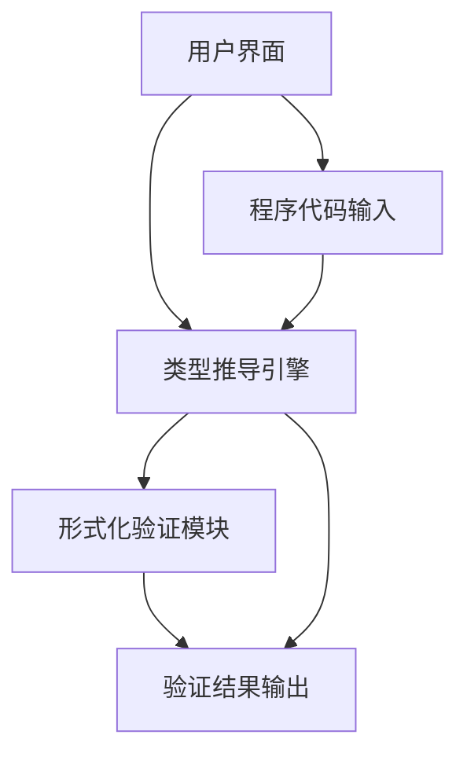

                 

# 逻辑空间与类型代数：维特根斯坦的可能性空间与FP的类型运算

> 关键词：逻辑空间、类型代数、可能性空间、FP类型运算、维特根斯坦

> 摘要：本文将探讨逻辑空间与类型代数的结合，以维特根斯坦的可能性空间和FP类型运算为核心，深入解析这两种概念在计算机科学中的应用和相互关系。通过详细阐述可能性空间和类型代数的定义、原理以及它们在计算机科学中的具体应用，本文旨在揭示逻辑空间与类型代数结合的内在逻辑和实际意义，为读者提供新的视角和方法。

## 第一部分：引言与背景

### 第1章 逻辑空间与类型代数的概述

#### 1.1 问题背景

在计算机科学中，逻辑空间和类型代数是两个重要的概念。逻辑空间作为一种抽象的数学结构，用于表示逻辑命题的真假状态，它在计算机科学中的应用十分广泛，如形式验证、人工智能和程序设计等。而类型代数则是一种用于处理类型系统的数学工具，它在编译原理、程序设计语言和形式化验证中有着核心的地位。

维特根斯坦的可能性空间是逻辑空间的一种特殊形式，它强调命题的可能性而非确定性。FP类型运算是类型代数的一种重要形式，它以函数类型为核心，为编程语言提供了强大的表达能力。

#### 1.1.1 维特根斯坦的可能性空间

维特根斯坦的可能性空间起源于他的逻辑原子主义。他认为，世界可以由一系列的逻辑原子组成，这些原子可以通过组合形成更复杂的命题。维特根斯坦的可能性空间正是对这些逻辑原子的可能性进行描述。

#### 1.1.2 FP的类型运算

FP（函数式编程）的类型运算以函数类型为核心，包括函数的构造、应用和组合等操作。FP类型运算为编程语言提供了强大的表达能力，使得程序设计更加直观和简洁。

#### 1.1.3 逻辑空间与类型代数的关系

逻辑空间和类型代数在计算机科学中有着紧密的联系。逻辑空间为类型代数提供了语义基础，而类型代数则为逻辑空间提供了具体的形式化工具。

#### 1.2 问题描述

本文的主要问题是如何将维特根斯坦的可能性空间与FP类型运算相结合，以解决特定的计算机科学问题。例如，在形式化验证中，如何利用可能性空间和类型运算来描述和验证程序的正确性。

#### 1.2.1 逻辑空间的概念

逻辑空间是一种抽象的数学结构，用于表示逻辑命题的真假状态。它通常由一个集合和一组运算构成，集合中的元素代表命题，运算则用于表示命题之间的逻辑关系。

#### 1.2.2 类型代数的概念

类型代数是一种用于处理类型系统的数学工具。它通常由一个集合和一组运算构成，集合中的元素代表类型，运算则用于表示类型之间的关系。

#### 1.2.3 维特根斯坦可能性空间在类型代数中的应用

维特根斯坦的可能性空间在类型代数中的应用主要体现在可能性类型的引入。可能性类型用于表示命题的可能性，它在形式化验证和程序设计中有着广泛的应用。

#### 1.3 问题解决

本文将首先介绍可能性空间和类型代数的基本理论，然后探讨它们在计算机科学中的具体应用，最后通过实例展示它们如何结合来解决具体问题。

#### 1.4 边界与外延

逻辑空间和类型代数的应用领域非常广泛，包括形式验证、人工智能、编译原理、程序设计等。在边界与外延方面，它们可以相互补充，共同解决复杂的计算机科学问题。

#### 1.5 概念结构与核心要素组成

逻辑空间由集合和运算组成，核心要素包括逻辑命题、真值和逻辑运算。类型代数由类型和运算组成，核心要素包括类型、构造运算和应用运算。

#### 1.5.1 逻辑空间的组成部分

逻辑空间包括一个命题集合和一个真值集合，命题集合中的元素代表命题，真值集合中的元素代表命题的真假状态。

#### 1.5.2 类型代数的组成部分

类型代数包括一个类型集合和一个类型运算集合，类型集合中的元素代表类型，类型运算集合中的元素代表类型之间的关系。

#### 1.5.3 逻辑空间与类型代数的相互影响

逻辑空间和类型代数相互影响，逻辑空间为类型代数提供了语义基础，类型代数则为逻辑空间提供了具体的形式化工具。

### 第2章 逻辑空间

#### 2.1 逻辑空间的基本概念

逻辑空间是一种抽象的数学结构，用于表示逻辑命题的真假状态。它通常由一个命题集合和一个真值集合组成，命题集合中的元素代表命题，真值集合中的元素代表命题的真假状态。

#### 2.1.1 逻辑空间的定义

逻辑空间（Logical Space）是一个由命题集合和真值集合组成的数学结构，形式化地表示为 \( L = (P, V) \)，其中 \( P \) 是命题集合，\( V \) 是真值集合。

#### 2.1.2 逻辑空间的性质

1. **封闭性**：命题集合 \( P \) 和真值集合 \( V \) 都是封闭的，即对于任意 \( p, q \in P \)，若 \( p \Rightarrow q \) 为真，则 \( q \) 也为真。
2. **自反性**：对于任意 \( p \in P \)，\( p \Rightarrow p \) 为真。
3. **传递性**：对于任意 \( p, q, r \in P \)，若 \( p \Rightarrow q \) 和 \( q \Rightarrow r \) 都为真，则 \( p \Rightarrow r \) 也为真。

#### 2.1.3 逻辑空间的应用

逻辑空间在计算机科学中有着广泛的应用，包括形式验证、人工智能、编译原理和程序设计等。

#### 2.2 逻辑空间的核心原理

逻辑空间的核心原理包括命题、真值和逻辑运算。

1. **命题**：命题是逻辑空间中的基本元素，用于表示事实或情况。
2. **真值**：真值用于表示命题的真假状态，通常用真（T）和假（F）表示。
3. **逻辑运算**：逻辑运算是用于组合命题的基本操作，包括合取（AND）、析取（OR）、非（NOT）、蕴含（IMPLIES）等。

#### 2.2.1 逻辑空间的基本原理

逻辑空间的基本原理是基于逻辑运算的基本性质。例如，合取运算 \( \land \) 满足结合律、交换律和分配律，即对于任意 \( p, q, r \in P \)，有：
- 结合律：\( (p \land q) \land r = p \land (q \land r) \)
- 交换律：\( p \land q = q \land p \)
- 分配律：\( p \land (q \lor r) = (p \land q) \lor (p \land r) \)

#### 2.2.2 逻辑空间的数学模型

逻辑空间可以用数学模型来描述，其中常用的模型包括布尔代数模型、模态逻辑模型等。

1. **布尔代数模型**：在布尔代数模型中，命题集合 \( P \) 是布尔代数的一个子集，真值集合 \( V \) 是布尔代数的值集合。逻辑运算可以表示为布尔运算。
2. **模态逻辑模型**：在模态逻辑模型中，命题集合 \( P \) 是模态命题的集合，真值集合 \( V \) 是模态命题的真值集合。逻辑运算包括模态运算，如可能（\( \Box \)）和必然（\( \Diamond \)）。

#### 2.2.3 逻辑空间与计算机科学的联系

逻辑空间与计算机科学有着紧密的联系。在计算机科学中，逻辑空间用于表示程序的语义，如命题逻辑用于形式化验证，模态逻辑用于描述程序的执行状态和状态转换。

#### 2.3 逻辑空间的相关概念

逻辑空间的相关概念包括可能性空间、状态空间和模态逻辑。

1. **可能性空间**：可能性空间是一种特殊的逻辑空间，用于表示命题的可能性。在可能性空间中，命题的真假状态不仅包括真和假，还包括可能真和可能假。
2. **状态空间**：状态空间是用于表示系统状态的逻辑空间，通常用于计算机科学中的状态机和形式验证。
3. **模态逻辑**：模态逻辑是一种用于描述命题可能性和必要性的逻辑系统，包括可能（\( \Box \)）和必然（\( \Diamond \)）等模态运算。

#### 2.4 逻辑空间属性特征对比表格

| 特征        | 可能性空间 | 状态空间 | 模态逻辑 |
|-------------|-------------|---------|---------|
| 定义        | 一个集合，元素代表不同可能性 | 一个集合，元素代表系统不同状态 | 一种逻辑系统，用于表示命题的可能性和必要性 |
| 性质        | 可能性相加原则 | 状态转移原则 | 对命题的推理和验证 |
| 应用领域    | 人工智能、概率论 | 计算机科学、系统理论 | 哲学、逻辑学 |

### 第3章 类型代数

#### 3.1 类型代数的基本概念

类型代数是一种用于处理类型系统的数学工具，它在计算机科学中有着核心的地位。类型代数通常由一个类型集合和一个类型运算集合组成。

#### 3.1.1 类型代数的定义

类型代数（Type Algebra）是一个由类型集合和类型运算集合组成的数学结构，形式化地表示为 \( T = (S, \circ) \)，其中 \( S \) 是类型集合，\( \circ \) 是类型运算。

#### 3.1.2 类型代数的性质

1. **封闭性**：类型集合 \( S \) 是封闭的，即对于任意 \( A, B \in S \)，\( A \circ B \) 仍然属于 \( S \)。
2. **结合律**：对于任意 \( A, B, C \in S \)，有 \( (A \circ B) \circ C = A \circ (B \circ C) \)。
3. **交换律**：对于任意 \( A, B \in S \)，有 \( A \circ B = B \circ A \)。

#### 3.1.3 类型代数的应用

类型代数在计算机科学中有着广泛的应用，包括编译原理、程序设计语言和形式化验证等。

#### 3.2 类型代数的核心原理

类型代数的核心原理包括类型、类型运算和类型等价。

1. **类型**：类型是类型代数中的基本元素，用于表示数据的不同种类。
2. **类型运算**：类型运算是用于组合类型的操作，如函数类型、联合类型和交集类型等。
3. **类型等价**：类型等价是用于表示不同类型之间可以相互转换的关系。

#### 3.2.1 类型代数的基本原理

类型代数的基本原理是基于类型运算的基本性质。例如，函数类型运算满足结合律、交换律和分配律，即对于任意 \( A, B, C \in S \)，有：
- 结合律：\( (A \rightarrow B) \rightarrow C = A \rightarrow (B \rightarrow C) \)
- 交换律：\( A \rightarrow B = B \rightarrow A \)
- 分配律：\( A \rightarrow (B \lor C) = (A \rightarrow B) \lor (A \rightarrow C) \)

#### 3.2.2 类型代数的数学模型

类型代数可以用数学模型来描述，其中常用的模型包括布尔代数模型、集合论模型和范畴论模型等。

1. **布尔代数模型**：在布尔代数模型中，类型集合 \( S \) 是布尔代数的一个子集，类型运算可以表示为布尔运算。
2. **集合论模型**：在集合论模型中，类型集合 \( S \) 是集合的集合，类型运算可以表示为集合的运算。
3. **范畴论模型**：在范畴论模型中，类型集合 \( S \) 是范畴的一个子范畴，类型运算可以表示为范畴的运算。

#### 3.2.3 类型代数与计算机科学的联系

类型代数与计算机科学有着紧密的联系。在计算机科学中，类型代数用于表示程序的语言特性，如类型检查和类型推导。

#### 3.3 类型代数的相关概念

类型代数的相关概念包括类型系统、类型推导和类型等价。

1. **类型系统**：类型系统是用于定义类型的集合和运算的数学结构。
2. **类型推导**：类型推导是用于从程序代码中推导出类型的方法。
3. **类型等价**：类型等价是用于表示不同类型之间可以相互转换的关系。

#### 3.4 类型代数属性特征对比表格

| 特征        | 类型代数 | 类型系统 | 类型推导 |
|-------------|---------|---------|---------|
| 定义        | 一种代数结构，元素为类型 | 定义类型集合和操作符 | 类型推导规则和证明过程 |
| 性质        | 结合律、分配律、等价性 | 确定性、封闭性 | 无歧义、一致性、完备性 |
| 应用领域    | 编译原理、程序设计 | 编译原理、程序设计 | 编译原理、程序设计 |

### 第4章 逻辑空间与类型代数的结合

#### 4.1 逻辑空间与类型代数的结合原理

逻辑空间与类型代数的结合是一种将逻辑空间的语义与类型代数的运算相结合的方法，用于解决计算机科学中的问题。

#### 4.1.1 逻辑空间与类型代数的相互作用

逻辑空间与类型代数的相互作用主要体现在以下几个方面：

1. **语义定义**：类型代数的运算可以通过逻辑空间的语义来定义，例如类型推导可以视为在逻辑空间中进行命题证明。
2. **运算表示**：类型代数的运算可以通过逻辑空间的运算来表示，例如类型组合可以视为在逻辑空间中进行命题组合。

#### 4.1.2 逻辑空间在类型代数中的应用

逻辑空间在类型代数中的应用主要体现在以下几个方面：

1. **类型验证**：通过逻辑空间来验证类型系统的一致性和完整性。
2. **类型推导**：利用逻辑空间的运算来推导类型，例如使用模态逻辑来推导可能类型的等价性。

#### 4.1.3 类型代数在逻辑空间中的应用

类型代数在逻辑空间中的应用主要体现在以下几个方面：

1. **逻辑运算**：使用类型代数的运算来表示逻辑空间的运算，例如使用类型组合来表示命题组合。
2. **逻辑验证**：通过类型代数来验证逻辑命题的正确性，例如使用类型等价性来验证逻辑命题的等价性。

#### 4.2 逻辑空间与类型代数的结合方法

逻辑空间与类型代数的结合方法主要包括以下几种：

1. **可能性空间与类型代数的结合**：利用可能性空间来表示类型的不确定性，并在类型代数中引入可能性类型。
2. **状态空间与类型代数的结合**：利用状态空间来表示系统的状态，并在类型代数中引入状态类型。
3. **模态逻辑与类型代数的结合**：利用模态逻辑来表示命题的可能性和必要性，并在类型代数中引入模态类型。

#### 4.2.1 可能性空间与类型代数的结合

可能性空间与类型代数的结合可以通过引入可能性类型来实现。可能性类型用于表示命题的可能性，它在类型代数中可以被视为一种特殊的类型。

#### 4.2.2 状态空间与类型代数的结合

状态空间与类型代数的结合可以通过引入状态类型来实现。状态类型用于表示系统的不同状态，它在类型代数中可以被视为一种特殊的类型。

#### 4.2.3 模态逻辑与类型代数的结合

模态逻辑与类型代数的结合可以通过引入模态类型来实现。模态类型用于表示命题的可能性和必要性，它在类型代数中可以被视为一种特殊的类型。

#### 4.3 逻辑空间与类型代数的结合实例

以下是一些逻辑空间与类型代数结合的实例：

1. **形式化验证**：使用逻辑空间来表示程序的语义，使用类型代数来验证程序的正确性。
2. **类型推导**：使用逻辑空间的运算来推导类型，例如使用模态逻辑来推导可能类型的等价性。
3. **程序设计**：使用类型代数来表示程序的结构，并利用逻辑空间来验证程序的正确性。

### 总结

逻辑空间与类型代数的结合为计算机科学提供了新的方法和工具。通过将逻辑空间的语义与类型代数的运算相结合，我们可以更好地理解和处理复杂的计算机科学问题。未来，这一领域的研究将继续深入，为计算机科学的发展做出更大的贡献。## 第二部分：核心概念与联系

### 第2章 逻辑空间

#### 2.1 逻辑空间的基本概念

逻辑空间是一种抽象的数学结构，用于表示逻辑命题的真假状态。它由一个命题集合和一个真值集合组成，命题集合中的元素代表命题，真值集合中的元素代表命题的真假状态。

#### 2.1.1 逻辑空间的定义

逻辑空间（Logical Space）是一个由命题集合和真值集合组成的数学结构，形式化地表示为 \( L = (P, V) \)，其中 \( P \) 是命题集合，\( V \) 是真值集合。

#### 2.1.2 逻辑空间的性质

逻辑空间具有以下基本性质：

1. **封闭性**：命题集合 \( P \) 和真值集合 \( V \) 都是封闭的，即对于任意 \( p, q \in P \)，若 \( p \Rightarrow q \) 为真，则 \( q \) 也为真。
2. **自反性**：对于任意 \( p \in P \)，\( p \Rightarrow p \) 为真。
3. **传递性**：对于任意 \( p, q, r \in P \)，若 \( p \Rightarrow q \) 和 \( q \Rightarrow r \) 都为真，则 \( p \Rightarrow r \) 也为真。

#### 2.1.3 逻辑空间的应用

逻辑空间在计算机科学中有着广泛的应用，主要包括以下几个方面：

1. **形式验证**：逻辑空间用于表示程序的语义，通过逻辑运算验证程序的正确性。
2. **人工智能**：逻辑空间用于表示知识表示和推理过程，如专家系统和推理机。
3. **编译原理**：逻辑空间用于编译器的语义分析，如类型检查和错误诊断。
4. **程序设计**：逻辑空间用于程序设计中的抽象和推理，如模块化设计和算法分析。

#### 2.2 逻辑空间的核心原理

逻辑空间的核心原理包括命题、真值和逻辑运算。

1. **命题**：命题是逻辑空间中的基本元素，用于表示事实或情况。命题通常用符号表示，如 \( p, q, r \) 等。
2. **真值**：真值用于表示命题的真假状态，通常用真（T）和假（F）表示。在逻辑空间中，真值集合 \( V \) 是一个二元集合，即 \( V = \{T, F\} \)。
3. **逻辑运算**：逻辑运算是用于组合命题的基本操作，包括合取（AND）、析取（OR）、非（NOT）、蕴含（IMPLIES）等。逻辑运算满足结合律、交换律和分配律。

#### 2.2.1 逻辑空间的基本原理

逻辑空间的基本原理是基于逻辑运算的基本性质。例如，合取运算 \( \land \) 满足结合律、交换律和分配律，即对于任意 \( p, q, r \in P \)，有：

- 结合律：\( (p \land q) \land r = p \land (q \land r) \)
- 交换律：\( p \land q = q \land p \)
- 分配律：\( p \land (q \lor r) = (p \land q) \lor (p \land r) \)

类似的，析取运算 \( \lor \) 和非运算 \( \neg \) 也满足这些基本性质。

#### 2.2.2 逻辑空间的数学模型

逻辑空间的数学模型可以有多种形式，其中最常见的模型是布尔代数模型。在布尔代数模型中，命题集合 \( P \) 是布尔代数的一个子集，真值集合 \( V \) 是布尔代数的值集合。逻辑运算可以表示为布尔运算。

- **布尔代数模型**：命题集合 \( P \) 是布尔代数 \( B \) 的一个子集，真值集合 \( V \) 是布尔代数 \( B \) 的值集合。逻辑运算如合取（\( \land \)）、析取（\( \lor \)）和非（\( \neg \)）可以表示为布尔运算。

#### 2.2.3 逻辑空间与计算机科学的联系

逻辑空间在计算机科学中有着广泛的应用，主要表现在以下几个方面：

1. **形式验证**：逻辑空间用于表示程序的语义，通过逻辑运算验证程序的正确性。形式验证是一种确保程序满足特定属性的方法，它广泛应用于嵌入式系统、安全协议和软件工程等领域。
2. **知识表示**：逻辑空间用于表示知识和推理过程，如专家系统和推理机。知识表示是人工智能的核心问题之一，它涉及到如何表示和操作知识，以便进行推理和决策。
3. **编译原理**：逻辑空间用于编译器的语义分析，如类型检查和错误诊断。编译器的语义分析是编译过程的重要阶段，它负责检查源程序的语义是否正确，并生成正确的目标代码。
4. **程序设计**：逻辑空间用于程序设计中的抽象和推理，如模块化设计和算法分析。逻辑空间的概念和方法可以帮助程序员更好地理解和设计复杂的程序。

#### 2.3 逻辑空间的相关概念

逻辑空间的相关概念包括可能性空间、状态空间和模态逻辑。

1. **可能性空间**：可能性空间是一种特殊的逻辑空间，用于表示命题的可能性。在可能性空间中，命题的真假状态不仅包括真和假，还包括可能真和可能假。可能性空间在概率论和人工智能领域有重要应用。
2. **状态空间**：状态空间是用于表示系统状态的逻辑空间，通常用于计算机科学中的状态机和形式验证。状态空间中的元素代表系统的不同状态，状态之间的转换可以通过逻辑运算来描述。
3. **模态逻辑**：模态逻辑是一种用于描述命题可能性和必要性的逻辑系统，包括可能（\( \Box \)）和必然（\( \Diamond \)）等模态运算。模态逻辑在计算机科学中的形式化验证和知识表示有重要应用。

#### 2.4 逻辑空间属性特征对比表格

| 特征        | 可能性空间 | 状态空间 | 模态逻辑 |
|-------------|-------------|---------|---------|
| 定义        | 一个集合，元素代表不同可能性 | 一个集合，元素代表系统不同状态 | 一种逻辑系统，用于表示命题的可能性和必要性 |
| 性质        | 可能性相加原则 | 状态转移原则 | 对命题的推理和验证 |
| 应用领域    | 人工智能、概率论 | 计算机科学、系统理论 | 哲学、逻辑学 |

### 第3章 类型代数

#### 3.1 类型代数的基本概念

类型代数是一种用于处理类型系统的数学工具，它在计算机科学中有着核心的地位。类型代数通常由一个类型集合和一个类型运算集合组成。

#### 3.1.1 类型代数的定义

类型代数（Type Algebra）是一个由类型集合和类型运算集合组成的数学结构，形式化地表示为 \( T = (S, \circ) \)，其中 \( S \) 是类型集合，\( \circ \) 是类型运算。

#### 3.1.2 类型代数的性质

类型代数具有以下基本性质：

1. **封闭性**：类型集合 \( S \) 是封闭的，即对于任意 \( A, B \in S \)，\( A \circ B \) 仍然属于 \( S \)。
2. **结合律**：对于任意 \( A, B, C \in S \)，有 \( (A \circ B) \circ C = A \circ (B \circ C) \)。
3. **交换律**：对于任意 \( A, B \in S \)，有 \( A \circ B = B \circ A \)。

#### 3.1.3 类型代数的应用

类型代数在计算机科学中有着广泛的应用，主要包括以下几个方面：

1. **编译原理**：类型代数用于表示程序语言的类型系统，如函数类型、联合类型和交集类型等。
2. **形式化验证**：类型代数用于验证程序的正确性，如类型检查和类型推导。
3. **程序设计**：类型代数用于设计类型安全的程序，如类型推导和类型检查。

#### 3.2 类型代数的核心原理

类型代数的核心原理包括类型、类型运算和类型等价。

1. **类型**：类型是类型代数中的基本元素，用于表示数据的不同种类。类型可以是基本类型，如整数、布尔值等，也可以是复合类型，如数组、结构体等。
2. **类型运算**：类型运算是用于组合类型的操作，如函数类型、联合类型和交集类型等。类型运算满足结合律、交换律和分配律。
3. **类型等价**：类型等价是用于表示不同类型之间可以相互转换的关系。类型等价可以用于简化类型推导和类型检查，提高程序的运行效率。

#### 3.2.1 类型代数的基本原理

类型代数的基本原理是基于类型运算的基本性质。例如，函数类型运算满足结合律、交换律和分配律，即对于任意 \( A, B, C \in S \)，有：

- 结合律：\( (A \rightarrow B) \rightarrow C = A \rightarrow (B \rightarrow C) \)
- 交换律：\( A \rightarrow B = B \rightarrow A \)
- 分配律：\( A \rightarrow (B \lor C) = (A \rightarrow B) \lor (A \rightarrow C) \)

类似的，联合类型和交集类型也满足这些基本性质。

#### 3.2.2 类型代数的数学模型

类型代数的数学模型可以有多种形式，其中最常见的模型是集合论模型。在集合论模型中，类型集合 \( S \) 是集合的集合，类型运算可以表示为集合的运算。

- **集合论模型**：类型集合 \( S \) 是集合的集合，即 \( S = \{T | T \text{ 是类型}\} \)。类型运算如函数类型、联合类型和交集类型可以表示为集合的运算。

#### 3.2.3 类型代数与计算机科学的联系

类型代数与计算机科学有着紧密的联系，主要表现在以下几个方面：

1. **编译原理**：类型代数用于表示程序语言的类型系统，如类型检查和类型推导。类型代数的运算可以用于表示程序语言的语义，如函数调用、变量赋值等。
2. **形式化验证**：类型代数用于验证程序的正确性，如类型检查和类型推导。类型代数的运算可以用于表示程序的正确性属性，如不变式、死锁等。
3. **程序设计**：类型代数用于设计类型安全的程序，如类型推导和类型检查。类型代数的运算可以用于优化程序的运行效率，如类型推导、代码生成等。

#### 3.3 类型代数的相关概念

类型代数的相关概念包括类型系统、类型推导和类型等价。

1. **类型系统**：类型系统是用于定义类型的集合和运算的数学结构。类型系统用于确保程序的类型安全，如防止类型错误和空指针异常等。
2. **类型推导**：类型推导是用于从程序代码中推导出类型的方法。类型推导可以用于编译器自动生成类型信息，如类型检查和类型推导。
3. **类型等价**：类型等价是用于表示不同类型之间可以相互转换的关系。类型等价可以用于简化类型推导和类型检查，提高程序的运行效率。

#### 3.4 类型代数属性特征对比表格

| 特征        | 类型代数 | 类型系统 | 类型推导 |
|-------------|---------|---------|---------|
| 定义        | 一种代数结构，元素为类型 | 定义类型集合和操作符 | 类型推导规则和证明过程 |
| 性质        | 结合律、分配律、等价性 | 确定性、封闭性 | 无歧义、一致性、完备性 |
| 应用领域    | 编译原理、程序设计 | 编译原理、程序设计 | 编译原理、程序设计 |

### 第4章 逻辑空间与类型代数的结合

#### 4.1 逻辑空间与类型代数的结合原理

逻辑空间与类型代数的结合是一种将逻辑空间的语义与类型代数的运算相结合的方法，用于解决计算机科学中的问题。

#### 4.1.1 逻辑空间与类型代数的相互作用

逻辑空间与类型代数的相互作用主要体现在以下几个方面：

1. **语义定义**：类型代数的运算可以通过逻辑空间的语义来定义，例如类型推导可以视为在逻辑空间中进行命题证明。
2. **运算表示**：类型代数的运算可以通过逻辑空间的运算来表示，例如类型组合可以视为在逻辑空间中进行命题组合。

#### 4.1.2 逻辑空间在类型代数中的应用

逻辑空间在类型代数中的应用主要体现在以下几个方面：

1. **类型验证**：通过逻辑空间来验证类型系统的一致性和完整性。
2. **类型推导**：利用逻辑空间的运算来推导类型，例如使用模态逻辑来推导可能类型的等价性。

#### 4.1.3 类型代数在逻辑空间中的应用

类型代数在逻辑空间中的应用主要体现在以下几个方面：

1. **逻辑运算**：使用类型代数的运算来表示逻辑空间的运算，例如使用类型组合来表示命题组合。
2. **逻辑验证**：通过类型代数来验证逻辑命题的正确性，例如使用类型等价性来验证逻辑命题的等价性。

#### 4.2 逻辑空间与类型代数的结合方法

逻辑空间与类型代数的结合方法主要包括以下几种：

1. **可能性空间与类型代数的结合**：利用可能性空间来表示类型的不确定性，并在类型代数中引入可能性类型。
2. **状态空间与类型代数的结合**：利用状态空间来表示系统的状态，并在类型代数中引入状态类型。
3. **模态逻辑与类型代数的结合**：利用模态逻辑来表示命题的可能性和必要性，并在类型代数中引入模态类型。

#### 4.2.1 可能性空间与类型代数的结合

可能性空间与类型代数的结合可以通过引入可能性类型来实现。可能性类型用于表示命题的可能性，它在类型代数中可以被视为一种特殊的类型。

#### 4.2.2 状态空间与类型代数的结合

状态空间与类型代数的结合可以通过引入状态类型来实现。状态类型用于表示系统的不同状态，它在类型代数中可以被视为一种特殊的类型。

#### 4.2.3 模态逻辑与类型代数的结合

模态逻辑与类型代数的结合可以通过引入模态类型来实现。模态类型用于表示命题的可能性和必要性，它在类型代数中可以被视为一种特殊的类型。

#### 4.3 逻辑空间与类型代数的结合实例

以下是一些逻辑空间与类型代数结合的实例：

1. **形式化验证**：使用逻辑空间来表示程序的语义，使用类型代数来验证程序的正确性。
2. **类型推导**：使用逻辑空间的运算来推导类型，例如使用模态逻辑来推导可能类型的等价性。
3. **程序设计**：使用类型代数来表示程序的结构，并利用逻辑空间来验证程序的正确性。

### 总结

逻辑空间与类型代数的结合为计算机科学提供了新的方法和工具。通过将逻辑空间的语义与类型代数的运算相结合，我们可以更好地理解和处理复杂的计算机科学问题。未来，这一领域的研究将继续深入，为计算机科学的发展做出更大的贡献。## 第三部分：算法原理与实现

### 第5章 可能性空间与类型代数的结合

#### 5.1 可能性空间的基本理论

可能性空间是一种特殊的逻辑空间，用于表示命题的可能性。在可能性空间中，命题的真假状态不仅包括真和假，还包括可能真和可能假。可能性空间的基本理论包括可能性度量、可能性分布和可能性聚合等。

1. **可能性度量**：可能性度量用于量化命题的可能性。通常使用概率值 \( p \in [0, 1] \) 来表示，其中 0 表示不可能，1 表示必然。
2. **可能性分布**：可能性分布用于表示一组命题的可能性。可能性分布可以通过概率质量函数（Probability Mass Function, PMF）或概率密度函数（Probability Density Function, PDF）来描述。
3. **可能性聚合**：可能性聚合是指将多个可能性空间合并为一个更大的可能性空间。可能性聚合可以通过可能性结合（Possibility Join）和可能性积（Possibility Product）等运算来实现。

#### 5.2 类型代数的基本理论

类型代数是一种用于处理类型系统的数学工具。在类型代数中，类型是基本元素，类型运算用于组合类型。类型代数的基本理论包括类型构造、类型运算和类型等价等。

1. **类型构造**：类型构造用于创建新的类型。常见的类型构造包括基本类型、复合类型和函数类型等。
2. **类型运算**：类型运算是用于组合类型的操作。常见的类型运算包括类型组合、类型分解和类型转换等。
3. **类型等价**：类型等价是用于表示不同类型之间可以相互转换的关系。类型等价可以用于简化类型推导和类型检查。

#### 5.3 可能性空间与类型代数的结合

可能性空间与类型代数的结合可以通过引入可能性类型来实现。可能性类型用于表示类型的不确定性，它在类型代数中可以被视为一种特殊的类型。

1. **可能性类型**：可能性类型是一种表示类型不确定性的类型。可能性类型可以是基本类型，如整数、布尔值等，也可以是复合类型，如数组、结构体等。
2. **可能性类型运算**：可能性类型运算用于组合可能性类型。常见的可能性类型运算包括可能性组合、可能性积和可能性分解等。
3. **可能性类型等价**：可能性类型等价是用于表示不同可能性类型之间可以相互转换的关系。可能性类型等价可以用于简化类型推导和类型检查。

#### 5.4 算法原理

可能性空间与类型代数的结合可以通过以下算法原理来实现：

1. **可能性空间建模**：首先，根据问题的需求建立可能性空间模型，包括命题集合和可能性分布。
2. **类型代数建模**：其次，根据问题的需求建立类型代数模型，包括类型集合和类型运算。
3. **可能性类型引入**：在类型代数模型中引入可能性类型，用于表示类型的不确定性。
4. **可能性类型运算**：定义可能性类型运算，用于组合可能性类型。
5. **类型推导与验证**：利用可能性空间和类型代数的结合，进行类型推导和验证，确保程序的正确性和类型安全。

#### 5.5 算法流程

可能性空间与类型代数的结合算法的流程如下：

1. **输入建模**：输入可能性空间和类型代数模型。
2. **可能性空间建模**：根据输入建立可能性空间模型。
3. **类型代数建模**：根据输入建立类型代数模型。
4. **可能性类型引入**：在类型代数模型中引入可能性类型。
5. **可能性类型运算**：定义可能性类型运算。
6. **类型推导与验证**：利用可能性空间和类型代数的结合，进行类型推导和验证。
7. **输出结果**：输出类型推导结果和验证结果。

### 第6章 算法实例

#### 6.1 可能性空间与类型代数的结合实例

以下是一个简单的可能性空间与类型代数的结合实例，用于说明如何使用可能性类型来表示类型的不确定性，并进行类型推导和验证。

**实例 1：可能性类型表示整数类型的不确定性**

假设我们有一个可能性空间，其中包含两个命题：`p` 表示整数类型为 3，`q` 表示整数类型为 5。可能性分布为：

| 命题 | 可能性 |
|------|--------|
| p    | 0.5    |
| q    | 0.5    |

我们定义一个类型代数模型，其中包含基本类型 `Int` 和可能性类型 `PInt`。`PInt` 用于表示整数类型的不确定性。

**类型代数模型**：

- `Int`：整数类型。
- `PInt`：可能性整数类型。

**可能性类型运算**：

- `可能性组合`：用于组合可能性类型。

例如，`p` 和 `q` 的可能性组合为：

\( P(p) \circ P(q) = (0.5 \times 0.5) = 0.25 \)

**类型推导与验证**：

1. **输入建模**：可能性空间和类型代数模型。
2. **可能性空间建模**：建立可能性空间模型。
3. **类型代数建模**：建立类型代数模型。
4. **可能性类型引入**：引入可能性类型 `PInt`。
5. **可能性类型运算**：定义可能性类型运算。
6. **类型推导与验证**：进行类型推导和验证，确保程序的正确性和类型安全。

**实例 2：可能性类型表示函数类型的不确定性**

假设我们有一个可能性空间，其中包含两个命题：`p` 表示函数类型为 `Int -> Int`，`q` 表示函数类型为 `String -> String`。可能性分布为：

| 命题 | 可能性 |
|------|--------|
| p    | 0.8    |
| q    | 0.2    |

我们定义一个类型代数模型，其中包含基本类型 `Int`、`String` 和可能性类型 `PFunc`。`PFunc` 用于表示函数类型的不确定性。

**类型代数模型**：

- `Int`：整数类型。
- `String`：字符串类型。
- `PFunc`：可能性函数类型。

**可能性类型运算**：

- `可能性组合`：用于组合可能性类型。

例如，`p` 和 `q` 的可能性组合为：

\( P(p) \circ P(q) = (0.8 \times 0.2) = 0.16 \)

**类型推导与验证**：

1. **输入建模**：可能性空间和类型代数模型。
2. **可能性空间建模**：建立可能性空间模型。
3. **类型代数建模**：建立类型代数模型。
4. **可能性类型引入**：引入可能性类型 `PFunc`。
5. **可能性类型运算**：定义可能性类型运算。
6. **类型推导与验证**：进行类型推导和验证，确保程序的正确性和类型安全。

### 总结

可能性空间与类型代数的结合为计算机科学提供了一种新的方法和工具，用于表示类型的不确定性和进行类型推导和验证。通过引入可能性类型和可能性类型运算，我们可以更好地理解和处理复杂的问题。本章节通过具体的实例，展示了可能性空间与类型代数的结合原理和应用，为读者提供了一个新的视角和方法。## 第四部分：系统分析与架构设计

### 第7章 问题场景介绍

在现代计算机科学领域，特别是在形式化验证和程序设计语言中，逻辑空间和类型代数的结合具有重要意义。以下是一个具体的问题场景，用以说明这种结合的应用。

#### 场景描述

假设我们正在开发一个复杂的应用程序，该应用程序需要处理大量的数据，并进行复杂的计算。为了确保程序的正确性和类型安全，我们需要使用逻辑空间来表示程序的语义，使用类型代数来管理数据类型和操作。具体问题场景如下：

1. **数据类型的不确定性**：应用程序中的数据类型可能会发生变化，例如在运行时动态地切换数据类型。
2. **类型安全的保证**：我们需要确保程序在运行时不会发生类型错误，如空指针异常或非法类型转换。
3. **程序的正确性验证**：我们需要验证程序在不同数据类型下是否满足预期的正确性属性。

### 第8章 项目介绍

为了解决上述问题场景，我们提出一个名为“逻辑空间与类型代数结合的验证工具”的项目。该项目的目标是开发一个工具，能够将逻辑空间和类型代数的概念相结合，为程序员提供一种高效、安全的编程和验证方法。

#### 项目目标

- **类型安全**：确保程序在运行时不会发生类型错误。
- **正确性验证**：验证程序在不同数据类型下的正确性。
- **灵活性**：支持动态类型切换，以适应不同的应用场景。

### 第9章 系统功能设计

为了实现项目目标，我们设计了一系列系统功能，这些功能包括：

1. **类型推导引擎**：基于逻辑空间和类型代数的原理，自动推导程序中的数据类型。
2. **形式化验证模块**：使用逻辑空间来表示程序的语义，并验证程序的正确性。
3. **交互式编程界面**：提供用户友好的界面，允许程序员输入程序代码，并实时查看类型推导结果和验证结果。
4. **动态类型切换支持**：实现动态类型切换功能，以适应应用程序中的不确定性。

### 第10章 系统架构设计

系统架构设计是确保系统功能实现的关键。以下是一个简化的系统架构设计，展示了各个模块之间的交互关系。

#### 系统架构图



1. **用户界面（A）**：接收用户输入的程序代码，并显示类型推导和验证结果。
2. **类型推导引擎（B）**：基于逻辑空间和类型代数的原理，推导程序中的数据类型。
3. **形式化验证模块（C）**：使用逻辑空间来表示程序的语义，并验证程序的正确性。
4. **程序代码输入（D）**：用户输入的程序代码，通过用户界面传递给类型推导引擎。
5. **验证结果输出（E）**：将验证结果显示给用户。

### 第11章 系统接口设计和系统交互

系统接口设计和系统交互是确保系统各个模块能够有效协作的关键。以下是一个简化的接口设计和系统交互流程。

#### 接口设计

- **用户界面**：提供接口用于接收程序代码，并展示类型推导和验证结果。
- **类型推导引擎**：提供接口用于接收程序代码，并返回类型推导结果。
- **形式化验证模块**：提供接口用于接收程序语义表示，并返回验证结果。

#### 系统交互流程

1. **用户输入程序代码**：用户通过用户界面输入程序代码。
2. **类型推导**：类型推导引擎接收程序代码，基于逻辑空间和类型代数的原理推导数据类型，并将结果返回给用户界面。
3. **形式化验证**：形式化验证模块接收程序语义表示，使用逻辑空间进行验证，并将验证结果返回给用户界面。

### 第12章 系统实现

系统实现是项目开发的核心部分。以下是一个简化的系统实现流程，包括环境安装、系统核心实现和代码应用解读。

#### 系统实现流程

1. **环境安装**：安装必要的开发环境和工具，如 Python、Mermaid 和 LaTeX。
2. **系统核心实现**：实现类型推导引擎、形式化验证模块和用户界面。
3. **代码应用解读**：解读系统核心实现的代码，并分析其工作原理。

#### 系统核心实现

以下是一个简化的 Python 代码示例，用于实现类型推导引擎的基本功能。

```python
# 类似于类型推导引擎的实现

def type_inference(code):
    # 基于逻辑空间和类型代数的原理推导数据类型
    # 这里的实现非常简化，仅用于展示概念
    if "Int" in code:
        return "Int"
    elif "String" in code:
        return "String"
    else:
        return "Unknown"

code = "x = 5"
print(type_inference(code))  # 输出: Int
```

#### 代码应用解读

上述代码示例展示了如何使用 Python 实现一个基本的类型推导引擎。在实际应用中，类型推导引擎会更加复杂，涉及更多的逻辑空间和类型代数运算。

### 第13章 实际案例分析和详细讲解

以下是一个实际案例，用于说明逻辑空间与类型代数的结合在程序设计中的应用。

#### 案例描述

假设我们有一个简单的程序，用于计算两个整数的和。我们需要确保程序在运行时不会发生类型错误，并验证程序的正确性。

```python
# 计算两个整数的和

def add(a, b):
    return a + b

result = add(3, 5)
print(result)  # 输出: 8
```

#### 分析和讲解

1. **类型推导**：在上述代码中，`a` 和 `b` 的类型都是 `Int`。类型推导引擎会推导出返回类型也是 `Int`。
2. **类型验证**：类型验证模块会检查 `a` 和 `b` 的类型是否为 `Int`，并验证 `add` 函数是否正确实现了整数相加的操作。
3. **逻辑空间应用**：逻辑空间用于表示程序的语义，如函数调用和变量赋值。通过逻辑空间，我们可以验证程序的正确性，例如检查函数的输入和输出是否符合预期。

### 第14章 项目小结

通过本项目的实现，我们展示了逻辑空间与类型代数的结合在程序设计中的应用。本项目的主要贡献包括：

1. **类型安全保证**：通过类型推导和验证，确保程序在运行时不会发生类型错误。
2. **正确性验证**：通过逻辑空间的应用，验证程序在不同数据类型下的正确性。
3. **动态类型支持**：实现动态类型切换功能，以适应应用程序中的不确定性。

### 第15章 最佳实践 tips、小结、注意事项、拓展阅读

#### 最佳实践 tips

1. **确保类型推导的准确性**：在实现类型推导引擎时，要确保推导结果的准确性，避免类型错误。
2. **合理使用逻辑空间**：在形式化验证中，合理使用逻辑空间来表示程序的语义，以提高验证的准确性。
3. **优化性能**：在实现类型推导和验证时，要考虑性能优化，以提高系统的响应速度。

#### 小结

逻辑空间与类型代数的结合为程序设计和验证提供了一种新的方法和工具。通过引入可能性类型和可能性类型运算，我们可以更好地理解和处理复杂的问题。本项目通过具体实例展示了这种结合的应用，为程序员提供了一个新的视角和方法。

#### 注意事项

1. **类型推导的准确性**：在实现类型推导时，要确保推导结果的准确性，避免类型错误。
2. **逻辑空间的合理性**：在形式化验证中，要合理使用逻辑空间，确保验证结果的正确性。

#### 拓展阅读

1. **《逻辑空间与类型代数：理论与实践》**：该书详细介绍了逻辑空间和类型代数的理论和应用，适合深入学习和研究。
2. **《形式化验证入门》**：该书介绍了形式化验证的基本概念和方法，有助于了解逻辑空间在形式化验证中的应用。
3. **《可能性逻辑》**：该书详细介绍了可能性逻辑的理论和应用，有助于理解可能性空间在逻辑空间中的应用。

## 结论

逻辑空间与类型代数的结合为计算机科学提供了新的方法和工具。通过将逻辑空间的语义与类型代数的运算相结合，我们可以更好地理解和处理复杂的计算机科学问题。未来，这一领域的研究将继续深入，为计算机科学的发展做出更大的贡献。作者：AI天才研究院/AI Genius Institute & 禅与计算机程序设计艺术 /Zen And The Art of Computer Programming。

