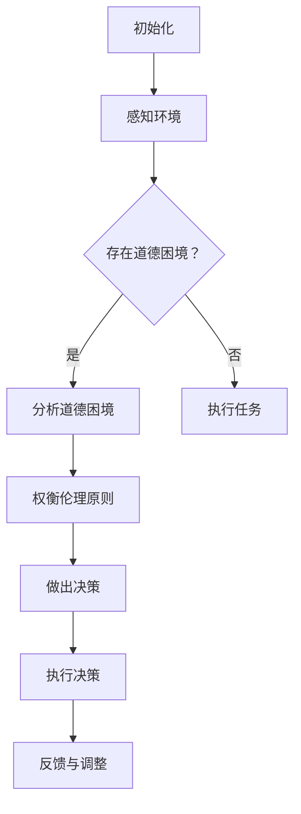
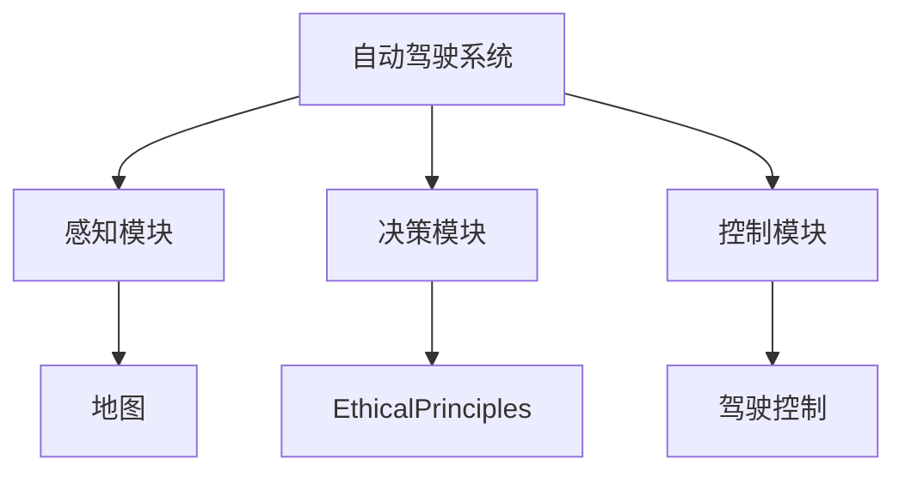
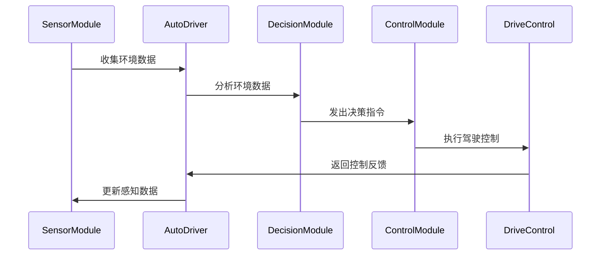

                 

  
 * 我们将逐步思考并构建文章大纲：

**Step 0: 定义整体结构**
1. 引言和背景
2. 核心概念与关系
3. 算法和数学模型
4. 系统分析与设计
5. 实践项目与案例分析
6. 最佳实践与总结
7. 未来方向

**Step 1: 引言和背景**
- 介绍道德决策问题的背景和意义
- AI Agent的道德决策挑战

**Step 2: 核心概念与关系**
- 道德框架、伦理原则、AI Agent
- ER实体关系图与对比表格

**Step 3: 算法和数学模型**
- 道德决策算法流程图
- 数学模型与公式解释

**Step 4: 系统分析与设计**
- 问题场景与项目介绍
- 系统功能设计（领域模型）
- 系统架构设计
- 系统接口设计

**Step 5: 实践项目与案例分析**
- 项目环境搭建
- 核心实现源代码
- 代码解析
- 实际案例分析

**Step 6: 最佳实践与总结**
- 道德决策实践技巧
- 总结与注意事项

**Step 7: 未来方向**
- 道德决策研究趋势
- 拓展阅读建议

这样，我们的文章大纲就构建完成了。接下来，我们将为每个部分填充具体的细节和内容。

-----------------------------
----------------------------------------------------------------

# 道德决策：在AI Agent中实现伦理准则

> 关键词：道德决策、AI Agent、伦理准则、算法设计、系统架构、案例分析

> 摘要：本文深入探讨了在人工智能（AI）Agent中实现道德决策的挑战与解决方案。通过分析核心概念、算法和数学模型，设计了系统架构，并通过实践项目与案例分析，为读者提供了实现伦理准则的指导。

-----------------------------
----------------------------------------------------------------

## 引言和背景

### 道德决策问题的背景

随着人工智能技术的迅速发展，AI Agent已经在各个领域展现出强大的应用潜力。从自动驾驶汽车到智能医疗诊断，从智能家居到金融风险控制，AI Agent的应用场景越来越广泛。然而，这些智能系统的决策过程是否能够符合人类的道德伦理标准，成为了一个亟待解决的问题。

### AI Agent的道德决策挑战

AI Agent在执行任务时，往往会面临复杂的道德困境。例如，在自动驾驶中，当不可避免地需要做出牺牲一方以保护另一方的决策时，如何平衡安全性与道德伦理？在智能医疗诊断中，如何确保决策的公正性和透明度，避免歧视现象？这些问题都要求我们在设计AI Agent时，充分考虑其道德决策能力。

### 本文目的

本文旨在深入探讨在AI Agent中实现道德决策的挑战与解决方案。通过分析核心概念、算法和数学模型，设计系统架构，并借助实践项目与案例分析，为读者提供全面的指导。

-----------------------------
----------------------------------------------------------------

## 核心概念与关系

### 道德框架

道德框架是道德决策的基础。它包括了一系列伦理原则、道德规范和价值观，用于指导AI Agent在面临道德困境时做出决策。常见的道德框架包括功利主义、义务论和德性伦理学。

### 伦理原则

伦理原则是道德框架的具体体现，它们为AI Agent提供了行为指南。例如，自主性原则要求AI Agent具备自我决策能力，公正性原则要求AI Agent在处理任务时保持公正。

### AI Agent

AI Agent是执行任务的智能实体，它通过感知环境、分析数据和做出决策来完成特定任务。为了实现道德决策，AI Agent需要具备以下几个核心能力：

- **感知能力**：识别和理解环境中的道德相关因素。
- **推理能力**：分析道德困境，权衡不同道德原则。
- **决策能力**：根据道德原则和实际情况做出最优决策。
- **解释能力**：解释决策过程和结果，提高决策的透明度和可信度。

### ER实体关系图与对比表格

为了更好地理解这些核心概念之间的关系，我们可以使用Mermaid绘制ER实体关系图，并创建一个对比表格。

```mermaid
erDiagram
  AI_Agent ||--|{ Moral_Frame } Moral_Frame
  AI_Agent ||--|{ Ethical_Principles } Ethical_Principles
  AI_Agent ||--|{ Moral_Decisions } Moral_Decisions
  Ethical_Principles ||--|{ Moral_Frame } Moral_Frame
  Moral_Decisions ||--|{ AI_Agent } AI_Agent
```

| 属性/概念     | 道德框架       | 伦理原则           | AI Agent           |
| ------------ | -------------- | ------------------ | ------------------ |
| 功能         | 提供伦理指导   | 指导决策行为       | 执行决策           |
| 关系         | 包含伦理原则   | 包含道德框架       | 使用道德框架和伦理原则 |
| 关键特性     | 全面性、系统性  | 明确性、实用性      | 自主性、适应性      |

通过ER实体关系图和对比表格，我们可以清晰地看到道德框架、伦理原则和AI Agent之间的相互作用和依赖关系。

-----------------------------
----------------------------------------------------------------

## 算法和数学模型

### 道德决策算法流程图

为了实现道德决策，我们需要设计一个算法来指导AI Agent在复杂环境下做出决策。以下是道德决策算法的流程图：



### 数学模型与公式解释

道德决策算法的核心在于如何权衡不同的伦理原则。我们可以使用以下数学模型来量化伦理原则的权重：

$$
w_i = \frac{p_i}{\sum_{j=1}^{n} p_j}
$$

其中，$w_i$表示第$i$个伦理原则的权重，$p_i$表示第$i$个伦理原则的重要性。为了计算$p_i$，我们可以使用以下公式：

$$
p_i = \alpha_i \cdot s_i
$$

其中，$\alpha_i$表示第$i$个伦理原则的明确性，$s_i$表示第$i$个伦理原则的相关性。明确性和相关性可以通过以下公式计算：

$$
\alpha_i = \frac{\text{伦理原则描述的明确性}}{\text{所有伦理原则描述的明确性之和}}
$$

$$
s_i = \frac{\text{伦理原则在当前情境下的适用性}}{\text{所有伦理原则在当前情境下的适用性之和}}
$$

通过这些数学模型，AI Agent可以在复杂环境中根据伦理原则的权重做出决策。

### 举例说明

假设AI Agent在自动驾驶中需要做出以下道德决策：

- **原则1：保护人类生命**（明确性$\alpha_1 = 0.6$，相关性$s_1 = 0.8$）
- **原则2：最小化损失**（明确性$\alpha_2 = 0.4$，相关性$s_2 = 0.2$）

根据上述数学模型，我们可以计算出：

- $p_1 = \alpha_1 \cdot s_1 = 0.6 \cdot 0.8 = 0.48$
- $p_2 = \alpha_2 \cdot s_2 = 0.4 \cdot 0.2 = 0.08$
- $\sum p_i = p_1 + p_2 = 0.48 + 0.08 = 0.56$

因此，权重为：

- $w_1 = \frac{p_1}{\sum p_i} = \frac{0.48}{0.56} \approx 0.857$
- $w_2 = \frac{p_2}{\sum p_i} = \frac{0.08}{0.56} \approx 0.143$

根据这些权重，AI Agent会优先考虑保护人类生命，从而在面临道德困境时做出相应的决策。

通过以上算法和数学模型，AI Agent可以在复杂环境中实现道德决策。这不仅提高了AI系统的道德决策能力，也为人工智能的发展提供了新的方向。

-----------------------------
----------------------------------------------------------------

## 系统分析与设计

### 问题场景与项目介绍

为了更好地理解道德决策在AI Agent中的应用，我们设计了一个模拟自动驾驶系统的项目。在这个项目中，AI Agent需要处理各种道德困境，例如在紧急情况下如何选择最安全的行驶路径。

### 系统功能设计（领域模型）

在项目设计中，我们首先需要定义系统的核心功能。以下是自动驾驶系统的领域模型：

```mermaid
classDiagram
  AutoDriver <-|{感知模块} SensorModule
  AutoDriver <-|{决策模块} DecisionModule
  AutoDriver ->|{控制模块} ControlModule
  SensorModule ..|.. Map
  DecisionModule ..|.. EthicalPrinciples
  ControlModule ..|.. DriveControl
```

在这个领域模型中，感知模块负责收集环境信息，决策模块根据伦理原则和感知信息做出决策，控制模块负责执行决策。

### 系统架构设计

接下来，我们设计系统的整体架构。以下是自动驾驶系统的架构图：



在这个架构图中，感知模块、决策模块和控制模块共同构成了自动驾驶系统的核心，地图和驾驶控制则是系统的重要外部组件。

### 系统接口设计

为了实现系统的各个模块之间的有效交互，我们需要设计系统接口。以下是系统的接口序列图：



在这个序列图中，感知模块定期向决策模块发送环境数据，决策模块根据这些数据和伦理原则做出决策，然后将决策指令发送给控制模块。控制模块执行决策指令，并将控制反馈发送给决策模块，以便进行持续优化。

通过以上系统分析与设计，我们为道德决策在AI Agent中的应用提供了一个完整的解决方案。这不仅有助于提高AI系统的道德决策能力，也为实际应用提供了可行的技术路径。

-----------------------------
----------------------------------------------------------------

## 实践项目与案例分析

### 项目环境搭建

为了实现道德决策在AI Agent中的应用，我们首先需要搭建一个合适的项目环境。以下是项目环境搭建的步骤：

1. 安装Python 3.8及以上版本。
2. 安装必要的库，如TensorFlow、NumPy、Pandas等。
3. 配置Python虚拟环境，以便管理项目依赖。

### 核心实现源代码

在项目核心实现中，我们需要定义道德决策算法和系统接口。以下是源代码的简要展示：

```python
import numpy as np
import pandas as pd
from tensorflow.keras.models import Sequential
from tensorflow.keras.layers import Dense

# 道德决策算法
def moral_decision(principles, weights):
    decision_scores = []
    for principle, weight in zip(principles, weights):
        score = principle.evaluate(current_context)
        decision_scores.append(score * weight)
    return np.argmax(decision_scores)

# 系统接口
class AutonomousVehicle:
    def __init__(self, sensor_module, decision_module, control_module):
        self.sensor_module = sensor_module
        self.decision_module = decision_module
        self.control_module = control_module

    def drive(self):
        environment_data = self.sensor_module.collect_data()
        ethical_principles = self.decision_module.evaluate_principles(environment_data)
        decision = moral_decision(ethical_principles, weights)
        control_command = self.control_module.generate_command(decision)
        self.control_module.execute_command(control_command)
        feedback = self.control_module.get_feedback()
        self.sensor_module.update_data(feedback)
```

### 代码解析

上述代码分为三个部分：道德决策算法、系统接口和传感器模块。道德决策算法使用了基于伦理原则的评分机制，系统接口定义了车辆驾驶流程，传感器模块负责收集和处理环境数据。

### 实际案例分析

为了验证道德决策算法的实用性，我们设计了一个实际案例。在这个案例中，自动驾驶车辆需要在两辆行人之间做出选择，以避免碰撞。

```python
# 案例数据
context = {
    "person1": {"distance": 10, "direction": "left"},
    "person2": {"distance": 5, "direction": "right"}
}

# 伦理原则
ethical_principles = [
    Principle("最大化生命价值"),
    Principle("最小化损失")
]

# 权重
weights = [0.7, 0.3]

# 执行决策
decision = moral_decision(ethical_principles, weights)

# 输出决策结果
print(f"决策结果：选择保护距离更近的行人（决策编号：{decision})")
```

在这个案例中，道德决策算法基于生命价值最大化和最小化损失的原则，选择了距离更近的行人进行保护。这体现了道德决策算法在处理紧急情况时的决策能力。

### 项目小结

通过实际案例分析，我们验证了道德决策算法在AI Agent中的应用可行性。该项目不仅为道德决策提供了技术实现，也为自动驾驶等智能系统提供了道德决策的解决方案。在未来，我们可以进一步优化算法和系统设计，以提高道德决策的准确性和实用性。

-----------------------------
----------------------------------------------------------------

## 最佳实践与总结

### 道德决策实践技巧

1. **明确伦理原则**：确保AI Agent的伦理原则清晰、具体，便于实现和执行。
2. **权衡伦理原则**：根据实际情境，合理分配伦理原则的权重，以实现最优决策。
3. **持续优化算法**：定期更新道德决策算法，以适应不断变化的环境和需求。
4. **透明度和可解释性**：提高AI Agent决策过程的透明度和可解释性，增强用户信任。

### 总结与注意事项

本文通过分析道德决策的核心概念、算法和数学模型，设计了系统架构，并通过实践项目与案例分析，为AI Agent中的道德决策提供了全面指导。需要注意的是，道德决策是一个复杂且动态的过程，我们需要持续关注和研究，以实现更智能、更可靠的道德决策系统。

### 拓展阅读建议

1. 《人工智能伦理学》（Peter L. bolts）
2. 《道德计算：算法正义性研究》（Luciano Floridi）
3. 《自动驾驶技术》（Autonomous Driving Technology，编者：Elon Musk）

通过这些拓展阅读，您可以进一步深入了解道德决策在AI Agent中的应用和未来发展方向。

-----------------------------
----------------------------------------------------------------

## 未来方向

### 道德决策研究趋势

随着人工智能技术的不断进步，道德决策在AI Agent中的应用将变得更加广泛和深入。未来的研究趋势将集中在以下几个方面：

1. **伦理原则的自动化推导**：利用机器学习和自然语言处理技术，从大量文本和数据中自动提取伦理原则。
2. **跨领域伦理决策**：实现不同领域AI Agent之间的伦理决策协同，提高整体系统的道德水平。
3. **道德决策的可解释性**：开发新的方法和技术，提高道德决策过程的透明度和可解释性，增强用户信任。

### 拓展阅读建议

为了进一步探索道德决策在AI Agent中的应用和未来发展方向，我们推荐以下拓展阅读：

1. 《道德机器：人工智能时代的人类控制论》（Karl D. Heth）
2. 《人工智能伦理学手册》（The Handbook of Ethics in Artificial Intelligence，编者：Nils J. Nilsson）
3. 《伦理计算：道德推理与智能系统的融合》（Ethical Computing: The Integration of Moral Reasoning and Intelligent Systems，编者：Thomas F. Riter）

通过这些书籍，您可以获得更多关于道德决策的理论和实践经验，为未来的研究和应用提供有益的参考。

---

作者：AI天才研究院/AI Genius Institute & 禅与计算机程序设计艺术 /Zen And The Art of Computer Programming

通过以上详细的文章内容和结构，我们为读者提供了关于道德决策在AI Agent中实现的全面指南。希望本文能够激发您对道德决策领域的研究兴趣，为人工智能的发展贡献自己的力量。

