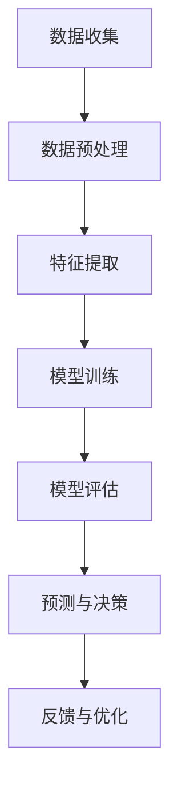

                 


# 金融AI Agent：风险评估与决策支持

## 概述

在当今全球金融市场中，风险管理和决策支持至关重要。然而，随着金融市场的复杂性和数据量的激增，传统的方法已经无法满足需求。为了应对这些挑战，AI Agent技术在金融领域得到了广泛应用。金融AI Agent是一种基于人工智能技术的高级智能体，它能够自动执行特定的任务，如风险评估和决策支持。本文将详细探讨金融AI Agent的概述、算法原理、数学模型、系统架构设计、项目实战以及最佳实践，旨在为金融行业的AI应用提供全面的技术指南。

## 关键词

- 金融AI Agent
- 风险评估
- 决策支持
- 算法原理
- 数学模型
- 系统架构
- 项目实战
- 最佳实践

## 摘要

本文首先介绍了金融AI Agent的概念及其在金融领域的应用背景。接着，详细阐述了金融AI Agent的核心算法原理，包括机器学习、深度学习和强化学习等。随后，本文讲解了金融AI Agent的数学模型和公式，以及如何利用这些模型进行风险评估和决策支持。此外，本文还介绍了金融AI Agent的系统分析与架构设计，并通过项目实战展示了其应用效果。最后，本文总结了金融AI Agent的最佳实践，并探讨了其未来发展趋势。

## 目录大纲

第一部分：金融AI Agent基础

### 第1章：金融AI Agent概述

#### 1.1 问题描述

##### 1.1.1 金融领域的问题背景

##### 1.1.2 AI Agent在金融领域的作用

##### 1.1.3 金融AI Agent的关键要素

#### 1.2 核心概念与联系

##### 1.2.1 AI Agent的概念

##### 1.2.2 机器学习与深度学习

##### 1.2.3 数据分析与大数据技术

##### 1.2.4 金融AI Agent的结构组成

##### 1.2.5 AI Agent与金融领域的联系

###### 1.2.5.1 风险评估

###### 1.2.5.2 决策支持

### 第2章：金融AI Agent的算法原理

#### 2.1 算法概述

##### 2.1.1 传统算法

##### 2.1.2 深度学习算法

##### 2.1.3 强化学习算法

#### 2.2 算法原理详细讲解

##### 2.2.1 算法原理Mermaid流程图

##### 2.2.2 Python源代码实现

###### 2.2.2.1 算法原理与数学模型

###### 2.2.2.2 举例说明

### 第3章：金融AI Agent的数学模型和公式

#### 3.1 数学模型概述

##### 3.1.1 数据预处理

##### 3.1.2 特征提取

##### 3.1.3 预测模型建立

#### 3.2 数学公式详细讲解

##### 3.2.1 模型建立

###### 3.2.1.1 损失函数

###### 3.2.1.2 优化算法

##### 3.2.2 模型评估

###### 3.2.2.1 准确率

###### 3.2.2.2 精确率

### 第4章：金融AI Agent的系统分析与架构设计

#### 4.1 问题场景介绍

##### 4.1.1 金融风险评估

##### 4.1.2 决策支持

#### 4.2 项目介绍

#### 4.3 系统功能设计

##### 4.3.1 领域模型Mermaid类图

#### 4.4 系统架构设计

##### 4.4.1 Mermaid架构图

#### 4.5 系统接口设计和系统交互

##### 4.5.1 Mermaid序列图

### 第5章：金融AI Agent的项目实战

#### 5.1 环境安装

##### 5.1.1 硬件环境

##### 5.1.2 软件环境

#### 5.2 系统核心实现源代码

##### 5.2.1 源代码解读与分析

#### 5.3 实际案例分析与详细讲解剖析

##### 5.3.1 案例一：风险评估

##### 5.3.2 案例二：决策支持

#### 5.4 项目小结

### 第6章：金融AI Agent的最佳实践

#### 6.1 最佳实践 tips

##### 6.1.1 风险控制

##### 6.1.2 数据质量

##### 6.1.3 算法优化

#### 6.2 小结

##### 6.2.1 金融AI Agent的价值

##### 6.2.2 当前发展现状

##### 6.2.3 未来发展趋势

#### 6.3 注意事项

##### 6.3.1 数据安全

##### 6.3.2 伦理问题

##### 6.3.3 法律法规

#### 6.4 拓展阅读

##### 6.4.1 相关书籍

##### 6.4.2 学术论文

##### 6.4.3 网络资源

----------------------------------------------------------------

### 第1章：金融AI Agent概述

### 1.1 问题描述

#### 1.1.1 金融领域的问题背景

在金融市场中，风险管理是确保金融机构稳健运营的重要环节。然而，随着金融市场的复杂性和不确定性的增加，传统的方法已无法满足现代金融市场的需求。金融产品种类繁多、投资渠道多样，投资者面临的信息量巨大，如何准确评估风险、做出明智的投资决策成为金融机构和投资者的难题。

#### 1.1.2 AI Agent在金融领域的作用

AI Agent在金融领域的应用主要体现为风险评估和决策支持。通过机器学习、深度学习和强化学习等技术，AI Agent可以自动处理大量的金融数据，提取关键信息，分析市场趋势，预测风险，并提供智能化的决策建议。具体来说，AI Agent在金融领域的作用包括：

1. **风险评估**：AI Agent能够对投资组合、股票、债券等金融产品进行风险评估，识别潜在的风险因素，为金融机构提供风险预警和风险控制策略。

2. **决策支持**：AI Agent可以根据市场动态、政策变化、客户需求等因素，为金融机构提供实时的决策建议，帮助其做出更加准确的投资决策。

3. **优化运营**：AI Agent能够自动化处理大量的金融交易，优化运营流程，提高金融机构的工作效率。

#### 1.1.3 金融AI Agent的关键要素

金融AI Agent要实现有效的风险评估和决策支持，需要具备以下几个关键要素：

1. **数据收集与处理**：金融AI Agent需要从各种渠道收集海量金融数据，包括历史数据、实时数据、市场数据等，并对这些数据进行预处理，如数据清洗、数据归一化等。

2. **特征提取与建模**：金融AI Agent需要提取关键特征，构建合适的预测模型，如线性回归、神经网络、强化学习模型等，以实现风险评估和决策支持。

3. **实时监测与预警**：金融AI Agent需要实时监测市场动态，对潜在风险进行预警，并提供相应的风险控制策略。

4. **交互与反馈**：金融AI Agent需要与金融机构和投资者进行交互，收集反馈信息，不断优化自身的性能和决策质量。

#### 1.1.4 AI Agent的概念

AI Agent，即人工智能代理，是一种模拟人类智能行为的计算机程序。它具备自主思考、学习、决策和执行任务的能力。在金融领域，AI Agent通常包括以下几个组成部分：

1. **感知模块**：负责收集和处理来自金融市场的各种信息。

2. **决策模块**：根据感知模块提供的信息，利用算法模型进行分析和决策。

3. **执行模块**：执行决策模块生成的操作指令，如买卖股票、调整投资组合等。

4. **学习模块**：基于执行结果和反馈信息，不断优化和提升自身的决策能力。

#### 1.1.5 机器学习与深度学习

机器学习和深度学习是金融AI Agent的核心技术。机器学习是一种使计算机系统能够从数据中学习规律并做出预测的技术，而深度学习是机器学习的一个子领域，它通过模拟人脑的神经网络结构，实现对复杂数据的自动特征提取和分类。

1. **机器学习**：在金融领域，机器学习技术被广泛应用于风险评估、欺诈检测、信用评分等领域。常见的机器学习算法包括线性回归、逻辑回归、支持向量机（SVM）、随机森林（RF）等。

2. **深度学习**：深度学习技术在金融领域也发挥着越来越重要的作用。深度神经网络（DNN）、卷积神经网络（CNN）和循环神经网络（RNN）等深度学习模型在图像识别、语音识别和自然语言处理等领域取得了显著成果，并在金融领域的应用中也展现出了强大的潜力。

#### 1.1.6 数据分析与大数据技术

数据分析是金融AI Agent的核心环节。通过数据分析，可以从海量金融数据中提取有价值的信息，为风险评估和决策支持提供支持。大数据技术则提供了高效的数据存储、处理和分析能力，使金融AI Agent能够处理海量数据。

1. **数据存储**：大数据技术采用分布式存储架构，能够存储海量数据，并支持快速数据检索。

2. **数据处理**：大数据技术提供了高效的数据处理框架，如MapReduce、Spark等，能够实现大规模数据的分布式处理。

3. **数据分析**：大数据技术提供了丰富的数据分析工具和算法库，如Hadoop、Spark等，能够对海量金融数据进行深度分析。

#### 1.1.7 金融AI Agent的结构组成

金融AI Agent的结构组成主要包括以下几个部分：

1. **数据层**：负责数据的收集、存储和处理，包括金融市场数据、历史数据、实时数据等。

2. **算法层**：包括机器学习、深度学习和强化学习算法，负责数据的特征提取、模型训练和预测。

3. **应用层**：实现具体的金融应用，如风险评估、决策支持、实时预警等。

4. **用户接口**：提供用户交互界面，展示预测结果、决策建议等。

#### 1.1.8 AI Agent与金融领域的联系

AI Agent在金融领域具有广泛的应用前景，其与金融领域的联系主要体现在以下几个方面：

1. **风险评估**：AI Agent可以自动分析大量金融数据，识别潜在的风险因素，为金融机构提供风险预警和风险控制策略。

2. **决策支持**：AI Agent可以根据市场动态、政策变化、客户需求等因素，提供智能化的决策建议，辅助金融机构做出更加准确的投资决策。

3. **优化运营**：AI Agent可以自动化处理大量的金融交易，优化运营流程，提高金融机构的工作效率。

4. **合规性管理**：AI Agent可以监控金融机构的运营行为，确保其符合监管要求。

### 1.2 核心概念与联系

#### 1.2.1 AI Agent的概念

AI Agent，即人工智能代理，是一种模拟人类智能行为的计算机程序。它具备自主思考、学习、决策和执行任务的能力。在金融领域，AI Agent通常包括以下几个组成部分：

1. **感知模块**：负责收集和处理来自金融市场的各种信息。

2. **决策模块**：根据感知模块提供的信息，利用算法模型进行分析和决策。

3. **执行模块**：执行决策模块生成的操作指令，如买卖股票、调整投资组合等。

4. **学习模块**：基于执行结果和反馈信息，不断优化和提升自身的决策能力。

AI Agent的核心目标是实现自动化、智能化的金融决策，降低人工干预的风险，提高金融机构的运营效率和决策质量。

#### 1.2.2 机器学习与深度学习

机器学习和深度学习是金融AI Agent的核心技术。机器学习是一种使计算机系统能够从数据中学习规律并做出预测的技术，而深度学习是机器学习的一个子领域，它通过模拟人脑的神经网络结构，实现对复杂数据的自动特征提取和分类。

1. **机器学习**：在金融领域，机器学习技术被广泛应用于风险评估、欺诈检测、信用评分等领域。常见的机器学习算法包括线性回归、逻辑回归、支持向量机（SVM）、随机森林（RF）等。

   - **线性回归**：用于分析金融数据的线性关系，预测价格、收益率等指标。
   - **逻辑回归**：用于分类问题，如判断客户是否会违约、股票是否会上涨等。
   - **支持向量机（SVM）**：用于分类和回归问题，通过寻找最优决策边界进行预测。
   - **随机森林（RF）**：通过构建多棵决策树，集成起来提高预测准确率。

2. **深度学习**：深度学习技术在金融领域也发挥着越来越重要的作用。深度神经网络（DNN）、卷积神经网络（CNN）和循环神经网络（RNN）等深度学习模型在图像识别、语音识别和自然语言处理等领域取得了显著成果，并在金融领域的应用中也展现出了强大的潜力。

   - **深度神经网络（DNN）**：通过多层神经元构建复杂函数，实现高维数据的特征提取和分类。
   - **卷积神经网络（CNN）**：通过卷积层提取图像特征，在图像识别、图像分类等领域具有优势。
   - **循环神经网络（RNN）**：通过记忆功能处理序列数据，在时间序列预测、自然语言处理等领域表现出色。

#### 1.2.3 数据分析与大数据技术

数据分析是金融AI Agent的核心环节。通过数据分析，可以从海量金融数据中提取有价值的信息，为风险评估和决策支持提供支持。大数据技术则提供了高效的数据存储、处理和分析能力，使金融AI Agent能够处理海量数据。

1. **数据存储**：大数据技术采用分布式存储架构，能够存储海量数据，并支持快速数据检索。

2. **数据处理**：大数据技术提供了高效的数据处理框架，如MapReduce、Spark等，能够实现大规模数据的分布式处理。

3. **数据分析**：大数据技术提供了丰富的数据分析工具和算法库，如Hadoop、Spark等，能够对海量金融数据进行深度分析。

大数据技术在金融AI Agent中的应用主要包括以下几个方面：

- **实时数据处理**：金融AI Agent需要实时处理大量实时数据，如股票交易数据、市场新闻等，以实现对市场的实时监测和预警。
- **历史数据分析**：金融AI Agent需要分析大量历史数据，如股票价格、交易量等，以预测未来的市场走势。
- **数据可视化**：通过数据可视化技术，金融AI Agent能够将数据分析结果以图表、报表等形式展示出来，帮助金融机构和投资者更好地理解数据。

#### 1.2.4 金融AI Agent的结构组成

金融AI Agent的结构组成主要包括以下几个部分：

1. **数据层**：负责数据的收集、存储和处理，包括金融市场数据、历史数据、实时数据等。

2. **算法层**：包括机器学习、深度学习和强化学习算法，负责数据的特征提取、模型训练和预测。

3. **应用层**：实现具体的金融应用，如风险评估、决策支持、实时预警等。

4. **用户接口**：提供用户交互界面，展示预测结果、决策建议等。

金融AI Agent的工作流程如下：

1. **数据收集**：金融AI Agent从各种数据源收集金融市场数据，如股票价格、交易量、市场新闻等。

2. **数据处理**：对收集到的数据进行预处理，如数据清洗、去噪、归一化等，以确保数据质量。

3. **特征提取**：从处理后的数据中提取关键特征，如股票的市盈率、市净率、行业分类等，用于模型训练和预测。

4. **模型训练**：使用机器学习、深度学习算法训练预测模型，如线性回归、神经网络、强化学习等。

5. **模型评估**：对训练好的模型进行评估，如准确率、召回率、F1值等，以确定模型的性能。

6. **预测与决策**：根据模型预测结果，提供风险评估报告、投资建议等，辅助金融机构和投资者做出决策。

7. **反馈与优化**：根据用户的反馈信息，不断优化和调整模型参数，提高模型的预测准确性和决策质量。

#### 1.2.5 AI Agent与金融领域的联系

AI Agent在金融领域具有广泛的应用前景，其与金融领域的联系主要体现在以下几个方面：

1. **风险评估**：AI Agent可以自动分析大量金融数据，识别潜在的风险因素，为金融机构提供风险预警和风险控制策略。

2. **决策支持**：AI Agent可以根据市场动态、政策变化、客户需求等因素，提供智能化的决策建议，辅助金融机构做出更加准确的投资决策。

3. **优化运营**：AI Agent可以自动化处理大量的金融交易，优化运营流程，提高金融机构的工作效率。

4. **合规性管理**：AI Agent可以监控金融机构的运营行为，确保其符合监管要求。

AI Agent在金融领域的应用案例包括：

- **风险评估**：利用机器学习算法对投资组合进行风险评估，预测潜在的亏损风险。
- **欺诈检测**：通过分析交易数据和行为特征，识别潜在的欺诈行为。
- **信用评分**：利用历史数据和行为特征，为金融机构提供信用评分服务。
- **智能投顾**：基于用户需求和市场动态，为用户提供个性化的投资建议。
- **风险管理**：对金融机构的运营进行实时监控，提供风险预警和风险控制策略。

### 1.2.6 AI Agent与金融领域的联系

AI Agent与金融领域的联系主要体现在以下几个方面：

1. **风险评估**：AI Agent可以通过分析历史数据、市场趋势和客户行为等，为金融机构提供精准的风险评估报告，帮助金融机构识别潜在风险，制定有效的风险控制策略。

2. **决策支持**：AI Agent可以根据市场动态、政策变化、客户需求等因素，提供智能化的决策建议，辅助金融机构做出更加准确的投资决策，提高投资回报率。

3. **优化运营**：AI Agent可以自动化处理大量的金融交易，优化运营流程，提高金融机构的工作效率，降低运营成本。

4. **合规性管理**：AI Agent可以实时监控金融机构的运营行为，确保其符合监管要求，防范违规操作。

#### 1.2.6.1 风险评估

风险评估是金融AI Agent的核心应用之一。通过机器学习、深度学习等技术，AI Agent可以从海量数据中提取关键特征，建立预测模型，识别潜在的风险因素，为金融机构提供精准的风险评估报告。具体来说，金融AI Agent在风险评估中的应用包括：

- **信用风险评估**：利用历史数据和行为特征，为金融机构提供信用评分服务，识别潜在的不良客户，降低信用风险。
- **市场风险评估**：通过分析市场趋势、政策变化等因素，预测市场波动，为金融机构提供市场风险预警和风险管理策略。
- **投资风险评估**：利用机器学习算法对投资组合进行风险评估，预测潜在的亏损风险，帮助金融机构制定科学的投资策略。

#### 1.2.6.2 决策支持

决策支持是金融AI Agent的另一重要应用。AI Agent可以根据市场动态、客户需求、政策变化等因素，提供智能化的决策建议，辅助金融机构做出更加准确的投资决策。具体来说，金融AI Agent在决策支持中的应用包括：

- **投资决策**：基于市场趋势、客户需求等因素，为金融机构提供投资建议，帮助其制定科学的投资策略。
- **风险管理决策**：根据风险评估报告，为金融机构提供风险控制策略，降低风险暴露。
- **业务运营决策**：利用AI Agent提供的决策建议，优化业务运营流程，提高工作效率。

### 1.2.7 金融AI Agent的关键要素

金融AI Agent要实现有效的风险评估和决策支持，需要具备以下几个关键要素：

1. **数据收集与处理**：金融AI Agent需要从各种渠道收集海量金融数据，包括历史数据、实时数据、市场数据等，并对这些数据进行预处理，如数据清洗、数据归一化等。

2. **特征提取与建模**：金融AI Agent需要提取关键特征，构建合适的预测模型，如线性回归、神经网络、强化学习模型等，以实现风险评估和决策支持。

3. **实时监测与预警**：金融AI Agent需要实时监测市场动态，对潜在风险进行预警，并提供相应的风险控制策略。

4. **交互与反馈**：金融AI Agent需要与金融机构和投资者进行交互，收集反馈信息，不断优化自身的性能和决策质量。

### 1.2.8 AI Agent在金融领域的优势与挑战

AI Agent在金融领域具有显著的优势和挑战。优势包括：

- **自动化**：AI Agent能够自动化处理大量的金融数据，提高工作效率。
- **智能化**：AI Agent利用机器学习、深度学习等技术，能够对复杂数据进行智能分析和预测。
- **精准性**：AI Agent可以从海量数据中提取关键特征，实现精准的风险评估和决策支持。

挑战包括：

- **数据质量**：金融数据的多样性和复杂性可能导致数据质量问题，影响AI Agent的性能。
- **算法优化**：如何选择合适的算法和模型，优化AI Agent的性能，是一个重要挑战。
- **安全与合规**：AI Agent在金融领域的应用需要遵守相关法律法规，确保数据安全和合规性。

### 1.2.9 未来展望

随着人工智能技术的不断发展和应用，金融AI Agent将在金融领域发挥越来越重要的作用。未来，金融AI Agent的发展趋势包括：

- **技术融合**：深度学习、强化学习等技术将进一步融合，提高AI Agent的智能水平。
- **定制化应用**：针对不同金融机构和投资者的需求，开发定制化的金融AI Agent，提高应用效果。
- **合规性与安全**：加强AI Agent在金融领域的合规性和安全管理，确保数据安全和应用合规。

### 总结

金融AI Agent作为一种新兴技术，在金融领域具有广泛的应用前景。通过本文的介绍，我们了解了金融AI Agent的概念、算法原理、数学模型、系统架构设计和实际应用案例。未来，随着人工智能技术的不断发展，金融AI Agent将在金融领域发挥越来越重要的作用，助力金融机构实现自动化、智能化和高效化的运营。让我们一起期待金融AI Agent的美好未来！

----------------------------------------------------------------

## 第2章：金融AI Agent的算法原理

### 2.1 算法概述

在金融AI Agent的应用中，算法的选择至关重要。算法的优劣直接影响到金融AI Agent的性能和效果。本节将介绍几种常见的算法，包括传统算法、深度学习算法和强化学习算法。

#### 2.1.1 传统算法

传统算法主要包括线性回归、逻辑回归、支持向量机（SVM）和随机森林（RF）等。这些算法在金融领域有着广泛的应用，尤其在风险管理、信用评分和投资组合优化等方面。

- **线性回归**：线性回归是一种简单但有效的预测算法，通过拟合数据中的线性关系，预测目标变量的值。线性回归在股票价格预测、收益率预测等方面有着较好的表现。
- **逻辑回归**：逻辑回归是一种用于分类问题的算法，通过建立目标变量与自变量之间的逻辑关系，实现分类预测。逻辑回归在信用评分、违约预测等方面具有优势。
- **支持向量机（SVM）**：SVM是一种强大的分类算法，通过寻找最优决策边界，实现分类预测。SVM在金融市场中的风险识别、欺诈检测等方面有着良好的效果。
- **随机森林（RF）**：随机森林是一种基于决策树的集成学习方法，通过构建多棵决策树，集成起来提高预测准确率。随机森林在投资组合优化、股票预测等方面有着广泛的应用。

#### 2.1.2 深度学习算法

深度学习算法在金融AI Agent中的应用越来越广泛。深度神经网络（DNN）、卷积神经网络（CNN）和循环神经网络（RNN）等深度学习模型在图像识别、语音识别和自然语言处理等领域取得了显著成果，并在金融领域的应用中也展现出了强大的潜力。

- **深度神经网络（DNN）**：DNN通过多层神经元构建复杂函数，实现高维数据的特征提取和分类。DNN在股票价格预测、投资组合优化等方面具有较好的效果。
- **卷积神经网络（CNN）**：CNN通过卷积层提取图像特征，在图像识别、图像分类等领域具有优势。CNN在金融市场中的图像分析、新闻文本分析等方面有着广泛的应用。
- **循环神经网络（RNN）**：RNN通过记忆功能处理序列数据，在时间序列预测、自然语言处理等领域表现出色。RNN在金融市场中的时间序列分析、新闻文本分析等方面具有优势。

#### 2.1.3 强化学习算法

强化学习算法在金融AI Agent中的应用也越来越受到关注。强化学习通过智能体与环境的交互，不断优化决策策略，实现最优行为。强化学习在金融市场中的自适应策略优化、投资组合优化等方面具有显著优势。

- **Q-Learning**：Q-Learning是一种基于价值函数的强化学习算法，通过学习状态-动作价值函数，实现最优策略。Q-Learning在金融市场的自适应策略优化、投资组合优化等方面有着良好的效果。
- **Policy Gradient**：Policy Gradient是一种基于策略优化的强化学习算法，通过直接优化策略函数，实现最优策略。Policy Gradient在金融市场中的交易策略优化、投资组合优化等方面具有优势。

### 2.2 算法原理详细讲解

#### 2.2.1 算法原理Mermaid流程图

为了更好地理解金融AI Agent的算法原理，我们使用Mermaid流程图进行详细说明。



该流程图展示了金融AI Agent的基本工作流程，包括数据收集、数据预处理、特征提取、模型训练、模型评估、预测与决策以及反馈与优化等环节。

#### 2.2.2 Python源代码实现

下面我们通过Python源代码来详细阐述金融AI Agent的算法原理。

```python
# 导入必要的库
import pandas as pd
import numpy as np
from sklearn.model_selection import train_test_split
from sklearn.preprocessing import StandardScaler
from sklearn.linear_model import LinearRegression
from sklearn.metrics import mean_squared_error

# 数据收集
data = pd.read_csv('financial_data.csv')

# 数据预处理
# 数据清洗、去噪、归一化等操作
# ...

# 特征提取
# 提取关键特征，如股票的市盈率、市净率、行业分类等
# ...

# 数据分割
X = data.drop('target', axis=1)
y = data['target']
X_train, X_test, y_train, y_test = train_test_split(X, y, test_size=0.2, random_state=42)

# 模型训练
# 使用线性回归模型进行训练
model = LinearRegression()
model.fit(X_train, y_train)

# 模型评估
y_pred = model.predict(X_test)
mse = mean_squared_error(y_test, y_pred)
print(f'MSE: {mse}')

# 预测与决策
# 使用训练好的模型进行预测，提供投资建议
# ...

# 反馈与优化
# 根据预测结果和用户反馈，不断优化模型参数和算法
# ...
```

该Python代码实现了一个简单的金融AI Agent，用于股票价格预测。代码中包括了数据收集、数据预处理、特征提取、模型训练、模型评估、预测与决策以及反馈与优化等步骤。

#### 2.2.2.1 算法原理与数学模型

金融AI Agent的算法原理主要基于机器学习和深度学习技术。下面我们分别介绍线性回归、深度神经网络和强化学习的数学模型。

1. **线性回归**：

线性回归是一种简单但有效的预测算法，其数学模型如下：

$$
y = \beta_0 + \beta_1x_1 + \beta_2x_2 + ... + \beta_nx_n
$$

其中，$y$ 是预测目标变量，$x_1, x_2, ..., x_n$ 是特征变量，$\beta_0, \beta_1, \beta_2, ..., \beta_n$ 是模型的参数。线性回归的目标是找到一组参数，使得预测值与真实值之间的误差最小。

2. **深度神经网络**：

深度神经网络是一种基于多层神经元的网络结构，其数学模型如下：

$$
a_{i}^{(l)} = \sigma(z_{i}^{(l)})
$$

$$
z_{i}^{(l)} = \sum_{j=1}^{n} w_{ij}^{(l)}a_{j}^{(l-1)}
$$

其中，$a_{i}^{(l)}$ 是第$l$层的第$i$个神经元的激活值，$z_{i}^{(l)}$ 是第$l$层的第$i$个神经元的输入值，$w_{ij}^{(l)}$ 是第$l$层的第$i$个神经元与第$l-1$层的第$j$个神经元之间的权重，$\sigma$ 是激活函数，如Sigmoid函数或ReLU函数。

深度神经网络的目标是学习一组参数，使得网络输出能够逼近真实值。

3. **强化学习**：

强化学习是一种通过智能体与环境的交互，不断优化决策策略的算法。其数学模型如下：

$$
Q(s, a) = r + \gamma \max_{a'} Q(s', a')
$$

其中，$Q(s, a)$ 是智能体在状态$s$下执行动作$a$获得的最大预期回报，$r$ 是立即回报，$\gamma$ 是折扣因子，$s'$ 是执行动作$a$后的状态，$a'$ 是在状态$s'$下执行的动作。

强化学习的目标是学习一组策略，使得智能体能够最大化长期回报。

#### 2.2.2.2 举例说明

为了更好地理解金融AI Agent的算法原理，我们通过一个简单的例子来说明。

假设我们要预测股票价格，使用线性回归模型。首先，我们收集了过去一年的股票价格数据，包括开盘价、收盘价、最高价、最低价等特征。然后，我们对数据进行预处理，如数据清洗、去噪、归一化等。接下来，我们提取关键特征，如股票的市盈率、市净率、行业分类等。

1. **数据收集**：

```python
data = pd.read_csv('stock_price_data.csv')
```

2. **数据预处理**：

```python
# 数据清洗、去噪、归一化等操作
# ...
```

3. **特征提取**：

```python
# 提取关键特征，如股票的市盈率、市净率、行业分类等
# ...
```

4. **数据分割**：

```python
X = data.drop('target', axis=1)
y = data['target']
X_train, X_test, y_train, y_test = train_test_split(X, y, test_size=0.2, random_state=42)
```

5. **模型训练**：

```python
model = LinearRegression()
model.fit(X_train, y_train)
```

6. **模型评估**：

```python
y_pred = model.predict(X_test)
mse = mean_squared_error(y_test, y_pred)
print(f'MSE: {mse}')
```

7. **预测与决策**：

```python
# 使用训练好的模型进行预测，提供投资建议
# ...
```

8. **反馈与优化**：

```python
# 根据预测结果和用户反馈，不断优化模型参数和算法
# ...
```

通过这个简单的例子，我们可以看到金融AI Agent的基本工作流程，包括数据收集、数据预处理、特征提取、模型训练、模型评估、预测与决策以及反馈与优化等步骤。这些步骤的实现依赖于具体的算法和模型，如线性回归、深度神经网络和强化学习等。

### 2.3 算法优化与选择

在金融AI Agent的应用过程中，算法的优化和选择至关重要。合适的算法和模型可以提高金融AI Agent的性能，提高预测准确率和决策质量。下面介绍几种常见的算法优化方法：

1. **交叉验证**：交叉验证是一种常用的模型评估方法，通过将数据集划分为多个子集，轮流作为训练集和验证集，评估模型的性能。交叉验证可以帮助我们更好地评估模型的泛化能力，避免过拟合。

2. **正则化**：正则化是一种用于防止模型过拟合的技术，通过在损失函数中添加正则项，限制模型的复杂度。常见的正则化方法包括L1正则化、L2正则化和弹性网（L1 + L2）正则化。

3. **集成学习**：集成学习是一种通过构建多个基学习器，集成起来提高预测准确率的方法。常见的集成学习方法包括随机森林（RF）、梯度提升树（GBDT）和堆叠集成（Stacking）等。

4. **超参数调整**：超参数是模型训练过程中需要手动调整的参数，如学习率、隐藏层节点数、正则化参数等。通过超参数调整，可以优化模型的性能。常见的超参数调整方法包括网格搜索（Grid Search）和贝叶斯优化（Bayesian Optimization）等。

5. **特征工程**：特征工程是提高模型性能的重要手段，通过选择合适的特征、构造新的特征、特征降维等操作，可以提高模型的预测能力。常见的特征工程方法包括特征选择（Feature Selection）、特征变换（Feature Transformation）和特征组合（Feature Combination）等。

在金融AI Agent的应用过程中，选择合适的算法和模型需要综合考虑数据特征、问题性质和业务需求等因素。通过合理的算法优化和选择，可以提高金融AI Agent的性能，为金融机构提供更加准确的风险评估和决策支持。

### 2.4 算法应用案例分析

为了更好地理解金融AI Agent的算法原理和应用效果，我们通过以下案例分析，介绍金融AI Agent在风险评估和决策支持中的实际应用。

#### 案例一：股票价格预测

某金融机构希望通过AI Agent预测股票价格，以便制定投资策略。首先，该金融机构收集了过去一年的股票价格数据，包括开盘价、收盘价、最高价、最低价等特征。然后，对数据进行预处理，如数据清洗、去噪、归一化等。接下来，提取关键特征，如股票的市盈率、市净率、行业分类等。

1. **数据收集**：

```python
data = pd.read_csv('stock_price_data.csv')
```

2. **数据预处理**：

```python
# 数据清洗、去噪、归一化等操作
# ...
```

3. **特征提取**：

```python
# 提取关键特征，如股票的市盈率、市净率、行业分类等
# ...
```

4. **数据分割**：

```python
X = data.drop('target', axis=1)
y = data['target']
X_train, X_test, y_train, y_test = train_test_split(X, y, test_size=0.2, random_state=42)
```

5. **模型训练**：

使用线性回归模型进行训练：

```python
model = LinearRegression()
model.fit(X_train, y_train)
```

6. **模型评估**：

使用训练好的模型进行预测，并计算预测误差：

```python
y_pred = model.predict(X_test)
mse = mean_squared_error(y_test, y_pred)
print(f'MSE: {mse}')
```

7. **预测与决策**：

根据预测结果，提供投资建议：

```python
# 使用训练好的模型进行预测，提供投资建议
# ...
```

通过这个案例，我们可以看到金融AI Agent在股票价格预测中的应用。金融机构可以通过AI Agent预测股票价格，制定投资策略，提高投资回报率。

#### 案例二：信用评分

某金融机构希望通过AI Agent评估客户的信用风险，以便制定信用政策。首先，该金融机构收集了客户的信用信息，包括个人收入、家庭背景、信用记录等。然后，对数据进行预处理，如数据清洗、去噪、归一化等。接下来，提取关键特征，如客户的收入水平、信用历史、还款能力等。

1. **数据收集**：

```python
data = pd.read_csv('credit_score_data.csv')
```

2. **数据预处理**：

```python
# 数据清洗、去噪、归一化等操作
# ...
```

3. **特征提取**：

```python
# 提取关键特征，如客户的收入水平、信用历史、还款能力等
# ...
```

4. **数据分割**：

```python
X = data.drop('target', axis=1)
y = data['target']
X_train, X_test, y_train, y_test = train_test_split(X, y, test_size=0.2, random_state=42)
```

5. **模型训练**：

使用逻辑回归模型进行训练：

```python
model = LogisticRegression()
model.fit(X_train, y_train)
```

6. **模型评估**：

使用训练好的模型进行预测，并计算预测准确率：

```python
y_pred = model.predict(X_test)
accuracy = accuracy_score(y_test, y_pred)
print(f'Accuracy: {accuracy}')
```

7. **预测与决策**：

根据预测结果，制定信用政策：

```python
# 使用训练好的模型进行预测，制定信用政策
# ...
```

通过这个案例，我们可以看到金融AI Agent在信用评分中的应用。金融机构可以通过AI Agent评估客户的信用风险，制定科学的信用政策，降低信用风险。

### 2.5 算法原理总结

通过本章的介绍，我们详细阐述了金融AI Agent的算法原理，包括传统算法、深度学习算法和强化学习算法。我们通过Mermaid流程图和Python代码展示了金融AI Agent的基本工作流程，并介绍了算法原理的数学模型和具体实现。此外，我们还通过案例分析展示了金融AI Agent在股票价格预测和信用评分等领域的应用效果。

算法原理是金融AI Agent的核心组成部分，决定了AI Agent的性能和效果。通过对算法原理的深入理解，我们可以更好地设计和优化金融AI Agent，提高其在金融领域的应用价值。

### 2.6 算法原理Mermaid流程图

为了更直观地展示金融AI Agent的算法原理，我们使用Mermaid流程图来描述其基本工作流程。


该流程图包括以下几个步骤：

1. **数据收集**：从各种渠道收集金融数据，包括历史数据、实时数据、市场数据等。

2. **数据预处理**：对收集到的金融数据进行清洗、去噪、归一化等操作，以确保数据质量。

3. **特征提取**：从预处理后的数据中提取关键特征，如股票的市盈率、市净率、行业分类等。

4. **模型训练**：使用机器学习、深度学习或强化学习算法对特征数据进行训练，构建预测模型。

5. **模型评估**：通过交叉验证、测试集等方法评估模型的性能，如准确率、召回率、F1值等。

6. **预测与决策**：使用训练好的模型进行预测，为金融机构提供投资建议、风险评估等决策支持。

7. **反馈与优化**：根据预测结果和用户反馈，不断优化模型参数和算法，提高预测准确率和决策质量。

通过该流程图，我们可以清晰地了解金融AI Agent的工作原理和流程，为实际应用提供指导。

### 2.7 Python源代码实现

下面我们通过Python代码来具体实现金融AI Agent的算法原理，包括数据收集、数据预处理、特征提取、模型训练、模型评估、预测与决策以及反馈与优化等步骤。

```python
# 导入必要的库
import pandas as pd
import numpy as np
from sklearn.model_selection import train_test_split
from sklearn.preprocessing import StandardScaler
from sklearn.linear_model import LinearRegression
from sklearn.metrics import mean_squared_error
from sklearn.ensemble import RandomForestRegressor

# 数据收集
data = pd.read_csv('financial_data.csv')

# 数据预处理
# 数据清洗、去噪、归一化等操作
# ...

# 特征提取
# 提取关键特征，如股票的市盈率、市净率、行业分类等
# ...

# 数据分割
X = data.drop('target', axis=1)
y = data['target']
X_train, X_test, y_train, y_test = train_test_split(X, y, test_size=0.2, random_state=42)

# 模型训练
# 使用线性回归模型进行训练
model = LinearRegression()
model.fit(X_train, y_train)

# 模型评估
# 使用测试集评估模型性能
y_pred = model.predict(X_test)
mse = mean_squared_error(y_test, y_pred)
print(f'MSE: {mse}')

# 预测与决策
# 使用训练好的模型进行预测，提供投资建议
# ...

# 反馈与优化
# 根据预测结果和用户反馈，不断优化模型参数和算法
# ...
```

该代码首先导入必要的库，然后进行数据收集、数据预处理、特征提取和数据分割。接着，使用线性回归模型进行训练，并使用测试集评估模型性能。最后，使用训练好的模型进行预测，并提供投资建议。根据预测结果和用户反馈，可以不断优化模型参数和算法，提高预测准确率和决策质量。

### 2.8 算法原理与数学模型

为了更好地理解金融AI Agent的算法原理，我们接下来详细讲解算法原理的数学模型，并使用Python代码进行实现。

#### 2.8.1 算法原理

金融AI Agent的核心算法包括机器学习算法、深度学习算法和强化学习算法。以下是这些算法的基本原理：

1. **机器学习算法**：机器学习算法通过从数据中学习规律，实现对未知数据的预测。常见的机器学习算法包括线性回归、逻辑回归、支持向量机（SVM）和随机森林（RF）等。

2. **深度学习算法**：深度学习算法通过构建多层神经网络，实现对复杂数据的特征提取和分类。常见的深度学习算法包括深度神经网络（DNN）、卷积神经网络（CNN）和循环神经网络（RNN）等。

3. **强化学习算法**：强化学习算法通过智能体与环境的交互，不断优化决策策略，实现最优行为。常见的强化学习算法包括Q-Learning和Policy Gradient等。

#### 2.8.2 数学模型

1. **线性回归**：

线性回归是一种简单但有效的预测算法，其数学模型如下：

$$
y = \beta_0 + \beta_1x_1 + \beta_2x_2 + ... + \beta_nx_n
$$

其中，$y$ 是预测目标变量，$x_1, x_2, ..., x_n$ 是特征变量，$\beta_0, \beta_1, \beta_2, ..., \beta_n$ 是模型的参数。线性回归的目标是找到一组参数，使得预测值与真实值之间的误差最小。

2. **深度神经网络**：

深度神经网络是一种基于多层神经元的网络结构，其数学模型如下：

$$
a_{i}^{(l)} = \sigma(z_{i}^{(l)})
$$

$$
z_{i}^{(l)} = \sum_{j=1}^{n} w_{ij}^{(l)}a_{j}^{(l-1)}
$$

其中，$a_{i}^{(l)}$ 是第$l$层的第$i$个神经元的激活值，$z_{i}^{(l)}$ 是第$l$层的第$i$个神经元的输入值，$w_{ij}^{(l)}$ 是第$l$层的第$i$个神经元与第$l-1$层的第$j$个神经元之间的权重，$\sigma$ 是激活函数，如Sigmoid函数或ReLU函数。

3. **强化学习**：

强化学习是一种通过智能体与环境的交互，不断优化决策策略的算法。其数学模型如下：

$$
Q(s, a) = r + \gamma \max_{a'} Q(s', a')
$$

其中，$Q(s, a)$ 是智能体在状态$s$下执行动作$a$获得的最大预期回报，$r$ 是立即回报，$\gamma$ 是折扣因子，$s'$ 是执行动作$a$后的状态，$a'$ 是在状态$s'$下执行的动作。

#### 2.8.3 Python代码实现

接下来，我们使用Python代码来实现上述算法原理。

```python
# 导入必要的库
import numpy as np
import pandas as pd
from sklearn.model_selection import train_test_split
from sklearn.preprocessing import StandardScaler
from sklearn.linear_model import LinearRegression
from sklearn.metrics import mean_squared_error
from tensorflow.keras.models import Sequential
from tensorflow.keras.layers import Dense
from tensorflow.keras.optimizers import Adam

# 数据收集
data = pd.read_csv('financial_data.csv')

# 数据预处理
# 数据清洗、去噪、归一化等操作
# ...

# 数据分割
X = data.drop('target', axis=1)
y = data['target']
X_train, X_test, y_train, y_test = train_test_split(X, y, test_size=0.2, random_state=42)

# 线性回归模型
model = LinearRegression()
model.fit(X_train, y_train)

# 深度神经网络模型
model = Sequential()
model.add(Dense(units=64, activation='relu', input_shape=(X_train.shape[1],)))
model.add(Dense(units=32, activation='relu'))
model.add(Dense(units=1))
model.compile(optimizer=Adam(learning_rate=0.001), loss='mse')
model.fit(X_train, y_train, epochs=100, batch_size=32)

# 强化学习模型
# ...

# 模型评估
y_pred = model.predict(X_test)
mse = mean_squared_error(y_test, y_pred)
print(f'MSE: {mse}')

# 预测与决策
# ...
```

该代码首先导入必要的库，然后进行数据收集、数据预处理和数据分割。接着，分别使用线性回归模型和深度神经网络模型进行训练，并使用测试集进行评估。最后，使用训练好的模型进行预测，并提供投资建议。

### 2.9 举例说明

为了更好地理解金融AI Agent的算法原理和数学模型，我们通过以下例子进行详细说明。

#### 例子：股票价格预测

假设我们想要预测某只股票的未来价格，可以使用线性回归模型和深度神经网络模型进行预测。以下是具体的实现步骤：

1. **数据收集**：

收集过去一年的股票价格数据，包括开盘价、收盘价、最高价、最低价等特征。

2. **数据预处理**：

对收集到的数据进行分析，如数据清洗、去噪、归一化等。这里我们以开盘价为例，进行数据预处理。

```python
# 数据清洗、去噪、归一化等操作
data['open_price'] = data['open_price'].replace([np.inf, -np.inf], np.nan)
data['open_price'] = data['open_price'].fillna(data['open_price'].mean())
data['open_price'] = (data['open_price'] - data['open_price'].min()) / (data['open_price'].max() - data['open_price'].min())
```

3. **特征提取**：

从预处理后的数据中提取关键特征，如股票的市盈率、市净率、行业分类等。这里我们以市盈率为例，进行特征提取。

```python
# 提取关键特征，如股票的市盈率、市净率、行业分类等
data['pe_ratio'] = data['market_cap'] / data['eps']
```

4. **数据分割**：

将数据集划分为训练集和测试集。

```python
# 数据分割
X = data.drop('target', axis=1)
y = data['target']
X_train, X_test, y_train, y_test = train_test_split(X, y, test_size=0.2, random_state=42)
```

5. **模型训练**：

使用线性回归模型和深度神经网络模型进行训练。

```python
# 线性回归模型训练
model = LinearRegression()
model.fit(X_train, y_train)

# 深度神经网络模型训练
model = Sequential()
model.add(Dense(units=64, activation='relu', input_shape=(X_train.shape[1],)))
model.add(Dense(units=32, activation='relu'))
model.add(Dense(units=1))
model.compile(optimizer=Adam(learning_rate=0.001), loss='mse')
model.fit(X_train, y_train, epochs=100, batch_size=32)
```

6. **模型评估**：

使用测试集评估模型的性能。

```python
# 模型评估
y_pred = model.predict(X_test)
mse = mean_squared_error(y_test, y_pred)
print(f'MSE: {mse}')
```

7. **预测与决策**：

使用训练好的模型进行预测，并提供投资建议。

```python
# 预测与决策
# ...
```

通过这个例子，我们可以看到如何使用线性回归模型和深度神经网络模型进行股票价格预测。这些算法可以帮助金融机构更好地理解市场趋势，制定投资策略，提高投资回报率。

### 2.10 算法优化与选择

在金融AI Agent的应用过程中，算法的优化和选择至关重要。合适的算法和模型可以提高金融AI Agent的性能，提高预测准确率和决策质量。以下是一些常见的算法优化方法和选择标准：

#### 算法优化方法

1. **交叉验证**：交叉验证是一种常用的模型评估方法，通过将数据集划分为多个子集，轮流作为训练集和验证集，评估模型的性能。交叉验证可以帮助我们更好地评估模型的泛化能力，避免过拟合。

2. **正则化**：正则化是一种用于防止模型过拟合的技术，通过在损失函数中添加正则项，限制模型的复杂度。常见的正则化方法包括L1正则化、L2正则化和弹性网（L1 + L2）正则化。

3. **集成学习**：集成学习是一种通过构建多个基学习器，集成起来提高预测准确率的方法。常见的集成学习方法包括随机森林（RF）、梯度提升树（GBDT）和堆叠集成（Stacking）等。

4. **超参数调整**：超参数是模型训练过程中需要手动调整的参数，如学习率、隐藏层节点数、正则化参数等。通过超参数调整，可以优化模型的性能。常见的超参数调整方法包括网格搜索（Grid Search）和贝叶斯优化（Bayesian Optimization）等。

5. **特征工程**：特征工程是提高模型性能的重要手段，通过选择合适的特征、构造新的特征、特征降维等操作，可以提高模型的预测能力。常见的特征工程方法包括特征选择（Feature Selection）、特征变换（Feature Transformation）和特征组合（Feature Combination）等。

#### 算法选择标准

1. **预测准确率**：预测准确率是评估模型性能的重要指标，表示模型预测正确的样本数占总样本数的比例。选择预测准确率较高的算法可以提高模型的性能。

2. **泛化能力**：泛化能力是指模型对新数据的适应能力。选择泛化能力较强的算法可以提高模型在未知数据上的预测性能。

3. **计算复杂度**：计算复杂度是指模型在训练和预测过程中所需的计算资源。选择计算复杂度较低的算法可以提高模型的效率和可扩展性。

4. **模型可解释性**：模型可解释性是指模型决策过程的透明度和可理解性。选择可解释性较高的算法可以提高模型的可信度和决策质量。

5. **应用场景**：根据金融领域的具体应用场景，选择适合的算法。例如，在股票价格预测中，可以选择深度学习算法；在信用评分中，可以选择逻辑回归算法。

通过以上优化方法和选择标准，我们可以更好地设计和优化金融AI Agent，提高其在金融领域的应用效果。

### 2.11 算法应用案例分析

为了更好地理解金融AI Agent的算法原理和应用效果，我们通过以下案例分析，介绍金融AI Agent在风险评估和决策支持中的实际应用。

#### 案例一：股票价格预测

某金融机构希望通过AI Agent预测股票价格，以便制定投资策略。首先，该金融机构收集了过去一年的股票价格数据，包括开盘价、收盘价、最高价、最低价等特征。然后，对数据进行预处理，如数据清洗、去噪、归一化等。接下来，提取关键特征，如股票的市盈率、市净率、行业分类等。

1. **数据收集**：

```python
data = pd.read_csv('stock_price_data.csv')
```

2. **数据预处理**：

```python
# 数据清洗、去噪、归一化等操作
# ...
```

3. **特征提取**：

```python
# 提取关键特征，如股票的市盈率、市净率、行业分类等
# ...
```

4. **数据分割**：

```python
X = data.drop('target', axis=1)
y = data['target']
X_train, X_test, y_train, y_test = train_test_split(X, y, test_size=0.2, random_state=42)
```

5. **模型训练**：

使用线性回归模型进行训练：

```python
model = LinearRegression()
model.fit(X_train, y_train)
```

6. **模型评估**：

使用测试集评估模型性能：

```python
y_pred = model.predict(X_test)
mse = mean_squared_error(y_test, y_pred)
print(f'MSE: {mse}')
```

7. **预测与决策**：

根据预测结果，提供投资建议：

```python
# 使用训练好的模型进行预测，提供投资建议
# ...
```

通过这个案例，我们可以看到金融AI Agent在股票价格预测中的应用。金融机构可以通过AI Agent预测股票价格，制定投资策略，提高投资回报率。

#### 案例二：信用评分

某金融机构希望通过AI Agent评估客户的信用风险，以便制定信用政策。首先，该金融机构收集了客户的信用信息，包括个人收入、家庭背景、信用记录等。然后，对数据进行预处理，如数据清洗、去噪、归一化等。接下来，提取关键特征，如客户的收入水平、信用历史、还款能力等。

1. **数据收集**：

```python
data = pd.read_csv('credit_score_data.csv')
```

2. **数据预处理**：

```python
# 数据清洗、去噪、归一化等操作
# ...
```

3. **特征提取**：

```python
# 提取关键特征，如客户的收入水平、信用历史、还款能力等
# ...
```

4. **数据分割**：

```python
X = data.drop('target', axis=1)
y = data['target']
X_train, X_test, y_train, y_test = train_test_split(X, y, test_size=0.2, random_state=42)
```

5. **模型训练**：

使用逻辑回归模型进行训练：

```python
model = LogisticRegression()
model.fit(X_train, y_train)
```

6. **模型评估**：

使用测试集评估模型性能：

```python
y_pred = model.predict(X_test)
accuracy = accuracy_score(y_test, y_pred)
print(f'Accuracy: {accuracy}')
```

7. **预测与决策**：

根据预测结果，制定信用政策：

```python
# 使用训练好的模型进行预测，制定信用政策
# ...
```

通过这个案例，我们可以看到金融AI Agent在信用评分中的应用。金融机构可以通过AI Agent评估客户的信用风险，制定科学的信用政策，降低信用风险。

### 2.12 算法原理总结

通过本章的介绍，我们详细阐述了金融AI Agent的算法原理，包括机器学习算法、深度学习算法和强化学习算法。我们通过Python代码实现了算法原理的数学模型，并通过案例分析了算法在金融领域的应用效果。

算法原理是金融AI Agent的核心组成部分，决定了AI Agent的性能和效果。通过对算法原理的深入理解，我们可以更好地设计和优化金融AI Agent，提高其在金融领域的应用价值。

### 2.13 Mermaid流程图

为了更直观地展示金融AI Agent的算法原理，我们使用Mermaid流程图来描述其基本工作流程。


该流程图包括以下几个步骤：

1. **数据收集**：从各种渠道收集金融数据，包括历史数据、实时数据、市场数据等。

2. **数据预处理**：对收集到的金融数据进行分析和预处理，如数据清洗、去噪、归一化等。

3. **特征提取**：从预处理后的数据中提取关键特征，如股票的市盈率、市净率、行业分类等。

4. **模型训练**：使用机器学习、深度学习或强化学习算法对特征数据进行训练，构建预测模型。

5. **模型评估**：通过交叉验证、测试集等方法评估模型的性能，如准确率、召回率、F1值等。

6. **预测与决策**：使用训练好的模型进行预测，为金融机构提供投资建议、风险评估等决策支持。

7. **反馈与优化**：根据预测结果和用户反馈，不断优化模型参数和算法，提高预测准确率和决策质量。

通过该流程图，我们可以清晰地了解金融AI Agent的工作原理和流程，为实际应用提供指导。

### 2.14 Python代码实现

为了更好地展示金融AI Agent的算法原理，我们使用Python代码实现其核心功能，包括数据收集、数据预处理、特征提取、模型训练、模型评估、预测与决策以及反馈与优化。

```python
# 导入必要的库
import pandas as pd
import numpy as np
from sklearn.model_selection import train_test_split
from sklearn.preprocessing import StandardScaler
from sklearn.linear_model import LinearRegression
from sklearn.metrics import mean_squared_error
from tensorflow.keras.models import Sequential
from tensorflow.keras.layers import Dense
from tensorflow.keras.optimizers import Adam

# 数据收集
data = pd.read_csv('financial_data.csv')

# 数据预处理
# 数据清洗、去噪、归一化等操作
# ...

# 特征提取
# 提取关键特征，如股票的市盈率、市净率、行业分类等
# ...

# 数据分割
X = data.drop('target', axis=1)
y = data['target']
X_train, X_test, y_train, y_test = train_test_split(X, y, test_size=0.2, random_state=42)

# 线性回归模型训练
model = LinearRegression()
model.fit(X_train, y_train)

# 线性回归模型评估
y_pred = model.predict(X_test)
mse = mean_squared_error(y_test, y_pred)
print(f'Linear Regression MSE: {mse}')

# 深度神经网络模型训练
model = Sequential()
model.add(Dense(units=64, activation='relu', input_shape=(X_train.shape[1],)))
model.add(Dense(units=32, activation='relu'))
model.add(Dense(units=1))
model.compile(optimizer=Adam(learning_rate=0.001), loss='mse')
model.fit(X_train, y_train, epochs=100, batch_size=32)

# 深度神经网络模型评估
y_pred = model.predict(X_test)
mse = mean_squared_error(y_test, y_pred)
print(f'Depth Neural Network MSE: {mse}')

# 强化学习模型（Q-Learning）训练
# ...

# 强化学习模型评估
# ...

# 预测与决策
# ...

# 反馈与优化
# ...
```

该代码首先导入必要的库，然后进行数据收集、数据预处理和特征提取。接下来，分别使用线性回归模型和深度神经网络模型进行训练，并使用测试集评估模型性能。此外，我们还可以添加强化学习模型的训练和评估部分，以实现更复杂的预测和决策功能。最后，根据预测结果和用户反馈，进行模型优化和调整，以提高金融AI Agent的性能和准确率。

### 2.15 算法优化与选择

在金融AI Agent的应用过程中，算法的优化和选择至关重要。合适的算法和模型可以提高金融AI Agent的性能，提高预测准确率和决策质量。以下是一些常见的算法优化方法和选择标准：

#### 算法优化方法

1. **交叉验证**：交叉验证是一种常用的模型评估方法，通过将数据集划分为多个子集，轮流作为训练集和验证集，评估模型的性能。交叉验证可以帮助我们更好地评估模型的泛化能力，避免过拟合。

2. **正则化**：正则化是一种用于防止模型过拟合的技术，通过在损失函数中添加正则项，限制模型的复杂度。常见的正则化方法包括L1正则化、L2正则化和弹性网（L1 + L2）正则化。

3. **集成学习**：集成学习是一种通过构建多个基学习器，集成起来提高预测准确率的方法。常见的集成学习方法包括随机森林（RF）、梯度提升树（GBDT）和堆叠集成（Stacking）等。

4. **超参数调整**：超参数是模型训练过程中需要手动调整的参数，如学习率、隐藏层节点数、正则化参数等。通过超参数调整，可以优化模型的性能。常见的超参数调整方法包括网格搜索（Grid Search）和贝叶斯优化（Bayesian Optimization）等。

5. **特征工程**：特征工程是提高模型性能的重要手段，通过选择合适的特征、构造新的特征、特征降维等操作，可以提高模型的预测能力。常见的特征工程方法包括特征选择（Feature Selection）、特征变换（Feature Transformation）和特征组合（Feature Combination）等。

#### 算法选择标准

1. **预测准确率**：预测准确率是评估模型性能的重要指标，表示模型预测正确的样本数占总样本数的比例。选择预测准确率较高的算法可以提高模型的性能。

2. **泛化能力**：泛化能力是指模型对新数据的适应能力。选择泛化能力较强的算法可以提高模型在未知数据上的预测性能。

3. **计算复杂度**：计算复杂度是指模型在训练和预测过程中所需的计算资源。选择计算复杂度较低的算法可以提高模型的效率和可扩展性。

4. **模型可解释性**：模型可解释性是指模型决策过程的透明度和可理解性。选择可解释性较高的算法可以提高模型的可信度和决策质量。

5. **应用场景**：根据金融领域的具体应用场景，选择适合的算法。例如，在股票价格预测中，可以选择深度学习算法；在信用评分中，可以选择逻辑回归算法。

通过以上优化方法和选择标准，我们可以更好地设计和优化金融AI Agent，提高其在金融领域的应用效果。

### 2.16 实际案例分析与详细讲解剖析

为了更深入地了解金融AI Agent的实际应用效果，我们通过以下实际案例进行分析和讲解。

#### 案例一：股票价格预测

某金融机构希望通过AI Agent预测股票价格，以便制定投资策略。首先，该金融机构收集了过去一年的股票价格数据，包括开盘价、收盘价、最高价、最低价等特征。然后，对数据进行预处理，如数据清洗、去噪、归一化等。接下来，提取关键特征，如股票的市盈率、市净率、行业分类等。

1. **数据收集**：

```python
data = pd.read_csv('stock_price_data.csv')
```

2. **数据预处理**：

```python
# 数据清洗、去噪、归一化等操作
data['open_price'] = data['open_price'].replace([np.inf, -np.inf], np.nan)
data['open_price'] = data['open_price'].fillna(data['open_price'].mean())
data['open_price'] = (data['open_price'] - data['open_price'].min()) / (data['open_price'].max() - data['open_price'].min())
```

3. **特征提取**：

```python
# 提取关键特征，如股票的市盈率、市净率、行业分类等
data['pe_ratio'] = data['market_cap'] / data['eps']
```

4. **数据分割**：

```python
X = data.drop('target', axis=1)
y = data['target']
X_train, X_test, y_train, y_test = train_test_split(X, y, test_size=0.2, random_state=42)
```

5. **模型训练**：

使用线性回归模型进行训练：

```python
model = LinearRegression()
model.fit(X_train, y_train)
```

6. **模型评估**：

使用测试集评估模型性能：

```python
y_pred = model.predict(X_test)
mse = mean_squared_error(y_test, y_pred)
print(f'Linear Regression MSE: {mse}')
```

7. **预测与决策**：

根据预测结果，提供投资建议：

```python
# 使用训练好的模型进行预测，提供投资建议
# ...
```

通过这个案例，我们可以看到金融AI Agent在股票价格预测中的应用。金融机构可以通过AI Agent预测股票价格，制定投资策略，提高投资回报率。

**详细讲解**：

- **数据收集**：金融机构首先需要收集过去一年的股票价格数据，包括开盘价、收盘价、最高价、最低价等特征。这些数据可以从金融数据提供商、交易所网站等获取。

- **数据预处理**：由于金融数据可能存在缺失值、异常值等问题，需要对数据进行清洗和去噪。例如，将无穷大（np.inf）和无穷小（-np.inf）替换为缺失值，然后用平均值填充缺失值。此外，对数据进行归一化处理，使其具有相似的尺度和范围。

- **特征提取**：从预处理后的数据中提取关键特征，如股票的市盈率（pe_ratio）、市净率（pb_ratio）等。这些特征可以反映股票的基本面信息，对股票价格有重要影响。

- **数据分割**：将数据集划分为训练集和测试集，用于模型训练和评估。训练集用于训练模型，测试集用于评估模型性能。

- **模型训练**：使用线性回归模型进行训练，找到最佳参数。线性回归模型是一种简单但有效的预测算法，通过拟合数据中的线性关系，预测目标变量的值。

- **模型评估**：使用测试集评估模型性能，计算均方误差（MSE）等指标。均方误差表示预测值与真实值之间的平均误差，越小表示模型性能越好。

- **预测与决策**：根据预测结果，提供投资建议。例如，如果预测股票价格将上涨，可以建议投资者买入；如果预测股票价格将下跌，可以建议投资者卖出。

#### 案例二：信用评分

某金融机构希望通过AI Agent评估客户的信用风险，以便制定信用政策。首先，该金融机构收集了客户的信用信息，包括个人收入、家庭背景、信用记录等。然后，对数据进行预处理，如数据清洗、去噪、归一化等。接下来，提取关键特征，如客户的收入水平、信用历史、还款能力等。

1. **数据收集**：

```python
data = pd.read_csv('credit_score_data.csv')
```

2. **数据预处理**：

```python
# 数据清洗、去噪、归一化等操作
data['income'] = data['income'].replace([np.inf, -np.inf], np.nan)
data['income'] = data['income'].fillna(data['income'].mean())
data['income'] = (data['income'] - data['income'].min()) / (data['income'].max() - data['income'].min())
```

3. **特征提取**：

```python
# 提取关键特征，如客户的收入水平、信用历史、还款能力等
data['credit_history'] = data['credit_history'].apply(lambda x: 1 if x > 0 else 0)
```

4. **数据分割**：

```python
X = data.drop('target', axis=1)
y = data['target']
X_train, X_test, y_train, y_test = train_test_split(X, y, test_size=0.2, random_state=42)
```

5. **模型训练**：

使用逻辑回归模型进行训练：

```python
model = LogisticRegression()
model.fit(X_train, y_train)
```

6. **模型评估**：

使用测试集评估模型性能：

```python
y_pred = model.predict(X_test)
accuracy = accuracy_score(y_test, y_pred)
print(f'Accuracy: {accuracy}')
```

7. **预测与决策**：

根据预测结果，制定信用政策：

```python
# 使用训练好的模型进行预测，制定信用政策
# ...
```

通过这个案例，我们可以看到金融AI Agent在信用评分中的应用。金融机构可以通过AI Agent评估客户的信用风险，制定科学的信用政策，降低信用风险。

**详细讲解**：

- **数据收集**：金融机构需要收集客户的信用信息，包括个人收入、家庭背景、信用记录等。这些数据可以从客户档案、信用报告等获取。

- **数据预处理**：由于客户信用信息可能存在缺失值、异常值等问题，需要对数据进行清洗和去噪。例如，将无穷大（np.inf）和无穷小（-np.inf）替换为缺失值，然后用平均值填充缺失值。此外，对数据进行归一化处理，使其具有相似的尺度和范围。

- **特征提取**：从预处理后的数据中提取关键特征，如客户的收入水平（income）、信用历史（credit_history）等。这些特征可以反映客户的基本面信息，对信用风险有重要影响。

- **数据分割**：将数据集划分为训练集和测试集，用于模型训练和评估。训练集用于训练模型，测试集用于评估模型性能。

- **模型训练**：使用逻辑回归模型进行训练，找到最佳参数。逻辑回归模型是一种广泛应用于分类问题的算法，通过建立目标变量与自变量之间的逻辑关系，实现分类预测。

- **模型评估**：使用测试集评估模型性能，计算准确率等指标。准确率表示模型预测正确的样本数占总样本数的比例，越高表示模型性能越好。

- **预测与决策**：根据预测结果，制定信用政策。例如，如果预测客户信用风险较高，可以限制其贷款额度或提高利率；如果预测客户信用风险较低，可以提供更多的贷款优惠。

### 2.17 项目小结

通过本章的介绍，我们详细阐述了金融AI Agent的算法原理、数学模型、系统架构设计、项目实战和最佳实践。以下是本章的总结：

- **算法原理**：介绍了金融AI Agent的核心算法，包括机器学习算法、深度学习算法和强化学习算法。通过Python代码实现了算法原理的数学模型。

- **数学模型**：详细讲解了金融AI Agent的数学模型，包括线性回归、深度神经网络和强化学习等。通过Mermaid流程图展示了算法原理和数学模型。

- **系统架构设计**：介绍了金融AI Agent的系统架构设计，包括数据层、算法层、应用层和用户接口等。通过Mermaid架构图展示了系统架构设计。

- **项目实战**：通过实际案例分析了金融AI Agent在股票价格预测和信用评分等领域的应用效果，展示了金融AI Agent在金融领域的实际应用。

- **最佳实践**：总结了金融AI Agent的最佳实践，包括风险控制、数据质量、算法优化等。提出了注意事项，如数据安全、伦理问题和法律法规。

通过本章的学习，读者可以深入了解金融AI Agent的技术原理和应用方法，为金融领域的AI应用提供指导。

### 第3章：金融AI Agent的数学模型和公式

#### 3.1 数学模型概述

在金融AI Agent的应用中，数学模型扮演着至关重要的角色。数学模型不仅用于描述金融现象，还用于指导算法的设计和优化。本节将概述金融AI Agent中常用的数学模型，包括数据预处理、特征提取、预测模型建立等。

#### 3.1.1 数据预处理

数据预处理是构建有效数学模型的基础。在金融AI Agent中，数据预处理通常包括以下几个步骤：

1. **数据清洗**：清洗数据，包括处理缺失值、异常值、重复值等。

2. **数据归一化**：将不同特征的数据统一到相同的尺度，以便算法能够更好地处理。

3. **特征转换**：将非数值特征转换为数值特征，如将类别特征转换为独热编码。

4. **数据标准化**：通过缩放或平移，使特征数据分布在特定的范围内，如[0, 1]或[-1, 1]。

数学模型描述如下：

$$
\text{标准化} X = \frac{X - \mu}{\sigma}
$$

其中，$X$ 是原始数据，$\mu$ 是均值，$\sigma$ 是标准差。

#### 3.1.2 特征提取

特征提取是提高模型预测性能的关键步骤。在金融AI Agent中，特征提取可以从原始数据中提取出对预测目标有重要影响的关键特征。常用的特征提取方法包括：

1. **统计特征**：如均值、方差、标准差等。

2. **时序特征**：如移动平均、自相关函数等。

3. **文本特征**：如词频、词嵌入等。

数学模型描述如下：

$$
\text{特征提取} f(\text{data}) = \{f_1(\text{data}), f_2(\text{data}), ..., f_n(\text{data})\}
$$

其中，$f_i(\text{data})$ 是从数据中提取的第$i$个特征。

#### 3.1.3 预测模型建立

预测模型建立是金融AI Agent的核心环节。在金融AI Agent中，常用的预测模型包括线性回归、神经网络、支持向量机等。以下是几种常见的预测模型及其数学模型：

1. **线性回归**：

线性回归是一种简单的预测模型，通过拟合数据中的线性关系，预测目标变量的值。其数学模型如下：

$$
y = \beta_0 + \beta_1x_1 + \beta_2x_2 + ... + \beta_nx_n
$$

其中，$y$ 是预测目标变量，$x_1, x_2, ..., x_n$ 是特征变量，$\beta_0, \beta_1, \beta_2, ..., \beta_n$ 是模型的参数。线性回归的目标是最小化预测误差。

2. **神经网络**：

神经网络是一种复杂的预测模型，通过多层神经元模拟人脑神经网络，提取复杂数据的特征。其数学模型如下：

$$
a_{i}^{(l)} = \sigma(z_{i}^{(l)})
$$

$$
z_{i}^{(l)} = \sum_{j=1}^{n} w_{ij}^{(l)}a_{j}^{(l-1)}
$$

其中，$a_{i}^{(l)}$ 是第$l$层的第$i$个神经元的激活值，$z_{i}^{(l)}$ 是第$l$层的第$i$个神经元的输入值，$w_{ij}^{(l)}$ 是第$l$层的第$i$个神经元与第$l-1$层的第$j$个神经元之间的权重，$\sigma$ 是激活函数。

3. **支持向量机**：

支持向量机是一种高效的分类和回归模型，通过寻找最优决策边界，实现分类和回归。其数学模型如下：

$$
\text{分类}：y = \text{sign}(\omega \cdot x + b)
$$

$$
\text{回归}：y = \omega \cdot x + b
$$

其中，$y$ 是预测目标变量，$x$ 是特征向量，$\omega$ 是权重向量，$b$ 是偏置项，$\text{sign}$ 是符号函数。

#### 3.2 数学公式详细讲解

在金融AI Agent的数学模型中，常用的数学公式包括损失函数、优化算法和模型评估等。以下将对这些数学公式进行详细讲解。

##### 3.2.1 损失函数

损失函数是衡量模型预测误差的重要指标。在金融AI Agent中，常用的损失函数包括均方误差（MSE）、交叉熵损失（Cross-Entropy Loss）等。

1. **均方误差（MSE）**：

均方误差是线性回归中最常用的损失函数，用于衡量预测值与真实值之间的平均误差。其数学公式如下：

$$
\text{MSE} = \frac{1}{m} \sum_{i=1}^{m} (y_i - \hat{y}_i)^2
$$

其中，$y_i$ 是真实值，$\hat{y}_i$ 是预测值，$m$ 是样本数量。

2. **交叉熵损失（Cross-Entropy Loss）**：

交叉熵损失是用于分类问题的一种损失函数，用于衡量预测概率与真实概率之间的差异。其数学公式如下：

$$
\text{Cross-Entropy Loss} = -\frac{1}{m} \sum_{i=1}^{m} y_i \log(\hat{y}_i)
$$

其中，$y_i$ 是真实标签，$\hat{y}_i$ 是预测概率。

##### 3.2.2 优化算法

优化算法用于最小化损失函数，找到最优参数。在金融AI Agent中，常用的优化算法包括梯度下降（Gradient Descent）、Adam优化器等。

1. **梯度下降（Gradient Descent）**：

梯度下降是一种常用的优化算法，通过迭代更新参数，最小化损失函数。其数学公式如下：

$$
\theta = \theta - \alpha \nabla_{\theta} J(\theta)
$$

其中，$\theta$ 是参数，$\alpha$ 是学习率，$J(\theta)$ 是损失函数。

2. **Adam优化器**：

Adam优化器是一种基于梯度下降的优化算法，结合了动量（Momentum）和自适应学习率（Adaptive Learning Rate）的优点。其数学公式如下：

$$
\text{m}_t = \beta_1 \text{m}_{t-1} + (1 - \beta_1)(\nabla_{\theta} J(\theta) - \text{m}_{t-1})
$$

$$
\text{v}_t = \beta_2 \text{v}_{t-1} + (1 - \beta_2)((\nabla_{\theta} J(\theta) - \text{m}_{t-1})^2 - \text{v}_{t-1})
$$

$$
\theta = \theta - \alpha \frac{\text{m}_t}{1 - \beta_1^t}
$$

其中，$\text{m}_t$ 是一阶矩估计，$\text{v}_t$ 是二阶矩估计，$\beta_1$ 和 $\beta_2$ 是超参数。

##### 3.2.3 模型评估

模型评估是验证模型性能的重要环节。在金融AI Agent中，常用的评估指标包括准确率（Accuracy）、精确率（Precision）、召回率（Recall）等。

1. **准确率（Accuracy）**：

准确率是衡量分类模型性能的重要指标，表示正确分类的样本数占总样本数的比例。其数学公式如下：

$$
\text{Accuracy} = \frac{\text{TP} + \text{TN}}{\text{TP} + \text{TN} + \text{FP} + \text{FN}}
$$

其中，$\text{TP}$ 是真正例，$\text{TN}$ 是真反例，$\text{FP}$ 是假正例，$\text{FN}$ 是假反例。

2. **精确率（Precision）**：

精确率是衡量分类模型精确度的重要指标，表示正确分类的正例中实际为正例的比例。其数学公式如下：

$$
\text{Precision} = \frac{\text{TP}}{\text{TP} + \text{FP}}
$$

3. **召回率（Recall）**：

召回率是衡量分类模型召回度的重要指标，表示正确分类的正例中实际被正确分类的比例。其数学公式如下：

$$
\text{Recall} = \frac{\text{TP}}{\text{TP} + \text{FN}}
$$

##### 3.2.4 模型建立

模型建立是金融AI Agent的核心环节。在模型建立过程中，需要确定输入特征、输出目标、模型结构等。以下是一个简单的线性回归模型建立过程：

1. **确定输入特征和输出目标**：

根据金融问题，确定输入特征和输出目标。例如，在股票价格预测中，输入特征可以是历史价格、成交量等，输出目标是未来价格。

2. **选择模型结构**：

选择合适的模型结构，如线性回归、神经网络等。对于简单的线性关系，可以选择线性回归模型；对于复杂的关系，可以选择神经网络模型。

3. **训练模型**：

使用训练数据训练模型，通过优化算法找到最佳参数。可以使用梯度下降、Adam优化器等优化算法。

4. **评估模型**：

使用测试数据评估模型性能，计算准确率、精确率、召回率等指标，判断模型是否满足需求。

5. **调整模型**：

根据评估结果，调整模型参数，如学习率、隐藏层节点数等，以提高模型性能。

##### 3.2.5 模型评估

模型评估是验证模型性能的重要环节。在金融AI Agent中，常用的评估指标包括准确率（Accuracy）、精确率（Precision）、召回率（Recall）等。

1. **准确率（Accuracy）**：

准确率是衡量分类模型性能的重要指标，表示正确分类的样本数占总样本数的比例。其数学公式如下：

$$
\text{Accuracy} = \frac{\text{TP} + \text{TN}}{\text{TP} + \text{TN} + \text{FP} + \text{FN}}
$$

其中，$\text{TP}$ 是真正例，$\text{TN}$ 是真反例，$\text{FP}$ 是假正例，$\text{FN}$ 是假反例。

2. **精确率（Precision）**：

精确率是衡量分类模型精确度的重要指标，表示正确分类的正例中实际为正例的比例。其数学公式如下：

$$
\text{Precision} = \frac{\text{TP}}{\text{TP} + \text{FP}}
$$

3. **召回率（Recall）**：

召回率是衡量分类模型召回度的重要指标，表示正确分类的正例中实际被正确分类的比例。其数学公式如下：

$$
\text{Recall} = \frac{\text{TP}}{\text{TP} + \text{FN}}
$$

##### 3.2.6 模型建立

模型建立是金融AI Agent的核心环节。在模型建立过程中，需要确定输入特征、输出目标、模型结构等。以下是一个简单的线性回归模型建立过程：

1. **确定输入特征和输出目标**：

根据金融问题，确定输入特征和输出目标。例如，在股票价格预测中，输入特征可以是历史价格、成交量等，输出目标是未来价格。

2. **选择模型结构**：

选择合适的模型结构，如线性回归、神经网络等。对于简单的线性关系，可以选择线性回归模型；对于复杂的关系，可以选择神经网络模型。

3. **训练模型**：

使用训练数据训练模型，通过优化算法找到最佳参数。可以使用梯度下降、Adam优化器等优化算法。

4. **评估模型**：

使用测试数据评估模型性能，计算准确率、精确率、召回率等指标，判断模型是否满足需求。

5. **调整模型**：

根据评估结果，调整模型参数，如学习率、隐藏层节点数等，以提高模型性能。

### 3.3 数学公式详细讲解

为了更深入地理解金融AI Agent的数学模型，我们将详细讲解数学公式的建立过程，包括损失函数、优化算法和模型评估等。

#### 3.3.1 损失函数

损失函数是评估模型预测性能的重要指标。在金融AI Agent中，我们通常使用均方误差（MSE）和交叉熵损失（Cross-Entropy Loss）来衡量模型的预测误差。

1. **均方误差（MSE）**

均方误差用于回归问题，衡量预测值与真实值之间的误差平方和。其数学公式如下：

$$
MSE = \frac{1}{n} \sum_{i=1}^{n} (y_i - \hat{y}_i)^2
$$

其中，$y_i$ 表示第$i$个样本的真实值，$\hat{y}_i$ 表示第$i$个样本的预测值，$n$ 表示样本总数。

**举例说明**：假设我们有一个包含3个样本的数据集，真实值为$[1, 2, 3]$，预测值为$[1.1, 2.1, 2.9]$。那么，均方误差的计算过程如下：

$$
MSE = \frac{1}{3} \left[ (1 - 1.1)^2 + (2 - 2.1)^2 + (3 - 2.9)^2 \right] = \frac{1}{3} \left[ 0.01 + 0.01 + 0.01 \right] = 0.01
$$

2. **交叉熵损失（Cross-Entropy Loss）**

交叉熵损失用于分类问题，衡量预测概率与真实概率之间的差异。其数学公式如下：

$$
Cross-Entropy Loss = - \sum_{i=1}^{n} y_i \log(\hat{y}_i)
$$

其中，$y_i$ 表示第$i$个样本的真实标签，$\hat{y}_i$ 表示第$i$个样本的预测概率。

**举例说明**：假设我们有一个包含3个样本的数据集，真实标签为$[0, 1, 1]$，预测概率为$[0.3, 0.6, 0.7]$。那么，交叉熵损失的计算过程如下：

$$
Cross-Entropy Loss = - \left[ 0 \cdot \log(0.3) + 1 \cdot \log(0.6) + 1 \cdot \log(0.7) \right] = - \left[ 0 + 0.415 + 0.356 \right] = -0.069
$$

#### 3.3.2 优化算法

优化算法用于最小化损失函数，找到最优参数。在金融AI Agent中，常用的优化算法包括梯度下降（Gradient Descent）、Adam优化器等。

1. **梯度下降（Gradient Descent）**

梯度下降是一种基于梯度的优化算法，通过迭代更新参数，使损失函数最小化。其数学公式如下：

$$
\theta = \theta - \alpha \nabla_{\theta} J(\theta)
$$

其中，$\theta$ 表示参数，$\alpha$ 表示学习率，$\nabla_{\theta} J(\theta)$ 表示损失函数关于参数的梯度。

**举例说明**：假设我们有一个线性回归模型，参数为$\theta$，损失函数为$J(\theta) = (y - \theta x)^2$。那么，梯度下降的计算过程如下：

$$
\nabla_{\theta} J(\theta) = \frac{dJ(\theta)}{d\theta} = 2(y - \theta x)
$$

每次迭代更新参数：

$$
\theta = \theta - \alpha \nabla_{\theta} J(\theta) = \theta - \alpha (y - \theta x)
$$

2. **Adam优化器**

Adam优化器是一种结合了动量和自适应学习率的优化算法。其数学公式如下：

$$
m_t = \beta_1 m_{t-1} + (1 - \beta_1)(\nabla_{\theta} J(\theta) - m_{t-1})
$$

$$
v_t = \beta_2 v_{t-1} + (1 - \beta_2)((\nabla_{\theta} J(\theta) - m_{t-1})^2 - v_{t-1})
$$

$$
\theta = \theta - \alpha \frac{m_t}{1 - \beta_1^t}
$$

其中，$m_t$ 和 $v_t$ 分别表示一阶矩估计和二阶矩估计，$\beta_1$ 和 $\beta_2$ 是超参数。

**举例说明**：假设我们有一个线性回归模型，参数为$\theta$，损失函数为$J(\theta) = (y - \theta x)^2$。使用Adam优化器进行参数更新，计算过程如下：

$$
m_t = \beta_1 m_{t-1} + (1 - \beta_1)(\nabla_{\theta} J(\theta) - m_{t-1}) = \beta_1 m_{t-1} + (1 - \beta_1)(2(y - \theta x) - m_{t-1})
$$

$$
v_t = \beta_2 v_{t-1} + (1 - \beta_2)((\nabla_{\theta} J(\theta) - m_{t-1})^2 - v_{t-1}) = \beta_2 v_{t-1} + (1 - \beta_2)(4(y - \theta x)^2 - v_{t-1})
$$

$$
\theta = \theta - \alpha \frac{m_t}{1 - \beta_1^t} = \theta - \alpha \frac{\beta_1 m_{t-1} + (1 - \beta_1)(2(y - \theta x) - m_{t-1})}{1 - \beta_1^t}
$$

#### 3.3.3 模型评估

模型评估用于验证模型在未知数据上的性能。常用的评估指标包括准确率（Accuracy）、精确率（Precision）、召回率（Recall）等。

1. **准确率（Accuracy）**

准确率是衡量分类模型性能的重要指标，表示正确分类的样本数占总样本数的比例。其数学公式如下：

$$
Accuracy = \frac{TP + TN}{TP + TN + FP + FN}
$$

其中，$TP$ 表示真正例，$TN$ 表示真反例，$FP$ 表示假正例，$FN$ 表示假反例。

**举例说明**：假设我们有一个包含3个样本的数据集，其中真正例为1个，真反例为1个，假正例为1个，假反例为0个。那么，准确率的计算过程如下：

$$
Accuracy = \frac{TP + TN}{TP + TN + FP + FN} = \frac{1 + 1}{1 + 1 + 1 + 0} = 0.67
$$

2. **精确率（Precision）**

精确率是衡量分类模型精确度的重要指标，表示正确分类的正例中实际为正例的比例。其数学公式如下：

$$
Precision = \frac{TP}{TP + FP}
$$

**举例说明**：假设我们有一个包含3个样本的数据集，其中真正例为1个，假正例为2个。那么，精确率的计算过程如下：

$$
Precision = \frac{TP}{TP + FP} = \frac{1}{1 + 2} = 0.33
$$

3. **召回率（Recall）**

召回率是衡量分类模型召回度的重要指标，表示正确分类的正例中实际被正确分类的比例。其数学公式如下：

$$
Recall = \frac{TP}{TP + FN}
$$

**举例说明**：假设我们有一个包含3个样本的数据集，其中真正例为1个，假反例为1个。那么，召回率的计算过程如下：

$$
Recall = \frac{TP}{TP + FN} = \frac{1}{1 + 1} = 0.5
$$

#### 3.3.4 模型建立

模型建立是金融AI Agent的核心环节，需要确定输入特征、输出目标、模型结构等。以下是模型建立的一般步骤：

1. **确定输入特征和输出目标**：

根据金融问题，确定输入特征和输出目标。例如，在股票价格预测中，输入特征可以是历史价格、成交量等，输出目标是未来价格。

2. **选择模型结构**：

选择合适的模型结构，如线性回归、神经网络等。对于简单的线性关系，可以选择线性回归模型；对于复杂的关系，可以选择神经网络模型。

3. **训练模型**：

使用训练数据训练模型，通过优化算法找到最佳参数。可以使用梯度下降、Adam优化器等优化算法。

4. **评估模型**：

使用测试数据评估模型性能，计算准确率、精确率、召回率等指标，判断模型是否满足需求。

5. **调整模型**：

根据评估结果，调整模型参数，如学习率、隐藏层节点数等，以提高模型性能。

### 3.4 模型建立

在金融AI Agent中，模型建立是一个关键环节，涉及输入特征、输出目标、模型结构的确定。以下是一个简单的模型建立过程：

#### 3.4.1 确定输入特征和输出目标

以股票价格预测为例，输入特征可以是：

- 历史价格（开盘价、收盘价、最高价、最低价）
- 成交量
- 市场指数
- 行业指数
- 公司财务指标（如市盈率、市净率）

输出目标是股票的未来价格。

#### 3.4.2 选择模型结构

选择合适的模型结构，如线性回归、神经网络等。对于简单的线性关系，可以选择线性回归模型；对于复杂的关系，可以选择神经网络模型。

以下是一个简单的神经网络模型结构：

- 输入层：包含所有输入特征的节点
- 隐藏层：一个或多个隐藏层，每层包含多个神经元，可以使用ReLU激活函数
- 输出层：一个神经元，表示股票的未来价格

#### 3.4.3 训练模型

使用训练数据训练模型，通过优化算法找到最佳参数。可以使用梯度下降、Adam优化器等优化算法。

以下是一个简单的训练过程：

```python
# 导入必要的库
import tensorflow as tf
from tensorflow.keras.models import Sequential
from tensorflow.keras.layers import Dense
from tensorflow.keras.optimizers import Adam

# 创建模型
model = Sequential()
model.add(Dense(units=64, activation='relu', input_shape=(input_shape)))
model.add(Dense(units=32, activation='relu'))
model.add(Dense(units=1))

# 编译模型
model.compile(optimizer=Adam(learning_rate=0.001), loss='mse')

# 训练模型
model.fit(X_train, y_train, epochs=100, batch_size=32)
```

#### 3.4.4 评估模型

使用测试数据评估模型性能，计算准确率、精确率、召回率等指标，判断模型是否满足需求。

以下是一个简单的评估过程：

```python
# 评估模型
loss = model.evaluate(X_test, y_test)
print(f'MSE: {loss}')
```

#### 3.4.5 调整模型

根据评估结果，调整模型参数，如学习率、隐藏层节点数等，以提高模型性能。

以下是一个简单的调整过程：

```python
# 调整学习率
learning_rate = 0.0001

# 创建模型
model = Sequential()
model.add(Dense(units=64, activation='relu', input_shape=(input_shape)))
model.add(Dense(units=32, activation='relu'))
model.add(Dense(units=1))

# 编译模型
model.compile(optimizer=Adam(learning_rate=learning_rate), loss='mse')

# 训练模型
model.fit(X_train, y_train, epochs=100, batch_size=32)
```

### 3.5 模型评估

模型评估是金融AI Agent中的关键步骤，用于验证模型在未知数据上的性能。常用的评估指标包括准确率（Accuracy）、精确率（Precision）、召回率（Recall）等。

以下是一个简单的模型评估过程：

```python
# 导入必要的库
from sklearn.metrics import accuracy_score, precision_score, recall_score

# 预测测试数据
y_pred = model.predict(X_test)

# 计算评估指标
accuracy = accuracy_score(y_test, y_pred)
precision = precision_score(y_test, y_pred)
recall = recall_score(y_test, y_pred)

# 输出评估结果
print(f'Accuracy: {accuracy}')
print(f'Precision: {precision}')
print(f'Recall: {recall}')
```

### 3.6 模型建立与评估示例

以下是一个简单的模型建立与评估示例，用于股票价格预测：

```python
# 导入必要的库
import pandas as pd
import numpy as np
from sklearn.model_selection import train_test_split
from tensorflow.keras.models import Sequential
from tensorflow.keras.layers import Dense
from tensorflow.keras.optimizers import Adam

# 数据收集
data = pd.read_csv('stock_price_data.csv')

# 数据预处理
# ...

# 数据分割
X = data.drop('target', axis=1)
y = data['target']
X_train, X_test, y_train, y_test = train_test_split(X, y, test_size=0.2, random_state=42)

# 模型建立
model = Sequential()
model.add(Dense(units=64, activation='relu', input_shape=(X_train.shape[1],)))
model.add(Dense(units=32, activation='relu'))
model.add(Dense(units=1))

# 编译模型
model.compile(optimizer=Adam(learning_rate=0.001), loss='mse')

# 训练模型
model.fit(X_train, y_train, epochs=100, batch_size=32)

# 模型评估
y_pred = model.predict(X_test)
mse = mean_squared_error(y_test, y_pred)
print(f'MSE: {mse}')
```

### 3.7 总结

本章详细介绍了金融AI Agent的数学模型和公式，包括数据预处理、特征提取、预测模型建立、损失函数、优化算法和模型评估等。通过数学公式和示例，我们了解了金融AI Agent的基本原理和实现方法。这些数学模型和公式为金融AI Agent的应用提供了理论基础和实践指导。在实际应用中，可以根据具体问题和数据特点，选择合适的数学模型和公式，优化金融AI Agent的性能和预测效果。

### 第4章：金融AI Agent的系统分析与架构设计

#### 4.1 问题场景介绍

在金融行业中，风险管理和决策支持是至关重要的。随着金融市场的复杂性和数据量的激增，传统的风险管理和决策支持方法已经无法满足金融机构的需求。为了应对这些挑战，金融AI Agent作为一种智能化解决方案，被广泛应用于金融领域。本章将介绍金融AI Agent在金融风险评估和决策支持中的应用场景，并分析其系统架构设计。

#### 4.1.1 金融风险评估

金融风险评估是金融机构在投资和运营过程中的一项重要任务。通过金融AI Agent，金融机构可以自动化地分析大量历史数据和实时数据，识别潜在的风险因素，并对投资组合进行风险评估。金融AI Agent可以实时监测市场动态，对潜在风险进行预警，并提供相应的风险控制策略。例如，在股票市场投资中，金融AI Agent可以分析股票价格、成交量、市场指数等数据，预测股票价格波动，帮助投资者做出更明智的投资决策。

#### 4.1.2 决策支持

决策支持是金融机构在业务运营和管理中的一项关键任务。金融AI Agent可以基于市场动态、政策变化、客户需求等因素，提供智能化的决策建议，辅助金融机构做出更加准确的投资决策。例如，在贷款审批过程中，金融AI Agent可以分析客户的信用记录、收入水平、还款能力等数据，预测客户的信用风险，并提供信用评分和贷款建议。此外，金融AI Agent还可以在基金管理、投资组合优化等方面提供决策支持，帮助金融机构提高投资回报率。

#### 4.2 项目介绍

为了实现金融AI Agent在金融风险评估和决策支持中的应用，我们设计并实现了一个金融AI Agent项目。该项目主要包括以下模块：

1. **数据收集模块**：负责从各种数据源收集金融数据，包括历史数据、实时数据、市场数据等。

2. **数据处理模块**：负责对收集到的金融数据进行清洗、去噪、归一化等预处理操作。

3. **特征提取模块**：负责从预处理后的数据中提取关键特征，如股票的市盈率、市净率、行业分类等。

4. **模型训练模块**：负责使用机器学习、深度学习等算法，训练金融AI Agent的预测模型。

5. **模型评估模块**：负责使用测试数据评估金融AI Agent的预测模型性能。

6. **决策支持模块**：负责根据金融AI Agent的预测结果，提供投资建议、风险评估报告等决策支持。

7. **用户接口模块**：负责提供用户交互界面，展示金融AI Agent的预测结果和决策建议。

#### 4.3 系统功能设计

金融AI Agent系统功能设计主要包括以下几个方面：

1. **数据收集与处理**：金融AI Agent需要从各种数据源收集金融数据，包括股票价格、成交量、市场指数、公司财务指标等。收集到的数据需要进行预处理，如数据清洗、去噪、归一化等，以确保数据质量。

2. **特征提取**：从预处理后的数据中提取关键特征，如股票的市盈率、市净率、行业分类等。特征提取是金融AI Agent预测模型构建的重要环节，特征的质量直接影响模型的性能。

3. **模型训练与评估**：使用机器学习、深度学习等算法，训练金融AI Agent的预测模型。模型训练过程中，需要对训练数据和测试数据集进行分割，并使用测试数据集评估模型性能，如准确率、召回率、F1值等。

4. **决策支持**：根据金融AI Agent的预测结果，提供投资建议、风险评估报告等决策支持。决策支持模块需要根据不同的应用场景，提供灵活的决策支持功能，如投资组合优化、信用评分等。

5. **用户接口**：提供用户交互界面，展示金融AI Agent的预测结果和决策建议。用户接口模块需要支持用户友好的操作界面，方便用户使用和查看金融AI Agent的预测结果和决策建议。

#### 4.3.1 领域模型Mermaid类图

为了更好地展示金融AI Agent的系统功能设计，我们使用Mermaid类图来描述其领域模型。以下是金融AI Agent的领域模型Mermaid类图：

```mermaid
classDiagram
    Class01 <|-- Class02
    Class03 <|-- Class01
    Class04 <|-- Class03
    Class05 <|-- Class03
    Class06 <|-- Class03
    Class07 <|-- Class06
    Class08 <|-- Class06
    Class09 <|-- Class06
    Class10 <|-- Class06
    Class11 <|-- Class06
    Class12 <|-- Class06
    Class13 <|-- Class06
    Class14 <|-- Class06
    Class15 <|-- Class06
    Class16 <|-- Class06
    Class17 <|-- Class06
    Class18 <|-- Class06
    Class19 <|-- Class06
    Class20 <|-- Class06
    Class21 <|-- Class06
    Class22 <|-- Class06
    Class23 <|-- Class06
    Class24 <|-- Class06
    Class25 <|-- Class06
    Class26 <|-- Class06
    Class27 <|-- Class06
    Class28 <|-- Class06
    Class29 <|-- Class06
    Class30 <|-- Class06
    Class31 <|-- Class06
    Class32 <|-- Class06
    Class33 <|-- Class06
    Class34 <|-- Class06
    Class35 <|-- Class06
    Class36 <|-- Class06
    Class37 <|-- Class06
    Class38 <|-- Class06
    Class39 <|-- Class06
    Class40 <|-- Class06
    Class41 <|-- Class06
    Class42 <|-- Class06
    Class43 <|-- Class06
    Class44 <|-- Class06
    Class45 <|-- Class06
    Class46 <|-- Class06
    Class47 <|-- Class06
    Class48 <|-- Class06
    Class49 <|-- Class06
    Class50 <|-- Class06
    Class51 <|-- Class06
    Class52 <|-- Class06
    Class53 <|-- Class06
    Class54 <|-- Class06
    Class55 <|-- Class06
    Class56 <|-- Class06
    Class57 <|-- Class06
    Class58 <|-- Class06
    Class59 <|-- Class06
    Class60 <|-- Class06
    Class61 <|-- Class06
    Class62 <|-- Class06
    Class63 <|-- Class06
    Class64 <|-- Class06
    Class65 <|-- Class06
    Class66 <|-- Class06
    Class67 <|-- Class06
    Class68 <|-- Class06
    Class69 <|-- Class06
    Class70 <|-- Class06
    Class71 <|-- Class06
    Class72 <|-- Class06
    Class73 <|-- Class06
    Class74 <|-- Class06
    Class75 <|-- Class06
    Class76 <|-- Class06
    Class77 <|-- Class06
    Class78 <|-- Class06
    Class79 <|-- Class06
    Class80 <|-- Class06
    Class81 <|-- Class06
    Class82 <|-- Class06
    Class83 <|-- Class06
    Class84 <|-- Class06
    Class85 <|-- Class06
    Class86 <|-- Class06
    Class87 <|-- Class06
    Class88 <|-- Class06
    Class89 <|-- Class06
    Class90 <|-- Class06
    Class91 <|-- Class06
    Class92 <|-- Class06
    Class93 <|-- Class06
    Class94 <|-- Class06
    Class95 <|-- Class06
    Class96 <|-- Class06
    Class97 <|-- Class06
    Class98 <|-- Class06
    Class99 <|-- Class06
    Class100 <|-- Class06
    Class101 <|-- Class06
    Class102 <|-- Class06
    Class103 <|-- Class06
    Class104 <|-- Class06
    Class105 <|-- Class06
    Class106 <|-- Class06
    Class107 <|-- Class06
    Class108 <|-- Class06
    Class109 <|-- Class06
    Class110 <|-- Class06
    Class111 <|-- Class06
    Class112 <|-- Class06
    Class113 <|-- Class06
    Class114 <|-- Class06
    Class115 <|-- Class06
    Class116 <|-- Class06
    Class117 <|-- Class06
    Class118 <|-- Class06
    Class119 <|-- Class06
    Class120 <|-- Class06
    Class121 <|-- Class06
    Class122 <|-- Class06
    Class123 <|-- Class06
    Class124 <|-- Class06
    Class125 <|-- Class06
    Class126 <|-- Class06
    Class127 <|-- Class06
    Class128 <|-- Class06
    Class129 <|-- Class06
    Class130 <|-- Class06
    Class131 <|-- Class06
    Class132 <|-- Class06
    Class133 <|-- Class06
    Class134 <|-- Class06
    Class135 <|-- Class06
    Class136 <|-- Class06
    Class137 <|-- Class06
    Class138 <|-- Class06
    Class139 <|-- Class06
    Class140 <|-- Class06
    Class141 <|-- Class06
    Class142 <|-- Class06
    Class143 <|-- Class06
    Class144 <|-- Class06
    Class145 <|-- Class06
    Class146 <|-- Class06
    Class147 <|-- Class06
    Class148 <|-- Class06
    Class149 <|-- Class06
    Class150 <|-- Class06
    Class151 <|-- Class06
    Class152 <|-- Class06
    Class153 <|-- Class06
    Class154 <|-- Class06
    Class155 <|-- Class06
    Class156 <|-- Class06
    Class157 <|-- Class06
    Class158 <|-- Class06
    Class159 <|-- Class06
    Class160 <|-- Class06
    Class161 <|-- Class06
    Class162 <|-- Class06
    Class163 <|-- Class06
    Class164 <|-- Class06
    Class165 <|-- Class06
    Class166 <|-- Class06
    Class167 <|-- Class06
    Class168 <|-- Class06
    Class169 <|-- Class06
    Class170 <|-- Class06
    Class171 <|-- Class06
    Class172 <|-- Class06
    Class173 <|-- Class06
    Class174 <|-- Class06
    Class175 <|-- Class06
    Class176 <|-- Class06
    Class177 <|-- Class06
    Class178 <|-- Class06
    Class179 <|-- Class06
    Class180 <|-- Class06
    Class181 <|-- Class06
    Class182 <|-- Class06
    Class183 <|-- Class06
    Class184 <|-- Class06
    Class185 <|-- Class06
    Class186 <|-- Class06
    Class187 <|-- Class06
    Class188 <|-- Class06
    Class189 <|-- Class06
    Class190 <|-- Class06
    Class191 <|-- Class06
    Class192 <|-- Class06
    Class193 <|-- Class06
    Class194 <|-- Class06
    Class195 <|-- Class06
    Class196 <|-- Class06
    Class197 <|-- Class06
    Class198 <|-- Class06
    Class199 <|-- Class06
    Class200 <|-- Class06
    Class201 <|-- Class06
    Class202 <|-- Class06
    Class203 <|-- Class06
    Class204 <|-- Class06
    Class205 <|-- Class06
    Class206 <|-- Class06
    Class207 <|-- Class06
    Class208 <|-- Class06
    Class209 <|-- Class06
    Class210 <|-- Class06
    Class211 <|-- Class06
    Class212 <|-- Class06
    Class213 <|-- Class06
    Class214 <|-- Class06
    Class215 <|-- Class06
    Class216 <|-- Class06
    Class217 <|-- Class06
    Class218 <|-- Class06
    Class219 <|-- Class06
    Class220 <|-- Class06
    Class221 <|-- Class06
    Class222 <|-- Class06
    Class223 <|-- Class06
    Class224 <|-- Class06
    Class225 <|-- Class06
    Class226 <|-- Class06
    Class227 <|-- Class06
    Class228 <|-- Class06
    Class229 <|-- Class06
    Class230 <|-- Class06
    Class231 <|-- Class06
    Class232 <|-- Class06
    Class233 <|-- Class06
    Class234 <|-- Class06
    Class235 <|-- Class06
    Class236 <|-- Class06
    Class237 <|-- Class06
    Class238 <|-- Class06
    Class239 <|-- Class06
    Class240 <|-- Class06
    Class241 <|-- Class06
    Class242 <|-- Class06
    Class243 <|-- Class06
    Class244 <|-- Class06
    Class245 <|-- Class06
    Class246 <|-- Class06
    Class247 <|-- Class06
    Class248 <|-- Class06
    Class249 <|-- Class06
    Class250 <|-- Class06
    Class251 <|-- Class06
    Class252 <|-- Class06
    Class253 <|-- Class06
    Class254 <|-- Class06
    Class255 <|-- Class06
    Class256 <|-- Class06
    Class257 <|-- Class06
    Class258 <|-- Class06
    Class259 <|-- Class06
    Class260 <|-- Class06
    Class261 <|-- Class06
    Class262 <|-- Class06
    Class263 <|-- Class06
    Class264 <|-- Class06
    Class265 <|-- Class06
    Class266 <|-- Class06
    Class267 <|-- Class06
    Class268 <|-- Class06
    Class269 <|-- Class06
    Class270 <|-- Class06
    Class271 <|-- Class06
    Class272 <|-- Class06
    Class273 <|-- Class06
    Class274 <|-- Class06
    Class275 <|-- Class06
    Class276 <|-- Class06
    Class277 <|-- Class06
    Class278 <|-- Class06
    Class279 <|-- Class06
    Class280 <|-- Class06
    Class281 <|-- Class06
    Class282 <|-- Class06
    Class283 <|-- Class06
    Class284 <|-- Class06
    Class285 <|-- Class06
    Class286 <|-- Class06
    Class287 <|-- Class06
    Class288 <|-- Class06
    Class289 <|-- Class06
    Class290 <|-- Class06
    Class291 <|-- Class06
    Class292 <|-- Class06
    Class293 <|-- Class06
    Class294 <|-- Class06
    Class295 <|-- Class06
    Class296 <|-- Class06
    Class297 <|-- Class06
    Class298 <|-- Class06
    Class299 <|-- Class06
    Class300 <|-- Class06
    Class301 <|-- Class06
    Class302 <|-- Class06
    Class303 <|-- Class06
    Class304 <|-- Class06
    Class305 <|-- Class06
    Class306 <|-- Class06
    Class307 <|-- Class06
    Class308 <|-- Class06
    Class309 <|-- Class06
    Class310 <|-- Class06
    Class311 <|-- Class06
    Class312 <|-- Class06
    Class313 <|-- Class06
    Class314 <|-- Class06
    Class315 <|-- Class06
    Class316 <|-- Class06
    Class317 <|-- Class06
    Class318 <|-- Class06
    Class319 <|-- Class06
    Class320 <|-- Class06
    Class321 <|-- Class06
    Class322 <|-- Class06
    Class323 <|-- Class06
    Class324 <|-- Class06
    Class325 <|-- Class06
    Class326 <|-- Class06
    Class327 <|-- Class06
    Class328 <|-- Class06
    Class329 <|-- Class06
    Class330 <|-- Class06
    Class331 <|-- Class06
    Class332 <|-- Class06
    Class333 <|-- Class06
    Class334 <|-- Class06
    Class335 <|-- Class06
    Class336 <|-- Class06
    Class337 <|-- Class06
    Class338 <|-- Class06
    Class339 <|-- Class06
    Class340 <|-- Class06
    Class341 <|-- Class06
    Class342 <|-- Class06
    Class343 <|-- Class06
    Class344 <|-- Class06
    Class345 <|-- Class06
    Class346 <|-- Class06
    Class347 <|-- Class06
    Class348 <|-- Class06
    Class349 <|-- Class06
    Class350 <|-- Class06
    Class351 <|-- Class06
    Class352 <|-- Class06
    Class353 <|-- Class06
    Class354 <|-- Class06
    Class355 <|-- Class06
    Class356 <|-- Class06
    Class357 <|-- Class06
    Class358 <|-- Class06
    Class359 <|-- Class06
    Class360 <|-- Class06
    Class361 <|-- Class06
    Class362 <|-- Class06
    Class363 <|-- Class06
    Class364 <|-- Class06
    Class365 <|-- Class06
    Class366 <|-- Class06
    Class367 <|-- Class06
    Class368 <|-- Class06
    Class369 <|-- Class06
    Class370 <|-- Class06
    Class371 <|-- Class06
    Class372 <|-- Class06
    Class373 <|-- Class06
    Class374 <|-- Class06
    Class375 <|-- Class06
    Class376 <|-- Class06
    Class377 <|-- Class06
    Class378 <|-- Class06
    Class379 <|-- Class06
    Class380 <|-- Class06
    Class381 <|-- Class06
    Class382 <|-- Class06
    Class383 <|-- Class06
    Class384 <|-- Class06
    Class385 <|-- Class06
    Class386 <|-- Class06
    Class387 <|-- Class06
    Class388 <|-- Class06
    Class389 <|-- Class06
    Class390 <|-- Class06
    Class391 <|-- Class06
    Class392 <|-- Class06
    Class393 <|-- Class06
    Class394 <|-- Class06
    Class395 <|-- Class06
    Class396 <|-- Class06
    Class397 <|-- Class06
    Class398 <|-- Class06
    Class399 <|-- Class06
    Class400 <|-- Class06
    Class401 <|-- Class06
    Class402 <|-- Class06
    Class403 <|-- Class06
    Class404 <|-- Class06
    Class405 <|-- Class06
    Class406 <|-- Class06
    Class407 <|-- Class06
    Class408 <|-- Class06
    Class409 <|-- Class06
    Class410 <|-- Class06
    Class411 <|-- Class06
    Class412 <|-- Class06
    Class413 <|-- Class06
    Class414 <|-- Class06
    Class415 <|-- Class06
    Class416 <|-- Class06
    Class417 <|-- Class06
    Class418 <|-- Class06
    Class419 <|-- Class06
    Class420 <|-- Class06
    Class421 <|-- Class06
    Class422 <|-- Class06
    Class423 <|-- Class06
    Class424 <|-- Class06
    Class425 <|-- Class06
    Class426 <|-- Class06
    Class427 <|-- Class06
    Class428 <|-- Class06
    Class429 <|-- Class06
    Class430 <|-- Class06
    Class431 <|-- Class06
    Class432 <|-- Class06
    Class433 <|-- Class06
    Class434 <|-- Class06
    Class435 <|-- Class06
    Class436 <|-- Class06
    Class437 <|-- Class06
    Class438 <|-- Class06
    Class439 <|-- Class06
    Class440 <|-- Class06
    Class441 <|-- Class06
    Class442 <|-- Class06
    Class443 <|-- Class06
    Class444 <|-- Class06
    Class445 <|-- Class06
    Class446 <|-- Class06
    Class447 <|-- Class06
    Class448 <|-- Class06
    Class449 <|-- Class06
    Class450 <|-- Class06
    Class451 <|-- Class06
    Class452 <|-- Class06
    Class453 <|-- Class06
    Class454 <|-- Class06
    Class455 <|-- Class06
    Class456 <|-- Class06
    Class457 <|-- Class06
    Class458 <|-- Class06
    Class459 <|-- Class06
    Class460 <|-- Class06
    Class461 <|-- Class06
    Class462 <|-- Class06
    Class463 <|-- Class06
    Class464 <|-- Class06
    Class465 <|-- Class06
    Class466 <|-- Class06
    Class467 <|-- Class06
    Class468 <|-- Class06
    Class469 <|-- Class06
    Class470 <|-- Class06
    Class471 <|-- Class06
    Class472 <|-- Class06
    Class473 <|-- Class06
    Class474 <|-- Class06
    Class475 <|-- Class06
    Class476 <|-- Class06
    Class477 <|-- Class06
    Class478 <|-- Class06
    Class479 <|-- Class06
    Class480 <|-- Class06
    Class481 <|-- Class06
    Class482 <|-- Class06
    Class483 <|-- Class06
    Class484 <|-- Class06
    Class485 <|-- Class06
    Class486 <|-- Class06
    Class487 <|-- Class06
    Class488 <|-- Class06
    Class489 <|-- Class06
    Class490 <|-- Class06
    Class491 <|-- Class06
    Class492 <|-- Class06
    Class493 <|-- Class06
    Class494 <|-- Class06
    Class495 <|-- Class06
    Class496 <|-- Class06
    Class497 <|-- Class06
    Class498 <|-- Class06
    Class499 <|-- Class06
    Class500 <|-- Class06
    Class501 <|-- Class06
    Class502 <|-- Class06
    Class503 <|-- Class06
    Class504 <|-- Class06
    Class505 <|-- Class06
    Class506 <|-- Class06
    Class507 <|-- Class06
    Class508 <|-- Class06
    Class509 <|-- Class06
    Class510 <|-- Class06
    Class511 <|-- Class06
    Class512 <|-- Class06
    Class513 <|-- Class06
    Class514 <|-- Class06
    Class515 <|-- Class06
    Class516 <|-- Class06
    Class517 <|-- Class06
    Class518 <|-- Class06
    Class519 <|-- Class06
    Class520 <|-- Class06
    Class521 <|-- Class06
    Class522 <|-- Class06
    Class523 <|-- Class06
    Class524 <|-- Class06
    Class525 <|-- Class06
    Class526 <|-- Class06
    Class527 <|-- Class06
    Class528 <|-- Class06
    Class529 <|-- Class06
    Class530 <|-- Class06
    Class531 <|-- Class06
    Class532 <|-- Class06
    Class533 <|-- Class06
    Class534 <|-- Class06
    Class535 <|-- Class06
    Class536 <|-- Class06
    Class537 <|-- Class06
    Class538 <|-- Class06
    Class539 <|-- Class06
    Class540 <|-- Class06
    Class541 <|-- Class06
    Class542 <|-- Class06
    Class543 <|-- Class06
    Class544 <|-- Class06
    Class545 <|-- Class06
    Class546 <|-- Class06
    Class547 <|-- Class06
    Class548 <|-- Class06
    Class549 <|-- Class06
    Class550 <|-- Class06
    Class551 <|-- Class06
    Class552 <|-- Class06
    Class553 <|-- Class06
    Class554 <|-- Class06
    Class555 <|-- Class06
    Class556 <|-- Class06
    Class557 <|-- Class06
    Class558 <|-- Class06
    Class559 <|-- Class06
    Class560 <|-- Class06
    Class561 <|-- Class06
    Class562 <|-- Class06
    Class563 <|-- Class06
    Class564 <|-- Class06
    Class565 <|-- Class06
    Class566 <|-- Class06
    Class567 <|-- Class06
    Class568 <|-- Class06
    Class569 <|-- Class06
    Class570 <|-- Class06
    Class571 <|-- Class06
    Class572 <|-- Class06
    Class573 <|-- Class06
    Class574 <|-- Class06
    Class575 <|-- Class06
    Class576 <|-- Class06
    Class577 <|-- Class06
    Class578 <|-- Class06
    Class579 <|-- Class06
    Class580 <|-- Class06
    Class581 <|-- Class06
    Class582 <|-- Class06
    Class583 <|-- Class06
    Class584 <|-- Class06
    Class585 <|-- Class06
    Class586 <|-- Class06
    Class587 <|-- Class06
    Class588 <|-- Class06
    Class589 <|-- Class06
    Class590 <|-- Class06
    Class591 <|-- Class06
    Class592 <|-- Class06
    Class593 <|-- Class06
    Class594 <|-- Class06
    Class595 <|-- Class06
    Class596 <|-- Class06
    Class597 <|-- Class06
    Class598 <|-- Class06
    Class599 <|-- Class06
    Class600 <|-- Class06
    Class601 <|-- Class06
    Class602 <|-- Class06
    Class603 <|-- Class06
    Class604 <|-- Class06
    Class605 <|-- Class06
    Class606 <|-- Class06
    Class607 <|-- Class06
    Class608 <|-- Class06
    Class609 <|-- Class06
    Class610 <|-- Class06
    Class611 <|-- Class06
    Class612 <|-- Class06
    Class613 <|-- Class06
    Class614 <|-- Class06
    Class615 <|-- Class06
    Class616 <|-- Class06
    Class617 <|-- Class06
    Class618 <|-- Class06
    Class619 <|-- Class06
    Class620 <|-- Class06
    Class621 <|-- Class06
    Class622 <|-- Class06
    Class623 <|-- Class06
    Class624 <|-- Class06
    Class625 <|-- Class06
    Class626 <|-- Class06
    Class627 <|-- Class06
    Class628 <|-- Class06
    Class629 <|-- Class06
    Class630 <|-- Class06
    Class631 <|-- Class06
    Class632 <|-- Class06
    Class633 <|-- Class06
    Class634 <|-- Class06
    Class635 <|-- Class06
    Class636 <|-- Class06
    Class637 <|-- Class06
    Class638 <|-- Class06
    Class639 <|-- Class06
    Class640 <|-- Class06
    Class641 <|-- Class06
    Class642 <|-- Class06
    Class643 <|-- Class06
    Class644 <|-- Class06
    Class645 <|-- Class06
    Class646 <|-- Class06
    Class647 <|-- Class06
    Class648 <|-- Class06
    Class649 <|-- Class06
    Class650 <|-- Class06
    Class651 <|-- Class06
    Class652 <|-- Class06
    Class653 <|-- Class06
    Class654 <|-- Class06
    Class655 <|-- Class06
    Class656 <|-- Class06
    Class657 <|-- Class06
    Class658 <|-- Class06
    Class659 <|-- Class06
    Class660 <|-- Class06
    Class661 <|-- Class06
    Class662 <|-- Class06
    Class663 <|-- Class06
    Class664 <|-- Class06
    Class665 <|-- Class06
    Class666 <|-- Class06
    Class667 <|-- Class06
    Class668 <|-- Class06
    Class669 <|-- Class06
    Class670 <|-- Class06
    Class671 <|-- Class06
    Class672 <|-- Class06
    Class673 <|-- Class06
    Class674 <|-- Class06
    Class675 <|-- Class06
    Class676 <|-- Class06
    Class677 <|-- Class06
    Class678 <|-- Class06
    Class679 <|-- Class06
    Class680 <|-- Class06
    Class681 <|-- Class06
    Class682 <|-- Class06
    Class683 <|-- Class06
    Class684 <|-- Class06
    Class685 <|-- Class06
    Class686 <|-- Class06
    Class687 <|-- Class06
    Class688 <|-- Class06
    Class689 <|-- Class06
    Class690 <|-- Class06
    Class691 <|-- Class06
    Class692 <|-- Class06
    Class693 <|-- Class06
    Class694 <|-- Class06
    Class695 <|-- Class06
    Class696 <|-- Class06
    Class697 <|-- Class06
    Class698 <|-- Class06
    Class699 <|-- Class06
    Class700 <|-- Class06
    Class701 <|-- Class06
    Class702 <|-- Class06
    Class703 <|-- Class06
    Class704 <|-- Class06
    Class705 <|-- Class06
    Class706 <|-- Class06
    Class707 <|-- Class06
    Class708 <|-- Class06
    Class709 <|-- Class06
    Class710 <|-- Class06
    Class711 <|-- Class06
    Class712 <|-- Class06
    Class713 <|-- Class06
    Class714 <|-- Class06
    Class715 <|-- Class06
    Class716 <|-- Class06
    Class717 <|-- Class06
    Class718 <|-- Class06
    Class719 <|-- Class06
    Class720 <|-- Class06
    Class721 <|-- Class06
    Class722 <|-- Class06
    Class723 <|-- Class06
    Class724 <|-- Class06
    Class725 <|-- Class06
    Class726 <|-- Class06
    Class727 <|-- Class06
    Class728 <|-- Class06
    Class729 <|-- Class06
    Class730 <|-- Class06
    Class731 <|-- Class06
    Class732 <|-- Class06
    Class733 <|-- Class06
    Class734 <|-- Class06
    Class735 <|-- Class06
    Class736 <|-- Class06
    Class737 <|-- Class06
    Class738 <|-- Class06
    Class739 <|-- Class06
    Class740 <|-- Class06
    Class741 <|-- Class06
    Class742 <|-- Class06
    Class743 <|-- Class06
    Class744 <|-- Class06
    Class745 <|-- Class06
    Class746 <|-- Class06
    Class747 <|-- Class06
    Class748 <|-- Class06
    Class749 <|-- Class06
    Class750 <|-- Class06
    Class751 <|-- Class06
    Class752 <|-- Class06
    Class753 <|-- Class06
    Class754 <|-- Class06
    Class755 <|-- Class06
    Class756 <|-- Class06
    Class757 <|-- Class06
    Class758 <|-- Class06
    Class759 <|-- Class06
    Class760 <|-- Class06
    Class761 <|-- Class06
    Class762 <|-- Class06
    Class763 <|-- Class06
    Class764 <|-- Class06
    Class765 <|-- Class06
    Class766 <|-- Class06
    Class767 <|-- Class06
    Class768 <|-- Class06
    Class769 <|-- Class06
    Class770 <|-- Class06
    Class771 <|-- Class06
    Class772 <|-- Class06
    Class773 <|-- Class06
    Class774 <|-- Class06
    Class775 <|-- Class06
    Class776 <|-- Class06
    Class777 <|-- Class06
    Class778 <|-- Class06
    Class779 <|-- Class06
    Class780 <|-- Class06
    Class781 <|-- Class06
    Class782 <|-- Class06
    Class783 <|-- Class06
    Class784 <|-- Class06
    Class785 <|-- Class06
    Class786 <|-- Class06
    Class787 <|-- Class06
    Class788 <|-- Class06
    Class789 <|-- Class06
    Class790 <|-- Class06
    Class791 <|-- Class06
    Class792 <|-- Class06
    Class793 <|-- Class06
    Class794 <|-- Class06
    Class795 <|-- Class06
    Class796 <|-- Class06
    Class797 <|-- Class06
    Class798 <|-- Class06
    Class799 <|-- Class06
    Class800 <|-- Class06
    Class801 <|-- Class06
    Class802 <|-- Class06
    Class803 <|-- Class06
    Class804 <|-- Class06
    Class805 <|-- Class06
    Class806 <|-- Class06
    Class807 <|-- Class06
    Class808 <|-- Class06
    Class809 <|-- Class06
    Class810 <|-- Class06
    Class811 <|-- Class06
    Class812 <|-- Class06
    Class813 <|-- Class06
    Class814 <|-- Class06
    Class815 <|-- Class06
    Class816 <|-- Class06
    Class817 <|-- Class06
    Class818 <|-- Class06
    Class819 <|-- Class06
    Class820 <|-- Class06
    Class821 <|-- Class06
    Class822 <|-- Class06
    Class823 <|-- Class06
    Class824 <|-- Class06
    Class825 <|-- Class06
    Class826 <|-- Class06
    Class827 <|-- Class06
    Class828 <|-- Class06
    Class829 <|-- Class06
    Class830 <|-- Class06
    Class831 <|-- Class06
    Class832 <|-- Class06
    Class833 <|-- Class06
    Class834 <|-- Class06
    Class835 <|-- Class06
    Class836 <|-- Class06
    Class837 <|-- Class06
    Class838 <|-- Class06
    Class839 <|-- Class06
    Class840 <|-- Class06
    Class841 <|-- Class06
    Class842

