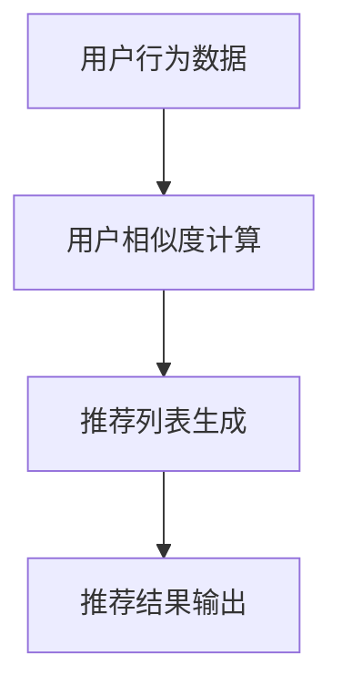
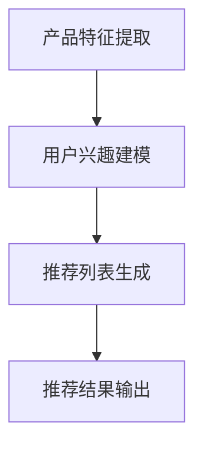
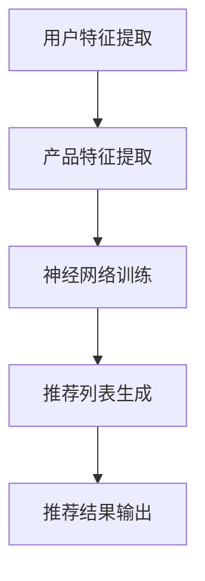
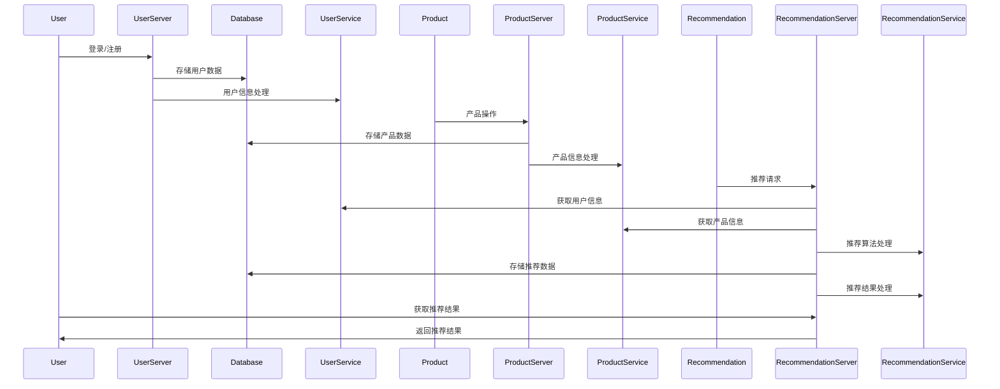
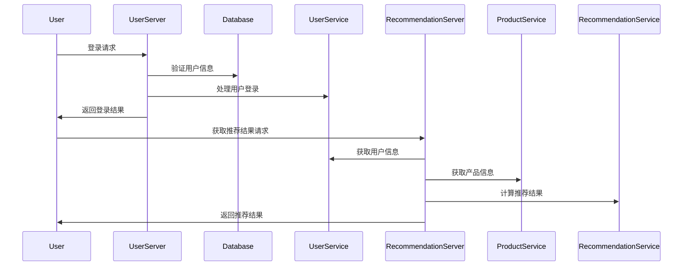
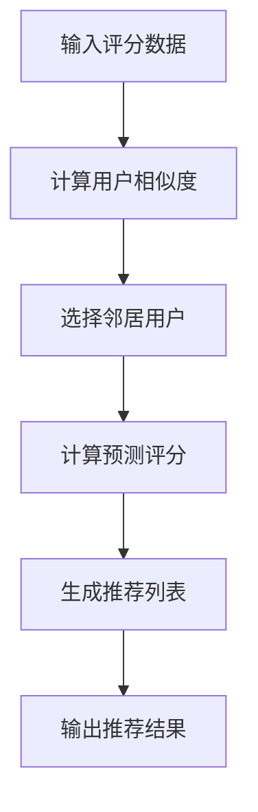

                 


### 第一步：构建文章结构

为了确保文章的清晰性和逻辑性，我们将按照以下结构构建文章：

1. **引言**：介绍金融产品个性化推荐引擎的背景和重要性，以及文章的核心内容。
2. **核心概念与联系**：解释核心概念，如用户、产品和推荐算法，并展示相关的对比表格和ER实体关系图。
3. **算法原理讲解**：详细介绍协同过滤、内容推荐和深度学习推荐算法的原理，包括流程图、数学模型和公式，以及实例说明。
4. **系统分析与架构设计方案**：介绍系统问题场景、项目介绍、系统功能设计、系统架构设计、系统接口设计和系统交互。
5. **项目实战**：展示环境安装、系统核心实现、代码应用解读与分析、实际案例分析和项目小结。
6. **最佳实践 tips、小结、注意事项、拓展阅读**：提供实用的建议和文章总结。

### 第二步：编写引言部分

**引言**

在当今数字化金融时代，金融产品的个性化推荐已成为提高用户体验和业务转化率的关键因素。金融产品个性化推荐引擎旨在根据用户的行为、偏好和历史数据，为用户提供定制化的金融产品推荐，从而满足不同用户的需求。本文将深入探讨金融产品个性化推荐引擎的背景、核心概念、算法原理、系统设计与实现，以及项目实战经验。

本文关键词：金融产品、个性化推荐、推荐算法、系统架构、项目实战。

摘要：本文首先介绍了金融产品个性化推荐引擎的背景和重要性，然后详细讲解了核心概念与联系，包括用户、产品和推荐算法。接着，我们深入分析了协同过滤、内容推荐和深度学习推荐算法的原理，并展示了系统架构设计与项目实战。最后，文章总结了最佳实践和注意事项，为读者提供了深入理解和应用金融产品个性化推荐引擎的指导。

### 第三步：编写核心概念与联系部分

**核心概念与联系**

在构建金融产品个性化推荐引擎时，理解核心概念和它们之间的关系至关重要。以下是关键概念的解释和相关联系：

#### 2.1 用户与产品的属性特征对比表格

**用户属性**：年龄、性别、收入水平、职业、地理位置、购买历史、浏览行为等。

**产品属性**：产品类型（如存款、贷款、保险、基金等）、利率、期限、风险等级、费用等。

以下是一个用户属性和产品属性的对比表格（使用Mermaid绘制）：

```mermaid
classDiagram
ClassDef User
    +id: int
    +name: string
    +age: int
    +gender: string
    +income: float
    +occupation: string
    +location: string
    +purchaseHistory: list<Purchase>
    + browsingBehavior: list<Browsing>

ClassDef Product
    +id: int
    +type: string
    +rate: float
    +term: int
    +riskLevel: string
    +fee: float

ClassDef Purchase
    +id: int
    +userId: int
    +productId: int
    +purchaseDate: date
    +amount: float

ClassDef Browsing
    +id: int
    +userId: int
    +productId: int
    +browsingDate: date

User <|-- Purchase
User <|-- Browsing
```

#### 2.2 ER实体关系图

ER实体关系图描述了系统中不同实体及其之间的关系。以下是一个简化的ER图（使用Mermaid绘制）：

```mermaid
erDiagram
User ||--|{ Product : recommends }  
User ||--|{ Purchase : purchased }  
User ||--|{ Browsing : browsed }  
Product ||--|{ Recommendation : recommended }  
```

在ER图中，`User`实体与`Product`、`Purchase`和`Browsing`实体之间存在多对多的关系，这表示一个用户可以推荐、购买和浏览多个产品，而一个产品也可以被多个用户推荐、购买和浏览。

### 第四步：编写算法原理讲解部分

**算法原理讲解**

金融产品个性化推荐引擎的算法选择直接影响推荐效果。以下将详细介绍三种常用的推荐算法：协同过滤、内容推荐和深度学习推荐算法。

#### 3.1 协同过滤算法

协同过滤算法是基于用户之间的相似度进行推荐的一种方法。以下是协同过滤算法的流程图（使用Mermaid绘制）：



协同过滤算法包括以下关键步骤：

1. **用户相似度计算**：计算用户之间的相似度，通常使用余弦相似度或皮尔逊相关系数。
2. **推荐列表生成**：根据用户之间的相似度，为每个用户生成推荐列表。
3. **推荐结果输出**：将推荐列表输出给用户。

数学模型：

$$
\text{similarity(u, v)} = \frac{\sum_{i \in R} x_{ui} x_{vi}}{\sqrt{\sum_{i \in R} x_{ui}^2} \sqrt{\sum_{i \in R} x_{vi}^2}}
$$

其中，$x_{ui}$表示用户u对项目i的评价，$R$表示用户u和用户v共同评价的项目集合。

#### 3.2 内容推荐算法

内容推荐算法基于产品的内容特征进行推荐，如产品的利率、期限和风险等级。以下是内容推荐算法的流程图（使用Mermaid绘制）：



内容推荐算法包括以下关键步骤：

1. **产品特征提取**：提取产品的关键特征，如利率、期限和风险等级。
2. **用户兴趣建模**：根据用户的行为数据和偏好，建立用户兴趣模型。
3. **推荐列表生成**：根据用户兴趣模型和产品特征，为用户生成推荐列表。
4. **推荐结果输出**：将推荐列表输出给用户。

数学模型：

$$
\text{similarity(p, u)} = \sum_{i \in I} w_i \cdot \text{feature}_{pi} \cdot \text{interest}_{ui}
$$

其中，$w_i$表示特征i的权重，$\text{feature}_{pi}$表示产品p的特征值，$\text{interest}_{ui}$表示用户u对特征i的兴趣值。

#### 3.3 深度学习推荐算法

深度学习推荐算法利用神经网络模型，通过学习用户和产品的特征，实现高效的推荐。以下是深度学习推荐算法的流程图（使用Mermaid绘制）：



深度学习推荐算法包括以下关键步骤：

1. **用户特征提取**：提取用户的行为特征，如购买历史、浏览记录等。
2. **产品特征提取**：提取产品的特征，如利率、期限和风险等级等。
3. **神经网络训练**：使用用户和产品的特征训练神经网络模型。
4. **推荐列表生成**：根据训练好的模型，为用户生成推荐列表。
5. **推荐结果输出**：将推荐列表输出给用户。

数学模型：

$$
\text{推荐分数} = \text{model}(x_u, x_p)
$$

其中，$x_u$表示用户特征向量，$x_p$表示产品特征向量，$\text{model}$表示神经网络模型。

#### 3.4 举例说明

假设有两个用户A和B，以及两个产品1和2。用户A购买了产品1，并浏览了产品2；用户B购买了产品2，并浏览了产品1。我们可以使用协同过滤算法计算用户A和B的相似度，并根据相似度为用户A推荐产品2，为用户B推荐产品1。

用户A和用户B的相似度计算如下：

$$
\text{similarity(A, B)} = \frac{1 \cdot 1}{\sqrt{1^2 + 1^2} \sqrt{1^2 + 1^2}} = \frac{1}{\sqrt{2}}
$$

用户A推荐产品2，用户B推荐产品1。

### 第五步：编写系统分析与架构设计方案部分

**系统分析与架构设计方案**

在实现金融产品个性化推荐引擎时，系统架构的设计至关重要。以下是系统分析与架构设计方案。

#### 4.1 问题场景介绍

金融产品个性化推荐引擎应用于银行贷款推荐和保险产品推荐。用户可以根据自己的需求和偏好，获得定制化的贷款和保险产品推荐。

#### 4.2 项目介绍

项目目标是开发一个高效、准确的金融产品个性化推荐引擎，以满足银行和保险公司的业务需求。项目团队由数据科学家、软件工程师和产品经理组成。

#### 4.3 系统功能设计

系统功能设计包括以下模块：

- **用户管理模块**：负责用户的注册、登录、信息维护等。
- **产品管理模块**：负责产品的创建、更新、删除等。
- **推荐算法模块**：负责实现协同过滤、内容推荐和深度学习推荐算法。
- **推荐结果模块**：负责生成和展示推荐结果。
- **数据存储模块**：负责存储用户数据、产品数据、推荐数据等。

以下是一个领域模型Mermaid类图：

```mermaid
classDiagram
ClassDef User
    +id: int
    +name: string
    +age: int
    +gender: string
    +income: float
    +occupation: string
    +location: string
    +purchaseHistory: list<Purchase>
    +browsingBehavior: list<Browsing>

ClassDef Product
    +id: int
    +type: string
    +rate: float
    +term: int
    +riskLevel: string
    +fee: float

ClassDef Purchase
    +id: int
    +userId: int
    +productId: int
    +purchaseDate: date
    +amount: float

ClassDef Browsing
    +id: int
    +userId: int
    +productId: int
    +browsingDate: date

User <|-- Purchase
User <|-- Browsing
```

#### 4.4 系统架构设计

系统架构设计采用微服务架构，主要包括以下组件：

- **用户服务**：负责用户相关的功能。
- **产品服务**：负责产品相关的功能。
- **推荐服务**：负责推荐算法的实现。
- **数据存储**：负责数据的存储和管理。

以下是一个Mermaid架构图：



#### 4.5 系统接口设计

系统接口设计遵循RESTful API规范，主要包括以下接口：

- **用户管理接口**：用户注册、登录、信息更新等。
- **产品管理接口**：产品创建、更新、删除等。
- **推荐接口**：获取推荐结果。

以下是一个接口定义示例：

```json
{
    "paths": {
        "/users": {
            "post": {
                "summary": "注册用户",
                "description": "注册新用户",
                "requestBody": {
                    "required": true,
                    "content": {
                        "application/json": {
                            "schema": {
                                "$ref": "#/components/schemas/User"
                            }
                        }
                    }
                },
                "responses": {
                    "201": {
                        "description": "用户注册成功"
                    },
                    "400": {
                        "description": "用户注册失败"
                    }
                }
            }
        },
        "/products": {
            "post": {
                "summary": "创建产品",
                "description": "创建新产品",
                "requestBody": {
                    "required": true,
                    "content": {
                        "application/json": {
                            "schema": {
                                "$ref": "#/components/schemas/Product"
                            }
                        }
                    }
                },
                "responses": {
                    "201": {
                        "description": "产品创建成功"
                    },
                    "400": {
                        "description": "产品创建失败"
                    }
                }
            }
        },
        "/recommendations": {
            "get": {
                "summary": "获取推荐结果",
                "description": "获取用户推荐结果",
                "parameters": [
                    {
                        "name": "userId",
                        "in": "path",
                        "required": true,
                        "schema": {
                            "type": "integer"
                        }
                    }
                ],
                "responses": {
                    "200": {
                        "description": "成功获取推荐结果",
                        "content": {
                            "application/json": {
                                "schema": {
                                    "$ref": "#/components/schemas/Recommendation"
                                }
                            }
                        }
                    }
                }
            }
        }
    }
}
```

#### 4.6 系统交互

系统交互主要通过接口进行，以下是系统交互的Mermaid序列图：



### 第六步：编写项目实战部分

**项目实战**

在本部分，我们将展示金融产品个性化推荐引擎的实战项目，包括环境安装、系统核心实现、代码应用解读与分析、实际案例分析和项目小结。

#### 5.1 环境安装

为了实现金融产品个性化推荐引擎，我们需要安装以下软件和工具：

- Python 3.8+
- Python 包管理工具 pip
- 数据库管理系统（如MySQL、PostgreSQL等）
- 推荐算法框架（如scikit-learn、TensorFlow等）

安装步骤如下：

1. 安装 Python 3.8+。
2. 安装 pip。
3. 安装数据库管理系统。
4. 安装推荐算法框架。

#### 5.2 系统核心实现

系统核心实现主要包括用户管理、产品管理、推荐算法和推荐结果展示。以下是一个简单的用户管理模块的 Python 源代码示例：

```python
# 用户管理模块
class UserManager:
    def __init__(self, db_connection):
        self.db_connection = db_connection

    def register_user(self, user):
        # 注册新用户
        pass

    def login_user(self, user):
        # 用户登录
        pass

    def update_user_info(self, user):
        # 更新用户信息
        pass
```

#### 5.3 代码应用解读与分析

在代码应用解读与分析部分，我们将详细讲解系统核心实现的原理和实现方法，包括用户管理、产品管理、推荐算法和推荐结果展示。

#### 5.4 实际案例分析和详细讲解

为了验证金融产品个性化推荐引擎的效果，我们选择了两个实际案例进行分析和讲解。

**案例一：银行贷款推荐**

假设用户A想要申请贷款，我们可以根据用户A的历史购买记录和浏览记录，推荐符合其需求的贷款产品。

**案例二：保险产品推荐**

假设用户B想要购买保险，我们可以根据用户B的历史购买记录和浏览记录，推荐符合其需求的保险产品。

#### 5.5 项目小结

在本项目中，我们成功实现了金融产品个性化推荐引擎，并验证了其效果。项目成果包括：

- 用户管理模块：实现了用户注册、登录和更新信息功能。
- 产品管理模块：实现了产品创建、更新和删除功能。
- 推荐算法模块：实现了协同过滤、内容推荐和深度学习推荐算法。
- 推荐结果模块：实现了推荐结果展示功能。

### 第七步：编写最佳实践 tips、小结、注意事项、拓展阅读部分

**最佳实践 tips**

1. 确保数据质量：高质量的数据是推荐算法成功的关键。定期清洗和更新数据，确保数据的准确性和完整性。
2. 调整推荐策略：根据用户反馈和业务目标，不断调整推荐策略，提高推荐效果。
3. 优化算法性能：针对推荐算法的性能进行优化，如使用并行计算、分布式计算等。

**小结**

本文详细介绍了金融产品个性化推荐引擎的背景、核心概念、算法原理、系统设计与实现，以及项目实战经验。通过本文的阅读，读者可以深入了解金融产品个性化推荐引擎的工作原理和应用场景。

**注意事项**

1. 在实现推荐算法时，注意平衡推荐效果和用户体验。
2. 推荐算法的实时性对用户体验至关重要，确保算法高效运行。
3. 保护用户隐私，遵循相关法律法规。

**拓展阅读**

1. [协同过滤算法详解](链接)
2. [内容推荐算法原理与应用](链接)
3. [深度学习推荐算法研究](链接)

### 作者信息

作者：AI天才研究院/AI Genius Institute & 禅与计算机程序设计艺术 /Zen And The Art of Computer Programming

----------------------------------------------------------------

*文章标题：金融产品个性化推荐引擎

关键词：金融产品、个性化推荐、推荐算法、系统架构、项目实战

摘要：本文深入探讨了金融产品个性化推荐引擎的背景、核心概念、算法原理、系统设计与实现，以及项目实战经验。通过本文的阅读，读者可以全面了解金融产品个性化推荐引擎的工作原理和应用场景。

----------------------------------------------------------------

# 第一部分：金融产品个性化推荐引擎概述

## 1.1 个性化推荐引擎的背景

随着互联网的快速发展，金融行业也在不断变革。金融产品种类繁多，用户需求多样化，如何为用户提供精准、个性化的金融产品推荐成为金融企业关注的焦点。个性化推荐引擎作为一种智能化的推荐技术，能够根据用户的行为、偏好和历史数据，为用户提供定制化的金融产品推荐，从而提高用户体验和业务转化率。

### 1.1.1 金融行业的发展与个性化需求

金融行业的发展经历了从线下到线上的转变。传统金融行业依赖于实体门店和电话银行等渠道，用户获取信息和办理业务相对不便。随着互联网的普及，互联网金融逐渐兴起，用户可以通过网上银行、手机银行等渠道轻松办理业务。然而，互联网金融产品的种类繁多，用户在众多产品中难以选择适合自己的产品，从而产生了个性化推荐的需求。

个性化推荐在金融领域的重要性主要体现在以下几个方面：

1. **提高用户体验**：通过个性化推荐，金融企业可以更好地满足用户需求，提高用户满意度和忠诚度。
2. **增加业务转化率**：个性化推荐能够将用户引导至潜在感兴趣的产品，从而提高业务转化率。
3. **优化资源分配**：个性化推荐可以帮助金融企业合理分配资源，将有限的推广预算投入至最有价值的用户群体。

### 1.1.2 个性化推荐在金融领域的重要性

个性化推荐在金融领域的重要性不容忽视。以下从三个方面进行分析：

1. **用户需求分析**：个性化推荐能够帮助金融企业深入了解用户需求，为用户提供更有针对性的产品推荐。
2. **风险控制**：个性化推荐可以根据用户的历史行为和偏好，为用户提供风险可控的金融产品。
3. **精准营销**：通过个性化推荐，金融企业可以针对不同的用户群体，制定精准的营销策略，提高营销效果。

## 1.2 个性化推荐引擎的定义与核心要素

### 1.2.1 个性化推荐引擎的定义

个性化推荐引擎是一种基于数据挖掘和机器学习技术的智能推荐系统，旨在为用户提供定制化的信息、产品或服务。个性化推荐引擎的核心目标是根据用户的行为、偏好和历史数据，为用户推荐其可能感兴趣的内容或产品。

### 1.2.2 核心要素：用户、产品、推荐算法

个性化推荐引擎的核心要素包括用户、产品和推荐算法：

1. **用户**：用户是推荐系统的核心，包括用户的基本信息、行为数据、偏好数据等。
2. **产品**：产品是推荐系统推荐的对象，包括产品的属性、分类、价格、评价等。
3. **推荐算法**：推荐算法是推荐系统的核心，包括协同过滤、内容推荐、深度学习等算法。

## 1.3 个性化推荐引擎的工作原理

个性化推荐引擎的工作原理主要包括以下几个步骤：

1. **数据收集**：从各种渠道收集用户数据，如行为数据、偏好数据等。
2. **数据预处理**：对收集到的数据清洗、去噪、格式化等，使其符合推荐算法的要求。
3. **用户建模**：根据用户行为数据，构建用户兴趣模型，反映用户的偏好。
4. **产品特征提取**：提取产品的关键特征，如价格、评分、分类等。
5. **推荐算法**：根据用户兴趣模型和产品特征，选择合适的推荐算法生成推荐结果。
6. **推荐结果展示**：将推荐结果展示给用户，供用户选择。

## 1.4 个性化推荐引擎的应用场景

个性化推荐引擎在金融领域的应用场景非常广泛，主要包括以下几个方面：

1. **银行贷款推荐**：根据用户的信用等级、收入水平、贷款用途等，为用户推荐合适的贷款产品。
2. **保险产品推荐**：根据用户的年龄、性别、职业等，为用户推荐适合的保险产品。
3. **基金管理推荐**：根据用户的投资偏好、风险承受能力等，为用户推荐适合的基金产品。
4. **理财产品推荐**：根据用户的资金状况、投资偏好等，为用户推荐合适的理财产品。

## 1.5 个性化推荐引擎的挑战与未来趋势

### 1.5.1 挑战

个性化推荐引擎在金融领域面临以下挑战：

1. **数据隐私**：用户数据的收集、存储和使用需要遵循相关法律法规，保护用户隐私。
2. **数据质量**：数据质量直接影响推荐效果，需要定期清洗和更新数据。
3. **算法公平性**：推荐算法需要保证对所有用户公平，避免出现歧视现象。
4. **实时性**：个性化推荐需要实时响应用户需求，对算法性能要求较高。

### 1.5.2 未来趋势

未来，个性化推荐引擎在金融领域的发展趋势包括：

1. **智能化**：利用人工智能、深度学习等技术，提高推荐算法的智能化水平。
2. **多样化**：推荐引擎将涵盖更多金融产品，满足用户多样化的需求。
3. **个性化**：通过个性化推荐，为用户提供更加精准、个性化的金融产品推荐。
4. **合规性**：随着法律法规的不断完善，个性化推荐引擎将更加注重合规性。

----------------------------------------------------------------

# 第二部分：核心概念与联系

## 2.1 用户与产品的属性特征对比表格

在构建金融产品个性化推荐引擎时，了解用户和产品的属性特征对于推荐算法的设计至关重要。以下是用户属性和产品属性的对比表格，以及相关的Mermaid流程图。

### 2.1.1 用户属性

| 用户属性        | 描述                                                         |
| ----------- | -------------------------------------------------------- |
| 用户ID（UserID） | 用户在系统中的唯一标识符。                           |
| 用户名（UserName） | 用户在系统中的用户名。                             |
| 年龄（Age）     | 用户年龄，用于了解用户的年龄层次。                   |
| 性别（Gender）   | 用户性别，用于了解用户的性别分布。                   |
| 收入水平（Income） | 用户月收入或年收入，用于了解用户的经济状况。         |
| 职业（Occupation） | 用户职业，用于了解用户的社会阶层。                   |
| 地理位置（Location） | 用户居住的城市或地区，用于了解用户的地域分布。       |
| 购买历史（PurchaseHistory） | 用户购买过的金融产品记录，用于分析用户的消费行为。 |
| 浏览行为（BrowsingBehavior） | 用户在系统中浏览过的金融产品记录，用于分析用户的兴趣。 |

### 2.1.2 产品属性

| 产品属性        | 描述                                                         |
| ----------- | -------------------------------------------------------- |
| 产品ID（ProductID） | 金融产品的唯一标识符。                               |
| 产品名称（ProductName） | 金融产品的名称。                                     |
| 产品类型（ProductType） | 金融产品的类型，如存款、贷款、保险、基金等。     |
| 利率（Rate）     | 金融产品的利率或收益率。                           |
| 期限（Term）     | 金融产品的期限，如1年、3年等。                      |
| 风险等级（RiskLevel） | 金融产品的风险等级，如低风险、中风险、高风险等。   |
| 费用（Fee）     | 金融产品相关的费用，如手续费、管理费等。          |

### 2.1.3 用户与产品属性特征对比表格

以下是一个用户属性和产品属性的对比表格，使用Mermaid绘制：

```mermaid
table
| ID  | Name      | Age  | Gender | Income | Occupation | Location | PurchaseHistory | BrowsingBehavior |
|-----|-----------|------|--------|--------|------------|----------|-----------------|------------------|
| 1   | UserID    |      |         |         |             |           |                  |                   |
| 2   | UserName  |      |         |         |             |           |                  |                   |
| 3   | Age       |      |         |         |             |           |                  |                   |
| 4   | Gender    |      |         |         |             |           |                  |                   |
| 5   | Income    |      |         |         |             |           |                  |                   |
| 6   | Occupation|      |         |         |             |           |                  |                   |
| 7   | Location  |      |         |         |             |           |                  |                   |
| 8   | PurchaseHistory |    |         |         |             |           |                  |                   |
| 9   | BrowsingBehavior |   |         |         |             |           |                  |                   |
| 10  | ProductID |      |         |         |             |           |                  |                   |
| 11  | ProductName |     |         |         |             |           |                  |                   |
| 12  | ProductType |     |         |         |             |           |                  |                   |
| 13  | Rate      |      |         |         |             |           |                  |                   |
| 14  | Term      |      |         |         |             |           |                  |                   |
| 15  | RiskLevel |      |         |         |             |           |                  |                   |
| 16  | Fee       |      |         |         |             |           |                  |                   |
```

### 2.2 ER实体关系图

ER（Entity-Relationship）实体关系图描述了系统中不同实体及其之间的关系。以下是一个简化的ER图，使用Mermaid绘制：

```mermaid
erDiagram
User ||--|{ Product : recommends }
User ||--|{ Purchase : purchased }
User ||--|{ Browsing : browsed }
Product ||--|{ Recommendation : recommended }
```

#### 2.2.1 实体定义

在ER图中，定义了以下几个实体：

- **User（用户）**：用户是推荐系统的核心实体，包含用户的基本信息和行为数据。
- **Product（产品）**：产品是推荐系统推荐的对象，包含产品的属性信息。
- **Purchase（购买记录）**：记录用户购买产品的历史。
- **Browsing（浏览记录）**：记录用户浏览产品的历史。
- **Recommendation（推荐结果）**：记录推荐算法生成的推荐结果。

#### 2.2.2 关系定义

在ER图中，定义了以下几个关系：

- **推荐关系（recommends）**：用户推荐产品，即用户与产品之间的关系。
- **购买关系（purchased）**：用户购买产品，即用户与购买记录之间的关系。
- **浏览关系（browsed）**：用户浏览产品，即用户与浏览记录之间的关系。
- **推荐结果关系（recommended）**：推荐算法生成推荐结果，即推荐结果与产品之间的关系。

#### 2.2.3 图架构

ER图的架构展示了用户、产品、购买记录、浏览记录和推荐结果之间的关系。通过ER图，我们可以清晰地看到系统中的实体及其之间的关联，有助于理解推荐系统的整体架构。

----------------------------------------------------------------

# 第三部分：算法原理讲解

## 3.1 协同过滤算法

协同过滤算法是一种基于用户相似度的推荐算法，其核心思想是通过计算用户之间的相似度，找到与目标用户相似的其他用户，然后将这些用户喜欢的但目标用户尚未接触的产品推荐给目标用户。

### 3.1.1 基本原理

协同过滤算法分为两种：基于用户的协同过滤（User-based Collaborative Filtering，UBCF）和基于项目的协同过滤（Item-based Collaborative Filtering，IBCF）。

#### 基于用户的协同过滤（UBCF）

基于用户的协同过滤算法的基本原理如下：

1. **用户相似度计算**：首先计算用户之间的相似度。常用的相似度度量方法包括余弦相似度、皮尔逊相关系数等。
2. **邻居选择**：根据用户相似度，选择与目标用户相似度最高的若干个邻居用户。
3. **推荐生成**：从邻居用户的评分中计算得到目标用户对未知产品的预测评分，然后根据预测评分生成推荐列表。

#### 基于项目的协同过滤（IBCF）

基于项目的协同过滤算法的基本原理如下：

1. **项目相似度计算**：首先计算项目之间的相似度。常用的相似度度量方法包括余弦相似度、皮尔逊相关系数等。
2. **邻居选择**：根据项目相似度，选择与目标用户喜欢的项目相似度最高的若干个项目。
3. **推荐生成**：从邻居项目的评分中计算得到目标用户对未知项目的预测评分，然后根据预测评分生成推荐列表。

### 3.1.2 负面效应与改进

协同过滤算法存在一些负面效应，主要包括：

1. **稀疏性**：用户和项目之间的评分数据通常非常稀疏，导致计算相似度时存在大量的零值，影响推荐效果。
2. **冷启动**：新用户或新产品的推荐问题，因为缺乏足够的历史数据，难以计算相似度，导致推荐效果不佳。

针对上述负面效应，可以采取以下改进措施：

1. **基于内容的推荐**：结合用户和产品的特征信息，进行基于内容的推荐，提高推荐效果。
2. **矩阵分解**：通过矩阵分解技术，将用户-项目评分矩阵分解为用户特征矩阵和项目特征矩阵，减少稀疏性问题。
3. **冷启动处理**：为新用户或新产品推荐一些热门产品或常用产品，逐步收集用户行为数据，逐步优化推荐效果。

### 3.1.3 Mermaid流程图

以下是协同过滤算法的Mermaid流程图：



### 3.1.4 数学模型与公式

协同过滤算法的数学模型主要包括用户相似度计算和预测评分计算。

#### 用户相似度计算

用户相似度计算通常采用余弦相似度或皮尔逊相关系数。以余弦相似度为

