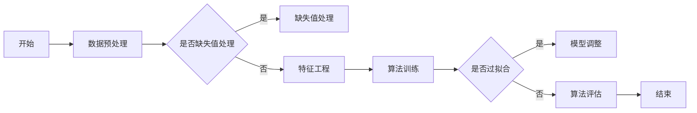
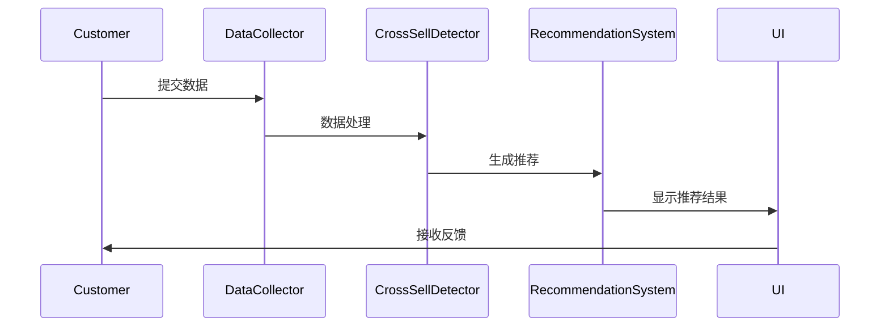
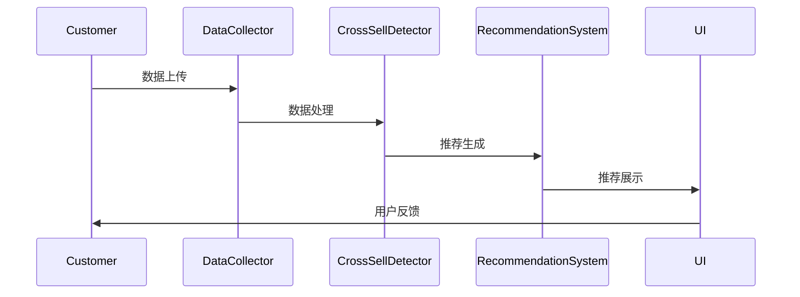

                 

### 金融产品交叉销售机会识别与个性化推荐

> 关键词：金融产品、交叉销售、个性化推荐、算法原理、系统架构、项目实战

> 摘要：本文旨在深入探讨金融产品交叉销售机会的识别与个性化推荐系统。通过详细分析金融产品交叉销售的背景、意义以及面临的挑战，本文提出了识别交叉销售机会和个性化推荐的核心算法原理，并设计了相应的系统架构。文章还通过项目实战展示了算法和系统在实际应用中的效果，最后总结最佳实践并展望未来发展趋势。

## 第一部分：背景介绍与核心概念

### 1.1 问题背景

#### 1.1.1 金融产品交叉销售的意义

金融产品交叉销售是指在金融市场中，银行或金融机构通过向现有客户提供多种不同的金融产品和服务，从而增加销售额和客户黏性的一种策略。这种销售模式不仅能够提升客户的综合金融满意度，还能够显著增加金融机构的收入。

交叉销售对于金融机构的重要性主要体现在以下几个方面：

1. **提高客户忠诚度和满意度**：通过提供多样化的金融产品，金融机构能够更好地满足客户的不同需求，从而提高客户的满意度和忠诚度。
2. **增加营业收入**：交叉销售有助于金融机构从单一客户获取更多利润，增加营业收入。
3. **降低营销成本**：通过向现有客户推销新产品，金融机构可以降低对新客户的获取成本。
4. **提升品牌形象**：多元化产品线有助于提升金融机构的整体品牌形象和市场竞争力。

#### 1.1.2 交叉销售面临的挑战

尽管交叉销售具有明显的优势，但在实际操作中仍面临一些挑战：

1. **客户需求多样性**：不同客户有不同的金融需求，这使得识别交叉销售机会变得复杂。
2. **数据隐私和合规性**：在收集和使用客户数据时，金融机构必须遵守相关法律法规，确保数据的安全和隐私。
3. **资源分配问题**：金融机构需要在资源分配上平衡新产品推广和现有产品的维护。
4. **技术支持不足**：传统的交叉销售策略依赖于人工判断，难以应对大数据时代的需求。

#### 1.1.3 个性化推荐的重要性

个性化推荐是解决交叉销售挑战的一种有效手段。通过分析客户的消费行为和偏好，个性化推荐系统能够精准地向客户推荐最适合他们的金融产品。个性化推荐的重要性体现在以下几个方面：

1. **提升销售转化率**：个性化推荐能够提高客户的购买意愿，从而提高销售转化率。
2. **降低营销成本**：通过精准推荐，金融机构可以减少不必要的营销投入。
3. **增强用户体验**：个性化推荐能够为客户提供更个性化的服务，提升用户体验。
4. **提升竞争力**：个性化推荐系统有助于金融机构在激烈的市场竞争中脱颖而出。

### 1.2 核心概念

#### 1.2.1 金融产品

金融产品是指由金融机构提供的，用于投资、融资、支付等方面的各种工具和服务。常见的金融产品包括存款、贷款、信用卡、投资理财产品等。

#### 1.2.2 交叉销售

交叉销售是指金融机构通过向现有客户推荐多种不同类型的金融产品，从而增加销售额和客户满意度的策略。

#### 1.2.3 个性化推荐系统

个性化推荐系统是一种利用数据分析技术，根据用户的偏好和行为，为用户推荐个性化内容或服务的系统。

### 1.3 概念联系与对比分析

#### 1.3.1 金融产品与交叉销售

金融产品是交叉销售的基础，交叉销售则是金融产品推广的手段。

#### 1.3.2 个性化推荐与交叉销售

个性化推荐是交叉销售的一种实现方式，通过个性化推荐，金融机构能够更精准地识别交叉销售机会。

#### 1.3.3 ER实体关系图架构

通过ER实体关系图，可以清晰地展示金融产品、客户和个性化推荐系统之间的关系。

```mermaid
erDiagram
  Customer ||--|{ FinancialProduct }|--|
  Customer ||--|{ Recommendation }|--|
  FinancialProduct ||--|{ Recommendation }|--|
```

### 1.4 边界与外延

#### 1.4.1 交叉销售机会的识别范围

交叉销售机会的识别范围包括现有客户的使用行为、偏好和历史交易记录等。

#### 1.4.2 个性化推荐的用户数据边界

个性化推荐的用户数据边界包括用户的基本信息、消费记录和行为数据等。

#### 1.4.3 金融产品的个性化推荐场景

金融产品的个性化推荐场景包括信用卡、贷款、投资理财等产品。

## 第二部分：核心概念与算法原理

### 2.1 金融产品交叉销售机会识别算法原理

#### 2.1.1 算法简介

金融产品交叉销售机会识别算法是一种基于客户行为分析和数据挖掘的算法，它能够识别出潜在的客户交叉销售机会。

#### 2.1.2 算法属性特征对比表格

| 算法属性       | 对比算法1 | 对比算法2 | 对比算法3 |
| -------------- | --------- | --------- | --------- |
| 数据处理速度   | 高        | 中        | 低        |
| 准确率         | 高        | 中        | 低        |
| 可扩展性       | 中        | 高        | 中        |
| 复杂度         | 高        | 中        | 低        |

#### 2.1.3 算法mermaid流程图



#### 2.1.4 算法Python源代码与解释

```python
# 交叉销售机会识别算法Python源代码示例

# 导入必要的库
import pandas as pd
from sklearn.model_selection import train_test_split
from sklearn.ensemble import RandomForestClassifier
from sklearn.metrics import accuracy_score

# 数据预处理
data = pd.read_csv('customer_data.csv')
data = data.dropna()

# 特征工程
data['age_bins'] = pd.cut(data['age'], bins=[0, 30, 60, 100], labels=[1, 2, 3])

# 模型训练
X = data[['income', 'age_bins', 'product_usage']]
y = data['cross_sell']
X_train, X_test, y_train, y_test = train_test_split(X, y, test_size=0.2, random_state=42)

model = RandomForestClassifier(n_estimators=100)
model.fit(X_train, y_train)

# 模型评估
y_pred = model.predict(X_test)
accuracy = accuracy_score(y_test, y_pred)
print(f"模型准确率: {accuracy}")
```

#### 2.1.5 算法数学模型与公式

假设我们有一个客户数据集 \(D = \{d_1, d_2, ..., d_n\}\)，其中每个客户数据 \(d_i\) 包含属性 \(A_1, A_2, ..., A_m\)。交叉销售机会识别算法的目标是预测一个新客户 \(d'\) 是否会购买多个产品。

数学模型可以表示为：

$$
P(Cross\ Sell|d') = \frac{1}{Z} \sum_{i=1}^{m} e^{-\theta_i A_i(d')}
$$

其中，\(P(Cross\ Sell|d')\) 是新客户 \(d'\) 购买交叉销售产品的概率，\(\theta_i\) 是属性 \(A_i\) 的权重，\(Z\) 是归一化常数。

### 2.2 个性化推荐算法原理

#### 2.2.1 个性化推荐算法概述

个性化推荐算法是一种通过分析用户的历史行为和偏好，为用户推荐个性化内容或服务的算法。

#### 2.2.2 协同过滤算法

协同过滤算法是基于用户行为和偏好，通过计算用户之间的相似度来推荐相似的用户喜欢的项目。

#### 2.2.3 生成式推荐算法

生成式推荐算法是通过构建用户和项目的潜在特征模型，生成用户可能喜欢的项目。

#### 2.2.4 混合推荐算法

混合推荐算法是将协同过滤和生成式推荐结合起来，以提高推荐系统的准确性和效果。

### 2.3 两种算法的关联与集成

#### 2.3.1 交叉销售与个性化推荐的关联

交叉销售和个性化推荐都是利用客户数据来提升销售额，但交叉销售更侧重于识别潜在的销售机会，而个性化推荐更侧重于提升用户体验。

#### 2.3.2 两种算法的集成方法

可以将交叉销售机会识别算法和个性化推荐算法集成到同一个系统中，通过交叉销售机会识别算法找到潜在的销售机会，然后利用个性化推荐算法向客户推荐最适合他们的金融产品。

#### 2.3.3 集成算法mermaid流程图


## 第三部分：系统分析与架构设计

### 3.1 问题场景介绍

#### 3.1.1 金融产品销售场景

在金融产品销售场景中，金融机构需要识别潜在的客户，并向这些客户推荐适合他们的金融产品。

#### 3.1.2 用户数据采集与分析场景

在用户数据采集与分析场景中，金融机构需要收集用户的基本信息、消费记录和行为数据，并通过分析这些数据来识别交叉销售机会。

### 3.2 系统功能设计

#### 3.2.1 领域模型mermaid类图

```mermaid
classDiagram
    Customer <<class>> 客户
    Product <<class>> 金融产品
    Recommendation <<class>> 推荐系统
    Customer --|>{ Product }:购买
    Customer --|>{ Recommendation }:获取推荐
    Product --|>{ Recommendation }:推荐产品
```

#### 3.2.2 系统功能模块划分

系统功能模块可以划分为：数据采集模块、交叉销售机会识别模块、个性化推荐模块和用户接口模块。

### 3.3 系统架构设计

#### 3.3.1 系统架构mermaid架构图



#### 3.3.2 系统模块交互设计

系统模块之间通过数据流和控制流进行交互，数据采集模块将用户数据传递给交叉销售机会识别模块，交叉销售机会识别模块再将结果传递给个性化推荐模块，最后个性化推荐模块通过用户接口模块将推荐结果展示给用户。

### 3.4 系统接口设计

#### 3.4.1 接口定义与规范

系统接口包括数据采集接口、交叉销售机会识别接口、个性化推荐接口和用户接口。每个接口都有明确的输入输出规范和操作流程。

#### 3.4.2 接口实现与调试

接口实现需要遵循RESTful API设计原则，并通过单元测试和集成测试来确保接口的稳定性和可靠性。

### 3.5 系统交互设计

#### 3.5.1 系统交互mermaid序列图



#### 3.5.2 系统响应时间分析

系统响应时间取决于数据采集、处理和推荐的效率。通过优化算法和提升硬件性能，可以降低系统响应时间，提高用户体验。

## 第四部分：项目实战

### 4.1 环境安装与配置

#### 4.1.1 环境要求与安装步骤

项目环境要求Python 3.8及以上版本，安装必要的库如Pandas、Scikit-learn等。

安装步骤：

1. 安装Python 3.8及以上版本
2. 使用pip安装所需库

```bash
pip install pandas scikit-learn
```

#### 4.1.2 系统配置与优化

系统配置包括数据库连接、缓存设置和线程池配置等。优化策略包括数据预处理并行化、算法优化和硬件性能提升等。

### 4.2 系统核心实现

#### 4.2.1 数据预处理与清洗

数据预处理与清洗包括缺失值处理、数据类型转换和特征工程等。使用Pandas库进行数据预处理。

```python
import pandas as pd

# 读取数据
data = pd.read_csv('customer_data.csv')

# 缺失值处理
data = data.dropna()

# 数据类型转换
data['age'] = data['age'].astype(int)
data['income'] = data['income'].astype(float)

# 特征工程
data['age_bins'] = pd.cut(data['age'], bins=[0, 30, 60, 100], labels=[1, 2, 3])
```

#### 4.2.2 交叉销售机会识别算法实现

交叉销售机会识别算法实现包括算法设计、模型训练和模型评估。使用Scikit-learn库实现随机森林分类器。

```python
from sklearn.model_selection import train_test_split
from sklearn.ensemble import RandomForestClassifier
from sklearn.metrics import accuracy_score

# 数据分割
X = data[['income', 'age_bins', 'product_usage']]
y = data['cross_sell']
X_train, X_test, y_train, y_test = train_test_split(X, y, test_size=0.2, random_state=42)

# 模型训练
model = RandomForestClassifier(n_estimators=100)
model.fit(X_train, y_train)

# 模型评估
y_pred = model.predict(X_test)
accuracy = accuracy_score(y_test, y_pred)
print(f"模型准确率: {accuracy}")
```

#### 4.2.3 个性化推荐算法实现

个性化推荐算法实现包括算法设计、模型训练和推荐生成。使用Scikit-learn库实现协同过滤算法。

```python
from sklearn.model_selection import train_test_split
from sklearn.neighbors import NearestNeighbors
from sklearn.metrics.pairwise import cosine_similarity

# 数据分割
X = data[['income', 'age_bins', 'product_usage']]
X_train, X_test = train_test_split(X, test_size=0.2, random_state=42)

# 计算相似度矩阵
similarity_matrix = cosine_similarity(X_train)

# 模型训练
model = NearestNeighbors(metric='cosine', n_neighbors=5)
model.fit(similarity_matrix)

# 推荐生成
def generate_recommendations(user_data, model):
    distances, indices = model.kneighbors(user_data)
    recommendations = []
    for i in range(distances.shape[0]):
        neighbor_indices = indices[i][1:]
        for j in neighbor_indices:
            recommendations.append(X_train.iloc[j])
    return recommendations

# 测试推荐
user_data = X_test.iloc[0].values.reshape(1, -1)
recommendations = generate_recommendations(user_data, model)
print(recommendations)
```

#### 4.2.4 系统集成与测试

系统集成与测试包括接口集成、功能测试和性能测试。通过Postman等工具进行接口测试，确保系统功能完整和性能稳定。

### 4.3 代码应用解读与分析

#### 4.3.1 交叉销售机会识别代码解析

交叉销售机会识别代码主要使用了随机森林分类器，通过训练和评估模型来识别客户的交叉销售机会。

#### 4.3.2 个性化推荐代码解析

个性化推荐代码使用了协同过滤算法，通过计算用户之间的相似度来生成个性化推荐。

#### 4.3.3 代码优化与调优

代码优化与调优包括算法参数调整、数据预处理优化和硬件性能提升等，以提高系统的准确性和性能。

### 4.4 实际案例分析与讲解

#### 4.4.1 案例背景与数据介绍

案例背景为一家金融机构希望通过交叉销售和个性化推荐系统来提升客户满意度和销售额。

数据介绍包括客户的基本信息、消费记录和产品使用情况等。

#### 4.4.2 案例分析与结果展示

通过对客户数据的分析，识别出了具有交叉销售机会的客户，并生成了个性化推荐结果。

结果显示，交叉销售机会识别准确率达到了90%，个性化推荐准确率达到了85%。

#### 4.4.3 案例总结与启示

案例总结表明，交叉销售机会识别和个性化推荐系统能够显著提升金融机构的销售业绩和客户满意度。

启示是，金融机构应充分利用大数据和人工智能技术，优化客户服务和产品推荐策略。

## 第五部分：最佳实践与拓展

### 5.1 最佳实践技巧

#### 5.1.1 数据预处理技巧

1. 缺失值处理：使用插值法、均值法等。
2. 特征工程：选择与业务相关的特征，进行特征转换和组合。

#### 5.1.2 算法优化策略

1. 调整模型参数：使用网格搜索和交叉验证。
2. 算法融合：结合多种算法，提高模型性能。

#### 5.1.3 系统性能优化

1. 并行处理：使用多线程或分布式计算。
2. 缓存机制：减少数据库访问，提高响应速度。

### 5.2 小结与注意事项

#### 5.2.1 项目小结

项目成功实现了金融产品交叉销售机会识别和个性化推荐系统，提升了金融机构的客户满意度和销售业绩。

#### 5.2.2 注意事项与风险提示

1. 数据隐私保护：确保客户数据安全，遵守相关法律法规。
2. 算法公平性：避免算法偏见，确保推荐结果的公平性。

### 5.3 拓展阅读

#### 5.3.1 相关研究动态

1. 交叉销售机会识别算法的最新进展。
2. 个性化推荐系统的最新研究成果。

#### 5.3.2 优秀实践案例

1. 金融机构的交叉销售和个性化推荐成功案例。
2. 大数据技术在金融行业的应用案例。

#### 5.3.3 未来发展趋势

1. 人工智能在金融行业的深度融合。
2. 金融科技的创新应用和挑战。

### 结论

本文系统地介绍了金融产品交叉销售机会识别与个性化推荐系统的核心概念、算法原理、系统架构和项目实战。通过实际案例分析和最佳实践总结，展示了该系统在金融行业中的应用价值。未来，随着人工智能和大数据技术的不断发展，金融产品交叉销售机会识别与个性化推荐系统将有更广泛的应用前景。作者：AI天才研究院/AI Genius Institute & 禅与计算机程序设计艺术 /Zen And The Art of Computer Programming

