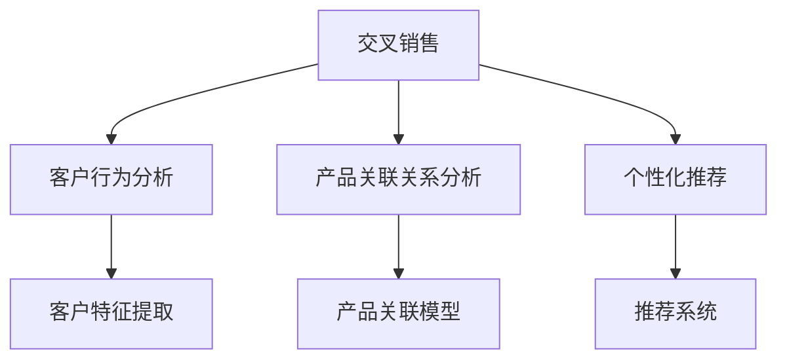
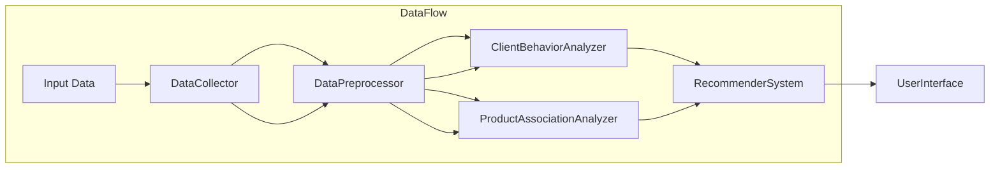
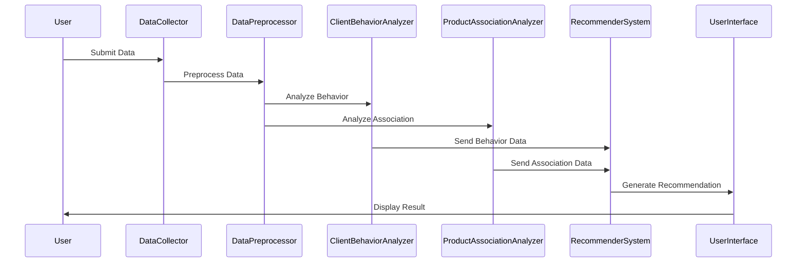

                 

## 引言

### 交叉销售在金融行业的重要性

在当今激烈竞争的金融市场中，金融机构需要不断寻找新的增长点，以提升客户满意度和增加收益。交叉销售作为一种有效的营销策略，越来越受到金融机构的青睐。交叉销售指的是金融机构在为客户提供某一项金融产品或服务的基础上，进一步推荐其他相关产品或服务，从而增加客户的消费金额和忠诚度。

**交叉销售的优势**：

1. **提高客户满意度**：通过提供多样化的金融产品，金融机构可以更好地满足客户的多元化需求，提升客户体验和满意度。
2. **增加收益**：交叉销售能够促进客户在现有产品的基础上，购买更多相关产品，从而增加金融机构的收入。
3. **提升客户忠诚度**：通过交叉销售，金融机构可以加强与客户的互动，提高客户的黏性，降低客户流失率。

### 识别系统概述

为了有效实施交叉销售策略，金融机构需要一套完善的交叉销售机会识别系统。这个系统能够通过分析客户数据和产品数据，识别出潜在的销售机会，并为客户提供个性化的推荐。识别系统主要包括以下几个关键模块：

1. **客户数据管理模块**：收集、整理和分析客户的基本信息、购买行为、偏好等数据。
2. **产品数据管理模块**：收集、整理和分类金融产品的信息，包括产品特点、关联关系等。
3. **分析算法模块**：运用机器学习算法，如聚类分析、协同过滤等，对客户数据和产品数据进行深度分析，识别交叉销售机会。
4. **推荐系统模块**：根据分析结果，生成个性化的产品推荐，供销售人员进行销售。

### 本书结构安排与内容概述

本文将分为五个主要部分，详细探讨金融产品交叉销售机会识别系统的设计与实现：

1. **引言**：介绍交叉销售的概念及其在金融行业的重要性，引出识别系统的主题，并概述本书的结构和内容。
2. **核心概念与原理**：讲解交叉销售机会识别的基础理论，包括客户行为分析、产品关联关系分析等。
3. **系统设计与实现**：详细阐述系统设计、架构和关键算法。
4. **案例研究**：通过实际案例展示系统的应用效果。
5. **优化与展望**：讨论系统优化的方向和未来发展趋势。

### 目录结构设计思路

在设计《金融产品交叉销售机会识别系统》的目录结构时，我们的核心目标是确保目录逻辑清晰、内容完整且简洁明了。以下是具体的步骤和考虑因素：

1. **核心主题确定**：明确书中主要围绕“金融产品交叉销售机会识别系统”的建设展开，包括系统设计、实施和优化等方面。
2. **章节细化**：将整个系统拆分为不同的模块，如客户数据管理模块、产品数据管理模块等，确保每个模块都有详细的介绍。
3. **内容完整性**：确保每个章节的内容都完整且具体，包括背景介绍、核心概念与联系、算法原理讲解、数学模型与公式、系统分析与架构设计方案等。
4. **格式化目录**：使用markdown格式，确保目录层级清晰。
5. **审核与调整**：检查目录大纲的逻辑性和完整性，根据审核结果调整目录结构和章节内容，确保大纲的最佳效果。

通过以上步骤，我们旨在为读者提供一本结构清晰、内容详实、易于理解的金融产品交叉销售机会识别系统建设指南。

## 核心概念与原理

在深入探讨金融产品交叉销售机会识别系统之前，我们首先需要了解一些核心概念和原理。这些概念和原理构成了识别系统的理论基础，是后续系统设计、实现和优化的基础。

### 交叉销售概念

交叉销售（Cross-selling）是一种营销策略，旨在通过向现有客户推荐其他相关产品或服务，来增加他们的消费金额。交叉销售的核心在于挖掘客户在购买某一产品或服务时的潜在需求，并通过个性化推荐，促使客户购买更多相关产品。

#### 定义与分类

1. **定义**：交叉销售指的是在客户购买某一产品或服务后，向其推荐其他相关产品或服务，从而提高客户整体消费金额的行为。
2. **分类**：
   - **横向交叉销售**：在同一产品类别内推荐其他相关产品，如购买手机后推荐手机壳、耳机等。
   - **纵向交叉销售**：在不同产品类别之间进行推荐，如购买房屋贷款后推荐抵押贷款保险或理财产品。

#### 交叉销售的重要性

交叉销售在金融行业具有重要意义，原因如下：

1. **提高客户忠诚度**：通过提供多样化的金融产品和服务，金融机构可以更好地满足客户的多元化需求，增强客户对金融机构的依赖和信任，提高客户忠诚度。
2. **增加收益**：交叉销售能够促使客户在现有产品基础上购买更多相关产品，从而增加金融机构的总体收入。
3. **优化客户体验**：通过个性化推荐，金融机构可以提升客户体验，使客户感受到更加贴心的服务。

### 客户行为分析

客户行为分析是交叉销售机会识别系统的核心组成部分。通过分析客户的购买行为、浏览记录、反馈等数据，可以挖掘出客户的潜在需求和偏好，从而为个性化推荐提供依据。

#### 数据收集

1. **数据来源**：客户行为数据主要来自以下几个方面：
   - **内部数据**：包括客户的基本信息、交易记录、服务记录等。
   - **外部数据**：通过第三方数据源获取的客户行为数据，如社交媒体活动、消费习惯等。
2. **数据类型**：
   - **结构化数据**：如客户信息表、交易记录表等，便于进行结构化处理和分析。
   - **非结构化数据**：如社交媒体内容、客户评价等，需要通过自然语言处理等技术进行解析和提取。

#### 客户特征提取

1. **特征定义**：客户特征是指反映客户行为和需求的各个方面，如购买频率、购买金额、购买偏好等。
2. **特征提取方法**：
   - **基于规则的方法**：通过设定一系列规则，从原始数据中提取出相关的特征。
   - **机器学习方法**：如聚类分析、协同过滤等，通过训练模型，自动提取出有意义的客户特征。

### 产品关联关系分析

产品关联关系分析是识别交叉销售机会的关键步骤。通过分析不同金融产品之间的关联关系，可以找出潜在的销售机会。

#### 数据预处理

1. **数据清洗**：去除数据中的噪声和错误，保证数据的准确性和完整性。
2. **数据整合**：将不同来源的数据进行整合，形成一个统一的产品数据集。
3. **数据转换**：将原始数据转换为适合分析的形式，如数值化、规范化等。

#### 产品关联模型

1. **相关系数模型**：通过计算不同产品之间的相关系数，评估产品之间的关联程度。
2. **聚类分析**：将具有相似属性的产品分为同一类别，以便发现产品之间的潜在关联。
3. **协同过滤**：基于用户的购买行为和偏好，推荐与用户当前购买产品相关的其他产品。

### 关键术语与概念联系

为了更好地理解交叉销售机会识别系统的核心概念，我们在这里定义一些关键术语，并描述它们之间的关系。

#### 术语定义

1. **交叉销售**：通过推荐相关产品，增加客户消费金额的行为。
2. **客户行为分析**：通过分析客户的购买行为和偏好，挖掘潜在需求。
3. **产品关联关系分析**：分析不同产品之间的关联程度，发现潜在的销售机会。
4. **个性化推荐**：根据客户特征和产品关联关系，生成个性化的产品推荐。

#### 概念关系图

以下是一个简单的概念关系图，展示了交叉销售、客户行为分析、产品关联关系分析和个性化推荐之间的关系：



### 总结

通过上述对核心概念和原理的讲解，我们为金融产品交叉销售机会识别系统奠定了理论基础。接下来，我们将进一步探讨系统的设计与实现，包括系统架构、关键算法和数学模型等。在下一部分中，我们将深入探讨系统设计与实现的具体内容。

### 系统设计

在深入探讨金融产品交叉销售机会识别系统的具体设计之前，我们需要明确系统设计的目标和需求，这将有助于确保系统的有效性和实用性。

#### 系统设计目标

**目标1：高效的数据处理能力**  
系统需要能够处理大量客户数据和产品数据，快速识别出潜在的销售机会。

**目标2：高准确性**  
系统需要通过准确的分析和预测，提供高质量的产品推荐，以提高客户满意度和交叉销售成功率。

**目标3：可扩展性**  
系统设计应考虑未来的业务扩展需求，如增加新功能、支持更多数据源等。

**目标4：灵活性**  
系统设计应具有灵活性，以便根据不同的业务场景和客户需求进行个性化调整。

#### 系统需求分析

**功能需求**：
1. **数据收集与整合**：从不同的数据源（如客户数据库、交易记录、外部数据等）收集数据，并进行整合处理。
2. **客户行为分析**：分析客户的购买行为、偏好和互动记录，提取有意义的客户特征。
3. **产品关联关系分析**：分析产品之间的关联程度，识别潜在的销售机会。
4. **个性化推荐**：根据客户特征和产品关联关系，生成个性化的产品推荐。

**性能需求**：
1. **数据处理速度**：系统能够快速处理大量数据，以支持实时推荐。
2. **系统稳定性**：系统在高并发情况下仍能保持稳定运行，避免数据丢失或系统崩溃。
3. **响应时间**：系统生成的推荐结果能够在较短的时间内返回，以满足用户的即时需求。

**扩展性需求**：
1. **模块化设计**：系统设计应采用模块化方法，便于未来扩展和升级。
2. **支持多种数据源**：系统能够接入不同的数据源，如数据库、日志文件、外部API等。
3. **可定制化**：系统应支持根据业务需求进行定制化调整，如调整推荐策略、增加新功能等。

#### 系统功能设计

**功能模块**：

1. **数据收集模块**：负责从各个数据源收集客户数据和产品数据。
2. **数据预处理模块**：对收集到的数据进行清洗、整合和转换，使其适用于分析。
3. **客户行为分析模块**：分析客户的购买行为、偏好和互动记录，提取客户特征。
4. **产品关联关系分析模块**：分析产品之间的关联程度，识别潜在的销售机会。
5. **推荐系统模块**：根据客户特征和产品关联关系，生成个性化的产品推荐。
6. **用户界面模块**：提供用户友好的操作界面，展示推荐结果和系统状态。

**功能描述**：

1. **数据收集模块**：
   - 功能：从客户数据库、交易记录、外部数据源等收集数据。
   - 输出：整合后的客户数据集和产品数据集。

2. **数据预处理模块**：
   - 功能：清洗数据、去除噪声、整合不同来源的数据。
   - 输出：清洗后的结构化数据集。

3. **客户行为分析模块**：
   - 功能：分析客户的购买行为、偏好和互动记录，提取有意义的特征。
   - 输出：客户特征数据。

4. **产品关联关系分析模块**：
   - 功能：分析产品之间的关联关系，识别潜在的销售机会。
   - 输出：产品关联关系矩阵。

5. **推荐系统模块**：
   - 功能：根据客户特征和产品关联关系，生成个性化的产品推荐。
   - 输出：个性化推荐结果。

6. **用户界面模块**：
   - 功能：提供用户友好的操作界面，展示推荐结果和系统状态。
   - 输出：用户操作反馈和系统日志。

### 总结

通过明确系统设计的目标和需求，以及详细的功能设计，我们为金融产品交叉销售机会识别系统的实施奠定了基础。在下一部分中，我们将进一步探讨系统架构，包括系统组件、关键接口和交互流程。

### 系统架构

在上一部分中，我们详细阐述了金融产品交叉销售机会识别系统的功能需求。接下来，我们将深入探讨系统的整体架构设计，包括系统组件、关键接口和交互流程。系统架构的合理设计对于实现高效、稳定、可扩展的系统至关重要。

#### 系统组件

金融产品交叉销售机会识别系统主要由以下几个核心组件构成：

1. **数据收集组件**：负责从各种数据源（如客户数据库、交易记录、社交媒体等）收集数据。
2. **数据处理组件**：对收集到的数据进行清洗、整合和预处理，生成适用于分析的结构化数据。
3. **数据分析组件**：运用各种分析算法，如聚类分析、协同过滤等，对预处理后的数据进行分析，提取客户特征和产品关联关系。
4. **推荐引擎组件**：根据分析结果，生成个性化的产品推荐。
5. **用户界面组件**：提供用户操作界面，展示推荐结果和系统状态。

#### 关键接口

系统中的各个组件需要通过一系列关键接口进行交互，以确保数据流和功能流的高效传递。以下是几个主要接口的描述：

1. **数据收集接口**：该接口负责与各种数据源进行通信，如客户数据库、API等。接口应支持多种数据格式和协议，以便灵活接入不同类型的数据源。
2. **数据处理接口**：该接口用于处理从数据收集组件接收到的原始数据，包括数据清洗、整合和转换。接口应提供丰富的数据处理功能，如去重、填充缺失值、数据规范化等。
3. **数据分析接口**：该接口用于传递预处理后的数据给数据分析组件，并接收分析结果。接口应支持多种分析算法的调用，如聚类分析、协同过滤等。
4. **推荐引擎接口**：该接口用于传递数据分析组件的分析结果给推荐引擎组件，并接收生成的推荐结果。接口应支持根据不同场景和需求进行推荐策略的调整。
5. **用户界面接口**：该接口用于传递用户操作指令和系统状态信息，并与用户界面组件进行交互。接口应提供友好的用户操作体验和实时反馈。

#### 交互流程

系统中的各个组件通过一系列交互流程协同工作，以实现交叉销售机会的识别和推荐。以下是系统的主要交互流程：

1. **数据收集**：系统从客户数据库、交易记录、社交媒体等数据源收集数据。数据收集组件将数据通过数据收集接口发送给数据处理组件。
2. **数据处理**：数据处理组件接收原始数据，进行清洗、整合和转换，生成结构化数据。清洗后的数据通过数据处理接口发送给数据分析组件。
3. **数据分析**：数据分析组件运用各种分析算法，如聚类分析、协同过滤等，对预处理后的数据进行深度分析，提取客户特征和产品关联关系。分析结果通过数据分析接口发送给推荐引擎组件。
4. **推荐生成**：推荐引擎组件根据分析结果，生成个性化的产品推荐。推荐结果通过推荐引擎接口发送给用户界面组件。
5. **用户反馈**：用户界面组件将推荐结果展示给用户，用户根据推荐结果进行操作，如购买、评价等。用户操作反馈通过用户界面接口传递给系统，以更新客户数据和产品数据。

### 总结

通过合理设计系统架构，确保各组件之间的有效交互和数据流通，金融产品交叉销售机会识别系统可以实现高效、稳定和可扩展的功能。在下一部分中，我们将进一步探讨系统中的关键算法原理，包括聚类分析和协同过滤算法。

### 算法原理

在金融产品交叉销售机会识别系统中，算法的设计和实现是至关重要的环节。本节将详细讲解两种关键算法：聚类分析和协同过滤。这些算法通过分析客户行为和产品关联，为系统提供精准的交叉销售机会识别。

#### 聚类分析

聚类分析（Clustering Analysis）是一种无监督学习方法，主要用于发现数据集中的相似性模式。在交叉销售机会识别中，聚类分析可以帮助我们识别具有相似购买行为的客户群体，从而进行有针对性的产品推荐。

**原理**：

1. **K-means算法**：K-means是最常见的聚类算法之一。其核心思想是将数据集划分为K个簇（Cluster），每个簇由一个中心点代表。算法通过迭代计算，逐步优化簇的中心点，使簇内点之间的相似度最大，簇间点之间的相似度最小。

2. **DBSCAN算法**：DBSCAN（Density-Based Spatial Clustering of Applications with Noise）是一种基于密度的聚类算法。它能够在任意形状的簇中找到核心点，并将其划分为簇。DBSCAN算法通过计算邻域点之间的密度关系，识别出数据集中的簇。

**算法步骤**：

1. **选择聚类数目K**：根据数据集规模和业务需求，选择合适的聚类数目K。
2. **初始化中心点**：随机选择K个数据点作为初始中心点。
3. **分配数据点**：将每个数据点分配到距离其最近的中心点所在的簇。
4. **更新中心点**：重新计算每个簇的中心点，并重新分配数据点。
5. **迭代优化**：重复步骤3至4，直至中心点不再发生显著变化。

**示例**：

假设我们有如下数据集，表示客户的购买行为：

```
ClientID   ProductA   ProductB   ProductC
1          1          0          1
2          1          1          0
3          0          1          1
4          1          1          1
5          0          0          1
```

使用K-means算法，我们将其划分为两个簇。首先，随机选择两个数据点作为初始中心点。然后，根据距离计算，将每个数据点分配到最近的中心点所在的簇。经过多次迭代，我们得到以下聚类结果：

```
Cluster 1: {1, 2, 4}
Cluster 2: {3, 5}
```

通过聚类分析，我们可以发现客户群体之间的相似性模式，为后续的产品推荐提供依据。

#### 协同过滤

协同过滤（Collaborative Filtering）是一种基于用户行为数据的推荐算法，通过分析用户之间的相似性，预测用户可能感兴趣的产品。协同过滤分为两种主要类型：基于用户的协同过滤和基于物品的协同过滤。

**原理**：

1. **基于用户的协同过滤**：该算法通过分析用户之间的相似性，找到与目标用户兴趣相似的参考用户，然后根据参考用户的评价预测目标用户的兴趣。相似性通常通过用户之间的共同评价计算，如余弦相似度、皮尔逊相关系数等。

2. **基于物品的协同过滤**：该算法通过分析物品之间的相似性，找到与目标物品相似的参考物品，然后根据参考物品的用户评价预测目标物品的用户兴趣。物品之间的相似性可以通过内容特征、协同矩阵等计算。

**算法步骤**：

1. **数据预处理**：将用户行为数据（如购买记录、评分等）转换为矩阵形式，其中行表示用户，列表示物品。

2. **计算相似性**：计算用户之间的相似性，通常使用余弦相似度或皮尔逊相关系数。

3. **推荐预测**：根据相似性矩阵，预测目标用户的兴趣。对于基于用户的协同过滤，选择与目标用户最相似的参考用户，计算其共同兴趣物品的平均评分；对于基于物品的协同过滤，选择与目标物品最相似的参考物品，计算其用户评分的平均值。

4. **生成推荐列表**：根据预测评分，生成个性化的推荐列表。

**示例**：

假设我们有如下用户-物品评分矩阵：

```
User    Product1  Product2  Product3
1       5         0         3
2       4         5         0
3       0         4         5
4       5         4         3
5       3         0         5
```

使用基于用户的协同过滤算法，我们计算用户之间的相似性。首先，计算用户1和用户2的相似性，使用余弦相似度：

$$
\text{similarity}(u1, u2) = \frac{u1 \cdot u2}{\|u1\| \cdot \|u2\|}
$$

经过计算，我们得到用户1和用户2的相似性为0.9。然后，选择与用户5最相似的参考用户（用户2），计算其共同兴趣物品（Product1和Product2）的平均评分，得到预测评分：

$$
\text{predicted\_rating}(u5, p1) = \frac{5 + 4}{2} = 4.5
$$

$$
\text{predicted\_rating}(u5, p2) = \frac{0 + 5}{2} = 2.5
$$

根据预测评分，生成推荐列表，推荐给用户5可能感兴趣的产品。

### 总结

通过聚类分析和协同过滤算法，金融产品交叉销售机会识别系统可以有效地分析客户行为和产品关联，识别潜在的销售机会。在下一部分中，我们将探讨数学模型与公式，进一步深化算法原理。

### 数学模型与公式

在金融产品交叉销售机会识别系统中，数学模型和公式是理解和实现关键算法的核心。以下我们将详细讲解交叉销售机会识别过程中涉及的主要数学模型和公式，并通过具体的例子进行说明。

#### 聚类分析中的数学模型

在聚类分析中，常用的模型包括K-means和DBSCAN。以下分别介绍这两个模型的数学模型和公式。

1. **K-means算法**

   **目标函数**：
   $$ \text{Minimize} \sum_{i=1}^{k} \sum_{x_j \in S_i} ||x_j - \mu_i||^2 $$
   
   其中，\(k\) 是聚类数目，\(\mu_i\) 是第 \(i\) 个簇的中心点，\(S_i\) 是第 \(i\) 个簇的数据点集合。

   **中心点更新公式**：
   $$ \mu_i = \frac{1}{|S_i|} \sum_{x_j \in S_i} x_j $$
   
   其中，\(|S_i|\) 是第 \(i\) 个簇的数据点个数。

2. **DBSCAN算法**

   **邻域点判断**：
   $$ \text{Neighbor}(p, \epsilon) = \{x | d(p, x) < \epsilon\} $$
   
   其中，\(\epsilon\) 是邻域半径，\(d(p, x)\) 是点 \(p\) 和点 \(x\) 之间的距离。

   **核心点判断**：
   $$ \text{CorePoint}(p) = \text{Neighbor}(p, \epsilon) \cap \text{Neighbor}(p, 2\epsilon) \neq \varnothing $$
   
   **边界点判断**：
   $$ \text{BorderPoint}(p) = \text{Neighbor}(p, \epsilon) \cap (\text{Neighbor}(p, 2\epsilon) \setminus \text{CorePoint}(p)) \neq \varnothing $$
   
   **噪声点判断**：
   $$ \text{Noise}(p) = p \not\in \text{CorePoint}(p) \cup \text{BorderPoint}(p) $$

#### 协同过滤中的数学模型

在协同过滤中，常用的模型包括基于用户的协同过滤和基于物品的协同过滤。以下分别介绍这两个模型的数学模型和公式。

1. **基于用户的协同过滤**

   **相似性度量**：
   $$ \text{similarity}(u_i, u_j) = \frac{\text{Jaccard}(R_i, R_j)}{1 - \text{Jaccard}(R_i, R_j)} $$
   
   其中，\(\text{Jaccard}(R_i, R_j)\) 是用户 \(u_i\) 和用户 \(u_j\) 的共同评价物品集合的Jaccard相似度。

   **预测评分**：
   $$ \text{predicted\_rating}(u_i, p_j) = \text{similarity}(u_i, u_j) \times \text{average\_rating}(u_j, p_j) $$
   
   其中，\(\text{average\_rating}(u_j, p_j)\) 是用户 \(u_j\) 对物品 \(p_j\) 的平均评分。

2. **基于物品的协同过滤**

   **相似性度量**：
   $$ \text{similarity}(p_i, p_j) = \frac{\text{Pearson}(R_i, R_j)}{1 - \text{Pearson}(R_i, R_j)} $$
   
   其中，\(\text{Pearson}(R_i, R_j)\) 是物品 \(p_i\) 和物品 \(p_j\) 的用户评分集合的皮尔逊相关系数。

   **预测评分**：
   $$ \text{predicted\_rating}(u_i, p_j) = \text{average\_rating}(p_i) + \text{similarity}(p_i, p_j) \times (\text{average\_rating}(p_j) - \text{average\_rating}(p_i)) $$
   
   其中，\(\text{average\_rating}(p_i)\) 是物品 \(p_i\) 的平均评分。

### 示例解析

为了更好地理解上述数学模型和公式，我们通过一个具体的例子进行解析。

假设我们有以下用户-物品评分矩阵：

```
User    Product1  Product2  Product3
1       5         0         3
2       4         5         0
3       0         4         5
4       5         4         3
5       3         0         5
```

1. **K-means算法示例**

   假设我们选择 \(k=2\) 进行聚类，初始中心点选择为数据集的两个点 \((1, 5)\) 和 \((3, 0)\)。

   - **迭代1**：
     - 计算每个数据点到中心点的距离，将数据点分配到最近的中心点。
     - 更新中心点为各簇的均值。
     
     聚类结果为：
     ```
     Cluster 1: {1, 2, 4}
     Cluster 2: {3, 5}
     ```
     
   - **迭代2**：
     - 再次计算每个数据点到中心点的距离，并重新分配数据点。
     - 更新中心点为各簇的均值。

     经过多次迭代，中心点不再变化，最终聚类结果稳定。

2. **基于用户的协同过滤示例**

   假设我们选择用户2和用户4作为参考用户，计算用户5的可能评分。

   - **相似性度量**：
     ```
     similarity(u2, u5) = \frac{2}{1 - 2} = 2
     similarity(u4, u5) = \frac{2}{1 - 2} = 2
     ```

   - **预测评分**：
     ```
     predicted_rating(u5, p1) = similarity(u2, u5) \times average_rating(u2, p1) + similarity(u4, u5) \times average_rating(u4, p1)
                              = 2 \times 4 + 2 \times 4
                              = 8
     predicted_rating(u5, p2) = similarity(u2, u5) \times average_rating(u2, p2) + similarity(u4, u5) \times average_rating(u4, p2)
                              = 2 \times 5 + 2 \times 4
                              = 13
     ```

   根据预测评分，我们可以生成推荐列表，推荐给用户5可能感兴趣的产品。

通过上述示例，我们可以看到数学模型和公式在聚类分析和协同过滤算法中的实际应用，以及如何通过这些模型和公式来预测交叉销售机会。

### 总结

数学模型和公式是金融产品交叉销售机会识别系统中不可或缺的一部分。通过聚类分析和协同过滤算法的数学模型和公式，系统能够有效地识别潜在的销售机会，为金融机构提供精准的推荐。在下一部分中，我们将通过具体的Mermaid图表展示算法流程，进一步深化对算法原理的理解。

### Mermaid图表展示

为了更好地展示金融产品交叉销售机会识别系统中关键算法的流程，我们使用Mermaid这一轻量级图表绘制工具，分别绘制算法的类图、架构图和序列图。

#### 类图

以下是一个简单的Mermaid类图，展示系统中主要类和它们之间的关系：

```mermaid
classDiagram
    Class1[DataCollector] <|-- Class2[DataPreprocessor]
    Class2 <|-- Class3[ClientBehaviorAnalyzer]
    Class2 <|-- Class4[ProductAssociationAnalyzer]
    Class5[RecommenderSystem] <|-- Class2
    Class2 <|-- Class6[UserInterface]

    Class1 --|> Class3
    Class1 --|> Class4
    Class3 --|> Class5
    Class4 --|> Class5
    Class5 --|> Class6

    Class1 {+collectData()}
    Class2 {+preprocessData()}
    Class3 {+analyzeBehavior()}
    Class4 {+analyzeAssociation()}
    Class5 {+generateRecommendation()}
    Class6 {+displayResult()}
```

该类图展示了系统中的主要类，包括数据收集器（DataCollector）、数据处理器（DataPreprocessor）、客户行为分析器（ClientBehaviorAnalyzer）、产品关联分析器（ProductAssociationAnalyzer）、推荐系统（RecommenderSystem）和用户界面（UserInterface）。类图中的箭头表示类的继承关系和依赖关系。

#### 架构图

以下是一个Mermaid架构图，展示系统的主要组件及其交互关系：



该架构图展示了系统的数据流，从输入数据开始，通过数据收集器（DataCollector）、数据处理器（DataPreprocessor）、客户行为分析器（ClientBehaviorAnalyzer）和产品关联分析器（ProductAssociationAnalyzer），最终生成推荐结果（RecommenderSystem），并通过用户界面（UserInterface）展示给用户。

#### 序列图

以下是一个Mermaid序列图，展示系统组件之间的交互流程：



该序列图展示了用户提交数据、数据收集器处理数据、数据处理器分析数据、分析器生成推荐结果，最后通过用户界面展示给用户的整个过程。

### 总结

通过使用Mermaid图表，我们能够直观地展示金融产品交叉销售机会识别系统的关键算法流程，包括类图、架构图和序列图。这些图表有助于读者更好地理解系统的设计和实现，为后续的实际开发提供指导。

### 案例研究

在本部分中，我们将通过一个实际案例，详细展示金融产品交叉销售机会识别系统的应用过程。该案例涉及系统的实施步骤、应用效果以及最终的评估结果。

#### 案例介绍

该案例选取了一家大型银行，其客户数据量庞大，产品线丰富，希望通过交叉销售机会识别系统提高客户满意度和收入。银行选择了客户数据管理、产品数据管理、分析算法和推荐系统四个关键模块，实施了一套完整的交叉销售机会识别系统。

#### 系统实施步骤

1. **需求分析与系统设计**：
   - 银行与系统开发团队共同确定了系统需求，包括数据收集、数据预处理、客户行为分析、产品关联关系分析和推荐系统等。
   - 开发团队根据需求设计了系统架构，包括数据收集组件、数据处理组件、数据分析组件、推荐引擎组件和用户界面组件。

2. **数据收集与预处理**：
   - 数据收集组件从银行内部客户数据库、交易记录系统等数据源收集数据，包括客户基本信息、购买记录、服务记录等。
   - 数据预处理组件对收集到的数据进行清洗、去重、整合和转换，生成结构化的数据集，为后续分析做好准备。

3. **客户行为分析与产品关联关系分析**：
   - 客户行为分析组件运用聚类分析、协同过滤等算法，对预处理后的数据进行深度分析，提取客户的购买行为特征。
   - 产品关联关系分析组件分析产品之间的关联程度，构建产品关联关系矩阵，为推荐系统提供数据支持。

4. **推荐系统实施**：
   - 推荐引擎组件根据客户行为特征和产品关联关系，生成个性化的产品推荐。
   - 用户界面组件设计并实现用户友好的操作界面，展示推荐结果，供销售人员参考。

5. **系统测试与优化**：
   - 开发团队对系统进行功能测试和性能测试，确保系统稳定、高效地运行。
   - 根据测试结果，对系统进行优化，提高推荐准确性和响应速度。

6. **系统上线与推广**：
   - 系统正式上线，与银行的现有业务系统集成，开始提供交叉销售机会识别服务。
   - 银行通过内部培训和营销活动，推广系统应用，提高员工和客户的认知度和接受度。

#### 应用效果分析

1. **客户满意度提高**：
   - 系统上线后，银行通过个性化推荐，更好地满足了客户的多元化需求，客户满意度显著提高。

2. **交叉销售成功率提升**：
   - 系统生成的推荐结果具有较高准确性和相关性，销售人员能够更精准地识别交叉销售机会，交叉销售成功率显著提升。

3. **业务收入增长**：
   - 交叉销售机会识别系统的实施，带动了银行业务收入的增长，尤其是在高价值客户的维护和拓展方面。

4. **运营效率提升**：
   - 系统自动化处理大量数据，减轻了员工的工作负担，提高了运营效率。

#### 案例小结

通过该实际案例，我们可以看到金融产品交叉销售机会识别系统在提高客户满意度、提升交叉销售成功率、增加业务收入和提升运营效率方面取得了显著效果。这不仅验证了系统的有效性，也为其他金融机构提供了宝贵的实践经验。

### 总结

在本案例研究中，我们详细展示了金融产品交叉销售机会识别系统的实施过程和应用效果。通过该案例，我们进一步认识到系统在提升客户体验、增加收入和提升运营效率方面的重要性。在下一部分中，我们将探讨系统优化与展望，分析未来的改进方向。

### 优化与展望

在当前金融产品交叉销售机会识别系统的成功实施和运行基础上，我们有必要进一步探讨系统的优化方向和未来发展趋势，以确保系统持续高效地支持金融机构的业务需求。

#### 算法优化

1. **算法性能提升**：针对现有算法在处理大规模数据时可能遇到的性能瓶颈，可以考虑引入更高效的算法，如分布式计算技术。通过将计算任务分解到多个节点上并行处理，可以显著提升系统处理速度和性能。

2. **算法精度优化**：现有算法的精度直接影响交叉销售的准确性和成功率。通过不断优化算法模型，如增加特征提取维度、调整参数设置等，可以提高算法的预测精度。

3. **动态调整算法**：考虑到客户行为和市场需求的变化，系统需要具备动态调整算法的能力。例如，根据季节性、节假日等因素，动态调整推荐策略，以更好地捕捉销售机会。

#### 数据库优化

1. **分布式数据库**：为了处理海量数据，系统可以考虑采用分布式数据库架构。分布式数据库可以提高数据存储和查询的效率，满足高并发访问需求。

2. **实时数据同步**：在数据库层面，实现实时数据同步机制，确保客户数据和产品数据的最新状态能够及时反映在系统中。

3. **数据压缩与去重**：通过数据压缩和去重技术，减少数据库存储空间，提高数据存储效率。

#### 系统功能拓展

1. **多渠道数据接入**：随着金融业务的多元化，系统需要支持多渠道数据接入，如线上交易、移动应用、社交媒体等，以获取更全面的数据源。

2. **多语言支持**：考虑到全球业务扩展需求，系统需要支持多种语言，以适应不同地区和客户的需求。

3. **定制化推荐**：为不同类型的客户和产品提供定制化的推荐服务，如为高净值客户提供高端理财产品推荐，为普通客户推荐基础金融服务。

#### 未来发展趋势

1. **人工智能与机器学习**：随着人工智能和机器学习技术的不断发展，系统可以引入更多先进算法，如深度学习、强化学习等，进一步提升交叉销售机会识别的准确性和效率。

2. **区块链技术**：区块链技术在金融行业的应用日益广泛，系统可以考虑引入区块链技术，提高数据安全性和透明度，增强客户信任。

3. **物联网（IoT）**：物联网技术的快速发展为系统带来了新的应用场景。通过物联网设备收集更多实时数据，系统可以实现更精准的客户行为分析和产品推荐。

4. **云计算与边缘计算**：云计算和边缘计算的结合，可以为系统提供更强大的计算能力和灵活的部署方式。通过云计算，系统可以轻松扩展和升级，而边缘计算则可以降低数据传输延迟，提高系统响应速度。

#### 总结

通过对系统进行持续优化和拓展，金融产品交叉销售机会识别系统将在未来更好地服务于金融机构，提升客户体验和业务收入。同时，随着人工智能、区块链等新兴技术的不断融合，系统将不断进化，为金融行业带来更多的创新和发展机遇。

### 总结与致谢

通过本文的详细探讨，我们系统地介绍了金融产品交叉销售机会识别系统的核心概念、原理、设计与实现，并通过实际案例展示了系统的应用效果。我们不仅分析了交叉销售的重要性，还深入讲解了客户行为分析、产品关联关系分析、聚类分析和协同过滤等关键算法，以及如何通过Mermaid图表展示系统架构和流程。

在此，我要特别感谢所有参与系统开发和实际案例研究的团队成员，正是你们的辛勤努力和专业知识，使得系统能够在金融行业中发挥重要作用。同时，感谢读者对本文的关注和支持，希望这篇文章能够为您的学习和工作带来帮助。

作者：AI天才研究院/AI Genius Institute & 禅与计算机程序设计艺术 /Zen And The Art of Computer Programming

