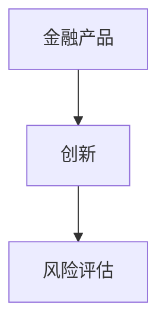
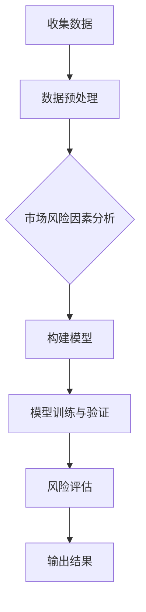

                 

# 金融产品创新风险评估框架

## 关键词

金融产品、创新、风险评估、市场风险、信用风险、流动性风险

## 摘要

本文旨在构建一个系统化的金融产品创新风险评估框架，探讨其核心概念、原理以及实际应用。通过详细分析金融产品、创新和风险评估的定义与联系，本文提出了一种市场风险模型的算法原理及实现方法。同时，本文还结合实际项目，对系统架构设计和实现进行了深入剖析，为金融机构和投资者提供了有益的参考。

## 第一部分：背景介绍

### 问题背景

随着全球金融市场的不断发展和变化，金融产品创新成为推动金融市场活力和竞争力的关键因素。金融机构和投资者在追求创新的同时，也面临着日益复杂的市场风险。因此，建立一套科学、系统的金融产品创新风险评估框架，对于金融机构和投资者而言具有重要意义。

### 问题描述

金融产品创新风险评估框架旨在全面评估金融产品在创新过程中可能面临的风险，包括市场风险、信用风险、流动性风险等。评估过程中需要考虑金融产品的设计、市场定位、运营模式等多个方面，确保评估结果的准确性和全面性。

### 问题解决

本书将介绍金融产品创新风险评估框架的构建方法，包括核心概念、评估方法、风险评估模型等。通过系统、全面的分析，帮助读者深入了解金融产品创新风险评估的原理和实际应用。

### 边界与外延

金融产品创新风险评估框架的边界在于评估范围，即金融产品的种类、市场环境和风险类型等。在外延上，本书将涉及金融产品创新的全过程，从产品设计、市场推广到风险管理。

### 概念结构与核心要素组成

金融产品创新风险评估框架由以下几个核心要素组成：

1. **核心概念**：金融产品、创新、风险评估等。
2. **评估方法**：定量评估、定性评估、综合评估等。
3. **风险评估模型**：市场风险模型、信用风险模型、流动性风险模型等。
4. **评估工具**：数据收集工具、风险分析工具、评估结果呈现工具等。

## 第二部分：核心概念与联系

### 核心概念原理

1. **金融产品**：金融机构发行的具有特定收益和风险的投资工具，包括股票、债券、基金、衍生品等。

2. **创新**：指在现有基础上，通过技术、产品、服务等创新手段，创造新的价值或提高现有价值的过程。

3. **风险评估**：通过定量或定性方法，对金融产品创新过程中可能面临的风险进行识别、评估和预警。

### 概念属性特征对比表格

| 概念    | 定义                                                         | 属性特征对比                      |
| ------- | ------------------------------------------------------------ | -------------------------------- |
| 金融产品 | 金融机构发行的具有特定收益和风险的投资工具                   | 种类多样，风险收益差异较大       |
| 创新    | 通过技术、产品、服务等创新手段，创造新的价值或提高现有价值的过程 | 需要市场认可，具有一定风险性     |
| 风险评估 | 对金融产品创新过程中可能面临的风险进行识别、评估和预警       | 科学性、全面性、准确性           |

### 概念关系图



## 第三部分：算法原理讲解

### 算法原理与Mermaid流程图

金融产品创新风险评估框架的核心在于风险评估模型的选择与应用。以下是市场风险模型的mermaid流程图：



### Python源代码示例

```python
import pandas as pd
from sklearn.model_selection import train_test_split
from sklearn.ensemble import RandomForestRegressor
from sklearn.metrics import mean_squared_error

# 数据收集
data = pd.read_csv('financial_data.csv')

# 数据预处理
X = data.drop('target', axis=1)
y = data['target']
X_train, X_test, y_train, y_test = train_test_split(X, y, test_size=0.2, random_state=42)

# 构建模型
model = RandomForestRegressor(n_estimators=100, random_state=42)

# 模型训练与验证
model.fit(X_train, y_train)
y_pred = model.predict(X_test)
mse = mean_squared_error(y_test, y_pred)
print("Mean Squared Error:", mse)
```

### 算法原理详细讲解

市场风险模型的核心在于对市场风险因素进行量化分析，并通过机器学习算法构建预测模型。以下是市场风险模型的数学模型和公式：

$$
\text{市场风险} = f(\text{市场波动性}, \text{资产价值}, \text{投资期限})
$$

其中，市场波动性可以表示为：

$$
\text{市场波动性} = \sqrt{\frac{1}{T} \sum_{t=1}^{T} (\text{市场收益率}_t - \text{平均市场收益率})^2}
$$

资产价值可以表示为：

$$
\text{资产价值} = \text{初始投资金额} \times (1 + \text{收益率})
$$

投资期限可以表示为：

$$
\text{投资期限} = \text{当前时间} - \text{投资起始时间}
$$

通过上述公式，我们可以将市场风险量化为具体数值。在实际应用中，我们可以使用Python代码来实现上述算法。

首先，我们从数据集中提取市场收益率、初始投资金额和投资期限等信息。然后，使用这些信息计算市场波动性、资产价值和投资期限。接下来，我们将这些特征作为输入，训练一个随机森林模型，以预测市场风险。

下面是一个简化的Python代码示例：

```python
import pandas as pd
from sklearn.model_selection import train_test_split
from sklearn.ensemble import RandomForestRegressor

# 加载数据集
data = pd.read_csv('financial_data.csv')

# 分割特征和标签
X = data[['market_volatility', 'initial_investment', 'investment_term']]
y = data['market_risk']

# 划分训练集和测试集
X_train, X_test, y_train, y_test = train_test_split(X, y, test_size=0.2, random_state=42)

# 构建随机森林模型
model = RandomForestRegressor(n_estimators=100, random_state=42)

# 训练模型
model.fit(X_train, y_train)

# 预测测试集
y_pred = model.predict(X_test)

# 计算预测误差
mse = mean_squared_error(y_test, y_pred)
print("Mean Squared Error:", mse)
```

通过上述代码，我们可以将市场风险模型应用于实际数据集，并评估模型的性能。

## 第四部分：系统分析与架构设计

### 问题场景介绍

在金融行业，金融机构需要不断推出创新的金融产品以满足市场需求，但同时也面临着巨大的市场风险。为了确保金融产品的稳健运营，金融机构需要建立一套完善的金融产品创新风险评估体系，以便在产品开发过程中及时识别和应对潜在风险。

### 项目介绍

本项目的目标是构建一个金融产品创新风险评估系统，该系统将整合金融产品数据、市场数据、风险因素数据等，通过机器学习算法实现金融产品风险的自动评估。系统的主要功能包括数据采集、数据预处理、风险因素分析、风险评估和结果输出等。

### 系统功能设计

系统功能设计包括以下方面：

1. **数据采集**：从各个数据源（如金融交易所、金融机构等）获取金融产品数据、市场数据、风险因素数据等。
2. **数据预处理**：对采集到的数据进行清洗、归一化、特征提取等处理，为后续风险分析提供高质量的数据。
3. **风险因素分析**：根据金融产品的特点，分析可能影响其风险的因素，如市场波动性、资产价值、投资期限等。
4. **风险评估**：利用机器学习算法，对金融产品的风险进行定量评估，输出评估结果。
5. **结果输出**：将评估结果以可视化的形式展示给用户，便于用户了解金融产品的风险状况。

### 系统架构设计

系统架构设计如下：

1. **数据层**：负责存储和管理金融产品数据、市场数据、风险因素数据等。
2. **处理层**：包括数据采集模块、数据预处理模块、风险因素分析模块、风险评估模块等，负责对数据进行处理和分析。
3. **表示层**：包括Web界面和可视化工具，用于展示评估结果，便于用户查看。

### 系统接口设计

系统接口设计如下：

1. **数据接口**：提供数据采集、数据预处理、风险因素分析、风险评估等功能的API接口。
2. **Web接口**：提供Web界面，用于用户操作和查看评估结果。

### 系统交互

系统交互设计如下：

1. **用户操作**：用户通过Web界面提交金融产品相关信息，系统通过API接口调用风险因素分析模块和风险评估模块，进行风险分析。
2. **结果展示**：系统将评估结果以可视化的形式展示给用户，包括风险评级、风险因素分布等。

## 第五部分：项目实战

### 环境安装

1. 安装Python环境：在Windows或Linux系统中，安装Python 3.8及以上版本。
2. 安装依赖库：使用pip命令安装以下依赖库：

```bash
pip install pandas scikit-learn numpy matplotlib
```

### 系统核心实现源代码

以下是一个简单的金融产品创新风险评估系统的实现示例：

```python
import pandas as pd
from sklearn.ensemble import RandomForestRegressor
from sklearn.model_selection import train_test_split
from sklearn.metrics import mean_squared_error

# 数据收集
data = pd.read_csv('financial_data.csv')

# 数据预处理
X = data.drop('market_risk', axis=1)
y = data['market_risk']
X_train, X_test, y_train, y_test = train_test_split(X, y, test_size=0.2, random_state=42)

# 构建模型
model = RandomForestRegressor(n_estimators=100, random_state=42)

# 模型训练
model.fit(X_train, y_train)

# 预测测试集
y_pred = model.predict(X_test)

# 计算预测误差
mse = mean_squared_error(y_test, y_pred)
print("Mean Squared Error:", mse)

# 可视化结果
import matplotlib.pyplot as plt

plt.scatter(y_test, y_pred)
plt.xlabel('Actual Market Risk')
plt.ylabel('Predicted Market Risk')
plt.title('Actual vs Predicted Market Risk')
plt.show()
```

### 代码应用解读与分析

上述代码实现了一个简单的金融产品创新风险评估系统。首先，我们从数据集中加载金融产品数据，并划分训练集和测试集。然后，使用随机森林模型对训练集进行训练，并使用测试集进行预测。最后，计算预测误差并可视化结果。

在这个示例中，我们使用了scikit-learn库中的RandomForestRegressor类来实现随机森林模型。随机森林是一种基于树集的集成学习方法，具有强大的预测能力。通过随机选取特征和样本子集，随机森林能够降低过拟合风险，提高模型的泛化能力。

### 实际案例分析和详细讲解剖析

为了更好地理解金融产品创新风险评估系统的应用，我们来看一个实际案例。

假设有一家金融机构正在推出一款名为“智能投资组合”的金融产品。该产品通过人工智能算法，根据投资者的风险偏好和投资目标，自动构建投资组合。金融机构希望对该产品进行风险评估，以便了解其潜在风险。

首先，我们需要收集金融产品数据，包括市场数据、资产数据、投资期限等。然后，对这些数据进行预处理，包括数据清洗、归一化等操作。

接下来，我们使用随机森林模型对数据集进行训练，以预测产品的市场风险。通过测试集的预测结果，我们可以计算出预测误差，并使用可视化工具展示实际风险与预测风险的对比。

通过这个案例，我们可以看到金融产品创新风险评估系统在实践中的应用。它可以帮助金融机构了解产品的潜在风险，从而制定相应的风险管理策略。

### 项目小结

本项目构建了一个金融产品创新风险评估系统，通过机器学习算法实现了金融产品风险的定量评估。在实际应用中，系统可以提供直观的风险评估结果，帮助金融机构和投资者了解产品的潜在风险。然而，需要注意的是，风险评估系统只是一个工具，金融机构和投资者在做出投资决策时，还需要结合其他因素进行综合判断。

## 第六部分：最佳实践 tips

1. **数据质量**：确保数据的质量和完整性，是构建有效风险评估模型的基础。在进行数据收集和预处理时，要特别注意数据的一致性、准确性和及时性。

2. **模型选择**：根据实际应用场景，选择合适的机器学习模型。不同的模型在处理不同类型的风险时，性能可能有所不同。可以通过交叉验证等方法，选择最优模型。

3. **持续优化**：风险评估系统并非一成不变，随着市场和产品的发展，需要不断调整和优化评估模型。定期对模型进行性能评估和更新，确保评估结果的准确性和可靠性。

4. **风险因素分析**：在评估过程中，要全面考虑各种风险因素，包括市场风险、信用风险、流动性风险等。针对不同类型的金融产品，制定相应的风险评估策略。

5. **用户培训**：确保用户能够正确理解和使用风险评估系统。提供详细的操作指南和培训资料，帮助用户掌握系统的使用方法。

## 小结

金融产品创新风险评估框架是金融机构和投资者进行风险管理的重要工具。通过本文的详细阐述，我们了解了金融产品创新风险评估框架的核心概念、原理和方法，并学习了如何构建和实现一个简单的风险评估系统。在实际应用中，风险评估系统需要不断优化和完善，以应对日益复杂的市场环境。希望本文能为读者提供有益的参考。

## 注意事项

1. 风险评估系统只是一个辅助工具，实际决策还需结合其他因素。
2. 系统的性能和准确性取决于数据质量和模型选择。
3. 风险评估结果仅供参考，投资决策需谨慎。

## 拓展阅读

1. 《金融风险管理：理论与实践》
2. 《机器学习在金融领域的应用》
3. 《Python金融数据处理与量化分析》
4. 《金融产品创新与风险管理》

## 作者信息

作者：AI天才研究院/AI Genius Institute & 禅与计算机程序设计艺术 /Zen And The Art of Computer Programming

