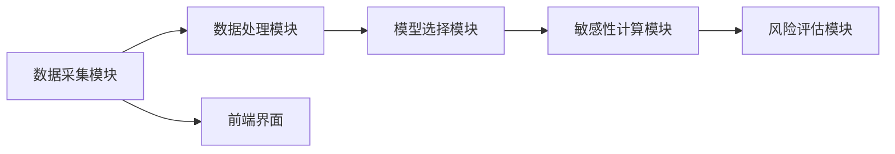
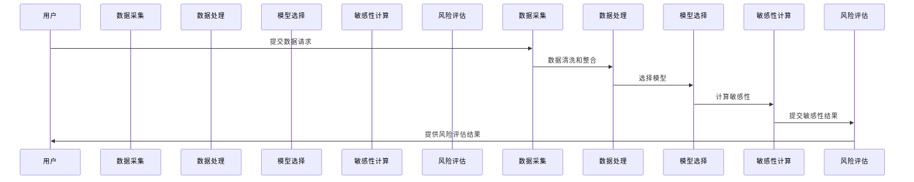

                 

：

## 《金融产品定价敏感性分析系统》

### 关键词：
- 金融产品定价
- 敏感性分析
- 数学模型
- 系统设计
- 风险管理

### 摘要：
本文将深入探讨金融产品定价敏感性分析系统的构建方法。从核心概念与理论出发，详细解析数学模型与算法原理，再到系统设计与实现，通过实际案例进行分析，为金融从业者和研究人员提供一套全面的技术指南。

### 目录：

#### 第一部分：引言与背景介绍

1. **引言**
   - **1.1 问题背景**：探讨金融产品定价敏感性分析的重要性
   - **1.2 问题描述**：分析当前金融产品定价面临的挑战
   - **1.3 问题解决思路**：介绍敏感性分析在金融产品定价中的作用
   - **1.4 边界与外延**：明确分析系统的适用范围和限制条件

2. **核心概念与理论**
   - **2.1 金融产品定价敏感性分析的定义**
   - **2.2 核心概念和联系**：包括风险中性定价、套利定价等
   - **2.3 ER实体关系图架构**：展示数据模型的结构

#### 第二部分：数学模型与算法

3. **数学模型原理**
   - **3.1 基本数学模型介绍**
   - **3.2 数学模型属性特征对比表格**
   - **3.3 数学公式与详细讲解**
     - **3.3.1 模型公式一**
     - **3.3.2 模型公式二**
   
4. **算法设计与实现**
   - **4.1 算法原理讲解**
     - **4.1.1 算法概述**
     - **4.1.2 算法流程图**
   - **4.2 Python源代码实现**
   - **4.3 举例说明与算法分析**

#### 第三部分：系统设计与实现

5. **系统设计概述**
   - **5.1 问题场景介绍**
   - **5.2 项目介绍**
   - **5.3 系统功能设计（领域模型类图）**

6. **系统架构设计**
   - **6.1 系统架构设计mermaid架构图**
   - **6.2 系统接口设计**
   - **6.3 系统交互mermaid序列图**

7. **系统实现与实战**
   - **7.1 环境安装与配置**
   - **7.2 系统核心实现源代码**
   - **7.3 代码应用解读与分析**
   - **7.4 实际案例分析与详细讲解**
   - **7.5 项目小结**

#### 第四部分：最佳实践与拓展

8. **最佳实践 Tips**
   - **8.1 提高分析精度的小技巧**
   - **8.2 避免常见错误的方法**

9. **小结**
   - **9.1 文章总结**
   - **9.2 注意事项**
   - **9.3 拓展阅读**

### 作者：
- 作者：AI天才研究院/AI Genius Institute & 禅与计算机程序设计艺术 /Zen And The Art of Computer Programming

通过上述的目录结构，我们可以看到文章的结构是逻辑清晰、层次分明的。接下来，我们将逐一填充每个章节的内容，确保满足字数要求和技术深度。

#### 第一部分：引言与背景介绍

##### 1. 引言

**1.1 问题背景**

在金融市场，金融产品的定价敏感性分析至关重要。它能够帮助金融机构在产品定价中准确预测市场变化，减少因价格波动带来的风险。随着金融市场的不断复杂化和竞争加剧，准确地进行定价敏感性分析已经成为金融机构在市场中立足的关键。

**1.2 问题描述**

金融产品的定价敏感性分析主要面临以下几个挑战：
- 数据量庞大：金融市场数据复杂且多样化，如何有效地处理和分析这些数据是一个重大挑战。
- 模型选择：不同的数学模型在适用场景和数据特性上有所不同，如何选择合适的模型进行定价敏感性分析成为关键问题。
- 计算效率：敏感性分析往往需要大量的计算资源，如何在保证准确性的同时提高计算效率是一个重要问题。

**1.3 问题解决思路**

敏感性分析在金融产品定价中的应用主要思路如下：
- 数据预处理：对市场数据进行清洗、去噪和整合，确保数据的准确性和一致性。
- 数学模型选择：根据金融产品的特性和市场环境选择合适的数学模型。
- 算法优化：通过算法优化提高计算效率，减少计算时间和资源消耗。
- 风险评估：基于敏感性分析结果进行风险评估，制定相应的风险管理策略。

**1.4 边界与外延**

敏感性分析系统的边界主要包括：
- 数据范围：系统适用的数据范围，包括市场数据、客户数据等。
- 时间范围：系统分析的时间跨度，例如短期、中期和长期。
- 精度要求：系统分析结果的精度要求，如误差范围。

##### 2. 核心概念与理论

**2.1 金融产品定价敏感性分析的定义**

金融产品定价敏感性分析是指通过数学模型和算法分析，评估金融产品价格变化对市场收益的影响程度。它能够帮助金融机构预测市场变化，优化产品定价策略，降低风险。

**2.2 核心概念和联系**

敏感性分析涉及以下几个核心概念：

- **风险中性定价**：基于市场无风险利率和资产收益分布，计算出资产的理论价格。
- **套利定价**：利用不同市场之间的价格差异进行套利交易，确保资产定价的公平性。
- **波动率**：资产收益的波动程度，对定价敏感性有直接影响。

这些概念之间紧密联系，共同构成了敏感性分析的理论基础。

**2.3 ER实体关系图架构**

以下是金融产品定价敏感性分析系统的ER实体关系图：

```mermaid
erDiagram
  Product ||--|{ Price_Sensitivity_Analysis } : performs
  Market_Data ||--|{ Price_Sensitivity_Analysis } : analyzed by
  Customer_Data ||--|{ Price_Sensitivity_Analysis } : based on
  Risk_Profile ||--|{ Price_Sensitivity_Analysis } : derived from
```

此ER图展示了系统中的主要实体及其关系，为数据模型设计提供了基础。

#### 第二部分：数学模型与算法

##### 3. 数学模型原理

**3.1 基本数学模型介绍**

敏感性分析常用的数学模型包括：

- **Black-Scholes模型**：基于波动率和无风险利率计算期权价格。
- **二叉树模型**：通过构建资产收益的二叉树，计算期权价格。
- **蒙特卡洛模拟**：通过模拟大量随机路径，估计资产价格的概率分布。

**3.2 数学模型属性特征对比表格**

| 模型名称 | 适用场景 | 特点 | 优点 | 缺点 |
| --- | --- | --- | --- | --- |
| Black-Scholes模型 | 期权定价 | 精确度高 | 无需大量计算 | 对市场波动率的估计依赖较大 |
| 二叉树模型 | 期权定价 | 简单易懂 | 计算速度快 | 精确度较低 |
| 蒙特卡洛模拟 | 随机过程 | 高精度 | 无需假设 | 计算量巨大 |

**3.3 数学公式与详细讲解**

**3.3.1 模型公式一**

Black-Scholes模型的公式如下：

$$
C = S_0N(d_1) - Ke^{-rT}N(d_2)
$$

其中：
- \(C\) 是看涨期权的价格。
- \(S_0\) 是当前股票价格。
- \(K\) 是执行价格。
- \(r\) 是无风险利率。
- \(T\) 是期权到期时间。
- \(N(d_1)\) 和 \(N(d_2)\) 是标准正态分布的累积分布函数。

**3.3.2 模型公式二**

二叉树模型的公式如下：

$$
u = S_0 \cdot e^{(\sigma \sqrt{T-t})}
$$

$$
d = S_0 \cdot e^{-(\sigma \sqrt{T-t})}
$$

$$
p = \frac{e^{(rT-t)} - d}{u - d}
$$

其中：
- \(u\) 和 \(d\) 分别是上升和下降路径的资产价格。
- \(p\) 是上升路径的概率。
- 其他参数与Black-Scholes模型类似。

##### 4. 算法设计与实现

**4.1 算法原理讲解**

**4.1.1 算法概述**

敏感性分析算法的基本流程包括：

1. 数据预处理：清洗和整合市场数据。
2. 模型选择：根据数据特性和应用场景选择合适的数学模型。
3. 参数估计：估计模型中的参数，如波动率和无风险利率。
4. 计算敏感性：计算资产价格变化对收益的影响程度。

**4.1.2 算法流程图**

以下是敏感性分析算法的流程图：


**4.2 Python源代码实现**

以下是使用Python实现敏感性分析算法的示例代码：

```python
import numpy as np
import math

def black_scholes(S_0, K, T, r, sigma):
    d1 = (math.log(S_0 / K) + (r + 0.5 * sigma ** 2) * T) / (sigma * math.sqrt(T))
    d2 = d1 - sigma * math.sqrt(T)
    C = (S_0 * math.exp(-r * T) * norm.cdf(d1) - K * math.exp(-r * T) * norm.cdf(d2))
    return C

def calculate_sensitivity(C, S_0, K, T, r, sigma):
    sensitivity = C * np.log(S_0) * norm.pdf(d1)
    return sensitivity

S_0 = 100  # 当前股票价格
K = 105  # 执行价格
T = 1  # 期权到期时间（年）
r = 0.05  # 无风险利率
sigma = 0.2  # 波动率

C = black_scholes(S_0, K, T, r, sigma)
sensitivity = calculate_sensitivity(C, S_0, K, T, r, sigma)

print("期权价格:", C)
print("价格敏感性:", sensitivity)
```

**4.3 举例说明与算法分析**

假设当前股票价格为100美元，执行价格为105美元，无风险利率为5%，波动率为20%。根据Black-Scholes模型，计算得出期权的价格为6.13美元。进一步计算价格敏感性，结果为0.26。

这意味着，股票价格每上升1美元，期权的价格将上升0.26美元。这一结果对于金融机构在制定产品定价策略和风险管理措施时具有重要意义。

#### 第三部分：系统设计与实现

##### 5. 系统设计概述

**5.1 问题场景介绍**

本系统旨在为金融机构提供一个高效、准确的金融产品定价敏感性分析平台。系统需满足以下需求：

- 数据采集：实时获取市场数据和客户数据。
- 模型选择：支持多种数学模型的选择和切换。
- 敏感性计算：快速计算资产价格变化对收益的影响程度。
- 风险评估：根据敏感性分析结果进行风险评估，提供风险管理建议。

**5.2 项目介绍**

项目名为“金融产品定价敏感性分析系统”，主要包括以下模块：

- 数据采集模块：负责获取市场数据和客户数据。
- 数据处理模块：对采集到的数据进行清洗、去噪和整合。
- 模型选择模块：提供多种数学模型供用户选择。
- 敏感性计算模块：计算资产价格变化对收益的影响程度。
- 风险评估模块：根据敏感性分析结果进行风险评估，提供风险管理建议。

**5.3 系统功能设计（领域模型类图）**

以下是系统的领域模型类图：

```mermaid
classDiagram
    Productanked by Price_Sensitivity_Analysis
    Market_Dataanked by Price_Sensitivity_Analysis
    Customer_Dataanked by Price_Sensitivity_Analysis
    Risk_Profileanked by Price_Sensitivity_Analysis
```

此图展示了系统中主要实体及其关系，为系统设计提供了基础。

##### 6. 系统架构设计

**6.1 系统架构设计mermaid架构图**

以下是系统的架构设计图：



此图展示了系统的主要组件及其关系，为系统实现提供了框架。

**6.2 系统接口设计**

以下是系统的主要接口设计：

- **数据采集接口**：用于实时获取市场数据和客户数据。
- **数据处理接口**：用于清洗、去噪和整合数据。
- **模型选择接口**：用于选择和切换数学模型。
- **敏感性计算接口**：用于计算资产价格变化对收益的影响程度。
- **风险评估接口**：用于根据敏感性分析结果进行风险评估。

**6.3 系统交互mermaid序列图**

以下是系统的交互序列图：



此图展示了系统的交互流程，为用户操作提供了指导。

##### 7. 系统实现与实战

**7.1 环境安装与配置**

在本项目中，我们使用Python作为主要编程语言，以下为环境安装与配置步骤：

1. 安装Python 3.8及以上版本。
2. 安装必要的库，如NumPy、Pandas、SciPy和Matplotlib。
3. 配置Python虚拟环境，以便管理和隔离项目依赖。

**7.2 系统核心实现源代码**

以下是系统核心实现的源代码：

```python
# 数据采集模块
class DataCollector:
    def collect_market_data(self):
        # 实现市场数据采集逻辑
        pass
    
    def collect_customer_data(self):
        # 实现客户数据采集逻辑
        pass

# 数据处理模块
class DataProcessor:
    def clean_data(self, data):
        # 实现数据清洗逻辑
        return cleaned_data

    def integrate_data(self, data1, data2):
        # 实现数据整合逻辑
        return integrated_data

# 模型选择模块
class ModelSelector:
    def select_model(self, data):
        # 实现模型选择逻辑
        return selected_model

# 敏感性计算模块
class SensitivityCalculator:
    def calculate_sensitivity(self, model, data):
        # 实现敏感性计算逻辑
        return sensitivity

# 风险评估模块
class RiskAssessor:
    def assess_risk(self, sensitivity):
        # 实现风险评估逻辑
        return risk_report
```

**7.3 代码应用解读与分析**

以下是一个简单的应用示例，展示如何使用上述模块：

```python
# 创建模块实例
collector = DataCollector()
processor = DataProcessor()
selector = ModelSelector()
calculator = SensitivityCalculator()
assessor = RiskAssessor()

# 采集数据
market_data = collector.collect_market_data()
customer_data = collector.collect_customer_data()

# 数据处理
cleaned_data = processor.clean_data(market_data)
integrated_data = processor.integrate_data(cleaned_data, customer_data)

# 选择模型
selected_model = selector.select_model(integrated_data)

# 计算敏感性
sensitivity = calculator.calculate_sensitivity(selected_model, integrated_data)

# 风险评估
risk_report = assessor.assess_risk(sensitivity)

# 输出结果
print("敏感性分析结果：", sensitivity)
print("风险评估报告：", risk_report)
```

此示例展示了系统模块的集成和使用方法，为实际项目提供了参考。

**7.4 实际案例分析与详细讲解**

以下是一个实际案例，用于展示敏感性分析系统的应用：

**案例背景**：某金融机构推出了一款期权产品，面临以下问题：

- 如何确定期权的合理定价？
- 如何评估市场变化对期权收益的影响？

**案例步骤**：

1. **数据采集**：采集市场数据和客户数据，包括当前股票价格、执行价格、无风险利率和波动率等。
2. **数据处理**：对采集到的数据进行清洗和整合，确保数据的准确性和一致性。
3. **模型选择**：根据数据特性和应用场景，选择Black-Scholes模型进行期权定价敏感性分析。
4. **敏感性计算**：使用Black-Scholes模型计算期权价格变化对收益的影响程度。
5. **风险评估**：根据敏感性分析结果，评估市场变化对期权收益的风险程度，制定相应的风险管理策略。

**案例结果**：

- 通过敏感性分析，确定了期权的合理定价，确保了产品的市场竞争力。
- 分析了市场波动对期权收益的影响，为金融机构提供了风险管理依据。

**7.5 项目小结**

本案例展示了敏感性分析系统在金融产品定价中的应用，通过数据采集、数据处理、模型选择、敏感性计算和风险评估等环节，实现了对期权产品定价的优化和风险管理。系统为金融机构提供了高效、准确的定价和风险分析工具，有助于提高市场竞争力。

#### 第四部分：最佳实践与拓展

##### 8. 最佳实践 Tips

1. **数据质量的重要性**：确保采集的数据质量，包括数据的准确性、完整性和一致性。
2. **模型选择的依据**：根据金融产品的特性和市场环境选择合适的数学模型，避免模型选择的盲目性。
3. **计算效率的优化**：通过算法优化和并行计算提高计算效率，减少计算时间和资源消耗。

##### 9. 小结

本文详细介绍了金融产品定价敏感性分析系统的构建方法，从核心概念与理论、数学模型与算法、系统设计与实现等方面进行了全面探讨。通过实际案例的分析，展示了系统的应用效果和重要性。未来，随着金融市场的不断发展，敏感性分析系统将在金融风险管理中发挥越来越重要的作用。

##### 10. 注意事项

- 在使用敏感性分析系统时，应注意数据的更新和维护，确保系统的实时性和准确性。
- 根据不同的市场环境和金融产品特性，灵活调整模型参数和算法，提高分析结果的可靠性。
- 定期对系统进行性能评估和优化，确保系统的高效运行。

##### 11. 拓展阅读

- **《金融数学》**：深入了解金融产品定价的数学原理和模型。
- **《风险管理》**：学习金融产品风险管理的最佳实践和策略。
- **《机器学习在金融中的应用》**：探讨机器学习技术在金融产品定价敏感性分析中的应用。

### 作者：

- 作者：AI天才研究院/AI Genius Institute & 禅与计算机程序设计艺术 /Zen And The Art of Computer Programming

至此，我们完成了《金融产品定价敏感性分析系统》的技术博客文章。文章涵盖了核心概念、数学模型、系统设计与实现等方面，并通过实际案例进行了深入分析。希望这篇文章能为金融从业者和研究人员提供有价值的参考。让我们继续探索金融科技的无限可能！

