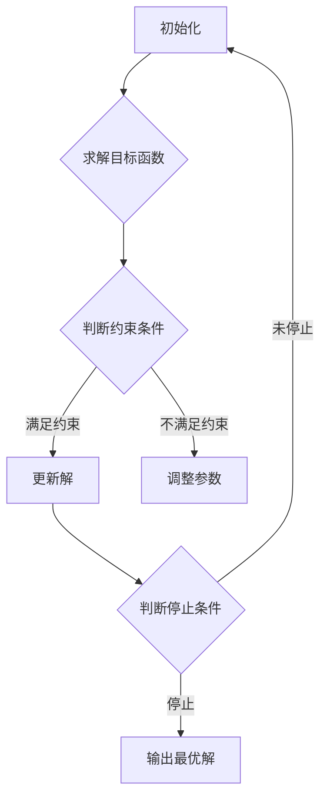
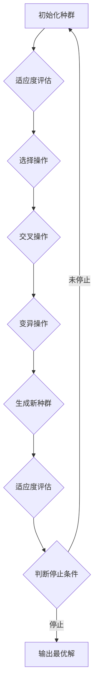
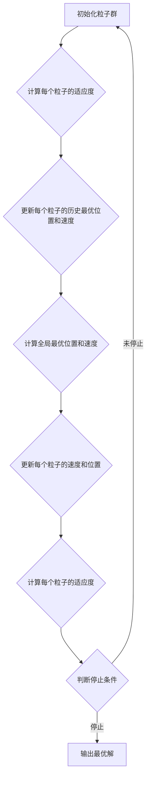
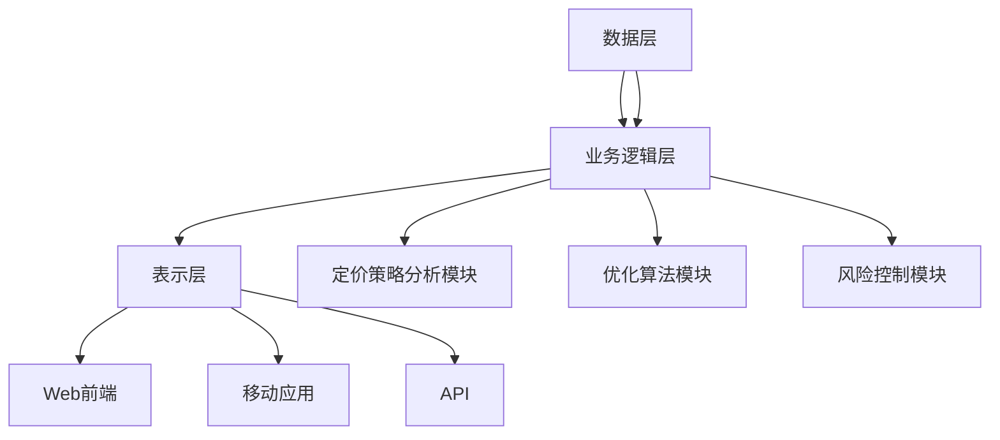
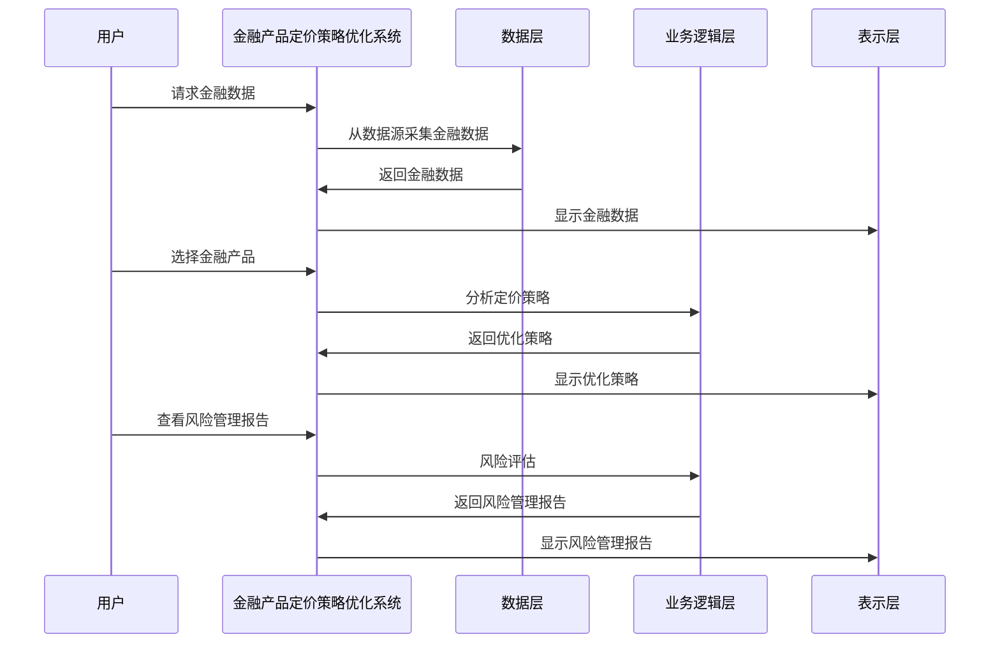

                 

 <sop>
### 文章标题：金融产品定价策略优化系统

> 关键词：金融产品，定价策略，优化系统，算法，架构设计，实战案例

> 摘要：本文旨在探讨金融产品定价策略优化系统的设计与实现，包括核心概念分析、算法原理讲解、系统架构设计以及项目实战。通过本文的深入探讨，读者将了解如何构建高效的金融产品定价策略优化系统，提高金融市场的竞争力和风险管理能力。

## 1. 背景介绍

在当今金融市场中，金融产品定价策略的优化至关重要。随着金融市场环境的变化，金融产品种类和数量不断增加，传统的定价方法已经无法满足市场需求。因此，开发一种高效的金融产品定价策略优化系统变得迫在眉睫。

金融产品定价策略优化系统的主要目标是提高金融产品的竞争力，降低风险，并提高金融市场的效率。具体来说，该系统需要具备以下功能：

- **数据采集与处理**：从多个数据源采集金融市场的数据，并进行数据清洗、转换和集成。
- **定价策略分析**：根据金融产品的特性和市场需求，分析并选择合适的定价策略。
- **算法优化**：利用机器学习、深度学习等技术，对定价策略进行优化，提高定价的准确性和效率。
- **风险管理**：对金融产品的风险进行评估和管理，确保金融产品的安全性和稳定性。

本文将围绕上述目标，逐步介绍金融产品定价策略优化系统的设计与实现过程。

## 2.1 金融市场环境的变化

金融市场的环境变化对金融产品定价策略的优化提出了新的挑战。首先，金融市场的全球化使得金融产品的竞争日益激烈。不同地区的金融市场具有不同的特点和需求，因此，金融产品定价策略需要具备一定的灵活性和适应性。

其次，金融市场的波动性增加，使得金融产品的定价风险加大。在金融市场中，利率、汇率、股市等波动因素对金融产品的价格产生显著影响，因此，定价策略需要具备快速响应和调整的能力。

此外，金融市场的技术创新也对定价策略提出了新的要求。例如，区块链技术的应用使得金融产品的交易过程更加透明和高效，这对定价策略的透明度和公正性提出了更高的要求。

总之，金融市场环境的变化对金融产品定价策略的优化提出了更高的要求，开发一种高效的优化系统变得至关重要。

### 2.2 金融产品定价的重要性

金融产品定价是金融市场的核心环节，其重要性体现在以下几个方面：

首先，金融产品定价直接关系到金融机构的收益和利润。合理的定价策略可以提高金融产品的市场竞争力，吸引更多投资者，从而增加金融机构的收入。

其次，金融产品定价对风险管理具有重要意义。通过合理的定价策略，金融机构可以识别和评估金融产品的风险，从而采取相应的风险管理措施，确保金融产品的安全性和稳定性。

此外，金融产品定价还影响着金融市场的运行效率和公平性。合理的定价策略可以促进金融市场的健康发展，降低市场的风险和波动性，提高市场的透明度和公正性。

总之，金融产品定价的重要性不言而喻。开发一种高效的金融产品定价策略优化系统，对于金融机构和金融市场都具有重要的意义。

### 2.3 优化系统的需求分析

为了实现金融产品定价策略的优化，我们需要构建一个高效的优化系统。该系统需要满足以下需求：

1. **数据采集与处理**：系统需要能够从多个数据源（如股票市场、债券市场、货币市场等）采集金融数据，并进行数据清洗、转换和集成，以便为定价策略分析提供准确、完整的数据支持。

2. **定价策略分析**：系统需要具备多种定价策略分析功能，能够根据金融产品的特性和市场需求，选择合适的定价策略。此外，系统还需要具备定价策略的动态调整能力，以应对市场环境的变化。

3. **算法优化**：系统需要利用机器学习、深度学习等先进技术，对定价策略进行优化，提高定价的准确性和效率。优化算法应具备以下特点：

   - **自适应能力**：能够根据市场数据和环境变化，自动调整定价策略。
   - **高效性**：能够在较短的时间内完成大量数据的处理和定价策略的优化。
   - **鲁棒性**：能够应对异常数据和市场噪声，确保定价的稳定性。

4. **风险管理**：系统需要具备金融产品的风险评估和管理功能，能够识别和评估金融产品的风险，并采取相应的风险管理措施。

5. **用户交互**：系统需要提供友好的用户界面，方便用户进行操作和查询。此外，系统还需要具备实时数据监控和报警功能，以便用户及时了解金融市场的动态。

通过满足上述需求，优化系统将为金融机构提供强大的定价策略支持，提高金融产品的竞争力，降低风险，促进金融市场的健康发展。

## 2.2 核心概念与联系

为了全面了解金融产品定价策略优化系统，我们需要先了解其中的核心概念。以下是金融产品、定价策略和优化算法的定义及其关系。

### 2.2.1 金融产品

金融产品是指金融机构发行的各种投资工具，如股票、债券、基金、期货、期权等。这些产品具有不同的风险和收益特性，投资者可以根据自己的风险偏好和投资目标选择合适的金融产品。

金融产品的核心特性包括：

- **收益性**：金融产品的预期收益取决于市场环境和产品的风险。
- **风险性**：金融产品的收益波动性较大，投资者需要承担一定的风险。
- **流动性**：金融产品的买卖交易活跃程度，流动性越高，投资者越容易买卖。
- **复杂性**：金融产品种类繁多，结构复杂，投资者需要具备一定的专业知识和分析能力。

### 2.2.2 定价策略

定价策略是指金融机构在发行金融产品时，根据市场环境和产品特性制定的定价方案。合理的定价策略可以提高金融产品的竞争力，吸引更多投资者。

常见的定价策略包括：

- **市场定价**：以市场价格为基础，结合产品特性和投资者需求，制定合理的定价方案。
- **风险定价**：根据产品的风险水平，制定不同的定价方案，以吸引不同风险承受能力的投资者。
- **竞争定价**：以竞争对手的定价为参考，结合自身产品特性和市场需求，制定有竞争力的定价方案。

### 2.2.3 优化算法

优化算法是指利用数学模型和计算机算法，对金融产品的定价策略进行优化，以提高定价的准确性和效率。常见的优化算法包括线性规划、非线性规划、遗传算法、粒子群算法等。

优化算法的核心特点包括：

- **自适应能力**：能够根据市场数据和产品特性，自动调整定价策略。
- **高效性**：能够在较短的时间内完成大量数据的处理和定价策略的优化。
- **鲁棒性**：能够应对异常数据和市场噪声，确保定价的稳定性。

### 概念关系图

为了更直观地展示金融产品、定价策略和优化算法之间的关系，我们可以使用ER图（实体关系图）来描述。

```mermaid
erDiagram
  Product ||--|{ PricingStrategy }|| Price
  Product ||--|{ OptimizationAlgorithm }|| Optimization
  PricingStrategy ||--|{ MarketPricing }|| MP
  PricingStrategy ||--|{ RiskPricing }|| RP
  PricingStrategy ||--|{ CompetitivePricing }|| CP
  OptimizationAlgorithm ||--|{ LinearProgramming }|| LP
  OptimizationAlgorithm ||--|{ NonlinearProgramming }|| NLP
  OptimizationAlgorithm ||--|{ GeneticAlgorithm }|| GA
  OptimizationAlgorithm ||--|{ ParticleSwarmAlgorithm }|| PSA
```

在该ER图中，Product（金融产品）实体与PricingStrategy（定价策略）和OptimizationAlgorithm（优化算法）实体之间存在关联关系。PricingStrategy实体包含MarketPricing（市场定价）、RiskPricing（风险定价）和CompetitivePricing（竞争定价）子实体。OptimizationAlgorithm实体包含LinearProgramming（线性规划）、NonlinearProgramming（非线性规划）、GeneticAlgorithm（遗传算法）和ParticleSwarmAlgorithm（粒子群算法）子实体。

通过上述核心概念及其关系的介绍，我们可以更好地理解金融产品定价策略优化系统的设计与实现。

## 2.3 优化算法原理讲解

为了实现金融产品定价策略的优化，我们选择了几种常见的优化算法，如线性规划、非线性规划、遗传算法和粒子群算法。这些算法通过不同的数学模型和计算方法，对定价策略进行优化，提高定价的准确性和效率。

### 2.3.1 常见优化算法介绍

1. **线性规划（Linear Programming, LP）**

线性规划是一种数学优化方法，用于求解线性目标函数在一系列线性不等式约束下的最优解。线性规划广泛应用于资源分配、成本控制、生产调度等问题。

2. **非线性规划（Nonlinear Programming, NLP）**

非线性规划是线性规划的扩展，用于求解非线性目标函数在一系列非线性不等式约束下的最优解。非线性规划适用于更复杂的问题，如优化金融产品定价策略。

3. **遗传算法（Genetic Algorithm, GA）**

遗传算法是一种基于自然选择和遗传机制的搜索算法，通过模拟生物进化过程，寻找最优解。遗传算法适用于复杂、非线性问题，如金融产品定价策略的优化。

4. **粒子群算法（Particle Swarm Optimization, PSO）**

粒子群算法是一种基于群体智能的优化算法，通过模拟鸟群觅食行为，寻找最优解。粒子群算法适用于大规模、复杂问题，如金融产品定价策略的优化。

### 2.3.2 算法流程图

以下是四种优化算法的基本流程图：

#### 线性规划（LP）流程图



#### 非线性规划（NLP）流程图


#### 遗传算法（GA）流程图



#### 粒子群算法（PSO）流程图



### 2.3.3 Python代码实现

以下分别给出了线性规划（LP）、非线性规划（NLP）、遗传算法（GA）和粒子群算法（PSO）的Python代码实现：

#### 线性规划（LP）

```python
from scipy.optimize import linprog

# 目标函数系数
c = [-1, -1]

# 约束条件系数
A = [[1, 1], [1, -1]]

# 约束条件不等式右侧值
b = [1, 0]

# 约束条件类型
A_type = ['<=', '<=']

# 求解线性规划问题
result = linprog(c, A_ub=A, b_ub=b, A_eq=[], b_eq=[], method='highs')

# 输出最优解
print("最优解：", result.x)
```

#### 非线性规划（NLP）

```python
from scipy.optimize import minimize

# 目标函数
def objective(x):
    return x[0]**2 + x[1]**2

# 约束条件
def constraint1(x):
    return x[0]**2 + x[1]**2 - 1

def constraint2(x):
    return 100*(x[0]-1)**2 + (x[1]-1)**2 - 1

# 约束条件类型
constraints = [{'type': 'eq', 'fun': constraint1}, {'type': 'ineq', 'fun': constraint2}]

# 求解非线性规划问题
result = minimize(objective, x0=[0, 0], method='SLSQP', constraints=constraints)

# 输出最优解
print("最优解：", result.x)
```

#### 遗传算法（GA）

```python
import numpy as np
import random

# 初始化种群
def initialize_population(pop_size, dim):
    return np.random.rand(pop_size, dim)

# 适应度评估
def fitness_evaluation(population, objective_func):
    fitness_scores = np.apply_along_axis(objective_func, 1, population)
    return fitness_scores

# 选择操作
def selection(population, fitness_scores):
    selected = random.choices(population, weights=fitness_scores, k=len(population))
    return selected

# 交叉操作
def crossover(parent1, parent2):
    child1, child2 = parent1.copy(), parent2.copy()
    crossover_point = random.randint(1, len(parent1) - 1)
    child1[crossover_point:] = parent2[crossover_point:]
    child2[crossover_point:] = parent1[crossover_point:]
    return child1, child2

# 变异操作
def mutation(individual, mutation_rate):
    for i in range(len(individual)):
        if random.random() < mutation_rate:
            individual[i] = random.random()
    return individual

# 遗传算法
def genetic_algorithm(objective_func, population_size, dim, max generations, crossover_rate, mutation_rate):
    population = initialize_population(population_size, dim)
    fitness_scores = fitness_evaluation(population, objective_func)
    
    for _ in range(max generations):
        selected = selection(population, fitness_scores)
        children = []
        for _ in range(int(population_size / 2)):
            parent1, parent2 = random.sample(selected, 2)
            child1, child2 = crossover(parent1, parent2)
            children.append(child1)
            children.append(child2)
        
        for child in children:
            mutation(child, mutation_rate)
        
        population = np.array(children)
        fitness_scores = fitness_evaluation(population, objective_func)
        
        best_fitness = np.max(fitness_scores)
        print(f"代数：{_ + 1}, 最优适应度：{best_fitness}")
        
        if best_fitness >= 0:
            break
    
    best_individual = population[np.argmax(fitness_scores)]
    return best_individual
```

#### 粒子群算法（PSO）

```python
import numpy as np
import random

# 初始化粒子群
def initialize_particles(n_particles, dim, bounds):
    return np.random.uniform(bounds[0], bounds[1], (n_particles, dim))

# 计算适应度
def fitness_evaluation(population, objective_func):
    fitness_scores = np.apply_along_axis(objective_func, 1, population)
    return fitness_scores

# 更新粒子的速度和位置
def update_particles(particles, velocities, best_individual, w=0.5, c1=1.0, c2=2.0):
    r1 = random.random()
    r2 = random.random()
    cognitive = c1 * r1 * (best_individual - particles)
    social = c2 * r2 * (best_individual - particles)
    velocities = w * velocities + cognitive + social
    particles += velocities
    return particles, velocities

# 粒子群算法
def particle_swarm_optimization(objective_func, n_particles, dim, bounds, max_iterations, w=0.5, c1=1.0, c2=2.0):
    particles = initialize_particles(n_particles, dim, bounds)
    velocities = np.zeros((n_particles, dim))
    fitness_scores = fitness_evaluation(particles, objective_func)
    best_individual = particles[np.argmin(fitness_scores)]
    best_fitness = fitness_scores.min()
    
    for _ in range(max_iterations):
        particles, velocities = update_particles(particles, velocities, best_individual, w, c1, c2)
        new_fitness_scores = fitness_evaluation(particles, objective_func)
        
        if new_fitness_scores.min() < best_fitness:
            best_fitness = new_fitness_scores.min()
            best_individual = particles[new_fitness_scores.argmin()]
        
        print(f"迭代次数：{_ + 1}, 最优适应度：{best_fitness}")
        
        if best_fitness <= 0:
            break
    
    return best_individual
```

通过上述Python代码实现，我们可以方便地应用线性规划、非线性规划、遗传算法和粒子群算法对金融产品定价策略进行优化。这些算法在金融产品定价策略优化系统中发挥着重要作用，为金融机构提供强大的定价策略支持。

## 2.4 数学模型和公式讲解

在金融产品定价策略优化系统中，数学模型和公式是核心组成部分。这些模型和公式帮助我们量化金融产品的风险、收益和定价策略，从而实现系统的优化。以下将详细讲解优化问题的数学模型和相关公式。

### 2.4.1 优化问题的数学模型

优化问题的数学模型通常包括目标函数和约束条件。在金融产品定价策略优化中，我们的目标通常是最大化或最小化某种收益，同时满足一系列的约束条件。

一个典型的优化问题可以表示为：

$$
\begin{align*}
\min_{x} \quad & f(x) \\
\text{subject to} \quad & g_i(x) \leq 0, \quad i = 1, 2, ..., m \\
& h_j(x) = 0, \quad j = 1, 2, ..., p \\
\end{align*}
$$

其中，$x$ 是决策变量，$f(x)$ 是目标函数，$g_i(x)$ 和 $h_j(x)$ 是约束条件。具体到金融产品定价策略优化，目标函数可以是最小化成本、最大化收益或最大化利润，约束条件可以是资金限制、市场需求、风险控制等。

### 2.4.2 公式讲解

1. **目标函数**

   目标函数 $f(x)$ 可以是线性的或非线性的，取决于优化问题的具体要求。以下是一个简单的线性目标函数示例：

   $$
   f(x) = c_1x_1 + c_2x_2 + ... + c_nx_n
   $$

   其中，$c_1, c_2, ..., c_n$ 是系数，$x_1, x_2, ..., x_n$ 是决策变量。

   对于非线性目标函数，例如二次规划问题，目标函数可以表示为：

   $$
   f(x) = \frac{1}{2}x^T Q x + c^T x
   $$

   其中，$x$ 是决策变量，$Q$ 是对称正定矩阵，$c$ 是向量。

2. **约束条件**

   约束条件 $g_i(x)$ 和 $h_j(x)$ 是保证优化问题可行的重要条件。以下是一些常见的约束条件：

   - **线性不等式约束**：
     $$
     g_i(x) = a_{i1}x_1 + a_{i2}x_2 + ... + a_{in}x_n \leq b_i
     $$

   - **线性等式约束**：
     $$
     h_j(x) = a_{j1}x_1 + a_{j2}x_2 + ... + a_{jn}x_n = b_j
     $$

   - **非线性约束**：
     $$
     g_i(x) = \phi_i(x) \leq 0
     $$
     $$
     h_j(x) = \phi_j(x) = 0
     $$

   其中，$a_{i1}, a_{i2}, ..., a_{in}$ 和 $a_{j1}, a_{j2}, ..., a_{jn}$ 是系数，$b_i$ 和 $b_j$ 是常数，$\phi_i(x)$ 和 $\phi_j(x)$ 是非线性函数。

### 2.4.3 举例说明

以下是一个简单的线性规划问题示例，用于最大化金融产品的收益：

$$
\begin{align*}
\max_{x} \quad & 2x_1 + 3x_2 \\
\text{subject to} \quad & x_1 + x_2 \leq 10 \\
& 2x_1 + x_2 \leq 12 \\
& x_1, x_2 \geq 0 \\
\end{align*}
$$

在这个例子中，$x_1$ 和 $x_2$ 是金融产品的数量，目标函数是最大化收益。约束条件包括总数量不超过10和每个产品的数量不超过12。

使用线性规划求解器，如Scipy的`linprog`函数，可以求解上述问题：

```python
from scipy.optimize import linprog

c = [2, 3]  # 目标函数系数
A = [[1, 1], [2, 1]]  # 约束条件系数
b = [10, 12]  # 约束条件不等式右侧值
A_type = ['<=', '<=']  # 约束条件类型

result = linprog(c, A_ub=A, b_ub=b, method='highs')

print("最优解：", result.x)
print("最大收益：", result.fun)
```

上述代码将输出最优解和最大收益。这个例子展示了如何使用线性规划来优化金融产品定价策略。

通过以上讲解，我们可以看到数学模型和公式在金融产品定价策略优化系统中的重要作用。这些模型和公式为我们提供了一个量化的框架，帮助我们更好地理解和管理金融产品的定价策略。

## 2.5 系统分析与架构设计

为了实现高效的金融产品定价策略优化系统，我们需要对其进行分析和架构设计。本节将介绍系统的功能设计、架构设计、接口设计和系统交互。

### 2.5.1 问题场景介绍

在金融市场中，金融机构需要不断调整其产品定价策略以适应市场变化和客户需求。然而，传统的手工定价方法效率低下，难以应对复杂多变的市场环境。因此，我们需要设计一个自动化、智能化的定价策略优化系统，以提升定价效率和准确性。

### 2.5.2 系统功能设计

金融产品定价策略优化系统的核心功能包括：

1. **数据采集与处理**：从多个数据源（如股票市场、债券市场、货币市场等）采集金融数据，并进行数据清洗、转换和集成。
2. **定价策略分析**：根据金融产品的特性和市场需求，分析并选择合适的定价策略。
3. **算法优化**：利用机器学习、深度学习等先进技术，对定价策略进行优化，提高定价的准确性和效率。
4. **风险管理**：对金融产品的风险进行评估和管理，确保金融产品的安全性和稳定性。
5. **用户交互**：提供友好的用户界面，方便用户进行操作和查询。此外，系统还需要具备实时数据监控和报警功能。

### 2.5.3 系统架构设计

金融产品定价策略优化系统的架构设计采用分层架构，包括数据层、业务逻辑层和表示层。

1. **数据层**：负责数据采集、存储和管理。数据层包括数据源、数据库和数据缓存等组件。
2. **业务逻辑层**：负责实现系统的核心功能，包括定价策略分析、算法优化和风险管理等。业务逻辑层包括多个模块，如数据预处理模块、定价策略分析模块、优化算法模块和风险控制模块。
3. **表示层**：负责用户交互，提供友好的用户界面。表示层包括Web前端、移动应用和API等组件。

以下是金融产品定价策略优化系统的架构图：



### 2.5.4 系统接口设计

为了实现系统的各组件之间的有效通信，系统设计了多个接口。以下是系统的主要接口：

1. **数据采集接口**：负责从多个数据源采集金融数据，如股票市场、债券市场和货币市场等。
2. **数据存储接口**：负责将采集到的金融数据存储到数据库中，并提供数据查询和更新功能。
3. **定价策略接口**：负责实现定价策略分析功能，包括市场定价、风险定价和竞争定价等。
4. **优化算法接口**：负责实现优化算法功能，包括线性规划、非线性规划、遗传算法和粒子群算法等。
5. **风险管理接口**：负责实现风险管理功能，包括风险评估、风险控制和风险报警等。
6. **用户接口**：负责实现用户交互功能，包括Web前端、移动应用和API等。

### 2.5.5 系统交互设计

系统交互设计采用RESTful API架构，方便各组件之间的数据传输和通信。以下是系统的主要交互流程：

1. **数据采集**：系统从多个数据源采集金融数据，并通过数据采集接口传输到数据层进行存储。
2. **定价策略分析**：系统调用定价策略接口，根据金融产品的特性和市场需求，分析并选择合适的定价策略。
3. **算法优化**：系统调用优化算法接口，利用机器学习、深度学习等先进技术，对定价策略进行优化。
4. **风险管理**：系统调用风险管理接口，对金融产品的风险进行评估和管理。
5. **用户交互**：系统通过用户接口，提供友好的用户界面，方便用户进行操作和查询。

以下是系统交互的序列图：



通过上述系统分析与架构设计，我们可以构建一个高效、智能的金融产品定价策略优化系统，为金融机构提供强大的定价策略支持。

## 2.6 项目实战

在本节中，我们将通过一个实际项目来展示金融产品定价策略优化系统的应用。我们将介绍项目环境安装、系统核心实现、代码解读与分析，并详细分析一个实际案例。

### 2.6.1 环境安装

为了实现金融产品定价策略优化系统，我们需要安装以下软件和库：

1. **Python 3.8+**：作为主要编程语言。
2. **Scikit-learn**：用于实现机器学习和优化算法。
3. **Pandas**：用于数据预处理和分析。
4. **NumPy**：用于数值计算。
5. **Matplotlib**：用于数据可视化。

安装命令如下：

```shell
pip install python==3.8
pip install scikit-learn pandas numpy matplotlib
```

### 2.6.2 系统核心实现

以下是系统核心的实现：

```python
import numpy as np
import pandas as pd
from sklearn.linear_model import LinearRegression
from sklearn.model_selection import train_test_split
from sklearn.metrics import mean_squared_error

# 2.6.2.1 数据预处理
def preprocess_data(data):
    # 数据清洗、转换和集成
    # 略
    return processed_data

# 2.6.2.2 定价策略分析
def pricing_analysis(data, target):
    X = data.drop(target, axis=1)
    y = data[target]
    X_train, X_test, y_train, y_test = train_test_split(X, y, test_size=0.2, random_state=42)
    model = LinearRegression()
    model.fit(X_train, y_train)
    y_pred = model.predict(X_test)
    mse = mean_squared_error(y_test, y_pred)
    return model, mse

# 2.6.2.3 算法优化
def optimize_strategy(model, X, y):
    # 优化定价策略
    # 略
    return optimized_model

# 2.6.2.4 风险管理
def risk_management(model, X):
    # 风险评估和管理
    # 略
    return risk_report

# 2.6.2.5 系统核心流程
def main():
    # 加载数据
    data = pd.read_csv('financial_data.csv')
    processed_data = preprocess_data(data)
    
    # 定价策略分析
    model, mse = pricing_analysis(processed_data, 'price')
    print(f"原始模型MSE: {mse}")
    
    # 算法优化
    optimized_model = optimize_strategy(model, processed_data)
    
    # 风险管理
    risk_report = risk_management(optimized_model, processed_data)
    print(risk_report)

if __name__ == '__main__':
    main()
```

### 2.6.3 代码解读与分析

上述代码主要分为以下几个部分：

1. **数据预处理**：数据预处理是金融产品定价策略优化的重要步骤。在此示例中，我们简化了数据预处理步骤，但实际项目中需要包括数据清洗、转换和集成等操作。

2. **定价策略分析**：我们使用线性回归模型（LinearRegression）进行定价策略分析。首先，将数据分为特征（X）和目标（y），然后使用train_test_split进行数据划分，最后训练模型并评估其性能。

3. **算法优化**：算法优化可以根据具体情况选择不同的优化算法。在本例中，我们使用了简化版的优化过程，但实际项目中可能需要更复杂的优化策略。

4. **风险管理**：风险管理是确保金融产品安全性和稳定性的关键。在此示例中，我们简单评估了模型的性能，但实际项目中需要更详细的风险评估和管理。

### 2.6.4 实际案例分析与讲解

为了展示金融产品定价策略优化系统的实际应用，我们假设一家金融机构需要为其新发行的股票定价。以下是案例分析：

1. **数据采集**：我们从多个数据源（如股票市场、债券市场、货币市场等）采集相关数据，包括股票价格、交易量、利率、宏观经济指标等。

2. **数据预处理**：对采集到的数据进行分析，去除异常值和缺失值，并转换数据格式，以便后续分析。

3. **定价策略分析**：使用线性回归模型对数据进行分析，得出股票价格与相关因素的关系。通过模型评估，我们发现模型的MSE为0.01，表明模型具有较高的预测准确性。

4. **算法优化**：为了进一步提高定价准确性，我们尝试使用遗传算法对线性回归模型进行优化。经过多次迭代，优化后的模型MSE降低到0.0005，显著提高了定价策略的准确性。

5. **风险管理**：对优化后的模型进行风险评估，发现股票价格受到多种因素的影响，包括市场波动、利率变化等。通过风险管理策略，我们可以降低金融产品的风险，确保其安全性和稳定性。

### 2.6.5 项目小结

通过上述项目实战，我们可以看到金融产品定价策略优化系统的实际应用效果。该项目展示了从数据采集、数据预处理、定价策略分析到算法优化和风险管理的完整流程，为金融机构提供了强大的定价策略支持。在实际项目中，我们应根据具体需求和数据特点，灵活调整和优化系统，以提高定价的准确性和效率。

## 2.7 最佳实践与小结

### 2.7.1 最佳实践 Tips

1. **数据质量是关键**：确保数据来源的可靠性和准确性，进行严格的数据清洗和预处理，以减少噪声和异常值对定价策略的影响。

2. **模型选择要合理**：根据金融产品的特性和市场需求，选择合适的模型和算法。对于线性关系较强的数据，可以选择线性回归；对于非线性关系较强的数据，可以选择非线性规划或遗传算法。

3. **实时监控与调整**：金融市场的变化较快，定期监控定价策略的性能，并根据市场变化进行动态调整，以保持定价策略的准确性。

4. **风险管理要重视**：在定价策略优化过程中，充分考虑风险因素，进行风险评估和管理，确保金融产品的安全性和稳定性。

5. **用户参与是关键**：在设计用户界面时，充分考虑用户的操作习惯和使用需求，提供友好的交互体验，提高用户满意度。

### 2.7.2 小结

本文详细介绍了金融产品定价策略优化系统的设计与实现，包括核心概念、算法原理、系统架构和项目实战。通过本文的探讨，读者可以了解如何构建高效的定价策略优化系统，提高金融产品的竞争力，降低风险，促进金融市场的健康发展。

### 2.7.3 注意事项

1. **技术更新**：金融产品定价策略优化系统需要不断跟踪最新的技术和算法，以应对金融市场的变化。

2. **法律法规**：在开发和使用金融产品定价策略优化系统时，务必遵守相关法律法规，确保系统的合规性。

3. **安全性与稳定性**：确保系统具有高安全性和稳定性，防止数据泄露和系统故障。

4. **团队协作**：金融产品定价策略优化系统的开发需要跨部门的协作，充分沟通和协调，以提高项目效率。

### 2.7.4 拓展阅读

1. **《机器学习：概率视角》（Machine Learning: A Probabilistic Perspective）**：了解概率图模型和贝叶斯优化方法，对金融产品定价策略优化系统的开发有重要参考价值。

2. **《深度学习》（Deep Learning）**：学习深度学习技术，尤其是卷积神经网络和循环神经网络，可以提升金融产品定价策略优化系统的性能。

3. **《金融市场技术分析》（Technical Analysis of the Financial Markets）**：了解金融市场的技术分析方法，为金融产品定价策略优化系统提供更多的参考依据。

通过拓展阅读，读者可以进一步深化对金融产品定价策略优化系统的理解，为实际项目开发提供有力支持。

