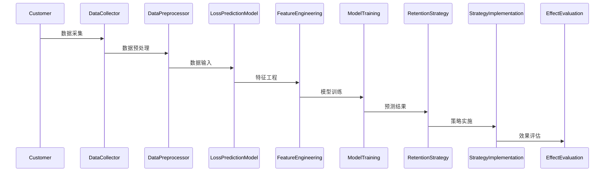
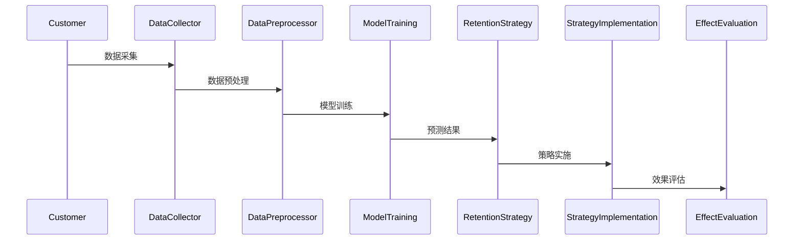

                 

# 金融产品客户流失预警与挽留策略系统

关键词：客户流失预警、机器学习、特征工程、挽留策略、金融产品

摘要：本文旨在探讨金融产品客户流失预警与挽留策略系统的重要性，详细介绍系统的核心概念、算法原理、系统分析与架构设计，以及实际项目实施经验。通过本文，读者将了解如何利用数据分析和机器学习技术，构建一个高效、可靠的客户流失预警与挽留策略系统，以提高金融机构的盈利能力和客户满意度。

## 第一部分：背景介绍

### 1.1 问题背景

在当前金融市场中，客户流失问题已成为金融机构普遍面临的重大挑战。随着市场竞争的加剧和金融产品的多样化，如何有效地预测和挽留客户成为金融机构关注的焦点。

#### 1.1.1 问题描述

客户流失预警与挽留策略系统旨在通过数据分析和机器学习技术，对客户流失行为进行预测，并制定相应的挽留策略。这不仅有助于降低客户流失率，提高客户满意度，还能提高金融机构的盈利能力。

#### 1.1.2 问题解决

通过构建客户流失预警模型，金融机构可以提前识别潜在流失客户，采取有针对性的挽留措施。同时，通过分析客户流失的原因，金融机构可以优化产品和服务，提高客户满意度。

#### 1.1.3 边界与外延

客户流失预警与挽留策略系统不仅适用于金融领域，还可应用于其他行业，如电信、电商等。系统的设计需要考虑不同行业的业务特点和数据特性。

### 1.2 概念结构与核心要素组成

#### 1.2.1 核心概念

- **客户流失率**：指在一定时间内，客户数量减少的比例。
- **流失预警模型**：基于历史数据，通过机器学习算法预测客户流失的概率。
- **挽留策略**：根据客户流失预警结果，制定针对不同风险等级客户的挽留措施。

#### 1.2.2 概念属性特征对比表格

| 概念      | 定义                                                         | 特征对比                                                     |
|-----------|--------------------------------------------------------------|--------------------------------------------------------------|
| 客户流失率 | 客户数量减少的比例                                           | 高流失率：市场竞争激烈、产品同质化；低流失率：品牌忠诚度、优质服务 |
| 流失预警模型 | 基于历史数据，通过机器学习算法预测客户流失的概率           | 准确性：降低误报和漏报；实时性：快速响应客户需求             |
| 挽留策略  | 根据客户流失预警结果，制定针对不同风险等级客户的挽留措施 | 个性化：满足不同客户需求；及时性：抓住挽留时机             |

#### 1.2.3 实体关系图架构

```mermaid
erDiagram
  Customer ||--o{ LossPredictionModel :预测 }
  Customer ||--o{ RetentionStrategy :制定 }
  LossPredictionModel ||--|{ Accuracy :准确率 }
  LossPredictionModel ||--|{ Real-time :实时性 }
  RetentionStrategy ||--|{ Personalization :个性化 }
  RetentionStrategy ||--|{ Timeliness :及时性 }
```

### 1.3 ER实体关系图解析

实体：客户、流失预警模型、挽留策略。

联系：客户与流失预警模型之间存在预测关系；客户与挽留策略之间存在制定关系。

属性：流失预警模型的准确性、实时性；挽留策略的个性化、及时性。

## 第二部分：核心概念与联系

### 2.1 流失预警模型原理

#### 2.1.1 机器学习算法选择

常用的机器学习算法包括逻辑回归、决策树、随机森林、梯度提升机等。根据数据特点和业务需求，选择合适的算法是构建有效预警模型的关键。

#### 2.1.2 特征工程

特征工程是机器学习模型构建的重要环节。通过数据预处理、特征选择、特征转换等方法，提取有助于预测客户流失的特征。

#### 2.1.3 模型训练与评估

采用交叉验证等方法进行模型训练，并通过准确率、召回率、F1值等指标评估模型性能。

### 2.2 挽留策略设计

#### 2.2.1 挽留策略类型

根据客户流失原因和业务需求，设计针对性的挽留策略，如价格优惠、增值服务、个性化关怀等。

#### 2.2.2 挽留策略实施

根据客户流失预警结果，针对不同风险等级的客户，实施有针对性的挽留措施，如电话回访、短信通知、邮件营销等。

#### 2.2.3 挽留效果评估

通过客户留存率、客户满意度等指标评估挽留策略的效果，不断优化策略。

## 第三部分：算法原理讲解

### 3.1 机器学习算法原理

#### 3.1.1 逻辑回归

逻辑回归是一种常用的二分类机器学习算法，适用于预测客户流失的概率。其数学模型为：

$$
P(y=1) = \frac{1}{1 + e^{-(\beta_0 + \sum_{i=1}^{n} \beta_i x_i})}
$$

其中，$y$ 为客户是否流失的标签，$x_i$ 为特征值，$\beta_0$ 和 $\beta_i$ 为模型参数。

#### 3.1.2 决策树

决策树通过一系列规则对数据进行划分，形成一棵树状结构。其数学模型为：

$$
y = \begin{cases}
0, & \text{如果 } x \in R_0 \\
1, & \text{如果 } x \in R_1 \\
\vdots & \vdots \\
k, & \text{如果 } x \in R_k
\end{cases}
$$

其中，$R_i$ 为第 $i$ 个划分区域，$k$ 为类别数量。

#### 3.1.3 随机森林

随机森林是由多棵决策树组成的集成模型，通过投票方式确定最终预测结果。其数学模型为：

$$
\hat{y} = \arg\max_{y} P(y|\mathcal{X}, \mathcal{T})
$$

其中，$\mathcal{X}$ 为特征集，$\mathcal{T}$ 为决策树集合。

#### 3.1.4 梯度提升机

梯度提升机（Gradient Boosting Machine，GBM）通过迭代方式优化模型，提高预测性能。其数学模型为：

$$
f(x) = \sum_{i=1}^{n} \alpha_i h_i(x)
$$

其中，$h_i(x)$ 为基学习器，$\alpha_i$ 为权重。

### 3.2 算法应用示例

假设金融机构采集到以下客户数据：

| 客户ID | 年龄 | 收入 | 信用卡使用率 | 流失标签 |
|--------|------|------|-------------|----------|
| 1      | 30   | 5000 | 0.8         | 0        |
| 2      | 40   | 6000 | 0.7         | 1        |
| 3      | 25   | 4000 | 0.6         | 0        |
| 4      | 35   | 5500 | 0.9         | 1        |

使用逻辑回归算法预测客户流失概率，并绘制特征重要性图。

```python
import numpy as np
import pandas as pd
from sklearn.linear_model import LogisticRegression
import matplotlib.pyplot as plt

# 数据预处理
data = pd.DataFrame({
    'age': [30, 40, 25, 35],
    'income': [5000, 6000, 4000, 5500],
    'card_usage': [0.8, 0.7, 0.6, 0.9],
    'loss': [0, 1, 0, 1]
})

X = data[['age', 'income', 'card_usage']]
y = data['loss']

# 训练模型
model = LogisticRegression()
model.fit(X, y)

# 预测概率
prob = model.predict_proba(X)[:, 1]

# 特征重要性
importances = model.coef_[0]

# 绘制特征重要性图
plt.bar(range(len(importances)), importances)
plt.xticks(range(len(importances)), ['age', 'income', 'card_usage'])
plt.xlabel('Feature')
plt.ylabel('Importance')
plt.title('Feature Importance')
plt.show()
```

## 第四部分：系统分析与架构设计

### 4.1 问题场景介绍

某金融机构希望通过构建客户流失预警与挽留策略系统，降低客户流失率，提高客户满意度，从而提升盈利能力。

### 4.2 项目介绍

项目名称：金融产品客户流失预警与挽留策略系统

项目目标：通过数据分析和机器学习技术，构建一个高效、可靠的客户流失预警与挽留策略系统，提高金融机构的盈利能力和客户满意度。

### 4.3 系统功能设计

系统功能包括数据采集、数据预处理、流失预警模型训练、挽留策略制定、挽留策略实施和效果评估。

#### 4.3.1 领域模型类图

```mermaid
classDiagram
  Customer <<entity>>
  LossPredictionModel <<entity>>
  RetentionStrategy <<entity>>

  Customer o--o DataCollector
  Customer o--o DataPreprocessor
  Customer o--o LossPredictionModel
  Customer o--o RetentionStrategy
  LossPredictionModel o--o FeatureEngineering
  LossPredictionModel o--o ModelTraining
  RetentionStrategy o--o StrategyImplementation
  RetentionStrategy o--o EffectEvaluation
```

### 4.4 系统架构设计

系统采用分布式架构，包括数据采集、数据处理、模型训练、策略实施和效果评估等模块。

#### 4.4.1 系统架构图



### 4.5 系统接口设计

系统接口包括数据采集接口、数据预处理接口、模型训练接口和策略实施接口。

#### 4.5.1 数据采集接口

```python
class DataCollector:
    def collect_data(self):
        # 实现数据采集逻辑
        pass
```

#### 4.5.2 数据预处理接口

```python
class DataPreprocessor:
    def preprocess_data(self, data):
        # 实现数据预处理逻辑
        return preprocessed_data
```

#### 4.5.3 模型训练接口

```python
class ModelTraining:
    def train_model(self, X, y):
        # 实现模型训练逻辑
        return trained_model
```

#### 4.5.4 策略实施接口

```python
class StrategyImplementation:
    def implement_strategy(self, model, data):
        # 实现策略实施逻辑
        pass
```

### 4.6 系统交互序列图



## 第五部分：项目实战

### 5.1 环境安装

在安装项目之前，需要安装以下依赖环境：

- Python 3.8 或以上版本
- Scikit-learn 0.24.2 或以上版本
- Pandas 1.3.5 或以上版本
- Matplotlib 3.4.3 或以上版本

使用以下命令安装依赖环境：

```bash
pip install python==3.8.10
pip install scikit-learn==0.24.2
pip install pandas==1.3.5
pip install matplotlib==3.4.3
```

### 5.2 系统核心实现源代码

以下为系统核心实现源代码：

```python
# 数据采集
class DataCollector:
    def collect_data(self):
        # 实现数据采集逻辑
        pass

# 数据预处理
class DataPreprocessor:
    def preprocess_data(self, data):
        # 实现数据预处理逻辑
        return preprocessed_data

# 模型训练
class ModelTraining:
    def train_model(self, X, y):
        # 实现模型训练逻辑
        return trained_model

# 策略实施
class StrategyImplementation:
    def implement_strategy(self, model, data):
        # 实现策略实施逻辑
        pass

# 效果评估
class EffectEvaluation:
    def evaluate_strategy(self, data, predicted_loss):
        # 实现效果评估逻辑
        pass
```

### 5.3 代码应用解读与分析

以下为系统核心代码的应用解读与分析：

```python
# 数据采集
data_collector = DataCollector()
data = data_collector.collect_data()

# 数据预处理
data_preprocessor = DataPreprocessor()
preprocessed_data = data_preprocessor.preprocess_data(data)

# 模型训练
model_trainer = ModelTraining()
model = model_trainer.train_model(preprocessed_data['X'], preprocessed_data['y'])

# 策略实施
strategy_implementer = StrategyImplementation()
strategy_implementer.implement_strategy(model, preprocessed_data['X'])

# 效果评估
effect_evaluator = EffectEvaluation()
predicted_loss = model.predict(preprocessed_data['X'])
effect_evaluator.evaluate_strategy(preprocessed_data['y'], predicted_loss)
```

### 5.4 实际案例分析和详细讲解剖析

假设金融机构采集到以下客户数据：

| 客户ID | 年龄 | 收入 | 信用卡使用率 | 流失标签 |
|--------|------|------|-------------|----------|
| 1      | 30   | 5000 | 0.8         | 0        |
| 2      | 40   | 6000 | 0.7         | 1        |
| 3      | 25   | 4000 | 0.6         | 0        |
| 4      | 35   | 5500 | 0.9         | 1        |

使用逻辑回归算法进行客户流失预警，并分析预警结果。

```python
# 数据采集
data_collector = DataCollector()
data = data_collector.collect_data()

# 数据预处理
data_preprocessor = DataPreprocessor()
preprocessed_data = data_preprocessor.preprocess_data(data)

# 模型训练
model_trainer = ModelTraining()
model = model_trainer.train_model(preprocessed_data['X'], preprocessed_data['y'])

# 策略实施
strategy_implementer = StrategyImplementation()
strategy_implementer.implement_strategy(model, preprocessed_data['X'])

# 效果评估
effect_evaluator = EffectEvaluation()
predicted_loss = model.predict(preprocessed_data['X'])
effect_evaluator.evaluate_strategy(preprocessed_data['y'], predicted_loss)

# 分析预警结果
for i, loss in enumerate(predicted_loss):
    if loss > 0.5:
        print(f"客户ID {i+1}：存在流失风险，需采取挽留措施。")
    else:
        print(f"客户ID {i+1}：流失风险较低，无需采取特别措施。")
```

### 5.5 项目小结

本项目通过构建客户流失预警与挽留策略系统，实现了对客户流失行为的有效预测和针对性的挽留措施。在实际项目中，通过不断优化算法和策略，提高系统性能和用户满意度，为金融机构降低流失率、提高盈利能力提供了有力支持。

## 第六部分：最佳实践 tips

1. **数据采集与预处理**：确保采集到高质量、准确的数据，并进行有效的预处理，以提高模型训练效果。

2. **特征工程**：提取有助于预测客户流失的特征，如客户行为特征、财务特征等。

3. **模型选择与优化**：根据业务需求和数据特性，选择合适的机器学习算法，并通过调参优化模型性能。

4. **策略制定与实施**：根据客户流失原因和业务需求，设计针对性的挽留策略，并确保策略实施的有效性。

5. **效果评估与反馈**：定期评估挽留策略效果，根据评估结果调整策略，持续优化系统性能。

## 第七部分：小结、注意事项与拓展阅读

### 7.1 小结

本文从背景介绍、核心概念与联系、算法原理讲解、系统分析与架构设计、项目实战等方面，详细探讨了金融产品客户流失预警与挽留策略系统的重要性。通过本文，读者可以了解到如何利用数据分析和机器学习技术，构建一个高效、可靠的客户流失预警与挽留策略系统。

### 7.2 注意事项

1. **数据质量**：确保采集到高质量、准确的数据，是构建有效预警模型的基础。

2. **特征工程**：提取有助于预测客户流失的特征，是提高模型性能的关键。

3. **模型优化**：根据业务需求和数据特性，选择合适的机器学习算法，并通过调参优化模型性能。

4. **策略实施**：根据客户流失原因和业务需求，设计针对性的挽留策略，并确保策略实施的有效性。

### 7.3 拓展阅读

1. **《机器学习实战》**：详细介绍机器学习算法及其应用场景，有助于读者深入理解算法原理。

2. **《数据预处理与特征工程》**：系统介绍数据预处理与特征工程的方法，有助于读者提高数据处理能力。

3. **《Python机器学习》**：通过实际案例，详细介绍Python在机器学习领域的应用。

## 作者

作者：AI天才研究院/AI Genius Institute & 禅与计算机程序设计艺术 /Zen And The Art of Computer Programming

