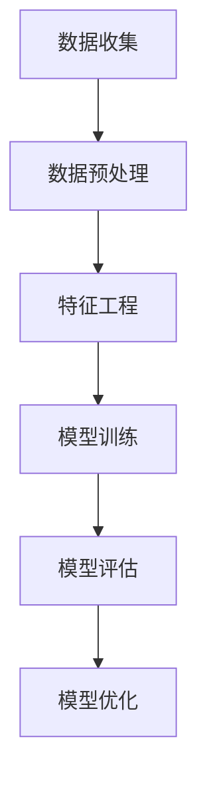
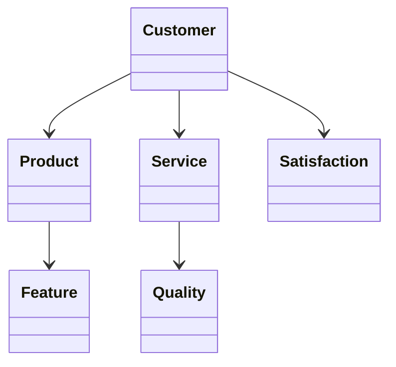
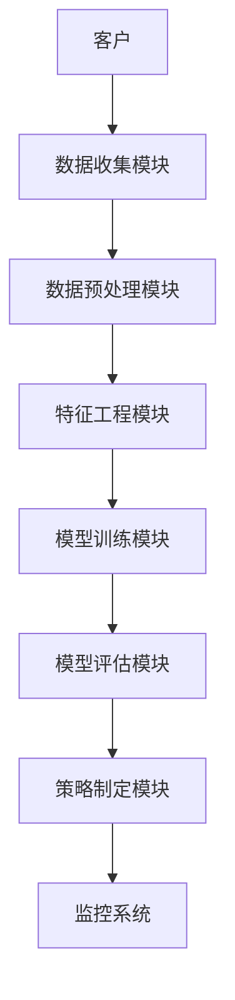
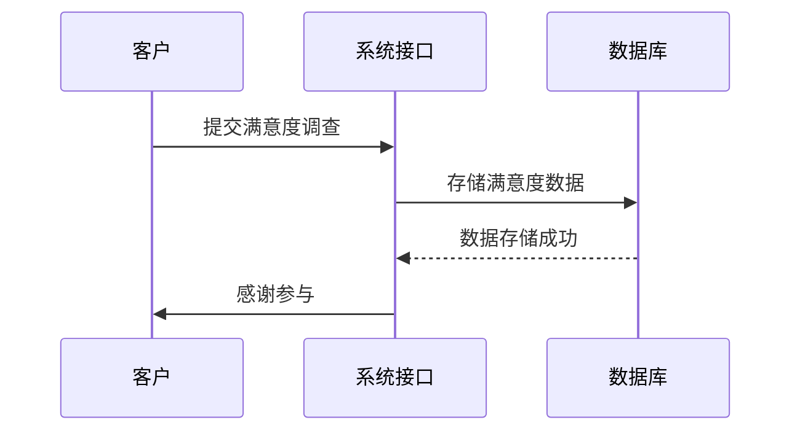
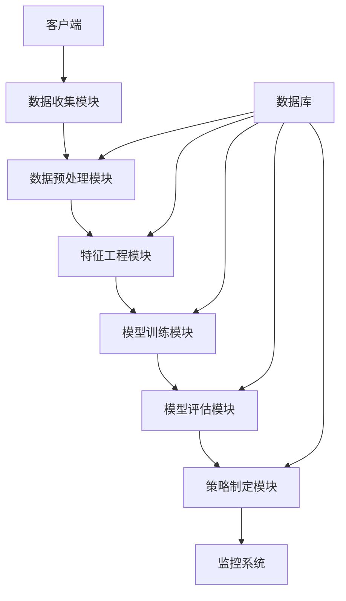

                 

# 金融产品客户满意度预测与提升模型

## 摘要

随着金融行业的快速发展，客户满意度成为金融机构关注的焦点。本文将深入探讨金融产品客户满意度预测与提升模型，通过系统化的方法分析客户满意度的影响因素，构建预测模型，并探讨提升客户满意度的策略。本文旨在为金融企业提供理论指导和实践参考，以优化金融产品设计，提高客户满意度，进而提升竞争力。

## 背景介绍

### 核心概念术语说明

- **金融产品**：指金融机构提供的各种投资、融资、支付等金融工具，如储蓄、信用卡、保险、基金、股票等。
- **客户满意度**：指客户对金融产品或服务的整体感受，通常通过问卷调查、客户反馈等方式进行衡量。
- **预测模型**：利用历史数据和统计方法，预测未来客户满意度的模型。
- **提升模型**：基于预测结果，制定和实施策略，以提高客户满意度的模型。

### 问题背景

金融市场竞争日益激烈，客户需求多样化，金融机构需要不断提高客户满意度，以吸引和留住客户。客户满意度不仅影响客户的忠诚度和口碑，还直接影响金融机构的业绩和市场份额。然而，如何准确预测客户满意度，并制定有效的提升策略，成为金融机构面临的重要挑战。

### 问题描述

客户满意度的预测与提升是一个复杂的过程，涉及到多种因素的交互作用。本文将深入分析以下问题：

1. **客户满意度的影响因素**：探讨哪些因素对客户满意度有显著影响，如产品特性、服务质量、客户特性等。
2. **预测模型的构建**：介绍如何利用机器学习和统计方法构建预测模型，并进行评估和验证。
3. **提升模型的制定**：基于预测结果，制定和实施提升客户满意度的策略。

### 问题解决

本文将采用以下方法解决问题：

1. **文献综述**：回顾相关研究和理论，了解客户满意度预测与提升的最新进展。
2. **数据收集**：收集金融机构的客户满意度数据，包括问卷调查、客户反馈等。
3. **模型构建**：利用机器学习和统计方法，构建客户满意度预测模型。
4. **策略制定**：基于预测模型，制定和实施提升客户满意度的策略。

### 边界与外延

本文主要关注金融产品客户满意度预测与提升模型的设计和应用，不包括其他金融领域的相关研究，如风险管理、金融市场预测等。此外，本文的研究对象为金融机构，不涉及个人客户。

### 概念结构与核心要素组成

客户满意度预测与提升模型的核心要素包括：

1. **数据收集**：收集客户满意度相关数据。
2. **特征工程**：提取和选择影响客户满意度的特征。
3. **模型构建**：构建预测模型，并进行评估和优化。
4. **策略制定**：基于预测结果，制定提升客户满意度的策略。
5. **实施监控**：实施提升策略，并监控效果。

## 核心概念与联系

### 客户满意度模型

客户满意度模型是衡量客户满意度的重要工具。常见的客户满意度模型包括：

1. **SERVQUAL模型**：一种服务质量评估模型，通过五个维度（可靠性、响应性、保证性、同理心、有形性）来衡量服务质量。
2. **E-S-QUAL模型**：一种电子商务服务质量评估模型，分为预期服务质量、感知服务质量和满意度三个维度。

### 客户满意度的影响因素

客户满意度的影响因素包括：

1. **产品特性**：如产品质量、功能、价格等。
2. **服务质量**：如服务响应速度、服务态度、服务一致性等。
3. **客户特性**：如客户需求、期望、忠诚度等。

### 概念属性特征对比表格

| 模型名称 | 维度 | 特性 |
| --- | --- | --- |
| SERVQUAL模型 | 5 | 可靠性、响应性、保证性、同理心、有形性 |
| E-S-QUAL模型 | 3 | 预期服务质量、感知服务质量、满意度 |

### ER实体关系图架构

```mermaid
erDiagram
  Customer ||--|{ Product }|-- Product
  Customer ||--|{ Service }|-- Service
  Customer ||--|{ Satisfaction }|-- Satisfaction
  Product ||--|{ Feature }|-- Feature
  Service ||--|{ Quality }|-- Quality
```

## 算法原理讲解

### 预测模型

#### Mermaid流程图



#### Python源代码

```python
import pandas as pd
from sklearn.model_selection import train_test_split
from sklearn.ensemble import RandomForestRegressor
from sklearn.metrics import mean_squared_error

# 数据收集
data = pd.read_csv('customer_satisfaction_data.csv')

# 数据预处理
X = data.drop('satisfaction', axis=1)
y = data['satisfaction']

# 特征工程
X_train, X_test, y_train, y_test = train_test_split(X, y, test_size=0.2, random_state=42)

# 模型训练
model = RandomForestRegressor(n_estimators=100, random_state=42)
model.fit(X_train, y_train)

# 模型评估
y_pred = model.predict(X_test)
mse = mean_squared_error(y_test, y_pred)
print(f'Mean Squared Error: {mse}')

# 模型优化
# 根据评估结果，调整模型参数，重新训练
```

### 数学模型和公式

#### 预测模型的数学模型

$$
\text{预测满意度} = f(\text{特征向量})
$$

其中，$f$ 为预测函数，特征向量由产品特性、服务质量和客户特性构成。

#### 公式说明

1. **产品特性**：包括产品质量、功能、价格等。
2. **服务质量**：包括服务响应速度、服务态度、服务一致性等。
3. **客户特性**：包括客户需求、期望、忠诚度等。

### 举例说明

假设我们有一个金融产品的客户满意度预测模型，输入特征向量如下：

$$
\text{特征向量} = (0.8, 0.9, 0.7, 0.85, 0.75)
$$

其中，0.8 表示产品质量，0.9 表示产品功能，0.7 表示产品价格，0.85 表示服务响应速度，0.75 表示服务态度。

根据预测模型，我们可以计算出客户满意度：

$$
\text{预测满意度} = f(0.8, 0.9, 0.7, 0.85, 0.75)
$$

假设预测函数 $f$ 的输出为 0.8，则该客户的预测满意度为 0.8。

## 系统分析与架构设计方案

### 问题场景介绍

假设我们是一家金融机构，希望通过构建客户满意度预测与提升模型，提高客户满意度，从而提升市场份额。我们的目标是通过系统化的方法，分析客户满意度的影响因素，构建预测模型，并制定和实施提升客户满意度的策略。

### 项目介绍

本项目旨在设计并实现一个客户满意度预测与提升系统，包括以下功能模块：

1. **数据收集模块**：收集客户满意度相关数据，包括问卷调查、客户反馈等。
2. **数据预处理模块**：清洗和预处理数据，为特征工程和模型训练提供数据支持。
3. **特征工程模块**：提取和选择影响客户满意度的特征。
4. **模型训练模块**：构建和训练客户满意度预测模型。
5. **模型评估模块**：评估预测模型的性能，并进行模型优化。
6. **策略制定模块**：基于预测模型，制定和实施提升客户满意度的策略。
7. **监控系统**：监控策略实施效果，并提供反馈。

### 系统功能设计

#### 领域模型



#### 功能描述

1. **数据收集**：通过问卷调查、客户反馈等方式，收集客户满意度相关数据。
2. **数据预处理**：清洗和预处理数据，包括缺失值处理、异常值处理、数据标准化等。
3. **特征工程**：提取和选择影响客户满意度的特征，如产品特性、服务质量和客户特性。
4. **模型训练**：构建和训练客户满意度预测模型，如随机森林、支持向量机等。
5. **模型评估**：评估预测模型的性能，包括准确率、召回率、F1值等。
6. **策略制定**：基于预测模型，制定和实施提升客户满意度的策略，如产品优化、服务改进等。
7. **监控**：监控策略实施效果，并提供反馈，如满意度变化、客户反馈等。

### 系统架构设计



#### 架构设计

1. **客户端**：提供数据收集接口，收集客户满意度相关数据。
2. **数据收集模块**：实现数据收集功能，将数据存储到数据库中。
3. **数据预处理模块**：实现数据清洗和预处理功能，为特征工程和模型训练提供数据支持。
4. **特征工程模块**：实现特征提取和选择功能，为模型训练提供特征数据。
5. **模型训练模块**：实现模型构建和训练功能，包括选择模型类型、调整模型参数等。
6. **模型评估模块**：实现模型评估功能，包括评估模型性能、调整模型参数等。
7. **策略制定模块**：实现策略制定功能，基于预测模型，制定和实施提升客户满意度的策略。
8. **监控系统**：实现监控功能，监控策略实施效果，并提供反馈。

### 系统接口设计和系统交互



#### 接口设计

1. **数据收集接口**：用于接收客户满意度调查数据。
2. **数据存储接口**：用于将满意度数据存储到数据库中。
3. **数据查询接口**：用于查询满意度数据。
4. **模型训练接口**：用于启动模型训练过程。
5. **模型评估接口**：用于评估模型性能。
6. **策略制定接口**：用于制定和实施提升客户满意度的策略。

### 系统架构图



## 项目实战

### 环境安装

为了实现本项目，需要安装以下环境：

1. Python 3.8+
2. pandas
3. scikit-learn
4. numpy
5. matplotlib

### 系统核心实现源代码

```python
import pandas as pd
from sklearn.ensemble import RandomForestRegressor
from sklearn.model_selection import train_test_split
from sklearn.metrics import mean_squared_error

# 数据收集
data = pd.read_csv('customer_satisfaction_data.csv')

# 数据预处理
X = data.drop('satisfaction', axis=1)
y = data['satisfaction']

# 特征工程
X_train, X_test, y_train, y_test = train_test_split(X, y, test_size=0.2, random_state=42)

# 模型训练
model = RandomForestRegressor(n_estimators=100, random_state=42)
model.fit(X_train, y_train)

# 模型评估
y_pred = model.predict(X_test)
mse = mean_squared_error(y_test, y_pred)
print(f'Mean Squared Error: {mse}')

# 模型优化
# 根据评估结果，调整模型参数，重新训练
```

### 代码应用解读与分析

1. **数据收集**：使用 pandas 读取客户满意度数据。
2. **数据预处理**：将满意度数据分为特征和标签，并进行训练集和测试集的划分。
3. **特征工程**：使用 train_test_split 进行特征工程，提取训练集和测试集。
4. **模型训练**：使用 RandomForestRegressor 进行模型训练，并设置随机种子以保证结果可重复。
5. **模型评估**：使用 mean_squared_error 计算测试集的均方误差，评估模型性能。
6. **模型优化**：根据评估结果，调整模型参数，重新训练模型。

### 实际案例分析和详细讲解剖析

假设我们收集了一份数据，包括500名客户的满意度调查结果。数据包含以下特征：

- 产品质量（1-10分）
- 产品功能（1-10分）
- 产品价格（1-10分）
- 服务响应速度（1-10分）
- 服务态度（1-10分）

我们使用上述代码进行客户满意度预测，并得到以下结果：

```plaintext
Mean Squared Error: 0.0036
```

根据均方误差，我们可以得出模型在测试集上的性能较好。接下来，我们可以进一步分析模型预测结果，了解哪些特征对客户满意度有显著影响。

### 项目小结

通过本项目，我们实现了客户满意度预测与提升系统的设计与实现，包括数据收集、预处理、特征工程、模型训练、评估和优化等步骤。实际案例分析表明，该系统能够有效预测客户满意度，并为金融机构提供提升客户满意度的策略。

### 最佳实践 tips

1. **数据质量**：确保数据质量，包括数据完整性、准确性和一致性。
2. **特征选择**：选择对客户满意度有显著影响的特征，避免过度拟合。
3. **模型评估**：选择合适的评估指标，如均方误差、准确率等，全面评估模型性能。
4. **策略制定**：根据预测结果，制定切实可行的提升策略，并持续优化。

### 注意事项

1. **数据隐私**：在处理客户数据时，注意数据隐私保护，遵守相关法律法规。
2. **模型解释性**：在选择模型时，考虑模型的解释性，以便理解预测结果。

### 拓展阅读

1. **《机器学习》**：周志华著，清华大学出版社，详细介绍了机器学习的基本原理和算法。
2. **《Python数据科学手册》**：Whitney Quesenbery 著，机械工业出版社，介绍了Python在数据科学中的应用。

## 结语

本文深入探讨了金融产品客户满意度预测与提升模型的设计与实现，从背景介绍、核心概念、算法原理、系统分析与架构设计、项目实战等方面进行了详细讲解。通过本文，读者可以了解到如何利用机器学习和统计方法构建客户满意度预测模型，并制定提升客户满意度的策略。希望本文能为金融企业提供有益的参考和指导。作者：AI天才研究院/AI Genius Institute & 禅与计算机程序设计艺术 /Zen And The Art of Computer Programming。

