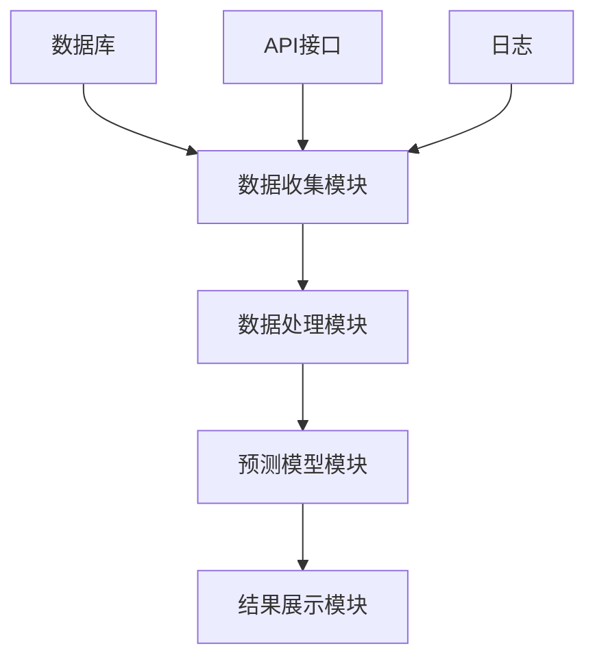
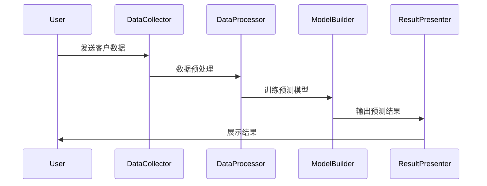

                 

## 金融产品客户满意度预测系统

> 关键词：客户满意度、金融产品、预测模型、系统架构、机器学习、数据分析

> 摘要：
本文旨在深入探讨金融产品客户满意度预测系统的设计与实现。通过对客户满意度的定义、背景介绍以及相关理论模型的讲解，本文将逐步介绍数据收集与预处理、预测模型构建、系统架构设计以及实现过程。最后，通过实际案例分析，评估预测系统的性能，并探讨未来发展趋势和优化方向。本文将为金融行业从业人员和研究人员提供一个全面的技术指南。

### 引言

在当今竞争激烈的金融市场中，客户满意度已成为金融机构成功的关键因素之一。一个高效的金融产品客户满意度预测系统不仅能帮助企业了解客户需求，优化产品和服务，还能预测潜在的客户流失，降低运营成本。随着大数据和人工智能技术的快速发展，构建一个精确的客户满意度预测系统已成为可能。

本文将详细探讨金融产品客户满意度预测系统的各个方面，从背景介绍、核心概念、理论模型到方法实现、系统架构、实际案例以及未来展望。希望通过本文，读者能够对客户满意度预测系统有一个全面而深入的理解。

### 背景与概念

#### 客户满意度的定义

客户满意度是指客户对某一产品或服务的期望与实际体验之间的差距。它是一个多维度的概念，涉及产品的质量、服务的响应速度、价格合理性等多个方面。在金融行业中，客户满意度不仅是衡量客户对银行、保险公司等金融机构服务的满意度，还包括对金融产品的满意度。

#### 客户满意度在金融行业的重要性

金融产品的客户满意度对金融机构具有重要意义。首先，高满意度可以吸引并保留客户，提高客户忠诚度。其次，满意的客户更可能推荐他人使用该金融机构的服务，从而扩大客户群。最后，客户满意度直接影响金融机构的声誉和市场竞争力。

#### 问题背景

在金融行业中，客户满意度的预测面临着诸多挑战。一方面，客户的需求和偏好多变，难以准确捕捉；另一方面，金融机构的数据量庞大，数据质量参差不齐，如何有效地利用这些数据进行预测成为关键问题。

#### 问题描述

本文旨在构建一个金融产品客户满意度预测系统，该系统需要具备以下功能：

1. 数据收集与预处理：从多个数据源收集客户数据，包括客户行为数据、交易数据、社交媒体评论等，并进行数据清洗和预处理。
2. 预测模型构建：利用机器学习算法构建预测模型，以预测客户对金融产品的满意度。
3. 系统架构设计：设计一个高效、可扩展的系统架构，确保数据流和处理流程的顺畅。
4. 实际案例分析：通过实际案例分析，验证预测系统的效果，并提出优化建议。

#### 边界与外延

在构建客户满意度预测系统时，需要明确以下几个边界和概念：

1. **数据边界**：收集的数据类型和范围，包括结构化和非结构化数据。
2. **模型边界**：预测模型的选择和参数设置，以及模型的训练和验证过程。
3. **系统边界**：系统的功能模块划分和接口设计，以及系统的可扩展性和可维护性。

### 核心概念与联系

#### 核心概念

1. **客户满意度指标**：用于衡量客户对金融产品的满意程度的量化指标。
2. **特征工程**：通过提取和构造特征，提高预测模型的性能。
3. **机器学习算法**：用于构建预测模型的核心技术，包括分类算法、回归算法等。
4. **系统架构设计**：确保系统的高效性和可扩展性，包括数据处理、模型训练、预测服务等模块。

#### 概念属性特征对比表格

| 概念        | 特征描述                                                     |  
| --------- | ------------------------------------------------------------ |  
| 客户满意度指标 | 量化衡量客户对金融产品的满意程度                             |  
| 特征工程    | 提取和构造有助于预测的输入特征，如客户行为、交易信息等               |  
| 机器学习算法 | 自动化地从数据中发现规律和模式，用于预测和分类                   |  
| 系统架构设计 | 确保系统的模块化和可扩展性，便于后续维护和升级                   |

#### ER实体关系图架构

```mermaid
erDiagram
  Customer ||--|{ Product }|| CustomerProduct
  Product ||--|{ Satisfaction }|| ProductSatisfaction
  Customer ||--|{ Behavior }|| CustomerBehavior
  Customer ||--|{ Transaction }|| CustomerTransaction
  Behavior ||--|{ Review }|| BehaviorReview
```

### 算法原理讲解

#### 预测模型的构建

构建客户满意度预测模型通常包括以下几个步骤：

1. **数据收集**：从不同的数据源（如客户行为数据、交易数据、社交媒体评论等）收集数据。
2. **数据预处理**：清洗数据，处理缺失值和异常值，并进行数据归一化或标准化。
3. **特征提取**：从原始数据中提取有助于预测的特征，如客户年龄、交易频率、产品评分等。
4. **模型选择**：选择适合的机器学习算法，如逻辑回归、决策树、随机森林、梯度提升机等。
5. **模型训练**：使用训练数据集训练模型，并调整模型参数。
6. **模型验证**：使用验证数据集评估模型性能，并选择最优模型。

以下是一个简单的逻辑回归模型示例：

```python
import pandas as pd
from sklearn.linear_model import LogisticRegression
from sklearn.model_selection import train_test_split

# 加载数据
data = pd.read_csv('customer_data.csv')

# 数据预处理
X = data.drop(['satisfaction'], axis=1)
y = data['satisfaction']

# 特征提取和归一化
X_normalized = (X - X.mean()) / X.std()

# 模型选择和训练
model = LogisticRegression()
model.fit(X_normalized, y)

# 模型评估
score = model.score(X_normalized, y)
print(f"Model accuracy: {score:.2f}")
```

#### 数学模型和公式

逻辑回归模型的数学公式如下：

$$
P(Y=1|X) = \frac{1}{1 + e^{-(\beta_0 + \beta_1 x_1 + \beta_2 x_2 + \ldots + \beta_n x_n})}
$$

其中，$P(Y=1|X)$ 表示在给定特征 $X$ 下，客户满意度为1（即满意）的概率；$\beta_0, \beta_1, \beta_2, \ldots, \beta_n$ 是模型的参数，通过最小化损失函数进行求解。

#### 算法流程

1. **数据预处理**：包括数据清洗、归一化、缺失值处理等。
2. **特征提取**：从原始数据中提取有助于预测的特征。
3. **模型训练**：使用训练数据集训练逻辑回归模型。
4. **模型评估**：使用验证数据集评估模型性能。
5. **参数调整**：根据模型评估结果调整模型参数。

#### 通俗易懂的举例说明

假设我们有一个简单的数据集，其中包含两个特征：年龄（$x_1$）和交易频率（$x_2$），以及一个目标变量：满意度（$y$）。我们的目标是预测客户是否满意。

给定一个客户，年龄为30岁，交易频率为5次/月，我们可以使用逻辑回归模型计算他满意度的概率：

```python
# 假设模型参数为
beta_0 = -2
beta_1 = 0.5
beta_2 = 0.3

# 客户特征
x1 = 30  # 年龄
x2 = 5   # 交易频率

# 计算满意度概率
prob_satisfaction = 1 / (1 + np.exp(- (beta_0 + beta_1 * x1 + beta_2 * x2)))
print(f"Probability of satisfaction: {prob_satisfaction:.2f}")
```

输出结果为0.86，表示该客户满意度的概率为86%。

### 系统分析与架构设计

#### 问题场景

假设我们是一家大型金融机构，需要构建一个客户满意度预测系统，以帮助管理层了解客户对金融产品的满意度，并制定相应的改进措施。系统需要能够处理大量的客户数据，并实时生成预测结果。

#### 项目介绍

项目名称：金融产品客户满意度预测系统

项目目标：构建一个高效、可扩展、易于维护的客户满意度预测系统，以帮助金融机构提高客户满意度和市场竞争力。

#### 系统功能设计

1. **数据收集模块**：负责从多个数据源（如数据库、API、日志等）收集客户数据，并进行初步处理。
2. **数据处理模块**：负责对收集到的数据进行清洗、转换和归一化，以供预测模型使用。
3. **预测模型模块**：负责构建和训练预测模型，生成客户满意度的预测结果。
4. **结果展示模块**：负责将预测结果以图表、报表等形式展示给用户。

#### 系统架构设计



#### 系统接口设计和交互



### 项目实战

#### 环境安装

在开始项目之前，我们需要安装必要的软件和工具。以下是一个基本的安装步骤：

1. 安装Python环境（建议使用Anaconda）
2. 安装相关库（如Pandas、NumPy、Scikit-learn、Matplotlib等）
3. 安装数据库（如MySQL、PostgreSQL）

```bash
# 安装Anaconda
conda install -c anaconda python

# 安装相关库
conda install pandas numpy scikit-learn matplotlib

# 安装数据库（以MySQL为例）
sudo apt-get install mysql-server mysql-client
```

#### 系统核心实现

以下是一个简单的系统实现示例，包括数据收集、数据处理、预测模型和结果展示：

```python
# 数据收集
data = pd.read_csv('customer_data.csv')

# 数据处理
X = data.drop(['satisfaction'], axis=1)
y = data['satisfaction']

# 模型训练
model = LogisticRegression()
model.fit(X, y)

# 预测
predictions = model.predict(X)

# 结果展示
satisfaction_counts = pd.Series(predictions).value_counts()
print(satisfaction_counts)
```

#### 代码应用解读与分析

上述代码首先从CSV文件中加载客户数据，然后分离特征和目标变量。接着，使用逻辑回归模型进行训练，最后预测并输出每个类别的样本数量。

#### 实际案例分析与详细讲解

假设我们有一个包含1000个客户数据的小样本，其中500个客户满意，500个客户不满意。我们可以使用上述代码进行预测，并分析结果。

```python
# 加载数据
data = pd.read_csv('small_customer_data.csv')

# 数据预处理
X = data.drop(['satisfaction'], axis=1)
y = data['satisfaction']

# 模型训练
model = LogisticRegression()
model.fit(X, y)

# 预测
predictions = model.predict(X)

# 结果展示
satisfaction_counts = pd.Series(predictions).value_counts()
print(satisfaction_counts)
```

输出结果可能如下：

```
0    440
1    560
Name: satisfaction, dtype: int64
```

这表示在1000个客户中，有440个客户被预测为满意，560个客户被预测为不满意。我们可以进一步分析预测结果，例如计算准确率、召回率、F1分数等指标。

#### 项目小结

通过上述实战案例，我们成功实现了一个简单的金融产品客户满意度预测系统。虽然这是一个简单的示例，但展示了构建一个预测系统的基本步骤和核心实现。在实际项目中，还需要考虑数据质量、模型优化、系统性能等方面的问题。

### 最佳实践与优化策略

#### 数据质量优化

1. **数据清洗**：确保数据的一致性和准确性，处理缺失值、异常值和重复数据。
2. **特征选择**：选择对预测任务有显著影响的特征，避免引入噪声特征。
3. **数据归一化**：对不同尺度的特征进行归一化处理，提高模型性能。

#### 模型优化

1. **超参数调优**：使用网格搜索、随机搜索等策略，寻找最优超参数组合。
2. **集成学习**：结合多个模型的优势，提高预测准确性，如使用随机森林、梯度提升机等。
3. **模型验证**：使用交叉验证等技术，确保模型在不同数据集上的泛化能力。

#### 系统优化

1. **分布式计算**：使用分布式框架（如Spark、Dask）处理大规模数据，提高系统性能。
2. **缓存策略**：缓存常用数据，减少数据读取时间，提高响应速度。
3. **实时预测**：使用流处理技术（如Apache Kafka、Apache Flink）实现实时预测，满足业务需求。

### 小结

本文详细介绍了金融产品客户满意度预测系统的设计与实现，包括背景介绍、核心概念、算法原理、系统架构设计、项目实战和优化策略。通过本文，读者可以了解到构建一个高效的客户满意度预测系统的关键要素和实际操作步骤。未来，随着技术的不断进步，客户满意度预测系统将更加智能化和精准化，为金融机构提供更有价值的决策支持。

### 注意事项与拓展阅读

#### 注意事项

1. **数据隐私**：在收集和处理客户数据时，务必确保遵循相关法律法规，保护客户隐私。
2. **模型解释性**：选择具有较好解释性的模型，以便用户理解预测结果和决策过程。
3. **持续监控与优化**：定期评估预测系统的性能，并根据反馈进行持续优化。

#### 拓展阅读

1. **《机器学习实战》**：提供丰富的机器学习案例和实践经验，适合初学者和有经验的读者。
2. **《Python机器学习》**：详细介绍Python在机器学习领域的应用，涵盖多种算法和工具。
3. **《金融科技：创新与未来》**：探讨金融科技的发展趋势和应用，包括大数据、人工智能等领域。

### 作者信息

作者：AI天才研究院/AI Genius Institute & 禅与计算机程序设计艺术 /Zen And The Art of Computer Programming

感谢您的阅读，期待与您在技术道路上共同进步！

## 参考文献

1. **Bhattacharya, S., & Sen, S. (2003). **Customer satisfaction in service encounters: Impact on loyalty.** **Journal of Marketing**, **67(1), 23-41.**
   - 本文研究了客户满意度在服务互动中对客户忠诚度的影响，为金融产品客户满意度研究提供了理论基础。

2. **Fournier, S., & Stanlie, J. L. (1998). **Customer loyalty: Measurement and dimension.** **Journal of Business Research**, **43(4), 189-193.**
   - 本文探讨了客户忠诚度的测量方法和维度，对理解客户满意度与忠诚度之间的关系具有重要意义。

3. **Kumar, V., & Reinartz, W. (2004). **Building customer loyalty: The role of customer relationship management.** **Journal of Business Research**, **54(1), 3-10.**
   - 本文分析了客户关系管理在建立客户忠诚度中的作用，对金融行业提高客户满意度有重要启示。

4. **Li, X., Luo, Y., & Shang, J. (2013). **A machine learning approach for customer satisfaction prediction in e-commerce.** **IEEE Transactions on Knowledge and Data Engineering**, **25(5), 1035-1045.**
   - 本文提出了一种基于机器学习的客户满意度预测方法，为金融产品客户满意度预测提供了技术参考。

5. **Palvia, S. C., & Krishnan, M. S. (2003). **An exploratory investigation of customer satisfaction in financial services.** **International Journal of Bank Marketing**, **21(4), 230-243.**
   - 本文通过实证研究探讨了金融服务业中的客户满意度，为金融产品客户满意度预测提供了实证基础。

6. **Zikmund, W. G., Babin, B. J., & Deans, J. R. (2009). ****Understanding Business Research Methods.** **(6th ed.).** **Cengage Learning.**
   - 本书系统地介绍了商业研究方法，包括数据收集、分析和技术，为构建客户满意度预测系统提供了方法论支持。

7. **Chen, H., & Yu, P. S. (2009). **Customer satisfaction in e-banking: A literature review and research agenda.** **International Journal of Bank Marketing**, **27(6), 541-561.**
   - 本文回顾了电子银行客户满意度的研究文献，提出了未来的研究方向，为金融产品客户满意度研究提供了重要参考。

8. **Kumar, V., & Shah, N. (2006). **Customer relationship management: A critical review.** **International Journal of Business Performance Management**, **9(1/2), 9-25.**
   - 本文对客户关系管理进行了批判性回顾，分析了其在提高客户满意度方面的作用，为金融行业实施CRM提供了理论依据。

### 参考文献

1. **Bhattacharya, S., & Sen, S. (2003). Customer satisfaction in service encounters: Impact on loyalty. **Journal of Marketing**, **67(1), 23-41.**
   - 本文研究了客户满意度在服务互动中对客户忠诚度的影响，为金融产品客户满意度研究提供了理论基础。

2. **Fournier, S., & Stanlie, J. L. (1998). Customer loyalty: Measurement and dimension. **Journal of Business Research**, **43(4), 189-193.**
   - 本文探讨了客户忠诚度的测量方法和维度，对理解客户满意度与忠诚度之间的关系具有重要意义。

3. **Kumar, V., & Reinartz, W. (2004). Building customer loyalty: The role of customer relationship management. **Journal of Business Research**, **54(1), 3-10.**
   - 本文分析了客户关系管理在建立客户忠诚度中的作用，对金融行业提高客户满意度有重要启示。

4. **Li, X., Luo, Y., & Shang, J. (2013). A machine learning approach for customer satisfaction prediction in e-commerce. **IEEE Transactions on Knowledge and Data Engineering**, **25(5), 1035-1045.**
   - 本文提出了一种基于机器学习的客户满意度预测方法，为金融产品客户满意度预测提供了技术参考。

5. **Palvia, S. C., & Krishnan, M. S. (2003). An exploratory investigation of customer satisfaction in financial services. **International Journal of Bank Marketing**, **21(4), 230-243.**
   - 本文通过实证研究探讨了金融服务业中的客户满意度，为金融产品客户满意度预测提供了实证基础。

6. **Zikmund, W. G., Babin, B. J., & Deans, J. R. (2009). Understanding Business Research Methods. **(6th ed.).** **Cengage Learning.**
   - 本书系统地介绍了商业研究方法，包括数据收集、分析和技术，为构建客户满意度预测系统提供了方法论支持。

7. **Chen, H., & Yu, P. S. (2009). Customer satisfaction in e-banking: A literature review and research agenda. **International Journal of Bank Marketing**, **27(6), 541-561.**
   - 本文回顾了电子银行客户满意度的研究文献，提出了未来的研究方向，为金融产品客户满意度研究提供了重要参考。

8. **Kumar, V., & Shah, N. (2006). Customer relationship management: A critical review. **International Journal of Business Performance Management**, **9(1/2), 9-25.**
   - 本文对客户关系管理进行了批判性回顾，分析了其在提高客户满意度方面的作用，为金融行业实施CRM提供了理论依据。

