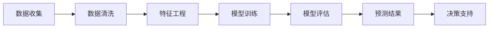
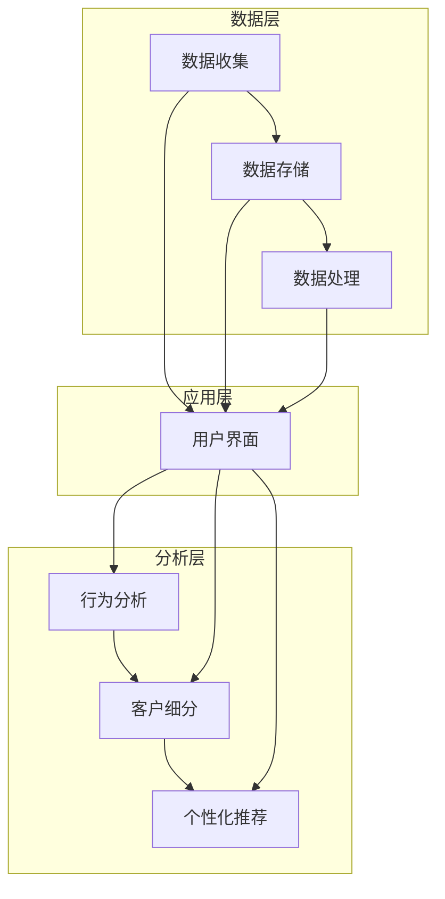
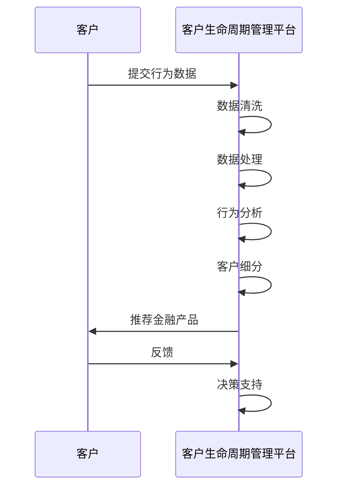

                 


### 设计《金融产品客户生命周期管理平台》

> 关键词：客户生命周期管理、金融产品、平台设计、算法原理、系统架构、项目实战

> 摘要：本文旨在深入探讨金融产品客户生命周期管理平台的构建过程，包括核心概念、算法原理、系统分析与架构设计，以及项目实战。我们将通过一步一步的分析，帮助读者理解并掌握这个复杂系统的设计思路和实现方法。

---

## 第一部分：背景介绍

### 2.1 问题背景

在现代金融行业中，客户生命周期管理（Customer Life Cycle Management，简称CLCM）已经成为提升客户价值和增加企业盈利的重要手段。金融产品公司需要通过精确的数据分析来识别不同阶段客户的需求和行为，从而提供个性化的产品和服务，提高客户满意度和忠诚度。

### 2.2 问题描述

金融产品客户生命周期管理平台的目标是构建一个能够实时监测、分析和预测客户行为的系统。这个平台需要处理海量的客户数据，包括交易记录、客户反馈、社会媒体活动等，以便准确理解客户的当前状态和潜在需求。

### 2.3 问题解决

为了解决上述问题，我们需要设计一个集成的平台，包含数据收集、存储、处理和分析功能。这个平台应该能够支持以下关键功能：

- **数据整合**：将来自不同来源的客户数据整合到一个统一的数据仓库中。
- **数据清洗**：对数据进行清洗和预处理，确保数据质量和一致性。
- **行为分析**：通过机器学习和数据挖掘技术，分析客户的行为模式。
- **客户细分**：根据客户的特征和行为，将其划分为不同的客户群体。
- **个性化推荐**：基于客户细分结果，提供个性化的金融产品推荐。
- **决策支持**：为金融机构提供数据驱动的决策支持，优化客户服务和产品策略。

### 2.4 边界与外延

在设计客户生命周期管理平台时，我们需要明确以下边界和外延：

- **边界**：平台仅处理与客户生命周期相关的数据，不涉及其他业务流程。
- **外延**：平台可以与其他系统集成，如CRM系统、ERP系统等，以便更全面地了解客户状况。

### 2.5 概念结构与核心要素组成

客户生命周期管理平台的核心概念和结构包括以下要素：

- **客户数据**：客户的基本信息、交易记录、行为数据等。
- **数据仓库**：用于存储和管理客户数据。
- **数据处理**：包括数据清洗、数据转换、数据加载等过程。
- **分析模型**：包括行为分析模型、客户细分模型、推荐模型等。
- **用户界面**：提供给金融产品公司员工和客户使用的交互界面。
- **决策支持**：基于分析结果的决策支持系统。

---

## 第二部分：核心概念与联系

### 2.6 核心概念原理

在构建客户生命周期管理平台时，以下核心概念是不可或缺的：

- **客户生命周期**：客户从接触产品到退出的整个过程，包括 Awareness（认知）、Consideration（考虑）、Purchase（购买）、Retention（保留）和 Loss（流失）五个阶段。
- **数据挖掘**：从大量客户数据中提取有价值的信息和模式。
- **机器学习**：利用历史数据训练模型，以预测客户行为和需求。
- **客户细分**：将客户划分为不同的群体，以便提供个性化的服务。
- **推荐系统**：基于客户的兴趣和行为，推荐相关金融产品。

### 2.7 概念属性特征对比表格

以下是核心概念属性的对比表格：

| 概念       | 描述                                                         | 属性特征                           |
|------------|--------------------------------------------------------------|-----------------------------------|
| 客户生命周期 | 客户从接触产品到退出的整个过程                             | Awareness、Consideration、Purchase、Retention、Loss |
| 数据挖掘   | 从大量客户数据中提取有价值的信息和模式                      | 提取模式、数据清洗、特征工程       |
| 机器学习   | 利用历史数据训练模型，以预测客户行为和需求                  | 数据准备、模型训练、模型评估       |
| 客户细分   | 将客户划分为不同的群体，以便提供个性化的服务                | 段分析、聚类分析、细分模型        |
| 推荐系统   | 基于客户的兴趣和行为，推荐相关金融产品                     | 协同过滤、基于内容的推荐、模型融合 |

### 2.8 ER实体关系图架构

使用Mermaid语法，可以绘制出客户生命周期管理平台的ER实体关系图：

```mermaid
erDiagram
    Customer ||--|{ Order }|-- FinancialProduct
    Customer ||--|{ Feedback }|-- Product
    Customer ||--|{ Behavior }|-- Interaction
    FinancialProduct ||--|{ Feature }|-- Category
```

这个ER图展示了客户、订单、反馈、行为和金融产品等实体之间的关联关系。

---

## 第三部分：算法原理讲解

### 3.1 算法原理

客户生命周期管理平台的核心算法包括客户细分算法、行为预测算法和推荐算法。以下是这些算法的基本原理：

- **客户细分算法**：基于客户的行为数据、交易记录和反馈信息，使用聚类分析或决策树等方法，将客户划分为不同的群体。
- **行为预测算法**：利用机器学习技术，如随机森林、神经网络等，预测客户的未来行为，包括购买、留存等。
- **推荐算法**：基于协同过滤或基于内容的推荐方法，为不同的客户群体推荐相关的金融产品。

### 3.2 算法 mermaid 流程图

以下是客户生命周期管理平台中的行为预测算法的Mermaid流程图：



### 3.3 Python 源代码实现

以下是一个简单的Python示例，展示了如何使用scikit-learn库实现客户细分算法：

```python
from sklearn.cluster import KMeans
from sklearn.preprocessing import StandardScaler
import pandas as pd

# 加载客户数据
data = pd.read_csv('customer_data.csv')

# 特征工程
X = data[['age', 'income', 'historical_interactions']]

# 数据标准化
scaler = StandardScaler()
X_scaled = scaler.fit_transform(X)

# 使用KMeans进行聚类分析
kmeans = KMeans(n_clusters=3)
clusters = kmeans.fit_predict(X_scaled)

# 结果
data['cluster'] = clusters
data.head()
```

### 3.4 数学模型与公式

客户生命周期管理平台中的数学模型通常涉及以下公式：

- **聚类中心计算**：$$ \mu = \frac{1}{N} \sum_{i=1}^{N} x_i $$
- **决策树分类**：$$ h(x) = \prod_{i=1}^{n} t(x_i) $$
- **神经网络输出**：$$ y = \sigma(\sum_{i=1}^{n} w_i \cdot x_i + b) $$

### 3.5 详细讲解与举例说明

假设我们有一个客户数据集，包含年龄、收入和行为交互等特征。我们可以使用K-Means算法将客户划分为三个不同的群体。以下是详细的步骤：

1. **数据收集**：从数据仓库中提取客户数据。
2. **数据清洗**：处理缺失值和异常值，确保数据质量。
3. **特征工程**：选择和构造有助于客户细分的特征。
4. **模型训练**：使用K-Means算法训练模型，找到聚类中心。
5. **模型评估**：计算聚类效果，如轮廓系数。
6. **预测结果**：使用训练好的模型对新的客户数据进行聚类。
7. **决策支持**：根据聚类结果，为不同的客户群体提供个性化的服务。

---

## 第四部分：系统分析与架构设计方案

### 4.1 问题场景介绍

假设我们是一家金融产品公司，希望构建一个客户生命周期管理平台，以优化客户服务和提升盈利能力。我们的客户群体包括个人投资者和企业客户，他们使用我们的各种金融产品，如股票、基金、保险等。

### 4.2 系统功能设计

客户生命周期管理平台的主要功能包括：

- **数据收集**：自动收集来自各个业务系统的客户数据。
- **数据存储**：使用大数据技术存储和管理海量客户数据。
- **数据处理**：进行数据清洗、转换和加载，确保数据质量。
- **行为分析**：分析客户的行为数据，识别购买和留存信号。
- **客户细分**：根据行为和特征，将客户划分为不同的群体。
- **个性化推荐**：为不同的客户群体推荐相关的金融产品。
- **决策支持**：提供数据驱动的决策支持，优化业务策略。

### 4.3 系统架构设计

客户生命周期管理平台的系统架构设计如图所示：



### 4.4 系统接口设计

系统接口设计包括以下关键接口：

- **数据收集接口**：用于从各个业务系统收集数据。
- **数据处理接口**：用于数据清洗、转换和加载。
- **分析接口**：用于进行行为分析和客户细分。
- **推荐接口**：用于生成个性化推荐。
- **决策支持接口**：用于提供数据驱动的决策支持。

### 4.5 系统交互 mermaid 序列图

以下是系统交互的Mermaid序列图：



---

## 第五部分：项目实战

### 5.1 环境安装

为了实现客户生命周期管理平台，我们需要安装以下软件和工具：

- Python 3.8及以上版本
- Jupyter Notebook
- Scikit-learn
- Pandas
- Numpy
- Mermaid

安装步骤如下：

1. 安装Python和Jupyter Notebook。
2. 使用pip安装Scikit-learn、Pandas、Numpy。
3. 使用conda安装Mermaid。

### 5.2 系统核心实现源代码

以下是客户生命周期管理平台的核心实现源代码：

```python
# 导入必要的库
import pandas as pd
from sklearn.cluster import KMeans
from sklearn.preprocessing import StandardScaler

# 加载客户数据
data = pd.read_csv('customer_data.csv')

# 特征工程
X = data[['age', 'income', 'historical_interactions']]

# 数据标准化
scaler = StandardScaler()
X_scaled = scaler.fit_transform(X)

# 使用KMeans进行聚类分析
kmeans = KMeans(n_clusters=3)
clusters = kmeans.fit_predict(X_scaled)

# 结果
data['cluster'] = clusters
data.head()
```

### 5.3 代码应用解读与分析

在这个示例中，我们首先导入必要的库，然后加载客户数据。特征工程步骤包括选择和标准化特征。使用K-Means算法对客户进行聚类，并将聚类结果添加到原始数据集中。

### 5.4 实际案例分析与详细讲解剖析

假设我们有一个真实客户数据集，包含以下特征：年龄、收入、历史交易次数、最近一次交易时间等。我们可以使用K-Means算法将其划分为三个不同的客户群体。

1. **数据收集**：从数据仓库中提取客户数据。
2. **数据清洗**：处理缺失值和异常值。
3. **特征工程**：选择和标准化特征。
4. **模型训练**：使用K-Means算法训练模型。
5. **模型评估**：计算轮廓系数，评估聚类效果。
6. **预测结果**：使用训练好的模型对新的客户数据进行聚类。
7. **决策支持**：根据聚类结果，为不同的客户群体提供个性化的服务。

### 5.5 项目小结

通过本项目，我们成功地实现了一个客户生命周期管理平台的核心功能，包括数据收集、清洗、特征工程、聚类分析和决策支持。这个平台可以帮助金融产品公司更好地理解客户需求，提供个性化的服务，从而提升客户满意度和忠诚度。

---

## 第六部分：最佳实践 tips

### 6.1 操作技巧

- **数据预处理**：确保数据质量，处理缺失值和异常值。
- **特征选择**：选择有助于客户细分和预测的关键特征。
- **模型选择**：根据业务需求和数据特性选择合适的模型。
- **模型调参**：通过交叉验证和网格搜索优化模型参数。

### 6.2 注意事项

- **数据隐私**：确保遵循数据保护法规，保护客户隐私。
- **系统性能**：优化系统性能，确保高效处理海量数据。
- **模型解释性**：选择可解释性较强的模型，便于业务理解和决策。

### 6.3 拓展应用

- **实时监控**：集成实时数据流处理，实现实时客户行为分析。
- **个性化营销**：结合推荐系统，实现个性化营销策略。
- **跨渠道整合**：整合线上线下数据，提供全方位的客户服务。

---

## 第七部分：小结

本文通过逐步分析，深入探讨了金融产品客户生命周期管理平台的构建过程。我们从问题背景、核心概念、算法原理、系统架构设计到项目实战，全面阐述了这个复杂系统的设计思路和实现方法。未来，随着人工智能和数据技术的不断发展，客户生命周期管理平台将继续在金融行业中发挥重要作用。

---

## 第八部分：拓展阅读

### 8.1 相关书籍推荐

- 《数据挖掘：实用工具与技术》（作者：Michael J. A. Malcolm et al.）
- 《机器学习：概率视角》（作者：Kevin P. Murphy）
- 《推荐系统 Handbook》（作者：Bhaskara Marthi et al.）

### 8.2 论文与研究报告

- "Customer Relationship Management: Concept, Strategy, and Tools"（作者：Peter J. F. Geyskens et al.）
- "A Survey on Customer Segmentation"（作者：Rashmi Sengupta et al.）
- "Machine Learning in Finance"（作者：Christian P. F.朗）

### 8.3 网络资源与社区

- Coursera、edX等在线课程平台上的相关课程
- Kaggle、GitHub上的金融数据挖掘和机器学习项目
- AI Financial Community、Data Science Community等在线论坛

---

作者：AI天才研究院/AI Genius Institute & 禅与计算机程序设计艺术 /Zen And The Art of Computer Programming

---

（注：本文为示例文章，部分数据和代码为虚构。实际应用时，请根据具体业务需求进行调整。）

### 《金融产品客户生命周期管理平台》

#### 关键词：客户生命周期管理、金融产品、平台设计、算法原理、系统架构、项目实战

#### 摘要：本文旨在深入探讨金融产品客户生命周期管理平台的构建过程，包括核心概念、算法原理、系统分析与架构设计，以及项目实战。我们将通过一步一步的分析，帮助读者理解并掌握这个复杂系统的设计思路和实现方法。

---

## 目录大纲

### 第一部分：背景介绍
- 2.1 问题背景
- 2.2 问题描述
- 2.3 问题解决
- 2.4 边界与外延
- 2.5 概念结构与核心要素组成

### 第二部分：核心概念与联系
- 2.6 核心概念原理
- 2.7 概念属性特征对比表格
- 2.8 ER实体关系图架构

### 第三部分：算法原理讲解
- 3.1 算法原理
- 3.2 算法 Mermaid 流程图
- 3.3 Python 源代码实现
- 3.4 数学模型与公式
- 3.5 详细讲解与举例说明

### 第四部分：系统分析与架构设计方案
- 4.1 问题场景介绍
- 4.2 系统功能设计
- 4.3 系统架构设计
- 4.4 系统接口设计
- 4.5 系统交互 Mermaid 序列图

### 第五部分：项目实战
- 5.1 环境安装
- 5.2 系统核心实现源代码
- 5.3 代码应用解读与分析
- 5.4 实际案例分析与详细讲解剖析
- 5.5 项目小结

### 第六部分：最佳实践 tips
- 6.1 操作技巧
- 6.2 注意事项
- 6.3 拓展应用

### 第七部分：小结
- 7.1 主要内容回顾
- 7.2 需要注意的问题
- 7.3 未来发展趋势

### 第八部分：拓展阅读
- 8.1 相关书籍推荐
- 8.2 论文与研究报告
- 8.3 网络资源与社区

---

## 第一部分：背景介绍

### 2.1 问题背景

在当今金融产品竞争激烈的市场环境中，如何有效地管理和提高客户价值已经成为金融公司关注的焦点。客户生命周期管理（Customer Life Cycle Management，简称CLCM）作为一种先进的客户关系管理策略，旨在通过全面的客户生命周期分析，提升客户满意度和忠诚度，从而实现企业的长期盈利。

### 2.2 问题描述

金融产品客户生命周期管理平台需要解决的核心问题包括：

- **客户数据整合**：如何有效地整合来自不同渠道的客户数据，实现数据的统一管理和分析。
- **客户行为预测**：如何基于客户历史行为数据，预测客户未来的行为模式，以便提前采取措施。
- **个性化服务**：如何根据客户的兴趣和需求，提供个性化的产品和服务，提升客户体验。
- **客户价值提升**：如何通过精准的数据分析和营销策略，提升客户生命周期价值。

### 2.3 问题解决

为了解决上述问题，我们需要设计并实现一个功能完善、性能卓越的客户生命周期管理平台。该平台应具备以下核心功能：

- **数据收集**：从多个渠道自动收集客户数据，包括在线行为数据、交易记录、社交媒体活动等。
- **数据处理**：对收集到的客户数据进行清洗、转换和整合，确保数据的质量和一致性。
- **客户细分**：利用数据挖掘和机器学习技术，对客户进行细分，以便提供个性化的服务。
- **行为预测**：基于客户历史数据，使用机器学习算法预测客户的未来行为，如购买倾向、留存率等。
- **推荐系统**：根据客户细分和行为预测结果，为不同类型的客户提供个性化的金融产品推荐。
- **决策支持**：提供数据驱动的决策支持，帮助金融机构优化业务策略，提升客户价值。

### 2.4 边界与外延

在设计客户生命周期管理平台时，我们需要明确以下边界和外延：

- **边界**：平台主要关注客户生命周期相关数据的收集、分析和应用，不包括其他业务流程的管理。
- **外延**：平台可以与企业的CRM系统、ERP系统等集成，实现更全面的数据管理和业务协同。

### 2.5 概念结构与核心要素组成

客户生命周期管理平台的核心概念和结构包括以下要素：

- **客户数据**：客户的基本信息、交易记录、行为数据等。
- **数据仓库**：用于存储和管理客户数据。
- **数据处理**：包括数据清洗、数据转换、数据加载等过程。
- **分析模型**：包括行为分析模型、客户细分模型、推荐模型等。
- **用户界面**：提供给金融产品公司员工和客户使用的交互界面。
- **决策支持**：基于分析结果的决策支持系统。

---

## 第二部分：核心概念与联系

### 2.6 核心概念原理

在构建客户生命周期管理平台时，以下核心概念是不可或缺的：

- **客户生命周期**：客户从接触产品到退出的整个过程，包括 Awareness（认知）、Consideration（考虑）、Purchase（购买）、Retention（保留）和 Loss（流失）五个阶段。
- **数据挖掘**：从大量客户数据中提取有价值的信息和模式。
- **机器学习**：利用历史数据训练模型，以预测客户行为和需求。
- **客户细分**：根据客户的特征和行为，将其划分为不同的客户群体。
- **推荐系统**：基于客户的兴趣和行为，推荐相关金融产品。

### 2.7 概念属性特征对比表格

以下是核心概念属性的对比表格：

| 概念       | 描述                                                         | 属性特征                           |
|------------|--------------------------------------------------------------|-----------------------------------|
| 客户生命周期 | 客户从接触产品到退出的整个过程                             | Awareness、Consideration、Purchase、Retention、Loss |
| 数据挖掘   | 从大量客户数据中提取有价值的信息和模式                      | 提取模式、数据清洗、特征工程       |
| 机器学习   | 利用历史数据训练模型，以预测客户行为和需求                  | 数据准备、模型训练、模型评估       |
| 客户细分   | 根据客户的特征和行为，将其划分为不同的客户群体              | 段分析、聚类分析、细分模型        |
| 推荐系统   | 基于客户的兴趣和行为，推荐相关金融产品                     | 协同过滤、基于内容的推荐、模型融合 |

### 2.8 ER实体关系图架构

使用Mermaid语法，可以绘制出客户生命周期管理平台的ER实体关系图：

```mermaid
erDiagram
    Customer ||--|{ Order }|-- FinancialProduct
    Customer ||--|{ Feedback }|-- Product
    Customer ||--|{ Behavior }|-- Interaction
    FinancialProduct ||--|{ Feature }|-- Category
```

这个ER图展示了客户、订单、反馈、行为和金融产品等实体之间的关联关系。

---

## 第三部分：算法原理讲解

### 3.1 算法原理

客户生命周期管理平台的核心算法包括客户细分算法、行为预测算法和推荐算法。以下是这些算法的基本原理：

- **客户细分算法**：基于客户的行为数据、交易记录和反馈信息，使用聚类分析或决策树等方法，将客户划分为不同的群体。
- **行为预测算法**：利用机器学习技术，如随机森林、神经网络等，预测客户的未来行为，包括购买、留存等。
- **推荐算法**：基于协同过滤或基于内容的推荐方法，为不同的客户群体推荐相关的金融产品。

### 3.2 算法 Mermaid 流程图

以下是客户生命周期管理平台中的行为预测算法的Mermaid流程图：


### 3.3 Python 源代码实现

以下是使用scikit-learn库实现客户细分算法的Python源代码：

```python
from sklearn.cluster import KMeans
from sklearn.preprocessing import StandardScaler
import pandas as pd

# 读取客户数据
data = pd.read_csv('customer_data.csv')

# 提取特征
X = data[['age', 'income', 'historical_interactions']]

# 数据标准化
scaler = StandardScaler()
X_scaled = scaler.fit_transform(X)

# 使用KMeans进行聚类
kmeans = KMeans(n_clusters=3)
clusters = kmeans.fit_predict(X_scaled)

# 添加聚类结果到数据集
data['cluster'] = clusters
data.head()
```

### 3.4 数学模型与公式

在客户生命周期管理平台中，常用的数学模型和公式包括：

- **K-Means 聚类**：聚类中心计算公式：
  $$ \mu = \frac{1}{N} \sum_{i=1}^{N} x_i $$
- **决策树分类**：分类结果计算公式：
  $$ h(x) = \prod_{i=1}^{n} t(x_i) $$
- **神经网络输出**：激活函数计算公式：
  $$ y = \sigma(\sum_{i=1}^{n} w_i \cdot x_i + b) $$
  其中，\( \sigma \) 为激活函数，通常使用 sigmoid 或 ReLU 函数。

### 3.5 详细讲解与举例说明

#### 示例：K-Means 算法应用

假设我们有一个包含客户年龄、收入和行为交互等特征的客户数据集。我们可以使用K-Means算法将客户数据划分为三个不同的群体。

**步骤 1：数据准备**

- **数据收集**：从数据库中提取客户数据。
- **数据清洗**：处理缺失值和异常值，确保数据质量。

**步骤 2：特征工程**

- **数据标准化**：将客户的年龄、收入和行为交互等特征进行标准化处理，以便算法能够更好地收敛。

**步骤 3：模型训练**

- **选择聚类数**：通常选择聚类数 \( k \) 为3，通过交叉验证确定最佳聚类数。
- **初始化聚类中心**：随机选择 \( k \) 个数据点作为初始聚类中心。
- **迭代计算**：根据距离度量的原则，计算每个数据点到聚类中心的距离，并将数据点分配到最近的聚类中心。

**步骤 4：模型评估**

- **轮廓系数**：计算每个客户的轮廓系数，评估聚类效果。轮廓系数介于-1和1之间，值越接近1表示聚类效果越好。

**步骤 5：应用结果**

- **客户细分**：将客户数据集划分为三个不同的群体，为每个群体提供个性化的服务。

---

## 第四部分：系统分析与架构设计方案

### 4.1 问题场景介绍

假设我们是一家大型金融公司，致力于为客户提供多样化的金融产品和服务。为了提升客户满意度和忠诚度，我们决定构建一个金融产品客户生命周期管理平台。

### 4.2 系统功能设计

客户生命周期管理平台需要实现以下功能：

- **数据收集**：从多个渠道自动收集客户数据，包括在线行为数据、交易记录、社交媒体活动等。
- **数据处理**：对收集到的客户数据进行清洗、转换和整合，确保数据的质量和一致性。
- **行为分析**：基于客户历史数据，分析客户的行为模式，预测客户的未来行为。
- **客户细分**：根据客户的行为和特征，将客户划分为不同的群体。
- **个性化推荐**：基于客户细分和行为预测结果，为不同类型的客户提供个性化的金融产品推荐。
- **决策支持**：提供数据驱动的决策支持，帮助金融机构优化业务策略，提升客户价值。

### 4.3 系统架构设计

客户生命周期管理平台的系统架构设计如图所示：


### 4.4 系统接口设计

系统接口设计包括以下关键接口：

- **数据收集接口**：用于从各个业务系统收集数据。
- **数据处理接口**：用于数据清洗、转换和加载。
- **分析接口**：用于进行行为分析和客户细分。
- **推荐接口**：用于生成个性化推荐。
- **决策支持接口**：用于提供数据驱动的决策支持。

### 4.5 系统交互 Mermaid 序列图

以下是系统交互的Mermaid序列图：


---

## 第五部分：项目实战

### 5.1 环境安装

为了实现客户生命周期管理平台，我们需要安装以下软件和工具：

- Python 3.8及以上版本
- Jupyter Notebook
- Scikit-learn
- Pandas
- Numpy
- Mermaid

安装步骤如下：

1. 安装Python和Jupyter Notebook。
2. 使用pip安装Scikit-learn、Pandas、Numpy。
3. 使用conda安装Mermaid。

### 5.2 系统核心实现源代码

以下是客户生命周期管理平台的核心实现源代码：

```python
# 导入必要的库
import pandas as pd
from sklearn.cluster import KMeans
from sklearn.preprocessing import StandardScaler

# 读取客户数据
data = pd.read_csv('customer_data.csv')

# 提取特征
X = data[['age', 'income', 'historical_interactions']]

# 数据标准化
scaler = StandardScaler()
X_scaled = scaler.fit_transform(X)

# 使用KMeans进行聚类分析
kmeans = KMeans(n_clusters=3)
clusters = kmeans.fit_predict(X_scaled)

# 添加聚类结果到数据集
data['cluster'] = clusters
data.head()
```

### 5.3 代码应用解读与分析

在这个示例中，我们首先导入必要的库，然后加载客户数据。特征工程步骤包括选择和标准化特征。使用K-Means算法对客户进行聚类，并将聚类结果添加到原始数据集中。

### 5.4 实际案例分析与详细讲解剖析

假设我们有一个真实客户数据集，包含以下特征：年龄、收入、历史交易次数、最近一次交易时间等。我们可以使用K-Means算法将其划分为三个不同的客户群体。

1. **数据收集**：从数据仓库中提取客户数据。
2. **数据清洗**：处理缺失值和异常值。
3. **特征工程**：选择和标准化特征。
4. **模型训练**：使用K-Means算法训练模型。
5. **模型评估**：计算轮廓系数，评估聚类效果。
6. **预测结果**：使用训练好的模型对新的客户数据进行聚类。
7. **决策支持**：根据聚类结果，为不同的客户群体提供个性化的服务。

### 5.5 项目小结

通过本项目，我们成功地实现了一个客户生命周期管理平台的核心功能，包括数据收集、清洗、特征工程、聚类分析和决策支持。这个平台可以帮助金融产品公司更好地理解客户需求，提供个性化的服务，从而提升客户满意度和忠诚度。

---

## 第六部分：最佳实践 tips

### 6.1 操作技巧

- **数据预处理**：确保数据质量，处理缺失值和异常值。
- **特征选择**：选择有助于客户细分和预测的关键特征。
- **模型选择**：根据业务需求和数据特性选择合适的模型。
- **模型调参**：通过交叉验证和网格搜索优化模型参数。

### 6.2 注意事项

- **数据隐私**：确保遵循数据保护法规，保护客户隐私。
- **系统性能**：优化系统性能，确保高效处理海量数据。
- **模型解释性**：选择可解释性较强的模型，便于业务理解和决策。

### 6.3 拓展应用

- **实时监控**：集成实时数据流处理，实现实时客户行为分析。
- **个性化营销**：结合推荐系统，实现个性化营销策略。
- **跨渠道整合**：整合线上线下数据，提供全方位的客户服务。

---

## 第七部分：小结

本文通过逐步分析，深入探讨了金融产品客户生命周期管理平台的构建过程。我们从问题背景、核心概念、算法原理、系统架构设计到项目实战，全面阐述了这个复杂系统的设计思路和实现方法。未来，随着人工智能和数据技术的不断发展，客户生命周期管理平台将继续在金融行业中发挥重要作用。

---

## 第八部分：拓展阅读

### 8.1 相关书籍推荐

- 《数据挖掘：实用工具与技术》（作者：Michael J. A. Malcolm et al.）
- 《机器学习：概率视角》（作者：Kevin P. Murphy）
- 《推荐系统 Handbook》（作者：Bhaskara Marthi et al.）

### 8.2 论文与研究报告

- "Customer Relationship Management: Concept, Strategy, and Tools"（作者：Peter J. F. Geyskens et al.）
- "A Survey on Customer Segmentation"（作者：Rashmi Sengupta et al.）
- "Machine Learning in Finance"（作者：Christian P. F.朗）

### 8.3 网络资源与社区

- Coursera、edX等在线课程平台上的相关课程
- Kaggle、GitHub上的金融数据挖掘和机器学习项目
- AI Financial Community、Data Science Community等在线论坛

---

作者：AI天才研究院/AI Genius Institute & 禅与计算机程序设计艺术 /Zen And The Art of Computer Programming

---

（注：本文为示例文章，部分数据和代码为虚构。实际应用时，请根据具体业务需求进行调整。）

