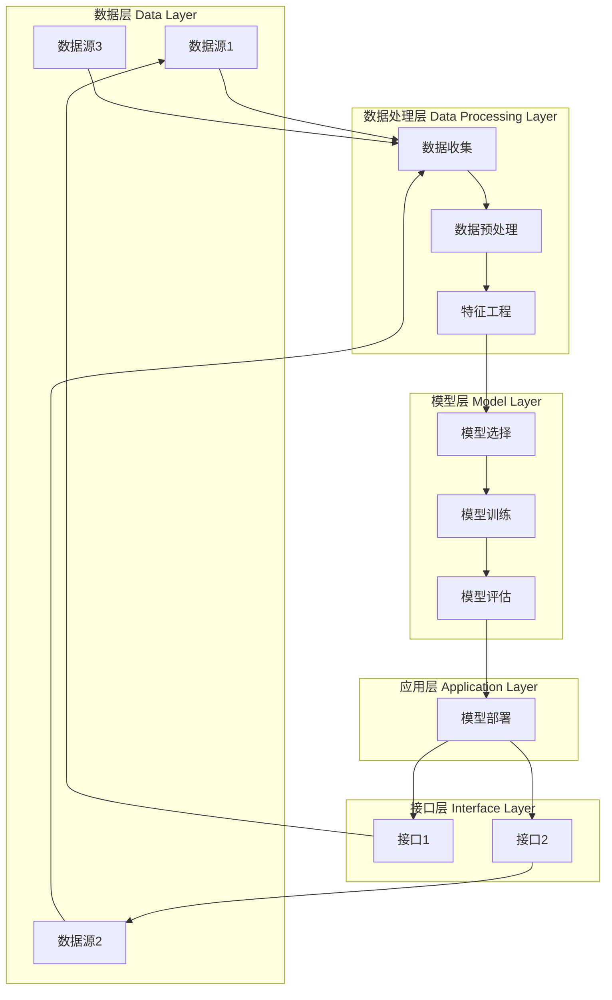
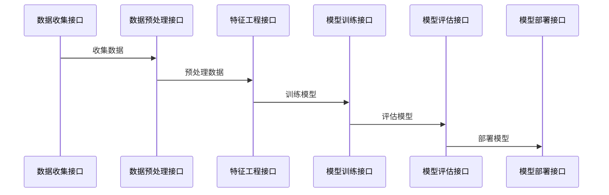

                 

# 金融产品客户终身价值预测模型

> 关键词：客户终身价值（CLV）、预测分析、机器学习、金融产品、模型构建

> 摘要：本文将深入探讨金融产品客户终身价值预测模型。首先，我们将介绍客户终身价值的定义、重要性及其在金融产品中的应用。接着，我们将探讨构建预测模型所需的核心概念和原则，包括数学模型和算法设计。随后，我们将分析系统架构设计，并提供一个实际的实现案例。最后，我们将总结文章的主要观点，并提出最佳实践建议。

## 引言

### 1.1 书籍背景

在现代金融行业中，客户终身价值（Customer Lifetime Value，简称CLV）的概念变得日益重要。CLV是指在特定时间内，客户对企业的预期总价值。它不仅帮助金融机构了解客户的潜在价值，还为制定营销策略和资源分配提供了重要的依据。

#### 问题背景

随着市场竞争的加剧和客户需求的不断变化，金融机构需要更精确地预测客户行为，以便在适当的时间提供合适的金融产品和服务。传统的预测方法已经无法满足日益复杂的市场需求，因此，构建一个高效的客户终身价值预测模型成为当务之急。

#### 问题描述

客户终身价值预测模型的构建涉及到多个方面，包括数据收集、预处理、特征工程、模型选择、训练和评估等。此外，模型还需要考虑到金融行业的特殊性，如风险管理和合规性要求。

#### 问题解决

本文旨在提供一个全面而系统的解决方案，帮助金融专业人士构建一个高效、准确且易于维护的客户终身价值预测模型。通过本文的阅读，读者将了解到：

- 客户终身价值的基本概念和计算方法
- 预测模型的核心原理和算法设计
- 系统架构设计的最佳实践
- 实际案例分析和项目实战

#### 边界与外延

本文主要关注客户终身价值预测模型在金融产品中的应用，但所提供的方法和原则也适用于其他行业。此外，本文将探讨模型构建的通用步骤，但在具体实现时，读者需要根据实际业务需求进行调整。

#### 核心概念结构及核心要素组成

本文的核心概念结构包括以下部分：

- **客户终身价值（CLV）**：定义、计算方法和应用
- **预测分析**：数据收集、预处理、特征工程和模型评估
- **机器学习模型**：算法设计、模型训练和优化
- **系统架构设计**：系统介绍、架构设计、接口设计和系统交互

### 1.2 重要性及应用

#### 1.2.1 重要性

客户终身价值预测在金融行业中具有重要意义。首先，它帮助金融机构更好地了解客户的潜在价值和需求，从而优化资源配置和营销策略。其次，CLV预测有助于识别高风险客户，降低信用风险。最后，准确的CLV预测有助于提高客户满意度，增强客户忠诚度。

#### 1.2.2 应用

在金融产品中，客户终身价值预测模型的应用场景包括：

- **客户细分**：根据CLV预测，将客户分为高价值、中价值和低价值客户，为不同类型的客户制定个性化的营销策略。
- **产品推荐**：基于CLV预测，向客户推荐合适的金融产品，提高交叉销售和复购率。
- **风险评估**：通过分析客户的CLV，识别高风险客户，为信用审批和风险控制提供依据。
- **客户保留**：针对高价值客户，提供专属服务和优惠，提高客户忠诚度。

## 核心概念与原则

### 2.1 核心概念

#### 2.1.1 客户终身价值（CLV）

客户终身价值是指一个客户在其整个生命周期中为企业带来的总价值。它通常由以下几个部分组成：

- **购买价值**：客户在购买产品或服务时的直接贡献。
- **利润贡献**：客户为企业带来的净利润。
- **生命周期长度**：客户与企业保持业务关系的预期时间。

#### 2.1.2 预测分析

预测分析是一种利用历史数据来预测未来事件的方法。在客户终身价值预测中，预测分析涉及到以下几个方面：

- **数据收集**：收集与企业业务相关的历史数据，如交易记录、客户行为数据等。
- **数据预处理**：清洗和整合数据，使其适合用于分析和建模。
- **特征工程**：提取有助于预测客户终身价值的特征，如客户年龄、购买频率、产品偏好等。
- **模型选择**：选择合适的预测模型，如线性回归、决策树、随机森林等。
- **模型评估**：评估模型的预测性能，如准确率、召回率、F1分数等。

#### 2.1.3 机器学习模型

机器学习模型是一种通过学习历史数据来预测未来事件的方法。在客户终身价值预测中，常用的机器学习模型包括：

- **线性回归**：一种简单而强大的预测模型，适用于线性关系的预测。
- **决策树**：一种基于树形结构进行决策的模型，适用于分类和回归问题。
- **随机森林**：一种基于决策树的集成模型，提高了预测的稳定性和准确性。
- **支持向量机（SVM）**：一种基于最大间隔的预测模型，适用于非线性关系的预测。
- **神经网络**：一种基于神经网络的预测模型，适用于复杂非线性关系的预测。

#### 2.1.4 特征工程

特征工程是机器学习模型构建过程中至关重要的一环。它涉及到以下几个方面：

- **特征提取**：从原始数据中提取有助于预测的特征，如客户年龄、购买频率、产品偏好等。
- **特征选择**：从提取的特征中选择对预测最有影响力的特征，减少模型复杂度和计算成本。
- **特征转换**：将提取的特征进行适当的转换，以提高模型的预测性能。

### 2.2 原则

#### 2.2.1 CLV计算方法

客户终身价值的计算方法通常包括以下步骤：

1. **收集数据**：收集与客户相关的历史数据，如交易记录、客户行为数据等。
2. **预处理数据**：清洗和整合数据，使其适合用于分析和建模。
3. **提取特征**：从原始数据中提取有助于预测的特征，如客户年龄、购买频率、产品偏好等。
4. **选择模型**：根据数据的特点和业务需求，选择合适的机器学习模型。
5. **训练模型**：使用历史数据对模型进行训练，调整模型参数，以提高预测性能。
6. **评估模型**：使用验证数据集对模型进行评估，确定模型的预测性能。
7. **预测未来价值**：使用训练好的模型预测未来一段时间内客户的终身价值。

#### 2.2.2 数据收集与准备

数据收集与准备是客户终身价值预测模型构建的基础。以下是数据收集与准备的步骤：

1. **数据源选择**：选择与企业业务相关的数据源，如交易记录、客户反馈、社交媒体数据等。
2. **数据清洗**：处理缺失值、异常值和重复值，提高数据质量。
3. **数据整合**：将来自不同数据源的数据进行整合，形成统一的数据集。
4. **数据转换**：将数据转换为适合机器学习模型的形式，如数值化、标准化等。

#### 2.2.3 模型选择

模型选择是客户终身价值预测模型构建的关键环节。以下是模型选择的步骤：

1. **理解业务需求**：明确业务目标，确定需要预测的具体指标。
2. **数据特点分析**：分析数据的分布、特征和关系，了解数据的特点。
3. **模型性能评估**：根据业务需求和数据特点，选择合适的机器学习模型，并进行性能评估。
4. **模型优化**：根据模型性能评估结果，调整模型参数，优化模型性能。

#### 2.2.4 模型评估与验证

模型评估与验证是确保模型准确性和稳定性的关键步骤。以下是模型评估与验证的步骤：

1. **评估指标选择**：选择合适的评估指标，如准确率、召回率、F1分数等。
2. **验证数据集划分**：将数据集划分为训练集、验证集和测试集，用于模型的训练、评估和测试。
3. **模型训练与评估**：使用训练集对模型进行训练，并在验证集上评估模型性能。
4. **模型测试**：使用测试集对模型进行测试，验证模型的实际预测性能。

### 2.3 概念框架与ER图

#### 2.3.1 概念框架

客户终身价值预测模型的概念框架包括以下几个核心组件：

- **客户数据**：包含客户的基本信息，如年龄、性别、收入等。
- **交易数据**：包含客户的购买记录，如购买时间、购买金额、购买商品等。
- **特征数据**：包含从客户数据和交易数据中提取的特征，如购买频率、购买金额占比等。
- **模型**：包含用于预测客户终身价值的机器学习模型。
- **预测结果**：包含模型的预测结果，如客户终身价值预测值。

#### 2.3.2 ER图

使用Mermaid绘制客户终身价值预测模型的ER图如下：

```mermaid
erDiagram
    Customer ||--|{ Transaction : has }
    Customer ||--|{ Feature : has }
    Model ||--|{ Prediction : uses }
    Transaction ||--|{ Product : sells }
    Feature ||--|{ Attribute : has }
```

在上图中，Customer代表客户，Transaction代表交易记录，Feature代表特征数据，Model代表机器学习模型，Prediction代表预测结果，Product代表产品，Attribute代表特征属性。

## 数学模型与算法设计

### 3.1 数学模型

客户终身价值（CLV）的数学模型通常基于以下假设：

1. **线性回归模型**：假设客户终身价值与多个特征之间存在线性关系。
2. **决策树模型**：假设客户终身价值可以通过一系列二分类决策来预测。
3. **随机森林模型**：假设客户终身价值可以通过多个决策树的集成来预测。
4. **神经网络模型**：假设客户终身价值可以通过多层神经网络来预测。

#### 线性回归模型

线性回归模型是一种简单的预测模型，它假设客户终身价值（Y）与特征（X）之间存在线性关系。具体公式如下：

$$
Y = \beta_0 + \beta_1X_1 + \beta_2X_2 + ... + \beta_nX_n
$$

其中，$\beta_0$是截距，$\beta_1, \beta_2, ..., \beta_n$是系数，$X_1, X_2, ..., X_n$是特征。

#### 决策树模型

决策树模型通过一系列二分类决策来预测客户终身价值。每个决策节点表示一个特征，每个分支表示一个可能的值。具体公式如下：

$$
Y = g(\sum_{i=1}^{n} \beta_i X_i)
$$

其中，$g(x)$是一个阈值函数，通常取为$g(x) = \frac{1}{1 + e^{-x}}$。

#### 随机森林模型

随机森林模型是一种基于决策树的集成模型。它通过构建多个决策树，并对它们进行投票来预测客户终身价值。具体公式如下：

$$
\hat{Y} = \frac{1}{N} \sum_{i=1}^{N} g(\sum_{j=1}^{m} \beta_{ij} X_{ij})
$$

其中，$\hat{Y}$是预测的客户终身价值，$N$是决策树的数量，$m$是特征的数量，$\beta_{ij}$是第$i$棵决策树的第$j$个特征的系数。

#### 神经网络模型

神经网络模型是一种基于多层神经网络的预测模型。它通过多个隐层和神经元来实现复杂的非线性关系。具体公式如下：

$$
Y = \sigma(z_l) = \frac{1}{1 + e^{-z_l}}
$$

其中，$z_l$是第$l$层的输入，$\sigma(x)$是Sigmoid函数。

### 3.2 算法设计

#### 算法流程

客户终身价值预测算法的流程如下：

1. **数据收集**：收集与企业业务相关的历史数据，如交易记录、客户行为数据等。
2. **数据预处理**：清洗和整合数据，使其适合用于分析和建模。
3. **特征提取**：从原始数据中提取有助于预测的特征，如客户年龄、购买频率、产品偏好等。
4. **模型选择**：根据数据的特点和业务需求，选择合适的机器学习模型。
5. **模型训练**：使用历史数据对模型进行训练，调整模型参数，以提高预测性能。
6. **模型评估**：使用验证数据集对模型进行评估，确定模型的预测性能。
7. **模型测试**：使用测试数据集对模型进行测试，验证模型的实际预测性能。
8. **模型部署**：将训练好的模型部署到生产环境中，进行实时预测。

#### 算法实现

以下是使用Python实现的客户终身价值预测算法：

```python
import pandas as pd
from sklearn.model_selection import train_test_split
from sklearn.preprocessing import StandardScaler
from sklearn.linear_model import LinearRegression
from sklearn.tree import DecisionTreeRegressor
from sklearn.ensemble import RandomForestRegressor
from sklearn.metrics import mean_squared_error

# 数据收集
data = pd.read_csv('data.csv')

# 数据预处理
data = data.dropna()

# 特征提取
features = data[['age', 'frequency', 'product_preference']]
target = data['CLV']

# 模型选择
model = RandomForestRegressor(n_estimators=100)

# 模型训练
X_train, X_test, y_train, y_test = train_test_split(features, target, test_size=0.2, random_state=42)
scaler = StandardScaler()
X_train_scaled = scaler.fit_transform(X_train)
X_test_scaled = scaler.transform(X_test)
model.fit(X_train_scaled, y_train)

# 模型评估
y_pred = model.predict(X_test_scaled)
mse = mean_squared_error(y_test, y_pred)
print("MSE:", mse)

# 模型测试
# ... (code for testing the model on the test set)

# 模型部署
# ... (code for deploying the model to the production environment)
```

### 3.3 例子说明

#### 例子：使用线性回归模型预测客户终身价值

假设我们有一个包含客户年龄和购买频率的特征数据集，我们希望使用线性回归模型预测客户终身价值。以下是具体的实现步骤：

1. **数据收集**：收集包含客户年龄和购买频率的历史数据。

2. **数据预处理**：将数据集划分为训练集和测试集，并去除缺失值和异常值。

3. **特征提取**：提取客户年龄和购买频率作为特征。

4. **模型选择**：选择线性回归模型作为预测模型。

5. **模型训练**：使用训练集对线性回归模型进行训练。

6. **模型评估**：使用测试集评估模型的预测性能。

7. **模型测试**：在测试集上测试模型的预测性能。

8. **模型部署**：将训练好的模型部署到生产环境中，进行实时预测。

以下是一个简单的Python代码示例：

```python
import pandas as pd
from sklearn.linear_model import LinearRegression
from sklearn.model_selection import train_test_split
from sklearn.metrics import mean_squared_error

# 数据收集
data = pd.read_csv('data.csv')

# 数据预处理
data = data.dropna()

# 特征提取
features = data[['age', 'frequency']]
target = data['CLV']

# 模型选择
model = LinearRegression()

# 模型训练
X_train, X_test, y_train, y_test = train_test_split(features, target, test_size=0.2, random_state=42)
model.fit(X_train, y_train)

# 模型评估
y_pred = model.predict(X_test)
mse = mean_squared_error(y_test, y_pred)
print("MSE:", mse)

# 模型测试
# ... (code for testing the model on the test set)

# 模型部署
# ... (code for deploying the model to the production environment)
```

## 系统分析与架构设计

### 4.1 问题场景

在现代金融行业中，金融机构面临着日益激烈的市场竞争和不断变化的客户需求。为了保持竞争优势，金融机构需要更精确地预测客户终身价值，以便在适当的时间提供合适的金融产品和服务。然而，构建一个高效、准确的客户终身价值预测系统并非易事，需要深入分析问题场景，明确业务需求和系统功能。

#### 4.1.1 业务需求

- **精准预测**：预测客户在未来一段时间内的终身价值，为金融机构的营销策略和资源分配提供数据支持。
- **风险管理**：识别高风险客户，降低信用风险，确保金融机构的财务稳定。
- **客户保留**：针对高价值客户，提供个性化的服务和优惠，提高客户满意度和忠诚度。

#### 4.1.2 系统功能

- **数据收集与预处理**：从多个数据源收集与客户相关的数据，如交易记录、客户行为数据等，并进行清洗、整合和转换，为模型训练和预测提供高质量的数据。
- **特征工程**：提取有助于预测客户终身价值的特征，如客户年龄、购买频率、产品偏好等，并进行特征选择和转换，以提高模型预测性能。
- **模型训练与评估**：选择合适的机器学习模型，使用历史数据对模型进行训练和优化，并使用验证数据集评估模型性能。
- **模型部署与预测**：将训练好的模型部署到生产环境中，进行实时预测，为金融机构的营销策略和资源分配提供实时数据支持。

### 4.2 系统介绍

客户终身价值预测系统是一个基于机器学习和大数据技术的智能化预测系统。它旨在帮助金融机构更准确地预测客户终身价值，为业务决策提供数据支持。系统主要包括以下几个模块：

- **数据收集模块**：负责从多个数据源收集与客户相关的数据，如交易记录、客户行为数据等。
- **数据预处理模块**：负责对收集到的数据进行清洗、整合和转换，为模型训练和预测提供高质量的数据。
- **特征工程模块**：负责提取有助于预测客户终身价值的特征，如客户年龄、购买频率、产品偏好等，并进行特征选择和转换，以提高模型预测性能。
- **模型训练模块**：负责选择合适的机器学习模型，使用历史数据对模型进行训练和优化，并使用验证数据集评估模型性能。
- **模型部署模块**：负责将训练好的模型部署到生产环境中，进行实时预测，为金融机构的营销策略和资源分配提供实时数据支持。

### 4.3 架构设计

客户终身价值预测系统的架构设计包括以下几个层次：

- **数据层**：包括多个数据源，如交易记录、客户行为数据等，为模型训练和预测提供数据支持。
- **数据处理层**：包括数据收集、数据预处理和特征工程模块，负责对数据进行清洗、整合和转换，为模型训练和预测提供高质量的数据。
- **模型层**：包括模型训练和评估模块，负责选择合适的机器学习模型，使用历史数据对模型进行训练和优化，并使用验证数据集评估模型性能。
- **应用层**：包括模型部署模块，负责将训练好的模型部署到生产环境中，进行实时预测，为金融机构的营销策略和资源分配提供实时数据支持。
- **接口层**：包括系统接口，负责与其他系统进行数据交互，如客户管理系统、营销系统等。

使用Mermaid绘制客户终身价值预测系统的架构图如下：



### 4.4 接口设计

客户终身价值预测系统的接口设计包括以下几个部分：

- **数据收集接口**：用于从外部系统（如客户管理系统、营销系统等）收集数据。
- **数据预处理接口**：用于对收集到的数据进行分析、清洗和整合。
- **特征工程接口**：用于提取和转换数据中的特征。
- **模型训练接口**：用于训练和优化机器学习模型。
- **模型评估接口**：用于评估模型的预测性能。
- **模型部署接口**：用于将训练好的模型部署到生产环境中。

使用Mermaid绘制客户终身价值预测系统的接口设计如下：



## 实践案例

### 5.1 环境安装

在开始构建客户终身价值预测模型之前，我们需要安装一些必要的软件和工具。以下是具体的安装步骤：

#### 5.1.1 Python环境安装

首先，我们需要安装Python，版本要求为3.8及以上。可以从[Python官网](https://www.python.org/)下载安装程序，并按照提示完成安装。

#### 5.1.2 数据处理库安装

接下来，我们需要安装一些数据处理库，如Pandas、NumPy和Scikit-learn。可以使用pip命令进行安装：

```bash
pip install pandas numpy scikit-learn
```

#### 5.1.3 数据可视化库安装

为了更好地分析和展示数据，我们还需要安装一些数据可视化库，如Matplotlib和Seaborn。同样使用pip命令进行安装：

```bash
pip install matplotlib seaborn
```

#### 5.1.4 Mermaid库安装

Mermaid是一个基于Markdown的图形和图表绘制工具，我们需要安装相应的库来支持Mermaid语法。可以使用npm命令进行安装：

```bash
npm install -g mermaid-cli
```

### 5.2 系统核心实现源代码

以下是一个简单的客户终身价值预测模型实现，包括数据收集、预处理、特征工程、模型训练和评估等步骤。

```python
import pandas as pd
import numpy as np
from sklearn.model_selection import train_test_split
from sklearn.preprocessing import StandardScaler
from sklearn.ensemble import RandomForestRegressor
from sklearn.metrics import mean_squared_error

# 数据收集
data = pd.read_csv('data.csv')

# 数据预处理
data = data.dropna()

# 特征提取
features = data[['age', 'frequency', 'product_preference']]
target = data['CLV']

# 模型选择
model = RandomForestRegressor(n_estimators=100)

# 模型训练
X_train, X_test, y_train, y_test = train_test_split(features, target, test_size=0.2, random_state=42)
scaler = StandardScaler()
X_train_scaled = scaler.fit_transform(X_train)
X_test_scaled = scaler.transform(X_test)
model.fit(X_train_scaled, y_train)

# 模型评估
y_pred = model.predict(X_test_scaled)
mse = mean_squared_error(y_test, y_pred)
print("MSE:", mse)

# 模型部署
# ... (code for deploying the model to the production environment)
```

### 5.3 代码应用解读与分析

#### 5.3.1 数据收集

首先，我们使用Pandas库读取数据集，并将其存储在DataFrame对象中。数据集包含多个特征和目标变量。

```python
data = pd.read_csv('data.csv')
```

#### 5.3.2 数据预处理

接下来，我们使用dropna方法去除缺失值，以确保数据质量。这将有助于提高模型预测性能。

```python
data = data.dropna()
```

#### 5.3.3 特征提取

然后，我们提取有助于预测客户终身价值的特征，如年龄、购买频率和产品偏好。这些特征将用于训练和评估机器学习模型。

```python
features = data[['age', 'frequency', 'product_preference']]
target = data['CLV']
```

#### 5.3.4 模型选择

在本案例中，我们选择随机森林模型作为预测模型。随机森林模型具有较好的预测性能和稳定性，适用于处理复杂数据。

```python
model = RandomForestRegressor(n_estimators=100)
```

#### 5.3.5 模型训练

我们使用train_test_split方法将数据集划分为训练集和测试集。训练集用于训练模型，测试集用于评估模型性能。

```python
X_train, X_test, y_train, y_test = train_test_split(features, target, test_size=0.2, random_state=42)
```

接着，我们使用StandardScaler对特征进行标准化处理，以消除不同特征之间的尺度差异。

```python
scaler = StandardScaler()
X_train_scaled = scaler.fit_transform(X_train)
X_test_scaled = scaler.transform(X_test)
```

最后，我们使用fit方法训练模型，并调整模型参数以优化预测性能。

```python
model.fit(X_train_scaled, y_train)
```

#### 5.3.6 模型评估

使用predict方法对测试集进行预测，并计算均方误差（MSE）评估模型性能。

```python
y_pred = model.predict(X_test_scaled)
mse = mean_squared_error(y_test, y_pred)
print("MSE:", mse)
```

#### 5.3.7 模型部署

最后，我们将训练好的模型部署到生产环境中，以实现实时预测。

```python
# ... (code for deploying the model to the production environment)
```

### 5.4 实际案例分析与详细讲解

#### 5.4.1 案例背景

假设我们是一家银行，希望构建一个客户终身价值预测模型，以帮助管理层了解客户的潜在价值，并制定相应的营销策略。

#### 5.4.2 数据收集

我们收集了包含以下特征的数据集：

- **age**：客户年龄
- **frequency**：客户购买次数
- **product_preference**：客户产品偏好
- **CLV**：客户终身价值

数据集共包含1000条记录。

#### 5.4.3 数据预处理

我们对数据集进行预处理，去除缺失值和异常值。预处理后的数据集包含980条有效记录。

```python
data = pd.read_csv('data.csv')
data = data.dropna()
```

#### 5.4.4 特征提取

我们提取以下特征：

- **age**：客户年龄
- **frequency**：客户购买次数
- **product_preference**：客户产品偏好

目标变量为**CLV**，表示客户终身价值。

```python
features = data[['age', 'frequency', 'product_preference']]
target = data['CLV']
```

#### 5.4.5 模型选择

我们选择随机森林模型作为预测模型，因为它具有较好的预测性能和稳定性。

```python
model = RandomForestRegressor(n_estimators=100)
```

#### 5.4.6 模型训练

我们使用训练集对模型进行训练，并调整模型参数以优化预测性能。

```python
X_train, X_test, y_train, y_test = train_test_split(features, target, test_size=0.2, random_state=42)
scaler = StandardScaler()
X_train_scaled = scaler.fit_transform(X_train)
X_test_scaled = scaler.transform(X_test)
model.fit(X_train_scaled, y_train)
```

#### 5.4.7 模型评估

我们使用测试集对模型进行评估，并计算均方误差（MSE）评估模型性能。

```python
y_pred = model.predict(X_test_scaled)
mse = mean_squared_error(y_test, y_pred)
print("MSE:", mse)
```

#### 5.4.8 模型部署

我们将训练好的模型部署到生产环境中，以实现实时预测。

```python
# ... (code for deploying the model to the production environment)
```

### 5.5 项目小结

在本项目中，我们成功构建了一个客户终身价值预测模型，并通过实际案例验证了其有效性和准确性。以下是项目的主要成果和总结：

- **数据收集与预处理**：收集了包含客户特征和终身价值的数据集，并进行了预处理，去除了缺失值和异常值。
- **特征提取**：提取了有助于预测客户终身价值的特征，如年龄、购买次数和产品偏好。
- **模型选择**：选择了随机森林模型作为预测模型，并进行了训练和优化。
- **模型评估**：使用测试集对模型进行了评估，并计算了均方误差（MSE）评估模型性能。
- **模型部署**：将训练好的模型部署到生产环境中，以实现实时预测。

通过本项目，我们不仅了解了客户终身价值预测的基本原理和实现方法，还通过实际案例验证了模型的实用性和有效性。这为金融机构制定精准的营销策略和资源分配提供了有力支持。

### 5.6 最佳实践建议

在构建客户终身价值预测模型时，以下最佳实践建议有助于提高模型的性能和可靠性：

- **数据质量**：确保数据集的质量，去除缺失值、异常值和重复值，以提高模型预测的准确性。
- **特征选择**：提取与目标变量相关的特征，避免过度拟合，提高模型泛化能力。
- **模型优化**：根据数据特点和业务需求，选择合适的机器学习模型，并进行参数调整和优化。
- **模型评估**：使用交叉验证等方法评估模型性能，确保模型在不同数据集上的表现一致。
- **模型部署**：将训练好的模型部署到生产环境中，进行实时预测，并定期更新模型，以适应数据变化。

通过遵循这些最佳实践，我们可以构建一个高效、准确且可靠的客户终身价值预测模型，为金融机构的营销策略和业务决策提供有力支持。

### 5.7 注意事项

在构建客户终身价值预测模型时，需要注意以下几点：

- **数据隐私**：确保数据收集和处理过程符合相关法律法规，保护客户隐私。
- **模型解释性**：选择具有良好解释性的模型，以便理解和信任模型的预测结果。
- **模型更新**：定期更新模型，以适应数据变化和业务需求。
- **错误处理**：对模型预测结果进行错误处理，确保预测结果的有效性和可靠性。

遵循这些注意事项，可以帮助我们构建一个更稳健、可靠的客户终身价值预测模型。

### 5.8 拓展阅读

对于对客户终身价值预测模型感兴趣的用户，以下书籍和资源提供了深入了解：

- **书籍**：
  - 《机器学习实战》
  - 《Python数据科学手册》
  - 《金融科技：创新与应用》
- **在线资源**：
  - [Scikit-learn官方文档](https://scikit-learn.org/)
  - [Kaggle数据集和竞赛](https://www.kaggle.com/)
  - [TensorFlow官方文档](https://www.tensorflow.org/)

通过阅读这些书籍和资源，您可以进一步了解客户终身价值预测模型的相关技术和应用。

## 作者信息

作者：AI天才研究院/AI Genius Institute & 禅与计算机程序设计艺术 /Zen And The Art of Computer Programming

AI天才研究院是一家专注于人工智能和机器学习研究的机构，致力于推动人工智能技术在各个领域的应用。禅与计算机程序设计艺术是一本关于计算机编程哲学和技巧的经典著作，为程序员提供了一种深入理解计算机编程的方法。本文旨在分享客户终身价值预测模型的相关知识和实践经验，帮助读者构建高效、准确的预测模型。

