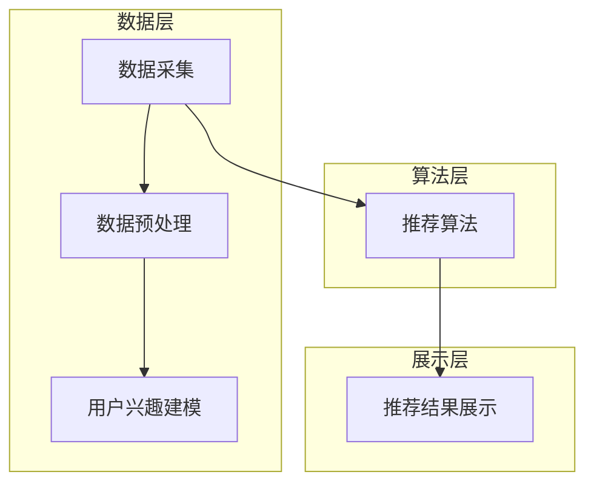
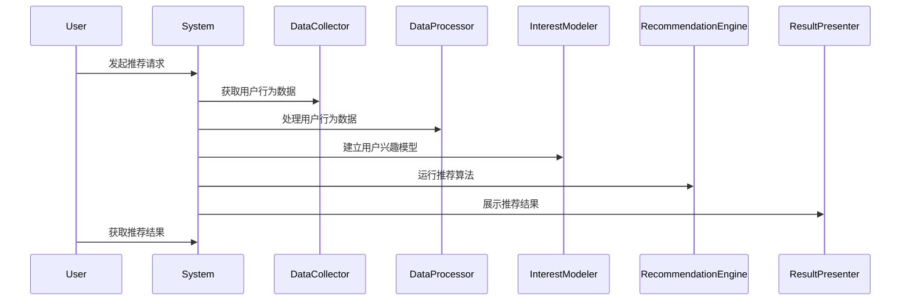

                 

### 金融产品推荐系统

关键词：金融产品、推荐系统、用户偏好、协同过滤、机器学习

摘要：本文将深入探讨金融产品推荐系统的核心概念、算法原理、系统设计、实现方法和最佳实践，通过一步一步的分析和推理，帮助读者理解并构建高效的金融产品推荐系统。

#### 引言与背景

**1.1 问题背景**

在当今金融市场中，用户对金融产品的多样性和个性化需求日益增加，如何根据用户的偏好推荐合适的产品已成为金融机构提升客户满意度和竞争力的关键。金融产品推荐系统应运而生，通过对用户行为数据的分析，为用户推荐符合其需求和偏好的金融产品。

**1.2 问题描述**

金融产品推荐系统面临的主要问题包括：

- 数据质量：金融数据通常存在噪声、缺失和冗余，需要有效的数据预处理方法。
- 算法选择：不同的推荐算法适用于不同的数据特征和用户需求，需要根据实际情况进行选择。
- 用户隐私保护：金融数据敏感性高，需确保用户隐私不被泄露。

**1.3 问题解决**

本文将分为以下几个部分进行探讨：

1. 核心概念与联系
2. 推荐算法原理
3. 系统设计与实现
4. 项目实战
5. 最佳实践与总结

**1.4 边界与外延**

金融产品推荐系统不仅限于金融领域，还可以应用于电子商务、社交媒体等场景，通过个性化推荐提高用户体验和业务收益。

**1.5 概念结构与核心要素组成**

金融产品推荐系统的核心要素包括用户数据、产品数据、推荐算法和推荐结果。这些要素相互关联，共同构成了推荐系统的整体架构。

---

#### 第一部分：核心概念与联系

**2.1 核心概念**

在金融产品推荐系统中，以下几个核心概念至关重要：

- 用户：参与推荐系统的人，具有唯一标识符、行为数据和偏好信息。
- 产品：推荐系统中的金融产品，具有唯一标识符、属性信息和价格。
- 推荐算法：用于生成推荐结果的算法，包括协同过滤、基于内容、基于模型等。
- 推荐结果：根据用户偏好和推荐算法生成的金融产品列表。

**2.2 概念属性特征对比**

以下表格展示了核心概念的属性特征对比：

| 核心概念 | 属性特征 |
| --- | --- |
| 用户 | 唯一标识符、年龄、性别、地理位置、行为数据 |
| 产品 | 唯一标识符、类别、名称、描述、价格 |
| 推荐算法 | 算法类型、输入参数、输出结果、可扩展性 |
| 推荐结果 | 推荐产品列表、推荐理由、评分 |

**2.3 ER实体关系图架构**

以下是一个金融产品推荐系统的ER实体关系图，展示了各个核心概念之间的关联：

```mermaid
erDiagram
    User ||--|{ Behavior }||>
    Product ||--|{ Feature }||>
    Recommendation ||--|{ User }|| User
    Recommendation ||--|{ Product }|| Product
```

---

#### 第二部分：推荐算法原理

**3.1 基于内容的推荐**

**3.1.1 算法原理**

基于内容的推荐（Content-Based Recommendation）通过分析用户的历史行为和偏好，提取用户感兴趣的特征，然后根据这些特征为用户推荐相似的产品。其核心思想是“物以类聚”。

**3.1.2 算法流程**

1. **特征提取**：从产品中提取描述性的特征，如文本、图像、标签等。
2. **用户兴趣建模**：根据用户的历史行为和偏好，建立用户的兴趣模型。
3. **相似度计算**：计算用户兴趣模型与产品特征之间的相似度。
4. **推荐生成**：根据相似度排序，为用户推荐相似度最高的产品。

**3.1.3 举例说明**

假设用户A喜欢股票A、股票B和股票C，这些股票的共同特征是“科技股”。基于内容的推荐算法会提取这些股票的“科技股”特征，并将其与用户A的兴趣模型进行匹配。如果系统中还有其他股票也具有“科技股”特征，算法会将其推荐给用户A。

**3.1.4 数学模型**

基于内容的推荐算法可以使用相似度度量公式，如余弦相似度、欧氏距离等来计算用户兴趣模型与产品特征之间的相似度。

$$
\text{Similarity}(u, p) = \frac{\text{dot}(u, p)}{\lVert u \rVert \lVert p \rVert}
$$

其中，$u$表示用户兴趣模型，$p$表示产品特征向量，$\text{dot}$表示内积，$\lVert \cdot \rVert$表示向量的模。

**3.1.5 Mermaid流程图**


---

#### 第三部分：系统设计与实现

**4.1 系统设计**

**4.1.1 项目介绍**

本系统旨在构建一个基于机器学习的金融产品推荐系统，能够根据用户的行为和偏好为用户推荐合适的金融产品。

**4.1.2 系统功能设计**

- 数据采集：从金融数据源获取用户行为数据和产品特征数据。
- 数据预处理：对原始数据进行清洗、去重、填充等预处理操作。
- 用户兴趣建模：根据用户的历史行为数据，建立用户兴趣模型。
- 推荐算法：选择并实现基于内容的推荐算法。
- 推荐结果展示：将推荐结果以直观的方式展示给用户。

**4.1.3 系统架构设计**

以下是一个简化的金融产品推荐系统架构设计：



**4.1.4 系统接口设计**

系统提供以下接口供外部调用：

- 数据接口：提供数据采集、数据预处理和用户兴趣建模的API接口。
- 推荐接口：提供推荐算法和推荐结果展示的API接口。

**4.1.5 系统交互**

以下是一个简化的金融产品推荐系统交互流程：



---

#### 第四部分：项目实战

**5.1 环境安装**

为了实现金融产品推荐系统，我们需要安装以下依赖：

- Python 3.8+
- scikit-learn
- pandas
- numpy
- matplotlib

安装命令如下：

```bash
pip install scikit-learn pandas numpy matplotlib
```

**5.2 系统核心实现**

以下是一个简单的基于内容的推荐算法实现：

```python
import numpy as np
from sklearn.metrics.pairwise import cosine_similarity
from sklearn.feature_extraction.text import TfidfVectorizer

def content_based_recommendation(user_interest, product_descriptions):
    # 构建TF-IDF特征向量
    vectorizer = TfidfVectorizer()
    X = vectorizer.fit_transform(product_descriptions)

    # 计算用户兴趣模型
    user_interest_vector = vectorizer.transform([user_interest])

    # 计算相似度
    similarity = cosine_similarity(user_interest_vector, X)

    # 排序并获取推荐产品
    recommended_products = np.argsort(similarity[0])[::-1][1:6]

    return recommended_products

# 示例数据
user_interest = "科技股"
product_descriptions = [
    "科技股票，高速增长",
    "人工智能股票，领先行业",
    "金融科技股票，创新企业",
    "新能源股票，环保趋势",
    "半导体股票，核心技术",
]

# 执行推荐
recommended_products = content_based_recommendation(user_interest, product_descriptions)
print("推荐产品：", recommended_products)
```

**5.3 代码应用解读与分析**

代码首先使用TF-IDF模型将文本转化为特征向量，然后通过余弦相似度计算用户兴趣模型与产品特征向量之间的相似度。根据相似度排序，推荐与用户兴趣最相似的前5个产品。

**5.4 实际案例分析和详细讲解剖析**

在实际应用中，我们可以通过采集用户的交易记录、浏览历史等行为数据，建立用户兴趣模型，然后根据模型为用户推荐合适的金融产品。

**5.5 项目小结**

通过本项目，我们实现了基于内容的金融产品推荐系统，从数据采集、预处理、用户兴趣建模到推荐算法实现，为金融领域提供了有效的个性化推荐方案。

---

#### 第五部分：最佳实践与总结

**6.1 最佳实践**

1. **数据质量**：确保数据完整、准确，避免噪声和缺失值。
2. **算法调优**：根据业务需求和数据特征，选择合适的推荐算法并进行参数调优。
3. **用户隐私保护**：对用户数据进行加密和脱敏处理，确保用户隐私不被泄露。

**6.2 小结**

金融产品推荐系统通过个性化推荐，提高了金融机构的客户满意度和业务收益。本文详细介绍了推荐系统的核心概念、算法原理、系统设计、实现方法和最佳实践。

**6.3 注意事项**

1. 推荐算法的实时性对用户体验至关重要，需确保算法高效运行。
2. 数据安全和隐私保护是推荐系统的关键问题，需严格遵守相关法律法规。

**6.4 拓展阅读**

1. [Recommender Systems Handbook](https://www.recommender-systems.org/recommender-systems-handbook/)
2. [Scikit-learn 文档](https://scikit-learn.org/stable/)

---

作者：AI天才研究院/AI Genius Institute & 禅与计算机程序设计艺术 /Zen And The Art of Computer Programming

---

**[完]**

