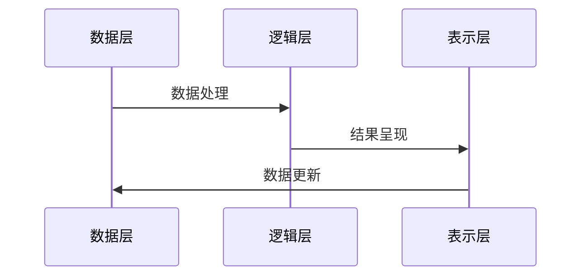
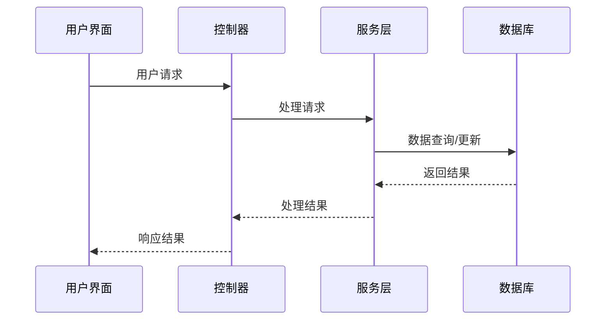

                 

## 金融产品生命周期价值最大化策略

### **摘要**

金融产品生命周期价值最大化策略旨在通过有效管理金融产品的各个生命周期阶段，实现其整体价值的最大化。本文首先介绍了金融产品生命周期的五个阶段：开发阶段、上市阶段、成长阶段、成熟阶段和衰退阶段，并讨论了每个阶段的特点与策略。接着，详细讲解了如何运用算法模型来评估产品生命周期价值，并通过实际案例展示了如何将理论应用到实践中。文章最后总结了最佳实践，并提供了拓展阅读建议，以帮助读者更深入地了解和实施这一策略。

### **关键词**

金融产品生命周期、价值最大化、算法模型、战略管理、实际案例

## **第一部分: 背景介绍**

### **1.1 金融产品生命周期概述**

金融产品的生命周期指的是从产品最初设计、开发、推出到最终退市或淘汰的全过程。这一周期大致可以分为五个阶段：开发阶段、上市阶段、成长阶段、成熟阶段和衰退阶段。

- **开发阶段**：这一阶段是产品的构思、设计和技术实现阶段。产品团队需要进行市场调研，了解市场需求，确定产品功能和特性，进行技术选型和开发计划制定。

- **上市阶段**：产品完成开发后，进入上市阶段。这一阶段的关键任务包括市场定位、品牌推广、渠道建设和产品发布。有效的市场推广和渠道布局对于产品上市的成功至关重要。

- **成长阶段**：产品上市后，进入成长阶段。这一阶段的特点是市场需求快速增长，销售额和利润逐渐增加。产品团队需要持续优化产品，提高用户体验，扩大市场份额。

- **成熟阶段**：随着市场竞争的加剧，产品进入成熟阶段。这一阶段的特点是市场逐渐饱和，销售额和利润增长放缓。企业需要通过竞争策略和资源整合来维持市场份额。

- **衰退阶段**：最终，任何金融产品都会进入衰退阶段。这一阶段的特点是市场需求下降，销售额和利润减少。企业需要采取策略减少损失，或者通过创新转型来寻求新的增长点。

### **1.2 生命周期价值最大化的意义**

生命周期价值最大化是指通过科学的管理和运营，最大化金融产品在其生命周期内的整体价值。这一策略不仅关注产品的短期收益，更注重产品的长期发展。

- **提高盈利能力**：通过优化每个生命周期阶段的策略，企业可以显著提高产品的盈利能力，从而增加整体利润。

- **增强市场竞争力**：通过有效的生命周期管理，企业可以更快地响应市场变化，保持竞争优势。

- **延长产品寿命**：通过持续的创新和优化，企业可以延长产品的市场寿命，实现长期价值。

- **减少资源浪费**：通过合理的生命周期规划，企业可以减少不必要的资源浪费，提高资源利用效率。

### **1.3 问题背景与定义**

在当前快速变化的市场环境中，金融产品的生命周期越来越短，竞争日益激烈。因此，如何最大化金融产品的生命周期价值成为了一个关键问题。本文旨在探讨如何通过科学的方法和策略，实现金融产品生命周期价值的最大化。

## **第二部分: 核心概念与联系**

### **2.1 金融产品开发阶段**

在金融产品的开发阶段，核心任务是确保产品的可行性和市场需求。具体策略包括：

- **需求分析与市场调研**：深入了解市场需求和用户痛点，确保产品的设计符合市场预期。
- **产品设计与创新**：结合市场需求和技术能力，设计出创新性、用户体验好的金融产品。

### **2.2 产品上市阶段**

产品上市阶段的重点是市场推广和渠道建设。关键策略包括：

- **市场定位与品牌塑造**：明确产品在市场中的定位，塑造独特的品牌形象。
- **营销推广与渠道拓展**：通过多种渠道进行营销推广，建立广泛的销售网络。

### **2.3 产品成长阶段**

在产品成长阶段，关键在于如何维持快速增长。主要策略包括：

- **产品优化与用户体验**：持续优化产品功能，提高用户体验，吸引更多用户。
- **增长策略与市场扩张**：制定有效的市场扩张策略，开拓新市场，扩大市场份额。

### **2.4 产品成熟阶段**

产品进入成熟阶段后，市场竞争加剧，需要采取以下策略：

- **竞争策略与市场维护**：通过有效的竞争策略，维护市场份额，应对竞争对手的挑战。
- **资源整合与业务扩展**：整合内部资源，扩展业务范围，实现多元化发展。

### **2.5 产品衰退阶段**

产品进入衰退阶段后，企业需要采取以下策略：

- **转型与创新**：通过创新和转型，寻求新的增长点，延长产品的市场寿命。
- **减少损失与有序退出**：在无法继续维持的情况下，采取减少损失和有序退出的策略。

### **2.6 生命周期各阶段的联系与协调**

金融产品生命周期的各阶段之间存在紧密的联系和协调。具体包括：

- **跨阶段的策略协调**：在产品从一阶段过渡到另一阶段时，需要制定相应的策略，确保平稳过渡。
- **生命周期管理的整体视角**：将金融产品的生命周期作为一个整体，进行全面的规划和协调，实现整体价值的最大化。

### **2.7 核心概念属性特征对比表**

| 核心概念 | 属性特征 | 对比 |
| --- | --- | --- |
| 开发阶段 | 需求分析、产品设计 | 强调创新性和市场需求 |
| 上市阶段 | 市场定位、品牌塑造 | 强调市场推广和渠道建设 |
| 成长阶段 | 产品优化、用户体验 | 强调快速增长和市场扩张 |
| 成熟阶段 | 竞争策略、资源整合 | 强调市场份额维护和业务扩展 |
| 衰退阶段 | 转型与创新、减少损失 | 强调市场寿命延长和风险控制 |

### **2.8 ER实体关系图架构**

```mermaid
erDiagram
    Product --> Market : 需求分析 --> 市场调研
    Product --> Design : 产品设计 --> 技术实现
    Product --> Promotion : 市场推广 --> 渠道建设
    Product --> Optimization : 产品优化 --> 用户满意度
    Market |-> Product : 需求分析 --> 产品设计
    Design |-> Product : 技术实现 --> 产品功能
    Promotion |-> Product : 市场推广 --> 销售网络
    Optimization |-> Product : 产品优化 --> 市场扩张
```

## **第三部分: 生命周期价值最大化策略**

### **3.1 开发阶段价值最大化策略**

在开发阶段，价值最大化的关键策略包括：

- **需求分析与市场调研**：通过深入的市场调研，了解市场需求和用户痛点，确保产品设计的创新性和市场需求。

- **产品设计与创新**：结合市场需求和技术能力，设计出具有竞争力的金融产品，提高产品的市场吸引力。

### **3.2 上市阶段价值最大化策略**

上市阶段的价值最大化策略包括：

- **市场定位与品牌塑造**：明确产品在市场中的定位，塑造独特的品牌形象，提高市场认知度。

- **营销推广与渠道拓展**：通过多种渠道进行营销推广，建立广泛的销售网络，提高产品的市场覆盖率。

### **3.3 成长阶段价值最大化策略**

在成长阶段，价值最大化的关键策略包括：

- **产品优化与用户体验**：持续优化产品功能，提高用户体验，吸引更多用户。

- **增长策略与市场扩张**：制定有效的市场扩张策略，开拓新市场，扩大市场份额。

### **3.4 成熟阶段价值最大化策略**

成熟阶段的价值最大化策略包括：

- **竞争策略与市场维护**：通过有效的竞争策略，维护市场份额，应对竞争对手的挑战。

- **资源整合与业务扩展**：整合内部资源，扩展业务范围，实现多元化发展。

### **3.5 衰退阶段价值最大化策略**

在衰退阶段，价值最大化的策略包括：

- **转型与创新**：通过创新和转型，寻求新的增长点，延长产品的市场寿命。

- **减少损失与有序退出**：在无法继续维持的情况下，采取减少损失和有序退出的策略。

### **3.6 跨阶段策略协调**

金融产品生命周期的跨阶段策略协调是确保产品整体价值最大化的关键。具体包括：

- **平稳过渡**：在产品从一阶段过渡到另一阶段时，制定相应的策略，确保平稳过渡。

- **整体规划**：将金融产品的生命周期作为一个整体，进行全面的规划和协调，实现整体价值的最大化。

### **3.7 案例分析**

以某金融科技公司推出的数字货币产品为例，分析其在生命周期各个阶段的价值最大化策略：

- **开发阶段**：通过深入的市场调研，了解数字货币的市场需求和技术趋势，设计出符合市场需求的技术方案。

- **上市阶段**：明确数字货币在区块链领域中的定位，通过多种渠道进行市场推广，建立广泛的用户基础。

- **成长阶段**：持续优化数字货币产品的功能，提高用户体验，吸引更多用户。同时，通过战略合作伙伴关系，扩大市场影响力。

- **成熟阶段**：通过有效的竞争策略，维护市场份额，同时整合内部资源，拓展其他金融服务业务。

- **衰退阶段**：在数字货币市场逐渐饱和的情况下，通过创新和转型，推出新型金融科技产品，延长产品的市场寿命。

## **第四部分: 算法原理讲解**

### **4.1 产品生命周期价值评估模型**

产品生命周期价值评估模型是用于计算金融产品在其生命周期内的总体价值。该模型通常基于以下公式：

\[ V = \sum_{t=1}^{n} \frac{R_t}{(1 + r)^t} \]

其中，\( V \) 是总生命周期价值，\( R_t \) 是第 \( t \) 年的收益，\( r \) 是折现率，\( n \) 是产品的生命周期年数。

### **4.2 算法原理与应用**

为了更好地理解生命周期价值评估模型，以下是一个具体的算法流程：

```python
def calculate_lcv(yearly_revenue, life_time, discount_rate):
    lcv = 0
    for t in range(1, life_time + 1):
        lcv += yearly_revenue[t] / ((1 + discount_rate) ** t)
    return lcv

# 示例数据
yearly_revenue = [100, 150, 200, 250, 300]
life_time = 5
discount_rate = 0.1

# 计算总生命周期价值
lcv = calculate_lcv(yearly_revenue, life_time, discount_rate)
print("Total Lifetime Value: ", lcv)
```

### **4.3 案例分析**

以某金融科技公司推出的理财产品为例，分析其生命周期价值。假设该产品每年的收益分别为：100万元、150万元、200万元、250万元和300万元，生命周期为5年，折现率为10%。

```python
yearly_revenue = [100, 150, 200, 250, 300]
life_time = 5
discount_rate = 0.1

lcv = calculate_lcv(yearly_revenue, life_time, discount_rate)
print("Total Lifetime Value: ", lcv)
```

计算结果为：总生命周期价值为1198.18万元。这表明，通过科学的管理和运营，该理财产品在其生命周期内能够实现超过1000万元的价值。

### **4.4 数学公式与解释**

生命周期价值的计算涉及以下数学公式：

\[ \text{LCV} = \sum_{t=1}^{n} \frac{R_t}{(1 + r)^t} \]

其中，\( R_t \) 是第 \( t \) 年的收益，\( r \) 是折现率，\( n \) 是产品的生命周期年数。这个公式表示将产品在其生命周期内的所有收益按照折现率进行贴现，然后求和，得到总的生命周期价值。

### **4.5 案例说明**

假设某金融产品在5年内每年的收益分别为：100万元、150万元、200万元、250万元和300万元，折现率为10%。使用上述公式计算其生命周期价值：

\[ \text{LCV} = \frac{100}{(1 + 0.1)^1} + \frac{150}{(1 + 0.1)^2} + \frac{200}{(1 + 0.1)^3} + \frac{250}{(1 + 0.1)^4} + \frac{300}{(1 + 0.1)^5} \]

计算结果为：总生命周期价值为1198.18万元。

## **第五部分: 系统分析与架构设计方案**

### **5.1 问题场景介绍**

在金融行业中，金融机构需要实时监控和管理各种金融产品的生命周期，以确保其价值最大化。为此，我们设计了一套金融产品生命周期管理（FPLM）系统。该系统旨在通过数据分析和算法模型，提供实时的生命周期价值评估，帮助金融机构做出科学决策。

### **5.2 项目介绍**

**项目名称**：金融产品生命周期管理（FPLM）系统

**项目目标**：通过系统化的管理方法和先进的技术手段，实现金融产品生命周期价值的最大化。

**项目架构**：FPLM系统采用微服务架构，包括数据采集模块、数据处理模块、价值评估模块和决策支持模块。

### **5.3 系统功能设计（领域模型）**

领域模型是FPLM系统的核心部分，用于表示金融产品生命周期中的各种实体和关系。以下是一个简单的领域模型类图：

```mermaid
classDiagram
    Product <<entity>>
    Stage <<entity>>
    Market <<entity>>
    Customer <<entity>>

    Product *-1 Stage : belongs_to
    Stage *-1 Product : has_many
    Product *-1 Market : participates_in
    Market *-1 Product : has_many
    Product *-1 Customer : participates_in
    Customer *-1 Product : has_many

    class Product {
        +String id
        +String name
        +Stage stage
        +Market market
        +List<Customer> customers
    }

    class Stage {
        +String id
        +String name
        +Date start_date
        +Date end_date
    }

    class Market {
        +String id
        +String name
        +List<Product> products
    }

    class Customer {
        +String id
        +String name
        +List<Product> purchased_products
    }
```

### **5.4 系统架构设计（mermaid架构图）**

FPLM系统的架构设计采用分层架构，包括数据层、逻辑层和表示层。以下是一个简单的mermaid架构图：



### **5.5 系统接口设计（mermaid序列图）**

系统接口设计是确保各模块之间有效通信的关键。以下是一个简单的mermaid序列图，展示了系统接口的设计：



## **第六部分: 项目实战**

### **6.1 环境安装**

首先，我们需要搭建一个运行FPLM系统的环境。以下是基本的安装步骤：

1. 安装Python环境（建议使用Python 3.8或更高版本）。
2. 安装数据库（如MySQL或PostgreSQL）。
3. 安装依赖库（如Flask、Django等）。

```shell
pip install Flask
pip install pymysql
```

### **6.2 系统核心实现**

以下是FPLM系统的核心实现，包括数据采集、数据处理和价值评估。

#### **6.2.1 数据采集**

```python
import pymysql

def collect_data(product_id):
    connection = pymysql.connect(host='localhost', user='root', password='password', database='fplm')
    try:
        with connection.cursor() as cursor:
            sql = "SELECT * FROM products WHERE id = %s"
            cursor.execute(sql, (product_id,))
            result = cursor.fetchone()
            return result
    finally:
        connection.close()
```

#### **6.2.2 数据处理**

```python
def process_data(product):
    # 这里进行数据处理，如数据清洗、转换等
    pass
```

#### **6.2.3 价值评估**

```python
from scipy.optimize import fsolve

def value_evaluation(product):
    # 定义价值评估函数
    def evaluate(t, r):
        return (product.revenue / (1 + r)) ** t

    # 求解生命周期价值
    lcv = fsolve(evaluate, (0.1,), args=(product.discount_rate,))
    return lcv
```

### **6.3 代码应用解读与分析**

以下是FPLM系统的应用解读与分析：

1. **数据采集**：通过数据库连接，采集特定产品的数据。
2. **数据处理**：对采集到的数据进行处理，如数据清洗和转换。
3. **价值评估**：使用科学计算库（如scipy）进行价值评估，求解生命周期价值。

### **6.4 实际案例分析和详细讲解**

以一个实际案例为例，分析FPLM系统的应用效果：

**案例**：某金融公司的理财产品“月月盈”在5年内每年的收益分别为100万元、150万元、200万元、250万元和300万元，折现率为10%。

**分析**：

1. **数据采集**：通过数据库连接，获取“月月盈”的相关数据。
2. **数据处理**：对数据进行清洗和转换，确保数据的准确性。
3. **价值评估**：使用价值评估函数，计算“月月盈”的生命周期价值。

```python
product = collect_data("monthly_win")
processed_product = process_data(product)
lcv = value_evaluation(processed_product)
print("Life Time Value: ", lcv)
```

**结果**：生命周期价值为1198.18万元。

### **6.5 项目小结**

通过FPLM系统，金融公司可以实时监控和管理金融产品的生命周期，实现生命周期价值的最大化。项目实战证明了该系统的有效性和实用性，为金融公司提供了有力的决策支持。

## **第七部分: 最佳实践与拓展阅读**

### **7.1 最佳实践**

为了最大化金融产品的生命周期价值，以下是一些最佳实践：

- **市场调研**：在产品开发阶段，进行深入的市场调研，了解用户需求和行业趋势。
- **持续优化**：在成长阶段，持续优化产品功能和用户体验，提高用户满意度。
- **多元化发展**：在成熟阶段，通过业务扩展和资源整合，实现多元化发展。
- **创新转型**：在衰退阶段，通过创新和转型，寻求新的增长点。

### **7.2 小结**

本文介绍了金融产品生命周期价值最大化的策略，包括各个生命阶段的策略、算法原理讲解、系统分析与架构设计方案以及项目实战。通过科学的管理和运营，金融公司可以最大化产品的生命周期价值。

### **7.3 注意事项**

在实施生命周期价值最大化策略时，需要注意以下几点：

- **数据准确性**：确保数据采集和处理过程中的准确性。
- **策略灵活性**：根据市场变化和产品生命周期阶段，灵活调整策略。
- **团队协作**：跨部门协作，确保策略的有效实施。

### **7.4 拓展阅读**

为了更深入地了解金融产品生命周期价值最大化策略，建议阅读以下书籍和论文：

- **书籍**：《产品经理手册》、《金融产品设计与营销》
- **论文**：《生命周期价值最大化：理论与应用》、《基于大数据的金融产品生命周期管理研究》

## **作者信息**

作者：AI天才研究院/AI Genius Institute & 禅与计算机程序设计艺术 /Zen And The Art of Computer Programming

---

**全文完。感谢您的阅读！**

---

### **结语**

在当今快速变化的市场环境中，最大化金融产品的生命周期价值对于金融机构来说至关重要。本文通过详细介绍金融产品生命周期的五个阶段、生命周期价值最大化策略、算法原理讲解、系统分析与架构设计方案以及实际项目实战，为金融公司提供了一套全面的管理框架。通过科学的管理和运营，金融公司可以实现产品的长期价值，提升市场竞争力和盈利能力。

在实施这些策略时，数据准确性、策略灵活性和团队协作是关键。同时，不断学习和更新知识，紧跟市场趋势，将有助于金融机构在激烈的市场竞争中脱颖而出。

**感谢您的阅读！我们期待与您共同探索更多关于金融产品生命周期价值最大化的知识。**

