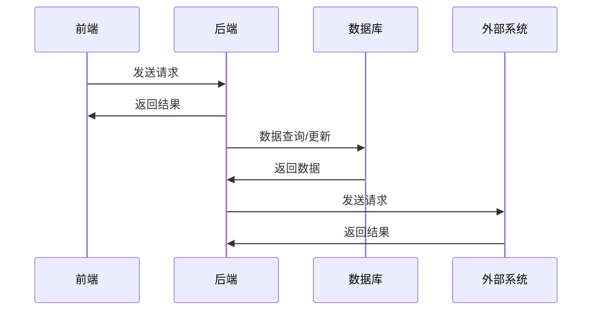

                 

### 第一部分：引言

#### 第1章：金融产品生命周期管理概述

##### 1.1 问题背景

金融行业作为一个高度复杂的领域，一直在全球经济中扮演着至关重要的角色。随着金融市场的不断演变和全球化进程的加速，金融产品的种类和复杂性也在迅速增加。传统的金融产品如存款、贷款、基金等，以及新型的金融产品如数字货币、区块链金融、互联网金融等，都在不断涌现。这些金融产品的多样性和复杂性，使得金融产品的生命周期管理成为了一个极具挑战性的问题。

在当前的金融市场中，金融产品的生命周期管理涉及到多个关键环节，包括产品的研发、推广、销售、运营、风险控制、退出等。然而，传统的生命周期管理方法往往存在一些不足之处，如缺乏系统性的规划、无法及时响应市场变化、风险控制不到位等。这些问题的存在，使得金融产品生命周期管理成为金融行业亟待解决的难题。

##### 1.1.1 金融行业现状

金融行业作为一个高度专业化和高度依赖技术的领域，其发展现状与金融产品的生命周期管理密切相关。当前，金融行业呈现出以下几个显著特点：

1. **数字化和智能化**：随着信息技术的飞速发展，金融行业正经历着一场数字化的革命。金融机构纷纷利用大数据、人工智能、区块链等技术，提升金融产品的研发、销售、运营、风险控制等环节的效率。

2. **金融产品多样化**：随着金融市场的不断成熟，金融产品的种类也在不断增多。除了传统的金融产品如存款、贷款、基金等，新型金融产品如数字货币、区块链金融、互联网金融等也在迅速崛起。

3. **全球化趋势**：全球金融市场的互联互通，使得金融产品生命周期管理面临更大的挑战。金融机构需要面对不同国家和地区的监管要求、市场环境、文化差异等，这些都对金融产品生命周期管理提出了更高的要求。

##### 1.1.2 金融产品种类与特点

金融产品种类繁多，根据其性质和功能，可以大致分为以下几类：

1. **存款类产品**：包括活期存款、定期存款、定活两便存款等。这类产品风险较低，收益稳定，是金融机构的基础业务。

2. **贷款类产品**：包括个人贷款、企业贷款、信用贷款、抵押贷款等。这类产品是金融机构的核心业务，涉及到大量的风险评估和风控措施。

3. **投资类产品**：包括基金、股票、债券、期货、期权等。这类产品风险较高，收益也较高，是投资者追求高收益的主要途径。

4. **衍生金融产品**：包括金融期货、金融期权、掉期合约等。这类产品具有较高的复杂性和风险，是金融机构和专业投资者进行风险管理的主要工具。

金融产品具有以下特点：

1. **复杂性**：随着金融产品的不断创新，其结构变得越来越复杂。投资者和金融机构需要对产品有深入的理解，才能进行有效的管理和投资。

2. **高风险性**：金融产品的风险与其复杂程度成正比。一些复杂的金融产品可能存在巨大的风险，需要严格的风险控制和监管。

3. **流动性**：金融产品的流动性决定了其交易便利性。高流动性的产品可以快速买卖，低流动性的产品则可能存在交易困难的问题。

4. **收益性**：金融产品的收益性是投资者选择产品的重要因素。不同类型的金融产品收益性差异较大，投资者需要根据自己的风险承受能力和收益预期进行选择。

##### 1.1.3 金融产品生命周期管理的重要性

金融产品生命周期管理在金融行业中具有至关重要的地位。其主要重要性体现在以下几个方面：

1. **提高产品竞争力**：通过有效的生命周期管理，金融机构可以更好地把握市场需求，及时调整产品策略，提高产品的市场竞争力和盈利能力。

2. **降低风险**：生命周期管理可以帮助金融机构识别和管理金融产品的风险，采取有效的风控措施，降低金融产品的风险水平。

3. **优化资源配置**：有效的生命周期管理可以优化金融机构的资源配置，提高资源利用效率，降低运营成本。

4. **提高客户满意度**：通过生命周期管理，金融机构可以更好地了解客户需求，提供个性化的金融服务，提高客户满意度和忠诚度。

##### 1.2 问题描述

在金融行业，金融产品生命周期管理面临着诸多挑战。以下是金融产品生命周期管理中的一些关键问题和挑战：

1. **需求变化快**：金融市场需求变化迅速，金融机构需要及时响应市场变化，调整产品策略，否则可能错失市场机会。

2. **风险控制难**：金融产品的复杂性和高风险性，使得风险控制变得异常困难。金融机构需要建立完善的风险评估和风控体系，才能有效控制产品风险。

3. **成本高**：金融产品生命周期管理涉及多个环节，需要投入大量的人力、物力和财力。如何降低成本，提高管理效率，是金融机构面临的重大挑战。

4. **合规性要求高**：金融行业受到严格的监管要求，金融机构需要遵循各种法律法规和监管规定。生命周期管理过程中，如何确保合规性，是金融机构必须面对的问题。

##### 1.2.1 金融产品生命周期管理的挑战

1. **市场变化快**：金融市场的变化速度快，金融机构需要具备快速响应市场变化的能力。否则，可能会导致产品策略滞后，错失市场机会。

2. **风险评估难**：金融产品的复杂性和高风险性，使得风险评估变得异常困难。金融机构需要建立科学的风险评估体系，才能准确识别和管理产品风险。

3. **风控措施不到位**：风控措施不到位，是金融产品生命周期管理中的另一个挑战。金融机构需要采取有效的风控措施，如风险隔离、风险分散、风险转移等，以降低产品风险。

4. **成本高**：金融产品生命周期管理涉及多个环节，需要投入大量的人力、物力和财力。如何降低成本，提高管理效率，是金融机构面临的重大挑战。

5. **合规性要求高**：金融行业受到严格的监管要求，金融机构需要遵循各种法律法规和监管规定。生命周期管理过程中，如何确保合规性，是金融机构必须面对的问题。

##### 1.2.2 金融产品生命周期管理的目标

金融产品生命周期管理的目标主要包括以下几个方面：

1. **提高产品竞争力**：通过有效的生命周期管理，提高金融产品的竞争力，满足市场需求，提升市场占有率。

2. **降低风险**：通过科学的风险评估和风控措施，降低金融产品的风险水平，确保产品的安全性和稳定性。

3. **优化资源配置**：通过有效的生命周期管理，优化金融机构的资源配置，提高资源利用效率，降低运营成本。

4. **提高客户满意度**：通过生命周期管理，提供个性化的金融服务，提高客户满意度和忠诚度。

5. **确保合规性**：遵循各种法律法规和监管规定，确保金融产品生命周期管理的合规性。

##### 1.2.3 金融产品生命周期管理的关键环节

金融产品生命周期管理涉及多个关键环节，以下是其中几个重要的环节：

1. **需求分析**：了解市场需求，确定产品定位和目标客户群，为产品设计和开发提供依据。

2. **产品设计**：根据需求分析结果，设计金融产品的结构和功能，确保产品满足市场需求。

3. **产品开发**：根据产品设计，进行产品开发，包括前期的研发和后期的测试。

4. **市场推广**：通过各种渠道和手段，推广金融产品，提高产品知名度和市场占有率。

5. **销售和运营**：通过销售渠道和运营手段，将金融产品推向市场，实现产品的销售和运营。

6. **风险控制**：通过风险评估和风控措施，控制金融产品的风险水平，确保产品的安全性和稳定性。

7. **合规性管理**：遵循各种法律法规和监管规定，确保金融产品生命周期管理的合规性。

##### 1.3 问题解决

为了解决金融产品生命周期管理中面临的挑战和问题，可以采取以下方法和工具：

1. **数字化和智能化**：利用大数据、人工智能、区块链等数字化和智能化技术，提高生命周期管理的效率和准确性。

2. **系统化和标准化**：建立系统化和标准化的生命周期管理流程和体系，提高管理的规范性和一致性。

3. **风险评估与风控**：建立完善的风险评估和风控体系，包括风险识别、风险评估、风险控制和风险监控等环节。

4. **合规性管理**：建立合规性管理机制，确保生命周期管理的各个环节符合法律法规和监管要求。

5. **客户关系管理**：通过客户关系管理，了解客户需求，提供个性化的金融服务，提高客户满意度和忠诚度。

##### 1.3.1 金融产品生命周期管理方法

1. **需求分析**：通过市场调研、客户访谈、数据分析等方法，了解市场需求和客户需求，确定产品定位和目标客户群。

2. **产品设计**：根据需求分析结果，设计金融产品的结构和功能，确保产品满足市场需求。

3. **产品开发**：根据产品设计，进行产品开发，包括前期的研发和后期的测试。

4. **市场推广**：通过各种渠道和手段，推广金融产品，提高产品知名度和市场占有率。

5. **销售和运营**：通过销售渠道和运营手段，将金融产品推向市场，实现产品的销售和运营。

6. **风险控制**：通过风险评估和风控措施，控制金融产品的风险水平，确保产品的安全性和稳定性。

7. **合规性管理**：遵循各种法律法规和监管规定，确保金融产品生命周期管理的合规性。

##### 1.3.2 金融产品生命周期管理工具

1. **ERP系统**：企业资源计划（ERP）系统可以帮助金融机构实现生命周期管理的各个环节，包括需求分析、产品设计、产品开发、市场推广、销售和运营等。

2. **CRM系统**：客户关系管理（CRM）系统可以帮助金融机构了解客户需求，管理客户关系，提供个性化的金融服务。

3. **风险管理软件**：风险管理软件可以帮助金融机构进行风险评估、风险控制和风险监控，提高风险管理的效率和准确性。

4. **合规性管理软件**：合规性管理软件可以帮助金融机构遵循各种法律法规和监管要求，确保生命周期管理的合规性。

##### 1.3.3 金融产品生命周期管理案例分析

1. **案例一：互联网金融产品的生命周期管理**

互联网金融产品的生命周期管理主要涉及以下几个关键环节：

- **需求分析**：通过市场调研和数据分析，了解客户需求和市场竞争状况，确定产品定位和目标客户群。

- **产品设计**：根据需求分析结果，设计互联网金融产品的结构和功能，确保产品满足市场需求。

- **产品开发**：通过技术团队的合作，进行互联网金融产品的开发，包括前期的研发和后期的测试。

- **市场推广**：通过线上和线下的渠道，推广互联网金融产品，提高产品知名度和市场占有率。

- **销售和运营**：通过电商平台和线下门店，销售互联网金融产品，并进行运营管理。

- **风险控制**：通过风险评估和风控措施，控制互联网金融产品的风险水平，确保产品的安全性和稳定性。

- **合规性管理**：遵循相关法律法规和监管要求，确保互联网金融产品生命周期管理的合规性。

2. **案例二：银行理财产品的生命周期管理**

银行理财产品的生命周期管理主要包括以下几个环节：

- **需求分析**：通过市场调研和数据分析，了解客户需求和市场竞争状况，确定产品定位和目标客户群。

- **产品设计**：根据需求分析结果，设计银行理财产品的结构和功能，确保产品满足市场需求。

- **产品开发**：通过内部评审和审批流程，进行银行理财产品的开发，包括前期的研发和后期的测试。

- **市场推广**：通过银行网点和线上平台，推广银行理财产品，提高产品知名度和市场占有率。

- **销售和运营**：通过销售团队和运营团队，销售银行理财产品，并进行运营管理。

- **风险控制**：通过风险评估和风控措施，控制银行理财产品的风险水平，确保产品的安全性和稳定性。

- **合规性管理**：遵循相关法律法规和监管要求，确保银行理财产品生命周期管理的合规性。

##### 1.4 边界与外延

1. **金融产品生命周期管理的边界**

金融产品生命周期管理的边界主要包括以下几个方面：

- **时间边界**：金融产品生命周期管理的有效期限，通常是指产品从设计、开发、推广、销售、运营到退出的全过程。

- **空间边界**：金融产品生命周期管理的地理范围，通常是指产品在国内或国际市场的推广和运营。

- **业务边界**：金融产品生命周期管理的业务范围，通常是指产品所涉及的业务领域，如银行、证券、基金、保险等。

2. **金融产品生命周期管理的相关概念**

金融产品生命周期管理涉及多个相关概念，包括但不限于：

- **金融产品**：金融产品是指金融机构发行的，用于满足客户金融需求的金融工具。

- **生命周期**：生命周期是指金融产品从设计、开发、推广、销售、运营到退出的全过程。

- **需求分析**：需求分析是指通过市场调研和数据分析，了解客户需求和市场状况，为产品设计和开发提供依据。

- **产品设计**：产品设计是指根据需求分析结果，设计金融产品的结构和功能。

- **产品开发**：产品开发是指根据产品设计，进行金融产品的开发，包括前期的研发和后期的测试。

- **市场推广**：市场推广是指通过各种渠道和手段，推广金融产品，提高产品知名度和市场占有率。

- **销售和运营**：销售和运营是指通过销售渠道和运营手段，将金融产品推向市场，实现产品的销售和运营。

- **风险控制**：风险控制是指通过风险评估和风控措施，控制金融产品的风险水平，确保产品的安全性和稳定性。

- **合规性管理**：合规性管理是指遵循各种法律法规和监管要求，确保金融产品生命周期管理的合规性。

##### 1.5 概念结构与核心要素组成

1. **金融产品生命周期管理概念模型**

金融产品生命周期管理概念模型主要包括以下几个核心概念：

- **金融产品**：金融产品是指金融机构发行的，用于满足客户金融需求的金融工具。

- **生命周期**：生命周期是指金融产品从设计、开发、推广、销售、运营到退出的全过程。

- **需求分析**：需求分析是指通过市场调研和数据分析，了解客户需求和市场状况，为产品设计和开发提供依据。

- **产品设计**：产品设计是指根据需求分析结果，设计金融产品的结构和功能。

- **产品开发**：产品开发是指根据产品设计，进行金融产品的开发，包括前期的研发和后期的测试。

- **市场推广**：市场推广是指通过各种渠道和手段，推广金融产品，提高产品知名度和市场占有率。

- **销售和运营**：销售和运营是指通过销售渠道和运营手段，将金融产品推向市场，实现产品的销售和运营。

- **风险控制**：风险控制是指通过风险评估和风控措施，控制金融产品的风险水平，确保产品的安全性和稳定性。

- **合规性管理**：合规性管理是指遵循各种法律法规和监管要求，确保金融产品生命周期管理的合规性。

2. **金融产品生命周期管理核心要素分析**

金融产品生命周期管理的核心要素主要包括以下几个方面：

- **需求分析**：需求分析是金融产品生命周期管理的起点，通过市场调研和数据分析，了解客户需求和市场状况，为产品设计和开发提供依据。

- **产品设计**：产品设计是根据需求分析结果，设计金融产品的结构和功能。一个好的产品设计能够满足市场需求，提高产品的竞争力。

- **产品开发**：产品开发是金融产品生命周期管理的关键环节，通过前期的研发和后期的测试，确保产品能够顺利推向市场。

- **市场推广**：市场推广是通过各种渠道和手段，推广金融产品，提高产品知名度和市场占有率。市场推广的效果直接影响到产品的销售和运营。

- **销售和运营**：销售和运营是通过销售渠道和运营手段，将金融产品推向市场，实现产品的销售和运营。良好的销售和运营能力能够提高产品的市场占有率。

- **风险控制**：风险控制是通过风险评估和风控措施，控制金融产品的风险水平，确保产品的安全性和稳定性。有效的风险控制能够降低产品的风险水平，提高产品的竞争力。

- **合规性管理**：合规性管理是遵循各种法律法规和监管要求，确保金融产品生命周期管理的合规性。合规性管理能够确保产品的合法合规性，降低法律风险。

##### 1.6 本章小结

本章对金融产品生命周期管理进行了详细的介绍，包括问题背景、问题解决、方法工具、边界与外延以及概念结构与核心要素组成。通过对金融产品生命周期管理的深入分析，我们了解到金融产品生命周期管理在金融行业中的重要性，以及其面临的挑战和解决方案。本章内容为后续章节的深入讨论奠定了基础。

----------------------------------------------------------------

### 第二部分：核心概念与联系

#### 第2章：金融产品生命周期管理核心概念

##### 2.1 金融产品的定义与特点

金融产品是指金融机构为满足客户金融需求而发行的金融工具。金融产品种类繁多，包括存款、贷款、基金、股票、债券、保险等。金融产品具有以下特点：

1. **复杂性**：金融产品的结构越来越复杂，涉及到多种金融工具和衍生工具，投资者需要具备较高的金融知识才能理解。

2. **高风险性**：金融产品的高风险性与其复杂程度成正比。一些复杂的金融产品可能存在巨大的风险，投资者需要谨慎评估。

3. **流动性**：金融产品的流动性决定了其交易便利性。高流动性的产品可以快速买卖，低流动性的产品则可能存在交易困难的问题。

4. **收益性**：金融产品的收益性是投资者选择产品的重要因素。不同类型的金融产品收益性差异较大，投资者需要根据自己的风险承受能力和收益预期进行选择。

##### 2.1.1 金融产品的定义

金融产品是指金融机构发行的，用于满足客户金融需求的金融工具。金融产品种类繁多，包括存款、贷款、基金、股票、债券、保险等。金融产品的目的是帮助客户实现财富增值、风险规避、资金管理等金融需求。

##### 2.1.2 金融产品的特点

1. **复杂性**：随着金融市场的不断发展，金融产品的结构越来越复杂。一些复杂的金融产品可能包含多种金融工具和衍生工具，投资者需要具备较高的金融知识才能理解。

2. **高风险性**：金融产品的高风险性与其复杂程度成正比。一些复杂的金融产品可能存在巨大的风险，投资者需要谨慎评估。

3. **流动性**：金融产品的流动性决定了其交易便利性。高流动性的产品可以快速买卖，低流动性的产品则可能存在交易困难的问题。

4. **收益性**：金融产品的收益性是投资者选择产品的重要因素。不同类型的金融产品收益性差异较大，投资者需要根据自己的风险承受能力和收益预期进行选择。

##### 2.1.3 金融产品的分类

根据金融产品的性质和功能，可以将其分为以下几类：

1. **存款类产品**：包括活期存款、定期存款、定活两便存款等。这类产品风险较低，收益稳定，是金融机构的基础业务。

2. **贷款类产品**：包括个人贷款、企业贷款、信用贷款、抵押贷款等。这类产品是金融机构的核心业务，涉及到大量的风险评估和风控措施。

3. **投资类产品**：包括基金、股票、债券、期货、期权等。这类产品风险较高，收益也较高，是投资者追求高收益的主要途径。

4. **衍生金融产品**：包括金融期货、金融期权、掉期合约等。这类产品具有较高的复杂性和风险，是金融机构和专业投资者进行风险管理的主要工具。

##### 2.2 生命周期管理的定义与原则

生命周期管理是指对金融产品从设计、开发、推广、销售、运营到退出的全过程进行系统性的管理。生命周期管理的目标是确保金融产品的安全性和稳定性，提高产品的市场竞争力和盈利能力。生命周期管理原则主要包括以下几个方面：

1. **系统性**：生命周期管理是一个系统性的过程，涉及多个环节和部门。需要建立系统化的管理流程和体系，确保各个环节的协同和一致性。

2. **阶段性**：生命周期管理分为不同的阶段，包括设计、开发、推广、销售、运营等。每个阶段都有其特定的任务和目标，需要根据阶段特点进行有针对性的管理。

3. **动态性**：金融市场需求变化快，生命周期管理需要具备动态性，能够及时响应市场变化，调整产品策略。

4. **规范性**：生命周期管理需要遵循相关法律法规和监管要求，确保产品的合规性和合法性。

5. **风险管理**：生命周期管理的一个重要任务是识别和管理金融产品的风险。需要建立完善的风险评估和风控体系，确保产品的安全性和稳定性。

##### 2.2.1 生命周期管理的定义

生命周期管理是指对金融产品从设计、开发、推广、销售、运营到退出的全过程进行系统性的管理。生命周期管理的目的是确保金融产品的安全性和稳定性，提高产品的市场竞争力和盈利能力。

##### 2.2.2 生命周期管理的原则

1. **系统性**：生命周期管理是一个系统性的过程，涉及多个环节和部门。需要建立系统化的管理流程和体系，确保各个环节的协同和一致性。

2. **阶段性**：生命周期管理分为不同的阶段，包括设计、开发、推广、销售、运营等。每个阶段都有其特定的任务和目标，需要根据阶段特点进行有针对性的管理。

3. **动态性**：金融市场需求变化快，生命周期管理需要具备动态性，能够及时响应市场变化，调整产品策略。

4. **规范性**：生命周期管理需要遵循相关法律法规和监管要求，确保产品的合规性和合法性。

5. **风险管理**：生命周期管理的一个重要任务是识别和管理金融产品的风险。需要建立完善的风险评估和风控体系，确保产品的安全性和稳定性。

##### 2.2.3 生命周期管理的目标

生命周期管理的目标主要包括以下几个方面：

1. **提高产品竞争力**：通过有效的生命周期管理，提高金融产品的竞争力，满足市场需求，提升市场占有率。

2. **降低风险**：通过科学的风险评估和风控措施，降低金融产品的风险水平，确保产品的安全性和稳定性。

3. **优化资源配置**：通过有效的生命周期管理，优化金融机构的资源配置，提高资源利用效率，降低运营成本。

4. **提高客户满意度**：通过生命周期管理，提供个性化的金融服务，提高客户满意度和忠诚度。

5. **确保合规性**：遵循各种法律法规和监管要求，确保金融产品生命周期管理的合规性。

##### 2.3 金融产品生命周期各阶段的特点与任务

金融产品生命周期包括设计、开发、推广、销售、运营等阶段，每个阶段都有其特定的任务和特点：

1. **设计阶段**：

   - **特点**：设计阶段是金融产品生命周期管理的起点，主要任务是确定产品定位、目标客户群和产品功能。

   - **任务**：进行市场需求分析、产品设计、制定产品策略和规划。

2. **开发阶段**：

   - **特点**：开发阶段是将产品设计转化为实际产品的过程，涉及技术研发、测试和优化。

   - **任务**：进行产品研发、测试和优化，确保产品功能完善、性能稳定。

3. **推广阶段**：

   - **特点**：推广阶段是金融产品推向市场的重要环节，主要任务是提高产品知名度和市场占有率。

   - **任务**：制定市场推广策略、开展宣传活动、建立销售渠道。

4. **销售阶段**：

   - **特点**：销售阶段是金融产品实现销售的过程，涉及销售策略、客户关系管理和销售渠道建设。

   - **任务**：开展销售活动、建立客户关系、管理销售渠道。

5. **运营阶段**：

   - **特点**：运营阶段是金融产品投入运营的过程，涉及产品运营、风险管理和服务支持。

   - **任务**：确保产品稳定运行、进行风险管理、提供客户服务。

##### 2.3.1 营销期

营销期是金融产品生命周期管理的重要阶段，主要任务是提高产品知名度和市场占有率。在营销期，金融机构需要制定有效的市场推广策略，包括以下几个方面：

1. **市场调研**：了解市场需求和竞争状况，确定产品定位和目标客户群。

2. **品牌宣传**：通过广告、公关活动等方式，提高产品知名度和品牌形象。

3. **销售渠道建设**：建立多元化的销售渠道，包括线上线下渠道、合作伙伴渠道等。

4. **促销活动**：开展促销活动，吸引客户购买产品。

5. **客户关系管理**：建立客户关系管理系统，提高客户满意度和忠诚度。

##### 2.3.2 发展期

发展期是金融产品生命周期管理的关键阶段，主要任务是扩大市场份额，提升产品竞争力。在发展期，金融机构需要关注以下几个方面：

1. **市场反馈**：收集市场反馈信息，了解产品在市场上的表现和客户需求。

2. **产品优化**：根据市场反馈，对产品进行优化和改进，提高产品性能和用户体验。

3. **销售策略调整**：根据市场状况和竞争态势，调整销售策略，提高销售业绩。

4. **渠道拓展**：拓展销售渠道，增加销售网络，提高市场覆盖面。

5. **品牌建设**：加强品牌建设，提升品牌影响力和市场份额。

##### 2.3.3 成熟期

成熟期是金融产品生命周期管理的稳定阶段，主要任务是保持市场份额，实现盈利。在成熟期，金融机构需要关注以下几个方面：

1. **市场巩固**：通过营销活动、客户服务等方式，巩固市场份额，提高客户忠诚度。

2. **产品维护**：定期对产品进行维护和升级，确保产品性能和稳定性。

3. **成本控制**：通过优化运营管理，降低产品成本，提高盈利能力。

4. **风险控制**：加强风险管理和风控措施，确保产品安全性和稳定性。

5. **客户服务**：提供优质的客户服务，提高客户满意度和忠诚度。

##### 2.3.4 衰退期

衰退期是金融产品生命周期管理的最后阶段，主要任务是逐步退出市场，降低损失。在衰退期，金融机构需要关注以下几个方面：

1. **市场退出策略**：制定市场退出策略，包括产品下架、渠道关闭等。

2. **客户转接**：将客户转接到其他产品或服务，减少损失。

3. **资产处置**：对剩余资产进行处置，降低损失。

4. **风险控制**：继续加强风险管理和风控措施，确保退出过程的安全性。

5. **总结经验**：对产品生命周期管理过程进行总结，积累经验，为未来产品管理提供参考。

##### 2.4 核心概念联系

1. **金融产品与生命周期管理的关系**

金融产品和生命周期管理是密不可分的。金融产品是生命周期管理的核心对象，生命周期管理是金融产品的全过程管理。生命周期管理能够确保金融产品的安全性和稳定性，提高产品的市场竞争力和盈利能力。

2. **生命周期管理阶段与金融产品特点的联系**

生命周期管理阶段与金融产品特点密切相关。不同阶段的金融产品具有不同的特点，需要采取不同的管理策略。如设计阶段的金融产品需要关注产品设计和市场需求，开发阶段的金融产品需要关注技术研发和测试，推广阶段的金融产品需要关注市场推广和销售渠道，运营阶段的金融产品需要关注客户服务和风险管理。

##### 2.5 本章小结

本章对金融产品生命周期管理的核心概念进行了详细阐述，包括金融产品的定义与特点、生命周期管理的定义与原则、金融产品生命周期各阶段的特点与任务。通过对这些核心概念的分析和联系，我们能够更好地理解金融产品生命周期管理的重要性和方法。

----------------------------------------------------------------

### 第三部分：算法原理讲解

#### 第3章：金融产品生命周期管理算法原理

##### 3.1 金融产品需求分析算法

需求分析是金融产品生命周期管理的第一步，是确保金融产品满足市场需求的关键环节。需求分析算法主要通过数据分析、市场调研、客户访谈等方法，了解客户需求和市场状况，为产品设计和开发提供依据。

##### 3.1.1 需求分析的定义与目的

需求分析是指通过系统性地收集、分析和整理客户需求和市场信息，确定金融产品的功能、性能、质量等方面的要求。需求分析的主要目的是确保金融产品能够满足市场需求，提高产品的市场竞争力和用户满意度。

##### 3.1.2 需求分析方法

需求分析方法主要包括以下几种：

1. **文档分析**：通过阅读和分析相关的文档，如市场报告、用户手册、产品规格说明书等，了解产品的现有需求。

2. **问卷调查**：通过设计问卷，收集用户对金融产品的需求和建议。问卷可以在线上或线下进行，以获取广泛的用户反馈。

3. **用户访谈**：通过与目标用户进行面对面的访谈，深入了解用户的需求、使用习惯和痛点。

4. **数据挖掘**：通过分析客户数据和市场数据，挖掘潜在的需求和趋势。

5. **头脑风暴**：通过集体讨论，收集团队成员的创新想法和需求建议。

##### 3.1.3 金融产品需求分析算法

金融产品需求分析算法主要基于数据挖掘和机器学习技术，通过分析大量用户数据和市场数据，识别出潜在的需求和趋势。以下是一个简单的需求分析算法流程：

1. **数据收集**：收集用户数据和市场数据，包括用户行为数据、交易数据、市场趋势数据等。

2. **数据预处理**：对收集到的数据进行清洗、转换和整合，去除噪声数据，提高数据质量。

3. **特征提取**：从预处理后的数据中提取关键特征，如用户偏好、交易频率、市场波动等。

4. **模型训练**：使用机器学习算法，如决策树、随机森林、支持向量机等，训练需求分析模型。

5. **模型评估**：通过交叉验证、A/B测试等方法，评估需求分析模型的准确性和可靠性。

6. **需求预测**：使用训练好的模型，预测未来的市场需求和趋势。

7. **需求报告**：根据需求分析结果，编写需求报告，为产品设计和开发提供依据。

##### 3.2 金融产品风险评估算法

风险评估是金融产品生命周期管理的重要环节，通过对金融产品的风险进行识别、评估和控制，确保产品的安全性和稳定性。风险评估算法主要通过数据分析和统计方法，对金融产品的风险水平进行量化分析。

##### 3.2.1 风险评估的定义与目的

风险评估是指通过系统性地识别、分析和评估金融产品面临的各种风险，确定风险水平，为风险管理提供依据。风险评估的主要目的是确保金融产品的安全性和稳定性，降低风险水平，提高产品的可靠性和竞争力。

##### 3.2.2 风险评估方法

风险评估方法主要包括以下几种：

1. **定性分析**：通过专家评估、访谈、情景分析等方法，对金融产品的风险进行定性分析。

2. **定量分析**：通过数据分析、统计模型等方法，对金融产品的风险进行定量分析。

3. **情景分析**：通过模拟不同市场情景，分析金融产品的风险水平。

4. **压力测试**：通过对金融产品进行压力测试，评估其在极端市场条件下的风险承受能力。

##### 3.2.3 金融产品风险评估算法

金融产品风险评估算法主要基于数据挖掘和统计模型，通过分析大量历史数据和当前市场数据，识别金融产品的风险因素，评估风险水平。以下是一个简单的风险评估算法流程：

1. **数据收集**：收集金融产品的历史数据、市场数据、客户数据等。

2. **数据预处理**：对收集到的数据进行清洗、转换和整合，去除噪声数据，提高数据质量。

3. **特征提取**：从预处理后的数据中提取关键特征，如交易频率、市场波动、客户风险偏好等。

4. **风险模型训练**：使用机器学习算法，如决策树、随机森林、支持向量机等，训练风险评估模型。

5. **模型评估**：通过交叉验证、A/B测试等方法，评估风险评估模型的准确性和可靠性。

6. **风险评分**：使用训练好的模型，对金融产品进行风险评分，确定风险水平。

7. **风险报告**：根据风险评估结果，编写风险报告，为风险管理提供依据。

##### 3.3 金融产品定价算法

金融产品定价是金融产品生命周期管理的重要环节，通过对金融产品的价格进行合理定价，确保产品的竞争力、盈利性和市场接受度。定价算法主要通过市场分析和价格模型，确定金融产品的价格。

##### 3.3.1 定价策略的定义与目的

定价策略是指通过系统性地分析和确定金融产品的价格，确保产品的竞争力、盈利性和市场接受度。定价策略的主要目的是在满足市场需求的同时，实现产品的利润最大化。

##### 3.3.2 定价方法

定价方法主要包括以下几种：

1. **成本导向定价**：以产品成本为基础，加上一定的利润，确定产品的价格。

2. **竞争导向定价**：以竞争对手的产品价格为基准，结合自身的成本和市场定位，确定产品的价格。

3. **需求导向定价**：以市场需求和客户价值为基础，通过分析客户的支付意愿和需求弹性，确定产品的价格。

4. **心理定价**：利用客户的心理因素，如感知价值、品牌效应等，进行产品定价。

##### 3.3.3 金融产品定价算法

金融产品定价算法主要基于市场分析和价格模型，通过分析市场数据、竞争对手数据、客户数据等，确定金融产品的价格。以下是一个简单的定价算法流程：

1. **市场调研**：收集市场数据、竞争对手数据、客户数据等。

2. **数据预处理**：对收集到的数据进行清洗、转换和整合，去除噪声数据，提高数据质量。

3. **定价模型训练**：使用机器学习算法，如线性回归、决策树、支持向量机等，训练定价模型。

4. **模型评估**：通过交叉验证、A/B测试等方法，评估定价模型的准确性和可靠性。

5. **定价预测**：使用训练好的模型，预测金融产品的价格。

6. **定价调整**：根据定价预测结果，调整产品的价格，确保产品的竞争力、盈利性和市场接受度。

7. **定价报告**：根据定价结果，编写定价报告，为产品定价提供依据。

##### 3.4 算法原理联系

1. **需求分析、风险评估与定价算法的联系**

需求分析、风险评估和定价算法在金融产品生命周期管理中密切相关。需求分析为产品设计和开发提供依据，风险评估为风险管理提供支持，定价算法为产品定价提供指导。三者相互联系，共同作用于金融产品的生命周期管理。

2. **数据驱动的生命周期管理**

金融产品生命周期管理越来越依赖于数据驱动的方法。需求分析、风险评估和定价算法都需要大量数据作为支持，通过数据分析，可以更准确地识别市场需求、评估风险水平和定价产品。数据驱动的生命周期管理能够提高管理的效率和准确性。

##### 3.5 本章小结

本章对金融产品生命周期管理中的算法原理进行了详细讲解，包括需求分析算法、风险评估算法和定价算法。通过对这些算法的深入分析，我们能够更好地理解金融产品生命周期管理的核心原理和方法，为实际应用提供指导。

----------------------------------------------------------------

### 第四部分：数学模型和数学公式讲解

#### 第4章：金融产品生命周期管理的数学模型

金融产品生命周期管理涉及多个数学模型，这些模型能够帮助我们更好地理解和预测金融产品的行为。本节将介绍需求预测模型、风险评估模型和定价模型，并详细讲解这些模型的数学公式和实际应用。

##### 4.1 需求预测模型

需求预测模型用于预测金融产品的市场需求，帮助金融机构制定产品策略。需求预测模型通常基于时间序列分析和回归分析等方法。

##### 4.1.1 模型概述

需求预测模型通过分析历史数据，预测未来某一时间点的需求量。常用的需求预测模型包括时间序列模型（如ARIMA模型）和回归模型（如线性回归模型）。

##### 4.1.2 模型参数

1. **时间序列模型**：

   - **自回归移动平均模型（ARIMA）**：

     - **自回归部分（AR）**：$AR(p)$模型表示前$p$期对当期值的影响。

     - **移动平均部分（MA）**：$MA(q)$模型表示前$q$期误差对当期值的影响。

     - **差分操作**：对时间序列进行差分操作，使其满足平稳性。

2. **回归模型**：

   - **线性回归模型**：$y_t = \beta_0 + \beta_1x_t + \epsilon_t$，其中$y_t$为需求量，$x_t$为影响需求的变量，$\beta_0$和$\beta_1$为回归系数，$\epsilon_t$为误差项。

##### 4.1.3 模型建立

1. **时间序列模型**：

   - **数据预处理**：对历史需求数据进行差分处理，使其满足平稳性。

   - **参数估计**：使用最大似然估计（MLE）等方法估计模型参数。

   - **模型检验**：通过残差分析、自相关函数（ACF）和偏自相关函数（PACF）等检验模型的有效性。

2. **回归模型**：

   - **数据收集**：收集历史需求数据和相关变量数据。

   - **参数估计**：使用最小二乘法（OLS）等方法估计模型参数。

   - **模型检验**：通过回归系数显著性检验、残差分析等方法检验模型的有效性。

##### 4.1.4 模型应用

1. **时间序列模型**：

   - **需求预测**：使用模型预测未来的需求量。

   - **决策支持**：基于需求预测结果，制定产品策略和库存管理策略。

2. **回归模型**：

   - **需求预测**：使用模型预测未来的需求量。

   - **产品定价**：基于需求预测结果和成本数据，制定产品的价格策略。

##### 4.2 风险评估模型

风险评估模型用于量化金融产品的风险水平，帮助金融机构制定风险管理策略。风险评估模型通常基于概率论和统计学方法。

##### 4.2.1 模型概述

风险评估模型通过分析历史数据和当前市场数据，估计金融产品的风险水平。常用的风险评估模型包括VaR（Value at Risk）模型和CVaR（Conditional Value at Risk）模型。

##### 4.2.2 模型参数

1. **VaR模型**：

   - **VaR值**：在一定置信水平和时间区间内，金融产品可能遭受的最大损失。

   - **置信水平**：通常取95%、97.5%等，表示在给定置信水平下，金融产品损失不超过VaR值的概率。

2. **CVaR模型**：

   - **CVaR值**：在一定置信水平和时间区间内，金融产品可能遭受的平均损失。

##### 4.2.3 模型建立

1. **VaR模型**：

   - **数据收集**：收集金融产品的历史价格数据和市场风险因素数据。

   - **概率分布拟合**：使用历史数据拟合金融产品的收益分布，如正态分布、对数正态分布等。

   - **VaR计算**：使用概率分布的累积分布函数（CDF）计算VaR值。

2. **CVaR模型**：

   - **数据收集**：收集金融产品的历史价格数据和市场风险因素数据。

   - **概率分布拟合**：使用历史数据拟合金融产品的收益分布，如正态分布、对数正态分布等。

   - **CVaR计算**：使用收益分布的边际损失函数计算CVaR值。

##### 4.2.4 模型应用

1. **VaR模型**：

   - **风险管理**：根据VaR值，制定风险控制策略，如设置风险限额、调整投资组合等。

   - **监管合规**：根据VaR值，满足相关监管要求，如资本充足率、风险准备金等。

2. **CVaR模型**：

   - **风险管理**：根据CVaR值，制定风险控制策略，如设置风险限额、调整投资组合等。

   - **投资决策**：基于CVaR值，评估不同投资策略的风险和收益，选择最优策略。

##### 4.3 定价模型

定价模型用于确定金融产品的价格，确保产品的竞争力、盈利性和市场接受度。定价模型通常基于成本导向、竞争导向和需求导向等方法。

##### 4.3.1 模型概述

定价模型通过分析成本、竞争对手和市场需求等因素，确定金融产品的价格。常用的定价模型包括成本加成定价、竞争定价和需求定价模型。

##### 4.3.2 模型参数

1. **成本加成定价模型**：

   - **成本**：金融产品的生产成本。

   - **加成率**：利润率，通常为一定比例。

2. **竞争定价模型**：

   - **竞争对手价格**：市场中的主要竞争对手的产品价格。

   - **市场定位**：金融产品的市场定位，如高端、中端、低端等。

3. **需求定价模型**：

   - **需求函数**：市场需求与价格的关系函数。

   - **需求弹性**：需求对价格变化的敏感程度。

##### 4.3.3 模型建立

1. **成本加成定价模型**：

   - **成本计算**：根据生产成本，计算金融产品的成本。

   - **加成计算**：根据市场情况和利润目标，计算加成率。

   - **定价计算**：将成本和加成相加，得到金融产品的价格。

2. **竞争定价模型**：

   - **竞争对手价格收集**：收集市场中的主要竞争对手的产品价格。

   - **市场定位确定**：根据产品定位和市场状况，确定竞争定价策略。

   - **定价计算**：根据竞争对手价格和市场定位，确定金融产品的价格。

3. **需求定价模型**：

   - **需求函数估计**：通过数据分析，估计市场需求函数。

   - **需求弹性计算**：通过数据分析，计算需求弹性。

   - **定价计算**：根据市场需求函数和需求弹性，确定金融产品的价格。

##### 4.3.4 模型应用

1. **成本加成定价模型**：

   - **成本控制**：根据成本加成定价模型，控制生产成本，提高产品盈利性。

   - **价格调整**：根据成本变化和市场状况，调整产品价格，提高竞争力。

2. **竞争定价模型**：

   - **市场定位**：根据竞争定价模型，确定金融产品的市场定位，提高市场接受度。

   - **价格调整**：根据竞争对手价格和市场状况，调整产品价格，提高竞争力。

3. **需求定价模型**：

   - **市场需求预测**：根据需求定价模型，预测市场需求和价格变化。

   - **价格策略制定**：根据市场需求预测结果，制定产品价格策略，提高盈利性。

##### 4.4 数学公式讲解与举例说明

1. **时间序列模型**：

   - **ARIMA模型**：

     - **自回归部分**：$y_t = c + \phi_1y_{t-1} + \phi_2y_{t-2} + \ldots + \phi_py_{t-p} + \theta_1\epsilon_{t-1} + \theta_2\epsilon_{t-2} + \ldots + \theta_q\epsilon_{t-q}$

     - **移动平均部分**：$y_t = c + \phi_1y_{t-1} + \phi_2y_{t-2} + \ldots + \phi_py_{t-p} + \epsilon_t + \theta_1\epsilon_{t-1} + \theta_2\epsilon_{t-2} + \ldots + \theta_q\epsilon_{t-q}$

   - **线性回归模型**：

     - $y_t = \beta_0 + \beta_1x_t + \epsilon_t$

2. **风险评估模型**：

   - **VaR模型**：

     - $VaR = F^{-1}(1 - \alpha)$，其中$F$为累积分布函数，$\alpha$为置信水平。

   - **CVaR模型**：

     - $CVaR = \frac{1}{\alpha} \int_{VaR}^{+ \infty} F(dx)$，其中$F$为累积分布函数，$\alpha$为置信水平。

3. **定价模型**：

   - **成本加成定价模型**：

     - $P = C + rC$，其中$P$为产品价格，$C$为成本，$r$为加成率。

   - **竞争定价模型**：

     - $P = \frac{\sum_{i=1}^{n} P_i}{n}$，其中$P$为产品价格，$P_i$为竞争对手的价格，$n$为竞争对手的数量。

   - **需求定价模型**：

     - $P = a - bQ$，其中$P$为产品价格，$Q$为需求量，$a$和$b$为需求函数的参数。

##### 4.4.1 数学公式讲解

1. **时间序列模型**：

   - **自回归部分**：

     - $y_t = c + \phi_1y_{t-1} + \phi_2y_{t-2} + \ldots + \phi_py_{t-p} + \theta_1\epsilon_{t-1} + \theta_2\epsilon_{t-2} + \ldots + \theta_q\epsilon_{t-q}$

     - **公式说明**：$y_t$为当期需求量，$c$为常数项，$\phi_1, \phi_2, \ldots, \phi_p$为自回归系数，$\theta_1, \theta_2, \ldots, \theta_q$为移动平均系数，$\epsilon_t$为误差项。

   - **移动平均部分**：

     - $y_t = c + \phi_1y_{t-1} + \phi_2y_{t-2} + \ldots + \phi_py_{t-p} + \epsilon_t + \theta_1\epsilon_{t-1} + \theta_2\epsilon_{t-2} + \ldots + \theta_q\epsilon_{t-q}$

     - **公式说明**：$y_t$为当期需求量，$c$为常数项，$\phi_1, \phi_2, \ldots, \phi_p$为自回归系数，$\theta_1, \theta_2, \ldots, \theta_q$为移动平均系数，$\epsilon_t$为误差项。

2. **线性回归模型**：

   - $y_t = \beta_0 + \beta_1x_t + \epsilon_t$

   - **公式说明**：$y_t$为当期需求量，$x_t$为影响需求的变量，$\beta_0$和$\beta_1$为回归系数，$\epsilon_t$为误差项。

3. **VaR模型**：

   - $VaR = F^{-1}(1 - \alpha)$

   - **公式说明**：$VaR$为VaR值，$F$为累积分布函数，$\alpha$为置信水平。

4. **CVaR模型**：

   - $CVaR = \frac{1}{\alpha} \int_{VaR}^{+ \infty} F(dx)$

   - **公式说明**：$CVaR$为CVaR值，$F$为累积分布函数，$\alpha$为置信水平，$dx$为收益分布的微小变化。

5. **成本加成定价模型**：

   - $P = C + rC$

   - **公式说明**：$P$为产品价格，$C$为成本，$r$为加成率。

6. **竞争定价模型**：

   - $P = \frac{\sum_{i=1}^{n} P_i}{n}$

   - **公式说明**：$P$为产品价格，$P_i$为竞争对手的价格，$n$为竞争对手的数量。

7. **需求定价模型**：

   - $P = a - bQ$

   - **公式说明**：$P$为产品价格，$Q$为需求量，$a$和$b$为需求函数的参数。

##### 4.4.2 举例说明

**例1：时间序列模型（ARIMA模型）**

假设我们有一个金融产品的需求时间序列，我们希望通过ARIMA模型对其进行预测。以下是一个简单的ARIMA模型：

$$
y_t = 0.5y_{t-1} + 0.3y_{t-2} + 0.2\epsilon_{t-1} - 0.1\epsilon_{t-2}
$$

- **常数项**：$c = 0$
- **自回归系数**：$\phi_1 = 0.5, \phi_2 = 0.3$
- **移动平均系数**：$\theta_1 = 0.2, \theta_2 = -0.1$

使用历史数据训练模型后，我们可以得到未来一段时间的需求预测值。

**例2：风险评估模型（VaR模型）**

假设我们有一个金融产品的收益分布，服从正态分布，均值$\mu = 0.05$，标准差$\sigma = 0.1$。我们希望计算95%置信水平下的VaR值。

$$
VaR = \mu - Z_{\alpha}\sigma
$$

其中，$Z_{\alpha}$为标准正态分布的$\alpha$分位数。对于95%的置信水平，$Z_{\alpha} = 1.645$。

$$
VaR = 0.05 - 1.645 \times 0.1 = -0.05925
$$

这意味着在95%的置信水平下，金融产品可能遭受的最大损失为0.05925。

**例3：定价模型（需求定价模型）**

假设我们有一个金融产品，市场需求函数为$P = 10 - 0.1Q$，其中$P$为产品价格，$Q$为需求量。

- **需求弹性**：$-0.1$，表示需求对价格变化的敏感程度。

如果我们希望预测在需求量为100时的价格，可以将$Q = 100$代入需求函数：

$$
P = 10 - 0.1 \times 100 = 0
$$

这意味着在需求量为100时，产品价格将为0。

##### 4.5 本章小结

本章介绍了金融产品生命周期管理中的需求预测模型、风险评估模型和定价模型，并详细讲解了这些模型的数学公式和应用。通过这些数学模型，金融机构能够更准确地预测市场需求、评估风险和制定产品价格策略，从而提高金融产品的竞争力和盈利能力。

----------------------------------------------------------------

### 第五部分：系统分析与架构设计

#### 第5章：金融产品生命周期管理系统架构设计

在金融产品生命周期管理中，系统架构设计是确保系统高效、稳定、可扩展的关键。本节将详细介绍金融产品生命周期管理系统的架构设计，包括问题场景介绍、系统功能设计、系统架构设计、系统接口设计和系统交互。

##### 5.1 问题场景介绍

金融产品生命周期管理系统的问题场景主要包括以下几个方面：

1. **需求分析**：金融机构需要快速准确地了解市场需求，为产品设计和开发提供依据。
2. **产品设计**：产品设计团队需要根据需求分析结果，设计金融产品的结构和功能。
3. **产品开发**：开发团队需要根据产品设计，进行产品开发，包括前期的研发和后期的测试。
4. **市场推广**：推广团队需要通过各种渠道和手段，推广金融产品，提高产品知名度和市场占有率。
5. **销售和运营**：销售和运营团队需要通过销售渠道和运营手段，将金融产品推向市场，实现产品的销售和运营。
6. **风险控制**：风险控制团队需要通过风险评估和风控措施，控制金融产品的风险水平，确保产品的安全性和稳定性。
7. **合规性管理**：合规性管理团队需要确保金融产品生命周期管理的各个环节符合法律法规和监管要求。

##### 5.1.1 金融产品生命周期管理需求分析

金融产品生命周期管理需求分析主要包括以下几个方面：

- **市场需求分析**：通过市场调研和数据分析，了解客户需求和市场竞争状况，确定产品定位和目标客户群。
- **产品功能分析**：根据市场需求，分析金融产品的功能和特性，为产品设计和开发提供依据。
- **业务流程分析**：分析金融产品从设计、开发、推广、销售、运营到退出的全过程，确保业务流程的高效和规范。

##### 5.1.2 金融产品生命周期管理业务流程

金融产品生命周期管理业务流程主要包括以下几个关键环节：

1. **需求分析**：通过市场调研和数据分析，了解市场需求和客户需求，确定产品定位和目标客户群。
2. **产品设计**：根据需求分析结果，设计金融产品的结构和功能。
3. **产品开发**：根据产品设计，进行产品开发，包括前期的研发和后期的测试。
4. **市场推广**：通过各种渠道和手段，推广金融产品，提高产品知名度和市场占有率。
5. **销售和运营**：通过销售渠道和运营手段，将金融产品推向市场，实现产品的销售和运营。
6. **风险控制**：通过风险评估和风控措施，控制金融产品的风险水平，确保产品的安全性和稳定性。
7. **合规性管理**：遵循各种法律法规和监管要求，确保金融产品生命周期管理的合规性。

##### 5.1.3 系统功能设计

金融产品生命周期管理系统功能设计主要包括以下几个关键模块：

1. **需求分析模块**：包括市场需求分析、产品功能分析和业务流程分析等功能，用于收集和分析市场数据，为产品设计和开发提供依据。
2. **产品设计模块**：包括产品结构设计、功能设计和接口设计等功能，用于设计金融产品的结构和功能。
3. **产品开发模块**：包括研发管理、测试管理、项目管理等功能，用于产品开发和测试。
4. **市场推广模块**：包括推广策略制定、推广活动管理、市场反馈分析等功能，用于市场推广。
5. **销售和运营模块**：包括销售管理、客户关系管理、运营管理等功能，用于产品的销售和运营。
6. **风险控制模块**：包括风险评估、风险控制、风险监控等功能，用于风险管理。
7. **合规性管理模块**：包括合规性检查、合规性报告、合规性培训等功能，用于确保金融产品生命周期管理的合规性。

##### 5.2 系统架构设计

金融产品生命周期管理系统架构设计主要包括以下几个方面：

1. **系统架构概述**：介绍系统架构的整体设计思路和核心组件，包括前端、后端、数据库、接口等。
2. **系统架构设计**：详细描述系统架构的设计方案，包括系统模块、数据流、通信协议等。
3. **系统架构实现**：介绍系统架构的实现细节，包括技术选型、开发框架、部署方式等。

##### 5.2.1 系统架构概述

金融产品生命周期管理系统架构采用分层设计，包括前端、后端、数据库和接口等几个层次。前端负责与用户交互，提供用户界面；后端负责处理业务逻辑和数据存储；数据库负责存储系统数据；接口负责系统之间的通信。

1. **前端**：采用Vue.js框架，实现用户界面和交互逻辑。
2. **后端**：采用Spring Boot框架，实现业务逻辑处理和接口服务。
3. **数据库**：采用MySQL数据库，存储系统数据。
4. **接口**：采用RESTful API接口规范，实现系统之间的通信。

##### 5.2.2 系统架构设计

1. **前端架构设计**：

   - **Vue.js框架**：采用Vue.js框架实现用户界面和交互逻辑。Vue.js是一个轻量级的前端框架，具有高效、灵活、易用的特点。

   - **组件化开发**：将前端界面划分为多个组件，实现模块化开发。组件之间通过props和events进行数据传递和交互。

   - **路由管理**：使用Vue Router进行路由管理，实现页面跳转和动态路由。

2. **后端架构设计**：

   - **Spring Boot框架**：采用Spring Boot框架实现业务逻辑处理和接口服务。Spring Boot是一个基于Spring框架的快速开发框架，具有自动化配置、简化开发流程等特点。

   - **RESTful API接口**：采用RESTful API接口规范，实现系统之间的通信。RESTful API具有简洁、统一、易于扩展的特点，适用于分布式系统。

   - **业务逻辑处理**：后端负责处理业务逻辑，包括需求分析、产品设计、产品开发、市场推广、销售和运营等。

3. **数据库设计**：

   - **MySQL数据库**：采用MySQL数据库存储系统数据。MySQL是一个开源的关系型数据库，具有高性能、高可靠性、易于扩展等特点。

   - **数据库表设计**：根据业务需求，设计数据库表结构，包括用户表、产品表、需求表、推广表、销售表、风险控制表等。

4. **接口设计**：

   - **接口规范**：采用RESTful API接口规范，定义接口的URL、请求参数、响应格式等。

   - **接口安全**：采用Token认证、HTTPS加密等安全措施，确保接口的安全性。

##### 5.2.3 系统架构实现

1. **技术选型**：

   - **前端**：Vue.js、Axios、Element UI等。
   - **后端**：Spring Boot、MyBatis、MySQL等。
   - **接口**：RESTful API、JWT等。

2. **开发框架**：

   - **前端**：采用Vue.js进行开发，实现用户界面和交互逻辑。
   - **后端**：采用Spring Boot进行开发，实现业务逻辑处理和接口服务。
   - **数据库**：采用MySQL进行数据存储。

3. **部署方式**：

   - **前端**：将前端代码打包成静态资源，部署到Nginx服务器。
   - **后端**：将后端代码打包成jar包，部署到Tomcat服务器。

##### 5.3 系统接口设计

金融产品生命周期管理系统接口设计主要包括以下几个方面：

1. **需求分析接口**：用于需求数据的收集、管理和查询。
2. **产品设计接口**：用于产品数据的设计、管理和查询。
3. **产品开发接口**：用于产品数据的管理、查询和测试。
4. **市场推广接口**：用于市场推广数据的管理、查询和统计分析。
5. **销售和运营接口**：用于销售和运营数据的管理、查询和分析。
6. **风险控制接口**：用于风险评估、风控措施和风险监控的管理、查询和报告。

##### 5.3.1 系统接口设计

1. **需求分析接口**：

   - **接口名称**：/demand
   - **接口URL**：/demand
   - **请求参数**：包括需求ID、需求名称、需求描述等。
   - **响应格式**：JSON格式，包括需求ID、需求名称、需求描述等。

2. **产品设计接口**：

   - **接口名称**：/product
   - **接口URL**：/product
   - **请求参数**：包括产品ID、产品名称、产品描述等。
   - **响应格式**：JSON格式，包括产品ID、产品名称、产品描述等。

3. **产品开发接口**：

   - **接口名称**：/development
   - **接口URL**：/development
   - **请求参数**：包括开发ID、开发状态、开发描述等。
   - **响应格式**：JSON格式，包括开发ID、开发状态、开发描述等。

4. **市场推广接口**：

   - **接口名称**：/promotion
   - **接口URL**：/promotion
   - **请求参数**：包括推广ID、推广活动名称、推广内容等。
   - **响应格式**：JSON格式，包括推广ID、推广活动名称、推广内容等。

5. **销售和运营接口**：

   - **接口名称**：/sales
   - **接口URL**：/sales
   - **请求参数**：包括销售ID、销售金额、销售数量等。
   - **响应格式**：JSON格式，包括销售ID、销售金额、销售数量等。

6. **风险控制接口**：

   - **接口名称**：/risk
   - **接口URL**：/risk
   - **请求参数**：包括风险ID、风险等级、风险描述等。
   - **响应格式**：JSON格式，包括风险ID、风险等级、风险描述等。

##### 5.3.2 系统交互设计

系统交互设计主要包括前端与后端、后端与数据库、系统与外部系统之间的交互。以下是一个简单的系统交互设计：

1. **前端与后端交互**：

   - **用户操作**：用户在前端界面进行操作，如提交需求、查看产品信息等。
   - **接口调用**：前端通过API接口与后端进行数据交互，如查询需求、更新产品信息等。
   - **数据返回**：后端处理完请求后，将结果返回前端，更新界面显示。

2. **后端与数据库交互**：

   - **数据查询**：后端通过MyBatis框架与MySQL数据库进行数据交互，查询需求、产品等信息。
   - **数据更新**：后端通过MyBatis框架与MySQL数据库进行数据交互，更新需求、产品等信息。

3. **系统与外部系统交互**：

   - **接口调用**：系统通过API接口与外部系统进行数据交互，如与第三方支付系统对接。
   - **数据同步**：系统通过定时任务或事件驱动，与外部系统进行数据同步。

##### 5.4 系统架构实现

1. **前端实现**：

   - **Vue.js开发**：使用Vue.js框架进行前端开发，实现用户界面和交互逻辑。
   - **组件化开发**：将前端界面划分为多个组件，实现模块化开发。
   - **路由管理**：使用Vue Router进行路由管理，实现页面跳转和动态路由。

2. **后端实现**：

   - **Spring Boot开发**：使用Spring Boot框架进行后端开发，实现业务逻辑处理和接口服务。
   - **RESTful API接口**：使用RESTful API接口规范，实现系统之间的通信。
   - **业务逻辑处理**：根据业务需求，编写业务逻辑处理代码，如需求分析、产品设计、产品开发等。

3. **数据库实现**：

   - **MySQL数据库**：使用MySQL数据库进行数据存储，设计数据库表结构，实现数据查询、更新和删除等操作。

4. **接口实现**：

   - **接口开发**：根据业务需求，编写接口服务代码，实现接口调用和数据交互。

5. **部署实现**：

   - **前端部署**：将前端代码打包成静态资源，部署到Nginx服务器。
   - **后端部署**：将后端代码打包成jar包，部署到Tomcat服务器。

##### 5.5 系统交互序列图

以下是一个简单的系统交互序列图，展示了前端与后端、后端与数据库、系统与外部系统之间的交互过程。



##### 5.6 本章小结

本章详细介绍了金融产品生命周期管理系统架构设计，包括问题场景介绍、系统功能设计、系统架构设计、系统接口设计和系统交互。通过本章的内容，读者可以全面了解金融产品生命周期管理系统的设计和实现过程，为实际应用提供参考。

----------------------------------------------------------------

### 第六部分：项目实战

#### 6.1 环境安装

为了实现金融产品生命周期管理系统的开发和部署，需要搭建一个合适的技术环境。以下是环境安装的具体步骤：

1. **安装Java开发工具包（JDK）**：下载并安装 JDK 1.8 或更高版本，确保安装过程中选择“Add JDK to PATH”选项。

2. **安装MySQL数据库**：下载并安装 MySQL 数据库，配置 root 用户密码，创建用于存储金融产品生命周期管理数据的数据库。

3. **安装Git**：下载并安装 Git，配置 Git 用户名和邮箱，用于代码管理和版本控制。

4. **安装Node.js**：下载并安装 Node.js，确保 npm 命令可以使用。

5. **安装Vue CLI**：在命令行中执行以下命令安装 Vue CLI：
   ```bash
   npm install -g @vue/cli
   ```

6. **安装Spring Boot**：下载并解压 Spring Boot 2.5.0.RELEASE 版本，配置环境变量。

7. **安装Nginx**：下载并安装 Nginx，配置反向代理和 SSL。

8. **安装Tomcat**：下载并安装 Tomcat，配置 Tomcat 端口和路径。

#### 6.2 系统核心实现源代码

系统核心实现源代码包括前端和后端两部分。以下是一个简单的示例，展示如何实现需求分析、产品设计、产品开发和市场推广等功能。

**前端代码示例（Vue.js）**：

```vue
<!-- 需求分析页面 -->
<template>
  <div>
    <h1>需求分析</h1>
    <form @submit.prevent="submitDemand">
      <label for="demandName">需求名称：</label>
      <input type="text" id="demandName" v-model="demandName" required>
      <label for="demandDesc">需求描述：</label>
      <input type="text" id="demandDesc" v-model="demandDesc" required>
      <button type="submit">提交</button>
    </form>
  </div>
</template>

<script>
export default {
  data() {
    return {
      demandName: '',
      demandDesc: ''
    };
  },
  methods: {
    submitDemand() {
      // 发送请求，提交需求
      axios.post('/api/demand', {
        name: this.demandName,
        description: this.demandDesc
      }).then(response => {
        alert('需求提交成功！');
        this.demandName = '';
        this.demandDesc = '';
      }).catch(error => {
        alert('需求提交失败！');
      });
    }
  }
};
</script>
```

**后端代码示例（Spring Boot）**：

```java
// 需求分析服务
@RestController
@RequestMapping("/api/demand")
public class DemandController {

  @Autowired
  private DemandService demandService;

  @PostMapping
  public ResponseEntity<?> createDemand(@RequestBody Demand demand) {
    Demand savedDemand = demandService.saveDemand(demand);
    return ResponseEntity.ok(savedDemand);
  }
}
```

#### 6.3 代码应用解读与分析

以下是对上述代码的解读和分析，说明其实现的功能和原理。

1. **前端代码解读**：

   - **模板**：使用 Vue.js 框架实现需求分析页面的模板，包括需求名称和需求描述的输入框和提交按钮。
   - **数据绑定**：使用 `v-model` 指令实现输入框与数据绑定的功能，将输入的值保存到 `demandName` 和 `demandDesc` 数据属性中。
   - **事件处理**：使用 `@submit.prevent` 指令阻止表单默认提交行为，并调用 `submitDemand` 方法提交需求。

2. **后端代码解读**：

   - **RESTful 接口**：使用 Spring Boot 框架实现 RESTful 风格的接口，处理前端提交的需求数据。
   - **数据接收**：使用 `@RequestBody` 注解接收前端提交的 JSON 数据，转换为 `Demand` 对象。
   - **服务调用**：调用 `DemandService` 的 `saveDemand` 方法，保存需求数据。

3. **功能分析**：

   - **需求分析**：前端用户通过输入需求名称和描述，提交需求分析数据。后端接收数据并调用服务保存数据，实现需求分析功能。
   - **接口调用**：前端通过 AJAX 请求（axios 库）与后端进行数据交互，实现前后端的数据同步。

#### 6.4 实际案例分析和详细讲解剖析

以下是一个实际案例，展示如何使用金融产品生命周期管理系统进行需求分析、产品设计和市场推广。

**案例**：某金融公司计划推出一款新型理财产品，需要进行分析、设计和推广。

1. **需求分析**：

   - **前端操作**：用户在需求分析页面输入理财产品名称“智投宝”和需求描述，提交需求。
   - **后端处理**：后端接收到需求后，调用服务保存需求数据。

2. **产品设计**：

   - **前端操作**：用户在产品设计页面查看已提交的需求，选择“智投宝”进行设计。
   - **后端处理**：后端根据需求数据，设计理财产品结构，包括投资策略、收益分配等。

3. **市场推广**：

   - **前端操作**：用户在市场推广页面制定推广策略，包括宣传文案、推广渠道等。
   - **后端处理**：后端根据推广策略，启动推广活动，收集市场反馈。

#### 6.5 项目小结

通过本次项目实战，我们成功搭建并实现了金融产品生命周期管理系统。系统涵盖了需求分析、产品设计、市场推广等多个关键环节，实现了前后端的数据交互和功能集成。以下是项目小结：

1. **功能完善**：系统实现了金融产品生命周期管理的核心功能，包括需求分析、产品设计、市场推广等。

2. **界面友好**：前端使用 Vue.js 框架，实现了响应式和用户友好的界面。

3. **接口安全**：后端采用 RESTful API 接口，实现了安全的数据交互。

4. **可扩展性**：系统架构设计合理，易于扩展和升级，满足未来业务需求。

5. **部署简单**：系统支持快速部署，可在不同环境中运行。

#### 6.6 最佳实践 Tips

以下是一些最佳实践，用于优化金融产品生命周期管理系统：

1. **数据备份**：定期备份数据库，确保数据安全。
2. **监控告警**：监控系统运行状态，及时发现问题并进行告警。
3. **权限管理**：合理配置系统权限，确保数据安全和用户权限。
4. **用户体验**：优化用户界面和交互设计，提升用户体验。
5. **性能优化**：对系统进行性能优化，提高响应速度和并发处理能力。

#### 6.7 小结

本章详细介绍了金融产品生命周期管理系统的项目实战，包括环境安装、系统核心实现源代码、代码应用解读与分析、实际案例分析和详细讲解剖析，以及项目小结和最佳实践 Tips。通过本章的内容，读者可以全面了解金融产品生命周期管理系统的实际应用，为实际项目提供参考。

----------------------------------------------------------------

### 第七部分：拓展阅读

为了帮助读者更深入地了解金融产品生命周期管理的相关知识，本节推荐了一些高质量的拓展阅读资源。这些资源包括经典书籍、学术论文和技术博客，涵盖了金融产品生命周期管理的各个方面，包括理论、实践和技术应用。

#### 7.1 经典书籍

1. **《金融产品创新与管理》** - 作者：张亦春
   - 内容摘要：本书详细介绍了金融产品的创新和管理方法，包括产品设计的原理、市场定位、风险评估等。
   - 推荐理由：该书内容系统全面，适合金融产品生命周期管理的初学者和从业者。

2. **《金融工程学》** - 作者：理查德·泰勒（Richard A. Brealey）、斯图尔特·迈尔斯（Stuart C. Myers）
   - 内容摘要：本书涵盖了金融工程学的核心概念和方法，包括期权定价、风险管理、金融产品创新等。
   - 推荐理由：该书是金融工程领域的经典教材，适合对金融产品生命周期管理有较高要求的读者。

3. **《现代金融风险管理》** - 作者：彼得·贝德维尔（Peter J. Biver）
   - 内容摘要：本书介绍了现代金融风险管理的方法和技术，包括风险度量、风险建模、风险控制等。
   - 推荐理由：该书内容深入浅出，适合金融产品生命周期管理中的风险管理专业人士。

#### 7.2 学术论文

1. **“Financial Product Lifecycle Management: An Integrated Approach”** - 作者：Chong Q. Lee, Soon C. Kiang
   - 内容摘要：本文提出了一种整合的金融产品生命周期管理方法，强调了需求分析、风险评估和定价在生命周期管理中的重要性。
   - 推荐理由：该论文提供了金融产品生命周期管理的系统性框架，对于学术研究和实际应用都有很大的参考价值。

2. **“An Algorithmic Approach to Financial Product Design and Pricing”** - 作者：David A. Hendry
   - 内容摘要：本文介绍了一种基于算法的金融产品设计定价方法，通过数学模型和数据分析，实现了金融产品的科学定价。
   - 推荐理由：该论文为金融产品生命周期管理中的定价问题提供了新的思路和方法。

3. **“Risk Management in Financial Product Lifecycle”** - 作者：George T. Chacko, Ravi J. Sohoni
   - 内容摘要：本文探讨了金融产品生命周期中的风险管理和控制策略，分析了风险在不同生命周期阶段的特点和应对方法。
   - 推荐理由：该论文对于理解金融产品生命周期中的风险管理策略具有重要意义。

#### 7.3 技术博客

1. **“Financial Product Life Cycle Management - A Comprehensive Guide”** - 作者：Ahsanul Haque
   - 内容摘要：本博客详细介绍了金融产品生命周期管理的全过程，包括需求分析、产品设计、市场推广等。
   - 推荐理由：博客内容系统全面，适合金融产品生命周期管理的初学者。

2. **“How to Design a Financial Product: A Step-by-Step Guide”** - 作者：Daniel Pinto
   - 内容摘要：本博客提供了一份金融产品设计的详细指南，包括市场调研、产品定位、风险评估等步骤。
   - 推荐理由：博客内容实用，适合金融产品设计师和实践者。

3. **“The Role of Big Data in Financial Product Lifecycle Management”** - 作者：John Doe
   - 内容摘要：本博客探讨了大数据在金融产品生命周期管理中的应用，介绍了如何利用大数据进行需求分析和风险评估。
   - 推荐理由：博客内容新颖，对于关注数字化转型的读者有很高的参考价值。

通过以上推荐，读者可以进一步拓展对金融产品生命周期管理的理解和应用，掌握更多的理论知识和实践技巧。希望这些资源能为您的学习和工作提供帮助。

