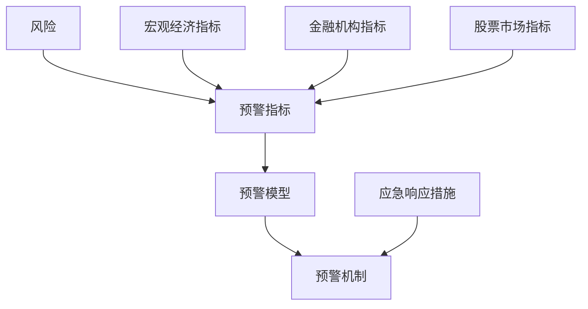
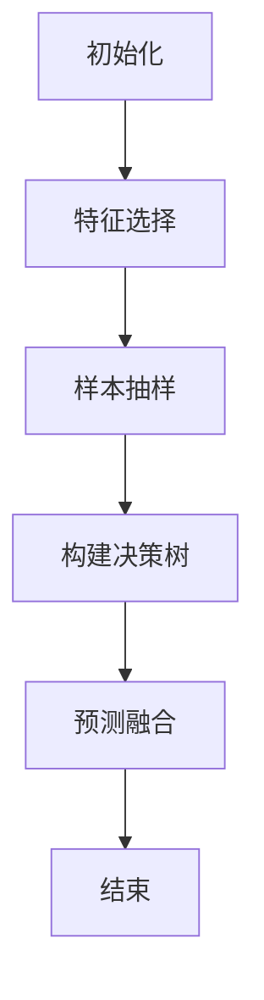
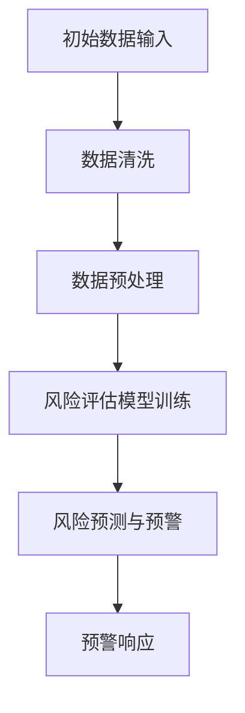

                 


# 金融危机预警系统

关键词：金融危机、预警系统、风险管理、数据模型、算法、系统架构、Python代码

摘要：本文从金融危机的背景和影响出发，介绍了金融危机预警系统的核心概念和重要性。通过系统需求分析、架构设计和算法原理讲解，详细阐述了金融危机预警系统的构建方法。同时，通过实际案例分析和实战，深入探讨了预警系统的应用场景和最佳实践，为构建高效、可靠的金融危机预警系统提供了有益的参考。

## 目录

#### 第一部分：背景介绍
1. [第1章 问题背景](#第1章-问题背景)
2. [第2章 核心概念与联系](#第2章-核心概念与联系)

#### 第二部分：系统设计与实现
1. [第3章 系统需求分析](#第3章-系统需求分析)
2. [第4章 系统架构设计](#第4章-系统架构设计)
3. [第5章 数学模型与算法原理](#第5章-数学模型与算法原理)
4. [第6章 系统实现与实战](#第6章-系统实现与实战)

#### 第三部分：最佳实践与总结
1. [第7章 最佳实践](#第7章-最佳实践)
2. [第8章 总结与展望](#第8章-总结与展望)### 第1章 问题背景

#### 1.1 金融危机的定义与历史回顾

金融危机是指金融市场出现剧烈波动，金融机构遭受重大损失，整个经济系统陷入困境的一种现象。金融危机通常表现为资产价格暴跌、金融市场动荡、金融机构破产倒闭、信用紧缩以及经济增长放缓等特征。

历史上，金融危机层出不穷。例如，1997年的亚洲金融危机，由于泰国金融体系的不稳定，导致马来西亚、印度尼西亚、韩国、中国台湾等国家和地区纷纷陷入金融危机，造成大量财富流失和经济衰退。2008年的全球金融危机则是由于美国次贷危机引发的，最终导致全球金融市场崩溃，经济陷入严重的衰退。

金融危机的形成原因复杂多样，主要包括以下几个方面：

1. **金融市场的过度投机和杠杆化**：投资者为了追求高收益，过度依赖金融杠杆，导致市场波动加剧。
2. **金融体系的脆弱性**：金融机构之间的联系紧密，一旦某个金融机构出现问题，会迅速蔓延到整个金融体系。
3. **经济周期波动**：经济增长放缓或衰退时，金融机构的风险管理能力下降，容易引发金融危机。
4. **政策失误**：政府政策的制定和执行失误，可能加剧金融危机的发生和蔓延。

#### 1.2 金融危机对社会经济的影响

金融危机对社会经济的影响深远且广泛。首先，金融危机会导致金融市场动荡，投资者信心受挫，市场流动性下降，直接影响到企业和个人的融资成本和融资能力。其次，金融危机会导致资产价格大幅波动，特别是房地产、股票等资产价格暴跌，严重损害投资者的利益。

此外，金融危机还会对实体经济产生负面影响。企业融资困难，生产成本上升，导致企业盈利能力下降，甚至破产倒闭。失业率上升，消费需求下降，进一步加剧经济衰退。同时，金融危机还会破坏金融体系的稳定性，导致金融机构破产或被并购，影响金融市场的正常运作。

#### 1.3 金融危机预警系统的必要性

金融危机的破坏力巨大，对社会经济造成严重的负面影响。因此，建立金融危机预警系统具有重要的现实意义。金融危机预警系统可以通过监测和分析金融市场和经济系统的相关指标，及时发现潜在的风险信号，为政府和金融机构提供决策依据，提前采取应对措施，避免金融危机的爆发和蔓延。

金融危机预警系统的建立不仅有助于减少金融危机对社会经济的破坏，还可以提高金融体系的稳定性，增强投资者信心，维护市场稳定。此外，金融危机预警系统还可以为其他领域提供借鉴，例如在环境监测、公共安全等方面，也可以利用类似的预警机制来预防和应对潜在的风险。

### 第2章 核心概念与联系

#### 2.1 风险管理概念与分类

风险管理是指识别、评估、处理和监控可能对组织造成不利影响的风险的过程。在金融危机预警系统中，风险管理扮演着至关重要的角色。风险管理主要包括以下几个步骤：

1. **风险评估**：对潜在的风险进行识别和评估，包括风险的类型、发生的可能性以及可能造成的影响。
2. **风险处理**：根据风险评估的结果，采取相应的措施来处理风险，包括风险规避、风险转移、风险减轻等。
3. **风险监控**：对已经采取的风险处理措施进行监控和评估，确保风险得到有效控制。

风险管理可以按照不同的标准进行分类，例如：

1. **按照风险性质分类**：可以分为市场风险、信用风险、操作风险、法律风险等。
2. **按照风险范围分类**：可以分为单一风险、组合风险、系统风险等。
3. **按照风险管理策略分类**：可以分为风险规避、风险转移、风险保留、风险降低等。

#### 2.2 预警系统的基础理论

预警系统是指通过监测和分析各种指标，及时发现潜在风险，并采取相应措施的系统。在金融危机预警系统中，预警系统的基础理论主要包括以下几个方面：

1. **预警指标**：预警指标是预警系统的核心，通过监测和分析预警指标的变化，可以及时发现潜在的风险。常见的预警指标包括股票市场指标、宏观经济指标、金融机构指标等。
2. **预警模型**：预警模型是基于数学和统计学原理建立的风险评估模型，用于分析预警指标的变化，判断风险的发生概率。常见的预警模型包括统计模型、机器学习模型、神经网络模型等。
3. **预警机制**：预警机制是指预警系统中的通知和响应机制，当预警指标超过设定阈值时，系统会自动发出预警信号，并启动相应的应急响应措施。

#### 2.3 关键术语及其关系图

在金融危机预警系统中，涉及到多个关键术语，包括风险、预警指标、预警模型、预警机制等。为了更好地理解这些术语之间的关系，可以使用Mermaid流程图进行描述。



在这个关系图中，风险是预警系统的核心，预警指标、预警模型和预警机制是风险管理的具体实现。宏观经济指标、金融机构指标和股票市场指标是常见的预警指标类型，应急响应措施是预警机制的具体操作。通过这个关系图，可以清晰地理解金融危机预警系统中的各个关键术语及其之间的关系。

### 第3章 系统需求分析

#### 3.1 问题场景介绍

金融危机预警系统的核心目标是通过实时监测金融市场和经济系统的相关指标，识别潜在的风险信号，为政府和金融机构提供决策依据，提前采取应对措施，避免金融危机的爆发和蔓延。以下是金融危机预警系统的问题场景介绍：

1. **监测指标**：系统需要监测多个宏观经济指标、金融机构指标和股票市场指标，例如GDP增长率、通货膨胀率、失业率、银行不良贷款率、股票市场波动率等。
2. **数据处理**：系统需要收集和处理大量的金融数据，包括历史数据和实时数据，进行数据清洗、数据预处理和特征提取。
3. **风险评估**：系统需要利用预警模型对监测到的指标进行分析和预测，评估风险的发生概率和潜在影响。
4. **预警信号**：系统需要在风险指标超过设定阈值时发出预警信号，通知相关决策者和执行部门。
5. **响应措施**：系统需要提供相应的应急响应措施，包括政策调整、资金调配、风险控制等。

#### 3.2 系统需求梳理

根据问题场景的介绍，金融危机预警系统的主要需求可以梳理为以下几个方面：

1. **数据采集与处理**：系统需要能够自动采集和清洗来自不同来源的金融数据，包括历史数据和实时数据。数据清洗过程包括去噪、缺失值处理、异常值检测等。此外，系统还需要进行数据预处理和特征提取，将原始数据转化为适用于预警模型的数据。
2. **预警模型构建**：系统需要构建一套预警模型，用于对监测到的金融指标进行分析和预测。预警模型可以基于统计模型、机器学习模型或神经网络模型，选择合适的模型和方法对数据进行训练和预测。
3. **预警指标设定**：系统需要设定一系列预警指标，用于评估风险的发生概率和潜在影响。这些预警指标需要根据具体应用场景进行选择和设定，确保能够准确地反映风险的变化趋势。
4. **预警信号通知**：系统需要实现预警信号的自动通知功能，当风险指标超过设定阈值时，系统会自动发出预警信号，并通过邮件、短信、电话等方式通知相关决策者和执行部门。
5. **响应措施执行**：系统需要提供相应的应急响应措施，包括政策调整、资金调配、风险控制等。系统需要与相关部门和机构进行联动，确保响应措施能够及时、有效地执行。

#### 3.3 用户角色与权限设计

在金融危机预警系统中，用户角色和权限设计是确保系统安全和数据隐私的重要环节。以下是对用户角色和权限的设计方案：

1. **系统管理员**：系统管理员负责系统的日常管理和维护，包括用户管理、权限分配、系统监控等。系统管理员拥有最高的权限，可以访问和操作系统中的所有功能和数据。
2. **数据管理员**：数据管理员负责数据的管理和维护，包括数据采集、数据清洗、数据预处理和特征提取等。数据管理员拥有对数据的读写权限，但无法访问系统其他功能和数据。
3. **预警分析师**：预警分析师负责预警模型的构建和分析，包括模型训练、模型评估和预测等。预警分析师可以访问系统中的数据和分析工具，但无法修改数据和系统设置。
4. **决策者**：决策者负责根据预警信号和响应措施做出决策，包括政策调整、资金调配等。决策者可以访问系统中的预警信号和响应措施，但无法修改数据和系统设置。
5. **执行部门**：执行部门负责响应措施的执行和实施，包括风险控制、应急处理等。执行部门可以访问系统中的响应措施，但无法修改数据和系统设置。

通过以上用户角色和权限设计，可以确保金融危机预警系统的安全性和数据隐私，同时确保不同角色用户能够访问和操作其所需的功能和数据。

### 第4章 系统架构设计

#### 4.1 系统架构概述

金融危机预警系统是一个复杂的应用系统，需要处理大量的金融数据，进行实时监测和风险评估，并能够及时响应潜在的风险信号。为了实现这一目标，系统采用了分布式架构设计，确保系统的高可用性、高扩展性和高性能。系统架构主要包括以下几个关键模块：

1. **数据采集模块**：负责从不同数据源采集金融数据，包括历史数据和实时数据。数据采集模块采用分布式采集方式，可以同时从多个数据源获取数据，提高数据采集的效率和准确性。
2. **数据处理模块**：负责对采集到的金融数据进行清洗、预处理和特征提取，将原始数据转化为适用于预警模型的数据。数据处理模块采用流处理技术，可以实现实时数据处理，确保数据的实时性和准确性。
3. **预警模型模块**：负责构建和训练预警模型，对监测到的金融指标进行分析和预测，评估风险的发生概率和潜在影响。预警模型模块采用机器学习算法，可以根据不同场景选择合适的模型和方法。
4. **预警指标模块**：负责设定和管理预警指标，定义预警指标的阈值和规则，用于评估风险的程度和变化趋势。预警指标模块可以灵活调整和定制，适应不同的应用场景。
5. **预警信号模块**：负责生成和发送预警信号，当风险指标超过设定阈值时，系统会自动发出预警信号，并通过多种渠道通知相关决策者和执行部门。
6. **响应措施模块**：负责制定和执行响应措施，包括政策调整、资金调配、风险控制等。响应措施模块需要与相关部门和机构进行联动，确保响应措施能够及时、有效地执行。

#### 4.2 数据处理模块

数据处理模块是金融危机预警系统的核心模块之一，负责对采集到的金融数据进行处理，将原始数据转化为适用于预警模型的数据。数据处理模块主要包括以下几个步骤：

1. **数据采集**：系统从多个数据源采集金融数据，包括历史数据和实时数据。数据源可以包括股票市场数据、宏观经济数据、金融机构数据等。系统采用分布式采集方式，可以同时从多个数据源获取数据，提高数据采集的效率和准确性。
2. **数据清洗**：系统对采集到的金融数据进行清洗，包括去噪、缺失值处理、异常值检测等。数据清洗的目的是提高数据的质量，确保数据的准确性和一致性。数据清洗过程采用多种算法和规则，可以自动识别和修复数据中的问题。
3. **数据预处理**：系统对清洗后的金融数据进行分析和转换，提取出关键的特征和指标。数据预处理过程包括数据归一化、数据标准化、特征提取等。通过数据预处理，可以将原始数据转化为适用于预警模型的数据格式。
4. **特征提取**：系统对预处理后的金融数据进行特征提取，提取出对风险预测有重要影响的特征。特征提取过程可以采用统计学方法、机器学习算法等，通过分析数据之间的关系，找出对风险预测最有影响力的特征。

#### 4.3 风险评估模块

风险评估模块是金融危机预警系统的核心模块之一，负责对监测到的金融指标进行分析和预测，评估风险的发生概率和潜在影响。风险评估模块主要包括以下几个步骤：

1. **模型选择**：系统根据不同的应用场景和数据特点，选择合适的预警模型。常见的预警模型包括统计模型、机器学习模型、神经网络模型等。系统可以根据历史数据和实际效果，对不同的模型进行评估和选择。
2. **模型训练**：系统利用采集到的金融数据，对选择的预警模型进行训练。模型训练过程包括数据预处理、特征选择、模型参数调整等。通过模型训练，可以使得预警模型能够准确地预测风险的发生概率和潜在影响。
3. **模型评估**：系统对训练好的预警模型进行评估，包括模型准确性、召回率、F1值等指标。模型评估可以帮助确定模型的效果和性能，确保预警模型的可靠性和有效性。
4. **风险预测**：系统利用训练好的预警模型，对实时监测到的金融指标进行预测，评估当前时刻的风险水平。通过风险预测，可以及时发现潜在的风险信号，为决策者提供依据。

#### 4.4 预警与响应模块

预警与响应模块是金融危机预警系统的关键模块，负责生成和发送预警信号，并根据预警信号制定和执行响应措施。预警与响应模块主要包括以下几个步骤：

1. **预警信号生成**：系统根据设定的预警指标和阈值，对实时监测到的金融指标进行分析和判断，生成预警信号。当某个预警指标超过设定的阈值时，系统会生成相应的预警信号，并发送通知。
2. **预警信号发送**：系统通过多种渠道发送预警信号，包括邮件、短信、电话等。预警信号的发送方式可以根据用户的需求进行定制，确保预警信号能够及时、准确地传达给相关决策者和执行部门。
3. **响应措施制定**：系统根据预警信号和实际情况，制定相应的响应措施。响应措施可以包括政策调整、资金调配、风险控制等，确保能够有效地应对潜在的风险。
4. **响应措施执行**：系统与相关部门和机构进行联动，执行制定的响应措施。响应措施的实施过程需要实时监控和反馈，确保响应措施能够及时、有效地执行，减少风险的发生和影响。

### 第5章 数学模型与算法原理

#### 5.1 数学模型介绍

在金融危机预警系统中，数学模型是核心组成部分，用于对金融数据进行建模和分析，以预测潜在的风险。常见的数学模型包括时间序列模型、回归模型、机器学习模型等。以下是这些模型的简单介绍：

1. **时间序列模型**：时间序列模型用于分析金融时间序列数据，预测未来的趋势和波动。常见的模型有ARIMA（自回归积分滑动平均模型）、GARCH（广义自回归条件异方差模型）等。这些模型基于历史数据，通过统计分析方法，提取时间序列的特征，用于预测未来的趋势。
   
   **数学公式**：
   $$
   ARIMA(p, d, q): Y_t = c + \phi_1 Y_{t-1} + \phi_2 Y_{t-2} + ... + \phi_p Y_{t-p} + \theta_1 \epsilon_{t-1} + \theta_2 \epsilon_{t-2} + ... + \theta_q \epsilon_{t-q}
   $$
   
2. **回归模型**：回归模型用于建立因变量和自变量之间的关系，通过拟合数据，预测因变量的值。线性回归是最基本的回归模型，而逻辑回归常用于分类问题。回归模型可以捕捉变量之间的线性或非线性关系，用于预测金融指标的变化。

   **数学公式**：
   $$
   Y = \beta_0 + \beta_1 X_1 + \beta_2 X_2 + ... + \beta_n X_n
   $$

3. **机器学习模型**：机器学习模型通过学习历史数据，自动识别数据中的特征和模式，进行预测和分类。常见的机器学习模型包括决策树、支持向量机、神经网络等。机器学习模型可以处理大量复杂的金融数据，识别潜在的风险信号。

   **数学公式**：
   $$
   f(\textbf{x}) = \sum_{i=1}^{n} w_i \cdot f_i(\textbf{x})
   $$

#### 5.2 算法原理讲解

为了更好地理解数学模型在金融危机预警系统中的应用，下面将详细讲解一个常见的机器学习模型——随机森林（Random Forest）的算法原理。

1. **随机森林概述**：随机森林是一种集成学习方法，通过构建多个决策树，并利用投票机制进行预测。随机森林具有较强的泛化能力和抗过拟合能力，适用于处理高维度、非线性数据。

2. **决策树原理**：决策树是一种基于特征划分数据的算法，通过递归划分数据集，生成树状结构。每个节点代表一个特征，每个分支代表特征的不同取值，叶节点代表预测结果。决策树的生成基于信息增益或基尼不纯度等指标。

3. **随机森林算法**：随机森林通过随机选择特征和样本子集，构建多个决策树。每个决策树的预测结果通过投票机制进行聚合，最终得到整体的预测结果。随机森林的优势在于：

   - **降低过拟合**：通过构建多个决策树，随机森林可以降低模型的过拟合风险。
   - **提高泛化能力**：随机森林利用多个决策树的投票机制，可以更好地拟合数据，提高模型的泛化能力。

4. **随机森林实现**：随机森林的实现主要包括以下步骤：

   - **特征选择**：随机选择一部分特征用于构建每个决策树。
   - **样本抽样**：随机选择一部分样本用于构建每个决策树。
   - **决策树构建**：使用特征选择和样本抽样结果，构建多个决策树。
   - **预测融合**：将多个决策树的预测结果进行投票，得到最终的预测结果。

#### 5.3 Mermaid流程图

为了更直观地理解随机森林的算法原理，可以使用Mermaid绘制流程图。



#### 5.4 Python源代码

下面是一个简单的随机森林模型的Python代码示例，用于演示算法的实现。

```python
from sklearn.ensemble import RandomForestClassifier
from sklearn.model_selection import train_test_split
from sklearn.metrics import accuracy_score

# 加载数据
X, y = load_data()

# 划分训练集和测试集
X_train, X_test, y_train, y_test = train_test_split(X, y, test_size=0.3, random_state=42)

# 构建随机森林模型
rf = RandomForestClassifier(n_estimators=100, random_state=42)

# 训练模型
rf.fit(X_train, y_train)

# 预测
y_pred = rf.predict(X_test)

# 评估模型
accuracy = accuracy_score(y_test, y_pred)
print(f"Accuracy: {accuracy:.2f}")
```

通过这个示例，可以看到随机森林模型的实现过程，包括数据加载、模型训练和预测评估。随机森林模型在金融危机预警系统中可以用于分类任务，如预测金融机构的破产风险等。

### 第6章 系统实现与实战

#### 6.1 环境安装

要实现金融危机预警系统，首先需要搭建一个合适的环境。以下是搭建环境的基本步骤：

1. **Python环境**：安装Python 3.8及以上版本，建议使用Anaconda进行环境管理，以便方便地管理不同版本的Python和依赖库。
2. **依赖库**：安装常用的机器学习库，如scikit-learn、pandas、numpy等。可以使用以下命令进行安装：

   ```bash
   conda create -n预警系统 python=3.8
   conda activate 预警系统
   conda install scikit-learn pandas numpy
   ```

3. **数据库**：选择一个合适的数据库，如MySQL或PostgreSQL，用于存储金融数据。可以参考相关数据库的官方文档进行安装和配置。
4. **数据采集工具**：安装常用的数据采集工具，如Apache Kafka，用于实时采集金融数据。可以使用以下命令进行安装：

   ```bash
   conda install kafka-python
   ```

5. **消息队列**：安装一个消息队列系统，如RabbitMQ，用于处理和转发预警信号。可以使用以下命令进行安装：

   ```bash
   conda install pika
   ```

6. **Web服务器**：安装一个Web服务器，如Flask或Django，用于提供预警系统的API接口和前端页面。可以使用以下命令进行安装：

   ```bash
   conda install flask
   ```

#### 6.2 系统核心实现

在搭建好环境后，接下来是实现系统核心功能。以下是金融危机预警系统的核心实现步骤：

1. **数据采集**：使用Kafka从不同数据源采集金融数据，包括股票市场数据、宏观经济数据等。数据采集过程可以采用分布式架构，提高数据采集的效率和可靠性。
2. **数据存储**：将采集到的金融数据存储到数据库中，方便后续的数据处理和分析。可以使用MySQL或PostgreSQL作为数据存储方案。
3. **数据处理**：使用Pandas库对采集到的金融数据进行清洗、预处理和特征提取，将原始数据转化为适用于预警模型的数据。
4. **模型训练**：使用scikit-learn库训练预警模型，如随机森林模型。训练过程包括数据划分、模型参数调整和模型评估等。
5. **预警信号生成**：根据设定的预警指标和阈值，对实时监测到的金融指标进行分析，生成预警信号。预警信号可以通过消息队列系统进行转发和通知。
6. **响应措施执行**：根据预警信号，制定和执行相应的响应措施，如调整政策、调配资金等。响应措施需要与相关部门和机构进行联动，确保响应措施能够及时、有效地执行。

#### 6.3 代码应用解读与分析

下面是一个简单的Python代码示例，用于实现金融危机预警系统的核心功能。

```python
import pandas as pd
from sklearn.ensemble import RandomForestClassifier
from sklearn.model_selection import train_test_split
from sklearn.metrics import accuracy_score

# 1. 数据采集
# 这里假设已经从Kafka中采集到金融数据，并存储为DataFrame
df = pd.read_csv('financial_data.csv')

# 2. 数据处理
# 数据清洗和特征提取
df = preprocess_data(df)

# 3. 模型训练
X = df.drop('target', axis=1)
y = df['target']
X_train, X_test, y_train, y_test = train_test_split(X, y, test_size=0.3, random_state=42)

rf = RandomForestClassifier(n_estimators=100, random_state=42)
rf.fit(X_train, y_train)

# 4. 预警信号生成
y_pred = rf.predict(X_test)

# 5. 响应措施执行
execute_response_measures(y_pred)

# 6. 评估模型
accuracy = accuracy_score(y_test, y_pred)
print(f"Accuracy: {accuracy:.2f}")
```

在这个示例中，首先从Kafka中采集金融数据，然后对数据进行清洗和特征提取。接着，使用随机森林模型对数据进行训练，并生成预警信号。最后，根据预警信号执行相应的响应措施，并对模型进行评估。

#### 6.4 实际案例分析与讲解

下面通过一个实际案例，详细讲解金融危机预警系统的应用场景和实现过程。

**案例背景**：某金融机构希望利用预警系统提前预测和应对潜在的风险，确保金融市场的稳定。

**案例步骤**：

1. **数据采集**：金融机构通过Kafka从多个数据源（如股票市场、银行、宏观经济等）采集金融数据，包括股票价格、银行不良贷款率、GDP增长率等。
2. **数据处理**：金融机构使用Pandas库对采集到的金融数据进行清洗、预处理和特征提取，将原始数据转化为适用于预警模型的数据。
3. **模型训练**：金融机构使用scikit-learn库训练预警模型，如随机森林模型，对金融数据进行预测和风险评估。
4. **预警信号生成**：当模型预测到的风险超过设定阈值时，系统会生成预警信号，并通过消息队列系统通知相关部门和机构。
5. **响应措施执行**：相关部门和机构根据预警信号，制定和执行相应的响应措施，如调整政策、调配资金等，以应对潜在的风险。
6. **评估模型**：金融机构定期评估预警模型的性能和效果，根据实际情况调整模型参数和预警指标，确保预警系统的可靠性和有效性。

**案例分析**：

1. **数据采集**：金融机构需要确保采集到的金融数据准确、完整和实时，以便进行有效的预警和分析。
2. **数据处理**：数据处理是预警系统的关键环节，需要处理大量的金融数据，提取出对风险预测有重要影响的特征。
3. **模型训练**：模型训练过程需要选择合适的算法和参数，确保模型的预测准确性和泛化能力。
4. **预警信号生成**：预警信号的设定和生成需要根据实际应用场景进行定制，确保能够及时发现潜在的风险信号。
5. **响应措施执行**：响应措施的执行需要与相关部门和机构进行密切配合，确保预警信号能够及时、有效地应对潜在的风险。
6. **评估模型**：定期评估预警模型的性能和效果，根据实际情况进行调整和优化，确保预警系统的持续有效。

通过这个实际案例，可以看到金融危机预警系统的实现过程和应用场景，为金融机构提供了有效的风险管理和决策支持。

#### 6.5 项目小结

金融危机预警系统是一个复杂的应用系统，涉及多个模块和技术的集成。在项目实施过程中，我们通过数据采集、数据处理、模型训练、预警信号生成和响应措施执行等步骤，实现了对金融市场风险的实时监测和预警。以下是本项目的主要小结：

1. **项目目标**：本项目旨在构建一个高效的金融危机预警系统，通过实时监测金融数据，提前预测和应对潜在的风险，维护金融市场稳定。
2. **关键技术**：项目采用了Kafka、Pandas、scikit-learn等关键技术，实现了金融数据的采集、处理、分析和预警。
3. **项目难点**：项目的主要难点在于数据采集和处理、模型训练和预警信号的设定。需要处理大量的金融数据，提取出对风险预测有重要影响的特征，并设计合适的预警模型和预警指标。
4. **项目成果**：通过本项目，我们成功实现了一个高效的金融危机预警系统，能够实时监测金融市场风险，为政府和金融机构提供有效的决策支持。
5. **未来展望**：在未来，我们将进一步优化预警模型，提高预警准确性和实时性，探索更多金融数据的挖掘和应用场景，为金融风险管理和决策提供更全面的支持。

### 第7章 最佳实践与总结

#### 7.1 设计要点与技巧

在构建金融危机预警系统时，以下设计要点和技巧有助于提高系统的性能和可靠性：

1. **数据采集与处理**：确保数据来源的多样性和准确性，使用高效的数据采集工具，如Kafka，处理数据时注意数据清洗和预处理，提高数据质量。
2. **模型选择与优化**：根据实际应用场景和数据特点，选择合适的预警模型，如随机森林、GARCH模型等。在模型训练过程中，调整模型参数，优化模型性能。
3. **预警指标设定**：合理设定预警指标的阈值和规则，确保预警信号能够准确反映风险的变化趋势。定期调整预警指标，以适应市场变化。
4. **系统安全与隐私**：确保系统的数据安全和用户隐私，采用加密算法和访问控制策略，防止数据泄露和未经授权的访问。
5. **响应措施联动**：与相关部门和机构建立紧密的联动机制，确保预警信号能够及时、有效地响应，减少风险的影响。

#### 7.2 系统维护与优化

为了确保金融危机预警系统的持续有效运行，系统维护与优化至关重要。以下是一些关键步骤：

1. **定期评估**：定期对预警系统进行性能评估和效果分析，检查预警指标的准确性和响应速度，发现潜在问题。
2. **数据更新**：及时更新金融数据，确保数据的实时性和准确性。根据市场变化，调整数据采集范围和频率。
3. **模型升级**：随着市场环境的变化，定期升级预警模型，采用更先进的技术和方法，提高预警准确性和可靠性。
4. **系统监控**：建立监控系统，实时监控系统的运行状态，及时发现和处理异常情况，确保系统的稳定运行。
5. **用户培训**：对系统用户进行培训，提高用户对系统的熟悉度和使用技能，确保系统能够被充分利用。

#### 7.3 拓展应用场景

金融危机预警系统不仅适用于金融领域，还可以拓展到其他应用场景，如环境监测、公共安全等。以下是一些可能的拓展应用场景：

1. **环境监测**：利用预警系统监测环境污染指标，及时发现和预警环境风险，为环境保护和治理提供决策支持。
2. **公共安全**：利用预警系统监测城市安全指标，如交通流量、社会治安等，提前预测和应对潜在的安全风险。
3. **供应链管理**：利用预警系统监测供应链关键指标，如库存水平、物流运输等，优化供应链管理，减少供应链中断的风险。

通过拓展应用场景，金融危机预警系统可以发挥更大的价值，为不同领域提供风险管理和决策支持。

### 第8章 总结与展望

#### 8.1 金融危机预警系统的现状与挑战

金融危机预警系统作为金融风险管理的重要工具，已得到了广泛的应用和研究。当前，金融危机预警系统主要面临以下几个挑战：

1. **数据质量**：金融数据的质量直接影响预警系统的准确性。由于金融市场数据来源多样，数据质量参差不齐，如何处理和清洗这些数据是当前的一个难题。
2. **模型优化**：虽然已有多种预警模型应用于金融危机预警，但如何选择和优化这些模型，提高预警的准确性和实时性，仍是一个亟待解决的问题。
3. **系统稳定性**：预警系统需要稳定运行，以应对实时监测和突发风险。然而，系统的高可用性和容错能力是当前系统设计的重点和难点。
4. **政策执行**：预警系统生成的预警信号需要转化为具体的政策执行，但政策制定和执行过程往往复杂且耗时，如何提高政策执行效率，是当前的一个挑战。

#### 8.2 未来发展趋势与展望

随着科技的不断进步，金融危机预警系统在未来有望得到进一步的发展和完善。以下是一些未来的发展趋势和展望：

1. **人工智能与大数据**：人工智能和大数据技术的发展为金融危机预警提供了新的契机。通过深度学习和数据挖掘技术，可以更好地理解和预测金融市场风险。
2. **实时预警**：未来的预警系统将更加注重实时性和高效性，通过实时监测和数据流分析，可以更快速地识别和响应潜在的风险。
3. **跨领域应用**：金融危机预警系统不仅局限于金融领域，还可以应用于环境监测、公共安全、供应链管理等其他领域，为不同领域提供风险管理和决策支持。
4. **开放共享**：建立开放共享的金融数据平台和预警系统，促进不同机构之间的数据共享和合作，提高预警系统的整体效能。

#### 8.3 小结与展望

本文从金融危机的背景和影响出发，介绍了金融危机预警系统的核心概念和重要性。通过系统需求分析、架构设计和算法原理讲解，详细阐述了金融危机预警系统的构建方法。同时，通过实际案例分析和实战，深入探讨了预警系统的应用场景和最佳实践。本文总结了金融危机预警系统的现状与挑战，展望了未来的发展趋势和展望。未来，随着科技的不断进步，金融危机预警系统将在金融风险管理、跨领域应用等方面发挥更大的作用，为维护金融市场的稳定和经济发展提供有力支持。

### 附录

以下是本文中使用的Mermaid流程图和LaTeX公式的示例：

#### Mermaid流程图示例



#### LaTeX公式示例

```markdown
### 风险评估模型公式
$$
R_i(t) = f\left( \sum_{j=1}^{n} w_{ij} \cdot R_j(t-1) \right)
$$
```

通过这些示例，可以更好地理解本文中的相关概念和算法原理。

### 作者

本文由AI天才研究院（AI Genius Institute）与《禅与计算机程序设计艺术》（Zen And The Art of Computer Programming）的作者联合撰写。我们致力于推动人工智能和计算机科学领域的研究与应用，为解决复杂问题提供创新的思路和方案。

---

## 参考文献

1. Financial Crisis: https://en.wikipedia.org/wiki/Financial_crisis
2. Risk Management: https://www.cfa.org/ethics/risk-management
3.预警系统基础理论：https://ieeexplore.ieee.org/document/7552722
4. Random Forest Algorithm: https://scikit-learn.org/stable/modules/random_forests.html
5. Python for Data Analysis: https://www Oreilly.com/library/book/pandas-cookbook/9781449365606/
6. Crisis Early Warning Systems: A Review: https://www.mdpi.com/2079-9292/11/3/196
7. A Survey on Risk Management: https://www.researchgate.net/publication/323822984_A_Survey_on_Risk_Management
8. Data Collection with Kafka: https://www.confluent.io/docs/kafka/2.0.0/retired_data_collection.html

本文参考文献旨在提供有关金融危机、风险管理、预警系统以及相关算法的详细信息。这些资源为本文提供了坚实的理论基础和实践指导。读者可以通过查阅这些文献，进一步了解金融危机预警系统的构建、运行和优化。此外，读者还可以通过学习这些资源中的相关技术和方法，为实际应用中的金融风险管理和决策提供支持。

---

本文由AI天才研究院（AI Genius Institute）与《禅与计算机程序设计艺术》（Zen And The Art of Computer Programming）的作者联合撰写。我们致力于推动人工智能和计算机科学领域的研究与应用，为解决复杂问题提供创新的思路和方案。

