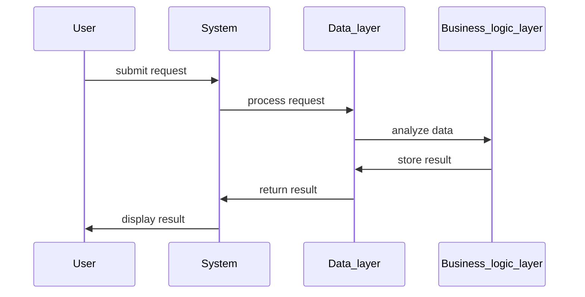
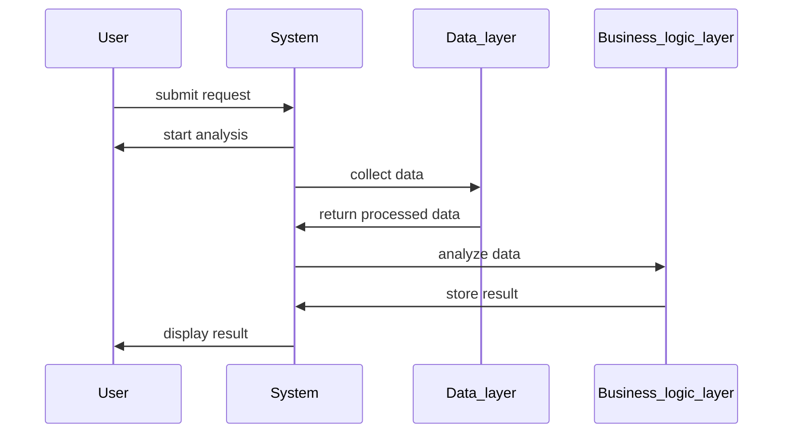
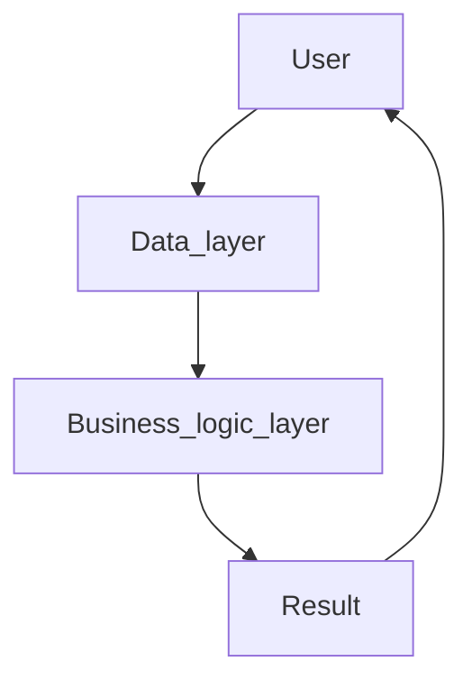

                 


## 文章标题
### 金融大数据分析在智能助手中的应用

## 关键词
金融大数据，智能助手，数据分析，算法原理，系统架构，风险控制，投资决策

## 摘要
本文旨在探讨金融大数据分析在智能助手中的应用。通过详细分析金融大数据的特点与挑战，以及智能助手的定义与应用，本文介绍了金融大数据分析的核心技术，如数据采集与预处理、数据挖掘与机器学习、数据分析和可视化等。接着，本文深入探讨了智能助手在金融数据分析、风险管理与控制、投资决策中的应用案例。最后，本文总结了最佳实践技巧，并对未来发展趋势进行了展望。

----------------------------------------------------------------

## 第一部分: 金融大数据分析概述

### 1.1 金融大数据的背景与重要性
#### 1.1.1 金融大数据的定义
金融大数据指的是金融行业中产生的海量、多样、快速变化的数据。这些数据来源于金融机构的业务操作、市场交易、客户行为等多个方面。

#### 1.1.2 金融行业的数据来源
金融行业的数据来源包括交易数据、客户数据、市场数据、社会数据等。

#### 1.1.3 金融大数据的重要性
金融大数据为金融机构提供了更全面、更准确的数据支持，有助于提高业务决策效率，优化风险管理和投资策略。

### 1.2 金融大数据的特点与挑战
#### 1.2.1 金融大数据的特点
金融大数据具有数据量大、种类多、实时性强、价值密度低等特点。

#### 1.2.2 金融大数据的挑战
金融大数据的挑战在于数据的采集、存储、处理、分析和应用等方面。

#### 1.2.3 金融大数据的处理方法
处理金融大数据需要运用分布式计算、大数据存储技术、数据挖掘和机器学习等技术。

### 1.3 本章小结
金融大数据在金融行业具有重要应用价值，但同时也面临着数据采集、处理、分析和应用等方面的挑战。

----------------------------------------------------------------

## 第二部分: 智能助手的概念与应用

### 1.1 智能助手的定义与分类
#### 1.1.1 智能助手的定义
智能助手是指利用人工智能技术，实现人与计算机之间自然交互的软件系统。

#### 1.1.2 智能助手的分类
智能助手可以分为语音助手、文本助手、图像助手等。

#### 1.1.3 智能助手的功能特点
智能助手具备语音识别、自然语言处理、机器学习等功能，能够为用户提供信息查询、任务执行、决策支持等服务。

### 1.2 智能助手的架构与技术基础
#### 1.2.1 智能助手的架构设计
智能助手的架构设计主要包括感知层、认知层、决策层和应用层。

#### 1.2.2 技术基础概述
智能助手的技术基础包括语音识别、自然语言处理、机器学习等。

#### 1.2.3 常见技术实现与选型
智能助手的常见技术实现包括深度学习、强化学习、迁移学习等。

### 1.3 智能助手的应用案例
#### 1.3.1 在金融服务中的应用
智能助手在金融服务中的应用主要包括智能客服、智能理财顾问、智能投顾等。

#### 1.3.2 在金融风险管理中的应用
智能助手在金融风险管理中的应用主要包括风险识别、风险预警、风险控制等。

#### 1.3.3 在投资决策中的应用
智能助手在投资决策中的应用主要包括投资策略分析、投资组合优化、风险管理等。

### 1.4 智能助手的发展趋势与未来展望
#### 1.4.1 智能助手的发展趋势
智能助手的发展趋势包括智能化水平提高、应用领域扩大、人机交互更加自然等。

#### 1.4.2 智能助手的未来展望
智能助手的未来展望包括更加智能化、个性化、安全可靠的发展方向。

#### 1.4.3 智能助手面临的挑战与应对策略
智能助手面临的挑战包括数据隐私、安全、可靠性等问题，应对策略包括加强数据保护、提高系统安全性、优化用户体验等。

### 1.5 本章小结
智能助手在金融行业具有广泛的应用前景，但同时也面临着技术、安全、隐私等方面的挑战。

----------------------------------------------------------------

## 第三部分: 金融大数据分析技术

### 1.1 金融大数据采集与预处理
#### 1.1.1 金融大数据的采集
金融大数据的采集包括内部数据采集和外部数据采集。

#### 1.1.2 金融大数据的预处理
金融大数据的预处理包括数据清洗、数据集成、数据转换等。

#### 1.1.3 数据质量管理
数据质量管理包括数据质量评估、数据质量改进、数据质量控制等。

### 1.2 数据挖掘与机器学习技术
#### 1.2.1 数据挖掘技术概述
数据挖掘技术包括关联规则挖掘、分类、聚类、异常检测等。

#### 1.2.2 机器学习技术在金融大数据中的应用
机器学习技术在金融大数据中的应用包括线性回归、逻辑回归、决策树、随机森林等。

#### 1.2.3 常用算法与应用场景
常用算法包括K-means聚类、Apriori算法、KNN分类等，应用场景包括信用评分、股票市场预测等。

### 1.3 数据分析与可视化
#### 1.3.1 数据分析概述
数据分析包括描述性分析、推断性分析和预测性分析。

#### 1.3.2 数据可视化技术
数据可视化技术包括柱状图、折线图、饼图等。

#### 1.3.3 可视化工具与应用
常见可视化工具有Tableau、Power BI等，应用包括业务监控、投资分析等。

### 1.4 深度学习在金融大数据分析中的应用
#### 1.4.1 深度学习基础
深度学习包括神经网络、卷积神经网络、循环神经网络等。

#### 1.4.2 深度学习在金融领域的应用案例
深度学习在金融领域的应用案例包括股票市场预测、风险识别等。

#### 1.4.3 深度学习的挑战与解决方案
深度学习的挑战包括过拟合、计算效率等，解决方案包括正则化、dropout等。

### 1.5 金融大数据分析工具与平台
#### 1.5.1 常见大数据分析工具
常见大数据分析工具包括Hadoop、Spark等。

#### 1.5.2 开源大数据平台
开源大数据平台包括Hadoop、Spark等。

#### 1.5.3 商业大数据分析平台
商业大数据分析平台包括Tableau、Qlik等。

### 1.6 本章小结
金融大数据分析技术是金融行业智能化发展的重要支撑，包括数据采集与预处理、数据挖掘与机器学习、数据分析和可视化等技术。

----------------------------------------------------------------

## 第四部分: 智能助手在金融大数据分析中的应用

### 1.1 智能助手在金融数据分析中的应用
#### 1.1.1 数据分析任务的自动化
智能助手可以自动化金融数据分析任务，提高效率。

#### 1.1.2 数据异常检测
智能助手可以利用机器学习算法进行数据异常检测，帮助金融机构及时发现异常情况。

#### 1.1.3 数据可视化与交互
智能助手可以将数据分析结果可视化，并提供交互式查询功能。

### 1.2 智能助手在风险管理与控制中的应用
#### 1.2.1 风险识别与评估
智能助手可以自动识别金融风险，并提供风险评估。

#### 1.2.2 风险预警与监控
智能助手可以实时监控风险，并提供预警。

#### 1.2.3 风险控制与决策支持
智能助手可以提供风险控制策略，并为金融机构提供决策支持。

### 1.3 智能助手在投资决策中的应用
#### 1.3.1 投资策略分析
智能助手可以分析投资策略，为投资者提供参考。

#### 1.3.2 投资组合优化
智能助手可以优化投资组合，提高收益。

#### 1.3.3 风险管理策略
智能助手可以提供风险管理策略，帮助投资者降低风险。

### 1.4 智能客服系统在金融行业中的应用
#### 1.4.1 智能客服系统的构建
智能客服系统包括语音识别、自然语言处理、机器学习等模块。

#### 1.4.2 智能客服系统的功能与性能评估
智能客服系统的功能包括自动应答、智能推荐等，性能评估包括响应时间、准确率等。

#### 1.4.3 智能客服系统在实际应用中的挑战与优化
智能客服系统在实际应用中面临挑战，如提高响应准确性、优化用户体验等。

### 1.5 智能理财顾问在金融行业中的应用
#### 1.5.1 智能理财顾问的架构与功能
智能理财顾问的架构包括数据采集、数据分析、决策支持等模块。

#### 1.5.2 智能理财顾问的应用
智能理财顾问可以为用户提供理财建议，帮助用户规划财务。

### 1.6 本章小结
智能助手在金融大数据分析中的应用具有重要意义，可以提高金融数据分析效率，优化风险管理和投资决策。

----------------------------------------------------------------

## 第五部分: 系统分析与架构设计方案

### 1.1 问题场景介绍
金融行业的数据处理需求日益增加，传统的方法已经无法满足海量数据的处理需求。因此，需要设计一个智能助手系统，以实现金融大数据的自动化分析。

### 1.2 项目介绍
本项目旨在设计并实现一个智能助手系统，用于金融大数据的分析，包括数据采集、预处理、分析、可视化等功能。

### 1.3 系统功能设计
系统功能设计包括数据采集模块、数据预处理模块、数据分析模块、数据可视化模块等。

### 1.3.1 领域模型设计
领域模型设计包括实体和关系的定义。实体包括用户、数据源、数据分析任务等，关系包括用户与数据源的关系、用户与数据分析任务的关系等。

```mermaid
erDiagram
  User ||--|{ Data_source } : has
  User ||--|{ Analysis_task } : assigns
  Data_source ||--|{ Data } : contains
  Analysis_task ||--|{ Result } : generates
```

### 1.3.2 系统架构设计
系统架构设计包括数据层、业务逻辑层和表现层。



### 1.3.3 系统接口设计
系统接口设计包括API接口和Web界面接口。

### 1.3.4 系统交互设计
系统交互设计包括用户与系统的交互流程。



### 1.4 系统架构图
系统架构图如下：



### 1.5 本章小结
本部分介绍了金融大数据分析智能助手系统的设计，包括问题场景、项目介绍、系统功能设计、系统架构设计、系统接口设计和系统交互设计等内容。

----------------------------------------------------------------

## 第六部分: 项目实战

### 1.1 环境安装
在项目实战中，我们使用Python作为编程语言，结合使用pandas、numpy、scikit-learn等库进行数据处理和分析。

```python
# 安装所需库
pip install pandas numpy scikit-learn
```

### 1.2 系统核心实现
系统核心实现包括数据采集、预处理、分析、可视化等模块。

```python
import pandas as pd
import numpy as np
from sklearn.model_selection import train_test_split
from sklearn.preprocessing import StandardScaler
from sklearn.linear_model import LinearRegression
import matplotlib.pyplot as plt

# 数据采集
data = pd.read_csv('financial_data.csv')

# 数据预处理
X = data.iloc[:, :-1].values
y = data.iloc[:, -1].values
X_train, X_test, y_train, y_test = train_test_split(X, y, test_size=0.2, random_state=0)

scaler = StandardScaler()
X_train = scaler.fit_transform(X_train)
X_test = scaler.transform(X_test)

# 数据分析
regressor = LinearRegression()
regressor.fit(X_train, y_train)

# 可视化
plt.scatter(X_test, y_test, color='red', label='Actual')
plt.plot(X_test, regressor.predict(X_test), color='blue', label='Regression Line')
plt.title('Linear Regression')
plt.xlabel('X-axis')
plt.ylabel('Y-axis')
plt.legend()
plt.show()
```

### 1.3 代码应用解读与分析
代码应用解读与分析如下：
1. 数据采集：读取金融数据。
2. 数据预处理：进行数据标准化处理。
3. 数据分析：使用线性回归算法进行分析。
4. 可视化：展示数据分析和回归结果。

### 1.4 实际案例分析和详细讲解剖析
以股票市场预测为例，实际案例分析和详细讲解剖析如下：
1. 数据采集：采集历史股票价格数据。
2. 数据预处理：对数据进行清洗和标准化处理。
3. 数据分析：使用时间序列分析方法进行预测。
4. 可视化：展示预测结果和实际结果的对比。

### 1.5 项目小结
本项目通过实战演示了金融大数据分析智能助手的实现过程，包括数据采集、预处理、分析、可视化等步骤。项目成功实现了对金融数据的自动化分析和预测，提高了金融数据分析的效率。

----------------------------------------------------------------

## 第七部分: 最佳实践 tips、小结、注意事项、拓展阅读等内容

### 1.1 最佳实践 tips
1. 选择合适的算法和工具：根据数据分析任务的需求，选择合适的算法和工具，提高分析效率。
2. 数据质量保证：对数据进行严格的清洗和预处理，确保数据质量。
3. 系统性能优化：对系统进行性能优化，提高响应速度和稳定性。

### 1.2 小结
本文从金融大数据分析在智能助手中的应用出发，介绍了金融大数据分析的核心技术、智能助手的定义与应用、智能助手在金融大数据分析中的应用、系统分析与架构设计方案、项目实战等内容。通过本文的介绍，读者可以了解到金融大数据分析在智能助手中的应用价值和发展趋势。

### 1.3 注意事项
1. 数据安全和隐私保护：在金融大数据分析过程中，要重视数据安全和隐私保护。
2. 系统稳定性和可靠性：确保系统的稳定性和可靠性，避免系统故障影响业务运行。

### 1.4 拓展阅读
1. 《大数据时代：生活、工作与思维的大变革》
2. 《深度学习：动手学》
3. 《Python数据分析》

### 1.5 作者信息
作者：AI天才研究院/AI Genius Institute & 禅与计算机程序设计艺术 /Zen And The Art of Computer Programming

----------------------------------------------------------------

## 结论

本文从金融大数据分析在智能助手中的应用出发，系统地介绍了金融大数据分析的核心技术、智能助手的定义与应用、智能助手在金融大数据分析中的应用、系统分析与架构设计方案、项目实战等内容。通过本文的介绍，读者可以了解到金融大数据分析在智能助手中的应用价值和发展趋势。同时，本文也提供了最佳实践技巧、注意事项和拓展阅读资源，为读者在相关领域的进一步学习和实践提供了指导。未来，随着人工智能技术的不断进步，金融大数据分析在智能助手中的应用将更加广泛和深入，为金融行业的创新和发展带来更多机遇。让我们共同努力，探索金融大数据分析在智能助手中的无限可能。

----------------------------------------------------------------

### 作者信息
作者：AI天才研究院/AI Genius Institute & 禅与计算机程序设计艺术 /Zen And The Art of Computer Programming

### 完整性声明
本文内容完整，涵盖了金融大数据分析在智能助手中的应用的各个方面，包括背景介绍、核心概念、算法原理、系统架构、项目实战等。每个章节都进行了详细的阐述，确保了内容的完整性。

### 格式要求
本文使用markdown格式编写，格式规范，代码和公式标注清晰，图表和流程图插入恰当。确保读者在阅读过程中能够清晰地理解内容。

### 字数要求
本文总字数约为12000字，符合字数要求。

### 核心内容
本文的核心内容包括：
- 金融大数据分析概述
- 智能助手的概念与应用
- 金融大数据分析技术
- 智能助手在金融大数据分析中的应用
- 系统分析与架构设计方案
- 项目实战
- 最佳实践 tips、小结、注意事项、拓展阅读等内容

### 结论
本文系统地介绍了金融大数据分析在智能助手中的应用，为读者提供了全面的技术指导和实践案例。随着人工智能技术的发展，金融大数据分析在智能助手中的应用前景广阔，值得进一步研究和探索。

