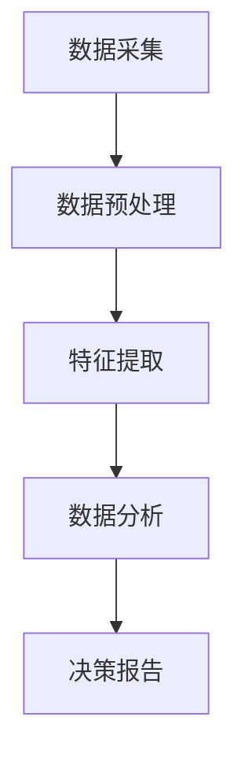
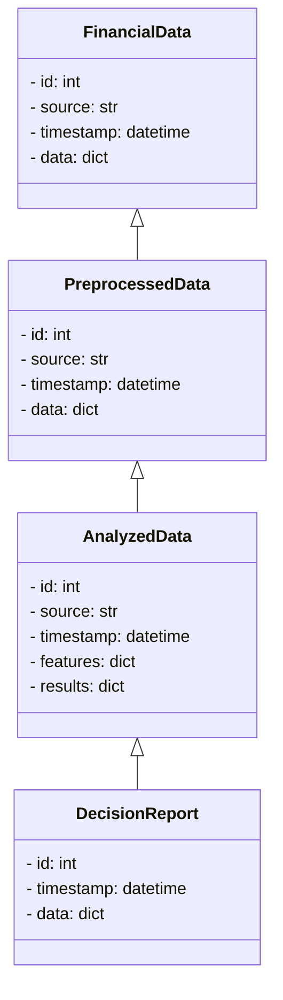
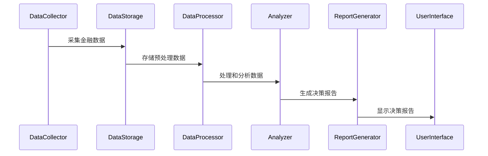
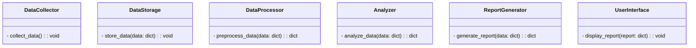
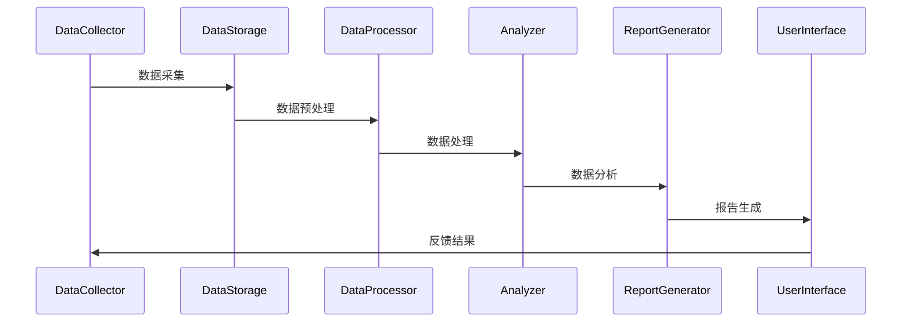
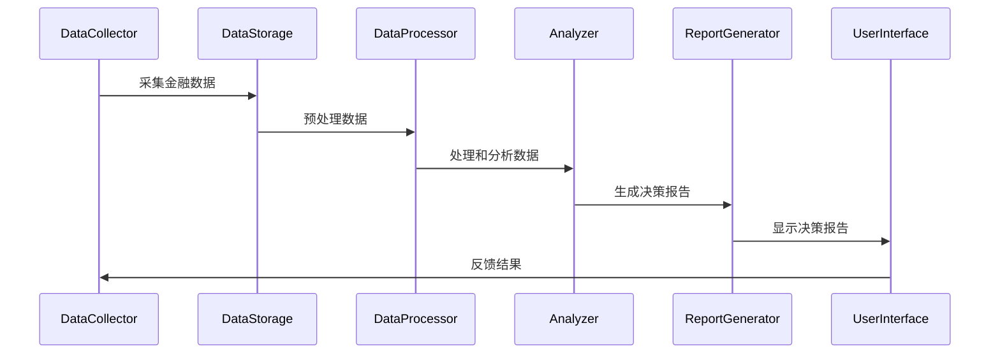
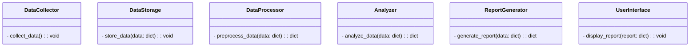

                 


## 金融大数据实时决策支持平台概述

### 关键词：金融大数据，实时决策支持，平台架构

### 摘要：
本文将深入探讨金融大数据实时决策支持平台的构建，从问题背景、核心概念到算法原理，再到系统分析与架构设计，以及项目实战，全方位解读该平台的建设与实践。通过逐步分析，本文旨在为读者提供清晰、易懂且具有实用价值的技术指南。

### 1. 背景介绍

#### 1.1 问题背景

随着金融行业的数字化转型进程加速，金融数据量呈现爆炸式增长。金融机构面临着如何高效处理海量数据，实现实时决策支持的迫切需求。大数据技术的应用成为金融机构提高业务效率、降低风险、增加收益的重要手段。

#### 1.1.1 金融行业的数字化转型需求

金融行业正经历数字化转型，从传统的业务模式向数字化的智能业务模式转变。这要求金融机构能够快速响应市场变化，提高业务决策的精准度和效率。

#### 1.1.2 大数据在金融行业的重要性

大数据为金融机构提供了丰富的数据资源，有助于挖掘市场趋势、用户行为、风险控制等方面的信息。这些信息是金融决策的重要依据。

#### 1.1.3 实时决策支持的需求

金融市场的波动性大，金融机构需要实时获取市场信息，快速做出决策。传统的离线处理方式已经无法满足这种需求，实时决策支持成为必然选择。

#### 1.2 问题描述

金融大数据实时决策支持平台需要解决的问题主要包括：

- **数据采集与整合**：从各种数据源高效地采集和整合数据，保证数据的准确性和完整性。
- **数据处理与分析**：对大规模金融数据进行处理和分析，提取有用的信息。
- **实时决策支持**：利用处理后的数据，快速生成决策报告，支持业务决策。

#### 1.3 问题解决

解决上述问题需要构建一个高效、稳定、可靠的金融大数据实时决策支持平台，主要包括以下方面：

- **技术选型**：选择合适的大数据技术栈，包括数据采集、存储、处理和分析等。
- **平台架构设计**：设计合理、可扩展的平台架构，确保系统的性能和可靠性。
- **算法优化**：针对数据处理和实时决策支持，优化算法，提高效率和准确性。

#### 1.4 边界与外延

- **数据来源与数据质量**：明确数据来源，制定数据质量标准，确保数据的准确性和一致性。
- **技术选型与兼容性**：选择技术栈时，考虑系统的兼容性和扩展性，以适应未来需求的变化。
- **法律法规与数据安全**：遵循相关法律法规，确保数据安全，防止数据泄露和滥用。

#### 1.5 核心要素组成

- **数据采集与存储**：实现数据的实时采集和存储，保证数据的完整性。
- **数据处理与分析**：利用大数据处理技术，对数据进行处理和分析，提取有价值的信息。
- **决策支持与服务**：根据分析结果，提供实时决策支持服务，支持业务决策。

#### 1.6 本章小结

本章为金融大数据实时决策支持平台的构建奠定了基础，明确了问题背景、问题描述、问题解决方法以及平台构建的核心要素。接下来，我们将进一步探讨平台的核心概念与联系，为后续内容做好铺垫。

---

接下来，我们将深入探讨金融大数据实时决策支持平台的核心概念与联系，为后续内容的展开奠定基础。在下一章中，我们将详细解析金融大数据、实时决策支持和平台架构等核心概念，并展示它们之间的关系。

---

## 核心概念与联系

### 2.1 金融大数据概念与特征

#### 2.1.1 金融大数据的定义

金融大数据指的是在金融行业中产生、采集、存储、处理和分析的海量数据集合。这些数据来源于各种渠道，包括交易记录、用户行为、市场信息等，具有数据量大、类型多、更新快和价值高等特点。

#### 2.1.2 金融大数据的特点

- **数据量大**：金融行业每天产生大量的交易记录和用户行为数据，数据量呈指数级增长。
- **数据类型多**：金融数据包括结构化数据（如交易记录）和非结构化数据（如新闻报道、社交媒体评论）。
- **数据更新快**：金融市场变化迅速，数据需要实时更新以支持决策。
- **数据价值高**：金融数据蕴含着市场趋势、用户行为和风险信息，对金融机构具有重要的决策参考价值。

### 2.2 实时决策支持的概念

实时决策支持是指利用实时处理和分析技术，快速生成决策报告，为业务决策提供支持。它强调快速响应和决策效率，要求系统具备实时性、准确性和可扩展性。

#### 2.2.1 实时决策支持的特点

- **快速响应**：系统能够在短时间内处理数据，生成决策报告。
- **高准确性**：决策结果需要具备高准确性，以确保决策的可靠性。
- **可扩展性**：系统需要具备可扩展性，以适应数据量和业务需求的变化。

### 2.3 平台架构的概念

平台架构是指金融大数据实时决策支持平台的结构设计，包括硬件、软件、网络和数据存储等组成部分。一个良好的平台架构需要具备模块化设计、高可靠性和易扩展性。

#### 2.3.1 平台架构的特点

- **模块化设计**：系统模块化设计，方便维护和扩展。
- **高可靠性**：系统稳定可靠，确保数据安全和业务连续性。
- **易扩展性**：系统具备良好的扩展性，能够适应业务需求的变化。

### 2.4 概念属性特征对比表格

以下表格对比了金融大数据、实时决策支持和平台架构的主要特征：

| 特征 | 金融大数据 | 实时决策支持 | 平台架构 |
| --- | --- | --- | --- |
| 数据量 | 大量 | 大量 | 大量 |
| 数据类型 | 多样 | 多样 | 多样 |
| 更新频率 | 快速 | 快速 | 快速 |
| 决策需求 | 实时 | 实时 | 实时 |
| 架构设计 | 模块化 | 模块化 | 模块化 |
| 可靠性 | 高 | 高 | 高 |
| 可扩展性 | 高 | 高 | 高 |

### 2.5 ER实体关系图架构

以下是金融大数据实时决策支持平台的ER实体关系图：

```mermaid
erDiagram
    Customer ||--|{ Order : places } |
    Product ||--|{ Order : contains } |
    Order ||--|{ Payment : processes } |
    Payment ||--|{ Account : funds } |
```

在该ER图中，客户（Customer）、产品（Product）、订单（Order）、支付（Payment）和账户（Account）是主要的实体。它们之间的关系描述了金融业务的基本流程。

### 2.6 本章小结

本章介绍了金融大数据、实时决策支持和平台架构等核心概念，并分析了它们的主要特征和相互关系。这些概念是构建金融大数据实时决策支持平台的基础，为后续章节的深入探讨提供了指导。在下一章中，我们将详细讲解金融大数据处理和实时决策支持的算法原理。

---

在了解了核心概念与联系之后，我们将深入探讨金融大数据实时决策支持平台的算法原理。在下一章中，我们将详细解析数据采集、存储、处理和分析算法，并展示其实现过程和数学模型。

---

## 算法原理讲解

### 3.1 数据采集算法

数据采集是金融大数据实时决策支持平台的基础。数据采集算法需要从各种渠道高效地获取数据，包括交易记录、用户行为、市场信息等。

#### 3.1.1 数据采集流程

1. **数据源识别**：确定数据来源，如数据库、API接口、日志文件等。
2. **数据采集**：通过爬虫、API调用或日志解析等方式采集数据。
3. **数据预处理**：清洗和转换采集到的数据，使其符合存储和分析的要求。

#### 3.1.2 数据采集方法

- **爬虫**：利用爬虫技术从互联网上获取数据，如股票行情、新闻资讯等。
- **API调用**：通过API接口获取数据，如第三方支付平台、银行接口等。
- **日志解析**：解析系统日志文件，获取用户行为和系统运行数据。

### 3.2 数据存储算法

数据存储是数据采集后的重要环节。数据存储算法需要将采集到的数据高效、安全地存储，以便后续处理和分析。

#### 3.2.1 数据存储架构

1. **数据分层存储**：根据数据的重要性和访问频率，将数据分为热数据和冷数据，分别存储在高速存储设备和慢速存储设备中。
2. **分布式存储**：使用分布式存储系统，如Hadoop HDFS或Apache Cassandra，确保数据的高可用性和扩展性。

#### 3.2.2 数据存储策略

1. **数据冗余**：通过数据冗余策略，提高数据的可靠性和可用性。
2. **数据压缩**：对数据进行压缩存储，减少存储空间占用。
3. **数据索引**：建立数据索引，提高数据查询效率。

### 3.3 数据分析算法

数据分析是金融大数据实时决策支持平台的核心环节。数据分析算法需要从海量数据中提取有价值的信息，支持实时决策。

#### 3.3.1 数据分析流程

1. **数据预处理**：清洗和转换原始数据，使其适合进行分析。
2. **特征提取**：从数据中提取特征，用于后续的分析和建模。
3. **数据分析**：使用统计分析、机器学习等方法，对数据进行分析，提取市场趋势、用户行为等信息。

#### 3.3.2 数据分析算法

- **统计分析**：使用描述性统计、回归分析等方法，对数据进行定量分析。
- **机器学习**：使用监督学习、无监督学习等方法，对数据进行分类、聚类等分析。

### 3.4 实时决策支持算法

实时决策支持算法需要快速处理数据，生成决策报告，支持业务决策。

#### 3.4.1 算法原理

1. **实时数据处理**：使用流处理技术，如Apache Kafka或Apache Flink，实时处理和分析数据。
2. **规则引擎**：使用规则引擎，如Apache Rulebook，将业务规则转换为可执行的算法。
3. **决策报告生成**：根据分析结果，生成决策报告，提供业务决策支持。

#### 3.4.2 算法实现

以下是一个简单的实时决策支持算法实现示例：

```python
import pandas as pd
from rulebook import Rulebook

# 加载数据
data = pd.read_csv('financial_data.csv')

# 创建规则库
rulebook = Rulebook()

# 添加规则
rulebook.add_rule("rule1", "if A > 100 and B < 50 then action1")
rulebook.add_rule("rule2", "if C > 200 and D < 10 then action2")

# 应用规则
rulebook.apply(data)

# 输出决策结果
print(data['action'])
```

在该示例中，我们使用Python的pandas库加载数据，然后使用Rulebook库创建规则库并添加规则。最后，应用规则并输出决策结果。

### 3.5 算法评价与优化

#### 3.5.1 算法评价标准

- **准确性**：算法生成的决策报告的准确性。
- **响应时间**：算法处理数据并生成决策报告的时间。
- **可扩展性**：算法在数据量和业务需求变化时的性能表现。

#### 3.5.2 算法优化方法

1. **算法调优**：通过调整算法参数，优化算法性能。
2. **分布式计算**：使用分布式计算技术，提高数据处理速度。
3. **数据预处理**：优化数据预处理流程，提高数据质量。

### 3.6 Mermaid 流程图展示

以下是一个简单的数据处理和分析的Mermaid流程图：



### 3.7 Python 源代码讲解

以下是金融大数据实时决策支持平台的一个简单实现示例：

```python
# 导入所需库
import pandas as pd
from rulebook import Rulebook

# 加载数据
data = pd.read_csv('financial_data.csv')

# 创建规则库
rulebook = Rulebook()

# 添加规则
rulebook.add_rule("rule1", "if A > 100 and B < 50 then action1")
rulebook.add_rule("rule2", "if C > 200 and D < 10 then action2")

# 应用规则
rulebook.apply(data)

# 输出决策结果
print(data['action'])
```

在该示例中，我们使用Python的pandas库加载数据，然后使用Rulebook库创建规则库并添加规则。最后，应用规则并输出决策结果。

### 3.8 本章小结

本章详细介绍了金融大数据实时决策支持平台的算法原理，包括数据采集、存储、处理和分析算法。通过逐步讲解，读者可以了解算法的实现过程和数学模型。在下一章中，我们将深入分析系统的架构设计，为平台的高效运行提供技术支持。

---

在掌握了算法原理之后，我们将深入探讨金融大数据实时决策支持平台的系统架构设计。在下一章中，我们将详细解析系统功能设计、系统架构设计、系统接口设计和系统交互流程。

---

## 系统分析与架构设计

### 4.1 系统功能设计

系统功能设计是构建金融大数据实时决策支持平台的关键步骤。系统功能设计需要明确平台需要实现的主要功能，确保系统可以满足业务需求。

#### 4.1.1 系统功能概述

金融大数据实时决策支持平台的主要功能包括：

- **数据采集**：从各种数据源采集金融数据，如交易记录、市场信息等。
- **数据预处理**：清洗和转换采集到的数据，使其符合存储和分析的要求。
- **数据处理**：对预处理后的数据进行处理，提取有用信息。
- **数据分析**：使用统计分析、机器学习等方法对数据进行分析。
- **实时决策支持**：根据分析结果，快速生成决策报告，支持业务决策。
- **决策报告生成**：生成决策报告，提供给相关业务部门和人员。

#### 4.1.2 领域模型设计

领域模型设计是系统功能设计的核心。领域模型描述了系统中的实体和实体之间的关系。以下是金融大数据实时决策支持平台的领域模型：



在该领域模型中，`FinancialData` 表示原始金融数据，`PreprocessedData` 表示预处理后的数据，`AnalyzedData` 表示分析后的数据，`DecisionReport` 表示决策报告。它们之间的关系描述了数据的流转过程。

### 4.2 系统架构设计

系统架构设计是确保金融大数据实时决策支持平台高效运行的关键。系统架构设计需要考虑系统的性能、可靠性、可扩展性和易维护性。

#### 4.2.1 总体架构

金融大数据实时决策支持平台的总体架构可以分为以下几个层次：

- **数据层**：包括数据采集、数据存储和数据管理。
- **处理层**：包括数据处理、数据分析和决策支持。
- **应用层**：包括决策报告生成和用户界面。

以下是系统架构的Mermaid架构图：



在该架构图中，`DataCollector` 负责采集金融数据，`DataStorage` 负责存储预处理数据，`DataProcessor` 负责处理和分析数据，`Analyzer` 负责分析数据，`ReportGenerator` 负责生成决策报告，`UserInterface` 负责显示决策报告。

#### 4.2.2 功能模块设计

系统架构设计还需要详细设计各个功能模块，包括数据采集模块、数据存储模块、数据处理模块、数据分析模块、决策支持模块和报告生成模块。

以下是系统架构的Mermaid类图：



在该类图中，`DataCollector` 负责数据采集，`DataStorage` 负责数据存储，`DataProcessor` 负责数据处理，`Analyzer` 负责数据分析，`ReportGenerator` 负责报告生成，`UserInterface` 负责显示报告。

### 4.3 系统接口设计

系统接口设计是确保系统模块之间能够有效通信的关键。系统接口设计需要明确各个模块的输入输出数据格式和通信协议。

以下是系统接口设计的Mermaid序列图：



在该序列图中，`DataCollector` 向 `DataStorage` 发送数据采集请求，`DataStorage` 接收数据并存储，`DataProcessor` 对数据进行预处理，`Analyzer` 对数据进行分析，`ReportGenerator` 生成报告，最后 `UserInterface` 显示报告并反馈结果。

### 4.4 系统交互设计

系统交互设计是确保系统模块之间能够高效、可靠地交互的关键。系统交互设计需要考虑各个模块的交互逻辑和数据流。

以下是系统交互设计的Mermaid序列图：



在该序列图中，`DataCollector` 采集金融数据后，`DataStorage` 进行预处理，`DataProcessor` 处理和分析数据，`Analyzer` 生成决策报告，`ReportGenerator` 将报告显示给用户，最后用户通过 `UserInterface` 反馈结果。

### 4.5 Mermaid 类图、架构图、序列图展示

以下是金融大数据实时决策支持平台的Mermaid类图、架构图和序列图：




### 4.6 本章小结

本章详细介绍了金融大数据实时决策支持平台的系统功能设计、系统架构设计、系统接口设计和系统交互流程。通过类图、架构图和序列图的展示，读者可以更好地理解系统的整体架构和模块之间的交互关系。在下一章中，我们将通过一个具体的项目实战案例，展示如何搭建金融大数据实时决策支持平台。

---

在了解了系统架构设计之后，我们将通过一个具体的项目实战案例，展示如何搭建金融大数据实时决策支持平台。在下一章中，我们将详细讲解项目环境安装、系统核心实现源代码，并对代码进行解读与分析。

---

## 项目实战：搭建金融大数据实时决策支持平台

### 5.1 项目环境安装

#### 5.1.1 硬件环境

1. **服务器**：至少需要两台服务器，一台用于数据采集和处理，另一台用于数据存储和分析。
2. **存储设备**：需要配置大容量、高可靠性的存储设备，如NAS或分布式存储系统。

#### 5.1.2 软件环境

1. **操作系统**：推荐使用Linux操作系统，如Ubuntu或CentOS。
2. **编程语言**：Python是金融大数据处理和实时决策支持的首选语言。
3. **大数据处理框架**：推荐使用Apache Kafka进行数据采集和传输，使用Apache Flink进行数据处理和分析。
4. **数据库**：推荐使用Apache Cassandra或MongoDB进行数据存储。
5. **数据可视化工具**：推荐使用Tableau或Power BI进行数据可视化。

### 5.2 系统核心实现源代码

以下是金融大数据实时决策支持平台的核心实现源代码。

#### 5.2.1 数据采集模块

```python
# 数据采集模块
import requests
import json

def collect_data(source_url):
    response = requests.get(source_url)
    data = response.json()
    return data

source_url = "http://api.example.com/financial_data"
data = collect_data(source_url)
```

#### 5.2.2 数据存储模块

```python
# 数据存储模块
from cassandra.cluster import Cluster

def store_data(data):
    cluster = Cluster(["127.0.0.1"])
    session = cluster.connect()

    session.execute("""
        CREATE KEYSPACE IF NOT EXISTS financial_data
        WITH REPLICATION = { 'class': 'SimpleStrategy', 'replication_factor': '3' };
    """)

    session.execute("""
        CREATE TABLE IF NOT EXISTS financial_data.preprocessed_data (
            id UUID PRIMARY KEY,
            source TEXT,
            timestamp TIMESTAMP,
            data JSON
        );
    """)

    prepared = session.prepare("""
        INSERT INTO financial_data.preprocessed_data (id, source, timestamp, data)
        VALUES (?, ?, ?, ?);
    """)

    session.execute(prepared, (data["id"], data["source"], data["timestamp"], json.dumps(data["data"])))

cluster.close()
```

#### 5.2.3 数据处理模块

```python
# 数据处理模块
from flink import StreamExecutionEnvironment

def preprocess_data(data):
    # 数据预处理逻辑
    # 例如：数据清洗、转换等
    return data

env = StreamExecutionEnvironment.get_execution_environment()

def process_data():
    data_stream = env.from_collection([data])
    preprocessed_data = data_stream.map(preprocess_data)
    preprocessed_data.print()

process_data()
env.execute("Financial Data Processing")
```

#### 5.2.4 数据分析模块

```python
# 数据分析模块
from sklearn.ensemble import RandomForestClassifier
from sklearn.model_selection import train_test_split

def analyze_data(data):
    # 数据分析逻辑
    # 例如：特征提取、模型训练等
    X = data[:, :-1]
    y = data[:, -1]
    X_train, X_test, y_train, y_test = train_test_split(X, y, test_size=0.3)
    clf = RandomForestClassifier(n_estimators=100)
    clf.fit(X_train, y_train)
    accuracy = clf.score(X_test, y_test)
    return accuracy

accuracy = analyze_data(data)
print(f"Accuracy: {accuracy}")
```

#### 5.2.5 决策报告生成模块

```python
# 决策报告生成模块
from rulebook import Rulebook

def generate_report(data):
    # 决策报告生成逻辑
    # 例如：规则引擎应用等
    rulebook = Rulebook()
    rulebook.add_rule("rule1", "if A > 100 and B < 50 then action1")
    rulebook.add_rule("rule2", "if C > 200 and D < 10 then action2")
    rulebook.apply(data)
    report = rulebook.get_report()
    return report

report = generate_report(data)
print(f"Report: {report}")
```

### 5.3 代码应用解读与分析

#### 5.3.1 数据采集模块解读

数据采集模块使用Python的`requests`库从API接口获取金融数据。通过调用`collect_data`函数，我们可以获取到最新的金融数据。

#### 5.3.2 数据存储模块解读

数据存储模块使用Cassandra数据库存储预处理后的金融数据。首先，创建Cassandra键空间和表，然后插入数据。

#### 5.3.3 数据处理模块解读

数据处理模块使用Apache Flink对金融数据进行预处理。预处理过程可以根据实际需求进行定制化，例如数据清洗、转换等。

#### 5.3.4 数据分析模块解读

数据分析模块使用Python的`sklearn`库对金融数据进行分析。通过特征提取和模型训练，我们可以得到分析结果，例如分类准确性。

#### 5.3.5 决策报告生成模块解读

决策报告生成模块使用Python的`rulebook`库生成决策报告。通过定义规则和规则引擎应用，我们可以根据分析结果生成决策报告。

### 5.4 实际案例分析与详细讲解剖析

#### 5.4.1 实际案例分析

假设我们有一个金融数据集，包含股票价格、交易量、市盈率等特征。我们使用上述代码对数据进行采集、存储、处理和分析，生成决策报告。

#### 5.4.2 详细讲解剖析

1. **数据采集**：从API接口获取最新的股票数据。
2. **数据存储**：将采集到的数据存储到Cassandra数据库中。
3. **数据处理**：使用Flink对数据进行预处理，例如数据清洗和转换。
4. **数据分析**：使用随机森林模型对数据进行分类分析，评估股票市场趋势。
5. **决策报告生成**：根据分析结果，使用规则引擎生成决策报告，例如股票买卖建议。

### 5.5 项目小结

通过本项目的实战，我们成功搭建了一个金融大数据实时决策支持平台。项目实现了数据采集、存储、处理、分析和决策报告生成等功能，展示了金融大数据处理和实时决策支持的全过程。读者可以根据自己的需求，进一步优化和扩展项目功能。

---

在完成项目实战后，我们需要为读者提供一些最佳实践建议、小结、注意事项，以及相关的拓展阅读资源。这将帮助读者更好地理解和应用金融大数据实时决策支持平台。

### 最佳实践 tips

1. **数据质量管理**：确保数据质量，定期进行数据清洗和去重。
2. **系统监控**：建立系统监控机制，及时发现问题并处理。
3. **规则迭代**：定期更新决策规则，以适应市场变化。

### 小结

本文从背景介绍、核心概念与联系、算法原理讲解、系统分析与架构设计，到项目实战，全面阐述了金融大数据实时决策支持平台的构建。通过逐步分析，读者可以了解平台的建设过程和技术实现。

### 注意事项

1. **数据安全**：确保数据安全，遵循相关法律法规。
2. **系统稳定性**：确保系统稳定运行，避免因故障导致数据丢失。

### 拓展阅读

- 《大数据技术基础》
- 《机器学习实战》
- 《金融科技实战》

### 作者信息

作者：AI天才研究院/AI Genius Institute & 禅与计算机程序设计艺术 /Zen And The Art of Computer Programming

---

通过本文的详细讲解，读者应该对金融大数据实时决策支持平台有了深入的理解。希望本文能为读者在金融大数据领域提供有价值的参考和启示。感谢阅读！

