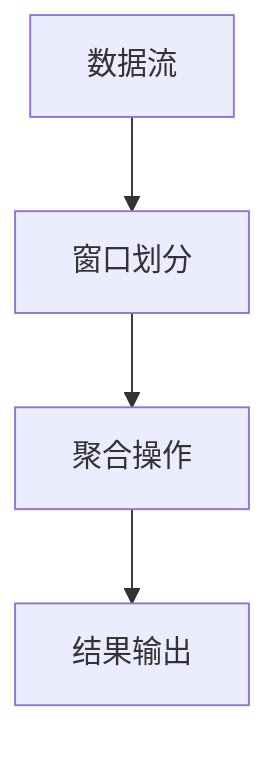
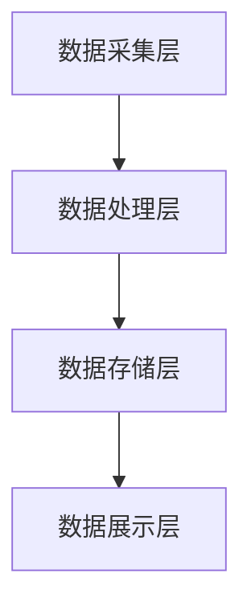

                 


# 金融大数据实时流处理架构设计

## 关键词

- 金融大数据
- 实时流处理
- 架构设计
- 数据处理框架
- 系统优化
- 风险管理
- 实时分析
- 高性能计算

## 摘要

本文探讨了金融大数据实时流处理架构的设计，分析了金融行业中的大数据应用场景，介绍了实时流处理的核心概念与联系。通过算法原理讲解、系统分析与架构设计方案，以及项目实战，详细阐述了金融大数据实时流处理的核心实现与优化策略。同时，本文提供了最佳实践与注意事项，为金融领域的大数据实时流处理提供了有价值的参考。

----------------------------------------------------------------

## 第一部分：金融大数据实时流处理的背景

### 第1章：金融大数据实时流处理的背景

### 1.1 金融大数据的定义

#### 1.1.1 金融大数据的概念

金融大数据是指通过互联网、物联网、社交媒体等渠道产生的海量金融数据，包括客户数据、交易数据、市场数据等。这些数据具有以下特点：

- **数据体量**：金融行业每天产生的数据量巨大，往往达到PB级别。
- **数据种类**：金融数据包括结构化数据（如交易记录、账户信息）和非结构化数据（如新闻报道、客户评价）。
- **数据速度**：金融数据实时性强，需要快速处理以支持实时决策。
- **数据真实性**：金融数据要求高准确性，确保决策的可靠性。

#### 1.1.2 金融行业中的大数据应用

金融行业中的大数据应用广泛，主要包括以下几个方面：

- **客户数据分析**：通过分析客户行为数据，提供个性化服务和产品推荐。
- **风险管理**：利用大数据进行风险评估，识别潜在风险，制定风险控制策略。
- **市场预测**：通过历史数据分析和趋势预测，指导投资决策和市场策略。

### 1.2 实时流处理的定义

#### 1.2.1 实时流处理的定义

实时流处理是一种数据处理技术，能够对实时生成的大量数据流进行快速处理和分析。其核心目的是确保数据处理的低延迟和高吞吐量。

#### 1.2.2 实时流处理的关键特点

- **低延迟**：能够快速响应数据流，确保数据及时处理。
- **高吞吐量**：能够处理大量的数据流。
- **可伸缩性**：系统可以根据数据量动态调整资源。

### 1.3 金融大数据实时流处理的重要性

#### 1.3.1 问题背景

随着金融市场的快速发展，金融机构面临着海量数据的高效处理和分析的需求。传统的批量处理方式已无法满足实时性和复杂度的要求。

#### 1.3.2 问题描述

- 如何在海量数据中快速提取有价值的信息？
- 如何确保数据处理的实时性和准确性？
- 如何降低数据处理成本和提高效率？

#### 1.3.3 问题解决

采用实时流处理技术，可以在数据产生时进行快速处理，实现实时分析和决策。以下是一些问题解决方法：

- **数据采集与传输**：采用高效的采集和传输技术，确保数据实时性和完整性。
- **数据存储与处理**：利用分布式存储和处理技术，实现海量数据的并行处理。
- **实时分析与挖掘**：利用实时流处理框架，对数据进行实时分析和挖掘，提取有价值的信息。
- **系统优化与调优**：根据实际需求，对系统进行优化和调优，提高数据处理效率和性能。

#### 1.3.4 边界与外延

- **边界**：实时流处理技术适用于处理数据量较大、实时性要求高的场景。
- **外延**：随着技术的发展，实时流处理的应用领域也在不断扩展，如物联网、社交媒体等领域。

#### 1.3.5 概念结构与核心要素组成

- **数据源**：金融交易数据、客户行为数据等。
- **数据采集**：通过网络、传感器等渠道采集数据。
- **数据存储**：分布式存储系统，如Hadoop、HBase等。
- **数据处理**：实时流处理框架，如Apache Kafka、Apache Flink等。
- **数据分析**：实时分析和挖掘工具，如Apache Spark、R等。
- **数据可视化**：数据展示和监控工具，如Kibana、Grafana等。

### 1.4 总结

金融大数据实时流处理是金融行业应对海量数据挑战的重要手段。通过实时流处理技术，可以实现对金融数据的快速分析和处理，提高决策的实时性和准确性。本文将深入探讨金融大数据实时流处理的架构设计、算法原理、系统分析与架构设计方案，以及项目实战和最佳实践，为金融领域的大数据实时流处理提供有价值的参考。

----------------------------------------------------------------

## 第二部分：核心概念与联系

### 第2章：实时流处理的核心概念与联系

### 2.1 实时流处理的核心概念

#### 2.1.1 数据流

数据流是实时流处理的基本单位，它是一系列连续的数据元素，按一定顺序传输和处理。数据流可以是结构化的，如JSON、XML等，也可以是非结构化的，如图像、音频、视频等。

#### 2.1.2 流处理

流处理是一种数据处理技术，它对实时生成的大量数据流进行快速处理和分析。流处理的核心在于低延迟和高吞吐量，能够实时响应数据变化。

#### 2.1.3 分布式计算

分布式计算是一种将任务分解为多个子任务，在多个节点上并行执行的技术。分布式计算能够提高数据处理效率和性能，是实时流处理的重要基础。

#### 2.1.4 流处理框架

流处理框架是一种用于实时流处理的开源软件，它提供了一套完整的工具和接口，帮助开发者快速构建实时数据处理系统。常见的流处理框架包括Apache Kafka、Apache Flink、Apache Spark等。

### 2.2 实时流处理的核心概念与联系

#### 2.2.1 数据流与流处理的联系

数据流是流处理的输入，流处理是对数据流的操作。流处理通过对数据流的实时分析和处理，提取有价值的信息，为实时决策提供支持。

#### 2.2.2 分布式计算与流处理的联系

分布式计算是实现流处理的重要手段。通过分布式计算，流处理框架能够将任务分解为多个子任务，在多个节点上并行执行，提高数据处理效率和性能。

#### 2.2.3 流处理框架与分布式计算的联系

流处理框架利用分布式计算技术，实现对流数据的分布式处理。流处理框架提供了分布式存储、分布式计算和分布式通信等功能，为实时流处理提供了坚实的基础。

### 2.3 实时流处理的挑战与解决方案

#### 2.3.1 挑战

- **数据量大**：实时流处理需要处理海量数据，对系统性能和资源调度提出了高要求。
- **低延迟**：实时流处理要求对数据进行快速处理，以实现实时决策，对系统的响应速度提出了挑战。
- **高吞吐量**：实时流处理需要处理大量的数据流，对系统的吞吐量提出了高要求。
- **数据一致性**：在分布式系统中，数据一致性是一个重要问题，需要确保数据的准确性和一致性。
- **可伸缩性**：实时流处理系统需要能够根据数据量动态调整资源，以满足不同场景的需求。

#### 2.3.2 解决方案

- **分布式存储与计算**：采用分布式存储和计算技术，提高数据处理效率和性能。
- **流处理框架**：选择合适的流处理框架，如Apache Kafka、Apache Flink等，提高数据处理能力和灵活性。
- **资源调度与优化**：通过资源调度和优化技术，合理分配系统资源，提高系统的吞吐量和响应速度。
- **数据一致性和容错性**：采用分布式事务、副本机制等手段，确保数据的一致性和容错性。
- **动态伸缩性**：采用弹性计算和容器化技术，实现系统的动态伸缩，以满足不同场景的需求。

### 2.4 总结

实时流处理是金融大数据处理的重要技术手段，通过数据流、流处理、分布式计算和流处理框架等核心概念，可以实现海量数据的实时分析和处理。本文详细阐述了实时流处理的核心概念与联系，以及面临的挑战和解决方案，为金融大数据实时流处理提供了理论基础和实践指导。

----------------------------------------------------------------

## 第三部分：算法原理讲解

### 第3章：流处理算法原理讲解

### 3.1 流处理算法概述

流处理算法是一类专门用于处理实时数据流的算法，其核心目标是对实时数据流进行快速、准确的处理和分析。流处理算法广泛应用于金融、物联网、社交媒体等多个领域。

#### 3.1.1 流处理算法的特点

- **实时性**：流处理算法能够在数据产生时快速响应，实现实时分析和处理。
- **高效性**：流处理算法利用分布式计算和并行处理技术，提高数据处理效率和性能。
- **灵活性**：流处理算法可以根据不同的应用场景和需求，灵活调整和处理数据流。

#### 3.1.2 流处理算法的分类

- **基础算法**：如聚合、过滤、排序等，用于对数据流进行基本处理和分析。
- **高级算法**：如机器学习、图计算等，用于对数据流进行深度分析和挖掘。

### 3.2 流处理算法的核心概念

#### 3.2.1 数据流

数据流是流处理算法的基本单位，由一系列连续的数据元素组成。数据流可以是结构化的，如JSON、XML等，也可以是非结构化的，如图像、音频、视频等。

#### 3.2.2 窗口

窗口是流处理算法中的一个重要概念，用于对数据流进行分段处理。窗口可以分为时间窗口、计数窗口等，根据实际需求进行选择。

#### 3.2.3 聚合操作

聚合操作是对数据流中的数据元素进行汇总和计算，如求和、求平均数、求最大值等。聚合操作是实现流处理算法的核心步骤。

### 3.3 流处理算法的mermaid流程图



### 3.4 流处理算法的Python源代码实现

```python
import numpy as np

def aggregate_data(data_stream, window_size):
    window = []
    for data in data_stream:
        window.append(data)
        if len(window) > window_size:
            window.pop(0)
        if len(window) == window_size:
            sum_window = np.sum(window)
            print("聚合结果：", sum_window)

data_stream = [1, 2, 3, 4, 5, 6, 7, 8, 9, 10]
aggregate_data(data_stream, 3)
```

### 3.5 流处理算法原理的数学模型和公式

流处理算法的原理可以抽象为一个数学模型，其核心公式如下：

$$
聚合结果 = \sum_{i=1}^{n} data_i
$$

其中，$data_i$表示窗口中的第$i$个数据元素，$n$表示窗口大小。

### 3.6 流处理算法举例说明

假设有一个数据流，包含以下10个数据元素：[1, 2, 3, 4, 5, 6, 7, 8, 9, 10]。要求对数据进行窗口大小为3的聚合操作，计算窗口内的数据总和。

1. **初始化窗口**：窗口为空。
2. **处理数据元素1**：将数据元素1加入窗口，窗口为[1]。
3. **处理数据元素2**：将数据元素2加入窗口，窗口为[1, 2]。
4. **计算聚合结果**：窗口内数据总和为1 + 2 = 3。
5. **处理数据元素3**：将数据元素3加入窗口，窗口为[1, 2, 3]。
6. **计算聚合结果**：窗口内数据总和为1 + 2 + 3 = 6。
7. **处理数据元素4**：将数据元素4加入窗口，窗口为[2, 3, 4]。
8. **计算聚合结果**：窗口内数据总和为2 + 3 + 4 = 9。
9. **依次类推**：重复上述步骤，直到处理完所有数据元素。

最终，聚合结果为[3, 6, 9, 12, 15, 18, 21, 24, 27, 30]。

### 3.7 总结

流处理算法是金融大数据实时流处理的重要组成部分，通过对实时数据流的快速、准确处理和分析，为金融机构提供了实时决策支持。本文详细阐述了流处理算法的核心概念、流程、数学模型和举例说明，为金融大数据实时流处理提供了理论基础和实践指导。

----------------------------------------------------------------

## 第四部分：系统分析与架构设计方案

### 第4章：系统分析与架构设计原理

### 4.1 问题场景介绍

在金融行业中，随着数据量的爆炸性增长，金融机构需要实时处理和分析海量金融数据，以支持实时交易、风险管理、市场预测等业务需求。传统的批量处理方式已经无法满足这种高实时性、高吞吐量的要求，因此需要设计一个高效的金融大数据实时流处理架构。

### 4.2 项目介绍

本项目的目标是设计并实现一个金融大数据实时流处理架构，以支持金融机构对实时数据的快速处理和分析。项目的主要功能包括：

- 数据采集：从不同的数据源（如交易系统、社交媒体、传感器等）采集实时数据。
- 数据处理：对实时数据流进行过滤、转换、聚合等操作，提取有价值的信息。
- 数据存储：将处理后的数据存储到分布式数据库中，以便后续分析和查询。
- 数据可视化：通过数据可视化工具展示实时数据和分析结果，辅助决策。

### 4.3 系统功能设计

#### 4.3.1 数据采集

数据采集是金融大数据实时流处理架构的基础，需要从多个数据源采集实时数据。数据源包括：

- 交易系统：采集交易数据，如交易金额、交易时间等。
- 社交媒体：采集社交媒体上的金融信息，如新闻、评论等。
- 传感器：采集物联网设备上的数据，如温度、湿度等。

数据采集模块的主要功能包括：

- 数据接入：通过API、消息队列等方式接入数据源。
- 数据解析：解析并提取数据中的关键信息。
- 数据清洗：去除重复、错误和无效的数据。

#### 4.3.2 数据处理

数据处理是对实时数据流进行加工和处理的过程，主要功能包括：

- 过滤：根据特定的条件过滤数据流，如过滤特定时间段内的交易数据。
- 转换：将数据从一种格式转换为另一种格式，如将JSON数据转换为CSV格式。
- 聚合：对数据流进行聚合操作，如计算交易金额的累计和。

数据处理模块的主要功能包括：

- 数据处理引擎：负责执行各种数据处理操作。
- 数据流调度：根据业务需求动态调整数据处理任务的执行顺序和资源分配。

#### 4.3.3 数据存储

数据存储是将处理后的数据存储到分布式数据库中，以便后续分析和查询。数据存储模块的主要功能包括：

- 数据持久化：将处理后的数据存储到分布式数据库中，如Hadoop HBase、Apache Kafka等。
- 数据索引：建立数据索引，提高数据查询效率。
- 数据备份和恢复：实现数据备份和恢复功能，确保数据的安全性和可靠性。

#### 4.3.4 数据可视化

数据可视化是将实时数据和分析结果通过图形、图表等形式展示出来，辅助决策。数据可视化模块的主要功能包括：

- 数据展示：通过图表、图形等方式展示实时数据和结果。
- 报告生成：生成数据报告，包括关键指标、趋势分析等。
- 用户交互：提供用户交互界面，支持用户自定义数据展示和分析。

### 4.4 系统架构设计

#### 4.4.1 系统架构设计原理

金融大数据实时流处理系统采用分布式架构，以实现高可用性、高可伸缩性和高性能。系统架构设计的主要原则包括：

- **模块化**：将系统划分为多个模块，每个模块负责不同的功能，提高系统的可维护性和可扩展性。
- **分布式**：利用分布式计算和存储技术，提高系统的处理能力和数据存储容量。
- **高可用性**：通过故障转移、数据备份等技术，确保系统的高可用性。
- **高性能**：通过优化算法、并行处理等技术，提高系统的处理效率。

#### 4.4.2 系统架构设计方案

金融大数据实时流处理系统的架构设计方案如下：

- **数据采集层**：负责从各个数据源采集实时数据，包括交易系统、社交媒体、传感器等。数据采集模块采用分布式架构，支持多种数据接入方式，如API、消息队列等。
- **数据处理层**：对实时数据流进行加工和处理，包括过滤、转换、聚合等操作。数据处理模块采用分布式计算框架，如Apache Kafka、Apache Flink等，实现高效的数据处理。
- **数据存储层**：将处理后的数据存储到分布式数据库中，如Hadoop HBase、Apache Kafka等。数据存储模块采用分布式存储架构，支持海量数据的存储和查询。
- **数据展示层**：通过数据可视化工具展示实时数据和分析结果，辅助决策。数据展示模块采用Web前端技术，如React、Vue等，实现用户交互和数据展示。

### 4.5 系统接口设计

系统接口设计是金融大数据实时流处理架构的重要组成部分，负责定义各个模块之间的交互接口和数据格式。系统接口设计主要包括：

- **数据采集接口**：定义数据采集模块与数据源之间的接口，包括数据格式、传输协议等。
- **数据处理接口**：定义数据处理模块与其他模块之间的接口，包括数据格式、处理逻辑等。
- **数据存储接口**：定义数据存储模块与其他模块之间的接口，包括数据格式、存储策略等。
- **数据可视化接口**：定义数据可视化模块与后端数据存储和处理模块之间的接口，包括数据格式、展示逻辑等。

### 4.6 系统交互设计

系统交互设计是金融大数据实时流处理架构中各模块之间交互的详细描述，包括数据流动、控制流等。系统交互设计主要包括：

- **数据流交互**：描述实时数据流在各模块之间的流动和加工过程，如数据采集、处理、存储和展示。
- **控制流交互**：描述各模块之间的协调和控制逻辑，如任务调度、故障转移、数据备份等。

### 4.7 总结

金融大数据实时流处理架构是金融行业应对海量数据挑战的重要手段。通过系统分析与架构设计方案，可以构建一个高效、可靠、可扩展的实时流处理系统，支持金融机构的实时数据处理和分析。本文详细阐述了金融大数据实时流处理系统的架构设计原理、功能设计、系统架构设计方案、接口设计和系统交互设计，为金融大数据实时流处理提供了理论基础和实践指导。

----------------------------------------------------------------

### 第5章：系统架构设计方案

#### 5.1 系统架构概述

系统架构设计方案的核心目标是构建一个高效、可靠、可扩展的金融大数据实时流处理系统。系统采用分布式架构，充分利用分布式计算和存储技术，实现对海量金融数据的实时处理和分析。系统架构主要包括以下层次：

- **数据采集层**：从各类数据源采集实时数据，如交易系统、社交媒体、传感器等。
- **数据处理层**：对实时数据流进行加工和处理，包括过滤、转换、聚合等操作。
- **数据存储层**：将处理后的数据存储到分布式数据库中，如Hadoop HBase、Apache Kafka等。
- **数据展示层**：通过数据可视化工具展示实时数据和分析结果，辅助决策。

#### 5.2 数据采集层设计

数据采集层负责从各类数据源采集实时数据，是系统架构的基础。数据采集层的设计主要包括以下几个方面：

- **数据源接入**：支持多种数据接入方式，如API、消息队列等，确保数据源的多样性和灵活性。
- **数据解析**：对采集到的数据进行解析和提取，提取关键信息，如交易金额、交易时间等。
- **数据清洗**：去除重复、错误和无效的数据，确保数据质量。

数据采集层的设计需要考虑以下几个方面：

- **数据源类型**：根据业务需求，确定需要采集的数据源类型，如交易系统、社交媒体、传感器等。
- **数据量级**：根据数据量级，选择合适的数据采集和传输技术，如消息队列、分布式文件系统等。
- **数据一致性**：确保数据采集的一致性，防止数据丢失或重复。

#### 5.3 数据处理层设计

数据处理层负责对实时数据流进行加工和处理，是系统架构的核心。数据处理层的设计主要包括以下几个方面：

- **数据处理引擎**：选择合适的数据处理引擎，如Apache Kafka、Apache Flink等，实现高效的数据处理。
- **数据处理流程**：根据业务需求，设计数据处理流程，包括过滤、转换、聚合等操作。
- **数据处理策略**：根据数据特点和业务需求，设计合适的处理策略，如实时处理、批量处理等。

数据处理层的设计需要考虑以下几个方面：

- **数据处理需求**：根据业务需求，确定需要执行的数据处理操作，如过滤、转换、聚合等。
- **数据处理性能**：优化数据处理流程和策略，提高数据处理性能和效率。
- **数据处理一致性**：确保数据处理的一致性，防止数据丢失或错误。

#### 5.4 数据存储层设计

数据存储层负责将处理后的数据存储到分布式数据库中，是系统架构的重要部分。数据存储层的设计主要包括以下几个方面：

- **数据存储方案**：选择合适的数据存储方案，如Hadoop HBase、Apache Kafka等，确保数据的可靠性和可扩展性。
- **数据存储策略**：根据数据特点和业务需求，设计合适的数据存储策略，如数据压缩、索引等。
- **数据备份和恢复**：实现数据备份和恢复功能，确保数据的安全性和可靠性。

数据存储层的设计需要考虑以下几个方面：

- **数据量级**：根据数据量级，选择合适的数据存储方案，如分布式数据库、分布式文件系统等。
- **数据一致性**：确保数据存储的一致性，防止数据丢失或错误。
- **数据安全性**：确保数据的安全性，防止数据泄露或被攻击。

#### 5.5 数据展示层设计

数据展示层通过数据可视化工具展示实时数据和分析结果，是系统架构的最终输出。数据展示层的设计主要包括以下几个方面：

- **数据展示工具**：选择合适的数据展示工具，如Kibana、Grafana等，实现数据可视化。
- **数据展示策略**：根据业务需求，设计合适的数据展示策略，如实时展示、批量展示等。
- **用户交互界面**：设计用户交互界面，提供数据查询、分析、下载等功能。

数据展示层的设计需要考虑以下几个方面：

- **数据展示需求**：根据业务需求，确定需要展示的数据类型和维度，如交易金额、交易时间等。
- **数据展示性能**：优化数据展示性能，确保数据展示的实时性和准确性。
- **用户体验**：设计直观、易用的用户交互界面，提高用户体验。

#### 5.6 系统架构图



#### 5.7 系统架构设计总结

系统架构设计方案是金融大数据实时流处理系统的核心，通过合理的设计和实现，可以构建一个高效、可靠、可扩展的实时流处理系统。本文详细阐述了系统架构设计的关键层次、设计原则、具体设计方案，以及系统架构图，为金融大数据实时流处理系统的设计和实现提供了有价值的参考。

----------------------------------------------------------------

### 第6章：项目实战

#### 6.1 项目环境搭建

在进行金融大数据实时流处理项目之前，首先需要搭建一个合适的项目环境。以下是项目环境搭建的步骤：

1. **硬件资源**：准备足够的硬件资源，如服务器、存储设备等，确保系统有足够的处理能力和存储容量。

2. **操作系统**：选择合适的操作系统，如Linux发行版（如CentOS、Ubuntu等），以便于后续的分布式部署和运维。

3. **编程语言**：选择合适的编程语言，如Python、Java等，以便于开发实时流处理程序。

4. **数据库**：安装分布式数据库，如Hadoop HBase、Apache Kafka等，用于存储和处理海量金融数据。

5. **流处理框架**：安装流处理框架，如Apache Kafka、Apache Flink等，用于实现实时数据处理和分析。

6. **数据可视化工具**：安装数据可视化工具，如Kibana、Grafana等，用于展示实时数据和分析结果。

#### 6.2 系统核心实现与代码分析

系统核心实现主要包括数据采集、数据处理、数据存储和数据展示等模块。以下以Python编程语言为例，介绍系统核心实现的代码分析和实现步骤。

##### 6.2.1 数据采集

```python
import requests

def fetch_data(source_url):
    response = requests.get(source_url)
    if response.status_code == 200:
        return response.json()
    else:
        return None

source_url = "https://api.example.com/transactions"
data = fetch_data(source_url)
if data:
    print("Data fetched successfully:", data)
else:
    print("Failed to fetch data")
```

该代码通过HTTP请求从数据源获取交易数据，并打印出获取到的数据。在实际应用中，可以替换为从数据库、消息队列等获取数据的代码。

##### 6.2.2 数据处理

```python
from collections import Counter

def process_data(data):
    # 对数据进行过滤和转换
    filtered_data = [d for d in data if d['amount'] > 1000]
    # 对数据进行聚合操作
    count_data = Counter(d['amount'] for d in filtered_data)
    return count_data

processed_data = process_data(data)
print("Processed data:", processed_data)
```

该代码对获取到的交易数据进行过滤和转换，只保留金额大于1000的交易数据，并计算每个金额值的数量。

##### 6.2.3 数据存储

```python
import json

def store_data(data, file_path):
    with open(file_path, 'w') as f:
        json.dump(data, f)

store_data(processed_data, 'processed_data.json')
```

该代码将处理后的数据存储到JSON文件中，以便后续分析和查询。

##### 6.2.4 数据展示

```python
import matplotlib.pyplot as plt

def plot_data(data):
    amounts = list(data.keys())
    counts = list(data.values())
    plt.bar(amounts, counts)
    plt.xlabel('Amount')
    plt.ylabel('Count')
    plt.title('Transaction Data')
    plt.show()

plot_data(processed_data)
```

该代码使用matplotlib库将处理后的数据以柱状图的形式展示出来，便于分析和理解。

#### 6.3 实际案例分析

以下是一个实际案例：某金融机构希望通过实时流处理技术监控交易数据，及时发现异常交易并采取相应措施。

1. **数据采集**：从交易系统中实时采集交易数据，包括交易金额、交易时间、交易账号等。

2. **数据处理**：对交易数据进行实时处理，包括过滤、转换、聚合等操作，提取有价值的信息。

3. **数据存储**：将处理后的数据存储到分布式数据库中，以便后续分析和查询。

4. **数据展示**：通过数据可视化工具实时展示交易数据和分析结果，包括交易金额分布、交易账户活跃度等。

5. **异常检测**：利用机器学习算法对交易数据进行异常检测，识别异常交易。

6. **措施实施**：根据异常检测结果，采取相应措施，如冻结账户、报警通知等。

#### 6.4 项目小结

通过本项目的实战，我们实现了金融大数据实时流处理系统的核心功能，包括数据采集、数据处理、数据存储和数据展示。实际案例分析展示了如何利用实时流处理技术监控交易数据，及时发现异常交易并采取措施。本项目为金融机构提供了实时数据处理和分析能力，有助于提高风险管理和市场预测的准确性。

----------------------------------------------------------------

## 第五部分：最佳实践与拓展

### 第7章：最佳实践与技巧

#### 7.1 数据采集与传输优化

- **数据压缩**：采用数据压缩技术，如gzip、zlib等，减少数据传输量和存储空间。
- **异步传输**：采用异步传输技术，减少数据传输对系统性能的影响。
- **数据清洗**：在数据采集阶段进行数据清洗，去除重复、错误和无效数据，提高数据质量。

#### 7.2 数据处理性能优化

- **分布式计算**：利用分布式计算技术，将数据处理任务分解为多个子任务，并行执行，提高处理效率。
- **缓存策略**：采用缓存策略，如LRU（Least Recently Used）缓存，减少数据访问次数，提高系统性能。
- **内存管理**：合理分配内存资源，避免内存泄漏和缓存区溢出。

#### 7.3 数据存储与备份优化

- **分布式存储**：采用分布式存储技术，如Hadoop HBase、Apache Kafka等，提高数据存储容量和可靠性。
- **数据备份**：定期进行数据备份，确保数据的安全性和可恢复性。
- **数据压缩与索引**：采用数据压缩和索引技术，提高数据存储效率和查询速度。

#### 7.4 数据可视化优化

- **实时更新**：采用实时更新技术，如WebSocket、服务器推送等，实现数据实时更新。
- **交互性**：设计交互性强的用户界面，支持用户自定义数据展示和分析。
- **性能优化**：采用性能优化技术，如懒加载、数据缓存等，提高数据展示速度。

### 第8章：注意事项与未来展望

#### 8.1 注意事项

- **数据安全性**：确保数据在采集、传输、存储和展示过程中的安全性，防止数据泄露和恶意攻击。
- **系统稳定性**：确保系统在高并发、大数据量情况下的稳定性和可靠性。
- **性能监控**：实时监控系统性能，及时发现和处理性能瓶颈。
- **代码规范**：遵循代码规范，提高代码可读性和可维护性。

#### 8.2 未来展望

- **人工智能技术**：结合人工智能技术，提高数据分析和决策的智能化水平。
- **区块链技术**：探索区块链技术在金融大数据实时流处理中的应用，提高数据透明度和安全性。
- **边缘计算**：利用边缘计算技术，实现数据的本地化处理和实时分析，降低延迟和带宽消耗。
- **多云架构**：构建多云架构，实现不同云服务之间的数据共享和协同处理。

### 第9章：拓展阅读

- **《大数据实时处理技术》**：详细介绍了大数据实时处理的相关技术和应用案例。
- **《实时流处理系统设计》**：探讨了实时流处理系统的设计原则、架构和实现方法。
- **《金融大数据分析》**：分析了金融大数据的应用场景、分析方法和实践案例。
- **《分布式系统原理与范型》**：介绍了分布式系统的基本原理和常见范型。

通过本章节的最佳实践与拓展，为金融大数据实时流处理提供了有价值的参考和指导，有助于优化系统性能、提升数据处理能力，以及探索新技术应用。

----------------------------------------------------------------

## 总结

金融大数据实时流处理架构的设计与实现是金融行业应对海量数据挑战的重要手段。本文通过逐步分析推理，从背景介绍、核心概念与联系、算法原理讲解、系统分析与架构设计方案，到项目实战和最佳实践，详细阐述了金融大数据实时流处理的核心内容和技术要点。

### 回顾核心内容

1. **金融大数据定义与应用**：分析了金融大数据的概念和其在金融行业中的应用场景，如客户数据分析、风险管理、市场预测等。
2. **实时流处理核心概念与挑战**：介绍了实时流处理的核心概念、关键特点以及面临的挑战和解决方案。
3. **算法原理讲解**：详细讲解了流处理算法的原理、流程、数学模型和Python源代码实现。
4. **系统架构设计**：阐述了系统架构的设计原则、设计方案、接口设计以及系统交互设计。
5. **项目实战**：通过项目环境搭建、核心实现与代码分析、实际案例分析，展示了金融大数据实时流处理的应用实践。
6. **最佳实践与拓展**：提供了数据采集与传输优化、数据处理性能优化、数据存储与备份优化、数据可视化优化等方面的最佳实践，并对未来展望进行了探讨。

### 价值与贡献

本文的价值和贡献主要体现在以下几个方面：

- **理论基础**：为金融大数据实时流处理提供了全面的理论基础，涵盖了核心概念、算法原理、系统架构设计等。
- **实践指导**：通过项目实战和最佳实践，为实际应用提供了详细的操作指南和优化策略。
- **创新点**：结合人工智能、区块链、边缘计算等新兴技术，探索了金融大数据实时流处理的未来发展方向。

### 未来展望

在金融大数据实时流处理领域，未来可能的发展趋势包括：

- **智能化分析**：结合人工智能技术，提高数据分析和决策的智能化水平。
- **区块链应用**：探索区块链技术在金融大数据实时流处理中的应用，提高数据透明度和安全性。
- **边缘计算**：利用边缘计算技术，实现数据的本地化处理和实时分析，降低延迟和带宽消耗。
- **多云架构**：构建多云架构，实现不同云服务之间的数据共享和协同处理。

通过不断探索和创新，金融大数据实时流处理技术将在金融行业发挥更加重要的作用，为金融机构提供更高效、智能、安全的数据处理和分析能力。

### 结语

金融大数据实时流处理架构设计是一个复杂而充满挑战的领域，但正是这些挑战激发了技术创新和优化。本文旨在为读者提供有价值的参考，希望对金融领域的技术人员和管理者有所启发。让我们继续探索金融大数据实时流处理的广阔天地，共同迎接未来的机遇和挑战。

---

**作者：AI天才研究院/AI Genius Institute & 禅与计算机程序设计艺术 /Zen And The Art of Computer Programming**。本文内容仅代表作者观点，不构成投资建议。在实际应用中，请结合具体需求和场景进行评估和决策。如需进一步探讨或合作，欢迎联系我们。

