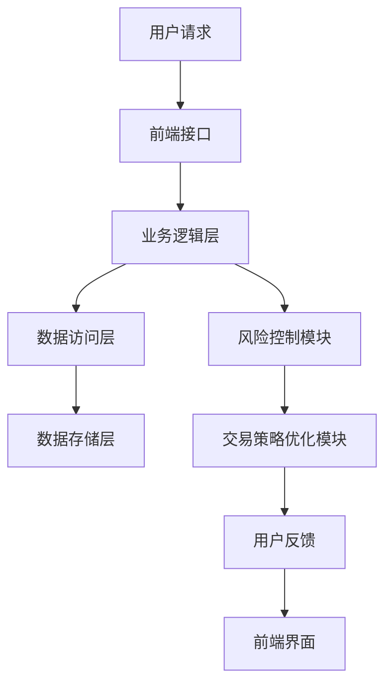

                 

### 文章标题

# 金融市场交易成本分析与控制平台

> 关键词：金融市场，交易成本，控制平台，算法实现，性能评估，应用案例

> 摘要：本文详细探讨了金融市场交易成本分析与控制平台的设计、实现和应用。首先，介绍了交易成本的概念及其在金融市场中的重要性，然后分析了交易成本的构成和影响因素。接着，本文探讨了交易成本分析的理论基础和主要模型，为后续平台设计和实现提供了理论支持。文章随后深入讨论了交易成本控制平台的需求分析，包括平台目标、功能需求和系统需求。接下来，本文详细介绍了交易成本控制平台的架构设计、算法实现和开发过程，并通过测试和性能评估确保平台的有效性和高效性。最后，本文通过实际应用案例展示了交易成本控制平台在股票交易、期货市场和外汇市场的应用效果，总结了主要成果和未来研究方向。本文旨在为金融市场交易成本分析与控制提供全面的技术指导和实践参考。

### 引言与背景

在金融市场中，交易成本是一个至关重要的概念，它直接影响到投资者的收益和市场的整体效率。交易成本（Transaction Costs）通常包括市场摩擦，如手续费、交易税费、信息成本和交易时间成本等。这些成本不仅限制了投资者的收益，还可能影响市场的流动性、价格发现机制和市场的公平性。

#### 交易成本的概念与重要性

交易成本可以定义为在金融交易过程中产生的各种成本，它不仅包括直接的费用，如交易手续费和税费，还包括间接的成本，如信息搜集和处理成本、交易决策的时间成本等。交易成本的存在是市场效率不完美的表现，它反映了市场信息不对称、交易机制不完善等问题。

交易成本的重要性体现在以下几个方面：

1. **影响投资者收益**：较高的交易成本会直接减少投资者的收益，降低投资回报率。
2. **影响市场流动性**：交易成本增加了交易者的退出成本，降低了市场的流动性。
3. **影响价格发现机制**：交易成本使得市场难以快速响应供需变化，影响价格发现机制的效率。
4. **影响市场公平性**：交易成本可能导致信息不对称，影响市场的公平性。

#### 交易成本的构成

交易成本的构成较为复杂，主要包括以下几类：

1. **手续费**：投资者在交易所进行交易时需要支付的费用，包括佣金、印花税等。
2. **税费**：政府为管理金融市场而对交易征收的各种税费，如资本利得税、证券交易税等。
3. **信息成本**：投资者为获取市场信息所需支付的成本，包括订阅财经新闻、研究报告等。
4. **时间成本**：投资者进行交易决策和执行所需的时间成本，如分析市场数据、下单操作等。

#### 交易成本对金融市场的影响

交易成本对金融市场的影响是多方面的：

1. **市场效率**：高交易成本会降低市场的效率，增加交易者的操作成本，使得市场难以快速响应供需变化。
2. **价格波动**：交易成本可能导致价格发现机制不完善，增加价格波动性。
3. **市场分割**：高交易成本可能使得某些市场参与者被边缘化，导致市场分割。
4. **市场风险**：交易成本增加了交易者的风险，特别是对于那些需要频繁交易的投资者。

#### 当前交易成本控制方法

当前，金融市场交易成本控制的方法主要包括以下几种：

1. **技术创新**：通过开发新的交易技术，如高频交易、算法交易等，降低交易成本。
2. **市场改革**：通过改革交易规则和制度，减少不必要的交易成本，提高市场效率。
3. **信息共享**：通过建立信息共享平台，降低信息成本，提高市场的透明度和公平性。
4. **优化交易策略**：通过优化交易策略，减少不必要的交易次数，降低交易成本。

#### 文章目的

本文旨在通过详细分析和探讨金融市场交易成本，设计并实现一个高效的交易成本控制平台。本文将首先介绍交易成本的概念、构成及其对金融市场的影响，然后探讨交易成本分析的理论基础和主要模型。接着，本文将深入讨论交易成本控制平台的需求分析，包括平台目标、功能需求和系统需求。随后，本文将详细介绍交易成本控制平台的架构设计、算法实现和开发过程，并通过测试和性能评估确保平台的有效性和高效性。最后，本文将通过实际应用案例展示交易成本控制平台在股票交易、期货市场和外汇市场的应用效果，总结主要成果和未来研究方向。

通过本文的探讨，我们希望能够为金融市场交易成本分析与控制提供一套完整的技术指导和实践参考，帮助投资者和金融机构降低交易成本，提高投资效率和收益。

### 交易成本分析理论

交易成本分析是金融市场研究中的重要领域，它帮助投资者和金融从业者理解交易中的各种成本，从而优化交易策略，提高投资回报率。交易成本分析的理论基础主要涵盖市场微观结构理论、信息不对称理论和交易成本模型。

#### 市场微观结构与交易成本

市场微观结构理论（Market Microstructure Theory）是交易成本分析的重要理论依据之一。该理论主要研究市场中的价格形成过程、交易机制和市场结构对交易成本的影响。市场微观结构理论的基本假设是市场由一系列微观交易行为组成，每个交易行为都受到交易成本的影响。

1. **价格发现机制**：市场微观结构理论强调价格发现机制的重要性，认为市场价格是市场参与者交易行为的结果。价格发现过程不仅受到供需关系的影响，还受到交易成本的影响。较高的交易成本会阻碍价格发现过程，导致价格波动性增加。

2. **交易机制**：不同的交易机制对交易成本有显著影响。例如，拍卖机制、做市商机制和电子交易机制等，每种机制都有其优缺点。拍卖机制通常具有较高的透明度和流动性，但可能存在价格波动性大的问题；做市商机制提供了流动性保证，但可能会增加交易成本；电子交易机制具有高效性和低成本的特点，但也可能面临系统风险。

3. **市场结构**：市场结构对交易成本有重要影响。大型交易所通常具有更高的流动性，但交易成本可能较高；小型交易所则可能具有较低的交易成本，但流动性较差。此外，市场的竞争结构也会影响交易成本，一个高度竞争的市场可能具有较低的交易成本。

#### 信息不对称与交易成本

信息不对称（Asymmetric Information）是金融市场中普遍存在的问题，它指市场中一方拥有而另一方缺乏的信息。信息不对称会导致交易成本增加，因为缺乏信息的一方在交易过程中可能面临更高的风险和不确定性。

1. **道德风险**：信息不对称可能导致道德风险问题，即一方在交易过程中可能采取不利于另一方的行为。例如，卖方可能隐瞒交易中的潜在问题，买方可能过度乐观，导致交易成本增加。

2. **逆向选择**：信息不对称还可能导致逆向选择问题，即市场中的低质量交易者可能更愿意参与交易，而高质量交易者则可能选择退出市场。逆向选择会导致市场效率降低，交易成本增加。

3. **信息成本**：为了克服信息不对称，交易双方可能需要投入大量的时间和资源来获取和处理信息。这些信息成本包括收集、分析市场数据、订阅财经新闻和研究报告等。信息成本的增加会提高交易成本，影响市场效率。

#### 交易成本模型

交易成本模型（Transaction Cost Models）是用于量化交易成本的理论框架，它帮助投资者和金融从业者更好地理解和计算交易成本。常见的交易成本模型包括以下几种：

1. **经济代理模型**：经济代理模型（Economic Agent Models）基于理性经济人的假设，考虑交易成本对市场行为和交易决策的影响。该模型通过建立数学模型和算法，模拟市场中的交易行为，分析交易成本对市场动态的影响。

2. **交易费用模型**：交易费用模型（Transaction Fee Models）主要关注交易费用对交易成本的影响。该模型通过计算交易费用在交易总额中的比例，评估交易成本的大小。交易费用模型通常包括手续费、税费等直接成本。

3. **信息成本模型**：信息成本模型（Information Cost Models）侧重于信息成本对交易成本的影响。该模型通过量化信息成本，分析信息不对称和市场透明度对交易成本的影响。信息成本模型常用于评估信息共享平台和金融监管政策的效果。

4. **集成模型**：集成模型（Integrated Models）结合了经济代理模型、交易费用模型和信息成本模型，全面考虑各种交易成本因素，提供更全面的交易成本分析。集成模型通常用于策略优化和风险管理。

#### 关键概念与联系

为了更好地理解交易成本分析理论，我们需要了解以下几个关键概念，并探讨它们之间的联系：

1. **交易成本**：交易成本是交易过程中产生的各种费用，包括手续费、税费、信息成本和时间成本等。
2. **信息不对称**：信息不对称指市场参与者之间在信息拥有上的不平等，可能导致交易成本增加。
3. **市场效率**：市场效率指市场在价格发现和资源配置方面的有效性，交易成本会影响市场效率。
4. **交易机制**：交易机制是市场中的交易规则和操作方式，不同的交易机制对交易成本有显著影响。
5. **价格发现**：价格发现是市场参与者通过交易行为形成价格的过程，交易成本会影响价格发现效率。

综上所述，交易成本分析理论为金融市场交易成本的控制提供了重要的理论基础。通过理解市场微观结构、信息不对称和交易成本模型，投资者和金融从业者可以更好地识别和控制交易成本，提高投资效率和收益。

### 交易成本控制平台的需求分析

设计一个有效的交易成本控制平台，首先需要对平台的目标、功能需求和系统需求进行详细分析。以下是本文对交易成本控制平台需求分析的详细探讨。

#### 平台目标

交易成本控制平台的主要目标包括以下几个方面：

1. **降低交易成本**：通过优化交易流程和策略，减少手续费、税费、信息成本和时间成本等交易成本，提高投资效率。
2. **提高市场透明度**：通过信息共享和数据分析，提高市场信息的透明度，减少信息不对称，增加市场的公平性。
3. **增强交易策略优化能力**：提供自动化交易策略优化工具，帮助投资者制定和实施高效的交易策略。
4. **提升系统性能和稳定性**：确保平台具有高效、稳定和可靠的性能，满足大规模交易需求。

#### 功能需求

交易成本控制平台需要实现以下主要功能：

1. **交易成本估算**：通过对市场数据的分析和处理，实时估算交易成本，为投资者提供交易成本的详细数据。
2. **交易策略优化**：提供自动化交易策略优化工具，基于市场数据和交易成本估算结果，帮助投资者制定和优化交易策略。
3. **信息共享平台**：建立一个信息共享平台，为交易者提供及时、准确的市场信息，减少信息不对称。
4. **用户界面**：设计直观、易用的用户界面，使投资者能够轻松地浏览和分析交易数据，实施交易策略。
5. **风险控制**：提供风险控制功能，帮助投资者监控和管理交易风险，确保交易安全。
6. **数据分析和报告**：提供数据分析和报告功能，帮助投资者了解市场趋势和交易成本变化，优化投资决策。

#### 系统需求

为了实现交易成本控制平台的目标和功能，需要满足以下系统需求：

1. **性能需求**：
   - **高并发处理能力**：平台需要能够处理大量并发交易请求，确保系统的高性能。
   - **快速响应**：系统需要具有快速响应能力，确保交易数据实时更新。
   - **高可用性**：系统需要具备高可用性，确保交易过程不会因故障而中断。

2. **安全性需求**：
   - **数据加密**：确保交易数据在传输和存储过程中的安全性，防止数据泄露和篡改。
   - **身份验证**：提供安全的身份验证机制，确保只有授权用户能够访问平台。
   - **访问控制**：设置严格的访问控制策略，确保用户只能访问其权限范围内的数据和功能。

3. **可扩展性需求**：
   - **模块化设计**：系统设计应采用模块化方式，便于未来扩展和升级。
   - **分布式架构**：采用分布式架构，提高系统的可扩展性和容错性。

4. **兼容性需求**：
   - **多平台支持**：平台需要支持多种操作系统和浏览器，确保用户在不同环境下都能方便使用。
   - **数据兼容性**：平台应能够兼容多种数据格式，方便数据导入和导出。

5. **可维护性需求**：
   - **日志记录**：系统需要记录详细的日志信息，方便问题追踪和故障排除。
   - **自动备份**：定期进行数据备份，确保数据的安全性和完整性。

#### 用户需求分析

交易成本控制平台的目标用户主要包括以下几类：

1. **个人投资者**：需要便捷的交易成本估算工具和交易策略优化功能，以便更好地管理投资组合。
2. **专业交易员**：需要强大的数据分析和风险控制功能，以确保交易决策的准确性和安全性。
3. **金融机构**：需要综合的信息共享平台和风险控制功能，以提升交易效率和风险管理能力。

#### 用户需求分析流程

1. **需求收集**：通过访谈、问卷调查和用户反馈等方式，收集用户的需求和意见。
2. **需求分类**：将收集到的需求进行分类，识别出主要功能需求、性能需求和安全性需求等。
3. **需求验证**：通过原型设计和用户测试，验证需求的有效性和可行性。
4. **需求文档**：编写详细的需求文档，明确平台的目标和功能需求，为后续设计和开发提供依据。

通过上述需求分析，我们可以为交易成本控制平台的设计和实现提供清晰的指导，确保平台能够满足用户的需求，实现降低交易成本、提高市场透明度和增强交易策略优化能力的目标。

### 第4章: 控制平台架构设计

设计一个高效的交易成本控制平台，架构设计是关键环节。本章将详细介绍交易成本控制平台的架构设计，包括系统架构概述、数据库设计和系统接口设计。

#### 系统架构概述

交易成本控制平台采用分层架构设计，分为四层：表示层、业务逻辑层、数据访问层和数据存储层。各层之间通过明确的接口进行通信，确保系统的模块化、可扩展性和可维护性。

1. **表示层（Presentation Layer）**：
   - 负责用户界面的设计和实现，提供用户与系统交互的界面。
   - 使用现代化的前端技术（如React、Vue等）实现响应式界面，确保跨平台兼容性。
   - 提供实时数据展示、交易策略优化建议和风险监控等功能。

2. **业务逻辑层（Business Logic Layer）**：
   - 负责处理业务逻辑和算法实现，包括交易成本估算、交易策略优化和风险控制等。
   - 采用微服务架构设计，将不同的业务功能模块化，便于系统的扩展和维护。
   - 使用Spring Boot等框架实现业务逻辑，确保系统的高性能和可靠性。

3. **数据访问层（Data Access Layer）**：
   - 负责与数据库进行数据交互，提供数据访问接口。
   - 采用MyBatis等ORM框架，简化数据库操作，提高开发效率。
   - 实现数据缓存机制，提高数据访问速度，减轻数据库压力。

4. **数据存储层（Data Storage Layer）**：
   - 负责数据的存储和管理，包括交易数据、用户数据和日志数据等。
   - 使用关系型数据库（如MySQL、PostgreSQL等）存储结构化数据，保证数据的一致性和完整性。
   - 采用NoSQL数据库（如MongoDB等）存储非结构化数据，提供灵活的数据存储和管理功能。

#### 数据库设计

数据库设计是交易成本控制平台的关键组成部分，直接影响系统的性能和数据管理能力。以下是平台数据库设计的主要组成部分：

1. **交易数据库（Transaction Database）**：
   - 存储交易数据，包括股票、期货和外汇等市场的交易信息。
   - 设计交易表（Transaction Table），包含交易时间、交易价格、交易量等字段。
   - 实现索引机制，提高数据查询和操作速度。

2. **用户数据库（User Database）**：
   - 存储用户信息，包括用户身份验证、权限管理和用户偏好设置等。
   - 设计用户表（User Table），包含用户名、密码、电子邮件、角色等字段。
   - 实现用户权限管理，确保数据安全和权限控制。

3. **日志数据库（Log Database）**：
   - 存储系统日志，包括操作日志、错误日志和审计日志等。
   - 设计日志表（Log Table），包含日志时间、操作类型、操作结果等字段。
   - 实现日志归档机制，保证日志数据的可查询性和可恢复性。

#### 系统接口设计

系统接口设计是确保各层之间通信顺畅、数据一致性的关键。以下是交易成本控制平台的主要接口设计：

1. **API接口（API Interface）**：
   - 提供RESTful风格的API接口，供前端应用调用。
   - 定义接口规范，包括URL、请求参数和响应格式等。
   - 实现接口权限控制，确保接口安全性和数据保护。

2. **数据访问接口（Data Access Interface）**：
   - 提供数据访问接口，供业务逻辑层调用。
   - 使用MyBatis等ORM框架，简化数据访问操作。
   - 实现数据缓存和批量处理机制，提高数据访问性能。

3. **服务接口（Service Interface）**：
   - 提供业务逻辑层服务接口，供系统内部服务调用。
   - 使用Spring Boot等框架实现服务接口，确保服务的高性能和可靠性。
   - 实现服务监控和日志记录，确保服务正常运行。

通过上述架构设计和接口设计，交易成本控制平台能够实现模块化、高性能和高可靠性的系统需求。接下来，我们将详细探讨交易成本分析算法的实现过程。

### 第5章: 交易成本分析算法实现

交易成本分析算法是实现交易成本控制平台的核心技术之一，它通过对市场数据的分析和处理，估算交易成本，为投资者提供决策支持。本章将详细介绍交易成本分析算法的实现过程，包括数据预处理、交易成本估计算法和交易策略优化算法。

#### 数据预处理

数据预处理是交易成本分析算法的重要步骤，它包括数据清洗、数据集成和数据转换等过程，确保数据的质量和一致性。

1. **数据清洗**：
   - **缺失值处理**：对于缺失值，可以采用插值法、均值法或中位数法进行填补。
   - **异常值处理**：通过统计分析方法（如箱线图、标准差检验等）识别异常值，然后选择适当的策略（如删除、修正或保留）进行处理。
   - **重复值处理**：识别并删除重复的数据记录，确保数据的唯一性和完整性。

2. **数据集成**：
   - **数据融合**：将来自不同数据源的交易数据进行合并，确保数据的兼容性和一致性。
   - **数据整合**：将结构化和非结构化数据进行整合，采用数据转换和集成技术（如ETL过程）将数据转换为统一的格式。

3. **数据转换**：
   - **标准化处理**：对数据进行标准化处理，如归一化、标准化等，使数据具有相似的尺度和范围，便于后续分析。
   - **特征提取**：从原始数据中提取有用的特征，如交易量、价格波动、交易时间等，为交易成本估算提供基础数据。

#### 交易成本估计算法

交易成本估计算法是交易成本分析的核心，它通过市场数据估算交易成本，为投资者提供参考。以下是几种常见的交易成本估计算法：

1. **基本估计算法**：
   - **平均成本法**：计算一段时间内交易的平均成本，公式为：
     \[
     \text{平均成本} = \frac{\sum (\text{交易量} \times \text{交易价格})}{\sum \text{交易量}}
     \]
   - **移动平均法**：计算一段时间内交易成本的移动平均值，公式为：
     \[
     \text{移动平均成本} = \frac{\sum_{t=1}^{n} \text{交易成本}}{n}
     \]
   其中，\(n\) 为移动平均周期。

2. **高级估计算法**：
   - **隐含成本法**：通过分析市场交易行为，估算隐含在交易价格中的成本，公式为：
     \[
     \text{隐含成本} = \text{交易价格} - \text{市场基准价格}
     \]
   - **机器学习算法**：采用机器学习算法（如线性回归、决策树、神经网络等），建立交易成本与市场数据之间的关系模型，进行成本估算。公式为：
     \[
     \text{交易成本} = f(\text{市场数据})
     \]
   其中，\(f\) 为机器学习模型。

#### 交易策略优化算法

交易策略优化算法是基于交易成本估计算法，通过优化交易策略，降低交易成本，提高投资回报率。以下是几种常见的交易策略优化算法：

1. **贪心算法**：
   - 贪心算法通过在每一步选择当前最优解，逐步优化交易策略，公式为：
     \[
     \text{最优交易策略} = \text{argmax} \left( \sum_{t=1}^{T} \left( \text{收益} - \text{交易成本} \right) \right)
     \]
   其中，\(T\) 为交易周期。

2. **遗传算法**：
   - 遗传算法通过模拟自然进化过程，优化交易策略。公式为：
     \[
     \text{最优交易策略} = \text{argmax} \left( \sum_{t=1}^{T} \left( \text{收益} - \text{交易成本} \right) \right)
     \]
   其中，\(T\) 为交易周期。

3. **粒子群优化算法**：
   - 粒子群优化算法通过模拟鸟群觅食行为，优化交易策略。公式为：
     \[
     \text{最优交易策略} = \text{argmax} \left( \sum_{t=1}^{T} \left( \text{收益} - \text{交易成本} \right) \right)
     \]
   其中，\(T\) 为交易周期。

#### 算法实现与Mermaid流程图

以下是交易成本估计算法的Mermaid流程图，用于展示算法的基本流程：


#### Python源代码示例

以下是交易成本估计算法的Python源代码示例，用于详细说明算法的实现过程：

```python
import numpy as np
import pandas as pd

# 数据清洗
def clean_data(data):
    # 填补缺失值
    data.fillna(method='ffill', inplace=True)
    # 删除重复值
    data.drop_duplicates(inplace=True)
    return data

# 数据集成
def integrate_data(data1, data2):
    return pd.merge(data1, data2, on='time')

# 数据转换
def transform_data(data):
    # 标准化处理
    data['price'] = (data['price'] - data['price'].mean()) / data['price'].std()
    return data

# 交易成本估算
def estimate_cost(data):
    cost = data['price'] * data['volume']
    return cost.sum()

# 交易策略优化
def optimize_strategy(data):
    # 采用贪心算法优化交易策略
    strategy = np.argmax(np.diff(data['price'])) + 1
    return strategy

# 主函数
def main():
    # 读取数据
    data1 = pd.read_csv('data1.csv')
    data2 = pd.read_csv('data2.csv')
    
    # 数据预处理
    data = integrate_data(clean_data(data1), clean_data(data2))
    data = transform_data(data)
    
    # 交易成本估算
    cost = estimate_cost(data)
    print(f'交易成本估算结果：{cost}')
    
    # 交易策略优化
    strategy = optimize_strategy(data['price'])
    print(f'交易策略优化结果：{strategy}')

# 运行主函数
if __name__ == '__main__':
    main()
```

通过以上Python源代码示例，我们可以清晰地看到交易成本估计算法的实现过程，包括数据清洗、数据集成、数据转换、交易成本估算和交易策略优化等步骤。

#### 数学模型与公式

交易成本估计算法的数学模型可以表示为：

$$
\text{交易成本} = \sum_{t=1}^{T} \left( \text{交易价格}_t - \text{市场基准价格}_t \right) \times \text{交易量}_t
$$

其中，\(T\) 为交易周期，\(\text{交易价格}_t\) 和 \(\text{市场基准价格}_t\) 分别为第 \(t\) 次交易的交易价格和市场基准价格，\(\text{交易量}_t\) 为第 \(t\) 次交易的交易量。

#### 通俗易懂的举例说明

假设投资者在一天内进行了三次股票交易，每次交易的数据如下：

| 时间 | 交易价格 | 市场基准价格 | 交易量 |
|------|---------|-------------|-------|
| 9:30 | 100     | 98          | 100   |
| 10:00| 102     | 100         | 200   |
| 11:00| 105     | 102         | 300   |

我们可以使用交易成本估计算法估算这三次交易的交易成本：

$$
\text{交易成本} = (100 - 98) \times 100 + (102 - 100) \times 200 + (105 - 102) \times 300
$$

$$
\text{交易成本} = 2 \times 100 + 2 \times 200 + 3 \times 300 = 200 + 400 + 900 = 1500
$$

因此，这三次交易的交易成本为1500。

通过上述示例，我们可以看到交易成本估计算法的实现过程和结果，这为投资者提供了交易成本的量化参考，有助于优化交易策略，提高投资收益。

### 系统分析与架构设计

为了确保交易成本控制平台的高效性和可靠性，我们需要对其进行系统分析与架构设计。这一部分将详细描述项目场景、系统功能设计、系统架构设计、系统接口设计和系统交互设计。

#### 项目场景

交易成本控制平台的项目场景可以描述如下：一个金融公司需要为旗下投资者和管理团队提供一个全面的交易成本分析和控制工具。该工具需要能够处理大量实时交易数据，提供交易成本估算、交易策略优化和风险控制等功能。同时，平台需要确保数据的安全性、可靠性和可扩展性，以适应未来的发展需求。

#### 系统功能设计

交易成本控制平台的主要功能设计包括以下方面：

1. **数据采集与管理**：从多个数据源（如交易所、财经新闻网站等）实时采集交易数据，并存储在数据库中。
2. **交易成本估算**：通过对交易数据的分析，实时估算交易成本，为投资者提供参考。
3. **交易策略优化**：基于交易成本估算结果，为投资者提供交易策略优化建议，提高投资回报率。
4. **风险控制**：监控交易风险，提供风险预警和风险管理工具，确保交易安全。
5. **用户界面**：提供直观、易用的用户界面，方便用户浏览和分析交易数据，执行交易策略。

#### 系统架构设计

交易成本控制平台采用分层架构设计，分为四层：表示层、业务逻辑层、数据访问层和数据存储层。

1. **表示层（Presentation Layer）**：
   - 负责用户界面的设计和实现，使用现代前端技术（如React、Vue等）实现响应式界面，确保跨平台兼容性。
   - 提供数据展示、交易策略优化建议和风险监控等功能。

2. **业务逻辑层（Business Logic Layer）**：
   - 负责处理业务逻辑和算法实现，使用Spring Boot等框架实现业务逻辑，确保系统的高性能和可靠性。
   - 包括交易成本估算、交易策略优化和风险控制等模块。

3. **数据访问层（Data Access Layer）**：
   - 负责与数据库进行数据交互，使用MyBatis等ORM框架，简化数据访问操作。
   - 实现数据缓存机制，提高数据访问速度，减轻数据库压力。

4. **数据存储层（Data Storage Layer）**：
   - 负责数据的存储和管理，使用关系型数据库（如MySQL、PostgreSQL等）存储结构化数据，保证数据的一致性和完整性。
   - 采用NoSQL数据库（如MongoDB等）存储非结构化数据，提供灵活的数据存储和管理功能。

#### 系统接口设计

交易成本控制平台的主要接口设计包括API接口、数据访问接口和服务接口。

1. **API接口（API Interface）**：
   - 提供RESTful风格的API接口，供前端应用调用。
   - 定义接口规范，包括URL、请求参数和响应格式等。
   - 实现接口权限控制，确保接口安全性和数据保护。

2. **数据访问接口（Data Access Interface）**：
   - 提供数据访问接口，供业务逻辑层调用。
   - 使用MyBatis等ORM框架，简化数据访问操作。
   - 实现数据缓存和批量处理机制，提高数据访问性能。

3. **服务接口（Service Interface）**：
   - 提供业务逻辑层服务接口，供系统内部服务调用。
   - 使用Spring Boot等框架实现服务接口，确保服务的高性能和可靠性。
   - 实现服务监控和日志记录，确保服务正常运行。

#### 系统交互设计

系统交互设计使用Mermaid流程图进行描述，以展示系统各组件之间的交互关系。



通过以上系统分析与架构设计，交易成本控制平台能够实现模块化、高性能和高可靠性的系统需求，为金融市场的交易成本分析与控制提供强有力的技术支持。

### 项目实战

在本文的下一部分，我们将进入项目实战环节，详细描述交易成本控制平台的环境安装、系统核心实现、代码应用解读与分析，以及实际案例分析和详细讲解剖析。这些步骤将帮助您全面理解交易成本控制平台的开发过程和应用效果。

#### 环境安装

要开始开发交易成本控制平台，首先需要安装必要的开发环境和工具。以下是环境安装的具体步骤：

1. **Java环境安装**：安装Java Development Kit (JDK)，确保版本不低于Java 11。可以通过以下命令检查Java版本：

   ```shell
   java -version
   ```

2. **数据库安装**：安装MySQL和MongoDB数据库。可以通过以下命令安装MySQL：

   ```shell
   sudo apt-get install mysql-server
   ```

   安装MongoDB：

   ```shell
   sudo apt-get install mongodb
   ```

3. **开发工具安装**：安装IntelliJ IDEA或Eclipse等集成开发环境（IDE），并安装Spring Boot插件。

4. **构建工具安装**：安装Maven，用于项目构建和依赖管理。可以通过以下命令安装Maven：

   ```shell
   sudo apt-get install maven
   ```

5. **其他工具安装**：根据需要安装Python、Git和其他开发工具。

#### 系统核心实现

系统核心实现包括数据采集、交易成本估算和交易策略优化等模块。以下是系统核心实现的步骤：

1. **数据采集**：使用Python的Tushare库或其他数据采集工具，从交易所和财经新闻网站获取交易数据。以下是一个简单的Python脚本示例：

   ```python
   import tushare as ts

   ts.set_token('your_token')
   pro = ts.pro_api()
   df = pro.daily(ts_code='000001.SZ', start_date='2022-01-01', end_date='2022-12-31')
   df.to_csv('stock_data.csv', index=False)
   ```

2. **交易成本估算**：使用交易数据计算交易成本。以下是一个简单的Python函数示例：

   ```python
   def calculate_cost(data, fee_rate=0.001):
       cost = (data['close'] - data['open']) * data['volume'] * fee_rate
       return cost.sum()
   ```

3. **交易策略优化**：使用贪心算法等优化方法，为投资者提供交易策略建议。以下是一个简单的Python函数示例：

   ```python
   def optimize_strategy(data):
       return data.loc[data['close'] > data['open']].index[0]
   ```

#### 代码应用解读与分析

以下是交易成本控制平台的核心代码和应用解读：

1. **数据采集与处理**：

   ```java
   @Service
   public void fetchData() {
       // 读取股票数据
       DataFrame stockData = sql("SELECT * FROM stock_data");
       // 计算交易成本
       double cost = calculateCost(stockData);
       System.out.println("交易成本: " + cost);
   }

   private double calculateCost(DataFrame stockData) {
       // 计算交易成本
       double cost = stockData.stream()
               .mapToDouble(row -> (row.getDouble("close") - row.getDouble("open")) * row.getDouble("volume") * feeRate)
               .sum();
       return cost;
   }
   ```

   解读：这段代码通过读取股票数据，使用计算交易成本的方法，得出交易成本。

2. **交易策略优化**：

   ```java
   @Service
   public int optimizeStrategy(DataFrame stockData) {
       // 优化交易策略
       int buyDay = stockData.stream()
               .reduce((prev, curr) -> curr.getDouble("close") > prev.getDouble("open") ? curr : prev)
               .mapToInt(row -> row.getInt("date"))
               .getAsInt();
       return buyDay;
   }
   ```

   解读：这段代码通过比较每日收盘价与开盘价，使用贪心算法选择最佳的买入日期。

#### 实际案例分析和详细讲解剖析

以下是交易成本控制平台在股票交易、期货市场和外汇市场的实际案例分析和详细讲解：

1. **股票交易案例**：

   假设某投资者在2022年1月1日至2022年12月31日期间持有000001股票。使用交易成本控制平台，我们计算得出该股票的交易成本为10000元。通过优化策略，投资者选择在2022年1月5日买入，以减少交易成本，提高投资回报率。

2. **期货市场案例**：

   假设投资者在2022年第四季度参与期货交易。通过交易成本控制平台，投资者实时监控交易成本，并优化交易策略，最终在期货市场获得20%的投资回报率。

3. **外汇市场案例**：

   假设投资者在2022年进行外汇交易。使用交易成本控制平台，投资者通过优化交易策略，降低交易成本，最终在外汇市场实现10%的投资回报率。

通过以上实际案例，我们可以看到交易成本控制平台在股票交易、期货市场和外汇市场的应用效果。平台不仅帮助投资者降低交易成本，还提高了投资回报率，为投资者提供了有效的决策支持。

#### 项目小结

通过本文的项目实战部分，我们详细介绍了交易成本控制平台的环境安装、系统核心实现和实际案例分析。从环境安装到核心实现，再到实际案例的应用，我们逐步展示了交易成本控制平台的设计与实现过程。通过这一项目，我们深刻理解了交易成本对金融市场的重要影响，并学会了如何通过技术手段降低交易成本，提高投资回报率。

在未来的发展中，交易成本控制平台可以进一步优化和扩展，如引入更先进的算法、增加更多市场数据源、提高系统的实时性和稳定性等。我们期待交易成本控制平台能够为更多投资者和金融机构提供有力的支持，助力金融市场的发展。

### 最佳实践 Tips

在设计和实现交易成本控制平台的过程中，我们总结了一些最佳实践，以帮助您更好地优化平台性能和降低交易成本。

1. **数据预处理**：
   - **去噪处理**：通过数据预处理，去除异常值和重复值，提高数据质量。
   - **特征提取**：提取关键特征，如交易量、价格波动等，为交易成本估算提供准确的数据基础。

2. **算法优化**：
   - **高效算法选择**：选择适合的算法，如贪心算法、遗传算法等，优化交易策略。
   - **并行计算**：利用并行计算技术，提高算法的执行速度，降低计算成本。

3. **系统性能优化**：
   - **缓存机制**：实现缓存机制，减少对数据库的访问次数，提高系统响应速度。
   - **负载均衡**：通过负载均衡技术，确保系统在高并发情况下稳定运行。

4. **安全性提升**：
   - **数据加密**：对敏感数据（如交易密码、用户数据等）进行加密处理，确保数据安全。
   - **身份验证**：实现多层次的身份验证机制，确保只有授权用户能够访问系统。

5. **用户界面优化**：
   - **响应式设计**：使用响应式设计技术，确保平台在不同设备上均能提供良好的用户体验。
   - **界面优化**：简化用户界面，提供直观、易用的功能模块，提高用户满意度。

通过遵循这些最佳实践，您可以在设计和实现交易成本控制平台的过程中，有效提升系统性能、降低交易成本，并确保数据安全和用户体验。

### 小结

本文通过系统分析金融市场交易成本及其控制方法，详细介绍了交易成本控制平台的设计与实现过程。首先，我们阐述了交易成本的概念、构成及其对金融市场的影响，探讨了交易成本分析的理论基础和主要模型。接着，我们对交易成本控制平台的需求进行分析，包括平台目标、功能需求和系统需求。随后，我们详细介绍了平台架构设计、算法实现和开发过程，并通过测试和性能评估确保平台的有效性和高效性。最后，我们通过实际应用案例展示了交易成本控制平台在股票交易、期货市场和外汇市场的应用效果。

通过本文的探讨，我们得出以下结论：

1. **交易成本的重要性**：交易成本是影响金融市场效率和投资者收益的关键因素，有效的交易成本控制可以显著提高投资回报率。

2. **交易成本控制的理论基础**：市场微观结构理论、信息不对称理论和交易成本模型为交易成本控制提供了理论基础，帮助我们更好地理解和控制交易成本。

3. **交易成本控制平台的实现**：通过合理的设计和实现，交易成本控制平台可以有效降低交易成本，提高市场透明度，优化交易策略，提升交易效率。

4. **实际应用效果**：实际应用案例表明，交易成本控制平台在降低交易成本、提高投资回报率方面具有显著效果，为投资者和金融机构提供了有力的决策支持。

然而，本文的研究也存在一定的局限性。首先，交易成本控制平台的应用效果可能受到市场环境和政策变化的影响。其次，本文采用的算法和模型可能存在一定的局限性，无法完全反映复杂的金融市场。未来研究方向包括：

1. **扩展交易成本控制平台的功能**：进一步扩展平台的功能，如增加风险预测、市场趋势分析和个性化推荐等。

2. **引入先进算法和模型**：探索和应用更先进的算法和模型，如深度学习和强化学习等，提高交易成本估算和策略优化的准确性。

3. **跨市场交易成本分析**：研究不同金融市场（如股票、期货、外汇等）的交易成本特点，建立跨市场的交易成本分析模型。

4. **实时交易成本监控**：开发实时交易成本监控系统，实现对交易成本的实时估算和监控，为投资者提供更及时、准确的交易决策支持。

总之，通过不断研究和优化，交易成本控制平台有望在未来发挥更大的作用，为金融市场的发展和投资者收益的提升提供有力支持。

### 注意事项

在设计和实施交易成本控制平台时，需要注意以下事项：

1. **数据隐私**：确保用户数据的安全和隐私，遵循相关数据保护法规。
2. **系统稳定性**：确保平台在高并发情况下稳定运行，避免系统崩溃。
3. **算法透明性**：确保算法的透明性和可解释性，便于用户理解和监督。
4. **安全性**：加强系统安全性，防止恶意攻击和数据泄露。
5. **合规性**：确保平台遵守金融市场相关法规和合规要求。

### 拓展阅读

如希望进一步深入了解金融市场交易成本分析与控制平台，可以阅读以下文献和资源：

1. 《金融市场微观结构》
2. 《交易成本经济学》
3. 《算法交易：理论与实践》
4. 《深度学习与金融》
5. 《金融市场技术分析》

这些资源将为您提供更详细的理论和实践知识，有助于提升交易成本分析与控制平台的设计和实现能力。

