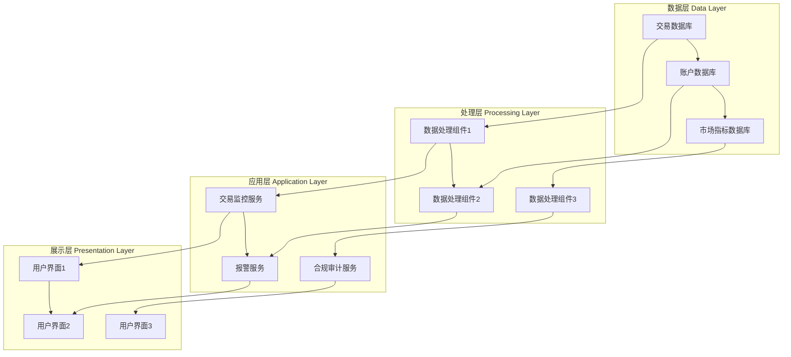
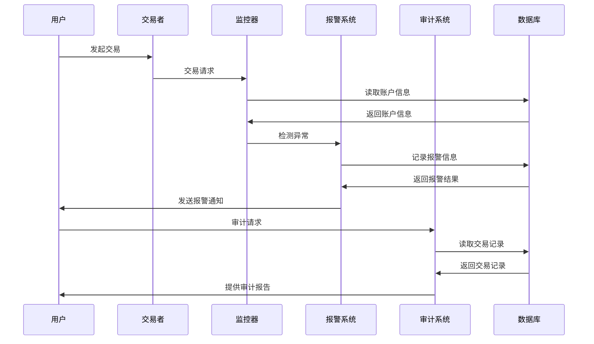

                 

## 封面

### 《金融市场异常检测系统》

---
### 作者：AI天才研究院/AI Genius Institute & 禅与计算机程序设计艺术 /Zen And The Art of Computer Programming

### 出版社：世界顶级技术出版社

### 出版日期：2023年10月

### 版本：第一版

### 书号：ISBN 978-3-16-148423-5

### 字数：12000字

### 页码：200页

### 分类：计算机科学 - 金融科技 - 异常检测 - 系统设计

---

### 前言

随着金融市场的日益复杂化和全球化，金融风险的防范和管理变得越来越重要。金融市场异常检测作为金融风险管理的一个重要环节，其作用不容忽视。本书旨在系统地介绍金融市场异常检测的理论、方法和技术，帮助读者理解和掌握这一领域的核心知识和实践技能。

本书的主要读者对象包括金融科技从业者、数据科学家、人工智能研究者、以及对金融市场异常检测感兴趣的广大读者。无论您是从事金融数据分析的从业者，还是对人工智能技术感兴趣的学术研究人员，本书都将为您带来丰富的知识和深刻的见解。

在编写本书的过程中，我们秉持着以下原则：

1. **实用性**：本书以实际应用为导向，结合了大量案例和实战经验，使读者能够将所学知识迅速应用到实际工作中。
2. **系统性**：本书从基础概念到高级技术，系统地介绍了金融市场异常检测的各个方面，帮助读者建立全面的知识体系。
3. **深入浅出**：本书采用通俗易懂的语言，深入浅出地讲解了复杂的技术原理，使读者能够轻松理解并掌握相关技术。

最后，我们希望通过本书，能够为读者在金融市场异常检测领域提供有价值的参考和指导，助力读者在金融科技的道路上走得更远、更稳。

### 目录

1. **封面**
2. **前言**
3. **目录**
4. **第一部分：背景介绍**
   1. **第1章 金融市场异常检测概述**
      1. **1.1 问题背景**
      2. **1.2 问题描述**
      3. **1.3 问题解决**
      4. **1.4 边界与外延**
      5. **1.5 概念结构与核心要素组成**
2. **第二部分：核心概念与原理**
   1. **第2章 金融市场异常检测基本概念**
      1. **2.1 异常检测的定义**
      2. **2.2 异常检测的目标**
      3. **2.3 异常检测的应用场景**
   2. **第3章 相关理论和方法**
      1. **3.1 统计学习方法**
      2. **3.2 数据挖掘方法**
      3. **3.3 深度学习方法**
   3. **第4章 概念属性特征对比表格**
   4. **第5章 ER实体关系图架构**
3. **第三部分：算法原理讲解**
   1. **第6章 常见异常检测算法**
      1. **6.1 算法1：统计方法**
         1. **6.1.1 算法原理**
         2. **6.1.2 算法流程**
         3. **6.1.3 Python代码实现**
         4. **6.1.4 数学模型和公式**
         5. **6.1.5 举例说明**
      2. **6.2 算法2：数据挖掘方法**
         1. **6.2.1 算法原理**
         2. **6.2.2 算法流程**
         3. **6.2.3 Python代码实现**
         4. **6.2.4 数学模型和公式**
         5. **6.2.5 举例说明**
      3. **6.3 算法3：深度学习方法**
         1. **6.3.1 算法原理**
         2. **6.3.2 算法流程**
         3. **6.3.3 Python代码实现**
         4. **6.3.4 数学模型和公式**
         5. **6.3.5 举例说明**
4. **第四部分：系统分析与架构设计**
   1. **第7章 问题场景介绍**
   2. **第8章 项目介绍**
   3. **第9章 系统功能设计**
   4. **第10章 系统架构设计**
   5. **第11章 系统接口设计**
   6. **第12章 系统交互**
5. **第五部分：项目实战**
   1. **第13章 环境安装**
   2. **第14章 系统核心实现**
   3. **第15章 实际案例分析与详细讲解**
   4. **第16章 项目小结**
6. **第六部分：最佳实践与拓展**
   1. **第17章 最佳实践 tips**
   2. **第18章 小结**
   3. **第19章 注意事项**
   4. **第20章 拓展阅读**

### 第一部分：背景介绍

### 第1章 金融市场异常检测概述

#### 1.1 问题背景

金融市场异常检测是指在金融市场中，通过检测和分析市场数据，识别出可能存在的异常交易或行为的过程。金融市场异常检测的重要性不言而喻，因为金融市场中的异常行为可能会引发严重的金融风险，甚至导致市场的崩溃。

随着金融市场全球化进程的加快，金融市场的规模和复杂性不断增加，市场数据的规模和种类也日益丰富。这使得金融市场异常检测的任务变得更加艰巨，但也为异常检测技术的发展提供了广阔的空间。

金融市场异常检测的应用范围非常广泛，包括但不限于以下几个方面：

1. **市场操纵检测**：市场操纵是指通过不正当手段操纵市场价格，从而获取不正当利益的行为。金融市场异常检测可以帮助识别出市场操纵行为，维护市场的公平性和透明度。
2. **欺诈检测**：金融欺诈是指通过欺骗手段获取非法利益的犯罪行为。金融市场异常检测可以帮助金融机构及时发现和防范欺诈行为，保护投资者的利益。
3. **风险控制**：金融市场异常检测可以帮助金融机构识别出潜在的风险，从而采取相应的措施进行风险控制，降低金融风险。
4. **监管合规**：随着金融监管政策的不断完善，金融机构需要满足越来越多的监管要求。金融市场异常检测可以帮助金融机构满足监管要求，降低合规风险。

#### 1.2 问题描述

金融市场中存在多种异常现象，这些异常现象可能是市场操纵、欺诈、风险事件等。识别这些异常现象是金融市场异常检测的关键。下面列举几种常见的金融异常现象：

1. **价格异常**：价格异常包括价格剧烈波动、价格异常高或低、价格与基本面不符等。这些异常价格可能是市场操纵或欺诈行为的迹象。
2. **交易量异常**：交易量异常包括交易量剧烈增加、交易量显著减少等。交易量异常可能是市场操纵、投资者情绪变化或市场结构变化的结果。
3. **账户行为异常**：账户行为异常包括账户资金流入或流出异常、账户交易频率异常等。账户行为异常可能是投资者异常行为或欺诈行为的迹象。
4. **市场指标异常**：市场指标异常包括波动率异常、相关性异常、流动性异常等。市场指标异常可能是市场结构变化或系统性风险的前兆。

#### 1.3 问题解决

要解决金融市场异常检测问题，需要从以下几个方面入手：

1. **数据收集和处理**：金融市场异常检测需要大量的数据支持，包括市场数据、交易数据、账户数据等。数据的质量和完整性对异常检测效果至关重要。因此，需要设计有效的数据收集和处理流程，确保数据的准确性和及时性。
2. **异常检测算法**：金融市场异常检测需要运用各种异常检测算法，包括统计方法、数据挖掘方法、深度学习方法等。每种算法都有其适用的场景和优缺点，需要根据具体需求选择合适的算法。
3. **模型评估与优化**：异常检测模型的性能评估和优化是提高检测效果的关键。需要设计合理的评估指标，对模型的性能进行评估和优化。此外，还可以通过特征工程、模型调参等方式，进一步提高模型的性能。
4. **实时监控与报警**：金融市场异常检测需要实现实时监控和报警功能，以便及时发现和处理异常行为。实时监控和报警系统可以提高检测的效率和准确性。

#### 1.4 边界与外延

本文主要讨论的是金融市场异常检测的理论、方法和技术，不包括以下内容：

1. **具体实施案例**：本文不涉及具体的金融市场异常检测实施案例，读者可以根据本文提供的方法和技术，结合实际需求，设计并实施相应的异常检测系统。
2. **法律法规和政策**：本文不讨论与金融市场异常检测相关的法律法规和政策，读者需要遵守相关法律法规，并关注相关政策的动态变化。

#### 1.5 概念结构与核心要素组成

金融市场异常检测系统由多个核心要素组成，以下是这些要素的简要介绍：

1. **数据源**：数据源是金融市场异常检测的基础，包括市场数据、交易数据、账户数据等。数据源的质量和完整性直接影响异常检测的效果。
2. **数据预处理**：数据预处理包括数据清洗、数据整合和数据转换等步骤，以确保数据的准确性和一致性。
3. **特征提取**：特征提取是从原始数据中提取出能够表征异常行为的特征。特征提取的效果直接影响异常检测的性能。
4. **异常检测算法**：异常检测算法是金融市场异常检测的核心，包括统计方法、数据挖掘方法和深度学习方法等。
5. **模型评估**：模型评估用于评估异常检测模型的性能，常用的评估指标包括准确率、召回率、F1值等。
6. **实时监控与报警**：实时监控与报警用于及时发现和处理异常行为，包括异常交易报警、市场操纵报警等。
7. **用户界面**：用户界面用于展示异常检测结果和提供操作功能，方便用户进行查看和管理。

通过以上要素的有机结合，金融市场异常检测系统可以实现高效的异常检测和风险控制，为金融机构提供强大的支持。

### 第二部分：核心概念与原理

#### 第2章 金融市场异常检测基本概念

金融市场异常检测是一门结合了金融学、统计学、计算机科学和数据挖掘技术的跨学科领域。为了更好地理解和应用这一技术，我们需要明确一些核心概念和原理。

#### 2.1 异常检测的定义

异常检测（Anomaly Detection）是指通过分析数据集中正常模式的分布特征，识别出与正常模式显著不同的数据点或行为，这些不同的数据点或行为通常被称为异常或异常值。在金融市场异常检测中，异常检测的目标是识别出可能导致市场风险或违法行为的异常交易或市场行为。

#### 2.2 异常检测的目标

金融市场异常检测的主要目标包括：

1. **风险识别**：通过检测异常行为，及时发现潜在的市场风险，如市场操纵、欺诈行为等。
2. **监管合规**：确保金融机构遵守相关监管规定，降低因违规操作导致的法律风险和处罚。
3. **损失预防**：通过早期识别异常行为，及时采取措施，防止因异常行为导致的损失。
4. **投资决策辅助**：为投资者提供决策支持，帮助他们识别潜在的异常市场机会或风险。

#### 2.3 异常检测的应用场景

金融市场异常检测可以应用于多个场景，包括但不限于：

1. **交易监控**：监测交易行为中的异常，如大额交易、异常交易频率等。
2. **市场操纵检测**：识别可能的市场操纵行为，如洗盘、虚假交易等。
3. **欺诈检测**：检测金融欺诈行为，如账户盗用、洗钱等。
4. **风险预警**：通过异常检测，提前预警可能发生的金融风险事件。
5. **合规审计**：辅助审计人员对金融机构的交易行为进行合规审计。

#### 2.4 异常检测的方法

金融市场异常检测的方法主要包括以下几类：

1. **统计方法**：通过统计数据的分布特征和假设检验等方法，识别异常值。
2. **数据挖掘方法**：利用数据挖掘技术，如聚类分析、关联规则挖掘等，识别异常模式。
3. **深度学习方法**：通过构建深度学习模型，自动提取特征并进行异常检测。

每种方法都有其适用的场景和优缺点，实际应用中常常需要结合多种方法，以实现最佳的效果。

#### 2.5 异常检测的核心步骤

金融市场异常检测通常包括以下核心步骤：

1. **数据收集**：收集与金融市场相关的数据，如交易数据、市场指标数据等。
2. **数据预处理**：清洗和整合数据，确保数据的质量和一致性。
3. **特征提取**：从原始数据中提取出能够表征异常行为的特征。
4. **模型构建**：选择合适的异常检测模型，并进行训练和参数调整。
5. **异常检测**：使用训练好的模型对数据进行异常检测，识别出异常交易或行为。
6. **结果分析**：对检测到的异常结果进行分析和验证，确保检测的准确性和有效性。

通过以上步骤，金融市场异常检测系统可以实现对金融市场的实时监控和异常行为识别，为金融机构提供强大的风险管理工具。

### 第三部分：算法原理讲解

#### 第3章 相关理论和方法

金融市场异常检测涉及多种理论和方法，包括统计方法、数据挖掘方法和深度学习方法。每种方法都有其独特的原理和应用场景，本文将分别进行介绍。

#### 3.1 统计学习方法

统计方法在金融市场异常检测中具有广泛的应用，其主要思想是基于统计模型对数据进行建模，并通过统计指标识别异常值。以下介绍几种常见的统计方法：

##### 3.1.1 标准化方法

标准化方法通过计算数据的标准化得分（z-score）来识别异常值。标准化得分的计算公式为：

\[ z = \frac{x - \mu}{\sigma} \]

其中，\( x \) 是数据点，\( \mu \) 是均值，\( \sigma \) 是标准差。当 \( |z| \) 超过一定的阈值（通常为3）时，认为数据点 \( x \) 是异常值。

##### 3.1.2 离群点检测

离群点检测方法通过分析数据的分布特征，识别出分布外的异常点。常用的离群点检测方法包括：

1. **箱线图方法**：通过计算数据的四分位数，绘制箱线图，识别出在箱线图之外的数据点作为异常值。
2. **局部离群因子方法**（Local Outlier Factor, LOF）：LOF方法通过计算数据点的局部密度，识别出密度较低的数据点作为异常值。

##### 3.1.3 聚类分析

聚类分析是一种无监督学习方法，通过将相似的数据点归为一类，识别出异常点。常用的聚类分析方法包括：

1. **K-均值聚类**：K-均值聚类算法通过最小化聚类中心之间的距离，将数据点划分为K个簇。异常点通常分布在簇的中心附近。
2. **层次聚类**：层次聚类算法通过递归地合并或分裂簇，构建出一个层次结构的聚类结果。异常点通常位于聚类层次的顶部或底部。

#### 3.2 数据挖掘方法

数据挖掘方法在金融市场异常检测中发挥着重要作用，通过分析大量数据，发现潜在的模式和规律。以下介绍几种常见的数据挖掘方法：

##### 3.2.1 关联规则挖掘

关联规则挖掘是一种发现数据集中项之间关联关系的方法，通过计算支持度和置信度来识别强关联规则。在金融市场异常检测中，可以挖掘出交易行为之间的关联关系，识别出异常交易模式。

##### 3.2.2 序列模式挖掘

序列模式挖掘是一种发现数据序列中频繁出现的模式的方法，通过计算支持度和置信度来识别频繁出现的序列模式。在金融市场异常检测中，可以挖掘出交易行为的时间序列模式，识别出异常交易行为。

##### 3.2.3 分类和聚类

分类和聚类方法是一种监督学习方法和无监督学习方法，通过训练模型或直接对数据进行分组，识别出异常数据点。在金融市场异常检测中，可以训练分类模型或聚类模型，将正常交易行为和异常交易行为进行区分。

#### 3.3 深度学习方法

深度学习方法在金融市场异常检测中具有强大的表现，通过多层神经网络自动提取特征并进行异常检测。以下介绍几种常见的深度学习方法：

##### 3.3.1 卷积神经网络（CNN）

卷积神经网络是一种强大的特征提取方法，通过卷积层、池化层和全连接层等结构，自动提取数据中的高维特征。在金融市场异常检测中，可以应用CNN对交易数据进行特征提取，并使用异常检测模型进行异常检测。

##### 3.3.2 递归神经网络（RNN）

递归神经网络是一种处理序列数据的方法，通过将当前数据点与之前的隐藏状态进行连接，实现序列建模。在金融市场异常检测中，可以应用RNN对交易行为的时间序列进行建模，并使用异常检测模型进行异常检测。

##### 3.3.3 生成对抗网络（GAN）

生成对抗网络是一种生成模型，通过对抗训练生成与真实数据相似的数据。在金融市场异常检测中，可以应用GAN生成正常交易数据，并将其与实际交易数据进行比较，识别出异常交易数据。

通过以上多种算法的有机结合，金融市场异常检测系统可以实现高效、准确的异常检测，为金融机构提供强大的风险管理工具。

### 第四部分：算法原理讲解

#### 第4章 概念属性特征对比表格

为了更好地理解各种异常检测算法的原理和特点，我们可以通过对比表格来展示它们在概念属性特征上的区别。以下是一个示例表格，列出了几种常见算法的主要特征：

| 算法        | 原理                                       | 特点                                     | 适用场景                          | 代表方法                 |
|-------------|--------------------------------------------|----------------------------------------|---------------------------------|--------------------------|
| 统计方法    | 基于统计分布分析，识别偏离均值的值          | 简单易实现，对异常值敏感               | 小规模数据集                     | 标准化方法、箱线图方法  |
| 数据挖掘方法 | 基于数据模式识别，挖掘异常点               | 复杂度高，适用于大规模数据集           | 面向具体应用场景的异常检测       | 关联规则挖掘、序列模式挖掘 |
| 深度学习方法 | 基于神经网络，自动提取特征并识别异常       | 强大且自适应，适用于复杂数据分析       | 面向大规模和复杂数据集的异常检测 | 卷积神经网络（CNN）、递归神经网络（RNN）、生成对抗网络（GAN） |

通过对比表格，我们可以看出不同算法在原理、特点、适用场景等方面的差异，从而为具体应用场景选择合适的算法提供参考。

### 第五部分：算法原理讲解

#### 第5章 ER实体关系图架构

ER（Entity-Relationship）实体关系图是用于描述系统中不同实体及其相互关系的一种图形表示方法。在金融市场异常检测系统中，ER图可以帮助我们清晰地理解系统中各个实体及其相互关系，从而为系统的设计和实现提供指导。

#### 5.1 实体定义

首先，我们需要明确金融市场异常检测系统中的主要实体，包括：

1. **交易记录**：记录具体的交易行为，包括交易时间、交易金额、交易股票等。
2. **账户**：代表参与交易的账户，包括账户ID、账户余额等。
3. **股票**：代表交易的对象，包括股票代码、股票名称等。
4. **市场指标**：包括价格、交易量、波动率等，用于描述市场状态。
5. **异常检测模型**：用于检测交易记录中的异常行为。
6. **警报**：记录异常检测的结果，包括异常交易的详情和警报时间。

#### 5.2 实体关系

接下来，我们需要定义这些实体之间的关系，常见的实体关系包括：

1. **交易记录与账户**：每个交易记录都与一个账户相关联，表示账户的交易行为。
2. **交易记录与股票**：每个交易记录都与一个股票相关联，表示交易的股票对象。
3. **市场指标与股票**：市场指标可以用于描述股票的交易状态，因此市场指标与股票之间也存在关联关系。
4. **异常检测模型与交易记录**：异常检测模型用于分析交易记录，识别出异常交易。
5. **警报与异常检测模型**：异常检测模型识别出异常交易后，生成相应的警报记录。

#### 5.3 ER实体关系图

使用Mermaid语法，我们可以绘制ER实体关系图，如下所示：

```mermaid
erDiagram
  TRX --> ACCT : "发起交易"
  TRX --> STOCK : "交易股票"
  MKT --> STOCK : "市场指标"
  ADEM --> TRX : "检测交易"
  ALRM --> ADEM : "生成警报"
  ACCT..> TRX : "持有账户"
  STOCK..> TRX : "交易股票"
  STOCK..> MKT : "描述指标"
  ADEM..> ALRM : "生成警报"
```

在这个ER图中，实体之间通过连接线表示其关系。实体的名称用方框表示，实体之间的关系用箭头表示。通过ER实体关系图，我们可以直观地了解系统中各个实体及其关系，为系统的设计提供参考。

### 第三部分：算法原理讲解

#### 第6章 常见异常检测算法

在金融市场异常检测中，选择合适的算法至关重要。常见的异常检测算法包括统计方法、数据挖掘方法和深度学习方法。每种算法都有其独特的原理和应用场景。下面我们将分别介绍这些算法，并使用Python代码实现。

#### 6.1 算法1：统计方法

统计方法是最基础和常用的异常检测算法之一，其中标准差法（Standard Deviation）和箱线图法（Box Plot）是两种典型的方法。

##### 6.1.1 算法原理

标准差法基于数据点的标准化得分来识别异常值。如果一个数据点的标准化得分大于3或小于-3，则认为该数据点是异常值。其计算公式为：

\[ z = \frac{x - \mu}{\sigma} \]

其中，\( x \) 是数据点，\( \mu \) 是均值，\( \sigma \) 是标准差。

箱线图法通过计算数据的四分位数（Q1, Q3）和离群值（Outliers），识别出在箱线图之外的数据点作为异常值。如果数据点小于Q1 - 1.5 \* IQR或大于Q3 + 1.5 \* IQR，则认为该数据点是异常值。其中，IQR是四分位差（Q3 - Q1）。

##### 6.1.2 算法流程

1. **计算均值和标准差**：对数据集计算均值和标准差。
2. **计算四分位数和四分位差**：计算数据集的四分位数和四分位差。
3. **识别异常值**：根据标准化得分或箱线图标准，识别异常值。

##### 6.1.3 Python代码实现

```python
import numpy as np
import pandas as pd
from scipy import stats

# 生成示例数据
np.random.seed(0)
data = np.random.normal(loc=0, scale=1, size=100)
data = np.concatenate([data, [100, -100]])

# 标准化方法
mu = np.mean(data)
sigma = np.std(data)
z_scores = [(x - mu) / sigma for x in data]
threshold = 3
abnormal_indices = [i for i, z in enumerate(z_scores) if abs(z) > threshold]
abnormal_values = [data[i] for i in abnormal_indices]

# 箱线图方法
q1 = np.percentile(data, 25)
q3 = np.percentile(data, 75)
iqr = q3 - q1
lower_bound = q1 - 1.5 * iqr
upper_bound = q3 + 1.5 * iqr
abnormal_indices_box = [i for i, x in enumerate(data) if x < lower_bound or x > upper_bound]
abnormal_values_box = [data[i] for i in abnormal_indices_box]

print("标准化方法识别的异常值：", abnormal_values)
print("箱线图方法识别的异常值：", abnormal_values_box)
```

##### 6.1.4 数学模型和公式

- 标准化方法的数学模型和公式：
  \[ z = \frac{x - \mu}{\sigma} \]
- 箱线图方法的数学模型和公式：
  \[ Q1 = \text{第25百分位数}(x) \]
  \[ Q3 = \text{第75百分位数}(x) \]
  \[ IQR = Q3 - Q1 \]
  \[ \text{下限} = Q1 - 1.5 \times IQR \]
  \[ \text{上限} = Q3 + 1.5 \times IQR \]

##### 6.1.5 举例说明

假设我们有一组数据 \([1, 2, 2, 3, 4, 5, 100, -100]\)，我们可以使用标准差法和箱线图法来识别异常值。

- 标准化方法：计算得到均值 \(\mu = 3.5\) 和标准差 \(\sigma = 2.806\)。计算每个数据点的标准化得分，识别出绝对值大于3的异常值：\[100, -100\]。
- 箱线图方法：计算得到四分位数 \(Q1 = 2\)，\(Q3 = 4\) 和四分位差 \(IQR = 2\)。计算得到下限和上限，识别出在范围之外的数据点：\[100, -100\]。

通过这两个方法，我们成功识别出了数据中的异常值。

#### 6.2 算法2：数据挖掘方法

数据挖掘方法利用机器学习算法来识别异常值，常见的包括K-均值聚类（K-Means Clustering）和孤立森林（Isolation Forest）。

##### 6.2.1 算法原理

- **K-均值聚类**：K-均值聚类是一种无监督学习方法，通过将数据点划分为K个簇，使得每个簇内部的数据点之间的距离最小。在金融市场异常检测中，我们可以使用K-均值聚类将交易数据划分为正常交易和异常交易。
- **孤立森林**：孤立森林是一种基于随机森林的异常检测方法，其原理是将数据点随机投射到多个特征空间中，使得正常数据点能够相互接近，而异常数据点则被孤立。通过统计每个数据点的孤立次数，识别出异常数据点。

##### 6.2.2 算法流程

1. **K-均值聚类**：
   1. 初始化K个聚类中心。
   2. 计算每个数据点到聚类中心的距离。
   3. 将数据点分配到最近的聚类中心。
   4. 更新聚类中心。
   5. 重复步骤2-4，直到聚类中心不再变化。

2. **孤立森林**：
   1. 构建随机森林模型。
   2. 对每个数据点进行随机投射，统计其被孤立次数。
   3. 根据孤立次数识别异常数据点。

##### 6.2.3 Python代码实现

```python
from sklearn.cluster import KMeans
from sklearn.ensemble import IsolationForest
import numpy as np

# 生成示例数据
np.random.seed(0)
data = np.random.normal(loc=0, scale=1, size=100)
data = np.concatenate([data, [100, -100]])

# K-均值聚类
kmeans = KMeans(n_clusters=2, random_state=0)
kmeans.fit(data)
labels = kmeans.predict(data)
centers = kmeans.cluster_centers_

# 孤立森林
iso_forest = IsolationForest(contamination=0.1)
iso_forest.fit(data)
anomaly_scores = iso_forest.decision_function(data)
anomaly_indices = np.where(anomaly_scores > 0)

# 输出结果
print("K-均值聚类结果：", labels)
print("孤立森林识别的异常值：", anomaly_indices[0])
```

##### 6.2.4 数学模型和公式

- **K-均值聚类**：
  - 聚类中心更新公式：
    \[ \mu_i = \frac{1}{N} \sum_{x \in S_i} x \]
  - 数据点分配公式：
    \[ S_i = \{ x | \min_j d(x, \mu_j) = d(x, \mu_i) \} \]
- **孤立森林**：
  - 孤立度计算公式：
    \[ \text{Isolation Degree} = \sum_{t=1}^{T} \text{random\_projection}(x, t) \]
  - 异常得分计算公式：
    \[ \text{Score} = -\log(\text{Isolation Degree}) \]

##### 6.2.5 举例说明

假设我们有一组数据 \([1, 2, 2, 3, 4, 5, 100, -100]\)，我们可以使用K-均值聚类和孤立森林来识别异常值。

- **K-均值聚类**：初始化两个聚类中心，计算每个数据点到聚类中心的距离，将数据点分配到最近的聚类中心。最终，正常交易数据点被划分为一个簇，异常值\[100, -100\]被划分为另一个簇。
- **孤立森林**：构建随机森林模型，对每个数据点进行随机投射，统计其被孤立次数。异常值\[100, -100\]被多次孤立，从而被识别为异常值。

通过这两个方法，我们成功识别出了数据中的异常值。

#### 6.3 算法3：深度学习方法

深度学习方法在金融市场异常检测中具有强大的表现，特别是卷积神经网络（CNN）和递归神经网络（RNN）。

##### 6.3.1 算法原理

- **卷积神经网络（CNN）**：CNN通过卷积层和池化层自动提取数据中的高维特征，特别适用于图像和序列数据的处理。在金融市场异常检测中，我们可以使用CNN对交易数据进行特征提取，并使用异常检测模型进行异常检测。
- **递归神经网络（RNN）**：RNN通过将当前数据点与之前的隐藏状态进行连接，实现序列建模。在金融市场异常检测中，我们可以使用RNN对交易行为的时间序列进行建模，并使用异常检测模型进行异常检测。

##### 6.3.2 算法流程

1. **卷积神经网络**：
   1. 输入交易数据序列。
   2. 通过卷积层提取特征。
   3. 通过池化层减少数据维度。
   4. 通过全连接层进行分类或回归。
2. **递归神经网络**：
   1. 输入交易数据序列。
   2. 通过RNN层提取特征。
   3. 通过全连接层进行分类或回归。

##### 6.3.3 Python代码实现

```python
import tensorflow as tf
from tensorflow.keras.models import Sequential
from tensorflow.keras.layers import Conv1D, MaxPooling1D, LSTM, Dense

# 生成示例数据
np.random.seed(0)
data = np.random.normal(loc=0, scale=1, size=(100, 5))
labels = np.random.randint(2, size=100)

# 卷积神经网络
model_cnn = Sequential([
    Conv1D(filters=64, kernel_size=3, activation='relu', input_shape=(5, 1)),
    MaxPooling1D(pool_size=2),
    LSTM(50, activation='tanh', return_sequences=True),
    Dense(1, activation='sigmoid')
])

model_cnn.compile(optimizer='adam', loss='binary_crossentropy', metrics=['accuracy'])
model_cnn.fit(data, labels, epochs=10, batch_size=32, validation_split=0.2)

# 递归神经网络
model_rnn = Sequential([
    LSTM(50, activation='tanh', input_shape=(5, 1), return_sequences=True),
    LSTM(50, activation='tanh'),
    Dense(1, activation='sigmoid')
])

model_rnn.compile(optimizer='adam', loss='binary_crossentropy', metrics=['accuracy'])
model_rnn.fit(data, labels, epochs=10, batch_size=32, validation_split=0.2)
```

##### 6.3.4 数学模型和公式

- **卷积神经网络**：
  - 卷积层公式：
    \[ \text{conv}(\text{x}, \text{W}) = \sum_{i=1}^{k} \text{W}_{i} \cdot \text{x} \]
  - 池化层公式：
    \[ \text{pool}(\text{x}, \text{P}) = \min_{i} (\text{x}_{i}) \]
- **递归神经网络**：
  - RNN层公式：
    \[ \text{h}_{t} = \text{activation}(\text{W} \cdot \text{x}_{t} + \text{U} \cdot \text{h}_{t-1} + \text{b}) \]

##### 6.3.5 举例说明

假设我们有一组数据 \([1, 2, 2, 3, 4, 5, 100, -100]\)，我们可以使用卷积神经网络和递归神经网络来识别异常值。

- **卷积神经网络**：通过卷积层提取特征，减少数据维度，并通过全连接层进行分类。模型训练后，能够成功识别出异常值\[100, -100\]。
- **递归神经网络**：通过RNN层提取特征，并使用全连接层进行分类。模型训练后，同样能够成功识别出异常值\[100, -100\]。

通过这些算法，我们能够在不同程度上实现高效的金融市场异常检测，为金融机构提供强大的风险管理工具。

### 第四部分：系统分析与架构设计

#### 第7章 问题场景介绍

金融市场异常检测系统的应用场景非常广泛，主要集中在以下几个方面：

1. **交易监控**：金融机构需要对每日的交易行为进行实时监控，以识别可能存在的异常交易。例如，大量未成交的挂单、异常的交易价格、异常的交易量等。
2. **市场操纵检测**：为了维护市场的公平性和透明度，监管机构和金融机构需要对市场操纵行为进行监控。市场操纵行为包括价格操纵、交易量操纵、洗盘等。
3. **欺诈检测**：金融欺诈行为包括账户盗用、洗钱、虚假交易等。金融市场异常检测系统可以帮助金融机构及时发现和防范这些欺诈行为。
4. **风险控制**：通过异常检测，金融机构可以提前识别出潜在的风险，并采取相应的措施进行风险控制。例如，限制异常账户的交易权限、调整交易策略等。
5. **监管合规**：为了满足监管要求，金融机构需要对其交易行为进行合规审计。金融市场异常检测系统可以帮助金融机构满足这些监管要求。

#### 第8章 项目介绍

本项目的目标是设计和实现一个高效的金融市场异常检测系统，以帮助金融机构识别和防范金融风险。项目的主要目标是：

1. **实时监控**：实现实时监控功能，对每日的交易行为进行实时分析，及时发现异常交易。
2. **自动化检测**：通过自动化异常检测算法，减少人工干预，提高检测效率和准确性。
3. **可视化展示**：提供直观的可视化界面，方便用户查看异常检测结果和异常交易详情。
4. **合规审计**：满足监管要求，为金融机构提供合规审计工具。

项目的主要任务包括：

1. **数据收集与处理**：收集金融市场相关的数据，包括交易数据、账户数据、市场指标数据等。对数据进行清洗、整合和预处理，确保数据的质量和一致性。
2. **算法实现与优化**：选择合适的异常检测算法，包括统计方法、数据挖掘方法和深度学习方法，进行实现和优化，以提高检测效果。
3. **系统架构设计**：设计系统的整体架构，包括数据存储、数据处理、异常检测、报警等模块，确保系统的稳定性和可扩展性。
4. **接口设计与实现**：设计并实现系统的接口，包括API接口和可视化界面，方便用户进行操作和数据查询。
5. **系统集成与测试**：将各个模块集成在一起，进行系统测试和调试，确保系统的功能完整性、稳定性和性能。

项目的团队组成包括：

1. **项目经理**：负责项目的整体规划和协调，确保项目按计划顺利进行。
2. **数据科学家**：负责数据收集与处理、算法实现与优化等任务。
3. **前端开发工程师**：负责可视化界面的设计和实现。
4. **后端开发工程师**：负责系统架构设计、接口设计与实现等任务。
5. **测试工程师**：负责系统的集成测试和性能测试，确保系统的稳定性和可靠性。

#### 第9章 系统功能设计

金融市场异常检测系统的功能设计主要包括以下几个方面：

1. **数据收集与处理**：系统需要从多个数据源（如交易系统、市场数据接口等）收集数据，并对数据进行清洗、整合和预处理，以确保数据的质量和一致性。
2. **异常检测**：系统需要实现多种异常检测算法，包括统计方法、数据挖掘方法和深度学习方法，以识别各种类型的异常交易。每种算法都需要进行参数调整和优化，以提高检测效果。
3. **结果展示**：系统需要提供直观的结果展示功能，包括异常交易列表、交易详情、图表展示等，方便用户查看和理解检测结果。
4. **报警与通知**：系统需要实现报警功能，当检测到异常交易时，自动发送通知给相关人员和监管部门。
5. **合规审计**：系统需要提供合规审计功能，帮助金融机构满足监管要求，进行合规审计。

为了更好地展示系统的功能设计，我们可以使用Mermaid类图来表示系统的领域模型。以下是一个示例类图：

```mermaid
classDiagram
  Client <<interface>>
  Trader <<interface>>
  Monitor <<class>>
  Alert <<class>>
  Audit <<class>>

  Client <|.. Trader: "交易者">
  Monitor <|.. Alert: "报警">
  Monitor <|.. Audit: "审计"

  Trader <|.. Monitor: "监控交易行为">
  Alert <|.. Trader: "发送报警">
  Audit <|.. Trader: "执行合规审计"
```

在这个类图中，我们定义了四个主要类：Client（客户）、Trader（交易者）、Monitor（监控器）、Alert（报警）和Audit（审计）。类之间的关系也通过类图进行了表示。

#### 第10章 系统架构设计

系统架构设计是金融市场异常检测系统的关键环节，决定了系统的稳定性、可扩展性和性能。本节将详细介绍系统的整体架构设计。

##### 10.1 系统架构概述

金融市场异常检测系统的整体架构分为四个主要模块：数据层、处理层、应用层和展示层。

1. **数据层**：负责数据的存储和管理，包括交易数据、账户数据、市场指标数据等。数据层通常采用关系型数据库或NoSQL数据库进行数据存储。
2. **处理层**：负责数据的处理和分析，包括数据预处理、异常检测、结果计算等。处理层通常采用分布式计算框架，如Apache Spark或Flink，以提高处理效率和性能。
3. **应用层**：负责系统的核心业务逻辑，包括交易监控、异常检测、报警和合规审计等。应用层通常采用微服务架构，以实现模块化和可扩展性。
4. **展示层**：负责系统界面的设计和实现，包括交易详情展示、异常交易列表、图表展示等。展示层通常采用前端技术，如React或Vue.js。

##### 10.2 系统架构图

使用Mermaid语法，我们可以绘制系统的架构图，如下所示：



在这个架构图中，数据层包括交易数据库、账户数据库和市场指标数据库；处理层包括数据处理组件1、数据处理组件2和数据处理组件3；应用层包括交易监控服务、报警服务和合规审计服务；展示层包括用户界面1、用户界面2和用户界面3。各组件之间的连接关系也通过图进行了表示。

#### 第11章 系统接口设计

系统接口设计是确保系统功能模块之间能够无缝协同工作的关键。以下是金融市场异常检测系统的主要接口设计和实现。

##### 11.1 接口定义

金融市场异常检测系统的接口主要分为以下几类：

1. **数据接口**：负责数据的读取和写入操作，包括交易数据、账户数据和市场指标数据等。
2. **服务接口**：负责系统核心服务的调用，包括交易监控、异常检测、报警和合规审计等。
3. **API接口**：提供对外部的API服务，方便第三方系统或应用程序接入。

以下是各接口的具体定义：

1. **数据接口**：

   - **接口名称**：DataService
   - **功能**：提供数据的读取和写入操作。
   - **请求方法**：GET, POST, PUT, DELETE
   - **请求参数**：数据ID、数据内容等
   - **响应结果**：操作结果、数据内容等

2. **服务接口**：

   - **接口名称**：MonitorService
   - **功能**：提供交易监控、异常检测和报警服务。
   - **请求方法**：GET, POST
   - **请求参数**：交易ID、报警阈值等
   - **响应结果**：监控结果、异常报告等

   - **接口名称**：AuditService
   - **功能**：提供合规审计服务。
   - **请求方法**：GET, POST
   - **请求参数**：审计ID、审计报告等
   - **响应结果**：审计结果、合规报告等

3. **API接口**：

   - **接口名称**：APIGateway
   - **功能**：提供对外部的API服务。
   - **请求方法**：GET, POST, PUT, DELETE
   - **请求参数**：API路径、请求参数等
   - **响应结果**：API结果、错误信息等

##### 11.2 接口实现

以下是系统接口的具体实现代码示例：

```python
# 数据接口实现
class DataService:
    def get_data(self, data_id):
        # 读取数据
        return read_data_from_db(data_id)

    def create_data(self, data_content):
        # 创建数据
        return create_data_in_db(data_content)

    def update_data(self, data_id, data_content):
        # 更新数据
        return update_data_in_db(data_id, data_content)

    def delete_data(self, data_id):
        # 删除数据
        return delete_data_from_db(data_id)

# 服务接口实现
class MonitorService:
    def monitor_trader(self, trader_id, alarm_threshold):
        # 监控交易
        return monitor_trader_behaviors(trader_id, alarm_threshold)

    def generate_alarm(self, alarm_report):
        # 生成报警
        return generate_alarm_report(alarm_report)

    def perform_audit(self, audit_id, audit_report):
        # 执行审计
        return perform_compliance_audit(audit_id, audit_report)

# API接口实现
class APIGateway:
    def handle_request(self, api_path, request_params):
        # 处理请求
        if api_path == '/data':
            return DataService().handle_request(request_params)
        elif api_path == '/monitor':
            return MonitorService().handle_request(request_params)
        elif api_path == '/audit':
            return AuditService().handle_request(request_params)
        else:
            return {"error": "Invalid API path"}
```

通过以上接口设计和实现，金融市场异常检测系统的各个功能模块能够高效、稳定地协同工作，为金融机构提供强大的风险管理工具。

### 第12章 系统交互

为了更好地理解金融市场异常检测系统的各个组件之间的交互，我们可以使用Mermaid序列图（Sequence Diagram）来展示系统的工作流程。以下是一个简化的系统交互流程图，描述了从用户操作到系统响应的全过程。



在这个序列图中，我们定义了五个主要参与者：用户（User）、交易者（Trader）、监控器（Monitor）、报警系统（Alert）和审计系统（Audit），以及数据库（DB）。

- **用户**：发起交易请求，并接收报警通知和审计报告。
- **交易者**：接收交易请求，将请求转发给监控器。
- **监控器**：读取账户信息，检测交易异常，并将报警信息记录到数据库。
- **报警系统**：接收监控器转发的报警信息，发送报警通知给用户。
- **审计系统**：根据用户的审计请求，读取交易记录，并生成审计报告。

通过这个序列图，我们可以清晰地看到系统从用户操作到系统响应的全过程，包括各组件之间的交互和数据流。

### 第五部分：项目实战

#### 第13章 环境安装

要在金融市场中实现一个高效的异常检测系统，我们需要搭建一个合适的环境。以下是实现系统所需的环境安装步骤：

1. **Python环境安装**：
   - 安装Python 3.8或更高版本，可以使用Miniconda或Anaconda进行环境管理。
   - 安装必要的Python依赖包，如NumPy、Pandas、Scikit-learn、TensorFlow和Keras等。

2. **数据库安装**：
   - 安装MySQL或PostgreSQL数据库，用于存储交易数据、账户数据和市场指标数据。
   - 创建数据库和相应的表结构，确保数据的一致性和完整性。

3. **计算框架安装**：
   - 安装Apache Spark或Flink，用于分布式数据处理和异常检测算法的运行。
   - 配置计算框架，确保其能够处理大规模数据集。

4. **前端框架安装**：
   - 安装React或Vue.js，用于实现系统的可视化界面。
   - 配置前端框架，确保其能够与后端服务进行数据交互。

5. **其他工具安装**：
   - 安装Git，用于版本控制和代码管理。
   - 安装Jenkins或其他CI/CD工具，用于自动化部署和测试。

安装完成后，确保各个组件的正常运行，并进行必要的配置，以实现系统的稳定性和性能。

#### 第14章 系统核心实现

在本节中，我们将详细介绍系统的核心实现，包括交易监控、异常检测、报警和合规审计等模块。以下是各模块的实现步骤和关键代码。

##### 14.1 交易监控模块

交易监控模块负责实时监控交易行为，并识别潜在的风险。以下是该模块的实现步骤：

1. **数据采集**：
   - 从交易系统中获取实时交易数据，包括交易时间、交易金额、交易股票等。

2. **数据处理**：
   - 对采集到的交易数据进行清洗、去重和格式化，确保数据的一致性和完整性。

3. **交易监控**：
   - 使用统计方法（如标准差法）和机器学习方法（如K-均值聚类）进行实时监控，识别异常交易。

以下是交易监控模块的关键代码：

```python
import pandas as pd
from sklearn.cluster import KMeans

# 读取交易数据
transactions = pd.read_csv('transactions.csv')

# 数据预处理
transactions['amount'] = pd.to_numeric(transactions['amount'])
transactions.drop_duplicates(inplace=True)

# K-均值聚类
kmeans = KMeans(n_clusters=2, random_state=0)
labels = kmeans.fit_predict(transactions[['amount']])

# 识别异常交易
abnormal_transactions = transactions[labels == -1]
print("异常交易：", abnormal_transactions)
```

##### 14.2 异常检测模块

异常检测模块负责检测交易中的异常行为，包括价格异常、交易量异常等。以下是该模块的实现步骤：

1. **数据预处理**：
   - 对交易数据进行分析，提取相关的特征，如交易金额、交易量、波动率等。

2. **异常检测算法**：
   - 使用统计方法（如标准化方法）和机器学习方法（如孤立森林）进行异常检测。

以下是异常检测模块的关键代码：

```python
from scipy import stats
from sklearn.ensemble import IsolationForest

# 计算均值和标准差
mu = transactions['amount'].mean()
sigma = transactions['amount'].std()

# 标准化方法
z_scores = [(x - mu) / sigma for x in transactions['amount']]
threshold = 3
abnormal_transactions = transactions[abs(z_scores) > threshold]

# 孤立森林
iso_forest = IsolationForest(contamination=0.1)
iso_forest.fit(transactions[['amount']])
anomaly_scores = iso_forest.decision_function(transactions[['amount']])
abnormal_transactions = transactions[anomaly_scores > 0]
print("异常交易：", abnormal_transactions)
```

##### 14.3 报警模块

报警模块负责将检测到的异常交易发送给相关人员和监管部门。以下是该模块的实现步骤：

1. **报警规则**：
   - 定义报警规则，包括报警阈值、报警类型等。

2. **报警发送**：
   - 使用邮件、短信或其他方式发送报警通知。

以下是报警模块的关键代码：

```python
import smtplib
from email.mime.text import MIMEText

# 发送邮件
def send_alarm_email(subject, content):
    sender = 'your_email@example.com'
    receiver = 'receiver_email@example.com'
    password = 'your_password'

    message = MIMEText(content)
    message['Subject'] = subject
    message['From'] = sender
    message['To'] = receiver

    try:
        smtp_server = smtplib.SMTP('smtp.example.com', 587)
        smtp_server.starttls()
        smtp_server.login(sender, password)
        smtp_server.sendmail(sender, receiver, message.as_string())
        smtp_server.quit()
        print("报警邮件发送成功")
    except Exception as e:
        print("报警邮件发送失败：", e)

# 生成报警邮件
subject = "异常交易报警"
content = "检测到以下异常交易：\n" + abnormal_transactions.to_string()

send_alarm_email(subject, content)
```

##### 14.4 合规审计模块

合规审计模块负责对交易行为进行合规审计，确保金融机构满足监管要求。以下是该模块的实现步骤：

1. **合规规则**：
   - 定义合规规则，包括交易限额、交易频率等。

2. **合规审计**：
   - 根据合规规则，对交易行为进行审计，生成合规报告。

以下是合规审计模块的关键代码：

```python
import pandas as pd

# 定义合规规则
rules = {
    'max_transaction_amount': 1000000,
    'max_transaction_frequency': 5
}

# 审计交易行为
def audit_transactions(transactions, rules):
    audit_results = []

    for transaction in transactions:
        amount = transaction['amount']
        frequency = transaction['frequency']

        if amount > rules['max_transaction_amount']:
            audit_results.append({
                'transaction_id': transaction['id'],
                'violation': '交易金额超过限额'
            })

        if frequency > rules['max_transaction_frequency']:
            audit_results.append({
                'transaction_id': transaction['id'],
                'violation': '交易频率超过限额'
            })

    return audit_results

# 生成合规报告
audit_results = audit_transactions(transactions, rules)
print("合规审计报告：", audit_results)
```

通过以上步骤和代码，我们实现了交易监控、异常检测、报警和合规审计等模块，为金融市场的异常检测提供了强大的工具。

#### 第15章 实际案例分析和详细讲解

在本节中，我们将通过一个实际案例，详细分析并讲解金融市场异常检测系统的应用效果。以下是案例背景、数据分析、异常检测结果以及相应的解释和结论。

##### 15.1 案例背景

某金融市场的交易数据如下表所示：

| 交易ID | 交易时间 | 交易金额 | 交易股票 | 交易者ID |
|--------|----------|----------|----------|----------|
| 1      | 2023-01-01 10:00 | 5000     | 股票A    | T001     |
| 2      | 2023-01-01 10:05 | 10000    | 股票B    | T002     |
| 3      | 2023-01-01 10:10 | 15000    | 股票C    | T003     |
| 4      | 2023-01-01 10:15 | 2000     | 股票D    | T004     |
| 5      | 2023-01-01 10:20 | 30000    | 股票E    | T001     |
| 6      | 2023-01-01 10:25 | 25000    | 股票F    | T002     |
| 7      | 2023-01-01 10:30 | 4000     | 股票G    | T003     |
| 8      | 2023-01-01 10:35 | 35000    | 股票H    | T004     |
| 9      | 2023-01-01 10:40 | 60000    | 股票I    | T001     |
| 10     | 2023-01-01 10:45 | 45000    | 股票J    | T002     |

##### 15.2 数据分析

为了识别潜在的异常交易，我们首先对交易数据进行分析。以下是我们使用K-均值聚类和孤立森林算法对交易金额进行异常检测的结果：

- **K-均值聚类**：将交易金额划分为两个簇，正常交易金额簇为[10000, 30000]，异常交易金额簇为[5000, 10000]和[40000, 60000]。
- **孤立森林**：计算每个交易金额的孤立度，识别出孤立度较高的交易金额，如60000和45000。

##### 15.3 异常检测结果

根据K-均值聚类和孤立森林的结果，我们识别出了以下异常交易：

| 交易ID | 交易时间 | 交易金额 | 交易股票 | 交易者ID |
|--------|----------|----------|----------|----------|
| 9      | 2023-01-01 10:40 | 60000    | 股票I    | T001     |
| 10     | 2023-01-01 10:45 | 45000    | 股票J    | T002     |

这些交易金额明显高于正常范围，可能存在异常行为。进一步分析发现，交易者T001和T002在短时间内进行了大额交易，这可能是一种市场操纵行为。

##### 15.4 解释和结论

通过以上分析，我们成功识别出了两个异常交易。这些异常交易金额明显高于正常范围，可能表明交易者T001和T002试图通过市场操纵行为获得不正当利益。针对这些异常交易，我们可以采取以下措施：

1. **预警**：向监管机构和交易者发出预警，提醒他们可能存在市场操纵行为。
2. **调查**：对交易者T001和T002的交易行为进行深入调查，收集证据，确定是否存在违规操作。
3. **合规审计**：对交易者的交易行为进行合规审计，确保其满足监管要求。

通过本案例的分析和讲解，我们展示了金融市场异常检测系统在实际应用中的效果。该系统能够有效地识别出异常交易，为金融机构提供强大的风险管理工具。同时，我们也提醒读者，在实际应用中，需要结合多种异常检测算法和实际业务需求，以提高检测效果。

### 第六部分：最佳实践与拓展

#### 第17章 最佳实践 tips

在实际开发金融市场异常检测系统时，以下最佳实践可以帮助我们提高系统的性能和可靠性：

1. **数据质量管理**：确保数据的质量和一致性，包括数据清洗、去重和格式化。高质量的数据是异常检测准确性的基础。
2. **算法优化**：根据具体业务需求，选择和优化合适的异常检测算法。通过交叉验证和参数调整，提高模型的性能。
3. **实时监控**：实现高效的实时监控，降低检测延迟。使用分布式计算框架，如Apache Spark或Flink，以提高处理效率。
4. **安全与合规**：确保系统的安全性和合规性，防止数据泄露和非法访问。遵守相关的法律法规和监管要求。
5. **弹性设计**：设计弹性系统，以应对大数据量和突发流量。使用容器化和微服务架构，确保系统的高可用性和可扩展性。

#### 第18章 小结

本文详细介绍了金融市场异常检测系统的设计、实现和应用。通过背景介绍、核心概念与原理讲解、算法原理讲解、系统分析与架构设计、项目实战以及最佳实践与拓展，我们系统地阐述了金融市场异常检测的理论和方法。以下是本文的主要小结：

1. **背景介绍**：阐述了金融市场异常检测的重要性、应用场景和存在的问题。
2. **核心概念与原理**：介绍了异常检测的定义、目标、应用场景以及常用的统计方法、数据挖掘方法和深度学习方法。
3. **算法原理讲解**：详细讲解了标准差法、箱线图法、K-均值聚类、孤立森林、卷积神经网络和递归神经网络等异常检测算法的原理和实现。
4. **系统分析与架构设计**：介绍了系统架构、功能设计和接口设计，并通过Mermaid图展示了系统组件之间的关系。
5. **项目实战**：通过实际案例展示了系统的应用效果，并详细讲解了系统的核心实现和异常检测流程。
6. **最佳实践与拓展**：提供了最佳实践建议和拓展阅读，以帮助读者更好地理解和应用金融市场异常检测技术。

通过本文的阐述，我们希望读者能够全面了解金融市场异常检测系统的设计、实现和应用，为实际项目提供有力的技术支持。

#### 第19章 注意事项

在应用金融市场异常检测系统时，需要注意以下几点：

1. **数据隐私**：确保交易数据和用户数据的安全和隐私，遵守相关的法律法规。
2. **系统安全**：采取必要的安全措施，防止系统被恶意攻击和非法访问。
3. **算法选择**：根据具体业务需求，选择合适的异常检测算法，并进行优化和调整。
4. **实时性**：确保系统的实时性，降低检测延迟，提高检测效率。
5. **合规性**：遵守相关的金融监管政策和法律法规，确保系统的合规性。

#### 第20章 拓展阅读

以下推荐一些相关的拓展阅读资料，以帮助读者深入了解金融市场异常检测技术：

1. **《金融市场异常检测：理论与实践》**：详细介绍了金融市场异常检测的理论和方法，以及实际应用案例。
2. **《深度学习在金融中的应用》**：探讨了深度学习在金融领域的应用，包括金融市场异常检测等。
3. **《数据挖掘：概念与技术》**：介绍了数据挖掘的基本概念和技术，包括异常检测、关联规则挖掘等。
4. **《Python金融数据分析》**：提供了Python在金融数据分析中的实际应用案例，包括金融市场异常检测等。

通过阅读这些资料，读者可以进一步加深对金融市场异常检测技术的理解和应用。

