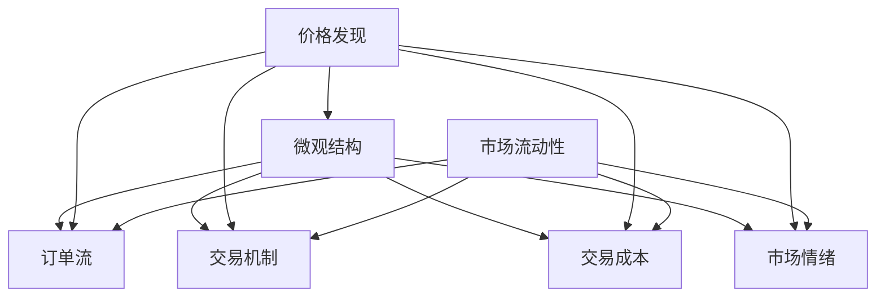
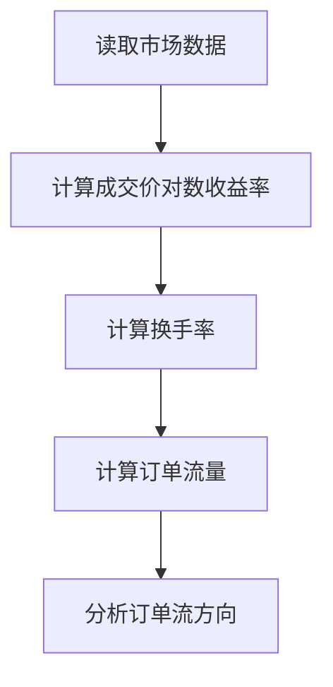
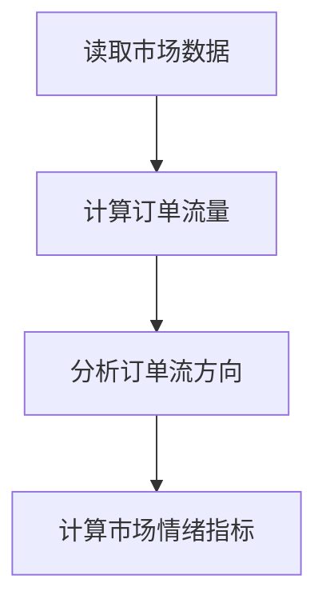
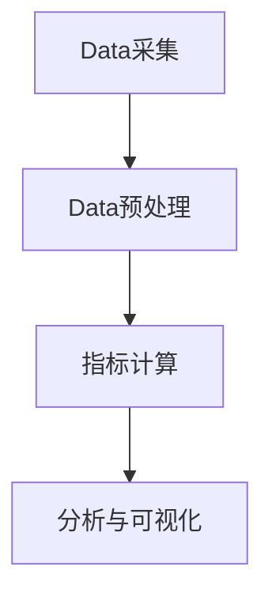
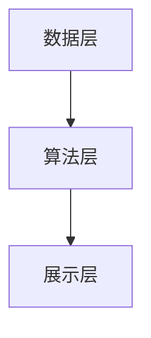

                 

# 金融市场微观结构分析

## 关键词

- 金融市场
- 微观结构分析
- 价格发现
- 市场流动性
- 交易机制

## 摘要

金融市场微观结构分析是研究金融市场运行机制的重要领域。本文旨在系统地介绍金融市场微观结构分析的基本概念、核心理论和方法，帮助读者深入理解市场运行机制，为投资策略提供理论依据。文章将依次探讨微观结构、价格发现、市场流动性、交易机制等核心概念，并通过算法原理讲解和系统架构设计，展示如何构建一个金融市场微观结构分析系统。

## 背景介绍

### 核心概念术语说明

1. **微观结构**：金融市场微观结构是指影响价格形成和市场流动性的各种因素，包括订单流、交易机制、交易成本、市场情绪等。

2. **价格发现**：价格发现是指市场通过买卖双方的交互过程，发现并确定合理的交易价格。

3. **市场流动性**：市场流动性是指资产在市场上能够快速、低成本地买卖的程度。

4. **交易机制**：交易机制是指金融市场如何组织交易以促进价格发现和市场流动性的机制，如拍卖机制、订单簿机制等。

### 问题背景

金融市场微观结构分析是金融学领域中的一个重要研究主题。随着金融市场的日益复杂化和信息化，微观结构分析在揭示市场运行机制、预测市场走势以及制定投资策略方面具有重要作用。

### 问题描述

金融市场微观结构分析旨在理解市场的运行机制，从而为投资者提供有价值的决策依据。然而，金融市场的数据量大且复杂，如何从海量数据中提取有用信息，构建有效的分析模型，是一个挑战。

### 问题解决

本文将介绍金融市场微观结构分析的基本概念、核心理论和方法，帮助读者深入理解这一领域，并展示如何构建一个金融市场微观结构分析系统。

### 边界与外延

金融市场微观结构分析不仅涵盖股票市场，还包括债券市场、外汇市场、期货市场等。此外，随着区块链技术的发展，金融市场微观结构分析也在不断拓展新的领域。

### 概念结构与核心要素组成

金融市场微观结构分析的核心概念包括微观结构、价格发现、市场流动性、交易机制等。这些概念相互关联，共同构成了金融市场微观结构分析的理论体系。

## 核心概念与联系

### 微观结构

金融市场微观结构指的是影响价格形成和市场流动性的各种因素。这些因素包括：

1. **订单流**：指买卖双方在市场中提交的订单。
2. **交易机制**：指市场如何组织交易，以促进价格发现和市场流动性。
3. **交易成本**：包括交易税费、佣金等。
4. **市场情绪**：指市场参与者的情绪波动，如贪婪、恐惧等。

### 价格发现

价格发现是金融市场微观结构分析的核心概念之一。它指的是市场通过买卖双方的交互过程，发现并确定合理的交易价格。价格发现过程通常涉及以下步骤：

1. **订单生成**：买卖双方根据各自的期望价格提交订单。
2. **订单匹配**：市场中心根据订单的价格和数量进行匹配，生成交易。
3. **价格确定**：通过大量交易，市场逐渐形成合理的交易价格。

### 市场流动性

市场流动性是指资产在市场上能够快速、低成本地买卖的程度。流动性好的市场能够迅速消化大量交易，而流动性差的市场则容易出现价格剧烈波动。市场流动性受多种因素影响，包括：

1. **订单流**：大量的订单流有助于提高市场流动性。
2. **交易机制**：如拍卖机制、订单簿机制等能够促进市场流动性的交易机制。
3. **市场情绪**：市场情绪波动会影响市场流动性。

### 交易机制

交易机制是指金融市场如何组织交易以促进价格发现和市场流动性的机制。常见的交易机制包括：

1. **拍卖机制**：通过竞价来确定交易价格，如股票交易所的竞价系统。
2. **订单簿机制**：通过订单簿记录买卖双方的订单，然后根据价格优先、时间优先的原则进行交易。

### 概念属性特征对比表格

| 概念     | 属性特征                                       | 对比               |
|----------|------------------------------------------------|--------------------|
| 微观结构 | 包含订单流、交易机制、交易成本、市场情绪等因素 | 影响价格发现和市场流动性 |
| 价格发现 | 通过买卖双方交互过程发现合理交易价格         | 依赖微观结构     |
| 市场流动性 | 资产在市场上能够快速、低成本地买卖的程度     | 受订单流和交易机制影响 |
| 交易机制 | 组织交易的机制，如拍卖机制、订单簿机制       | 促进价格发现和市场流动性 |

### ER实体关系图架构



## 算法原理讲解

### 市场微观结构指标计算

为了深入理解金融市场微观结构分析，我们将介绍几种常用的算法，包括市场微观结构指标的计算。

### 1. 价量关系指标

价量关系指标主要包括成交价对数收益率和换手率。

#### 成交价对数收益率

成交价对数收益率是衡量市场波动性的重要指标。它通过计算相邻两个成交价的对数差值来反映市场的价格变动。

公式如下：

$$ r_t = \log \left(\frac{P_t}{P_{t-1}}\right) $$

其中，$r_t$ 表示第 $t$ 天的成交价对数收益率，$P_t$ 表示第 $t$ 天的成交价，$P_{t-1}$ 表示第 $t-1$ 天的成交价。

#### 换手率

换手率是衡量市场流动性的重要指标。它通过计算交易量与平均交易量的比值来反映市场的交易活跃程度。

公式如下：

$$ Turnover\_rate = \frac{Volume_t}{Average\_Volume} $$

其中，$Turnover\_rate$ 表示换手率，$Volume_t$ 表示第 $t$ 天的交易量，$Average\_Volume$ 表示平均交易量。

### 使用mermaid画图，展示算法流程



### 2. 订单流指标

订单流指标主要包括订单流量和订单流方向。

#### 订单流量

订单流量是指一定时间内提交的订单总数。它反映了市场的活跃程度。

公式如下：

$$ Order\_Flow = \sum_{t=1}^{T} Order_t $$

其中，$Order\_Flow$ 表示订单流量，$Order_t$ 表示第 $t$ 天提交的订单总数。

#### 订单流方向

订单流方向是指订单的提交方向，即买方订单和卖方订单的相对比例。它反映了市场参与者的情绪和预期。

公式如下：

$$ Direction = \frac{Buy\_Orders}{Sell\_Orders} $$

其中，$Direction$ 表示订单流方向，$Buy\_Orders$ 表示买方订单总数，$Sell\_Orders$ 表示卖方订单总数。

### 使用mermaid画图，展示订单流分析过程



## 系统分析与架构设计方案

### 1. 问题场景介绍

假设我们需要分析一个股票市场的微观结构，以便了解市场流动性和价格发现过程。

### 2. 项目介绍

本项目旨在构建一个股票市场的微观结构分析系统，该系统将收集实时市场数据，并使用算法分析市场微观结构指标。

### 3. 系统功能设计

系统功能设计包括以下几个方面：

1. **数据采集**：从股票市场获取实时交易数据。
2. **数据预处理**：清洗和转换数据，以便进行进一步分析。
3. **指标计算**：计算各种市场微观结构指标，如成交价对数收益率、换手率、订单流量、订单流方向等。
4. **分析与可视化**：展示分析结果，帮助用户理解市场动态。

### 使用mermaid画图，展示领域模型类图



### 4. 系统架构设计

系统采用模块化设计，分为数据层、算法层和展示层。

1. **数据层**：负责数据采集和预处理。
2. **算法层**：实现市场微观结构分析算法。
3. **展示层**：展示分析结果，提供用户交互界面。

### 使用mermaid画图，展示系统架构图



### 5. 系统接口设计和系统交互

系统设计包括以下接口：

1. **数据采集接口**：用于从股票市场获取实时交易数据。
2. **数据处理接口**：用于清洗和转换数据。
3. **指标计算接口**：用于计算市场微观结构指标。
4. **数据可视化接口**：用于展示分析结果。

### 使用mermaid画图，展示系统交互序列图

```mermaid
graph TD
A[用户] --> B[数据采集接口]
B --> C[数据处理接口]
C --> D[指标计算接口]
D --> E[数据可视化接口]
E --> F[

## 项目实战

### 环境安装

1. 安装Python环境，版本要求3.6及以上。
2. 安装必要的库，如pandas、numpy、matplotlib等。

```bash
pip install pandas numpy matplotlib
```

### 系统核心实现源代码

```python
import pandas as pd
import numpy as np
import matplotlib.pyplot as plt

def read_data(file_path):
    # 读取市场数据
    data = pd.read_csv(file_path)
    return data

def preprocess_data(data):
    # 数据预处理
    data['Date'] = pd.to_datetime(data['Date'])
    data.set_index('Date', inplace=True)
    return data

def calculate_returns(data):
    # 计算成交价对数收益率
    data['Log_Return'] = np.log(data['Close'] / data['Close'].shift(1))
    return data['Log_Return']

def calculate_turnover_rate(data):
    # 计算换手率
    data['Turnover_Rate'] = data['Volume'] / data['Average_Volume']
    return data['Turnover_Rate']

def plot_returns(returns):
    # 绘制成交价对数收益率
    plt.figure(figsize=(10, 5))
    plt.plot(returns)
    plt.title('Log Returns')
    plt.xlabel('Date')
    plt.ylabel('Log Return')
    plt.show()

def plot_turnover_rate(turnover_rate):
    # 绘制换手率
    plt.figure(figsize=(10, 5))
    plt.plot(turnover_rate)
    plt.title('Turnover Rate')
    plt.xlabel('Date')
    plt.ylabel('Turnover Rate')
    plt.show()

if __name__ == '__main__':
    file_path = 'market_data.csv'
    data = read_data(file_path)
    data = preprocess_data(data)
    returns = calculate_returns(data)
    turnover_rate = calculate_turnover_rate(data)
    plot_returns(returns)
    plot_turnover_rate(turnover_rate)
```

### 代码应用解读与分析

1. **数据读取与预处理**：首先，我们使用pandas库读取市场数据，并进行预处理，包括日期转换和数据索引设置。
2. **成交价对数收益率计算**：使用numpy库计算成交价对数收益率，该指标用于衡量市场波动性。
3. **换手率计算**：计算换手率，该指标用于衡量市场流动性。
4. **绘图**：使用matplotlib库绘制成交价对数收益率和换手率，帮助用户直观地理解市场动态。

### 实际案例分析和详细讲解剖析

假设我们有一个股票市场的数据集，包含每天的收盘价、交易量和平均交易量。通过上述代码，我们可以计算出成交价对数收益率和换手率，并绘制出来。

1. **成交价对数收益率分析**：通过观察成交价对数收益率的走势，可以判断市场的波动情况。如果收益率波动较大，说明市场波动性较高。
2. **换手率分析**：通过观察换手率的走势，可以判断市场的流动性。如果换手率较高，说明市场流动性较好。

### 项目小结

本项目通过Python代码实现了金融市场微观结构分析系统，包括数据读取、预处理、指标计算和绘图等功能。通过实际案例分析，我们展示了如何使用这些指标来理解市场动态。项目不仅为投资策略提供了理论依据，也为市场研究人员提供了实用的工具。

## 最佳实践 Tips

1. **数据质量**：确保市场数据的质量，包括数据完整性、准确性和一致性。良好的数据质量是进行有效分析的基础。
2. **指标选择**：根据分析目的选择合适的指标。不同的指标能够反映市场的不同方面，如波动性、流动性等。
3. **实时监控**：实时监控市场数据，及时发现异常情况，有助于及时调整投资策略。

## 小结

金融市场微观结构分析是金融学领域的一个重要研究主题，它对于理解市场运行机制、预测市场走势以及制定投资策略具有重要意义。本文系统地介绍了金融市场微观结构分析的基本概念、核心理论和方法，并通过算法原理讲解和系统架构设计，展示了如何构建一个金融市场微观结构分析系统。通过实际案例分析和最佳实践 Tips，我们希望读者能够更好地理解金融市场微观结构分析，并将其应用于实际投资和研究工作中。

## 注意事项

1. 金融市场的数据量大且复杂，分析时需要谨慎处理数据，确保分析结果的准确性。
2. 金融市场的微观结构受多种因素影响，分析时需要综合考虑各种因素。
3. 微观结构分析结果仅作为参考，投资决策还需结合市场行情和个人判断。

## 拓展阅读

1. 《金融市场微观结构理论》 - 本书系统地介绍了金融市场微观结构理论，包括价格发现、市场流动性等核心概念。
2. 《金融市场技术分析》 - 本书介绍了金融市场技术分析的方法，包括K线图、指标等。
3. 《Python金融数据处理与分析》 - 本书介绍了如何使用Python进行金融数据处理和分析，包括pandas、numpy等库的使用。

## 作者信息

作者：AI天才研究院/AI Genius Institute & 禅与计算机程序设计艺术 /Zen And The Art of Computer Programming

