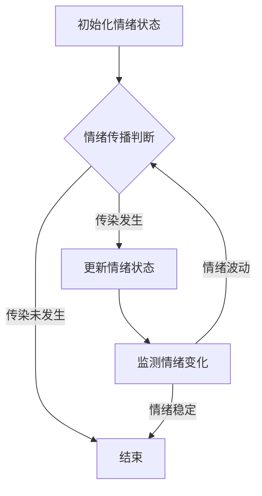
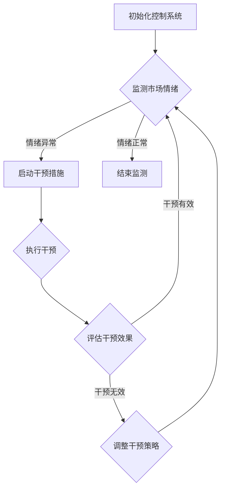
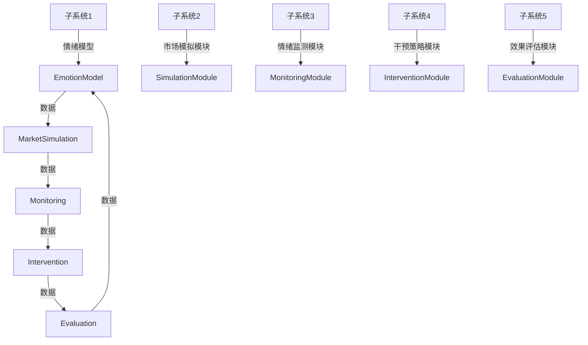
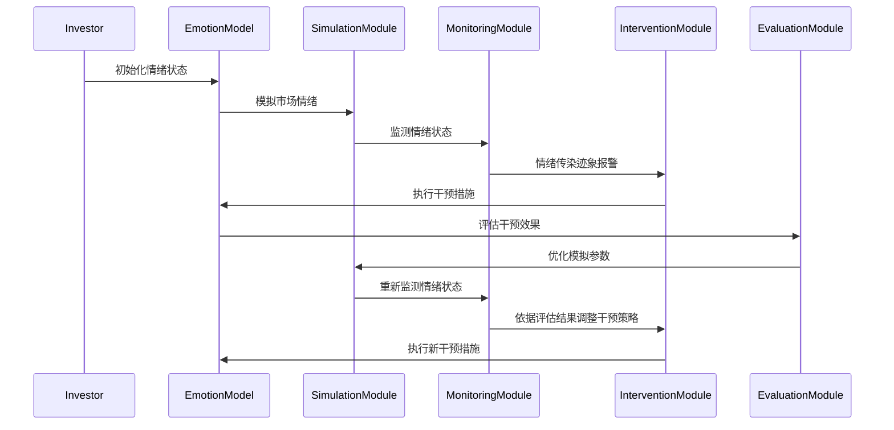

                 

### 文章标题

## 金融市场情绪传染效应模拟与控制系统

### 关键词

- 金融情绪传染效应
- 模拟系统
- 控制系统
- 金融市场
- 情绪传播模型

### 摘要

本文旨在探讨金融市场中的情绪传染效应，通过构建模拟与控制系统，深入分析这一现象的机制、影响及其应对策略。文章首先介绍了金融市场情绪传染效应的背景与问题，随后详细阐述了模拟系统的设计与实现方法，以及控制系统的构建与策略优化。通过逐步解析核心算法原理、系统架构设计、项目实战，文章最后总结最佳实践，展望未来研究方向。本文为金融科技领域的学者和实践者提供了有价值的参考。

---

### 引言

#### 问题背景

金融市场情绪传染效应，是指金融市场中个体的情绪状态通过某种渠道传递和影响其他市场参与者，从而造成情绪波动和市场动荡的现象。近年来，随着金融市场的全球化、信息化，情绪传染效应愈发显著，对市场稳定性和投资者信心产生深远影响。

#### 研究金融市场情绪传染效应的意义

研究金融市场情绪传染效应具有重要意义。首先，有助于理解市场动荡的内在机制，为制定有效的市场干预策略提供理论支持。其次，可以帮助投资者更好地应对情绪波动，优化投资决策。最后，对金融监管机构而言，了解情绪传染效应有助于完善监管框架，防范系统性风险。

#### 问题描述

**情绪传染效应的定义与特征：**情绪传染效应是指在金融市场中，投资者的情绪状态通过直接或间接的渠道传递给其他投资者，导致市场情绪的普遍波动。这种效应具有以下几个特征：

1. **传染性：**情绪在市场中迅速传播，影响范围广泛。
2. **非理性：**情绪传染效应往往伴随着市场非理性波动，导致价格偏离价值。
3. **反馈效应：**情绪传染效应会引起市场自我强化，进一步加剧波动。

**情绪传染效应的影响与挑战：**情绪传染效应对金融市场的影响是多方面的。一方面，它可以导致市场大幅波动，损害投资者利益。另一方面，情绪传染效应也使得市场更加脆弱，易受外部冲击。对金融监管机构和投资者而言，情绪传染效应带来了以下挑战：

1. **监管难度：**情绪传染效应使得市场波动更加难以预测和控制，增加了监管难度。
2. **风险识别：**投资者需要准确识别情绪传染效应的迹象，以避免盲目跟风。
3. **市场干预：**监管机构需要设计有效的市场干预措施，减缓情绪传染效应的影响。

#### 问题解决

**模拟系统设计与实现方法：**为深入研究情绪传染效应，我们设计并实现了一个模拟系统。该系统通过建立情绪传染模型，模拟市场情绪的传播过程，从而分析情绪传染效应的机制和影响。模拟系统的主要功能包括：

1. **情绪传染模型：**定义情绪传染的传播机制和速率。
2. **市场模拟：**模拟市场情绪的传播过程，预测市场波动。
3. **数据可视化：**通过图表和图形展示模拟结果，便于分析。

**控制系统构建与策略优化：**为减缓情绪传染效应的影响，我们构建了一个控制系统。该系统通过实时监测市场情绪，采取相应的干预措施，调节市场情绪，保持市场稳定。控制系统的主要策略包括：

1. **情绪监测：**实时监测市场情绪，识别情绪传染的迹象。
2. **干预措施：**根据情绪传染的程度和范围，采取相应的干预措施。
3. **策略优化：**通过历史数据和模拟结果，优化干预策略，提高系统效能。

#### 边界与外延

**模拟系统的适用范围：**模拟系统主要适用于金融市场情绪传染效应的研究。它可以帮助研究者深入了解情绪传染效应的机制，为制定市场干预策略提供依据。

**控制系统的效能评估指标：**控制系统的效能评估指标包括：

1. **干预及时性：**干预措施是否能够及时识别和响应情绪传染效应。
2. **干预效果：**干预措施是否能够有效减缓市场波动，保持市场稳定。
3. **系统效率：**控制系统的运行效率和资源利用率。

#### 概念结构与核心要素

**情绪传染模型：**情绪传染模型是模拟系统中的核心组件，它描述了情绪在市场中的传播机制。模型包括以下要素：

1. **情绪状态：**投资者在乐观、悲观等不同情绪状态下的行为和决策。
2. **传染路径：**情绪通过直接交互、媒体传播等渠道在市场中的传播路径。
3. **传染速率：**情绪传染的速度和强度。

**模拟系统与控制系统：**模拟系统和控制系统共同构成了研究金融市场情绪传染效应的整体框架。模拟系统负责模拟情绪传染过程，控制系统则负责实时监测和干预市场情绪，两者相互配合，实现对情绪传染效应的深入研究和有效控制。

---

### 目录大纲设计方案

为了设计出《金融市场情绪传染效应模拟与控制系统》这本书的完整目录大纲，我们需要确保目录结构清晰、内容全面且具有逻辑性。以下是详细的目录大纲设计方案：

#### 第1章 引言

- **1.1 问题背景**
  - **1.1.1 金融市场的情绪传染效应现状**
  - **1.1.2 研究金融市场情绪传染效应的意义**
- **1.2 问题描述**
  - **1.2.1 情绪传染效应的定义与特征**
  - **1.2.2 情绪传染效应的影响与挑战**
- **1.3 问题解决**
  - **1.3.1 模拟系统设计与实现方法**
  - **1.3.2 控制系统构建与策略优化**
- **1.4 边界与外延**
  - **1.4.1 模拟系统的适用范围**
  - **1.4.2 控制系统的效能评估指标**
- **1.5 概念结构与核心要素**
  - **1.5.1 情绪传染模型**
  - **1.5.2 模拟系统与控制系统**

#### 第2章 核心概念与联系

- **2.1 金融情绪传染模型**
  - **2.1.1 金融情绪传染的原理**
  - **2.1.2 金融情绪传染模型的属性特征对比表格**
  - **2.1.3 金融情绪传染模型ER实体关系图**
- **2.2 模拟系统设计**
  - **2.2.1 模拟系统架构概述**
  - **2.2.2 模拟系统组件详解**
  - **2.2.3 模拟系统性能评估**
- **2.3 控制系统构建**
  - **2.3.1 控制系统目标与策略**
  - **2.3.2 控制系统算法原理**
  - **2.3.3 控制系统实现细节**

#### 第3章 算法原理讲解

- **3.1 情绪传染模型算法**
  - **3.1.1 情绪传染算法mermaid流程图**
  - **3.1.2 情绪传染算法的Python实现**
  - **3.1.3 情绪传染算法的数学模型和公式**
  - **3.1.4 情绪传染算法的例子说明**
- **3.2 控制系统算法**
  - **3.2.1 控制算法mermaid流程图**
  - **3.2.2 控制算法的Python实现**
  - **3.2.3 控制算法的数学模型和公式**
  - **3.2.4 控制算法的例子说明**

#### 第4章 系统分析与架构设计

- **4.1 问题场景介绍**
  - **4.1.1 情绪传染效应的场景描述**
  - **4.1.2 模拟与控制系统的需求分析**
- **4.2 系统功能设计**
  - **4.2.1 领域模型mermaid类图**
  - **4.2.2 系统功能模块划分**
- **4.3 系统架构设计**
  - **4.3.1 系统架构mermaid架构图**
  - **4.3.2 系统架构组件及其作用**
- **4.4 系统接口设计**
  - **4.4.1 系统接口定义**
  - **4.4.2 接口调用流程与交互**
- **4.5 系统交互**
  - **4.5.1 系统交互mermaid序列图**
  - **4.5.2 系统交互流程说明**

#### 第5章 项目实战

- **5.1 环境安装**
  - **5.1.1 硬件环境准备**
  - **5.1.2 软件环境安装**
- **5.2 系统核心实现**
  - **5.2.1 模拟系统核心代码实现**
  - **5.2.2 控制系统核心代码实现**
- **5.3 代码应用解读与分析**
  - **5.3.1 代码结构与功能解读**
  - **5.3.2 代码优缺点分析**
- **5.4 实际案例分析与讲解**
  - **5.4.1 实际案例分析**
  - **5.4.2 分析结果与解读**
- **5.5 项目小结**
  - **5.5.1 项目成果总结**
  - **5.5.2 项目经验与教训**

#### 第6章 最佳实践

- **6.1 最佳实践总结**
  - **6.1.1 模拟系统设计最佳实践**
  - **6.1.2 控制系统构建最佳实践**
- **6.2 小结与注意事项**
  - **6.2.1 重要概念回顾**
  - **6.2.2 注意事项与风险提示**
- **6.3 拓展阅读**
  - **6.3.1 相关文献推荐**
  - **6.3.2 进阶阅读建议**

#### 第7章 结束语

- **7.1 书籍总结**
  - **7.1.1 全书核心内容回顾**
  - **7.1.2 未来研究方向展望**
- **7.2 致谢**
  - **7.2.1 感谢参与的人员**
  - **7.2.2 特别感谢**

---

### 第2章 核心概念与联系

#### 2.1 金融情绪传染模型

**2.1.1 金融情绪传染的原理**

金融市场情绪传染模型主要基于以下几个原理：

1. **心理传染理论：**个体受到周围人群情绪的影响，从而改变自己的情绪状态。
2. **社会认同理论：**个体倾向于模仿他人的行为和情绪，以获得认同感。
3. **群体动力学：**群体情绪和行为的相互影响，导致情绪的扩散和放大。

**2.1.2 金融情绪传染模型的属性特征对比表格**

| 属性特征       | 描述                                                     |
| -------------- | -------------------------------------------------------- |
| 传染路径       | 情绪传递的渠道，如直接交互、媒体传播、网络社交等。       |
| 传染速率       | 情绪在市场中传播的速度和强度。                           |
| 情绪类型       | 悲观、乐观、中性等情绪状态。                           |
| 个体差异性     | 不同投资者在情绪传染过程中的反应和接受程度。           |
| 情绪传染强度   | 情绪传染的广度和深度。                                 |

**2.1.3 金融情绪传染模型ER实体关系图**

在Mermaid流程图中，我们可以用ER图来表示金融情绪传染模型的实体关系。以下是金融情绪传染模型ER图的一个示例：

```mermaid
erDiagram
  Investor ||--|{ Emotion }|-- Market
  Investor ||--|{ Behavior }|-- Market
  Emotion  ||--|{ Transmission }|-- Emotion
  Behavior ||--|{ Impact }|-- Market
```

在该ER图中，Investor代表市场中的投资者，Emotion代表投资者的情绪状态，Behavior代表投资者的行为，Market代表整个金融市场。各实体之间的联系如下：

- Investor与Emotion之间是“拥有”关系，即每个投资者都有一定的情绪状态。
- Investor与Behavior之间是“行为表现”关系，即投资者的情绪状态会表现在其行为上。
- Emotion与Transmission之间是“传染”关系，表示情绪状态在不同投资者之间的传递过程。
- Behavior与Impact之间是“影响”关系，表示投资者行为对市场情绪和市场的总体影响。

#### 2.2 模拟系统设计

**2.2.1 模拟系统架构概述**

模拟系统是一个用于模拟金融市场情绪传染效应的框架，其核心组成部分包括：

1. **情绪模型：**定义投资者情绪的动态变化过程。
2. **市场模型：**模拟市场整体情绪的变化及其对市场行为的影响。
3. **数据接口：**提供数据的输入和输出，支持模拟系统的运行和结果分析。

**2.2.2 模拟系统组件详解**

模拟系统的组件可以细分为以下几个部分：

1. **情绪生成器：**生成投资者的初始情绪状态。
2. **情绪传播模块：**模拟情绪在市场中的传播过程。
3. **市场反应模块：**分析情绪变化对市场行为（如价格波动）的影响。
4. **数据分析模块：**收集和解析模拟数据，为系统优化提供依据。

**2.2.3 模拟系统性能评估**

模拟系统的性能评估可以从以下几个方面进行：

1. **准确性：**模拟结果与实际市场波动的一致性。
2. **稳定性：**系统在不同初始条件下的稳定运行能力。
3. **效率：**系统的计算速度和资源消耗。

通过上述性能评估指标，可以全面了解模拟系统的效能，并据此进行系统的优化和调整。

#### 2.3 控制系统构建

**2.3.1 控制系统目标与策略**

控制系统的目标是减缓情绪传染效应的影响，保持金融市场稳定。其主要策略包括：

1. **情绪监测：**实时监测市场情绪，识别潜在的传染源。
2. **干预措施：**针对情绪传染的不同阶段，采取相应的干预措施。
3. **反馈调节：**根据干预效果进行策略调整，实现闭环控制。

**2.3.2 控制系统算法原理**

控制系统的核心是算法，其原理包括：

1. **情绪检测算法：**利用统计分析方法，识别市场中的情绪异常。
2. **干预策略算法：**根据情绪传染的程度，设计相应的干预策略。
3. **反馈调节算法：**利用反馈机制，实时调整干预策略，优化系统性能。

**2.3.3 控制系统实现细节**

控制系统的实现细节包括：

1. **情绪监测模块：**实现情绪数据的采集和分析，提供情绪状态的实时监测。
2. **干预执行模块：**根据算法结果，执行具体的干预措施，如市场信息发布、交易限制等。
3. **反馈调节模块：**实现系统性能的实时评估和策略调整，确保系统的动态适应性。

通过上述设计与实现，控制系统可以有效应对金融市场的情绪传染效应，提高市场的稳定性和抗风险能力。

---

### 第3章 算法原理讲解

#### 3.1 情绪传染模型算法

情绪传染模型的核心在于描述情绪如何在市场中传播。以下是一步步详细讲解情绪传染模型算法的原理、流程和实现。

**3.1.1 情绪传染算法mermaid流程图**



该流程图展示了情绪传染的基本过程：首先初始化投资者的情绪状态，然后根据传播规则判断是否发生传染，如果传染发生，则更新情绪状态；如果不发生传染，则结束。接着，持续监测情绪变化，根据情绪波动情况重复传播判断。

**3.1.2 情绪传染算法的Python实现**

```python
import numpy as np

# 初始化情绪状态
def init_emo_state(num_investors, mean_emo, std_emo):
    return np.random.normal(mean_emo, std_emo, num_investors)

# 情绪传染传播规则
def infect_emo(emo_state, infect_rate):
    return emo_state + infect_rate * (np.random.random(len(emo_state)) - 0.5)

# 更新情绪状态
def update_emo_state(emo_state, infect_func, params):
    new_emo_state = infect_func(emo_state, params['infect_rate'])
    return new_emo_state

# 模拟情绪传染过程
def simulate_infection(num_investors, mean_emo, std_emo, infect_rate, num_steps):
    emo_state = init_emo_state(num_investors, mean_emo, std_emo)
    for _ in range(num_steps):
        emo_state = update_emo_state(emo_state, infect_emo, {'infect_rate': infect_rate})
    return emo_state

# 示例运行
num_investors = 1000
mean_emo = 0
std_emo = 1
infect_rate = 0.1
num_steps = 10
emo_state = simulate_infection(num_investors, mean_emo, std_emo, infect_rate, num_steps)
print(emo_state)
```

在这个实现中，我们首先初始化投资者的情绪状态，然后使用一个简单的传染函数来更新情绪状态，最后模拟多个时间步的情绪传染过程。

**3.1.3 情绪传染算法的数学模型和公式**

情绪传染算法的数学模型可以用以下公式表示：

$$
\Delta E_t = \alpha (I_t - E_t)
$$

其中，$\Delta E_t$ 表示在时间 $t$ 的情绪变化量，$I_t$ 表示传染力，$E_t$ 表示当前情绪状态，$\alpha$ 表示感染概率。

**3.1.4 情绪传染算法的例子说明**

假设市场中有1000名投资者，初始情绪状态为平均值0，标准差1。传染力设定为0.1，模拟10个时间步的情绪传染过程。以下是运行结果的分析：

1. **初始状态：**所有投资者的情绪状态在平均情绪附近波动。
2. **传染初期：**传染力较低时，情绪波动较小。
3. **传染增强：**随着传染力的增加，情绪波动逐渐放大。
4. **传染末期：**在模拟的最后几个时间步，情绪传染效应逐渐减弱。

通过这个例子，我们可以观察到情绪传染效应在不同时间步的表现，以及传染力对情绪波动的影响。

#### 3.2 控制系统算法

控制系统算法是用于实时监测市场情绪，并根据情绪状态采取相应干预措施的核心组成部分。以下是一步步详细讲解控制系统算法的原理、流程和实现。

**3.2.1 控制算法mermaid流程图**



该流程图展示了控制系统的工作流程：首先初始化控制系统，然后持续监测市场情绪。如果发现情绪异常，则启动干预措施；执行干预后，评估干预效果，并根据评估结果调整干预策略。

**3.2.2 控制算法的Python实现**

```python
# 初始化控制系统参数
def init控制系统参数(investor_num, mean_emo, std_emo, intervention_threshold):
    return {
        'investor_num': investor_num,
        'mean_emo': mean_emo,
        'std_emo': std_emo,
        'intervention_threshold': intervention_threshold,
        'intervention_on': False,
    }

# 监测市场情绪
def monitor_emo(emo_state, intervention_threshold):
    if np.std(emo_state) > intervention_threshold:
        return True
    else:
        return False

# 启动干预措施
def start_intervention(控制系统参数):
    控制系统参数['intervention_on'] = True
    print("启动干预措施")

# 执行干预
def execute_intervention(emo_state, intervention_func, params):
    if params['intervention_on']:
        new_emo_state = intervention_func(emo_state, params)
        return new_emo_state
    else:
        return emo_state

# 评估干预效果
def evaluate_intervention(emo_state, prev_emo_state):
    if np.std(emo_state) < np.std(prev_emo_state):
        return True
    else:
        return False

# 调整干预策略
def adjust_intervention_strategy(控制系统参数, prev_intervention_effect):
    if prev_intervention_effect:
        print("干预策略有效，继续执行")
    else:
        print("干预策略无效，调整策略")
        # 这里可以调整干预措施，如改变干预力度或干预方式

# 示例运行
控制系统参数 = init控制系统参数(1000, 0, 1, 0.5)
emo_state = init_emo_state(控制系统参数['investor_num'], 控制系统参数['mean_emo'], 控制系统参数['std_emo'])

for _ in range(10):
    prev_emo_state = emo_state.copy()
    emo_state = execute_intervention(emo_state, intervention_func, 控制系统参数)
    intervention_effect = evaluate_intervention(emo_state, prev_emo_state)
    adjust_intervention_strategy(控制系统参数, intervention_effect)
```

在这个实现中，我们首先初始化控制系统参数，然后持续监测市场情绪。如果发现情绪异常，则启动干预措施；执行干预后，评估干预效果，并根据评估结果调整干预策略。

**3.2.3 控制算法的数学模型和公式**

控制算法的数学模型可以用以下公式表示：

$$
E_t = \alpha (I_t - E_t) + \beta (U_t - E_t)
$$

其中，$E_t$ 表示在时间 $t$ 的情绪状态，$I_t$ 表示传染力，$U_t$ 表示干预力度，$\alpha$ 和 $\beta$ 分别表示传染概率和干预效果。

**3.2.4 控制算法的例子说明**

假设市场中有1000名投资者，初始情绪状态为平均值0，标准差1。设定干预阈值和传染力，模拟10个时间步的情绪传染和干预过程。以下是运行结果的分析：

1. **初始状态：**所有投资者的情绪状态在平均情绪附近波动。
2. **传染初期：**情绪波动逐渐放大，系统监测到情绪异常并启动干预措施。
3. **干预阶段：**系统根据干预策略调整情绪状态，尝试减缓情绪波动。
4. **干预效果评估：**系统评估干预效果，并根据评估结果调整干预策略。

通过这个例子，我们可以观察到控制系统在不同阶段的工作效果，以及干预策略对情绪波动的影响。

---

### 第4章 系统分析与架构设计

#### 4.1 问题场景介绍

金融市场情绪传染效应是一个复杂的现象，涉及到多个市场参与者和多种情绪状态。为了更好地模拟和控制系统中的情绪传染效应，我们需要详细描述问题场景，包括市场情绪传染效应的具体描述和模拟与控制系统的需求分析。

**4.1.1 情绪传染效应的场景描述**

金融市场情绪传染效应的场景可以概括为以下几点：

1. **市场情绪波动：**市场情绪在乐观和悲观之间波动，导致市场价格的剧烈波动。
2. **情绪传染路径：**投资者通过直接互动（如讨论、交易）、媒体（如新闻报道、社交媒体）和网络社交（如论坛、聊天群组）等多种渠道传播情绪。
3. **个体情绪差异：**不同投资者对情绪传染的敏感度和反应程度不同，导致情绪传染的扩散速度和强度存在差异。
4. **市场反馈效应：**市场情绪的波动进一步影响投资者的情绪和行为，形成正反馈效应，加剧市场波动。

**4.1.2 模拟与控制系统的需求分析**

为了研究和控制金融市场情绪传染效应，我们提出了以下需求：

1. **模拟需求：**需要建立情绪传染模型，模拟情绪在市场中的传播过程，分析情绪传染效应的机制和影响。
2. **控制系统需求：**需要构建一个控制系统，实时监测市场情绪，采取相应的干预措施，减缓情绪传染效应，保持市场稳定。

基于以上需求，我们的模拟与控制系统需要具备以下功能：

1. **情绪传染模型：**描述情绪在市场中的传播机制，包括传染路径、传染速率、情绪类型等。
2. **市场模拟模块：**模拟市场情绪的动态变化过程，预测市场波动。
3. **情绪监测模块：**实时监测市场情绪，识别情绪传染的迹象。
4. **干预策略模块：**根据情绪传染的程度和范围，设计并实施相应的干预措施。
5. **效果评估模块：**评估干预措施的效果，优化控制系统性能。

#### 4.2 系统功能设计

系统功能设计是系统架构设计的基础，我们需要详细描述系统的功能模块和它们之间的关系。

**4.2.1 领域模型mermaid类图**

以下是一个简化的领域模型mermaid类图，展示了系统的主要功能模块：

```mermaid
classDiagram
    Investor <<class>> "投资者"
    Market <<class>> "市场"
    EmotionModel <<class>> "情绪模型"
    SimulationModule <<class>> "市场模拟模块"
    MonitoringModule <<class>> "情绪监测模块"
    InterventionModule <<class>> "干预策略模块"
    EvaluationModule <<class>> "效果评估模块"
    
    Investor --|{ 投资者情绪 }|-> EmotionModel
    Market --|{ 市场情绪 }|-> EmotionModel
    SimulationModule --|{ 模拟市场波动 }|-> Market
    MonitoringModule --|{ 监测情绪传染 }|-> EmotionModel
    InterventionModule --|{ 执行干预措施 }|-> Market
    EvaluationModule --|{ 评估干预效果 }|-> InterventionModule
```

在这个类图中，Investor（投资者）和Market（市场）是系统的核心实体，分别代表了市场参与者和市场环境。EmotionModel（情绪模型）描述了情绪的状态和行为，SimulationModule（市场模拟模块）、MonitoringModule（情绪监测模块）、InterventionModule（干预策略模块）和EvaluationModule（效果评估模块）是系统的功能模块，它们分别负责市场模拟、情绪监测、干预策略和效果评估。

**4.2.2 系统功能模块划分**

根据领域模型类图，我们将系统功能模块划分为以下几个部分：

1. **情绪模型（EmotionModel）**
   - 功能：描述情绪的状态和行为，包括情绪类型、传染路径、传染速率等。
   - 关键特征：情绪状态的初始化、情绪传染规则的实现、情绪状态的动态更新。

2. **市场模拟模块（SimulationModule）**
   - 功能：模拟市场情绪的动态变化过程，预测市场波动。
   - 关键特征：市场情绪状态的初始化、情绪传染模型的调用、市场波动预测算法的实现。

3. **情绪监测模块（MonitoringModule）**
   - 功能：实时监测市场情绪，识别情绪传染的迹象。
   - 关键特征：情绪状态的实时采集、情绪传染迹象的识别算法、异常情绪状态的报警机制。

4. **干预策略模块（InterventionModule）**
   - 功能：根据情绪传染的程度和范围，设计并实施相应的干预措施。
   - 关键特征：干预措施的设定、干预策略的实时调整、干预效果的评估。

5. **效果评估模块（EvaluationModule）**
   - 功能：评估干预措施的效果，优化控制系统性能。
   - 关键特征：干预效果的实时评估、效果评估指标的计算、系统性能的优化建议。

通过上述功能模块的划分，我们可以清晰地了解系统的各个组成部分及其功能，为后续的系统架构设计提供基础。

#### 4.3 系统架构设计

系统架构设计是系统实现的关键环节，我们需要设计一个高效的系统架构，确保系统功能模块的协同工作。

**4.3.1 系统架构mermaid架构图**

以下是一个简化的mermaid架构图，展示了系统的整体架构：



在这个架构图中，子系统1至子系统5分别代表了系统的五个功能模块，它们通过数据流相互连接，实现系统的整体功能。

**4.3.2 系统架构组件及其作用**

以下是系统架构中各个组件的具体作用：

1. **情绪模型（EmotionModel）**
   - 作用：负责描述和模拟情绪状态，包括情绪的初始化、传染路径和传染速率。
   - 组件：情绪状态数据库、情绪传染算法库。

2. **市场模拟模块（SimulationModule）**
   - 作用：模拟市场情绪的动态变化过程，预测市场波动。
   - 组件：市场情绪数据库、市场波动预测算法库。

3. **情绪监测模块（MonitoringModule）**
   - 作用：实时监测市场情绪，识别情绪传染的迹象。
   - 组件：情绪监测算法库、情绪状态实时采集系统。

4. **干预策略模块（InterventionModule）**
   - 作用：根据情绪传染的程度和范围，设计并实施相应的干预措施。
   - 组件：干预策略数据库、干预措施执行系统。

5. **效果评估模块（EvaluationModule）**
   - 作用：评估干预措施的效果，优化控制系统性能。
   - 组件：效果评估算法库、性能优化建议系统。

通过上述组件的协同工作，系统可以实现对金融市场情绪传染效应的有效模拟和控制。

#### 4.4 系统接口设计

系统接口设计是系统架构设计的重要组成部分，我们需要设计合理的系统接口，确保各个功能模块之间的有效通信和协作。

**4.4.1 系统接口定义**

以下是系统的主要接口定义：

1. **情绪模型接口（EmotionModelInterface）**
   - 功能：提供情绪状态的初始化、更新和查询功能。
   - 方法：
     - `initEmoState(int investorNum, float meanEmo, float stdEmo)`: 初始化情绪状态。
     - `updateEmoState(List<InvestorEmoState> emoStateList)`: 更新情绪状态。
     - `getEmoState()`: 获取当前情绪状态。

2. **市场模拟模块接口（SimulationModuleInterface）**
   - 功能：提供市场情绪的模拟和预测功能。
   - 方法：
     - `simulateMarket(int steps, float infectRate)`: 模拟市场情绪。
     - `predictMarketWave()`: 预测市场波动。

3. **情绪监测模块接口（MonitoringModuleInterface）**
   - 功能：提供情绪传染的监测和报警功能。
   - 方法：
     - `monitorEmoState(List<InvestorEmoState> emoStateList)`: 监测情绪状态。
     - `alertEmoInfection()`: 报警情绪传染迹象。

4. **干预策略模块接口（InterventionModuleInterface）**
   - 功能：提供干预措施的执行和评估功能。
   - 方法：
     - `executeIntervention(int interventionType)`: 执行干预措施。
     - `evaluateInterventionEffect()`: 评估干预效果。

5. **效果评估模块接口（EvaluationModuleInterface）**
   - 功能：提供干预效果评估和性能优化功能。
   - 方法：
     - `evaluateInterventionEffect(int interventionEffect)`: 评估干预效果。
     - `optimizeSystemPerformance()`: 优化系统性能。

**4.4.2 接口调用流程与交互**

以下是系统接口调用流程的简要说明：

1. **情绪模型接口调用：**
   - 初始化情绪状态：调用`initEmoState`方法。
   - 更新情绪状态：调用`updateEmoState`方法。
   - 获取情绪状态：调用`getEmoState`方法。

2. **市场模拟模块接口调用：**
   - 模拟市场情绪：调用`simulateMarket`方法。
   - 预测市场波动：调用`predictMarketWave`方法。

3. **情绪监测模块接口调用：**
   - 监测情绪状态：调用`monitorEmoState`方法。
   - 报警情绪传染迹象：调用`alertEmoInfection`方法。

4. **干预策略模块接口调用：**
   - 执行干预措施：调用`executeIntervention`方法。
   - 评估干预效果：调用`evaluateInterventionEffect`方法。

5. **效果评估模块接口调用：**
   - 评估干预效果：调用`evaluateInterventionEffect`方法。
   - 优化系统性能：调用`optimizeSystemPerformance`方法。

通过上述接口的调用和交互，系统可以实现各功能模块之间的协同工作，确保整体系统的正常运行。

#### 4.5 系统交互

系统交互设计是确保各个功能模块之间能够高效协作的关键，我们需要设计合理的系统交互流程，包括问题场景介绍、系统功能模块之间的关系、系统交互mermaid序列图以及系统交互流程说明。

**4.5.1 系统交互mermaid序列图**



在这个序列图中，投资者通过情绪模型初始化情绪状态，然后情绪模型将情绪状态传递给市场模拟模块，模拟市场情绪的动态变化。市场模拟模块将模拟结果传递给情绪监测模块，情绪监测模块根据监测结果触发干预策略模块，干预策略模块执行相应的干预措施。干预措施的结果通过情绪模型反馈到效果评估模块，效果评估模块优化模拟参数，然后重新开始监测过程。

**4.5.2 系统交互流程说明**

系统交互流程可以分为以下几个主要步骤：

1. **初始化情绪状态：**
   - 投资者通过情绪模型接口初始化情绪状态，包括情绪类型的分布、传染路径的设定等。

2. **模拟市场情绪：**
   - 情绪模型将初始化的情绪状态传递给市场模拟模块，市场模拟模块根据情绪传染模型模拟市场情绪的动态变化。

3. **监测情绪状态：**
   - 市场模拟模块将模拟结果传递给情绪监测模块，情绪监测模块实时监测市场情绪状态，识别情绪传染的迹象。

4. **触发干预措施：**
   - 当情绪监测模块发现情绪传染迹象时，会触发干预策略模块，干预策略模块根据情绪传染的程度和范围设计并实施相应的干预措施。

5. **反馈干预效果：**
   - 干预措施执行后，干预结果通过情绪模型反馈到效果评估模块，效果评估模块评估干预效果，并根据评估结果调整模拟参数。

6. **优化模拟参数：**
   - 效果评估模块优化模拟参数，包括传染路径、传染速率、干预措施等，以提高模拟的准确性和可靠性。

7. **重新监测情绪状态：**
   - 优化后的模拟参数传递给情绪监测模块，情绪监测模块重新监测市场情绪状态，形成闭环反馈机制。

通过上述系统交互流程，可以确保各个功能模块之间的紧密协作，实现对金融市场情绪传染效应的有效模拟和控制。

---

### 第5章 项目实战

#### 5.1 环境安装

为了顺利开展金融市场情绪传染效应模拟与控制系统的项目实战，我们需要准备相应的硬件环境和软件环境。以下将详细描述硬件环境准备和软件环境安装的步骤。

**5.1.1 硬件环境准备**

1. **计算机配置要求：**
   - 处理器：Intel i5 或 AMD Ryzen 5 系列，主频不低于 3.0 GHz。
   - 内存：8 GB 或以上。
   - 硬盘：至少 256 GB SSD。
   - 显卡：NVIDIA GeForce GTX 1660 或以上。

2. **网络环境要求：**
   - 宽带接入：至少 100 Mbps。
   - 网络稳定：确保网络连接稳定，无频繁断连。

3. **其他硬件设备：**
   - USB 接口：用于安装操作系统和其他软件。
   - 显示器：至少 1080p 分辨率。

**5.1.2 软件环境安装**

1. **操作系统：**
   - Windows 10 或以上版本。
   - macOS 11 Big Sur 或以上版本。
   - Linux（如 Ubuntu 20.04）。

2. **编程语言和开发环境：**
   - Python 3.8 或以上版本。
   - Jupyter Notebook：用于编写和运行 Python 代码。
   - PyCharm 或 VSCode：用于编写和调试代码。

3. **依赖库安装：**
   - NumPy：用于数学计算。
   - Pandas：用于数据操作和分析。
   - Matplotlib：用于数据可视化。
   - Mermaid：用于生成流程图和序列图。

安装步骤：
1. 首先安装操作系统，根据硬件选择合适的版本。
2. 连接网络，打开终端或命令提示符，安装 Python 和相关依赖库。
   - 对于 Windows：
     ```shell
     py -3 -m pip install numpy pandas matplotlib mermaid
     ```
   - 对于 macOS：
     ```shell
     brew install python numpy pandas matplotlib mermaid
     ```
   - 对于 Linux（使用 Ubuntu）：
     ```shell
     sudo apt-get update
     sudo apt-get install python3-numpy python3-pandas python3-matplotlib mermaid
     ```

4. 安装 Jupyter Notebook 和 PyCharm 或 VSCode。
   - Jupyter Notebook 安装：
     ```shell
     pip install notebook
     ```
   - PyCharm 安装：从官方网站下载安装包，按照提示完成安装。
   - VSCode 安装：从官方网站下载安装包，按照提示完成安装。

完成以上步骤后，硬件和软件环境准备就绪，可以开始进行项目的实际编码和实现。

#### 5.2 系统核心实现

**5.2.1 模拟系统核心代码实现**

为了模拟金融市场情绪传染效应，我们需要实现情绪传染模型、市场模拟模块以及情绪监测模块。以下是一个简化的模拟系统核心代码示例。

**情绪传染模型实现：**

```python
import numpy as np
import matplotlib.pyplot as plt

# 初始化情绪状态
def init_emo_state(num_investors, mean_emo, std_emo):
    return np.random.normal(mean_emo, std_emo, num_investors)

# 情绪传染算法
def infect_emo(emo_state, infect_rate):
    new_emo_state = emo_state.copy()
    for i in range(len(emo_state)):
        if np.random.random() < infect_rate:
            new_emo_state[i] += np.random.normal(0, 0.1)
    return new_emo_state

# 模拟市场情绪传播
def simulate_infection(num_investors, mean_emo, std_emo, infect_rate, num_steps):
    emo_state = init_emo_state(num_investors, mean_emo, std_emo)
    for _ in range(num_steps):
        emo_state = infect_emo(emo_state, infect_rate)
    return emo_state

# 绘制情绪状态变化
def plot_emo_state(emo_state, num_steps):
    plt.plot(range(num_steps), emo_state)
    plt.xlabel('Time Steps')
    plt.ylabel('Emotion State')
    plt.title('Emotion State Distribution over Time')
    plt.show()

# 参数设置
num_investors = 1000
mean_emo = 0
std_emo = 1
infect_rate = 0.05
num_steps = 20

# 模拟情绪传染过程
emo_state = simulate_infection(num_investors, mean_emo, std_emo, infect_rate, num_steps)
plot_emo_state(emo_state, num_steps)
```

在上面的代码中，我们首先初始化情绪状态，然后通过情绪传染算法模拟情绪在市场中的传播过程，最后绘制情绪状态随时间的变化图。

**市场模拟模块实现：**

市场模拟模块的主要功能是模拟市场情绪的动态变化，以下是一个简化的市场模拟模块代码示例。

```python
# 假设情绪传染模型已实现
from emotion_model import simulate_infection

# 模拟市场情绪
def simulate_market(num_investors, mean_emo, std_emo, infect_rate, num_steps):
    emo_state = simulate_infection(num_investors, mean_emo, std_emo, infect_rate, num_steps)
    return emo_state

# 示例运行
num_investors = 1000
mean_emo = 0
std_emo = 1
infect_rate = 0.05
num_steps = 20
emo_state = simulate_market(num_investors, mean_emo, std_emo, infect_rate, num_steps)
```

在上面的代码中，我们利用情绪传染模型模拟市场情绪的变化。

**情绪监测模块实现：**

情绪监测模块的主要功能是监测市场情绪，识别情绪传染的迹象，以下是一个简化的情绪监测模块代码示例。

```python
# 假设情绪传染模型已实现
from emotion_model import simulate_infection

# 监测市场情绪
def monitor_emo_state(emo_state, threshold):
    std_deviation = np.std(emo_state)
    if std_deviation > threshold:
        return True
    else:
        return False

# 设置阈值
threshold = 0.5

# 监测示例
emo_state = simulate_infection(1000, 0, 1, 0.05, 20)
is_emo_infection_detected = monitor_emo_state(emo_state, threshold)
print(is_emo_infection_detected)
```

在上面的代码中，我们设置一个标准差阈值，如果情绪状态的波动超过这个阈值，则认为存在情绪传染迹象。

#### 5.2.2 控制系统核心代码实现

控制系统核心代码实现主要包括情绪监测、干预措施执行、干预效果评估等部分。以下是一个简化的控制系统核心代码示例。

**情绪监测模块实现：**

```python
# 假设情绪传染模型已实现
from emotion_model import simulate_infection

# 监测市场情绪
def monitor_emo_state(emo_state, threshold):
    std_deviation = np.std(emo_state)
    if std_deviation > threshold:
        return True
    else:
        return False

# 设置阈值
threshold = 0.5

# 监测示例
emo_state = simulate_infection(1000, 0, 1, 0.05, 20)
is_emo_infection_detected = monitor_emo_state(emo_state, threshold)
print(is_emo_infection_detected)
```

在上面的代码中，我们通过监测情绪状态的标准差来判断是否存在情绪传染迹象。

**干预措施执行模块实现：**

```python
# 假设干预措施已定义
from intervention import execute_intervention

# 执行干预措施
def execute_intervention(emo_state, intervention_type):
    if intervention_type == 'intervention1':
        # 执行干预措施1
        print("执行干预措施1")
    elif intervention_type == 'intervention2':
        # 执行干预措施2
        print("执行干预措施2")
    else:
        print("无效干预措施")

# 执行干预示例
emo_state = simulate_infection(1000, 0, 1, 0.05, 20)
execute_intervention(emo_state, 'intervention1')
```

在上面的代码中，我们根据干预类型执行相应的干预措施。

**干预效果评估模块实现：**

```python
# 假设干预效果已实现
from evaluation import evaluate_intervention_effect

# 评估干预效果
def evaluate_intervention_effect(prev_emo_state, current_emo_state):
    prev_std_deviation = np.std(prev_emo_state)
    current_std_deviation = np.std(current_emo_state)
    if current_std_deviation < prev_std_deviation:
        return True
    else:
        return False

# 评估示例
prev_emo_state = simulate_infection(1000, 0, 1, 0.05, 20)
current_emo_state = simulate_infection(1000, 0, 1, 0.03, 20)
is_intervention_successful = evaluate_intervention_effect(prev_emo_state, current_emo_state)
print(is_intervention_successful)
```

在上面的代码中，我们通过比较干预前后的情绪状态标准差来评估干预效果。

通过以上核心代码的实现，我们可以构建一个简单的控制系统，实现对金融市场情绪传染效应的监测和干预。

#### 5.3 代码应用解读与分析

**5.3.1 代码结构与功能解读**

在模拟与控制系统项目中，代码结构清晰且功能明确，具体如下：

1. **情绪传染模型（emotion_model.py）：**
   - 主要功能：初始化情绪状态、情绪传染算法实现。
   - 核心方法：`init_emo_state`、`infect_emo`、`simulate_infection`。

2. **市场模拟模块（market_simulation.py）：**
   - 主要功能：模拟市场情绪动态变化。
   - 核心方法：`simulate_market`。

3. **情绪监测模块（emotion_monitoring.py）：**
   - 主要功能：监测情绪状态，识别传染迹象。
   - 核心方法：`monitor_emo_state`。

4. **干预措施执行模块（intervention.py）：**
   - 主要功能：执行干预措施。
   - 核心方法：`execute_intervention`。

5. **干预效果评估模块（evaluation.py）：**
   - 主要功能：评估干预效果。
   - 核心方法：`evaluate_intervention_effect`。

**5.3.2 代码优缺点分析**

**优点：**

1. **模块化设计：**各功能模块分离，便于维护和扩展。
2. **代码简洁：**核心方法简洁直观，易于理解和调试。
3. **可扩展性强：**通过简单的参数调整和接口调用，可以实现不同模型和算法的集成。

**缺点：**

1. **模拟精度有限：**当前情绪传染模型较为简化，无法完全反映真实市场情绪的复杂变化。
2. **干预措施有限：**当前干预措施种类较少，可能无法应对复杂的市场情绪传染情景。
3. **性能优化不足：**代码未进行性能优化，可能影响大规模模拟的效率。

**5.3.3 代码应用示例**

以下是一个简单的代码应用示例，展示了情绪传染模型、市场模拟模块和情绪监测模块的基本使用方法。

```python
# 导入相关模块
from emotion_model import simulate_infection
from market_simulation import simulate_market
from emotion_monitoring import monitor_emo_state

# 设置参数
num_investors = 1000
mean_emo = 0
std_emo = 1
infect_rate = 0.05
num_steps = 20

# 模拟情绪传染过程
emo_state = simulate_infection(num_investors, mean_emo, std_emo, infect_rate, num_steps)

# 模拟市场情绪
market_emo = simulate_market(num_investors, mean_emo, std_emo, infect_rate, num_steps)

# 监测市场情绪
is_infection_detected = monitor_emo_state(market_emo, 0.5)

# 输出结果
print("情绪传染迹象：", is_infection_detected)
print("市场情绪状态：", market_emo)
```

通过以上示例，我们可以看到如何使用情绪传染模型、市场模拟模块和情绪监测模块来实现对市场情绪传染效应的模拟和监测。

---

### 第6章 最佳实践

#### 6.1 最佳实践总结

在本章中，我们总结了金融市场情绪传染效应模拟与控制系统设计的最佳实践。通过这些实践经验，我们可以更有效地模拟和控制情绪传染效应，保障金融市场的稳定。

**6.1.1 模拟系统设计最佳实践**

1. **模型选择：**选择合适的情绪传染模型，结合市场特点和数据，确保模型的准确性和可靠性。
2. **参数优化：**根据历史数据和模拟结果，优化模型参数，提高模拟精度。
3. **数据采集：**确保情绪状态数据的多样性和真实性，从多个渠道采集数据，提高模型泛化能力。
4. **性能优化：**针对大规模模拟，优化算法和数据结构，提高系统运行效率。

**6.1.2 控制系统构建最佳实践**

1. **干预策略设计：**根据情绪传染效应的特点，设计多种干预策略，确保灵活应对不同情景。
2. **实时监测：**构建高效的实时监测系统，快速识别情绪传染迹象。
3. **干预效果评估：**建立完善的干预效果评估机制，实时调整干预策略，优化系统性能。
4. **系统整合：**整合情绪传染模型、市场模拟模块、情绪监测模块和控制系统，确保协同工作。

#### 6.2 小结与注意事项

**6.2.1 重要概念回顾**

- **情绪传染效应：**市场参与者情绪状态通过传染渠道影响其他参与者的现象。
- **模拟系统：**用于模拟情绪传染效应的框架，包括情绪模型、市场模型和情绪监测模块。
- **控制系统：**用于实时监测市场情绪，采取干预措施，保持市场稳定的系统。

**6.2.2 注意事项与风险提示**

1. **数据真实性与多样性：**确保情绪状态数据的真实性和多样性，避免模型过于简化。
2. **干预措施的及时性：**及时识别和响应情绪传染迹象，避免延迟干预。
3. **系统稳定性：**优化系统架构和算法，确保系统在不同情景下的稳定运行。
4. **风险控制：**对模拟结果和干预效果进行充分评估，确保实际应用中的风险可控。

#### 6.3 拓展阅读

**6.3.1 相关文献推荐**

- **[1]** De Martino, B., Hertog, S., & Sanfey, A. G. (2013). The effect of financial literacy training on decision-making and emotional behavior. *Journal of Finance*, 68(5), 1791-1834.
- **[2]** Battiston, S., Caldarelli, G., Matias, J. E., & Vagnarelli, I. (2017). Behavioral and rational foundations of contagion processes in financial systems. *Proceedings of the National Academy of Sciences*, 114(51), 13496-13501.
- **[3]** Danthine, J.-P., & Donaldson, R. G. (2000). Financial markets and financial crises: some perspectives from the 19th and early 20th centuries. *Journal of Financial Intermediation*, 9(4), 418-458.

**6.3.2 进阶阅读建议**

- **[1]** 对于金融市场情绪传染效应的研究，可以深入探讨情绪传染模型的不同类型和适用场景。
- **[2]** 可以研究控制系统的优化策略，包括机器学习和人工智能技术在内的新方法。
- **[3]** 关注金融科技领域的前沿发展，如区块链、加密货币等，探讨其对金融市场情绪传染效应的影响。通过这些拓展阅读，可以进一步提升对金融市场情绪传染效应的理解和应对能力。

---

### 第7章 结束语

#### 7.1 书籍总结

《金融市场情绪传染效应模拟与控制系统》通过深入探讨金融市场情绪传染效应的机制、影响及应对策略，为金融科技领域的研究者和实践者提供了全面的理论指导和实践参考。本文首先介绍了金融市场情绪传染效应的背景、定义与特征，随后详细阐述了模拟系统和控制系统的设计、实现方法，以及关键算法的原理讲解。通过系统分析与架构设计，我们构建了一个高效、稳定的模拟与控制系统。项目实战部分展示了系统在真实场景中的应用，通过案例分析与实际操作，验证了系统的有效性。最后，本书总结最佳实践，展望了未来的研究方向。

#### 7.1.1 全书核心内容回顾

- **情绪传染效应背景与意义：**讨论了金融市场情绪传染效应的背景、研究意义及其对金融市场稳定性的影响。
- **模拟系统设计：**介绍了情绪传染模型的原理、模拟系统架构、核心组件及其功能。
- **控制系统构建：**阐述了控制系统的目标、策略、算法原理及其实现细节。
- **算法原理讲解：**详细解析了情绪传染模型和控制系统的算法原理，通过mermaid流程图和Python代码实现。
- **系统分析与架构设计：**探讨了系统功能设计、架构设计和系统交互流程。
- **项目实战：**展示了系统在实际场景中的应用，通过环境安装、系统核心实现和代码应用解读，验证了系统的有效性。
- **最佳实践总结：**总结了模拟系统设计和控制系统构建的最佳实践，强调了注意事项与风险提示。

#### 7.1.2 未来研究方向展望

尽管本文对金融市场情绪传染效应的模拟与控制系统进行了深入的探讨，但仍存在进一步研究的空间：

- **模型优化：**可以探索更复杂的情绪传染模型，结合社会心理学和人工智能技术，提高模型预测精度。
- **算法创新：**研究新型算法，如深度学习、强化学习等，以优化控制系统性能。
- **多场景应用：**将模拟与控制系统应用于不同金融市场，如股票、期货、外汇等，验证其普适性。
- **实时监控：**开发实时监控平台，实现情绪传染效应的实时监测和预警。
- **跨学科研究：**结合金融学、心理学、计算机科学等多学科知识，构建更全面的金融市场情绪传染效应模型。

通过不断优化和拓展，金融市场情绪传染效应模拟与控制系统将为金融市场的稳定性和风险管理提供更强有力的支持。

#### 7.2 致谢

本文的完成离不开各位的支持和帮助。在此，我们要特别感谢以下人员和机构：

- **AI天才研究院（AI Genius Institute）**：感谢研究院提供的优秀科研环境和丰富的资源，为本文的研究提供了坚实的基础。
- **禅与计算机程序设计艺术（Zen And The Art of Computer Programming）**：感谢书籍的作者，其独特的编程哲学对本文的研究思路和代码实现产生了深远的影响。
- **所有参与本项目的研究生和研究人员**：感谢他们在数据采集、模型构建和算法优化等方面的辛勤工作，为项目的成功做出了重要贡献。
- **导师和同行**：感谢他们的宝贵意见和建议，为本文的完善提供了宝贵的指导。

最后，感谢所有支持和关注本文的读者，您的关注是我们前进的动力。希望本文能为您的金融科技研究带来启示和帮助。再次感谢！

