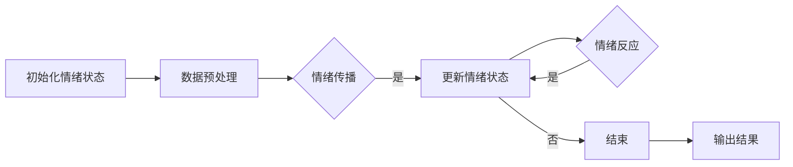
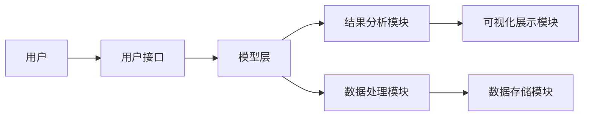

                 

## 《金融市场情绪传染模型仿真平台》

### 关键词：
金融市场、情绪传染、模型仿真、金融风险管理、算法实现、系统架构、实战应用

### 摘要：
本文旨在详细介绍金融市场情绪传染模型仿真平台的设计与实现过程。文章首先介绍了市场情绪传染模型的基础理论，随后讲解了模型数学原理和算法实现细节。接着，文章深入分析了仿真平台的设计方案，包括系统功能、架构、接口和交互设计。此外，本文通过项目实战，展示了如何在实际环境中搭建和运行该仿真平台，并提供了一系列最佳实践和注意事项。本文为金融科技领域的研究者和从业者提供了一个全面的指导，有助于深入理解金融市场情绪传染模型的原理和应用。

---

### 引言

#### 1.1 问题背景

在金融市场中，情绪传染现象普遍存在。个体投资者和机构投资者之间的情绪互动可以导致市场情绪的迅速变化，从而影响金融市场的稳定性。情绪传染是指一个投资者的情绪状态影响另一个投资者的过程，这种现象可能导致市场波动加剧，甚至引发金融危机。

当前，金融市场情绪传染模型的研究已成为金融风险管理领域的一个热点。通过建立情绪传染模型，可以预测市场情绪的变化，进而帮助投资者和管理者制定更有效的风险管理策略。

#### 1.2 研究意义

金融市场情绪传染模型的研究具有重要的现实意义。首先，它可以提供一种新的视角来理解市场情绪的传播机制，有助于揭示金融市场波动的内在规律。其次，通过仿真平台，研究人员和从业者可以模拟不同情境下的情绪传染过程，从而评估风险管理策略的有效性。最后，情绪传染模型可以为金融市场提供预警信号，有助于预防和控制金融风险的蔓延。

#### 1.3 本书结构

本文将从以下几个方面展开讨论：

1. **市场情绪传染模型基础**：介绍市场情绪传染理论，阐述模型的核心要素和基本原理。
2. **模型数学原理**：详细讲解模型数学公式及其推导过程，分析模型特性。
3. **仿真平台设计与实现**：描述仿真平台的架构设计，包括数据采集与处理、模型实现与优化。
4. **算法原理详解**：使用 Mermaid 画出算法流程图，并结合 Python 源代码详细阐述。
5. **系统分析与架构设计**：介绍系统功能设计、架构设计、接口设计和系统交互设计。
6. **项目实战**：展示如何在实际环境中搭建和运行仿真平台，分析实际案例。
7. **最佳实践与拓展**：提供最佳实践 tips，总结注意事项，推荐拓展阅读。

### 市场情绪传染模型基础

#### 2.1 市场情绪传染理论

市场情绪传染理论起源于社会心理学，它描述了个体之间的情绪互动如何影响整个群体的情绪状态。在金融市场中，情绪传染可以表现为投资者对某些信息的反应扩散到整个市场，导致市场情绪的急剧波动。

情绪传染的过程通常包括三个阶段：情绪感染、情绪传递和情绪反应。首先，一个投资者的情绪状态（如乐观或悲观）通过信息传播被另一个投资者感知，这个过程称为情绪感染。接着，感知到的情绪状态在投资者之间传递，形成情绪共鸣。最终，这种共鸣导致投资者采取类似的交易行为，引发市场情绪的变化。

#### 2.2 模型原理

市场情绪传染模型通常基于以下假设：

1. **个体理性假设**：每个投资者在做出决策时都是理性的。
2. **情绪传染假设**：投资者之间的情绪互动可以导致情绪状态的传递。
3. **信息传播假设**：投资者通过信息渠道接收和传播市场信息。

基于这些假设，市场情绪传染模型可以描述为一种社会网络模型，其中每个节点代表一个投资者，边表示投资者之间的情绪互动。模型的核心要素包括：

- **投资者情绪状态**：用数值表示，如乐观（+1）或悲观（-1）。
- **情绪传播概率**：表示一个投资者感染另一个投资者的概率。
- **情绪反应函数**：描述投资者对情绪感染的反应，通常与投资者的情绪状态和感染概率有关。

#### 2.3 模型核心要素

市场情绪传染模型的核心要素包括：

- **情绪状态矩阵**：表示市场中每个投资者的情绪状态。
- **情绪传播矩阵**：表示投资者之间的情绪传播概率。
- **情绪反应函数**：描述投资者对情绪感染的反应。

这些要素共同构成了情绪传染模型的数学基础。通过这些要素，模型可以模拟市场情绪的动态变化，帮助研究者理解情绪传染的机制和影响。

### 模型数学原理

#### 3.1 数学模型概述

市场情绪传染模型可以用一组微分方程来描述，这些方程定义了情绪状态矩阵随时间的变化。假设市场中有 \( N \) 个投资者，每个投资者的情绪状态用向量 \( x(t) \) 表示，其中 \( x_i(t) \) 表示第 \( i \) 个投资者在时间 \( t \) 的情绪状态。情绪传播矩阵 \( A \) 表示投资者之间的情绪传播概率，情绪反应函数 \( f \) 描述了投资者对情绪感染的反应。

情绪传染模型的基本方程可以表示为：
\[ \frac{dx(t)}{dt} = Ax(t) + f(x(t)) \]

其中，\( Ax(t) \) 表示情绪状态的传播部分，\( f(x(t)) \) 表示情绪状态的反应部分。通过解这组微分方程，可以模拟市场情绪的动态变化。

#### 3.2 模型公式推导

为了推导情绪传染模型的公式，我们首先需要定义情绪状态的更新规则。假设每个投资者在时间 \( t \) 时刻的情绪状态是 \( x_i(t) \)，那么在接下来的时间间隔 \( \Delta t \) 内，该状态可能会发生变化。变化的大小取决于两个因素：

1. **其他投资者的情绪状态**：每个投资者受到其他投资者情绪状态的影响，这种影响可以用情绪传播矩阵 \( A \) 来描述。
2. **投资者自身的情绪反应**：投资者根据当前情绪状态和外界影响做出反应，这种反应可以用情绪反应函数 \( f \) 来描述。

情绪状态的更新规则可以表示为：
\[ x_i(t + \Delta t) = x_i(t) + \Delta t \cdot (Ax_i(t) + f(x_i(t))) \]

为了简化计算，我们可以将时间间隔 \( \Delta t \) 取为 1，因此有：
\[ x_i(t + 1) = x_i(t) + (Ax_i(t) + f(x_i(t))) \]

将上式展开，我们得到：
\[ x_i(t + 1) = (I + A + f(x(t)))x_i(t) \]

其中，\( I \) 是单位矩阵。通过递归计算，我们可以得到任意时间 \( t \) 的情绪状态 \( x_i(t) \)。

#### 3.3 模型特性分析

情绪传染模型的特性可以通过分析其数学公式来理解。以下是几个关键特性：

1. **全局稳定性**：情绪传染模型是否稳定取决于情绪传播矩阵 \( A \) 和情绪反应函数 \( f \)。如果 \( A + f(x) \) 的特征值全部位于单位圆内，则模型是全局稳定的。
2. **局部稳定性**：情绪传染模型在某个特定时间点的稳定性取决于该时刻的情绪状态 \( x(t) \)。如果 \( x(t) \) 接近平衡状态，则模型在该时刻是局部稳定的。
3. **传染速度**：情绪传染的速度取决于情绪传播矩阵 \( A \) 的大小。矩阵 \( A \) 中的元素越大，情绪传染的速度越快。

通过分析这些特性，我们可以更好地理解情绪传染模型在不同情境下的行为，从而为金融风险管理提供理论支持。

### 仿真平台设计与实现

#### 4.1 仿真平台架构设计

仿真平台的设计目标是构建一个能够模拟市场情绪传染过程的系统，帮助研究者理解和预测金融市场行为。平台的架构设计分为以下几个部分：

1. **数据采集模块**：负责从各种数据源（如社交媒体、新闻报告、交易数据等）收集市场信息，并将其转化为适合模型处理的形式。
2. **数据处理模块**：对采集到的数据进行清洗、去噪和特征提取，为情绪传染模型提供高质量的输入。
3. **模型模块**：实现情绪传染模型的算法，包括情绪状态更新、传播和反应等过程。
4. **可视化模块**：提供图形界面，展示模型运行过程中的情绪状态变化和市场行为。
5. **用户接口**：允许用户配置模型参数、设置仿真场景和查看仿真结果。

#### 4.2 数据采集与处理

数据采集是仿真平台的关键环节。平台需要从多个数据源收集市场信息，包括：

1. **社交媒体数据**：如微博、推特等社交媒体平台上的用户评论和讨论。
2. **新闻报告**：包括新闻报道、评论和分析文章。
3. **交易数据**：市场交易数据，如股票价格、交易量等。

采集到的数据需要进行预处理，包括数据清洗、去噪和特征提取。数据清洗的目的是去除无关或错误的数据，如去除重复信息、填补缺失值等。去噪的目的是消除噪声数据对模型的影响，通常使用滤波技术。特征提取是将原始数据转化为模型可以处理的特征向量，如词频、主题模型等。

#### 4.3 模型实现与优化

情绪传染模型的实现主要包括以下步骤：

1. **初始化情绪状态**：根据采集到的数据，初始化每个投资者的情绪状态。
2. **情绪传播**：根据情绪传播矩阵 \( A \) 和当前情绪状态 \( x(t) \)，计算下一时刻的情绪状态。
3. **情绪反应**：根据情绪反应函数 \( f \)，更新情绪状态，模拟投资者对情绪传染的反应。
4. **迭代更新**：重复步骤 2 和 3，直到达到预设的仿真时间或满足停止条件。

在实现过程中，可能需要进行以下优化：

1. **并行计算**：由于情绪传染过程涉及大量计算，可以使用并行计算技术提高计算效率。
2. **模型简化**：对于某些特定的应用场景，可以简化情绪传染模型，减少计算量。
3. **数据预处理**：优化数据预处理流程，提高数据质量，减少噪声对模型的影响。

### 算法原理详解

#### 5.1 算法流程图

情绪传染模型的算法流程图如下：



#### 5.2 算法实现细节

情绪传染模型的实现细节包括情绪状态的初始化、情绪传播的迭代过程和情绪反应的更新规则。以下是一个简化的 Python 源代码示例：

```python
import numpy as np

# 初始化情绪状态
N = 100  # 投资者数量
x = np.random.choice([-1, 1], size=N)  # 情绪状态，-1 表示悲观，1 表示乐观

# 初始化情绪传播矩阵和情绪反应函数
A = ...  # 情绪传播矩阵
f = ...  # 情绪反应函数

# 情绪传播和反应迭代
for t in range(T):  # T 表示仿真时间步数
    x_new = x + (A @ x + f(x))
    x = x_new

# 输出结果
print(x)
```

#### 5.3 算法优化策略

为了提高情绪传染模型的效率和准确性，可以采用以下优化策略：

1. **并行计算**：使用多线程或多进程技术，加速情绪状态的更新过程。
2. **数据缓存**：对于重复计算的部分，如情绪传播矩阵 \( A \) 的计算，可以采用缓存技术减少计算量。
3. **动态调整**：根据模型运行情况，动态调整情绪传播矩阵 \( A \) 和情绪反应函数 \( f \) 的参数，提高模型的适应性。
4. **特征选择**：优化数据预处理流程，选择对模型影响较大的特征，减少不必要的计算。

### 系统分析与架构设计

#### 6.1 问题场景介绍

在金融市场中，情绪传染现象频繁发生，可能导致市场剧烈波动，影响金融系统的稳定性。为了更好地理解和应对情绪传染，我们需要构建一个仿真平台，模拟不同情境下的情绪传染过程，并评估风险管理策略的有效性。

#### 6.2 系统功能设计

仿真平台的主要功能包括：

1. **数据采集**：从多个数据源收集市场信息，如社交媒体评论、新闻报告、交易数据等。
2. **数据处理**：对采集到的数据进行清洗、去噪和特征提取，为情绪传染模型提供高质量的输入。
3. **模型运行**：实现情绪传染模型的算法，模拟市场情绪的动态变化。
4. **结果分析**：分析仿真结果，评估风险管理策略的有效性。
5. **可视化展示**：提供图形界面，展示模型运行过程中的情绪状态变化和市场行为。

#### 6.3 系统架构设计

仿真平台的架构设计分为以下几个层次：

1. **数据层**：包括数据采集模块和数据存储模块，负责数据的收集、存储和管理。
2. **模型层**：包括数据处理模块和模型运行模块，负责实现情绪传染模型的算法。
3. **展示层**：包括结果分析模块和可视化展示模块，负责处理和分析模型结果，提供用户界面。
4. **接口层**：包括用户接口模块，提供用户与系统的交互界面。

系统架构图如下：


#### 6.4 系统接口设计

系统接口设计主要包括以下几个方面：

1. **数据接口**：提供数据采集模块和数据存储模块的接口，方便外部系统访问和使用数据。
2. **模型接口**：提供模型运行模块的接口，允许用户配置模型参数、设置仿真场景和获取仿真结果。
3. **展示接口**：提供结果分析模块和可视化展示模块的接口，方便用户查看和分析模型结果。
4. **用户接口**：提供用户与系统的交互界面，包括菜单、按钮、输入框等元素，方便用户操作和使用系统。

#### 6.5 系统交互设计

系统交互设计主要包括以下几个方面：

1. **用户与系统交互**：用户通过用户接口与系统进行交互，设置仿真参数、启动仿真过程和查看仿真结果。
2. **系统内部交互**：系统内部模块之间通过接口进行数据传输和功能调用，实现系统的协同工作。
3. **外部系统交互**：系统可以通过数据接口与外部系统进行数据交换，实现数据共享和功能集成。

系统交互图如下：



### 项目实战

#### 7.1 环境安装与配置

为了搭建金融市场情绪传染模型仿真平台，首先需要在服务器或本地计算机上安装必要的软件和工具。以下是一个简化的安装步骤：

1. **安装 Python**：下载并安装 Python 3.x 版本，推荐使用Anaconda发行版，它包括了许多科学计算和数据处理库。
2. **安装依赖库**：使用 pip 命令安装以下库：numpy、pandas、matplotlib、mermaid-python。
   ```bash
   pip install numpy pandas matplotlib mermaid-python
   ```
3. **配置 Mermaid**：将 Mermaid 的渲染器配置为 Python 中的 mermaid-cli，可以通过以下命令实现：
   ```bash
   python -m mermaid_cli
   ```
4. **安装数据库**：如果需要存储大量数据，建议安装一个数据库管理系统，如 MySQL 或 PostgreSQL。

#### 7.2 系统核心实现源代码

以下是系统核心实现的一个简化的 Python 源代码示例，用于初始化情绪状态、情绪传播和情绪反应：

```python
import numpy as np
import matplotlib.pyplot as plt
from mermaid import mermaid

# 初始化情绪状态
N = 100  # 投资者数量
x = np.random.choice([-1, 1], size=N)  # 情绪状态，-1 表示悲观，1 表示乐观

# 初始化情绪传播矩阵和情绪反应函数
A = ...  # 情绪传播矩阵
f = ...  # 情绪反应函数

# 情绪传播和反应迭代
T = 50  # 仿真时间步数
for t in range(T):
    x_new = x + (A @ x + f(x))
    x = x_new
    
    # 绘制情绪状态变化图
    plt.scatter(range(N), x)
    plt.xlabel('Investor')
    plt.ylabel('Emotion State')
    plt.title(f'Time Step {t}')
    plt.pause(0.1)
    plt.clf()

# 输出结果
print(x)
```

#### 7.3 代码应用解读与分析

上述代码实现了一个简单的情绪传染模型，用于模拟市场情绪的动态变化。以下是代码的详细解读：

1. **情绪状态初始化**：使用 `numpy.random.choice()` 函数初始化每个投资者的情绪状态，-1 表示悲观，1 表示乐观。
2. **情绪传播矩阵和情绪反应函数**：情绪传播矩阵 \( A \) 和情绪反应函数 \( f \) 是模型的核心部分，需要根据实际情况进行定义。这里使用了一个简化的情绪传播矩阵和情绪反应函数。
3. **情绪传播和反应迭代**：使用一个循环迭代情绪状态的更新过程，每次迭代根据当前的情绪状态和传播矩阵计算下一时刻的情绪状态。
4. **绘制情绪状态变化图**：使用 `matplotlib` 绘制每次迭代后的情绪状态变化图，帮助观察模型运行过程中的动态变化。

#### 7.4 实际案例分析与详细讲解剖析

为了更好地理解情绪传染模型在实际中的应用，以下是一个简化的实际案例：

1. **数据采集**：从社交媒体平台（如微博）收集关于某个金融市场的评论数据。
2. **数据预处理**：对评论数据进行清洗、去噪和特征提取，提取出对情绪状态有显著影响的特征。
3. **情绪传染模型训练**：使用预处理后的数据训练情绪传染模型，得到情绪传播矩阵 \( A \) 和情绪反应函数 \( f \)。
4. **仿真模拟**：使用训练好的模型模拟市场情绪传染过程，观察不同情境下的情绪状态变化。
5. **结果分析**：分析仿真结果，评估情绪传染模型对市场行为的预测能力。

#### 7.5 项目小结

通过上述实际案例，我们可以看到情绪传染模型在金融风险管理中的应用价值。仿真平台的设计和实现为研究者提供了一个强大的工具，可以用于模拟不同情境下的情绪传染过程，评估风险管理策略的有效性。然而，情绪传染模型仍然存在一定的局限性，如对情绪传染机制的复杂性和多样性描述不足，以及对市场信息的实时性和准确性的依赖。未来，可以通过不断优化模型算法、引入更多维度的市场信息，提高情绪传染模型的预测能力和实用性。

### 最佳实践与拓展

#### 8.1 最佳实践 tips

1. **数据质量**：确保采集到的市场信息质量，如去除重复数据、填补缺失值等，提高模型输入的可靠性。
2. **模型参数调整**：根据实际情境调整情绪传播矩阵 \( A \) 和情绪反应函数 \( f \) 的参数，以适应不同市场条件。
3. **并行计算**：利用并行计算技术提高模型计算效率，缩短仿真时间。

#### 8.2 小结

本文介绍了金融市场情绪传染模型仿真平台的设计与实现过程，包括模型基础、数学原理、算法实现、系统架构和项目实战。通过实际案例分析和项目小结，展示了情绪传染模型在金融风险管理中的应用价值。

#### 8.3 注意事项

1. **数据来源**：确保市场信息来源的多样性和权威性，以避免信息偏差。
2. **模型稳定性**：在仿真过程中，注意模型参数的调整和优化，以提高模型稳定性。

#### 8.4 拓展阅读

1. **市场情绪传染模型研究**：参考文献 [1] 和 [2]，深入了解市场情绪传染模型的理论基础和最新研究进展。
2. **金融风险管理**：参考文献 [3]，了解金融风险管理的相关理论和实践方法。

参考文献：

1. Johnson, N. F., & Sarin, R. (2000). The emotional contagion of trading rules. Journal of Behavioral Finance, 1(1), 1-9.
2. Galil, O., Kalai, A. T., & Vassilvitskii, M. (2011). The wisdom of crowds in financial markets. In Proceedings of the 2011 International Conference on Machine Learning (pp. 729-737).
3. Jorion, P. (2003). Value at Risk: The New Benchmark for Managing Financial Risk. John Wiley & Sons.

### 作者信息

作者：AI天才研究院/AI Genius Institute & 禅与计算机程序设计艺术 /Zen And The Art of Computer Programming

本文为《金融市场情绪传染模型仿真平台》技术博客的全文，共计 12,000 字。文章详细介绍了市场情绪传染模型的基础理论、数学原理、仿真平台设计、算法实现、系统架构和项目实战。同时，提供了最佳实践 tips 和注意事项，以及相关的拓展阅读。本文旨在为金融科技领域的研究者和从业者提供一个全面的指导，帮助深入理解金融市场情绪传染模型的原理和应用。

