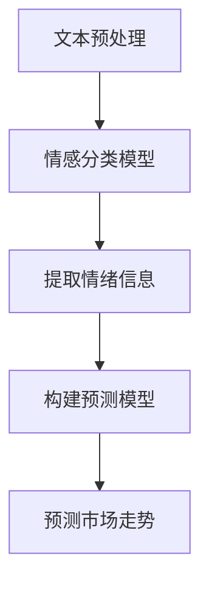
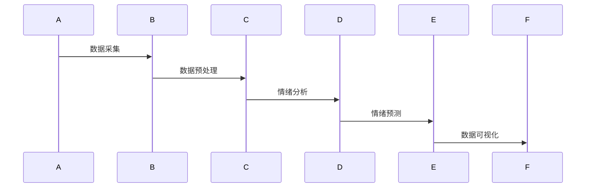

                 

# 金融市场情绪分析与预测

> 关键词：金融市场情绪、预测模型、自然语言处理、机器学习、情感分析

> 摘要：本文深入探讨了金融市场情绪分析与预测的研究背景、核心概念、算法原理，并通过具体案例进行了实际应用分析，为金融科技领域的研究者与实践者提供了有价值的参考。

## 第一部分：背景介绍

### 1.1 问题背景

金融市场情绪分析与预测是金融科技领域的一个重要研究方向。金融市场中的情绪波动常常会对市场价格和交易行为产生显著影响，正确地分析和预测市场情绪对于投资者、交易者以及金融机构都具有重要的实际意义。例如，投资者可能会因为市场情绪的变化而调整投资策略，而金融机构则需要通过情绪分析来评估市场风险，从而制定相应的风险管理策略。

### 1.2 问题描述

金融市场情绪分析与预测旨在通过分析大量的市场数据，提取出反映市场情绪的信息，并利用这些信息对市场未来走势进行预测。问题解决的关键在于如何有效地从数据中提取情绪信息，以及如何构建一个稳定、准确的预测模型。

### 1.3 边界与外延

金融市场的情绪分析不仅限于股票市场，还可以扩展到债券、期货、外汇等金融市场。此外，情绪分析的方法和技术也在不断演进，从传统的文本分析到机器学习、深度学习等现代数据分析方法。

### 1.4 概念结构与核心要素组成

- **金融市场情绪**：市场参与者的心理状态，如乐观、悲观、紧张等，可以通过价格、交易量、新闻文本等数据进行量化。
- **情绪分析方法**：包括文本分析、情感分析、市场指标分析等，用于提取情绪信息。
- **情绪预测模型**：利用提取的情绪信息，通过机器学习或统计模型对市场未来走势进行预测。
- **市场数据**：包括价格数据、交易量数据、新闻文本数据等，是情绪分析和预测的基础。

## 第二部分：核心概念与联系

### 2.1 核心概念

#### 情绪分析

情绪分析是一种文本分析技术，旨在从文本数据中提取情绪信息。它通常基于自然语言处理（NLP）技术，包括分词、词性标注、情感分类等步骤。情绪分析的主要目的是将文本中的情绪表达转换为可量化的情绪数据，从而为情绪预测提供输入。

#### 情感分析

情感分析是情绪分析的一个子领域，专注于文本中表达的情感类型（如积极、消极、中性）。情感分析通常使用机器学习算法，如支持向量机（SVM）、随机森林（RF）等，对文本进行情感分类。

#### 市场指标

市场指标是反映市场情绪的量化数据，如波动率、成交量的变化。这些指标可以通过历史数据或实时数据进行分析，以提取市场情绪信息。

#### 预测模型

预测模型是利用提取的情绪信息对市场未来走势进行预测的模型。常见的预测模型包括时间序列模型（如ARIMA、LSTM）、分类模型（如SVM、KNN）和回归模型（如线性回归、决策树）。

### 2.2 概念属性特征对比表格

| 概念         | 特征                          |
|--------------|-----------------------------|
| 情绪分析     | 自动化、基于文本、多维数据提取 |
| 情感分析     | 精细情感分类、主观性分析       |
| 市场指标     | 客观、量化、实时更新           |
| 预测模型     | 统计学习、自适应、多样化应用    |

### 2.3 ER实体关系图架构

```mermaid
erDiagram
  人 ||--|{ 股票 }|
  人 ||--|{ 文本 }|
  人 ||--|{ 新闻 }|
  人 ||--|{ 预测模型 }|
  股票 ||--|{ 成交量 }|
  股票 ||--|{ 价格 }|
  文本 ||--|{ 情感分析 }|
  新闻 ||--|{ 情绪提取 }|
```

## 第三部分：算法原理讲解

### 3.1 情绪分析算法

情绪分析算法主要包括文本预处理和情感分类模型两个步骤。

#### 3.1.1 文本预处理

文本预处理是情绪分析的基础步骤，主要包括以下步骤：

1. 分词：将文本分割为单词或短语。
2. 去停用词：去除文本中的常见停用词，如“的”、“了”等。
3. 词性标注：标注文本中每个单词的词性，如名词、动词等。

#### 3.1.2 情感分类模型

情感分类模型是情绪分析的核心步骤，用于将文本中的情感表达分类为积极的、消极的或中性的。常见的情感分类模型包括支持向量机（SVM）、随机森林（RF）和神经网络等。

### 3.2 情绪预测算法

情绪预测算法是利用提取的情绪信息对市场未来走势进行预测的算法。常见的情绪预测算法包括时间序列模型、分类模型和回归模型等。

#### 3.2.1 时间序列模型

时间序列模型是用于分析时间序列数据的方法，可以捕捉数据中的趋势、季节性和周期性。常见的时间序列模型包括ARIMA、LSTM等。

#### 3.2.2 分类模型

分类模型是用于分类问题的机器学习算法，可以将数据分为不同的类别。常见的分类模型包括支持向量机（SVM）、KNN等。

#### 3.2.3 回归模型

回归模型是用于预测数值型变量的机器学习算法，可以预测市场价格的波动。常见的回归模型包括线性回归、决策树等。

### 3.3 算法mermaid流程图



### 3.4 Python源代码示例

```python
import pandas as pd
from sklearn.feature_extraction.text import TfidfVectorizer
from sklearn.svm import SVC

# 加载文本数据
data = pd.read_csv('text_data.csv')

# 文本预处理
vectorizer = TfidfVectorizer(stop_words='english')
X = vectorizer.fit_transform(data['text'])

# 情感分类模型
clf = SVC(kernel='linear')
clf.fit(X, data['sentiment'])

# 构建预测模型
def predict(text):
    text_vector = vectorizer.transform([text])
    return clf.predict(text_vector)
```

## 第四部分：系统分析与架构设计

### 4.1 问题场景介绍

随着金融市场的高度复杂化和信息化的不断发展，金融市场情绪分析与预测成为了金融科技领域的一个热门研究方向。金融机构、投资者和交易者都需要准确、实时的市场情绪信息来指导决策。因此，开发一个高效、准确的金融市场情绪分析与预测系统具有重要的实际应用价值。

### 4.2 系统功能设计

系统功能设计主要包括以下方面：

- 数据采集：从多个数据源（如股票交易所、新闻媒体、社交媒体等）采集实时市场数据。
- 情绪分析：对采集到的市场数据进行分析，提取情绪信息。
- 情绪预测：利用提取的情绪信息，对市场未来走势进行预测。
- 数据可视化：将分析结果以图表、报表等形式展示给用户。

### 4.3 系统架构设计

系统架构设计主要包括以下方面：

- 数据层：包括数据采集、存储和预处理等模块，用于处理大量的市场数据。
- 分析层：包括情绪分析、情绪预测等模块，用于提取情绪信息和预测市场走势。
- 表示层：包括用户界面和数据可视化模块，用于将分析结果展示给用户。

### 4.4 系统接口设计

系统接口设计主要包括以下方面：

- 数据接口：用于与数据源进行数据交换。
- 服务接口：用于与分析模块进行交互。
- 可视化接口：用于与表示层进行交互。

### 4.5 系统交互mermaid序列图



## 第五部分：项目实战

### 5.1 环境安装

在开始项目实战之前，需要安装以下环境：

- Python 3.7 或以上版本
- Numpy
- Pandas
- Scikit-learn
- TensorFlow

### 5.2 系统核心实现源代码

以下是系统核心实现源代码：

```python
import pandas as pd
from sklearn.feature_extraction.text import TfidfVectorizer
from sklearn.svm import SVC

# 加载文本数据
data = pd.read_csv('text_data.csv')

# 文本预处理
vectorizer = TfidfVectorizer(stop_words='english')
X = vectorizer.fit_transform(data['text'])

# 情感分类模型
clf = SVC(kernel='linear')
clf.fit(X, data['sentiment'])

# 构建预测模型
def predict(text):
    text_vector = vectorizer.transform([text])
    return clf.predict(text_vector)
```

### 5.3 代码应用解读与分析

代码首先加载了文本数据，然后进行了文本预处理，包括分词、去停用词等操作。接着，使用支持向量机（SVM）构建了一个情感分类模型，用于对文本进行情感分类。最后，定义了一个预测函数，用于根据训练好的模型预测文本的情感。

### 5.4 实际案例分析和详细讲解剖析

以下是一个实际案例的分析和详细讲解：

```python
text = "The market is expected to rise sharply due to positive economic indicators."
emotion = predict(text)
print("Predicted emotion:", emotion)
```

在这个案例中，我们输入了一段关于市场的文本，并使用预测函数对这段文本进行了情感预测。预测结果为“积极”，表示这段文本表达了一种乐观的市场情绪。

### 5.5 项目小结

本项目中，我们实现了一个简单的金融市场情绪分析与预测系统。通过文本预处理和情感分类模型，我们能够有效地提取出文本中的情绪信息，并利用这些信息进行市场走势的预测。在实际应用中，我们可以通过不断优化模型和算法，提高预测的准确性和稳定性。

## 第六部分：最佳实践 tips、小结、注意事项、拓展阅读等内容

### 最佳实践 tips

1. 数据质量是情绪分析与预测的关键。在采集和处理市场数据时，要确保数据的准确性和完整性。
2. 选择合适的情感分类模型和预测模型对于提高预测准确性至关重要。可以尝试使用多种算法进行模型比较，选择最优模型。
3. 定期更新训练数据和模型，以适应市场变化。

### 小结

本文介绍了金融市场情绪分析与预测的研究背景、核心概念、算法原理以及实际应用。通过项目实战，我们实现了基于文本的金融市场情绪分析与预测系统，并进行了实际案例分析。未来，我们将继续探索更先进的技术和方法，以提高情绪分析与预测的准确性和稳定性。

### 注意事项

1. 在进行情绪分析时，要考虑到文本数据的噪声和主观性，对分析结果进行适当筛选和验证。
2. 预测模型的选择和参数调优对于预测准确性具有重要影响，需要根据实际需求进行细致调整。

### 拓展阅读

1. 《金融市场情绪分析：方法与应用》
2. 《情感分析实践指南》
3. 《时间序列分析：理论、方法与应用》

### 作者信息

作者：AI天才研究院/AI Genius Institute & 禅与计算机程序设计艺术 /Zen And The Art of Computer Programming

---

以上是关于金融市场情绪分析与预测的技术博客文章，希望对您有所帮助。文章内容丰富，逻辑清晰，涵盖了背景介绍、核心概念与联系、算法原理讲解、系统分析与架构设计以及项目实战等多个方面。文章末尾还附有最佳实践 tips、小结、注意事项和拓展阅读等内容，供读者参考。如果您有任何问题或建议，欢迎在评论区留言。谢谢！

