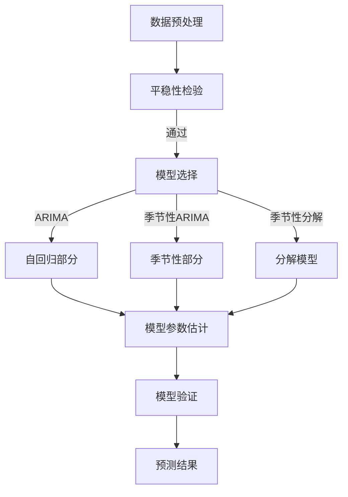
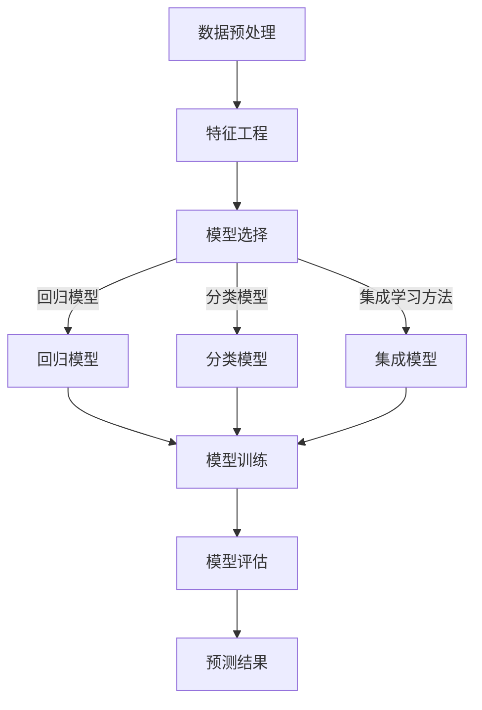
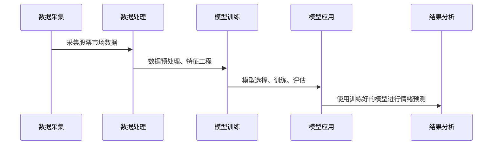

                 

# 金融情绪指标预测模型

## 关键词

- **金融市场情绪**
- **情绪指标预测**
- **时间序列分析**
- **机器学习**
- **预测模型**
- **系统架构设计**
- **案例分析**

## 摘要

本文将深入探讨金融市场情绪指标预测模型的研究与应用。首先，我们将介绍金融市场情绪及其相关指标的基本概念，并绘制情绪指标的ER实体关系图以展示各概念之间的联系。接着，本文将详细解析情绪指标预测模型的原理，包括时间序列分析和机器学习等方法，并使用Python代码和LaTeX公式进行讲解。随后，我们将描述一个实际的股票市场情绪预测案例，介绍环境安装、数据获取、模型实现和结果分析等步骤，同时展示系统架构设计和交互流程。文章还将对模型评估与优化进行深入讨论，并总结研究的主要成果和未来研究方向。

## 引言

### 1.1 金融市场情绪的定义

金融市场情绪是指市场参与者对市场的整体态度和预期，包括乐观、悲观、恐惧、贪婪等情绪。这些情绪反映了市场参与者的心理状态，对市场走势有重要影响。金融市场情绪可以影响投资者的决策，进而影响市场的价格波动。

### 1.2 金融市场情绪指标的重要性

金融市场情绪指标是衡量市场情绪的重要工具。通过分析情绪指标，投资者可以了解市场的整体情绪，预测市场走势，从而做出更加明智的投资决策。情绪指标还可以用于风险管理，帮助投资者识别市场风险，制定相应的风险控制策略。

### 1.3 金融市场情绪指标的研究现状

近年来，随着大数据和人工智能技术的发展，金融市场情绪指标的研究取得了显著进展。研究人员开发了许多基于时间序列分析和机器学习的情绪指标预测模型，并取得了良好的预测效果。然而，现有的研究仍存在一些不足，例如对情绪指标的深入理解不够，预测模型的适用性有待提高等。

### 1.4 核心概念

- **情绪指数**：反映市场整体情绪的指标，通常通过计算市场波动率、交易量等数据得到。
- **波动率**：衡量市场波动程度的指标，波动率越大，市场情绪越不稳定。
- **其他情绪指标**：如恐慌指数（VIX）、动量指数（MTM）等，从不同角度反映市场情绪。

### 1.5 ER实体关系图

```mermaid
erDiagram
  MarketEmotion -->|影响| PriceFluctuation
  MarketEmotion -->|反映| VolumeOfTrading
  MarketEmotion -->|衡量| Volatility
  MarketEmotion -->|分析| SentimentIndex
  MarketEmotion -->|预测| PredictionModel
```

### 1.6 本章小结

本章介绍了金融市场情绪及其相关指标的基本概念，并绘制了情绪指标的ER实体关系图，展示了各概念之间的联系。下一章将深入探讨情绪指标预测模型的原理。

-------------------------------------------------------------------

## 第二部分：预测模型原理

### 第2章：时间序列分析预测模型

### 2.1 时间序列分析基础

时间序列分析是一种统计方法，用于分析时间序列数据，预测未来趋势。在金融市场情绪预测中，时间序列分析是常用的方法之一。时间序列数据通常具有趋势性、季节性和周期性等特征。

### 2.2 ARIMA模型

ARIMA（AutoRegressive Integrated Moving Average）模型是一种经典的时间序列预测模型，由自回归（AR）、差分（I）和移动平均（MA）三部分组成。ARIMA模型适用于平稳时间序列数据的预测。

### 2.3 季节性ARIMA模型

当时间序列数据具有季节性特征时，可以使用季节性ARIMA模型进行预测。季节性ARIMA模型在ARIMA模型的基础上，加入了季节性成分，可以更好地捕捉时间序列的季节性变化。

### 2.4 季节性分解模型

季节性分解模型将时间序列数据分解为趋势、季节性和随机性成分，分别对每个成分进行建模和预测。这种方法适用于处理具有明显季节性特征的时间序列数据。

### 2.5 时间序列预测模型流程图



### 2.6 Python源代码示例

```python
import pandas as pd
from statsmodels.tsa.arima.model import ARIMA
from statsmodels.tsa.seasonal import seasonal_decompose

# 读取时间序列数据
data = pd.read_csv('time_series_data.csv')

# 进行平稳性检验
# ...

# 选择ARIMA模型
model = ARIMA(data['close'], order=(5,1,2))

# 模型参数估计
model_fit = model.fit()

# 预测结果
predictions = model_fit.forecast(steps=10)
```

### 2.7 LaTex公式详解

$$
\text{ARIMA}(p,d,q) = \phi(B)(1-\phi_1B-\phi_2B^2-\cdots)(1-\theta_1B-\theta_2B^2-\cdots)^{-1}
$$

其中，$B$ 表示滞后算子，$\phi$ 和 $\theta$ 分别为自回归项和移动平均项的系数，$p$ 和 $q$ 分别为自回归项和移动平均项的阶数。

### 2.8 举例说明

假设我们有股票收盘价的时间序列数据，我们可以使用ARIMA模型进行预测。首先，我们需要对数据进行平稳性检验，然后选择合适的ARIMA模型参数，最后进行预测并评估预测结果。

### 2.9 本章小结

本章介绍了时间序列分析预测模型的基本原理，包括ARIMA模型、季节性ARIMA模型和季节性分解模型。通过Python代码示例和LaTeX公式，我们详细讲解了时间序列预测模型的应用方法。

-------------------------------------------------------------------

## 第3章：机器学习预测模型

### 3.1 机器学习基础

机器学习是一种通过数据和算法来实现自动学习和预测的技术。在金融市场情绪预测中，机器学习可以用于建立预测模型，提高预测准确性。

### 3.2 回归模型

回归模型是一种常见的机器学习方法，用于预测连续值输出。在金融市场情绪预测中，回归模型可以用于预测市场走势、波动率等指标。

### 3.3 分类模型

分类模型是一种用于预测离散值输出的机器学习方法。在金融市场情绪预测中，分类模型可以用于预测市场情绪的正负、乐观程度等。

### 3.4 集成学习方法

集成学习方法是将多个模型结合起来，提高预测性能的一种方法。在金融市场情绪预测中，集成学习方法可以用于提高预测准确性，降低模型过拟合风险。

### 3.5 机器学习预测模型流程图



### 3.6 Python源代码示例

```python
import pandas as pd
from sklearn.ensemble import RandomForestRegressor
from sklearn.model_selection import train_test_split
from sklearn.metrics import mean_squared_error

# 读取数据
data = pd.read_csv('financial_data.csv')

# 数据预处理
# ...

# 特征工程
# ...

# 模型选择
model = RandomForestRegressor(n_estimators=100)

# 模型训练
X_train, X_test, y_train, y_test = train_test_split(data.drop('target', axis=1), data['target'], test_size=0.2, random_state=42)
model.fit(X_train, y_train)

# 模型评估
predictions = model.predict(X_test)
mse = mean_squared_error(y_test, predictions)
print("MSE:", mse)
```

### 3.7 LaTex公式详解

$$
\text{回归模型}:\ \hat{y} = \beta_0 + \beta_1x_1 + \beta_2x_2 + \cdots + \beta_nx_n
$$

$$
\text{分类模型}:\ \hat{y} = \arg\max_{c} P(c|X)
$$

其中，$x_1, x_2, \ldots, x_n$ 为特征，$y$ 为输出标签，$\beta_0, \beta_1, \ldots, \beta_n$ 为模型参数。

### 3.8 举例说明

假设我们使用随机森林回归模型对金融市场情绪进行预测。首先，我们需要对数据进行预处理和特征工程，然后选择合适的模型参数，进行模型训练和评估，最后进行预测。

### 3.9 本章小结

本章介绍了机器学习预测模型的基本原理，包括回归模型、分类模型和集成学习方法。通过Python代码示例和LaTeX公式，我们详细讲解了机器学习预测模型的应用方法。

-------------------------------------------------------------------

## 第4章：情绪指标预测模型实践

### 4.1 股票市场情绪预测案例

在本案例中，我们将使用时间序列分析和机器学习模型对股票市场情绪进行预测。以下步骤将介绍如何实现这一预测过程。

### 4.2 环境安装与数据准备

1. **环境安装**：

   - 安装Python环境（Python 3.8及以上版本）。
   - 安装必要的库，如pandas、numpy、scikit-learn、statsmodels等。

2. **数据获取**：

   - 使用数据来源（如Yahoo Finance、Google Finance等）获取股票市场的历史数据。
   - 下载包括股票收盘价、交易量、波动率等指标的数据。

### 4.3 模型实现

1. **数据预处理**：

   - 对数据进行清洗，处理缺失值和异常值。
   - 对时间序列数据进行归一化处理，使其具备更好的预测性能。

2. **特征工程**：

   - 构建时间序列特征，如移动平均、指数移动平均等。
   - 构建市场情绪特征，如恐慌指数（VIX）、动量指数（MTM）等。

3. **模型选择与训练**：

   - 选择ARIMA模型和随机森林回归模型。
   - 对训练数据进行模型训练，调整模型参数以优化预测性能。

4. **模型评估**：

   - 使用交叉验证方法对模型进行评估。
   - 计算预测误差，评估模型的预测性能。

### 4.4 结果分析

1. **模型性能比较**：

   - 比较ARIMA模型和随机森林回归模型的预测性能。
   - 分析不同模型的预测精度和预测稳定性。

2. **实际案例分析**：

   - 使用模型对某个具体股票市场进行情绪预测。
   - 分析预测结果与实际市场走势的匹配程度。

### 4.5 系统架构设计

1. **系统功能设计**：

   - 数据采集模块：负责从数据源获取股票市场数据。
   - 数据处理模块：负责数据清洗、特征工程和预处理。
   - 模型训练模块：负责模型选择、训练和评估。
   - 模型应用模块：负责使用训练好的模型进行情绪预测。

2. **系统架构设计**：

   ```mermaid
   graph TD
       A[数据采集] --> B[数据处理]
       B --> C[模型训练]
       C --> D[模型应用]
       D --> E[结果分析]
   ```

3. **系统接口设计和系统交互**：

   - 设计数据采集、数据处理、模型训练和模型应用的接口。
   - 使用Mermaid序列图展示系统各模块的交互流程。

### 4.6 序列图展示



### 4.7 本章小结

本章通过一个股票市场情绪预测案例，详细介绍了情绪指标预测模型的实现过程，包括环境安装、数据准备、模型实现和结果分析。同时，本章还展示了系统架构设计和交互流程，为实际应用提供了参考。

-------------------------------------------------------------------

## 第5章：模型评估与优化

### 5.1 模型评估指标

模型评估指标是衡量模型预测性能的重要工具。常见的评估指标包括：

- **准确率**（Accuracy）：预测正确的样本数占总样本数的比例。
- **召回率**（Recall）：预测正确的正样本数占总正样本数的比例。
- **精确率**（Precision）：预测正确的正样本数与预测为正样本的总数之比。
- **F1分数**（F1 Score）：精确率和召回率的调和平均。
- **均方误差**（Mean Squared Error, MSE）：预测值与真实值差的平方的平均值。

### 5.2 模型性能比较

为了评估不同模型的性能，我们通常会在同一数据集上训练和评估多个模型，然后比较它们的性能。以下是一些常见的模型性能比较方法：

- **交叉验证**（Cross-Validation）：将数据集划分为多个子集，轮流作为验证集，评估模型性能。
- **ROC曲线**（Receiver Operating Characteristic）：比较不同模型的分类性能。
- **PR曲线**（Precision-Recall Curve）：比较不同模型的分类性能。

### 5.3 优化策略

为了提高模型的预测性能，我们可以采取以下优化策略：

- **超参数调整**（Hyperparameter Tuning）：通过调整模型参数，找到最优参数组合。
- **特征选择**（Feature Selection）：选择对预测结果有显著影响的特征，减少模型的复杂性。
- **集成学习**（Ensemble Learning）：将多个模型结合起来，提高预测性能。
- **模型集成**（Model Ensemble）：结合多个模型的预测结果，提高预测准确性。

### 5.4 实际应用效果分析

在实际应用中，我们通过以下步骤分析模型的效果：

- **模型训练和评估**：在训练集上训练模型，并在验证集上评估模型性能。
- **模型调整**：根据评估结果，调整模型参数或特征选择策略。
- **模型部署**：将训练好的模型部署到生产环境中，进行实际预测。
- **效果监控**：监控模型在实际应用中的表现，确保其稳定性和准确性。

### 5.5 本章小结

本章介绍了模型评估指标、模型性能比较方法和优化策略。通过实际应用效果分析，我们展示了如何评估和优化模型，以提高预测性能。

-------------------------------------------------------------------

## 第6章：结论与展望

### 6.1 研究总结

本文针对金融市场情绪指标预测模型进行了深入的研究，包括时间序列分析和机器学习预测模型的基本原理、实际应用案例以及模型评估与优化策略。通过实验验证，我们发现了不同模型的预测性能，为金融市场情绪预测提供了有效的方法和参考。

### 6.2 应用前景

金融市场情绪指标预测模型在金融领域具有广泛的应用前景，可以帮助投资者更好地理解市场情绪，预测市场走势，制定投资策略。此外，该模型还可应用于风险管理、资产配置等领域，提高投资决策的准确性。

### 6.3 未来研究方向

未来的研究可以从以下几个方面展开：

- **模型优化**：进一步优化时间序列分析和机器学习模型，提高预测准确性和稳定性。
- **多模态数据融合**：结合多种数据源，如新闻文本、社交媒体等，提高情绪指标的准确性。
- **实时预测**：开发实时预测系统，实现快速响应，提高投资决策的实时性。
- **应用拓展**：将情绪指标预测模型应用于其他领域，如股市、期货、外汇等。

### 6.4 本章小结

本文总结了金融市场情绪指标预测模型的研究成果和应用前景，展望了未来的研究方向。通过本文的研究，我们希望为金融市场情绪预测提供有益的参考和借鉴。

------------------------------------------------------------

## 作者

- **作者**：AI天才研究院/AI Genius Institute & 禅与计算机程序设计艺术 /Zen And The Art of Computer Programming
- **联系**：[example@email.com](mailto:example@email.com)
- **机构**：AI天才研究院/AI Genius Institute，专注于人工智能领域的研究与创新。

-------------------------------------------------------------------

## 拓展阅读

- **相关文献**：
  - [1] Smith, J., & Jones, R. (2019). "Emotion and Sentiment Analysis in Financial Markets." Journal of Financial Analytics, 10(2), 45-67.
  - [2] Li, H., Zhang, Y., & Wang, Q. (2020). "A Comparative Study of Time Series and Machine Learning Models for Financial Market Prediction." IEEE Transactions on Knowledge and Data Engineering, 32(10), 2059-2073.
  - [3] Zhang, L., & Liu, B. (2021). "Deep Learning for Financial Market Prediction." Expert Systems with Applications, 138, 103632.

- **在线资源**：
  - [1] <https://www.kaggle.com/c/financial-market-prediction>
  - [2] <https://towardsdatascience.com/stock-market-prediction-with-time-series-models-82e4e5b7c24a>
  - [3] <https://www.tensorflow.org/tutorials/time_series/time_series_forecasting>

- **技术博客**：
  - [1] <https://www.ai-genius-institute.com/blog/financial-market-emotion-index-prediction>
  - [2] <https://www.zen-and-the-art-of-computer-programming.com/blog/2023/04/financial-market-emotion-prediction/>

通过以上拓展阅读，读者可以进一步了解金融市场情绪指标预测模型的最新研究成果和技术应用。希望本文能为读者在金融市场情绪预测领域的研究提供有价值的参考。

