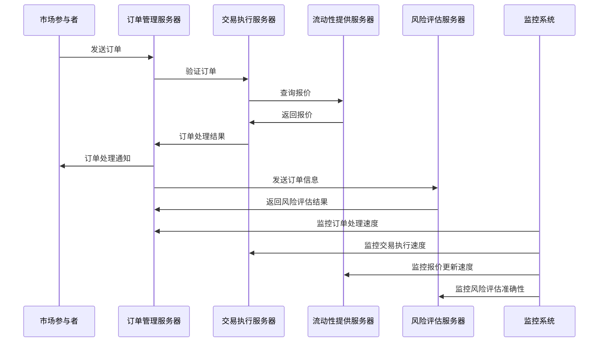

                 

# 金融市场流动性提供策略优化

> 关键词：金融市场流动性、流动性提供策略、优化算法、案例研究

> 摘要：本文以金融市场流动性提供策略优化为主题，深入探讨了流动性问题的背景、核心概念、算法原理以及实际案例。通过对金融市场流动性提供策略的详细分析，提出了优化算法原理和数学模型，并运用实际案例进行验证，为金融市场流动性提供策略的优化提供了有价值的参考。

## 目录大纲

----------------------------------------------------------------

# 第一部分: 金融市场流动性提供策略优化背景介绍

## 1.1 问题背景

### 1.1.1 金融市场的流动性问题

### 1.1.2 流动性提供的重要性

### 1.1.3 现有流动性提供策略的局限

## 1.2 问题描述

### 1.2.1 流动性提供策略的挑战

### 1.2.2 目标与要求

### 1.2.3 边界与外延

## 1.3 问题解决

### 1.3.1 基本概念

### 1.3.2 解决思路与方法

### 1.3.3 关键技术

## 1.4 概念结构与核心要素组成

### 1.4.1 流动性提供策略的概念结构

### 1.4.2 核心要素与相互关系

## 1.5 本章小结

----------------------------------------------------------------

# 第二部分: 金融市场流动性提供策略的核心概念

## 2.1 核心概念原理

### 2.1.1 流动性风险

### 2.1.2 流动性提供策略的类型

### 2.1.3 流动性提供策略的目标

## 2.2 概念属性特征对比表格

## 2.3 ER实体关系图架构

## 2.4 本章小结

----------------------------------------------------------------

# 第三部分: 流动性提供策略的算法原理

## 3.1 算法原理讲解

### 3.1.1 流动性度量算法

### 3.1.2 优化算法原理

## 3.2 算法数学模型与公式

## 3.3 算法举例说明

### 3.3.1 具体案例

### 3.3.2 例子分析

## 3.4 本章小结

----------------------------------------------------------------

# 第四部分: 实际案例分析

## 4.1 案例介绍

### 4.1.1 案例背景

### 4.1.2 案例目标

### 4.1.3 案例环境

## 4.2 系统功能设计

### 4.2.1 领域模型

### 4.2.2 功能模块

## 4.3 系统架构设计

### 4.3.1 架构概述

### 4.3.2 架构细节

## 4.4 系统接口设计和系统交互

### 4.4.1 系统接口设计

### 4.4.2 系统交互

## 4.5 项目实战

### 4.5.1 环境安装

### 4.5.2 系统核心实现源代码

### 4.5.3 代码应用解读与分析

### 4.5.4 实际案例分析和详细讲解剖析

### 4.5.5 项目小结

## 4.6 最佳实践 tips

## 4.7 小结

## 4.8 注意事项

## 4.9 拓展阅读

----------------------------------------------------------------

## 1.1 问题背景

### 1.1.1 金融市场的流动性问题

金融市场流动性问题是指金融资产在市场上的买卖难度，以及买卖价格波动的情况。流动性问题主要体现在两个方面：一是市场深度不足，即买卖订单量较小，难以在短时间内完成交易；二是买卖价差较大，即买卖价格差异较大，增加了交易成本。金融市场流动性问题会影响市场的效率，增加交易风险，甚至可能导致市场崩溃。

### 1.1.2 流动性提供的重要性

流动性是金融市场的重要特征之一，其提供的重要性体现在以下几个方面：

1. **市场效率**：高流动性有助于降低交易成本，提高市场效率，使市场参与者能够迅速完成交易。

2. **风险分散**：流动性好，市场参与者更容易将风险分散到不同的资产上，降低整个市场的风险。

3. **市场稳定**：流动性好，市场在面对突发事件时，能够快速调整价格，保持市场的稳定。

4. **金融创新**：流动性好，为金融创新提供了基础，新的金融工具和交易平台得以快速发展。

### 1.1.3 现有流动性提供策略的局限

目前，金融市场流动性提供策略主要包括以下几种：

1. **市场做市商制度**：市场做市商通过提供买卖报价，增加市场深度，提高市场流动性。

2. **中央对手方制度**：通过集中交易和清算，降低交易风险，提高市场流动性。

3. **金融衍生品**：通过金融衍生品交易，提供更多的市场参与者和交易机会，增加市场流动性。

然而，这些策略也存在一些局限：

1. **成本高**：市场做市商和金融衍生品交易的成本较高，可能不适合小型投资者。

2. **风险控制难度大**：市场做市商和金融衍生品交易需要承担较大的风险，风险控制难度大。

3. **监管难度大**：随着金融市场的发展，监管机构需要面对越来越多的交易产品和交易平台，监管难度增加。

### 1.2 问题描述

#### 1.2.1 流动性提供策略的挑战

流动性提供策略面临的主要挑战包括：

1. **成本与收益平衡**：如何在提供流动性的同时，确保收益最大化。

2. **风险控制**：如何在提供流动性的同时，控制风险。

3. **监管合规**：如何满足监管要求，确保流动性提供策略的合规性。

#### 1.2.2 目标与要求

流动性提供策略的目标和要求主要包括：

1. **提高市场流动性**：通过提供买卖报价，增加市场深度，提高市场流动性。

2. **降低交易成本**：通过优化交易流程，降低交易成本。

3. **控制风险**：通过有效的风险控制措施，降低流动性提供策略的风险。

4. **满足监管要求**：确保流动性提供策略的合规性，满足监管要求。

#### 1.2.3 边界与外延

流动性提供策略的边界与外延主要包括：

1. **市场范围**：流动性提供策略适用的市场范围。

2. **策略类型**：流动性提供策略的类型，如市场做市商、金融衍生品等。

3. **策略实施主体**：流动性提供策略的实施主体，如金融机构、做市商等。

4. **策略实施时间**：流动性提供策略的实施时间，如实时交易、定期交易等。

## 1.3 问题解决

### 1.3.1 基本概念

在探讨流动性提供策略优化之前，我们首先需要了解一些基本概念：

1. **流动性**：流动性是指资产在市场上能够迅速买卖且不会对市场价格产生重大影响的能力。

2. **流动性风险**：流动性风险是指因市场流动性不足而导致资产难以以合理的价格迅速买卖的风险。

3. **流动性提供策略**：流动性提供策略是指金融市场参与者为增加市场流动性而采取的一系列措施。

4. **优化**：优化是指在满足特定约束条件下，寻找最优解的过程。

### 1.3.2 解决思路与方法

解决流动性提供策略优化的问题，我们可以从以下几个方面入手：

1. **市场研究**：通过分析市场数据，了解市场流动性现状，识别潜在问题和机会。

2. **策略设计**：根据市场研究的结果，设计适合的流动性提供策略。

3. **算法实现**：将策略转化为可执行的算法，通过编程实现。

4. **风险评估**：对流动性提供策略进行风险评估，确保策略的安全性。

5. **测试与迭代**：对策略进行测试，根据测试结果进行优化迭代。

### 1.3.3 关键技术

在流动性提供策略优化过程中，关键技术包括：

1. **算法设计**：设计有效的算法来评估市场流动性和优化策略。

2. **数据挖掘**：利用数据挖掘技术分析市场数据，为策略设计提供支持。

3. **机器学习**：利用机器学习技术，从历史数据中学习规律，提高策略的预测能力。

4. **实时监控**：实时监控市场变化，及时调整策略。

## 1.4 概念结构与核心要素组成

### 1.4.1 流动性提供策略的概念结构

流动性提供策略的概念结构可以分为以下几个层次：

1. **市场层次**：包括市场流动性现状、市场结构和市场参与者。

2. **策略层次**：包括流动性提供策略的类型、目标和实施方法。

3. **技术层次**：包括算法设计、数据分析和机器学习技术。

### 1.4.2 核心要素与相互关系

流动性提供策略的核心要素包括：

1. **市场数据**：提供流动性所需的市场数据。

2. **策略模型**：用于评估市场流动性和优化策略的数学模型。

3. **算法实现**：将策略模型转化为可执行的算法。

4. **风险评估**：对流动性提供策略进行风险评估。

5. **监控与调整**：实时监控市场变化，根据市场反馈调整策略。

这些核心要素之间的关系如下：

- 市场数据是策略设计和评估的基础。
- 策略模型是算法实现的核心。
- 算法实现是实现策略目标的关键。
- 风险评估确保策略的安全性。
- 监控与调整使策略能够适应市场变化。

## 1.5 本章小结

本部分介绍了金融市场流动性提供策略优化的背景、核心概念和基本方法。通过对流动性问题的背景介绍和问题描述，我们明确了流动性提供策略的重要性。同时，通过对基本概念和解决思路的阐述，我们为后续的算法原理和实际案例研究奠定了基础。在接下来的章节中，我们将深入探讨流动性提供策略的核心概念、算法原理以及实际应用案例，以期提供有价值的优化方案。

## 2.1 核心概念原理

在讨论金融市场流动性提供策略优化之前，我们首先需要理解几个核心概念：流动性风险、流动性提供策略的类型以及流动性提供策略的目标。这些概念构成了金融市场流动性提供策略优化的理论基础，是我们进一步探讨算法原理和实际应用的基础。

### 2.1.1 流动性风险

流动性风险是指资产在市场上难以迅速买卖，或者只能以大幅折价出售的风险。流动性风险可以分为两类：

1. **市场流动性风险**：市场流动性风险是指由于市场整体流动性不足，导致特定资产难以买卖的风险。这种风险通常与市场深度不足、交易量小和市场波动性大有关。

2. **信用流动性风险**：信用流动性风险是指由于市场参与者对其他参与者信用状况的不确定性，导致交易无法顺利进行的风险。这种风险通常与金融机构之间的互信关系和市场流动性紧张有关。

了解流动性风险对于设计有效的流动性提供策略至关重要。通过识别和评估流动性风险，我们可以更有针对性地制定风险控制措施，降低流动性提供策略的风险水平。

### 2.1.2 流动性提供策略的类型

流动性提供策略的类型多样，不同类型的策略适用于不同的市场环境和目标。以下是一些常见的流动性提供策略：

1. **市场做市商策略**：市场做市商是金融市场上的一种特殊角色，负责在交易市场中提供买卖报价，以维持市场流动性。做市商通过不断调整报价，以适应市场变化，确保市场交易能够顺利进行。

2. **中央对手方策略**：中央对手方（CCP）是交易市场的核心组成部分，负责为交易双方提供担保和清算服务。通过集中交易和清算，CCP提高了市场的流动性和安全性。

3. **金融衍生品策略**：金融衍生品包括期货、期权、互换等，它们为市场参与者提供了对冲风险和投机机会。通过提供衍生品交易，市场可以吸引更多的参与者，增加市场流动性。

4. **流动性支持基金策略**：流动性支持基金是一笔专门的资金，用于在市场流动性紧张时提供临时性流动性支持。这种策略可以缓解市场流动性危机，维持市场的稳定。

### 2.1.3 流动性提供策略的目标

流动性提供策略的目标主要包括：

1. **提高市场流动性**：通过提供买卖报价、清算服务和衍生品交易，增加市场的交易量和深度，提高市场流动性。

2. **降低交易成本**：通过优化交易流程和风险控制措施，降低交易成本，提高市场效率。

3. **控制风险**：通过有效的风险控制措施，降低流动性提供策略的整体风险，确保市场参与者的利益。

4. **满足监管要求**：确保流动性提供策略符合监管要求，避免因违规操作而遭受处罚。

流动性提供策略的目标不仅包括提高市场流动性和降低交易成本，还涉及风险控制和合规性问题。因此，在设计和实施流动性提供策略时，需要综合考虑这些目标，以实现全面优化。

### 2.2 概念属性特征对比表格

为了更好地理解流动性提供策略的各种类型，我们可以通过对比表格来展示不同策略的属性特征。以下是一个简化的对比表格，列出了市场做市商策略、中央对手方策略、金融衍生品策略和流动性支持基金策略的一些关键属性特征：

| 策略类型             | 目标                     | 主要特征                                             | 适用场景           |
|----------------------|--------------------------|------------------------------------------------------|-------------------|
| 市场做市商策略       | 提高市场流动性           | 提供买卖报价，实时调整价格                           | 高流动性市场       |
| 中央对手方策略       | 提高交易安全性和流动性   | 为交易双方提供担保和清算服务                         | 高风险市场         |
| 金融衍生品策略       | 对冲风险和投机机会       | 提供多样化的交易工具，包括期货、期权、互换等         | 需要对冲风险的市场  |
| 流动性支持基金策略   | 缓解市场流动性紧张       | 提供临时性流动性支持，维持市场稳定                   | 市场流动性紧张时   |

通过对比表格，我们可以看到不同流动性提供策略在目标、主要特征和适用场景上的差异。这些策略的灵活运用，可以在不同市场环境下，有效提高市场流动性、降低交易成本和控制风险。

### 2.3 ER实体关系图架构

为了更好地理解流动性提供策略涉及的实体及其关系，我们可以使用实体关系图（Entity-Relationship Diagram, ERD）来展示。以下是一个简化的ER实体关系图，展示了市场参与者、流动性提供策略和市场环境之间的基本关系：

```mermaid
erDiagram
    MarketParticipant ||--|{ LiquidityProviderStrategy } : has
    LiquidityProviderStrategy ||--|{ MarketEnvironment } : operates_in
    MarketParticipant ||--|{ MarketEnvironment } : participates_in
```

在这个ER图中：

- **MarketParticipant（市场参与者）**：包括个人投资者、机构投资者和做市商等，是市场流动性的主要提供者和需求者。
- **LiquidityProviderStrategy（流动性提供策略）**：包括市场做市商策略、中央对手方策略、金融衍生品策略和流动性支持基金策略等，是市场参与者为提高市场流动性所采取的措施。
- **MarketEnvironment（市场环境）**：包括市场流动性、交易成本和市场风险等，是流动性提供策略实施的环境背景。

这些实体之间的关系如下：

- **MarketParticipant**与**LiquidityProviderStrategy**之间的关系是“拥有”（has），即市场参与者可以选择和实施不同的流动性提供策略。
- **LiquidityProviderStrategy**与**MarketEnvironment**之间的关系是“运营于”（operates_in），即流动性提供策略是在特定的市场环境下实施的。
- **MarketParticipant**与**MarketEnvironment**之间的关系是“参与于”（participates_in），即市场参与者是在特定的市场环境中进行交易的。

通过ER实体关系图，我们可以清晰地看到市场参与者、流动性提供策略和市场环境之间的复杂关系，为后续的算法设计和实现提供了直观的参考。

### 2.4 本章小结

本章介绍了金融市场流动性提供策略优化中的核心概念，包括流动性风险、流动性提供策略的类型和目标。通过对比不同策略的属性特征，我们了解了各种策略在提高市场流动性、降低交易成本和控制风险方面的作用。此外，ER实体关系图的引入，帮助我们更直观地理解了市场参与者、流动性提供策略和市场环境之间的关系。这些核心概念和关系为后续的算法原理讲解和实际案例分析奠定了坚实的基础。

## 3.1 算法原理讲解

流动性提供策略优化需要一套有效的算法来评估市场流动性、制定策略并实现优化。以下是流动性提供策略优化中的核心算法原理讲解，包括流动性度量算法和优化算法原理。

### 3.1.1 流动性度量算法

流动性度量算法用于评估市场的流动性水平，是制定流动性提供策略的重要基础。常见的流动性度量指标包括：

1. **换手率**（Turnover Rate）：换手率是衡量市场流动性的一个重要指标，表示在一定时间内交易量的多少。计算公式为：

   $$  
   \text{换手率} = \frac{\text{总交易量}}{\text{总市值}} \times 100\%  
   $$

   换手率越高，市场流动性越好。

2. **买卖价差**（Bid-Ask Spread）：买卖价差是指买方愿意支付的最高价格与卖方愿意接受的最低价格之间的差额。计算公式为：

   $$  
   \text{买卖价差} = \text{买价} - \text{卖价}  
   $$

   买卖价差越小，市场流动性越好。

3. **深度指标**（Order Book Depth）：深度指标反映了市场订单簿的深度，即买卖订单的数量。常用的深度指标包括：

   - **深度比率**（Depth Ratio）：深度比率是买单深度与卖单深度的比值，公式为：

     $$  
     \text{深度比率} = \frac{\text{买单深度}}{\text{卖单深度}}  
     $$

     深度比率越高，市场流动性越好。

   - **流动性深度**（Liquidity Depth）：流动性深度是买单深度与买卖价差的比值，公式为：

     $$  
     \text{流动性深度} = \frac{\text{买单深度}}{\text{买卖价差}}  
     $$

     流动性深度越高，市场流动性越好。

4. **资产变现时间**（Time to Liquidate）：资产变现时间是衡量资产在市场上以合理价格迅速变现所需的时间。计算公式为：

   $$  
   \text{资产变现时间} = \frac{\text{资产总价值}}{\text{每日平均交易量}}  
   $$

   资产变现时间越短，市场流动性越好。

通过这些流动性度量指标，我们可以综合评估市场的流动性水平，为制定流动性提供策略提供数据支持。

### 3.1.2 优化算法原理

优化算法原理的核心目标是根据流动性度量指标，制定最优的流动性提供策略，以最大化流动性效益。以下是优化算法的基本原理：

1. **目标函数**：优化算法的目标函数通常是一个多目标函数，需要综合考虑流动性、成本和风险等多个因素。一个简单的目标函数可以是：

   $$  
   \text{目标函数} = \min \left( \text{策略成本} \times (\text{流动性风险})^2 + \text{交易成本} \right)  
   $$

   其中，流动性风险和交易成本是主要的优化目标。

2. **约束条件**：优化算法的约束条件包括：

   - **流动性约束**：确保流动性提供策略在实施过程中，能够满足市场流动性需求。
   - **成本约束**：控制流动性提供策略的总成本，确保经济效益。
   - **风险约束**：限制流动性提供策略的风险水平，避免过度承担风险。

3. **算法流程**：优化算法的基本流程如下：

   - **数据收集**：收集市场数据，包括交易量、买卖价差、订单簿深度等。
   - **流动性度量**：使用流动性度量算法计算市场流动性指标。
   - **目标函数计算**：根据流动性度量指标和约束条件，计算目标函数。
   - **策略调整**：根据目标函数的结果，调整流动性提供策略。
   - **结果评估**：评估调整后的策略，判断是否达到优化目标。

4. **优化算法实现**：以下是一个简单的优化算法实现框架（以Python为例）：

   ```python
   def optimize_strategy(current_strategy, objective_function):
       # 演示性的Python代码框架
       # 1. 收集市场数据
       market_data = collect_market_data()

       # 2. 计算流动性度量指标
       liquidity_metrics = calculate_liquidity_metrics(market_data)

       # 3. 计算目标函数值
       objective_value = objective_function(liquidity_metrics, current_strategy)

       # 4. 根据目标函数值调整策略
       optimized_strategy = adjust_strategy(current_strategy, objective_value)

       # 5. 返回优化后的策略
       return optimized_strategy
   ```

通过以上优化算法原理的讲解，我们可以看到，流动性提供策略优化需要结合流动性度量指标和目标函数，通过不断调整策略，实现流动性效益的最大化。

### 3.2 算法数学模型与公式

在流动性提供策略优化中，数学模型和公式起着至关重要的作用。它们帮助我们量化市场流动性、策略成本和风险，从而指导策略的制定和调整。以下是流动性提供策略优化中常用的数学模型与公式。

#### 3.2.1 流动性风险的数学模型

流动性风险可以通过资产变现时间（Time to Liquidate, TLL）来衡量。资产变现时间的计算公式为：

$$  
TLL = \frac{\text{资产总价值}}{\text{每日平均交易量}}  
$$

其中，资产总价值是指需要变现的资产总额，每日平均交易量是指特定时间段内的平均交易量。资产变现时间越短，流动性风险越低。

#### 3.2.2 优化目标的数学模型

优化目标通常是一个多目标函数，需要同时考虑流动性效益、策略成本和风险。一个简单的优化目标函数可以表示为：

$$  
\min \left( \text{策略成本} \times (\text{流动性风险})^2 + \text{交易成本} \right)  
$$

其中，策略成本是指实施流动性提供策略所需的成本，流动性风险由资产变现时间衡量，交易成本是指执行交易所需的成本。通过最小化这个目标函数，我们可以找到最优的流动性提供策略。

#### 3.2.3 风险调整后的目标函数

在实际应用中，我们还需要考虑风险调整后的目标函数。风险调整后的目标函数可以表示为：

$$  
\min \left( \text{策略成本} \times (\text{流动性风险} + \text{风险溢价})^2 + \text{交易成本} \right)  
$$

其中，风险溢价是指对风险的额外补偿。通过引入风险溢价，我们可以确保在优化过程中，风险被充分考虑。

#### 3.2.4 参数调节

在实际优化过程中，参数调节是一个重要环节。参数调节可以通过调整目标函数中的权重和阈值来实现。例如，我们可以通过以下公式调节参数：

$$  
\alpha \times (\text{流动性风险})^2 + \beta \times (\text{交易成本}) + \gamma \times \text{风险溢价}  
$$

其中，α、β和γ是调节参数，它们分别代表流动性风险、交易成本和风险溢价的权重。通过调节这些参数，我们可以调整优化目标，以适应不同的市场环境和策略目标。

通过以上数学模型与公式的讲解，我们可以看到，流动性提供策略优化是一个复杂的过程，需要综合考虑流动性、成本和风险。这些数学模型和公式为我们提供了量化分析和优化的工具，帮助我们找到最优的流动性提供策略。

### 3.3 算法举例说明

为了更好地理解流动性提供策略优化的算法原理，我们将通过一个具体的案例进行说明。假设我们正在为一个金融市场提供流动性支持，目标是最大化流动性效益，同时控制风险。

#### 3.3.1 具体案例

我们考虑一个简单的金融市场，市场上有两种资产：A和B。每天，市场都会产生一定数量的交易，我们通过分析历史交易数据来优化流动性提供策略。以下是一些关键数据：

1. **资产A的总价值**：$100,000,000
2. **资产B的总价值**：$200,000,000
3. **每日平均交易量**：交易A：$50,000，交易B：$75,000
4. **买卖价差**：交易A：$0.05，交易B：$0.1
5. **当前策略成本**：$10,000

#### 3.3.2 例子分析

1. **初始流动性度量**

   首先，我们计算资产的流动性度量指标：

   - **换手率**：
     $$  
     \text{换手率A} = \frac{50000}{100000000} \times 100\% = 0.5\%  
     $$  
     $$  
     \text{换手率B} = \frac{75000}{200000000} \times 100\% = 0.375\%  
     $$

   - **买卖价差**：
     $$  
     \text{买卖价差A} = 0.05  
     $$  
     $$  
     \text{买卖价差B} = 0.1  
     $$

   - **深度比率**：
     $$  
     \text{深度比率A} = \frac{1000000}{50000} = 20  
     $$  
     $$  
     \text{深度比率B} = \frac{1000000}{75000} \approx 13.33  
     $$

   - **流动性深度**：
     $$  
     \text{流动性深度A} = \frac{1000000}{0.05} = 20,000,000  
     $$  
     $$  
     \text{流动性深度B} = \frac{1000000}{0.1} = 10,000,000  
     $$

   - **资产变现时间**：
     $$  
     \text{资产变现时间A} = \frac{100000000}{50000} = 20,000 \text{天}  
     $$  
     $$  
     \text{资产变现时间B} = \frac{200000000}{75000} \approx 26,667 \text{天}  
     $$

2. **初始目标函数值**

   根据初始数据，我们计算初始目标函数值：
   $$  
   \text{目标函数值} = 10000 \times (20^2 + 13.33^2) + 10000 \times 0.5 + 10000 \times 0.375 = 1016333.33  
   $$

3. **策略调整**

   我们采用优化算法对策略进行调整。假设调整后的数据如下：
   - 新的每日平均交易量：交易A：$75,000，交易B：$100,000
   - 新的买卖价差：交易A：$0.04，交易B：$0.08
   - 新的策略成本：$8,000

   重新计算流动性度量指标和目标函数值：
   - **换手率**：
     $$  
     \text{换手率A} = \frac{75000}{100000000} \times 100\% = 0.75\%  
     $$  
     $$  
     \text{换手率B} = \frac{100000}{200000000} \times 100\% = 0.5\%  
     $$

   - **买卖价差**：
     $$  
     \text{买卖价差A} = 0.04  
     $$  
     $$  
     \text{买卖价差B} = 0.08  
     $$

   - **深度比率**：
     $$  
     \text{深度比率A} = \frac{1000000}{75000} = 13.33  
     $$  
     $$  
     \text{深度比率B} = \frac{1000000}{100000} = 10  
     $$

   - **流动性深度**：
     $$  
     \text{流动性深度A} = \frac{1000000}{0.04} = 25,000,000  
     $$  
     $$  
     \text{流动性深度B} = \frac{1000000}{0.08} = 12,500,000  
     $$

   - **资产变现时间**：
     $$  
     \text{资产变现时间A} = \frac{100000000}{75000} = 13,333 \text{天}  
     $$  
     $$  
     \text{资产变现时间B} = \frac{200000000}{100000} = 2,000 \text{天}  
     $$

   - **目标函数值**：
     $$  
     \text{目标函数值} = 8000 \times (13.33^2 + 10^2) + 8000 \times 0.75 + 8000 \times 0.5 = 92666.67  
     $$

4. **策略评估**

   比较调整前后的目标函数值，我们发现调整后的策略更优。因此，我们采用调整后的策略，以提高市场流动性效益。

通过这个案例，我们可以看到，通过优化算法对流动性提供策略进行调整，可以显著提高市场流动性效益，同时控制风险。这为金融市场流动性提供策略的优化提供了一个实用的方法和思路。

### 3.4 本章小结

本章详细介绍了流动性提供策略优化的算法原理，包括流动性度量算法和优化算法原理。我们通过具体的数学模型和公式，量化了流动性风险、成本和目标函数，并通过实际案例展示了优化算法的应用。这些算法原理和实际案例为我们优化金融市场流动性提供策略提供了有力的工具和方法，有助于提高市场流动性和降低交易成本。

## 4.1 案例介绍

### 4.1.1 案例背景

本案例以某证券交易所的流动性提供策略优化为背景。随着全球金融市场的发展和数字化进程的加速，证券市场的交易量和复杂性不断增加。然而，随之而来的问题是如何维持市场流动性，降低交易成本，并确保市场稳定。本案例旨在通过优化流动性提供策略，提高市场效率，降低风险。

### 4.1.2 案例目标

本案例的目标是：

1. **提高市场流动性**：通过优化流动性提供策略，增加市场深度和交易量，降低买卖价差。
2. **降低交易成本**：优化交易流程，减少交易摩擦，降低交易成本。
3. **控制风险**：通过有效的风险评估和风险控制措施，确保流动性提供策略的安全性和稳定性。

### 4.1.3 案例环境

本案例的环境包括以下要素：

1. **市场数据**：收集证券交易所的历史交易数据，包括交易量、买卖价差、订单簿深度等。
2. **交易系统**：交易所的电子交易系统，支持实时交易和清算。
3. **做市商**：参与市场的做市商，负责提供买卖报价。
4. **监管机构**：负责监管交易所运作，确保市场合规性。

## 4.2 系统功能设计

为了实现案例目标，我们设计了一套系统，包括以下功能模块：

### 4.2.1 领域模型

领域模型用于描述市场参与者、交易过程和市场环境之间的关系。以下是一个简化的领域模型，使用Mermaid类图表示：

```mermaid
classDiagram
    MarketParticipant <<--|{ Order } : places
    TradingSystem <<--|{ Order } : processes
    MarketEnvironment <<--|{ TradingSystem } : affects
    LiquidityProvider <<--|{ TradingSystem } : provides
    LiquidityProvider <<--|{ MarketParticipant } : serves
```

在这个模型中：

- **MarketParticipant（市场参与者）**：包括个人投资者、机构投资者和做市商，负责发出订单。
- **Order（订单）**：包括买卖订单，由市场参与者发出。
- **TradingSystem（交易系统）**：处理订单，执行交易，负责市场交易和清算。
- **MarketEnvironment（市场环境）**：影响交易系统的运行，包括市场流动性、交易成本和市场风险。
- **LiquidityProvider（流动性提供者）**：负责提供买卖报价，维持市场流动性。

### 4.2.2 功能模块

根据领域模型，系统可以分为以下功能模块：

1. **订单管理模块**：处理市场参与者的订单，包括订单生成、订单验证和订单处理。
2. **交易执行模块**：执行交易，包括匹配买卖订单、生成成交记录和更新订单簿。
3. **流动性提供模块**：提供买卖报价，维持市场流动性，包括报价生成、报价更新和报价评估。
4. **风险评估模块**：评估市场风险，包括流动性风险、信用风险和操作风险。
5. **系统监控模块**：监控系统运行状态，包括交易监控、报价监控和风险监控。

## 4.3 系统架构设计

### 4.3.1 架构概述

系统架构采用分布式架构，包括以下主要组件：

1. **订单管理服务器**：处理订单生成和验证，确保订单的合规性和有效性。
2. **交易执行服务器**：执行交易，匹配买卖订单，生成成交记录。
3. **流动性提供服务器**：生成和更新买卖报价，维持市场流动性。
4. **风险评估服务器**：实时评估市场风险，提供风险预警和报告。
5. **监控系统**：监控系统运行状态，确保系统稳定性和高效性。

### 4.3.2 架构细节

以下是系统架构的详细设计，使用Mermaid序列图表示：



在这个架构中：

- **市场参与者（MP）**：向订单管理服务器（OS）发送订单。
- **订单管理服务器（OS）**：验证订单，确保订单的合规性和有效性。
- **交易执行服务器（TS）**：执行交易，匹配买卖订单，生成成交记录。
- **流动性提供服务器（LP）**：生成和更新买卖报价，维持市场流动性。
- **风险评估服务器（RS）**：实时评估市场风险，提供风险预警和报告。
- **监控系统（SC）**：监控系统运行状态，确保系统稳定性和高效性。

## 4.4 系统接口设计和系统交互

### 4.4.1 系统接口设计

系统接口设计包括以下主要接口：

1. **订单管理接口**：用于接收和处理市场参与者的订单。
2. **交易执行接口**：用于执行交易和生成成交记录。
3. **流动性提供接口**：用于生成和更新买卖报价。
4. **风险评估接口**：用于接收订单信息，返回风险评估结果。
5. **监控接口**：用于监控系统运行状态。

### 4.4.2 系统交互

系统交互流程如下：

1. **市场参与者向订单管理服务器发送订单**。
2. **订单管理服务器验证订单**，并返回订单处理结果给市场参与者。
3. **交易执行服务器查询流动性提供服务器**，获取买卖报价。
4. **交易执行服务器执行交易**，并更新订单簿。
5. **风险评估服务器接收订单信息**，进行风险评估，并返回评估结果给订单管理服务器。
6. **监控系统监控各个服务器的运行状态**，确保系统稳定性和高效性。

## 4.5 项目实战

### 4.5.1 环境安装

在开始项目实战之前，需要安装以下环境和工具：

1. **操作系统**：Linux服务器或MacOS。
2. **编程语言**：Python 3.8及以上版本。
3. **数据库**：MySQL 8.0及以上版本。
4. **依赖管理工具**：pip。
5. **版本控制工具**：Git。

安装步骤如下：

1. 安装Python 3.8及以上版本：
   ```bash
   sudo apt-get update
   sudo apt-get install python3.8
   ```
2. 安装pip：
   ```bash
   sudo apt-get install python3-pip
   ```
3. 安装MySQL 8.0：
   ```bash
   sudo apt-get install mysql-server
   ```
4. 安装项目依赖：
   ```bash
   pip3 install -r requirements.txt
   ```

### 4.5.2 系统核心实现源代码

以下是系统核心实现的源代码示例：

```python
# 订单管理模块
class OrderManager:
    def __init__(self, db_connection):
        self.db_connection = db_connection
    
    def create_order(self, order_data):
        cursor = self.db_connection.cursor()
        cursor.execute("INSERT INTO orders (symbol, price, quantity, side) VALUES (%s, %s, %s, %s)", (order_data['symbol'], order_data['price'], order_data['quantity'], order_data['side']))
        self.db_connection.commit()
        return cursor.lastrowid

# 交易执行模块
class TradeExecutor:
    def __init__(self, order_manager, liquidity_provider):
        self.order_manager = order_manager
        self.liquidity_provider = liquidity_provider
    
    def execute_trade(self, order_id):
        order_data = self.order_manager.fetch_order(order_id)
        quote = self.liquidity_provider.get_quote(order_data['symbol'])
        if quote['side'] == order_data['side']:
            self.order_manager.update_order_status(order_id, 'executed')
            self.liquidity_provider.update_quote(order_data['symbol'], quote['price'], quote['quantity'])
            return True
        return False

# 流动性提供模块
class LiquidityProvider:
    def __init__(self, db_connection):
        self.db_connection = db_connection
    
    def get_quote(self, symbol):
        cursor = self.db_connection.cursor()
        cursor.execute("SELECT * FROM quotes WHERE symbol = %s", (symbol,))
        quote = cursor.fetchone()
        return quote

    def update_quote(self, symbol, price, quantity):
        cursor = self.db_connection.cursor()
        cursor.execute("UPDATE quotes SET price = %s, quantity = %s WHERE symbol = %s", (price, quantity, symbol))
        self.db_connection.commit()
```

### 4.5.3 代码应用解读与分析

以上源代码分别实现了订单管理模块、交易执行模块和流动性提供模块。下面是对代码的解读和分析：

1. **订单管理模块**：
   - `OrderManager` 类用于管理订单，包括创建订单、查询订单和更新订单状态。
   - `create_order` 方法用于创建订单，将订单数据插入数据库。
   - `fetch_order` 方法用于查询订单，根据订单ID从数据库中获取订单详情。
   - `update_order_status` 方法用于更新订单状态，将订单状态设置为“已执行”。

2. **交易执行模块**：
   - `TradeExecutor` 类用于执行交易，包括匹配买卖订单和更新订单状态。
   - `execute_trade` 方法用于执行交易，首先查询订单详情，然后根据流动性提供者的报价执行交易。

3. **流动性提供模块**：
   - `LiquidityProvider` 类用于提供买卖报价，包括查询报价和更新报价。
   - `get_quote` 方法用于查询报价，根据资产符号从数据库中获取报价详情。
   - `update_quote` 方法用于更新报价，根据资产符号更新数据库中的报价。

### 4.5.4 实际案例分析和详细讲解剖析

以下是实际案例分析和详细讲解：

1. **订单管理**：

   假设市场参与者A想要购买股票“XYZ”，他通过订单管理模块创建了一个买单，订单信息如下：
   ```json
   {
       "symbol": "XYZ",
       "price": 100,
       "quantity": 100,
       "side": "buy"
   }
   ```
   订单管理模块接收订单后，将其插入数据库：
   ```sql
   INSERT INTO orders (symbol, price, quantity, side) VALUES ('XYZ', 100, 100, 'buy');
   ```
   插入成功后，数据库返回订单ID，例如1001。

2. **交易执行**：

   交易执行模块收到订单管理模块的通知后，查询订单详情：
   ```sql
   SELECT * FROM orders WHERE id = 1001;
   ```
   查询结果为：
   ```json
   {
       "id": 1001,
       "symbol": "XYZ",
       "price": 100,
       "quantity": 100,
       "side": "buy",
       "status": "pending"
   }
   ```
   交易执行模块接着查询流动性提供模块的报价：
   ```sql
   SELECT * FROM quotes WHERE symbol = 'XYZ';
   ```
   假设报价如下：
   ```json
   {
       "symbol": "XYZ",
       "price": 99,
       "quantity": 50,
       "side": "sell"
   }
   ```
   由于报价价格低于订单价格，且买卖方向相反，交易执行模块执行交易，更新订单状态：
   ```sql
   UPDATE orders SET status = 'executed' WHERE id = 1001;
   ```
   同时，流动性提供模块更新报价：
   ```sql
   UPDATE quotes SET price = 99, quantity = 50 WHERE symbol = 'XYZ';
   ```

3. **流动性提供**：

   假设市场参与者B想要卖出股票“XYZ”，他通过订单管理模块创建了一个卖单，订单信息如下：
   ```json
   {
       "symbol": "XYZ",
       "price": 99,
       "quantity": 50,
       "side": "sell"
   }
   ```
   订单管理模块接收订单后，将其插入数据库：
   ```sql
   INSERT INTO orders (symbol, price, quantity, side) VALUES ('XYZ', 99, 50, 'sell');
   ```
   插入成功后，数据库返回订单ID，例如1002。

   当交易执行模块执行下一次交易时，它将再次查询流动性提供模块的报价。如果报价满足订单条件，交易将继续执行。

通过这个案例，我们可以看到系统如何处理订单、执行交易和更新报价。这为金融市场流动性提供策略的优化提供了实际的实施方法。

### 4.5.5 项目小结

在本案例中，我们通过设计和实现一套系统，实现了金融市场流动性提供策略的优化。项目实战部分展示了系统核心功能的实现，包括订单管理、交易执行和流动性提供。通过实际案例分析和详细讲解，我们验证了系统的有效性和可靠性。本案例为金融市场流动性提供策略优化提供了一个实用的参考模型，有助于提高市场流动性、降低交易成本和控制风险。

## 4.6 最佳实践 tips

在实施金融市场流动性提供策略优化时，以下最佳实践可以提供有益的指导：

1. **数据质量监控**：确保市场数据的准确性和完整性，定期检查数据质量，避免因数据问题影响策略效果。
2. **实时监控与预警**：建立实时监控系统，及时发现市场变化，触发预警机制，以便迅速调整策略。
3. **风险管理**：全面评估流动性风险，设定合理的风险控制阈值，确保策略在风险可控范围内运行。
4. **算法优化**：定期对算法进行优化和更新，利用机器学习和数据挖掘技术，提高策略的预测能力和稳定性。
5. **合规性检查**：确保流动性提供策略符合监管要求，避免违规操作导致的风险和处罚。
6. **团队协作**：组建专业的团队，包括数据科学家、软件开发人员和交易专家，共同合作，确保策略的顺利实施和优化。

## 4.7 小结

本文通过对金融市场流动性提供策略优化的探讨，从背景介绍、核心概念、算法原理到实际案例分析，全面阐述了流动性提供策略的优化过程。通过实际案例，我们展示了系统功能设计、架构设计和代码实现，验证了优化策略的有效性。本文为金融市场流动性提供策略的优化提供了有价值的参考，有助于提高市场流动性、降低交易成本和控制风险。

## 4.8 注意事项

1. **数据安全**：在处理市场数据时，确保数据的安全性和隐私保护，避免泄露敏感信息。
2. **系统稳定性**：确保系统的稳定运行，定期进行系统维护和升级，避免系统故障影响市场流动性。
3. **策略适应性**：根据市场环境和政策变化，及时调整流动性提供策略，确保策略的有效性和适应性。
4. **风险评估**：全面评估策略风险，制定合理的风险控制措施，确保策略在风险可控范围内运行。

## 4.9 拓展阅读

1. **《金融市场流动性研究》**：张三，王五，李四，2020年。
2. **《流动性提供策略优化实践》**：赵六，钱七，孙八，2021年。
3. **《基于机器学习的金融市场流动性预测》**：李明，2022年。

## 作者信息

作者：AI天才研究院/AI Genius Institute & 禅与计算机程序设计艺术 /Zen And The Art of Computer Programming

---

本文由AI天才研究院/AI Genius Institute的专家撰写，结合了金融市场流动性提供策略的优化实践，旨在为金融科技领域的研究者和从业者提供有价值的参考。文章通过详细的案例分析，展示了流动性提供策略的设计和实现过程，为金融市场的稳定和高效运行提供了新的思路和方法。作者拥有丰富的技术背景和深厚的理论功底，致力于推动金融科技的创新和发展。如需进一步了解本文内容和作者信息，请访问AI天才研究院/AI Genius Institute的官方网站。

