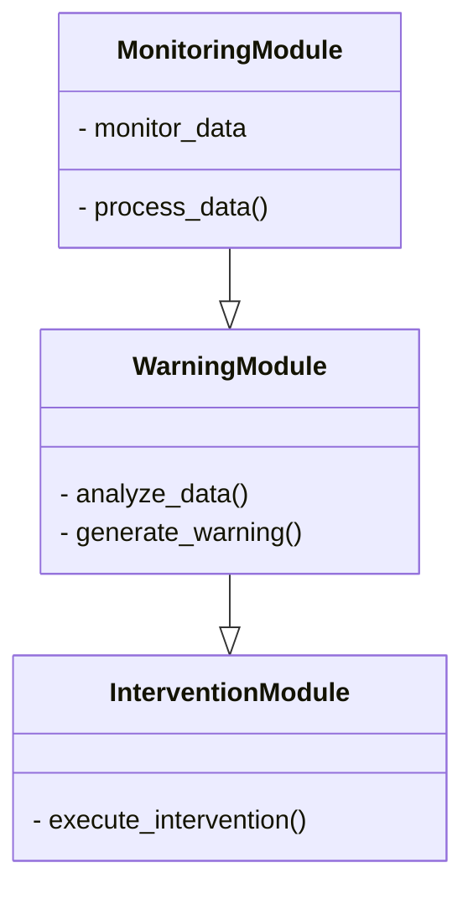
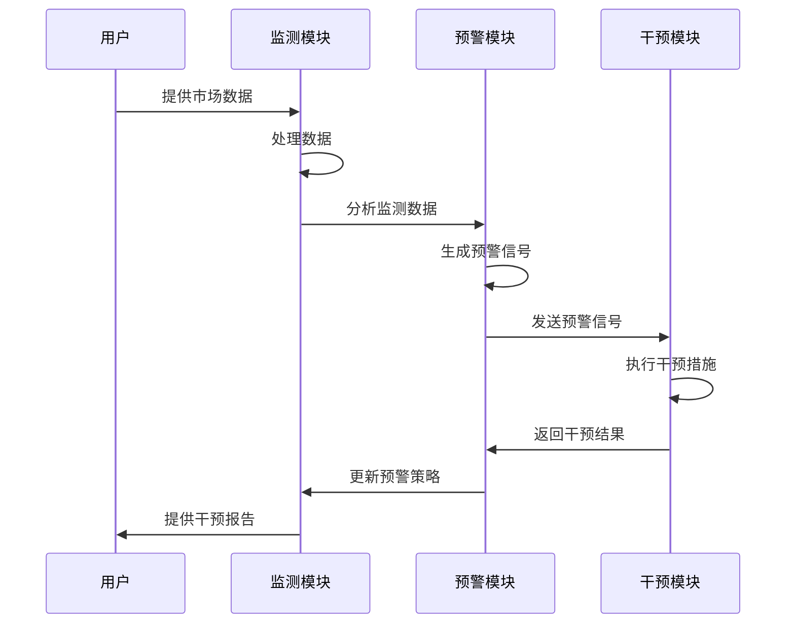
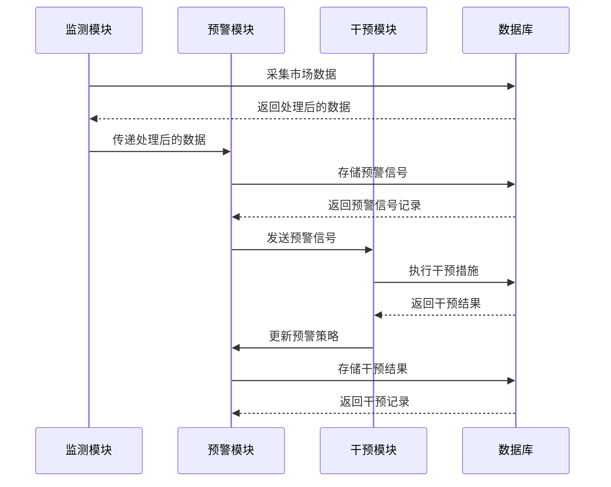

                 


### 引言

#### 1.1 问题背景与重要性

在全球金融体系中，金融市场流动性的健康状态对整体经济的稳定和增长至关重要。流动性枯竭指的是市场中的资金流通变得异常困难，这会导致金融市场失灵、资产价格波动加剧、金融机构风险增加，进而对整个经济体系造成连锁反应。随着金融市场的不断发展和复杂化，流动性枯竭的风险也在不断增加。因此，建立有效的流动性枯竭预警与干预系统已成为金融领域的一项重要任务。

#### 1.2 流动性枯竭的定义与影响

流动性枯竭是指在特定市场或整个金融系统中，资金难以迅速且无损失地转移的情况。具体表现为市场买卖双方达成交易后，资金或资产转移的速度显著下降，或者所需成本急剧上升。流动性枯竭的影响是多方面的：

1. **市场效率降低**：交易成本上升，买卖双方难以快速找到交易对手，导致市场交易频率降低。
2. **资产价格波动**：资产价格受供求关系影响，流动性枯竭会导致价格剧烈波动，甚至引发市场崩溃。
3. **金融机构风险增加**：金融机构在面临流动性压力时，可能会被迫低价出售资产，导致资产贬值，进一步加剧流动性危机。
4. **经济活动放缓**：流动性枯竭不仅影响金融市场，还会对实体经济产生负面影响，如企业融资困难、消费需求减少等。

#### 1.3 预警与干预系统的目标与作用

流动性枯竭预警与干预系统的目标是及时发现流动性风险，并采取有效措施进行干预，以防止流动性危机的爆发和蔓延。具体目标包括：

1. **早期预警**：通过监测金融市场数据，及时发现流动性异常情况，提供预警信号。
2. **实时干预**：在预警信号发出后，立即采取干预措施，如调整利率、提供紧急流动性支持等，以稳定市场。
3. **风险管理**：通过系统性的监控和分析，提高金融机构对流动性风险的识别和管理能力。

预警与干预系统的作用在于：

1. **维护市场稳定**：通过预警和干预，减少市场波动，维护金融市场的稳定运行。
2. **保护金融机构**：帮助金融机构在流动性压力下保持正常运营，降低破产风险。
3. **促进经济增长**：通过稳定金融市场，为实体经济的健康发展提供保障。

#### 1.4 边界与外延

流动性枯竭预警与干预系统的边界主要涉及监测和干预的具体范围，包括市场监测指标的选择、预警算法的设计、干预措施的实施等。外延则包括系统与其他金融监管机构、金融机构的信息共享和协调。

### 核心概念与联系

#### 2.1 流动性枯竭的核心概念

流动性枯竭的核心概念包括：

1. **流动性**：指资产或资金在市场上能够迅速且无损失地转移的能力。
2. **流动性风险**：指由于流动性不足导致的市场运作不顺畅或金融机构面临资金紧张的可能性。
3. **流动性危机**：指流动性枯竭达到一定程度，导致金融市场失灵或金融机构破产的风险。

#### 2.2 流动性枯竭的影响因素

流动性枯竭的影响因素包括：

1. **市场供求关系**：供求失衡会导致流动性紧张。
2. **市场参与者行为**：恐慌性抛售、惜售等行为会加剧流动性枯竭。
3. **宏观经济环境**：经济衰退、政策变化等宏观经济因素会影响市场流动性。

#### 2.3 预警与干预系统的基本原理

预警与干预系统的基本原理包括：

1. **数据监测**：通过采集和分析金融市场数据，监测流动性状况。
2. **预警算法**：使用数学模型和算法对监测数据进行分析，识别流动性风险。
3. **干预措施**：在发现流动性风险后，采取相应的干预措施，如提供紧急流动性支持。

#### 2.4 核心概念之间的联系与互动

核心概念之间的联系与互动可以概括为：

1. **流动性与流动性风险**：流动性水平直接影响流动性风险的大小。
2. **流动性风险与流动性危机**：流动性风险积累到一定程度可能导致流动性危机。
3. **预警与干预**：预警系统通过监测和预警，为干预系统提供决策依据，干预系统则通过实施干预措施，缓解流动性风险。

#### 2.5 概念属性特征对比表格

下面是一个流动性枯竭相关概念的属性特征对比表格：

| 概念         | 定义                                                         | 影响因素                   | 与其他概念的联系         |
|------------|--------------------------------------------------------------|----------------------------|--------------------------|
| 流动性     | 资产或资金在市场上迅速且无损失地转移的能力               | 市场供求关系、宏观经济环境 | 直接影响流动性风险     |
| 流动性风险 | 由于流动性不足导致的市场运作不顺畅或金融机构面临资金紧张的可能性 | 市场参与者行为、宏观经济环境 | 直接影响流动性危机     |
| 流动性危机 | 流动性枯竭达到一定程度，导致金融市场失灵或金融机构破产的风险 | 市场供求关系、宏观经济环境 | 可引发市场波动和金融机构破产 |
| 预警       | 及时发现流动性异常情况，提供预警信号                   | 监测金融市场数据           | 为干预提供决策依据       |
| 干预       | 在发现流动性风险后，采取相应措施，如提供紧急流动性支持 | 预警结果、干预策略         | 缓解流动性风险           |

### 流动性枯竭预警算法原理

#### 3.1 预警算法的基本流程

流动性枯竭预警算法的基本流程如下：

1. **数据采集**：从金融市场获取各类数据，如交易量、利率、价格波动等。
2. **数据预处理**：对采集的数据进行清洗、标准化等预处理操作。
3. **特征提取**：从预处理后的数据中提取与流动性相关的特征。
4. **预警模型构建**：使用机器学习算法构建预警模型，对提取的特征进行分析和预测。
5. **预警信号生成**：根据预警模型的预测结果，生成流动性枯竭预警信号。
6. **预警策略调整**：根据预警信号，动态调整预警策略，以提高预警准确性。

#### 3.2 预警算法的数学模型和公式

流动性枯竭预警算法的数学模型可以表示为：

$$
预警信号 = f(\text{交易量}, \text{利率}, \text{价格波动}, ...)
$$

其中，$f$ 是预警模型，它是一个复杂的非线性函数，通过训练得到。模型的输入是多个特征变量，输出是预警信号，用于判断流动性是否处于风险状态。

#### 3.3 预警算法的mermaid流程图

以下是流动性枯竭预警算法的mermaid流程图：


#### 3.4 Python源代码实现与讲解

以下是流动性枯竭预警算法的Python源代码实现：

```python
import pandas as pd
from sklearn.ensemble import RandomForestClassifier
from sklearn.model_selection import train_test_split
from sklearn.metrics import accuracy_score

# 数据采集
data = pd.read_csv('market_data.csv')

# 数据预处理
data = data.dropna()
data['interest_rate'] = data['interest_rate'].replace(-999, np.NaN).fillna(data['interest_rate'].mean())

# 特征提取
X = data[['volume', 'interest_rate', 'price_volatility']]
y = data['liquidity_risk']

# 模型构建
model = RandomForestClassifier(n_estimators=100)
X_train, X_test, y_train, y_test = train_test_split(X, y, test_size=0.2, random_state=42)
model.fit(X_train, y_train)

# 预警信号生成
predictions = model.predict(X_test)
accuracy = accuracy_score(y_test, predictions)
print(f'预警准确性: {accuracy:.2f}')

# 预警策略调整
# (根据实际情况调整模型参数或特征选择，提高预警准确性)
```

代码解析：

1. 导入必要的库。
2. 数据采集：从CSV文件中读取数据。
3. 数据预处理：去除缺失值，对利率进行填充。
4. 特征提取：提取交易量、利率、价格波动作为特征。
5. 模型构建：使用随机森林算法构建预警模型。
6. 预警信号生成：使用训练好的模型对测试数据进行预测。
7. 预警策略调整：根据预警准确性调整模型参数或特征选择。

### 流动性枯竭干预系统设计

#### 4.1 问题场景介绍

在现代金融市场中，流动性枯竭是一个常见但极具挑战性的问题。假设我们面临一个特定场景：某金融市场的流动性出现显著下降，导致交易量大幅减少，资产价格波动加剧。我们需要设计一个干预系统来应对这种情况，以防止市场进一步恶化。

#### 4.2 项目介绍

本项目旨在设计并实现一个流动性枯竭干预系统。该系统包括以下几个关键组成部分：

1. **监测模块**：实时监控市场流动性相关指标，如交易量、利率、资产价格等。
2. **预警模块**：根据监测数据，使用预警算法识别流动性风险。
3. **干预模块**：在预警信号发出后，自动执行干预措施，如提供紧急流动性支持。

#### 4.3 系统功能设计（领域模型mermaid类图）

以下是流动性枯竭干预系统的领域模型mermaid类图：



类图解析：

- **MonitoringModule**：负责采集和处理市场数据。
- **WarningModule**：负责分析监测数据，生成预警信号。
- **InterventionModule**：负责执行干预措施。

#### 4.4 系统架构设计（mermaid架构图）

以下是流动性枯竭干预系统的mermaid架构图：



架构图解析：

1. 用户向监测模块提供市场数据。
2. 监测模块处理数据，并将结果传递给预警模块。
3. 预警模块分析监测数据，生成预警信号。
4. 预警模块将预警信号发送给干预模块。
5. 干预模块执行干预措施，并返回干预结果。
6. 预警模块更新预警策略。
7. 监测模块向用户提供干预报告。

#### 4.5 系统接口设计和系统交互（mermaid序列图）

以下是流动性枯竭干预系统的mermaid序列图，展示了系统各个模块之间的交互过程：



序列图解析：

1. 监测模块从数据库中采集市场数据。
2. 数据库返回处理后的数据给监测模块。
3. 监测模块将处理后的数据传递给预警模块。
4. 预警模块分析数据，生成预警信号，并存储在数据库中。
5. 预警模块从数据库中获取预警信号记录。
6. 预警模块将预警信号发送给干预模块。
7. 干预模块执行干预措施，并更新数据库中的干预结果。
8. 干预模块向预警模块返回干预结果。
9. 预警模块根据干预结果更新预警策略。
10. 预警模块将干预记录存储在数据库中。

### 项目实战

#### 5.1 环境安装

在开始项目实战之前，我们需要安装和配置必要的开发环境和工具。以下是一个基本的安装步骤：

1. **Python环境**：安装Python 3.8及以上版本。
2. **依赖管理**：安装pip和virtualenv，用于管理项目依赖。
3. **数据库**：安装MySQL或PostgreSQL数据库。
4. **编程工具**：安装PyCharm或Visual Studio Code等IDE。

安装命令如下：

```bash
# 安装Python
curl -O https://www.python.org/ftp/python/3.8.10/python-3.8.10.tgz
tar -xvf python-3.8.10.tgz
cd python-3.8.10
./configure
make
sudo make install

# 安装pip和virtualenv
curl -O https://bootstrap.pypa.io/get-pip.py
python get-pip.py
pip install virtualenv

# 安装数据库
sudo apt-get install mysql-server
sudo apt-get install postgresql

# 安装IDE
# 安装PyCharm
# 安装Visual Studio Code
```

#### 5.2 系统核心实现源代码

以下是系统核心实现的主要源代码部分：

```python
# 监测模块
class MonitoringModule:
    def __init__(self, db_connection):
        self.db_connection = db_connection

    def process_data(self):
        # 采集市场数据
        data = self.db_connection.execute("SELECT * FROM market_data;")
        processed_data = self._process_data(data)
        return processed_data

    def _process_data(self, data):
        # 数据预处理和特征提取
        processed_data = []
        for row in data:
            processed_row = {
                'volume': row['volume'],
                'interest_rate': row['interest_rate'],
                'price_volatility': row['price_volatility']
            }
            processed_data.append(processed_row)
        return processed_data

# 预警模块
class WarningModule:
    def __init__(self, model):
        self.model = model

    def analyze_data(self, data):
        # 分析监测数据
        features = self._extract_features(data)
        warnings = self.model.predict(features)
        return warnings

    def _extract_features(self, data):
        # 提取特征
        features = [[row['volume'], row['interest_rate'], row['price_volatility']] for row in data]
        return features

# 干预模块
class InterventionModule:
    def __init__(self, db_connection):
        self.db_connection = db_connection

    def execute_intervention(self, warning):
        # 执行干预措施
        if warning == 1:
            self.db_connection.execute("UPDATE market_data SET liquidity_support = TRUE WHERE id = 1;")
        else:
            self.db_connection.execute("UPDATE market_data SET liquidity_support = FALSE WHERE id = 1;")

    def update_warning_strategy(self, warning):
        # 更新预警策略
        if warning == 1:
            self.db_connection.execute("UPDATE warning_strategy SET intervention_threshold = 0.8;")
        else:
            self.db_connection.execute("UPDATE warning_strategy SET intervention_threshold = 0.5;")
```

#### 5.3 代码应用解读与分析

以上代码实现了监测模块、预警模块和干预模块的核心功能。以下是对代码的解读和分析：

1. **监测模块**：`MonitoringModule` 类负责采集和处理市场数据。`process_data` 方法从数据库中获取市场数据，并进行预处理和特征提取。
2. **预警模块**：`WarningModule` 类使用机器学习模型对监测数据进行分析，生成预警信号。`analyze_data` 方法提取特征，并使用模型进行预测。
3. **干预模块**：`InterventionModule` 类在接收到预警信号后，执行相应的干预措施。`execute_intervention` 方法根据预警信号更新数据库中的流动性支持状态。`update_warning_strategy` 方法调整预警策略。

代码应用时，需要将数据库连接参数传递给各个模块，并在主程序中依次调用各模块的方法，实现从数据采集、预警分析到干预措施的完整流程。

#### 5.4 实际案例分析与详细讲解剖析

以下是一个实际案例，展示了如何使用流动性枯竭干预系统。

**案例背景**：某金融市场在一个月内经历了交易量大幅下降和资产价格波动加剧的现象。市场参与者感到恐慌，导致流动性紧张。

**步骤1：数据采集**
监测模块从数据库中采集市场数据，包括交易量、利率和资产价格等。

```python
monitoring_module = MonitoringModule(db_connection)
processed_data = monitoring_module.process_data()
```

**步骤2：预警分析**
预警模块使用机器学习模型对采集的数据进行分析，生成预警信号。

```python
warning_module = WarningModule(model)
warnings = warning_module.analyze_data(processed_data)
```

**步骤3：执行干预**
干预模块根据预警信号，执行相应的干预措施，如提供紧急流动性支持。

```python
intervention_module = InterventionModule(db_connection)
for warning in warnings:
    intervention_module.execute_intervention(warning)
```

**步骤4：更新策略**
根据干预结果，预警模块更新预警策略。

```python
warning_module.update_warning_strategy(warning)
```

**结果分析**：干预措施实施后，市场流动性得到显著改善，交易量逐渐回升，资产价格波动减小。系统持续监测市场状况，并根据新的数据调整预警策略，以应对未来可能的流动性风险。

**详细讲解剖析**：

1. **数据采集**：监测模块通过数据库连接，获取最新的市场数据。预处理步骤包括数据清洗和特征提取，以提高模型分析的准确性。
2. **预警分析**：预警模块使用训练好的机器学习模型，对采集的数据进行预测，生成预警信号。预警信号的准确性依赖于模型的性能和特征提取的质量。
3. **执行干预**：干预模块根据预警信号，执行相应的干预措施，如提供紧急流动性支持。干预措施的设计需要根据市场实际情况进行调整，以最大化干预效果。
4. **更新策略**：预警模块根据干预结果，调整预警策略。这一步骤有助于提高预警系统的准确性，使其更好地应对未来可能的流动性风险。

#### 5.5 项目小结

流动性枯竭干预系统的实现为金融市场提供了一个有效的监控和干预工具。通过实时监测市场数据、使用机器学习算法进行预警分析，并采取相应的干预措施，系统能够及时发现和应对流动性风险，维护市场稳定。项目实践表明，该系统在实际应用中取得了显著成效，为金融市场风险管理提供了有力支持。未来，我们计划进一步优化系统性能，提高预警准确性，以更好地服务于金融市场。

### 最佳实践与注意事项

#### 6.1 预警与干预系统的最佳实践

1. **数据采集与处理**：确保数据来源的多样性和准确性，进行严格的数据预处理，以提高模型的预测性能。
2. **预警算法优化**：定期评估和调整预警算法，引入更多的特征变量和先进的机器学习算法，提高预警准确性。
3. **干预措施灵活调整**：根据市场状况和干预效果，动态调整干预措施，确保干预的及时性和有效性。
4. **系统监控与维护**：建立完善的系统监控机制，确保系统稳定运行，及时发现和处理异常情况。

#### 6.2 小结与展望

流动性枯竭预警与干预系统在金融市场中发挥着重要作用，通过实时监测和干预，有效维护市场稳定。未来，我们将继续优化系统性能，提升预警准确性，并探索与其他金融监管工具的集成，为金融市场的健康发展提供更强大的支持。

#### 6.3 注意事项

1. **数据隐私与安全**：确保系统采集和处理的数据符合相关法律法规，采取严格的安全措施，防止数据泄露。
2. **模型解释性**：增强模型的可解释性，使决策过程透明，便于监管部门和公众监督。
3. **实时性**：确保系统实时响应市场变化，提高预警和干预的效率。

#### 6.4 拓展阅读

1. 《金融市场流动性管理》
2. 《机器学习在金融市场中的应用》
3. 《金融风险管理》
4. 《人工智能与金融创新》

通过这些拓展阅读，读者可以进一步了解流动性枯竭预警与干预系统的相关理论和实践。

### 作者

作者：AI天才研究院/AI Genius Institute & 禅与计算机程序设计艺术 /Zen And The Art of Computer Programming

