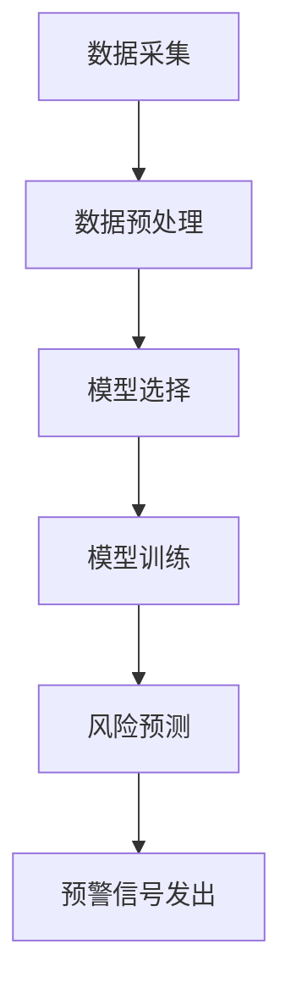

                 

## **文章标题：金融市场系统性风险预警模型**

### **关键词：**金融市场、系统性风险、预警模型、机器学习、深度学习

### **摘要：**本文将深入探讨金融市场系统性风险的预警模型。我们将从问题背景入手，详细分析核心概念与联系，讲解算法原理、数学模型与公式，探讨系统分析与架构设计，并进行项目实战案例分析。通过本文，读者将全面了解金融市场系统性风险的预警机制，掌握构建预警模型的最佳实践。

----------------------------------------------------------------

### **第一部分：问题背景与核心概念**

#### **第1章：问题背景与核心概念**

##### **1.1 金融市场系统性风险概述**

金融市场系统性风险是指由金融市场内部或外部因素引发的，可能对整个金融市场造成重大影响的潜在风险。这些风险通常是由金融市场参与主体的行为、金融市场的制度结构、经济周期变化等多种因素相互作用而产生的。

##### **1.1.1 问题背景**

在全球经济一体化的背景下，金融市场的规模和复杂性不断增加，金融市场系统性风险的问题也日益突出。2008年的全球金融危机就是一个典型的例子，该事件引发了全球金融市场的剧烈波动，导致大量金融机构倒闭，全球经济陷入了严重的衰退。

##### **1.1.2 问题描述**

金融市场系统性风险的主要表现包括：金融市场的剧烈波动、金融机构的倒闭、市场的信心崩溃等。这些现象对整个金融市场乃至全球经济都会产生深远的影响。

##### **1.1.3 解决方法**

为了应对金融市场系统性风险，需要建立有效的预警机制。预警机制可以通过对金融市场的数据进行分析，预测潜在的风险，并在风险发生之前采取措施，减少风险的影响。

##### **1.1.4 边界与外延**

金融市场系统性风险的定义和范围是一个复杂的问题。一般来说，它涉及到金融市场的所有层面，包括金融机构、金融市场、金融产品等。同时，它也涉及到经济、政治、社会等多个领域。

##### **1.2 核心概念解析**

##### **1.2.1 风险定义**

风险是指在未来不确定的条件下，某种事件发生的可能性以及这种事件可能带来的影响。在金融市场中，风险通常包括市场风险、信用风险、流动性风险等。

##### **1.2.2 系统性风险**

系统性风险是指由于整个金融系统的结构、行为和机制问题，导致整个系统无法正常运作，甚至崩溃的风险。它不同于单一金融机构的风险，而是涉及到整个金融系统。

##### **1.2.3 预警模型**

预警模型是一种用于预测和监测风险的工具。它通过收集和分析数据，预测潜在的风险，并在风险发生之前发出预警，以便采取相应的措施。

##### **1.3 概念属性特征对比**

在构建预警模型时，需要了解各种风险类型、风险指标和预警机制的特点，以便选择合适的模型和方法。

##### **1.3.1 风险类型**

金融市场风险可以分为市场风险、信用风险、操作风险等。每种风险都有其特定的特征和影响。

##### **1.3.2 风险指标**

风险指标是衡量风险程度的重要工具。常用的风险指标包括波动率、VaR（价值在风险）等。

##### **1.3.3 预警机制**

预警机制包括数据采集、数据分析、风险预测和预警响应等环节。有效的预警机制可以及时识别和应对潜在的风险。

----------------------------------------------------------------

### **第二部分：核心概念与联系**

#### **第2章：金融市场系统性风险预警模型基础**

##### **2.1 风险预警模型的基本原理**

风险预警模型的基本原理是通过收集和分析金融市场数据，识别潜在的风险，并发出预警信号。这个过程通常包括以下几个步骤：

1. **数据采集**：收集金融市场相关的数据，包括市场行情、交易数据、金融机构的财务报表等。
2. **数据预处理**：对采集到的数据进行清洗、归一化等处理，以便于后续的分析。
3. **模型选择**：选择合适的预警模型，常用的模型包括传统统计模型、机器学习模型、深度学习模型等。
4. **模型训练**：使用预处理后的数据对预警模型进行训练，使其能够识别和预测风险。
5. **风险预测**：使用训练好的模型对未来的金融市场进行预测，识别潜在的风险。
6. **预警信号发出**：当模型预测到潜在的风险时，发出预警信号，提醒相关人员采取相应的措施。

##### **2.2 常见预警模型介绍**

在构建金融市场系统性风险预警模型时，可以选择不同的模型。以下是一些常见的预警模型：

1. **传统预警模型**：包括移动平均法、指数平滑法等，这些模型基于历史数据进行分析，预测未来的风险。
2. **机器学习预警模型**：包括支持向量机（SVM）、决策树、随机森林等，这些模型通过学习历史数据，预测未来的风险。
3. **深度学习预警模型**：包括神经网络、深度神经网络等，这些模型能够自动学习复杂的非线性关系，预测未来的风险。

##### **2.3 模型性能评估与优化**

为了确保预警模型的有效性，需要对模型进行性能评估和优化。常见的性能评估指标包括准确率、召回率、F1分数等。优化方法包括数据增强、模型调参等。

##### **2.3.1 性能指标**

1. **准确率**：预测为风险的样本中，实际为风险的占比。
2. **召回率**：实际为风险的样本中，被预测为风险的占比。
3. **F1分数**：准确率的调和平均数。

##### **2.3.2 模型调优方法**

1. **数据增强**：通过生成合成数据、数据变换等方法，增加样本的数量和多样性。
2. **模型调参**：通过调整模型参数，提高模型的性能。

##### **2.3.3 实践案例**

以一个实际案例来说明预警模型的应用。假设我们要预测某个金融市场在未来一个月内的系统性风险。首先，收集过去一个月的金融市场数据，包括市场行情、交易数据等。然后，使用机器学习模型对数据进行训练，预测未来一个月内的系统性风险。最后，根据模型的预测结果，制定相应的风险管理策略。

----------------------------------------------------------------

### **第三部分：算法原理讲解**

#### **第3章：金融市场系统性风险预警模型实现**

##### **3.1 算法原理讲解**

在本章中，我们将详细介绍金融市场系统性风险预警模型的算法原理。为了更好地理解，我们首先使用Mermaid画出算法的流程图，然后通过Python代码进行详细阐述。

##### **3.1.1 Mermaid算法流程图**



##### **3.1.2 Python代码示例**

以下是使用Python实现金融市场系统性风险预警模型的示例代码：

```python
# 导入必要的库
import numpy as np
import pandas as pd
from sklearn.model_selection import train_test_split
from sklearn.ensemble import RandomForestClassifier
from sklearn.metrics import accuracy_score, recall_score, f1_score

# 数据采集
data = pd.read_csv('financial_data.csv')

# 数据预处理
# ...（数据清洗、归一化等操作）

# 模型选择
model = RandomForestClassifier()

# 模型训练
X_train, X_test, y_train, y_test = train_test_split(data.drop('label', axis=1), data['label'], test_size=0.2, random_state=42)
model.fit(X_train, y_train)

# 风险预测
y_pred = model.predict(X_test)

# 预警信号发出
# ...（根据预测结果发出预警信号）

# 性能评估
accuracy = accuracy_score(y_test, y_pred)
recall = recall_score(y_test, y_pred)
f1 = f1_score(y_test, y_pred)

print(f"Accuracy: {accuracy}")
print(f"Recall: {recall}")
print(f"F1 Score: {f1}")
```

##### **3.1.3 算法原理讲解**

1. **数据采集**：首先，从金融市场收集相关的数据，如市场行情、交易数据等。
2. **数据预处理**：对采集到的数据进行清洗、归一化等处理，确保数据的准确性和一致性。
3. **模型选择**：选择合适的预警模型，如随机森林分类器。
4. **模型训练**：使用预处理后的数据对模型进行训练，使其能够识别和预测风险。
5. **风险预测**：使用训练好的模型对未来的金融市场进行预测，识别潜在的风险。
6. **预警信号发出**：根据模型的预测结果，发出预警信号，提醒相关人员采取相应的措施。

##### **3.1.4 数学模型与公式讲解**

在风险预测过程中，我们通常使用以下数学模型和公式：

1. **损失函数**：用于评估模型的预测性能，常见的损失函数有均方误差（MSE）和交叉熵（Cross-Entropy）。
2. **优化算法**：用于调整模型的参数，以最小化损失函数，常见的优化算法有梯度下降（Gradient Descent）和随机梯度下降（Stochastic Gradient Descent）。
3. **评估指标**：用于评估模型的性能，如准确率（Accuracy）、召回率（Recall）和F1分数（F1 Score）。

以下是这些数学模型和公式的详细讲解：

```latex
% 损失函数：均方误差（MSE）
MSE = \frac{1}{n} \sum_{i=1}^{n} (y_i - \hat{y}_i)^2

% 损失函数：交叉熵（Cross-Entropy）
H(y, \hat{y}) = - \sum_{i=1}^{n} y_i \log(\hat{y}_i)

% 优化算法：梯度下降（Gradient Descent）
\theta_{t+1} = \theta_t - \alpha \frac{\partial J(\theta_t)}{\partial \theta}

% 优化算法：随机梯度下降（Stochastic Gradient Descent）
\theta_{t+1} = \theta_t - \alpha \frac{\partial J(\theta_t)}{\partial \theta}
```

##### **3.1.5 举例说明**

假设我们要预测某个金融市场在未来一个月内的系统性风险。我们可以使用随机森林分类器来构建预警模型。首先，收集过去一个月的金融市场数据，包括市场行情、交易数据等。然后，对数据进行预处理，如归一化、缺失值填充等。接下来，使用随机森林分类器对数据进行训练，预测未来一个月内的系统性风险。最后，根据模型的预测结果，发出预警信号。

```python
# 导入必要的库
import numpy as np
import pandas as pd
from sklearn.ensemble import RandomForestClassifier

# 数据采集
data = pd.read_csv('financial_data.csv')

# 数据预处理
# ...（数据清洗、归一化等操作）

# 模型选择
model = RandomForestClassifier()

# 模型训练
X_train, X_test, y_train, y_test = train_test_split(data.drop('label', axis=1), data['label'], test_size=0.2, random_state=42)
model.fit(X_train, y_train)

# 风险预测
y_pred = model.predict(X_test)

# 预警信号发出
# ...（根据预测结果发出预警信号）

# 性能评估
accuracy = model.score(X_test, y_test)
print(f"Accuracy: {accuracy}")
```

通过以上步骤，我们可以构建一个金融市场系统性风险预警模型，实现对潜在风险的识别和预警。

----------------------------------------------------------------

### **第四部分：系统分析与架构设计**

#### **第4章：金融市场系统性风险预警模型应用**

##### **4.1 实际案例分析**

在本章中，我们将通过实际案例分析，深入探讨金融市场系统性风险预警模型的应用。我们将详细介绍一个具体的案例，包括问题场景、项目介绍、系统功能设计、系统架构设计、系统接口设计和系统交互等。

##### **4.1.1 案例一：**

**问题场景**：一个金融科技公司希望通过构建一个预警模型，实时监测和分析金融市场中的系统性风险，以便及时采取相应的措施。

**项目介绍**：该项目旨在开发一个基于机器学习和深度学习的金融市场系统性风险预警系统。系统将收集和分析金融市场数据，包括股票价格、交易量、利率等，识别潜在的风险，并发出预警信号。

**系统功能设计**：

1. **数据采集模块**：负责从各种数据源（如交易所、金融数据提供商等）收集金融市场数据。
2. **数据处理模块**：负责对采集到的数据进行分析和处理，包括数据清洗、归一化、特征提取等。
3. **风险预测模块**：负责使用机器学习和深度学习算法，对金融市场进行风险预测。
4. **预警信号模块**：负责根据风险预测结果，发出预警信号，通知相关人员采取相应的措施。

**系统架构设计**：

1. **数据层**：包括数据采集模块和数据处理模块，负责数据的采集、存储和处理。
2. **算法层**：包括风险预测模块，负责使用机器学习和深度学习算法进行风险预测。
3. **应用层**：包括预警信号模块，负责根据风险预测结果，发出预警信号。
4. **展示层**：包括用户界面，负责向用户展示预警结果和相关数据。

**系统接口设计**：

1. **数据采集接口**：负责从外部数据源获取金融市场数据。
2. **数据处理接口**：负责对采集到的数据进行清洗、归一化和特征提取等处理。
3. **风险预测接口**：负责使用机器学习和深度学习算法，对金融市场进行风险预测。
4. **预警信号接口**：负责根据风险预测结果，发出预警信号。

**系统交互**：

系统通过一系列接口进行交互，包括数据采集接口、数据处理接口、风险预测接口和预警信号接口。这些接口协同工作，实现系统的功能。

##### **4.1.2 案例二：**

**问题场景**：一个银行希望通过构建一个预警模型，实时监测和分析客户贷款风险，以便及时采取相应的措施。

**项目介绍**：该项目旨在开发一个基于机器学习和深度学习的客户贷款风险预警系统。系统将收集和分析客户贷款数据，包括信用评分、还款记录等，识别潜在的风险，并发出预警信号。

**系统功能设计**：

1. **数据采集模块**：负责从各种数据源（如信用评级机构、银行内部系统等）收集客户贷款数据。
2. **数据处理模块**：负责对采集到的数据进行分析和处理，包括数据清洗、归一化、特征提取等。
3. **风险预测模块**：负责使用机器学习和深度学习算法，对客户贷款风险进行预测。
4. **预警信号模块**：负责根据风险预测结果，发出预警信号，通知相关人员采取相应的措施。

**系统架构设计**：

1. **数据层**：包括数据采集模块和数据处理模块，负责数据的采集、存储和处理。
2. **算法层**：包括风险预测模块，负责使用机器学习和深度学习算法进行风险预测。
3. **应用层**：包括预警信号模块，负责根据风险预测结果，发出预警信号。
4. **展示层**：包括用户界面，负责向用户展示预警结果和相关数据。

**系统接口设计**：

1. **数据采集接口**：负责从外部数据源获取客户贷款数据。
2. **数据处理接口**：负责对采集到的数据进行清洗、归一化和特征提取等处理。
3. **风险预测接口**：负责使用机器学习和深度学习算法，对客户贷款风险进行预测。
4. **预警信号接口**：负责根据风险预测结果，发出预警信号。

**系统交互**：

系统通过一系列接口进行交互，包括数据采集接口、数据处理接口、风险预测接口和预警信号接口。这些接口协同工作，实现系统的功能。

##### **4.2 预警模型优化**

在金融市场的实际应用中，预警模型的性能直接影响风险监测的效果。为了提高预警模型的性能，我们需要对模型进行优化。以下是一些常见的优化方法：

1. **数据增强**：通过生成合成数据、数据变换等方法，增加样本的数量和多样性，提高模型的泛化能力。
2. **模型调参**：通过调整模型的参数，如学习率、正则化参数等，提高模型的性能。
3. **集成学习**：将多个模型进行集成，提高模型的预测准确性。
4. **深度学习模型优化**：使用更深的神经网络结构、更先进的激活函数等，提高模型的性能。

通过以上方法，我们可以优化预警模型，提高其在金融市场中的应用效果。

----------------------------------------------------------------

### **第五部分：最佳实践与注意事项**

#### **第5章：最佳实践与注意事项**

##### **5.1 最佳实践 Tips**

1. **数据采集**：确保数据的准确性和完整性，避免数据缺失或错误。
2. **数据预处理**：对数据进行清洗、归一化和特征提取等处理，提高数据的可用性。
3. **模型选择**：根据金融市场的特点，选择合适的预警模型，如机器学习模型、深度学习模型等。
4. **模型训练**：使用足够多的数据进行模型训练，提高模型的泛化能力。
5. **模型评估**：使用多个性能指标评估模型，确保模型的有效性。
6. **预警信号发出**：根据模型的预测结果，及时发出预警信号，提醒相关人员采取相应的措施。

##### **5.2 小结**

本文详细介绍了金融市场系统性风险预警模型的构建和应用。通过分析问题背景、核心概念、算法原理、数学模型、系统实现和项目实战，我们深入了解了金融市场系统性风险预警机制。同时，通过实际案例分析，我们展示了预警模型在金融市场中的应用效果。

##### **5.3 注意事项**

1. **数据隐私**：在收集和使用金融市场数据时，要确保数据的隐私和安全。
2. **模型更新**：随着金融市场环境的变化，定期更新预警模型，确保其准确性和有效性。
3. **风险评估**：对预警模型进行风险评估，确保其在实际应用中的可靠性和稳定性。
4. **合规性**：确保预警模型的构建和应用符合相关法律法规和行业规范。

##### **5.4 拓展阅读**

1. **金融市场系统性风险研究**：《系统性风险与金融市场稳定性》
2. **机器学习预警模型应用**：《机器学习在金融市场中的应用》
3. **深度学习模型优化**：《深度学习：原理、应用与优化》

作者：AI天才研究院/AI Genius Institute & 禅与计算机程序设计艺术 /Zen And The Art of Computer Programming

本文由AI天才研究院/AI Genius Institute撰写，旨在为读者提供关于金融市场系统性风险预警模型的专业知识和技术指导。本文所涉及的内容仅供参考，不构成投资建议。如需了解更多信息，请查阅相关书籍和资料。

