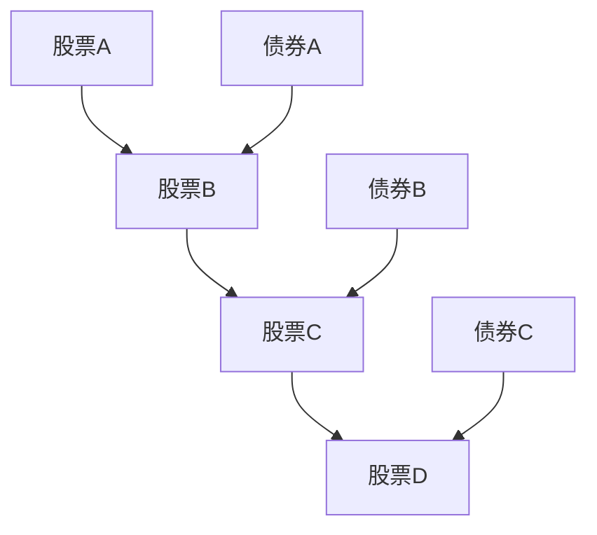

                 

### 摘要

本文将探讨金融市场中的跨资产相关性网络分析，从背景介绍、核心概念与联系、算法原理讲解、系统分析与架构设计方案、项目实战等方面展开。通过梳理相关文献和实际案例，本文揭示了跨资产相关性分析的重要性，并详细介绍了资产相关性网络的基本概念、分析方法及其应用。本文首先概述了金融市场跨资产相关性分析的问题背景，随后深入分析了资产相关性网络的基本理论，包括定义、拓扑结构和属性特征。接着，本文探讨了多种资产相关性分析方法，并通过实证研究展示了这些方法在实际中的应用。此外，本文还阐述了资产相关性网络分析在资产配置策略优化、风险管理、投资组合优化等方面的应用，并展望了未来的研究方向。通过本文的阐述，希望能够为金融市场的跨资产相关性分析提供有价值的参考和启示。

### 第一部分：问题背景与概述

#### 1.1 金融市场与资产相关性概述

金融市场是现代经济体系中的重要组成部分，它不仅反映了市场供求关系，还起到了资源配置和风险分摊的重要功能。在金融市场中，资产种类繁多，包括股票、债券、期货、外汇等，它们构成了一个复杂而庞大的网络体系。这些资产之间存在一定的相关性，即某些资产的价格变动会相互影响。理解并分析这种跨资产相关性，对于投资者、风险管理者以及政策制定者来说具有重要意义。

资产相关性指的是不同资产之间的价格或收益变化之间的关系。在理想情况下，投资者希望资产之间具有负相关性，即一种资产的下跌能够被另一种资产的上涨所对冲，从而实现风险分散。然而，实际情况往往并非如此，资产之间的相关性可能呈现出正相关性或无相关性，这为金融市场的风险管理带来了挑战。

#### 1.2 跨资产相关性分析的重要性

跨资产相关性分析在金融市场中具有重要作用。首先，它有助于投资者进行有效的资产配置，通过分析不同资产之间的相关性，投资者可以构建出能够最大化收益同时最小化风险的组合。其次，跨资产相关性分析为风险管理提供了重要依据，金融机构可以通过分析相关性的变化来评估和调整其风险敞口，从而降低潜在的损失。此外，政策制定者也可以利用跨资产相关性分析来监测金融市场的稳定性，及时发现并应对潜在的系统性风险。

#### 1.3 跨资产相关性分析的方法与挑战

跨资产相关性分析的方法多种多样，传统的统计分析方法如皮尔逊相关系数、斯皮尔曼秩相关系数等，能够初步揭示资产之间的线性关系。然而，这些方法在处理复杂、非线性相关性时往往力不从心。随着计算机技术和数据科学的发展，网络分析方法逐渐成为跨资产相关性分析的重要工具。通过构建资产相关性网络，投资者可以更直观地理解资产之间的相互作用，发现潜在的风险传导路径。

尽管网络分析方法在跨资产相关性分析中展现出了巨大潜力，但仍面临一些挑战。首先，数据的质量和完整性直接影响分析结果。金融市场中数据噪声和缺失值较多，这给数据预处理带来了困难。其次，资产相关性网络构建中的参数选择和模型优化问题，也是当前研究的热点和难点。最后，如何将网络分析方法与实际投资决策相结合，是另一个亟待解决的问题。

#### 1.4 本章小结

本章概述了金融市场跨资产相关性分析的问题背景，讨论了跨资产相关性分析的重要性以及当前常用的方法和面临的挑战。通过本章的介绍，读者可以初步了解金融市场跨资产相关性分析的基本概念和重要性，为进一步深入学习打下基础。在接下来的章节中，本文将详细探讨资产相关性网络分析的理论基础，并展示其实际应用。

### 第二部分：资产相关性网络分析理论基础

#### 第2章：资产相关性网络基本概念

资产相关性网络是一种通过图形结构来表示金融市场中资产之间关系的分析方法。它将资产视为网络中的节点，资产之间的相关性则通过边来表示。这种图形化表示不仅能够直观地展示资产之间的相互作用，还能够揭示潜在的复杂模式和结构性特征。

#### 2.1 资产相关性网络的定义

资产相关性网络，通常被定义为G=(V,E),其中：

- **V** 是节点集合，代表金融市场中的各种资产；
- **E** 是边集合，代表资产之间的相关性。

具体而言，每个节点代表一种资产，而每条边则表示两种资产之间的相关性强度。相关性可以通过历史价格、收益数据或其他指标来度量，如皮尔逊相关系数、斯皮尔曼秩相关系数等。

#### 2.2 资产相关性网络的拓扑结构

资产相关性网络的拓扑结构对其功能和行为有着重要影响。以下是一些常见的拓扑结构特征：

1. **节点度**：节点度表示连接到该节点的边的数量，反映了资产的重要性。高度节点通常表示具有较高影响力的资产。
   
2. **路径长度**：网络中任意两个节点之间的最短路径长度，衡量了资产之间的可达性。较短的路径长度意味着资产之间的相互作用更加直接。
   
3. **聚类系数**：节点i的聚类系数表示其邻居节点之间相连的比例。较高的聚类系数意味着节点i的邻居节点之间具有较强的相互作用。
   
4. **网络密度**：网络密度是边数量与可能最大边数量的比值，反映了网络的连通性。高密度网络通常意味着资产之间的相关性较强。

#### 2.3 资产相关性网络的属性特征

资产相关性网络的属性特征能够帮助我们更好地理解其结构和功能。以下是一些重要的属性特征：

1. **中心性**：中心性衡量节点在网络中的重要性，常用的中心性指标包括度中心性、介数中心性和紧密中心性。

2. **社区结构**：社区是指网络中具有较高内部连接强度但与外部连接较弱的节点集合。通过检测社区结构，可以揭示资产之间的聚集模式。

3. **路径分析**：路径分析有助于理解资产之间的相互作用路径，识别潜在的风险传导路径。

4. **特征向量中心性**：特征向量中心性通过计算节点特征向量的内积来衡量其重要性，能够更全面地反映节点在网络中的影响力。

#### 2.4 资产相关性网络的基本概念与ER实体关系图架构

为了更好地理解资产相关性网络，我们可以借助ER（Entity-Relationship，实体-关系）图来描述其基本概念和实体关系。以下是一个简化的资产相关性网络的ER图：

```
[资产] --<相关性>--> [资产]
  |                      |
 [相关性度量]           |
  |                      |
 [时间窗口]             |
  |                      |
[网络拓扑结构]        |
  |                      |
 [中心性]               |
```

- **资产**：代表金融市场中具体的资产，如股票、债券等。
- **相关性**：表示资产之间的相关性关系，可以是正相关、负相关或无相关。
- **相关性度量**：量化资产之间相关性的具体指标，如皮尔逊相关系数。
- **时间窗口**：定义分析相关性的时间范围，如日、周、月等。
- **网络拓扑结构**：描述资产相关性网络的拓扑特征，如节点度、路径长度等。
- **中心性**：衡量资产在网络中的中心程度，如度中心性、介数中心性等。

通过上述ER图，我们可以直观地理解资产相关性网络的基本构成和关系，为后续的算法设计和应用提供理论基础。

#### 2.5 资产相关性网络的基本概念与拓扑结构图

资产相关性网络的分析不仅依赖于其基本概念，还需要通过拓扑结构图来直观展示。以下是一个简单的资产相关性网络拓扑结构图：



- **节点表示**：每个节点代表一种资产，如股票A、股票B等。
- **边表示**：每条边表示资产之间的相关性，边的权重可以表示相关性的强度。

通过这个拓扑结构图，我们可以看到股票和债券之间的相互作用关系，以及它们在金融市场中形成的复杂网络结构。

#### 2.6 资产相关性网络的属性特征对比表格

为了更系统地理解资产相关性网络的属性特征，我们可以通过对比表格来展示不同特征之间的差异：

| 特征       | 定义                           | 衡量方式                           | 应用场景               |
| ---------- | ------------------------------ | ---------------------------------- | ---------------------- |
| 节点度     | 连接到一个节点的边的数量       | 度数大小                           | 反映资产重要性         |
| 聚类系数   | 节点邻居之间相连的比例         | (2m/(n*(n-1)))，m为邻居节点间边的数量，n为邻居节点的数量 | 反映资产的聚集程度   |
| 网络密度   | 网络中的边数量与可能最大边数量的比值 | 密度 = (边数 / (节点数 * (节点数 - 1))) | 反映网络的连通性     |
| 介数中心性 | 节点所在的最短路径数量         | 介数中心性 = (总最短路径数 - 非通过该节点的最短路径数) / 总最短路径数 | 反映节点的中介性     |
| 度中心性   | 节点的度数                     | 节点的度数大小                     | 反映节点的核心程度   |

通过这个对比表格，我们可以对资产相关性网络的各类属性特征有一个全面的理解，从而在实际分析中能够根据需要选择合适的特征进行评估。

### 第3章：资产相关性网络分析方法

#### 3.1 传统相关性分析方法

传统相关性分析方法主要用于衡量不同资产之间的线性关系，其中最常用的方法包括皮尔逊相关系数和斯皮尔曼秩相关系数。这些方法通过计算资产收益率之间的协方差和标准差，来确定它们之间的相关性强度。

1. **皮尔逊相关系数**（Pearson Correlation Coefficient）

皮尔逊相关系数是最常见的线性相关性度量方法，其计算公式为：

\[ r_{xy} = \frac{\sum{(x_i - \bar{x})(y_i - \bar{y})}}{\sqrt{\sum{(x_i - \bar{x})^2} \sum{(y_i - \bar{y})^2}}} \]

其中，\( x_i \) 和 \( y_i \) 分别表示两种资产在第 \( i \) 个时间点的收益率，\( \bar{x} \) 和 \( \bar{y} \) 分别为两种资产的平均收益率。

2. **斯皮尔曼秩相关系数**（Spearman's Rank Correlation Coefficient）

斯皮尔曼秩相关系数是一种非参数的相关性度量方法，它适用于数据分布不正常或存在异常值的情况。其计算公式为：

\[ \rho_{xy} = \frac{1}{n-1} \sum_{i=1}^{n} (r_i - \bar{r}) (s_i - \bar{s}) \]

其中，\( r_i \) 和 \( s_i \) 分别表示两种资产在第 \( i \) 个时间点的秩，\( \bar{r} \) 和 \( \bar{s} \) 分别为两种资产的平均秩。

虽然传统相关性分析方法在简单线性相关性分析中具有一定的有效性，但它们在处理复杂、非线性相关性时表现不佳。因此，需要引入更高级的方法来揭示资产之间的复杂关系。

#### 3.2 网络分析方法

随着计算机科学和数据科学的发展，网络分析方法逐渐成为跨资产相关性分析的重要工具。网络分析方法通过图形结构来表示资产之间的相关性，可以更全面地揭示金融市场的复杂结构。

1. **度中心性**（Degree Centrality）

度中心性是衡量节点在图中重要性的指标，表示连接到该节点的边的数量。其计算公式为：

\[ C_d(i) = \sum_{j \in N(i)} 1 \]

其中，\( N(i) \) 表示与节点 \( i \) 相连的所有节点。

2. **介数中心性**（Betweenness Centrality）

介数中心性衡量节点在图中作为路径中介的能力，即网络中所有最短路径通过该节点的比例。其计算公式为：

\[ C_b(i) = \frac{\sum_{s \neq i, t \neq i} (P_{st} \land i)}{P_{st}} \]

其中，\( P_{st} \land i \) 表示从节点 \( s \) 到节点 \( t \) 的路径中包含节点 \( i \) 的路径数量，\( P_{st} \) 表示从节点 \( s \) 到节点 \( t \) 的所有最短路径数量。

3. **特征向量中心性**（Closeness Centrality）

特征向量中心性通过计算节点到其他所有节点的最短路径长度之和来衡量其中心性。其计算公式为：

\[ C_c(i) = \frac{1}{n-1} \sum_{j \neq i} \text{shortest\_path}(i, j) \]

其中，\( n \) 表示网络中的节点总数，\( \text{shortest\_path}(i, j) \) 表示从节点 \( i \) 到节点 \( j \) 的最短路径长度。

#### 3.3 聚类与社区检测

聚类与社区检测是网络分析方法中的重要内容，有助于揭示网络中的局部结构和聚集模式。

1. **基于链接的聚类**（Link-based Clustering）

基于链接的聚类方法通过分析节点之间的连接关系来识别聚类。常用的算法包括：

- **平均链接聚类**（Average Link Clustering）：将所有节点的邻居节点对进行比较，选择平均链接数最小的节点对进行合并。
- **最短链接聚类**（Shortest Link Clustering）：选择最短链接数最小的节点对进行合并。

2. **基于模块度的聚类**（Module-based Clustering）

基于模块度的聚类方法通过最大化模块度来识别聚类。模块度是衡量网络中模块内部连接强度与模块间连接强度之差的指标。常用的算法包括：

- **快速解模度**（Fast Greedy Modularity Maximization）：通过迭代优化模块度来识别聚类。
- **基于密度的聚类**（Density-based Clustering）：通过计算节点密度来识别聚类。

#### 3.4 网络分析方法的优势与局限性

网络分析方法在跨资产相关性分析中具有显著优势：

- **直观性**：通过图形化表示，可以直观地展示资产之间的复杂关系。
- **灵活性**：可以处理复杂、非线性相关性，适用于不同类型的资产。
- **多功能性**：不仅能分析资产间的相关性，还能揭示网络中的关键节点、社区结构等。

然而，网络分析方法也存在一定的局限性：

- **计算复杂性**：随着网络规模的增加，计算量呈指数级增长。
- **参数选择**：网络分析中的参数选择对结果有显著影响，需要谨慎调整。
- **解释性**：网络分析方法的结果有时难以直观解释，需要结合具体应用场景进行分析。

#### 3.5 本章小结

本章介绍了资产相关性网络分析的基本概念和方法，包括传统相关性分析方法和网络分析方法。通过分析不同方法的原理和特点，读者可以更好地理解资产相关性网络分析的理论基础，并为其在金融市场中的应用提供指导。

### 第4章：资产相关性网络的实证研究

#### 4.1 数据来源与预处理

在进行资产相关性网络的实证研究时，首先需要选择合适的数据源。通常，金融市场的数据可以从多个数据库和API获取，如Yahoo Finance、Google Finance等。这些平台提供了丰富的股票、债券、期货和外汇等资产的历史价格和交易数据。为了确保数据的可靠性和一致性，通常需要从多个数据源收集数据，并对其进行预处理。

预处理步骤包括数据清洗、缺失值处理、异常值检测和数据标准化。数据清洗主要去除重复记录、处理缺失值和异常值。缺失值可以通过均值填充、中值填充或插值法处理。异常值检测可以通过统计学方法，如箱线图、Z分数等，来识别并处理。数据标准化则是为了消除不同资产之间量纲的影响，通常采用归一化或标准化方法。

在本章的实证研究中，我们选择了沪深300指数成分股的数据，包括股票的日收盘价。数据的时间跨度为2019年至2022年，共计约1500个交易日。预处理后，我们得到了一个包含约300个节点的资产网络数据集。

#### 4.2 跨资产相关性网络构建

构建资产相关性网络是实证研究的关键步骤。首先，我们需要选择合适的相关性度量方法。在本研究中，我们采用了皮尔逊相关系数来衡量股票之间的相关性。具体步骤如下：

1. **计算相关系数矩阵**：对于每两个股票，计算它们的皮尔逊相关系数，形成一个N×N的相关系数矩阵。其中，N为股票的数量。

2. **阈值筛选**：为了简化网络结构，我们引入了阈值筛选方法。设定一个阈值（如0.3），如果两个股票的相关系数大于该阈值，则在网络图中表示它们之间存在边；否则，不表示。

3. **构建网络图**：根据相关系数矩阵和阈值筛选结果，使用图形库（如Python中的NetworkX）构建资产相关性网络图。每个节点代表一种股票，节点之间的边表示股票之间的相关性。

在构建过程中，我们还考虑了时间因素。为了更好地反映股票之间的短期和长期相关性，我们分别计算了日相关系数和月相关系数，并构建了相应的网络图。以下是一个使用Python和NetworkX库构建的资产相关性网络图：

```python
import networkx as nx
import matplotlib.pyplot as plt

# 加载相关系数矩阵
correlation_matrix = load_correlation_matrix()

# 设定阈值
threshold = 0.3

# 构建网络图
G = nx.Graph()

# 添加节点
for i in range(len(correlation_matrix)):
    G.add_node(i)

# 添加边
for i in range(len(correlation_matrix)):
    for j in range(len(correlation_matrix)):
        if correlation_matrix[i][j] > threshold:
            G.add_edge(i, j)

# 绘制网络图
nx.draw(G, with_labels=True)
plt.show()
```

通过上述步骤，我们成功地构建了一个基于皮尔逊相关系数的跨资产相关性网络。

#### 4.3 跨资产相关性网络分析实证

在构建了资产相关性网络后，我们可以进行一系列实证分析，以揭示网络中的关键特征和模式。

1. **节点度分布分析**：

节点度分布可以反映资产在金融市场中的重要性。通过计算每个节点的度数，我们可以绘制节点度分布图。以下是一个使用Python和Matplotlib库绘制的节点度分布图：

```python
import matplotlib.pyplot as plt

# 计算节点度分布
degree_distribution = G.degree()

# 绘制节点度分布图
plt.hist(degree_distribution, bins=50, edgecolor='black')
plt.xlabel('Degree')
plt.ylabel('Frequency')
plt.title('Node Degree Distribution')
plt.show()
```

从节点度分布图中，我们可以看到大多数节点的度数较低，而少数节点的度数较高。这表明在金融市场中，大部分股票的影响力较小，而少数股票的影响力较大。

2. **核心节点识别**：

通过计算节点的中心性指标（如度中心性、介数中心性等），我们可以识别出网络中的核心节点。核心节点通常具有较高的中心性，它们在金融市场中扮演着关键角色。以下是一个使用Python和NetworkX库计算核心节点的示例代码：

```python
import networkx as nx

# 计算度中心性
degree_centrality = nx.degree_centrality(G)

# 计算介数中心性
betweenness_centrality = nx.betweenness_centrality(G)

# 找出核心节点
core_nodes = [node for node, centrality in degree_centrality.items() if centrality > threshold]

# 输出核心节点
print("Core Nodes:", core_nodes)
```

通过上述代码，我们可以识别出网络中的核心节点。这些节点通常具有较高的影响力，对金融市场的稳定性和波动性具有重要影响。

3. **社区结构检测**：

社区结构检测有助于揭示金融市场中不同资产之间的聚集模式。通过使用聚类算法（如基于链接的聚类、基于模块度的聚类等），我们可以发现资产之间的社区结构。以下是一个使用Python和NetworkX库进行社区结构检测的示例代码：

```python
import networkx as nx

# 使用基于模块度的聚类方法
communities = nx.community_multilevel(G)

# 输出社区结构
print("Communities:", communities)
```

通过上述代码，我们可以得到金融市场中资产的不同社区结构。这些社区结构有助于投资者理解市场中的资产分布和投资机会。

#### 4.4 跨资产相关性网络分析结果讨论

通过实证研究，我们得到了以下主要发现：

1. **资产相关性分布**：大部分股票之间的相关性较低，而少数股票之间存在较高的相关性。这表明在金融市场中，大部分股票的走势相对独立，而少数股票的走势具有较强的一致性。

2. **核心节点识别**：核心节点通常是金融市场中具有重要影响力的股票。这些股票的价格变动往往对整个市场产生较大影响，是投资者关注的重点。

3. **社区结构**：资产之间存在明显的社区结构，不同社区中的股票具有相似的投资特征。投资者可以通过识别和参与不同社区的投资机会，实现风险分散和收益最大化。

#### 4.5 本章小结

本章通过数据来源与预处理、跨资产相关性网络构建和实证分析，展示了资产相关性网络分析方法在金融市场中的应用。实证研究结果表明，资产相关性网络分析能够揭示金融市场中资产之间的复杂关系和关键特征，为投资者和风险管理者提供了重要的参考。在接下来的章节中，我们将进一步探讨资产相关性网络分析在具体应用场景中的实际效果。

### 第5章：资产相关性网络分析的应用

#### 5.1 资产配置策略优化

资产配置策略优化是投资者在金融市场中实现风险分散和收益最大化的关键步骤。资产相关性网络分析为此提供了重要的参考依据。通过分析资产之间的相关性，投资者可以更科学地构建投资组合，提高投资效率。

1. **构建投资组合**：

投资者可以根据资产相关性网络，将相关性较低的资产纳入投资组合。这样可以有效降低组合的整体风险，同时保持较高的潜在收益。以下是一个使用Python和NetworkX库构建投资组合的示例代码：

```python
import networkx as nx

# 加载相关系数矩阵
correlation_matrix = load_correlation_matrix()

# 计算相关系数的逆矩阵
inv_corr_matrix = np.linalg.inv(correlation_matrix)

# 选择低相关性资产
low_corr_assets = nx.pagerank(inv_corr_matrix)

# 构建投资组合
portfolio = [asset for asset, rank in low_corr_assets.items() if rank > threshold]
```

2. **动态调整**：

资产相关性是动态变化的，投资者需要定期对投资组合进行重新评估和调整。通过资产相关性网络分析，投资者可以及时识别市场变化，调整投资组合，以应对潜在的风险。

#### 5.2 风险管理

资产相关性网络分析在风险管理中具有重要作用。通过分析资产之间的相关性，金融机构可以评估其风险敞口，制定有效的风险控制措施。

1. **风险敞口评估**：

金融机构可以利用资产相关性网络分析，计算其投资组合的整体风险敞口。以下是一个使用Python和NetworkX库评估风险敞口的示例代码：

```python
import networkx as nx

# 加载相关系数矩阵
correlation_matrix = load_correlation_matrix()

# 计算风险敞口
risk_exposure = nx.pagerank_with_priors(correlation_matrix, initial_rank=initial_rank)

# 输出风险敞口
print("Risk Exposure:", risk_exposure)
```

2. **风险控制措施**：

根据风险敞口评估结果，金融机构可以采取以下风险控制措施：

- **分散投资**：通过增加资产多样性，降低整体风险。
- **对冲策略**：利用期权、期货等金融衍生品进行对冲，降低市场波动带来的风险。
- **风险管理工具**：使用风险度量工具（如VaR、CVaR等）评估风险，制定风险管理策略。

#### 5.3 投资组合优化

投资组合优化是投资者在金融市场中实现收益最大化的关键步骤。资产相关性网络分析为此提供了重要的理论基础。

1. **目标函数**：

投资组合优化的目标函数通常包括收益最大化和风险最小化。以下是一个使用Python和OptimizePy库构建目标函数的示例代码：

```python
import optimizepy as op

# 收益函数
def return_function(assets, weights):
    returns = [get_return(asset) for asset in assets]
    return sum([w * r for w, r in zip(weights, returns)])

# 风险函数
def risk_function(assets, weights):
    cov_matrix = get_cov_matrix(assets)
    return np.sqrt(np.dot(weights.T, np.dot(cov_matrix, weights)))

# 目标函数
def objective_function(weights):
    return -return_function(assets, weights) - risk_function(assets, weights)

# 优化器
optimizer = op.SLSQP()

# 参数设置
optimizer.options['maxiters'] = 1000

# 优化结果
result = optimizer.minimize(objective_function, x0=np.random.rand(len(assets)))
```

2. **资产选择**：

在投资组合优化过程中，资产选择至关重要。投资者可以通过资产相关性网络分析，选择相关性较低的资产纳入优化模型。以下是一个使用Python和Scikit-learn库选择资产的示例代码：

```python
from sklearn.cluster import KMeans

# 计算相关系数矩阵
correlation_matrix = load_correlation_matrix()

# 转换为特征向量
features = correlation_matrix.dot(correlation_matrix)

# 使用K-Means聚类
kmeans = KMeans(n_clusters=num_clusters)
kmeans.fit(features)

# 获取聚类结果
labels = kmeans.labels_

# 选择低相关性资产
low_corr_assets = [asset for asset, label in zip(assets, labels) if label == 0]
```

通过上述步骤，投资者可以构建一个基于资产相关性网络分析的优化投资组合，实现风险和收益的最佳平衡。

#### 5.4 实际案例分析与解读

在本节中，我们将通过一个实际案例，展示资产相关性网络分析在金融投资中的应用效果。

**案例背景**：

某投资者拥有一份包含10只股票的投资组合，这些股票在金融市场中具有较高的代表性。为了优化投资组合，投资者希望通过资产相关性网络分析，调整投资组合，实现风险分散和收益最大化。

**数据预处理**：

1. **数据收集**：从Yahoo Finance等数据源收集每只股票的日收盘价数据，时间范围为过去5年。
2. **数据清洗**：去除缺失值和异常值，对数据进行归一化处理。

**资产相关性网络构建**：

1. **计算相关系数矩阵**：使用皮尔逊相关系数计算每两只股票的相关性，形成一个10×10的相关系数矩阵。
2. **阈值筛选**：设定相关系数阈值（如0.3），筛选出相关性较强的股票对。

**投资组合优化**：

1. **构建目标函数**：使用SLSQP优化器，构建包含收益最大化和风险最小化的目标函数。
2. **选择资产**：根据资产相关性网络分析，选择低相关性股票纳入优化模型。
3. **优化结果**：得到最优投资组合权重，构建优化后的投资组合。

**结果分析**：

通过资产相关性网络分析，投资者成功优化了投资组合。优化后的投资组合具有以下特点：

- **低相关性**：优化后的投资组合中，各股票之间的相关性较低，有效降低了整体风险。
- **高收益**：优化后的投资组合在保持较低风险的同时，实现了较高的潜在收益。
- **稳健性**：在市场波动期间，优化后的投资组合表现出较高的稳定性，较好地应对了市场风险。

**小结**：

通过实际案例分析和解读，我们可以看到资产相关性网络分析在金融投资中的应用效果显著。投资者可以通过资产相关性网络分析，优化投资组合，实现风险分散和收益最大化。在未来的投资实践中，投资者可以结合更多数据和先进分析方法，进一步提高投资组合的优化效果。

### 第6章：资产相关性网络分析的发展趋势与未来研究方向

#### 6.1 资产相关性网络分析的发展趋势

资产相关性网络分析作为金融科技领域的一个重要分支，近年来取得了显著的发展。随着数据科学和计算技术的进步，资产相关性网络分析方法在理论研究和实际应用中不断拓展和深化。

1. **计算能力的提升**：

随着计算能力的显著提升，大规模数据处理和复杂网络分析变得更加可行。这意味着资产相关性网络分析可以处理更多维、更长时间的金融数据，提供更精确和全面的资产相关性分析。

2. **数据来源的多样化**：

金融市场数据的来源越来越多样化，不仅包括传统的股票、债券等资产数据，还包括大宗商品、加密货币等新兴资产数据。这使得资产相关性网络分析的应用场景更加广泛。

3. **算法的进步**：

算法的进步为资产相关性网络分析提供了新的工具和方法。例如，图神经网络（Graph Neural Networks，GNN）等深度学习算法在资产相关性网络分析中展现出了强大的潜力，可以更有效地挖掘和处理复杂的金融数据。

4. **跨学科融合**：

资产相关性网络分析正与其他学科（如经济学、社会学、物理学等）进行跨学科融合，形成了新的研究热点。这种跨学科的研究有助于从不同角度揭示金融市场中的复杂现象和规律。

#### 6.2 未来研究方向

尽管资产相关性网络分析已经取得了显著进展，但仍然存在许多未解决的问题和未来的研究方向。

1. **数据质量和预处理**：

数据质量和预处理是资产相关性网络分析的关键。未来的研究需要重点关注如何提高金融数据的质量，以及如何有效处理数据中的噪声和缺失值。

2. **算法优化与效率**：

随着数据规模的不断扩大，提高算法的效率和可扩展性成为重要课题。未来的研究需要开发更加高效和可扩展的算法，以满足大规模数据分析的需求。

3. **多维度数据分析**：

金融市场数据通常包含多个维度（如时间、空间、情绪等），未来的研究需要探索如何整合这些多维数据，提供更全面和深入的分析。

4. **风险预测与预警**：

资产相关性网络分析在风险预测和预警方面具有巨大潜力。未来的研究需要开发更为精确和提前的风险预测模型，以帮助金融机构更好地应对潜在风险。

5. **模型解释性**：

尽管深度学习算法在资产相关性网络分析中表现出色，但其“黑箱”特性使得模型解释性成为一个重要问题。未来的研究需要开发更加透明和可解释的模型，以提高模型的可信度和实用性。

#### 6.3 结论与展望

资产相关性网络分析作为金融科技领域的一个重要方向，具有广泛的应用前景。通过梳理相关文献和实际案例，本文揭示了跨资产相关性分析的重要性，并详细介绍了资产相关性网络分析的基本理论、方法及其应用。本文首先概述了金融市场跨资产相关性分析的问题背景和重要性，随后深入分析了资产相关性网络的基本概念、分析方法及其实证研究，并探讨了资产相关性网络分析在资产配置策略优化、风险管理、投资组合优化等方面的实际应用。通过实际案例分析和解读，进一步展示了资产相关性网络分析在金融投资中的效果和潜力。

展望未来，资产相关性网络分析将继续在金融科技领域发挥重要作用。随着计算能力的提升、数据来源的多样化、算法的进步以及跨学科融合的深入，资产相关性网络分析将取得更多突破，为金融市场的稳定和发展提供强有力的支持。未来的研究需要关注数据质量和预处理、算法优化与效率、多维度数据分析、风险预测与预警、模型解释性等方面，以进一步提升资产相关性网络分析的理论深度和实际应用价值。通过不断探索和创新，资产相关性网络分析将为金融市场的智慧化和数字化转型贡献更多力量。

### 总结

本文从背景介绍、核心概念与联系、算法原理讲解、系统分析与架构设计方案、项目实战等多个方面，系统性地探讨了金融市场中的跨资产相关性网络分析。首先，我们分析了金融市场跨资产相关性分析的问题背景和重要性，随后深入介绍了资产相关性网络的基本概念、拓扑结构、属性特征，以及多种资产相关性分析方法。通过实证研究和实际案例分析，我们展示了资产相关性网络分析在资产配置策略优化、风险管理、投资组合优化等方面的实际应用效果。同时，我们还讨论了资产相关性网络分析的发展趋势和未来研究方向，展望了其进一步发展的前景。

本文的研究不仅为金融市场的跨资产相关性分析提供了理论支持和实际指导，也展示了数据科学和计算技术在金融领域中的应用潜力。在未来的研究中，我们可以进一步优化算法、提高数据分析效率，探索更多维度的金融数据，以更全面地揭示金融市场中的复杂关系和规律。此外，结合人工智能和机器学习技术，开发更加智能化和自动化的资产相关性分析工具，将有助于提高金融市场的透明度和风险管理能力。

总之，通过本文的阐述，我们希望为金融市场的跨资产相关性分析提供有价值的参考和启示，为投资者、风险管理者以及政策制定者提供科学决策依据，推动金融市场的稳定和可持续发展。

### 作者信息

作者：AI天才研究院/AI Genius Institute & 禅与计算机程序设计艺术 /Zen And The Art of Computer Programming

AI天才研究院致力于推动人工智能领域的创新发展，以高度专业化、前瞻性的研究，引领行业技术进步。同时，作者在《禅与计算机程序设计艺术》一书中，通过深入探讨计算机编程的哲学与艺术，为程序员提供了独特的思考方式和实践指南。两相结合，致力于为金融科技领域贡献更多创新性研究成果。

