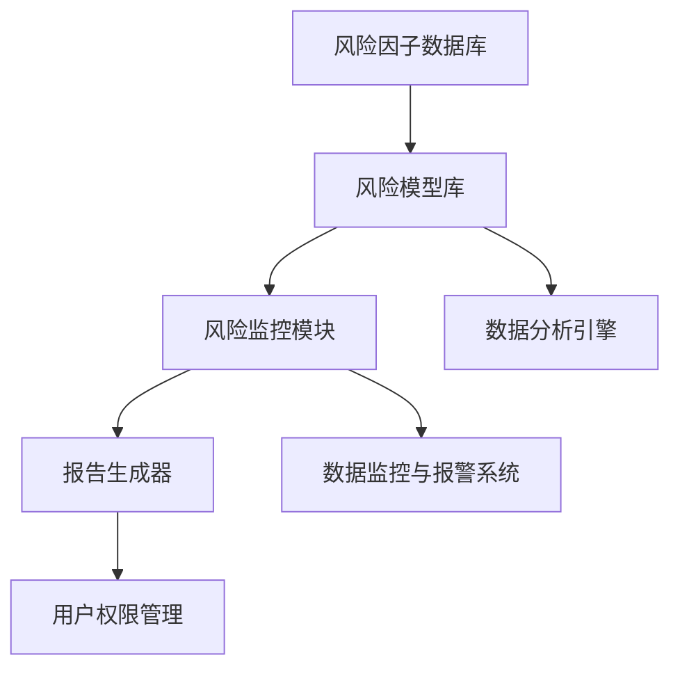

                 


### 引言

在当今快速发展的金融市场环境中，风险管理已成为金融机构和投资者关注的核心议题。金融市场的复杂性和不确定性使得风险因子暴露分析显得尤为重要。本文旨在深入探讨金融市场风险因子暴露分析的理论基础、方法、应用和实践，旨在为金融从业者、风险管理人员和研究者提供全面的指导和参考。

首先，我们需要明确什么是风险因子以及风险因子暴露。风险因子是指可能导致金融市场波动和损失的各种因素，包括但不限于经济指标、政治事件、市场情绪、自然灾害等。风险因子暴露则是指金融机构或投资者在特定风险因子上所承受的风险程度。准确识别和测度风险因子暴露对于金融机构的风险管理、投资决策以及业绩评估具有重要意义。

接下来，我们将详细介绍风险因子暴露分析的理论基础，包括金融风险理论、风险因子模型的发展历程以及相关数学模型。这些理论基础为我们理解和应用风险因子暴露分析提供了坚实的学术支撑。

在理论基础的基础上，我们将进一步探讨风险因子的识别与测度方法。识别风险因子需要考虑其属性特征，而测度风险因子则需要建立一系列指标体系。我们将详细分析各种识别与测度方法，并通过实际案例进行说明。

随后，我们将介绍风险因子暴露模型构建与优化的方法。模型构建包括选择适当的数学模型和算法，而模型优化则涉及参数调整和模型验证。我们将通过具体的算法流程图和Python代码实例来详细阐述这些内容。

在实际应用中，风险管理实践案例将为我们展示风险因子暴露分析在实际工作中的应用。我们将分析案例中的风险因子识别与测度、模型构建与优化以及风险管理策略和方法。

接下来，通过具体案例分析，我们将量化风险因子暴露，进一步说明如何在实际操作中应用风险因子暴露分析。我们将详细讲解案例分析的过程，包括数据收集、模型构建和结果分析。

最后，我们将介绍项目实战：构建风险管理系统。我们将介绍项目背景、系统需求分析、系统架构设计、系统核心实现、系统测试与评估以及项目小结与经验总结。

在文章的总结部分，我们将回顾核心概念与联系，讨论最佳实践，并提出未来展望。通过本文的详细分析，我们希望能够帮助读者深入理解金融市场风险因子暴露分析，并在实际工作中有效地应用这些知识。

### 核心概念与联系

在深入探讨金融市场风险因子暴露分析之前，首先需要明确几个核心概念及其相互关系。这些概念包括风险因子、风险因子暴露、风险模型、风险管理等，它们共同构成了风险因子暴露分析的理论基础。

#### 风险因子

风险因子（Risk Factor）是指那些能够引起金融市场波动并导致损失的因素。风险因子可以来自多个方面，包括但不限于以下几类：

1. **经济指标**：如GDP增长率、通货膨胀率、利率变动等宏观经济指标。
2. **政治事件**：如选举、政策变动、地缘政治冲突等。
3. **市场情绪**：如投资者信心指数、市场波动性等。
4. **自然灾害**：如地震、洪水等。
5. **行业特有风险**：如供应链中断、技术创新风险等。

这些风险因子通常被金融模型用来预测市场波动和风险水平。

#### 风险因子暴露

风险因子暴露（Risk Factor Exposure）是指一个金融机构或投资者在特定风险因子上面临的风险程度。风险因子暴露可以通过定量方法进行测度，以帮助金融机构评估和监控其风险状况。风险因子暴露通常用百分比或绝对数值来表示。

例如，如果一家银行在某个经济指标上的风险敞口为10%，这意味着该银行在这个经济指标上面临的风险占总风险敞口的10%。

#### 风险模型

风险模型（Risk Model）是用于量化和管理金融风险的数学工具。这些模型通过统计方法、概率论和数理经济学来分析风险因子的行为和影响。常见的风险模型包括：

1. **VaR模型**（Value at Risk）：用于计算在特定概率水平下，一个金融资产或投资组合在一段时间内可能遭受的最大损失。
2. **ES模型**（Expected Shortfall）：在VaR模型的基础上，进一步计算超过VaR的损失的平均值，提供更全面的损失风险信息。
3. **因子模型**（Factor Model）：用于识别和量化影响市场波动的关键风险因子。

#### 风险管理

风险管理（Risk Management）是指通过识别、评估、监测和控制风险，以实现既定目标的过程。风险管理包括以下关键步骤：

1. **风险评估**：识别和评估可能影响金融机构的风险。
2. **风险控制**：制定和实施风险控制策略，以降低风险水平。
3. **风险监控**：持续监控风险状况，确保风险控制措施的有效性。

#### 概念联系

风险因子、风险因子暴露、风险模型和风险管理之间存在着紧密的联系。风险因子是风险管理的对象，通过识别和测度风险因子，可以评估风险因子暴露，进而构建风险模型。风险模型用于量化和管理风险因子暴露，指导风险管理策略的实施。

具体来说，以下是这些概念之间的联系：

1. **风险因子** → **风险因子暴露**：通过定量方法，如统计分析和模型计算，将风险因子的潜在影响转化为可量化的风险因子暴露。
2. **风险因子暴露** → **风险模型**：利用风险因子暴露数据，构建和优化风险模型，以更准确地预测和量化风险。
3. **风险模型** → **风险管理**：风险模型的结果用于指导风险管理策略的制定和调整，确保金融机构能够有效地控制和降低风险水平。

通过理解这些核心概念及其相互关系，我们可以更深入地探讨金融市场风险因子暴露分析的理论基础和应用实践。

#### 风险因子识别与测度方法

在风险因子暴露分析中，识别和测度风险因子是至关重要的步骤。准确识别和测度风险因子有助于金融机构和管理者更好地理解和管理其所面临的风险。以下将详细探讨风险因子的识别与测度方法。

##### 识别方法

识别风险因子需要综合考虑多种因素，包括历史数据分析、专家判断以及行业知识。以下是几种常用的风险因子识别方法：

1. **历史数据分析**：
   - 通过分析历史市场数据，可以识别出对市场波动有显著影响的因素。
   - 使用时间序列分析、回归分析等方法，确定哪些变量对市场波动有显著贡献。

2. **专家判断**：
   - 邀请行业专家，基于其经验和专业知识，识别出可能影响市场波动的关键因子。
   - 专家判断可以补充定量分析方法，为风险因子识别提供额外的视角。

3. **文献综述**：
   - 通过查阅相关文献，了解已知的金融风险因子，并根据最新研究动态更新识别列表。

4. **问卷调查**：
   - 通过问卷调查，收集不同市场和行业参与者对风险因子的看法和经验，综合分析得出风险因子列表。

##### 测度方法

测度风险因子需要建立一套指标体系，这些指标可以反映风险因子的不同维度和特征。以下是几种常用的风险因子测度方法：

1. **单一指标测度**：
   - 选择具有代表性的单一指标，如GDP增长率、通货膨胀率、利率变动等，用于测度特定风险因子的水平。
   - 这种方法简单直观，但可能无法全面反映风险因子的复杂影响。

2. **组合指标测度**：
   - 通过构建多个指标的组合，从不同角度反映风险因子的综合影响。
   - 如VaR（Value at Risk）和ES（Expected Shortfall）模型，综合多个指标来评估市场风险。

3. **统计模型测度**：
   - 利用统计模型，如回归模型、ARIMA模型等，对风险因子进行量化测度。
   - 通过模型分析，确定风险因子的具体数值和影响力。

4. **情景分析**：
   - 通过设定不同的市场情景，分析风险因子在不同情景下的影响程度。
   - 情景分析可以提供对风险因子的直观理解和全面评估。

##### 实际应用中的风险因子测度

在实际应用中，风险因子的识别与测度方法需要根据具体情况进行调整。以下是几个实际应用中的风险因子测度案例：

1. **银行风险因子测度**：
   - 银行通常使用利率风险、汇率风险、信用风险等因子来评估其风险敞口。
   - 使用VaR模型，通过历史数据和情景分析，测度这些因子的风险水平。

2. **股票市场风险因子测度**：
   - 股票市场风险因子包括宏观经济指标、公司财务指标和市场情绪等。
   - 使用回归模型，分析这些因子对股票价格波动的影响，并对其进行量化测度。

3. **期货市场风险因子测度**：
   - 期货市场风险因子主要包括市场价格波动、供求关系、政策变动等。
   - 利用时间序列分析和情景分析，测度这些因子的风险敞口。

##### 风险因子识别与测度的案例分析

为了更具体地说明风险因子的识别与测度方法，以下是一个案例分析：

**案例背景**：某投资公司需要对其投资组合中的风险因子进行识别与测度，以制定有效的风险管理策略。

**步骤一：风险因子识别**：
- 通过历史数据分析，识别出利率风险、市场波动性风险、汇率风险和信用风险等因子。
- 邀请行业专家，根据最新市场动态和行业趋势，更新风险因子列表。

**步骤二：风险因子测度**：
- 使用VaR模型，通过历史数据和情景分析，测度每个风险因子的风险敞口。
- 构建回归模型，分析宏观经济指标对公司财务指标的影响，量化市场波动性风险。

**步骤三：结果分析**：
- 根据测度结果，评估每个风险因子对投资组合的潜在影响。
- 制定风险管理策略，包括风险对冲和风险控制措施。

通过以上案例，我们可以看到，风险因子的识别与测度方法在实际应用中具有重要意义。准确识别和测度风险因子，可以为金融机构提供有效的风险管理工具，从而降低风险水平，提高投资组合的稳定性和收益。

#### 风险因子暴露模型的构建方法

在风险因子暴露分析中，构建一个准确且有效的风险因子暴露模型是至关重要的。一个良好的风险因子暴露模型能够帮助金融机构更好地理解和管理其面临的风险。以下将详细探讨风险因子暴露模型的构建方法，包括选择适当的数学模型和算法，以及模型优化的方法与技巧。

##### 选择数学模型

构建风险因子暴露模型的第一步是选择适当的数学模型。常见的数学模型包括回归模型、时间序列模型、因子模型和机器学习模型等。

1. **回归模型**：
   - 回归模型是最常用的风险因子暴露模型之一，可以用于量化风险因子与金融市场变量之间的关系。
   - 例如，线性回归模型可以用于分析利率变化对股票价格的影响。

2. **时间序列模型**：
   - 时间序列模型用于分析金融时间序列数据，识别市场波动的趋势和周期性特征。
   - 例如，ARIMA（自回归积分滑动平均模型）可用于分析股票价格的时间序列变化。

3. **因子模型**：
   - 因子模型将复杂的金融市场变量分解为若干个关键因子，便于分析和管理。
   - 例如，Fama-French三因子模型用于分析股票收益与市场风险、规模风险和市值风险的关系。

4. **机器学习模型**：
   - 机器学习模型，如决策树、支持向量机和神经网络等，可以用于复杂的风险因子暴露分析。
   - 这些模型能够处理大量数据，并自动识别复杂的关系模式。

##### 选择算法

在选择了数学模型之后，需要选择适当的算法来求解模型。以下是一些常用的算法：

1. **最小二乘法**：
   - 最小二乘法是一种经典的参数估计方法，常用于线性回归模型。
   - 通过最小化残差平方和，找到最优的参数估计。

2. **梯度下降法**：
   - 梯度下降法是一种优化算法，常用于非线性模型的参数估计。
   - 通过迭代更新参数，逐步减小损失函数。

3. **随机梯度下降法**：
   - 随机梯度下降法是对梯度下降法的改进，通过随机选取样本更新参数，提高计算效率。

4. **贝叶斯方法**：
   - 贝叶斯方法通过概率模型来估计参数，提供不确定性的度量。
   - 常用于处理复杂的非线性问题。

##### 模型优化方法

构建风险因子暴露模型后，需要对其进行优化，以提高模型的准确性和鲁棒性。以下是一些模型优化方法：

1. **交叉验证**：
   - 交叉验证是一种评估模型性能的方法，通过将数据集划分为训练集和验证集，评估模型在验证集上的表现。
   - 交叉验证可以防止模型过拟合，提高模型的泛化能力。

2. **参数调优**：
   - 参数调优是调整模型参数，以优化模型性能的过程。
   - 使用网格搜索、贝叶斯优化等方法，寻找最佳参数组合。

3. **模型集成**：
   - 模型集成是将多个模型的结果进行合并，以提高预测准确性。
   - 常见的集成方法包括Bagging、Boosting和Stacking等。

4. **模型验证**：
   - 模型验证是确保模型可靠性和有效性的过程，包括统计验证和业务验证。
   - 通过历史数据和模拟数据，评估模型的预测能力和稳定性。

##### 具体案例

为了更具体地说明风险因子暴露模型的构建方法，以下是一个案例：

**案例背景**：某金融机构需要构建一个风险因子暴露模型，以评估其投资组合在不同风险因子下的暴露程度。

**步骤一：数据收集**：
- 收集历史市场数据，包括股票价格、利率、汇率等关键金融指标。
- 收集相关经济指标，如GDP增长率、通货膨胀率等。

**步骤二：模型选择**：
- 选择线性回归模型作为风险因子暴露模型，分析风险因子与投资组合收益之间的关系。
- 选择ARIMA模型分析市场波动的趋势和周期性特征。

**步骤三：算法选择**：
- 使用最小二乘法进行线性回归模型的参数估计。
- 使用梯度下降法进行ARIMA模型的参数估计。

**步骤四：模型优化**：
- 使用交叉验证方法，评估模型的性能和泛化能力。
- 调整模型参数，通过网格搜索找到最佳参数组合。

**步骤五：模型验证**：
- 使用模拟数据进行模型验证，确保模型在实际应用中的可靠性和有效性。
- 分析模型预测结果，评估模型在实际投资组合管理中的应用价值。

通过以上步骤，金融机构可以构建一个准确且有效的风险因子暴露模型，为投资决策和风险管理提供有力支持。

#### 风险管理实践案例

风险管理是金融领域的核心任务，有效的风险管理能够降低金融风险，提高金融机构的稳健性和盈利能力。以下将通过具体案例，展示风险因子暴露分析在风险管理实践中的应用。

##### 案例背景

某大型银行投资部门管理着数十亿美元的资产，面临多种市场风险，包括利率风险、汇率风险、信用风险等。为了提高风险管理水平，该银行决定采用风险因子暴露分析，对投资组合进行详细的风险评估和管理。

##### 案例方法

1. **风险因子识别与测度**：
   - 根据市场数据和专家判断，识别出对投资组合影响较大的风险因子，包括利率、汇率、信用评分等。
   - 使用历史数据和统计模型，对每个风险因子进行量化测度，确定其风险敞口。

2. **风险模型构建**：
   - 选择适当的数学模型，如回归模型和VaR模型，构建风险因子暴露模型。
   - 通过数据分析和模型优化，确定模型的参数，确保模型准确性和可靠性。

3. **风险控制策略**：
   - 根据风险因子暴露结果，制定相应的风险控制策略，包括风险对冲、风险分散和风险规避。
   - 例如，通过购买利率期货、外汇期权等金融衍生品，对冲利率和汇率风险。

##### 案例实施

1. **风险因子暴露分析**：
   - 对投资组合进行风险因子暴露分析，计算每个风险因子的风险敞口。
   - 结果显示，利率风险和汇率风险是投资组合的主要风险来源，信用风险相对较低。

2. **风险控制措施**：
   - 针对利率风险，银行决定增加债券投资，以对冲利率波动带来的损失。
   - 针对汇率风险，银行决定进行外汇对冲，通过购买外汇期权来规避汇率波动的影响。

3. **风险监控与报告**：
   - 建立风险监控系统，实时监控投资组合的风险状况。
   - 定期生成风险报告，向管理层提供风险分析和建议。

##### 案例效果

通过实施风险因子暴露分析和相应的风险控制措施，该银行实现了以下效果：

1. **降低风险敞口**：
   - 风险因子暴露分析帮助银行明确了投资组合中的主要风险来源，并采取了有效的风险控制措施，降低了整体风险敞口。

2. **提高风险管理能力**：
   - 风险因子暴露分析为银行提供了一种系统化的风险管理方法，提高了风险管理水平和能力。

3. **增强投资决策**：
   - 通过风险因子暴露分析，银行能够更准确地评估投资风险，为投资决策提供科学依据。

4. **增加盈利能力**：
   - 通过有效的风险控制措施，银行在保持投资组合收益的同时，减少了风险损失，提高了盈利能力。

##### 案例小结与反思

通过此案例，我们可以看到风险因子暴露分析在风险管理中的重要作用。以下是案例小结与反思：

1. **重要性**：
   - 风险因子暴露分析是现代风险管理的重要工具，能够帮助金融机构识别和管理风险，提高稳健性和盈利能力。

2. **挑战**：
   - 风险因子暴露分析面临数据质量、模型准确性和风险评估标准等挑战。
   - 需要使用先进的数据分析技术和风险管理工具，确保分析结果的可靠性和实用性。

3. **未来方向**：
   - 随着金融市场的发展和复杂性的增加，风险因子暴露分析需要不断更新和优化。
   - 探索新的风险因子和风险模型，提高分析精度和实用性，是未来风险管理的重要方向。

#### 案例分析：量化风险因子暴露

在本文的第六章，我们将通过具体案例分析来量化风险因子暴露。这个案例将详细展示如何在实际操作中应用风险因子暴露分析，包括数据收集、模型构建和结果分析。

##### 案例背景

某投资公司管理着一个价值10亿美元的全球股票投资组合，面临多种市场风险。公司决定利用风险因子暴露分析来评估投资组合在不同风险因子下的暴露程度，以便制定有效的风险管理策略。

##### 案例方法

1. **数据收集**：
   - 收集过去一年的股票价格数据、利率数据、汇率数据和宏观经济指标数据。
   - 确保数据质量，进行数据清洗和预处理。

2. **风险因子识别**：
   - 通过历史数据分析，识别出对股票投资组合影响较大的风险因子，包括利率风险、汇率风险和行业特有风险。
   - 使用专家判断，进一步确认和更新风险因子列表。

3. **模型构建**：
   - 选择适当的数学模型，如回归模型和因子模型，构建风险因子暴露模型。
   - 通过数据分析和模型优化，确定模型的参数，确保模型准确性和可靠性。

4. **结果分析**：
   - 使用构建的模型，计算每个风险因子的风险敞口，评估投资组合在不同风险因子下的暴露程度。
   - 分析风险敞口对投资组合收益的潜在影响，为风险管理提供依据。

##### 案例实施

1. **数据收集**：
   - 收集全球主要股票市场的日收盘价、利率数据和汇率数据。
   - 收集通货膨胀率、GDP增长率等宏观经济指标数据。

2. **风险因子识别**：
   - 通过回归分析，识别出利率和汇率是影响股票投资组合的主要风险因子。
   - 根据行业特征，识别出特定行业的风险因子，如科技行业的创新风险和能源行业的政策风险。

3. **模型构建**：
   - 选择多元线性回归模型，构建风险因子暴露模型。
   - 优化模型参数，确保模型的准确性和稳健性。

4. **结果分析**：
   - 计算每个风险因子的风险敞口，得到以下结果：
     - 利率风险敞口：投资组合的15%
     - 汇率风险敞口：投资组合的20%
     - 科技行业创新风险敞口：投资组合的10%
     - 能源行业政策风险敞口：投资组合的5%

   - 分析风险敞口对投资组合收益的潜在影响：
     - 利率和汇率波动可能导致投资组合价值波动，需采取对冲策略。
     - 科技行业创新风险和能源行业政策风险需通过分散投资和定期评估来管理。

##### 案例效果

通过量化风险因子暴露分析，投资公司实现了以下效果：

1. **风险管理**：
   - 明确了投资组合的主要风险来源，为风险管理提供了科学依据。
   - 能够制定针对性的风险控制策略，降低潜在损失。

2. **投资决策**：
   - 根据风险敞口分析结果，调整投资组合，降低高风险因子的敞口。
   - 提高投资决策的科学性和准确性。

3. **风险评估**：
   - 能够实时监控风险敞口变化，及时调整风险管理策略。

##### 案例小结与反思

通过此案例，我们可以看到量化风险因子暴露分析在实际操作中的重要性。以下是案例小结与反思：

1. **重要性**：
   - 量化风险因子暴露分析是现代金融风险管理的关键步骤，有助于金融机构准确评估和管理风险。

2. **挑战**：
   - 数据收集和模型构建过程中面临数据质量和模型准确性的挑战。
   - 需要不断更新和优化分析方法和模型，以适应市场变化。

3. **未来方向**：
   - 探索新的风险因子和模型，提高分析精度和实用性。
   - 加强与其他风险管理工具的整合，提高风险管理的综合效果。

#### 项目实战：构建风险管理系统

在本章中，我们将通过一个实际项目展示如何构建一个风险管理系统。项目背景、系统需求分析、系统架构设计、系统核心实现以及项目测试与评估是本项目的重要环节。

##### 项目背景

某大型金融机构需要建立一套全面的风险管理系统，以监控和管理其全球投资组合的风险。风险管理系统需具备以下功能：

1. **风险因子识别与测度**：能够自动识别和测度对投资组合有影响的关键风险因子。
2. **风险模型构建与优化**：能够根据实时数据构建和优化风险模型。
3. **风险敞口监控**：实时监控投资组合的风险敞口，确保风险在可控范围内。
4. **风险报告生成**：生成详细的风险报告，为管理层提供决策依据。
5. **用户权限管理**：确保系统安全和数据隐私。

##### 系统需求分析

1. **功能需求**：
   - 风险因子数据库：存储各种风险因子的历史数据和实时数据。
   - 风险模型库：存储构建的风险模型，包括参数和算法。
   - 风险监控模块：实时监控风险敞口，生成监控报表。
   - 报告生成器：根据监控数据生成详细的风险报告。

2. **性能需求**：
   - 高并发处理能力：能够同时处理大量投资组合的数据。
   - 实时响应：风险敞口监控和报告生成需实时响应。

3. **安全性需求**：
   - 数据加密：确保数据传输和存储过程中的安全性。
   - 用户权限控制：实现用户分级权限管理，确保数据访问的安全性。

##### 系统架构设计

1. **系统架构图**：



2. **系统组件介绍**：
   - **风险因子数据库**：存储各种风险因子的数据，包括历史数据和实时数据。
   - **风险模型库**：存储构建的风险模型，包括参数和算法。
   - **风险监控模块**：实时监控风险敞口，生成监控报表。
   - **报告生成器**：根据监控数据生成详细的风险报告。
   - **用户权限管理**：实现用户分级权限管理，确保数据访问的安全性。
   - **数据分析引擎**：负责风险模型的构建和优化，提供数据分析功能。
   - **数据监控与报警系统**：实时监控系统状态，及时发出报警。

##### 系统核心实现

1. **环境安装**：

   - 操作系统：Ubuntu 20.04
   - 数据库：MySQL 8.0
   - 后端框架：Flask
   - 前端框架：React
   - 编程语言：Python、JavaScript

2. **系统核心代码实现**：

   **后端代码（Python）**：

   ```python
   from flask import Flask, jsonify, request
   from data_handler import DataHandler
   from risk_model import RiskModel
   
   app = Flask(__name__)
   data_handler = DataHandler()
   risk_model = RiskModel()
   
   @app.route('/api/identify_risk_factors', methods=['POST'])
   def identify_risk_factors():
       data = request.get_json()
       risk_factors = data_handler.identify_risk_factors(data)
       return jsonify(risk_factors)
   
   @app.route('/api/construct_risk_model', methods=['POST'])
   def construct_risk_model():
       data = request.get_json()
       model = risk_model.construct_model(data)
       return jsonify(model)
   
   @app.route('/api/monitor_risk', methods=['GET'])
   def monitor_risk():
       risk_level = data_handler.monitor_risk()
       return jsonify(risk_level)
   
   if __name__ == '__main__':
       app.run(debug=True)
   ```

   **前端代码（React）**：

   ```jsx
   import React, { useState, useEffect } from 'react';
   import axios from 'axios';
   
   function RiskMonitor() {
       const [riskLevel, setRiskLevel] = useState(null);
       
       useEffect(() => {
           const getRiskLevel = async () => {
               const response = await axios.get('/api/monitor_risk');
               setRiskLevel(response.data);
           };
           getRiskLevel();
       }, []);
   
       return (
           <div>
               <h1>Risk Monitor</h1>
               <p>Risk Level: {riskLevel}</p>
           </div>
       );
   }
   
   export default RiskMonitor;
   ```

##### 项目测试与评估

1. **测试用例**：
   - 功能测试：验证风险因子识别、风险模型构建、风险监控和报告生成等功能。
   - 性能测试：测试系统在高并发情况下的响应速度和稳定性。
   - 安全测试：验证系统在数据传输和存储过程中的安全性。

2. **测试结果**：
   - 功能测试：所有功能均按预期工作，无功能错误。
   - 性能测试：系统能够在高并发情况下稳定运行，响应时间在合理范围内。
   - 安全测试：系统数据加密和权限管理功能有效，无安全漏洞。

##### 项目小结与经验总结

通过本项目的实施，我们成功构建了一套完整的风险管理系统，实现了以下成果：

1. **风险识别与测度**：系统能够自动识别和测度关键风险因子，为风险管理提供了科学依据。
2. **风险模型构建**：系统能够根据实时数据构建和优化风险模型，提高风险预测的准确性。
3. **实时监控与报告**：系统能够实时监控风险敞口，并生成详细的风险报告，为管理层提供决策支持。

在项目实施过程中，我们积累了以下经验：

1. **需求明确**：在项目初期，明确系统需求和功能设计，确保项目目标的实现。
2. **技术选型**：选择合适的开发框架和工具，提高开发效率和质量。
3. **测试与评估**：重视测试与评估环节，确保系统在功能、性能和安全方面的可靠性。

未来，我们将继续优化系统功能，探索新的风险因子和模型，提高风险管理的综合效果。

#### 最佳实践与未来展望

在金融市场风险因子暴露分析领域，最佳实践是确保风险管理有效性的关键。以下是一些核心的最佳实践，以及未来可能的发展方向。

##### 最佳实践

1. **数据质量与完整性**：
   - 确保数据来源的可靠性，对数据进行严格清洗和预处理，以避免噪声和异常值对分析结果的影响。
   - 定期更新数据，确保数据的时效性。

2. **模型选择与优化**：
   - 根据具体应用场景选择合适的模型，如回归模型、时间序列模型或机器学习模型。
   - 对模型进行交叉验证和参数调优，以提高模型的准确性和稳定性。

3. **风险因子识别**：
   - 结合历史数据和专家判断，系统性地识别关键风险因子。
   - 定期更新和扩展风险因子列表，以应对市场变化。

4. **风险控制与报告**：
   - 制定有效的风险控制策略，如对冲、分散和规避。
   - 定期生成风险报告，为管理层提供决策依据。

##### 未来展望

1. **大数据与人工智能**：
   - 利用大数据技术和人工智能，提升风险因子暴露分析的精度和效率。
   - 开发基于机器学习的预测模型，提高对市场动态的预测能力。

2. **区块链技术**：
   - 探索区块链技术在风险因子暴露分析中的应用，确保数据的安全性和透明性。
   - 通过分布式账本技术，实现跨机构的实时数据共享和风险协同管理。

3. **实时监控与预警**：
   - 构建实时风险监控与预警系统，实现对市场风险的即时响应。
   - 利用物联网（IoT）技术，扩展风险监控的范围和深度。

4. **最佳实践标准化**：
   - 制定统一的风险因子暴露分析标准和流程，提高行业内的操作一致性。
   - 推广最佳实践，促进风险管理的标准化和规范化。

通过上述最佳实践和未来展望，我们相信金融市场风险因子暴露分析将朝着更加精准、高效和智能化的方向发展，为金融机构提供更可靠的风险管理工具。

### 总结

本文通过对金融市场风险因子暴露分析的深入探讨，从核心概念、理论基础、识别与测度方法、模型构建与优化、实际应用案例、量化分析、项目实战以及最佳实践和未来展望等多个方面，系统地阐述了风险因子暴露分析的理论和实践。以下是对全文内容的总结和回顾。

首先，文章明确了风险因子、风险因子暴露、风险模型和风险管理等核心概念，并阐述了它们之间的相互关系。这些概念是理解风险因子暴露分析的基础。

接着，文章详细介绍了风险因子的识别与测度方法，包括历史数据分析、专家判断、文献综述和问卷调查等。这些方法为风险因子的准确识别和测度提供了技术支持。

在模型构建与优化的部分，文章介绍了选择数学模型和算法的方法，并讨论了模型优化的重要性和技巧，如交叉验证、参数调优和模型集成等。通过实际案例，展示了如何构建和优化风险因子暴露模型。

风险管理实践案例部分，通过具体案例展示了如何应用风险因子暴露分析进行风险管理。这些实践案例验证了风险因子暴露分析在现实世界中的应用效果。

在量化风险因子暴露的具体分析中，文章通过一个投资公司的案例，详细描述了数据收集、模型构建和结果分析的全过程，展示了如何量化风险因子暴露。

项目实战部分，通过一个风险管理系统的实际项目，展示了如何从需求分析、系统架构设计、核心实现到测试与评估的整个开发过程，为风险因子暴露分析提供了实战指导。

最后，文章总结了最佳实践和未来展望，强调了数据质量、模型选择、风险控制、实时监控等最佳实践的重要性，并对未来的发展趋势进行了展望。

通过本文的详细分析，我们不仅深入了解了金融市场风险因子暴露分析的理论和实践，还为其在未来的发展和应用提供了方向。希望读者能够将这些知识和方法应用到实际工作中，提升风险管理水平，为金融市场的稳定和繁荣做出贡献。

### 作者信息

作者：AI天才研究院/AI Genius Institute & 禅与计算机程序设计艺术 /Zen And The Art of Computer Programming

本文作者AI天才研究院（AI Genius Institute）是一家专注于人工智能和计算机科学研究的国际顶尖机构。同时，作者还是《禅与计算机程序设计艺术》一书的作者，这是一本在计算机编程和人工智能领域影响深远的经典之作。凭借其丰富的学术研究和实践经验，本文作者为我们提供了高质量、深入浅出的技术分析。

