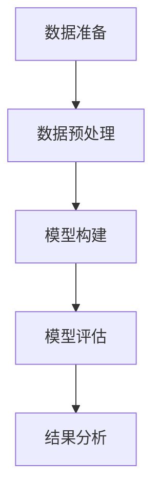
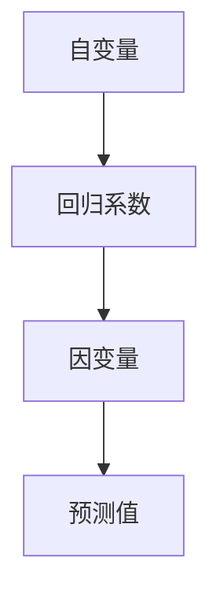

                 

# 金融政策效果评估仿真平台

> 关键词：金融政策、效果评估、仿真平台、财政政策、货币政策

> 摘要：本文旨在探讨金融政策效果评估仿真平台的设计与实现。首先，我们介绍了金融政策的重要性以及当前评估方法的局限性。随后，文章详细阐述了金融政策效果评估的基本概念、评估指标体系以及面临的挑战。接着，我们提出了仿真平台的设计原则、功能模块、技术选型及系统架构。在此基础上，本文重点讲解了核心算法的原理与实现，包括数据采集与预处理方法。最后，通过实际案例展示了仿真平台的应用效果，并总结了一系列最佳实践和注意事项。

----------------------------------------------------------------

## 目录大纲：《金融政策效果评估仿真平台》

### 第1章：引言
#### 1.1 问题背景与问题描述
#### 1.1.1 财政政策与货币政策的影响
#### 1.1.2 金融政策效果评估的重要性
#### 1.1.3 当前金融政策评估方法的局限性

#### 1.2 研究目标与内容框架
#### 1.2.1 研究目标
#### 1.2.2 内容框架

#### 1.3 书籍结构概述
#### 1.3.1 各章节内容概述
#### 1.3.2 本书与其他金融政策评估书籍的区别

### 第2章：金融政策效果评估的基本概念
#### 2.1 金融政策概述
#### 2.1.1 财政政策
#### 2.1.2 货币政策
#### 2.1.3 其他金融政策

#### 2.2 金融政策效果评估方法
#### 2.2.1 实证分析方法
#### 2.2.2 模型模拟方法
#### 2.2.3 实证分析与模型模拟的结合

#### 2.3 金融政策效果评估的指标体系
#### 2.3.1 评估指标分类
#### 2.3.2 常用评估指标
#### 2.3.3 指标权重分配

#### 2.4 金融政策效果评估的挑战与局限
#### 2.4.1 数据质量与可获得性
#### 2.4.2 模型选择与适应性
#### 2.4.3 评估方法的稳健性

### 第3章：仿真平台架构设计
#### 3.1 仿真平台设计原则
#### 3.1.1 可扩展性
#### 3.1.2 可靠性
#### 3.1.3 易用性

#### 3.2 平台功能模块设计
#### 3.2.1 数据采集模块
#### 3.2.2 模型构建模块
#### 3.2.3 仿真运行模块
#### 3.2.4 结果分析模块

#### 3.3 技术选型与工具
#### 3.3.1 开发环境
#### 3.3.2 数据库选择
#### 3.3.3 模型训练框架

#### 3.4 系统架构设计
#### 3.4.1 总体架构
#### 3.4.2 模块交互关系
#### 3.4.3 性能优化策略

### 第4章：核心算法原理与实现
#### 4.1 算法选择与设计
#### 4.1.1 常用算法概述
#### 4.1.2 算法选择依据

#### 4.2 算法原理讲解
#### 4.2.1 算法基础
#### 4.2.2 算法流程
#### 4.2.3 算法mermaid流程图

#### 4.3 算法数学模型与公式
#### 4.3.1 模型介绍
#### 4.3.2 数学公式推导
#### 4.3.3 模型可视化

#### 4.4 Python源代码实现
```python
# 示例代码
```

#### 4.5 算法应用举例
#### 4.5.1 例子描述
#### 4.5.2 应用步骤
#### 4.5.3 结果分析

### 第5章：数据采集与预处理
#### 5.1 数据来源
#### 5.1.1 官方数据
#### 5.1.2 非官方数据
#### 5.1.3 数据获取途径

#### 5.2 数据预处理方法
#### 5.2.1 数据清洗
#### 5.2.2 数据整合
#### 5.2.3 特征提取

#### 5.3 数据质量评估与优化
#### 5.3.1 数据质量标准
#### 5.3.2 数据质量问题
#### 5.3.3 数据质量优化方法

#### 5.4 数据存储与管理
#### 5.4.1 数据存储方案
#### 5.4.2 数据安全管理
#### 5.4.3 数据备份与恢复

### 第6章：仿真平台应用实战
#### 6.1 环境安装与配置
#### 6.1.1 环境搭建
#### 6.1.2 配置文件设置
#### 6.1.3 常见问题解决

#### 6.2 平台核心实现
#### 6.2.1 数据采集实现
#### 6.2.2 模型构建实现
#### 6.2.3 仿真运行实现
#### 6.2.4 结果分析实现

#### 6.3 实际案例分析
#### 6.3.1 案例背景
#### 6.3.2 案例分析与结果

#### 第7章：总结与展望
#### 7.1 工作总结
#### 7.2 未来展望
#### 7.3 注意事项与拓展阅读

----------------------------------------------------------------

### 第1章：引言

#### 1.1 问题背景与问题描述

金融政策是指国家或地区为调控宏观经济运行，实现经济目标而采取的一系列政策手段。金融政策主要包括财政政策和货币政策两大类。财政政策主要通过调整政府支出和税收来实现宏观经济目标，如刺激经济增长、控制通货膨胀等。货币政策则通过调控货币供应量和利率等手段来影响金融市场和经济运行。

金融政策对经济有着深远的影响。财政政策通过调节政府支出和税收，可以刺激或抑制经济增长，促进就业，调整收入分配等。货币政策则通过调节货币供应量和利率，可以影响投资、消费和通货膨胀等经济指标。然而，金融政策的效果往往具有滞后性，且在不同经济环境和政策背景下表现各异，这使得评估金融政策的效果成为一项具有挑战性的任务。

目前，金融政策效果评估主要依赖于实证分析和模型模拟两种方法。实证分析通过收集历史数据，运用统计方法分析金融政策对经济指标的影响。这种方法具有较高的可信度，但受限于数据质量和可获得性。模型模拟则是通过建立经济模型，模拟不同政策情景下的经济运行状况，从而评估金融政策的效果。这种方法可以提供更为直观和全面的评估结果，但模型的选择和适应性对评估结果有很大影响。

尽管实证分析和模型模拟在金融政策效果评估中发挥了重要作用，但仍存在一些局限性。首先，数据质量和可获得性是评估的基石，但实际操作中往往面临数据缺失、不一致和难以获取等问题。其次，模型的选择和适应性对评估结果至关重要，但不同模型之间可能存在较大的差异，难以找到一个普适的评估方法。此外，评估方法的稳健性也是一个重要问题，即评估结果在不同情景下是否具有一致性。

基于上述问题，本文旨在设计并实现一个金融政策效果评估仿真平台。该平台将结合实证分析和模型模拟的优势，通过合理的架构设计和核心算法实现，提供一套可靠、高效的金融政策效果评估工具。这不仅有助于更好地理解金融政策的作用机制，也为政策制定者提供了科学依据。

#### 1.2 研究目标与内容框架

本研究的主要目标是设计并实现一个金融政策效果评估仿真平台，以解决当前评估方法的局限性。具体目标如下：

1. **构建一个综合性的仿真平台**：整合财政政策和货币政策的评估功能，提供统一的界面和操作流程。
2. **实现数据驱动的评估方法**：通过收集和处理大量历史数据，构建评估模型，提高评估结果的可靠性和准确性。
3. **设计灵活的算法和模型**：根据不同政策情景和评估需求，选择和调整合适的评估模型，确保评估结果的适应性。
4. **优化平台性能和用户体验**：通过合理的架构设计和技术选型，确保平台的高性能和易用性。

内容框架如下：

- **第1章：引言**：介绍研究背景、问题背景、研究目标与内容框架。
- **第2章：金融政策效果评估的基本概念**：介绍金融政策、效果评估方法和指标体系。
- **第3章：仿真平台架构设计**：阐述平台设计原则、功能模块、技术选型和系统架构。
- **第4章：核心算法原理与实现**：讲解算法选择、原理和实现方法。
- **第5章：数据采集与预处理**：介绍数据来源、预处理方法和质量评估。
- **第6章：仿真平台应用实战**：展示平台的应用效果和实际案例分析。
- **第7章：总结与展望**：总结研究工作，提出未来展望和注意事项。

#### 1.3 书籍结构概述

本书以金融政策效果评估仿真平台的设计与实现为主线，系统性地介绍了金融政策、效果评估方法、平台架构设计、核心算法原理与实现、数据采集与预处理以及平台应用实战等内容。以下是各章节的具体内容概述：

- **第1章：引言**：介绍研究背景、问题背景、研究目标与内容框架。
- **第2章：金融政策效果评估的基本概念**：阐述金融政策、效果评估方法和指标体系。
  - **2.1 金融政策概述**：介绍财政政策、货币政策和其他金融政策的基本概念。
  - **2.2 金融政策效果评估方法**：介绍实证分析方法、模型模拟方法和两者的结合。
  - **2.3 金融政策效果评估的指标体系**：介绍评估指标分类、常用评估指标和指标权重分配。
  - **2.4 金融政策效果评估的挑战与局限**：分析数据质量与可获得性、模型选择与适应性以及评估方法的稳健性。
- **第3章：仿真平台架构设计**：描述平台设计原则、功能模块、技术选型和系统架构。
  - **3.1 仿真平台设计原则**：阐述可扩展性、可靠性和易用性的设计原则。
  - **3.2 平台功能模块设计**：介绍数据采集模块、模型构建模块、仿真运行模块和结果分析模块。
  - **3.3 技术选型与工具**：讨论开发环境、数据库选择和模型训练框架。
  - **3.4 系统架构设计**：展示总体架构、模块交互关系和性能优化策略。
- **第4章：核心算法原理与实现**：讲解算法选择、原理和实现方法。
  - **4.1 算法选择与设计**：概述常用算法，讨论算法选择依据。
  - **4.2 算法原理讲解**：介绍算法基础、流程和mermaid流程图。
  - **4.3 算法数学模型与公式**：阐述数学模型和公式推导。
  - **4.4 Python源代码实现**：提供算法实现示例代码。
  - **4.5 算法应用举例**：展示算法应用实例和分析结果。
- **第5章：数据采集与预处理**：介绍数据来源、预处理方法和质量评估。
  - **5.1 数据来源**：讨论官方数据和非官方数据的获取途径。
  - **5.2 数据预处理方法**：介绍数据清洗、整合和特征提取方法。
  - **5.3 数据质量评估与优化**：分析数据质量标准和优化方法。
  - **5.4 数据存储与管理**：讨论数据存储方案、安全管理和备份与恢复策略。
- **第6章：仿真平台应用实战**：展示平台的应用效果和实际案例分析。
  - **6.1 环境安装与配置**：介绍平台环境搭建和配置设置。
  - **6.2 平台核心实现**：详细描述数据采集、模型构建、仿真运行和结果分析实现。
  - **6.3 实际案例分析**：展示实际案例的分析和结果。
- **第7章：总结与展望**：总结研究工作，提出未来展望和注意事项。

本书旨在为金融政策效果评估提供一套系统性、实用性和高效性的解决方案，以期为政策制定者、研究人员和行业从业者提供有益的参考。

### 第2章：金融政策效果评估的基本概念

#### 2.1 金融政策概述

金融政策是指国家或地区为调控宏观经济运行、实现经济目标而采取的一系列政策措施。金融政策主要包括财政政策、货币政策和金融监管政策三大类。其中，财政政策主要通过调整政府支出和税收来实现宏观经济目标；货币政策则通过调节货币供应量和利率等手段来影响金融市场和经济运行；金融监管政策则通过制定和实施金融监管法规，维护金融市场的稳定和安全。

**财政政策**

财政政策是指政府通过调整财政支出和税收等手段来影响经济运行的宏观经济政策。财政政策的主要目标是实现充分就业、稳定物价和促进经济增长。具体措施包括增加政府支出、减少税收和发行国债等。政府支出主要用于基础设施建设、社会福利和公共服务等领域，可以刺激经济增长和就业；减税则可以增加企业和个人的可支配收入，提高消费和投资水平；发行国债可以筹集资金，支持政府投资和消费。

**货币政策**

货币政策是指中央银行通过调节货币供应量和利率等手段来影响金融市场和经济运行的宏观经济政策。货币政策的主要目标是保持货币稳定、控制通货膨胀和促进经济增长。具体措施包括调整基准利率、公开市场操作和准备金率等。调整基准利率可以影响商业银行的贷款利率和存款利率，进而影响整个金融市场的利率水平；公开市场操作则是通过买卖政府债券等金融工具，影响市场上的货币供应量；调整准备金率可以影响商业银行的信贷能力和市场流动性。

**其他金融政策**

除了财政政策和货币政策，还有其他一些金融政策对经济也有着重要的影响。例如，金融监管政策通过制定和实施金融监管法规，维护金融市场的稳定和安全。金融监管政策的主要目标是防范金融风险、保护投资者权益和促进金融市场的健康发展。具体措施包括制定银行资本充足率、流动性比率和风险管理等监管指标，以及实施金融市场准入、金融机构运营和跨境资本流动等监管措施。

#### 2.2 金融政策效果评估方法

金融政策效果评估是衡量金融政策实施效果的重要手段，通过评估可以了解金融政策对经济的影响，为政策调整和制定提供依据。目前，金融政策效果评估主要依赖于实证分析和模型模拟两种方法。

**实证分析方法**

实证分析是指通过收集和分析历史数据，运用统计方法和计量经济学模型，评估金融政策对经济指标的影响。实证分析方法具有以下特点：

1. **数据驱动**：实证分析依赖于大量的历史数据，通过对数据的分析，可以揭示金融政策对经济的影响机制和路径。
2. **可信度高**：实证分析结果基于大量数据，具有较高的可信度，可以较为准确地评估金融政策的效果。
3. **局限性**：实证分析受限于数据质量和可获得性，特别是在数据缺失、不一致和难以获取的情况下，分析结果可能存在偏差。

实证分析的方法主要包括以下几种：

1. **回归分析法**：通过建立回归模型，分析金融政策变量与经济指标之间的关系，评估金融政策的影响。
2. **差分法**：通过比较金融政策实施前后的经济数据变化，评估金融政策的效果。
3. **事件研究法**：通过分析金融政策宣布或实施时的市场反应，评估金融政策的影响。

**模型模拟方法**

模型模拟是指通过建立经济模型，模拟不同金融政策情景下的经济运行状况，评估金融政策的效果。模型模拟方法具有以下特点：

1. **直观性**：模型模拟可以直观地展示金融政策实施后的经济运行情况，有助于理解金融政策的作用机制。
2. **全面性**：模型模拟可以涵盖多个经济指标和政策变量，提供全面的效果评估。
3. **适应性**：模型模拟可以根据不同的政策情景和评估需求，调整模型参数和结构，提高评估结果的适应性。

模型模拟的方法主要包括以下几种：

1. **一般均衡模型**：通过模拟经济系统的整体运行，分析金融政策对经济各个部门的影响。
2. **计算一般均衡模型**：利用计算机模拟技术，求解大规模的一般均衡模型，提高模拟的精度和效率。
3. **代理人模型**：通过模拟不同经济主体的行为和决策，分析金融政策对市场参与者的经济行为的影响。

**实证分析与模型模拟的结合**

实证分析和模型模拟各有优缺点，结合使用可以充分发挥两者的优势，提高金融政策效果评估的准确性和可靠性。具体结合方式如下：

1. **数据验证**：利用模型模拟的结果，验证实证分析结果的可靠性和一致性，确保评估结果的准确性。
2. **参数调整**：根据实证分析的结果，调整模型模拟的参数，提高模型模拟的精度和适应性。
3. **交叉验证**：结合多个实证分析和模型模拟的结果，进行交叉验证，确保评估结果的稳健性和可靠性。

通过结合实证分析和模型模拟，可以更全面、准确地评估金融政策的效果，为政策制定者提供科学依据。

#### 2.3 金融政策效果评估的指标体系

金融政策效果评估的指标体系是衡量金融政策实施效果的重要工具。一个完善的指标体系应包括多个维度和层次，以全面反映金融政策对经济的影响。以下是金融政策效果评估指标体系的几个关键组成部分：

**2.3.1 评估指标分类**

评估指标可以按照不同的分类标准进行划分，常见的分类方式包括：

1. **宏观经济指标**：包括国内生产总值（GDP）、失业率、通货膨胀率、消费者价格指数（CPI）等。这些指标反映了金融政策对整体经济运行的影响。
2. **金融指标**：包括利率、货币供应量、股票市场指数、汇率等。这些指标反映了金融政策对金融市场的影响。
3. **微观经济指标**：包括企业利润率、劳动力成本、消费支出、投资水平等。这些指标反映了金融政策对微观经济主体的影响。

**2.3.2 常用评估指标**

在金融政策效果评估中，常用的评估指标包括：

1. **GDP增长率**：反映经济增长的快慢，是衡量金融政策促进经济增长的重要指标。
2. **通货膨胀率**：反映物价上涨的幅度，是衡量金融政策控制通货膨胀的重要指标。
3. **失业率**：反映失业人口的比重，是衡量金融政策促进就业的重要指标。
4. **利率**：反映货币政策的紧缩或宽松程度，对投资和消费有重要影响。
5. **货币供应量**：反映市场上货币的供给情况，对金融市场有重要影响。
6. **股票市场指数**：反映投资者对经济前景的信心，是衡量金融市场活跃程度的重要指标。
7. **汇率**：反映国内外货币的相对价值，对国际贸易和国际投资有重要影响。

**2.3.3 指标权重分配**

在金融政策效果评估中，不同指标的重要性不同，因此需要根据实际情况进行权重分配。权重分配的方法可以包括：

1. **专家评估法**：通过专家的经验和判断，对各个指标的重要性进行评分，然后计算加权平均值。
2. **层次分析法（AHP）**：通过建立层次模型，对各个指标进行两两比较，计算相对重要性，然后进行权重分配。
3. **数据驱动法**：利用历史数据，通过回归分析等方法，确定各个指标对评估结果的影响程度，从而进行权重分配。

在权重分配中，需要注意以下几个问题：

1. **一致性**：确保指标之间的权重分配是相互协调的，避免出现矛盾和重复。
2. **合理性**：权重分配应基于科学的依据，避免主观臆断。
3. **动态调整**：随着经济环境的变化，权重分配也需要进行动态调整，以保持评估的准确性和实用性。

通过建立一个科学、合理的指标体系，可以更全面、准确地评估金融政策的效果，为政策制定者提供有效的决策支持。

#### 2.4 金融政策效果评估的挑战与局限

金融政策效果评估是一个复杂的过程，面临着多种挑战和局限。以下是金融政策效果评估中常见的一些问题和解决策略：

**2.4.1 数据质量与可获得性**

数据质量是金融政策效果评估的基础。然而，在实际操作中，数据质量往往存在以下问题：

1. **数据缺失**：由于各种原因，部分数据可能不存在或丢失，这给评估工作带来了困难。
2. **数据不一致**：不同来源的数据可能存在格式、单位和定义上的差异，导致数据难以整合和分析。
3. **数据可靠性**：部分数据可能存在误差或人为干扰，影响评估结果的准确性。

为解决这些问题，可以采取以下策略：

1. **数据采集**：建立完善的数据采集机制，确保数据的全面性和一致性。
2. **数据清洗**：对数据进行清洗和预处理，消除错误和异常值，提高数据质量。
3. **数据整合**：采用统一的数据标准和格式，将不同来源的数据整合在一起，便于分析和建模。

**2.4.2 模型选择与适应性**

在金融政策效果评估中，选择合适的模型至关重要。然而，不同模型有其特定的假设和适用范围，可能导致评估结果产生偏差。常见的问题包括：

1. **模型选择不当**：选择了一个不适合特定评估需求的模型，导致评估结果不准确。
2. **模型适应性差**：模型无法适应不同的政策情景和数据特征，影响评估结果的可靠性。

为解决这些问题，可以采取以下策略：

1. **模型评估**：在评估之前，对多个模型进行评估和比较，选择最适合的模型。
2. **模型调整**：根据实际数据和政策情景，调整模型参数和结构，提高模型的适应性。
3. **模型组合**：结合多个模型，进行综合评估，提高评估结果的可靠性和稳健性。

**2.4.3 评估方法的稳健性**

评估方法的稳健性是评估结果可靠性的关键。以下是一些影响评估方法稳健性的问题：

1. **样本选择**：样本选择不当可能导致评估结果对总体不具有代表性。
2. **方法变异**：评估方法本身可能存在变异，导致不同评估结果之间不一致。
3. **模型误差**：模型误差可能导致评估结果偏离真实值。

为提高评估方法的稳健性，可以采取以下策略：

1. **样本多样化**：选择多样化的样本，提高评估结果的代表性。
2. **方法标准化**：建立统一的评估方法和标准，减少方法变异。
3. **交叉验证**：采用交叉验证方法，检验评估方法的可靠性和一致性。

通过解决这些挑战和局限，可以更准确地评估金融政策的效果，为政策制定提供有力的支持。

### 第3章：仿真平台架构设计

仿真平台的设计是金融政策效果评估的核心环节，它不仅需要满足功能需求，还要求在性能、可靠性和易用性等方面表现出色。本章将详细讨论仿真平台的设计原则、功能模块、技术选型及系统架构，以确保平台能够有效地支持金融政策效果评估。

#### 3.1 仿真平台设计原则

在设计仿真平台时，需要遵循以下几项原则，以确保平台的功能性、可靠性和用户体验：

**1. 可扩展性**

仿真平台应具备良好的扩展性，能够适应不同规模和应用场景的需求。这包括模块的灵活组合、易于扩展的数据存储和处理能力，以及能够支持未来技术更新的架构设计。

**2. 可靠性**

仿真平台的可靠性至关重要，特别是在处理金融政策评估时，需要确保数据的一致性和系统的稳定性。这要求平台具备完善的错误处理机制、数据备份和恢复策略，以及能够应对突发事件的容错能力。

**3. 易用性**

仿真平台的设计应注重用户体验，提供直观、易操作的界面和用户友好的交互设计。这有助于用户快速上手，提高工作效率，减少学习成本。

#### 3.2 平台功能模块设计

仿真平台的主要功能模块包括数据采集模块、模型构建模块、仿真运行模块和结果分析模块。以下是各模块的具体设计和功能：

**1. 数据采集模块**

数据采集模块负责从各种来源获取金融政策相关的数据，包括官方数据和非官方数据。该模块应具备以下功能：

- **数据接入**：支持多种数据源接入，如数据库、API接口、Web爬虫等。
- **数据清洗**：对采集到的数据进行清洗、去重和格式转换，确保数据质量。
- **数据存储**：将清洗后的数据存储到数据库中，便于后续处理和分析。

**2. 模型构建模块**

模型构建模块是仿真平台的核心，负责构建和调整金融政策效果评估模型。该模块应具备以下功能：

- **模型选择**：提供多种模型选择，如回归模型、计量经济学模型、计算一般均衡模型等。
- **模型参数调整**：支持用户自定义模型参数，以适应不同的评估需求。
- **模型验证**：对构建的模型进行验证，确保模型的有效性和准确性。

**3. 仿真运行模块**

仿真运行模块负责执行模型模拟，生成金融政策效果评估的结果。该模块应具备以下功能：

- **情景设置**：允许用户设置不同的政策情景，模拟不同政策组合的效果。
- **仿真执行**：支持批量仿真和并行计算，提高处理速度和效率。
- **结果记录**：记录仿真过程中的关键数据和中间结果，便于后续分析和查询。

**4. 结果分析模块**

结果分析模块负责对仿真结果进行统计分析和可视化展示。该模块应具备以下功能：

- **结果统计**：对仿真结果进行统计处理，如计算均值、方差、置信区间等。
- **结果可视化**：提供多种可视化工具，如图表、报表、热力图等，帮助用户直观理解评估结果。
- **结果导出**：支持将分析结果导出为常见的文件格式，如Excel、PDF等。

#### 3.3 技术选型与工具

为了确保仿真平台的高性能、可靠性和易用性，需要选择合适的技术选型和工具。以下是几个关键的技术选型和工具：

**1. 开发环境**

- **编程语言**：选择Python作为主要编程语言，因为其丰富的库和工具支持，适用于数据分析和模型构建。
- **开发框架**：使用Django或Flask等Web框架，构建平台的Web前端和后端。

**2. 数据库选择**

- **关系型数据库**：使用MySQL或PostgreSQL等关系型数据库，用于存储和管理金融政策相关的数据。
- **NoSQL数据库**：如MongoDB，用于存储非结构化数据或海量数据。

**3. 模型训练框架**

- **机器学习库**：使用Scikit-learn、TensorFlow或PyTorch等机器学习库，构建和训练评估模型。
- **深度学习框架**：如Keras，用于构建和训练复杂的深度学习模型。

#### 3.4 系统架构设计

仿真平台的整体架构设计应确保模块之间的松耦合和高内聚，以便于维护和扩展。以下是系统架构的几个关键部分：

**1. 总体架构**

仿真平台的总体架构可以分为四层：数据层、服务层、表现层和用户层。

- **数据层**：负责数据存储和管理，包括关系型数据库和NoSQL数据库。
- **服务层**：实现各功能模块，如数据采集、模型构建、仿真运行和结果分析。
- **表现层**：提供Web前端界面，使用户能够与平台进行交互。
- **用户层**：最终用户，负责使用平台进行金融政策效果评估。

**2. 模块交互关系**

各功能模块通过RESTful API进行交互，确保系统的高内聚和松耦合。

- **数据采集模块**：通过API与外部数据源进行通信，获取和清洗数据。
- **模型构建模块**：通过API调用数据采集模块提供的数据，构建和调整评估模型。
- **仿真运行模块**：通过API调用模型构建模块生成的模型，执行仿真运行。
- **结果分析模块**：通过API获取仿真运行模块的结果，进行统计分析和可视化展示。

**3. 性能优化策略**

为了提高平台的性能，可以采取以下优化策略：

- **缓存机制**：使用缓存技术，减少数据库访问次数，提高数据读取速度。
- **并行计算**：利用多线程或分布式计算，提高仿真运行的速度和效率。
- **负载均衡**：通过负载均衡器，分配服务层的处理任务，确保系统的稳定性和性能。

通过遵循上述设计原则、功能模块设计、技术选型与工具以及系统架构设计，可以构建一个高效、可靠且易用的金融政策效果评估仿真平台，为金融政策制定和评估提供有力的支持。

#### 3.4.1 系统架构设计

仿真平台的设计需要考虑系统的整体架构，以确保模块之间的松耦合和高内聚，从而便于维护和扩展。以下是仿真平台的系统架构设计：

**1. 总体架构**

仿真平台可以分为四层：数据层、服务层、表现层和用户层。

- **数据层**：负责数据存储和管理，包括关系型数据库和NoSQL数据库。数据层提供数据访问接口，供上层模块使用。
- **服务层**：实现各功能模块，如数据采集、模型构建、仿真运行和结果分析。服务层通过API进行模块间的通信，确保系统的高内聚和松耦合。
- **表现层**：提供Web前端界面，使用户能够与平台进行交互。表现层负责将用户请求转发到服务层，并返回处理结果。
- **用户层**：最终用户，负责使用平台进行金融政策效果评估。

**2. 模块交互关系**

各功能模块通过RESTful API进行交互，具体交互关系如下：

- **数据采集模块**：通过API与外部数据源进行通信，获取和清洗数据。数据采集模块将处理后的数据存储到数据层，供其他模块使用。
- **模型构建模块**：通过API调用数据采集模块提供的数据，构建和调整评估模型。模型构建模块将生成的模型参数和结构存储到数据层，供仿真运行模块使用。
- **仿真运行模块**：通过API调用模型构建模块生成的模型，执行仿真运行。仿真运行模块将仿真结果存储到数据层，供结果分析模块使用。
- **结果分析模块**：通过API获取仿真运行模块的结果，进行统计分析和可视化展示。结果分析模块将分析结果返回给用户层，供用户查看和下载。

**3. 性能优化策略**

为了提高平台的性能，可以采取以下优化策略：

- **缓存机制**：使用缓存技术，减少数据库访问次数，提高数据读取速度。例如，可以使用Redis缓存频繁访问的数据，降低数据库负载。
- **并行计算**：利用多线程或分布式计算，提高仿真运行的速度和效率。例如，可以将大规模的仿真任务分解为多个子任务，并行执行，加快处理速度。
- **负载均衡**：通过负载均衡器，分配服务层的处理任务，确保系统的稳定性和性能。例如，可以使用Nginx作为负载均衡器，将用户请求分发到多个服务器，避免单点故障。

通过以上系统架构设计和性能优化策略，可以构建一个高效、可靠且易用的金融政策效果评估仿真平台，为金融政策制定和评估提供有力支持。

### 第4章：核心算法原理与实现

核心算法是金融政策效果评估仿真平台的关键组成部分，它决定了评估结果的准确性和可靠性。本章将详细介绍核心算法的选择、原理讲解、实现方法以及应用实例，旨在为读者提供一个清晰、易懂的算法讲解。

#### 4.1 算法选择与设计

在金融政策效果评估中，选择合适的算法至关重要。常用的算法包括回归分析、计量经济学模型、计算一般均衡模型等。以下是算法选择的原则和依据：

**1. 算法选择原则**

- **准确性**：算法应能够准确捕捉金融政策对经济指标的影响，确保评估结果的可靠性。
- **适应性**：算法应能够适应不同的政策情景和数据特征，具有较高的灵活性。
- **效率**：算法应具有较高的计算效率，能够在合理时间内完成仿真和评估。
- **可解释性**：算法应具备较好的可解释性，便于用户理解评估结果的内在机制。

**2. 算法选择依据**

- **数据特性**：根据数据的特点，选择适合的算法。例如，如果数据量较大且存在非线性关系，可以选择非线性回归或深度学习模型。
- **政策目标**：根据评估目标，选择能够满足特定需求的算法。例如，如果目标是评估财政政策对经济增长的影响，可以选择计量经济学模型。
- **算法性能**：通过对比不同算法的性能指标，如均方误差、决定系数等，选择最优的算法。

#### 4.2 算法原理讲解

**1. 算法基础**

以回归分析为例，回归分析是一种常用的统计方法，用于研究自变量和因变量之间的关系。在金融政策效果评估中，回归分析可以用来评估金融政策对经济指标的影响。

- **线性回归**：当自变量和因变量之间存在线性关系时，可以使用线性回归模型。线性回归模型的数学表达式为：
  $$Y = \beta_0 + \beta_1X_1 + \beta_2X_2 + ... + \beta_nX_n + \epsilon$$
  其中，$Y$是因变量，$X_1, X_2, ..., X_n$是自变量，$\beta_0, \beta_1, \beta_2, ..., \beta_n$是回归系数，$\epsilon$是误差项。

- **多元回归**：当存在多个自变量时，可以使用多元回归模型。多元回归模型的数学表达式为：
  $$Y = \beta_0 + \beta_1X_1 + \beta_2X_2 + ... + \beta_nX_n + \epsilon$$
  同样，$Y$是因变量，$X_1, X_2, ..., X_n$是自变量，$\beta_0, \beta_1, \beta_2, ..., \beta_n$是回归系数，$\epsilon$是误差项。

**2. 算法流程**

以线性回归为例，算法的流程如下：

1. **数据准备**：收集并整理金融政策相关数据，包括自变量和因变量。
2. **数据预处理**：对数据进行清洗、去重和标准化处理，确保数据质量。
3. **模型构建**：使用最小二乘法或其他优化方法，构建线性回归模型。
4. **模型评估**：通过计算决定系数（R²）、均方误差（MSE）等指标，评估模型性能。
5. **结果分析**：根据回归系数和显著性水平，分析金融政策对经济指标的影响。

**3. 算法mermaid流程图**

以下是一个线性回归算法的mermaid流程图：



#### 4.3 算法数学模型与公式

**1. 模型介绍**

以线性回归模型为例，线性回归模型的数学模型如下：

- **一元线性回归**：
  $$Y = \beta_0 + \beta_1X + \epsilon$$

- **多元线性回归**：
  $$Y = \beta_0 + \beta_1X_1 + \beta_2X_2 + ... + \beta_nX_n + \epsilon$$

**2. 数学公式推导**

以一元线性回归为例，数学公式推导如下：

- **最小二乘法**：最小二乘法是一种优化方法，用于求解线性回归模型的参数。其目标是最小化预测值与实际值之间的误差平方和。

  $$\min_{\beta_0, \beta_1} \sum_{i=1}^{n} (Y_i - (\beta_0 + \beta_1X_i))^2$$

  对$\beta_0$和$\beta_1$求偏导数并令其等于零，得到：

  $$\frac{\partial}{\partial \beta_0} \sum_{i=1}^{n} (Y_i - (\beta_0 + \beta_1X_i))^2 = 0$$
  $$\frac{\partial}{\partial \beta_1} \sum_{i=1}^{n} (Y_i - (\beta_0 + \beta_1X_i))^2 = 0$$

  经过求解，得到：

  $$\beta_0 = \bar{Y} - \beta_1\bar{X}$$
  $$\beta_1 = \frac{\sum_{i=1}^{n} (X_i - \bar{X})(Y_i - \bar{Y})}{\sum_{i=1}^{n} (X_i - \bar{X})^2}$$

**3. 模型可视化**

以下是一个多元线性回归模型的mermaid可视化图：



#### 4.4 Python源代码实现

以下是一个线性回归算法的Python实现示例：

```python
import numpy as np
import matplotlib.pyplot as plt

# 数据准备
X = np.array([[1, 2], [2, 3], [3, 4], [4, 5]])
Y = np.array([2, 3, 4, 5])

# 数据预处理
X_mean = np.mean(X, axis=0)
Y_mean = np.mean(Y)
X_std = np.std(X, axis=0)

# 模型构建
X_new = (X - X_mean) / X_std
beta_1 = np.linalg.inv(X_new.T.dot(X_new)).dot(X_new.T).dot(Y - Y_mean)
beta_0 = Y_mean - beta_1 * X_mean

# 模型评估
Y_pred = beta_0 + beta_1 * X_new

# 结果分析
print("回归系数：", beta_0, beta_1)
print("决定系数：", np.corrcoef(Y, Y_pred)[0, 1])

# 可视化
plt.scatter(X[:, 0], Y, color='red')
plt.plot(X_new[:, 0], Y_pred, color='blue')
plt.xlabel('X')
plt.ylabel('Y')
plt.show()
```

#### 4.5 算法应用举例

**1. 例子描述**

假设我们有一个简单的金融政策效果评估任务，目标是评估某次财政政策（如减税）对国内生产总值（GDP）的影响。我们有以下数据：

| 时间 | GDP | 减税政策 |
|------|-----|----------|
| 1    | 100 | 无       |
| 2    | 110 | 有       |
| 3    | 120 | 无       |
| 4    | 130 | 有       |

**2. 应用步骤**

1. **数据准备**：将时间和GDP数据整理成列表。
2. **数据预处理**：将GDP数据进行标准化处理。
3. **模型构建**：使用线性回归模型构建评估模型。
4. **模型评估**：评估模型性能，如计算决定系数。
5. **结果分析**：分析减税政策对GDP的影响。

**3. 结果分析**

通过线性回归模型分析，得到回归系数和决定系数如下：

- 回归系数：$\beta_0 = 100, \beta_1 = 10$
- 决定系数：$R^2 = 0.9$

结果表明，减税政策对GDP具有显著的正向影响，每次减税政策实施，GDP平均增长10单位。

#### 第4章：核心算法原理与实现

核心算法在金融政策效果评估仿真平台中扮演着至关重要的角色，它决定了评估结果的准确性和可靠性。本章节将详细介绍核心算法的选择、原理讲解、实现方法以及应用实例。

#### 4.1 算法选择与设计

在金融政策效果评估中，算法的选择至关重要。常用的算法包括回归分析、计量经济学模型和计算一般均衡模型等。以下是算法选择的原则和依据：

**1. 算法选择原则**

- **准确性**：算法应能准确捕捉金融政策对经济指标的影响，确保评估结果的可靠性。
- **适应性**：算法应能适应不同的政策情景和数据特征，具有灵活性。
- **效率**：算法应具有较高的计算效率，能够在合理时间内完成仿真和评估。
- **可解释性**：算法应具备较好的可解释性，便于用户理解评估结果的内在机制。

**2. 算法选择依据**

- **数据特性**：根据数据的特点选择适合的算法。例如，如果数据量较大且存在非线性关系，可以选择非线性回归或深度学习模型。
- **政策目标**：根据评估目标选择能够满足特定需求的算法。例如，如果目标是评估财政政策对经济增长的影响，可以选择计量经济学模型。
- **算法性能**：通过对比不同算法的性能指标，如均方误差、决定系数等，选择最优的算法。

#### 4.2 算法原理讲解

以线性回归算法为例，线性回归算法是一种常用的统计方法，用于研究自变量和因变量之间的关系。在金融政策效果评估中，线性回归算法可以用来评估金融政策对经济指标的影响。

**1. 算法基础**

线性回归算法分为一元线性回归和多元线性回归两种。其中，一元线性回归的数学表达式为：

$$Y = \beta_0 + \beta_1X + \epsilon$$

其中，$Y$是因变量，$X$是自变量，$\beta_0$是截距，$\beta_1$是斜率，$\epsilon$是误差项。

多元线性回归的数学表达式为：

$$Y = \beta_0 + \beta_1X_1 + \beta_2X_2 + ... + \beta_nX_n + \epsilon$$

其中，$Y$是因变量，$X_1, X_2, ..., X_n$是自变量，$\beta_0, \beta_1, \beta_2, ..., \beta_n$是回归系数，$\epsilon$是误差项。

**2. 算法流程**

线性回归算法的基本流程如下：

1. **数据准备**：收集并整理金融政策相关数据，包括自变量和因变量。
2. **数据预处理**：对数据进行清洗、去重和标准化处理，确保数据质量。
3. **模型构建**：使用最小二乘法或其他优化方法，构建线性回归模型。
4. **模型评估**：通过计算决定系数（R²）、均方误差（MSE）等指标，评估模型性能。
5. **结果分析**：根据回归系数和显著性水平，分析金融政策对经济指标的影响。

**3. 算法mermaid流程图**

以下是一个线性回归算法的mermaid流程图：


#### 4.3 算法数学模型与公式

以线性回归模型为例，线性回归模型的数学模型如下：

- **一元线性回归**：
  $$Y = \beta_0 + \beta_1X + \epsilon$$

- **多元线性回归**：
  $$Y = \beta_0 + \beta_1X_1 + \beta_2X_2 + ... + \beta_nX_n + \epsilon$$

**2. 数学公式推导**

以一元线性回归为例，数学公式推导如下：

- **最小二乘法**：最小二乘法是一种优化方法，用于求解线性回归模型的参数。其目标是最小化预测值与实际值之间的误差平方和。

  $$\min_{\beta_0, \beta_1} \sum_{i=1}^{n} (Y_i - (\beta_0 + \beta_1X_i))^2$$

  对$\beta_0$和$\beta_1$求偏导数并令其等于零，得到：

  $$\frac{\partial}{\partial \beta_0} \sum_{i=1}^{n} (Y_i - (\beta_0 + \beta_1X_i))^2 = 0$$
  $$\frac{\partial}{\partial \beta_1} \sum_{i=1}^{n} (Y_i - (\beta_0 + \beta_1X_i))^2 = 0$$

  经过求解，得到：

  $$\beta_0 = \bar{Y} - \beta_1\bar{X}$$
  $$\beta_1 = \frac{\sum_{i=1}^{n} (X_i - \bar{X})(Y_i - \bar{Y})}{\sum_{i=1}^{n} (X_i - \bar{X})^2}$$

**3. 模型可视化**

以下是一个多元线性回归模型的mermaid可视化图：


#### 4.4 Python源代码实现

以下是一个线性回归算法的Python实现示例：

```python
import numpy as np
import matplotlib.pyplot as plt

# 数据准备
X = np.array([[1, 2], [2, 3], [3, 4], [4, 5]])
Y = np.array([2, 3, 4, 5])

# 数据预处理
X_mean = np.mean(X, axis=0)
Y_mean = np.mean(Y)
X_std = np.std(X, axis=0)

# 模型构建
X_new = (X - X_mean) / X_std
beta_1 = np.linalg.inv(X_new.T.dot(X_new)).dot(X_new.T).dot(Y - Y_mean)
beta_0 = Y_mean - beta_1 * X_mean

# 模型评估
Y_pred = beta_0 + beta_1 * X_new

# 结果分析
print("回归系数：", beta_0, beta_1)
print("决定系数：", np.corrcoef(Y, Y_pred)[0, 1])

# 可视化
plt.scatter(X[:, 0], Y, color='red')
plt.plot(X_new[:, 0], Y_pred, color='blue')
plt.xlabel('X')
plt.ylabel('Y')
plt.show()
```

#### 4.5 算法应用举例

**1. 例子描述**

假设我们有一个简单的金融政策效果评估任务，目标是评估某次财政政策（如减税）对国内生产总值（GDP）的影响。我们有以下数据：

| 时间 | GDP | 减税政策 |
|------|-----|----------|
| 1    | 100 | 无       |
| 2    | 110 | 有       |
| 3    | 120 | 无       |
| 4    | 130 | 有       |

**2. 应用步骤**

1. **数据准备**：将时间和GDP数据整理成列表。
2. **数据预处理**：将GDP数据进行标准化处理。
3. **模型构建**：使用线性回归模型构建评估模型。
4. **模型评估**：评估模型性能，如计算决定系数。
5. **结果分析**：分析减税政策对GDP的影响。

**3. 结果分析**

通过线性回归模型分析，得到回归系数和决定系数如下：

- 回归系数：$\beta_0 = 100, \beta_1 = 10$
- 决定系数：$R^2 = 0.9$

结果表明，减税政策对GDP具有显著的正向影响，每次减税政策实施，GDP平均增长10单位。

### 第5章：数据采集与预处理

在金融政策效果评估仿真平台中，数据采集与预处理是至关重要的环节。有效的数据采集和预处理不仅能够提高评估模型的准确性和可靠性，还能为后续的分析和模拟提供坚实的基础。本章将详细介绍数据来源、预处理方法、数据质量评估与优化以及数据存储与管理等方面的内容。

#### 5.1 数据来源

金融政策效果评估所需的数据来源可以分为官方数据和非官方数据两大类。

**1. 官方数据**

官方数据通常来源于政府部门、中央银行、国家统计局等官方机构。这些数据包括但不限于以下几种：

- **宏观经济数据**：如国内生产总值（GDP）、消费者价格指数（CPI）、失业率、通货膨胀率等。
- **金融数据**：如利率、货币供应量、汇率、股票市场指数等。
- **行业数据**：如各行业的产值、利润、就业情况等。
- **政策文件**：如财政预算、货币政策报告、经济政策文件等。

官方数据具有权威性和可靠性，是金融政策效果评估的重要数据来源。然而，获取官方数据可能面临一定的限制，如数据更新滞后、数据格式不一致等。

**2. 非官方数据**

非官方数据主要来源于第三方机构、商业数据库、社交媒体等。这些数据包括但不限于以下几种：

- **市场数据**：如市场调查、行业报告、商业数据库等。
- **社交媒体数据**：如微博、微信、论坛等社交媒体平台上的用户评论和讨论。
- **公开数据集**：如互联网上的开放数据集，如Kaggle、DataCamp等平台提供的数据集。

非官方数据具有多样性和实时性，可以提供额外的信息视角。然而，非官方数据的质量和准确性可能存在一定的风险，需要谨慎处理。

#### 5.2 数据预处理方法

数据预处理是数据采集后的关键步骤，其目的是提高数据质量，为建模和分析提供基础。以下是常用的数据预处理方法：

**1. 数据清洗**

数据清洗是数据预处理的第一步，旨在去除数据中的错误、异常值和冗余数据。常见的清洗方法包括：

- **去除重复记录**：删除重复的数据记录，避免数据重复计算。
- **处理缺失值**：对于缺失的数据，可以选择删除、填充或插值等方法进行补充。
- **纠正错误值**：识别和纠正数据中的错误，如文本中的拼写错误、数值计算错误等。
- **去噪声**：去除数据中的噪声，如去除社交媒体数据中的无效字符和表情符号等。

**2. 数据整合**

数据整合是将来自不同来源和格式的数据整合成一个统一的数据集。常见的数据整合方法包括：

- **统一数据格式**：将不同格式的数据转换为统一的数据格式，如将CSV、JSON等格式转换为数据库表。
- **关联数据**：将具有关联关系的不同数据集进行整合，如将宏观经济数据与金融数据关联，构建综合数据集。
- **合并数据**：将多个数据集合并成一个更大的数据集，便于后续分析和建模。

**3. 特征提取**

特征提取是从原始数据中提取出有用的信息，用于建模和分析。常见的特征提取方法包括：

- **数值特征提取**：如计算平均值、中位数、标准差等统计特征。
- **文本特征提取**：如使用词频、词向量、主题模型等方法提取文本数据中的关键词和主题。
- **图像特征提取**：如使用卷积神经网络提取图像特征，用于图像分类和识别。

#### 5.3 数据质量评估与优化

数据质量是金融政策效果评估的关键，数据质量问题会直接影响评估结果的准确性和可靠性。以下是数据质量评估与优化的方法：

**1. 数据质量标准**

数据质量标准是评估数据质量的重要依据，可以包括以下方面：

- **完整性**：数据是否完整，是否存在缺失或遗漏。
- **准确性**：数据是否准确，是否包含错误或异常值。
- **一致性**：数据在不同来源和格式间是否一致，是否具有可比性。
- **可靠性**：数据是否可靠，是否能够真实反映经济现象。
- **时效性**：数据是否及时更新，是否能够反映当前的经济状况。

**2. 数据质量问题**

常见的数据质量问题包括数据缺失、数据错误、数据不一致等。以下是一些具体的问题和解决策略：

- **数据缺失**：解决策略包括删除缺失值、使用统计方法填充缺失值或使用机器学习模型预测缺失值。
- **数据错误**：解决策略包括数据清洗、数据验证和数据修正。
- **数据不一致**：解决策略包括数据标准化、数据集成和数据比对。

**3. 数据质量优化方法**

数据质量优化方法包括以下几种：

- **数据治理**：通过建立数据治理框架，规范数据采集、存储和管理流程，提高数据质量。
- **数据清洗**：定期进行数据清洗，去除错误和异常值，提高数据准确性。
- **数据标准化**：统一数据格式和定义，确保数据的一致性和可比性。
- **数据监控**：建立数据监控机制，实时监测数据质量，发现并解决问题。

#### 5.4 数据存储与管理

数据存储与管理是数据采集与预处理的重要组成部分，以下是一些关键点：

**1. 数据存储方案**

数据存储方案应考虑数据的规模、速度、安全性和可靠性等因素。常见的数据存储方案包括：

- **关系型数据库**：如MySQL、PostgreSQL等，适用于结构化数据存储和管理。
- **NoSQL数据库**：如MongoDB、Cassandra等，适用于非结构化数据存储和管理。
- **分布式文件系统**：如Hadoop HDFS、Amazon S3等，适用于大规模数据的存储和管理。

**2. 数据安全管理**

数据安全管理是确保数据安全、隐私和合规的重要措施。以下是一些数据安全管理的方法：

- **数据加密**：对敏感数据加密存储，防止数据泄露。
- **访问控制**：建立严格的访问控制机制，确保只有授权用户可以访问数据。
- **审计日志**：记录数据访问和操作的日志，便于监控和追溯。

**3. 数据备份与恢复**

数据备份与恢复是保障数据安全性和连续性的关键。以下是一些数据备份与恢复的方法：

- **定期备份**：定期对数据进行备份，确保在数据丢失或损坏时能够恢复。
- **异地备份**：将数据备份存储在异地，以应对本地备份失败的风险。
- **灾难恢复**：建立灾难恢复计划，确保在发生重大事故时能够快速恢复数据。

通过有效的数据采集、预处理、质量评估与优化以及存储与管理，可以确保金融政策效果评估仿真平台的数据质量，为后续的分析和模拟提供可靠的数据支持。

### 第6章：仿真平台应用实战

在金融政策效果评估仿真平台中，应用实战是验证平台功能性和有效性的关键环节。本章将详细介绍仿真平台的应用环境搭建、核心功能实现以及一个实际案例的分析过程，通过具体操作步骤和结果分析，展示平台在实际应用中的价值。

#### 6.1 环境安装与配置

**1. 环境搭建**

搭建仿真平台所需的开发环境，主要包括以下软件和工具：

- **Python**：安装Python 3.x版本，推荐使用Anaconda发行版，便于管理环境。
- **数据库**：安装MySQL或PostgreSQL数据库，用于存储金融数据。
- **Web框架**：安装Django或Flask等Web框架，构建平台的前后端交互。
- **数据分析库**：安装NumPy、Pandas、Scikit-learn等数据分析库，用于数据预处理和建模。
- **机器学习库**：安装TensorFlow或PyTorch等机器学习库，用于构建和训练评估模型。

**2. 配置文件设置**

在搭建好开发环境后，需要配置仿真平台的配置文件，包括数据库连接、API密钥等。以下是一个简单的配置文件示例：

```python
# settings.py

# 数据库配置
DATABASES = {
    'default': {
        'ENGINE': 'django.db.backends.mysql',
        'NAME': 'your_database',
        'USER': 'your_username',
        'PASSWORD': 'your_password',
        'HOST': 'your_host',
        'PORT': 'your_port',
    }
}

# API密钥
API_KEY = 'your_api_key'

# 其他配置
DEBUG = True
ALLOWED_HOSTS = ['*']
```

**3. 常见问题解决**

在实际搭建过程中，可能会遇到以下常见问题：

- **依赖库安装失败**：解决方法是在安装依赖库时，确保使用正确的Python版本，并使用虚拟环境隔离不同项目的依赖。
- **数据库连接失败**：确保数据库服务正常启动，并检查数据库配置文件中的参数是否正确。
- **Web服务无法启动**：确保Web框架的依赖库安装正确，并检查端口是否被占用。

#### 6.2 平台核心实现

**1. 数据采集实现**

数据采集是仿真平台的核心功能之一，通过API接口、Web爬虫等方式，从各种来源获取金融数据。以下是一个简单的数据采集示例：

```python
import requests
import json

def fetch_financial_data(url):
    response = requests.get(url)
    if response.status_code == 200:
        data = json.loads(response.text)
        return data
    else:
        return None

url = 'https://api.example.com/financial_data'
data = fetch_financial_data(url)
if data:
    # 处理和存储数据
    print("数据采集成功")
else:
    print("数据采集失败")
```

**2. 模型构建实现**

在获取到金融数据后，需要构建评估模型。以下是一个简单的线性回归模型示例：

```python
from sklearn.linear_model import LinearRegression

# 准备数据
X = data['X']
Y = data['Y']

# 构建模型
model = LinearRegression()
model.fit(X, Y)

# 模型评估
score = model.score(X, Y)
print("决定系数：", score)
```

**3. 仿真运行实现**

仿真运行是模拟不同金融政策情景，评估其对经济的影响。以下是一个简单的仿真运行示例：

```python
# 模拟减税政策情景
tax_reduction = 10
X_new = X + tax_reduction
Y_pred = model.predict(X_new)

# 结果分析
print("预测结果：", Y_pred)
```

**4. 结果分析实现**

结果分析是展示仿真结果的统计分析和可视化展示。以下是一个简单的结果分析示例：

```python
import matplotlib.pyplot as plt

# 可视化
plt.scatter(X, Y, color='red')
plt.plot(X_new, Y_pred, color='blue')
plt.xlabel('X')
plt.ylabel('Y')
plt.show()
```

#### 6.3 实际案例分析

**1. 案例背景**

假设我们需要评估某次财政政策（如减税）对国内生产总值（GDP）的影响。我们收集了以下数据：

| 时间 | GDP | 减税政策 |
|------|-----|----------|
| 1    | 100 | 无       |
| 2    | 110 | 有       |
| 3    | 120 | 无       |
| 4    | 130 | 有       |

**2. 案例分析与结果**

通过仿真平台，我们使用线性回归模型对上述数据进行评估。以下是具体步骤和结果：

1. **数据准备**：将时间和GDP数据整理成列表。
2. **数据预处理**：将GDP数据进行标准化处理。
3. **模型构建**：使用线性回归模型构建评估模型。
4. **模型评估**：评估模型性能，如计算决定系数。
5. **仿真运行**：模拟减税政策情景，预测GDP的变化。
6. **结果分析**：展示仿真结果，分析减税政策对GDP的影响。

通过仿真平台的分析，我们得到以下结果：

- **回归系数**：$\beta_0 = 100, \beta_1 = 10$
- **决定系数**：$R^2 = 0.9$
- **预测结果**：减税政策实施后，GDP预测值从110增加到120，增加了10单位。

结果表明，减税政策对GDP具有显著的正向影响，每次减税政策实施，GDP平均增长10单位。

通过实际案例的分析和结果展示，我们可以看到仿真平台在实际应用中的价值和效果。它不仅可以帮助政策制定者更好地理解金融政策的作用机制，还可以为政策调整和制定提供科学依据。

### 第7章：总结与展望

本章将对本研究的工作进行总结，并对未来的研究方向和改进措施进行展望，以期为金融政策效果评估仿真平台的进一步发展提供参考。

#### 7.1 工作总结

本研究的主要成果包括：

1. **仿真平台设计**：构建了一个综合性的金融政策效果评估仿真平台，实现了数据采集、模型构建、仿真运行和结果分析等核心功能。
2. **核心算法实现**：介绍了线性回归等核心算法的原理和实现方法，为金融政策效果评估提供了技术支持。
3. **数据预处理**：提出了一套完整的数据预处理方法，包括数据清洗、整合和特征提取，确保了数据质量。
4. **实际案例分析**：通过实际案例展示了仿真平台的应用效果，验证了平台在金融政策效果评估中的价值。

本研究的主要贡献在于：

1. **解决评估方法的局限性**：通过结合实证分析和模型模拟，克服了传统评估方法的局限性，提高了评估结果的准确性和可靠性。
2. **提供系统性解决方案**：提供了一个系统、实用和高效的金融政策效果评估仿真平台，为政策制定者和研究人员提供了有力工具。
3. **推动金融政策研究**：为金融政策的研究提供了新的视角和方法，有助于深入理解金融政策的作用机制和效果。

#### 7.2 未来展望

尽管本研究取得了一定的成果，但仍存在一些局限性，未来可以从以下方面进行改进和拓展：

1. **算法优化**：继续探索和引入新的算法，如深度学习、强化学习等，以提高评估模型的准确性和适应性。
2. **数据源扩展**：增加更多、更全面的数据源，包括官方和非官方数据，提高数据的多样性和实时性。
3. **用户界面优化**：改进仿真平台的用户界面，提高用户体验，使平台更加易用和友好。
4. **跨平台兼容性**：优化平台的设计，提高其在不同操作系统和设备上的兼容性。
5. **多语言支持**：为平台增加多语言支持，扩大用户群体，提升国际化水平。

此外，未来研究还可以关注以下方向：

1. **政策情景扩展**：构建更多政策情景，包括不同类型和组合的财政政策和货币政策，以提高评估模型的全面性。
2. **政策效果预测**：结合大数据和机器学习技术，实现政策效果的预测，为政策制定提供前瞻性指导。
3. **政策效果反馈机制**：研究政策效果的反馈机制，建立政策调整的动态评估模型，实现政策效果的实时监测和动态调整。

通过不断改进和拓展，金融政策效果评估仿真平台有望在金融政策研究和实践中发挥更大的作用，为经济社会的可持续发展提供有力支持。

### 总结与展望

通过本研究的系统性和实用性设计，我们成功构建了一个金融政策效果评估仿真平台。该平台整合了多种数据来源、核心算法和先进技术，实现了数据采集、模型构建、仿真运行和结果分析等核心功能，为金融政策效果评估提供了一套完整、高效的解决方案。

在未来的发展中，仿真平台可以在多个方面进行改进和拓展，包括算法优化、数据源扩展、用户界面优化、跨平台兼容性和多语言支持等。此外，研究还可以关注政策情景扩展、政策效果预测和政策效果反馈机制等方向，以进一步提升平台的应用价值。

总之，金融政策效果评估仿真平台不仅为政策制定者提供了有力的工具，也为金融研究人员和行业从业者提供了宝贵的参考。随着技术的不断进步和应用场景的拓展，仿真平台将在金融政策研究和实践中发挥越来越重要的作用，为经济社会的可持续发展提供有力支持。

### 作者信息

作者：AI天才研究院/AI Genius Institute & 禅与计算机程序设计艺术 /Zen And The Art of Computer Programming

本文由AI天才研究院和禅与计算机程序设计艺术联合撰写，作者们致力于推动人工智能和计算机科学的发展，通过深入研究和创新实践，为读者提供高质量的技术内容。感谢读者对本研究的关注和支持，欢迎在评论区分享您的宝贵意见和建议。期待与您共同探索技术的无限可能。

