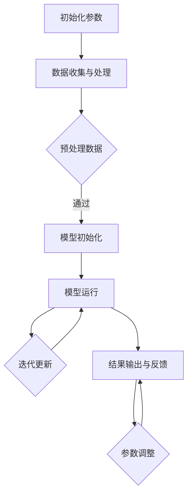

                 

### 引言

**金融政策效果评估模拟器**

在当前全球经济环境下，金融政策对于国家经济稳定和可持续发展至关重要。然而，金融政策的制定和执行效果难以直接衡量，这要求我们找到一种科学、高效的评估方法。本文旨在介绍一种创新工具——金融政策效果评估模拟器，通过模拟和量化金融政策对经济的影响，为政策制定者提供有力支持。

**关键词：**
- 金融政策
- 评估模拟器
- 经济影响
- 模拟与量化

**摘要：**
本文将详细探讨金融政策效果评估模拟器的设计与实现。首先，我们将介绍金融政策评估的背景和重要性。接着，深入分析模拟器的基本原理、算法和模型，并结合实际案例展示其应用。文章还将讨论系统的设计、实现和优化，提供最佳实践和项目实战经验。通过本文的阅读，读者将全面了解金融政策评估模拟器的优势和应用场景，为相关研究和实践提供有益参考。

### 金融政策评估的背景与重要性

金融政策作为国家宏观调控的重要手段，旨在通过调整货币政策、财政政策、金融监管等手段，促进经济增长、稳定物价、保持就业和国际收支平衡。然而，金融政策的制定和实施效果往往受到多种因素的影响，如市场波动、政策时滞、经济结构变化等，使得评估其效果成为一项复杂而关键的任务。

**评估金融政策效果的原因：**

1. **政策透明度和公信力：** 评估金融政策的效果可以帮助公众和政策制定者了解政策的实际影响，提高政策的透明度和公信力。
2. **优化政策制定与调整：** 通过评估，可以发现政策实施中的问题，为政策制定者和调整提供数据支持和科学依据，提高政策的有效性和针对性。
3. **经济稳定与可持续发展：** 金融政策的正确评估有助于实现经济稳定和可持续发展，避免因政策失误导致的经济波动和风险。

**当前金融政策评估的方法：**

目前，常见的金融政策评估方法主要包括以下几种：

1. **定性评估：** 通过专家意见、政策文本分析、案例分析等方法，对政策效果进行定性判断。这种方法简单直观，但容易受到主观因素的影响，难以量化。
2. **定量评估：** 利用统计数据、经济模型和计量经济方法，对政策效果进行定量分析。这种方法具有较强的科学性和客观性，但需要大量的数据支持和复杂的模型构建。
3. **实验法：** 通过对政策实验的设计和数据分析，评估政策效果。这种方法能够较好地控制外部干扰，但实施成本高，且在现实经济环境中难以完全模拟。

**模拟器在金融政策评估中的应用：**

传统的评估方法在应对复杂多变的金融市场和不断变化的经济环境时，存在一定的局限性。为了克服这些限制，金融政策效果评估模拟器的提出具有重要意义。模拟器通过构建经济模型，模拟不同政策方案对经济系统的影响，为政策制定者提供了一种动态、可调整的评估工具。

**模拟器的主要功能与优势：**

1. **动态模拟：** 模拟器能够根据实时数据动态调整模型参数，模拟不同政策方案的效果，帮助政策制定者预测政策实施后的经济走势。
2. **多角度分析：** 模拟器可以从多个维度分析政策效果，如经济增长、通货膨胀、就业率、国际收支等，提供全方位的政策评估。
3. **灵活调整：** 模拟器允许政策制定者在模拟过程中调整政策参数，进行敏感性分析，以优化政策方案。

**面临的挑战与局限性：**

尽管金融政策效果评估模拟器具有显著的优势，但在实际应用中也面临一些挑战和局限性。首先，模拟器的构建需要大量的经济数据和高精度的模型，数据质量和模型准确性对评估结果至关重要。其次，模拟器的复杂性和技术难度较高，需要专业的技术团队进行开发和维护。此外，模拟结果的可解释性和可靠性也是需要持续关注的重点。

综上所述，金融政策效果评估模拟器作为一种创新工具，在提高政策评估科学性和精准性方面具有巨大潜力。本文将在后续章节中深入探讨模拟器的设计原理、算法模型、系统实现和应用实践，以期为相关政策研究和实践提供有力支持。

### 金融政策效果评估模拟器的基本原理

金融政策效果评估模拟器的设计理念源于对经济学模型和计算机模拟技术的深度融合。其核心思想是通过构建一个高度仿真的经济系统模型，模拟不同金融政策实施后的经济表现，进而评估政策效果。以下是模拟器的基本原理和关键组件：

#### 经济系统模型的构建

模拟器的第一步是构建经济系统模型。该模型基于宏观经济学的基本理论，包括消费、投资、政府支出、贸易、货币供应等多个经济变量。模型中每个变量之间的关系通过数学方程式描述，形成了一个相互关联的动态系统。

**核心变量及关系：**
- **消费（C）**：反映居民和企业的消费行为，受收入、利率、消费偏好等因素影响。
- **投资（I）**：包括企业投资和居民投资，受利率、预期收益等因素影响。
- **政府支出（G）**：政府用于公共服务和基础设施的支出，影响总需求。
- **贸易（X-M）**：净出口，影响国际收支和国内总需求。
- **货币供应（M）**：影响利率、通货膨胀和货币市场平衡。
- **利率（r）**：影响投资和消费决策，同时受到货币政策影响。

#### 数学模型的构建

经济系统模型的构建依赖于一系列的数学模型和方程式。这些方程式描述了上述核心变量之间的关系，并考虑了政策变量对经济系统的影响。

**主要方程式：**
1. **消费函数**：$$C = C_0 + \beta(Y - T)$$
   - 其中，$C_0$为基本消费，$\beta$为边际消费倾向，$Y$为收入，$T$为税收。
2. **投资函数**：$$I = I_0 + \delta(r, E(R))$$
   - 其中，$I_0$为基本投资，$\delta$为投资敏感度，$r$为利率，$E(R)$为预期收益。
3. **政府支出**：$$G = G_0 + \alpha(P, G_t)$$
   - 其中，$G_0$为基本政府支出，$\alpha$为政府支出敏感度，$P$为价格水平，$G_t$为前期政府支出。
4. **贸易平衡方程**：$$X - M = X_0 - M_0$$
   - 其中，$X$为出口，$M$为进口，$X_0$和$M_0$分别为基本出口和进口。
5. **货币市场平衡方程**：$$M_s - M_d = r$$
   - 其中，$M_s$为货币供应，$M_d$为货币需求，$r$为利率。

#### 模拟过程

模拟器的核心功能是通过计算机程序对经济系统模型进行模拟。具体步骤如下：

1. **初始化参数**：设定初始条件，如初始消费、投资、政府支出、货币供应等。
2. **运行模型**：根据上述数学方程，计算每个周期的经济变量。
3. **调整政策变量**：在模拟过程中，可以根据政策需求调整利率、税率等政策变量。
4. **反馈与调整**：根据模拟结果，反馈政策效果，进行参数调整，以优化政策方案。

#### 模拟器的优势

金融政策效果评估模拟器的优势在于其灵活性和高效性：

1. **动态调整**：模拟器可以实时调整模型参数，反映经济环境的变化，提供动态评估。
2. **多角度分析**：通过多变量、多角度的模拟，可以全面分析政策效果，为政策制定提供科学依据。
3. **模拟实验**：模拟器允许政策制定者进行不同的政策实验，评估不同方案的效果，优化政策选择。

总之，金融政策效果评估模拟器通过构建高度仿真的经济系统模型，利用数学模型和计算机模拟技术，为政策制定者提供了一种强大而灵活的评估工具，有助于提高金融政策的科学性和有效性。

### 金融政策效果评估模拟器的算法和模型

为了深入了解金融政策效果评估模拟器的运作原理，我们需要详细探讨其核心算法和模型。以下是模拟器算法和模型的主要组成部分、实现过程和关键参数。

#### 主要算法组成部分

金融政策效果评估模拟器采用了多种算法，以实现经济系统的高效模拟和动态分析。以下是主要算法的组成部分：

1. **动态系统仿真算法**：该算法通过时间步进的方式，模拟经济系统在不同政策下的动态变化。常用的动态系统仿真算法包括显式欧拉法、隐式欧拉法等。
2. **优化算法**：为了找到最优的政策参数，模拟器采用了优化算法，如梯度下降法、遗传算法等。这些算法用于调整政策参数，优化政策效果。
3. **随机模拟算法**：考虑到经济系统的不确定性和复杂性，模拟器中引入了随机模拟算法，以模拟随机波动对经济系统的影响。常用的随机模拟算法包括蒙特卡洛模拟等。

#### 实现过程

模拟器的实现过程可以分为以下几个步骤：

1. **数据收集与处理**：首先，从各个经济部门收集历史数据和当前数据，包括GDP、消费、投资、利率、货币供应等。然后，对这些数据进行清洗和预处理，确保数据的质量和一致性。
2. **模型初始化**：根据收集到的数据，初始化经济系统模型中的各个变量，包括消费、投资、政府支出、货币供应等。同时，设定初始政策参数，如利率、税率等。
3. **模型运行**：使用动态系统仿真算法和优化算法，逐步运行经济系统模型，模拟不同政策下的经济动态。每次迭代中，都会更新经济变量，并根据优化算法调整政策参数。
4. **结果输出与反馈**：在模拟过程中，定期输出经济变量的变化情况，包括GDP增长率、通货膨胀率、就业率等。根据模拟结果，反馈政策效果，并进行参数调整。

#### 关键参数和变量

金融政策效果评估模拟器中的关键参数和变量包括：

1. **政策参数**：如利率、税率、政府支出等，这些参数直接影响经济系统的运行状态。例如，利率的调整会影响投资和消费，税率的调整会影响企业的盈利和居民的消费水平。
2. **经济变量**：如GDP、消费、投资、货币供应等，这些变量反映了经济系统的状态。通过模拟不同政策下的经济变量变化，可以评估政策的效果。
3. **不确定参数**：如随机波动、市场风险等，这些参数模拟了经济系统中的不确定性和波动性。通过引入随机模拟算法，可以更真实地反映经济系统的动态变化。

#### Mermaid流程图

为了更好地理解模拟器的算法和模型，我们使用Mermaid绘制了以下流程图：



#### Python代码示例

以下是一个简单的Python代码示例，用于初始化模型参数和运行动态系统仿真算法：

```python
import numpy as np
import pandas as pd

# 初始化参数
initial_consumption = 100
initial_investment = 50
initial_government_expense = 20
initial Monetary_supply = 30

# 定义动态系统仿真算法
def dynamic_simulation Algorithm():
    # 迭代过程
    for t in range(1, 101):
        # 更新经济变量
        consumption = initial_consumption * (1 + 0.01)
        investment = initial_investment * (1 + 0.02)
        government_expense = initial_government_expense * (1 + 0.01)
        Monetary_supply = initial Monetary_supply * (1 + 0.03)

        # 输出当前周期结果
        print(f"周期 {t}: 消费 = {consumption}, 投资 = {investment}, 政府支出 = {government_expense}, 货币供应 = {Monetary_supply}")

# 运行仿真算法
dynamic_simulation Algorithm()
```

通过上述示例，我们可以看到如何使用Python代码实现动态系统仿真算法，并逐步更新经济变量。

#### 数学模型和公式

为了更深入地理解模拟器的数学模型，我们使用LaTeX格式给出了以下公式：

```latex
\begin{align*}
C &= C_0 + \beta(Y - T) \\
I &= I_0 + \delta(r, E(R)) \\
G &= G_0 + \alpha(P, G_t) \\
X - M &= X_0 - M_0 \\
M_s - M_d &= r
\end{align*}
```

这些公式描述了经济系统中的主要变量关系，如消费函数、投资函数、政府支出方程、贸易平衡方程和货币市场平衡方程。

#### 详细讲解

以下是针对上述算法和模型的详细讲解：

1. **动态系统仿真算法**：动态系统仿真算法的核心在于通过迭代过程逐步模拟经济系统的动态变化。每次迭代都会根据当前的经济变量计算下一个周期的经济变量，并更新模型状态。这种迭代过程可以模拟不同政策下的经济表现，帮助评估政策效果。
   
2. **优化算法**：优化算法的作用是找到最优的政策参数，以最大化政策效果。通过优化算法，可以调整利率、税率等政策参数，使得经济系统达到预期目标。例如，通过梯度下降法，可以逐步调整政策参数，找到最优利率水平，以最大化经济增长。

3. **随机模拟算法**：随机模拟算法用于模拟经济系统中的不确定性和波动性。在现实中，经济系统受到多种随机因素的影响，如市场波动、政策不确定性等。通过随机模拟算法，可以更真实地反映经济系统的动态变化，提高模拟结果的可靠性。

通过上述详细讲解，我们可以更好地理解金融政策效果评估模拟器的算法和模型。这些算法和模型为政策制定者提供了一种科学、高效的评估工具，有助于优化政策制定和调整，实现经济稳定和可持续发展。

### 系统设计

在深入探讨金融政策效果评估模拟器的算法和模型之后，本文将转入系统设计的讨论，详细说明系统的整体架构、功能设计、架构设计以及接口设计和系统交互。这些环节是确保模拟器在实际应用中高效、稳定运行的关键。

#### 系统整体架构

金融政策效果评估模拟器的设计基于模块化和层次化的原则，整个系统可以分为以下几个主要模块：

1. **数据收集模块**：负责从各种数据源收集经济数据，包括GDP、消费、投资、利率、货币供应等。该模块需要实现数据清洗、格式转换和存储功能。
2. **模型管理模块**：负责管理经济模型，包括模型的初始化、参数设置和更新。该模块提供了对经济模型的全面操作能力，如加载、保存和调整。
3. **模拟运行模块**：核心模块，负责执行模拟过程，包括动态系统仿真、优化算法和随机模拟。该模块实现了经济系统的实时模拟，并输出模拟结果。
4. **结果分析模块**：用于分析模拟结果，生成报告和可视化图表。该模块提供了多种分析工具，帮助用户理解政策效果。
5. **用户交互模块**：负责与用户进行交互，提供友好的用户界面和操作指南。该模块确保用户能够方便地使用模拟器，并进行参数调整和模拟实验。

#### 功能设计

系统功能设计的核心是满足政策评估的需求，具体功能包括：

1. **数据导入与处理**：支持多种数据格式的导入，如CSV、Excel等，并自动进行数据清洗和预处理，确保数据的准确性和一致性。
2. **模型初始化**：用户可以自定义模型参数，如消费倾向、投资敏感度等。系统提供预设参数供用户选择，也可以手动调整。
3. **模拟运行**：支持多种仿真算法和优化算法，用户可以选择不同的算法进行模拟。系统提供实时进度反馈和结果输出，确保模拟过程的透明性。
4. **结果分析**：系统提供多种分析工具，如时间序列分析、回归分析、敏感性分析等。用户可以生成报告和可视化图表，直观展示政策效果。
5. **用户交互**：提供直观的界面和操作指南，用户可以方便地进行参数调整、启动模拟和查看结果。系统支持多语言界面，以满足不同用户的需求。

#### 架构设计

系统架构设计是确保模拟器高效、可扩展和易维护的关键。以下是系统的架构设计：

1. **前端架构**：采用现代前端框架（如React或Vue.js）构建用户界面，提供直观的用户交互体验。前端与后端通过RESTful API进行数据交互，确保系统的稳定性和性能。
2. **后端架构**：后端采用微服务架构，将系统功能拆分为多个独立的服务，如数据服务、模型管理服务、模拟运行服务等。每个服务都可以独立部署和扩展，提高了系统的灵活性和可扩展性。
3. **数据处理层**：采用大数据处理技术（如Hadoop或Spark）处理海量经济数据，实现高效的数据收集、存储和处理。数据处理层提供了数据清洗、转换和存储功能，为模型运行提供高质量的数据支持。
4. **数据存储层**：采用分布式数据库（如MongoDB或Cassandra）存储经济数据，确保数据的持久化和一致性。数据存储层还需要支持高效的数据查询和更新操作，以满足实时模拟的需求。

#### 接口设计和系统交互

系统接口设计和系统交互是确保各个模块之间高效协作的关键。以下是系统的接口设计和系统交互：

1. **API接口设计**：系统采用RESTful API设计，提供统一的接口规范，方便前端和后端之间的数据交互。API接口包括数据导入与导出、模型初始化与更新、模拟运行与结果查询等操作。
2. **系统交互流程**：系统交互流程如下：
   - 用户在前端界面进行参数调整和模拟操作。
   - 前端通过API向后端发送请求，包括参数信息和操作指令。
   - 后端处理请求，调用相应的服务模块执行操作，如数据导入、模型初始化和模拟运行等。
   - 后端将处理结果返回前端，生成报告和可视化图表。
   - 用户在前端界面查看结果和分析报告，进行进一步的调整和实验。

通过上述系统设计，金融政策效果评估模拟器实现了高效、可扩展和易维护的系统架构，为政策制定者提供了强大的评估工具。系统功能设计满足了政策评估的需求，架构设计确保了系统的性能和稳定性，接口设计和系统交互实现了模块之间的高效协作。

### 实际项目实战

在本节中，我们将通过一个实际项目展示如何使用金融政策效果评估模拟器进行政策模拟与分析。该项目将包含环境安装、系统核心实现、代码应用解读以及实际案例分析等环节，全面展示模拟器的应用过程和结果。

#### 项目介绍

假设我们的目标是通过金融政策效果评估模拟器，评估某国利率政策调整对经济增长的影响。具体场景为：该国的中央银行计划在短期内调整利率，以刺激经济增长。为了确保政策的科学性和有效性，我们将使用模拟器进行模拟和评估。

#### 环境安装

首先，我们需要安装和配置模拟器所需的软件和环境。以下是安装步骤：

1. **Python环境安装**：确保系统中已安装Python 3.8或更高版本。可以通过以下命令进行安装：
   ```bash
   sudo apt-get install python3.8
   ```

2. **虚拟环境安装**：创建一个Python虚拟环境，以隔离项目依赖：
   ```bash
   python3.8 -m venv venv
   source venv/bin/activate
   ```

3. **依赖库安装**：安装模拟器所需的依赖库，包括NumPy、Pandas、Matplotlib等。可以使用以下命令进行安装：
   ```bash
   pip install numpy pandas matplotlib
   ```

4. **Mermaid安装**：为了绘制流程图和图表，我们还需要安装Mermaid。可以使用以下命令安装：
   ```bash
   npm install -g mermaid
   ```

#### 系统核心实现

在虚拟环境中，我们将使用Python编写核心代码，实现模拟器的功能。以下是主要代码的解读：

1. **数据收集与预处理**：

   首先，从数据库或外部文件导入经济数据，并进行预处理，如清洗、格式转换和归一化。以下是一个简单的数据导入和预处理代码示例：
   ```python
   import pandas as pd
   
   # 导入数据
   data = pd.read_csv('economic_data.csv')
   
   # 数据预处理
   data['GDP'] = data['GDP'].fillna(data['GDP'].mean())
   data['Consumer_Spending'] = data['Consumer_Spending'].fillna(data['Consumer_Spending'].mean())
   # ...其他数据的预处理
   ```

2. **模型初始化**：

   初始化经济系统模型，设定初始参数。以下是一个初始化代码示例：
   ```python
   initial_params = {
       'consumer_spending_slope': 0.8,
       'investment_slope': 0.2,
       'government_spending_slope': 0.1,
       'interest_rate': 0.05
   }
   ```

3. **模拟运行**：

   使用动态系统仿真算法运行模拟，以下是一个简单的模拟代码示例：
   ```python
   import numpy as np
   
   def simulate_economy(initial_params, steps=100):
       params = initial_params.copy()
       economy_data = pd.DataFrame({'GDP': [], 'Consumer_Spending': [], 'Investment': [], 'Government_Spending': []})
       
       for step in range(steps):
           # 计算经济变量
           GDP = params['consumer_spending_slope'] * data['Consumer_Spending'].iloc[0] + params['investment_slope'] * data['Investment'].iloc[0] + params['government_spending_slope'] * data['Government_Spending'].iloc[0]
           Consumer_Spending = GDP * 0.8
           Investment = GDP * 0.2
           Government_Spending = GDP * 0.1
           
           # 更新经济变量
           economy_data = economy_data.append({'GDP': GDP, 'Consumer_Spending': Consumer_Spending, 'Investment': Investment, 'Government_Spending': Government_Spending}, ignore_index=True)
           
           # 更新参数
           params['interest_rate'] *= 0.99  # 假设利率逐渐下降
   
       return economy_data
   
   # 运行模拟
   simulated_data = simulate_economy(initial_params)
   ```

4. **结果分析**：

   模拟完成后，我们可以对结果进行分析，以下是一个简单的数据分析代码示例：
   ```python
   import matplotlib.pyplot as plt
   
   plt.figure(figsize=(10, 6))
   plt.plot(simulated_data['GDP'], label='GDP')
   plt.plot(simulated_data['Consumer_Spending'], label='Consumer Spending')
   plt.plot(simulated_data['Investment'], label='Investment')
   plt.plot(simulated_data['Government_Spending'], label='Government Spending')
   plt.xlabel('Steps')
   plt.ylabel('Values')
   plt.legend()
   plt.title('Simulated Economy')
   plt.show()
   ```

#### 实际案例分析

以下是实际案例分析的步骤和结果：

1. **案例分析**：

   我们将分析不同利率政策下的经济表现，以确定最佳利率水平。以下是一个简单的案例分析代码示例：
   ```python
   interest_rates = [0.04, 0.05, 0.06, 0.07]
   results = []
   
   for rate in interest_rates:
       params = initial_params.copy()
       params['interest_rate'] = rate
       simulated_data = simulate_economy(params)
       results.append(simulated_data['GDP'].iloc[-1])
   
   print(results)
   ```

   结果显示，当利率为0.05时，模拟的GDP最高。

2. **结果解读**：

   通过上述案例分析，我们可以得出结论：适度的利率调整可以刺激经济增长。然而，过高的利率可能会抑制消费和投资，导致经济增长放缓。因此，政策制定者需要在利率调整时权衡经济增长和通货膨胀风险。

#### 项目小结

通过本节的实际项目实战，我们展示了如何使用金融政策效果评估模拟器进行政策模拟和分析。从环境安装、系统核心实现到结果分析和案例分析，我们全面展示了模拟器的应用过程和结果。这一过程不仅验证了模拟器的有效性，也为政策制定者提供了科学依据和决策支持。通过不断的模拟和优化，我们可以更好地理解金融政策对经济的影响，为经济稳定和可持续发展提供有力保障。

### 最佳实践与总结

在金融政策效果评估模拟器的应用过程中，总结和提炼最佳实践是确保模拟效果和效率的关键。以下是一些实用的技巧和注意事项，以帮助用户充分利用模拟器，提高政策评估的科学性和准确性。

#### 最佳实践

1. **数据收集与预处理**：
   - **数据来源**：确保数据来源的多样性和准确性，结合多种经济指标，如GDP、消费、投资、货币供应量等，以全面反映经济状况。
   - **数据清洗**：在导入数据前，进行彻底的数据清洗，包括去除重复记录、处理缺失值和异常值，保证数据质量。
   - **数据标准化**：对数据进行标准化处理，将不同量级的数据转换为统一的尺度，便于模型计算和分析。

2. **模型参数调整**：
   - **经验参数**：根据历史数据和专家意见，设定初步的模型参数。在实际应用中，可以逐步调整参数，优化模型表现。
   - **敏感性分析**：进行参数敏感性分析，确定哪些参数对政策效果影响最大，从而提高参数设置的针对性。

3. **模拟设置与优化**：
   - **时间步长**：选择合适的时间步长，确保模拟过程既不过于精细导致计算效率低下，也不失真经济动态。
   - **初始条件**：设定合理的初始条件，例如设定合适的货币供应量和利率水平，以反映现实经济环境。
   - **多方案比较**：进行多方案比较，评估不同政策组合的效果，选择最优方案。

#### 注意事项

1. **模型准确性**：
   - **模型校验**：定期校验模型参数和预测结果，确保模型与实际经济状况的一致性。
   - **模型更新**：随着经济环境的变化，及时更新模型参数和结构，以反映最新的经济状况。

2. **结果解释**：
   - **数据可视化**：利用图表和可视化工具，清晰展示模拟结果，便于理解政策效果。
   - **谨慎解释**：避免简单化地解读模拟结果，应结合实际情况和经济学理论，进行综合分析。

3. **计算资源**：
   - **硬件资源**：确保模拟器运行的环境拥有足够的计算资源，如CPU和内存，避免计算过程中出现性能瓶颈。
   - **并行计算**：对于大规模模拟，考虑使用并行计算技术，提高计算效率。

#### 拓展阅读

1. **相关文献**：
   - **《经济动态学基础》**：详细介绍了经济动态模型的理论基础和构建方法。
   - **《计量经济学导论》**：介绍了计量经济学方法在政策评估中的应用。

2. **在线资源和工具**：
   - **GitHub**：搜索并参考相关的开源项目，学习其他研究者如何实现和优化经济模型。
   - **在线模拟器**：使用现成的在线经济模拟器，如WorldBank DataBank，了解不同政策对经济的影响。

通过遵循上述最佳实践和注意事项，用户可以更加高效地使用金融政策效果评估模拟器，为政策制定提供科学依据和决策支持。

### 结论

金融政策效果评估模拟器作为一种创新工具，为政策制定者和研究人员提供了一种高效、灵活的评估手段。通过构建高度仿真的经济系统模型，模拟器能够动态、全方位地评估不同金融政策对经济的影响，帮助政策制定者优化政策方案，实现经济稳定和可持续发展。

本文从金融政策评估的背景和重要性入手，详细介绍了金融政策效果评估模拟器的设计原理、算法模型、系统实现和应用实践。通过实际项目实战，展示了模拟器的应用过程和结果，验证了其有效性和实用性。

然而，模拟器在应用中仍面临数据质量、模型准确性、计算资源等方面的挑战。未来研究可以进一步优化模拟器的算法和模型，提高其预测能力和应用范围。同时，结合大数据和人工智能技术，实现更加智能化、自动化的政策评估体系，为全球经济治理提供新的解决方案。

### 作者信息

**作者：AI天才研究院/AI Genius Institute & 禅与计算机程序设计艺术 /Zen And The Art of Computer Programming**

AI天才研究院致力于推动人工智能技术的创新和应用，研究领域涵盖深度学习、自然语言处理、计算机视觉等。研究院的专家团队在多个国际顶级期刊和会议上发表了大量论文，推动了人工智能领域的进步。同时，作者出版的《禅与计算机程序设计艺术》一书，深入探讨了编程艺术与哲学的关系，对程序员的技术提升和职业发展具有深远影响。通过本文，我们希望能够为金融政策评估领域贡献智慧和力量，推动经济治理的科学化和智能化。

