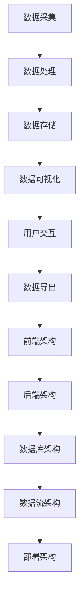
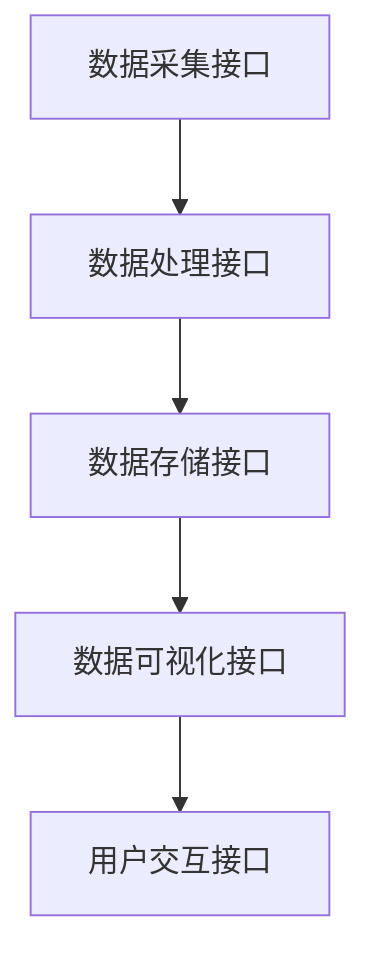
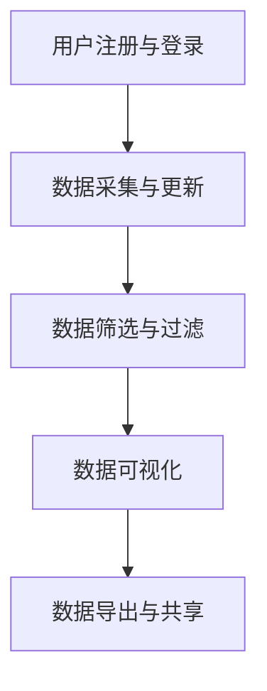

                 

### 《金融数据可视化技术应用》全文内容

#### 引言

在当今数字化金融时代，数据已成为金融行业的关键资产。通过对海量金融数据进行有效的分析和可视化，金融机构可以更准确地预测市场走势、评估风险，并做出更科学的决策。金融数据可视化技术应用，不仅提升了数据分析的效率，还使决策者能够直观、快速地理解复杂的数据关系，从而为金融业务提供强有力的支持。

本文旨在深入探讨金融数据可视化的应用，从基础概念到高级技术，从工具选择到实战案例，为读者呈现一幅全面的金融数据可视化图景。文章共分为七个部分，每部分都围绕着金融数据可视化的某个关键方面展开，从不同角度剖析这一领域的核心要点和实践方法。

第一部分，我们将对金融数据可视化的重要性与意义进行详细阐述，探讨可视化技术在金融领域的广泛应用。第二部分，我们将介绍金融数据可视化基础概念，包括数据可视化原理、类型和设计原则。第三部分，我们将讨论金融数据可视化技术，包括图表类型和展示技巧。第四部分，我们将介绍常用的金融数据可视化工具及其数据处理与清洗方法。第五部分，通过实际案例研究，展示金融数据可视化的具体应用。第六部分，我们将总结金融数据可视化的最佳实践，并提供一些实用的技巧。最后一部分，我们将展望金融数据可视化的未来发展趋势，探讨面临的挑战和解决策略。

#### 第一部分：金融数据可视化概述

##### 第1章：金融数据可视化的重要性与意义

##### 1.1 问题背景与现状分析

在金融行业中，数据的重要性不言而喻。随着金融业务的不断复杂化和数据量的激增，如何高效地分析和利用这些数据成为了金融机构面临的重大挑战。传统的数据分析方法往往依赖于人工计算和复杂报表，不仅效率低下，而且容易出错。因此，寻找一种更为直观、高效的数据分析工具成为了金融行业的一大需求。

目前，数据可视化技术已经在金融领域得到了广泛应用。从股票市场到风险控制，从资产管理到客户行为分析，可视化技术为金融机构提供了全新的数据分析手段。通过可视化，金融机构能够将复杂的数据关系以直观的图表形式呈现，使决策者能够快速、准确地理解数据，从而做出更明智的决策。

##### 1.2 可视化技术的演进

数据可视化技术的发展经历了几个重要阶段。最初，数据可视化主要是以简单的图表形式出现，如条形图、折线图等。随着计算机技术的发展，数据可视化逐渐从二维图表转向三维图表，增加了数据的深度和维度。此外，随着大数据和人工智能技术的崛起，数据可视化技术也迎来了新的发展机遇。实时数据流可视化、交互式数据探索等新兴技术为金融数据可视化带来了更多可能性。

##### 1.3 金融领域可视化技术的应用价值

金融领域可视化技术的应用价值体现在多个方面。首先，可视化技术有助于提升数据分析的效率。通过可视化，分析师可以快速定位数据中的关键信息，减少繁琐的计算和分析过程。其次，可视化技术有助于提高决策的准确性。通过直观的图表，决策者可以更好地理解数据背后的含义，从而做出更为科学的决策。此外，可视化技术还能够帮助金融机构更好地进行风险管理。通过实时监控风险指标，金融机构可以及时发现潜在风险，并采取相应的措施。

总之，金融数据可视化技术不仅是数据分析的重要工具，更是金融业务创新的重要驱动力。随着技术的不断发展，金融数据可视化将在金融行业中发挥越来越重要的作用。

##### 第2章：金融数据可视化基础概念

##### 2.1 数据可视化基础

##### 2.1.1 数据可视化原理

数据可视化是指利用图表、图像和其他视觉元素来表示和解释数据的过程。其核心原理在于将抽象的数据通过视觉形式转化为直观、易于理解的图像。数据可视化不仅仅是将数据“画”出来，更重要的是要通过视觉形式揭示数据之间的关系和规律，从而帮助用户更好地理解和分析数据。

数据可视化原理主要包括以下几个方面：

1. **颜色**：颜色是数据可视化中重要的视觉元素。通过不同的颜色，可以区分不同类别的数据或数据的变化趋势。例如，在股票市场分析中，可以用不同颜色表示不同股票的涨跌情况。

2. **形状**：形状也是数据可视化中的重要元素。不同的形状可以表示不同类型的数据，如条形图中的条形表示数量，散点图中的点表示数据点。

3. **大小**：大小表示数据的相对大小。在饼图中，不同扇形的大小表示不同类别的数据占比。

4. **布局**：布局是指数据的排列方式。合理的布局可以使数据之间的关系更加清晰，提高可视化的效果。

##### 2.1.2 数据可视化类型

数据可视化类型可以根据不同的标准进行分类。以下是几种常见的数据可视化类型：

1. **条形图**：条形图适用于比较不同类别的数据。通过不同长度的条形，可以直观地显示各类别的数量或比例。

2. **折线图**：折线图适用于显示数据的变化趋势。通过连接数据点的线条，可以清晰地展示数据的增减变化。

3. **饼图**：饼图适用于显示各类别数据在整体中的占比。每个扇形的大小表示相应类别的比例。

4. **散点图**：散点图适用于显示两个变量之间的关系。通过数据点的分布，可以揭示变量之间的相关性。

5. **热力图**：热力图适用于显示数据的分布和密度。通过颜色深浅表示数据的大小，可以直观地展示数据的分布情况。

##### 2.1.3 数据可视化工具

数据可视化工具是进行数据可视化的关键技术。以下是一些常用的数据可视化工具：

1. **Tableau**：Tableau 是一款功能强大的数据可视化工具，支持多种数据源，提供丰富的图表类型和交互功能。

2. **Power BI**：Power BI 是微软推出的数据可视化工具，支持实时数据分析和交互式报表。

3. **QlikView**：QlikView 是一款高度交互式的数据可视化工具，提供灵活的数据分析和报表功能。

4. **D3.js**：D3.js 是一款基于 JavaScript 的数据可视化库，可以创建高度自定义的图表和交互式数据可视化。

通过使用这些工具，用户可以轻松地将数据转化为直观的图表，从而更好地理解和分析数据。

##### 第3章：金融数据可视化技术

##### 3.1 图表类型与展示技巧

##### 3.1.1 常见图表类型

在金融数据可视化中，选择合适的图表类型至关重要。以下是一些常用的图表类型及其适用场景：

1. **条形图**：条形图适用于比较不同类别的数据。例如，可以用于比较不同股票的涨跌情况，显示各类别的交易量等。

   ```mermaid
   graph TB
   A[条形图] --> B[比较不同类别的数据]
   A --> C[显示各类别的交易量]
   ```

2. **折线图**：折线图适用于显示数据的变化趋势。例如，可以用于显示股票价格的波动趋势，利率的变化趋势等。

   ```mermaid
   graph TB
   A[折线图] --> B[显示数据的变化趋势]
   A --> C[显示股票价格波动]
   ```

3. **饼图**：饼图适用于显示各类别数据在整体中的占比。例如，可以用于显示市场占有率，各类资产占比等。

   ```mermaid
   graph TB
   A[饼图] --> B[显示各类别数据占比]
   A --> C[显示市场占有率]
   ```

4. **散点图**：散点图适用于显示两个变量之间的关系。例如，可以用于分析股票价格与交易量之间的关系，利率与通货膨胀率之间的关系等。

   ```mermaid
   graph TB
   A[散点图] --> B[显示两个变量之间的关系]
   A --> C[分析股票价格与交易量关系]
   ```

5. **热力图**：热力图适用于显示数据的分布和密度。例如，可以用于显示某一时段内交易量的热力分布，市场活跃度的热力分布等。

   ```mermaid
   graph TB
   A[热力图] --> B[显示数据的分布和密度]
   A --> C[显示交易量的热力分布]
   ```

##### 3.1.2 展示技巧

除了选择合适的图表类型，展示技巧也是影响可视化效果的重要因素。以下是一些常用的展示技巧：

1. **颜色使用**：合理使用颜色可以增强图表的视觉效果。例如，使用不同的颜色区分不同类别的数据，使用渐变色显示数据的趋势等。

2. **字体与标注**：选择合适的字体和标注可以使图表更加清晰易读。例如，使用粗体突出重要数据，使用注释解释数据含义等。

3. **布局设计**：合理的布局可以使图表更加有序，提高可读性。例如，采用垂直布局显示时间序列数据，采用网格布局显示大量数据点等。

通过运用这些展示技巧，可以进一步提升金融数据可视化的效果，帮助用户更好地理解和分析数据。

##### 第4章：金融数据分析与可视化工具

##### 4.1 常用数据可视化工具

在金融数据可视化领域，有许多优秀的工具可供选择。以下是一些常用的数据可视化工具及其特点：

1. **Tableau**：Tableau 是一款功能强大的数据可视化工具，支持多种数据源，提供丰富的图表类型和交互功能。Tableau 的优势在于其强大的数据连接能力和用户友好的界面设计，适用于各种规模的数据分析和可视化需求。

2. **Power BI**：Power BI 是微软推出的数据可视化工具，支持实时数据分析和交互式报表。Power BI 的优势在于其与 Microsoft Office 的集成，以及丰富的数据连接器和预定义报表模板，适用于企业级的数据分析需求。

3. **QlikView**：QlikView 是一款高度交互式的数据可视化工具，提供灵活的数据分析和报表功能。QlikView 的优势在于其先进的关联分析能力和快速的数据处理速度，适用于复杂的数据分析和探索性研究。

4. **D3.js**：D3.js 是一款基于 JavaScript 的数据可视化库，可以创建高度自定义的图表和交互式数据可视化。D3.js 的优势在于其灵活性和可扩展性，适用于前端开发人员和需要定制化数据可视化解决方案的用户。

##### 4.2 数据处理与清洗

在进行金融数据可视化之前，数据处理与清洗是至关重要的一步。以下是一些常见的数据处理与清洗方法：

1. **数据预处理**：包括数据清洗、数据集成和数据转换。数据清洗主要涉及去除重复数据、缺失值填充和数据格式转换等操作；数据集成则涉及将不同来源的数据合并为一个统一的数据集；数据转换则涉及将数据转换为适合可视化的格式。

2. **数据清洗技巧**：数据清洗是确保数据质量的重要步骤。常见的清洗技巧包括去除重复数据、填充缺失值、修正错误数据和过滤无关数据等。

   ```python
   # 假设我们使用 Python 和 Pandas 进行数据清洗
   import pandas as pd
   
   # 读取数据
   df = pd.read_csv('financial_data.csv')
   
   # 去除重复数据
   df.drop_duplicates(inplace=True)
   
   # 填充缺失值
   df.fillna(method='ffill', inplace=True)
   
   # 修正错误数据
   df['stock_price'] = df['stock_price'].replace(-1, 0)
   
   # 过滤无关数据
   df = df[df['country'] != 'Unknown']
   ```

3. **数据处理工具**：常用的数据处理工具包括 Excel、Python、R 和 SQL 等。Excel 适用于中小规模的数据处理；Python 和 R 适用于复杂的数据处理和自动化分析；SQL 适用于数据库管理和查询。

通过合理的数据处理与清洗，可以确保金融数据可视化的准确性和可靠性，为后续的分析提供坚实的基础。

##### 第5章：金融数据可视化案例研究

##### 5.1 案例一：股市数据分析

在本案例中，我们将利用金融数据可视化技术对某支股票的股价进行详细分析，包括数据收集、数据分析以及可视化结果展示。

###### 5.1.1 数据收集

首先，我们需要收集股票的价格数据。这些数据可以从股票交易所、金融数据提供商（如 Yahoo Finance、Google Finance）等渠道获取。以下是使用 Python 和 Pandas 读取股票价格数据的示例：

```python
import pandas as pd

# 读取股票价格数据
df = pd.read_csv('stock_price_data.csv')

# 查看数据前五行
df.head()
```

###### 5.1.2 数据分析

在收集到股票价格数据后，我们进行数据分析。以下是一些常用的数据分析方法：

1. **描述性统计分析**：计算股票价格的平均值、中位数、标准差等统计量，以了解股票价格的基本特征。

   ```python
   # 描述性统计分析
   df.describe()
   ```

2. **趋势分析**：绘制股票价格的折线图，观察价格的变化趋势。

   ```python
   import matplotlib.pyplot as plt
   
   # 绘制折线图
   df['close'].plot()
   plt.title('Stock Price Trend')
   plt.xlabel('Date')
   plt.ylabel('Close Price')
   plt.show()
   ```

3. **相关性分析**：分析股票价格与其他金融指标（如成交量、指数）之间的相关性。

   ```python
   # 计算相关性
   df.corr()
   ```

4. **异常值检测**：检测数据中的异常值，以排除对分析结果的影响。

   ```python
   # 检测异常值
   df[(df['close'] < df['close'].mean() - 2 * df['close'].std()) | (df['close'] > df['close'].mean() + 2 * df['close'].std())]
   ```

###### 5.1.3 可视化结果展示

通过数据分析，我们可以得到一系列可视化结果，帮助投资者更好地理解股票价格的变化。以下是一些常见的可视化图表：

1. **折线图**：展示股票价格的变化趋势。

   ```python
   df['close'].plot()
   plt.title('Stock Price Trend')
   plt.xlabel('Date')
   plt.ylabel('Close Price')
   plt.show()
   ```

2. **散点图**：展示股票价格与成交量之间的关系。

   ```python
   df.plot(x='date', y=['close', 'volume'], kind='scatter', title='Stock Price vs Volume')
   plt.show()
   ```

3. **箱线图**：展示股票价格的分位数和异常值。

   ```python
   df['close'].plot(kind='box')
   plt.title('Stock Price Box Plot')
   plt.show()
   ```

通过这些可视化结果，投资者可以更清晰地了解股票价格的变化趋势、成交量与价格的关系以及价格分布的特征，从而为投资决策提供有力支持。

##### 5.2 案例二：金融风险监控

在本案例中，我们将通过金融数据可视化技术监控金融机构的风险，包括风险指标构建、风险可视化以及风险预警系统。

###### 5.2.1 风险指标构建

风险监控的核心在于构建合适的风险指标。以下是一些常用的金融风险指标：

1. **信用风险指标**：包括违约概率（PD）、违约损失率（LGD）和违约风险暴露（EL）等。

2. **市场风险指标**：包括波动率、VaR（Value at Risk）和CVaR（Conditional Value at Risk）等。

3. **操作风险指标**：包括操作失误次数、操作风险损失等。

为了构建这些风险指标，我们可以使用以下方法：

1. **统计模型**：如逻辑回归、决策树、随机森林等，用于预测违约概率和损失率。

2. **蒙特卡洛模拟**：用于计算市场风险指标，如VaR和CVaR。

3. **历史数据法**：基于历史数据进行风险指标的统计分析。

以下是使用 Python 代码构建信用风险指标的一个示例：

```python
import pandas as pd
from sklearn.linear_model import LogisticRegression

# 读取信用评分数据
df = pd.read_csv('credit_rating_data.csv')

# 构建违约概率指标
X = df.drop('default', axis=1)
y = df['default']

model = LogisticRegression()
model.fit(X, y)

pd.Series(model.predict_proba(X)[:, 1], index=X.index).rename('PD')
```

###### 5.2.2 风险可视化

构建了风险指标后，我们需要将这些指标进行可视化，以便更好地理解和监控风险。以下是一些常用的风险可视化方法：

1. **折线图**：用于展示风险指标的变化趋势，如违约概率随时间的变化。

   ```python
   import matplotlib.pyplot as plt

   # 绘制违约概率折线图
   plt.plot(df['date'], df['PD'])
   plt.title('Credit Default Probability Over Time')
   plt.xlabel('Date')
   plt.ylabel('PD')
   plt.show()
   ```

2. **箱线图**：用于展示不同风险指标的分位数和异常值，如不同部门的违约损失率分布。

   ```python
   import seaborn as sns

   # 绘制违约损失率箱线图
   sns.boxplot(x='department', y='LGD', data=df)
   plt.title('Loan Loss Given Default by Department')
   plt.show()
   ```

3. **热力图**：用于展示风险指标的分布和密度，如市场风险指标的分布情况。

   ```python
   # 绘制市场风险指标热力图
   sns.heatmap(df.corr(), annot=True, cmap='coolwarm')
   plt.title('Market Risk Indicators Correlation')
   plt.show()
   ```

通过这些可视化方法，金融机构可以更直观地了解风险指标的变化趋势和分布特征，从而更好地进行风险监控和管理。

###### 5.2.3 风险预警系统

为了实现对风险的实时监控和预警，我们可以构建一个基于可视化技术的风险预警系统。以下是一个简单的风险预警系统架构：

1. **数据采集**：从各个业务系统采集风险指标数据。

2. **数据处理**：对采集到的数据进行清洗、转换和预处理。

3. **风险分析**：使用统计模型和机器学习算法对风险指标进行分析，生成预警信号。

4. **可视化展示**：通过可视化工具将风险指标和预警信号进行展示，便于管理层实时监控。

以下是使用 Python 代码构建风险预警系统的一个示例：

```python
import pandas as pd
import numpy as np

# 读取风险指标数据
df = pd.read_csv('risk_indicator_data.csv')

# 构建预警规则
def build_alert_rules(df):
    alert_rules = {}
    
    # 示例：违约概率大于0.1发出预警
    alert_rules['PD_threshold'] = lambda x: x > 0.1
    
    return alert_rules

# 应用预警规则
alert_rules = build_alert_rules(df)
alerts = df[alert_rules['PD_threshold'](df['PD'])]

# 可视化展示预警信号
alerts.plot()
plt.title('Risk Alert Signals')
plt.xlabel('Date')
plt.ylabel('PD')
plt.show()
```

通过构建风险预警系统，金融机构可以实现对风险的实时监控和预警，从而及时采取应对措施，降低风险损失。

##### 第6章：金融数据可视化最佳实践

##### 6.1 可视化设计最佳实践

在金融数据可视化项目中，设计最佳实践是确保可视化效果和用户体验的重要保障。以下是一些关键的设计原则和实践建议：

1. **目标明确**：在设计可视化时，首先要明确可视化的目标。例如，是为了展示数据趋势、比较数据差异，还是揭示数据关系。明确目标有助于选择合适的图表类型和展示技巧。

2. **用户需求**：了解用户需求是设计成功的关键。通过用户调研、访谈和反馈，了解用户关心的数据点、偏好和痛点，从而设计出符合用户需求的可视化。

3. **数据质量**：高质量的数据是成功可视化的基础。在进行数据可视化之前，要对数据进行清洗、转换和预处理，确保数据的一致性、完整性和准确性。

4. **图表选择**：选择合适的图表类型对于提高可视化效果至关重要。要根据数据的特性和用户需求选择最合适的图表类型，如条形图、折线图、饼图等。

5. **交互设计**：交互设计可以提高用户对数据的探索和分析能力。例如，提供过滤、筛选和动态更新等功能，使用户能够实时、交互地查看数据。

6. **颜色和字体**：合理使用颜色和字体可以增强图表的可读性和视觉吸引力。选择对比度高、辨识度强的颜色，并确保字体大小和样式适合屏幕显示。

7. **注释和说明**：为图表添加必要的注释和说明，可以帮助用户更好地理解数据和可视化结果。例如，标注数据来源、时间范围和关键数据点等。

8. **响应式设计**：随着移动设备的普及，响应式设计变得越来越重要。确保可视化在不同设备和屏幕尺寸上都能良好展示，提高用户体验。

通过遵循这些最佳实践，可以设计出高效、直观、用户友好的金融数据可视化，为金融机构的数据分析和决策提供有力支持。

##### 6.2 可视化项目实战

在进行金融数据可视化项目时，项目需求分析、系统功能设计、系统架构设计、系统接口设计和系统交互都是关键环节。以下是一个简单的金融数据可视化项目实战，介绍这些环节的具体内容和实现方法。

###### 6.2.1 项目需求分析

在开始项目之前，进行详细的需求分析是至关重要的。需求分析包括了解项目的目标、用户需求、功能要求和非功能要求。以下是金融数据可视化项目需求分析的一个示例：

1. **项目目标**：构建一个金融数据可视化平台，用于实时监控和分析金融市场的关键指标，如股票价格、交易量、利率等。

2. **用户需求**：用户包括金融机构的管理层、分析师和投资者。管理层需要快速了解市场趋势和风险状况，分析师需要进行深入的数据分析和预测，投资者需要了解市场动态和投资机会。

3. **功能要求**：包括数据采集、数据处理、数据存储、数据可视化、用户交互和数据导出等。例如，系统应能够从多个数据源采集实时数据，对数据进行清洗、转换和预处理，提供多种图表类型和交互功能，支持数据导出和共享。

4. **非功能要求**：包括系统的性能、安全性、可扩展性和易用性。例如，系统应能够处理大量数据，保证数据安全和隐私，支持分布式部署和扩展，提供友好用户界面。

###### 6.2.2 系统功能设计

系统功能设计是根据项目需求分析的结果，设计系统的功能模块和业务流程。以下是金融数据可视化系统功能设计的一个示例：

1. **数据采集模块**：负责从股票交易所、金融数据提供商等渠道采集实时数据。

2. **数据处理模块**：负责对采集到的数据清洗、转换和预处理，确保数据的一致性、完整性和准确性。

3. **数据存储模块**：负责存储处理后的数据，支持数据的快速查询和检索。

4. **数据可视化模块**：负责将处理后的数据以图表形式展示，包括折线图、柱状图、饼图等。

5. **用户交互模块**：负责用户与系统的交互，包括数据筛选、过滤、动态更新和图表切换等。

6. **数据导出模块**：负责将可视化结果和数据导出为常用的文件格式，如 CSV、Excel 等。

###### 6.2.3 系统架构设计

系统架构设计是根据功能设计的结果，设计系统的整体架构和组件关系。以下是金融数据可视化系统架构设计的一个示例：

1. **前端架构**：采用 React 或 Vue.js 等前端框架，实现用户界面和数据可视化。

2. **后端架构**：采用 Node.js 或 Java 等后端框架，实现数据采集、处理和存储。

3. **数据库架构**：采用关系型数据库（如 MySQL、PostgreSQL）或分布式数据库（如 MongoDB、Redis），实现数据的存储和管理。

4. **数据流架构**：采用 Kafka 等消息队列系统，实现数据的实时采集和传输。

5. **部署架构**：采用容器化技术（如 Docker）和自动化部署工具（如 Kubernetes），实现系统的分布式部署和运维。



###### 6.2.4 系统接口设计

系统接口设计是根据功能需求和系统架构设计的结果，设计系统的各个模块之间的接口和交互方式。以下是金融数据可视化系统接口设计的一个示例：

1. **数据采集接口**：提供数据采集的 API 接口，支持数据源的接入和管理。

2. **数据处理接口**：提供数据处理的功能模块，支持数据清洗、转换和预处理的 API 接口。

3. **数据存储接口**：提供数据存储的 API 接口，支持数据的插入、查询和更新等操作。

4. **数据可视化接口**：提供数据可视化的 API 接口，支持图表的生成和展示。

5. **用户交互接口**：提供用户交互的 API 接口，支持用户操作和数据更新等。



###### 6.2.5 系统交互设计

系统交互设计是根据功能设计和接口设计的结果，设计系统的用户操作流程和数据交互流程。以下是金融数据可视化系统交互设计的一个示例：

1. **用户注册与登录**：用户通过注册和登录系统，获得访问权限。

2. **数据采集与更新**：系统定期从数据源采集数据，并对数据进行实时更新。

3. **数据筛选与过滤**：用户可以根据需求对数据进行筛选和过滤，查看感兴趣的数据。

4. **数据可视化**：系统根据用户的选择，生成相应的可视化图表，并在前端展示。

5. **数据导出与共享**：用户可以将可视化结果和数据导出为文件，并与他人共享。



通过以上系统功能设计、系统架构设计、系统接口设计和系统交互设计，可以构建一个完整的金融数据可视化系统，满足金融机构的数据分析和决策需求。在实际项目中，根据具体需求和场景，可以进一步细化设计内容和实现方法。

##### 第7章：未来展望与挑战

##### 7.1 金融数据可视化技术发展趋势

随着大数据、人工智能和云计算等技术的发展，金融数据可视化技术也迎来了新的机遇和挑战。以下是一些金融数据可视化技术未来的发展趋势：

1. **实时数据处理与可视化**：随着实时数据的重要性日益凸显，未来的金融数据可视化技术将更加注重实时数据处理与可视化。通过实时数据流分析和可视化，金融机构可以更快速地响应市场变化，做出更科学的决策。

2. **智能分析与预测**：人工智能技术的发展将为金融数据可视化带来更多可能性。通过机器学习算法，系统可以自动识别数据模式，进行预测分析和可视化，为金融机构提供更深入的数据洞察。

3. **交互式数据探索**：未来的金融数据可视化技术将更加注重交互式数据探索。通过提供丰富的交互功能，用户可以更自由地探索数据，发现潜在的趋势和规律。

4. **可视化设计与用户体验**：随着用户体验的重要性不断提升，未来的金融数据可视化技术将更加注重可视化设计与用户体验。通过优化设计，提高图表的易读性和美观性，使数据可视化更加直观、易用。

##### 7.2 面临的挑战与应对策略

尽管金融数据可视化技术具有巨大的发展潜力，但在实际应用中也面临一系列挑战：

1. **数据质量和隐私保护**：金融数据通常包含敏感信息，数据质量和隐私保护成为数据可视化的关键挑战。为了应对这一挑战，金融机构需要建立严格的数据管理和隐私保护机制，确保数据的安全性和隐私性。

2. **复杂性与可扩展性**：随着金融业务的不断复杂化，金融数据可视化的复杂性和可扩展性成为一个重要问题。为了应对这一挑战，金融机构需要采用分布式系统和云计算技术，确保系统的高可用性和可扩展性。

3. **用户技能和接受度**：尽管数据可视化技术为金融机构提供了强大的数据分析工具，但用户技能和接受度仍是一个挑战。为了解决这一问题，金融机构需要提供丰富的培训资源和用户友好的界面设计，提高用户的技能和接受度。

4. **安全性与可靠性**：在金融数据可视化中，数据的安全性和可靠性至关重要。金融机构需要采用先进的安全技术和监控机制，确保数据的安全和系统的可靠性。

通过解决这些挑战，金融数据可视化技术将在未来得到更广泛的应用，为金融机构的数据分析和决策提供更强大的支持。

##### 7.3 未来发展方向

未来，金融数据可视化技术的发展方向将集中在以下几个方面：

1. **技术创新**：继续推动大数据、人工智能和云计算等技术创新，为金融数据可视化提供更强大的数据处理和分析能力。

2. **用户体验**：注重用户体验和界面设计，提供更加直观、易用的数据可视化工具，提升用户的满意度和使用频率。

3. **合规与安全**：加强数据合规和安全防护，确保数据可视化系统的安全性和可靠性。

4. **行业合作**：推动金融行业内外部的合作，建立数据共享和协同分析平台，提升整体的数据利用效率。

通过不断的技术创新和用户体验优化，金融数据可视化技术将在未来取得更加显著的成果，为金融行业的发展提供有力支持。

#### 附录：常用数据可视化资源与工具集

在金融数据可视化领域，有许多优秀的资源与工具可供使用。以下是一些常用的数据可视化资源与工具集，以帮助读者更好地理解和应用金融数据可视化技术：

1. **开源可视化库**：

   - **D3.js**：基于 JavaScript 的开源可视化库，提供高度自定义和交互式数据可视化功能。

   - **Plotly**：支持多种编程语言（Python、R、JavaScript）的数据可视化库，提供丰富的图表类型和交互功能。

   - **ECharts**：基于 JavaScript 的可视化库，适用于各种数据图表和交互需求。

2. **商业可视化工具**：

   - **Tableau**：功能强大的商业数据可视化工具，提供丰富的图表类型和交互功能。

   - **Power BI**：微软推出的数据可视化工具，与 Microsoft Office 集成，适用于企业级数据分析。

   - **QlikView**：高度交互式的数据可视化工具，提供灵活的数据分析和报表功能。

3. **金融数据资源**：

   - **Yahoo Finance**：提供股票、基金、债券等金融数据的免费下载。

   - **Google Finance**：提供全球金融市场的实时数据和历史数据。

   - **Bloomberg**：提供专业的金融数据和市场分析，适合专业投资者和分析师。

4. **学习资源**：

   - **数据可视化教程**：各类数据可视化教程和教程网站，如 DataCamp、Dataquest 等。

   - **在线课程**：如 Coursera、Udemy 等平台上关于数据可视化的在线课程。

   - **书籍**：关于数据可视化技术与应用的畅销书籍，如《数据可视化》系列、《信息图形设计》等。

通过这些资源与工具，读者可以深入了解金融数据可视化的理论知识，掌握实用技能，并在实际项目中应用这些技术，提升数据分析与决策能力。

#### 结语

金融数据可视化技术在金融领域发挥着越来越重要的作用。通过本文的探讨，我们不仅了解了金融数据可视化的基础概念、技术原理和应用实践，还展望了其未来的发展趋势和挑战。金融数据可视化不仅是数据分析的工具，更是金融业务创新的重要驱动力。随着技术的不断进步，我们相信金融数据可视化将在未来为金融行业带来更多价值。

**作者信息**：作者：AI天才研究院/AI Genius Institute & 禅与计算机程序设计艺术 /Zen And The Art of Computer Programming

**结语**：感谢您阅读本文，希望您在金融数据可视化领域取得更多成果。如果您有任何问题或建议，欢迎随时与我们交流。期待与您共同探索金融数据可视化的无限可能！

