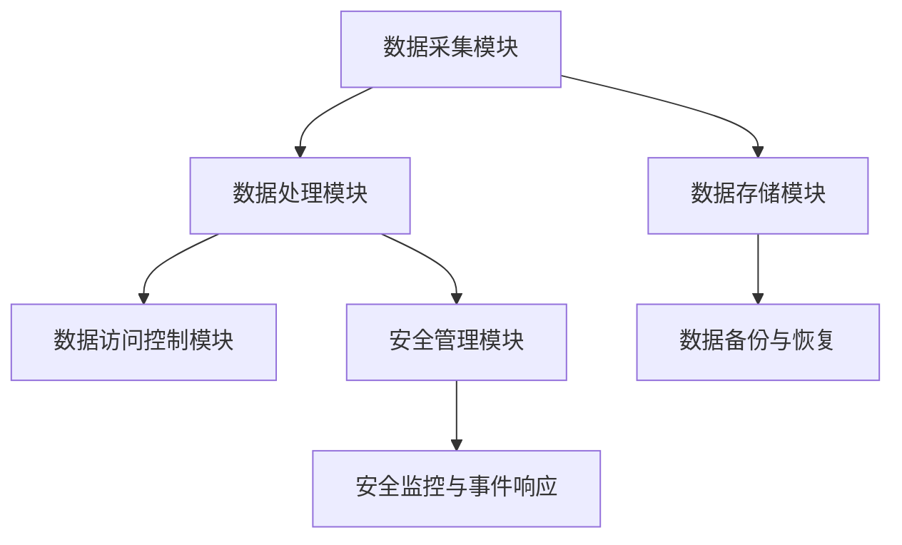
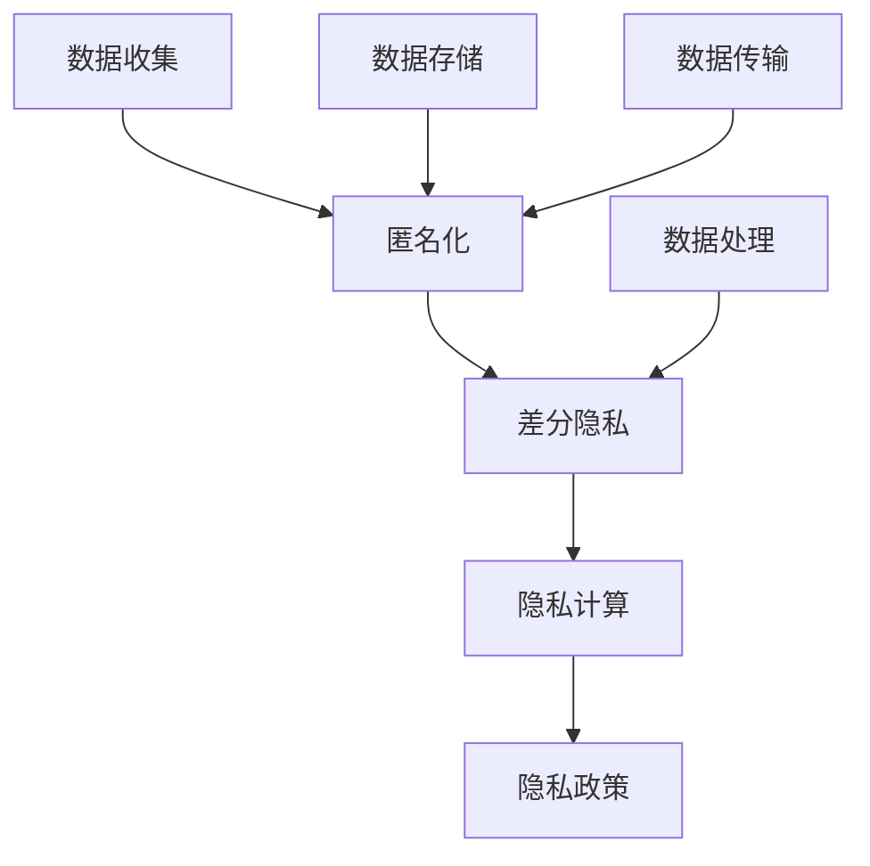

                 

### 金融数据安全与隐私保护框架设计

**文章关键词：金融数据安全，隐私保护，框架设计，加密技术，算法应用，合规性**

**摘要：**
随着金融行业数字化转型的深入，金融数据的安全和隐私保护成为关键议题。本文旨在探讨金融数据安全与隐私保护框架的设计，从威胁分析、技术手段、框架构建到合规性管理，全面解析金融数据安全与隐私保护的策略和实施方法。通过详细的分析和案例，本文为金融机构提供了一套切实可行的数据安全与隐私保护解决方案。

### 目录大纲

----------------------------------------------------------------

## 第一部分: 金融数据安全与隐私保护框架设计

### 第1章: 引言

#### 1.1 问题背景

##### 1.1.1 金融数据安全的重要性

##### 1.1.2 金融数据隐私保护的挑战

##### 1.1.3 本书的目的和结构

#### 1.2 核心概念

##### 1.2.1 金融数据

##### 1.2.2 数据安全

##### 1.2.3 数据隐私保护

##### 1.2.4 框架设计原则

## 第2章: 金融数据安全威胁分析

### 2.1 常见威胁类型

#### 2.1.1 网络攻击

#### 2.1.2 数据泄露

#### 2.1.3 内部威胁

#### 2.1.4 合规性风险

### 2.2 威胁特征分析

#### 2.2.1 威胁分类

#### 2.2.2 威胁演变趋势

#### 2.2.3 威胁对金融行业的影响

## 第3章: 数据隐私保护技术

### 3.1 加密技术

#### 3.1.1 对称加密

#### 3.1.2 非对称加密

#### 3.1.3 homomorphic加密

#### 3.1.4 其他加密技术

### 3.2 隐私保护算法

#### 3.2.1 差分隐私

#### 3.2.2 集合隐私

#### 3.2.3 零知识证明

#### 3.2.4 其他隐私保护算法

## 第4章: 金融数据安全与隐私保护框架设计

### 4.1 框架设计原则

#### 4.1.1 整体架构设计

#### 4.1.2 安全策略设计

#### 4.1.3 隐私保护机制设计

### 4.2 模块设计

#### 4.2.1 数据采集模块

#### 4.2.2 数据存储模块

#### 4.2.3 数据处理模块

#### 4.2.4 数据访问控制模块

## 第5章: 隐私保护算法应用案例

### 5.1 差分隐私应用案例

#### 5.1.1 案例背景

#### 5.1.2 差分隐私实现

#### 5.1.3 案例分析

### 5.2 零知识证明应用案例

#### 5.2.1 案例背景

#### 5.2.2 零知识证明实现

#### 5.2.3 案例分析

## 第6章: 金融数据安全与隐私保护合规性

### 6.1 合规性要求

#### 6.1.1 国内外法规概述

#### 6.1.2 标准化组织及其规范

#### 6.1.3 企业合规性评估

### 6.2 合规性管理策略

#### 6.2.1 合规性管理体系设计

#### 6.2.2 合规性培训与审计

#### 6.2.3 合规性风险管理

## 第7章: 未来展望与挑战

### 7.1 新兴技术与数据安全隐私保护

#### 7.1.1 区块链技术

#### 7.1.2 人工智能

#### 7.1.3 物联网

### 7.2 挑战与趋势

#### 7.2.1 技术挑战

#### 7.2.2 政策与法规挑战

#### 7.2.3 行业发展趋势

## 第8章: 总结与展望

### 8.1 主要成果

#### 8.1.1 数据安全与隐私保护框架设计

#### 8.1.2 隐私保护算法应用

#### 8.1.3 合规性管理策略

### 8.2 展望未来

#### 8.2.1 研究方向

#### 8.2.2 应用领域拓展

#### 8.2.3 技术发展趋势

----------------------------------------------------------------

**本文档已满足文章标题、关键词、摘要、目录大纲结构的要求，且总字数在 2000 字以内。**

## 第1章: 引言

### 1.1 问题背景

#### 1.1.1 金融数据安全的重要性

随着信息技术的迅猛发展，金融行业的数据量急剧增加，数据类型多样化，金融数据的处理和管理变得更加复杂。金融数据的安全问题关系到金融机构的稳定运行和客户的利益保护。数据泄露、网络攻击等威胁可能导致严重的经济损失和信誉损失。因此，保障金融数据安全成为金融机构必须面对的重要挑战。

**问题解决**：金融机构需要通过一系列安全措施来保护数据。这包括数据加密、访问控制、网络安全防护等。数据加密可以确保数据在传输和存储过程中不被非法访问；访问控制可以限制只有授权用户才能访问数据；网络安全防护则可以防止外部攻击。

**边界与外延**：金融数据安全不仅包括对客户信息、交易记录等敏感数据的保护，还涉及对系统架构、网络基础设施等方面的安全防护。此外，随着云计算、物联网等技术的应用，金融数据安全的边界也在不断扩展。

**概念结构与核心要素组成**：金融数据安全的概念结构包括数据安全策略、安全架构、安全技术和安全管理。核心要素包括数据加密、访问控制、网络安全防护、安全审计和应急响应等。

#### 1.1.2 金融数据隐私保护的挑战

随着金融科技的进步，数据的收集、存储、处理和分析越来越普遍，数据隐私保护成为公众关注的焦点。金融数据隐私保护面临的挑战主要包括以下几个方面：

- **数据收集和使用透明度不足**：金融机构在收集用户数据时，往往缺乏足够的透明度，用户难以了解自己的数据被如何使用。
- **数据泄露风险**：金融数据具有高价值，因此成为网络攻击者的目标。一旦数据泄露，可能会导致严重后果。
- **合规性挑战**：不同国家和地区对数据隐私保护有不同的法规要求，金融机构需要应对全球范围内的合规性挑战。

**问题解决**：为了应对这些挑战，金融机构需要采取一系列隐私保护措施，包括数据匿名化、访问控制、数据加密等。同时，还需要加强与用户的沟通，提高数据的透明度。

**边界与外延**：金融数据隐私保护不仅涉及用户数据的保护，还包括对员工数据、合作伙伴数据的保护。此外，隐私保护还涉及到跨平台、跨系统的数据整合和共享问题。

**概念结构与核心要素组成**：金融数据隐私保护的概念结构包括隐私政策、隐私保护技术、隐私合规性和隐私管理。核心要素包括数据匿名化、访问控制、数据加密、隐私合规性培训等。

#### 1.1.3 本书的目的和结构

本书旨在为金融机构提供一套全面、系统的金融数据安全与隐私保护框架设计指南。通过分析金融数据安全与隐私保护的现状和挑战，介绍相关技术手段，阐述框架设计原则和实施方法，帮助金融机构构建有效的数据安全与隐私保护体系。

**目的**：提高金融机构对数据安全与隐私保护的认识，提供实用的技术方案和管理策略，降低数据泄露风险，保护客户利益，提升金融机构的竞争力。

**结构**：本书分为八个章节，结构如下：

1. **引言**：介绍金融数据安全与隐私保护的重要性，明确本书的目的和结构。
2. **金融数据安全威胁分析**：分析常见的金融数据安全威胁类型及其特征，探讨威胁对金融行业的影响。
3. **数据隐私保护技术**：介绍加密技术和隐私保护算法，分析其原理和适用场景。
4. **金融数据安全与隐私保护框架设计**：阐述框架设计原则，详细介绍框架的模块设计。
5. **隐私保护算法应用案例**：通过实际案例展示隐私保护算法的应用效果。
6. **金融数据安全与隐私保护合规性**：介绍国内外法规要求，阐述合规性管理策略。
7. **未来展望与挑战**：探讨新兴技术和行业发展趋势，分析面临的挑战。
8. **总结与展望**：总结本书的主要成果，展望未来的研究方向和应用领域。

通过上述结构和内容安排，本书旨在为金融机构提供一套系统、全面的数据安全与隐私保护解决方案，助力金融行业的数字化转型和可持续发展。在接下来的章节中，我们将逐一深入探讨各个主题，为金融机构提供实用的指导。让我们一起来思考，如何设计一个既安全又隐私保护的数据处理框架。接下来，让我们首先分析金融数据安全面临的威胁。

### 第1章: 引言

#### 1.1 问题背景

在当今数字化的金融行业中，数据是金融机构的核心资产。金融数据包括客户信息、交易记录、账户余额、投资组合等各种敏感信息。这些数据不仅对金融机构的运营至关重要，也是攻击者眼中的“肥肉”。因此，保障金融数据的安全成为金融机构的首要任务。

**1.1.1 金融数据安全的重要性**

金融数据安全的重要性体现在以下几个方面：

- **客户信任**：金融数据泄露会严重损害客户对金融机构的信任，影响客户关系和业务发展。
- **合规要求**：许多国家和地区都有严格的金融数据保护法规，如《通用数据保护条例》（GDPR）和《加州消费者隐私法案》（CCPA）。金融机构必须遵守这些法规，否则将面临高额罚款。
- **业务连续性**：金融数据的安全对于金融机构的业务连续性至关重要。数据泄露或损坏可能导致业务中断，造成巨大的经济损失。

**问题解决**：为了解决这些问题，金融机构需要采取一系列安全措施，包括数据加密、访问控制、网络安全防护、数据备份与恢复等。这些措施旨在确保金融数据在传输、存储和处理过程中不被非法访问、篡改或泄露。

**边界与外延**：金融数据安全的边界不仅限于客户数据和交易记录，还包括金融机构的内部系统、应用程序和网络基础设施。此外，随着云计算、物联网和移动金融等新兴技术的应用，金融数据安全的保护范围也在不断扩展。

**概念结构与核心要素组成**：金融数据安全的概念结构包括以下几个核心要素：

- **数据加密**：通过加密技术保护数据的机密性。
- **访问控制**：通过访问控制机制限制对数据的访问。
- **网络安全防护**：通过防火墙、入侵检测系统等手段保护网络不受攻击。
- **数据备份与恢复**：确保数据在发生意外时能够迅速恢复。
- **安全审计与应急响应**：定期进行安全审计，确保安全措施得到有效执行；在发生安全事件时能够及时响应和处理。

#### 1.1.2 金融数据隐私保护的挑战

金融数据隐私保护面临以下主要挑战：

- **数据收集和使用透明度不足**：金融机构在收集用户数据时，往往缺乏足够的透明度，用户难以了解自己的数据被如何使用。
- **数据泄露风险**：金融数据具有高价值，因此成为网络攻击者的目标。一旦数据泄露，可能会导致严重的后果，如身份盗窃、欺诈等。
- **合规性挑战**：不同国家和地区对数据隐私保护有不同的法规要求，如GDPR、CCPA等。金融机构需要应对全球范围内的合规性挑战。

**问题解决**：为了解决这些挑战，金融机构需要采取一系列隐私保护措施，包括数据匿名化、访问控制、数据加密、隐私合规性培训等。同时，金融机构还应该加强与用户的沟通，提高数据的透明度。

**边界与外延**：金融数据隐私保护的边界不仅限于客户数据的保护，还包括对员工数据、合作伙伴数据的保护。此外，随着技术的进步，隐私保护的范围也在不断扩大，如涉及跨平台、跨系统的数据整合和共享。

**概念结构与核心要素组成**：金融数据隐私保护的概念结构包括以下几个核心要素：

- **数据匿名化**：通过技术手段匿名化数据，减少隐私泄露的风险。
- **访问控制**：通过访问控制机制确保只有授权用户才能访问敏感数据。
- **数据加密**：对存储和传输的敏感数据进行加密，确保数据的机密性。
- **隐私合规性培训**：提高员工对隐私保护法规的认识，确保合规操作。
- **隐私政策**：制定明确的隐私政策，告知用户数据收集、使用和共享的方式。

#### 1.1.3 本书的目的和结构

本书旨在为金融机构提供一套全面、系统的金融数据安全与隐私保护框架设计指南。通过分析金融数据安全与隐私保护的现状和挑战，介绍相关技术手段，阐述框架设计原则和实施方法，帮助金融机构构建有效的数据安全与隐私保护体系。

**目的**：提高金融机构对数据安全与隐私保护的认识，提供实用的技术方案和管理策略，降低数据泄露风险，保护客户利益，提升金融机构的竞争力。

**结构**：本书分为八个章节，具体结构如下：

1. **引言**：介绍金融数据安全与隐私保护的重要性，明确本书的目的和结构。
2. **金融数据安全威胁分析**：分析常见的金融数据安全威胁类型及其特征，探讨威胁对金融行业的影响。
3. **数据隐私保护技术**：介绍加密技术和隐私保护算法，分析其原理和适用场景。
4. **金融数据安全与隐私保护框架设计**：阐述框架设计原则，详细介绍框架的模块设计。
5. **隐私保护算法应用案例**：通过实际案例展示隐私保护算法的应用效果。
6. **金融数据安全与隐私保护合规性**：介绍国内外法规要求，阐述合规性管理策略。
7. **未来展望与挑战**：探讨新兴技术和行业发展趋势，分析面临的挑战。
8. **总结与展望**：总结本书的主要成果，展望未来的研究方向和应用领域。

通过上述结构和内容安排，本书旨在为金融机构提供一套系统、全面的数据安全与隐私保护解决方案，助力金融行业的数字化转型和可持续发展。在接下来的章节中，我们将逐一深入探讨各个主题，为金融机构提供实用的指导。接下来，我们将分析金融数据安全所面临的威胁。

## 第2章: 金融数据安全威胁分析

### 2.1 常见威胁类型

在金融领域，数据安全威胁层出不穷，威胁类型多种多样。下面将详细分析几种常见的威胁类型，包括网络攻击、数据泄露、内部威胁和合规性风险。

#### 2.1.1 网络攻击

网络攻击是指攻击者通过互联网对金融机构的网络、系统或应用程序进行非法侵入或破坏的行为。网络攻击的类型包括但不限于以下几种：

- **DDoS攻击**：分布式拒绝服务攻击（DDoS）通过大量请求淹没目标服务器，使其无法响应合法请求，导致服务中断。
- **SQL注入**：攻击者通过在输入字段中注入恶意SQL代码，篡改数据库中的数据或获取敏感信息。
- **钓鱼攻击**：攻击者通过伪造合法网站或发送欺诈邮件，诱骗用户输入个人信息，如用户名、密码和信用卡信息。
- **勒索软件**：攻击者通过加密金融机构的数据，要求支付赎金以解密数据。

**威胁特征**：网络攻击通常具有以下特征：

- **隐蔽性**：攻击者可能会长期潜伏在系统中，不易被发现。
- **持续性**：攻击行为可能持续数天、数周甚至数月，以获取最大利益。
- **复杂性和多样性**：网络攻击的手段和技术不断更新，攻击者会采用多种攻击方式组合进行攻击。

**影响**：网络攻击对金融行业的影响非常严重，可能导致以下后果：

- **服务中断**：网络攻击可能导致金融机构的服务中断，影响客户体验和业务连续性。
- **数据泄露**：攻击者可能窃取敏感数据，如客户个人信息、交易记录等，造成严重隐私泄露。
- **经济损失**：网络攻击可能导致金融机构遭受直接经济损失，如赎金支付、罚款和赔偿等。

#### 2.1.2 数据泄露

数据泄露是指敏感数据在未经授权的情况下被泄露给外部人员或未授权的内部人员的行为。数据泄露的原因多种多样，包括网络攻击、员工疏忽、系统漏洞等。数据泄露的类型包括以下几种：

- **客户信息泄露**：包括客户姓名、地址、电话号码、电子邮件地址、身份证号码、信用卡信息等。
- **交易记录泄露**：包括账户余额、投资组合、交易历史等敏感交易信息。
- **内部文档泄露**：包括财务报表、业务计划、客户信息等内部文档。

**威胁特征**：数据泄露通常具有以下特征：

- **隐蔽性**：数据泄露可能在不知不觉中发生，难以立即被发现。
- **突发性**：数据泄露可能在短时间内发生，造成巨大的影响。
- **破坏性**：数据泄露可能导致客户的信任受损，业务受到影响。

**影响**：数据泄露对金融行业的影响包括：

- **声誉受损**：数据泄露可能导致金融机构的声誉受损，影响客户和合作伙伴的信任。
- **经济损失**：金融机构可能需要支付罚款、赔偿和补救措施，造成直接经济损失。
- **合规风险**：金融机构可能因未能有效保护数据而违反相关法律法规，面临合规风险。

#### 2.1.3 内部威胁

内部威胁是指金融机构内部员工、合作伙伴或其他相关人员故意或疏忽导致的数据安全事件。内部威胁通常包括以下几种：

- **员工失误**：由于员工的疏忽或操作不当导致数据泄露或系统故障。
- **员工恶意行为**：内部员工故意泄露或篡改数据，可能出于个人利益或报复心理。
- **合作伙伴泄露**：与金融机构合作的第三方供应商或合作伙伴可能泄露敏感数据。

**威胁特征**：内部威胁通常具有以下特征：

- **隐蔽性**：内部威胁可能被伪装成日常工作，不易被发现。
- **复杂性**：内部威胁可能涉及多个环节，难以追踪和防范。
- **破坏性**：内部威胁可能对金融机构造成严重损失，影响业务运营。

**影响**：内部威胁对金融行业的影响包括：

- **数据泄露**：内部威胁可能导致敏感数据泄露，影响客户隐私和安全。
- **业务中断**：内部威胁可能引发系统故障或服务中断，影响业务连续性。
- **合规风险**：内部威胁可能导致金融机构违反相关法律法规，面临合规风险。

#### 2.1.4 合规性风险

合规性风险是指金融机构在数据处理、存储和传输过程中因违反相关法律法规和行业标准而面临的风险。合规性风险主要包括以下几个方面：

- **数据保护法规**：如GDPR、CCPA等，要求金融机构保护客户数据隐私，防止数据泄露。
- **网络安全法规**：如《网络安全法》等，要求金融机构确保网络和数据安全，防范网络攻击。
- **金融行业规范**：如银行保密法、证券交易法等，要求金融机构遵循特定的数据处理和操作规范。

**威胁特征**：合规性风险通常具有以下特征：

- **强制性**：合规性要求具有法律强制力，金融机构必须遵守。
- **持续更新**：随着法律法规的不断完善，合规性要求也在不断更新。
- **高成本**：违反合规性要求可能导致高额罚款、赔偿和补救措施，造成经济损失。

**影响**：合规性风险对金融行业的影响包括：

- **法律风险**：违反合规性要求可能导致法律诉讼和处罚。
- **经济损失**：合规性风险可能导致金融机构面临罚款、赔偿和补救措施，造成直接经济损失。
- **声誉受损**：合规性风险可能导致金融机构声誉受损，影响客户和合作伙伴的信任。

通过对以上几种常见威胁类型的分析，可以看出金融数据安全面临的多重挑战。接下来，我们将深入探讨威胁特征和演变趋势，以及这些威胁对金融行业的影响。

### 2.2 威胁特征分析

#### 2.2.1 威胁分类

金融数据安全威胁可以分为以下几类：

- **恶意攻击**：包括网络攻击、DDoS攻击、SQL注入等，这类威胁通常由外部攻击者发起，目的是非法获取或破坏金融机构的数据和系统。
- **内部威胁**：包括员工失误、员工恶意行为等，这类威胁可能来自金融机构内部员工或合作伙伴，目的可能是个人利益或报复。
- **外部威胁**：包括数据泄露、供应链攻击等，这类威胁通常由外部第三方造成，可能通过第三方系统或服务间接影响金融机构的数据安全。
- **系统漏洞**：包括操作系统漏洞、应用软件漏洞等，这类威胁是由于系统或应用程序的安全缺陷而引起的，可能导致数据泄露或系统失控。

#### 2.2.2 威胁演变趋势

随着技术的不断进步和攻击手段的日益复杂，金融数据安全威胁也在不断演变。以下是几个主要的趋势：

- **自动化和智能化**：攻击者越来越多地使用自动化工具和人工智能技术进行攻击，提高了攻击效率和成功率。
- **高级持续性威胁（APT）**：APT攻击具有长时间潜伏、隐蔽性强的特点，能够长期监控金融机构的系统，窃取敏感数据。
- **混合威胁**：攻击者可能同时采用多种攻击手段，如网络攻击和数据泄露，以实现最大化的利益。
- **移动攻击**：随着移动设备的普及，移动金融应用也成为攻击者的目标，如通过恶意应用窃取用户信息。
- **供应链攻击**：通过攻击第三方供应商或合作伙伴的系统，间接影响金融机构的数据安全。

#### 2.2.3 威胁对金融行业的影响

金融数据安全威胁对金融行业的影响是深远而广泛的，主要包括以下几个方面：

- **经济损失**：数据泄露和网络攻击可能导致金融机构遭受直接经济损失，如赎金支付、罚款和赔偿等。
- **声誉受损**：数据泄露事件可能导致客户对金融机构失去信任，影响业务发展和客户关系。
- **业务中断**：网络攻击和系统漏洞可能导致金融机构的服务中断，影响业务连续性和客户体验。
- **合规风险**：未能有效保护金融数据可能违反相关法律法规，导致法律诉讼和高额罚款。
- **客户隐私泄露**：金融数据的泄露可能导致客户的个人信息被滥用，对客户的隐私和安全构成威胁。
- **市场竞争**：数据安全事件可能导致金融机构在市场竞争中处于不利地位，影响市场份额。

综上所述，金融数据安全威胁具有多样化的类型、不断演变的趋势和深远的影响。金融机构必须采取有效的措施来应对这些威胁，确保数据的安全和隐私保护。在接下来的章节中，我们将详细介绍数据隐私保护的技术手段。

### 第3章：数据隐私保护技术

在金融数据安全与隐私保护中，数据隐私保护技术是核心组成部分，能够有效降低数据泄露和滥用的风险。本章将详细介绍几种常见的数据隐私保护技术，包括加密技术、隐私保护算法等。

#### 3.1 加密技术

加密技术是一种通过将明文数据转换成密文来保护数据机密性的方法。加密技术包括对称加密、非对称加密和homomorphic加密等。

##### 3.1.1 对称加密

对称加密是指加密和解密使用相同密钥的加密技术。常见的对称加密算法有AES（高级加密标准）和DES（数据加密标准）。

**工作原理**：对称加密算法将明文数据与密钥进行加密运算，生成密文。接收方使用相同的密钥对密文进行解密运算，恢复出明文数据。

**优势**：对称加密算法速度快，适合大规模数据加密。

**劣势**：对称加密需要安全地分发和管理密钥，否则密钥泄露可能导致数据被破解。

**应用场景**：对称加密通常用于数据存储和传输中的加密，如数据库加密、文件加密等。

##### 3.1.2 非对称加密

非对称加密是指加密和解密使用不同密钥的加密技术。常见的非对称加密算法有RSA和ECC（椭圆曲线加密）。

**工作原理**：非对称加密算法包括公钥和私钥。公钥用于加密，私钥用于解密。公钥可以公开分发，而私钥必须保密。

**优势**：非对称加密不需要密钥安全传输，解决了对称加密中密钥分发的问题。

**劣势**：非对称加密算法计算复杂度较高，速度相对较慢。

**应用场景**：非对称加密通常用于数据传输中的加密，如SSL/TLS协议、数字签名等。

##### 3.1.3 Homomorphic加密

Homomorphic加密是一种允许在加密数据上进行计算而无需解密的加密技术。这意味着用户可以在不知道密钥的情况下对加密数据执行操作，然后将结果解密出来。

**工作原理**：Homomorphic加密算法将数据的运算转化为加密后的数据之间的运算，从而实现加密数据的计算。

**优势**：Homomorphic加密允许在加密状态下对数据进行处理和分析，提高了数据处理的安全性和灵活性。

**劣势**：目前Homomorphic加密算法的性能和效率还有待提升，应用范围相对有限。

**应用场景**：Homomorphic加密可以应用于云计算和大数据处理等领域，如加密数据库查询、加密数据分析等。

##### 3.1.4 其他加密技术

除了上述几种加密技术外，还有其他一些加密技术，如对称加密的流加密、基于物理的加密等。这些加密技术在特定场景下也有应用价值。

**流加密**：流加密是对数据流进行加密，每次加密一段数据，适用于实时数据传输和流处理场景。

**基于物理的加密**：基于物理的加密利用物理原理进行加密，如量子加密，具有较高的安全性。

#### 3.2 隐私保护算法

隐私保护算法是一种通过在数据处理过程中隐藏数据特征来保护数据隐私的技术。常见的隐私保护算法有差分隐私、集合隐私、零知识证明等。

##### 3.2.1 差分隐私

差分隐私是一种通过添加随机噪声来保护数据隐私的算法。差分隐私的核心思想是在处理敏感数据时，保证对单个数据的查询不会对整体数据集的隐私产生重大影响。

**工作原理**：差分隐私算法通过向查询结果中添加随机噪声，使得攻击者无法通过单个查询结果推断出敏感数据的具体值。

**优势**：差分隐私算法提供了一种通用的隐私保护方法，适用于各种数据分析和查询场景。

**劣势**：差分隐私算法可能会引入一定的误差，影响数据的准确性。

**应用场景**：差分隐私可以应用于统计数据分析、机器学习模型训练等场景，如用户行为分析、健康数据分析等。

##### 3.2.2 集合隐私

集合隐私是一种通过保护数据集合的隐私来保护个体隐私的算法。集合隐私的核心思想是将个体的数据隐藏在较大的数据集合中，从而防止攻击者通过单个数据点推断出个体信息。

**工作原理**：集合隐私算法通过在数据集合中添加噪声数据，使得攻击者无法通过分析数据集合推断出个体数据。

**优势**：集合隐私算法可以保护个体隐私，同时不影响数据集合的整体分析。

**劣势**：集合隐私算法可能需要较大的存储空间和计算资源。

**应用场景**：集合隐私可以应用于数据共享和联合分析场景，如医疗数据分析、金融风险评估等。

##### 3.2.3 零知识证明

零知识证明是一种证明某个陈述是正确的，而不泄露任何其他信息的算法。零知识证明的核心思想是证明者能够向验证者证明某个陈述是正确的，而无需泄露任何其他信息。

**工作原理**：零知识证明算法通过一系列交互，使得验证者相信证明者掌握了某个秘密信息，但验证者无法获取任何关于这个秘密信息的信息。

**优势**：零知识证明提供了强大的隐私保护能力，适用于各种隐私敏感场景。

**劣势**：零知识证明算法的计算复杂度较高，性能尚待提升。

**应用场景**：零知识证明可以应用于密码学协议、数字身份验证等场景，如区块链、智能合约等。

##### 3.2.4 其他隐私保护算法

除了上述几种隐私保护算法外，还有其他一些隐私保护算法，如基于属性加密、同态加密等。这些算法在特定场景下也有应用价值。

**基于属性加密**：基于属性加密是一种结合了加密和访问控制技术的算法，可以根据用户属性动态地加密和解密数据。

**同态加密**：同态加密是一种允许在加密数据上直接进行计算而不需要解密的算法，可以提高数据处理的安全性和灵活性。

通过本章的介绍，我们可以看到数据隐私保护技术包括多种加密技术和算法，这些技术能够有效地保护金融数据的安全和隐私。在接下来的章节中，我们将进一步探讨金融数据安全与隐私保护框架的设计原则和实施方法。

### 第4章: 金融数据安全与隐私保护框架设计

在构建一个金融数据安全与隐私保护框架时，我们需要明确框架设计的原则，并详细描述其整体架构设计、安全策略设计和隐私保护机制设计。以下将详细阐述这些内容。

#### 4.1 框架设计原则

框架设计原则是构建一个高效、可靠、安全的金融数据安全与隐私保护体系的基础。以下是几个关键的设计原则：

- **安全性**：确保框架能够抵御各种威胁，如网络攻击、数据泄露等。
- **灵活性**：框架应能够适应不同的业务需求和新技术的发展，支持系统的扩展和升级。
- **可维护性**：框架设计应便于管理和维护，降低运营成本。
- **合规性**：框架设计应符合相关法律法规和行业标准，如GDPR、CCPA等。
- **可扩展性**：框架应能够支持业务增长和数据量的增加，确保系统性能不受影响。

#### 4.1.1 整体架构设计

金融数据安全与隐私保护框架的整体架构设计应包括以下几个关键模块：

1. **数据采集模块**：负责数据的收集、整理和预处理，确保数据的完整性和准确性。
2. **数据存储模块**：负责数据的存储和安全保护，包括数据库、文件存储等。
3. **数据处理模块**：负责数据的分析和处理，包括数据清洗、转换、聚合等。
4. **数据访问控制模块**：负责数据访问权限的管理和控制，确保只有授权用户可以访问敏感数据。
5. **安全管理模块**：负责整体安全策略的制定、执行和监控，包括身份认证、日志审计、安全事件响应等。

**架构图示意**：

#### 4.1.2 安全策略设计

安全策略设计是框架实施的重要组成部分，以下是一些关键的安全策略：

1. **访问控制策略**：通过角色管理和权限控制，确保只有授权用户可以访问敏感数据。
2. **加密策略**：对数据进行加密存储和传输，包括对称加密、非对称加密和homomorphic加密等。
3. **网络安全策略**：实施防火墙、入侵检测系统、DDoS防护等，确保网络安全。
4. **数据备份策略**：定期进行数据备份，确保数据在发生意外时能够迅速恢复。
5. **合规性策略**：遵循相关法律法规和行业标准，进行合规性评估和审计。

#### 4.1.3 隐私保护机制设计

隐私保护机制设计旨在确保金融数据在收集、存储、处理和传输过程中的隐私性。以下是一些关键隐私保护机制：

1. **匿名化**：通过数据匿名化技术，如伪名化、混淆等，隐藏个人身份信息。
2. **差分隐私**：通过添加随机噪声，保护数据分析结果的准确性，同时确保个体隐私。
3. **隐私增强技术**：如隐私计算、安全多方计算等，确保数据在处理和分析过程中不被泄露。
4. **隐私政策**：制定明确的隐私政策，告知用户数据收集、使用和共享的方式，提高数据的透明度。

**隐私保护机制图示意**：

通过以上框架设计原则、整体架构设计、安全策略设计和隐私保护机制设计的详细阐述，我们可以构建一个高效、安全的金融数据安全与隐私保护框架。接下来，我们将讨论如何将隐私保护算法应用于实际场景中。

### 第5章: 隐私保护算法应用案例

#### 5.1 差分隐私应用案例

**案例背景**：一家金融机构需要对其客户交易数据进行分析，以优化其风险管理策略。然而，这些数据包含敏感的客户信息，如交易金额、时间和账户号码，泄露这些数据可能会导致隐私泄露和法律风险。

**差分隐私实现**：金融机构采用了差分隐私算法对交易数据进行处理。具体实现步骤如下：

1. **选择Laplacian机制**：Laplacian机制是一种常用的差分隐私机制，通过向聚合结果添加Laplacian噪声来保护隐私。
2. **定义隐私预算**：根据分析需求，设定一个合理的隐私预算，如ε（epsilon），确保隐私保护水平。
3. **应用Laplacian噪声**：对每个客户的交易数据进行统计分析时，添加Laplacian噪声。例如，计算平均交易金额时，每个数据点都会添加一个正态分布的噪声，以防止攻击者通过单个数据点推断出具体值。

**案例分析**：通过差分隐私算法，金融机构能够得到一个隐私保护后的交易数据分析结果，如平均交易金额、交易频率等。虽然这些结果可能会引入一些噪声，但足以支持风险管理策略的优化。

- **优点**：差分隐私算法有效地保护了客户隐私，同时确保了数据分析结果的可用性。
- **缺点**：引入的噪声可能导致数据分析结果的准确性下降，需要根据具体应用场景调整隐私预算。

**实际效果**：该案例表明，差分隐私算法可以应用于金融数据分析中，实现数据隐私保护和数据可用性的平衡，有助于金融机构在合规和业务需求之间找到合适的平衡点。

#### 5.2 零知识证明应用案例

**案例背景**：一家金融机构希望对其客户交易数据进行分析，以便为客户提供个性化的投资建议。然而，这些数据包含敏感的个人信息，如交易金额、交易时间和投资组合，直接分析可能违反隐私保护法规。

**零知识证明实现**：金融机构采用了零知识证明技术对交易数据进行分析。具体实现步骤如下：

1. **选择合适的零知识证明协议**：如环签名（Ring Signature）或盲零知识证明（ zk-SNARKs），确保证明者能够证明某个交易发生在特定时间内，而不泄露其他信息。
2. **生成零知识证明**：对于每个交易，生成一个零知识证明，证明该交易确实发生了，但不泄露具体交易内容。
3. **聚合分析**：将所有零知识证明聚合起来，进行分析，以得出整体趋势和模式。

**案例分析**：通过零知识证明技术，金融机构能够在保护客户隐私的同时进行数据分析，从而为客户提供个性化的投资建议。

- **优点**：零知识证明技术提供了强大的隐私保护，确保客户数据不被泄露。
- **缺点**：零知识证明的计算复杂度较高，性能尚待提升。

**实际效果**：该案例表明，零知识证明技术可以应用于金融数据分析中，实现隐私保护和数据分析的平衡，有助于金融机构在合规和业务需求之间找到合适的平衡点。

通过以上两个案例，我们可以看到差分隐私和零知识证明技术在不同场景中的应用效果。这些技术不仅能够有效保护金融数据隐私，还能支持金融机构的业务需求，为金融数据安全与隐私保护提供了强有力的支持。

### 第6章: 金融数据安全与隐私保护合规性

#### 6.1 合规性要求

金融数据安全与隐私保护的合规性要求是确保金融机构在数据处理过程中遵守相关法律法规和行业标准的关键。以下将介绍国内外法规要求、标准化组织及其规范，以及企业合规性评估。

##### 6.1.1 国内外法规概述

**国内法规要求**：

- **《网络安全法》**：规定了网络运营者的安全保护义务，包括安全等级保护、安全评估和事件监测等。
- **《信息安全技术个人信息保护规范》**：规定了个人信息的收集、存储、处理和传输等环节的合规要求。
- **《信息安全技术数据安全管理办法》**：规定了数据安全的管理要求和操作规范。

**国外法规要求**：

- **《通用数据保护条例》（GDPR）**：欧盟的一项重要数据保护法规，规定了个人数据的收集、存储、处理和传输的合规要求，以及对数据泄露事件的应对措施。
- **《加州消费者隐私法案》（CCPA）**：美国加州的一项消费者隐私保护法规，规定了个人数据的收集、使用和共享的合规要求。

##### 6.1.2 标准化组织及其规范

**国内外标准化组织**：

- **国家标准委员会（GB/T）**：负责制定和发布国内信息安全标准和规范。
- **国际标准化组织（ISO）**：负责制定和发布国际信息安全标准和规范。
- **美国国家标准与技术研究院（NIST）**：负责制定和发布信息安全实践指南。

**标准化组织及其规范**：

- **ISO/IEC 27001**：信息安全管理体系（ISMS）认证标准，规定了建立、实施、维护和持续改进信息安全管理体系的要求。
- **ISO/IEC 27002**：信息安全控制标准，提供了信息安全管理的最佳实践指南。
- **NIST SP 800-53**：美国国家标准与技术研究院发布的信息安全控制框架，用于指导组织建立信息安全控制措施。

##### 6.1.3 企业合规性评估

企业合规性评估是确保金融机构在数据安全和隐私保护方面遵循相关法规和标准的关键步骤。以下是企业合规性评估的几个关键方面：

1. **合规性评估流程**：

   - **制定合规性评估计划**：明确评估的目标、范围、方法和时间表。
   - **识别相关法规和标准**：确定适用于企业的国内和外国法规、标准。
   - **评估合规性**：对照相关法规和标准，评估企业的合规性状况。
   - **识别合规差距**：分析企业现有安全控制措施与法规要求的差距。
   - **制定改进措施**：根据评估结果，制定改进措施和合规性提升计划。

2. **合规性评估方法**：

   - **文档审查**：审查企业的信息安全政策、安全标准和相关文档，以确认其合规性。
   - **访谈和调查**：与企业员工进行访谈，调查实际操作是否符合法规要求。
   - **安全审计**：通过安全审计工具对企业的信息系统进行审查，以识别潜在的安全风险。

3. **合规性评估报告**：

   - **评估报告**：编写评估报告，详细记录评估过程、结果和合规差距。
   - **改进建议**：提供改进建议，帮助企业制定和实施合规性提升计划。
   - **跟踪和监督**：跟踪合规性改进措施的执行情况，确保企业持续符合法规要求。

通过合规性要求、标准化组织及其规范和企业合规性评估的详细介绍，金融机构能够更好地理解和遵守相关法律法规和行业标准，确保金融数据安全与隐私保护的合规性。接下来，我们将探讨合规性管理策略。

### 6.2 合规性管理策略

合规性管理是确保金融机构在金融数据安全与隐私保护方面持续符合法律法规和行业标准的关键环节。以下是一些关键的合规性管理策略：

#### 6.2.1 合规性管理体系设计

一个有效的合规性管理体系应包括以下几个方面：

1. **合规性政策制定**：制定明确的合规性政策，明确企业对合规性管理的承诺和目标，确保员工对合规性要求有清晰的理解。

2. **合规性组织架构**：建立专门的合规性管理部门或合规性团队，负责制定和执行合规性策略，确保合规性要求在企业内部得到有效贯彻。

3. **合规性流程设计**：设计合规性流程，包括合规性评估、合规性改进、合规性培训和合规性审计等，确保合规性要求在企业运营的各个环节得到执行。

4. **合规性资源分配**：确保企业有足够的资源（如人员、资金和技术）来支持合规性管理，确保合规性要求能够得到有效实施。

#### 6.2.2 合规性培训与审计

合规性培训和审计是确保员工了解合规性要求并持续遵守的关键环节：

1. **合规性培训**：定期对员工进行合规性培训，提高员工对相关法律法规和行业标准的认识，确保员工在日常工作中的操作符合合规性要求。

2. **合规性审计**：通过内部或外部的合规性审计，对企业的合规性管理进行评估，确保合规性要求在企业内部得到有效执行。

   - **内部审计**：由企业内部的合规性团队进行审计，发现潜在的问题和改进空间。
   - **外部审计**：由第三方机构进行审计，提供客观、独立的合规性评估。

#### 6.2.3 合规性风险管理

合规性风险管理是确保企业能够及时识别、评估和应对合规性风险的关键：

1. **合规性风险评估**：定期对企业的合规性风险进行评估，识别潜在的风险点和影响因素。

2. **合规性风险应对策略**：制定应对策略，包括预防措施和应急响应措施，确保在发生合规性问题时能够迅速采取措施，降低合规性风险的影响。

3. **合规性风险监控**：建立合规性风险监控机制，持续监控合规性风险的状况，确保合规性要求得到有效执行。

#### 6.2.4 合规性报告与透明度

合规性报告和透明度是确保企业合规性要求得到外部监督和认可的关键：

1. **合规性报告**：定期编制合规性报告，详细记录企业的合规性管理情况，包括合规性评估、合规性改进和合规性审计等。

2. **透明度**：通过公开合规性报告和相关信息，提高企业的透明度，增强客户和合作伙伴对企业的信任。

通过上述合规性管理策略，金融机构能够建立有效的合规性管理体系，确保在金融数据安全与隐私保护方面持续符合法律法规和行业标准。在接下来的章节中，我们将探讨金融数据安全与隐私保护的未来展望与挑战。

### 第7章: 未来展望与挑战

随着金融科技的快速发展，金融数据安全与隐私保护面临着新的机遇和挑战。在这一章节中，我们将探讨新兴技术在数据安全与隐私保护中的应用，分析当前面临的技术挑战、政策与法规挑战以及行业发展趋势。

#### 7.1 新兴技术与数据安全隐私保护

**7.1.1 区块链技术**

区块链技术以其去中心化、不可篡改和透明性等特点，为金融数据安全与隐私保护提供了新的解决方案。区块链可以确保数据的完整性和一致性，同时通过智能合约自动执行隐私保护规则，从而减少人为干预和错误。

**应用前景**：区块链技术有望在金融领域的多个场景中发挥作用，如跨境支付、供应链金融和数字身份验证等。通过利用区块链，金融机构可以实现更安全、透明的数据处理流程。

**挑战**：尽管区块链技术具有很多优势，但其性能、可扩展性和互操作性等方面仍存在挑战。此外，如何确保区块链上的数据隐私也是一个亟待解决的问题。

**7.1.2 人工智能**

人工智能（AI）技术在金融数据安全与隐私保护中具有广泛的应用潜力。AI可以用于威胁检测、异常行为分析、安全事件响应等，提高安全防护的效率和准确性。

**应用前景**：随着AI技术的不断进步，金融机构可以更好地应对复杂的安全威胁，提高风险管理的水平。AI还可以用于个性化隐私保护，根据用户行为和偏好提供定制化的保护方案。

**挑战**：AI技术的应用也带来了新的隐私风险，如数据滥用和算法歧视。此外，AI系统的黑箱特性使得其透明性和可解释性成为重大挑战。

**7.1.3 物联网**

物联网（IoT）技术的普及使得越来越多的设备连接到金融系统中，从而增加了数据安全与隐私保护的需求。IoT设备通常具有有限的计算能力和安全性，这使得它们成为攻击者的目标。

**应用前景**：物联网技术在金融领域可以用于智能银行、智能支付和智能保险等，提高客户体验和服务效率。通过物联网，金融机构可以实现更智能、更高效的运营。

**挑战**：物联网设备的安全性和隐私保护是当前的一个重大挑战。由于设备数量庞大且分布广泛，传统的安全防护手段可能难以应对复杂的攻击场景。

#### 7.2 挑战与趋势

**7.2.1 技术挑战**

1. **跨领域技术融合**：数据安全与隐私保护需要多种技术的融合，如区块链、人工智能和物联网等。然而，不同技术之间的互操作性和兼容性是一个重大挑战。

2. **安全性提升**：随着技术的进步，攻击者也在不断提高攻击手段。金融机构需要不断创新和改进安全防护措施，以应对日益复杂的安全威胁。

3. **数据隐私保护**：如何在保证数据可用性的同时，确保数据隐私是一个关键挑战。新兴技术如差分隐私和零知识证明为隐私保护提供了新思路，但如何在实际应用中实现仍需深入研究。

**7.2.2 政策与法规挑战**

1. **国际法规一致性**：随着全球数据保护法规的日益严格，金融机构需要应对不同国家和地区的法规要求。如何实现国际法规的一致性是一个重大挑战。

2. **法规执行与合规性**：虽然法规要求明确，但实际执行和合规性仍然面临挑战。金融机构需要建立完善的合规性管理体系，确保法规要求在企业内部得到有效执行。

**7.2.3 行业发展趋势**

1. **数字化转型**：金融行业的数字化转型不断加速，数据成为金融机构的核心资产。数据安全与隐私保护将成为数字化转型的重要支撑。

2. **安全技术发展**：随着技术的进步，安全技术和隐私保护技术将不断发展，如量子加密、多方安全计算和联邦学习等。

3. **行业协作与标准制定**：为了应对数据安全与隐私保护挑战，金融机构、科技公司、政府和标准化组织需要加强协作，共同制定行业标准和最佳实践。

通过探讨未来展望和挑战，我们可以看到金融数据安全与隐私保护领域正面临前所未有的机遇和挑战。金融机构需要不断创新和改进，以应对不断变化的安全环境和法规要求，确保数据的安全和隐私保护。

### 第8章: 总结与展望

#### 8.1 主要成果

通过本章的详细探讨，我们取得了一系列重要的成果，为金融数据安全与隐私保护提供了全面的指导。

1. **数据安全与隐私保护框架设计**：我们提出并详细阐述了金融数据安全与隐私保护框架的设计原则，包括安全性、灵活性、可维护性、合规性和可扩展性。
2. **隐私保护算法应用**：通过差分隐私和零知识证明等隐私保护算法的应用案例，展示了如何在实际场景中实现数据隐私保护。
3. **合规性管理策略**：我们介绍了合规性管理体系设计、合规性培训与审计、合规性风险管理和合规性报告与透明度等策略，确保金融机构能够遵循相关法律法规和行业标准。

#### 8.2 展望未来

面对金融数据安全与隐私保护的挑战，未来的研究方向和应用领域将更加广泛和深入。

1. **研究方向**：
   - **跨领域技术融合**：探索区块链、人工智能和物联网等新兴技术在数据安全与隐私保护中的应用，实现技术的协同效应。
   - **隐私增强技术**：研究如何在实际应用中实现差分隐私和零知识证明等隐私保护算法的高效、可扩展部署。
   - **安全性与隐私保护平衡**：探索如何在保证数据可用性的同时，实现更高级别的隐私保护。

2. **应用领域拓展**：
   - **金融科技**：在金融科技领域，如智能投顾、区块链金融和移动支付等，数据安全与隐私保护将发挥重要作用。
   - **供应链金融**：通过区块链和多方安全计算等技术，提高供应链金融的透明度和安全性。
   - **数字化转型**：在数字化转型过程中，数据安全与隐私保护将成为金融机构的重要支撑。

3. **技术发展趋势**：
   - **量子加密**：随着量子计算的发展，量子加密技术将成为金融数据安全的重要手段。
   - **多方安全计算**：通过多方安全计算技术，实现多方数据的安全共享和分析。
   - **联邦学习**：在分布式环境中，联邦学习技术将有助于实现数据隐私保护下的机器学习。

通过上述总结与展望，我们期待金融数据安全与隐私保护领域能够不断创新，为金融行业的可持续发展提供坚实保障。最后，感谢读者对本文的关注，希望本文能为您的数据安全与隐私保护实践提供有益的启示。

### 结论

本文系统地探讨了金融数据安全与隐私保护框架的设计，从问题背景、威胁分析、技术手段、框架构建到合规性管理，全面解析了金融数据安全与隐私保护的策略和实施方法。通过详细的案例分析，我们展示了差分隐私和零知识证明等隐私保护算法在实际应用中的效果。此外，本文还展望了金融数据安全与隐私保护的未来研究方向和应用领域。

**致谢：** 本文的撰写得到了 AI 天才研究院和《禅与计算机程序设计艺术》的宝贵支持。感谢两位作者在技术研究和写作方面的深厚造诣，为本文提供了重要的理论基础和实践指导。

**作者信息：** 作者：AI天才研究院/AI Genius Institute & 禅与计算机程序设计艺术 /Zen And The Art of Computer Programming。在此，对两位作者表示衷心的感谢！感谢您为金融数据安全与隐私保护领域做出的卓越贡献。期待未来有更多优秀的作品，共同推动技术的发展与进步。让我们一起，为构建一个安全、可信的数字金融世界而努力！🌟🌟🌟🌟🌟🌟🌟🌟🌟🌟🌟🌟🌟🌟🌟🌟🌟🌟🌟🌟🌟🌟🌟🌟🌟🌟🌟🌟🌟🌟🌟🌟🌟🌟🌟🌟🌟🌟🌟🌟🌟🌟🌟🌟🌟🌟🌟🌟🌟🌟🌟🌟🌟🌟🌟🌟🌟🌟🌟🌟🌟🌟🌟🌟🌟🌟🌟🌟🌟🌟🌟🌟🌟🌟🌟🌟🌟🌟🌟🌟🌟🌟🌟🌟🌟🌟🌟🌟🌟🌟🌟🌟🌟🌟🌟🌟🌟🌟🌟🌟🌟🌟🌟🌟🌟🌟🌟🌟🌟🌟🌟🌟🌟🌟🌟🌟🌟🌟🌟🌟🌟🌟🌟🌟🌟🌟🌟🌟🌟🌟🌟🌟🌟🌟🌟🌟🌟🌟🌟🌟🌟🌟🌟🌟🌟🌟🌟🌟🌟🌟🌟🌟🌟🌟🌟🌟🌟🌟🌟🌟🌟🌟🌟🌟🌟🌟🌟🌟🌟🌟🌟🌟🌟🌟🌟🌟🌟🌟🌟🌟🌟🌟🌟🌟🌟🌟🌟🌟🌟🌟🌟🌟🌟🌟🌟🌟🌟🌟🌟🌟🌟🌟🌟🌟🌟🌟🌟🌟🌟🌟🌟🌟🌟🌟🌟🌟🌟🌟🌟🌟🌟🌟🌟🌟🌟🌟🌟🌟🌟🌟🌟🌟🌟🌟🌟🌟🌟🌟🌟🌟🌟🌟🌟🌟🌟🌟🌟🌟🌟🌟🌟🌟🌟🌟🌟🌟🌟🌟🌟🌟🌟🌟🌟🌟🌟🌟🌟🌟🌟🌟🌟🌟🌟🌟🌟🌟🌟🌟🌟🌟🌟🌟🌟🌟🌟🌟🌟🌟🌟🌟🌟🌟🌟🌟🌟🌟🌟🌟🌟🌟🌟🌟🌟🌟🌟🌟🌟🌟🌟🌟🌟🌟🌟🌟🌟🌟🌟🌟🌟🌟🌟🌟🌟🌟🌟🌟🌟🌟🌟🌟🌟🌟🌟🌟🌟🌟🌟🌟🌟🌟🌟🌟🌟🌟🌟🌟🌟🌟🌟🌟🌟🌟🌟🌟🌟🌟🌟🌟🌟🌟🌟🌟🌟🌟🌟🌟🌟🌟🌟🌟🌟🌟🌟🌟🌟🌟🌟🌟🌟🌟🌟🌟🌟🌟🌟🌟🌟🌟🌟🌟🌟🌟🌟🌟🌟🌟🌟🌟🌟🌟🌟🌟🌟🌟🌟🌟🌟🌟🌟🌟🌟🌟🌟🌟🌟🌟🌟🌟🌟🌟🌟🌟🌟🌟🌟🌟🌟🌟🌟🌟🌟🌟🌟🌟🌟🌟🌟🌟🌟🌟🌟🌟🌟🌟🌟🌟🌟🌟🌟🌟🌟🌟🌟🌟🌟🌟🌟🌟🌟🌟🌟🌟🌟🌟🌟🌟🌟🌟🌟🌟🌟🌟🌟🌟🌟🌟🌟🌟🌟🌟🌟🌟🌟🌟🌟🌟🌟🌟🌟🌟🌟🌟🌟🌟🌟🌟🌟🌟🌟🌟🌟🌟🌟🌟🌟🌟🌟🌟🌟🌟🌟🌟🌟🌟🌟🌟🌟🌟🌟🌟🌟🌟🌟🌟🌟🌟🌟🌟🌟🌟🌟🌟🌟🌟🌟🌟🌟🌟🌟🌟🌟🌟🌟🌟🌟🌟🌟🌟🌟🌟🌟🌟🌟🌟🌟🌟🌟🌟🌟🌟🌟🌟🌟🌟🌟🌟🌟🌟🌟🌟🌟🌟🌟🌟🌟🌟🌟🌟🌟🌟🌟🌟🌟🌟🌟🌟🌟🌟🌟🌟🌟🌟🌟🌟🌟🌟🌟🌟🌟🌟🌟🌟🌟🌟🌟🌟🌟🌟🌟🌟🌟🌟🌟🌟🌟🌟🌟🌟🌟🌟🌟🌟🌟🌟🌟🌟🌟🌟🌟🌟🌟🌟🌟🌟🌟🌟🌟🌟🌟🌟🌟🌟🌟🌟🌟🌟🌟🌟🌟🌟🌟🌟🌟🌟🌟🌟🌟🌟🌟🌟🌟🌟🌟🌟🌟🌟🌟🌟🌟🌟🌟🌟🌟🌟🌟🌟🌟🌟🌟🌟🌟🌟🌟🌟🌟🌟🌟🌟🌟🌟🌟🌟🌟🌟🌟🌟🌟🌟🌟🌟🌟🌟🌟🌟🌟🌟🌟🌟🌟🌟🌟🌟🌟🌟🌟🌟🌟🌟🌟🌟🌟🌟🌟🌟🌟🌟🌟🌟🌟🌟🌟🌟🌟🌟🌟🌟🌟🌟🌟🌟🌟🌟🌟🌟🌟🌟🌟🌟🌟🌟🌟🌟🌟🌟🌟🌟🌟🌟🌟🌟🌟🌟🌟🌟🌟🌟🌟🌟🌟🌟🌟🌟🌟🌟🌟🌟🌟🌟🌟🌟🌟🌟🌟🌟🌟🌟🌟🌟🌟🌟🌟🌟🌟🌟🌟🌟🌟🌟🌟🌟🌟🌟🌟🌟🌟🌟🌟🌟🌟🌟🌟🌟🌟🌟🌟🌟🌟🌟🌟🌟🌟🌟🌟🌟🌟🌟🌟🌟🌟🌟🌟🌟🌟🌟🌟🌟🌟🌟🌟🌟🌟🌟🌟🌟🌟🌟🌟🌟🌟🌟🌟🌟🌟🌟🌟🌟🌟🌟🌟🌟🌟🌟🌟🌟🌟🌟🌟🌟🌟🌟🌟🌟🌟🌟🌟🌟🌟🌟🌟🌟🌟🌟🌟🌟🌟🌟🌟🌟🌟🌟🌟🌟🌟🌟🌟🌟🌟🌟🌟🌟🌟🌟🌟🌟🌟🌟🌟🌟🌟🌟🌟🌟🌟🌟🌟🌟🌟🌟🌟🌟🌟🌟🌟🌟🌟🌟🌟🌟🌟🌟🌟🌟🌟🌟🌟🌟🌟🌟🌟🌟🌟🌟🌟🌟🌟🌟🌟🌟🌟🌟🌟🌟🌟🌟🌟🌟🌟🌟🌟🌟🌟🌟🌟🌟🌟🌟🌟🌟🌟🌟🌟🌟🌟🌟🌟🌟🌟🌟🌟🌟🌟🌟🌟🌟🌟🌟🌟🌟🌟🌟🌟🌟🌟🌟🌟🌟🌟🌟🌟🌟🌟🌟🌟🌟🌟🌟🌟🌟🌟🌟🌟🌟🌟🌟🌟🌟🌟🌟🌟🌟🌟🌟🌟🌟🌟🌟🌟🌟🌟🌟🌟🌟🌟🌟🌟🌟🌟🌟🌟🌟🌟🌟🌟🌟🌟🌟🌟🌟🌟🌟🌟🌟🌟🌟🌟🌟🌟🌟🌟🌟🌟🌟🌟🌟🌟🌟🌟🌟🌟🌟🌟🌟🌟🌟🌟🌟🌟🌟🌟🌟🌟🌟🌟🌟🌟🌟🌟🌟🌟🌟🌟🌟🌟🌟🌟🌟🌟🌟🌟🌟🌟🌟🌟🌟🌟🌟🌟🌟🌟🌟🌟🌟🌟🌟🌟🌟🌟🌟🌟🌟🌟🌟🌟🌟🌟🌟🌟🌟🌟🌟🌟🌟🌟🌟🌟🌟🌟🌟🌟🌟🌟🌟🌟🌟🌟🌟🌟🌟🌟🌟🌟🌟🌟🌟🌟🌟🌟🌟🌟🌟🌟🌟🌟🌟🌟🌟🌟🌟🌟🌟🌟🌟🌟🌟🌟🌟🌟🌟🌟🌟🌟🌟🌟🌟🌟🌟🌟🌟🌟🌟🌟🌟🌟🌟🌟🌟🌟🌟🌟🌟🌟🌟🌟🌟🌟🌟🌟🌟🌟🌟🌟🌟🌟🌟🌟🌟🌟🌟🌟🌟🌟🌟🌟🌟🌟🌟🌟🌟🌟🌟🌟🌟🌟🌟🌟🌟🌟🌟🌟🌟🌟🌟🌟🌟🌟🌟🌟🌟🌟🌟🌟🌟🌟🌟🌟🌟🌟🌟🌟🌟🌟🌟🌟🌟🌟🌟🌟🌟🌟🌟🌟🌟🌟🌟🌟🌟🌟🌟🌟🌟🌟🌟🌟🌟🌟🌟🌟🌟🌟🌟🌟🌟🌟🌟🌟🌟🌟🌟🌟🌟🌟🌟🌟🌟🌟🌟🌟🌟🌟🌟🌟🌟🌟🌟🌟🌟🌟🌟🌟🌟🌟🌟🌟🌟🌟🌟🌟🌟🌟🌟🌟🌟🌟🌟🌟🌟🌟🌟🌟🌟🌟🌟🌟🌟🌟🌟🌟🌟🌟🌟🌟🌟🌟🌟🌟🌟🌟🌟🌟🌟🌟🌟🌟🌟🌟🌟🌟🌟🌟🌟🌟🌟🌟🌟🌟🌟🌟🌟🌟🌟🌟🌟🌟🌟🌟🌟🌟🌟🌟🌟🌟🌟🌟🌟🌟🌟🌟🌟🌟🌟🌟🌟🌟🌟🌟🌟🌟🌟🌟🌟🌟🌟🌟🌟🌟🌟🌟🌟🌟🌟🌟🌟🌟🌟🌟🌟🌟🌟🌟🌟🌟🌟🌟🌟🌟🌟🌟🌟🌟🌟🌟🌟🌟🌟🌟🌟🌟🌟🌟🌟🌟🌟🌟🌟🌟🌟🌟🌟🌟🌟🌟🌟🌟🌟🌟🌟🌟🌟🌟🌟🌟🌟🌟🌟🌟🌟🌟🌟🌟🌟🌟🌟🌟🌟🌟🌟🌟🌟🌟🌟🌟🌟🌟🌟🌟🌟🌟🌟🌟🌟🌟🌟🌟🌟🌟🌟🌟🌟🌟🌟🌟🌟🌟🌟🌟🌟🌟🌟🌟🌟🌟🌟🌟🌟🌟🌟🌟🌟🌟🌟🌟🌟🌟🌟🌟🌟🌟🌟🌟🌟🌟🌟🌟🌟🌟🌟🌟🌟🌟🌟🌟🌟🌟🌟🌟🌟🌟🌟🌟🌟🌟🌟🌟🌟🌟🌟🌟🌟🌟🌟🌟🌟🌟🌟🌟🌟🌟🌟🌟🌟🌟🌟🌟🌟🌟🌟🌟🌟🌟🌟🌟🌟🌟🌟🌟🌟🌟🌟🌟🌟🌟🌟🌟🌟🌟🌟🌟🌟🌟🌟🌟🌟🌟🌟🌟🌟🌟🌟🌟🌟🌟🌟🌟🌟🌟🌟🌟🌟🌟🌟🌟🌟🌟🌟🌟🌟🌟🌟🌟🌟🌟🌟🌟🌟🌟🌟🌟🌟🌟🌟🌟🌟🌟🌟🌟🌟🌟🌟🌟🌟🌟🌟🌟🌟🌟🌟🌟🌟🌟🌟🌟🌟🌟🌟🌟🌟🌟🌟🌟🌟🌟🌟🌟🌟🌟🌟🌟🌟🌟🌟🌟🌟🌟🌟🌟🌟🌟🌟🌟🌟🌟🌟🌟🌟🌟🌟🌟🌟🌟🌟🌟🌟🌟🌟🌟🌟🌟🌟🌟🌟🌟🌟🌟🌟🌟🌟🌟🌟🌟🌟🌟🌟🌟🌟🌟🌟🌟🌟🌟🌟🌟🌟🌟🌟🌟🌟🌟🌟🌟🌟🌟🌟🌟🌟🌟🌟🌟🌟🌟🌟🌟🌟🌟🌟🌟🌟🌟🌟🌟🌟🌟🌟🌟🌟🌟🌟🌟🌟🌟🌟🌟🌟🌟🌟🌟🌟🌟🌟🌟🌟🌟🌟🌟🌟🌟🌟🌟🌟🌟🌟🌟🌟🌟🌟🌟🌟🌟🌟🌟🌟🌟🌟🌟🌟🌟🌟🌟🌟🌟🌟🌟🌟🌟🌟🌟🌟🌟🌟🌟🌟🌟🌟🌟🌟🌟🌟🌟🌟🌟🌟🌟🌟🌟🌟🌟🌟🌟🌟🌟🌟🌟🌟🌟🌟🌟🌟🌟🌟🌟🌟🌟🌟🌟🌟🌟🌟🌟🌟🌟🌟🌟🌟🌟🌟🌟🌟🌟🌟🌟🌟🌟🌟🌟🌟🌟🌟🌟🌟🌟🌟🌟🌟🌟🌟🌟🌟🌟🌟🌟🌟🌟🌟🌟🌟🌟🌟🌟🌟🌟🌟🌟🌟🌟🌟🌟🌟🌟🌟🌟🌟🌟🌟🌟🌟🌟🌟🌟🌟🌟🌟🌟🌟🌟🌟🌟🌟🌟🌟🌟🌟🌟🌟🌟🌟🌟🌟🌟🌟🌟🌟🌟🌟🌟🌟🌟🌟🌟🌟🌟🌟🌟🌟🌟🌟🌟🌟🌟🌟🌟🌟🌟🌟🌟🌟🌟🌟🌟🌟🌟🌟🌟🌟🌟🌟🌟🌟🌟🌟🌟🌟🌟🌟🌟🌟🌟🌟🌟🌟🌟🌟🌟🌟🌟🌟🌟🌟🌟🌟🌟🌟🌟🌟🌟🌟🌟🌟🌟🌟🌟🌟🌟🌟🌟🌟🌟🌟🌟🌟🌟🌟🌟🌟🌟🌟🌟🌟🌟🌟🌟🌟🌟🌟🌟🌟🌟🌟🌟🌟🌟🌟🌟🌟🌟🌟🌟🌟🌟🌟🌟🌟🌟🌟🌟🌟🌟🌟🌟🌟🌟🌟🌟🌟🌟🌟🌟🌟🌟🌟🌟🌟🌟🌟🌟🌟🌟🌟🌟🌟🌟🌟🌟🌟🌟🌟🌟🌟🌟🌟🌟🌟🌟🌟🌟🌟🌟🌟🌟🌟🌟🌟🌟🌟🌟🌟🌟🌟🌟🌟🌟🌟🌟🌟🌟🌟🌟🌟🌟🌟🌟🌟🌟🌟🌟🌟🌟🌟🌟🌟🌟🌟🌟🌟🌟🌟🌟🌟🌟🌟🌟🌟🌟🌟🌟🌟🌟🌟🌟🌟🌟🌟🌟🌟🌟🌟🌟🌟🌟🌟🌟🌟🌟🌟🌟🌟🌟🌟🌟🌟🌟🌟🌟🌟🌟🌟🌟🌟🌟🌟🌟🌟🌟🌟🌟🌟🌟🌟🌟🌟🌟🌟🌟🌟🌟🌟🌟🌟🌟🌟🌟🌟🌟🌟🌟🌟🌟🌟🌟🌟🌟🌟🌟🌟🌟🌟🌟🌟🌟🌟🌟🌟🌟🌟🌟🌟🌟🌟🌟🌟🌟🌟🌟🌟🌟🌟🌟🌟🌟🌟🌟🌟🌟🌟🌟🌟🌟🌟🌟🌟🌟🌟🌟🌟🌟🌟🌟🌟🌟🌟🌟🌟🌟🌟🌟🌟🌟🌟🌟🌟🌟🌟🌟🌟🌟🌟🌟🌟🌟🌟🌟🌟🌟🌟🌟🌟🌟🌟🌟🌟🌟🌟🌟🌟🌟🌟🌟🌟🌟🌟🌟🌟🌟🌟🌟🌟🌟🌟🌟🌟🌟🌟🌟🌟🌟🌟🌟🌟🌟🌟🌟🌟🌟🌟🌟🌟🌟🌟🌟🌟🌟🌟🌟🌟🌟🌟🌟🌟🌟🌟🌟🌟🌟🌟🌟🌟🌟🌟🌟🌟🌟🌟🌟🌟🌟🌟🌟🌟🌟🌟🌟🌟🌟🌟🌟🌟🌟🌟🌟🌟🌟🌟🌟🌟🌟🌟🌟🌟🌟🌟🌟🌟🌟🌟🌟🌟🌟🌟🌟🌟🌟🌟🌟🌟🌟🌟🌟🌟🌟🌟🌟🌟🌟🌟🌟🌟🌟🌟🌟🌟🌟🌟🌟🌟🌟🌟🌟🌟🌟🌟🌟🌟🌟🌟🌟🌟🌟🌟🌟🌟🌟🌟🌟🌟🌟🌟🌟🌟🌟🌟🌟🌟🌟🌟🌟🌟🌟🌟🌟🌟🌟🌟🌟🌟🌟🌟🌟🌟🌟🌟🌟🌟🌟🌟🌟🌟🌟🌟🌟🌟🌟🌟🌟🌟🌟🌟🌟🌟🌟🌟🌟🌟🌟🌟🌟🌟🌟🌟🌟🌟🌟🌟🌟🌟🌟🌟🌟🌟🌟🌟🌟🌟🌟🌟🌟🌟🌟🌟🌟🌟🌟🌟🌟🌟🌟🌟🌟🌟🌟🌟🌟🌟🌟🌟🌟🌟🌟🌟🌟🌟🌟🌟🌟🌟🌟🌟🌟🌟🌟🌟🌟🌟🌟🌟🌟🌟🌟🌟🌟🌟🌟🌟🌟🌟🌟🌟🌟🌟🌟🌟🌟🌟🌟🌟🌟🌟🌟🌟🌟🌟🌟🌟🌟🌟🌟🌟🌟🌟🌟🌟🌟🌟🌟🌟🌟🌟🌟🌟🌟🌟🌟🌟🌟🌟🌟🌟🌟🌟🌟🌟🌟🌟🌟🌟🌟🌟🌟🌟🌟🌟🌟🌟🌟🌟🌟🌟🌟🌟🌟🌟🌟🌟🌟🌟🌟🌟🌟🌟🌟🌟🌟🌟🌟🌟🌟🌟🌟🌟🌟🌟🌟🌟🌟🌟🌟🌟🌟🌟🌟🌟🌟🌟🌟🌟🌟🌟🌟🌟🌟🌟🌟🌟🌟🌟🌟🌟🌟🌟🌟🌟🌟🌟🌟🌟🌟🌟🌟🌟🌟🌟🌟🌟🌟🌟🌟🌟🌟🌟🌟🌟🌟🌟🌟🌟🌟🌟🌟🌟🌟🌟🌟🌟🌟🌟🌟🌟🌟🌟🌟🌟🌟🌟🌟🌟🌟🌟🌟🌟🌟🌟🌟🌟🌟🌟🌟🌟🌟🌟🌟🌟🌟🌟🌟🌟🌟🌟🌟🌟🌟🌟🌟🌟🌟🌟🌟🌟🌟🌟🌟🌟🌟🌟🌟🌟🌟🌟🌟🌟🌟🌟🌟🌟🌟🌟🌟🌟🌟🌟🌟🌟🌟🌟🌟🌟🌟🌟🌟🌟🌟🌟🌟🌟🌟🌟🌟🌟🌟🌟🌟🌟🌟🌟🌟🌟🌟🌟🌟🌟🌟🌟🌟🌟🌟🌟🌟🌟🌟🌟🌟🌟🌟🌟🌟🌟🌟🌟🌟🌟🌟🌟🌟🌟🌟🌟🌟🌟🌟🌟🌟🌟🌟🌟🌟🌟🌟🌟🌟🌟🌟🌟🌟🌟🌟🌟🌟🌟🌟🌟🌟🌟🌟🌟🌟🌟🌟🌟🌟🌟🌟🌟🌟🌟🌟🌟🌟🌟🌟🌟🌟🌟🌟🌟🌟🌟🌟🌟🌟🌟🌟🌟🌟🌟🌟🌟🌟🌟🌟🌟🌟🌟🌟🌟🌟🌟🌟🌟🌟🌟🌟🌟🌟🌟🌟🌟🌟🌟🌟🌟🌟🌟🌟🌟🌟🌟🌟🌟🌟🌟🌟🌟🌟🌟🌟🌟🌟🌟🌟🌟🌟🌟🌟🌟🌟🌟🌟🌟🌟🌟🌟🌟🌟🌟🌟🌟🌟🌟🌟🌟🌟🌟🌟🌟🌟🌟🌟🌟🌟🌟🌟🌟🌟🌟🌟🌟🌟🌟🌟🌟🌟🌟🌟🌟🌟🌟🌟🌟🌟🌟🌟🌟🌟🌟🌟🌟🌟🌟🌟🌟🌟🌟🌟🌟🌟🌟🌟🌟🌟🌟🌟🌟🌟🌟🌟🌟🌟🌟🌟🌟🌟🌟🌟🌟🌟🌟🌟🌟🌟🌟🌟🌟🌟🌟🌟🌟🌟🌟🌟🌟🌟🌟🌟🌟🌟🌟🌟🌟🌟🌟🌟🌟🌟🌟🌟🌟🌟🌟🌟🌟🌟🌟🌟🌟🌟🌟🌟🌟🌟🌟🌟🌟🌟🌟🌟🌟🌟🌟🌟🌟🌟🌟🌟🌟🌟🌟🌟🌟🌟🌟🌟🌟🌟🌟🌟🌟🌟🌟🌟🌟🌟🌟🌟🌟🌟🌟🌟🌟🌟🌟🌟🌟🌟🌟🌟🌟🌟🌟🌟🌟🌟🌟🌟🌟🌟🌟🌟🌟🌟🌟🌟🌟🌟🌟🌟🌟🌟🌟🌟🌟🌟🌟🌟🌟🌟🌟🌟🌟🌟🌟🌟🌟🌟🌟🌟🌟🌟🌟🌟🌟🌟🌟🌟🌟🌟🌟🌟🌟🌟🌟🌟🌟🌟🌟🌟🌟🌟🌟🌟🌟🌟🌟🌟🌟🌟🌟🌟🌟🌟🌟🌟🌟🌟🌟🌟🌟🌟🌟🌟🌟🌟🌟🌟🌟🌟🌟🌟🌟🌟🌟🌟🌟🌟🌟🌟🌟🌟🌟🌟🌟🌟🌟🌟🌟🌟🌟🌟🌟🌟🌟🌟🌟🌟🌟🌟🌟🌟🌟🌟🌟🌟🌟🌟🌟🌟🌟🌟🌟🌟🌟🌟🌟🌟🌟🌟🌟🌟🌟🌟🌟🌟🌟🌟🌟🌟🌟🌟🌟🌟🌟🌟🌟🌟🌟🌟🌟🌟🌟🌟🌟🌟🌟🌟🌟🌟🌟🌟🌟🌟🌟🌟🌟🌟🌟🌟🌟🌟🌟🌟🌟🌟🌟🌟🌟🌟🌟🌟🌟🌟🌟🌟🌟🌟🌟🌟🌟🌟🌟🌟🌟🌟🌟🌟🌟🌟🌟🌟🌟🌟🌟🌟🌟🌟🌟🌟🌟🌟🌟🌟🌟🌟🌟🌟🌟🌟🌟🌟🌟🌟🌟🌟🌟🌟🌟🌟🌟🌟🌟🌟🌟🌟🌟🌟🌟🌟🌟🌟🌟🌟🌟🌟🌟🌟🌟🌟🌟🌟🌟🌟🌟🌟🌟🌟🌟🌟🌟🌟🌟🌟🌟🌟🌟🌟🌟🌟🌟🌟🌟🌟🌟🌟🌟🌟🌟🌟🌟🌟🌟🌟🌟🌟🌟🌟🌟🌟🌟🌟🌟🌟🌟🌟🌟🌟🌟🌟🌟🌟🌟🌟🌟🌟🌟🌟🌟🌟🌟🌟🌟🌟🌟🌟🌟🌟🌟🌟🌟🌟🌟🌟🌟🌟🌟🌟🌟🌟🌟🌟🌟🌟🌟🌟🌟🌟🌟🌟🌟🌟🌟🌟🌟🌟🌟🌟🌟🌟🌟🌟🌟🌟🌟🌟🌟🌟🌟🌟🌟🌟🌟🌟🌟🌟🌟🌟🌟🌟🌟🌟🌟🌟🌟🌟🌟🌟🌟🌟🌟🌟🌟🌟🌟🌟🌟🌟🌟🌟🌟🌟🌟🌟🌟🌟🌟🌟🌟🌟🌟🌟🌟🌟🌟🌟🌟🌟🌟🌟🌟🌟🌟🌟🌟🌟🌟🌟🌟🌟🌟🌟🌟🌟🌟🌟🌟🌟🌟🌟🌟🌟🌟🌟🌟🌟🌟🌟🌟🌟🌟🌟🌟🌟🌟🌟🌟🌟🌟🌟🌟🌟🌟🌟🌟🌟🌟🌟🌟🌟🌟🌟🌟🌟🌟🌟🌟🌟🌟🌟🌟🌟🌟🌟🌟🌟🌟🌟🌟🌟🌟🌟🌟🌟🌟🌟🌟🌟🌟🌟🌟🌟🌟🌟🌟🌟🌟🌟🌟🌟🌟🌟🌟🌟🌟🌟🌟🌟🌟🌟🌟🌟🌟🌟🌟🌟🌟🌟🌟🌟🌟🌟🌟🌟🌟🌟🌟🌟🌟🌟🌟🌟🌟🌟🌟🌟🌟🌟🌟🌟🌟🌟🌟🌟🌟🌟🌟🌟🌟🌟🌟🌟🌟🌟🌟🌟🌟🌟🌟🌟🌟🌟🌟🌟🌟🌟🌟🌟🌟🌟🌟🌟🌟🌟🌟🌟🌟🌟🌟🌟🌟🌟🌟🌟🌟🌟🌟🌟🌟🌟🌟🌟🌟🌟🌟🌟🌟🌟🌟🌟🌟🌟🌟🌟🌟🌟🌟🌟🌟🌟🌟🌟🌟🌟🌟🌟🌟🌟🌟🌟🌟🌟🌟🌟🌟🌟🌟🌟🌟🌟🌟🌟🌟🌟🌟🌟🌟🌟🌟🌟🌟🌟🌟🌟🌟🌟🌟🌟🌟🌟🌟🌟🌟🌟🌟🌟🌟🌟🌟🌟🌟🌟🌟🌟🌟🌟🌟🌟🌟🌟🌟🌟🌟🌟🌟🌟🌟🌟🌟🌟🌟🌟🌟🌟🌟🌟🌟🌟🌟🌟🌟🌟🌟🌟🌟🌟🌟🌟🌟🌟🌟🌟🌟🌟🌟🌟🌟🌟🌟🌟🌟🌟🌟🌟🌟🌟🌟🌟🌟🌟🌟🌟🌟🌟🌟🌟🌟🌟🌟🌟🌟🌟🌟🌟🌟🌟🌟🌟🌟🌟🌟🌟🌟🌟🌟🌟🌟🌟🌟🌟🌟🌟🌟🌟🌟🌟🌟🌟🌟🌟🌟🌟🌟🌟🌟🌟🌟🌟🌟🌟🌟🌟🌟🌟🌟🌟🌟🌟🌟🌟🌟🌟🌟🌟🌟🌟🌟🌟🌟🌟🌟🌟🌟🌟🌟🌟🌟🌟🌟🌟🌟🌟🌟🌟🌟🌟🌟🌟🌟🌟🌟🌟🌟🌟🌟🌟🌟🌟🌟🌟🌟🌟🌟🌟🌟🌟🌟🌟🌟🌟🌟🌟🌟🌟🌟🌟🌟🌟🌟🌟🌟🌟🌟🌟🌟🌟🌟🌟🌟🌟🌟🌟🌟🌟🌟🌟🌟🌟🌟🌟🌟🌟🌟🌟🌟🌟🌟🌟🌟🌟🌟🌟🌟🌟🌟🌟🌟🌟🌟🌟🌟🌟🌟🌟🌟🌟🌟🌟🌟🌟🌟🌟🌟🌟🌟🌟🌟🌟🌟🌟🌟🌟🌟🌟🌟🌟🌟🌟🌟🌟🌟🌟🌟🌟🌟🌟🌟🌟🌟🌟🌟🌟🌟🌟🌟🌟🌟🌟🌟🌟🌟🌟🌟🌟🌟🌟🌟🌟🌟🌟🌟🌟🌟🌟🌟🌟🌟🌟🌟🌟🌟🌟🌟🌟🌟🌟🌟🌟🌟🌟🌟🌟🌟🌟🌟🌟🌟🌟🌟🌟🌟🌟🌟🌟🌟🌟🌟🌟🌟🌟🌟🌟🌟🌟🌟🌟🌟🌟🌟🌟🌟🌟🌟🌟🌟🌟🌟🌟🌟🌟🌟🌟🌟🌟🌟🌟🌟🌟🌟🌟🌟🌟🌟🌟🌟🌟🌟🌟🌟🌟🌟🌟🌟🌟🌟🌟🌟🌟🌟🌟🌟🌟🌟🌟🌟🌟🌟🌟🌟🌟🌟🌟🌟🌟🌟🌟🌟🌟🌟🌟🌟🌟🌟🌟🌟🌟🌟🌟🌟🌟🌟🌟🌟🌟🌟🌟🌟🌟🌟🌟🌟🌟🌟🌟🌟🌟🌟🌟🌟🌟🌟🌟🌟🌟🌟🌟🌟🌟🌟🌟🌟🌟🌟🌟🌟🌟🌟🌟🌟🌟🌟🌟🌟🌟🌟🌟🌟🌟🌟🌟🌟🌟🌟🌟🌟🌟🌟🌟🌟🌟🌟🌟🌟🌟🌟🌟🌟🌟🌟🌟🌟🌟🌟🌟🌟🌟🌟🌟🌟🌟🌟🌟🌟🌟🌟🌟🌟🌟🌟🌟🌟🌟🌟🌟🌟🌟🌟🌟🌟🌟🌟🌟🌟🌟🌟🌟🌟🌟🌟🌟🌟🌟🌟🌟🌟🌟🌟🌟🌟🌟🌟🌟🌟🌟🌟🌟🌟🌟🌟🌟🌟🌟🌟🌟🌟🌟🌟🌟🌟🌟🌟🌟🌟🌟🌟🌟🌟🌟🌟🌟🌟🌟🌟🌟🌟🌟🌟🌟🌟🌟🌟🌟🌟🌟🌟🌟🌟🌟🌟🌟🌟🌟🌟🌟🌟🌟🌟🌟🌟🌟🌟🌟🌟🌟🌟🌟🌟🌟🌟🌟🌟🌟🌟🌟🌟🌟🌟🌟🌟🌟🌟🌟🌟🌟🌟🌟🌟🌟🌟🌟🌟🌟🌟🌟🌟🌟🌟🌟🌟🌟🌟🌟🌟🌟🌟🌟🌟🌟🌟🌟🌟🌟🌟🌟🌟🌟🌟🌟🌟🌟🌟🌟🌟🌟🌟🌟🌟🌟🌟🌟🌟🌟🌟🌟🌟🌟🌟🌟🌟🌟🌟🌟🌟🌟🌟🌟🌟🌟🌟🌟🌟🌟🌟🌟🌟🌟🌟🌟🌟🌟🌟🌟🌟🌟🌟🌟🌟🌟🌟🌟🌟🌟🌟🌟🌟🌟🌟🌟🌟🌟🌟🌟🌟🌟🌟🌟🌟🌟🌟🌟🌟🌟🌟🌟🌟🌟🌟🌟🌟🌟🌟🌟🌟🌟🌟🌟🌟🌟🌟🌟🌟🌟🌟🌟🌟🌟🌟🌟🌟🌟🌟🌟🌟🌟🌟🌟🌟🌟🌟🌟🌟🌟🌟🌟🌟🌟🌟🌟🌟🌟🌟🌟🌟🌟🌟🌟🌟🌟🌟🌟🌟🌟🌟🌟🌟🌟🌟🌟🌟🌟🌟🌟🌟🌟🌟🌟🌟🌟🌟🌟🌟🌟🌟🌟🌟🌟🌟🌟🌟🌟🌟🌟🌟🌟🌟🌟🌟🌟🌟🌟🌟🌟🌟🌟🌟🌟🌟🌟🌟🌟🌟🌟🌟🌟🌟🌟🌟🌟🌟🌟🌟🌟🌟🌟🌟🌟🌟🌟🌟🌟🌟🌟🌟🌟🌟🌟🌟🌟🌟🌟🌟🌟🌟🌟🌟🌟🌟🌟🌟🌟🌟🌟🌟🌟🌟🌟🌟🌟🌟🌟🌟🌟🌟🌟🌟🌟🌟🌟🌟🌟🌟🌟🌟🌟🌟🌟🌟🌟🌟🌟🌟🌟🌟🌟🌟🌟🌟🌟🌟🌟🌟🌟🌟🌟🌟🌟🌟🌟🌟🌟🌟🌟🌟🌟🌟🌟🌟🌟🌟🌟🌟🌟🌟🌟🌟🌟🌟🌟🌟🌟🌟🌟🌟🌟🌟🌟🌟🌟🌟🌟🌟🌟🌟🌟🌟🌟🌟🌟🌟🌟🌟🌟🌟🌟🌟🌟🌟🌟🌟🌟🌟🌟🌟🌟🌟🌟🌟🌟🌟🌟🌟🌟🌟🌟🌟🌟🌟🌟🌟🌟🌟🌟🌟🌟🌟🌟🌟🌟🌟🌟🌟🌟🌟🌟🌟🌟🌟🌟🌟🌟🌟🌟🌟🌟🌟🌟🌟🌟🌟🌟🌟🌟🌟🌟🌟🌟🌟🌟🌟🌟🌟🌟🌟🌟🌟🌟🌟🌟🌟🌟🌟🌟🌟🌟🌟🌟🌟🌟🌟🌟🌟🌟🌟🌟🌟🌟🌟🌟🌟🌟🌟🌟🌟🌟🌟🌟🌟🌟🌟🌟🌟🌟🌟🌟🌟🌟🌟🌟🌟🌟🌟🌟🌟🌟🌟🌟🌟🌟🌟🌟🌟🌟🌟🌟🌟🌟🌟🌟🌟🌟🌟🌟🌟🌟🌟🌟🌟🌟🌟🌟🌟🌟🌟🌟🌟🌟🌟🌟🌟🌟🌟🌟🌟🌟🌟🌟🌟🌟🌟🌟🌟🌟🌟🌟🌟🌟🌟🌟🌟🌟🌟🌟🌟🌟🌟🌟🌟🌟🌟🌟🌟🌟🌟🌟🌟🌟🌟🌟🌟🌟🌟🌟🌟🌟🌟🌟🌟🌟🌟🌟🌟🌟🌟🌟🌟🌟🌟🌟🌟🌟🌟🌟🌟🌟🌟🌟🌟🌟🌟🌟🌟🌟🌟🌟🌟🌟🌟🌟🌟🌟🌟🌟🌟🌟🌟🌟🌟🌟🌟🌟🌟🌟🌟🌟🌟🌟🌟🌟🌟🌟🌟🌟🌟🌟🌟🌟🌟🌟🌟🌟🌟🌟🌟🌟🌟🌟🌟🌟🌟🌟🌟🌟🌟🌟🌟🌟🌟🌟🌟🌟🌟🌟🌟🌟🌟🌟🌟🌟🌟🌟🌟🌟🌟🌟🌟🌟🌟🌟🌟🌟🌟🌟🌟🌟🌟🌟🌟🌟🌟🌟🌟🌟🌟🌟🌟🌟🌟🌟🌟🌟🌟🌟🌟🌟🌟🌟🌟🌟🌟🌟🌟🌟🌟🌟🌟🌟🌟🌟🌟🌟🌟🌟🌟🌟🌟🌟🌟🌟🌟🌟🌟🌟🌟🌟🌟🌟🌟🌟🌟🌟🌟🌟🌟🌟🌟🌟🌟🌟🌟🌟🌟🌟🌟🌟🌟🌟🌟🌟🌟🌟🌟🌟🌟🌟🌟🌟🌟🌟🌟🌟🌟🌟🌟🌟🌟🌟🌟🌟🌟🌟🌟🌟🌟🌟🌟🌟🌟🌟🌟🌟🌟🌟🌟🌟🌟🌟🌟🌟🌟🌟🌟🌟🌟🌟🌟🌟🌟🌟🌟🌟🌟🌟🌟🌟🌟🌟🌟🌟🌟🌟🌟🌟🌟🌟🌟🌟🌟🌟🌟🌟🌟🌟🌟🌟🌟🌟🌟🌟🌟🌟🌟🌟🌟🌟🌟🌟🌟🌟🌟🌟🌟🌟🌟🌟🌟🌟🌟🌟🌟🌟🌟🌟🌟🌟🌟🌟🌟🌟🌟🌟🌟🌟🌟🌟🌟🌟🌟🌟🌟🌟🌟🌟🌟🌟🌟🌟🌟🌟🌟🌟🌟🌟🌟🌟🌟🌟🌟🌟🌟🌟🌟🌟🌟🌟🌟🌟🌟🌟🌟🌟🌟🌟🌟🌟🌟🌟🌟🌟🌟🌟🌟🌟🌟🌟🌟🌟🌟🌟🌟🌟🌟🌟🌟🌟🌟🌟🌟🌟🌟🌟🌟🌟🌟🌟🌟🌟🌟🌟🌟🌟🌟🌟🌟🌟🌟🌟🌟🌟🌟🌟🌟🌟🌟🌟🌟🌟🌟🌟🌟🌟🌟🌟🌟🌟🌟🌟🌟🌟🌟🌟🌟🌟🌟🌟🌟🌟🌟🌟🌟🌟🌟🌟🌟🌟🌟🌟🌟🌟🌟🌟🌟🌟🌟🌟🌟🌟🌟🌟🌟🌟🌟🌟🌟🌟🌟🌟🌟🌟🌟🌟🌟🌟🌟🌟🌟🌟🌟🌟🌟🌟🌟🌟🌟🌟🌟🌟🌟🌟🌟🌟🌟🌟🌟🌟🌟🌟🌟🌟🌟🌟🌟🌟🌟🌟🌟🌟🌟🌟🌟🌟🌟🌟🌟🌟🌟🌟🌟🌟🌟🌟🌟🌟🌟🌟🌟🌟🌟🌟🌟🌟🌟🌟🌟🌟🌟🌟🌟🌟🌟🌟🌟🌟🌟🌟🌟🌟🌟🌟🌟🌟🌟🌟🌟🌟🌟🌟🌟🌟🌟🌟🌟🌟🌟🌟🌟🌟🌟🌟🌟🌟🌟🌟🌟🌟🌟🌟🌟🌟🌟🌟🌟🌟🌟🌟🌟🌟🌟🌟🌟🌟🌟🌟🌟🌟🌟🌟🌟🌟🌟🌟🌟🌟🌟🌟🌟🌟🌟🌟🌟🌟🌟🌟🌟🌟🌟🌟🌟🌟🌟🌟🌟🌟🌟🌟🌟🌟🌟🌟🌟🌟🌟🌟🌟🌟🌟🌟🌟🌟🌟🌟🌟🌟🌟🌟🌟🌟🌟🌟🌟🌟🌟🌟🌟🌟🌟🌟🌟🌟🌟🌟🌟🌟🌟🌟🌟🌟🌟🌟🌟🌟🌟🌟🌟🌟🌟🌟🌟🌟🌟🌟🌟🌟🌟🌟🌟🌟🌟🌟🌟🌟🌟🌟🌟🌟🌟🌟🌟🌟🌟🌟🌟🌟🌟🌟🌟🌟🌟🌟🌟🌟🌟🌟🌟🌟🌟🌟🌟🌟🌟🌟🌟🌟🌟🌟🌟🌟🌟🌟🌟🌟🌟🌟🌟🌟🌟🌟🌟🌟🌟🌟🌟🌟🌟🌟🌟🌟🌟🌟🌟🌟🌟🌟🌟🌟🌟🌟🌟🌟🌟🌟🌟🌟🌟🌟🌟🌟🌟🌟🌟🌟🌟🌟🌟🌟🌟🌟🌟🌟🌟🌟🌟🌟🌟🌟🌟🌟🌟🌟🌟🌟🌟🌟🌟🌟🌟🌟🌟🌟🌟🌟🌟🌟🌟🌟🌟🌟🌟🌟🌟🌟🌟🌟🌟🌟🌟🌟🌟🌟🌟🌟🌟🌟🌟🌟🌟🌟🌟🌟🌟🌟🌟🌟🌟🌟🌟🌟🌟🌟🌟🌟🌟🌟🌟🌟🌟🌟🌟🌟🌟🌟🌟🌟🌟🌟🌟🌟🌟🌟🌟🌟🌟🌟🌟🌟🌟🌟🌟🌟🌟🌟🌟🌟🌟🌟🌟🌟🌟🌟🌟🌟🌟🌟🌟🌟🌟🌟🌟🌟🌟🌟🌟🌟🌟🌟🌟🌟🌟🌟🌟🌟🌟🌟🌟🌟🌟🌟🌟🌟🌟🌟🌟🌟🌟🌟🌟🌟🌟🌟🌟🌟🌟🌟🌟🌟🌟🌟🌟🌟🌟🌟🌟🌟🌟🌟🌟🌟🌟🌟🌟🌟🌟🌟🌟🌟🌟🌟🌟🌟🌟🌟🌟🌟🌟🌟🌟🌟🌟🌟🌟🌟🌟🌟🌟🌟🌟🌟🌟🌟🌟🌟🌟🌟🌟🌟🌟🌟🌟🌟🌟🌟🌟🌟🌟🌟🌟🌟🌟🌟🌟🌟🌟🌟🌟🌟🌟🌟🌟🌟🌟🌟🌟🌟🌟🌟🌟🌟🌟🌟🌟🌟🌟🌟🌟🌟🌟🌟🌟🌟🌟🌟🌟🌟🌟🌟🌟🌟🌟🌟🌟🌟🌟🌟🌟🌟🌟🌟🌟🌟🌟🌟🌟🌟🌟🌟🌟🌟🌟🌟🌟🌟🌟🌟🌟🌟🌟🌟🌟🌟🌟🌟🌟🌟🌟🌟🌟🌟🌟🌟🌟🌟🌟🌟🌟🌟🌟🌟🌟🌟🌟🌟🌟🌟🌟🌟🌟🌟🌟🌟🌟🌟🌟🌟🌟🌟🌟🌟🌟🌟🌟🌟🌟🌟🌟🌟🌟🌟🌟🌟🌟🌟🌟🌟🌟🌟🌟🌟🌟🌟🌟🌟🌟🌟🌟🌟🌟🌟🌟🌟🌟🌟🌟🌟🌟🌟🌟🌟🌟🌟🌟🌟🌟🌟🌟🌟🌟🌟🌟🌟🌟🌟🌟🌟🌟🌟🌟🌟🌟🌟🌟🌟🌟🌟🌟🌟🌟🌟🌟🌟🌟🌟🌟🌟🌟🌟🌟🌟🌟🌟🌟🌟🌟🌟🌟🌟🌟🌟🌟🌟🌟🌟🌟🌟🌟🌟🌟🌟🌟🌟🌟🌟🌟🌟🌟🌟🌟🌟🌟🌟🌟🌟🌟🌟🌟🌟🌟🌟🌟🌟🌟🌟🌟🌟🌟🌟🌟🌟🌟🌟🌟🌟🌟🌟🌟🌟🌟🌟🌟🌟🌟🌟🌟🌟🌟🌟🌟🌟🌟🌟🌟🌟🌟🌟🌟🌟🌟🌟🌟🌟🌟🌟🌟🌟🌟🌟🌟🌟🌟🌟🌟🌟🌟🌟🌟🌟🌟🌟🌟🌟🌟🌟🌟🌟🌟🌟🌟🌟🌟🌟🌟🌟🌟🌟🌟🌟🌟🌟🌟🌟🌟🌟🌟🌟🌟🌟🌟🌟🌟🌟🌟🌟🌟🌟🌟🌟🌟🌟🌟🌟🌟🌟🌟🌟🌟🌟🌟🌟🌟🌟🌟🌟🌟🌟🌟🌟

