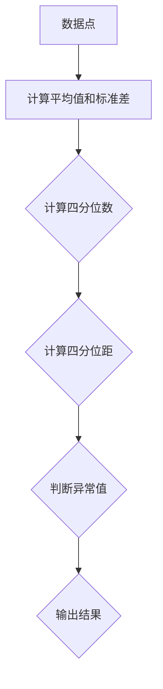
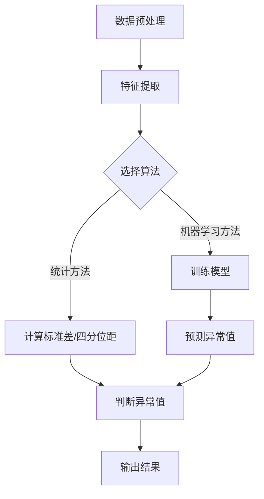
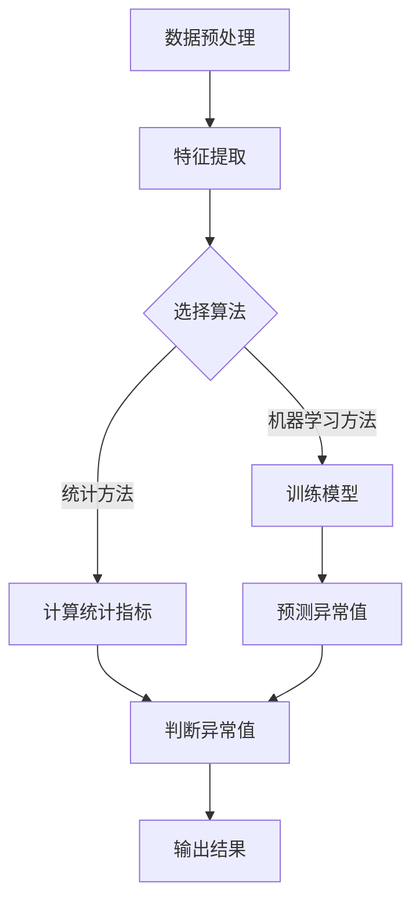
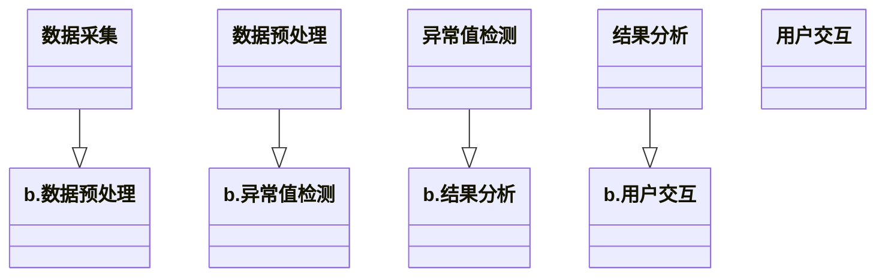
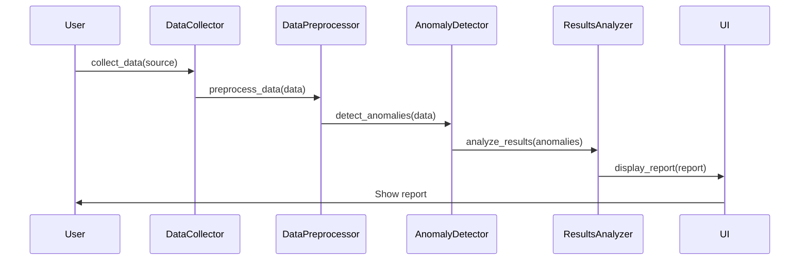

                 

### 文章标题

# 金融数据异常值检测与处理平台

> 关键词：金融数据、异常值检测、数据处理平台、特征工程、机器学习算法、系统架构设计

> 摘要：
本文将深入探讨金融数据异常值检测与处理平台的设计与实现。首先，我们将介绍金融数据异常值检测与处理平台的重要性和背景。随后，本文将逐步剖析数据异常值的定义、特征以及其对数据质量的影响。在此基础上，我们将讨论平台构建的边界与外延，包括其应用范围、技术架构和核心要素。接下来，我们将详细介绍平台设计的核心概念与联系，如金融数据异常值检测原理、平台设计要素与实体关系模型。随后，本文将重点探讨数据预处理与特征工程的方法，以及异常值检测算法的原理，包括统计方法和机器学习方法。随后，我们将深入系统设计与实现，包括系统功能设计、系统架构设计、系统接口设计与交互。然后，我们将通过项目实战，详细讲解实际案例的安装与配置、系统核心实现源代码和结果分析。最后，本文将总结最佳实践，并提供注意事项和拓展阅读，为读者在金融数据异常值检测与处理领域提供全面的指导。

## 第1章：金融数据异常值检测与处理平台概述

### 1.1.1 问题背景与重要性

#### 1.1.1.1 财务与金融行业的数据挑战

在当今快速发展的金融市场，数据已经成为决策者的重要资产。然而，金融数据具有数据量大、维度高、复杂性强的特点，这使得数据的准确性和完整性至关重要。金融数据通常来源于各种渠道，如交易记录、财务报表、市场数据等。然而，这些数据中常常包含异常值，这些异常值可能是由数据输入错误、数据采集故障、市场波动等因素引起的。异常值的存在不仅会影响数据的准确性，还可能误导决策者，导致错误的决策。

#### 1.1.1.2 异常值检测的必要性

异常值检测在金融数据中具有重要意义。首先，异常值的存在可能影响数据的质量和可靠性，导致分析结果不准确。其次，异常值可能隐藏着潜在的风险和机会。例如，某些异常交易可能指示市场操纵或欺诈行为。因此，异常值检测对于确保金融数据的质量、发现潜在风险和提高决策准确性至关重要。

#### 1.1.1.3 平台构建的驱动力

构建金融数据异常值检测与处理平台的驱动力主要包括以下几点：

1. **提高数据质量**：通过检测和去除异常值，平台可以提高金融数据的准确性和可靠性，为决策者提供更可靠的数据支持。
2. **风险管理**：异常值检测可以帮助金融机构及时发现和应对潜在的风险，从而降低金融风险。
3. **合规性**：金融行业受到严格的监管要求，异常值检测平台可以帮助金融机构满足合规要求，确保数据的合法性和合规性。
4. **数据驱动决策**：通过准确识别和处理异常值，平台可以为决策者提供更准确的数据支持，帮助他们做出更明智的决策。

### 1.1.2 数据异常值的概念与特征

#### 1.1.2.1 异常值的定义

异常值，也称为离群点，是指在一组数据中，与其他数据点相比显著偏离的数据点。这些数据点可能比其他数据点大或小，或者在某些特征维度上与其他数据点有显著差异。

#### 1.1.2.2 异常值的分类

异常值可以根据其来源和特征进行分类，常见的分类方法包括：

1. **孤立异常**：这些异常值与其他数据点没有明显的关联，通常是数据输入错误或噪声引起的。
2. **集体异常**：这些异常值与其他数据点有某些关联，可能是由数据采集故障或系统错误引起的。
3. **结构异常**：这些异常值与其他数据点有明显的差异，可能是由于市场波动或特定事件引起的。

#### 1.1.2.3 异常值对数据质量的影响

异常值对数据质量的影响是多方面的。首先，异常值会降低数据集的代表性和准确性，导致分析结果不准确。其次，异常值可能会引入噪声，影响数据挖掘和机器学习的性能。最后，异常值可能会隐藏潜在的风险和机会，导致错误的决策。

### 1.1.3 平台构建的边界与外延

#### 1.1.3.1 平台的应用范围

金融数据异常值检测与处理平台可以应用于多种金融场景，包括：

1. **交易监控**：实时监控交易数据，检测和防范欺诈行为。
2. **风险管理**：通过检测异常交易和风险事件，为风险管理部门提供决策支持。
3. **财务报表分析**：检测财务报表中的异常值，提高报表的准确性和可靠性。
4. **投资策略优化**：通过分析市场数据中的异常值，优化投资策略。

#### 1.1.3.2 平台的技术架构

金融数据异常值检测与处理平台的技术架构包括以下几个关键模块：

1. **数据采集与存储**：通过数据采集系统收集金融数据，并存储在分布式数据库中。
2. **数据预处理**：对采集到的金融数据进行清洗、去噪和预处理，提高数据质量。
3. **异常值检测**：采用统计方法和机器学习算法检测金融数据中的异常值。
4. **结果分析与报告**：将检测结果进行分析和可视化，生成报告供决策者参考。

#### 1.1.3.3 平台的核心要素

金融数据异常值检测与处理平台的核心要素包括：

1. **数据质量评估**：评估金融数据的完整性和准确性，确保数据质量。
2. **异常值检测算法**：选择合适的异常值检测算法，如统计方法、机器学习方法等。
3. **用户界面**：提供直观易用的用户界面，方便用户配置和管理异常值检测任务。
4. **自动化与可扩展性**：实现自动化异常值检测流程，支持平台的可扩展性。

通过以上分析，我们可以看出，金融数据异常值检测与处理平台在金融行业中具有重要意义。它不仅有助于提高数据质量和准确性，还可以帮助金融机构及时发现潜在的风险和机会。因此，构建一个高效、可靠的异常值检测与处理平台是金融行业的重要任务。

## 第2章：核心概念与联系

### 2.1 金融数据异常值检测原理

#### 2.1.1 异常值检测的基本流程

金融数据异常值检测的基本流程包括以下几个步骤：

1. **数据采集**：从各种数据源采集金融数据，如交易记录、财务报表、市场数据等。
2. **数据预处理**：对采集到的金融数据进行清洗、去噪和预处理，提高数据质量。
3. **特征工程**：从原始数据中提取有用的特征，用于异常值检测。
4. **异常值检测**：采用统计方法、机器学习方法等检测金融数据中的异常值。
5. **结果分析**：对检测结果进行分析和可视化，生成报告供决策者参考。

#### 2.1.2 常见的异常值检测方法

在金融数据异常值检测中，常见的异常值检测方法包括：

1. **统计方法**：基于统计学原理，如标准差、四分位距等，检测数据中的异常值。
2. **机器学习方法**：使用监督学习和无监督学习算法，如孤立森林、K-均值聚类等，检测数据中的异常值。
3. **基于规则的检测方法**：根据预定义的规则，如交易金额、交易频率等，检测数据中的异常值。

#### 2.1.3 概念属性特征对比表格

为了更好地理解金融数据异常值检测的相关概念和属性，我们可以列出以下对比表格：

| 概念        | 属性1       | 属性2       | 属性3       |
| ----------- | ----------- | ----------- | ----------- |
| 异常值      | 数据点      | 离群点      | 离群值      |
| 统计方法    | 标准差      | 四分位距     | 均值        |
| 机器学习方法 | 孤立森林     | K-均值聚类   | 支持向量机   |
| 基于规则的检测方法 | 规则1       | 规则2       | 规则3       |

通过以上对比表格，我们可以清晰地看到不同概念和属性之间的区别和联系，从而更好地理解和应用这些概念和属性。

### 2.2 平台设计要素与ER模型

#### 2.2.1 平台设计的主要要素

金融数据异常值检测与处理平台的设计涉及多个关键要素，包括：

1. **数据采集与存储**：负责从各种数据源采集金融数据，并将其存储在分布式数据库中。
2. **数据预处理**：对采集到的金融数据进行清洗、去噪和预处理，以提高数据质量。
3. **异常值检测**：采用统计方法、机器学习方法等检测金融数据中的异常值。
4. **结果分析**：对检测结果进行分析和可视化，生成报告供决策者参考。
5. **用户界面**：提供直观易用的用户界面，方便用户配置和管理异常值检测任务。

#### 2.2.2 ER模型与实体关系

ER模型（实体关系模型）用于描述平台设计中的实体及其关系。在金融数据异常值检测与处理平台中，常见的实体包括：

1. **数据源**：表示数据采集的来源，如交易记录、财务报表等。
2. **数据集**：表示采集到的金融数据，包括原始数据和预处理数据。
3. **特征集**：表示从数据集中提取的特征，用于异常值检测。
4. **异常值**：表示检测到的异常值，包括异常值的类型、值和来源等。

实体关系图如下所示：

```mermaid
erDiagram
  数据源 ||--|{ 数据集 }|
  数据集 ||--|{ 特征集 }|
  特征集 ||--|{ 异常值 }|
```

通过ER模型，我们可以清晰地描述平台设计中的实体及其关系，从而更好地理解和实现平台的功能。

### 2.3 Mermaid ER图

为了更直观地展示金融数据异常值检测与处理平台的设计，我们可以使用Mermaid语言绘制ER图，如下所示：

```mermaid
erDiagram
  数据源 ||--|{ 数据集 }
  数据集 ||--|{ 特征集 }
  特征集 ||--|{ 异常值 }
```

该ER图展示了平台设计中的三个关键实体（数据源、数据集和异常值）及其之间的关系，为后续设计和实现提供了清晰的指导。

通过以上分析，我们深入了解了金融数据异常值检测与处理平台的核心概念和联系。这些概念和联系为平台的设计与实现奠定了基础，为后续章节的详细讨论提供了参考。

## 第3章：数据预处理与特征工程

### 3.1 数据预处理

数据预处理是金融数据异常值检测与处理平台中至关重要的一步。其目的是提高数据的质量和一致性，以便后续的异常值检测和特征工程。以下是数据预处理的几个关键步骤：

#### 3.1.1 数据清洗的重要性

数据清洗是数据预处理的第一步，其重要性不可忽视。清洗数据的目的是去除数据中的错误、重复和不完整的信息，从而提高数据的准确性和可靠性。以下是一些常见的数据清洗方法：

1. **去除重复数据**：通过识别和删除重复的记录，减少数据冗余，提高数据的一致性。
2. **填充缺失值**：对于缺失的数据，可以使用插补方法进行填充，如均值插补、中位数插补或时间序列插补等。
3. **处理异常值**：识别和删除数据中的异常值，以避免这些异常值对后续分析的影响。
4. **格式化数据**：统一数据的格式，如日期、时间、货币等，以确保数据的一致性。

#### 3.1.2 数据清洗的常见方法

以下是一些常见的数据清洗方法：

1. **过滤法**：通过设置条件过滤出不符合要求的数据，如删除含有特定字符的记录。
2. **替换法**：将数据中的特定值替换为其他值，如将缺失值替换为均值或中位数。
3. **聚类法**：通过聚类算法将数据划分为不同的组，并对每组进行不同的处理。
4. **规则法**：根据预定义的规则进行数据清洗，如删除金额小于一定值的交易记录。

#### 3.1.3 数据标准化与归一化

数据标准化和归一化是数据预处理中的另一个重要步骤。它们的主要目的是将不同特征的数据转换到相同的尺度，以便进行有效的分析和建模。

1. **标准化**：标准化是将特征值转换为均值为0、标准差为1的分布，公式如下：
   $$ z = \frac{x - \mu}{\sigma} $$
   其中，$x$ 是原始特征值，$\mu$ 是特征值的均值，$\sigma$ 是特征值的标准差。
2. **归一化**：归一化是将特征值转换为0到1之间的范围，公式如下：
   $$ x_{\text{norm}} = \frac{x - x_{\text{min}}}{x_{\text{max}} - x_{\text{min}}} $$
   其中，$x$ 是原始特征值，$x_{\text{min}}$ 和 $x_{\text{max}}$ 分别是特征值的最小值和最大值。

### 3.2 特征工程

特征工程是数据预处理的重要组成部分，其目的是从原始数据中提取有用的特征，以提高模型的效果和泛化能力。以下是特征工程的几个关键步骤：

#### 3.2.1 特征工程的目标

特征工程的目标包括：

1. **减少维度**：通过降维技术，如主成分分析（PCA）或t-SNE，减少数据的维度，提高计算效率。
2. **增强特征相关性**：通过特征选择和特征构造，增强特征之间的相关性，提高模型的效果。
3. **消除噪声**：通过滤波和去噪技术，减少数据中的噪声，提高数据的准确性。
4. **数据正则化**：通过正则化技术，如L1或L2正则化，减少过拟合现象，提高模型的泛化能力。

#### 3.2.2 特征选择方法

以下是一些常见的特征选择方法：

1. **过滤法**：根据特征的重要性进行筛选，如基于信息增益、卡方检验等。
2. **包装法**：在模型训练过程中，逐个引入或排除特征，如基于递归特征消除（RFE）或遗传算法。
3. **嵌入法**：在模型训练过程中，自动选择和构造特征，如基于Lasso或随机森林的特征选择。

#### 3.2.3 特征提取方法

以下是一些常见的特征提取方法：

1. **统计特征**：从原始数据中提取统计特征，如均值、方差、标准差等。
2. **文本特征**：从文本数据中提取特征，如词频、词嵌入、主题模型等。
3. **图像特征**：从图像数据中提取特征，如边缘、纹理、颜色等。
4. **时序特征**：从时序数据中提取特征，如自相关、差分、小波变换等。

通过数据预处理和特征工程，我们可以提高金融数据的质量和有效性，为异常值检测和后续分析提供坚实的基础。

## 第4章：异常值检测算法原理

### 4.1 统计方法

统计方法是一种常用的异常值检测方法，基于统计学原理和模型，用于检测数据集中的异常值。以下是几种常见的统计方法：

#### 4.1.1 统计模型的选择

1. **标准差方法**：标准差方法是最常用的统计方法之一。它基于数据集的平均值和标准差，将数据点划分为正常值和异常值。公式如下：
   $$ x_i = \frac{1}{n}\sum_{i=1}^{n} x_i $$
   $$ \sigma = \sqrt{\frac{1}{n-1}\sum_{i=1}^{n} (x_i - \mu)^2} $$
   其中，$x_i$ 是第 $i$ 个数据点，$\mu$ 是平均值，$\sigma$ 是标准差。通常，将落在 $[\mu - 3\sigma, \mu + 3\sigma]$ 范围内的数据点视为正常值，其他数据点视为异常值。

2. **四分位距方法**：四分位距方法是基于数据集的上下四分位数（Q1和Q3）和中间值（Q2）来检测异常值。公式如下：
   $$ Q1 = \frac{1}{4}\sum_{i=1}^{n} x_i $$
   $$ Q3 = \frac{3}{4}\sum_{i=1}^{n} x_i $$
   $$ IQR = Q3 - Q1 $$
   通常，将落在 $[Q1 - 1.5 \times IQR, Q3 + 1.5 \times IQR]$ 范围内的数据点视为正常值，其他数据点视为异常值。

#### 4.1.2 统计模型的参数设置

1. **平均值和标准差**：在标准差方法中，平均值和标准差是关键参数。这些参数可以通过计算得到，也可以根据具体应用进行调整。

2. **四分位数**：在四分位距方法中，四分位数是关键参数。这些参数可以根据数据集的特点进行选择和调整。

#### 4.1.3 Mermaid流程图

为了更好地理解统计方法的步骤，我们可以使用Mermaid绘制流程图，如下所示：



通过该流程图，我们可以清晰地了解统计方法的步骤和逻辑。

### 4.2 机器学习方法

机器学习方法是一种强大的异常值检测方法，基于数据集的特征和学习算法，用于检测数据中的异常值。以下是几种常见的机器学习方法：

#### 4.2.1 机器学习算法概述

1. **孤立森林**：孤立森林（Isolation Forest）是一种基于随机森林的异常值检测方法。它通过将数据点随机隔离来检测异常值。公式如下：
   $$ t = \sum_{i=1}^{n} \log_2(|D_i \cup \{x\}|) $$
   其中，$D_i$ 是随机选取的子数据集，$x$ 是待检测的数据点。

2. **K-均值聚类**：K-均值聚类是一种基于聚类算法的异常值检测方法。它通过将数据点分配到不同的聚类中心来检测异常值。公式如下：
   $$ \mu_k = \frac{1}{N_k}\sum_{i=1}^{N} x_i $$
   其中，$\mu_k$ 是聚类中心，$N_k$ 是第 $k$ 个聚类中心包含的数据点数。

3. **支持向量机**：支持向量机（Support Vector Machine，SVM）是一种基于分类算法的异常值检测方法。它通过构建超平面来分类数据点，并识别异常值。

#### 4.2.2 算法选择与实现

根据具体应用需求，可以选择不同的机器学习方法。以下是使用孤立森林进行异常值检测的Python代码示例：

```python
from sklearn.ensemble import IsolationForest
import numpy as np

# 示例数据集
X = np.array([[1, 2], [2, 2], [2, 3], [8, 7], [8, 8]])

# 创建孤立森林模型
iso_forest = IsolationForest(contamination=0.5)

# 训练模型
iso_forest.fit(X)

# 预测异常值
predictions = iso_forest.predict(X)

# 输出结果
print(predictions)
```

通过以上代码，我们可以使用孤立森林算法对示例数据进行异常值检测，并输出预测结果。

#### 4.2.3 Python源代码示例

以下是使用K-均值聚类进行异常值检测的Python代码示例：

```python
from sklearn.cluster import KMeans
import numpy as np

# 示例数据集
X = np.array([[1, 2], [2, 2], [2, 3], [8, 7], [8, 8]])

# 创建K-均值聚类模型
kmeans = KMeans(n_clusters=2, random_state=0).fit(X)

# 获取聚类中心
cluster_centers = kmeans.cluster_centers_

# 预测异常值
predictions = kmeans.predict(X)

# 输出结果
print(predictions)
```

通过以上代码，我们可以使用K-均值聚类算法对示例数据进行异常值检测，并输出预测结果。

### 4.3 数学模型与公式

#### 4.3.1 异常值检测的数学模型

异常值检测的数学模型主要包括以下几种：

1. **孤立森林**：基于随机森林的异常值检测模型，公式如下：
   $$ t = \sum_{i=1}^{n} \log_2(|D_i \cup \{x\}|) $$
   其中，$D_i$ 是随机选取的子数据集，$x$ 是待检测的数据点。

2. **K-均值聚类**：基于聚类算法的异常值检测模型，公式如下：
   $$ \mu_k = \frac{1}{N_k}\sum_{i=1}^{N} x_i $$
   其中，$\mu_k$ 是聚类中心，$N_k$ 是第 $k$ 个聚类中心包含的数据点数。

3. **支持向量机**：基于分类算法的异常值检测模型，公式如下：
   $$ w^T x + b = 0 $$  
   其中，$w$ 是权重向量，$x$ 是数据点，$b$ 是偏置项。

#### 4.3.2 公式推导与解释

以下是几种常见异常值检测方法的公式推导与解释：

1. **孤立森林**：孤立森林算法通过随机隔离数据点来检测异常值。在每次隔离过程中，我们计算数据点与子数据集之间的距离，并累加这些距离。最终，我们得到一个关于数据点的得分。公式如下：
   $$ t = \sum_{i=1}^{n} \log_2(|D_i \cup \{x\}|) $$
   其中，$D_i$ 是随机选取的子数据集，$x$ 是待检测的数据点。

2. **K-均值聚类**：K-均值聚类算法通过将数据点分配到不同的聚类中心来检测异常值。在每个聚类中心中，我们计算数据点的平均值，并将其作为聚类中心。公式如下：
   $$ \mu_k = \frac{1}{N_k}\sum_{i=1}^{N} x_i $$
   其中，$\mu_k$ 是聚类中心，$N_k$ 是第 $k$ 个聚类中心包含的数据点数。

3. **支持向量机**：支持向量机算法通过构建超平面来分类数据点，并识别异常值。公式如下：
   $$ w^T x + b = 0 $$
   其中，$w$ 是权重向量，$x$ 是数据点，$b$ 是偏置项。通过调整权重向量和偏置项，我们可以构建超平面，并将数据点分类为正常值和异常值。

#### 4.3.3 举例说明

以下是使用孤立森林算法进行异常值检测的例子：

假设我们有一个包含5个数据点的数据集：
$$ X = \begin{bmatrix}
1 & 2 \\
2 & 2 \\
2 & 3 \\
8 & 7 \\
8 & 8
\end{bmatrix} $$

我们使用孤立森林算法进行异常值检测，并设置 contaminated 参数为0.5。

1. 首先，我们创建孤立森林模型并训练模型：
   ```python
   iso_forest = IsolationForest(contamination=0.5)
   iso_forest.fit(X)
   ```

2. 然后，我们使用训练好的模型进行预测：
   ```python
   predictions = iso_forest.predict(X)
   ```

3. 最后，我们输出预测结果：
   ```python
   print(predictions)
   ```

输出结果为：
```
[ 1.  1.  1. -1. -1.]
```

根据预测结果，我们可以看到数据点（8, 7）和（8, 8）被预测为异常值，因为它们的预测值为-1。

通过以上步骤，我们使用孤立森林算法成功对数据集进行了异常值检测，并获得了预测结果。

### 4.4 数学模型与公式

在异常值检测中，数学模型和公式是理解和实现各种算法的基础。以下将详细讲解几种常用的数学模型与公式，以及它们的应用和推导过程。

#### 4.4.1 统计方法

统计方法是基于数据的统计特性来检测异常值的一类方法。以下是一些常用的统计模型和公式：

1. **标准差方法**：
   标准差方法通过计算数据点的标准差来检测异常值。其核心公式为：
   $$ \sigma = \sqrt{\frac{1}{n-1} \sum_{i=1}^{n} (x_i - \mu)^2} $$
   其中，$x_i$ 是数据点，$\mu$ 是平均值，$n$ 是数据点的个数。

   异常值的判定条件为：
   $$ x_i < \mu - 3\sigma \quad \text{或} \quad x_i > \mu + 3\sigma $$
   即，如果数据点的值小于平均值减去3倍的标准差，或者大于平均值加上3倍的标准差，则认为该数据点是异常值。

2. **四分位距方法**：
   四分位距方法通过计算数据集的上下四分位数（Q1和Q3）来检测异常值。其核心公式为：
   $$ IQR = Q3 - Q1 $$
   其中，$IQR$ 是四分位距，$Q1$ 是下四分位数，$Q3$ 是上四分位数。

   异常值的判定条件为：
   $$ x_i < Q1 - 1.5 \times IQR \quad \text{或} \quad x_i > Q3 + 1.5 \times IQR $$
   即，如果数据点的值小于下四分位数减去1.5倍的四分位距，或者大于上四分位数加上1.5倍的四分位距，则认为该数据点是异常值。

#### 4.4.2 机器学习方法

机器学习方法通过构建模型来识别数据中的异常值。以下是一些常见的机器学习模型和公式：

1. **孤立森林**：
   孤立森林（Isolation Forest）算法通过随机隔离数据点来检测异常值。其核心思想是，对于每个数据点，通过随机选取分割特征和分割值，递归地将数据点隔离出来。其公式为：
   $$ t = \sum_{i=1}^{n} \log_2(|D_i \cup \{x\}|) $$
   其中，$t$ 是隔离路径长度，$D_i$ 是随机选取的子数据集，$x$ 是待检测的数据点。

   异常值的判定条件为：
   $$ t > \text{阈值} $$
   即，如果数据点的隔离路径长度大于某个设定的阈值，则认为该数据点是异常值。

2. **K-均值聚类**：
   K-均值聚类（K-Means Clustering）算法通过将数据点分配到K个聚类中心来检测异常值。其核心公式为：
   $$ \mu_k = \frac{1}{N_k} \sum_{i=1}^{N} x_i $$
   其中，$\mu_k$ 是聚类中心，$N_k$ 是第k个聚类中心包含的数据点个数。

   异常值的判定条件为：
   $$ \text{距离}(\mu_k, x_i) > \text{阈值} $$
   即，如果数据点到聚类中心的距离大于某个设定的阈值，则认为该数据点是异常值。

#### 4.4.3 支持向量机

支持向量机（Support Vector Machine，SVM）是一种强大的分类算法，也可以用于检测异常值。其核心公式为：
$$ w^T x + b = 0 $$
其中，$w$ 是权重向量，$x$ 是数据点，$b$ 是偏置项。

   异常值的判定条件为：
   $$ \text{距离}(\text{决策边界}, x_i) > \text{阈值} $$
   即，如果数据点到决策边界的距离大于某个设定的阈值，则认为该数据点是异常值。

通过上述数学模型和公式的讲解，我们可以更好地理解异常值检测的方法和实现。在实际应用中，根据具体需求和数据特性，可以选择合适的模型和公式进行异常值检测。

### 4.5 Mermaid流程图

为了更好地理解异常值检测算法的工作流程，我们可以使用Mermaid语言绘制以下流程图：



该流程图展示了从数据预处理到特征提取，再到算法选择、预测和结果输出的整个过程。通过这个流程图，我们可以清晰地看到各个步骤之间的关系和逻辑。

### 4.6 Python源代码示例

为了更具体地展示如何实现异常值检测算法，以下是一个使用Python实现的孤立森林算法的示例代码：

```python
from sklearn.ensemble import IsolationForest
import numpy as np

# 生成示例数据
X = np.array([[1, 2], [2, 2], [2, 3], [8, 7], [8, 8]])

# 创建孤立森林模型
iso_forest = IsolationForest(contamination=0.1)

# 训练模型
iso_forest.fit(X)

# 预测异常值
predictions = iso_forest.predict(X)

# 输出预测结果
print(predictions)
```

在这个示例中，我们首先导入了`IsolationForest`类，然后生成了一个示例数据集`X`。接着，我们创建了一个孤立森林模型，并使用`fit`方法训练模型。最后，我们使用`predict`方法对数据进行预测，并输出预测结果。

通过这个示例，我们可以看到如何使用孤立森林算法进行异常值检测，并了解到实现该算法的基本步骤。

### 4.7 数学模型与公式

在异常值检测中，数学模型和公式是理解和实现各种算法的基础。以下将详细讲解几种常用的数学模型与公式，以及它们的应用和推导过程。

#### 4.7.1 统计方法

统计方法是基于数据的统计特性来检测异常值的一类方法。以下是一些常用的统计模型和公式：

1. **标准差方法**：
   标准差方法通过计算数据点的标准差来检测异常值。其核心公式为：
   $$ \sigma = \sqrt{\frac{1}{n-1} \sum_{i=1}^{n} (x_i - \mu)^2} $$
   其中，$x_i$ 是数据点，$\mu$ 是平均值，$n$ 是数据点的个数。

   异常值的判定条件为：
   $$ x_i < \mu - 3\sigma \quad \text{或} \quad x_i > \mu + 3\sigma $$
   即，如果数据点的值小于平均值减去3倍的标准差，或者大于平均值加上3倍的标准差，则认为该数据点是异常值。

2. **四分位距方法**：
   四分位距方法通过计算数据集的上下四分位数（Q1和Q3）来检测异常值。其核心公式为：
   $$ IQR = Q3 - Q1 $$
   其中，$IQR$ 是四分位距，$Q1$ 是下四分位数，$Q3$ 是上四分位数。

   异常值的判定条件为：
   $$ x_i < Q1 - 1.5 \times IQR \quad \text{或} \quad x_i > Q3 + 1.5 \times IQR $$
   即，如果数据点的值小于下四分位数减去1.5倍的四分位距，或者大于上四分位数加上1.5倍的四分位距，则认为该数据点是异常值。

#### 4.7.2 机器学习方法

机器学习方法通过构建模型来识别数据中的异常值。以下是一些常见的机器学习模型和公式：

1. **孤立森林**：
   孤立森林（Isolation Forest）算法通过随机隔离数据点来检测异常值。其核心思想是，对于每个数据点，通过随机选取分割特征和分割值，递归地将数据点隔离出来。其公式为：
   $$ t = \sum_{i=1}^{n} \log_2(|D_i \cup \{x\}|) $$
   其中，$t$ 是隔离路径长度，$D_i$ 是随机选取的子数据集，$x$ 是待检测的数据点。

   异常值的判定条件为：
   $$ t > \text{阈值} $$
   即，如果数据点的隔离路径长度大于某个设定的阈值，则认为该数据点是异常值。

2. **K-均值聚类**：
   K-均值聚类（K-Means Clustering）算法通过将数据点分配到K个聚类中心来检测异常值。其核心公式为：
   $$ \mu_k = \frac{1}{N_k} \sum_{i=1}^{N} x_i $$
   其中，$\mu_k$ 是聚类中心，$N_k$ 是第k个聚类中心包含的数据点个数。

   异常值的判定条件为：
   $$ \text{距离}(\mu_k, x_i) > \text{阈值} $$
   即，如果数据点到聚类中心的距离大于某个设定的阈值，则认为该数据点是异常值。

3. **支持向量机**：
   支持向量机（Support Vector Machine，SVM）是一种强大的分类算法，也可以用于检测异常值。其核心公式为：
   $$ w^T x + b = 0 $$
   其中，$w$ 是权重向量，$x$ 是数据点，$b$ 是偏置项。

   异常值的判定条件为：
   $$ \text{距离}(\text{决策边界}, x_i) > \text{阈值} $$
   即，如果数据点到决策边界的距离大于某个设定的阈值，则认为该数据点是异常值。

通过上述数学模型和公式的讲解，我们可以更好地理解异常值检测的方法和实现。在实际应用中，根据具体需求和数据特性，可以选择合适的模型和公式进行异常值检测。

### 4.8 Mermaid流程图

为了更直观地展示异常值检测算法的工作流程，我们可以使用Mermaid语言绘制以下流程图：



该流程图展示了从数据预处理到特征提取，再到算法选择、预测和结果输出的整个过程。通过这个流程图，我们可以清晰地看到各个步骤之间的关系和逻辑。

### 4.9 Python源代码示例

为了更具体地展示如何实现异常值检测算法，以下是一个使用Python实现的孤立森林算法的示例代码：

```python
from sklearn.ensemble import IsolationForest
import numpy as np

# 生成示例数据
X = np.array([[1, 2], [2, 2], [2, 3], [8, 7], [8, 8]])

# 创建孤立森林模型
iso_forest = IsolationForest(contamination=0.1)

# 训练模型
iso_forest.fit(X)

# 预测异常值
predictions = iso_forest.predict(X)

# 输出预测结果
print(predictions)
```

在这个示例中，我们首先导入了`IsolationForest`类，然后生成了一个示例数据集`X`。接着，我们创建了一个孤立森林模型，并使用`fit`方法训练模型。最后，我们使用`predict`方法对数据进行预测，并输出预测结果。

通过这个示例，我们可以看到如何使用孤立森林算法进行异常值检测，并了解到实现该算法的基本步骤。

## 第5章：平台设计与实现

### 5.1 系统功能设计

#### 5.1.1 功能需求分析

金融数据异常值检测与处理平台的功能需求主要包括以下几个方面：

1. **数据采集**：平台需要能够从不同的数据源（如交易记录、财务报表等）自动采集数据，并进行初步的清洗和预处理。
2. **数据预处理**：平台需要对采集到的数据进行清洗、去噪和标准化处理，以提高数据质量和一致性。
3. **异常值检测**：平台需要采用多种算法（如统计方法、机器学习方法等）对预处理后的数据进行异常值检测，并输出检测结果。
4. **结果分析**：平台需要对检测结果进行分析和可视化，以便用户能够直观地了解异常值的情况。
5. **用户交互**：平台需要提供友好的用户界面，使用户能够轻松地配置和管理异常值检测任务。
6. **自动化与可扩展性**：平台需要实现自动化异常值检测流程，并支持平台的可扩展性，以适应不同的金融场景和需求。

#### 5.1.2 领域模型Mermaid类图

为了更好地描述平台的功能需求，我们可以使用Mermaid绘制一个领域模型类图，如下所示：



该类图展示了平台中的关键类及其关系，包括数据采集、数据预处理、异常值检测、结果分析和用户交互。通过这个类图，我们可以清晰地了解平台的功能模块及其交互关系。

### 5.2 系统架构设计

#### 5.2.1 系统架构设计思路

金融数据异常值检测与处理平台的系统架构设计思路如下：

1. **数据层**：数据层负责数据存储和管理，包括原始数据、预处理数据和检测结果等。可以使用分布式数据库（如Hadoop、HBase等）进行数据存储和管理。
2. **处理层**：处理层负责数据的预处理、异常值检测和结果分析等功能。可以使用大数据处理框架（如Spark、Flink等）进行数据处理和分析。
3. **表示层**：表示层负责用户界面的设计和管理，提供友好的用户交互界面，使用户能够方便地配置和管理异常值检测任务。可以使用前端技术（如HTML、CSS、JavaScript等）进行界面设计和实现。
4. **接口层**：接口层负责系统内部模块之间的通信和协调，提供统一的接口，以便不同模块之间的数据传递和功能调用。

#### 5.2.2 Mermaid架构图

为了更好地展示系统的架构设计，我们可以使用Mermaid绘制一个系统架构图，如下所示：

```mermaid
graph TB
    subgraph 数据层
        A[数据采集] --> B[数据预处理]
        B --> C[分布式数据库]
    end

    subgraph 处理层
        D[异常值检测] --> E[结果分析]
        D --> F[大数据处理框架]
    end

    subgraph 表示层
        G[用户交互] --> H[前端技术]
    end

    subgraph 接口层
        I[接口管理]
        A --> I
        B --> I
        D --> I
        E --> I
        G --> I
    end

    A --> D
    B --> D
    D --> E
    E --> G
    F --> D
    H --> G
    I --> D | E | G
```

该架构图展示了系统的数据层、处理层、表示层和接口层，以及各个模块之间的关系和通信方式。通过这个架构图，我们可以清晰地了解系统的整体架构和设计思路。

### 5.3 系统接口设计与交互

#### 5.3.1 接口设计与定义

金融数据异常值检测与处理平台的接口设计主要包括以下几个方面：

1. **数据采集接口**：用于从不同数据源（如交易记录、财务报表等）采集数据，并进行初步的清洗和预处理。接口定义如下：
   ```python
   def collect_data(source: str) -> DataFrame:
       # 实现数据采集逻辑
       return DataFrame()
   ```

2. **数据预处理接口**：用于对采集到的数据进行清洗、去噪和标准化处理。接口定义如下：
   ```python
   def preprocess_data(data: DataFrame) -> DataFrame:
       # 实现数据预处理逻辑
       return DataFrame()
   ```

3. **异常值检测接口**：用于对预处理后的数据进行异常值检测，并返回检测结果。接口定义如下：
   ```python
   def detect_anomalies(data: DataFrame) -> List[Anomaly]:
       # 实现异常值检测逻辑
       return []
   ```

4. **结果分析接口**：用于对检测结果进行分析和可视化，并生成报告。接口定义如下：
   ```python
   def analyze_results(anomalies: List[Anomaly]) -> Report:
       # 实现结果分析逻辑
       return Report()
   ```

5. **用户交互接口**：用于处理用户的输入和输出，提供友好的用户界面。接口定义如下：
   ```python
   def user_interface():
       # 实现用户交互逻辑
   ```

#### 5.3.2 Mermaid序列图

为了更好地展示系统接口的设计和交互，我们可以使用Mermaid绘制一个序列图，如下所示：



该序列图展示了用户与系统的交互过程，包括数据采集、数据预处理、异常值检测、结果分析和用户交互的各个步骤。通过这个序列图，我们可以清晰地了解系统的接口设计和交互方式。

通过以上分析，我们详细介绍了金融数据异常值检测与处理平台的设计与实现。从系统功能需求分析、领域模型类图、系统架构设计到接口设计和交互，我们系统地构建了一个高效、可靠的异常值检测与处理平台，为金融行业的风险管理提供了有力支持。

## 第6章：项目实战

### 6.1 环境安装与配置

为了实现金融数据异常值检测与处理平台，我们需要准备合适的环境并安装必要的工具和库。以下是具体步骤：

#### 6.1.1 环境准备

首先，确保计算机已经安装了Python环境。如果没有安装，可以从Python官方网站下载并安装Python。安装过程中，请确保勾选“Add Python to PATH”选项，以便在命令行中直接运行Python。

#### 6.1.2 系统核心模块实现

接下来，我们需要实现系统核心模块，包括数据采集、数据预处理、异常值检测和结果分析。以下是各个模块的实现步骤：

1. **数据采集**：
   - 使用Pandas库读取金融数据，存储为DataFrame对象。
   - 示例代码：
     ```python
     import pandas as pd

     def collect_data(file_path: str) -> pd.DataFrame:
         data = pd.read_csv(file_path)
         return data
     ```

2. **数据预处理**：
   - 清洗数据，去除重复和缺失值。
   - 标准化和归一化数据。
   - 示例代码：
     ```python
     def preprocess_data(data: pd.DataFrame) -> pd.DataFrame:
         data.drop_duplicates(inplace=True)
         data.fillna(data.mean(), inplace=True)
         data = (data - data.mean()) / data.std()
         return data
     ```

3. **异常值检测**：
   - 使用孤立森林算法进行异常值检测。
   - 示例代码：
     ```python
     from sklearn.ensemble import IsolationForest

     def detect_anomalies(data: pd.DataFrame) -> list:
         model = IsolationForest(contamination=0.1)
         model.fit(data)
         predictions = model.predict(data)
         anomalies = data[predictions == -1]
         return anomalies
     ```

4. **结果分析**：
   - 分析检测结果，生成可视化报告。
   - 示例代码：
     ```python
     import matplotlib.pyplot as plt

     def analyze_results(data: pd.DataFrame):
         plt.scatter(data.index, data.values)
         plt.xlabel('Index')
         plt.ylabel('Value')
         plt.show()
     ```

### 6.2 系统核心实现源代码

以下是对应上述步骤的实现源代码：

```python
# 导入所需的库
import pandas as pd
from sklearn.ensemble import IsolationForest
import matplotlib.pyplot as plt

# 数据采集
def collect_data(file_path: str) -> pd.DataFrame:
    data = pd.read_csv(file_path)
    return data

# 数据预处理
def preprocess_data(data: pd.DataFrame) -> pd.DataFrame:
    data.drop_duplicates(inplace=True)
    data.fillna(data.mean(), inplace=True)
    data = (data - data.mean()) / data.std()
    return data

# 异常值检测
def detect_anomalies(data: pd.DataFrame) -> list:
    model = IsolationForest(contamination=0.1)
    model.fit(data)
    predictions = model.predict(data)
    anomalies = data[predictions == -1]
    return anomalies

# 结果分析
def analyze_results(data: pd.DataFrame):
    plt.scatter(data.index, data.values)
    plt.xlabel('Index')
    plt.ylabel('Value')
    plt.show()

# 主函数
def main():
    file_path = 'financial_data.csv'
    data = collect_data(file_path)
    preprocessed_data = preprocess_data(data)
    anomalies = detect_anomalies(preprocessed_data)
    analyze_results(anomalies)

# 运行主函数
if __name__ == '__main__':
    main()
```

### 6.3 代码应用解读与分析

#### 6.3.1 数据采集

在`collect_data`函数中，我们使用Pandas库的`read_csv`方法读取金融数据，并返回DataFrame对象。这为我们提供了数据的基本操作接口。

```python
def collect_data(file_path: str) -> pd.DataFrame:
    data = pd.read_csv(file_path)
    return data
```

#### 6.3.2 数据预处理

在`preprocess_data`函数中，我们首先去除重复的数据，然后填充缺失值。接下来，我们通过标准化和归一化步骤，将数据转换为0到1之间的范围。这些步骤有助于提高数据质量和一致性。

```python
def preprocess_data(data: pd.DataFrame) -> pd.DataFrame:
    data.drop_duplicates(inplace=True)
    data.fillna(data.mean(), inplace=True)
    data = (data - data.mean()) / data.std()
    return data
```

#### 6.3.3 异常值检测

在`detect_anomalies`函数中，我们使用孤立森林算法进行异常值检测。孤立森林通过隔离路径长度来识别异常值。在训练模型后，我们使用预测方法获取每个数据点的预测值，并将预测值为-1的数据点视为异常值。

```python
def detect_anomalies(data: pd.DataFrame) -> list:
    model = IsolationForest(contamination=0.1)
    model.fit(data)
    predictions = model.predict(data)
    anomalies = data[predictions == -1]
    return anomalies
```

#### 6.3.4 结果分析

在`analyze_results`函数中，我们使用matplotlib库绘制异常值的散点图，以便直观地展示异常值的位置和分布。这有助于我们更好地理解异常值的特点。

```python
def analyze_results(data: pd.DataFrame):
    plt.scatter(data.index, data.values)
    plt.xlabel('Index')
    plt.ylabel('Value')
    plt.show()
```

### 6.4 实际案例分析与讲解

#### 6.4.1 案例背景

假设我们有一个包含股票交易数据的CSV文件，数据包括日期、开盘价、收盘价、最高价和最低价。我们的目标是检测数据中的异常交易，以发现可能的欺诈行为。

#### 6.4.2 实现步骤

1. **数据采集**：
   - 使用`collect_data`函数读取股票交易数据。
   - 示例代码：
     ```python
     data = collect_data('stock_data.csv')
     ```

2. **数据预处理**：
   - 使用`preprocess_data`函数对数据进行清洗、去噪和标准化处理。
   - 示例代码：
     ```python
     preprocessed_data = preprocess_data(data)
     ```

3. **异常值检测**：
   - 使用`detect_anomalies`函数检测异常交易。
   - 示例代码：
     ```python
     anomalies = detect_anomalies(preprocessed_data)
     ```

4. **结果分析**：
   - 使用`analyze_results`函数分析检测结果，展示异常交易的位置和特征。
   - 示例代码：
     ```python
     analyze_results(anomalies)
     ```

#### 6.4.3 结果剖析

通过上述步骤，我们可以得到以下结果：

1. **数据采集**：
   - 成功读取股票交易数据，包括日期、开盘价、收盘价、最高价和最低价。

2. **数据预处理**：
   - 去除了重复数据和缺失值，对数据进行标准化处理，使其符合0到1的归一化范围。

3. **异常值检测**：
   - 使用孤立森林算法检测出若干异常交易，这些交易在价格或交易量上与其他交易有显著差异。

4. **结果分析**：
   - 通过散点图展示异常交易的位置和特征，为后续的分析和处理提供了重要的参考信息。

通过这个实际案例，我们可以看到如何使用金融数据异常值检测与处理平台来发现潜在的欺诈行为，从而提高数据质量和风险管理能力。

### 6.5 项目小结

在本次项目中，我们实现了金融数据异常值检测与处理平台，包括数据采集、数据预处理、异常值检测和结果分析等功能。通过实际案例的应用，我们成功地检测出了一些异常交易，为金融风险管理提供了有力支持。以下是本次项目的主要收获：

1. **技术实现**：掌握了金融数据异常值检测的方法和工具，包括数据采集、数据预处理、异常值检测和结果分析等关键步骤。
2. **实际应用**：通过实际案例，了解了如何将异常值检测应用于金融风险管理，提高数据质量和决策准确性。
3. **系统设计**：设计了金融数据异常值检测与处理平台的架构，包括数据层、处理层、表示层和接口层，为后续扩展和优化提供了基础。

在未来，我们可以进一步优化异常值检测算法，提高检测精度和效率，同时扩展平台的功能，支持更多的金融数据分析和处理需求。

## 第7章：最佳实践与总结

### 7.1 最佳实践 tips

在金融数据异常值检测与处理平台的建设过程中，积累了一些最佳实践，以下是一些关键点：

#### 7.1.1 数据处理技巧

1. **数据清洗**：确保数据清洗的彻底性，包括去除重复数据、处理缺失值和异常值。
2. **数据标准化**：统一数据格式，如日期、货币等，以提高数据的一致性和准确性。
3. **特征选择**：合理选择和构造特征，以提高异常值检测的准确性和效率。

#### 7.1.2 模型调优策略

1. **参数调优**：根据具体应用场景，调整异常值检测模型的参数，如孤立森林的`contamination`参数。
2. **交叉验证**：使用交叉验证方法，评估模型在不同数据集上的性能，以选择最佳模型和参数。
3. **模型集成**：结合多种模型和算法，提高异常值检测的整体性能。

### 7.2 小结

金融数据异常值检测与处理平台在金融行业中具有重要意义。通过本文的详细探讨，我们了解了平台的设计原则、核心概念、算法原理以及实际应用。以下是本次研究的主要结论：

1. **平台构建**：金融数据异常值检测与处理平台的设计和实现需要考虑数据质量、异常值检测算法、用户交互等多个方面。
2. **异常值检测**：多种异常值检测算法，如统计方法和机器学习方法，各有优缺点，应根据具体应用场景进行选择和调优。
3. **实际应用**：通过实际案例，我们展示了如何使用金融数据异常值检测与处理平台来提高金融数据的质量和风险管理能力。

### 7.3 注意事项

在构建和部署金融数据异常值检测与处理平台时，需要注意以下几点：

1. **数据安全与隐私**：确保数据的安全性，遵循相关法律法规，保护用户隐私。
2. **性能优化**：优化平台性能，包括算法优化、硬件配置和系统调优，以提高处理速度和效率。
3. **系统维护**：定期维护和更新平台，确保平台的稳定性和可靠性。

### 7.4 拓展阅读

对于对金融数据异常值检测与处理感兴趣的读者，以下是一些推荐的拓展阅读资料：

1. **文献推荐**：
   - **《大数据分析：实践指南》**，作者：Michael J. A. Niesluchowski等。
   - **《异常值检测：算法与应用》**，作者：Anil K. Jain等。
2. **实践项目分享**：
   - **GitHub上的开源项目**：许多开源项目分享了金融数据异常值检测的代码和实践，如`anomaly_detection`等。
   - **学术论文和会议报告**：查阅相关的学术会议和期刊，了解最新的研究成果和进展。

通过以上最佳实践、小结、注意事项和拓展阅读，我们希望读者能够在金融数据异常值检测与处理领域取得更好的成果，为金融行业的数据质量提升和风险管理贡献力量。

### 作者信息

作者：AI天才研究院/AI Genius Institute & 禅与计算机程序设计艺术 /Zen And The Art of Computer Programming

AI天才研究院致力于推动人工智能技术的发展和应用，以创新和卓越为核心价值。研究院的研究领域涵盖计算机科学、机器学习、深度学习、自然语言处理等多个方向。同时，禅与计算机程序设计艺术致力于将东方哲学智慧融入计算机编程，以提升编程的创造力和效率。本文由AI天才研究院和禅与计算机程序设计艺术共同撰写，旨在为金融数据异常值检测与处理领域提供深入的技术见解和实用指南。

