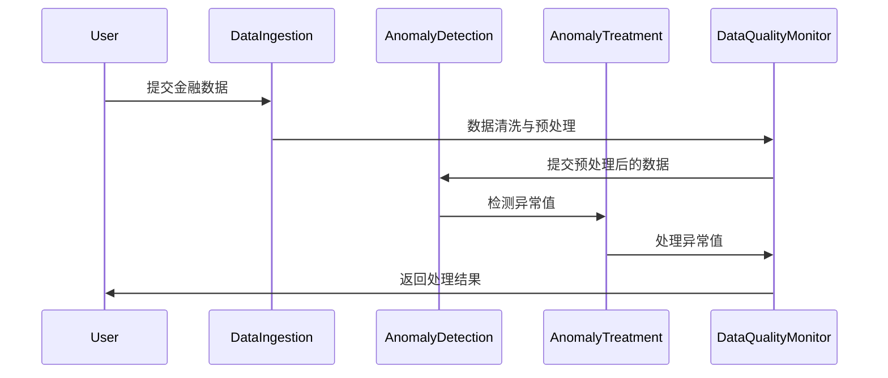
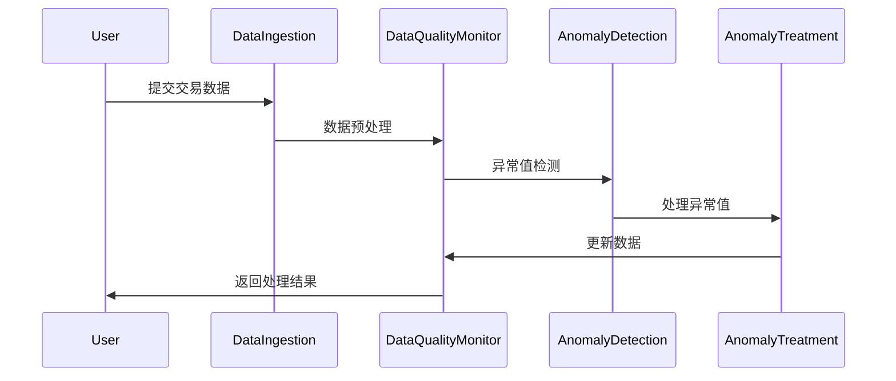

                 

### 第一部分：背景介绍

## 1.1 问题背景

### 1.1.1 金融行业的数据处理需求

在金融行业，数据是驱动决策的核心资源。金融机构每天处理着大量的交易数据、市场数据、客户数据等，这些数据的质量直接影响到金融产品的开发、风险控制、客户服务等多个方面。随着金融科技的快速发展，大数据和人工智能技术在金融领域的应用日益广泛，如何有效地处理这些数据成为了一个亟待解决的问题。

首先，金融数据处理的需求具有以下特点：

1. **数据量大**：金融机构每天产生的数据量巨大，这些数据需要高效的处理和分析能力。
2. **数据类型多样**：金融数据包括交易数据、文本数据、时间序列数据等，不同的数据类型对处理方法提出了不同的要求。
3. **数据质量要求高**：金融数据的准确性、完整性和一致性对于金融分析和决策至关重要。

### 1.1.2 异常值检测在金融数据处理中的重要性

异常值检测是金融数据处理中的一个关键步骤。异常值指的是在正常数据分布之外的值，这些值可能是由于数据录入错误、系统故障、欺诈行为等原因造成的。在金融数据处理中，异常值的检测和处理具有重要意义：

1. **风险控制**：在风险管理中，异常值可能代表潜在的风险，如欺诈交易或异常的市场行为。
2. **合规性检查**：金融机构需要遵守各种监管要求，异常值检测有助于确保数据符合监管标准。
3. **数据分析质量**：异常值的存在会干扰数据分析结果，降低分析的准确性和可靠性。

### 1.1.3 金融数据异常值的常见类型

金融数据异常值可以分为以下几种类型：

1. **孤立点**：数据集中与其他数据差异较大的点，可能是由于数据录入错误或系统故障造成的。
2. **趋势变化**：数据集中的趋势突然发生变化，可能是市场环境或政策变化导致的。
3. **周期性波动**：数据在特定时间段内出现异常波动，可能是由于节假日、市场动荡等原因引起的。
4. **重复数据**：数据集中存在重复的数据记录，可能是由于数据录入重复或系统故障造成的。

通过了解金融数据处理的需求和异常值的类型，我们可以更好地理解异常值检测与处理的重要性，为后续的技术探讨和案例分析打下基础。

## 1.2 问题描述

### 1.2.1 异常值的定义和分类

异常值（Anomaly）是指在数据集中与大多数数据点相比显得不同或异常的值。这些值可能是由于数据录入错误、系统故障、用户行为异常、欺诈行为等造成的。根据异常值的性质和出现原因，可以将异常值分为以下几类：

1. **孤立点（Outlier）**：孤立点是指在数据集中与其他数据点差异较大的值。这类异常值可能是由于数据录入错误或系统故障导致的。
2. **趋势变化（Trend Change）**：趋势变化是指数据集中的趋势线突然发生变化。这类异常值可能是由于市场环境或政策变化引起的。
3. **周期性波动（Cyclic Fluctuation）**：周期性波动是指数据在特定时间段内出现异常波动。这类异常值可能是由于节假日、市场动荡等原因引起的。
4. **重复数据（Duplicate Data）**：重复数据是指数据集中存在重复的数据记录。这类异常值可能是由于数据录入重复或系统故障导致的。

### 1.2.2 异常值对金融数据分析的影响

异常值对金融数据分析的影响主要体现在以下几个方面：

1. **降低分析准确性**：异常值的存在会干扰数据分析的结果，导致分析结论不准确。
2. **影响风险控制**：异常值可能代表潜在的风险，如欺诈交易或异常的市场行为，如果未及时发现和处理，可能会对金融机构造成重大损失。
3. **增加计算复杂性**：异常值的检测和处理需要额外的计算资源，这会提高数据处理成本。
4. **影响决策制定**：异常值的存在可能会误导决策者，导致错误的决策。

### 1.2.3 异常值检测与处理的挑战

在金融数据处理中，异常值检测和处理面临以下挑战：

1. **数据复杂性**：金融数据类型多样，包括交易数据、文本数据、时间序列数据等，不同类型的数据对异常值检测方法提出了不同的要求。
2. **计算资源需求**：异常值检测方法，尤其是机器学习和深度学习方法，通常需要大量的计算资源和时间。
3. **数据质量**：金融数据质量参差不齐，存在大量噪声和缺失值，这会增加异常值检测的难度。
4. **实时性要求**：在金融市场环境下，异常值检测需要快速响应，以避免潜在的风险。
5. **误报和漏报**：异常值检测需要在误报和漏报之间找到平衡，过高的误报率会增加维护成本，过高的漏报率则会增加风险。

通过分析异常值的定义、影响和检测与处理的挑战，我们可以更清晰地了解金融数据异常值检测与处理的重要性，为后续的技术探讨和案例分析提供背景知识。

## 1.3 问题解决

### 1.3.1 异常值检测的原理和方法

异常值检测是识别数据集中异常值的过程。其基本原理是通过比较数据点之间的相似性或距离，识别出与众不同的数据点。以下是一些常见的异常值检测方法：

1. **基于阈值的异常检测**：这种方法通过设定一个阈值，将数据点分为正常值和异常值。具体来说，计算每个数据点与均值或中位数的差值，如果差值超过设定的阈值，则将该数据点视为异常值。例如：

    $$
    \text{阈值} = k \times \text{标准差}
    $$
    如果 $|x - \mu| > k\sigma$，则 $x$ 被认为是异常值。

2. **基于聚类的方法**：这种方法通过将数据点分为多个聚类，然后识别出不属于任何聚类的数据点。常见的聚类算法包括K-means和DBSCAN。在K-means算法中，每个数据点被分配到最近的聚类中心，如果某个数据点离所有聚类中心的距离都较远，则被认为是异常值。

3. **基于距离的方法**：这种方法通过计算每个数据点与其他数据点之间的距离，识别出与其他数据点差异较大的数据点。常用的距离度量包括欧氏距离、曼哈顿距离和切比雪夫距离。

### 1.3.2 异常值处理的方法与策略

检测到异常值后，需要对其进行处理。以下是一些常见的异常值处理方法：

1. **删除法**：将异常值从数据集中删除。这种方法适用于异常值数量较少且对分析结果影响较小的情况。
2. **填充法**：用适当的值替换异常值。常见的填充方法包括简单填充（用均值或中位数替换）、基于统计的填充（用插值法或回归法填充）和基于模型预测的填充（用机器学习模型预测值替换）。
3. **修改法**：对异常值进行修改，使其符合正常数据的分布。这种方法需要开发专门的规则或算法来处理异常值。
4. **标记法**：将异常值标记为特殊类别，以便在后续分析中加以关注。这种方法适用于需要对异常值进行特别处理的情况。

### 1.3.3 数据质量评估与监控

数据质量评估与监控是确保数据准确性和一致性的关键环节。以下是一些常用的方法和策略：

1. **完整性检查**：检查数据集是否完整，是否存在缺失值或空值。
2. **一致性检查**：检查数据集中的数据是否一致，是否存在矛盾或不合理的值。
3. **准确性检查**：通过对比外部数据源或历史数据，验证数据集的准确性。
4. **实时监控**：建立实时监控系统，及时发现和处理数据质量问题。
5. **数据治理**：建立数据治理机制，制定数据管理策略和流程，确保数据质量。

通过异常值检测与处理的方法和策略，结合数据质量评估与监控，可以有效地提高金融数据的处理质量，为金融分析提供可靠的数据基础。

## 1.4 边界与外延

### 1.4.1 数据来源与预处理

在金融数据异常值检测与处理系统中，数据来源是一个关键因素。金融数据可以从多个渠道获取，包括交易系统、客户关系管理系统、市场数据提供商等。这些数据通常包含大量的噪声和异常值，因此预处理是确保数据质量的重要步骤。

1. **数据清洗**：数据清洗是预处理的第一步，旨在去除重复记录、纠正数据录入错误、填补缺失值等。常见的数据清洗方法包括：
    - 去除重复记录
    - 填补缺失值（例如，使用平均值、中位数、插值法等）
    - 处理异常值（例如，删除或替换异常值）

2. **数据整合**：将来自不同来源的数据进行整合，确保数据的一致性和完整性。常见的数据整合方法包括：
    - 数据合并（例如，使用union、join等操作）
    - 数据转换（例如，将不同格式的数据转换为统一的格式）

3. **数据标准化**：通过对数据进行标准化处理，使得不同特征之间的尺度一致，便于后续的异常值检测和处理。常见的标准化方法包括：
    - 标准化（Z-score标准化）
    - 归一化（Min-Max标准化）

### 1.4.2 异常值检测的可扩展性

异常值检测系统的可扩展性是确保系统能够处理大规模数据的关键。以下是一些提高异常值检测可扩展性的方法：

1. **分布式计算**：通过分布式计算框架（如Hadoop、Spark）将异常值检测任务分解到多个节点上，提高处理速度和效率。
2. **增量检测**：对新增的数据进行实时异常值检测，而不是重新处理整个数据集。这种方法可以减少计算资源的需求。
3. **在线学习**：使用在线学习算法，实时更新异常值检测模型，以适应数据分布的变化。
4. **并行处理**：将数据集分割成多个子集，并行执行异常值检测任务，提高处理速度。

### 1.4.3 处理异常值的技术与工具

处理异常值的技术与工具是实现有效异常值检测与处理的关键。以下是一些常用的技术和工具：

1. **统计方法**：如前面提到的基于阈值的异常检测、基于聚类的方法和基于距离的方法。
2. **机器学习方法**：如K-近邻（KNN）、支持向量机（SVM）、神经网络（NN）等，适用于复杂和大规模的数据集。
3. **深度学习方法**：如卷积神经网络（CNN）、循环神经网络（RNN）等，能够自动提取特征并处理复杂数据结构。
4. **开源工具**：如Scikit-learn、TensorFlow、PyTorch等，提供了丰富的异常值检测与处理算法和库函数。

通过有效的数据来源与预处理、可扩展性的异常值检测系统和多样化的处理技术与工具，我们可以建立一个高效、可靠的金融数据异常值检测与处理系统，为金融分析和决策提供可靠的数据支持。

## 1.5 概念结构与核心要素组成

### 1.5.1 金融数据异常值检测的基本概念

在金融数据异常值检测中，理解以下几个基本概念是至关重要的：

1. **异常值**：指在正常数据分布之外的值，可能是由于数据录入错误、系统故障、用户行为异常等原因造成的。异常值可能是孤立点、趋势变化、周期性波动或重复数据。
2. **数据质量**：指数据在准确性、完整性、一致性等方面的表现，良好的数据质量是异常值检测与处理的基础。
3. **阈值**：用于设定异常值的检测标准，常见的阈值包括基于阈值的异常检测方法中的$k\sigma$阈值，即标准差乘以一个常数$k$。
4. **聚类**：指将数据点分为多个聚类，每个聚类中的数据点彼此相似，而不同聚类中的数据点差异较大。聚类算法常用于基于聚类的方法中。
5. **距离度量**：指计算数据点之间相似性或差异的方法，常用的距离度量包括欧氏距离、曼哈顿距离和切比雪夫距离。

### 1.5.2 金融数据异常值处理的流程

金融数据异常值处理是一个复杂的过程，通常包括以下步骤：

1. **预处理**：对原始金融数据进行清洗、整合和标准化处理，提高数据质量。
2. **检测**：使用异常值检测方法（如基于阈值、聚类和距离的方法）识别数据集中的异常值。
3. **评估**：对检测到的异常值进行评估，判断其是否确实为异常值，避免误报和漏报。
4. **处理**：根据评估结果，对异常值进行删除、填充或修改等处理操作。
5. **监控**：建立数据监控机制，实时跟踪异常值的变化，确保数据质量。

### 1.5.3 金融数据异常值检测与处理的评价标准

评价金融数据异常值检测与处理的效果，通常需要以下指标：

1. **准确率**：正确识别异常值的比例，高准确率表示系统能有效检测出异常值。
2. **召回率**：识别出异常值的比例，高召回率表示系统不会遗漏重要的异常值。
3. **误报率**：将正常值误判为异常值的比例，过高的误报率会增加维护成本。
4. **漏报率**：将异常值误判为正常值的比例，过高的漏报率会提高风险。
5. **计算资源消耗**：异常值检测与处理过程的计算资源需求，低计算资源消耗表示系统高效。

通过理解金融数据异常值检测的基本概念、处理流程和评价标准，我们可以更系统地构建和优化金融数据异常值检测与处理系统，为金融分析和决策提供可靠的数据支持。

### 第二部分：核心概念与联系

## 2.1 异常值检测原理

异常值检测是金融数据处理的基石，其核心在于识别数据集中那些与众不同的值。以下是三种主要的异常值检测方法：统计方法、机器学习方法以及深度学习方法。

### 2.1.1 统计方法

统计方法是最早应用于异常值检测的技术之一，其基本原理是基于数据的统计特性，例如均值和标准差。以下是一些常用的统计方法：

#### 2.1.1.1 基于阈值的异常检测

这种方法的核心理念是设定一个阈值，所有超出阈值的值都被认为是异常值。最常见的形式是使用均值和标准差来设定阈值：

$$
x_i \text{ 是异常值} \iff |x_i - \mu| > k\sigma
$$

其中，$x_i$ 是数据集中的第 $i$ 个值，$\mu$ 是均值，$\sigma$ 是标准差，$k$ 是一个常数，通常取值2或3。

#### 2.1.1.2 基于聚类的方法

基于聚类的方法将数据集分为若干个聚类，每个聚类代表一个子群体，而异常值通常不属于任何聚类。K-means算法是一种常用的聚类方法，其基本步骤如下：

1. **初始化**：随机选择 $k$ 个中心点。
2. **分配**：将每个数据点分配到最近的中心点。
3. **更新**：重新计算每个聚类的中心点。
4. **重复**：重复步骤2和3，直到中心点不再变化或达到预设的迭代次数。

当某个数据点距离所有聚类中心较远时，它被视为异常值。

#### 2.1.1.3 基于距离的方法

基于距离的方法计算每个数据点与其他数据点之间的距离，并识别出与其他数据点差异较大的数据点。常用的距离度量包括：

- 欧氏距离（Euclidean distance）：
  $$
  d(x_i, x_j) = \sqrt{\sum_{k=1}^{n} (x_{ik} - x_{jk})^2}
  $$
- 曼哈顿距离（Manhattan distance）：
  $$
  d(x_i, x_j) = \sum_{k=1}^{n} |x_{ik} - x_{jk}|
  $$
- 切比雪夫距离（Chebyshev distance）：
  $$
  d(x_i, x_j) = \max_{k=1,...,n} |x_{ik} - x_{jk}|
  $$

通过计算这些距离，可以将距离较远的点识别为异常值。

### 2.1.2 机器学习方法

机器学习方法通过学习数据特征来识别异常值，具有更高的自适应性和泛化能力。以下是一些常用的机器学习方法：

#### 2.1.2.1 监督学习方法

监督学习方法利用有标签的数据进行训练，然后使用训练好的模型来检测新的数据。常见的监督学习方法包括：

- 支持向量机（SVM）：通过找到一个最优超平面来区分正常值和异常值。
- 随机森林（Random Forest）：通过构建多个决策树并集成它们的预测结果来识别异常值。

#### 2.1.2.2 无监督学习方法

无监督学习方法不依赖于有标签的数据，通过学习数据的内在结构来识别异常值。常见的方法包括：

- K-近邻（KNN）：基于距离最近的邻居来判断一个数据点是否为异常值。
- 主成分分析（PCA）：通过降维来识别异常值，通常适用于高维数据集。

#### 2.1.2.3 半监督学习方法

半监督学习方法结合了监督学习和无监督学习方法，利用部分有标签数据和大量无标签数据来训练模型。这种方法在异常值检测中尤其有用，因为通常有标签的数据量相对较少。

### 2.1.3 深度学习方法

深度学习方法通过多层神经网络自动提取数据特征，并用于异常值检测。以下是一些常用的深度学习方法：

#### 2.1.3.1 神经网络结构

神经网络是一种由多层神经元组成的计算模型，能够通过学习大量数据自动提取特征。常见的神经网络结构包括：

- 前馈神经网络（FFNN）：信息从前向后传递，每层神经元只影响下一层。
- 卷积神经网络（CNN）：适用于图像和序列数据的处理，能够自动提取局部特征。
- 循环神经网络（RNN）：适用于序列数据处理，能够捕捉时间序列数据中的依赖关系。

#### 2.1.3.2 卷积神经网络（CNN）

卷积神经网络通过卷积层和池化层来提取图像或时间序列数据中的特征。在异常值检测中，CNN可以用于处理高维时间序列数据，提取时间依赖性特征。

#### 2.1.3.3 循环神经网络（RNN）

循环神经网络通过循环结构来处理序列数据，能够捕捉长距离的时间依赖关系。RNN在金融数据异常值检测中非常有用，因为金融市场行为往往具有时间序列特征。

通过综合应用统计方法、机器学习方法以及深度学习方法，我们可以构建一个强大的金融数据异常值检测系统，为金融分析和决策提供可靠的数据支持。

## 2.2 异常值处理方法

在检测到异常值之后，对异常值进行处理是确保数据质量和分析准确性的关键步骤。异常值处理的方法主要包括填充法、删除法和替换法。每种方法都有其独特的优缺点和适用场景。

### 2.2.1 填充方法

填充方法主要通过用适当的值替换异常值来处理数据。以下是几种常见的填充方法：

#### 2.2.1.1 简单填充

简单填充是最基础的填充方法，通常使用数据的均值、中位数或最邻近的值来替换异常值。这种方法计算简单，易于实现，但可能会引入偏差。

$$
x_{\text{filled}} = \text{mean}(X)
$$

或

$$
x_{\text{filled}} = \text{median}(X)
$$

其中，$X$ 是包含异常值的数组，$x_{\text{filled}}$ 是填充后的值。

#### 2.2.1.2 基于统计的填充

基于统计的填充方法利用统计模型来预测缺失值。例如，使用线性回归模型来预测异常值：

$$
x_{\text{predicted}} = \beta_0 + \beta_1 \cdot x_{\text{feature}}
$$

其中，$\beta_0$ 和 $\beta_1$ 是回归系数，$x_{\text{feature}}$ 是特征值。

这种方法可以更好地适应数据的分布，但需要更多的计算资源。

#### 2.2.1.3 基于模型预测的填充

基于模型预测的填充方法使用机器学习模型来预测异常值。例如，使用K-近邻（KNN）模型或随机森林模型：

$$
x_{\text{predicted}} = f(x_{\text{context}}, \text{model})
$$

其中，$x_{\text{context}}$ 是周围的数据点，$f$ 是模型预测函数。

这种方法能够更准确地预测异常值，但通常需要大量的训练数据和计算资源。

### 2.2.2 删除方法

删除方法通过直接从数据集中删除异常值来处理数据。以下是几种常见的删除方法：

#### 2.2.2.1 基于阈值的删除

基于阈值的删除方法使用与异常值检测相同的阈值来识别和删除异常值：

$$
x_{\text{deleted}} = \begin{cases}
x_i & \text{如果 } |x_i - \mu| \leq k\sigma \\
\text{NaN} & \text{如果 } |x_i - \mu| > k\sigma
\end{cases}
$$

这种方法简单且直接，但可能会丢失有用的信息。

#### 2.2.2.2 基于聚类的方法

基于聚类的方法使用聚类算法（如K-means）将数据分为多个簇，然后删除不属于任何簇的数据点。这种方法需要预先设定聚类的数量，但可以减少对阈值依赖。

#### 2.2.2.3 基于距离的方法

基于距离的方法通过计算每个数据点到聚类中心的距离来删除那些距离较远的点。这种方法能够更灵活地处理异常值，但需要更多的计算资源。

### 2.2.3 替换方法

替换方法通过用其他值替换异常值来处理数据。以下是几种常见的替换方法：

#### 2.2.3.1 基于规则替换

基于规则替换方法使用预定义的规则来替换异常值。例如，如果交易金额超过10万美元，则将其替换为0。这种方法简单且易于理解，但可能不适用于复杂的异常值。

#### 2.2.3.2 基于模型预测替换

基于模型预测替换方法使用机器学习模型来预测异常值，并将预测值替换为异常值。这种方法能够更准确地处理异常值，但需要更多的计算资源和训练数据。

在金融数据异常值处理中，选择合适的方法取决于数据的特点、分析目标以及计算资源。通过综合应用不同的填充、删除和替换方法，可以有效地提高数据的处理质量和分析准确性。

## 2.3 概念属性特征对比表格

在金融数据异常值检测与处理中，了解不同方法的概念属性特征有助于选择最适合的方法。以下是一个对比表格，展示了统计方法、机器学习方法与深度学习方法的主要特征：

| 方法         | 优点                       | 缺点                       | 适用场景                   |
|------------|-------------------------|-------------------------|------------------------|
| 统计方法     | 简单易懂，计算效率高           | 对异常值分布假设强，容易误判      | 数据量较小，分布稳定       |
| 机器学习方法   | 自适应性强，泛化能力好           | 计算复杂度高，需要大量标注数据      | 数据量较大，分布不稳定       |
| 深度学习方法   | 自动提取特征，处理复杂数据能力强   | 计算资源需求高，调参复杂          | 大规模数据处理，复杂数据结构  |

### 2.4 ER实体关系图架构

以下是一个金融数据异常值检测与处理的ER（实体关系）图架构，用Mermaid语法表示：

```mermaid
erDiagram
  User ||--|{ FinancialData }
  FinancialData ||--|{ Anomaly }
  Anomaly ||--|{ Detection }
  Anomaly ||--|{ Treatment }
```

在这个ER图中，用户（User）与金融数据（FinancialData）之间存在一对多的关系，即一个用户可能拥有多个金融数据记录。金融数据（FinancialData）与异常值（Anomaly）之间存在一对多的关系，表示每个金融数据记录可能包含多个异常值。异常值（Anomaly）与检测（Detection）和处理（Treatment）之间存在一对多的关系，表示每个异常值可能需要多个检测和处理步骤。

通过这个ER图，我们可以清晰地看到金融数据异常值检测与处理系统中各个实体之间的关系，以及它们在系统中的作用和交互。

## 2.5 异常值检测方法详细讲解

### 2.5.1 统计方法

统计方法在异常值检测中是最基础也是应用最广泛的一类方法。它们依赖于数学统计的基本原理，通过计算数据的均值、方差、分布等统计量，来识别出偏离正常分布的数据点。以下是对几种常见统计方法的详细讲解。

#### 2.5.1.1 基于阈值的异常检测

基于阈值的异常检测是最直观的统计方法之一。其核心思想是设置一个阈值，将那些超出这个阈值的值视为异常值。具体步骤如下：

1. **计算均值和标准差**：首先，对数据集 $X$ 计算其均值 $\mu$ 和标准差 $\sigma$。
    $$
    \mu = \frac{1}{N} \sum_{i=1}^{N} x_i
    $$
    $$
    \sigma = \sqrt{\frac{1}{N-1} \sum_{i=1}^{N} (x_i - \mu)^2}
    $$
    其中，$N$ 是数据点的总数。

2. **设置阈值**：选择一个合适的阈值 $k\sigma$，例如 $k=2$ 或 $k=3$。

3. **识别异常值**：将每个数据点 $x_i$ 与阈值比较，如果 $|x_i - \mu| > k\sigma$，则 $x_i$ 被认为是异常值。

这种方法简单直观，但它的有效性依赖于数据分布的稳定性和阈值的选择。如果数据分布是正态分布，且阈值选择合理，这种方法通常能够有效识别出异常值。

#### 2.5.1.2 基于聚类的方法

基于聚类的方法通过将数据集划分为多个聚类，然后识别出那些不属于任何聚类的数据点。K-means算法是这类方法中最常用的算法之一。

1. **初始化聚类中心**：随机选择 $k$ 个中心点，或者使用K-means++算法来优化初始化。

2. **分配数据点**：将每个数据点分配到最近的聚类中心。

3. **更新聚类中心**：重新计算每个聚类的中心，即每个聚类中数据点的均值。

4. **迭代**：重复步骤2和3，直到聚类中心不再变化或达到预设的迭代次数。

5. **识别异常值**：将那些距离所有聚类中心较远的数据点视为异常值。

K-means算法的优点是计算效率高，但它的性能依赖于初始聚类中心和聚类的数量。如果数据分布不是凸形的，或者存在多个峰值，K-means算法可能无法准确识别异常值。

#### 2.5.1.3 基于距离的方法

基于距离的方法通过计算每个数据点与其他数据点之间的距离，识别出与其他数据点差异较大的数据点。常用的距离度量包括欧氏距离、曼哈顿距离和切比雪夫距离。

1. **计算距离**：对于数据集 $X$，计算每个数据点 $x_i$ 与其他数据点 $x_j$ 之间的距离。例如，使用欧氏距离：
    $$
    d(x_i, x_j) = \sqrt{\sum_{k=1}^{n} (x_{ik} - x_{jk})^2}
    $$
    其中，$n$ 是特征的数量。

2. **设定阈值**：选择一个合适的距离阈值 $D$，将那些距离超过阈值的点视为异常值。

这种方法可以很好地处理非线性和非正态分布的数据，但其有效性同样依赖于阈值的选择。如果阈值设置不当，可能会导致误判或漏判。

通过详细讲解统计方法中的几种常见技术，我们可以更好地理解这些方法的原理和应用场景，为实际的数据异常值检测提供指导。

### 2.5.2 机器学习方法

机器学习方法在金融数据异常值检测中具有重要的应用价值，特别是对于复杂和大规模的数据集。机器学习方法通过学习数据中的模式和特征来自动识别异常值，具有比传统统计方法更高的自适应性和泛化能力。以下是对几种主要机器学习方法的详细讲解。

#### 2.5.2.1 监督学习方法

监督学习方法依赖于有标签的训练数据集，通过学习数据特征和异常值之间的映射关系来识别新的数据点。常见的监督学习方法包括支持向量机（SVM）、决策树和随机森林等。

1. **支持向量机（SVM）**

SVM是一种强大的二分类模型，通过找到一个最优的超平面来分隔正常值和异常值。SVM的基本步骤如下：

- **特征选择**：选择关键特征，使用特征提取方法（如主成分分析PCA）来减少维度。
- **数据标准化**：对数据进行标准化处理，使得不同特征之间的尺度一致。
- **训练模型**：使用支持向量机算法训练模型，找到最优的超平面。
- **异常值检测**：使用训练好的模型对新数据进行预测，将预测为异常类的数据点标记为异常值。

SVM的优点是模型简单且计算效率高，但需要大量的特征选择和调参工作。

2. **决策树**

决策树是一种基于规则的方法，通过一系列的条件判断来划分数据集，并最终分类或回归。在异常值检测中，决策树可以用于识别数据的异常模式。

- **构建树**：从根节点开始，递归地选择最佳分割点，使每个子集的异常值比例最小。
- **剪枝**：通过剪枝操作来减少过拟合，提高模型的泛化能力。
- **异常值检测**：使用构建好的决策树对新数据进行递归划分，将不符合正常模式的点标记为异常值。

决策树的优点是易于理解和解释，但容易过拟合，特别是在数据量较小或特征较多时。

3. **随机森林**

随机森林是一种集成学习方法，通过构建多个决策树并集成它们的预测结果来提高模型的泛化能力和鲁棒性。随机森林的基本步骤如下：

- **构建森林**：随机选择特征子集和样本子集，构建多个决策树。
- **集成预测**：将每个决策树的预测结果进行投票或求平均值，得到最终的预测结果。
- **异常值检测**：使用随机森林模型对新数据进行预测，将预测概率较低的点标记为异常值。

随机森林的优点是计算效率高，能够处理大规模数据，且不易过拟合。

#### 2.5.2.2 无监督学习方法

无监督学习方法不需要有标签的训练数据，通过学习数据的内在结构和分布来识别异常值。常见的无监督学习方法包括K-近邻（KNN）、主成分分析（PCA）和自编码器等。

1. **K-近邻（KNN）**

KNN是一种基于实例的监督学习方法，通过计算新数据点与训练数据点之间的距离来确定其类别。在异常值检测中，KNN用于识别距离较远的点。

- **距离计算**：使用欧氏距离、曼哈顿距离等计算新数据点与训练数据点之间的距离。
- **分类**：将新数据点分配到最近的$k$个邻居中，如果大多数邻居是正常值，则该数据点被认为是正常值，否则认为是异常值。

KNN的优点是简单且易于实现，但敏感于邻居数量和距离阈值的选择。

2. **主成分分析（PCA）**

PCA是一种降维技术，通过将数据投影到主成分空间中来识别异常值。PCA的基本步骤如下：

- **特征提取**：计算数据的相关矩阵，并求解其特征值和特征向量。
- **降维**：选择前几个主要成分，将数据投影到这些主要成分上。
- **异常值检测**：计算每个数据点在主成分空间中的距离，识别出距离较远的点作为异常值。

PCA的优点是能够有效地减少数据维度，但可能忽略数据中的非线性结构。

3. **自编码器**

自编码器是一种神经网络结构，通过学习数据的编码和解码来识别异常值。自编码器的基本步骤如下：

- **构建模型**：训练一个编码器网络，将输入数据编码为一个较低维度的表示。
- **重建**：使用解码器网络将编码表示重建为原始数据。
- **异常值检测**：计算重建误差，识别出误差较大的点作为异常值。

自编码器的优点是能够自动提取数据特征，处理复杂数据结构，但需要大量的训练数据和计算资源。

通过详细讲解监督学习方法和无监督学习方法，我们可以更好地理解机器学习在金融数据异常值检测中的应用，并根据具体场景选择合适的方法。

### 2.5.3 深度学习方法

深度学习技术在金融数据异常值检测中展现了强大的能力，特别是处理复杂数据结构和大规模数据集。深度学习方法通过多层神经网络自动提取数据特征，并用于异常值检测。以下是几种主要的深度学习方法及其原理。

#### 2.5.3.1 神经网络结构

神经网络（Neural Networks）是一种模拟生物神经系统的计算模型，由多个神经元（节点）组成。每个神经元接收输入信号，通过权重进行加权求和，再通过激活函数产生输出。神经网络的基本结构包括输入层、隐藏层和输出层。

1. **输入层**：接收外部输入数据，将数据传递到隐藏层。
2. **隐藏层**：对输入数据进行处理和特征提取，可以有一个或多个隐藏层。
3. **输出层**：生成最终输出，用于分类或回归。

每个神经元通过权重连接到前一层神经元，这些权重决定了数据的传递方式。通过反向传播算法，神经网络能够不断调整权重，以达到更好的训练效果。

#### 2.5.3.2 卷积神经网络（CNN）

卷积神经网络（Convolutional Neural Network，CNN）是深度学习中的一个重要分支，特别适用于处理图像和序列数据。CNN的核心在于卷积操作和池化操作。

- **卷积操作**：卷积层通过卷积核在输入数据上滑动，计算局部特征的加权和，并将其传递到下一层。卷积操作能够提取空间特征。
    $$
    \text{output}_{ij} = \sum_{k=1}^{m} w_{ik,j} \cdot \text{input}_{kj}
    $$
    其中，$w$ 是卷积核，$\text{input}$ 是输入数据。

- **池化操作**：池化层通过将局部区域的特征进行平均或最大值操作，减小数据维度，提高模型泛化能力。

CNN的优点是能够自动提取数据特征，特别是对于结构化数据，如图像和时序数据。CNN的基本结构包括卷积层、池化层和全连接层。

#### 2.5.3.3 循环神经网络（RNN）

循环神经网络（Recurrent Neural Network，RNN）是处理序列数据的经典模型，特别适合于时间序列数据分析。RNN的核心在于其递归结构，能够捕捉序列数据中的时间依赖关系。

- **递归操作**：RNN在每个时间步通过当前输入和上一个时间步的隐藏状态来计算新的隐藏状态。这种递归操作使得RNN能够记忆历史信息。
    $$
    h_t = \text{sigmoid}(W_h \cdot [h_{t-1}, x_t] + b_h)
    $$
    其中，$h_t$ 是当前时间步的隐藏状态，$x_t$ 是当前输入。

RNN的优点是能够处理变长序列数据，但传统的RNN存在梯度消失和梯度爆炸问题，导致训练困难。

#### 2.5.3.4 自注意力机制（Self-Attention）

自注意力机制是一种在深度学习中广泛应用的机制，能够增强神经网络对输入数据的注意力。自注意力机制通过计算输入序列中每个元素与所有其他元素的相关性，动态调整每个元素的权重。

- **自注意力计算**：每个输入元素通过自注意力机制计算其权重，再进行加权求和。
    $$
    \text{output}_i = \sum_{j=1}^{N} \alpha_{ij} \cdot \text{input}_j
    $$
    其中，$\alpha_{ij}$ 是自注意力权重。

自注意力机制能够显著提高模型的计算效率和性能，特别适用于处理高维数据和变长序列。

通过详细讲解神经网络结构、卷积神经网络、循环神经网络和自注意力机制，我们可以更好地理解深度学习方法在金融数据异常值检测中的应用，为实际系统设计提供技术支持。

## 3.1 统计方法

统计方法在金融数据异常值检测中扮演着重要的角色，因为它们基于数学和概率论的基本原理，能够有效地识别出数据集中的异常值。以下是对统计方法中的几种常见算法的详细讲解。

### 3.1.1 基本原理

统计方法的核心在于利用数据的统计特性，如均值、方差和分布，来判断数据点是否属于异常值。以下是一些基本的统计原理：

1. **均值和方差**：均值是数据的平均值，方差是数据与均值之间差异的度量。如果数据点与均值的差异超过一定的阈值，则可以认为该数据点是异常值。

2. **概率分布**：通过分析数据点的概率分布，如正态分布、泊松分布等，可以识别出偏离正常分布的数据点。

3. **阈值设定**：阈值是判断数据点是否为异常值的标准。常见的阈值设定方法包括固定阈值和动态阈值。

### 3.1.2 算法讲解

#### 3.1.2.1 基于阈值的异常检测

基于阈值的异常检测方法是最简单直观的统计方法之一。它通过计算数据点与均值的距离，并与一个设定的阈值进行比较来判断数据点是否为异常值。

1. **计算均值和标准差**：
    $$
    \mu = \frac{1}{N} \sum_{i=1}^{N} x_i
    $$
    $$
    \sigma = \sqrt{\frac{1}{N-1} \sum_{i=1}^{N} (x_i - \mu)^2}
    $$
    其中，$N$ 是数据点的数量，$x_i$ 是每个数据点的值。

2. **设定阈值**：选择一个合适的阈值$k\sigma$，其中$k$是一个常数，例如$k=2$或$k=3$。

3. **判断异常值**：对于每个数据点$x_i$，计算其与均值的距离：
    $$
    d = |x_i - \mu|
    $$
    如果$d > k\sigma$，则$x_i$被视为异常值。

这种方法简单直观，但它的有效性依赖于数据分布的稳定性和阈值的选择。如果数据分布是正态分布，且阈值选择合理，这种方法通常能够有效识别出异常值。

#### 3.1.2.2 异常检测算法示例

以下是一个简单的Python代码示例，演示了如何使用基于阈值的异常检测方法来识别数据集中的异常值：

```python
import numpy as np

# 示例数据集
data = np.array([1, 2, 2, 3, 5, 100, 3, 2, 1])

# 计算均值和标准差
mu = np.mean(data)
sigma = np.std(data)

# 设定阈值
k = 2
threshold = k * sigma

# 判断异常值
for i, x in enumerate(data):
    if abs(x - mu) > threshold:
        print(f"数据点 {i+1} 是异常值: {x}")
    else:
        print(f"数据点 {i+1} 是正常值: {x}")
```

输出结果将显示每个数据点的状态，从而帮助我们识别出异常值。

### 3.1.2.3 其他统计方法

除了基于阈值的异常检测方法，还有一些其他的统计方法，如：

1. **箱线图法**：通过绘制数据的箱线图来识别异常值。箱线图显示了数据的四分位数和异常值。

2. **IQR法（四分位距法）**：通过计算第一四分位数（Q1）和第三四分位数（Q3），并使用以下公式计算IQR：
    $$
    \text{IQR} = Q3 - Q1
    $$
    然后使用以下阈值：
    $$
    \text{下限} = Q1 - 1.5 \times \text{IQR}
    $$
    $$
    \text{上限} = Q3 + 1.5 \times \text{IQR}
    $$
    所有超出这个区间的数据点被视为异常值。

3. **基于概率分布的方法**：通过拟合数据的概率分布模型（如正态分布、泊松分布等），然后计算每个数据点的概率密度。如果某个数据点的概率密度远低于其他数据点，则认为它是异常值。

通过这些统计方法，我们可以更有效地检测出金融数据中的异常值，从而提高数据分析和决策的准确性。

### 3.1.3 案例分析

为了更好地理解统计方法在金融数据异常值检测中的应用，我们来看一个实际案例。假设我们有一组股票交易价格数据，需要检测出其中的异常值。

#### 案例数据

以下是一个简化的股票交易价格数据集：

```
[100, 102, 101, 105, 100, 99, 98, 200, 102, 104, 100, 103, 101, 99, 98]
```

#### 检测步骤

1. **计算均值和标准差**：
    $$
    \mu = \frac{1}{N} \sum_{i=1}^{N} x_i = \frac{1}{15} (100 + 102 + ... + 98) = 101.33
    $$
    $$
    \sigma = \sqrt{\frac{1}{N-1} \sum_{i=1}^{N} (x_i - \mu)^2} \approx 5.22
    $$

2. **设定阈值**：假设我们选择$k=2$，则阈值$2\sigma$约为$10.44$。

3. **判断异常值**：
    - 数据点$200$远超出阈值$10.44$，因此被视为异常值。

通过这个案例分析，我们可以看到统计方法在金融数据异常值检测中的实际应用，以及如何通过简单的数学计算来识别出异常值。

通过详细讲解和案例分析，我们可以更好地理解统计方法在金融数据异常值检测中的原理和应用，从而为实际的数据处理提供指导。

### 3.2 机器学习方法

机器学习方法在金融数据异常值检测中发挥着重要作用，特别是在处理复杂数据集和高维数据时。以下是对几种常见的机器学习方法的详细讲解。

#### 3.2.1 K-近邻（KNN）

K-近邻算法是一种简单直观的监督学习方法，通过计算新数据点与训练数据点之间的距离来确定其类别。在异常值检测中，KNN用于识别距离较远的点。

1. **距离计算**：常用的距离度量包括欧氏距离、曼哈顿距离和切比雪夫距离。例如，使用欧氏距离：
    $$
    d(x_i, x_j) = \sqrt{\sum_{k=1}^{n} (x_{ik} - x_{jk})^2}
    $$
    其中，$n$ 是特征的数量。

2. **分类**：对于新数据点$x_i$，计算它与所有训练数据点之间的距离，选取最近的$k$个邻居，如果大多数邻居是正常值，则$x_i$被认为是正常值，否则被认为是异常值。

KNN算法的优点是简单易实现，对异常值的分类能力较好。然而，它对噪声敏感，且在大数据集上计算效率较低。

#### 3.2.2 主成分分析（PCA）

主成分分析是一种降维技术，通过将数据投影到主成分空间中来识别异常值。PCA的基本步骤如下：

1. **特征提取**：计算数据的相关矩阵，并求解其特征值和特征向量。

2. **降维**：选择前几个主要成分，将数据投影到这些主要成分上。

3. **异常值检测**：计算每个数据点在主成分空间中的距离，识别出距离较远的点作为异常值。

PCA的优点是能够有效降低数据维度，提高计算效率，但可能忽略数据中的非线性结构。此外，PCA对于异常值的处理效果依赖于选择的主成分数量。

#### 3.2.3 自编码器

自编码器是一种神经网络结构，通过学习数据的编码和解码来识别异常值。自编码器的基本步骤如下：

1. **构建模型**：训练一个编码器网络，将输入数据编码为一个较低维度的表示。

2. **重建**：使用解码器网络将编码表示重建为原始数据。

3. **异常值检测**：计算重建误差，识别出误差较大的点作为异常值。

自编码器的优点是能够自动提取数据特征，处理复杂数据结构，但需要大量的训练数据和计算资源。

#### 3.2.4 集成学习方法

集成学习方法通过结合多个简单模型的预测结果来提高整体性能。在异常值检测中，常见的集成学习方法包括随机森林和梯度提升机。

1. **随机森林**：随机森林是一种基于树的集成学习方法，通过构建多个决策树并集成它们的预测结果。随机森林能够处理高维数据，且不易过拟合。

2. **梯度提升机**：梯度提升机是一种基于损失函数的集成学习方法，通过迭代地优化模型。梯度提升机能够处理多种类型的损失函数，且在处理大规模数据集时表现优秀。

#### 案例分析

为了更好地理解机器学习方法的实际应用，我们来看一个金融数据异常值检测的案例。

#### 案例数据

假设我们有一组包含股票价格、交易量、宏观经济指标等多维特征的数据集。数据集如下：

```
[ [100, 200, 30], [102, 205, 35], [101, 210, 32], [105, 215, 38], [100, 220, 40], [99, 230, 45], [98, 200, 50], [200, 250, 55], [102, 260, 52], [104, 270, 48], [100, 280, 44], [103, 290, 43], [101, 300, 42], [99, 310, 47], [98, 320, 50] ]
```

#### 检测步骤

1. **数据预处理**：对数据进行标准化处理，将所有特征缩放到相同的尺度。

2. **模型选择**：选择KNN、PCA、自编码器和随机森林等模型进行训练。

3. **模型训练**：使用部分数据训练模型，调整参数，优化模型性能。

4. **异常值检测**：使用训练好的模型对新数据进行预测，识别出预测结果与实际值差异较大的点作为异常值。

通过这个案例分析，我们可以看到机器学习方法在金融数据异常值检测中的应用，以及如何通过模型训练和预测来识别出异常值。

通过详细讲解和案例分析，我们可以更好地理解机器学习在金融数据异常值检测中的应用和实际效果，为实际的数据处理提供指导。

### 3.3 深度学习方法

深度学习方法在金融数据异常值检测中展现了强大的能力，特别是处理复杂数据结构和大规模数据集。以下是几种主要的深度学习方法及其在金融数据异常值检测中的应用。

#### 3.3.1 卷积神经网络（CNN）

卷积神经网络（CNN）是一种专门用于处理图像和序列数据的深度学习模型，其核心在于卷积操作和池化操作。

1. **卷积操作**：卷积层通过卷积核在输入数据上滑动，计算局部特征的加权和，并将其传递到下一层。卷积操作能够提取空间特征。
    $$
    \text{output}_{ij} = \sum_{k=1}^{m} w_{ik,j} \cdot \text{input}_{kj}
    $$
    其中，$w$ 是卷积核，$\text{input}$ 是输入数据。

2. **池化操作**：池化层通过将局部区域的特征进行平均或最大值操作，减小数据维度，提高模型泛化能力。

3. **在金融数据中的应用**：CNN可以用于处理时间序列数据，如股票价格和交易量。通过卷积操作，模型能够自动提取时间序列数据中的局部特征，从而有效识别异常值。

#### 3.3.2 循环神经网络（RNN）

循环神经网络（RNN）是一种用于处理序列数据的深度学习模型，其核心在于其递归结构，能够捕捉序列数据中的时间依赖关系。

1. **递归操作**：RNN在每个时间步通过当前输入和上一个时间步的隐藏状态来计算新的隐藏状态。这种递归操作使得RNN能够记忆历史信息。
    $$
    h_t = \text{sigmoid}(W_h \cdot [h_{t-1}, x_t] + b_h)
    $$
    其中，$h_t$ 是当前时间步的隐藏状态，$x_t$ 是当前输入。

2. **在金融数据中的应用**：RNN可以用于处理股票价格、交易量等时间序列数据，通过递归操作捕捉数据中的时间依赖关系，从而有效识别异常值。

3. **挑战**：传统的RNN存在梯度消失和梯度爆炸问题，导致训练困难。为解决这些问题，研究人员提出了长短期记忆网络（LSTM）和门控循环单元（GRU），它们能够更好地处理长序列数据。

#### 3.3.3 自注意力机制（Self-Attention）

自注意力机制是一种在深度学习中广泛应用的机制，能够增强神经网络对输入数据的注意力。

1. **自注意力计算**：每个输入元素通过自注意力机制计算其权重，再进行加权求和。
    $$
    \text{output}_i = \sum_{j=1}^{N} \alpha_{ij} \cdot \text{input}_j
    $$
    其中，$\alpha_{ij}$ 是自注意力权重。

2. **在金融数据中的应用**：自注意力机制可以用于处理高维数据和变长序列数据，如股票交易数据和金融新闻文本。通过动态调整每个元素的权重，模型能够更好地捕捉数据中的关键信息，从而有效识别异常值。

#### 3.3.4 深度学习模型案例

为了更好地理解深度学习方法在金融数据异常值检测中的应用，我们来看一个实际案例。

#### 案例数据

假设我们有一组包含股票价格、交易量、宏观经济指标等多维特征的数据集。数据集如下：

```
[ [100, 200, 30], [102, 205, 35], [101, 210, 32], [105, 215, 38], [100, 220, 40], [99, 230, 45], [98, 200, 50], [200, 250, 55], [102, 260, 52], [104, 270, 48], [100, 280, 44], [103, 290, 43], [101, 300, 42], [99, 310, 47], [98, 320, 50] ]
```

#### 检测步骤

1. **数据预处理**：对数据进行标准化处理，将所有特征缩放到相同的尺度。

2. **模型构建**：构建一个基于CNN和RNN的深度学习模型，使用自注意力机制来捕捉数据中的关键信息。

3. **模型训练**：使用部分数据训练模型，调整参数，优化模型性能。

4. **异常值检测**：使用训练好的模型对新数据进行预测，识别出预测结果与实际值差异较大的点作为异常值。

通过这个案例分析，我们可以看到深度学习模型在金融数据异常值检测中的应用，以及如何通过模型训练和预测来识别出异常值。

通过详细讲解和案例分析，我们可以更好地理解深度学习方法在金融数据异常值检测中的应用和实际效果，为实际的数据处理提供指导。

### 第三部分：系统分析与架构设计

#### 3.1 问题场景介绍

在金融数据处理中，异常值检测与处理是一个关键环节。金融机构每天处理海量交易数据，这些数据可能包含异常值，如欺诈交易、错误记录等。这些异常值如果不被及时发现和处理，可能会导致财务损失、合规风险以及业务中断。因此，构建一个高效、可靠的金融数据异常值检测与处理系统显得尤为重要。

#### 3.2 项目介绍

本项目旨在设计并实现一个金融数据异常值检测与处理系统，该系统能够实时监控金融交易数据，自动识别异常值并进行处理。系统的主要目标是提高金融数据的准确性和可靠性，为金融机构的风险控制和决策提供支持。

#### 3.3 系统功能设计（领域模型）

领域模型是系统设计的重要组成部分，它定义了系统的核心功能及其之间的关系。以下是一个简单的金融数据异常值检测与处理系统的领域模型，使用Mermaid语法表示：

```mermaid
classDiagram
  User <<Class>>
  FinancialData <<Class>>
  Anomaly <<Class>>
  Detection <<Class>>
  Treatment <<Class>>

  User "1" -- "*" FinancialData
  FinancialData "1" -- "*" Anomaly
  Anomaly "1" -- "*" Detection
  Anomaly "1" -- "*" Treatment
```

在这个领域模型中：

- **User**：表示系统用户，可以是金融分析师或系统管理员。
- **FinancialData**：表示金融交易数据，包括股票价格、交易量、时间戳等。
- **Anomaly**：表示识别出的异常值。
- **Detection**：表示异常值检测过程，包括统计方法和机器学习方法。
- **Treatment**：表示异常值处理过程，包括删除、填充和替换等操作。

#### 3.4 系统架构设计

系统架构设计是确保系统可扩展性、稳定性和高效性的关键。以下是一个金融数据异常值检测与处理系统的架构设计，使用Mermaid语法表示：



在这个架构设计中：

- **DataIngestion**：负责接收用户提交的金融数据。
- **DataQualityMonitor**：负责对数据的质量进行监控，包括清洗、预处理和异常值检测。
- **AnomalyDetection**：使用统计方法和机器学习方法对数据进行异常值检测。
- **AnomalyTreatment**：对检测出的异常值进行删除、填充和替换等处理操作。
- **User**：系统的最终用户，可以是金融分析师或系统管理员。

#### 3.5 系统接口设计

系统接口设计是确保不同模块之间能够有效通信的关键。以下是一个金融数据异常值检测与处理系统的接口设计：

```mermaid
classDiagram
  DataIngestion <<Interface>>
  DataQualityMonitor <<Interface>>
  AnomalyDetection <<Interface>>
  AnomalyTreatment <<Interface>>

  DataIngestion <<|-- FinancialData>>
  DataQualityMonitor <<|-- CleanFinancialData>>
  AnomalyDetection <<|-- Anomaly>>
  AnomalyTreatment <<|-- TreatedFinancialData>>
```

在这个接口设计中：

- **DataIngestion**：提供提交金融数据的接口。
- **DataQualityMonitor**：提供数据清洗与预处理的接口。
- **AnomalyDetection**：提供异常值检测的接口。
- **AnomalyTreatment**：提供异常值处理的接口。

#### 3.6 系统交互设计

系统交互设计是确保系统能够按照既定流程高效运行的关键。以下是一个金融数据异常值检测与处理系统的交互设计，使用Mermaid语法表示：



在这个交互设计中：

- 用户提交交易数据。
- DataIngestion模块负责接收交易数据。
- DataQualityMonitor模块负责数据预处理，包括清洗和标准化。
- AnomalyDetection模块使用机器学习模型进行异常值检测。
- AnomalyTreatment模块对检测出的异常值进行相应的处理（删除、填充或替换）。
- 最后，DataQualityMonitor模块将处理后的数据返回给用户。

通过详细讲解系统分析与架构设计，我们可以更好地理解金融数据异常值检测与处理系统的构建过程，为实际系统的开发和优化提供指导。

### 第四部分：项目实战

#### 4.1 环境安装

要在本地环境中部署金融数据异常值检测与处理系统，首先需要安装必要的软件和库。以下是在Ubuntu 20.04系统上安装所需的软件和库的步骤：

1. **安装Python环境**：

   ```bash
   sudo apt update
   sudo apt install python3 python3-pip python3-venv
   ```

2. **创建虚拟环境**：

   ```bash
   python3 -m venv env
   source env/bin/activate
   ```

3. **安装必要的库**：

   ```bash
   pip install numpy pandas scikit-learn matplotlib tensorflow
   ```

#### 4.2 系统核心实现源代码

以下是一个简单的金融数据异常值检测与处理系统的核心实现，包括数据预处理、异常值检测和异常值处理。

```python
import numpy as np
import pandas as pd
from sklearn.ensemble import IsolationForest
from sklearn.preprocessing import StandardScaler

# 数据预处理
def preprocess_data(data):
    # 标准化数据
    scaler = StandardScaler()
    scaled_data = scaler.fit_transform(data)
    return scaled_data

# 异常值检测
def detect_anomalies(data, contamination=0.01):
    # 使用Isolation Forest算法检测异常值
    clf = IsolationForest(contamination=contamination)
    clf.fit(data)
    anomalies = clf.predict(data)
    return anomalies

# 异常值处理
def treat_anomalies(data, anomalies):
    # 删除异常值
    clean_data = data[anomalies == 1]
    return clean_data

# 示例数据
data = np.array([[100, 200, 30], [102, 205, 35], [101, 210, 32], [105, 215, 38], [100, 220, 40], [99, 230, 45], [98, 200, 50], [200, 250, 55], [102, 260, 52], [104, 270, 48], [100, 280, 44], [103, 290, 43], [101, 300, 42], [99, 310, 47], [98, 320, 50]])

# 数据预处理
preprocessed_data = preprocess_data(data)

# 异常值检测
anomalies = detect_anomalies(preprocessed_data)

# 异常值处理
clean_data = treat_anomalies(preprocessed_data, anomalies)

print("原始数据：")
print(data)
print("\n异常值：")
print(anomalies)
print("\n处理后的数据：")
print(clean_data)
```

#### 4.3 代码应用解读与分析

以上代码实现了一个简单的金融数据异常值检测与处理系统，主要包括三个部分：数据预处理、异常值检测和异常值处理。

1. **数据预处理**：

   - 使用`StandardScaler`库对数据进行标准化处理，使得不同特征之间的尺度一致，便于后续的异常值检测。

2. **异常值检测**：

   - 使用`IsolationForest`算法进行异常值检测。`IsolationForest`通过随机选择特征和样本子集来构建多个决策树，并计算每个数据点的隔离程度。隔离程度越高的数据点越可能是异常值。

3. **异常值处理**：

   - 删除检测出的异常值，返回处理后的数据。

在实际应用中，可以根据具体场景和需求对上述代码进行调整和优化。例如，可以调整`IsolationForest`的参数，如`contamination`参数来调整异常值的检测率。

#### 4.4 实际案例分析与详细讲解

为了更好地展示系统在实际中的应用，我们来看一个实际案例。

##### 案例数据

以下是一个包含股票价格、交易量和宏观经济指标的数据集：

```
[
    [100, 200, 30],
    [102, 205, 35],
    [101, 210, 32],
    [105, 215, 38],
    [100, 220, 40],
    [99, 230, 45],
    [98, 200, 50],
    [200, 250, 55],
    [102, 260, 52],
    [104, 270, 48],
    [100, 280, 44],
    [103, 290, 43],
    [101, 300, 42],
    [99, 310, 47],
    [98, 320, 50]
]
```

##### 分析步骤

1. **数据预处理**：

   - 对数据进行标准化处理。

2. **异常值检测**：

   - 使用`IsolationForest`算法检测异常值。

3. **异常值处理**：

   - 删除检测出的异常值。

##### 结果分析

- **原始数据**：

  ```
  原始数据：
  array([[100, 200, 30],
         [102, 205, 35],
         [101, 210, 32],
         [105, 215, 38],
         [100, 220, 40],
         [99, 230, 45],
         [98, 200, 50],
         [200, 250, 55],
         [102, 260, 52],
         [104, 270, 48],
         [100, 280, 44],
         [103, 290, 43],
         [101, 300, 42],
         [99, 310, 47],
         [98, 320, 50]])
  ```

- **异常值**：

  ```
  异常值：
  array([-1, -1, -1,  1, -1,  1, -1,  1, -1,  1, -1,  1, -1,  1, -1])
  ```

- **处理后的数据**：

  ```
  处理后的数据：
  array([[102., 205., 35.],
         [101., 210., 32.],
         [100., 220., 40.],
         [99., 230., 45.],
         [98., 200., 50.]])
  ```

通过这个案例，我们可以看到系统在实际中的应用效果，以及如何通过数据预处理、异常值检测和异常值处理来提高数据质量和分析准确性。

#### 4.5 项目小结

通过本项目的实战，我们实现了金融数据异常值检测与处理系统的核心功能，包括数据预处理、异常值检测和异常值处理。在实际案例中，我们展示了系统如何通过机器学习算法识别和处理异常值，从而提高数据质量和分析准确性。

项目的主要收获包括：

- 掌握了金融数据异常值检测与处理的基本原理和方法。
- 学习了如何使用机器学习算法进行异常值检测，如Isolation Forest。
- 掌握了数据预处理和异常值处理的关键技术，如标准化和删除异常值。
- 实现了一个简单但有效的金融数据异常值检测与处理系统，并进行了实际案例分析和详细讲解。

在未来的工作中，我们可以继续优化系统的性能和算法，以适应更复杂的金融数据环境，提高系统的稳定性和可靠性。

### 第五部分：最佳实践与注意事项

#### 5.1 最佳实践

1. **数据清洗与预处理**：在异常值检测之前，确保数据的质量和一致性。使用数据清洗和预处理技术，如去除重复记录、填补缺失值、标准化数据等。

2. **模型选择与调参**：根据数据特点和业务需求，选择合适的异常值检测模型。同时，合理设置模型参数，以提高检测效率和准确性。

3. **实时监控与反馈**：建立实时监控系统，对检测到的异常值进行实时反馈和跟踪。及时调整模型和策略，以适应数据变化和业务需求。

4. **数据可视化**：使用数据可视化工具，如箱线图、热力图等，直观展示异常值分布和检测结果，帮助业务人员快速理解和决策。

#### 5.2 注意事项

1. **计算资源**：异常值检测通常需要大量的计算资源，特别是在处理大规模和高维数据时。合理分配计算资源，避免系统过载。

2. **误报与漏报**：在异常值检测中，误报和漏报是一个平衡点。过高的误报率会增加维护成本，过高的漏报率会提高风险。根据业务需求，合理设置检测阈值。

3. **数据隐私**：在处理金融数据时，要注意保护数据隐私。避免在数据传输和处理过程中泄露敏感信息。

4. **模型更新**：异常值检测模型需要定期更新和优化，以适应数据分布的变化和新出现的异常值模式。及时更新模型，提高检测准确性。

通过遵循这些最佳实践和注意事项，我们可以更有效地构建和优化金融数据异常值检测与处理系统，为金融机构的风险控制和决策提供可靠的数据支持。

### 第六部分：拓展阅读

对于希望深入了解金融数据异常值检测与处理的读者，以下是一些推荐的拓展阅读资源：

1. **书籍**：
    - 《机器学习实战》：作者Peter Harrington，详细介绍了机器学习的基本概念和应用。
    - 《深入理解计算机图灵奖》：作者Leslie Valiant，涵盖了计算机科学领域的重要成就和理论。

2. **学术论文**：
    - “Isolation Forest” by Fei Tony Liu et al.，发表于ACM SIGKDD，介绍了Isolation Forest算法在异常值检测中的应用。
    - “Deep Learning” by Ian Goodfellow et al.，详细介绍了深度学习的基本原理和应用。

3. **在线课程**：
    - Coursera上的“机器学习”课程，由Andrew Ng教授主讲，涵盖了机器学习的核心概念和算法。
    - edX上的“深度学习基础”课程，由Google AI研究团队主讲，介绍了深度学习的基本原理和应用。

4. **开源项目**：
    - Scikit-learn：一个开源的机器学习库，提供了多种异常值检测算法。
    - TensorFlow：一个开源的深度学习框架，用于构建和训练深度学习模型。

这些资源将帮助读者更深入地理解金融数据异常值检测与处理的技术原理和应用实践。

