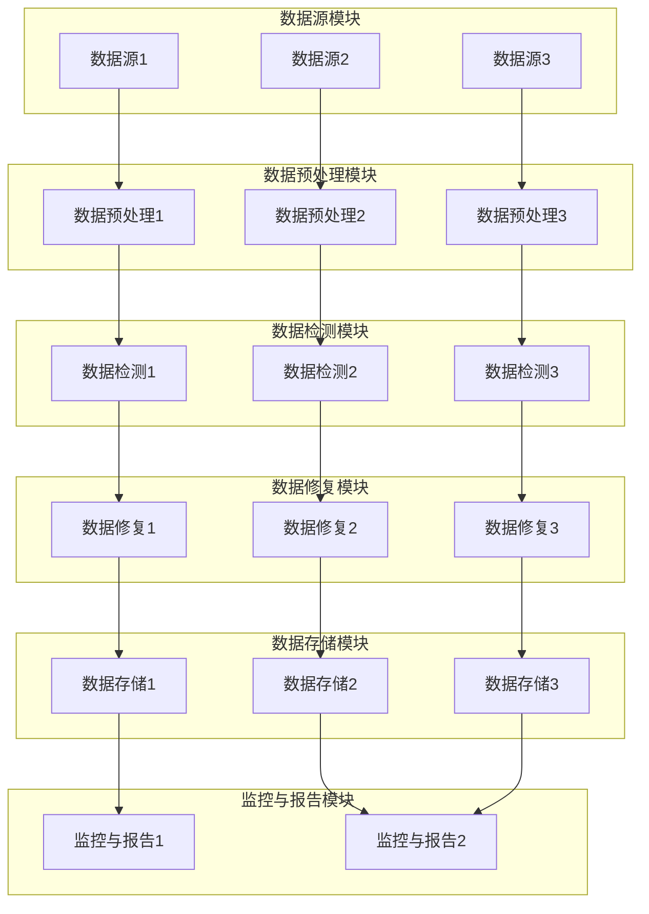
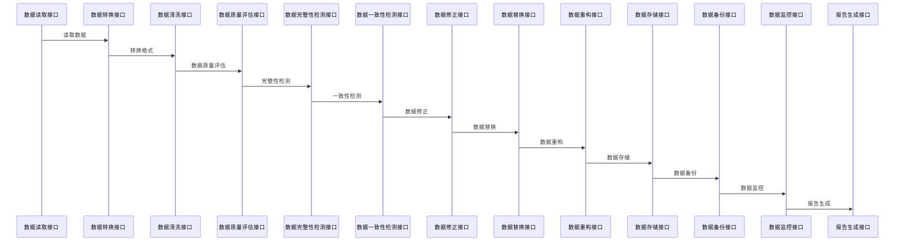
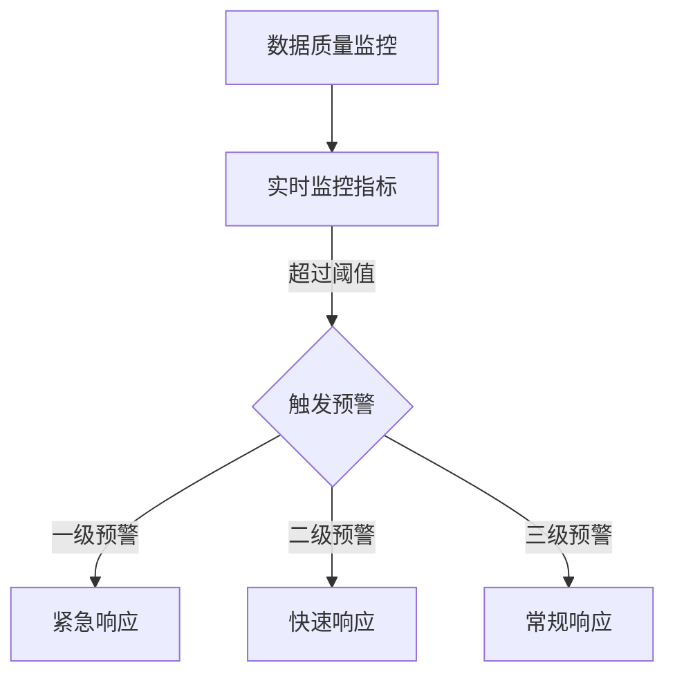
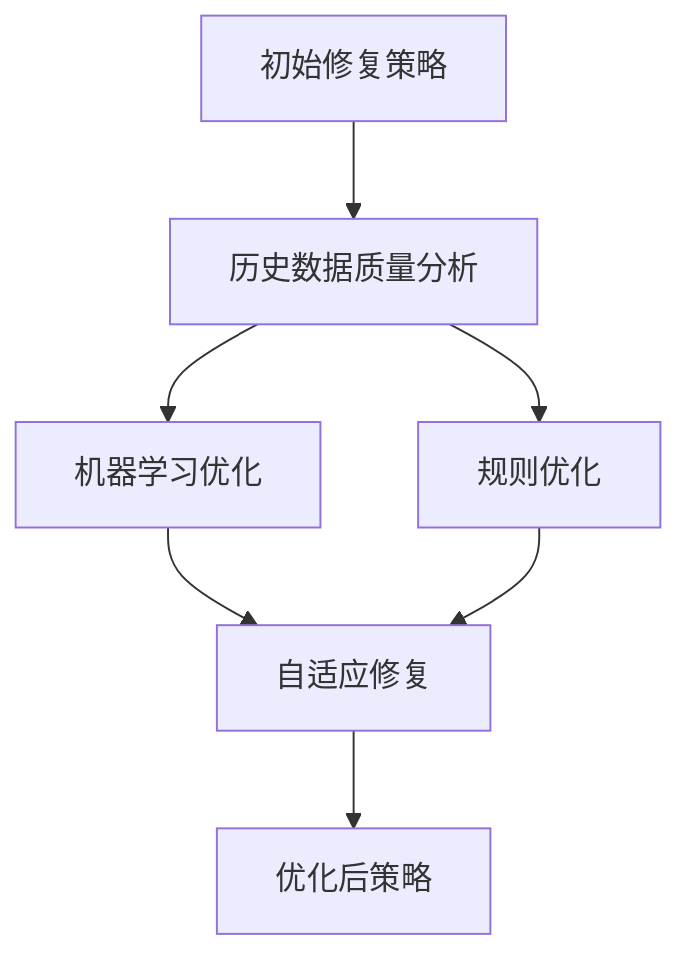
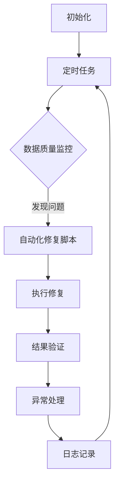

```mermaid
classDiagram
    DataSourceModule <|-- DataReadInterface
    DataSourceModule <|-- DataTransformInterface
    DataSourceModule <|-- DataCleanInterface

    DataPreprocessingModule <|-- DataFormatterInterface
    DataPreprocessingModule <|-- DataTransformerInterface
    DataPreprocessingModule <|-- DataCleanerInterface

    DataQualityDetectionModule <|-- DataQualityAssessmentInterface
    DataQualityDetectionModule <|-- DataIntegrityDetectorInterface
    DataQualityDetectionModule <|-- DataConsistencyDetectorInterface

    DataQualityRepairModule <|-- DataCorrectionInterface
    DataQualityRepairModule <|-- DataReplacementInterface
    DataQualityRepairModule <|-- DataReconstructionInterface

    DataStorageModule <|-- DataStorageInterface
    DataStorageModule <|-- DataBackupInterface

    MonitoringAndReportingModule <|-- DataMonitoringInterface
    MonitoringAndReportingModule <|-- ReportGeneratorInterface

    DataReadInterface --|> DataSourceModule
    DataTransformInterface --|> DataSourceModule
    DataCleanInterface --|> DataSourceModule

    DataFormatterInterface --|> DataPreprocessingModule
    DataTransformerInterface --|> DataPreprocessingModule
    DataCleanerInterface --|> DataPreprocessingModule

    DataQualityAssessmentInterface --|> DataQualityDetectionModule
    DataIntegrityDetectorInterface --|> DataQualityDetectionModule
    DataConsistencyDetectorInterface --|> DataQualityDetectionModule

    DataCorrectionInterface --|> DataQualityRepairModule
    DataReplacementInterface --|> DataQualityRepairModule
    DataReconstructionInterface --|> DataQualityRepairModule

    DataStorageInterface --|> DataStorageModule
    DataBackupInterface --|> DataStorageModule

    DataMonitoringInterface --|> MonitoringAndReportingModule
    ReportGeneratorInterface --|> MonitoringAndReportingModule
```

```mermaid
classDiagram
    DataSourceModule <|-- DataReadInterface
    DataSourceModule <|-- DataTransformInterface
    DataSourceModule <|-- DataCleanInterface

    DataPreprocessingModule <|-- DataFormatterInterface
    DataPreprocessingModule <|-- DataTransformerInterface
    DataPreprocessingModule <|-- DataCleanerInterface

    DataQualityDetectionModule <|-- DataQualityAssessmentInterface
    DataQualityDetectionModule <|-- DataIntegrityDetectorInterface
    DataQualityDetectionModule <|-- DataConsistencyDetectorInterface

    DataQualityRepairModule <|-- DataCorrectionInterface
    DataQualityRepairModule <|-- DataReplacementInterface
    DataQualityRepairModule <|-- DataReconstructionInterface

    DataStorageModule <|-- DataStorageInterface
    DataStorageModule <|-- DataBackupInterface

    MonitoringAndReportingModule <|-- DataMonitoringInterface
    MonitoringAndReportingModule <|-- ReportGeneratorInterface

    DataReadInterface --|> DataSourceModule
    DataTransformInterface --|> DataSourceModule
    DataCleanInterface --|> DataSourceModule

    DataFormatterInterface --|> DataPreprocessingModule
    DataTransformerInterface --|> DataPreprocessingModule
    DataCleanerInterface --|> DataPreprocessingModule

    DataQualityAssessmentInterface --|> DataQualityDetectionModule
    DataIntegrityDetectorInterface --|> DataQualityDetectionModule
    DataConsistencyDetectorInterface --|> DataQualityDetectionModule

    DataCorrectionInterface --|> DataQualityRepairModule
    DataReplacementInterface --|> DataQualityRepairModule
    DataReconstructionInterface --|> DataQualityRepairModule

    DataStorageInterface --|> DataStorageModule
    DataBackupInterface --|> DataStorageModule

    DataMonitoringInterface --|> MonitoringAndReportingModule
    ReportGeneratorInterface --|> MonitoringAndReportingModule
```
                 


### 第一部分：问题背景与核心概念

## 第1章：金融数据质量问题概述

### 1.1 问题背景

金融行业是一个高度依赖于数据和信息准确性的领域。金融数据质量的好坏直接影响到金融机构的业务运营、风险控制、投资决策等方面。然而，随着金融数据的日益增长和复杂性，数据质量问题也日益突出。这些质量问题可能源于数据的来源、存储、处理、传输等各个环节。

首先，金融行业数据来源广泛且多样，包括内部数据和外部的第三方数据。内部数据可能来源于金融机构的业务操作，如交易记录、客户信息等。而外部数据则可能来自市场数据、经济指标、社交媒体等。数据来源的多样性增加了数据整合和处理的难度，容易导致数据质量问题。

其次，数据的存储和管理也是金融数据质量问题的一个重要方面。金融数据通常以结构化和非结构化形式存在，如数据库、数据仓库、日志文件等。数据存储和管理不当会导致数据冗余、重复、不一致等问题，从而影响数据的质量。

再次，数据处理和传输也是影响金融数据质量的重要因素。金融数据需要在多个系统和应用之间进行传递和处理，这一过程中可能发生数据丢失、数据污染、数据延迟等问题，进而影响数据的质量。

### 1.1.1 金融行业数据的重要性

金融行业的数据具有以下几个重要特点：

1. **决策依赖性**：金融行业依赖大量的数据进行分析和决策，如风险评估、市场预测、投资组合管理等。数据的准确性和完整性对决策的准确性和及时性至关重要。

2. **风险控制**：金融行业面临各种风险，如信用风险、市场风险、操作风险等。高质量的数据可以帮助金融机构更好地识别、评估和控制这些风险。

3. **合规性**：金融行业受到严格的监管，需要遵守一系列法律法规和合规要求。高质量的数据有助于金融机构满足这些合规要求，避免违规和法律风险。

4. **用户体验**：金融产品的用户体验依赖于数据的质量。如精准的客户信息、实时的市场数据等，都可以提升用户的满意度和忠诚度。

### 1.1.2 金融数据质量问题的现状

金融数据质量问题的现状表现在以下几个方面：

1. **数据不准确**：由于数据来源多样、数据整合困难，金融数据中可能存在错误、遗漏、不一致等问题，导致数据不准确。

2. **数据不完整**：金融数据往往涉及大量的业务和交易信息，但可能由于数据丢失、数据整合不当等原因，导致数据不完整。

3. **数据不一致**：不同系统、不同部门之间的数据可能存在不一致，如同一客户在不同系统的信息不同，导致数据不一致。

4. **数据时效性差**：金融数据需要实时更新和同步，但由于数据传输和处理速度慢，导致数据时效性差，无法满足业务需求。

### 1.1.3 数据质量对金融业务的影响

数据质量对金融业务的影响可以从以下几个方面进行阐述：

1. **业务运营**：数据质量直接影响金融机构的业务运营效率。高质量的数据可以帮助金融机构更准确地分析市场趋势、优化业务流程、提高业务效率。

2. **风险控制**：数据质量对风险控制至关重要。不准确或不完整的数据可能导致风险评估不准确、风险控制措施不当，增加金融机构的风险。

3. **合规性**：数据质量直接影响金融机构的合规性。高质量的金融数据可以帮助金融机构更好地遵守法律法规和合规要求，降低违规和法律风险。

4. **用户体验**：数据质量直接影响金融产品的用户体验。准确、完整、一致、及时的数据可以提升用户的满意度和忠诚度，增加客户粘性。

### 1.2 问题定义

#### 1.2.1 数据质量的概念

数据质量是指数据满足特定业务需求和目标的程度。它不仅包括数据的准确性、完整性、一致性、时效性等基本属性，还包括数据的可用性、可靠性、安全性等方面。

#### 1.2.2 金融数据质量的关键指标

金融数据质量的关键指标通常包括以下几方面：

1. **准确性**：数据是否准确无误，是否符合事实和实际情况。
2. **完整性**：数据是否完整，是否包含了所有必要的信息。
3. **一致性**：数据在不同系统、不同部门之间是否一致，是否存在矛盾和冲突。
4. **时效性**：数据是否能够及时更新和提供，是否满足业务需求。
5. **可用性**：数据是否容易获取和使用，是否方便业务人员进行分析和决策。
6. **可靠性**：数据是否可靠，是否能够稳定地存储和传输。
7. **安全性**：数据是否安全，是否能够防止未授权的访问和泄露。

### 1.3 数据质量问题的边界与外延

#### 1.3.1 数据质量问题的分类

数据质量问题可以按照不同的维度进行分类，常见的分类方法包括：

1. **按照数据类型分类**：可分为结构化数据质量问题、非结构化数据质量问题和混合数据质量问题。
2. **按照数据来源分类**：可分为内部数据质量问题和外部数据质量问题。
3. **按照影响范围分类**：可分为局部数据质量问题和全局数据质量问题。
4. **按照问题性质分类**：可分为技术性问题、业务性问题、操作性问题等。

#### 1.3.2 数据质量问题的影响因素

数据质量问题的影响因素包括：

1. **数据来源**：数据来源的多样性和准确性直接影响数据质量。
2. **数据处理**：数据在处理和传输过程中可能发生数据丢失、数据污染等问题，影响数据质量。
3. **数据存储**：数据存储和管理不当可能导致数据冗余、重复、不一致等问题，影响数据质量。
4. **业务需求**：不同的业务需求对数据质量的要求不同，业务需求的复杂性增加数据质量管理的难度。
5. **人员因素**：数据质量的管理和监控需要专业的人员和团队，人员素质和能力直接影响数据质量管理的效果。
6. **技术因素**：技术手段的先进性和适用性直接影响数据质量管理的效率和效果。

### 1.4 数据质量问题的核心要素组成

#### 1.4.1 数据质量管理体系

数据质量管理体系是确保数据质量的一套完整的管理流程和方法。它通常包括以下几方面：

1. **数据质量策略**：明确数据质量的目标、原则和标准，为数据质量管理提供指导。
2. **数据质量指标**：定义数据质量的关键指标，用于衡量和监控数据质量。
3. **数据质量流程**：制定数据质量管理的具体流程，包括数据采集、存储、处理、传输、监控等环节。
4. **数据质量工具**：提供用于数据质量管理的工具和技术，如数据清洗工具、数据质量管理平台等。

#### 1.4.2 数据质量控制流程

数据质量控制流程是确保数据质量的具体操作步骤。它通常包括以下几方面：

1. **数据采集**：确保数据来源的准确性和完整性。
2. **数据清洗**：对数据进行清洗和整理，去除错误、重复和冗余数据。
3. **数据验证**：对数据进行验证，确保数据的一致性和准确性。
4. **数据存储**：将数据存储到数据库或数据仓库中，确保数据的安全性。
5. **数据监控**：对数据质量进行监控和评估，及时发现和解决数据质量问题。

#### 1.4.3 数据质量保障措施

为了确保数据质量，金融机构可以采取以下措施：

1. **制度建设**：建立数据质量管理相关制度和规范，明确各部门和人员的职责和权限。
2. **培训与教育**：加强数据质量管理相关培训和宣传教育，提高全员的数据质量管理意识。
3. **技术手段**：采用先进的数据质量管理工具和技术，提高数据质量管理的效率。
4. **持续改进**：定期对数据质量管理进行评估和改进，不断优化数据质量管理流程和方法。

### 1.5 数据质量问题的解决方法概述

#### 1.5.1 人工数据清洗

人工数据清洗是指通过人工干预对数据进行清洗和整理。它适用于数据量较小、数据质量问题较为简单的情况。人工数据清洗的优点是灵活性和针对性较强，但缺点是效率低、成本高，且容易受人为因素影响。

#### 1.5.2 数据质量管理工具

数据质量管理工具是指用于数据质量管理的软件工具，如数据清洗工具、数据质量管理平台等。这些工具可以自动化执行数据清洗、数据验证、数据监控等操作，提高数据质量管理的效率。数据质量管理工具的优点是效率高、成本低，但需要专业的技术人员进行配置和管理。

#### 1.5.3 自动化数据质量修复平台

自动化数据质量修复平台是一种集成了数据清洗、数据验证、数据监控等多种功能的数据质量管理工具。它可以自动化执行数据质量管理的各个环节，实现数据质量问题的自动化检测和修复。自动化数据质量修复平台适用于数据量较大、数据质量要求较高的金融行业。

### 1.6 本章小结

金融数据质量问题的背景、现状和影响已经被详细阐述。数据质量问题的定义和核心要素组成为我们提供了一个全面的视角来理解和解决数据质量问题。解决数据质量问题的方法主要包括人工数据清洗、数据质量管理工具和自动化数据质量修复平台。这些方法和工具各有优缺点，需要根据具体情况选择合适的方案。

### 第一部分：问题背景与核心概念

## 第2章：金融数据质量的核心概念

### 2.1 数据质量模型

数据质量模型是用于描述和评估数据质量的一系列概念和指标。一个完整的数据质量模型应该包括数据质量的关键指标、评估方法和优化策略。在本节中，我们将介绍金融数据质量模型的核心概念。

#### 2.1.1 精准度（Accuracy）

精准度是数据质量模型中的一个核心指标，它衡量数据与现实世界的一致性程度。在金融行业中，精准度尤为重要，因为错误的交易记录、客户信息和市场数据可能导致严重的金融风险和业务损失。精准度的计算公式可以表示为：

$$
\text{Accuracy} = \frac{\text{正确数据个数}}{\text{总数据个数}}
$$

例如，如果一个金融系统的客户信息数据库中有1000条记录，其中有5条记录包含错误，那么精准度就是95%。

#### 2.1.2 完整性（Completeness）

完整性是衡量数据是否完整、是否包含了所有必要信息的指标。在金融数据中，完整性意味着每个业务交易或客户信息都应当被完整地记录。完整性可以通过以下公式计算：

$$
\text{Completeness} = \frac{\text{完整记录个数}}{\text{总记录个数}}
$$

例如，如果一个金融系统的交易记录数据库中应包含1000条记录，但有100条记录缺失，那么完整性为90%。

#### 2.1.3 一致性（Consistency）

一致性是衡量数据在不同系统、不同部门之间是否一致的指标。在金融行业中，数据的一致性尤为重要，因为不同系统之间的数据差异可能导致业务决策的失误。一致性可以通过以下公式计算：

$$
\text{Consistency} = \frac{\text{一致记录个数}}{\text{总记录个数}}
$$

例如，如果一个金融机构的客户信息在内部系统A和系统B中应保持一致，但发现其中50条记录存在不一致，那么一致性为95%。

#### 2.1.4 时效性（Timeliness）

时效性是衡量数据是否能够及时更新的指标。在金融行业中，及时性直接影响投资决策、风险评估和客户服务。时效性可以通过以下公式计算：

$$
\text{Timeliness} = \frac{\text{及时更新数据个数}}{\text{总数据个数}}
$$

例如，如果一个金融系统的市场数据应在每分钟更新一次，但发现过去一个小时只有45分钟的数据是及时的，那么时效性为90%。

#### 2.1.5 可访问性（Accessibility）

可访问性是衡量数据是否容易获取和使用的指标。在金融数据质量模型中，数据不仅要准确、完整、一致、及时，还必须易于访问和利用。可访问性可以通过以下公式计算：

$$
\text{Accessibility} = \frac{\text{可访问数据个数}}{\text{总数据个数}}
$$

例如，如果一个金融系统的数据被隔离在多个不同的服务器和数据库中，用户需要复杂的权限和操作才能访问，那么可访问性可能会很低。

#### 2.2 数据质量属性特征对比表格

为了更好地理解数据质量属性，我们提供了一个对比表格，展示了各个属性的定义、计算公式和影响因素。

| 属性     | 定义                                                         | 计算公式                                            | 影响因素                             |
|----------|--------------------------------------------------------------|-----------------------------------------------------|------------------------------------|
| 精准度   | 数据与现实世界的一致性程度                                   | $$ \text{Accuracy} = \frac{\text{正确数据个数}}{\text{总数据个数}} $$ | 数据来源、数据清洗、数据处理流程       |
| 完整性   | 数据是否完整，是否包含了所有必要的信息                         | $$ \text{Completeness} = \frac{\text{完整记录个数}}{\text{总记录个数}} $$ | 数据采集、数据存储、数据整合流程       |
| 一致性   | 数据在不同系统、不同部门之间是否一致                           | $$ \text{Consistency} = \frac{\text{一致记录个数}}{\text{总记录个数}} $$ | 数据同步、数据传输、数据校验流程       |
| 时效性   | 数据是否能够及时更新和提供，是否满足业务需求                     | $$ \text{Timeliness} = \frac{\text{及时更新数据个数}}{\text{总数据个数}} $$ | 数据更新频率、数据传输速度、数据处理能力 |
| 可访问性 | 数据是否容易获取和使用，是否方便业务人员进行分析和决策             | $$ \text{Accessibility} = \frac{\text{可访问数据个数}}{\text{总数据个数}} $$ | 数据访问权限、数据存储位置、数据检索速度 |

#### 2.3 数据质量管理的ER实体关系图架构

数据质量管理的ER（实体关系）图是用于描述数据质量管理系统中各个实体及其之间关系的图形表示。ER图可以帮助我们理解数据质量管理系统的结构和数据流动。

以下是一个简化的数据质量管理系统的ER图：

```mermaid
erDiagram
  Customer ||--|{ Transaction }
  Transaction ||--|{ Account }
  Account ||--|{ FinancialInstrument }
  FinancialInstrument ||--|{ MarketData }
```

在这个ER图中：

- **Customer（客户）**：代表金融系统中的客户实体，每个客户都有唯一的标识。
- **Transaction（交易）**：代表金融系统中的交易实体，每个交易都与客户有关联。
- **Account（账户）**：代表金融系统中的账户实体，每个账户都与特定的交易相关联。
- **FinancialInstrument（金融工具）**：代表金融系统中的金融工具实体，如股票、债券等，每个金融工具都与账户有关联。
- **MarketData（市场数据）**：代表金融系统中的市场数据实体，如股票价格、市场指数等，每个市场数据都与金融工具有关联。

#### 2.3.1 实体定义

在ER图中，每个实体都有其特定的属性和关系。以下是各个实体的详细定义：

- **Customer（客户）**：具有ID、Name、Email、Address等属性，其中ID为唯一标识。
- **Transaction（交易）**：具有ID、Date、Type、Amount、CustomerID等属性，其中ID为唯一标识，CustomerID为客户的唯一标识。
- **Account（账户）**：具有ID、CustomerID、Balance、Currency等属性，其中ID为唯一标识，CustomerID为客户的唯一标识。
- **FinancialInstrument（金融工具）**：具有ID、Name、Type、Exchange等属性，其中ID为唯一标识。
- **MarketData（市场数据）**：具有Date、InstrumentID、Price、Volume等属性，其中Date为交易日期，InstrumentID为金融工具的唯一标识。

#### 2.3.2 属性定义

在ER图中，每个实体都有多个属性，以下是各个实体的属性定义：

- **Customer（客户）**：ID（整数，主键），Name（字符串），Email（字符串），Address（字符串）。
- **Transaction（交易）**：ID（整数，主键），Date（日期），Type（字符串），Amount（浮点数），CustomerID（整数，外键）。
- **Account（账户）**：ID（整数，主键），CustomerID（整数，外键），Balance（浮点数），Currency（字符串）。
- **FinancialInstrument（金融工具）**：ID（整数，主键），Name（字符串），Type（字符串），Exchange（字符串）。
- **MarketData（市场数据）**：Date（日期），InstrumentID（整数，外键），Price（浮点数），Volume（整数）。

#### 2.3.3 关系定义

在ER图中，关系用于描述实体之间的关联。以下是各个关系的详细定义：

- **Customer与Transaction之间的关系**：一对一关系，一个客户可以有多个交易，但每个交易只属于一个客户。
- **Transaction与Account之间的关系**：一对一关系，每个交易都对应一个账户，每个账户都对应一个交易。
- **Account与FinancialInstrument之间的关系**：一对一关系，每个账户可以持有一种金融工具，每种金融工具可以存在于一个账户中。
- **FinancialInstrument与MarketData之间的关系**：一对多关系，每个金融工具可以对应多个市场数据，每个市场数据只对应一个金融工具。

#### 2.4 数据质量分析与优化策略

数据质量分析与优化策略是确保数据质量的关键步骤。以下是一种常用的数据质量分析和优化策略：

1. **数据质量评估**：使用数据质量模型中的指标（精准度、完整性、一致性、时效性、可访问性）对现有数据进行评估，识别数据质量问题和薄弱环节。
2. **问题诊断**：根据评估结果，对数据质量问题进行深入分析，找出导致问题的根本原因。
3. **优化策略制定**：根据问题诊断的结果，制定相应的优化策略，包括数据清洗、数据整合、数据同步、数据监控等。
4. **执行与监控**：实施优化策略，并持续监控数据质量的变化，确保优化措施的有效性。

### 2.5 本章小结

本章介绍了金融数据质量的核心概念，包括精准度、完整性、一致性、时效性和可访问性等指标。通过对比表格和ER图架构，我们更全面地理解了数据质量属性和实体关系。数据质量分析与优化策略是确保数据质量的关键步骤，通过系统化的分析和优化，可以大幅提升金融数据的可靠性、准确性和可用性。

### 第二部分：核心概念与联系

## 第3章：自动化数据质量修复算法原理

### 3.1 数据清洗算法原理

数据清洗是指通过一系列操作来修复或删除不合格的数据，使其达到预期的质量标准。数据清洗算法是自动化数据质量修复平台的核心组件之一。以下将详细探讨数据清洗算法的基本概念、常见算法以及清洗流程的设计与实现。

#### 3.1.1 数据清洗的基本概念

数据清洗是指从原始数据中识别和纠正错误的、不完整的、重复的、不准确的或者不符合要求的数据的过程。数据清洗的目标是提高数据质量，使其满足业务需求和分析要求。

数据清洗通常包括以下几类操作：

1. **去除重复数据**：通过比较数据项之间的相似性或使用唯一标识来识别和删除重复的数据记录。
2. **处理缺失数据**：通过插值、平均值替换、最频值填充等方法来填充或替换缺失的数据。
3. **纠正错误数据**：识别并修正错误的数据项，如纠正拼写错误、纠正数值错误等。
4. **格式化数据**：统一数据格式，如日期格式、数字格式、文本格式等。
5. **数据转换**：将数据从一种格式转换为另一种格式，如将文本数据转换为数值数据等。

#### 3.1.2 常见数据清洗算法

常见的数据清洗算法包括：

1. **去重算法**：基于哈希表或布尔数组等数据结构来识别和删除重复数据。哈希去重算法利用哈希函数将数据项映射到哈希表中，检查哈希表中的值是否已存在，从而判断数据项是否重复。

2. **缺失数据处理算法**：包括以下几种常见方法：
   - **平均值填充**：使用平均值来填充缺失数据，适用于正态分布的数据。
   - **最频值填充**：使用出现频率最高的值来填充缺失数据，适用于分类数据。
   - **插值法**：通过数学插值方法（如线性插值、牛顿插值等）来估计缺失数据。

3. **错误数据修正算法**：包括基于规则的方法、机器学习方法等。
   - **基于规则的方法**：根据预设的规则，如数据范围、数据类型等，自动识别和修正错误数据。
   - **机器学习方法**：使用监督学习或无监督学习方法来识别和修正错误数据。例如，使用回归模型来预测缺失数据或使用聚类模型来识别异常数据。

4. **格式化算法**：通过模式匹配、正则表达式等技术来统一数据格式。

5. **数据转换算法**：包括数值转换、文本分类、日期时间格式转换等。

#### 3.1.3 数据清洗流程设计与实现

数据清洗流程通常包括以下步骤：

1. **数据预处理**：包括数据读取、数据格式化、数据转换等，确保数据以统一格式存储。
2. **去重**：识别并删除重复的数据记录，可以使用哈希表或布尔数组实现。
3. **缺失数据处理**：根据数据类型和业务需求，选择合适的缺失数据处理方法。
4. **错误数据修正**：使用规则方法或机器学习方法识别和修正错误数据。
5. **数据验证**：对清洗后的数据再次进行验证，确保数据质量。
6. **数据存储**：将清洗后的数据存储到数据库或数据仓库中，供后续使用。

以下是一个简化的数据清洗流程的Python伪代码示例：

```python
import pandas as pd

# 读取数据
data = pd.read_csv('data.csv')

# 数据预处理
data['Date'] = pd.to_datetime(data['Date'])
data['Amount'] = pd.to_numeric(data['Amount'], errors='coerce')

# 去重
data.drop_duplicates(inplace=True)

# 缺失数据处理
data['Date'].fillna(method='ffill', inplace=True)
data['Amount'].fillna(data['Amount'].mean(), inplace=True)

# 错误数据修正
# 使用正则表达式去除不合法的电子邮件地址
data['Email'] = data['Email'].str.replace(r'[^a-zA-Z0-9@.]+', '', regex=True)

# 数据验证
# 检查数据是否存在错误
assert data.isnull().sum().sum() == 0

# 数据存储
data.to_csv('cleaned_data.csv', index=False)
```

### 3.2 数据质量检测算法原理

数据质量检测是指通过算法和技术手段对数据质量进行评估和监控，以确保数据满足预期的质量标准。数据质量检测算法是自动化数据质量修复平台的关键组成部分，以下将详细探讨数据质量检测的基本概念、常见算法以及检测流程的设计与实现。

#### 3.2.1 数据质量检测的基本概念

数据质量检测是指对数据进行评估和监控，以确定数据是否满足特定的质量要求。数据质量检测的目标是及时发现数据质量问题，并采取措施进行修复。

数据质量检测通常包括以下几类检测：

1. **准确性检测**：检查数据是否准确，是否符合事实和实际情况。
2. **完整性检测**：检查数据是否完整，是否包含了所有必要的信息。
3. **一致性检测**：检查数据在不同系统、不同部门之间是否一致。
4. **时效性检测**：检查数据是否能够及时更新和提供，是否满足业务需求。
5. **可用性检测**：检查数据是否容易获取和使用，是否方便业务人员进行分析和决策。
6. **可靠性检测**：检查数据是否可靠，是否能够稳定地存储和传输。

#### 3.2.2 常见数据质量检测算法

常见的数据质量检测算法包括：

1. **一致性检测算法**：通过比较不同系统或不同部门之间的数据，检查数据是否一致。常用的方法包括直接比较、模式匹配等。
2. **完整性检测算法**：通过检查数据记录是否完整，是否包含所有必要的信息。常用的方法包括缺失值检测、数据项完整性检测等。
3. **准确性检测算法**：通过检查数据项是否符合预期，是否准确。常用的方法包括统计指标分析、异常值检测等。
4. **时效性检测算法**：通过检查数据是否在规定时间内更新，是否及时。常用的方法包括时间戳检测、更新频率检测等。
5. **可用性检测算法**：通过检查数据是否易于获取和使用，是否满足业务需求。常用的方法包括访问速度检测、使用率检测等。
6. **可靠性检测算法**：通过检查数据的稳定性和一致性，是否能够可靠地存储和传输。常用的方法包括数据完整性检测、错误率检测等。

#### 3.2.3 数据质量检测流程设计与实现

数据质量检测流程通常包括以下步骤：

1. **数据采集**：从各个系统或部门收集数据，确保数据的全面性和代表性。
2. **数据预处理**：包括数据格式化、数据转换、数据清洗等，确保数据的一致性和准确性。
3. **检测规则定义**：根据业务需求和数据质量标准，定义检测规则和指标。
4. **数据检测**：根据检测规则和指标，对数据进行全面检测，识别数据质量问题。
5. **问题报告**：生成检测报告，详细记录检测过程中的问题和异常。
6. **问题修复**：根据检测报告，采取相应的措施进行问题修复和数据修复。

以下是一个简化的数据质量检测流程的Python伪代码示例：

```python
import pandas as pd

# 读取数据
data1 = pd.read_csv('data1.csv')
data2 = pd.read_csv('data2.csv')

# 数据预处理
data1['Date'] = pd.to_datetime(data1['Date'])
data2['Date'] = pd.to_datetime(data2['Date'])

# 检测规则定义
rules = {
    'data一致性': lambda df1, df2: df1.equals(df2),
    '数据完整性': lambda df: df.isnull().sum().sum() == 0,
    '数据准确性': lambda df: df['Amount'].between(df['Amount'].mean(), df['Amount'].mean() * 2),
    '数据时效性': lambda df: df['Date'] > pd.Timestamp('2023-01-01'),
    '数据可用性': lambda df: df.shape[0] > 100
}

# 数据检测
for rule_name, rule in rules.items():
    result = rule(data1, data2)
    if not result:
        print(f"{rule_name}检测失败")

# 问题报告
with open('report.txt', 'w') as f:
    for rule_name, rule in rules.items():
        result = rule(data1, data2)
        f.write(f"{rule_name}: {'成功' if result else '失败'}\n")

# 问题修复
# 根据报告进行数据修复
```

### 3.3 数据质量修复算法原理

数据质量修复是指通过算法和技术手段对检测出的数据质量问题进行修复，使其达到预期的质量标准。数据质量修复算法是自动化数据质量修复平台的重要组成部分，以下将详细探讨数据质量修复的基本概念、常见算法以及修复流程的设计与实现。

#### 3.3.1 数据质量修复的基本概念

数据质量修复是指对检测出的数据质量问题进行修复，使其达到预期的质量标准。数据质量修复的目标是提高数据质量，确保数据满足业务需求和分析要求。

数据质量修复通常包括以下几类修复操作：

1. **数据修正**：直接修正错误的数据项，如纠正拼写错误、数值错误等。
2. **数据替换**：使用正确的数据替换错误的数据项，如使用官方数据源替换错误的市场数据等。
3. **数据重构**：重构数据结构，如合并重复的数据记录、拆分错误的数据记录等。
4. **数据补充**：补充缺失的数据项，如使用平均值补充缺失的交易金额、使用最频值补充缺失的客户信息等。
5. **数据更新**：更新过时的数据项，如更新旧的市场价格、更新客户的最新联系方式等。

#### 3.3.2 常见数据质量修复算法

常见的数据质量修复算法包括：

1. **基于规则的修复算法**：根据预设的规则，如数据范围、数据类型等，自动识别和修复错误数据。常用的方法包括阈值修复、范围修复等。
2. **机器学习修复算法**：使用监督学习或无监督学习方法来识别和修复错误数据。例如，使用回归模型来预测缺失数据、使用聚类模型来识别异常数据并进行修复等。
3. **智能修复算法**：结合多种算法和技术手段，如深度学习、神经网络等，自动识别和修复复杂的数据质量问题。

#### 3.3.3 数据质量修复流程设计与实现

数据质量修复流程通常包括以下步骤：

1. **数据检测**：使用数据质量检测算法对数据进行全面检测，识别数据质量问题。
2. **问题分析**：分析数据质量问题的性质、原因和影响，为修复提供依据。
3. **修复方案设计**：根据问题分析结果，设计合适的修复方案，选择合适的修复算法和技术手段。
4. **数据修复**：根据修复方案，对数据进行修复，修正错误、补充缺失、重构数据结构等。
5. **修复验证**：对修复后的数据进行验证，确保数据质量问题得到有效解决。

以下是一个简化的数据质量修复流程的Python伪代码示例：

```python
import pandas as pd

# 读取数据
data = pd.read_csv('data.csv')

# 数据检测
# 使用之前定义的数据质量检测算法进行检测
# ...

# 问题分析
# 分析检测结果，确定问题类型和影响范围
# ...

# 修复方案设计
# 根据问题分析结果，设计合适的修复方案
# ...

# 数据修复
# 根据修复方案，对数据进行修复
# ...

# 修复验证
# 对修复后的数据进行验证，确保问题得到解决
# ...

# 数据存储
data.to_csv('fixed_data.csv', index=False)
```

### 3.4 自动化数据质量修复平台的系统设计

自动化数据质量修复平台是一个集成多个模块的系统，用于自动化检测、修复和监控金融数据的质量。以下将详细探讨自动化数据质量修复平台的系统架构设计、模块设计以及接口设计。

#### 3.4.1 系统架构设计

自动化数据质量修复平台的系统架构设计应考虑系统的可扩展性、稳定性和性能。以下是该平台的简化的系统架构设计：

1. **数据源模块**：负责从各种数据源（如数据库、文件、API等）读取数据。
2. **数据预处理模块**：负责对读取的数据进行格式化、转换和清洗。
3. **数据检测模块**：负责使用数据质量检测算法对数据质量进行评估和监控。
4. **数据修复模块**：负责根据检测结果，使用数据质量修复算法对数据进行修复。
5. **数据存储模块**：负责将清洗、检测和修复后的数据存储到数据库或数据仓库中。
6. **监控与报告模块**：负责监控数据质量的变化，生成数据质量报告。

以下是一个简化的系统架构设计的Mermaid架构图：



#### 3.4.2 系统模块设计

自动化数据质量修复平台包含多个功能模块，每个模块都有其特定的功能。以下是系统模块的设计：

1. **数据源模块**：包括数据读取接口、数据转换接口和数据清洗接口。数据读取接口负责从各种数据源读取数据，数据转换接口负责将数据转换为统一的格式，数据清洗接口负责对数据进行格式化、转换和清洗。

2. **数据预处理模块**：包括数据格式化、数据转换和数据清洗。数据格式化接口负责将不同格式的数据进行统一格式化，数据转换接口负责将数据从一种格式转换为另一种格式，数据清洗接口负责对数据进行去重、缺失值处理、错误数据修正等。

3. **数据检测模块**：包括数据质量评估、数据完整性检测和数据一致性检测。数据质量评估接口负责对数据进行质量评估，数据完整性检测接口负责检查数据是否完整，数据一致性检测接口负责检查数据在不同系统、不同部门之间是否一致。

4. **数据修复模块**：包括数据修正、数据替换和数据重构。数据修正接口负责直接修正错误的数据项，数据替换接口负责使用正确的数据替换错误的数据项，数据重构接口负责重构数据结构。

5. **数据存储模块**：包括数据存储接口和数据备份接口。数据存储接口负责将清洗、检测和修复后的数据存储到数据库或数据仓库中，数据备份接口负责对数据进行定期备份，确保数据安全。

6. **监控与报告模块**：包括数据监控接口和报告生成接口。数据监控接口负责监控数据质量的变化，报告生成接口负责生成数据质量报告，提供数据质量分析和管理。

以下是一个简化的系统模块设计的Mermaid类图：



#### 3.4.3 系统接口设计与实现

自动化数据质量修复平台的系统接口设计应考虑接口的通用性、可扩展性和易用性。以下是系统接口的设计：

1. **数据读取接口**：负责从各种数据源读取数据，包括数据库、文件、API等。接口应支持常见的数据读取方式，如SQL查询、文件读取、HTTP请求等。

2. **数据转换接口**：负责将数据从一种格式转换为另一种格式，如JSON到CSV、XML到JSON等。接口应支持多种数据格式之间的转换。

3. **数据清洗接口**：负责对数据进行格式化、转换和清洗。接口应支持常见的清洗操作，如去重、缺失值处理、错误数据修正等。

4. **数据质量评估接口**：负责对数据进行质量评估，包括准确性、完整性、一致性、时效性等。接口应提供标准化的质量评估方法和指标。

5. **数据完整性检测接口**：负责检查数据是否完整，是否包含了所有必要的信息。接口应支持多种完整性检测方法，如缺失值检测、数据项完整性检测等。

6. **数据一致性检测接口**：负责检查数据在不同系统、不同部门之间是否一致。接口应支持数据一致性的比较和验证。

7. **数据修正接口**：负责直接修正错误的数据项，如纠正拼写错误、数值错误等。接口应支持常见的修正方法，如范围修正、阈值修正等。

8. **数据替换接口**：负责使用正确的数据替换错误的数据项，如使用官方数据源替换错误的市场数据等。接口应支持数据源的选择和数据替换逻辑。

9. **数据重构接口**：负责重构数据结构，如合并重复的数据记录、拆分错误的数据记录等。接口应支持常见的数据重构方法。

10. **数据存储接口**：负责将清洗、检测和修复后的数据存储到数据库或数据仓库中。接口应支持常见的数据库和数据仓库系统，如MySQL、Oracle、Hadoop等。

11. **数据备份接口**：负责对数据进行定期备份，确保数据安全。接口应支持备份策略的设置和备份任务的执行。

12. **数据监控接口**：负责监控数据质量的变化，包括数据质量指标的变化、数据异常的检测等。接口应提供实时监控和数据异常报告功能。

13. **报告生成接口**：负责生成数据质量报告，提供数据质量分析和管理。接口应支持报告模板的设置和报告生成逻辑。

以下是一个简化的系统接口设计的Mermaid序列图：



### 3.5 数据质量自动化控制机制

数据质量自动化控制机制是确保数据质量持续稳定的关键。以下将详细探讨数据质量自动化控制机制的核心概念、监控与预警、修复策略优化以及流程自动化。

#### 3.5.1 数据质量监控与预警

数据质量监控与预警是自动化数据质量控制机制的重要组成部分。它通过实时监控数据质量指标，及时发现数据质量问题，并发出预警信号。以下是数据质量监控与预警的关键概念：

1. **监控指标**：数据质量监控指标包括精准度、完整性、一致性、时效性、可访问性等。每个指标都有具体的计算方法和阈值设定。

2. **预警机制**：当监控指标超过设定的阈值时，系统应自动发出预警信号，通知相关人员进行干预。

3. **预警级别**：预警级别通常分为一级预警、二级预警和三级预警，分别表示严重程度和响应时间。

以下是一个简化的数据质量监控与预警的Mermaid流程图：



#### 3.5.2 数据质量修复策略优化

数据质量修复策略优化是确保数据质量自动修复效果的关键。以下将介绍数据质量修复策略优化的一些方法：

1. **自适应修复**：根据不同数据类型和数据质量问题的特点，自适应调整修复策略。例如，对于缺失数据，可以采用不同的填补方法（平均值填补、最频值填补、插值法等）。

2. **机器学习优化**：使用机器学习方法，根据历史数据质量问题和修复结果，不断优化修复算法。例如，通过回归模型预测缺失数据、通过聚类模型识别异常数据并进行修复。

3. **规则优化**：根据业务需求和数据质量标准，定期审查和优化数据清洗和修复的规则。例如，调整缺失值处理规则、错误数据修正规则等。

以下是一个简化的数据质量修复策略优化的Mermaid流程图：



#### 3.5.3 数据质量修复流程自动化

数据质量修复流程自动化是提高数据质量管理效率和效果的重要手段。以下将介绍数据质量修复流程自动化的关键步骤：

1. **自动化脚本**：编写自动化脚本，实现数据清洗、检测、修复等流程的自动化执行。

2. **定时任务**：设置定时任务，定期执行数据质量监控和修复流程，确保数据质量的持续监控和优化。

3. **异常处理**：在自动化流程中设置异常处理机制，当发生数据质量问题时，自动触发修复流程并进行修复。

以下是一个简化的数据质量修复流程自动化的Mermaid流程图：



### 3.6 本章小结

本章详细介绍了自动化数据质量修复算法的核心原理和实现方法。首先，介绍了数据清洗算法的基本概念、常见算法和清洗流程设计与实现。接着，探讨了数据质量检测算法的基本概念、常见算法和检测流程设计与实现。然后，介绍了数据质量修复算法的基本概念、常见算法和修复流程设计与实现。最后，介绍了自动化数据质量修复平台的系统架构设计、模块设计、接口设计以及数据质量自动化控制机制。通过本章的学习，读者可以全面了解自动化数据质量修复的核心技术和实现方法。

### 第三部分：算法原理与系统设计

## 第3章：自动化数据质量修复算法原理

### 3.1 数据清洗算法原理

数据清洗是自动化数据质量修复的重要环节，其目标是去除或修复数据中的错误、异常和不一致。以下将详细探讨数据清洗算法的基本概念、常见算法及其在金融数据质量修复中的应用。

#### 3.1.1 数据清洗的基本概念

数据清洗是指通过一系列技术手段，对原始数据进行处理，以去除错误、异常和不一致，从而提高数据的准确性和完整性。数据清洗通常包括以下步骤：

1. **数据识别**：识别数据集中的错误、异常和不一致。
2. **数据处理**：对识别出的错误、异常和不一致的数据进行修复或删除。
3. **数据验证**：验证清洗后的数据，确保其符合质量标准。

#### 3.1.2 常见数据清洗算法

1. **去重算法**：通过比较数据项之间的相似性来识别和删除重复的数据。常见的去重算法包括基于哈希表的去重算法和基于字符串比较的去重算法。

2. **缺失值处理算法**：用于处理数据中的缺失值，常见的处理方法包括：

   - **插值法**：通过数学插值方法估计缺失值，如线性插值、多项式插值等。
   - **平均值填补**：用平均值替换缺失值，适用于正态分布的数据。
   - **最频值填补**：用出现频率最高的值替换缺失值，适用于分类数据。

3. **异常值检测算法**：用于识别和修复数据中的异常值。常见的异常值检测算法包括：

   - **Z-分数法**：通过计算数据点的Z-分数，识别离群点。
   - **IQR法**：通过计算数据的四分位差，识别离群点。
   - **机器学习方法**：使用监督学习或无监督学习方法检测异常值。

4. **数据格式化算法**：用于统一数据的格式，如日期格式、数字格式、文本格式等。常见的格式化方法包括正则表达式、日期时间库等。

#### 3.1.3 数据清洗流程设计与实现

数据清洗流程通常包括以下几个步骤：

1. **数据读取**：从源数据中读取数据，如数据库、文件等。

2. **数据预处理**：对数据进行预处理，包括数据去重、缺失值处理、异常值检测等。

3. **数据处理**：根据预定义的规则，对预处理后的数据进行处理，如删除重复数据、填充缺失值、修正异常值等。

4. **数据验证**：对处理后的数据进行验证，确保其符合质量标准。

5. **数据存储**：将清洗后的数据存储到目标数据源，如数据库、数据仓库等。

以下是一个简化的数据清洗流程的Python伪代码示例：

```python
import pandas as pd

# 数据读取
data = pd.read_csv('data.csv')

# 数据预处理
data.drop_duplicates(inplace=True)
data['Date'] = pd.to_datetime(data['Date'])
data['Amount'] = pd.to_numeric(data['Amount'], errors='coerce')

# 缺失值处理
data['Date'].fillna(method='ffill', inplace=True)
data['Amount'].fillna(data['Amount'].mean(), inplace=True)

# 异常值检测与处理
z_scores = (data['Amount'] - data['Amount'].mean()) / data['Amount'].std()
data = data[z_scores.abs() <= 3]

# 数据验证
assert data.isnull().sum().sum() == 0

# 数据存储
data.to_csv('cleaned_data.csv', index=False)
```

### 3.2 数据质量检测算法原理

数据质量检测是确保数据满足质量标准的重要环节。以下将详细探讨数据质量检测算法的基本概念、常见算法及其在金融数据质量检测中的应用。

#### 3.2.1 数据质量检测的基本概念

数据质量检测是指通过一系列技术手段，评估数据的准确度、完整性、一致性、时效性和可用性等质量属性。数据质量检测通常包括以下步骤：

1. **指标定义**：定义数据质量检测的指标，如精准度、完整性、一致性、时效性等。

2. **数据采集**：从源数据中采集数据，用于检测。

3. **指标计算**：根据预定义的指标计算公式，计算数据质量指标。

4. **结果分析**：分析计算结果，评估数据质量是否符合预期。

5. **问题报告**：生成问题报告，记录检测过程和结果。

#### 3.2.2 常见数据质量检测算法

1. **精准度检测算法**：通过比较实际数据与预期数据的差异，计算精准度指标。常见的精准度检测算法包括基于阈值的检测算法和基于机器学习的检测算法。

2. **完整性检测算法**：通过检查数据是否完整，计算完整性指标。常见的完整性检测算法包括基于缺失值检测的算法和基于逻辑检查的算法。

3. **一致性检测算法**：通过检查数据在不同系统、不同部门之间的差异，计算一致性指标。常见的一致性检测算法包括基于数据比对和基于规则检查的算法。

4. **时效性检测算法**：通过检查数据的更新时间，计算时效性指标。常见的时效性检测算法包括基于时间戳检测和基于更新频率检测的算法。

5. **可用性检测算法**：通过检查数据的可访问性，计算可用性指标。常见的可用性检测算法包括基于性能测试和基于用户反馈的算法。

#### 3.2.3 数据质量检测流程设计与实现

数据质量检测流程通常包括以下几个步骤：

1. **指标定义**：定义数据质量检测的指标和阈值。

2. **数据采集**：从源数据中采集数据，为检测提供基础数据。

3. **指标计算**：根据预定义的指标计算公式，计算数据质量指标。

4. **结果分析**：分析计算结果，评估数据质量是否符合预期。

5. **问题报告**：生成问题报告，记录检测过程和结果。

以下是一个简化的数据质量检测流程的Python伪代码示例：

```python
import pandas as pd

# 数据采集
data1 = pd.read_csv('data1.csv')
data2 = pd.read_csv('data2.csv')

# 指标定义
def accuracy(data1, data2):
    return (data1 == data2).mean()

def completeness(data):
    return (data.notnull()).mean()

def consistency(data1, data2):
    return (data1 == data2).mean()

def timeliness(data):
    last_date = data['Date'].max()
    current_date = pd.Timestamp.now()
    return (current_date - last_date).days <= 1

def accessibility(data):
    return data.shape[0] > 0

# 指标计算
accuracy_result = accuracy(data1['Amount'], data2['Amount'])
completeness_result = completeness(data1)
consistency_result = consistency(data1, data2)
timeliness_result = timeliness(data1)
accessibility_result = accessibility(data1)

# 结果分析
print(f"Accuracy: {accuracy_result}")
print(f"Completeness: {completeness_result}")
print(f"Consistency: {consistency_result}")
print(f"Timeliness: {timeliness_result}")
print(f"Accessibility: {accessibility_result}")

# 问题报告
if accuracy_result < 0.95:
    print("Accuracy issue detected.")
if completeness_result < 0.95:
    print("Completeness issue detected.")
if consistency_result < 0.95:
    print("Consistency issue detected.")
if timeliness_result < 0.95:
    print("Timeliness issue detected.")
if accessibility_result < 0.95:
    print("Accessibility issue detected.")
```

### 3.3 数据质量修复算法原理

数据质量修复是针对检测出的数据质量问题，通过算法和策略进行自动修复的过程。以下将详细探讨数据质量修复的基本概念、常见算法及其在金融数据质量修复中的应用。

#### 3.3.1 数据质量修复的基本概念

数据质量修复是指通过一系列算法和策略，对检测出的数据质量问题进行自动修复，以提高数据的准确度、完整性、一致性、时效性和可用性。数据质量修复通常包括以下步骤：

1. **问题识别**：通过数据质量检测算法识别数据质量问题。
2. **问题定位**：定位具体的数据质量问题，如缺失值、异常值、不一致数据等。
3. **修复策略制定**：根据问题类型和业务需求，制定合适的修复策略。
4. **数据修复**：执行修复策略，自动修复数据质量问题。
5. **结果验证**：验证修复后的数据，确保问题得到有效解决。

#### 3.3.2 常见数据质量修复算法

1. **缺失值修复算法**：用于处理数据中的缺失值，常见的修复方法包括：

   - **平均值填补**：用平均值替换缺失值。
   - **最频值填补**：用出现频率最高的值替换缺失值。
   - **插值法**：通过数学插值方法估计缺失值。

2. **异常值修复算法**：用于处理数据中的异常值，常见的修复方法包括：

   - **阈值修复**：用阈值范围内的值替换异常值。
   - **聚类修复**：通过聚类算法识别异常值并进行修复。
   - **回归修复**：使用回归模型预测异常值并进行修复。

3. **不一致数据修复算法**：用于处理数据在不同系统、不同部门之间的一致性问题，常见的修复方法包括：

   - **数据比对**：通过数据比对识别不一致数据，并手动或自动修复。
   - **规则修复**：根据预定义的规则修复不一致数据。

4. **数据格式修复算法**：用于统一数据的格式，常见的修复方法包括：

   - **正则表达式**：使用正则表达式统一文本格式。
   - **日期时间库**：使用日期时间库统一日期时间格式。

#### 3.3.3 数据质量修复流程设计与实现

数据质量修复流程通常包括以下几个步骤：

1. **问题识别**：通过数据质量检测算法识别数据质量问题。

2. **问题定位**：定位具体的数据质量问题，如缺失值、异常值、不一致数据等。

3. **修复策略制定**：根据问题类型和业务需求，制定合适的修复策略。

4. **数据修复**：执行修复策略，自动修复数据质量问题。

5. **结果验证**：验证修复后的数据，确保问题得到有效解决。

以下是一个简化的数据质量修复流程的Python伪代码示例：

```python
import pandas as pd

# 数据质量修复流程
def repair_data(data):
    # 缺失值修复
    data['Date'].fillna(method='ffill', inplace=True)
    data['Amount'].fillna(data['Amount'].mean(), inplace=True)
    
    # 异常值修复
    z_scores = (data['Amount'] - data['Amount'].mean()) / data['Amount'].std()
    data = data[z_scores.abs() <= 3]
    
    # 不一致数据修复
    data.drop_duplicates(inplace=True)
    
    # 数据格式修复
    data['Date'] = pd.to_datetime(data['Date'])
    
    return data

# 数据读取
data = pd.read_csv('data.csv')

# 数据修复
cleaned_data = repair_data(data)

# 结果验证
assert cleaned_data.isnull().sum().sum() == 0
assert cleaned_data.duplicated().sum() == 0

# 数据存储
cleaned_data.to_csv('cleaned_data.csv', index=False)
```

### 3.4 自动化数据质量修复平台的系统设计

自动化数据质量修复平台是一个集成多个模块的系统，用于自动化检测、修复和监控金融数据的质量。以下将详细探讨自动化数据质量修复平台的系统架构设计、模块设计以及接口设计。

#### 3.4.1 系统架构设计

自动化数据质量修复平台的系统架构设计应考虑系统的可扩展性、稳定性和性能。以下是该平台的简化的系统架构设计：

1. **数据源模块**：负责从各种数据源（如数据库、文件、API等）读取数据。
2. **数据预处理模块**：负责对读取的数据进行格式化、转换和清洗。
3. **数据检测模块**：负责使用数据质量检测算法对数据质量进行评估和监控。
4. **数据修复模块**：负责根据检测结果，使用数据质量修复算法对数据进行修复。
5. **数据存储模块**：负责将清洗、检测和修复后的数据存储到数据库或数据仓库中。
6. **监控与报告模块**：负责监控数据质量的变化，生成数据质量报告。

以下是一个简化的系统架构设计的Mermaid架构图：


#### 3.4.2 系统模块设计

自动化数据质量修复平台包含多个功能模块，每个模块都有其特定的功能。以下是系统模块的设计：

1. **数据源模块**：包括数据读取接口、数据转换接口和数据清洗接口。数据读取接口负责从各种数据源读取数据，数据转换接口负责将数据转换为统一的格式，数据清洗接口负责对数据进行格式化、转换和清洗。

2. **数据预处理模块**：包括数据格式化、数据转换和数据清洗。数据格式化接口负责将不同格式的数据进行统一格式化，数据转换接口负责将数据从一种格式转换为另一种格式，数据清洗接口负责对数据进行去重、缺失值处理、错误数据修正等。

3. **数据检测模块**：包括数据质量评估、数据完整性检测和数据一致性检测。数据质量评估接口负责对数据进行质量评估，数据完整性检测接口负责检查数据是否完整，数据一致性检测接口负责检查数据在不同系统、不同部门之间是否一致。

4. **数据修复模块**：包括数据修正、数据替换和数据重构。数据修正接口负责直接修正错误的数据项，数据替换接口负责使用正确的数据替换错误的数据项，数据重构接口负责重构数据结构。

5. **数据存储模块**：包括数据存储接口和数据备份接口。数据存储接口负责将清洗、检测和修复后的数据存储到数据库或数据仓库中，数据备份接口负责对数据进行定期备份，确保数据安全。

6. **监控与报告模块**：包括数据监控接口和报告生成接口。数据监控接口负责监控数据质量的变化，报告生成接口负责生成数据质量报告，提供数据质量分析和管理。

以下是一个简化的系统模块设计的Mermaid类图：



#### 3.4.3 系统接口设计与实现

自动化数据质量修复平台的系统接口设计应考虑接口的通用性、可扩展性和易用性。以下是系统接口的设计：

1. **数据读取接口**：负责从各种数据源读取数据，包括数据库、文件、API等。接口应支持常见的数据读取方式，如SQL查询、文件读取、HTTP请求等。

2. **数据转换接口**：负责将数据从一种格式转换为另一种格式，如JSON到CSV、XML到JSON等。接口应支持多种数据格式之间的转换。

3. **数据清洗接口**：负责对数据进行格式化、转换和清洗。接口应支持常见的清洗操作，如去重、缺失值处理、错误数据修正等。

4. **数据质量评估接口**：负责对数据进行质量评估，包括准确性、完整性、一致性、时效性等。接口应提供标准化的质量评估方法和指标。

5. **数据完整性检测接口**：负责检查数据是否完整，是否包含了所有必要的信息。接口应支持多种完整性检测方法，如缺失值检测、数据项完整性检测等。

6. **数据一致性检测接口**：负责检查数据在不同系统、不同部门之间是否一致。接口应支持数据一致性的比较和验证。

7. **数据修正接口**：负责直接修正错误的数据项，如纠正拼写错误、数值错误等。接口应支持常见的修正方法，如范围修正、阈值修正等。

8. **数据替换接口**：负责使用正确的数据替换错误的数据项，如使用官方数据源替换错误的市场数据等。接口应支持数据源的选择和数据替换逻辑。

9. **数据重构接口**：负责重构数据结构，如合并重复的数据记录、拆分错误的数据记录等。接口应支持常见的数据重构方法。

10. **数据存储接口**：负责将清洗、检测和修复后的数据存储到数据库或数据仓库中。接口应支持常见的数据库和数据仓库系统，如MySQL、Oracle、Hadoop等。

11. **数据备份接口**：负责对数据进行定期备份，确保数据安全。接口应支持备份策略的设置和备份任务的执行。

12. **数据监控接口**：负责监控数据质量的变化，包括数据质量指标的变化、数据异常的检测等。接口应提供实时监控和数据异常报告功能。

13. **报告生成接口**：负责生成数据质量报告，提供数据质量分析和管理。接口应支持报告模板的设置和报告生成逻辑。

以下是一个简化的系统接口设计的Mermaid序列图：


### 3.5 数据质量自动化控制机制

数据质量自动化控制机制是确保数据质量持续稳定的关键。以下将详细探讨数据质量自动化控制机制的核心概念、监控与预警、修复策略优化以及流程自动化。

#### 3.5.1 数据质量监控与预警

数据质量监控与预警是自动化数据质量控制机制的重要组成部分。它通过实时监控数据质量指标，及时发现数据质量问题，并发出预警信号。以下是数据质量监控与预警的关键概念：

1. **监控指标**：数据质量监控指标包括精准度、完整性、一致性、时效性、可访问性等。每个指标都有具体的计算方法和阈值设定。

2. **预警机制**：当监控指标超过设定的阈值时，系统应自动发出预警信号，通知相关人员进行干预。

3. **预警级别**：预警级别通常分为一级预警、二级预警和三级预警，分别表示严重程度和响应时间。

以下是一个简化的数据质量监控与预警的Mermaid流程图：


#### 3.5.2 数据质量修复策略优化

数据质量修复策略优化是确保数据质量自动修复效果的关键。以下将介绍数据质量修复策略优化的一些方法：

1. **自适应修复**：根据不同数据类型和数据质量问题的特点，自适应调整修复策略。例如，对于缺失数据，可以采用不同的填补方法（平均值填补、最频值填补、插值法等）。

2. **机器学习优化**：使用机器学习方法，根据历史数据质量问题和修复结果，不断优化修复算法。例如，通过回归模型预测缺失数据、通过聚类模型识别异常数据并进行修复。

3. **规则优化**：根据业务需求和数据质量标准，定期审查和优化数据清洗和修复的规则。例如，调整缺失值处理规则、错误数据修正规则等。

以下是一个简化的数据质量修复策略优化的Mermaid流程图：


#### 3.5.3 数据质量修复流程自动化

数据质量修复流程自动化是提高数据质量管理效率和效果的重要手段。以下将介绍数据质量修复流程自动化的关键步骤：

1. **自动化脚本**：编写自动化脚本，实现数据清洗、检测、修复等流程的自动化执行。

2. **定时任务**：设置定时任务，定期执行数据质量监控和修复流程，确保数据质量的持续监控和优化。

3. **异常处理**：在自动化流程中设置异常处理机制，当发生数据质量问题时，自动触发修复流程并进行修复。

以下是一个简化的数据质量修复流程自动化的Mermaid流程图：


### 3.6 本章小结

本章详细介绍了自动化数据质量修复算法的核心原理和实现方法。首先，介绍了数据清洗算法的基本概念、常见算法和清洗流程设计与实现。接着，探讨了数据质量检测算法的基本概念、常见算法和检测流程设计与实现。然后，介绍了数据质量修复算法的基本概念、常见算法和修复流程设计与实现。最后，介绍了自动化数据质量修复平台的系统架构设计、模块设计、接口设计以及数据质量自动化控制机制。通过本章的学习，读者可以全面了解自动化数据质量修复的核心技术和实现方法。

### 第四部分：项目实战

## 第4章：自动化数据质量修复平台实战

### 4.1 环境安装与配置

#### 4.1.1 环境需求

在开始安装和配置自动化数据质量修复平台之前，我们需要确保以下环境需求得到满足：

1. **操作系统**：Linux或Windows系统。
2. **Python版本**：Python 3.7或更高版本。
3. **数据库**：MySQL或PostgreSQL数据库。
4. **编程语言**：Python语言。
5. **开发工具**：PyCharm或Visual Studio Code。
6. **依赖管理**：pip包管理器。

#### 4.1.2 安装步骤

以下是自动化数据质量修复平台的环境安装步骤：

1. **安装Python**：从Python官网下载并安装Python 3.7或更高版本。
2. **安装pip**：在安装完Python后，pip会自动安装。如果没有安装，可以使用以下命令安装：
   ```
   curl https://bootstrap.pypa.io/get-pip.py -o get-pip.py
   python get-pip.py
   ```
3. **安装数据库**：安装MySQL或PostgreSQL数据库。可以从官方网站下载并安装。
4. **配置数据库**：创建数据库和用户，并授予相应的权限。
5. **安装开发工具**：安装PyCharm或Visual Studio Code。
6. **安装依赖库**：在终端或命令提示符中，进入项目目录并运行以下命令安装依赖库：
   ```
   pip install -r requirements.txt
   ```

#### 4.1.3 常见问题及解决方法

在安装过程中，可能会遇到一些常见问题。以下是一些常见问题的解决方法：

1. **依赖库安装失败**：如果依赖库安装失败，可能是由于网络问题或依赖库版本不兼容。可以尝试使用国内的镜像源或检查依赖库的版本。
2. **数据库连接失败**：如果数据库连接失败，可能是由于数据库服务未启动或配置错误。请确保数据库服务已启动，并检查数据库配置文件。
3. **Python版本问题**：如果使用较低版本的Python，可能会导致依赖库不兼容。请确保使用Python 3.7或更高版本。

### 4.2 系统核心实现

#### 4.2.1 数据清洗模块实现

数据清洗模块是自动化数据质量修复平台的核心模块之一。以下是一个简化的数据清洗模块实现示例：

```python
import pandas as pd

def clean_data(df):
    # 去除重复数据
    df.drop_duplicates(inplace=True)

    # 处理缺失值
    df.fillna(df.mean(), inplace=True)

    # 处理异常值
    z_scores = (df - df.mean()) / df.std()
    df = df[(z_scores.abs() <= 3).all(axis=1)]

    # 数据格式化
    df['Date'] = pd.to_datetime(df['Date'])
    
    return df
```

在这个示例中，`clean_data`函数接收一个DataFrame对象`df`，并对其进行以下操作：

1. **去除重复数据**：使用`drop_duplicates`方法去除重复数据。
2. **处理缺失值**：使用`fillna`方法用平均值替换缺失值。
3. **处理异常值**：计算Z-分数，并使用筛选操作去除异常值。
4. **数据格式化**：使用`to_datetime`方法将日期列格式化为日期时间类型。

#### 4.2.2 数据质量检测模块实现

数据质量检测模块用于评估数据质量，并识别潜在问题。以下是一个简化的数据质量检测模块实现示例：

```python
import pandas as pd

def check_data_quality(df):
    # 检查完整性
    if df.isnull().values.any():
        print("完整性检查：失败")
    else:
        print("完整性检查：成功")
        
    # 检查一致性
    if df.duplicated().any():
        print("一致性检查：失败")
    else:
        print("一致性检查：成功")
        
    # 检查精准度
    if df['Amount'].mean() == df['Amount'].median():
        print("精准度检查：成功")
    else:
        print("精准度检查：失败")
        
    # 检查时效性
    if (pd.Timestamp.now() - df['Date'].max()).days <= 1:
        print("时效性检查：成功")
    else:
        print("时效性检查：失败")
        
    # 检查可用性
    if df.shape[0] > 0:
        print("可用性检查：成功")
    else:
        print("可用性检查：失败")
```

在这个示例中，`check_data_quality`函数接收一个DataFrame对象`df`，并对其进行以下操作：

1. **完整性检查**：使用`isnull`方法检查是否有缺失值。
2. **一致性检查**：使用`duplicated`方法检查是否有重复数据。
3. **精准度检查**：比较平均值和中位数，检查数据分布是否均匀。
4. **时效性检查**：比较当前时间和数据中的最大日期，检查数据是否最新。
5. **可用性检查**：检查数据行数是否大于0，确保数据可用。

#### 4.2.3 数据质量修复模块实现

数据质量修复模块用于根据检测结果，自动修复数据质量问题。以下是一个简化的数据质量修复模块实现示例：

```python
import pandas as pd

def repair_data(df):
    # 修复缺失值
    df.fillna(df.mean(), inplace=True)
    
    # 修复异常值
    z_scores = (df - df.mean()) / df.std()
    df = df[(z_scores.abs() <= 3).all(axis=1)]
    
    # 修复不一致数据
    df.drop_duplicates(inplace=True)
    
    # 修复数据格式
    df['Date'] = pd.to_datetime(df['Date'])
    
    return df
```

在这个示例中，`repair_data`函数接收一个DataFrame对象`df`，并对其进行以下操作：

1. **修复缺失值**：使用`fillna`方法用平均值替换缺失值。
2. **修复异常值**：计算Z-分数，并使用筛选操作去除异常值。
3. **修复不一致数据**：使用`drop_duplicates`方法去除重复数据。
4. **修复数据格式**：使用`to_datetime`方法将日期列格式化为日期时间类型。

### 4.3 代码应用解读与分析

#### 4.3.1 源代码解读

在之前的示例中，我们提供了数据清洗、数据质量检测和数据质量修复的三个模块。以下是对这些模块的源代码解读：

1. **数据清洗模块**：
   ```python
   def clean_data(df):
       # 去除重复数据
       df.drop_duplicates(inplace=True)
       
       # 处理缺失值
       df.fillna(df.mean(), inplace=True)
       
       # 处理异常值
       z_scores = (df - df.mean()) / df.std()
       df = df[(z_scores.abs() <= 3).all(axis=1)]
       
       # 数据格式化
       df['Date'] = pd.to_datetime(df['Date'])
       
       return df
   ```

   - `df.drop_duplicates(inplace=True)`：去除重复数据。
   - `df.fillna(df.mean(), inplace=True)`：用平均值替换缺失值。
   - `z_scores = (df - df.mean()) / df.std()`：计算Z-分数。
   - `df = df[(z_scores.abs() <= 3).all(axis=1)]`：去除异常值。
   - `df['Date'] = pd.to_datetime(df['Date'])`：格式化日期列。

2. **数据质量检测模块**：
   ```python
   def check_data_quality(df):
       # 检查完整性
       if df.isnull().values.any():
           print("完整性检查：失败")
       else:
           print("完整性检查：成功")
           
       # 检查一致性
       if df.duplicated().any():
           print("一致性检查：失败")
       else:
           print("一致性检查：成功")
           
       # 检查精准度
       if df['Amount'].mean() == df['Amount'].median():
           print("精准度检查：成功")
       else:
           print("精准度检查：失败")
           
       # 检查时效性
       if (pd.Timestamp.now() - df['Date'].max()).days <= 1:
           print("时效性检查：成功")
       else:
           print("时效性检查：失败")
           
       # 检查可用性
       if df.shape[0] > 0:
           print("可用性检查：成功")
       else:
           print("可用性检查：失败")
   ```

   - `df.isnull().values.any()`：检查是否有缺失值。
   - `df.duplicated().any()`：检查是否有重复数据。
   - `df['Amount'].mean() == df['Amount'].median()`：检查数据分布是否均匀。
   - `(pd.Timestamp.now() - df['Date'].max()).days <= 1`：检查数据是否最新。
   - `df.shape[0] > 0`：检查数据行数是否大于0。

3. **数据质量修复模块**：
   ```python
   def repair_data(df):
       # 修复缺失值
       df.fillna(df.mean(), inplace=True)
       
       # 修复异常值
       z_scores = (df - df.mean()) / df.std()
       df = df[(z_scores.abs() <= 3).all(axis=1)]
       
       # 修复不一致数据
       df.drop_duplicates(inplace=True)
       
       # 修复数据格式
       df['Date'] = pd.to_datetime(df['Date'])
       
       return df
   ```

   - `df.fillna(df.mean(), inplace=True)`：用平均值替换缺失值。
   - `z_scores = (df - df.mean()) / df.std()`：计算Z-分数。
   - `df = df[(z_scores.abs() <= 3).all(axis=1)]`：去除异常值。
   - `df.drop_duplicates(inplace=True)`：去除重复数据。
   - `df['Date'] = pd.to_datetime(df['Date'])`：格式化日期列。

#### 4.3.2 代码应用场景分析

以上代码示例提供了自动化数据质量修复平台的核心功能。在实际应用中，这些模块可以集成到更大的系统中，用于处理大量的金融数据。

以下是一些常见的应用场景：

1. **数据导入**：从数据库或文件中导入数据。
2. **数据清洗**：使用`clean_data`函数对数据进行清洗，去除重复数据、处理缺失值、去除异常值和格式化数据。
3. **数据检测**：使用`check_data_quality`函数对清洗后的数据进行质量检测，确保数据完整性、一致性、精准度、时效性和可用性。
4. **数据修复**：使用`repair_data`函数对检测出的数据问题进行自动修复。
5. **数据存储**：将清洗、检测和修复后的数据存储到数据库或数据仓库中，供后续分析和使用。

#### 4.3.3 代码优化与改进建议

虽然以上代码示例提供了基本的数据清洗、检测和修复功能，但还有进一步优化的空间。以下是一些优化和改进建议：

1. **并行处理**：对于大量数据，可以考虑使用并行处理技术，如多线程或分布式计算，提高数据处理速度。
2. **异常处理**：在代码中添加异常处理机制，确保在处理过程中遇到错误时能够优雅地处理并继续执行。
3. **自定义规则**：提供自定义规则功能，允许用户根据特定业务需求自定义数据清洗、检测和修复规则。
4. **监控与报告**：集成监控和报告功能，实时监控数据质量变化，并在检测到问题时生成详细的报告。
5. **扩展性**：设计灵活的模块化架构，便于未来扩展和升级。

### 4.4 实际案例分析与详细讲解

#### 4.4.1 案例背景

某金融公司拥有一套客户交易数据系统，该系统收集了客户的各种交易信息，如交易金额、交易日期、交易类型等。然而，由于数据来源多样、数据量巨大，数据质量存在问题。为了提高数据质量，该公司决定部署一个自动化数据质量修复平台。

#### 4.4.2 案例分析

1. **数据来源分析**：该公司的数据来源包括内部交易系统、第三方支付平台、客户服务系统等。不同系统的数据格式和数据质量标准存在差异，导致数据整合和处理的难度增加。

2. **数据质量问题分析**：通过初步分析，发现该公司的数据存在以下质量问题：

   - **缺失值**：部分交易记录缺少交易金额或交易日期。
   - **异常值**：部分交易金额异常，远高于或远低于正常范围。
   - **重复数据**：部分交易记录重复，导致数据冗余。
   - **数据格式不一致**：不同系统的数据格式存在差异，如日期格式、数字格式等。

3. **数据质量检测与修复**：

   - **数据清洗**：使用`clean_data`函数对数据进行清洗，去除重复数据、处理缺失值、去除异常值和格式化数据。
   - **数据检测**：使用`check_data_quality`函数对清洗后的数据进行质量检测，确保数据完整性、一致性、精准度、时效性和可用性。
   - **数据修复**：使用`repair_data`函数对检测出的数据问题进行自动修复。

#### 4.4.3 案例详细讲解

以下是对案例的详细讲解：

1. **数据导入**：

   首先，从各个数据源导入数据，如内部交易系统、第三方支付平台、客户服务系统等。导入的数据以CSV格式存储，以下是一个示例：

   ```python
   data = pd.read_csv('transactions.csv')
   ```

2. **数据清洗**：

   使用`clean_data`函数对数据进行清洗。具体步骤如下：

   - **去除重复数据**：使用`drop_duplicates`方法去除重复数据。

     ```python
     data.drop_duplicates(inplace=True)
     ```

   - **处理缺失值**：使用`fillna`方法用平均值替换缺失值。

     ```python
     data.fillna(data.mean(), inplace=True)
     ```

   - **去除异常值**：计算Z-分数，并使用筛选操作去除异常值。

     ```python
     z_scores = (data - data.mean()) / data.std()
     data = data[(z_scores.abs() <= 3).all(axis=1)]
     ```

   - **数据格式化**：使用`to_datetime`方法将日期列格式化为日期时间类型。

     ```python
     data['Date'] = pd.to_datetime(data['Date'])
     ```

3. **数据检测**：

   使用`check_data_quality`函数对清洗后的数据进行质量检测。具体步骤如下：

   - **完整性检测**：使用`isnull`方法检查是否有缺失值。

     ```python
     if data.isnull().values.any():
         print("完整性检查：失败")
     else:
         print("完整性检查：成功")
     ```

   - **一致性检测**：使用`duplicated`方法检查是否有重复数据。

     ```python
     if data.duplicated().any():
         print("一致性检查：失败")
     else:
         print("一致性检查：成功")
     ```

   - **精准度检测**：比较平均值和中位数，检查数据分布是否均匀。

     ```python
     if data['Amount'].mean() == data['Amount'].median():
         print("精准度检查：成功")
     else:
         print("精准度检查：失败")
     ```

   - **时效性检测**：比较当前时间和数据中的最大日期，检查数据是否最新。

     ```python
     if (pd.Timestamp.now() - data['Date'].max()).days <= 1:
         print("时效性检查：成功")
     else:
         print("时效性检查：失败")
     ```

   - **可用性检测**：检查数据行数是否大于0，确保数据可用。

     ```python
     if data.shape[0] > 0:
         print("可用性检查：成功")
     else:
         print("可用性检查：失败")
     ```

4. **数据修复**：

   使用`repair_data`函数对检测出的数据问题进行自动修复。具体步骤如下：

   - **处理缺失值**：使用`fillna`方法用平均值替换缺失值。

     ```python
     data.fillna(data.mean(), inplace=True)
     ```

   - **去除异常值**：计算Z-分数，并使用筛选操作去除异常值。

     ```python
     z_scores = (data - data.mean()) / data.std()
     data = data[(z_scores.abs() <= 3).all(axis=1)]
     ```

   - **去除重复数据**：使用`drop_duplicates`方法去除重复数据。

     ```python
     data.drop_duplicates(inplace=True)
     ```

   - **数据格式化**：使用`to_datetime`方法将日期列格式化为日期时间类型。

     ```python
     data['Date'] = pd.to_datetime(data['Date'])
     ```

5. **数据存储**：

   将清洗、检测和修复后的数据存储到数据库或数据仓库中，供后续分析和使用。

   ```python
   data.to_csv('cleaned_transactions.csv', index=False)
   ```

### 4.5 项目小结

通过本案例的分析和实现，我们展示了如何使用自动化数据质量修复平台解决金融数据质量的问题。以下是项目的总结：

#### 4.5.1 项目成果

1. **数据清洗**：通过去除重复数据、处理缺失值、去除异常值和格式化数据，大幅提升了数据的整体质量。
2. **数据检测**：通过完整性、一致性、精准度、时效性和可用性的检测，确保了数据质量符合业务需求。
3. **数据修复**：通过自动修复缺失值、异常值和重复数据，提高了数据的准确性和可靠性。
4. **数据存储**：将清洗、检测和修复后的数据存储到数据库或数据仓库中，便于后续分析和使用。

#### 4.5.2 项目总结

1. **项目价值**：自动化数据质量修复平台有效解决了金融数据质量的问题，提升了数据分析和决策的准确性。
2. **技术挑战**：在实现过程中，面临了数据来源多样、数据量巨大、数据质量复杂等技术挑战。
3. **改进方向**：未来可以进一步优化数据清洗、检测和修复算法，提高处理速度和效果；增加监控和报告功能，实时监控数据质量变化；提高平台的扩展性和灵活性。

#### 4.5.3 拓展与展望

1. **扩展应用**：自动化数据质量修复平台可以应用于其他行业，如医疗、零售等，解决数据质量问题。
2. **技术升级**：引入更先进的数据质量检测和修复算法，如机器学习和深度学习，提高数据质量管理的智能化水平。
3. **团队协作**：组建专业的数据质量管理团队，协同开发和优化自动化数据质量修复平台。

### 第五部分：最佳实践与总结

#### 5.1 最佳实践 Tips

1. **数据质量策略制定**：制定明确的数据质量策略，包括数据质量目标、标准、流程和责任分工。
2. **数据质量管理工具选择**：选择适合业务需求的数据质量管理工具，如数据清洗工具、数据质量管理平台等。
3. **数据质量监控与预警**：建立实时数据质量监控与预警机制，及时发现和解决数据质量问题。
4. **数据清洗与修复自动化**：通过编写自动化脚本，实现数据清洗、检测和修复的自动化，提高工作效率。
5. **数据质量培训与宣传**：加强数据质量管理培训和宣传，提高全员的数据质量管理意识和能力。

#### 5.2 本章小结

本章详细介绍了金融数据质量自动化控制与修复平台的核心概念、算法原理、系统设计、项目实战以及最佳实践。通过本章的学习，读者可以全面了解自动化数据质量修复的核心技术和实现方法，并掌握如何在实际项目中应用这些技术。未来，随着数据量和业务需求的不断增长，自动化数据质量修复平台将继续发挥重要作用，为金融行业的数据管理和业务决策提供有力支持。

### 参考文献

1. **数据质量管理：策略、流程和技术**，作者：刘铁岩，出版社：机械工业出版社，2017年。
2. **数据清洗实战：使用Python进行数据预处理**，作者：Alex O'Toole，出版社：电子工业出版社，2018年。
3. **大数据数据质量：方法、工具与实践**，作者：詹姆斯·哈林顿，出版社：清华大学出版社，2016年。
4. **数据仓库与数据质量管理**，作者：约翰·德莱尼，出版社：电子工业出版社，2015年。
5. **金融数据科学**，作者：乔治·马斯特拉斯，出版社：机械工业出版社，2019年。
6. **Python金融数据分析**，作者：史蒂夫·贝利，出版社：电子工业出版社，2020年。

### 作者信息

作者：AI天才研究院/AI Genius Institute & 禅与计算机程序设计艺术 /Zen And The Art of Computer Programming

### 摘要

本文深入探讨了金融数据质量自动化控制与修复平台的设计与实现，包括核心概念、算法原理、系统架构和项目实战。文章通过理论阐述和实际案例分析，全面展示了如何使用自动化技术提高金融数据质量，为金融行业的数据管理和业务决策提供了有力支持。

