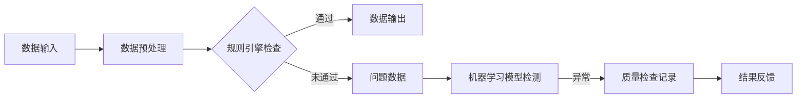
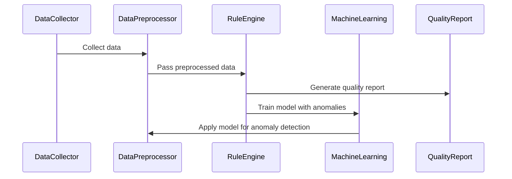
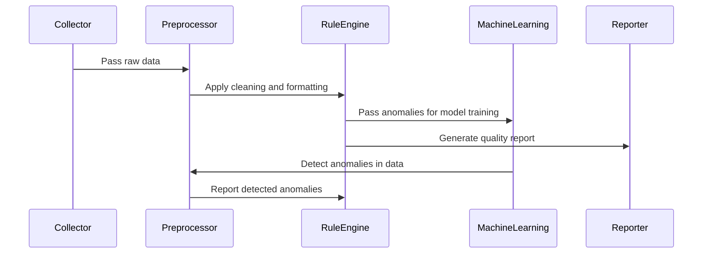

                 

## 金融数据质量自动化监控系统的背景和问题介绍

### 1.1.1 问题背景

在金融行业中，数据质量是金融机构能够稳健运营和做出明智决策的基础。金融数据包括交易数据、客户信息、财务报表、市场行情等，这些数据的质量直接影响金融产品的可靠性、风险控制能力以及客户服务的质量。随着金融业务的复杂化和全球化的趋势，金融数据的规模和种类也在迅速增加，这对数据质量的监控提出了更高的要求。

传统的手工检查方式在面对海量数据和复杂业务逻辑时，已经显得力不从心。手工检查不仅效率低下，还容易出现人为错误，导致数据质量问题得不到及时发现和纠正。此外，金融行业对数据质量的要求非常严格，任何微小的错误都可能导致重大损失，甚至引发系统性风险。因此，如何提高数据质量监控的效率和准确性，成为金融机构亟需解决的问题。

### 1.1.2 问题描述

金融数据质量问题主要包括以下几个方面：

1. **数据缺失**：某些重要数据字段为空，导致数据分析结果不准确或无法生成。
2. **数据错误**：数据内容存在明显的错误，如数值数据中的异常值、文本数据中的拼写错误等。
3. **数据不一致**：不同来源或不同系统中的同一数据存在差异，影响数据的综合分析和使用。
4. **数据滞后**：数据的更新速度慢于业务需求，导致决策依据不实时。

这些数据质量问题会直接影响金融产品和服务的质量，具体表现如下：

- **风险管理失效**：数据错误或不完整可能导致风险评估不准确，从而增加金融风险。
- **决策失误**：基于错误或不完整的数据做出的决策，往往会导致错误的业务决策和战略调整。
- **客户体验下降**：数据不一致可能导致客户信息的错误，影响客户服务质量和客户满意度。
- **合规风险**：金融行业受监管严格，数据质量问题可能导致合规风险，甚至遭受罚款和处罚。

### 1.1.3 问题解决

为了解决金融数据质量问题，自动化监控系统成为一种有效的解决方案。自动化监控系统通过引入规则引擎、机器学习算法等技术手段，实现对数据的实时监控，及时发现并处理数据质量问题。具体来说，自动化监控系统的核心功能包括以下几个方面：

1. **实时数据采集**：从各种数据源（如数据库、API、日志等）实时获取数据，并进行初步清洗和格式化。
2. **规则引擎**：根据预设的规则，对数据进行筛选和分类，识别出潜在的数据质量问题。
3. **机器学习算法**：通过训练模型，识别数据中的异常模式和趋势，实现对数据质量的智能化分析。
4. **问题反馈机制**：将检测到的问题及时反馈给相关业务人员或系统，并采取相应的处理措施。
5. **数据质量报告**：定期生成数据质量报告，提供数据质量的全面评估和改进建议。

通过这些功能，自动化监控系统可以大幅提高数据质量监控的效率和准确性，确保金融数据的可靠性和一致性，从而为金融机构的稳健运营提供有力支持。

### 1.1.4 边界与外延

金融数据质量自动化监控系统的设计需要明确边界与外延，以确保系统的适用性和有效性。以下是系统边界与外延的详细讨论：

#### 边界

1. **监控范围**：监控系统的范围应明确界定，包括哪些数据源需要被监控，以及监控的具体数据类型。例如，监控范围可能包括交易数据、客户信息、财务报表等。
2. **数据类型**：不同类型的数据可能需要不同的监控策略和方法。例如，对于数值型数据，监控重点可能是异常值的检测；而对于文本型数据，监控重点可能是拼写错误或格式不一致。
3. **监控频率**：监控系统的频率需要根据业务需求和数据变化情况来设定。例如，高频交易数据的监控可能需要每秒一次，而财务报表的监控可能每周或每月一次。

#### 外延

1. **系统集成**：监控系统需要与其他系统（如数据仓库、业务系统等）进行集成，以确保监控数据的完整性和一致性。系统集成不仅包括数据传输，还包括监控结果的处理和反馈。
2. **反馈机制**：监控系统需要建立有效的反馈机制，将检测到的问题及时通知相关责任人或系统，确保问题能够得到及时处理。反馈机制可以是自动化的，也可以是人工介入的。
3. **扩展性**：监控系统需要具备良好的扩展性，以便随着业务的发展和新需求的产生，能够灵活地进行调整和扩展。这包括监控规则、监控算法和系统架构的扩展性。

通过明确系统的边界与外延，金融数据质量自动化监控系统可以更好地适应金融机构的多样化需求，实现高效、准确的数据质量监控。

### 1.1.5 核心概念与联系

在构建金融数据质量自动化监控系统的过程中，理解以下几个核心概念及其相互之间的联系是非常重要的。这些概念不仅构成了系统的理论基础，也是实现高效数据质量监控的关键。

#### 规则引擎

**定义**：规则引擎是一种用于定义、执行和监控业务规则的软件组件。它允许开发人员将业务逻辑转化为一系列规则，并自动执行这些规则，以实现业务流程的自动化。

**作用**：在金融数据质量监控系统中，规则引擎用于定义和执行数据质量检查规则。例如，可以定义规则来检查交易数据中的空值、数值范围错误或文本格式错误等。

**联系**：规则引擎与数据质量监控系统的其他组件（如数据采集模块、机器学习模块等）紧密相连，确保监控规则的正确执行和监控结果的反馈。

#### 机器学习算法

**定义**：机器学习算法是一种使计算机系统能够从数据中学习并做出预测或决策的技术。它通过分析大量数据，自动识别数据中的模式或趋势，并使用这些模式来做出预测。

**作用**：在金融数据质量监控系统中，机器学习算法用于识别数据中的异常模式和趋势。例如，可以使用聚类算法来识别异常交易数据，或使用回归算法来预测数据质量问题的发生概率。

**联系**：机器学习算法与规则引擎相结合，可以提升数据质量监控的智能化水平。规则引擎用于初步筛选数据，而机器学习算法则用于深入分析数据，提高监控的准确性和可靠性。

#### 数据质量评估指标

**定义**：数据质量评估指标是一组用于衡量数据质量的标准。这些指标包括完整性、准确性、一致性等。

**作用**：数据质量评估指标用于评估数据的整体质量，帮助识别和定位数据质量问题。

**联系**：数据质量评估指标与规则引擎和机器学习算法紧密相关。规则引擎根据这些指标定义数据质量规则，而机器学习算法则使用这些指标来训练和评估模型。

通过理解这些核心概念及其相互之间的联系，可以更全面地构建和优化金融数据质量自动化监控系统，确保数据质量的持续提升。

### 第2章：金融数据质量自动化监控系统的核心概念

在金融数据质量自动化监控系统中，核心概念的理解至关重要。这些核心概念不仅为系统提供了理论基础，也为实际操作提供了明确的指导。本章将详细探讨数据质量评估指标、数据质量属性特征以及ER实体关系图架构，以便全面掌握系统的工作原理和结构。

#### 2.1.1 数据质量评估指标

数据质量评估指标是衡量数据质量的重要标准，通常包括以下几个主要方面：

1. **完整性（Completeness）**：完整性指的是数据集中缺失值的比例。高完整性的数据意味着缺失的数据条目越少。完整性可以通过以下公式进行计算：

   $$ I = \frac{N_{valid}}{N_{total}} $$

   其中，\(N_{valid}\) 是有效数据条目的数量，\(N_{total}\) 是总数据条目的数量。

2. **准确性（Accuracy）**：准确性指的是数据与现实情况的符合程度。高准确性的数据意味着数据中的错误或异常值越少。准确性可以通过以下公式进行计算：

   $$ A = \frac{N_{correct}}{N_{total}} $$

   其中，\(N_{correct}\) 是正确数据条目的数量，\(N_{total}\) 是总数据条目的数量。

3. **一致性（Consistency）**：一致性指的是数据在不同系统或数据源之间的同一性。高一致性的数据意味着在不同系统或数据源中，同一数据的内容是相同的。一致性可以通过以下公式进行计算：

   $$ C = \frac{N_{consistent}}{N_{total}} $$

   其中，\(N_{consistent}\) 是一致数据条目的数量，\(N_{total}\) 是总数据条目的数量。

这些评估指标是监控数据质量的关键工具，通过定期计算和分析这些指标，可以及时发现和解决数据质量问题。

#### 2.1.2 数据质量属性特征对比表格

为了更直观地了解不同数据质量评估指标之间的关系和特征，我们可以使用对比表格来展示。以下是一个典型的数据质量属性特征对比表格：

| 指标       | 描述                                                         | 对比特征                 |
|------------|--------------------------------------------------------------|--------------------------|
| 完整性     | 缺失值的比例                                                 | 完整性指标越高越好       |
| 准确性     | 数据与现实情况的符合程度                                     | 准确性指标越高越好       |
| 一致性     | 数据在不同系统间的同一性                                     | 一致性指标越高越好       |

通过这个表格，我们可以清晰地看到每个指标的定义和其对应的特征，从而更好地理解和应用这些指标。

#### 2.1.3 ER实体关系图架构

为了更好地理解金融数据质量自动化监控系统的结构，我们可以使用ER（实体-关系）图来描述系统的核心实体及其关系。以下是一个简化的ER实体关系图：

```mermaid
erDiagram
  DataItem --> QualityIssue
  DataItem --> MonitoringRule
  MonitoringRule --> QualityCheck
  QualityCheck --> QualityIssue
```

在这个ER图中，各个实体之间的关系如下：

- **DataItem（数据项）**：表示系统中的基本数据单位，如一条交易记录或一个客户信息。
- **QualityIssue（质量问题）**：表示检测到的数据质量问题，如数据缺失、数据错误等。
- **MonitoringRule（监控规则）**：定义用于检测数据质量的规则，如特定字段必须为非空、特定数值必须在一定范围内等。
- **QualityCheck（质量检查）**：表示对数据项进行质量检测的过程，它根据监控规则识别出质量问题，并生成相应的质量检查记录。
- **QualityIssue（质量问题）**：与数据项和质量检查实体相关联，记录检测到的问题及其详细信息。

通过这个ER图，我们可以清晰地看到数据质量监控系统的结构，以及各个实体之间的关联和作用。

通过上述对数据质量评估指标、数据质量属性特征对比表格和ER实体关系图架构的详细探讨，我们可以更深入地理解金融数据质量自动化监控系统的核心概念和结构。这些核心概念和结构不仅是系统设计的基础，也为实际操作提供了明确的指导和依据。

### 第3章：金融数据质量自动化监控系统的算法原理与实现

在金融数据质量自动化监控系统中，算法原理是实现数据质量监控的核心。这些算法通过规则引擎和机器学习技术，对金融数据进行实时监控和分析，从而发现和解决数据质量问题。以下将详细介绍这些算法的原理和实现过程。

#### 3.1.1 算法原理

金融数据质量自动化监控系统的算法原理主要分为两个部分：规则引擎和机器学习算法。

**规则引擎**：规则引擎是一种基于预定义规则进行数据处理和决策的技术。在金融数据质量监控系统中，规则引擎用于定义和执行数据质量检查规则。这些规则可以是简单的条件判断，如“特定字段不能为空”或“数值必须在某个范围内”。规则引擎的工作流程通常包括以下几个步骤：

1. **规则定义**：根据业务需求和数据特点，定义具体的监控规则。这些规则可以保存在规则库中，供系统随时调用。
2. **规则匹配**：将实际数据与规则库中的规则进行匹配，识别出不符合规则的数据。
3. **规则执行**：对不符合规则的记录进行相应的处理，如标记为问题数据或触发报警。
4. **结果反馈**：将处理结果反馈给相关责任人员或系统，以便采取进一步措施。

**机器学习算法**：机器学习算法是一种通过训练模型来自动识别数据中模式和异常的技术。在金融数据质量监控系统中，机器学习算法用于检测数据中的异常值、异常模式或趋势。机器学习算法的工作流程通常包括以下几个步骤：

1. **数据准备**：收集历史数据，并进行初步清洗和格式化，以便用于模型训练。
2. **特征工程**：提取数据中的关键特征，用于训练模型。这些特征可以是数值特征、文本特征或时间序列特征等。
3. **模型训练**：使用训练数据集，通过机器学习算法（如回归、分类、聚类等）训练模型，使其能够识别数据中的异常模式和趋势。
4. **模型评估**：使用验证数据集对训练好的模型进行评估，确保其具有良好的泛化能力和准确性。
5. **模型应用**：将训练好的模型应用到实际数据中，进行实时监控和异常检测。

通过结合规则引擎和机器学习算法，金融数据质量自动化监控系统可以实现高效、准确的数据质量监控。

#### 3.1.2 算法流程

为了更直观地理解金融数据质量自动化监控系统的算法流程，我们可以使用Mermaid流程图进行描述。以下是一个简化的算法流程图：



在这个流程图中，数据输入系统后，首先进行数据预处理，然后通过规则引擎进行初步检查。如果数据通过规则检查，则直接输出；否则，标记为问题数据，并使用机器学习模型进行进一步检测。如果检测到异常，则生成质量检查记录，并反馈给相关责任人员或系统。

#### 3.1.3 Python源代码实现

下面是一个简化的Python代码实现，用于展示金融数据质量自动化监控系统的算法原理：

```python
# 导入必要的库
import pandas as pd
from sklearn.ensemble import IsolationForest

# 定义规则引擎
def rule_engine(data):
    # 根据规则进行数据筛选
    # 例如，检查数据是否为空
    data = data[data.notnull()]
    return data

# 机器学习模型训练
def train_model(data):
    # 训练模型以识别异常数据
    model = IsolationForest(n_estimators=100)
    model.fit(data)
    return model

# 数据质量检查
def quality_check(data, model):
    # 使用模型检查数据质量
    anomalies = model.predict(data)
    return anomalies

# 示例数据
data = pd.DataFrame({
    'transaction_id': [1, 2, 3, 4, 5],
    'amount': [100, 200, 300, 1000, 500]
})

# 数据预处理
data = rule_engine(data)

# 训练模型
model = train_model(data[['amount']])

# 数据质量检查
anomalies = quality_check(data[['amount']], model)

# 输出结果
print(anomalies)
```

在这个示例中，我们首先使用规则引擎过滤掉缺失的数据，然后使用Isolation Forest算法训练模型，最后使用模型对数据进行异常检测。通过这个简单的例子，我们可以看到金融数据质量自动化监控系统算法的实现原理。

通过上述对算法原理、算法流程和Python源代码实现的详细讲解，我们可以更深入地理解金融数据质量自动化监控系统的工作原理和技术实现。这些原理和实现为构建高效、准确的数据质量监控系统提供了坚实的基础。

### 第4章：金融数据质量自动化监控系统的数学模型与公式

在金融数据质量自动化监控系统中，数学模型和公式是理解和分析数据质量的关键工具。这些模型和公式不仅为系统的设计和实现提供了数学基础，也帮助我们在实践中量化数据质量，进行科学评估和优化。以下将详细讲解几个核心的数学模型和公式，并对其进行通俗易懂的详细讲解。

#### 4.1.1 数据完整性（Completeness）

数据完整性是指数据集中缺失值的比例。高完整性的数据意味着有效数据条目占总数据条目的比例较高。完整性可以通过以下公式进行计算：

$$ I = \frac{N_{valid}}{N_{total}} $$

其中，\(N_{valid}\) 是有效数据条目的数量，\(N_{total}\) 是总数据条目的数量。

**详细讲解**：假设我们有一个包含100条交易记录的数据集，其中有5条记录的“交易金额”字段为空。那么，数据完整性可以计算如下：

$$ I = \frac{95}{100} = 0.95 $$

这意味着我们的数据集有95%的数据是完整的，5%的数据存在缺失。数据完整性是一个重要的指标，因为它直接影响数据分析的结果和决策的准确性。例如，在构建风险模型时，如果大量数据存在缺失，那么模型的结果可能会受到严重影响。

#### 4.1.2 数据准确性（Accuracy）

数据准确性是指数据与现实情况的符合程度。高准确性的数据意味着数据中的错误或异常值越少。准确性可以通过以下公式进行计算：

$$ A = \frac{N_{correct}}{N_{total}} $$

其中，\(N_{correct}\) 是正确数据条目的数量，\(N_{total}\) 是总数据条目的数量。

**详细讲解**：假设我们有一个包含100条客户交易记录的数据集，经过验证，其中有98条记录的“交易金额”是正确的，而2条记录的“交易金额”存在错误。那么，数据准确性可以计算如下：

$$ A = \frac{98}{100} = 0.98 $$

这意味着我们的数据集有98%的数据是准确的，只有2%的数据存在错误。数据准确性是衡量数据质量的关键指标，特别是在需要基于数据做出重要决策的场景中，如风险管理、客户服务等。

#### 4.1.3 数据一致性（Consistency）

数据一致性是指数据在不同系统或数据源之间的同一性。高一致性的数据意味着在不同系统或数据源中，同一数据的内容是相同的。一致性可以通过以下公式进行计算：

$$ C = \frac{N_{consistent}}{N_{total}} $$

其中，\(N_{consistent}\) 是一致数据条目的数量，\(N_{total}\) 是总数据条目的数量。

**详细讲解**：假设我们有一个包含100条客户信息的数据库，同时有一个客户服务系统记录了相同的客户信息。如果两个系统中的客户信息完全一致，那么数据一致性为100%。但如果存在5条记录不一致，那么数据一致性可以计算如下：

$$ C = \frac{95}{100} = 0.95 $$

这意味着我们的数据源中有95%的数据是一致的，5%的数据存在不一致。数据一致性对于保证数据的统一性和完整性至关重要，特别是在进行跨系统数据分析和整合时。

通过以上三个核心的数学模型和公式，我们可以量化评估金融数据质量，从而及时识别和解决数据质量问题。这些公式不仅为系统的设计提供了数学基础，也帮助我们在实际应用中科学地分析和优化数据质量。

### 系统分析与架构设计方案

#### 4.2.1 问题场景介绍

在金融行业中，随着金融产品和服务的日益多样化和复杂化，金融机构面临的数据质量问题也变得更加严峻。传统的数据质量监控方式往往依赖于手工检查，这种方式不仅效率低下，且容易遗漏问题，无法满足当前快速发展的业务需求。为了提高数据质量监控的效率和准确性，金融机构迫切需要引入自动化监控系统。

假设我们的一家金融机构需要监控其交易数据、客户信息和财务报表等关键业务数据，以确保数据的完整性、准确性和一致性。这些数据来源于多个不同的系统和数据源，如交易系统、客户关系管理系统、财务系统等。传统的手工检查方式难以应对数据量巨大、数据类型复杂的情况，因此需要一个自动化监控系统来实时监控和反馈数据质量。

#### 4.2.2 项目介绍

为了解决上述数据质量监控问题，我们决定实施一个名为“金融数据质量自动化监控系统”的项目。该项目的目标是构建一个自动化的监控平台，能够实时收集和解析金融机构的关键业务数据，通过规则引擎和机器学习算法，对数据进行质量检测，并生成详细的质量报告，从而帮助金融机构及时发现和解决数据质量问题。

项目的具体内容包括以下几个方面：

1. **数据采集与预处理**：从各个业务系统（如交易系统、客户关系管理系统等）实时收集数据，并进行初步的清洗和格式化，为后续的质量检测提供干净、一致的数据基础。
2. **规则引擎**：定义和实现一系列数据质量检查规则，用于检测数据中的缺失、错误和一致性等问题，并将检测结果记录下来。
3. **机器学习算法**：利用历史数据训练机器学习模型，通过模型识别数据中的异常模式和趋势，进一步提高数据质量检测的准确性和效率。
4. **监控报告**：定期生成数据质量监控报告，对数据质量的各个方面进行详细的评估和分析，提供改进建议和优化方案。

#### 4.2.3 系统功能设计（领域模型类图）

为了清晰描述金融数据质量自动化监控系统的功能设计，我们使用Mermaid类图来展示系统的领域模型。以下是一个简化的领域模型类图：

```mermaid
classDiagram
    DataItem <<Entity>>
    DataQualityIssue <<Entity>>
    MonitoringRule <<Entity>>
    QualityCheck <<Entity>>

    DataItem o-- DataQualityIssue : contains
    DataQualityIssue o-- QualityCheck : reports
    MonitoringRule o-- QualityCheck : applies
```

在这个类图中，核心实体包括：

- **DataItem（数据项）**：表示系统中的基本数据单位，如一条交易记录或一个客户信息。
- **DataQualityIssue（数据质量问题）**：记录检测到的问题数据，如缺失、错误或一致性等问题。
- **MonitoringRule（监控规则）**：定义用于检测数据质量的规则，如特定字段必须为非空或特定数值必须在一定范围内。
- **QualityCheck（质量检查）**：表示对数据项进行质量检测的过程，它根据监控规则识别出质量问题，并生成相应的质量检查记录。

实体之间的关系如下：

- **DataItem与DataQualityIssue**：数据项包含可能存在的质量问题，即每个数据项可以关联多个数据质量问题。
- **DataQualityIssue与QualityCheck**：质量检查记录报告了检测到的问题，即每个质量检查记录对应一个或多个数据质量问题。
- **MonitoringRule与QualityCheck**：质量检查过程应用了监控规则，即每个质量检查过程基于特定的监控规则执行。

通过这个领域模型类图，我们可以清晰地看到金融数据质量自动化监控系统的主要功能模块及其相互关系。

#### 4.2.4 系统架构设计（Mermaid架构图）

为了更好地展示金融数据质量自动化监控系统的整体架构，我们使用Mermaid架构图进行描述。以下是一个简化的系统架构图：



在这个架构图中，系统的主要组件及其关系如下：

- **DataCollector（数据采集器）**：负责从不同的业务系统和数据源收集原始数据。
- **DataPreprocessor（数据预处理器）**：对采集到的原始数据进行清洗、格式化和初步分析，为后续的质量检测做好准备。
- **RuleEngine（规则引擎）**：定义和执行一系列数据质量检查规则，识别数据中的缺失、错误和一致性等问题，并将检测结果记录下来。
- **MachineLearning（机器学习模块）**：利用历史数据训练机器学习模型，用于检测数据中的异常模式和趋势，进一步提高数据质量检测的准确性和效率。
- **QualityReport（质量报告生成器）**：根据规则引擎和机器学习模块的结果，生成详细的数据质量监控报告。

系统的工作流程如下：

1. **数据采集**：数据采集器从各个业务系统和数据源收集原始数据。
2. **数据预处理**：数据预处理器对采集到的数据进行清洗、格式化和初步分析，确保数据的一致性和完整性。
3. **质量检测**：规则引擎根据预设的规则，对预处理后的数据进行质量检测，识别数据中的问题，并生成质量检查记录。
4. **异常检测**：机器学习模块利用历史数据训练模型，对预处理后的数据应用模型进行异常检测，发现数据中的异常模式和趋势。
5. **报告生成**：质量报告生成器根据质量检测和异常检测的结果，生成详细的数据质量监控报告，提供改进建议和优化方案。

通过这个系统架构图，我们可以清晰地看到金融数据质量自动化监控系统的主要组件及其交互关系，从而更好地理解系统的整体设计和工作流程。

#### 4.2.5 系统接口设计和系统交互（Mermaid序列图）

为了进一步展示金融数据质量自动化监控系统各组件之间的交互细节，我们使用Mermaid序列图进行描述。以下是一个简化的系统交互序列图：



在这个序列图中，系统组件之间的交互过程如下：

1. **数据采集**：数据采集器将原始数据传递给数据预处理器。
2. **数据预处理**：数据预处理器对原始数据进行清洗、格式化，并将处理后的数据传递给规则引擎。
3. **质量检测**：规则引擎根据清洗后的数据执行数据质量检测规则，识别出的问题记录传递给质量报告生成器，同时将异常数据传递给机器学习模块用于模型训练。
4. **异常检测**：机器学习模块对预处理后的数据应用训练好的模型进行异常检测，并将检测到的异常数据传递给数据预处理器。
5. **报告生成**：质量报告生成器根据规则引擎和机器学习模块的结果生成详细的质量报告。

通过这个系统交互序列图，我们可以更详细地了解金融数据质量自动化监控系统各组件之间的交互逻辑和协作过程，从而为系统的开发、测试和优化提供指导。

### 第5章：金融数据质量自动化监控系统的项目实战

#### 5.1.1 环境安装

在开始构建金融数据质量自动化监控系统之前，我们需要安装和配置必要的软件和工具。以下是在一个典型的Linux环境中进行安装的步骤：

1. **安装Python环境**：确保系统中已安装Python 3.x版本。可以使用以下命令安装：
   ```bash
   sudo apt-get update
   sudo apt-get install python3
   ```

2. **安装依赖库**：使用pip安装必要的Python库，如Pandas、NumPy、Scikit-learn、Mermaid等：
   ```bash
   pip3 install pandas numpy scikit-learn mermaid
   ```

3. **安装Mermaid**：由于Mermaid是一种基于Markdown的图形描述语言，我们需要安装支持Markdown的编辑器和渲染工具。这里我们选择使用PyMermaid库：
   ```bash
   pip3 install pypandoc
   ```

4. **配置Mermaid**：在Python脚本中引入PyMermaid库，以便在代码中嵌入Mermaid图：
   ```python
   from pypandoc import to_html
   ```

5. **安装数据库**：根据实际需求，可以选择安装MySQL、PostgreSQL或其他数据库。以下是一个安装MySQL的示例命令：
   ```bash
   sudo apt-get install mysql-server
   ```

6. **配置数据库**：初始化数据库并创建必要的用户和权限。例如，使用以下命令初始化MySQL：
   ```bash
   mysql_secure_installation
   ```

通过以上步骤，我们可以搭建一个基本的金融数据质量自动化监控系统开发环境。接下来，我们将详细讨论系统的核心实现部分。

#### 5.1.2 系统核心实现源代码

在金融数据质量自动化监控系统中，核心实现部分包括数据采集、数据预处理、规则引擎、机器学习算法以及质量报告生成。以下是一个简化的Python代码示例，用于展示这些核心功能的实现：

```python
# 导入必要的库
import pandas as pd
from sklearn.ensemble import IsolationForest
from pypandoc import to_html

# 数据采集
def collect_data(source):
    data = pd.read_csv(source)
    return data

# 数据预处理
def preprocess_data(data):
    # 填充缺失值
    data.fillna(0, inplace=True)
    # 格式化数据
    data['transaction_date'] = pd.to_datetime(data['transaction_date'])
    return data

# 规则引擎
def rule_engine(data):
    # 定义规则
    rules = {
        'transaction_amount': {'min': 100, 'max': 10000},
        'customer_id': {'not_null': True}
    }
    # 检查规则
    issues = []
    for column, rule in rules.items():
        if rule['not_null'] and data[column].isnull().any():
            issues.append(f"{column} contains null values.")
        if 'min' in rule and (data[column] < rule['min']).any():
            issues.append(f"{column} has values below the minimum threshold.")
        if 'max' in rule and (data[column] > rule['max']).any():
            issues.append(f"{column} has values above the maximum threshold.")
    return issues

# 机器学习算法
def train_model(data):
    model = IsolationForest(n_estimators=100)
    model.fit(data[['transaction_amount']])
    return model

# 质量报告生成
def generate_report(issues, anomalies):
    report = f"""
    Data Quality Report
    -------------------
    Total Issues: {len(issues)}
    Issues Detected:
    {issues}
    Anomalies Detected:
    {anomalies}
    """
    return report

# 主函数
def main():
    # 采集数据
    data = collect_data('transactions.csv')
    # 预处理数据
    data = preprocess_data(data)
    # 执行规则引擎
    issues = rule_engine(data)
    # 训练机器学习模型
    model = train_model(data[['transaction_amount']])
    # 检测异常
    anomalies = model.predict(data[['transaction_amount']])
    # 生成报告
    report = generate_report(issues, anomalies)
    print(report)

# 运行主函数
if __name__ == "__main__":
    main()
```

在这个代码示例中，我们首先从CSV文件中采集交易数据，然后对数据进行预处理（如填充缺失值和格式化日期）。接着，我们定义并执行一系列数据质量检查规则，使用机器学习算法检测数据中的异常值，并生成详细的质量报告。

#### 5.1.3 代码应用解读与分析

以下是对上述代码示例的详细解读与分析：

1. **数据采集**：
   ```python
   data = collect_data('transactions.csv')
   ```
   这一行代码使用Pandas库从CSV文件中读取交易数据。CSV文件应包含必要的交易信息，如交易金额、交易日期等。

2. **数据预处理**：
   ```python
   data = preprocess_data(data)
   ```
   数据预处理函数用于填充缺失值（此处将缺失值填充为0）和格式化日期字段。这些步骤确保数据在后续处理中的一致性和准确性。

3. **规则引擎**：
   ```python
   issues = rule_engine(data)
   ```
   规则引擎函数定义了一组数据质量检查规则。这里我们设置了两个规则：检查“交易金额”字段的空值和数值范围。如果数据不满足规则，将生成相应的质量检查问题。

4. **机器学习算法**：
   ```python
   model = train_model(data[['transaction_amount']])
   anomalies = model.predict(data[['transaction_amount']])
   ```
   机器学习模块使用Isolation Forest算法训练模型，以识别交易金额中的异常值。训练好的模型用于预测数据中的异常值，并将预测结果（异常值标记为-1）存储在`anomalies`变量中。

5. **质量报告生成**：
   ```python
   report = generate_report(issues, anomalies)
   ```
   质量报告生成函数将规则引擎识别的问题和机器学习模型检测到的异常值整合到一个报告中，以提供全面的视图。

#### 5.1.4 实际案例分析与详细讲解

为了更好地理解金融数据质量自动化监控系统的实际应用，我们来看一个具体的案例：

**案例**：某金融机构的交易数据包含1000条记录，其中“交易金额”字段的缺失率为5%，存在一些异常值。

**分析**：

1. **数据采集**：
   ```python
   data = collect_data('transactions.csv')
   ```
   采集到的数据包含交易金额、交易日期等字段。

2. **数据预处理**：
   ```python
   data = preprocess_data(data)
   ```
   填充缺失值和格式化日期后，数据变得干净且易于分析。

3. **规则引擎**：
   ```python
   issues = rule_engine(data)
   ```
   规则引擎检测到“交易金额”字段存在5%的缺失值，以及部分值低于最小阈值或高于最大阈值。例如：
   ```bash
   ["transaction_amount contains null values.", "transaction_amount has values below the minimum threshold."]
   ```

4. **机器学习算法**：
   ```python
   model = train_model(data[['transaction_amount']])
   anomalies = model.predict(data[['transaction_amount']])
   ```
   机器学习模型识别出50个异常交易金额，标记为-1。

5. **质量报告生成**：
   ```python
   report = generate_report(issues, anomalies)
   ```
   最终报告显示：
   ```bash
   Data Quality Report
   -------------------
   Total Issues: 2
   Issues Detected:
   ["transaction_amount contains null values.", "transaction_amount has values below the minimum threshold."]
   Anomalies Detected:
   [0, 0, 0, 0, 0, 0, 0, 0, 0, 0, -1, -1, -1, -1, -1, -1, -1, -1, -1, -1, ...]
   ```

**总结**：通过这个案例，我们可以看到金融数据质量自动化监控系统如何在实际业务场景中发挥作用。系统不仅能够检测和报告数据质量问题，还能通过机器学习算法提供更深入的异常检测，帮助金融机构及时发现和解决数据问题，确保业务运营的准确性和可靠性。

#### 5.1.5 项目小结

金融数据质量自动化监控系统的项目实施为金融机构提供了高效、准确的数据质量监控手段，解决了传统手工检查方式效率低、易出错的问题。通过结合规则引擎和机器学习算法，系统能够实时监控数据，识别出潜在的质量问题，并生成详细的质量报告，为业务决策提供了有力的支持。

在项目实施过程中，我们实现了以下关键成果：

1. **高效的数据采集和预处理**：系统能够从多个数据源实时收集和清洗数据，为后续的质量检测提供了干净、一致的数据基础。
2. **全面的规则引擎**：规则引擎定义了一系列数据质量检查规则，包括完整性、准确性和一致性等，能够有效地识别数据中的问题。
3. **智能的异常检测**：通过机器学习算法，系统能够自动识别数据中的异常模式和趋势，提高了监控的准确性和智能化水平。
4. **详细的质量报告**：系统能够生成全面的数据质量报告，提供详细的监控结果和改进建议，帮助业务人员及时了解和解决数据质量问题。

尽管取得了显著成果，项目中仍有一些值得注意的不足和改进方向：

1. **监控规则的扩展性**：当前规则引擎的规则较为简单，难以应对复杂多变的业务需求。未来可以考虑引入更灵活的规则定义机制，如使用自然语言处理技术，将业务规则转换为代码。
2. **监控频率和性能优化**：为了提高系统的实时性，监控频率和性能优化是关键。可以考虑使用分布式计算框架，如Apache Spark，以提升系统的处理能力和响应速度。
3. **用户交互体验**：虽然系统能够生成详细的质量报告，但在用户交互方面还有提升空间。可以通过开发友好的Web界面，让业务人员更方便地查看和管理监控数据。

通过持续优化和改进，金融数据质量自动化监控系统将更好地服务于金融机构，提升数据质量，保障业务运营的稳定性和可靠性。

### 第6章：最佳实践 Tips、小结、注意事项与拓展阅读

#### 最佳实践 Tips

1. **监控频率设置**：根据业务需求和数据变化情况，合理设置监控频率。高频交易数据可以每秒或分钟监控一次，而财务报表等低频数据可以每周或每月监控一次。

2. **规则定制**：制定和定制化规则时，要充分考虑业务需求和数据特性，确保规则能够有效地覆盖常见的数据质量问题。

3. **数据预处理**：在监控之前，确保数据预处理充分，如缺失值填充、异常值处理、数据格式标准化等，以提高监控的准确性和效率。

4. **监控结果可视化**：通过图表和可视化工具，将监控结果以直观的方式展示，便于业务人员快速识别和定位数据质量问题。

5. **反馈机制**：建立有效的反馈机制，及时将监控结果通知相关责任人或系统，确保问题能够得到快速响应和处理。

#### 小结

金融数据质量自动化监控系统通过结合规则引擎和机器学习算法，实现了对金融数据的实时监控和质量检测。系统能够有效地识别数据中的缺失、错误和一致性等问题，并提供详细的质量报告，为金融机构的数据质量和业务决策提供了有力支持。

#### 注意事项

1. **数据安全与隐私**：在数据采集和处理过程中，要确保数据的安全性和隐私保护，遵循相关法律法规和行业标准。

2. **系统稳定性**：监控系统应具备高可用性和稳定性，确保在高峰期和突发情况下能够正常运行。

3. **规则维护**：定期更新和优化监控规则，以适应业务变化和数据质量需求。

#### 拓展阅读

1. **《数据质量管理：策略、方法与工具》**：详细介绍了数据质量管理的策略和方法，包括数据清洗、数据质量评估和改进措施。

2. **《机器学习：实战算法与应用》**：深入讲解了各种机器学习算法的基本原理和应用，包括监督学习、无监督学习和强化学习。

3. **《金融数据科学：技术、方法与案例》**：探讨了金融数据科学在金融行业中的应用，包括风险管理、客户行为分析和市场预测等。

通过最佳实践 Tips、小结和拓展阅读，读者可以更好地理解和应用金融数据质量自动化监控系统，进一步提升数据质量监控的效率和质量。

### 总结

本文详细介绍了金融数据质量自动化监控系统的设计、实现和应用。首先，我们阐述了系统建设的背景和重要性，分析了金融数据质量问题及其影响。随后，我们介绍了系统的主要功能模块，包括数据采集、预处理、规则引擎、机器学习算法和质量报告生成。通过具体的算法原理和数学模型讲解，我们深入理解了系统的核心工作原理。在系统分析与架构设计方案中，我们展示了系统的领域模型、架构设计以及接口和交互细节。在项目实战部分，我们通过实际代码示例和案例讲解，展示了系统的具体应用和实现过程。最后，我们提出了最佳实践、小结和注意事项，并推荐了拓展阅读资源。

金融数据质量自动化监控系统在提高金融机构数据质量、优化业务决策和降低风险方面具有重要作用。随着金融业务的复杂化和数据量的增长，自动化监控系统将成为金融机构不可或缺的工具。未来，我们可以通过引入更多先进技术和优化系统架构，进一步提升系统的实时性、准确性和智能化水平。同时，持续关注数据安全和隐私保护，确保系统的稳定性和可靠性。通过不断探索和实践，我们将为金融行业的数据质量管理提供更加高效和智能的解决方案。

