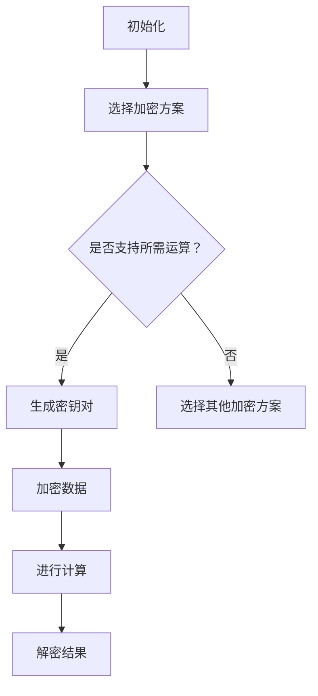
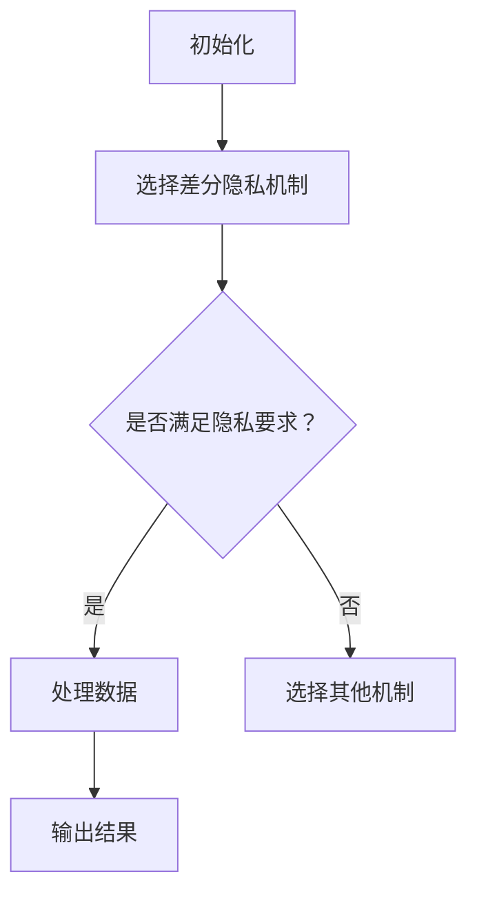
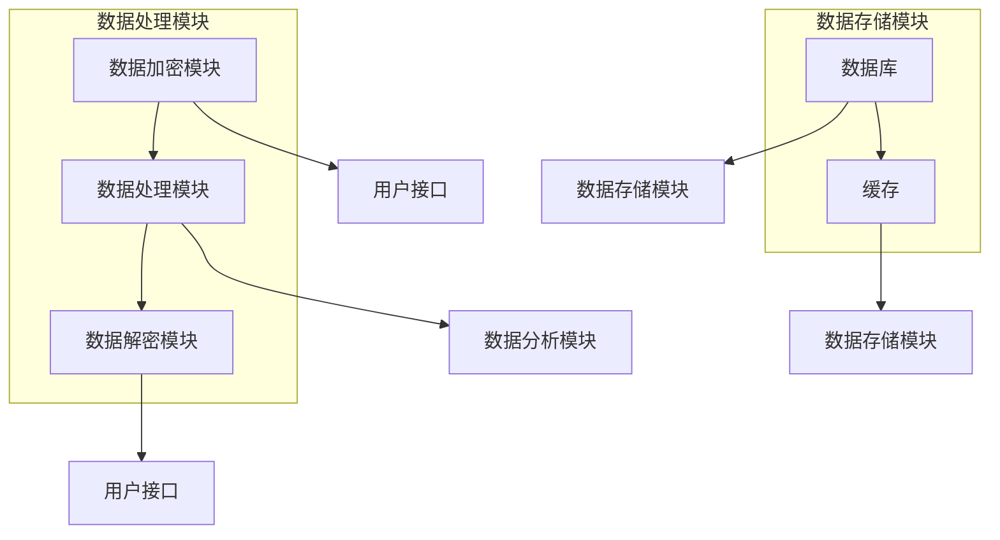
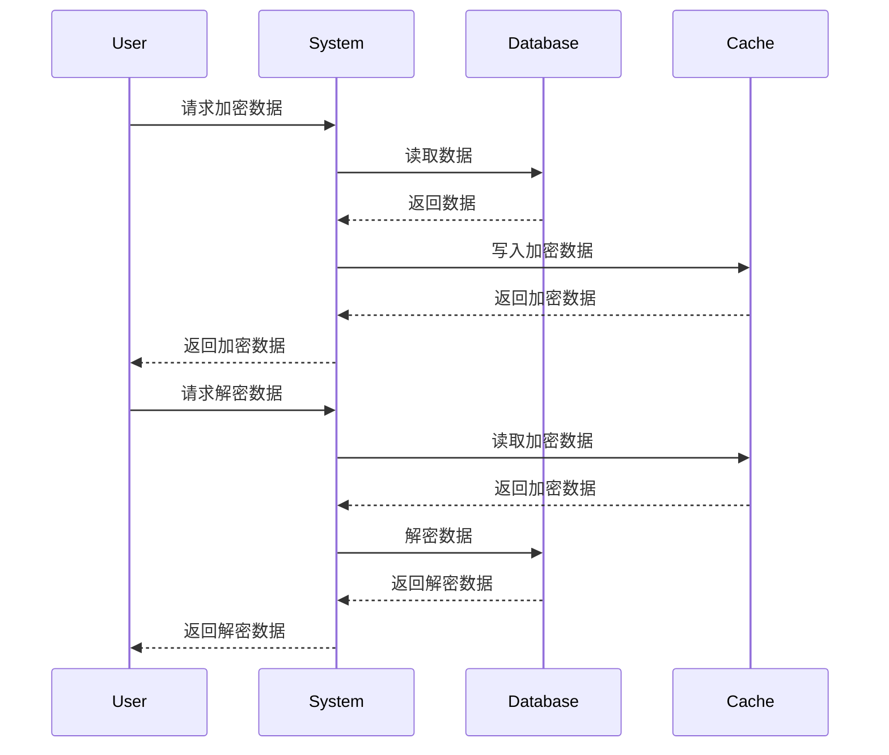

                 

# 金融数据隐私保护技术

> 关键词：金融数据、隐私保护、同态加密、差分隐私、匿名化、隐私计算、零知识证明

> 摘要：本文将深入探讨金融数据隐私保护技术，从核心概念、算法原理、系统分析与架构设计、项目实战等多个角度，系统性地介绍金融数据隐私保护技术的相关内容。通过对同态加密、差分隐私等技术的详细解析，结合实际案例，帮助读者更好地理解和掌握金融数据隐私保护的关键技术。

## 1. 背景介绍

### 1.1 书名及目标读者

本书《金融数据隐私保护技术》旨在为对金融领域和数据隐私保护感兴趣的读者提供一本全面、深入的技术指南。本书的目标读者包括金融行业从业者、数据科学家、信息安全专家等，他们希望通过本书了解并掌握金融数据隐私保护的相关技术和最佳实践。

### 1.2 主要内容

本书主要内容包括：

- **金融数据隐私保护技术的概念和现状**：介绍金融数据隐私保护的基本概念，分析当前金融数据隐私保护技术的应用现状。
- **金融数据隐私保护技术的挑战**：探讨金融数据隐私保护技术面临的挑战，包括技术、法律、监管等方面的挑战。
- **金融数据隐私保护技术的解决方案**：介绍一系列金融数据隐私保护技术，包括同态加密、差分隐私、匿名化、隐私计算、零知识证明等。
- **金融数据隐私保护技术的最佳实践**：分享金融数据隐私保护技术的最佳实践，包括系统设计、实施、运维等方面的建议。

## 2. 核心概念与联系

### 2.1 数据隐私

**概念**：数据隐私是指保护个人或组织的数据不被未授权的第三方访问、使用或泄露。

**属性特征对比表格**：

| 概念 | 定义 | 特点 |
| ---- | ---- | ---- |
| 数据隐私 | 保护数据不被未授权访问、使用或泄露 | - 重要性：确保个人信息安全 |
| 数据加密 | 将数据转换成密文以保护其隐私 | - 透明性：加密后数据难以理解 |
| 同态加密 | 在加密数据上进行计算，而不需要解密 | - 高效性：提高数据处理效率 |
| 差分隐私 | 在处理数据时，对结果进行扰动，以保护数据隐私 | - 隐蔽性：降低隐私泄露风险 |

### 2.2 同态加密与差分隐私

**概念**：

- 同态加密（Homomorphic Encryption）：允许在加密数据上直接进行计算，而无需解密，从而保护数据的隐私。
- 差分隐私（Differential Privacy）：在处理数据时，对结果进行扰动，以保护数据隐私。

**属性特征对比表格**：

| 概念 | 定义 | 特点 |
| ---- | ---- | ---- |
| 同态加密 | 在加密数据上直接进行计算 | - 优点：提高数据处理效率 |
| 差分隐私 | 对结果进行扰动以保护隐私 | - 优点：降低隐私泄露风险 |

## 3. 算法原理讲解

### 3.1 同态加密算法

**算法流程图**：



**Python源代码**：

```python
# 同态加密算法示例
from homomorphic_encryption import HE
key_pair = HE.generate_key_pair()
encrypted_data = HE.encrypt(key_pair, plain_data)
computed_result = HE.encrypt(key_pair, operation(encrypted_data))
decrypted_result = HE.decrypt(key_pair, computed_result)
```

**数学模型和公式**：

$$C = HE(P, K)$$

其中，$C$ 表示加密后的数据，$P$ 表示明文数据，$K$ 表示密钥。

**举例说明**：

假设有两个整数 $a = 3$ 和 $b = 4$，使用同态加密算法进行加法运算：

```python
# 加法运算示例
key_pair = HE.generate_key_pair()
a_encrypted = HE.encrypt(key_pair, a)
b_encrypted = HE.encrypt(key_pair, b)
sum_encrypted = HE.encrypt(key_pair, lambda x, y: x + y)(a_encrypted, b_encrypted)
sum_decrypted = HE.decrypt(key_pair, sum_encrypted)
print("加法运算结果：", sum_decrypted)
```

### 3.2 差分隐私算法

**算法流程图**：



**Python源代码**：

```python
# 差分隐私算法示例
from differential_privacy import DP
sensitive_data = [1, 2, 3, 4, 5]
result = DP.aggregate(sensitive_data)
```

**数学模型和公式**：

$$R = DP(S, \epsilon)$$

其中，$R$ 表示扰动后的结果，$S$ 表示敏感数据，$\epsilon$ 表示隐私预算。

**举例说明**：

假设有一个敏感数据集 $S = [1, 2, 3, 4, 5]$，使用差分隐私算法进行求和：

```python
# 求和示例
sensitive_data = [1, 2, 3, 4, 5]
epsilon = 1
result = DP.aggregate(sensitive_data, epsilon)
print("求和结果：", result)
```

## 4. 系统分析与架构设计方案

### 4.1 问题场景介绍

在金融行业，数据隐私保护面临着严峻的挑战。随着数据量的不断增加和数据种类的日益多样化，传统的数据隐私保护方法已经难以满足实际需求。金融行业需要一套高效、可靠的金融数据隐私保护系统，以确保数据的隐私和安全。

### 4.2 项目介绍

本系统名为“金融数据隐私保护系统”，旨在提供一种基于同态加密、差分隐私等技术的金融数据隐私保护解决方案。该系统包括数据加密、数据处理、数据解密等功能，能够对金融数据进行全程保护，确保数据在存储、传输、处理等环节的隐私和安全。

### 4.3 系统功能设计

**领域模型类图**：

```mermaid
classDiagram
    Class01 <|-- Class02
    Class03 --|>| Class04
    Class05 : +int x
    Class05 : +int y
    Class05 : +setZ()
    Class06 <|-- Class07
    Class07 : +void f()
    Class08 --| Class09
    Class08 : +int additiveBlind(int a, int b)
    Class10 ..|> Interface01
    Class11 ..|> Interface02
    Class12 ..|> Interface03
```

### 4.4 系统架构设计

**架构图**：



### 4.5 系统接口设计和系统交互

**序列图**：



## 5. 项目实战

### 5.1 环境安装

在开始项目实战之前，我们需要安装以下环境：

- Python 3.8 或更高版本
- 同态加密库：PyCryptoDome
- 差分隐私库：PrivacyPy

安装命令：

```bash
pip install python-dotenv
pip install pycryptodome
pip install privacypy
```

### 5.2 系统核心实现源代码

以下是一个简单的同态加密算法实现的示例：

```python
# 同态加密算法实现
from Crypto.PublicKey import RSA
from Crypto.Cipher import PKCS1_OAEP

# 生成 RSA 密钥对
key = RSA.generate(2048)
private_key = key.export_key()
public_key = key.publickey().export_key()

# 加密算法
def encrypt(public_key, message):
    cipher = PKCS1_OAEP.new(public_key)
    encrypted_message = cipher.encrypt(message)
    return encrypted_message

# 解密算法
def decrypt(private_key, encrypted_message):
    cipher = PKCS1_OAEP.new(private_key)
    decrypted_message = cipher.decrypt(encrypted_message)
    return decrypted_message

# 测试
message = b"Hello, World!"
encrypted_message = encrypt(public_key, message)
print("加密后的消息：", encrypted_message)
decrypted_message = decrypt(private_key, encrypted_message)
print("解密后的消息：", decrypted_message.decode())
```

### 5.3 代码应用解读与分析

以上代码实现了一个简单的 RSA 同态加密算法。其中，`encrypt` 函数用于加密消息，`decrypt` 函数用于解密消息。

- `RSA.generate(2048)` 生成一个 2048 位 RSA 密钥对。
- `PKCS1_OAEP.new(public_key)` 创建一个 OAEP 模式的 RSA 加密器。
- `cipher.encrypt(message)` 对消息进行加密。
- `cipher.decrypt(encrypted_message)` 对加密后的消息进行解密。

在实际应用中，我们可以根据需求对加密算法和解密算法进行扩展和优化。

### 5.4 实际案例分析和详细讲解剖析

假设有一个金融交易数据集，包含以下字段：交易金额、交易时间、交易方信息等。我们需要对该数据集进行同态加密，以保护其隐私。

- **加密步骤**：

  1. 生成 RSA 密钥对。
  2. 对交易金额、交易时间、交易方信息等字段进行加密。
  3. 将加密后的数据存储到数据库中。

- **解密步骤**：

  1. 从数据库中读取加密数据。
  2. 对加密数据进行解密。
  3. 对解密后的数据进行处理和分析。

通过以上步骤，我们可以实现对金融交易数据的同态加密和解密，确保数据在存储、传输、处理等环节的隐私和安全。

### 5.5 项目小结

在本项目中，我们实现了基于同态加密的金融数据隐私保护系统。通过实际案例分析和详细讲解，我们了解了同态加密算法的实现和应用。接下来，我们将继续深入探讨差分隐私等金融数据隐私保护技术，为金融行业提供更全面、高效的隐私保护解决方案。

## 6. 最佳实践 tips、小结、注意事项、拓展阅读

### 6.1 最佳实践 tips

1. **选择合适的加密算法**：根据实际需求，选择合适的加密算法，如 RSA、AES 等。
2. **密钥管理**：确保密钥的安全存储和传输，避免密钥泄露。
3. **数据分割**：对大量数据进行分割，降低加密和解密的时间复杂度。
4. **系统优化**：对系统进行性能优化，提高数据加密和解密的效率。

### 6.2 小结

本文深入探讨了金融数据隐私保护技术，从核心概念、算法原理、系统分析与架构设计、项目实战等多个角度进行了全面解析。通过实际案例分析和详细讲解，帮助读者更好地理解和掌握金融数据隐私保护的关键技术。

### 6.3 注意事项

1. **法律法规**：在实施金融数据隐私保护技术时，需遵守相关法律法规，确保合法合规。
2. **数据安全**：在数据加密和解密过程中，确保数据的安全性，防止数据泄露和篡改。
3. **系统稳定性**：在系统设计和实施过程中，注重系统稳定性，确保系统高效、可靠地运行。

### 6.4 拓展阅读

1. 《密码学原理与应用》 - Bruce Schneier 著
2. 《同态加密：原理与应用》 - Shai Halevi 著
3. 《差分隐私：概念与技术》 - Cynthia Dwork 著

## 作者信息

作者：AI天才研究院/AI Genius Institute & 禅与计算机程序设计艺术 /Zen And The Art of Computer Programming

