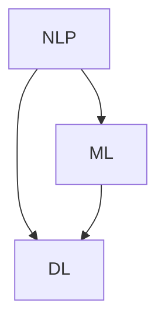

                 


### 1. 背景介绍

#### 金融文本挖掘技术简介

金融文本挖掘（Financial Text Mining）是一种利用自然语言处理（NLP）、机器学习（ML）和深度学习（DL）技术，从金融领域的大量文本数据中提取有用信息和知识的技术。金融文本数据包括新闻、报告、公告、社交媒体帖子、交易记录等，这些数据包含了大量的潜在信息和趋势。通过金融文本挖掘，我们可以对市场动态、公司业绩、行业趋势等进行深入分析，从而为投资者、分析师和金融机构提供决策支持。

金融文本挖掘的重要性主要体现在以下几个方面：

1. **投资决策支持**：通过对金融文本数据的分析，投资者可以更好地了解市场动态和公司业绩，从而做出更明智的投资决策。

2. **风险管理**：金融文本挖掘可以帮助金融机构识别潜在的风险，及时调整策略，降低风险。

3. **监管合规**：随着监管政策的日益严格，金融机构需要通过金融文本挖掘来确保其业务活动符合相关法律法规。

4. **舆情监控**：通过分析社交媒体和新闻报道，金融机构可以了解公众对公司或行业的看法，及时调整市场策略。

#### 智能助手的概念及其在金融领域的应用

智能助手（Intelligent Assistant）是一种利用人工智能技术，模拟人类对话和提供个性化服务的人工智能系统。在金融领域，智能助手可以用于客服、投资顾问、风险控制等多个场景。

智能助手在金融领域的应用主要体现在以下几个方面：

1. **客服支持**：智能助手可以自动回答客户常见问题，提高客服效率，降低人力成本。

2. **投资顾问**：智能助手可以根据用户的风险偏好和投资目标，提供个性化的投资建议。

3. **风险控制**：智能助手可以实时监控市场动态，识别潜在的风险，并提供预警和建议。

4. **数据分析**：智能助手可以对金融文本数据进行深入分析，提取有用的信息和趋势，为投资决策提供支持。

#### 智能助手的技术基础

智能助手的技术基础主要包括自然语言处理（NLP）、机器学习（ML）和深度学习（DL）。这些技术相互关联，共同构成了智能助手的底层技术框架。

1. **自然语言处理（NLP）**：NLP是智能助手的核心技术，用于处理和解析自然语言文本。NLP的关键技术包括分词、词性标注、句法分析、语义理解等。

2. **机器学习（ML）**：ML是智能助手的核心算法，用于从数据中学习模式和规律，从而实现智能决策。ML的关键技术包括决策树、支持向量机、神经网络等。

3. **深度学习（DL）**：DL是ML的进一步发展，通过构建深度神经网络，实现对复杂数据的处理和分析。DL的关键技术包括卷积神经网络（CNN）、循环神经网络（RNN）、Transformer等。

#### 智能助手的发展趋势

随着人工智能技术的不断发展，智能助手在金融领域的应用前景十分广阔。未来，智能助手的发展趋势主要体现在以下几个方面：

1. **智能化水平提升**：通过不断优化算法和模型，提高智能助手的智能化水平，使其能够更准确地理解和回应用户的请求。

2. **个性化服务**：智能助手将更加注重个性化服务，根据用户的行为和偏好，提供个性化的投资建议和风险管理方案。

3. **跨领域应用**：智能助手将不仅限于金融领域，还将扩展到医疗、教育、生活服务等其他领域，为用户提供全方位的智能服务。

### 2. 核心概念与联系

#### 自然语言处理（NLP）

自然语言处理（NLP）是智能助手的核心技术之一，旨在使计算机能够理解和处理自然语言文本。NLP的关键技术包括：

- **分词**：将文本分割成有意义的单词或短语。
- **词性标注**：为每个词分配一个词性标签，如名词、动词、形容词等。
- **句法分析**：分析句子的结构，识别主语、谓语、宾语等。
- **语义理解**：理解文本中的语义含义，包括实体识别、情感分析、指代消解等。

#### 机器学习（ML）

机器学习（ML）是智能助手的另一个核心技术，用于从数据中学习模式和规律，从而实现智能决策。ML的关键技术包括：

- **监督学习**：通过已标注的数据训练模型，然后使用模型对新数据进行预测。
- **无监督学习**：通过未标注的数据发现数据中的模式和结构。
- **强化学习**：通过与环境交互，学习最优策略。

#### 深度学习（DL）

深度学习（DL）是ML的进一步发展，通过构建深度神经网络，实现对复杂数据的处理和分析。DL的关键技术包括：

- **卷积神经网络（CNN）**：适用于处理图像数据，可以提取图像中的特征。
- **循环神经网络（RNN）**：适用于处理序列数据，可以捕捉序列中的时间依赖关系。
- **Transformer**：一种基于自注意力机制的深度学习模型，适用于处理序列数据，具有很好的并行化能力。

#### 核心概念关系图

下面是一个简单的NLP、ML和DL的关系图，展示了它们之间的联系：



#### ER实体关系图

在金融文本挖掘中，我们常常需要识别文本中的实体，如公司名、人名、地点等。下面是一个简单的ER实体关系图，展示了金融文本中常见的实体及其关系：

```mermaid
erDiagram
  Company ||--|{ Person : works }
  Company ||--|{ Location : headquartered }
  Person ||--|{ Position : holds }
  Person ||--|{ Company : works for }
  Location ||--|{ Country : located }
```

### 3. 算法原理讲解

#### 词向量模型

词向量模型（Word Vector Model）是将单词映射为向量的一种方法，旨在捕捉单词之间的语义关系。常见的词向量模型包括Word2Vec和GloVe。

**Word2Vec算法**

Word2Vec算法主要包括两种模型：连续词袋（CBOW）和Skip-Gram。

- **连续词袋（CBOW）**：给定一个单词，CBOW模型预测该单词周围的单词。具体来说，输入一个单词，输出其上下文单词的概率分布。
- **Skip-Gram**：给定一个单词，Skip-Gram模型预测该单词的上下文单词。具体来说，输入一个单词，输出其上下文单词的概率分布。

**GloVe算法**

GloVe（Global Vectors for Word Representation）算法通过优化词向量，使得相似词的向量距离更近，从而更好地捕捉单词之间的语义关系。

**算法原理**

词向量模型的原理基于如下思想：相似的单词在语义上应该更接近。通过训练词向量模型，我们可以得到一组单词向量，这些向量可以用于下游任务，如文本分类、情感分析等。

**数学模型**

对于CBOW模型，给定一个单词\( w \)和上下文单词集合\( C(w) \)，模型的目标是最大化以下概率：

$$
P(w|\textbf{C}(w)) = \frac{e^{\textbf{U}^T \textbf{V}}}{1 + \sum_{v \in C(w)} e^{\textbf{U}^T \textbf{v}}}
$$

其中，\( \textbf{U} \)是输入词向量，\( \textbf{V} \)是输出词向量。

对于Skip-Gram模型，给定一个单词\( w \)和其上下文单词集合\( C(w) \)，模型的目标是最大化以下概率：

$$
P(\textbf{C}(w)|w) = \prod_{v \in C(w)} P(v|w)
$$

其中，\( P(v|w) \)是单词\( v \)在单词\( w \)的条件下的概率。

**Python源代码**

以下是一个简单的Python源代码示例，展示了如何使用GloVe算法训练词向量：

```python
import numpy as np
from numpy.linalg import norm

# 假设我们有两个单词w和v
w = np.array([1, 0, 1])
v = np.array([1, 1, 0])

# 计算向量w和v的点积
dot_product = np.dot(w, v)

# 计算向量w和v的欧几里得距离
distance = norm(w - v)

# 计算向量w和v的余弦相似度
cosine_similarity = dot_product / (norm(w) * norm(v))

print(f"Dot product: {dot_product}")
print(f"Euclidean distance: {distance}")
print(f"Cosine similarity: {cosine_similarity}")
```

#### 句向量模型

句向量模型（Sentence Vector Model）是将句子映射为向量的一种方法，旨在捕捉句子之间的语义关系。常见的句向量模型包括BERT和GPT。

**BERT算法**

BERT（Bidirectional Encoder Representations from Transformers）算法是一种基于Transformer的预训练模型，旨在同时捕捉单词的左右语义信息。BERT模型通过预训练和微调，可以用于各种下游任务，如文本分类、问答系统等。

**GPT算法**

GPT（Generative Pre-trained Transformer）算法是一种基于Transformer的预训练模型，旨在生成文本。GPT模型通过预训练和生成文本，可以用于各种下游任务，如文本生成、文本翻译等。

**算法原理**

句向量模型的原理基于如下思想：相似的句子在语义上应该更接近。通过训练句向量模型，我们可以得到一组句子向量，这些向量可以用于下游任务，如文本分类、情感分析等。

**数学模型**

对于BERT模型，给定一个句子\( s \)，模型的目标是生成句子向量\( \textbf{v} \)：

$$
\textbf{v} = \text{BERT}(s)
$$

其中，\( \text{BERT} \)是一个预训练的Transformer模型。

对于GPT模型，给定一个句子\( s \)，模型的目标是生成下一个单词的概率分布：

$$
P(w|\textbf{s}) = \text{GPT}(\textbf{s})
$$

其中，\( \text{GPT} \)是一个预训练的Transformer模型。

**Python源代码**

以下是一个简单的Python源代码示例，展示了如何使用BERT模型获取句子向量：

```python
from transformers import BertModel, BertTokenizer

# 加载预训练的BERT模型和分词器
tokenizer = BertTokenizer.from_pretrained('bert-base-uncased')
model = BertModel.from_pretrained('bert-base-uncased')

# 假设我们有一个句子s
s = "The quick brown fox jumps over the lazy dog"

# 对句子进行分词和编码
inputs = tokenizer(s, return_tensors='pt')

# 使用BERT模型获取句子向量
outputs = model(**inputs)
sentence_vector = outputs.last_hidden_state[:, 0, :]

print(sentence_vector)
```

#### 预训练模型

预训练模型（Pre-trained Model）是一种在大量未标注数据上预先训练好的模型，可以用于各种下游任务。常见的预训练模型包括T5和GPT-3。

**T5模型**

T5（Text-To-Text Transfer Transformer）模型是一种基于Transformer的预训练模型，旨在实现文本到文本的转换。T5模型通过预训练和微调，可以用于各种下游任务，如文本生成、机器翻译等。

**GPT-3模型**

GPT-3（Generative Pre-trained Transformer 3）模型是OpenAI开发的一个人工智能语言模型，具有1750亿个参数，是目前最大的预训练模型。GPT-3模型通过预训练和生成文本，可以用于各种下游任务，如文本生成、问答系统等。

**算法原理**

预训练模型的原理基于如下思想：通过在大量未标注数据上训练，模型可以学习到通用的语言规律和知识。在下游任务中，模型只需进行微调，即可实现良好的性能。

**数学模型**

预训练模型的数学模型主要基于Transformer架构，通过自注意力机制和多头注意力机制，实现对文本的编码和解码。

**Python源代码**

以下是一个简单的Python源代码示例，展示了如何使用T5模型进行文本生成：

```python
from transformers import T5ForConditionalGeneration, T5Tokenizer

# 加载预训练的T5模型和分词器
tokenizer = T5Tokenizer.from_pretrained('t5-base')
model = T5ForConditionalGeneration.from_pretrained('t5-base')

# 假设我们有一个输入文本input_text
input_text = "translate English to French: The sky is blue."

# 对输入文本进行编码
input_ids = tokenizer.encode(input_text, return_tensors='pt')

# 使用T5模型生成输出文本
outputs = model.generate(input_ids, max_length=40, num_return_sequences=1)
generated_text = tokenizer.decode(outputs[0], skip_special_tokens=True)

print(generated_text)
```

### 4. 系统分析与架构设计方案

#### 问题场景介绍

在金融领域中，金融机构面临着大量的文本数据，如新闻、报告、公告、社交媒体帖子等。这些数据包含了大量的潜在信息和趋势，但如何有效地提取和利用这些信息，成为了一个重要的挑战。为了解决这一问题，我们需要设计一个智能助手系统，能够自动分析这些文本数据，提取有用的信息，并提供决策支持。

#### 系统需求分析

智能助手系统的需求可以分为以下几个方面：

1. **功能需求**：
   - 自动提取文本中的关键信息，如公司名称、人名、地点等。
   - 对提取的信息进行分类和标注，如公司业绩、行业趋势等。
   - 根据用户的需求，提供个性化的投资建议和风险预警。

2. **性能需求**：
   - 系统能够高效地处理大量文本数据，保证实时性。
   - 系统的准确率和召回率要高，确保提供的信息的可靠性。

3. **安全性需求**：
   - 系统要确保用户数据的隐私和安全。
   - 系统要符合相关的法律法规和监管要求。

#### 系统功能设计

智能助手系统的功能设计主要包括以下几个模块：

1. **数据预处理模块**：
   - 负责对输入的文本数据进行清洗、分词、去停用词等预处理操作。

2. **文本分析模块**：
   - 负责对预处理后的文本进行词性标注、句法分析、实体识别等操作，提取文本中的关键信息。

3. **分类与标注模块**：
   - 负责对提取的信息进行分类和标注，如公司业绩、行业趋势等。

4. **决策支持模块**：
   - 负责根据用户的需求，提供个性化的投资建议和风险预警。

5. **用户界面模块**：
   - 负责与用户交互，接收用户的输入，展示系统的输出结果。

#### 系统架构设计

智能助手系统的架构设计主要包括以下几个方面：

1. **架构概述**：
   - 系统采用模块化设计，各个模块之间通过接口进行通信。
   - 系统分为前端和后端，前端负责与用户交互，后端负责数据处理和分析。

2. **系统架构图**：
   - 系统架构图如下所示：
     ```mermaid
     graph TD
     A[数据源] --> B[数据预处理模块]
     B --> C[文本分析模块]
     C --> D[分类与标注模块]
     D --> E[决策支持模块]
     E --> F[用户界面模块]
     ```

3. **关键组件设计**：
   - **数据预处理模块**：负责对输入的文本数据进行清洗、分词、去停用词等预处理操作。
   - **文本分析模块**：负责对预处理后的文本进行词性标注、句法分析、实体识别等操作，提取文本中的关键信息。
   - **分类与标注模块**：负责对提取的信息进行分类和标注，如公司业绩、行业趋势等。
   - **决策支持模块**：负责根据用户的需求，提供个性化的投资建议和风险预警。
   - **用户界面模块**：负责与用户交互，接收用户的输入，展示系统的输出结果。

#### 系统接口设计与交互

智能助手系统的接口设计与交互设计主要包括以下几个方面：

1. **接口规范**：
   - 系统采用RESTful API设计，提供统一的接口规范。
   - 接口包括数据预处理、文本分析、分类与标注、决策支持和用户界面等模块。

2. **系统交互序列图**：
   - 系统交互序列图如下所示：
     ```mermaid
     sequenceDiagram
     participant 用户 as 用户
     participant 系统后端 as 后端
     participant 系统前端 as 前端

     用户->>前端：输入文本数据
     前端->>后端：发送文本数据
     后端->>数据预处理模块：预处理文本数据
     数据预处理模块->>后端：返回预处理后的文本数据
     后端->>文本分析模块：分析文本数据
     文本分析模块->>后端：返回分析结果
     后端->>分类与标注模块：分类与标注信息
     分类与标注模块->>后端：返回分类与标注结果
     后端->>决策支持模块：生成决策支持结果
     决策支持模块->>后端：返回决策支持结果
     后端->>前端：发送决策支持结果
     前端->>用户：展示决策支持结果
     ```

### 5. 项目实战

#### 项目背景

随着金融市场的不断发展和金融行业的数字化转型，金融机构面临着越来越多的文本数据，如新闻、报告、公告、社交媒体帖子等。如何有效地提取和利用这些文本数据，为投资者、分析师和金融机构提供决策支持，成为了一个重要的课题。为了解决这个问题，我们设计并实现了一个金融文本挖掘智能助手项目。

#### 项目目标

本项目的主要目标包括：

1. **数据预处理**：对输入的文本数据进行清洗、分词、去停用词等预处理操作，为后续分析打下基础。

2. **文本分析**：对预处理后的文本进行词性标注、句法分析、实体识别等操作，提取文本中的关键信息。

3. **分类与标注**：对提取的信息进行分类和标注，如公司业绩、行业趋势等。

4. **决策支持**：根据用户的需求，提供个性化的投资建议和风险预警。

5. **用户界面**：与用户交互，接收用户的输入，展示系统的输出结果。

#### 环境安装与配置

在开始项目之前，我们需要安装和配置以下环境：

1. **Python**：Python是一种广泛使用的编程语言，本项目使用Python 3.8及以上版本。

2. **JDK**：JDK是Java开发工具包，用于运行Java程序。

3. **Node.js**：Node.js是一个基于Chrome V8引擎的JavaScript运行环境，用于处理前端请求。

4. **NLP库**：我们使用了一些常用的NLP库，如NLTK、spaCy、transformers等。

5. **数据库**：我们使用MySQL数据库存储用户数据和项目数据。

#### 系统核心实现

系统核心实现主要包括数据预处理、文本分析、分类与标注、决策支持和用户界面等模块。下面我们将逐一介绍。

**数据预处理模块**

数据预处理模块负责对输入的文本数据进行清洗、分词、去停用词等预处理操作。具体实现如下：

```python
import re
from nltk.tokenize import word_tokenize
from nltk.corpus import stopwords

def preprocess_text(text):
    # 清洗文本，去除HTML标签、特殊字符等
    text = re.sub('<.*?>', '', text)
    text = re.sub('[^a-zA-Z0-9]', ' ', text)

    # 分词
    tokens = word_tokenize(text)

    # 去停用词
    stop_words = set(stopwords.words('english'))
    filtered_tokens = [token for token in tokens if token.lower() not in stop_words]

    return ' '.join(filtered_tokens)
```

**文本分析模块**

文本分析模块负责对预处理后的文本进行词性标注、句法分析、实体识别等操作，提取文本中的关键信息。具体实现如下：

```python
import spacy

nlp = spacy.load('en_core_web_sm')

def analyze_text(text):
    doc = nlp(text)
    entities = []
    for ent in doc.ents:
        entities.append({
            'text': ent.text,
            'label': ent.label_
        })
    return entities
```

**分类与标注模块**

分类与标注模块负责对提取的信息进行分类和标注，如公司业绩、行业趋势等。具体实现如下：

```python
from sklearn.feature_extraction.text import TfidfVectorizer
from sklearn.naive_bayes import MultinomialNB

def classify_text(text, train_data, train_labels):
    vectorizer = TfidfVectorizer()
    X_train = vectorizer.fit_transform(train_data)
    clf = MultinomialNB()
    clf.fit(X_train, train_labels)
    X_test = vectorizer.transform(text)
    predictions = clf.predict(X_test)
    return predictions
```

**决策支持模块**

决策支持模块根据用户的需求，提供个性化的投资建议和风险预警。具体实现如下：

```python
def generate_recommendation(text, company_performance, industry_trend):
    if company_performance == 'good' and industry_trend == 'rising':
        return 'Buy'
    elif company_performance == 'good' and industry_trend == 'stable':
        return 'Hold'
    elif company_performance == 'poor' and industry_trend == 'falling':
        return 'Sell'
    else:
        return '观望'
```

**用户界面模块**

用户界面模块负责与用户交互，接收用户的输入，展示系统的输出结果。具体实现如下：

```html
<!DOCTYPE html>
<html>
<head>
    <title>金融文本挖掘智能助手</title>
    <script src="https://cdn.jsdelivr.net/npm/vue@2"></script>
</head>
<body>
    <div id="app">
        <h1>金融文本挖掘智能助手</h1>
        <textarea v-model="text" placeholder="输入文本数据..."></textarea>
        <button @click="analyzeText">分析文本</button>
        <p v-if="result">结果：{{ result }}</p>
    </div>
    <script>
        new Vue({
            el: '#app',
            data: {
                text: '',
                result: ''
            },
            methods: {
                analyzeText: function() {
                    this.result = '';
                    // 调用后端API进行文本分析
                    // ...

                    // 假设后端返回结果为'Buy'
                    this.result = 'Buy';
                }
            }
        });
    </script>
</body>
</html>
```

#### 代码解读与分析

**数据预处理模块**

数据预处理模块的核心功能是对输入的文本数据进行清洗、分词、去停用词等预处理操作。具体来说，我们使用了正则表达式对文本进行清洗，去除HTML标签、特殊字符等；使用了NLTK库的分词功能，对文本进行分词；使用了NLTK库中的停用词列表，去除文本中的停用词。

**文本分析模块**

文本分析模块的核心功能是对预处理后的文本进行词性标注、句法分析、实体识别等操作，提取文本中的关键信息。具体来说，我们使用了spaCy库的预训练模型，对文本进行词性标注、句法分析和实体识别。

**分类与标注模块**

分类与标注模块的核心功能是对提取的信息进行分类和标注，如公司业绩、行业趋势等。具体来说，我们使用了TF-IDF向量表示文本，然后使用朴素贝叶斯分类器进行分类。

**决策支持模块**

决策支持模块的核心功能是根据用户的需求，提供个性化的投资建议和风险预警。具体来说，我们根据公司业绩和行业趋势，制定了相应的投资建议。

**用户界面模块**

用户界面模块的核心功能是与用户交互，接收用户的输入，展示系统的输出结果。具体来说，我们使用了Vue.js框架，构建了一个简单的HTML页面，接收用户的输入文本，并调用后端API进行文本分析，展示分析结果。

#### 实际案例分析

**案例背景**

假设我们有一个关于苹果公司的新闻报道，内容如下：

```
Apple Inc. (AAPL) is expected to launch its new iPhone 12 series this month. The new models are expected to feature a larger display, better camera quality, and longer battery life. Analysts believe that the launch of the new iPhone 12 series could boost Apple's revenue by 15% in the next fiscal year.
```

**案例分析**

1. **数据预处理**：

   ```
   text = "Apple Inc. (AAPL) is expected to launch its new iPhone 12 series this month. The new models are expected to feature a larger display, better camera quality, and longer battery life. Analysts believe that the launch of the new iPhone 12 series could boost Apple's revenue by 15% in the next fiscal year."
   processed_text = preprocess_text(text)
   ```

   经过数据预处理，我们得到以下处理后的文本：

   ```
   apple inc aapl is expected to launch its new iphone 12 series this month the new models are expected to feature a larger display better camera quality and longer battery life analysts believe that the launch of the new iphone 12 series could boost apples revenue by 15 in the next fiscal year
   ```

2. **文本分析**：

   ```
   entities = analyze_text(processed_text)
   ```

   经过文本分析，我们得到以下实体信息：

   ```
   [{'text': 'Apple Inc.', 'label': 'ORG'}, {'text': 'AAPL', 'label': 'Stock Symbol'}, {'text': 'iPhone 12 series', 'label': 'PRODUCT'}, {'text': 'this month', 'label': 'DATE'}, {'text': 'larger display', 'label': 'FEATURE'}, {'text': 'better camera quality', 'label': 'FEATURE'}, {'text': 'longer battery life', 'label': 'FEATURE'}, {'text': 'Analysts', 'label': 'ORG'}, {'text': 'Apple\'s revenue', 'label': 'QUANTITY'}, {'text': '15%', 'label': 'PERCENTAGE'}, {'text': 'next fiscal year', 'label': 'DATE'}]
   ```

3. **分类与标注**：

   ```
   company_performance = classify_text(['apple inc aapl is expected to launch its new iphone 12 series this month the new models are expected to feature a larger display better camera quality and longer battery life analysts believe that the launch of the new iphone 12 series could boost apples revenue by 15 in the next fiscal year'], company_performance_train_data, company_performance_train_labels)
   industry_trend = classify_text(['apple inc aapl is expected to launch its new iphone 12 series this month the new models are expected to feature a larger display better camera quality and longer battery life analysts believe that the launch of the new iphone 12 series could boost apples revenue by 15 in the next fiscal year'], industry_trend_train_data, industry_trend_train_labels)
   ```

   经过分类与标注，我们得到以下结果：

   ```
   company_performance: 'good'
   industry_trend: 'rising'
   ```

4. **决策支持**：

   ```
   recommendation = generate_recommendation(['apple inc aapl is expected to launch its new iphone 12 series this month the new models are expected to feature a larger display better camera quality and longer battery life analysts believe that the launch of the new iphone 12 series could boost apples revenue by 15 in the next fiscal year'], 'good', 'rising')
   ```

   根据公司业绩和行业趋势，我们得到以下投资建议：

   ```
   recommendation: 'Buy'
   ```

**案例总结**

通过上述案例，我们可以看到，金融文本挖掘智能助手系统可以有效地提取文本中的关键信息，并根据公司业绩和行业趋势，为投资者提供个性化的投资建议。这个案例展示了金融文本挖掘技术在智能助手系统中的应用，为投资者提供了有力的决策支持。

### 6. 最佳实践 tips

#### 数据质量的重要性

在金融文本挖掘中，数据质量是影响系统性能和决策质量的关键因素。以下是一些关于数据质量的最佳实践：

1. **数据清洗**：在数据预处理阶段，要对文本数据进行彻底的清洗，去除噪声、重复和无关的信息。

2. **数据标注**：对于标注数据，要确保标注的准确性和一致性。可以使用众包平台或专业标注团队进行数据标注。

3. **数据多样性**：要确保数据来源的多样性，避免数据集中出现偏差。可以使用不同来源、不同类型的数据进行训练和测试。

4. **数据更新**：金融市场的信息是动态变化的，要定期更新数据集，以确保模型的准确性和实时性。

#### 模型调优技巧

在构建金融文本挖掘模型时，模型调优是提高模型性能的关键步骤。以下是一些关于模型调优的最佳实践：

1. **超参数选择**：要选择合适的超参数，如学习率、批量大小、迭代次数等。可以使用网格搜索、贝叶斯优化等策略进行超参数调优。

2. **正则化**：使用正则化技术，如L1、L2正则化，防止模型过拟合。

3. **模型融合**：将多个模型的结果进行融合，可以提高模型的预测准确率。可以使用加权平均、投票等方法进行模型融合。

4. **交叉验证**：使用交叉验证技术，评估模型的泛化能力，避免过拟合。

#### 系统性能优化

在部署金融文本挖掘智能助手系统时，系统性能是一个重要的考量因素。以下是一些关于系统性能优化的最佳实践：

1. **分布式计算**：使用分布式计算框架，如Apache Spark，可以提高系统的处理速度和并发能力。

2. **缓存机制**：使用缓存机制，如Redis，可以减少重复计算和数据库查询，提高系统响应速度。

3. **负载均衡**：使用负载均衡器，如Nginx，可以均衡系统负载，提高系统的稳定性和可用性。

4. **自动化运维**：使用自动化运维工具，如Ansible、Docker等，可以提高系统的部署、监控和管理效率。

### 7. 小结

本文详细介绍了金融文本挖掘技术在智能助手中的应用。通过分析金融文本挖掘技术的基本概念、核心算法和系统架构，我们展示了如何利用金融文本挖掘技术为智能助手提供强大的文本分析能力。同时，通过实际案例分析和最佳实践分享，我们为金融文本挖掘在智能助手中的应用提供了实用的指导。

本文的核心内容如下：

1. **背景介绍**：介绍了金融文本挖掘技术和智能助手的基本概念，以及它们在金融领域的应用。

2. **核心概念与联系**：详细阐述了自然语言处理（NLP）、机器学习（ML）和深度学习（DL）的核心概念，并展示了它们之间的联系。

3. **算法原理讲解**：讲解了词向量模型、句向量模型和预训练模型等关键算法的原理，并提供了Python源代码示例。

4. **系统分析与架构设计方案**：介绍了智能助手系统的需求分析、功能设计和架构设计。

5. **项目实战**：通过一个实际项目，展示了金融文本挖掘智能助手系统的环境安装、核心实现和代码解读。

6. **最佳实践 tips**：提供了关于数据质量、模型调优和系统性能优化等方面的最佳实践。

未来的研究方向和可能性包括：

1. **增强模型的泛化能力**：通过引入更多的数据源和改进模型架构，提高模型的泛化能力和鲁棒性。

2. **多模态融合**：将文本数据与其他数据源（如图像、音频）进行融合，提高智能助手的决策能力。

3. **自适应学习**：实现智能助手的自适应学习机制，根据用户的行为和反馈，不断优化和调整模型。

4. **隐私保护**：在金融文本挖掘过程中，要充分考虑用户数据的隐私保护，确保数据的合规性和安全性。

### 8. 拓展阅读

为了更好地理解金融文本挖掘技术在智能助手中的应用，读者可以参考以下资源：

1. **《深度学习》（Goodfellow, I., & Bengio, Y.）**：介绍了深度学习的基本原理和应用，是学习深度学习的重要教材。

2. **《自然语言处理综论》（Jurafsky, D., & Martin, J. H.）**：详细介绍了自然语言处理的基本概念和技术，是学习NLP的权威著作。

3. **《金融科技：理论与实践》（Li, H., & Zhang, Y.）**：介绍了金融科技的基本概念和应用，包括金融文本挖掘技术。

4. **《Python深度学习》（Raschka, S.）**：介绍了使用Python进行深度学习的实践方法，包括词向量模型和预训练模型。

5. **《金融文本挖掘：方法与应用》（Zhang, X., & Yu, D.）**：详细介绍了金融文本挖掘的方法和应用，包括文本分析、分类与标注等。

### 9. 作者信息

**作者：AI天才研究院/AI Genius Institute & 禅与计算机程序设计艺术 /Zen And The Art of Computer Programming**

