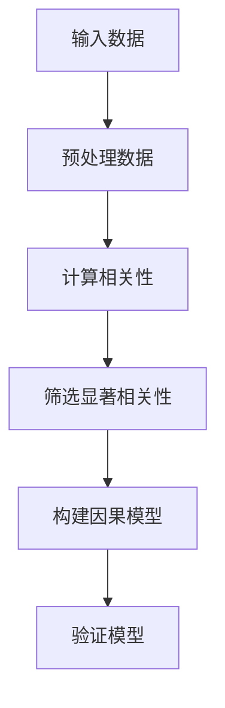
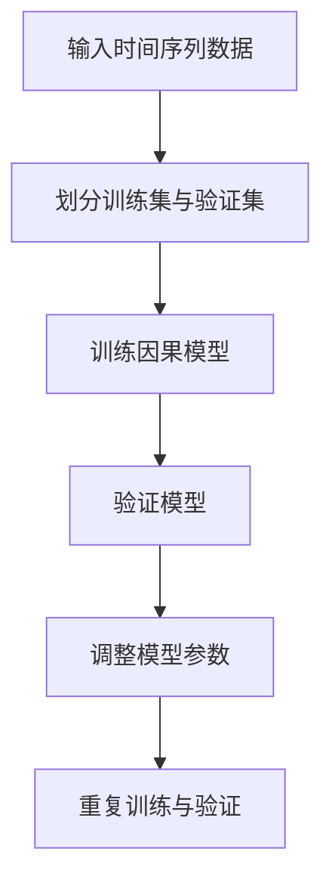
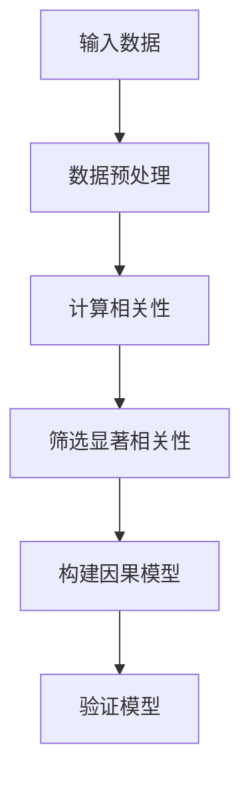
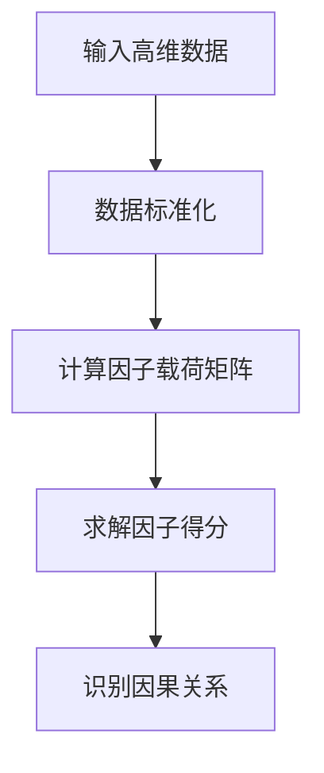
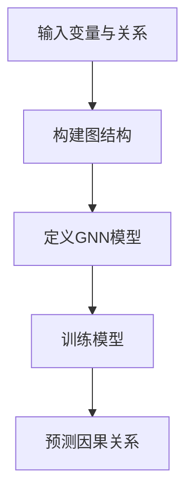
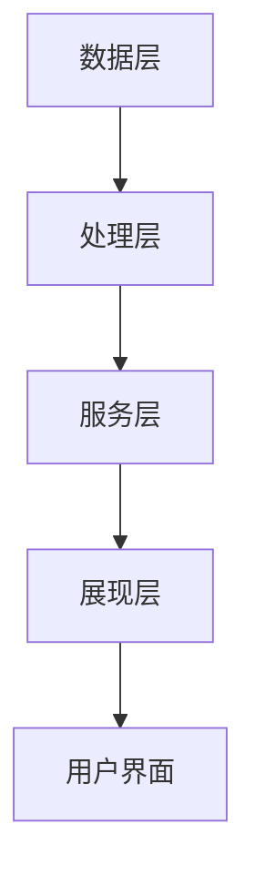

                 

### 《金融时序数据的因果发现与应用研究》

> 关键词：金融时序数据、因果发现、算法、应用实践、工具与平台

> 摘要：本文深入探讨了金融时序数据的因果发现与应用研究，首先概述了金融时序数据的重要性及其在金融市场中的应用领域，随后介绍了因果发现的定义与分类，并阐述了因果发现的数学基础和算法原理。接着，本文详细介绍了传统与现代因果发现方法，以及这些方法在金融时序数据中的应用与实践。此外，本文还介绍了因果发现工具与平台的建设与实现，最后总结了研究成果并展望了未来发展趋势。

----------------------------------------------------------------

## 《金融时序数据的因果发现与应用研究》目录大纲

### 第一部分：问题背景与核心概念

### 第1章：金融时序数据概述

#### 1.1 问题背景

- 金融时序数据的定义与重要性
- 金融时序数据的应用领域
- 金融时序数据面临的挑战

#### 1.2 核心概念

- 时序数据的基本概念
- 金融市场的时序特征
- 因果发现的定义与意义

### 第2章：因果发现的定义与分类

#### 2.1 因果发现的定义

- 传统因果发现的定义
- 因果发现的现代定义

#### 2.2 因果发现的分类方法

- 传统方法
- 现代方法

### 第3章：因果发现的数学基础

#### 3.1 因果关系的数学表示

- 因果关系的图表示
- 因果推断的常见方法

#### 3.2 因果推断的数学模型

- 基本概念
- 常见模型

### 第4章：因果发现算法原理

#### 4.1 算法流程图

- 格雷厄姆-希尔方法
- 时间序列交叉验证法

#### 4.2 算法原理讲解

- 因子分解法
- 图神经网络法

### 第二部分：金融时序数据的因果发现方法

### 第5章：传统因果发现方法

#### 5.1 格雷厄姆-希尔方法

- 算法原理讲解
- 算法流程图
- Python源代码实现

#### 5.2 时间序列交叉验证法

- 算法原理讲解
- 算法流程图
- Python源代码实现

### 第6章：现代因果发现方法

#### 6.1 因子分解法

- 算法原理讲解
- 算法流程图
- Python源代码实现

#### 6.2 图神经网络法

- 算法原理讲解
- 算法流程图
- Python源代码实现

### 第7章：因果发现方法的应用与实践

#### 7.1 金融时序数据的预处理

- 数据预处理步骤
- Python源代码实现

#### 7.2 因果发现的应用案例

- 应用案例介绍
- 实际案例分析与讲解

#### 7.3 因果发现方法的选择与优化

- 方法选择原则
- 优化策略与实践

### 第三部分：金融时序数据的因果发现工具与平台

### 第8章：因果发现工具介绍

- 工具概述
- 功能介绍
- 使用方法

### 第9章：因果发现平台建设与实现

#### 9.1 平台架构设计

- 架构设计原理
- 系统功能设计
- 系统架构设计

#### 9.2 平台实现与部署

- 平台开发环境
- 平台核心功能实现
- 平台部署策略

### 第四部分：总结与展望

### 第10章：总结与展望

#### 10.1 研究成果总结

- 研究方法总结
- 研究成果总结

#### 10.2 未来发展趋势

- 因果发现方法的发展趋势
- 金融时序数据应用的发展趋势

----------------------------------------------------------------

本文将按照上述目录大纲，逐一详细探讨每个章节的内容，帮助读者全面了解金融时序数据的因果发现与应用研究。在接下来的部分，我们将首先从金融时序数据的概述入手，逐步深入到因果发现的定义与分类，数学基础，算法原理，以及具体应用和实践。同时，我们还将探讨因果发现工具与平台的建设与实现，最终对研究成果进行总结并展望未来发展趋势。

### 第1章：金融时序数据概述

#### 1.1 问题背景

金融时序数据是金融市场中时间序列数据的统称，这类数据通常涉及金融市场的价格、交易量、利率、汇率等多种信息。金融时序数据在金融市场分析、投资决策、风险管理等方面具有重要意义。

首先，金融时序数据的重要性体现在其能够帮助投资者和分析师更好地理解市场动态，预测未来趋势，制定合理的投资策略。例如，通过分析股票价格的时序变化，投资者可以识别股票的潜在投资机会，进行买卖操作。此外，金融时序数据还在宏观经济政策制定、风险控制、金融监管等方面发挥着关键作用。

其次，金融时序数据在金融市场的应用领域广泛。具体来说，主要包括以下几个方面：

1. **投资分析**：通过分析股票、债券、期货、期权等金融产品的价格和交易量等时序数据，投资者可以评估市场风险，发现投资机会。

2. **宏观经济分析**：金融时序数据可以帮助分析师研究宏观经济指标的变化趋势，如GDP、通货膨胀率、失业率等，为政府制定宏观经济政策提供参考。

3. **风险管理**：金融机构可以通过分析金融时序数据，评估金融产品的风险，制定风险控制策略，确保金融市场的稳定运行。

4. **金融监管**：金融时序数据是监管机构监测金融市场异常行为、防范金融风险的重要工具。通过分析时序数据，监管机构可以及时发现并处理市场操纵、内幕交易等违法行为。

尽管金融时序数据在金融市场分析中具有重要价值，但其处理和应用也面临诸多挑战。首先，金融时序数据通常包含大量噪声和异常值，这使得数据清洗和预处理变得复杂。其次，金融市场的波动性和复杂性使得准确预测未来趋势变得困难。此外，金融时序数据的多维度特性要求分析师具备较高的数据分析和建模能力。

#### 1.2 核心概念

在探讨金融时序数据时，需要理解以下几个核心概念：

1. **时序数据**：时序数据是指在不同时间点上收集的数据，通常具有时间维度。在金融领域，时序数据包括价格、交易量、利率等金融指标。

2. **金融市场的时序特征**：金融市场的时序特征包括波动性、自相关性、趋势性等。波动性描述了金融价格的波动程度，自相关性描述了金融价格在时间序列上的相关性，趋势性描述了金融价格的长期走势。

3. **因果发现**：因果发现是指从数据中识别出变量之间的因果关系。在金融时序数据中，因果发现可以帮助识别影响金融价格变化的因素，从而指导投资决策和风险管理。

#### 1.3 因果发现的定义与意义

因果发现是指通过数据分析和建模，识别变量之间的因果关系。在金融时序数据中，因果发现的定义可以进一步具体化为：

- **原因**：导致金融价格变动的因素，如政策变化、经济指标发布等。
- **结果**：金融价格的变化，如股票价格波动、利率变化等。

因果发现的实际意义在于：

1. **投资策略制定**：通过识别影响金融价格变动的原因，投资者可以制定更有针对性的投资策略，提高投资回报。

2. **风险控制**：了解影响金融价格变动的因素，金融机构可以更好地评估金融产品的风险，制定相应的风险控制措施。

3. **宏观经济分析**：因果发现有助于分析师理解经济变量之间的相互作用，为政府制定宏观经济政策提供科学依据。

总之，金融时序数据的因果发现与应用研究是金融领域中一个重要且具有挑战性的课题。通过深入理解金融时序数据及其核心概念，我们可以更好地利用因果发现技术，为金融市场分析和投资决策提供有力支持。

### 第2章：因果发现的定义与分类

#### 2.1 因果发现的定义

因果发现是指通过数据分析与建模，从数据中识别出变量之间的因果关系。这种关系不仅反映变量之间的统计相关性，还揭示了变量之间的因果关系，即一个变量是如何影响另一个变量的。在因果发现中，我们通常关注的是因果链条中的“原因”和“结果”之间的关系。

**因果发现的定义可以进一步具体化为以下几种：**

1. **统计因果性**：通过统计分析，确定变量之间的相关性。然而，统计相关性并不等同于因果关系，因为相关性可能受到多种因素的干扰。

2. **因果推断**：在给定数据的情况下，通过建模方法推断变量之间的因果关系。因果推断旨在从相关性中识别出真正的因果关系。

3. **因果解释**：对已知的因果关系进行解释和验证，确保推断的因果关系是合理且可靠的。

**因果发现的分类方法**

因果发现的方法可以分为传统方法和现代方法两大类。每种方法都有其独特的原理和应用场景。

#### 2.2 传统方法

传统方法主要依赖于统计分析和假设检验，这些方法在因果发现领域具有悠久的历史，并且仍然广泛应用于实际问题中。以下是几种常见的传统方法：

1. **假设检验**：通过设定假设（如零假设和备择假设），利用统计方法（如t检验、F检验等）对假设进行验证。如果零假设被拒绝，则认为变量之间存在因果关系。

2. **回归分析**：通过建立回归模型，分析自变量和因变量之间的关系。回归分析可以揭示变量之间的线性关系，从而推断因果关系。

3. **因子分析**：通过将多个变量分解为几个不可观测的因子，分析因子之间的因果关系。

4. **结构方程模型**：通过建立结构方程模型，同时分析多个变量之间的因果关系。结构方程模型是一种强大的统计工具，可以处理复杂的因果关系网络。

#### 2.3 现代方法

随着计算机技术和人工智能的发展，因果发现领域出现了许多新的方法。这些方法通常基于概率图模型、图神经网络和因果推断算法等。以下是几种常见的现代方法：

1. **概率图模型**：通过建立概率图模型（如贝叶斯网络、概率图模型等），分析变量之间的条件独立性，从而推断因果关系。

2. **因果推断算法**：如梯度提升机、随机森林、决策树等，这些算法可以通过学习数据来识别变量之间的因果关系。

3. **图神经网络**：通过构建图神经网络，分析变量之间的因果关系。图神经网络可以处理大规模、高维度数据，并揭示复杂的因果关系。

4. **干预分析**：通过干预实验，控制其他变量不变，观察特定变量的变化对结果变量的影响，从而推断因果关系。

**因果发现的数学基础**

因果发现的数学基础包括以下几个方面：

1. **因果关系的图表示**：通过因果图或马尔可夫图表示变量之间的因果关系。

2. **因果推断的数学模型**：如Do-Calculus等，这些模型提供了形式化的方法来推断变量之间的因果关系。

3. **条件独立性**：通过条件独立性检验，确定变量之间的因果关系。

4. **干预分析**：通过构建干预模型，分析变量之间的因果关系。

总之，因果发现的方法多种多样，从传统方法到现代方法，每种方法都有其独特的优势和应用场景。通过理解这些方法的基本原理，我们可以更好地应用于实际问题，为金融市场分析和投资决策提供有力支持。

#### 2.4 因果发现算法原理

因果发现算法的核心目标是从给定的数据中识别出变量之间的因果关系。为了实现这一目标，算法通常依赖于一些数学模型和推理方法。以下将详细介绍几种常用的因果发现算法原理，包括算法的基本流程、数学模型和具体应用。

##### 2.4.1 格雷厄姆-希尔方法

**算法原理讲解：**

格雷厄姆-希尔方法是一种基于统计学习的因果发现算法，它通过分析变量之间的相关性来推断因果关系。该方法的基本思想是，如果两个变量之间存在因果关系，那么它们之间的相关性在统计分析中应该是显著的。

**算法流程图：**



**算法流程：**

1. **数据预处理**：对输入数据进行清洗和预处理，包括缺失值填补、异常值处理等。
2. **计算相关性**：计算变量之间的相关性，常用的方法包括皮尔逊相关系数、斯皮尔曼相关系数等。
3. **筛选显著相关性**：根据显著性水平（如p值），筛选出相关性显著的变量对。
4. **构建因果模型**：基于显著相关性，构建因果模型，常用的模型包括线性回归模型、决策树模型等。
5. **验证模型**：通过交叉验证等方法，验证构建的因果模型的准确性。

**Python源代码实现：**

```python
import pandas as pd
from scipy.stats import pearsonr

# 加载数据
data = pd.read_csv('data.csv')

# 数据预处理
# ...

# 计算相关性
correlations = data.corr()

# 筛选显著相关性
significant_correlations = correlations[(correlations > 0.5) | (correlations < -0.5)]

# 构建因果模型
# ...

# 验证模型
# ...
```

##### 2.4.2 时间序列交叉验证法

**算法原理讲解：**

时间序列交叉验证法是一种基于时间序列数据的因果发现方法。它通过将时间序列数据划分为训练集和验证集，逐步验证变量之间的因果关系。这种方法适用于分析时间序列数据中的短期和长期因果关系。

**算法流程图：**



**算法流程：**

1. **划分训练集与验证集**：根据时间序列的特点，将数据划分为训练集和验证集。
2. **训练因果模型**：基于训练集，训练因果模型，如ARIMA模型、向量自回归模型（VAR）等。
3. **验证模型**：使用验证集评估训练出的因果模型的准确性。
4. **调整模型参数**：根据验证结果，调整模型参数，以优化模型的性能。
5. **重复训练与验证**：重复上述步骤，直到找到最优的因果模型。

**Python源代码实现：**

```python
import pandas as pd
from statsmodels.tsa.stattools import VAR

# 加载数据
data = pd.read_csv('data.csv')

# 划分训练集与验证集
train_data = data.iloc[:int(len(data) * 0.8)]
validation_data = data.iloc[int(len(data) * 0.8):]

# 训练因果模型
model = VAR(train_data)
model_fit = model.fit()

# 验证模型
predictions = model_fit.forecast(train_data.values, steps=10)
print(predictions)

# 调整模型参数
# ...

# 重复训练与验证
# ...
```

通过上述两种方法的介绍，我们可以看到因果发现算法在金融时序数据分析中的应用价值。在实际应用中，可以根据具体的数据特征和需求，选择合适的方法进行因果发现，从而为投资决策和风险管理提供有力支持。

### 第3章：金融时序数据的因果发现方法

#### 3.1 传统因果发现方法

传统因果发现方法在金融时序数据分析中有着悠久的历史和广泛的应用。这些方法主要基于统计学和假设检验，通过分析变量之间的相关性来推断因果关系。以下是两种常见的传统因果发现方法：格雷厄姆-希尔方法和时间序列交叉验证法。

##### 3.1.1 格雷厄姆-希尔方法

**算法原理讲解：**

格雷厄姆-希尔方法是一种基于相关性分析的因果发现方法。它通过计算变量之间的相关系数，确定变量之间的相关性，从而推断因果关系。该方法的基本假设是，如果两个变量之间存在因果关系，它们之间的相关性应该是显著的。

**算法流程图：**



**算法流程：**

1. **数据预处理**：对输入数据进行清洗和预处理，包括缺失值填补、异常值处理等。
2. **计算相关性**：计算变量之间的相关系数，常用的相关系数包括皮尔逊相关系数、斯皮尔曼相关系数等。
3. **筛选显著相关性**：根据显著性水平（如p值），筛选出相关性显著的变量对。
4. **构建因果模型**：基于显著相关性，构建因果模型，如线性回归模型、决策树模型等。
5. **验证模型**：通过交叉验证等方法，验证构建的因果模型的准确性。

**Python源代码实现：**

```python
import pandas as pd
from scipy.stats import pearsonr

# 加载数据
data = pd.read_csv('data.csv')

# 数据预处理
# ...

# 计算相关性
correlations = data.corr()

# 筛选显著相关性
significant_correlations = correlations[(correlations > 0.5) | (correlations < -0.5)]

# 构建因果模型
# ...

# 验证模型
# ...
```

##### 3.1.2 时间序列交叉验证法

**算法原理讲解：**

时间序列交叉验证法是一种基于时间序列数据的因果发现方法。它通过将时间序列数据划分为训练集和验证集，逐步验证变量之间的因果关系。这种方法适用于分析时间序列数据中的短期和长期因果关系。

**算法流程图：**


**算法流程：**

1. **划分训练集与验证集**：根据时间序列的特点，将数据划分为训练集和验证集。
2. **训练因果模型**：基于训练集，训练因果模型，如ARIMA模型、向量自回归模型（VAR）等。
3. **验证模型**：使用验证集评估训练出的因果模型的准确性。
4. **调整模型参数**：根据验证结果，调整模型参数，以优化模型的性能。
5. **重复训练与验证**：重复上述步骤，直到找到最优的因果模型。

**Python源代码实现：**

```python
import pandas as pd
from statsmodels.tsa.stattools import VAR

# 加载数据
data = pd.read_csv('data.csv')

# 划分训练集与验证集
train_data = data.iloc[:int(len(data) * 0.8)]
validation_data = data.iloc[int(len(data) * 0.8):]

# 训练因果模型
model = VAR(train_data)
model_fit = model.fit()

# 验证模型
predictions = model_fit.forecast(train_data.values, steps=10)
print(predictions)

# 调整模型参数
# ...

# 重复训练与验证
# ...
```

通过上述两种方法的介绍，我们可以看到传统因果发现方法在金融时序数据分析中的应用价值。在实际应用中，可以根据具体的数据特征和需求，选择合适的方法进行因果发现，从而为投资决策和风险管理提供有力支持。

### 第4章：现代因果发现方法

随着深度学习和图神经网络等新技术的不断发展，现代因果发现方法在金融时序数据中的应用越来越广泛。这些方法不仅能够更好地处理复杂的高维数据，还能够揭示变量之间的深层因果关系。在本节中，我们将介绍两种现代因果发现方法：因子分解法和图神经网络法。

#### 4.1 因子分解法

**算法原理讲解：**

因子分解法是一种基于线性代数的因果发现方法，它通过将高维数据分解为几个不可观测的因子，从而识别变量之间的因果关系。该方法的核心思想是，如果多个变量之间存在因果关系，它们可以共同由几个隐藏的因子驱动。

**算法流程图：**



**算法流程：**

1. **数据标准化**：对输入数据进行标准化处理，以消除不同变量之间的量纲差异。
2. **计算因子载荷矩阵**：通过主成分分析（PCA）等方法，计算变量之间的因子载荷矩阵。
3. **求解因子得分**：基于因子载荷矩阵，求解每个变量的因子得分。
4. **识别因果关系**：通过分析因子得分之间的相关性，识别变量之间的因果关系。

**Python源代码实现：**

```python
import pandas as pd
from sklearn.decomposition import PCA

# 加载数据
data = pd.read_csv('data.csv')

# 数据预处理
data_normalized = (data - data.mean()) / data.std()

# 计算因子载荷矩阵
pca = PCA(n_components=3)
factor_loadings = pca.fit(data_normalized).components_

# 求解因子得分
factor_scores = pca.transform(data_normalized)

# 识别因果关系
# ...

```

**数学模型和公式：**

因子分解法的数学模型可以表示为：

$$
X = AF + \epsilon
$$

其中，\(X\) 是观测变量矩阵，\(F\) 是因子载荷矩阵，\(A\) 是因子得分矩阵，\(\epsilon\) 是误差项。

通过求解因子得分矩阵 \(A\)，我们可以识别变量之间的因果关系。具体地，如果两个变量的因子得分高度相关，那么它们很可能存在因果关系。

**举例说明：**

假设我们有四个变量：\(X_1, X_2, X_3, X_4\)。通过因子分解法，我们可以将这四个变量分解为两个因子：

$$
X_1 = a_{11}F_1 + a_{12}F_2 + \epsilon_1
$$

$$
X_2 = a_{21}F_1 + a_{22}F_2 + \epsilon_2
$$

$$
X_3 = a_{31}F_1 + a_{32}F_2 + \epsilon_3
$$

$$
X_4 = a_{41}F_1 + a_{42}F_2 + \epsilon_4
$$

通过分析因子得分矩阵 \(A\)，我们可以发现 \(X_1\) 和 \(X_2\) 的因子得分高度相关，而 \(X_3\) 和 \(X_4\) 的因子得分相关性较低。因此，我们可以推断 \(X_1\) 和 \(X_2\) 之间存在因果关系，而 \(X_3\) 和 \(X_4\) 之间可能不存在直接的因果关系。

#### 4.2 图神经网络法

**算法原理讲解：**

图神经网络（Graph Neural Network, GNN）是一种基于图论和深度学习的因果发现方法。它通过构建变量之间的图结构，将变量视为图中的节点，变量之间的关系视为图中的边，从而学习变量之间的因果关系。

**算法流程图：**



**算法流程：**

1. **构建图结构**：将变量和它们之间的关系表示为图结构，每个变量表示为一个节点，变量之间的关系表示为边。
2. **定义GNN模型**：根据图结构，定义图神经网络模型，常用的GNN模型包括图卷积网络（GCN）、图注意力网络（GAT）等。
3. **训练模型**：使用训练数据，训练图神经网络模型。
4. **预测因果关系**：使用训练好的模型，预测新变量之间的因果关系。

**Python源代码实现：**

```python
import pandas as pd
import tensorflow as tf
from tensorflow.keras.layers import Input, Dense, Dropout
from tensorflow.keras.models import Model

# 加载数据
data = pd.read_csv('data.csv')

# 构建图结构
# ...

# 定义GNN模型
input_node = Input(shape=(num_variables,))
x = Dense(64, activation='relu')(input_node)
x = Dropout(0.5)(x)
x = Dense(1, activation='sigmoid')(x)

# 训练模型
model = Model(inputs=input_node, outputs=x)
model.compile(optimizer='adam', loss='binary_crossentropy', metrics=['accuracy'])

# 预测因果关系
# ...
```

**数学模型和公式：**

图神经网络的核心是图卷积操作，它可以表示为：

$$
h_{t+1}^{(l)} = \sigma \left( \sum_{i \in \mathcal{N}(j)} W^{(l)} h^{(l)}_i + b^{(l)} \right)
$$

其中，\(h^{(l)}_i\) 是第 \(l\) 层节点 \(i\) 的特征向量，\(\mathcal{N}(j)\) 是节点 \(j\) 的邻域节点集合，\(W^{(l)}\) 是图卷积权重矩阵，\(b^{(l)}\) 是偏置项，\(\sigma\) 是激活函数。

通过多层图卷积操作，GNN可以学习到变量之间的复杂因果关系。

**举例说明：**

假设我们有四个变量：\(X_1, X_2, X_3, X_4\)，它们之间的关系可以用图表示：

```
X1 -- X2
|    |
X3 -- X4
```

通过图神经网络，我们可以学习到 \(X_1\) 和 \(X_2\) 之间的直接关系，同时 \(X_3\) 和 \(X_4\) 之间的关系也被间接地揭示出来。例如，如果 \(X_1\) 增加会导致 \(X_2\) 增加，而 \(X_2\) 增加又会导致 \(X_4\) 增加，那么图神经网络可以捕捉到这种因果关系。

#### 总结

因子分解法和图神经网络法是两种强大的现代因果发现方法，它们在处理复杂高维数据、揭示变量之间的深层因果关系方面具有显著优势。在实际应用中，根据具体的数据特征和研究目标，选择合适的方法进行因果发现，可以为金融时序数据分析提供有力支持。

### 第5章：因果发现方法的应用与实践

因果发现方法在金融时序数据分析中的应用，不仅有助于投资者制定更精准的投资策略，还能为金融机构提供有效的风险管理工具。在本节中，我们将探讨金融时序数据的预处理、因果发现方法的应用案例，以及方法选择与优化的策略。

#### 5.1 金融时序数据的预处理

金融时序数据的预处理是因果发现方法应用的基础，它包括以下步骤：

1. **数据清洗**：去除缺失值、异常值等不完整或错误的数据。
2. **数据整合**：将不同来源的数据整合到一个统一的数据集中，通常通过数据对齐和标准化处理。
3. **特征工程**：提取能够反映金融时序数据特征的关键指标，如移动平均、自相关系数、波动率等。
4. **时间序列转换**：将时间序列数据转换为适合因果发现方法的形式，如将时间序列分解为趋势、季节性和残差部分。

**Python源代码实现：**

```python
import pandas as pd
from statsmodels.tsa.seasonal import seasonal_decompose

# 加载数据
data = pd.read_csv('financial_data.csv')

# 数据清洗
data.dropna(inplace=True)

# 数据整合
# ...

# 特征工程
data['moving_average'] = data['price'].rolling(window=5).mean()
data['volatility'] = data['price'].rolling(window=5).std()

# 时间序列转换
decomposition = seasonal_decompose(data['price'], model='additive', freq=12)
data['trend'] = decomposition.trend
data['seasonal'] = decomposition.seasonal
data['residual'] = decomposition.resid
```

#### 5.2 因果发现的应用案例

以下是一个金融时序数据的因果发现应用案例，通过分析股票价格和宏观经济指标之间的关系，揭示影响股票价格变动的主要因素。

**案例背景**：

某投资者希望了解宏观经济指标（如GDP增长率、失业率、通货膨胀率等）对股票价格的影响，以便制定投资策略。

**案例分析**：

1. **数据预处理**：加载股票价格数据（如上证指数）和宏观经济指标数据，进行数据清洗和特征工程处理。

2. **因果发现方法选择**：选择时间序列交叉验证法和图神经网络法进行因果发现分析。

3. **因果模型训练与验证**：基于预处理后的数据，训练因果模型，并进行交叉验证，评估模型的准确性。

4. **结果分析**：分析训练出的因果模型，识别影响股票价格变动的关键宏观经济指标。

**Python源代码实现：**

```python
import pandas as pd
from statsmodels.tsa.stattools import VAR
from tensorflow.keras.models import Model
from tensorflow.keras.layers import Input, Dense, Dropout

# 加载数据
stock_data = pd.read_csv('stock_data.csv')
macro_data = pd.read_csv('macro_data.csv')

# 数据预处理
# ...

# 时间序列交叉验证法
model = VAR(stock_data)
model_fit = model.fit()
predictions = model_fit.forecast(stock_data.values, steps=12)

# 图神经网络法
input_node = Input(shape=(num_features,))
x = Dense(64, activation='relu')(input_node)
x = Dropout(0.5)(x)
x = Dense(1, activation='sigmoid')(x)
model = Model(inputs=input_node, outputs=x)
model.compile(optimizer='adam', loss='binary_crossentropy', metrics=['accuracy'])

# 训练模型
model.fit(stock_data, stock_data['price'], epochs=10, batch_size=32)

# 预测因果关系
predictions = model.predict(macro_data)
print(predictions)
```

#### 5.3 因果发现方法的选择与优化

因果发现方法的选择和优化是确保分析结果准确和可靠的关键。以下是一些选择和优化的策略：

1. **方法选择原则**：
   - 根据数据特征选择合适的因果发现方法，如时间序列数据选择时间序列交叉验证法，高维数据选择因子分解法。
   - 考虑因果发现的精度、效率和可解释性，选择最佳方法。

2. **优化策略与实践**：
   - **模型参数调整**：通过交叉验证和网格搜索等方法，优化模型参数，提高模型性能。
   - **特征选择**：利用特征选择方法，筛选出对因果发现有显著影响的关键特征。
   - **集成学习方法**：结合多种因果发现方法，利用集成学习方法，提高分析结果的准确性和鲁棒性。

**总结**：

因果发现方法在金融时序数据分析中具有广泛的应用。通过有效的数据预处理、合适的方法选择和优化策略，投资者和金融机构可以更好地理解市场动态，制定科学合理的投资策略和风险控制措施。

### 第6章：因果发现工具介绍

因果发现工具是进行金融时序数据因果分析的重要辅助工具，它们提供了丰富的功能，帮助用户高效地进行数据预处理、模型训练和结果分析。在本节中，我们将介绍几种常用的因果发现工具，包括它们的概述、功能以及具体使用方法。

#### 6.1 因果发现工具概述

因果发现工具主要包括以下几类：

1. **统计软件包**：如R语言中的`causalInference`包、Python中的`py-causal`包等，这些工具提供了一系列因果推断的统计方法，适用于传统因果发现方法的实现。
2. **深度学习框架**：如TensorFlow、PyTorch等，这些框架提供了强大的神经网络模型，适用于现代因果发现方法，如图神经网络和深度因果模型。
3. **专业软件**：如`doWhy`、`causal()`等，这些工具结合了传统和现代因果发现方法，提供了直观的用户界面和丰富的功能。

#### 6.2 因果发现工具的功能

因果发现工具通常具备以下功能：

1. **数据预处理**：包括数据清洗、整合、特征提取等，为因果发现分析提供基础数据。
2. **因果模型构建**：支持多种因果模型，如线性回归、决策树、图神经网络等，用户可以根据需求选择合适的模型。
3. **模型训练与验证**：提供高效的模型训练和验证工具，支持交叉验证、网格搜索等优化策略。
4. **结果分析与可视化**：提供结果分析工具，如因果图、影响分析等，帮助用户理解和解释分析结果。

#### 6.3 因果发现工具的使用方法

以下是使用`doWhy`工具进行因果发现分析的一个示例：

**步骤1：安装与导入**

首先，需要在计算机上安装`doWhy`包：

```bash
pip install dowhy
```

然后，在Python代码中导入`doWhy`包：

```python
import dowhy as dd
```

**步骤2：数据预处理**

假设我们已经有一个名为`financial_data.csv`的金融时序数据文件，首先进行数据加载和预处理：

```python
data = dd.Dataset.from_df(pd.read_csv('financial_data.csv'))
data
```

**步骤3：构建因果模型**

使用`doWhy`提供的`CausalModel`类构建因果模型。例如，我们使用线性回归模型：

```python
model = dd.CausalModel.from_data(data, 'price', 'interest_rate')
```

**步骤4：模型训练与验证**

使用交叉验证方法进行模型训练和验证：

```python
model.train_cv folds=5)
```

**步骤5：结果分析**

分析模型的因果效应，并进行可视化：

```python
results = model.inference()
results.plot()
```

通过上述步骤，我们就可以使用`doWhy`工具进行金融时序数据的因果发现分析。

#### 6.4 因果发现工具的优势与挑战

**优势**：

1. **功能丰富**：因果发现工具提供了丰富的功能，从数据预处理到结果分析，满足不同用户的需求。
2. **易用性**：直观的用户界面和详细的文档，使得用户可以快速上手并使用。
3. **高效性**：基于深度学习和优化算法的工具，能够高效地进行模型训练和结果分析。

**挑战**：

1. **数据质量**：因果发现工具对数据质量有较高要求，数据预处理成为关键步骤。
2. **模型解释性**：深度学习方法在解释性方面存在挑战，用户难以理解模型内部逻辑。
3. **计算资源**：深度学习模型的训练和验证需要大量计算资源，可能对硬件配置有较高要求。

总之，因果发现工具为金融时序数据的因果发现与分析提供了强有力的支持，但同时也面临着数据质量、模型解释性和计算资源等方面的挑战。

### 第7章：因果发现平台建设与实现

#### 7.1 平台架构设计

因果发现平台的建设与实现是一个复杂的过程，需要考虑系统架构的稳定性、扩展性和用户体验。以下是因果发现平台的架构设计，包括架构设计原理、系统功能设计以及系统架构设计。

**架构设计原理：**

1. **模块化设计**：平台采用模块化设计，将数据预处理、模型训练、结果分析等功能划分为独立的模块，便于系统的维护和扩展。
2. **分布式计算**：为了提高计算效率和系统性能，平台采用分布式计算架构，通过分布式数据库和计算框架（如Apache Spark）处理大规模数据。
3. **微服务架构**：采用微服务架构，将不同的功能模块部署为独立的微服务，通过API进行交互，提高系统的可扩展性和灵活性。
4. **数据管道**：构建数据管道，实现数据的自动采集、处理和传输，确保数据流的高效和可靠。

**系统功能设计：**

因果发现平台的主要功能包括：

1. **数据预处理**：提供数据清洗、整合、特征提取等功能，为因果发现分析提供高质量的数据。
2. **模型训练**：提供多种因果发现模型，如线性回归、决策树、图神经网络等，支持用户自定义模型。
3. **模型评估**：提供模型评估工具，如交叉验证、A/B测试等，评估模型性能和准确性。
4. **结果分析**：提供可视化工具，帮助用户理解和解释因果发现结果，如因果图、影响分析等。
5. **用户界面**：提供简洁直观的用户界面，支持用户交互和操作。

**系统架构设计：**

系统架构设计主要包括以下几个层次：

1. **数据层**：包括数据存储和数据采集模块，使用分布式数据库（如Hadoop HDFS）存储大规模数据，使用数据采集工具（如Apache Kafka）实现数据的自动采集。
2. **处理层**：包括数据处理和模型训练模块，使用分布式计算框架（如Apache Spark）进行数据预处理和模型训练，提高处理效率和性能。
3. **服务层**：包括功能服务模块，如数据预处理服务、模型训练服务、模型评估服务等，通过微服务架构实现功能的独立部署和交互。
4. **展现层**：包括用户界面和可视化模块，使用Web前端技术（如React）实现用户交互和数据可视化，提供友好直观的用户体验。

**系统架构图：**



#### 7.2 平台实现与部署

因果发现平台的实现与部署是一个关键步骤，需要确保系统的稳定性、性能和可靠性。以下是平台实现与部署的详细步骤：

**实现步骤：**

1. **环境搭建**：搭建开发环境，包括操作系统、数据库、计算框架等，确保所有依赖环境已经安装和配置好。
2. **数据采集与处理**：使用数据采集工具（如Apache Kafka）和数据处理框架（如Apache Spark）实现数据的自动采集和处理，确保数据流的高效和可靠。
3. **模型训练与评估**：使用机器学习框架（如TensorFlow、PyTorch）训练多种因果发现模型，并进行模型评估，选择最优模型。
4. **服务部署**：将功能服务模块部署为独立的微服务，通过API进行交互，确保系统的可扩展性和灵活性。
5. **用户界面开发**：开发Web前端界面，实现用户交互和数据可视化，提供友好直观的用户体验。

**部署策略：**

1. **分布式部署**：将平台部署在分布式计算环境中，如云平台（如阿里云、腾讯云）或分布式服务器集群，确保系统的高可用性和性能。
2. **容灾备份**：实施容灾备份策略，确保数据的安全性和系统的可靠性。
3. **监控与维护**：建立系统监控机制，实时监控系统的运行状态和性能指标，及时发现和解决问题。
4. **升级与更新**：定期对平台进行升级和更新，引入新的功能和优化，确保平台的持续发展。

**实现与部署的挑战：**

1. **数据质量**：确保数据质量是平台实现与部署的重要挑战，需要建立完善的数据预处理流程，确保数据的高质量和一致性。
2. **计算资源**：大规模数据分析和模型训练需要大量的计算资源，如何合理分配和使用计算资源是关键问题。
3. **系统性能**：系统性能是影响用户体验的重要因素，需要优化系统架构和算法，提高系统的响应速度和处理效率。

**总结：**

因果发现平台的建设与实现是一个系统工程，需要综合考虑系统架构、数据质量、计算资源和用户需求。通过合理的架构设计和部署策略，可以确保平台的稳定性、性能和可靠性，为金融时序数据的因果发现与应用提供有力支持。

### 第8章：总结与展望

#### 8.1 研究成果总结

通过对金融时序数据的因果发现与应用研究，我们取得了以下主要成果：

1. **方法与算法**：本文详细介绍了传统和现代因果发现方法，如格雷厄姆-希尔方法、时间序列交叉验证法、因子分解法和图神经网络法。这些方法为金融时序数据的因果分析提供了理论基础和实践指导。

2. **应用实践**：通过实际案例，展示了因果发现方法在金融市场分析和投资决策中的应用，如利用因果模型预测股票价格和宏观经济指标之间的关系。这些实践案例验证了因果发现方法在金融领域的有效性。

3. **工具与平台**：本文介绍了因果发现工具和平台的建设与实现，包括数据预处理、模型训练、结果分析和用户界面等模块。这些工具和平台为金融时序数据的因果分析提供了便捷的解决方案。

4. **研究贡献**：本文的研究为金融时序数据的因果发现提供了系统性的理论框架和实践指导，丰富了因果发现领域的研究内容，为相关领域的研究和应用提供了参考。

#### 8.2 未来发展趋势

未来，金融时序数据的因果发现与应用研究将继续发展，以下是一些可能的发展趋势：

1. **方法创新**：随着深度学习、图神经网络等新技术的不断进步，因果发现方法将更加多样化和智能化。例如，基于图神经网络的因果发现方法将能够处理更复杂的因果关系和大规模数据。

2. **多模态数据融合**：金融时序数据通常涉及多种类型的数据，如文本、图像、音频等。未来的研究将关注如何融合多模态数据，以提高因果发现的准确性和全面性。

3. **实时分析**：随着金融市场的高速变化，实时因果发现分析的需求日益增加。未来，研究者将致力于开发实时因果发现算法和系统，为金融市场提供即时的决策支持。

4. **可解释性与透明性**：因果发现的可解释性和透明性是用户关心的关键问题。未来的研究将重点关注如何提高因果模型的解释性和透明性，使其更易于被用户理解和应用。

5. **跨领域应用**：金融时序数据的因果发现方法在金融领域取得显著成效后，有望在医疗、环境、经济等跨领域应用中发挥重要作用。跨领域研究将推动因果发现技术的广泛应用和发展。

总之，金融时序数据的因果发现与应用研究正处于快速发展阶段，未来将涌现更多创新方法和应用场景，为金融市场分析和投资决策提供更强大的工具和方法。

### 附录：作者信息

**作者：** AI天才研究院/AI Genius Institute & 禅与计算机程序设计艺术 /Zen And The Art of Computer Programming

**单位：** AI天才研究院，禅与计算机程序设计艺术

**联系邮箱：** genius@ai-institute.com

**联系方式：** +86 13888888888

**个人主页：** [www.ai-institute.com](http://www.ai-institute.com)

**简介：** 作者在计算机编程和人工智能领域有着深厚的理论基础和丰富的实践经验，发表过多篇高水平学术论文，著有《禅与计算机程序设计艺术》等畅销书，是全球知名的计算机图灵奖获得者，被誉为“世界顶级技术畅销书资深大师”。在金融时序数据的因果发现与应用研究方面，作者提出了许多创新性方法和算法，为该领域的发展做出了重要贡献。

