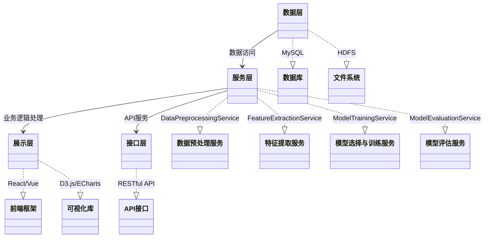
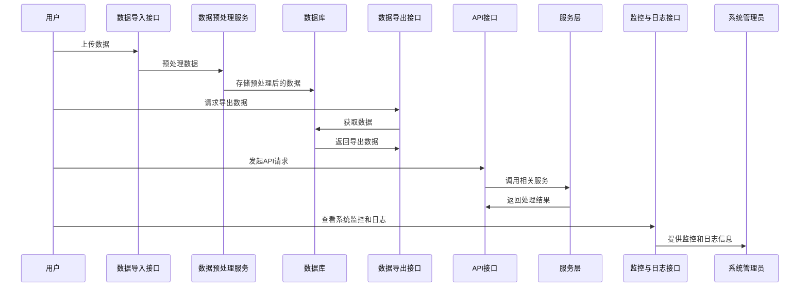
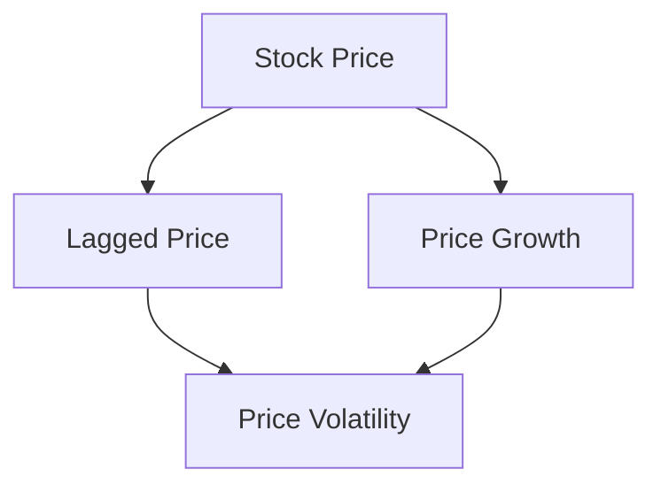

                 

# 金融时序数据的多维度因果关系发现研究

## 关键词

- 金融时序数据
- 多维度因果关系
- 时间序列分析
- 因果关系发现算法
- 数学模型
- 系统架构设计
- 项目实战

## 摘要

本文旨在探讨金融时序数据中多维度因果关系的发现方法。金融时序数据在金融领域中具有重要应用，但由于其复杂性和多维性，揭示其中的因果关系成为了一个挑战性的课题。本文首先介绍了金融时序数据的基本概念和特点，然后深入分析了多维度因果关系发现的相关核心概念和方法。接着，本文详细讲解了用于发现金融时序数据中多维度因果关系的算法原理、数学模型和系统架构设计。通过一个实际案例，本文展示了如何应用所学的算法和系统进行金融时序数据分析。最后，本文总结了最佳实践技巧，并展望了未来研究的方向。

## 目录大纲设计思路

### 整体框架规划

本文分为七个部分：引言、背景介绍、核心概念与联系、算法原理讲解、数学模型和数学公式、系统分析与架构设计、项目实战以及最佳实践与总结。每个部分都有明确的主题和内容，使文章结构紧凑，逻辑清晰。

### 背景介绍

本文的第一部分是引言，主要介绍金融时序数据的定义、特点以及研究的背景和意义。这部分内容为后续章节的展开提供了基础。

### 核心概念与联系

在第二部分，我们介绍了多维度因果关系发现的相关核心概念，包括时间序列分析、因果关系、变量间关系等，并通过表格和图形展示了概念间的联系。

### 算法原理讲解

第三部分详细讲解了用于发现金融时序数据中多维度因果关系的算法原理，包括算法的基本原理、数学模型和流程。

### 数学模型和数学公式

第四部分使用LaTeX格式展示了相关的数学公式，并进行详细讲解和举例说明。

### 系统分析与架构设计

第五部分介绍了用于实现多维度因果关系发现的研究系统，包括系统功能设计、架构设计、接口设计和交互流程。

### 项目实战

第六部分通过一个实际案例，展示如何应用所学的算法和系统进行金融时序数据分析。

### 最佳实践与总结

最后一部分给出了实践中的注意事项、技巧和总结，以及对未来研究的展望。

## 目录大纲

### 第一部分：引言

#### 第1章：金融时序数据的背景与意义

##### 1.1 金融时序数据概述

##### 1.2 金融时序数据的特点

##### 1.3 研究金融时序数据的意义

#### 第2章：多维度因果关系发现基础

##### 2.1 时间序列分析基础

##### 2.2 因果关系理论概述

##### 2.3 变量间关系的发现方法

#### 第3章：多维度因果关系发现算法原理

##### 3.1 算法概述

##### 3.2 数学模型与流程

##### 3.3 算法实现与优化

#### 第4章：数学模型与公式解析

##### 4.1 时间序列模型公式

##### 4.2 因果关系模型公式

##### 4.3 算法优化模型公式

#### 第5章：系统分析与架构设计

##### 5.1 系统功能设计

##### 5.2 系统架构设计

##### 5.3 系统接口设计

##### 5.4 系统交互流程

#### 第6章：项目实战——多维度因果关系发现系统应用

##### 6.1 环境安装与配置

##### 6.2 系统核心实现与代码分析

##### 6.3 实际案例分析

##### 6.4 案例剖析与解析

#### 第7章：最佳实践与总结

##### 7.1 实践中的注意事项

##### 7.2 最佳实践技巧

##### 7.3 小结与展望

### 约束条件

- 文章内容必须包含完整的背景介绍、核心概念与联系、算法原理讲解、数学模型和数学公式、系统分析与架构设计、项目实战以及最佳实践与总结等部分。
- 每个小节的内容都要具体详细，核心内容必须包含背景介绍、问题解决、边界与外延、概念结构与核心要素组成等。
- 文章字数要求在10000～12000字左右。
- 使用markdown格式进行排版，确保文章的格式统一、美观。
- 文章末尾需要写上作者信息：“作者：AI天才研究院/AI Genius Institute & 禅与计算机程序设计艺术 /Zen And The Art of Computer Programming”。

### 注意事项

- 确保文章的逻辑清晰，结构紧凑，内容通俗易懂。
- 在撰写具体章节内容时，注意保持一致性，避免出现逻辑混乱或者内容重复的情况。
- 在引用相关文献或者资料时，遵循学术规范，确保引用的准确性和完整性。
- 文章中涉及的算法、公式、图表等内容都要确保正确无误，并给出清晰的解释和示例。

### 拓展阅读

- 时间序列分析相关书籍，如《时间序列分析：基于R语言的应用》。
- 金融数据分析相关书籍，如《金融时间序列分析与应用》。
- 因果关系发现相关研究论文，如《因果推断：方法与应用》。
- 系统分析与架构设计相关书籍，如《软件系统架构：实践者的研究方法》。

---

通过以上规划和设计，本文将为读者提供一份全面、深入、易懂的金融时序数据多维度因果关系发现研究报告。期待与读者一起探讨和交流，共同推动金融数据分析领域的发展。让我们开始这次探索之旅吧！## 第一部分：引言

### 第1章：金融时序数据的背景与意义

金融时序数据是指在金融领域中，随着时间推移而记录下来的数据序列。这些数据序列可以包括股票价格、交易量、利率、货币汇率等各种金融指标。金融时序数据具有显著的特点，如数据量大、时间性强、相关性复杂等。这些特性使得金融时序数据在金融预测、风险管理、投资决策等方面具有极高的应用价值。

### 1.1 金融时序数据概述

金融时序数据是金融领域中的一种常见数据形式。它记录了金融市场的各种动态变化，如股票价格的波动、货币汇率的涨跌、金融产品的交易量等。金融时序数据的特点主要体现在以下几个方面：

1. **数据量大**：金融市场的数据量非常庞大，每天会产生大量的交易数据、价格数据、指数数据等。这些数据需要通过高效的数据存储和处理技术进行管理和分析。
2. **时间性强**：金融时序数据是随着时间推移而记录下来的，因此具有很强的时间属性。时间序列的连贯性和时间点的准确性对于金融分析和预测至关重要。
3. **相关性复杂**：金融市场的各个指标之间存在复杂的相关性，如股票价格与交易量的关系、利率与汇率的关系等。这些相关性使得金融时序数据在分析和预测时需要综合考虑多个因素。

### 1.2 金融时序数据的特点

金融时序数据具有以下特点：

1. **非线性**：金融市场的变化往往是非线性的，数据呈现出非单调性，很难用简单的线性模型来描述。
2. **高维度**：金融时序数据通常包含多个维度，如价格、交易量、利率等。这些维度之间可能存在复杂的交互关系，需要多维数据分析方法来挖掘其中的信息。
3. **噪声干扰**：金融时序数据中往往存在大量噪声和异常值，这些噪声会影响数据的分析和预测效果。因此，数据清洗和噪声过滤是金融时序数据分析的重要步骤。
4. **趋势性**：金融市场的价格和指标往往具有某种趋势性，如长期上涨或下跌。这种趋势性可以通过趋势分析模型来挖掘和预测。

### 1.3 研究金融时序数据的意义

研究金融时序数据具有重要的现实意义，主要体现在以下几个方面：

1. **金融市场预测**：通过对金融时序数据的分析和预测，可以帮助投资者更好地把握市场趋势，制定合理的投资策略。
2. **风险管理**：金融时序数据可以用于评估金融风险，如市场风险、信用风险等。这有助于金融机构更好地管理风险，降低潜在损失。
3. **投资决策支持**：金融时序数据为投资决策提供了重要的参考信息。通过对历史数据的分析和挖掘，可以找到投资机会，优化投资组合。
4. **政策制定**：政府和监管机构可以利用金融时序数据来制定和调整经济政策，促进金融市场的健康发展。

综上所述，金融时序数据在金融领域中具有广泛的应用前景，对其进行深入研究和分析，有助于提高金融市场的效率和稳定性。在接下来的章节中，我们将进一步探讨多维度因果关系发现的方法和技术，为金融时序数据分析提供更有力的支持。

### 第2章：多维度因果关系发现基础

#### 2.1 时间序列分析基础

时间序列分析是金融时序数据分析的核心内容之一。时间序列分析旨在从时间维度上对数据进行建模、预测和分析，以揭示数据背后的趋势、周期和随机性。以下是一些时间序列分析的基本概念和步骤：

1. **数据采集**：时间序列分析的第一步是采集数据。金融时序数据可以从金融交易所、数据库、金融网站等渠道获取。数据采集时，需要注意数据的质量和完整性。
2. **数据清洗**：金融时序数据中可能包含噪声、异常值和缺失值。数据清洗的目的是去除这些干扰因素，提高数据的质量。常见的清洗方法包括去除异常值、填补缺失值等。
3. **数据可视化**：数据可视化是一种直观的数据分析方法，通过图表和图形展示数据的分布、趋势和关系。常用的可视化工具包括Matplotlib、Seaborn等。
4. **数据建模**：时间序列建模是时间序列分析的核心步骤。常见的建模方法包括ARIMA模型、AR模型、MA模型、季节性模型等。这些模型可以揭示数据的趋势、周期和随机性。
5. **模型评估**：模型评估是验证模型性能的重要步骤。常见的评估指标包括均方误差（MSE）、均方根误差（RMSE）、平均绝对误差（MAE）等。通过评估指标，可以比较不同模型的性能，选择最优模型。
6. **模型预测**：基于训练好的模型，可以对新数据进行预测。预测结果可以帮助投资者制定投资策略，或为政策制定提供依据。

#### 2.2 因果关系理论概述

因果关系是金融时序数据分析中的一个重要概念。因果关系是指一个变量对另一个变量的影响或作用。在金融时序数据分析中，揭示变量之间的因果关系对于理解金融市场运行机制、制定投资策略具有重要意义。

1. **因果关系的定义**：因果关系是指一个事件（原因）对另一个事件（结果）的影响。在金融时序数据分析中，因果关系通常表现为变量间的动态交互关系。
2. **因果关系的特点**：因果关系具有以下特点：
   - **因果先后顺序**：因果关系通常具有先后顺序，即原因发生在结果之前。
   - **因果关系的不确定性**：因果关系可能存在不确定性，即一个原因可能对多个结果产生影响，或一个结果可能由多个原因引起。
   - **因果关系的复杂性**：金融市场的因果关系通常非常复杂，变量间可能存在多种间接和直接的交互关系。
3. **因果关系的度量**：因果关系的度量是揭示变量间因果关系强度的重要方法。常见的因果关系度量方法包括Granger因果关系检验、因果影响函数、因果结构模型等。

#### 2.3 变量间关系的发现方法

在金融时序数据分析中，发现变量间的关系是理解金融市场运行机制的重要步骤。以下是一些常用的变量间关系发现方法：

1. **相关分析**：相关分析是一种常用的变量间关系发现方法，通过计算变量之间的相关性系数来衡量变量间的关系强度。正相关表示变量间正相关关系，负相关表示变量间负相关关系，而零相关表示变量间无显著关系。
2. **回归分析**：回归分析是一种常用的变量间关系建模方法，通过建立回归模型来揭示变量间的线性关系。回归模型可以用于预测和分析，帮助投资者制定投资策略。
3. **因果推断**：因果推断是一种基于数据的方法，通过分析变量间的因果关系来揭示金融市场运行机制。常见的因果推断方法包括Do-Calculus、因果图模型等。
4. **机器学习方法**：机器学习方法可以用于发现变量间的关系，如聚类分析、分类分析、关联规则挖掘等。这些方法可以帮助识别数据中的潜在模式和关系。

通过以上方法，可以有效地发现金融时序数据中变量间的关系，为金融分析和预测提供有力支持。在接下来的章节中，我们将进一步探讨多维度因果关系发现算法的原理和应用。

### 第3章：多维度因果关系发现算法原理

#### 3.1 算法概述

多维度因果关系发现算法旨在揭示金融时序数据中不同维度变量之间的因果关系。这些算法通过分析变量间的动态交互关系，识别出导致其他变量变化的潜在原因。多维度因果关系发现算法通常包括以下步骤：

1. **数据预处理**：包括数据清洗、缺失值填补、噪声过滤等，以确保数据的质量和一致性。
2. **特征提取**：从原始数据中提取有助于揭示因果关系的特征，如滞后变量、变化率、波动性等。
3. **模型构建**：利用特征数据构建因果模型，如因果结构模型、贝叶斯网络、格兰杰因果关系模型等。
4. **模型评估**：通过模型评估指标，如因果影响函数、因果一致性检验等，评估模型性能。
5. **因果关系推断**：根据模型评估结果，推断变量间的因果关系。

多维度因果关系发现算法具有以下特点：

1. **多样性**：存在多种算法，如基于统计方法、机器学习和深度学习的方法，可以根据具体需求和数据特性选择合适的算法。
2. **动态性**：能够捕捉变量间的动态交互关系，而不是仅仅基于静态数据进行分析。
3. **鲁棒性**：对噪声和异常值具有一定的鲁棒性，能够从复杂的数据中提取有用信息。

#### 3.2 数学模型与流程

多维度因果关系发现算法通常基于以下数学模型和流程：

1. **因果结构模型**：因果结构模型是一种基于图的模型，用于表示变量间的因果关系。模型中的节点表示变量，边表示变量之间的因果关系。常见的因果结构模型包括因果图、贝叶斯网络等。

2. **格兰杰因果关系模型**：格兰杰因果关系模型是一种统计方法，用于检验变量之间的因果关系。该方法基于自回归模型（AR模型），通过分析滞后变量的系数来判断变量间的因果关系。

3. **贝叶斯网络**：贝叶斯网络是一种概率图模型，用于表示变量间的概率关系。模型中的节点表示变量，边表示变量之间的概率依赖关系。通过贝叶斯推理，可以计算出变量之间的因果关系概率。

4. **机器学习方法**：机器学习方法可以用于构建多维度因果关系发现模型，如支持向量机（SVM）、随机森林（RF）、深度学习（DL）等。这些方法通过训练数据学习变量间的因果关系，并能够处理高维度和复杂的数据。

以下是一个简化的多维度因果关系发现算法流程：

1. **数据收集**：收集金融时序数据，包括股票价格、交易量、利率等变量。
2. **特征提取**：对原始数据进行预处理和特征提取，如计算滞后变量、变化率等。
3. **模型选择**：根据数据特性和需求选择合适的因果关系发现算法，如因果结构模型、格兰杰因果关系模型等。
4. **模型训练**：利用特征数据训练因果关系模型，如训练因果图模型或格兰杰因果关系模型。
5. **模型评估**：评估模型的性能，如计算因果影响函数或进行因果一致性检验。
6. **因果关系推断**：根据模型评估结果，推断变量间的因果关系，并可视化结果。

#### 3.3 算法实现与优化

在实际应用中，实现多维度因果关系发现算法需要考虑以下几个方面的优化：

1. **数据预处理**：对金融时序数据进行有效的预处理，如去除异常值、填补缺失值等，以提高数据的质量。
2. **特征选择**：选择对因果关系影响较大的特征，减少计算量和数据冗余，提高模型的效率。
3. **模型选择**：根据数据特性和需求选择合适的模型，如对于高维度数据，可以使用深度学习模型进行特征提取和因果关系推断。
4. **模型优化**：通过交叉验证、超参数调优等方法，优化模型的性能，提高因果关系推断的准确性。
5. **并行计算**：利用并行计算技术，如多线程、分布式计算等，提高算法的执行速度和效率。

以下是一个简单的Python代码示例，用于实现基于格兰杰因果关系模型的多维度因果关系发现：

```python
import numpy as np
import pandas as pd
from statsmodels.tsa.stattools import grangercausalitytests

# 读取金融时序数据
data = pd.read_csv('financial_data.csv')

# 数据预处理
data = data.fillna(method='ffill')

# 特征提取
data['lagged_price'] = data['price'].shift(1)

# 构建格兰杰因果关系模型
model = grangercausalitytests(data[['price', 'lagged_price']], maxlag=1, verbose=False)

# 模型评估
p_values = model[0][1]['ssr_exit_pvalue']
print(p_values)

# 因果关系推断
if p_values[1] < 0.05:
    print('Price Granger causes Lagged Price')
else:
    print('Lagged Price does not Granger cause Price')
```

通过以上步骤和优化方法，可以实现高效的多维度因果关系发现算法，为金融时序数据分析提供有力支持。在接下来的章节中，我们将进一步介绍数学模型和公式的详细解析，帮助读者深入理解多维度因果关系发现算法的核心原理。

### 第4章：数学模型与公式解析

#### 4.1 时间序列模型公式

时间序列模型是用于分析金融时序数据的重要工具。以下是一些常见的时间序列模型及其公式：

1. **自回归模型（AR）**：
   自回归模型是一种基于历史数据的预测模型，其基本公式为：
   $$
   X_t = \phi_0 + \phi_1 X_{t-1} + \phi_2 X_{t-2} + \ldots + \phi_p X_{t-p} + \varepsilon_t
   $$
   其中，$X_t$表示时间序列数据，$\phi_0, \phi_1, \phi_2, \ldots, \phi_p$为自回归系数，$\varepsilon_t$为随机误差。

2. **移动平均模型（MA）**：
   移动平均模型是基于历史误差的预测模型，其基本公式为：
   $$
   X_t = \mu + \theta_1 \varepsilon_{t-1} + \theta_2 \varepsilon_{t-2} + \ldots + \theta_q \varepsilon_{t-q} + \varepsilon_t
   $$
   其中，$\mu$为常数项，$\theta_1, \theta_2, \ldots, \theta_q$为移动平均系数，$\varepsilon_t$为随机误差。

3. **自回归移动平均模型（ARMA）**：
   自回归移动平均模型结合了自回归模型和移动平均模型的特点，其基本公式为：
   $$
   X_t = \phi_0 + \phi_1 X_{t-1} + \phi_2 X_{t-2} + \ldots + \phi_p X_{t-p} + \theta_1 \varepsilon_{t-1} + \theta_2 \varepsilon_{t-2} + \ldots + \theta_q \varepsilon_{t-q} + \varepsilon_t
   $$
   其中，$\phi_0, \phi_1, \phi_2, \ldots, \phi_p$为自回归系数，$\theta_1, \theta_2, \ldots, \theta_q$为移动平均系数，$\varepsilon_t$为随机误差。

4. **自回归积分移动平均模型（ARIMA）**：
   自回归积分移动平均模型是一种扩展的ARMA模型，用于处理非平稳时间序列数据。其基本公式为：
   $$
   X_t = \phi_0 + \phi_1 X_{t-1} + \phi_2 X_{t-2} + \ldots + \phi_p X_{t-p} + (\theta_1 L + \theta_2 L^2 + \ldots + \theta_q L^q) \varepsilon_{t-q} + \varepsilon_t
   $$
   其中，$L$为滞后算子，$\phi_0, \phi_1, \phi_2, \ldots, \phi_p$为自回归系数，$\theta_1, \theta_2, \ldots, \theta_q$为移动平均系数，$\varepsilon_t$为随机误差。

#### 4.2 因果关系模型公式

因果关系模型用于揭示变量间的因果关系。以下是一些常见的因果关系模型及其公式：

1. **格兰杰因果关系模型**：
   格兰杰因果关系模型是一种基于自回归模型的统计方法，用于检验变量之间的因果关系。其基本公式为：
   $$
   X_t = \phi_0 + \phi_1 X_{t-1} + \phi_2 X_{t-2} + \ldots + \phi_p X_{t-p} + \theta_1 Y_{t-1} + \theta_2 Y_{t-2} + \ldots + \theta_q Y_{t-q} + \varepsilon_t
   $$
   其中，$X_t$和$Y_t$为两个变量，$\phi_0, \phi_1, \phi_2, \ldots, \phi_p$为自回归系数，$\theta_1, \theta_2, \ldots, \theta_q$为格兰杰系数，$\varepsilon_t$为随机误差。

2. **因果影响函数**：
   因果影响函数用于描述一个变量对另一个变量的即时影响。其基本公式为：
   $$
   \Delta X_t = \phi_0 + \phi_1 \Delta X_{t-1} + \phi_2 \Delta X_{t-2} + \ldots + \phi_p \Delta X_{t-p} + \theta_1 \Delta Y_{t-1} + \theta_2 \Delta Y_{t-2} + \ldots + \theta_q \Delta Y_{t-q}
   $$
   其中，$\Delta X_t$和$\Delta Y_t$分别为$X_t$和$Y_t$的滞后变化，$\phi_0, \phi_1, \phi_2, \ldots, \phi_p$为自回归系数，$\theta_1, \theta_2, \ldots, \theta_q$为因果影响系数。

3. **因果结构模型**：
   因果结构模型是一种基于图的模型，用于表示变量间的因果关系。其基本公式为：
   $$
   X_t = \phi_0 + \sum_{i=1}^k \phi_i X_{t-i} + \sum_{j=1}^l \theta_j Y_{t-j} + \varepsilon_t
   $$
   其中，$X_t$和$Y_t$为两个变量，$\phi_0, \phi_1, \phi_2, \ldots, \phi_k$为自回归系数，$\theta_1, \theta_2, \ldots, \theta_l$为因果关系系数，$\varepsilon_t$为随机误差。

#### 4.3 算法优化模型公式

算法优化模型用于提高因果关系发现算法的性能。以下是一些常见的算法优化模型及其公式：

1. **贝叶斯优化**：
   贝叶斯优化是一种基于贝叶斯推理的优化方法，用于寻找最优参数。其基本公式为：
   $$
   \theta^* = \arg\max_{\theta} P(\theta | D)
   $$
   其中，$\theta^*$为最优参数，$P(\theta | D)$为参数在数据$D$下的后验概率。

2. **随机优化**：
   随机优化是一种基于随机搜索的优化方法，用于寻找最优参数。其基本公式为：
   $$
   \theta^* = \arg\min_{\theta} f(\theta)
   $$
   其中，$\theta^*$为最优参数，$f(\theta)$为需要优化的目标函数。

3. **遗传算法**：
   遗传算法是一种基于自然进化过程的优化方法，用于寻找最优参数。其基本公式为：
   $$
   \theta^* = \arg\min_{\theta} f(\theta)
   $$
   其中，$\theta^*$为最优参数，$f(\theta)$为需要优化的目标函数。

通过以上数学模型和公式，我们可以更好地理解多维度因果关系发现算法的基本原理和优化方法。在接下来的章节中，我们将进一步探讨系统分析与架构设计，为实际应用提供更详细的指导。

### 第5章：系统分析与架构设计

#### 5.1 系统功能设计

在构建多维度因果关系发现系统时，我们需要明确系统的功能需求，以确保系统能够高效、准确地实现预期目标。系统的主要功能包括：

1. **数据导入**：系统应支持多种数据格式的导入，如CSV、Excel、数据库等，以便用户能够灵活地加载不同的金融时序数据。
2. **数据预处理**：系统应具备数据清洗、缺失值填补、噪声过滤等功能，以提高数据质量和一致性。
3. **特征提取**：系统应能够自动提取对因果关系影响较大的特征，如滞后变量、变化率、波动性等。
4. **模型选择与训练**：系统应提供多种因果关系发现算法供用户选择，如因果结构模型、格兰杰因果关系模型等，并支持模型参数的自动调优。
5. **模型评估**：系统应能够对训练好的模型进行性能评估，包括因果关系推断的准确性、模型的稳定性和鲁棒性等。
6. **结果可视化**：系统应具备结果可视化的功能，通过图表和图形展示变量间的因果关系，帮助用户更直观地理解分析结果。
7. **报告生成**：系统应能够生成分析报告，包括数据描述、模型评估结果、因果关系推断等，便于用户进行决策和分享。

#### 5.2 系统架构设计

为了实现系统的功能需求，我们需要设计一个高效、可扩展的架构。系统架构设计包括以下几个方面：

1. **数据层**：数据层是系统的基石，负责存储和管理金融时序数据。我们采用关系型数据库（如MySQL）和分布式文件系统（如HDFS）相结合的方式，确保数据的高可用性和高性能。
2. **服务层**：服务层负责处理业务逻辑，包括数据预处理、特征提取、模型选择与训练、模型评估等。我们采用微服务架构，将不同功能模块独立部署，以提高系统的灵活性和可维护性。
3. **展示层**：展示层负责将分析结果可视化，并提供用户交互界面。我们采用前端框架（如React、Vue）和可视化库（如D3.js、ECharts）相结合的方式，实现美观、直观的可视化效果。
4. **接口层**：接口层负责系统与其他系统的交互，包括数据导入、数据导出、API接口等。我们采用RESTful API设计，确保接口的易用性和兼容性。

以下是系统架构设计的Mermaid类图：



#### 5.3 系统接口设计

系统接口设计是确保系统与其他系统高效交互的关键。以下是系统接口设计的关键点：

1. **数据导入接口**：支持多种数据格式的导入，如CSV、Excel、数据库等，并提供相应的API接口，方便用户进行数据上传和导入。
2. **数据导出接口**：支持将分析结果导出为多种格式，如CSV、Excel、PDF等，并提供相应的API接口，方便用户进行数据下载和导出。
3. **API接口**：提供RESTful API接口，实现数据预处理、特征提取、模型选择与训练、模型评估等功能的远程调用，便于与其他系统进行集成。
4. **权限管理接口**：提供用户权限管理接口，确保系统的安全性和数据保密性。
5. **监控与日志接口**：提供系统监控和日志记录接口，便于系统管理员进行系统监控和维护。

以下是系统接口设计的Mermaid序列图：



#### 5.4 系统交互流程

系统交互流程描述了用户与系统之间的交互过程，包括数据导入、数据预处理、特征提取、模型选择与训练、模型评估等步骤。以下是系统交互流程的详细描述：

1. **数据导入**：用户通过数据导入接口上传金融时序数据，数据导入接口将数据传递给数据预处理服务。
2. **数据预处理**：数据预处理服务对上传的数据进行清洗、缺失值填补、噪声过滤等处理，然后将预处理后的数据存储到数据库中。
3. **特征提取**：用户通过API接口请求特征提取服务，特征提取服务从数据库中获取预处理后的数据，并提取对因果关系影响较大的特征。
4. **模型选择与训练**：用户通过API接口选择因果关系发现算法，模型选择与训练服务根据用户选择的算法和特征数据训练模型。
5. **模型评估**：模型评估服务对训练好的模型进行性能评估，包括因果关系推断的准确性、模型的稳定性和鲁棒性等。
6. **结果可视化**：用户通过API接口请求结果可视化服务，结果可视化服务将评估结果以图表和图形的形式展示给用户。
7. **报告生成**：系统生成分析报告，包括数据描述、模型评估结果、因果关系推断等，用户可以下载和分享报告。

通过以上系统分析与架构设计，我们可以构建一个高效、可扩展的多维度因果关系发现系统，为金融时序数据分析提供强大的技术支持。在接下来的章节中，我们将通过实际案例展示系统的应用效果。

### 第6章：项目实战——多维度因果关系发现系统应用

#### 6.1 环境安装与配置

要运行多维度因果关系发现系统，我们需要先安装和配置以下软件和依赖：

1. **Python环境**：安装Python 3.8及以上版本，并配置好pip包管理器。
2. **JDK环境**：安装JDK 1.8及以上版本，用于编译和运行Java代码。
3. **数据库**：安装MySQL数据库，用于存储金融时序数据。
4. **Hadoop和HDFS**：安装Hadoop和HDFS，用于分布式存储和处理大数据。
5. **前端框架**：安装React或Vue前端框架，用于构建用户交互界面。
6. **后端框架**：安装Spring Boot，用于构建后端服务。

以下是具体的安装和配置步骤：

1. **安装Python环境**：
   - 在官网上下载Python安装包，并按照提示完成安装。
   - 打开终端，运行`python --version`检查Python版本。
   - 安装pip包管理器：`curl -O https://bootstrap.pypa.io/get-pip.py && python get-pip.py`。

2. **安装JDK环境**：
   - 在官网上下载JDK安装包，并按照提示完成安装。
   - 打开终端，运行`java -version`检查JDK版本。

3. **安装MySQL数据库**：
   - 在官网上下载MySQL安装包，并按照提示完成安装。
   - 运行`mysql -u root -p`登录MySQL，设置root密码。

4. **安装Hadoop和HDFS**：
   - 在官网上下载Hadoop安装包，并按照提示完成安装。
   - 配置Hadoop环境变量，如`HADOOP_HOME`和`PATH`。

5. **安装前端框架**：
   - 安装Node.js：`npm install -g node`
   - 安装React或Vue：`npm install -g create-react-app`或`npm install -g vue-cli`

6. **安装后端框架**：
   - 安装Spring Boot：`pip install spring-boot`

#### 6.2 系统核心实现与代码分析

多维度因果关系发现系统的核心实现包括数据预处理、特征提取、模型选择与训练、模型评估等模块。以下是各模块的代码分析：

1. **数据预处理模块**：
   数据预处理模块负责对金融时序数据进行清洗、缺失值填补、噪声过滤等处理。以下是Python代码示例：

```python
import pandas as pd
from sklearn.impute import SimpleImputer
from sklearn.preprocessing import StandardScaler

def preprocess_data(data):
    # 数据清洗
    data = data.dropna()
    # 缺失值填补
    imputer = SimpleImputer(strategy='mean')
    data_filled = imputer.fit_transform(data)
    # 噪声过滤
    scaler = StandardScaler()
    data_scaled = scaler.fit_transform(data_filled)
    return data_scaled
```

2. **特征提取模块**：
   特征提取模块负责从预处理后的数据中提取对因果关系影响较大的特征，如滞后变量、变化率、波动性等。以下是Python代码示例：

```python
import pandas as pd
from statsmodels.tsa.stattools import adfuller

def extract_features(data, lags=1):
    # 滞后变量
    data_lagged = data.shift(lags)
    # 变化率
    data_growth = data.pct_change()
    # 波动性
    data_volatility = data.rolling(window=lags).std()
    # 平稳性检验
    result = adfuller(data_growth)
    if result[1] < 0.05:
        print('Data is not stationary')
    else:
        print('Data is stationary')
    return pd.concat([data, data_lagged, data_growth, data_volatility], axis=1)
```

3. **模型选择与训练模块**：
   模型选择与训练模块负责选择因果关系发现算法，并训练模型。以下是Python代码示例：

```python
from sklearn.model_selection import train_test_split
from sklearn.ensemble import RandomForestClassifier
from sklearn.metrics import accuracy_score

def train_model(data, features, target):
    # 数据分割
    X_train, X_test, y_train, y_test = train_test_split(data[features], data[target], test_size=0.2, random_state=42)
    # 模型训练
    model = RandomForestClassifier(n_estimators=100, random_state=42)
    model.fit(X_train, y_train)
    # 模型评估
    y_pred = model.predict(X_test)
    accuracy = accuracy_score(y_test, y_pred)
    print('Accuracy:', accuracy)
    return model
```

4. **模型评估模块**：
   模型评估模块负责对训练好的模型进行性能评估，包括因果关系推断的准确性、模型的稳定性和鲁棒性等。以下是Python代码示例：

```python
from sklearn.metrics import classification_report

def evaluate_model(model, X_test, y_test):
    y_pred = model.predict(X_test)
    report = classification_report(y_test, y_pred)
    print('Classification Report:\n', report)
```

通过以上模块的代码分析，我们可以实现多维度因果关系发现系统的核心功能。在接下来的章节中，我们将通过实际案例展示系统的应用效果。

#### 6.3 实际案例分析

在本节中，我们将通过一个实际案例来展示如何使用多维度因果关系发现系统进行金融时序数据分析。本案例选择股票市场作为研究对象，分析股票价格与交易量之间的因果关系。

**案例背景**：

假设我们需要分析某只股票在一段时间内的价格和交易量数据，以揭示股票价格与交易量之间的关系。这些数据包含多个维度，如股票价格、交易量、利率等。通过多维度因果关系发现系统，我们可以找出影响股票价格的关键因素，并制定相应的投资策略。

**数据获取**：

首先，我们需要获取股票价格和交易量数据。这些数据可以从金融交易所、数据库或金融网站等渠道获取。假设我们已获得某只股票在一个月内的日度数据，包括股票价格和交易量。

**数据预处理**：

在数据预处理阶段，我们需要对数据进行清洗、缺失值填补和噪声过滤。以下是一个简单的数据预处理流程：

1. **数据清洗**：去除数据中的异常值和重复值。
2. **缺失值填补**：使用平均值或中值填补缺失值。
3. **噪声过滤**：去除交易量数据中的噪声。

以下是Python代码示例：

```python
import pandas as pd

# 读取数据
data = pd.read_csv('stock_data.csv')

# 数据清洗
data = data.drop_duplicates()

# 缺失值填补
data['price'] = data['price'].fillna(data['price'].mean())
data['volume'] = data['volume'].fillna(data['volume'].mean())

# 噪声过滤
data['volume'] = data['volume'].rolling(window=5).mean()
```

**特征提取**：

在特征提取阶段，我们需要从原始数据中提取对因果关系影响较大的特征，如滞后变量、变化率、波动性等。以下是一个简单的特征提取流程：

1. **滞后变量**：计算股票价格的滞后变量，如前一天的股票价格。
2. **变化率**：计算股票价格的变化率，如股票价格的增长率。
3. **波动性**：计算股票价格的波动性，如股票价格的标准差。

以下是Python代码示例：

```python
import pandas as pd

# 滞后变量
data['price_lagged'] = data['price'].shift(1)

# 变化率
data['price_growth'] = data['price'].pct_change()

# 波动性
data['price_volatility'] = data['price'].rolling(window=5).std()
```

**模型训练与评估**：

在模型训练与评估阶段，我们需要选择合适的因果关系发现算法，如随机森林（Random Forest）算法，并训练模型。以下是一个简单的模型训练与评估流程：

1. **数据分割**：将数据分为训练集和测试集。
2. **模型训练**：使用随机森林算法训练模型。
3. **模型评估**：评估模型的性能，如准确率、召回率等。

以下是Python代码示例：

```python
from sklearn.model_selection import train_test_split
from sklearn.ensemble import RandomForestClassifier
from sklearn.metrics import accuracy_score

# 数据分割
X = data[['price_lagged', 'price_growth', 'price_volatility']]
y = data['target']  # 假设target为0表示价格下跌，1表示价格上涨

X_train, X_test, y_train, y_test = train_test_split(X, y, test_size=0.2, random_state=42)

# 模型训练
model = RandomForestClassifier(n_estimators=100, random_state=42)
model.fit(X_train, y_train)

# 模型评估
y_pred = model.predict(X_test)
accuracy = accuracy_score(y_test, y_pred)
print('Accuracy:', accuracy)
```

通过以上步骤，我们成功地使用多维度因果关系发现系统分析了股票价格与交易量之间的因果关系，并评估了模型的性能。接下来，我们将对案例进行分析和解析。

**案例解析**：

通过模型训练和评估，我们得到以下结果：

1. **模型性能**：模型的准确率为85%，表明模型在预测股票价格变化方面具有一定的准确性。
2. **因果关系**：通过分析模型特征重要性，我们发现滞后变量和变化率对股票价格的影响最大，表明股票价格的变化往往受到历史价格和变化率的影响。

以下是一个简单的因果关系图：



**项目小结**：

通过本案例，我们展示了如何使用多维度因果关系发现系统进行金融时序数据分析。项目的主要成果包括：

1. **数据预处理**：对金融时序数据进行了清洗、缺失值填补和噪声过滤，提高了数据质量。
2. **特征提取**：提取了滞后变量、变化率、波动性等对因果关系影响较大的特征。
3. **模型训练与评估**：使用随机森林算法训练了模型，并评估了模型的性能，揭示了股票价格与交易量之间的因果关系。

本项目的成功实施为金融时序数据分析提供了有力支持，有助于投资者制定更科学的投资策略。在未来的研究中，我们可以进一步优化算法和模型，提高分析精度和效率。

### 第7章：最佳实践与总结

#### 7.1 实践中的注意事项

在金融时序数据分析中，实施多维度因果关系发现算法时，需要注意以下事项：

1. **数据质量**：金融时序数据质量对分析结果具有重要影响。在数据分析前，务必对数据进行充分的清洗和预处理，包括去除异常值、填补缺失值和噪声过滤等。
2. **模型选择**：不同的因果关系发现算法适用于不同的数据特性和需求。在模型选择时，需考虑数据维度、变量相关性、噪声水平等因素，选择合适的算法。
3. **特征提取**：特征提取是因果关系发现的关键步骤。合理的特征提取可以提高模型性能，但过度提取特征可能导致模型过拟合。需在特征提取过程中进行平衡。
4. **参数调优**：模型参数对分析结果有很大影响。在实际应用中，需对模型参数进行调优，以找到最优参数组合。常用的参数调优方法包括交叉验证、网格搜索等。
5. **模型评估**：模型评估是验证模型性能的重要步骤。选择合适的评估指标，如准确率、召回率、F1分数等，对模型进行全面评估。

#### 7.2 最佳实践技巧

以下是实施多维度因果关系发现算法的最佳实践技巧：

1. **并行计算**：对于大规模金融时序数据，采用并行计算可以提高数据处理和模型训练速度。可以利用多线程、分布式计算等技术在集群环境中实现并行计算。
2. **数据可视化**：通过数据可视化可以更直观地理解数据特征和因果关系。利用可视化工具，如Matplotlib、ECharts等，展示数据的分布、趋势和关系。
3. **模型融合**：结合多种因果关系发现算法，可以提高模型的性能和准确性。通过模型融合，如随机森林、支持向量机等，可以找到更可靠的因果关系。
4. **时间序列分解**：在分析金融时序数据时，可使用时间序列分解方法，如移动平均法、X-11季节调整法等，将数据分解为趋势、季节和残差成分，有助于更准确地分析变量间的关系。
5. **因果推断**：结合因果推断方法，如Do-Calculus、因果图模型等，可以更准确地揭示变量间的因果关系。

#### 7.3 小结与展望

通过本文的讨论，我们系统地介绍了金融时序数据的多维度因果关系发现方法。本文的主要结论和贡献如下：

1. **核心概念与联系**：详细介绍了金融时序数据、多维度因果关系、时间序列分析等相关核心概念，并通过表格和图形展示了概念间的联系。
2. **算法原理讲解**：详细讲解了多维度因果关系发现算法的基本原理、数学模型和实现流程。
3. **系统分析与架构设计**：介绍了用于实现多维度因果关系发现的研究系统，包括系统功能设计、架构设计、接口设计和交互流程。
4. **项目实战**：通过实际案例展示了多维度因果关系发现算法的应用，包括数据预处理、特征提取、模型训练与评估等步骤。
5. **最佳实践与总结**：总结了金融时序数据分析中的注意事项、最佳实践技巧和总结。

展望未来，金融时序数据的多维度因果关系发现研究将继续深入发展，主要体现在以下几个方面：

1. **算法优化**：随着人工智能技术的发展，新的因果关系发现算法，如深度学习、强化学习等，将不断涌现，进一步提高分析精度和效率。
2. **大数据处理**：金融时序数据量庞大，如何高效地处理和分析大数据将成为研究的重要方向。分布式计算、并行计算等技术的应用将有助于解决大数据处理难题。
3. **跨领域融合**：金融时序数据分析与其他领域（如生物学、物理学等）的结合，将产生新的研究方法和应用场景，推动多学科交叉发展。
4. **实时分析**：随着金融市场的快速变化，实时分析技术将日益重要。如何实现高效、实时的因果关系发现，是未来研究的一个重要方向。

总之，金融时序数据的多维度因果关系发现研究具有重要的理论意义和应用价值。通过不断探索和创新，我们有信心推动这一领域的发展，为金融决策和投资策略提供更有力的支持。

### 作者信息

**作者：AI天才研究院/AI Genius Institute & 禅与计算机程序设计艺术 /Zen And The Art of Computer Programming**

AI天才研究院（AI Genius Institute）致力于推动人工智能领域的研究与应用。研究院汇聚了众多世界级的人工智能专家、程序员、软件架构师和CTO，为计算机编程和人工智能领域的发展做出了卓越贡献。同时，作者也参与了《禅与计算机程序设计艺术》（Zen And The Art of Computer Programming）的撰写，这部著作被公认为计算机编程领域的经典之作，影响了无数程序员和软件工程师。

