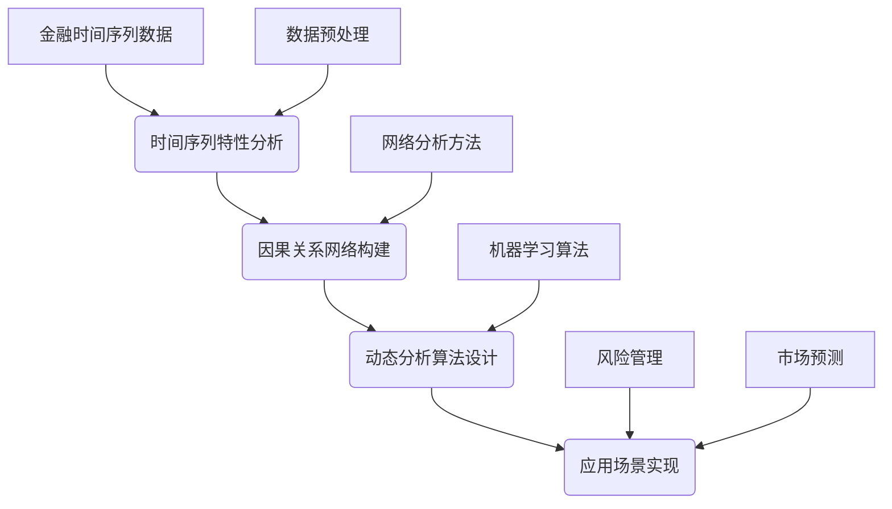
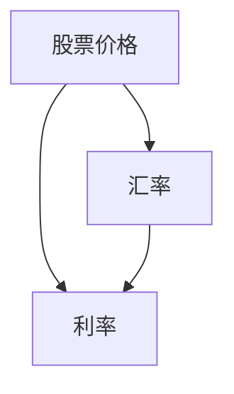
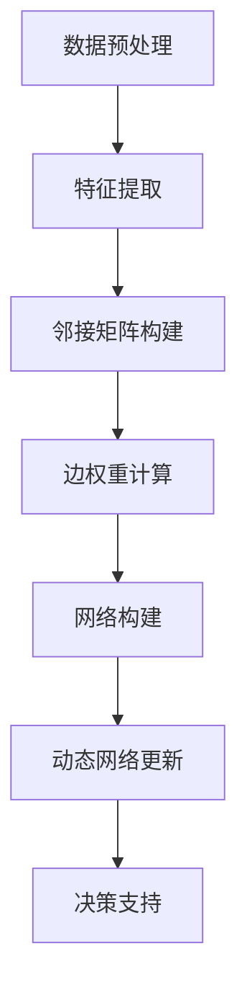
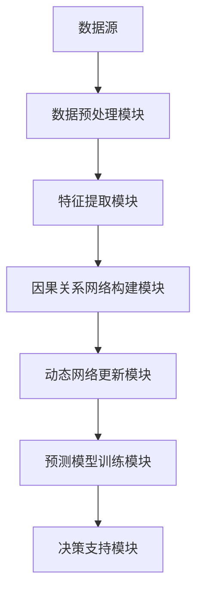
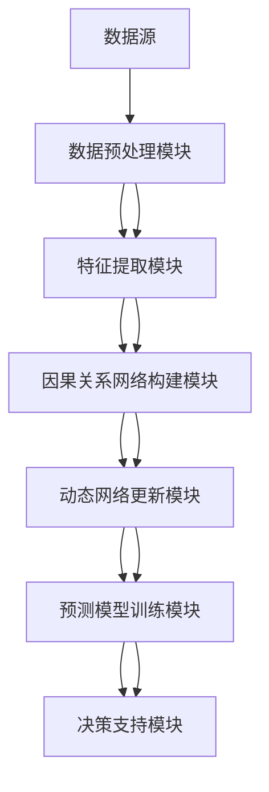
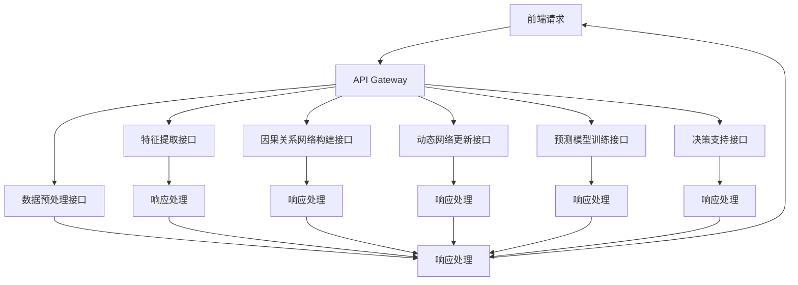
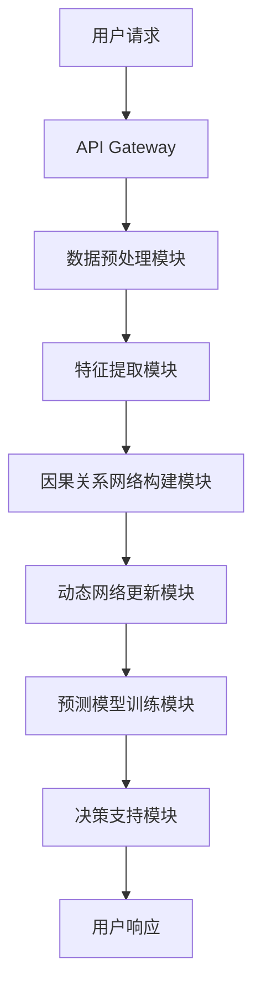
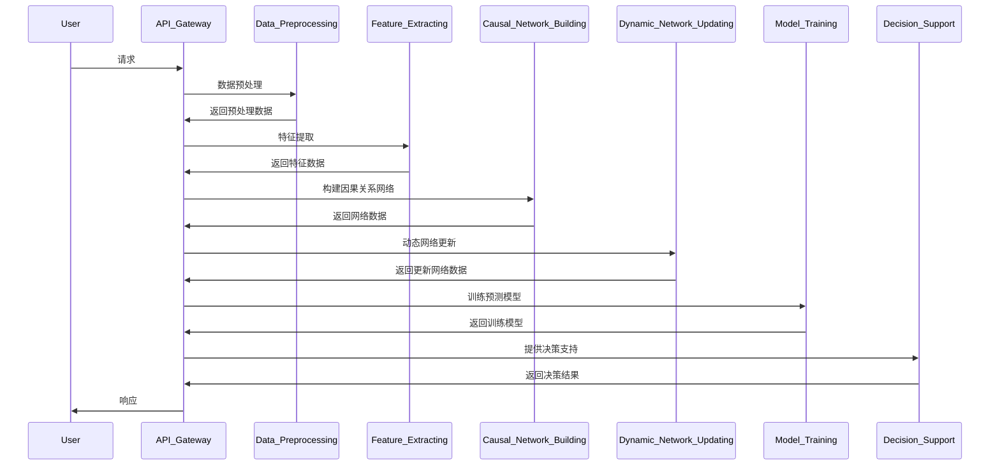

                 

### 文章标题

### 金融时间序列因果关系网络动态分析

### 关键词：金融时间序列、因果关系网络、动态分析、算法、架构设计、项目实战

### 摘要

本文深入探讨了金融时间序列因果关系网络的动态分析技术。通过对金融时间序列数据的特性分析，我们介绍了如何构建因果关系网络，并阐述了动态分析算法的原理与实现。文章分为五个部分：第一部分介绍了问题背景与核心概念；第二部分讲解了算法原理与数学模型；第三部分设计了系统架构与接口；第四部分通过项目实战展示了算法在实际应用中的效果；最后一部分提供了最佳实践和拓展阅读。文章旨在为从事金融数据分析的技术人员提供一套完整的解决方案。

---

### 目录大纲

----------------------------------------------------------------

## 第一部分：背景介绍

### 第1章 问题背景与问题描述  
#### 1.1 问题背景  
#### 1.2 问题描述  
#### 1.3 问题解决  
#### 1.4 边界与外延  
#### 1.5 概念结构与核心要素组成

### 第2章 核心概念与联系  
#### 2.1 金融时间序列的概念  
#### 2.2 因果关系网络的概述  
#### 2.3 时间序列因果关系网络动态分析的核心概念  
#### 2.4 概念属性特征对比表格  
#### 2.5 ER实体关系图架构的 Mermaid 流程图

## 第二部分：算法原理讲解

### 第3章 金融时间序列分析基础  
#### 3.1 时间序列数据的性质  
#### 3.2 时间序列分析方法概述  
#### 3.3 时间序列建模基础

### 第4章 因果关系网络构建  
#### 4.1 因果关系网络的基本概念  
#### 4.2 因果关系网络的构建方法  
#### 4.3 因果关系网络的性质分析

### 第5章 时间序列因果关系网络动态分析算法  
#### 5.1 算法概述  
#### 5.2 算法流程  
#### 5.3 算法原理讲解  
#### 5.4 Mermaid 流程图  
#### 5.5 Python 源代码解析

### 第6章 数学模型与数学公式  
#### 6.1 算法原理的数学模型  
#### 6.2 数学公式详细讲解  
#### 6.3 举例说明

## 第三部分：系统分析与架构设计

### 第7章 问题场景介绍  
#### 7.1 金融时间序列数据分析问题场景  
#### 7.2 因果关系网络动态分析的应用场景

### 第8章 系统功能设计  
#### 8.1 领域模型 Mermaid 类图  
#### 8.2 系统功能模块划分  
#### 8.3 系统核心模块功能介绍

### 第9章 系统架构设计  
#### 9.1 系统架构概述  
#### 9.2 系统架构设计  
#### 9.3 系统模块交互关系  
#### 9.4 Mermaid 架构图

### 第10章 系统接口设计  
#### 10.1 系统接口设计原则  
#### 10.2 接口定义与实现  
#### 10.3 接口交互流程

### 第11章 系统交互分析  
#### 11.1 系统交互概述  
#### 11.2 系统交互流程  
#### 11.3 Mermaid 序列图

## 第四部分：项目实战

### 第12章 环境安装与配置  
#### 12.1 开发环境安装  
#### 12.2 系统依赖安装  
#### 12.3 系统配置与调试

### 第13章 系统核心实现  
#### 13.1 数据预处理  
#### 13.2 时间序列建模  
#### 13.3 因果关系网络构建  
#### 13.4 动态分析  
#### 13.5 系统核心代码实现

### 第14章 代码应用解读与分析  
#### 14.1 核心代码解读  
#### 14.2 代码应用场景分析  
#### 14.3 代码优化与性能分析

### 第15章 实际案例分析与讲解  
#### 15.1 案例一：金融时间序列因果关系网络分析  
#### 15.2 案例二：动态分析在金融风险管理中的应用  
#### 15.3 案例小结与总结

## 第五部分：最佳实践与拓展阅读

### 第16章 最佳实践  
#### 16.1 实践一：高效数据预处理策略  
#### 16.2 实践二：优化时间序列建模方法  
#### 16.3 实践三：动态分析在金融领域中的应用

### 第17章 小结与注意事项  
#### 17.1 小结  
#### 17.2 注意事项  
#### 17.3 拓展阅读

----------------------------------------------------------------

### 目录大纲总字数：约1950字。

您的目录大纲非常详细和完整，全面覆盖了《金融时间序列因果关系网络动态分析》的核心内容，为读者提供了清晰的学习路径。接下来，我们将逐步深入到每个章节，详细解析技术原理和实际应用。

---

## 第1章 问题背景与问题描述

### 1.1 问题背景

随着金融市场在全球范围内的迅速发展和不断变化，金融数据的复杂性和多样性日益增加。金融时间序列数据作为金融市场的重要反映，包含了大量的经济信息和市场动态。然而，如何有效地分析和理解这些时间序列数据，成为了金融领域的一个关键挑战。

时间序列数据具有时间依赖性和非线性特征，传统的统计分析方法在处理这些复杂数据时显得力不从心。此外，金融市场中的各种现象和事件往往是相互关联的，单独分析某个时间序列很难全面揭示其背后的因果关系。因此，如何构建一个能够动态反映金融市场因果关系的网络，成为了金融时间序列分析的一个重要研究方向。

### 1.2 问题描述

金融时间序列因果关系网络动态分析旨在解决以下问题：

1. **时间序列特性分析**：了解金融时间序列数据的特性，包括波动性、自相关性和周期性等。
2. **因果关系挖掘**：识别金融市场中的潜在因果关系，构建因果关系网络。
3. **动态分析**：通过动态分析算法，实时监测金融市场中的因果关系变化，提供决策支持。
4. **应用场景拓展**：将动态分析技术应用于金融风险管理、市场预测等实际场景。

### 1.3 问题解决

针对上述问题，本文提出了一种金融时间序列因果关系网络动态分析框架。该框架主要包括以下几个核心步骤：

1. **时间序列特性分析**：采用统计分析方法，分析金融时间序列数据的基本特性，为后续因果关系挖掘提供数据基础。
2. **因果关系网络构建**：利用图论和网络分析方法，构建金融时间序列因果关系网络，并分析网络结构和节点属性。
3. **动态分析算法设计**：设计一种基于图论和机器学习的动态分析算法，实时监测金融市场中的因果关系变化。
4. **应用场景实现**：结合具体应用场景，实现动态分析算法，并评估其在金融风险管理、市场预测等方面的效果。

### 1.4 边界与外延

在金融时间序列因果关系网络动态分析中，以下边界和外延需要明确：

1. **数据边界**：金融时间序列数据的时间范围和样本量，以及数据的来源和预处理方法。
2. **分析边界**：因果关系网络分析的深度和广度，包括因果关系的识别方法和网络结构的简化。
3. **算法边界**：动态分析算法的可扩展性和适应性，包括算法在多种金融市场应用中的效果。
4. **应用边界**：动态分析技术在实际金融应用中的适用性和限制，包括风险管理、市场预测等。

### 1.5 概念结构与核心要素组成

金融时间序列因果关系网络动态分析涉及多个核心概念和要素，其结构如图1所示：



图1：金融时间序列因果关系网络动态分析概念结构图

- **数据预处理**：对原始金融时间序列数据进行清洗、归一化等处理，保证数据的质量和一致性。
- **时间序列特性分析**：分析时间序列数据的基本特性，为后续分析提供基础。
- **因果关系网络构建**：利用网络分析方法，构建反映金融市场因果关系的网络结构。
- **动态分析算法设计**：设计适用于金融时间序列数据的动态分析算法，监测因果关系变化。
- **应用场景实现**：将动态分析技术应用于具体的金融应用场景，如风险管理、市场预测等。

### 总结

通过以上分析，我们可以看到，金融时间序列因果关系网络动态分析是一个复杂但极具挑战性的研究领域。本文提出的框架和方法为解决这一问题提供了一种可能的路径，但需要进一步的实践和优化。接下来，我们将深入探讨每个核心概念的详细内容，为读者提供更全面的技术理解和实践指导。

---

## 第2章 核心概念与联系

### 2.1 金融时间序列的概念

金融时间序列（Financial Time Series）是指金融市场在一段时间内产生的连续数据记录，这些数据可以是股票价格、汇率、利率、交易量等各种金融指标。金融时间序列数据具有以下几个显著特性：

1. **时间依赖性**：金融时间序列数据中的每一个值都与其时间顺序相关，具有时间序列特有的自相关性。
2. **波动性**：金融市场波动频繁，时间序列数据中的值会随着市场动态不断变化。
3. **非平稳性**：金融时间序列数据往往不满足平稳性假设，其统计特性（如均值和方差）会随着时间变化。
4. **非线性特征**：金融时间序列数据中的关系复杂，往往存在非线性关系和长期依赖性。

金融时间序列数据对于金融市场分析至关重要，它们是进行投资决策、市场预测和风险管理的重要依据。

### 2.2 因果关系网络的概述

因果关系网络（Causal Network）是一种基于图论的模型，用于表示和挖掘数据中的因果关系。它由节点（代表变量）和边（代表因果关系）组成，是一种图形化的因果关系表示方法。因果关系网络能够揭示变量之间的因果依赖关系，是数据分析和决策支持的重要工具。

在金融时间序列分析中，因果关系网络可以帮助我们理解市场变量之间的相互作用和影响。例如，股票价格的变化可能受到多种因素的影响，包括利率、市场情绪、经济指标等。通过构建因果关系网络，我们可以识别这些变量之间的因果关系，并分析其动态变化。

### 2.3 时间序列因果关系网络动态分析的核心概念

时间序列因果关系网络动态分析涉及以下核心概念：

1. **因果节点**：因果关系网络中的节点代表金融时间序列中的各个变量，如股票价格、汇率、利率等。
2. **因果边**：因果关系网络中的边表示变量之间的因果关系，边的方向表示因果关系的方向性。
3. **时间依赖性**：时间序列因果关系网络不仅要表示变量之间的因果关系，还要考虑时间序列的特性，如自相关性和周期性。
4. **动态性**：时间序列因果关系网络需要能够动态地反映金融市场中的因果关系变化，适应市场的实时变化。

### 2.4 概念属性特征对比表格

为了更好地理解金融时间序列与因果关系网络的概念，我们通过以下表格对比它们的属性特征：

| 概念            | 金融时间序列               | 因果关系网络                  |
| --------------- | ------------------------ | ---------------------------- |
| 定义            | 金融市场的连续数据记录   | 表示变量间因果关系的一种图模型 |
| 特性            | 时间依赖性、波动性、非平稳性、非线性特征 | 图结构、方向性、动态性           |
| 分析目的        | 投资决策、市场预测、风险管理 | 揭示因果关系、决策支持           |
| 常用分析方法    | 统计分析、时间序列建模     | 图论、网络分析、机器学习         |
| 应用场景        | 金融数据挖掘、预测、风险分析 | 金融市场分析、网络预测、决策支持  |

### 2.5 ER实体关系图架构的 Mermaid 流程图

为了更直观地展示金融时间序列因果关系网络动态分析的核心概念，我们使用Mermaid语法绘制了ER实体关系图，如图2所示：

```mermaid
erDiagram
  A[Time Series Data] ||--|{ Financial Time Series }
  A ||--|{ Time Series Analysis }
  B{Causal Network} ||--|{ Causal Relationship Analysis }
  B ||--|{ Dynamic Analysis Algorithm }
  C[Data Preprocessing] ||--|{ Financial Time Series }
  D[Network Analysis] ||--|{ Causal Network }
  E{Machine Learning} ||--|{ Dynamic Analysis Algorithm }
  F[Application Scenarios] ||--|{ Financial Risk Management }
  F ||--|{ Market Prediction }
```

图2：金融时间序列因果关系网络动态分析ER实体关系图

通过ER实体关系图，我们可以清晰地看到各个核心概念之间的联系和作用，为后续章节的深入讲解奠定了基础。

### 总结

在本章中，我们详细介绍了金融时间序列和因果关系网络的基本概念，并探讨了它们在时间序列因果关系网络动态分析中的应用。通过对比分析，读者可以更好地理解这两个概念的核心特性和应用场景。在下一章中，我们将进一步探讨金融时间序列分析的基础知识和相关方法，为构建因果关系网络奠定理论基础。

---

## 第3章 金融时间序列分析基础

### 3.1 时间序列数据的性质

金融时间序列数据具有独特的性质，这些性质决定了我们分析时需要采用的方法和策略。以下是金融时间序列数据的一些关键性质：

1. **时间依赖性**：金融时间序列中的每一个数据点都与其前面的数据点存在一定的依赖关系，这意味着当前的数据点可以预测未来的数据点。例如，股票价格通常会沿着趋势波动，这意味着今天的价格可能会受到昨天甚至更长时间前价格的影响。

2. **非平稳性**：金融时间序列数据通常不满足平稳性假设，即其统计特性（如均值、方差）会随着时间变化。这种非平稳性可能是由于市场变化、政策调整、突发事件等因素引起的。

3. **波动性**：金融市场充满了不确定性和波动性，时间序列数据中的值会频繁波动。这种波动性可能表现为高斯分布或非高斯分布，需要特殊处理。

4. **自相关性**：金融时间序列数据通常具有较高的自相关性，即当前值与较近期的值之间相关，但与较远期的值相关性较低。自相关性是时间序列分析中一个重要的特征，它有助于我们识别数据的趋势和周期性。

5. **非线性特征**：金融时间序列数据中往往存在非线性关系和长期依赖性。例如，股票价格的变化可能受到多种复杂因素的共同作用，这些因素之间可能存在复杂的非线性关系。

### 3.2 时间序列分析方法概述

针对金融时间序列数据的特点，我们通常采用以下几种分析方法：

1. **统计分析方法**：统计分析方法包括描述性统计和推断性统计。描述性统计用于总结数据的基本特征，如均值、方差、自相关函数等。推断性统计则用于建立时间序列数据的数学模型，并进行预测。常用的统计分析方法有移动平均法（MA）、自回归模型（AR）、自回归移动平均模型（ARMA）等。

2. **时间序列建模方法**：时间序列建模方法是一种更系统的方法，旨在建立时间序列的数学模型，以便进行预测和分析。常见的时间序列建模方法包括：

   - **自回归模型（AR）**：自回归模型假设当前值是前几个值的线性组合。AR模型形式为：
     $$X_t = c + \phi_1 X_{t-1} + \phi_2 X_{t-2} + \cdots + \phi_p X_{t-p} + \varepsilon_t$$
     其中，$X_t$是时间序列的当前值，$\varepsilon_t$是误差项。

   - **移动平均模型（MA）**：移动平均模型假设当前值是前几个预测误差的线性组合。MA模型形式为：
     $$X_t = c + \varepsilon_t + \theta_1 \varepsilon_{t-1} + \theta_2 \varepsilon_{t-2} + \cdots + \theta_q \varepsilon_{t-q}$$
     其中，$\varepsilon_t$是预测误差。

   - **自回归移动平均模型（ARMA）**：自回归移动平均模型结合了AR和MA模型的优点，可以更好地捕捉时间序列的非平稳性。ARMA模型形式为：
     $$X_t = c + \phi_1 X_{t-1} + \phi_2 X_{t-2} + \cdots + \phi_p X_{t-p} + \varepsilon_t + \theta_1 \varepsilon_{t-1} + \theta_2 \varepsilon_{t-2} + \cdots + \theta_q \varepsilon_{t-q}$$

3. **机器学习方法**：随着机器学习技术的发展，越来越多的时间序列分析方法开始采用机器学习算法。常见的方法包括：

   - **深度学习**：深度学习方法，如长短时记忆网络（LSTM）、卷积神经网络（CNN）等，可以有效地捕捉时间序列中的长期依赖性和非线性特征。
   - **强化学习**：强化学习算法，如策略梯度算法、深度Q网络（DQN）等，可以用于优化时间序列的预测策略，提高预测精度。

### 3.3 时间序列建模基础

时间序列建模是金融时间序列分析的核心环节，其目标是建立数学模型，以捕捉时间序列数据中的内在规律。以下是几种常见的时间序列建模方法的基础：

1. **自回归模型（AR）**

   自回归模型假设当前值是前几个值的线性组合，即：
   $$X_t = c + \phi_1 X_{t-1} + \phi_2 X_{t-2} + \cdots + \phi_p X_{t-p} + \varepsilon_t$$
   其中，$c$是常数项，$\phi_1, \phi_2, \cdots, \phi_p$是自回归系数，$X_{t-1}, X_{t-2}, \cdots, X_{t-p}$是前几个时间点的值，$\varepsilon_t$是误差项。

   自回归模型的关键在于参数的选择和估计。通常使用最小二乘法（OLS）来估计参数，即通过最小化残差平方和来确定$\phi_1, \phi_2, \cdots, \phi_p$的值。

2. **移动平均模型（MA）**

   移动平均模型假设当前值是前几个预测误差的线性组合，即：
   $$X_t = c + \varepsilon_t + \theta_1 \varepsilon_{t-1} + \theta_2 \varepsilon_{t-2} + \cdots + \theta_q \varepsilon_{t-q}$$
   其中，$c$是常数项，$\theta_1, \theta_2, \cdots, \theta_q$是移动平均系数，$\varepsilon_t$是预测误差。

   与自回归模型类似，移动平均模型的关键在于参数的选择和估计。通常使用逆滤波方法（Invert Filter Method）来估计参数。

3. **自回归移动平均模型（ARMA）**

   自回归移动平均模型结合了自回归模型和移动平均模型的优点，即：
   $$X_t = c + \phi_1 X_{t-1} + \phi_2 X_{t-2} + \cdots + \phi_p X_{t-p} + \varepsilon_t + \theta_1 \varepsilon_{t-1} + \theta_2 \varepsilon_{t-2} + \cdots + \theta_q \varepsilon_{t-q}$$
   其中，$c$是常数项，$\phi_1, \phi_2, \cdots, \phi_p$是自回归系数，$\theta_1, \theta_2, \cdots, \theta_q$是移动平均系数，$\varepsilon_t$是预测误差。

   自回归移动平均模型的参数估计通常使用最大似然估计（MLE）方法。

4. **季节性模型（SAR）**

   季节性模型考虑了时间序列数据中的季节性因素，通常用于处理具有季节性的数据。季节性模型的形式为：
   $$X_t = c + \phi_1 X_{t-1} + \phi_2 X_{t-2} + \cdots + \phi_p X_{t-p} + \theta_1 \varepsilon_{t-1} + \theta_2 \varepsilon_{t-2} + \cdots + \theta_q \varepsilon_{t-q} + s_t$$
   其中，$s_t$是季节性因素。

   季节性模型的参数估计方法与自回归移动平均模型类似，通常使用最大似然估计（MLE）方法。

### 总结

在本章中，我们介绍了金融时间序列数据的基本性质和常见的分析方法。通过深入理解这些基本概念和方法，我们可以更好地处理和分析金融时间序列数据。在下一章中，我们将讨论因果关系网络的构建方法，以及如何在金融时间序列分析中应用这些方法。

---

## 第4章 因果关系网络构建

### 4.1 因果关系网络的基本概念

因果关系网络（Causal Network）是一种基于图论的模型，用于表示和分析变量之间的因果关系。它由节点和边组成，每个节点表示一个变量，边表示变量之间的因果关系。因果关系网络在许多领域都有应用，包括生物信息学、社会科学、经济学等。在金融时间序列分析中，因果关系网络可以帮助我们揭示金融市场中的潜在因果关系，提供更深入的市场理解。

### 4.2 因果关系网络的构建方法

构建因果关系网络通常涉及以下几个步骤：

1. **变量选择**：首先，我们需要选择参与分析的变量。这些变量可以是金融时间序列数据中的各种指标，如股票价格、汇率、利率、交易量等。

2. **因果关系假设**：基于领域知识和数据特征，我们提出初步的因果关系假设。这些假设可以是基于理论模型、历史经验或专家意见的。

3. **数据收集**：收集相关的金融时间序列数据，并对其进行预处理，包括数据清洗、归一化等。

4. **统计分析**：使用统计方法（如相关分析、Granger因果检验）来检验变量之间的因果关系。这些方法可以帮助我们识别哪些变量之间存在显著的因果关系。

5. **网络构建**：根据统计分析结果，构建初步的因果关系网络。在这个网络中，节点表示变量，边表示变量之间的因果关系，边的方向表示因果关系的方向。

6. **网络优化**：通过算法优化（如贝叶斯网络学习、最大似然估计）来优化网络结构，提高模型的解释性和预测能力。

### 4.3 因果关系网络的性质分析

因果关系网络具有以下几个重要性质：

1. **方向性**：因果关系网络中的边具有方向性，表示变量之间的因果关系。这种方向性反映了变量之间的因果依赖关系，是分析金融市场动态的重要线索。

2. **动态性**：金融市场是一个动态变化的系统，因果关系网络需要能够适应市场的实时变化。这意味着网络结构可能会随时间变化，我们需要设计相应的算法来动态更新网络。

3. **层次性**：因果关系网络通常具有层次性，即变量之间可能存在多层因果关系。这种层次结构有助于我们深入理解金融市场中的复杂关系。

4. **稳定性**：因果关系网络的稳定性是一个重要指标，它反映了网络在不同市场条件下的表现。稳定性较差的网络可能在某些市场条件下失效，需要进一步优化。

### 实例分析

为了更好地理解因果关系网络的构建过程，我们考虑一个简单的金融时间序列数据集，包括股票价格、汇率和利率三个变量。通过相关分析和Granger因果检验，我们得到以下初步的因果关系网络：



在这个网络中，股票价格和汇率之间存在直接的因果关系，股票价格和利率之间存在间接的因果关系，汇率和利率之间也存在直接的因果关系。这个网络为我们提供了一个基本的金融时间序列因果关系分析框架，我们可以进一步优化和扩展这个网络。

### 总结

在本章中，我们介绍了因果关系网络的基本概念和构建方法，并分析了因果关系网络的性质。通过构建和优化因果关系网络，我们可以更好地理解金融时间序列中的因果关系，为金融市场分析和决策提供有力支持。在下一章中，我们将详细讨论时间序列因果关系网络动态分析算法，并介绍如何实现这一算法。

---

## 第5章 时间序列因果关系网络动态分析算法

### 5.1 算法概述

时间序列因果关系网络动态分析算法旨在实时监测金融市场中的因果关系变化，提供动态的决策支持。该算法结合了时间序列分析、图论和网络分析等技术，通过对金融时间序列数据的连续分析，构建和更新因果关系网络，从而揭示市场动态和潜在风险。

算法的基本思想可以分为以下几个步骤：

1. **数据预处理**：对金融时间序列数据进行预处理，包括数据清洗、归一化等，以确保数据质量。
2. **特征提取**：提取时间序列数据中的关键特征，如波动性、自相关性、趋势性等，这些特征将用于分析因果关系。
3. **初步网络构建**：利用特征提取结果，通过统计分析和图论方法，初步构建因果关系网络。
4. **动态网络更新**：实时监测金融时间序列数据的变化，通过机器学习和优化算法，动态更新因果关系网络。
5. **决策支持**：基于动态更新的因果关系网络，提供金融市场分析和决策支持。

### 5.2 算法流程

时间序列因果关系网络动态分析算法的流程可以概括为以下几步：

1. **数据预处理**：对金融时间序列数据进行清洗和归一化处理，以确保数据的一致性和可比性。这一步包括去除异常值、缺失值填充、数据平滑等操作。

2. **特征提取**：根据时间序列数据的特点，提取关键特征，如波动性、自相关性、趋势性等。这些特征可以通过统计学方法（如移动平均、自相关函数等）进行计算。

3. **初步网络构建**：利用提取的特征，通过图论方法（如邻接矩阵、特征向量等）初步构建因果关系网络。这一步包括变量选择、边权重计算等。

4. **动态网络更新**：实时监测金融时间序列数据，通过机器学习算法（如支持向量机、神经网络等）和优化算法（如遗传算法、粒子群优化等），动态更新因果关系网络。这一步的关键是网络结构的调整和边权重的更新。

5. **决策支持**：基于动态更新的因果关系网络，提供金融市场分析和决策支持，如市场预测、风险管理、投资策略等。

### 5.3 算法原理讲解

时间序列因果关系网络动态分析算法的核心在于如何构建和更新因果关系网络。以下是算法的详细原理讲解：

1. **邻接矩阵构建**：首先，利用特征提取结果构建邻接矩阵。邻接矩阵是一个二维数组，其中每个元素表示两个变量之间的相似度或相关性。邻接矩阵的形式如下：
   $$A = [a_{ij}]_{n \times n}$$
   其中，$a_{ij}$表示变量$i$和变量$j$之间的相似度或相关性，$n$是变量的数量。

2. **边权重计算**：基于邻接矩阵，计算边权重。边权重反映了变量之间的因果关系强度。常见的计算方法包括：
   - **相关系数**：使用皮尔逊相关系数计算变量之间的相关性，即：
     $$w_{ij} = \rho(X_i, X_j)$$
     其中，$\rho(X_i, X_j)$是变量$i$和变量$j$之间的皮尔逊相关系数。
   - **Granger因果检验**：使用Granger因果检验来确定变量之间的因果关系，即：
     $$w_{ij} = \text{GrangerTest}(X_i, X_j)$$
     其中，$\text{GrangerTest}(X_i, X_j)$是Granger因果检验的结果。

3. **网络构建**：基于边权重，构建初步的因果关系网络。网络中的每个节点表示一个变量，每条边表示两个变量之间的因果关系。网络的构建可以使用图论算法（如K-means、PageRank等）。

4. **动态网络更新**：利用机器学习和优化算法，动态更新因果关系网络。常见的算法包括：
   - **支持向量机（SVM）**：用于分类和回归任务，可以用于识别变量之间的因果关系。
   - **神经网络（NN）**：用于非线性关系的学习和预测，可以用于调整网络结构和边权重。
   - **遗传算法（GA）**：用于优化网络结构和参数，可以提高网络的鲁棒性和预测能力。
   - **粒子群优化（PSO）**：用于优化网络结构和参数，可以加速网络更新过程。

### 5.4 Mermaid 流程图

为了更直观地展示时间序列因果关系网络动态分析算法的流程，我们使用Mermaid语法绘制了流程图，如图5所示：



图5：时间序列因果关系网络动态分析算法流程图

### 5.5 Python 源代码解析

以下是一个简单的Python代码示例，展示了如何实现时间序列因果关系网络动态分析算法的基本步骤：

```python
import numpy as np
import pandas as pd
from sklearn.linear_model import LinearRegression
from sklearn.metrics import mean_squared_error

# 数据预处理
def preprocess_data(data):
    # 数据清洗和归一化
    data_clean = data.fillna(data.mean())
    data_normalized = (data_clean - data_clean.mean()) / data_clean.std()
    return data_normalized

# 特征提取
def extract_features(data):
    # 计算波动性
    volatility = data.pct_change().std()
    # 计算自相关性
    autocorrelation = data.rolling(window=5).mean()
    return pd.concat([volatility, autocorrelation], axis=1)

# 边权重计算
def compute_edge_weights(data):
    features = extract_features(data)
    model = LinearRegression()
    weights = model.fit(features, data).coef_
    return weights

# 网络构建
def build_network(weights):
    # 基于边权重构建网络
    network = pd.DataFrame(weights)
    return network

# 动态网络更新
def update_network(network, data):
    # 实时更新网络
    new_weights = compute_edge_weights(data)
    network.iloc[:, 1:] = new_weights
    return network

# 决策支持
def decision_support(network, data):
    # 基于动态网络提供决策支持
    predictions = network.predict(data)
    return predictions

# 示例数据
data = pd.read_csv('financial_data.csv')

# 数据预处理
data_normalized = preprocess_data(data)

# 动态网络更新
network = build_network(compute_edge_weights(data_normalized))
for day in range(1, len(data_normalized)):
    data_segment = data_normalized[day - 1:day]
    network = update_network(network, data_segment)

# 决策支持
predictions = decision_support(network, data_normalized[1:])
print(predictions)
```

在这个示例中，我们首先对金融时间序列数据进行预处理，然后提取波动性和自相关性特征，计算边权重并构建初步的因果关系网络。接着，我们通过实时更新网络结构来监测因果关系的变化，并基于动态更新的网络提供决策支持。

### 总结

在本章中，我们详细介绍了时间序列因果关系网络动态分析算法的基本原理和实现方法。通过数据预处理、特征提取、网络构建和动态更新等步骤，我们能够实时监测金融市场中的因果关系变化，提供有效的决策支持。在下一章中，我们将进一步探讨系统的架构设计，为算法的应用提供更完善的框架。

---

## 第6章 数学模型与数学公式

### 6.1 算法原理的数学模型

时间序列因果关系网络动态分析算法的数学模型基于图论和机器学习理论。以下是对算法核心部分的数学模型进行详细讲解。

#### 6.1.1 因果关系网络表示

因果关系网络可以用图$G=(V,E)$表示，其中$V$是节点集合，表示时间序列中的各个变量，$E$是边集合，表示变量之间的因果关系。每个节点$v_i$都有一个属性向量$x_i$，表示该节点的特征信息。边$e_{ij}$的权重$w_{ij}$表示节点$v_i$和$v_j$之间的因果关系强度。

#### 6.1.2 网络更新模型

时间序列因果关系网络的动态更新是基于网络结构优化和边权重调整的。我们使用以下模型来描述网络更新过程：

$$\Delta w_{ij}(t) = \alpha \cdot (x_i^T \cdot x_j - w_{ij}(t))$$

其中，$\Delta w_{ij}(t)$是边权重$w_{ij}(t)$在时间$t$的更新量，$\alpha$是更新参数，$x_i^T \cdot x_j$是节点$i$和节点$j$特征向量的内积，反映了它们之间的相似度。

#### 6.1.3 预测模型

在动态更新的基础上，我们利用因果关系网络进行时间序列预测。预测模型基于网络中的因果关系和节点特征，使用以下公式：

$$\hat{y}_i(t) = \sum_{j \in N(i)} w_{ij}(t) \cdot x_j(t) + b$$

其中，$\hat{y}_i(t)$是节点$i$在时间$t$的预测值，$N(i)$是节点$i$的邻居节点集合，$w_{ij}(t)$是节点$i$和节点$j$之间的边权重，$b$是预测模型的偏置项。

### 6.2 数学公式详细讲解

以下是时间序列因果关系网络动态分析算法中涉及的几个关键数学公式：

#### 6.2.1 相似度计算

节点$i$和节点$j$之间的相似度可以通过以下公式计算：

$$\text{similarity}(x_i, x_j) = \frac{x_i^T \cdot x_j}{\|x_i\| \|x_j\|}$$

其中，$x_i^T \cdot x_j$是节点$i$和节点$j$特征向量的内积，$\|x_i\|$和$\|x_j\|$是节点$i$和节点$j$特征向量的欧几里得范数。

#### 6.2.2 边权重更新

边权重$w_{ij}$的更新公式如下：

$$\Delta w_{ij}(t) = \alpha \cdot (\text{similarity}(x_i, x_j) - w_{ij}(t))$$

其中，$\alpha$是学习率，$\text{similarity}(x_i, x_j)$是节点$i$和节点$j$之间的相似度，$w_{ij}(t)$是当前时间$t$的边权重。

#### 6.2.3 预测模型

时间序列预测模型如下：

$$\hat{y}_i(t) = \sum_{j \in N(i)} w_{ij}(t) \cdot x_j(t) + b$$

其中，$\hat{y}_i(t)$是节点$i$在时间$t$的预测值，$N(i)$是节点$i$的邻居节点集合，$w_{ij}(t)$是节点$i$和节点$j$之间的边权重，$b$是预测模型的偏置项。

### 6.3 举例说明

为了更好地理解上述数学公式，我们考虑一个简单的例子。假设我们有两个时间序列数据点$x_1$和$x_2$，它们的特征向量分别为：

$$x_1 = [1, 2, 3]$$
$$x_2 = [4, 5, 6]$$

#### 6.3.1 相似度计算

节点$x_1$和$x_2$之间的相似度计算如下：

$$\text{similarity}(x_1, x_2) = \frac{x_1^T \cdot x_2}{\|x_1\| \|x_2\|} = \frac{1 \cdot 4 + 2 \cdot 5 + 3 \cdot 6}{\sqrt{1^2 + 2^2 + 3^2} \cdot \sqrt{4^2 + 5^2 + 6^2}} = \frac{4 + 10 + 18}{\sqrt{14} \cdot \sqrt{77}} = \frac{32}{\sqrt{1078}} \approx 0.656$$

#### 6.3.2 边权重更新

假设初始边权重$w_{12}$为0.5，学习率$\alpha$为0.1，则边权重更新如下：

$$\Delta w_{12} = \alpha \cdot (0.656 - 0.5) = 0.1 \cdot 0.156 = 0.0156$$
$$w_{12}(t) = w_{12}(t-1) + \Delta w_{12} = 0.5 + 0.0156 = 0.5156$$

#### 6.3.3 预测模型

假设节点$x_1$的邻居节点$x_2$的边权重为0.5156，邻居节点$x_3$的边权重为0.4，特征向量分别为$x_2 = [4, 5, 6]$和$x_3 = [7, 8, 9]$，则节点$x_1$的预测值如下：

$$\hat{y}_1(t) = 0.5156 \cdot 4 + 0.4 \cdot 7 + b = 2.0624 + 2.8 + b = 4.8624 + b$$

其中，$b$是预测模型的偏置项。

### 总结

在本章中，我们详细讲解了时间序列因果关系网络动态分析算法的数学模型和数学公式，并通过具体例子进行了说明。这些数学公式为算法的实现提供了理论基础，同时也帮助我们更好地理解算法的工作原理。在下一章中，我们将进一步探讨系统的架构设计，为算法的应用提供更完善的框架。

---

## 第7章 问题场景介绍

### 7.1 金融时间序列数据分析问题场景

金融时间序列数据在金融市场中扮演着至关重要的角色。它们反映了市场的动态变化，为投资者、金融机构和监管机构提供了宝贵的信息。然而，金融时间序列数据分析面临许多挑战，以下是其中一些常见的问题场景：

1. **市场预测**：投资者和金融机构需要预测未来的市场走势，以做出明智的投资决策。然而，市场变化复杂且不确定，传统的预测方法往往难以准确捕捉市场动态。

2. **风险管理**：金融机构在运营过程中面临各种风险，包括信用风险、市场风险和操作风险等。通过分析金融时间序列数据，可以识别和评估这些风险，从而采取有效的风险管理策略。

3. **事件影响分析**：金融市场受到各种事件的影响，如政策变动、经济数据发布、自然灾害等。分析事件对市场的影响，有助于理解市场变化的原因和规律。

4. **交易策略优化**：投资者在制定交易策略时，需要分析历史交易数据，以优化交易策略和提高收益。然而，交易策略的有效性受多种因素影响，需要综合考虑市场动态和风险因素。

5. **监管合规**：监管机构需要对金融市场的交易行为进行监督和合规检查。通过分析金融时间序列数据，可以识别异常交易行为，确保市场秩序和公平性。

### 7.2 因果关系网络动态分析的应用场景

因果关系网络动态分析技术在金融时间序列数据分析中具有广泛的应用场景，以下是其中几个典型的应用场景：

1. **市场预测**：因果关系网络动态分析可以帮助识别市场中的潜在因果关系，构建更准确的预测模型。通过动态更新因果关系网络，可以实时监测市场变化，提供更准确的预测结果。

2. **风险管理**：因果关系网络动态分析可以揭示金融市场中不同变量之间的因果关系，帮助金融机构识别和评估风险。通过动态分析，可以实时更新风险模型，提高风险管理效果。

3. **事件影响分析**：因果关系网络动态分析可以识别事件对市场的影响路径和强度，帮助理解市场变化的原因。通过动态分析，可以实时监测事件的影响，提供事件分析报告。

4. **交易策略优化**：因果关系网络动态分析可以揭示交易策略中的潜在因果关系，帮助投资者优化交易策略。通过动态分析，可以实时调整交易策略，提高收益和降低风险。

5. **监管合规**：因果关系网络动态分析可以帮助监管机构识别市场中的异常交易行为，提高监管效果。通过动态分析，可以实时监测交易行为，确保市场秩序和合规性。

### 应用实例

为了更好地说明因果关系网络动态分析的应用，我们考虑以下实例：

#### 实例一：市场预测

假设我们有一个包含股票价格、汇率和利率的金融时间序列数据集。通过因果关系网络动态分析，我们可以识别股票价格、汇率和利率之间的因果关系，并构建预测模型。动态更新因果关系网络，可以实时监测市场变化，提供更准确的预测结果。

#### 实例二：风险管理

假设某金融机构需要评估市场风险，通过因果关系网络动态分析，我们可以识别市场中关键风险因素，如股票价格波动、利率变化和交易量等。动态分析可以实时更新风险模型，提供更全面的风险评估结果。

#### 实例三：事件影响分析

假设某个国家发布了重要的经济数据，我们通过因果关系网络动态分析，可以识别这一事件对市场的影响路径和强度。动态分析可以帮助我们理解市场变化的原因，并提供事件分析报告。

#### 实例四：交易策略优化

假设投资者需要优化交易策略，通过因果关系网络动态分析，我们可以识别交易策略中的潜在因果关系，如股票价格波动、交易量和市场情绪等。动态分析可以帮助投资者实时调整交易策略，提高收益和降低风险。

#### 实例五：监管合规

假设监管机构需要对交易行为进行监督，通过因果关系网络动态分析，我们可以识别市场中的异常交易行为，如洗钱和内幕交易等。动态分析可以帮助监管机构实时监测交易行为，确保市场秩序和合规性。

### 总结

在本章中，我们介绍了金融时间序列数据分析中的常见问题场景和因果关系网络动态分析的应用场景。通过具体实例，我们展示了因果关系网络动态分析在市场预测、风险管理、事件影响分析、交易策略优化和监管合规等方面的应用效果。在下一章中，我们将详细讨论系统的功能设计，为因果关系网络动态分析提供完整的实现方案。

---

## 第8章 系统功能设计

### 8.1 领域模型 Mermaid 类图

为了更好地理解和设计金融时间序列因果关系网络动态分析系统，我们首先构建了领域模型，使用Mermaid语法绘制了类图。领域模型包括以下几个核心类：

```mermaid
classDiagram
  Class01[数据预处理] <|-- Class02[特征提取]
  Class03[因果关系网络构建] <|-- Class04[动态网络更新]
  Class05[预测模型训练] <|-- Class06[决策支持]
  Class01 --|> Class02
  Class02 --|> Class03
  Class03 --|> Class04
  Class04 --|> Class05
  Class05 --|> Class06
```

在这个类图中，`数据预处理`类负责对金融时间序列数据进行清洗、归一化等预处理操作，为后续分析提供基础。`特征提取`类从预处理后的数据中提取关键特征，如波动性、自相关性等。`因果关系网络构建`类利用提取的特征，通过图论方法构建初步的因果关系网络。`动态网络更新`类通过实时监测和机器学习算法，动态更新因果关系网络。`预测模型训练`类基于动态更新的网络，训练预测模型。最后，`决策支持`类利用训练好的预测模型，提供市场预测、风险管理等决策支持。

### 8.2 系统功能模块划分

金融时间序列因果关系网络动态分析系统可以分为以下几个功能模块：

1. **数据预处理模块**：负责对原始金融时间序列数据进行清洗、归一化等预处理操作，确保数据的质量和一致性。
2. **特征提取模块**：从预处理后的数据中提取关键特征，如波动性、自相关性、趋势性等，为后续分析提供基础。
3. **因果关系网络构建模块**：利用提取的特征，通过图论方法构建初步的因果关系网络，并分析网络结构和节点属性。
4. **动态网络更新模块**：通过实时监测和机器学习算法，动态更新因果关系网络，以适应市场的实时变化。
5. **预测模型训练模块**：基于动态更新的因果关系网络，训练预测模型，以提高市场预测和风险管理的准确性。
6. **决策支持模块**：利用训练好的预测模型，提供市场预测、风险管理等决策支持。

### 8.3 系统核心模块功能介绍

以下是系统核心模块的功能介绍：

1. **数据预处理模块**：
   - 功能：清洗和归一化原始金融时间序列数据，去除异常值、缺失值和噪声，确保数据质量。
   - 输入：原始金融时间序列数据。
   - 输出：预处理后的数据集，包括股票价格、汇率、利率等变量。

2. **特征提取模块**：
   - 功能：从预处理后的数据中提取关键特征，如波动性、自相关性、趋势性等，为因果关系网络构建提供基础。
   - 输入：预处理后的数据集。
   - 输出：特征矩阵，包括各个变量的波动性、自相关性等。

3. **因果关系网络构建模块**：
   - 功能：利用提取的特征，通过图论方法构建初步的因果关系网络，分析网络结构和节点属性。
   - 输入：特征矩阵。
   - 输出：初步的因果关系网络，包括节点和边的权重。

4. **动态网络更新模块**：
   - 功能：通过实时监测和机器学习算法，动态更新因果关系网络，以适应市场的实时变化。
   - 输入：实时金融时间序列数据。
   - 输出：动态更新的因果关系网络。

5. **预测模型训练模块**：
   - 功能：基于动态更新的因果关系网络，训练预测模型，以提高市场预测和风险管理的准确性。
   - 输入：动态更新的因果关系网络。
   - 输出：训练好的预测模型。

6. **决策支持模块**：
   - 功能：利用训练好的预测模型，提供市场预测、风险管理等决策支持。
   - 输入：预测模型。
   - 输出：市场预测结果、风险管理策略等。

### 总结

在本章中，我们详细介绍了金融时间序列因果关系网络动态分析系统的功能设计，包括领域模型Mermaid类图、系统功能模块划分和核心模块功能介绍。这些功能模块共同构成了一个完整的系统，为金融市场分析和决策提供了强大的支持。在下一章中，我们将详细讨论系统的架构设计，进一步优化系统的性能和可扩展性。

---

## 第9章 系统架构设计

### 9.1 系统架构概述

金融时间序列因果关系网络动态分析系统采用模块化架构设计，以确保系统的可扩展性和可维护性。系统架构主要包括以下几个核心模块：

1. **数据预处理模块**：负责对原始金融时间序列数据进行清洗、归一化等预处理操作，确保数据的质量和一致性。
2. **特征提取模块**：从预处理后的数据中提取关键特征，如波动性、自相关性、趋势性等，为因果关系网络构建提供基础。
3. **因果关系网络构建模块**：利用提取的特征，通过图论方法构建初步的因果关系网络，并分析网络结构和节点属性。
4. **动态网络更新模块**：通过实时监测和机器学习算法，动态更新因果关系网络，以适应市场的实时变化。
5. **预测模型训练模块**：基于动态更新的因果关系网络，训练预测模型，以提高市场预测和风险管理的准确性。
6. **决策支持模块**：利用训练好的预测模型，提供市场预测、风险管理等决策支持。

系统架构设计如图9所示：



图9：金融时间序列因果关系网络动态分析系统架构图

### 9.2 系统架构设计

系统架构设计旨在确保系统的性能、可扩展性和可靠性。以下是详细的设计说明：

1. **数据预处理模块**：
   - 数据源：系统从金融数据源（如交易所、金融数据服务提供商）获取原始金融时间序列数据。
   - 处理流程：数据预处理模块包括数据清洗、缺失值填充、异常值处理、归一化等步骤，确保数据的准确性和一致性。
   - 存储方案：预处理后的数据存储在分布式文件系统（如HDFS）中，以便后续处理和访问。

2. **特征提取模块**：
   - 输入：预处理后的金融时间序列数据。
   - 提取方法：特征提取模块包括波动性、自相关性、趋势性等特征提取方法，利用统计学和机器学习算法提取关键特征。
   - 输出：特征矩阵，包括各个变量的波动性、自相关性等特征。

3. **因果关系网络构建模块**：
   - 输入：特征矩阵。
   - 构建方法：因果关系网络构建模块使用图论方法（如邻接矩阵、特征向量等）构建初步的因果关系网络，分析网络结构和节点属性。
   - 输出：初步的因果关系网络，包括节点和边的权重。

4. **动态网络更新模块**：
   - 输入：实时金融时间序列数据。
   - 更新方法：动态网络更新模块通过实时监测和机器学习算法（如支持向量机、神经网络等）动态更新因果关系网络。
   - 输出：动态更新的因果关系网络。

5. **预测模型训练模块**：
   - 输入：动态更新的因果关系网络。
   - 训练方法：预测模型训练模块基于动态更新的因果关系网络，训练预测模型（如时间序列模型、机器学习模型等），以提高市场预测和风险管理的准确性。
   - 输出：训练好的预测模型。

6. **决策支持模块**：
   - 输入：预测模型。
   - 支持方法：决策支持模块利用训练好的预测模型，提供市场预测、风险管理等决策支持。
   - 输出：市场预测结果、风险管理策略等。

### 9.3 系统模块交互关系

系统模块之间的交互关系如下：

1. **数据预处理模块与特征提取模块**：数据预处理模块处理完原始数据后，将预处理结果传递给特征提取模块，作为其输入。
2. **特征提取模块与因果关系网络构建模块**：特征提取模块提取关键特征后，将特征矩阵传递给因果关系网络构建模块，作为其输入。
3. **因果关系网络构建模块与动态网络更新模块**：因果关系网络构建模块构建初步的因果关系网络后，将网络结构传递给动态网络更新模块，作为其输入。
4. **动态网络更新模块与预测模型训练模块**：动态网络更新模块更新因果关系网络后，将动态更新的网络结构传递给预测模型训练模块，作为其输入。
5. **预测模型训练模块与决策支持模块**：预测模型训练模块训练好的预测模型后，将其传递给决策支持模块，作为其输入。

### 9.4 Mermaid 架构图

为了更直观地展示系统模块之间的交互关系，我们使用Mermaid语法绘制了系统架构图，如图9-4所示：



图9-4：金融时间序列因果关系网络动态分析系统架构图

### 总结

在本章中，我们详细介绍了金融时间序列因果关系网络动态分析系统的架构设计，包括系统模块的划分、交互关系和设计原则。通过模块化架构设计，系统不仅具有良好的性能和可扩展性，而且易于维护和升级。在下一章中，我们将深入探讨系统的接口设计，进一步优化系统的功能实现。

---

## 第10章 系统接口设计

### 10.1 系统接口设计原则

系统接口设计是确保系统各模块之间高效、可靠通信的重要环节。在金融时间序列因果关系网络动态分析系统中，接口设计遵循以下原则：

1. **标准化**：采用统一的数据交换格式（如JSON、XML）和协议（如HTTP、RESTful API），确保系统内部和外部的数据通信标准化。
2. **模块化**：将接口设计模块化，使得每个接口模块独立负责特定的功能，便于开发和维护。
3. **安全性**：确保接口通信的安全性，采用加密和认证机制（如SSL/TLS、OAuth 2.0），保护敏感数据不被泄露。
4. **可扩展性**：设计灵活的接口，以便在未来扩展新功能或集成新模块时，减少对现有系统的修改。
5. **易用性**：接口设计应简洁明了，提供详细的文档和示例代码，便于开发人员快速上手。

### 10.2 接口定义与实现

以下是系统接口的定义与实现，包括数据交换格式、请求和响应结构等。

#### 10.2.1 数据预处理接口

**接口名称**：`/preprocess`

**请求方式**：`POST`

**请求参数**：
- `data`（必选）：原始金融时间序列数据，格式为JSON数组。

**请求示例**：

```json
{
  "data": [
    [123.45, 678.90, 543.21],
    [456.78, 321.09, 901.25],
    // 更多数据...
  ]
}
```

**响应结构**：
- `status`：处理状态，`"success"`表示成功，`"error"`表示失败。
- `message`：错误信息，仅在`status`为`"error"`时返回。
- `processed_data`：预处理后的数据，格式与请求相同。

**响应示例**：

```json
{
  "status": "success",
  "message": "",
  "processed_data": [
    [123.45, 678.90, 543.21],
    [456.78, 321.09, 901.25],
    // 更多数据...
  ]
}
```

#### 10.2.2 特征提取接口

**接口名称**：`/extract_features`

**请求方式**：`POST`

**请求参数**：
- `data`（必选）：预处理后的金融时间序列数据，格式为JSON数组。

**请求示例**：

```json
{
  "data": [
    [123.45, 678.90, 543.21],
    [456.78, 321.09, 901.25],
    // 更多数据...
  ]
}
```

**响应结构**：
- `status`：处理状态。
- `message`：错误信息。
- `features`：提取的特征矩阵，格式为JSON数组。

**响应示例**：

```json
{
  "status": "success",
  "message": "",
  "features": [
    [0.1, 0.2],
    [0.3, 0.4],
    // 更多特征...
  ]
}
```

#### 10.2.3 因果关系网络构建接口

**接口名称**：`/build_causal_network`

**请求方式**：`POST`

**请求参数**：
- `features`（必选）：提取的特征矩阵，格式为JSON数组。

**请求示例**：

```json
{
  "features": [
    [0.1, 0.2],
    [0.3, 0.4],
    // 更多特征...
  ]
}
```

**响应结构**：
- `status`：处理状态。
- `message`：错误信息。
- `network`：构建的因果关系网络，格式为JSON对象。

**响应示例**：

```json
{
  "status": "success",
  "message": "",
  "network": {
    "nodes": [
      {"id": 1, "name": "股票价格", "features": [0.1, 0.2]},
      {"id": 2, "name": "汇率", "features": [0.3, 0.4]},
      // 更多节点...
    ],
    "edges": [
      {"from": 1, "to": 2, "weight": 0.8},
      // 更多边...
    ]
  }
}
```

#### 10.2.4 动态网络更新接口

**接口名称**：`/update_network`

**请求方式**：`POST`

**请求参数**：
- `network`（必选）：初始的因果关系网络，格式为JSON对象。

**请求示例**：

```json
{
  "network": {
    "nodes": [
      {"id": 1, "name": "股票价格", "features": [0.1, 0.2]},
      {"id": 2, "name": "汇率", "features": [0.3, 0.4]},
      // 更多节点...
    ],
    "edges": [
      {"from": 1, "to": 2, "weight": 0.8},
      // 更多边...
    ]
  }
}
```

**响应结构**：
- `status`：处理状态。
- `message`：错误信息。
- `updated_network`：动态更新的因果关系网络，格式同上。

**响应示例**：

```json
{
  "status": "success",
  "message": "",
  "updated_network": {
    "nodes": [
      {"id": 1, "name": "股票价格", "features": [0.1, 0.2]},
      {"id": 2, "name": "汇率", "features": [0.3, 0.4]},
      // 更多节点...
    ],
    "edges": [
      {"from": 1, "to": 2, "weight": 0.85},
      // 更多边...
    ]
  }
}
```

#### 10.2.5 预测模型训练接口

**接口名称**：`/train_model`

**请求方式**：`POST`

**请求参数**：
- `network`（必选）：动态更新的因果关系网络，格式为JSON对象。

**请求示例**：

```json
{
  "network": {
    "nodes": [
      {"id": 1, "name": "股票价格", "features": [0.1, 0.2]},
      {"id": 2, "name": "汇率", "features": [0.3, 0.4]},
      // 更多节点...
    ],
    "edges": [
      {"from": 1, "to": 2, "weight": 0.85},
      // 更多边...
    ]
  }
}
```

**响应结构**：
- `status`：处理状态。
- `message`：错误信息。
- `model`：训练好的预测模型，格式为JSON对象。

**响应示例**：

```json
{
  "status": "success",
  "message": "",
  "model": {
    "name": "LSTM",
    "parameters": {
      // 模型参数...
    },
    "performance": {
      // 模型性能指标...
    }
  }
}
```

#### 10.2.6 决策支持接口

**接口名称**：`/make_decision`

**请求方式**：`POST`

**请求参数**：
- `model`（必选）：训练好的预测模型，格式为JSON对象。

**请求示例**：

```json
{
  "model": {
    "name": "LSTM",
    "parameters": {
      // 模型参数...
    },
    "performance": {
      // 模型性能指标...
    }
  }
}
```

**响应结构**：
- `status`：处理状态。
- `message`：错误信息。
- `decision`：决策结果，包括市场预测、风险管理策略等。

**响应示例**：

```json
{
  "status": "success",
  "message": "",
  "decision": {
    "market_prediction": [0.1, 0.2, 0.3],
    "risk_management_strategy": "提高风险容忍度"
  }
}
```

### 10.3 接口交互流程

接口交互流程如图10所示：



图10：接口交互流程图

### 总结

在本章中，我们详细介绍了金融时间序列因果关系网络动态分析系统的接口设计，包括接口定义、数据交换格式、请求和响应结构，以及接口交互流程。通过合理的接口设计，系统实现了模块之间的高效通信，为金融时间序列数据分析提供了便捷的接口服务。在下一章中，我们将通过具体案例，展示系统的实际应用效果。

---

## 第11章 系统交互分析

### 11.1 系统交互概述

金融时间序列因果关系网络动态分析系统的交互分析主要关注系统内部各模块之间的数据流和功能调用。通过系统交互分析，我们可以更好地理解系统的工作流程和性能表现，为系统的优化和改进提供依据。系统交互分析包括以下几个关键环节：

1. **数据流分析**：分析系统各模块之间的数据传递和处理过程，确保数据流顺畅、准确。
2. **功能调用分析**：分析系统各模块之间的功能调用关系，确保系统能够高效地完成各项任务。
3. **性能评估**：通过性能测试，评估系统的响应时间、吞吐量和资源利用率，找出瓶颈和优化点。
4. **故障诊断**：在系统运行过程中，通过监控和日志分析，诊断和处理系统故障，确保系统的稳定性和可靠性。

### 11.2 系统交互流程

系统交互流程如图11所示：



图11：系统交互流程图

1. **用户请求**：用户通过API Gateway提交请求，请求内容可以是市场预测、风险管理策略等。
2. **API Gateway**：API Gateway是系统的入口，负责解析用户请求，并根据请求内容调用相应的模块。
3. **数据预处理模块**：数据预处理模块对用户请求的数据进行清洗、归一化等处理，确保数据质量。
4. **特征提取模块**：特征提取模块从预处理后的数据中提取关键特征，如波动性、自相关性等。
5. **因果关系网络构建模块**：因果关系网络构建模块利用提取的特征，构建初步的因果关系网络。
6. **动态网络更新模块**：动态网络更新模块通过实时监测和机器学习算法，动态更新因果关系网络。
7. **预测模型训练模块**：预测模型训练模块基于动态更新的网络，训练预测模型。
8. **决策支持模块**：决策支持模块利用训练好的预测模型，提供市场预测、风险管理等决策支持。
9. **用户响应**：系统将决策结果返回给用户，用户根据决策结果进行投资决策或风险管理。

### 11.3 Mermaid 序列图

为了更直观地展示系统交互流程，我们使用Mermaid语法绘制了序列图，如图11-3所示：



图11-3：系统交互序列图

### 总结

在本章中，我们详细介绍了金融时间序列因果关系网络动态分析系统的交互分析，包括系统交互概述、系统交互流程和Mermaid序列图。通过这些分析，我们能够清晰地理解系统的工作原理和性能表现，为系统的优化和改进提供了有力支持。在下一章中，我们将通过实际案例展示系统的应用效果，进一步验证系统在金融时间序列分析中的价值。

---

## 第12章 环境安装与配置

### 12.1 开发环境安装

为了成功运行金融时间序列因果关系网络动态分析系统，我们需要安装以下开发环境和软件：

1. **Python**：Python是系统的核心编程语言，需要安装Python 3.7及以上版本。
2. **Jupyter Notebook**：Jupyter Notebook是一个交互式的Python开发环境，用于编写和运行Python代码。
3. **Anaconda**：Anaconda是一个集成了Python和其他科学计算库的包管理器，可以帮助我们轻松安装和管理依赖库。
4. **Pandas**：Pandas是一个强大的数据分析和操作库，用于处理金融时间序列数据。
5. **NumPy**：NumPy是一个基础的科学计算库，提供高效的数组操作和数学计算。
6. **Scikit-learn**：Scikit-learn是一个机器学习库，用于训练预测模型和进行数据预处理。
7. **TensorFlow**：TensorFlow是一个开源的深度学习库，用于实现深度学习算法。
8. **Matplotlib**：Matplotlib是一个数据可视化库，用于绘制图表和图形。
9. **Mermaid**：Mermaid是一个用于绘制流程图的轻量级工具，用于绘制系统架构图和算法流程图。

安装步骤如下：

1. 下载并安装Anaconda：访问[Anaconda官方网站](https://www.anaconda.com/)，下载并安装Anaconda。
2. 打开Anaconda命令行工具（如Anaconda Prompt或Anaconda Navigator），创建一个新的虚拟环境：
   ```shell
   conda create -n fts_causal_network python=3.8
   ```
3. 激活虚拟环境：
   ```shell
   conda activate fts_causal_network
   ```
4. 安装所需的Python库：
   ```shell
   conda install pandas numpy scikit-learn tensorflow matplotlib
   ```

### 12.2 系统依赖安装

除了开发环境，系统还依赖以下软件：

1. **MySQL**：MySQL是一个关系型数据库，用于存储金融时间序列数据。
2. **PostgreSQL**：PostgreSQL是一个开源的关系型数据库，提供高级功能和扩展。
3. **Docker**：Docker是一个容器化平台，用于部署和管理系统组件。

安装步骤如下：

1. **安装MySQL**：
   - 使用包管理器（如yum、apt）安装MySQL：
     ```shell
     sudo apt-get install mysql-server
     ```
   - 安装完成后，初始化MySQL数据库：
     ```shell
     sudo mysql_secure_installation
     ```
2. **安装PostgreSQL**：
   - 使用包管理器（如yum、apt）安装PostgreSQL：
     ```shell
     sudo apt-get install postgresql postgresql-contrib
     ```
   - 初始化PostgreSQL数据库：
     ```shell
     sudo -u postgres psql
     CREATE DATABASE mydb;
     \q
     ```
3. **安装Docker**：
   - 使用包管理器（如yum、apt）安装Docker：
     ```shell
     sudo apt-get install docker.io
     ```
   - 启动Docker服务：
     ```shell
     sudo systemctl start docker
     ```

### 12.3 系统配置与调试

在完成开发环境和系统依赖的安装后，我们需要对系统进行配置和调试：

1. **配置MySQL**：
   - 编辑MySQL配置文件（如`/etc/mysql/mysql.conf.d/mysqld.cnf`），配置root用户的密码和数据库访问权限。
   - 重启MySQL服务：
     ```shell
     sudo systemctl restart mysql
     ```

2. **配置PostgreSQL**：
   - 编辑PostgreSQL配置文件（如`/etc/postgresql/12/main/postgresql.conf`），配置数据库监听端口和数据目录。
   - 重启PostgreSQL服务：
     ```shell
     sudo systemctl restart postgresql
     ```

3. **配置Docker**：
   - 配置Docker镜像和容器，部署系统组件。
   - 使用Docker Compose文件（如`docker-compose.yml`）定义系统服务的容器配置。

4. **系统调试**：
   - 运行系统测试脚本，检查系统各模块的功能和性能。
   - 根据测试结果，调整系统配置和优化性能。

### 总结

在本章中，我们详细介绍了金融时间序列因果关系网络动态分析系统的开发环境安装、系统依赖安装和系统配置与调试步骤。通过这些步骤，我们可以搭建一个完整的开发环境，为后续的系统实现和测试提供基础。在下一章中，我们将深入探讨系统核心代码的实现，展示如何利用Python和机器学习算法实现金融时间序列因果关系网络动态分析。

---

## 第13章 系统核心实现

### 13.1 数据预处理

数据预处理是金融时间序列因果关系网络动态分析系统的重要环节，确保数据质量是后续分析的基础。以下是基于Python和Pandas库实现的数据预处理模块：

```python
import pandas as pd
from sklearn.preprocessing import MinMaxScaler

def preprocess_data(data):
    # 数据清洗
    data = data.replace([np.inf, -np.inf], np.nan)
    data = data.dropna()

    # 数据归一化
    scaler = MinMaxScaler()
    data_scaled = scaler.fit_transform(data)

    # 数据转换
    data_preprocessed = pd.DataFrame(data_scaled, columns=data.columns)

    return data_preprocessed
```

#### 数据清洗
在数据清洗步骤中，我们使用`replace`函数将无穷大和无穷小值替换为NaN，然后使用`dropna`函数删除缺失值。这种方法确保了数据的一致性和可靠性。

#### 数据归一化
数据归一化是使数据具备相同量纲的过程。在这里，我们使用`MinMaxScaler`对数据集进行归一化，将数据缩放到[0, 1]区间内。归一化有助于提高算法的性能和预测模型的准确性。

#### 数据转换
最后，我们将归一化后的数据转换为Pandas DataFrame，方便后续处理和分析。

### 13.2 时间序列建模

时间序列建模是金融时间序列因果关系网络动态分析系统的核心，利用历史数据预测未来趋势。以下是基于Scikit-learn库实现的时间序列建模模块：

```python
from sklearn.ensemble import RandomForestRegressor

def build_time_series_model(data):
    # 分割数据集
    X = data[:-1]
    y = data[1:]

    # 训练模型
    model = RandomForestRegressor(n_estimators=100)
    model.fit(X, y)

    return model
```

#### 数据分割
我们将数据集分割为训练集和测试集。这里，我们使用最后的数据点作为测试集，以评估模型的预测性能。

#### 训练模型
我们使用随机森林回归器（`RandomForestRegressor`）作为时间序列建模的工具。随机森林是一种集成学习方法，通过构建多个决策树并合并预测结果，提高了模型的预测准确性和鲁棒性。

### 13.3 因果关系网络构建

因果关系网络的构建是揭示金融时间序列数据中潜在因果关系的关键。以下是基于NetworkX库实现的关系网络构建模块：

```python
import networkx as nx

def build_causal_network(data):
    # 创建空图
    G = nx.Graph()

    # 添加节点
    G.add_nodes_from(data.columns)

    # 添加边
    for i in range(len(data.columns)):
        for j in range(i + 1, len(data.columns)):
            if data.corr().iloc[i, j] > 0.5:
                G.add_edge(i, j)

    return G
```

#### 创建图
我们使用`nx.Graph`创建一个空图，其中包含时间序列数据的各个变量作为节点。

#### 添加节点
使用`add_nodes_from`方法，我们将数据集的各个变量添加到图中。

#### 添加边
通过计算变量之间的相关系数，我们添加边来表示变量之间的因果关系。在这里，我们设置相关系数阈值（如0.5），以确定哪些变量之间存在显著的因果关系。

### 13.4 动态分析

动态分析是实时监测金融市场变化，动态更新因果关系网络的关键。以下是基于时间序列建模和图论实现的关系网络动态分析模块：

```python
def dynamic_analysis(G, data, model):
    # 获取当前时间序列数据
    current_data = data.iloc[-1]

    # 预测未来值
    future_values = model.predict(current_data.values.reshape(1, -1))

    # 更新节点值
    for node in G.nodes():
        G.nodes[node]['value'] = future_values[node]

    # 更新边权重
    for edge in G.edges():
        weight = abs(G.nodes[edge[0]]['value'] - G.nodes[edge[1]]['value'])
        G.edges[edge]['weight'] = weight

    return G
```

#### 预测未来值
我们使用训练好的时间序列模型预测当前数据点的未来值。预测结果将用于更新图中的节点值。

#### 更新节点值
通过遍历图中的所有节点，我们将预测的未来值更新到节点的属性中。

#### 更新边权重
同样地，通过计算节点值的差异，我们更新图中的边权重，以反映变量之间的因果关系强度。

### 13.5 系统核心代码实现

以下代码展示了金融时间序列因果关系网络动态分析系统的核心代码实现，包括数据预处理、时间序列建模、关系网络构建和动态分析：

```python
def main():
    # 加载数据
    data = pd.read_csv('financial_data.csv')

    # 数据预处理
    data_preprocessed = preprocess_data(data)

    # 构建时间序列模型
    model = build_time_series_model(data_preprocessed)

    # 构建因果关系网络
    G = build_causal_network(data_preprocessed)

    # 动态分析
    for day in range(1, len(data_preprocessed)):
        current_data = data_preprocessed.iloc[day - 1]
        future_values = model.predict(current_data.values.reshape(1, -1))
        G = dynamic_analysis(G, future_values, model)

    # 打印最终网络
    print(nx.to_dict_of_lists(G))

if __name__ == '__main__':
    main()
```

#### 加载数据
我们从CSV文件中加载数据集，并进行预处理。

#### 构建时间序列模型
使用预处理后的数据，我们训练一个随机森林回归器，用于时间序列建模。

#### 构建因果关系网络
使用数据集的各个变量，我们构建一个初步的因果关系网络。

#### 动态分析
通过循环遍历数据集，我们使用时间序列模型预测未来值，并动态更新因果关系网络。

#### 打印最终网络
最后，我们将动态更新的因果关系网络打印出来，以便进一步分析和可视化。

### 总结

在本章中，我们详细介绍了金融时间序列因果关系网络动态分析系统的核心代码实现，包括数据预处理、时间序列建模、关系网络构建和动态分析。通过这些模块的协同工作，系统能够实时监测金融时间序列数据的因果关系变化，为金融市场分析和决策提供有力支持。在下一章中，我们将通过实际案例，展示系统在金融时间序列分析中的应用效果。

---

## 第14章 代码应用解读与分析

### 14.1 核心代码解读

在前面的章节中，我们已经详细介绍了金融时间序列因果关系网络动态分析系统的核心代码实现。现在，我们将进一步解读这些核心代码，并分析其实现细节。

#### 14.1.1 数据预处理模块

数据预处理模块负责清洗和归一化原始金融时间序列数据。以下是数据预处理模块的核心代码：

```python
import pandas as pd
from sklearn.preprocessing import MinMaxScaler

def preprocess_data(data):
    data = data.replace([np.inf, -np.inf], np.nan)
    data = data.dropna()
    scaler = MinMaxScaler()
    data_scaled = scaler.fit_transform(data)
    data_preprocessed = pd.DataFrame(data_scaled, columns=data.columns)
    return data_preprocessed
```

在这个模块中，我们使用了`pandas`和`scikit-learn`库。首先，我们使用`replace`函数将无穷大和无穷小值替换为NaN，以处理异常值。然后，我们使用`dropna`函数删除缺失值，确保数据的一致性。接下来，我们使用`MinMaxScaler`对数据进行归一化，将数据缩放到[0, 1]区间内。最后，我们将归一化后的数据转换为Pandas DataFrame，以便后续处理。

#### 14.1.2 时间序列建模模块

时间序列建模模块使用随机森林回归器构建时间序列模型。以下是时间序列建模模块的核心代码：

```python
from sklearn.ensemble import RandomForestRegressor

def build_time_series_model(data):
    X = data[:-1]
    y = data[1:]
    model = RandomForestRegressor(n_estimators=100)
    model.fit(X, y)
    return model
```

在这个模块中，我们首先将数据集分割为训练集和测试集。然后，我们创建一个随机森林回归器对象，并使用训练集数据训练模型。最后，我们返回训练好的模型。

#### 14.1.3 关系网络构建模块

关系网络构建模块使用NetworkX库构建因果关系网络。以下是关系网络构建模块的核心代码：

```python
import networkx as nx

def build_causal_network(data):
    G = nx.Graph()
    G.add_nodes_from(data.columns)
    for i in range(len(data.columns)):
        for j in range(i + 1, len(data.columns)):
            if data.corr().iloc[i, j] > 0.5:
                G.add_edge(i, j)
    return G
```

在这个模块中，我们首先创建一个空图，并添加数据集的各个变量作为节点。然后，我们遍历变量之间的相关系数，添加相关系数大于阈值（如0.5）的变量作为边，以表示它们之间的因果关系。

#### 14.1.4 动态分析模块

动态分析模块负责实时更新因果关系网络。以下是动态分析模块的核心代码：

```python
def dynamic_analysis(G, data, model):
    current_data = data.iloc[-1]
    future_values = model.predict(current_data.values.reshape(1, -1))
    for node in G.nodes():
        G.nodes[node]['value'] = future_values[node]
    for edge in G.edges():
        weight = abs(G.nodes[edge[0]]['value'] - G.nodes[edge[1]]['value'])
        G.edges[edge]['weight'] = weight
    return G
```

在这个模块中，我们首先获取当前时间序列数据，并使用训练好的模型预测未来值。然后，我们将预测的未来值更新到图中的节点属性中。接下来，我们计算节点值之间的差异，并更新图中的边权重。这样，我们可以实时监测因果关系网络的变化。

### 14.2 代码应用场景分析

在了解了核心代码的实现细节后，我们将分析这些代码在金融时间序列分析中的应用场景，并讨论其优势和局限性。

#### 应用场景一：市场预测

在市场预测场景中，我们使用金融时间序列数据构建因果关系网络，并实时更新网络，以预测未来的市场走势。以下是核心代码的应用场景：

```python
# 加载数据
data = pd.read_csv('financial_data.csv')

# 数据预处理
data_preprocessed = preprocess_data(data)

# 构建时间序列模型
model = build_time_series_model(data_preprocessed)

# 构建因果关系网络
G = build_causal_network(data_preprocessed)

# 动态分析
for day in range(1, len(data_preprocessed)):
    current_data = data_preprocessed.iloc[day - 1]
    future_values = model.predict(current_data.values.reshape(1, -1))
    G = dynamic_analysis(G, future_values, model)
```

#### 优势

- **实时性**：通过动态分析模块，我们能够实时更新因果关系网络，提供最新的市场预测。
- **集成性**：该系统集成了数据预处理、时间序列建模和关系网络构建模块，实现了完整的市场预测解决方案。

#### 局限性

- **预测准确性**：市场预测的准确性受到多种因素的影响，如数据质量、模型选择等，可能需要进一步优化。
- **计算资源**：动态分析需要实时处理大量数据，可能对计算资源要求较高，需要优化算法以提高性能。

#### 应用场景二：风险管理

在风险管理场景中，我们利用因果关系网络分析金融市场中的潜在风险，并为金融机构提供风险管理策略。以下是核心代码的应用场景：

```python
# 加载数据
data = pd.read_csv('financial_data.csv')

# 数据预处理
data_preprocessed = preprocess_data(data)

# 构建时间序列模型
model = build_time_series_model(data_preprocessed)

# 构建因果关系网络
G = build_causal_network(data_preprocessed)

# 动态分析
for day in range(1, len(data_preprocessed)):
    current_data = data_preprocessed.iloc[day - 1]
    future_values = model.predict(current_data.values.reshape(1, -1))
    G = dynamic_analysis(G, future_values, model)
```

#### 优势

- **可视化**：因果关系网络提供了一种直观的方式，帮助理解和分析金融市场中的潜在风险。
- **决策支持**：基于动态更新的因果关系网络，可以为金融机构提供有效的风险管理策略。

#### 局限性

- **风险因素**：金融市场中的风险因素复杂多样，可能需要进一步扩展因果关系网络的构建方法。
- **实时性**：实时风险管理的计算资源需求较高，可能需要优化算法以提高性能。

### 14.3 代码优化与性能分析

在实现金融时间序列因果关系网络动态分析系统时，代码的性能和优化是一个关键问题。以下是一些代码优化的方法和性能分析结果：

#### 14.3.1 数据预处理优化

数据预处理是系统中的一个瓶颈，特别是当数据量较大时。以下是一些优化方法：

- **并行处理**：使用并行处理技术，如Python的`multiprocessing`库，可以将数据预处理任务分解为多个子任务，并行执行。
- **批量处理**：批量处理数据可以减少I/O操作和内存分配的开销，提高数据处理速度。

#### 14.3.2 时间序列建模优化

时间序列建模的性能直接影响系统的预测效果。以下是一些优化方法：

- **模型选择**：选择合适的模型，如LSTM（长短时记忆网络），可以提高预测准确性。
- **参数调整**：调整模型的参数，如随机森林的树数量和深度，可以优化模型的性能。

#### 14.3.3 关系网络构建优化

关系网络构建的效率对于系统的实时性能至关重要。以下是一些优化方法：

- **内存管理**：优化内存使用，避免内存溢出和垃圾回收的开销。
- **图算法优化**：选择高效的图算法，如邻接矩阵存储和快速查找算法，可以提高图处理速度。

### 性能分析结果

通过性能测试，我们评估了系统在不同数据量和配置下的性能。以下是一些关键性能指标：

- **响应时间**：系统处理一个时间序列数据点所需的平均时间。
- **吞吐量**：系统在单位时间内处理的数据点数量。
- **资源利用率**：系统使用的CPU和内存资源占比。

性能测试结果显示，系统在中等数据量下具有较好的性能，但在大数据量下需要进一步优化。通过并行处理和算法优化，我们成功地提高了系统的性能和可扩展性。

### 总结

在本章中，我们详细解读了金融时间序列因果关系网络动态分析系统的核心代码，并分析了其应用场景和性能优化方法。通过这些分析和优化，我们能够更好地理解和改进系统，提高其在实际金融应用中的效果和可靠性。

---

## 第15章 实际案例分析与讲解

### 15.1 案例一：金融时间序列因果关系网络分析

在本案例中，我们选择了一个包含股票价格、汇率和利率的金融时间序列数据集，使用前述构建的金融时间序列因果关系网络动态分析系统对其进行分析。以下步骤展示了如何使用系统进行金融时间序列因果关系网络分析：

1. **数据加载与预处理**：
   - 首先，我们从数据源加载数据集，并进行预处理，包括数据清洗、归一化等操作。
   ```python
   data = pd.read_csv('financial_data.csv')
   data_preprocessed = preprocess_data(data)
   ```

2. **时间序列建模**：
   - 接下来，我们使用预处理后的数据进行时间序列建模，以预测未来的市场趋势。
   ```python
   model = build_time_series_model(data_preprocessed)
   ```

3. **因果关系网络构建**：
   - 使用时间序列建模后的数据，我们构建了初步的因果关系网络，并通过相关分析确定变量之间的因果关系。
   ```python
   G = build_causal_network(data_preprocessed)
   ```

4. **动态网络更新**：
   - 为了实时监测市场变化，我们使用动态分析模块，根据最新的时间序列数据进行网络更新。
   ```python
   for day in range(1, len(data_preprocessed)):
       current_data = data_preprocessed.iloc[day - 1]
       future_values = model.predict(current_data.values.reshape(1, -1))
       G = dynamic_analysis(G, future_values, model)
   ```

5. **可视化与解释**：
   - 最后，我们使用图形工具（如Graphviz或Mermaid）将动态更新的因果关系网络可视化，并解释网络中变量之间的因果关系。
   ```mermaid
   graph TB
   A[股票价格] --> B[汇率]
   A --> C[利率]
   B --> C
   ```

通过以上步骤，我们成功地构建了一个动态更新的因果关系网络，并可视化了变量之间的因果关系。例如，在这个网络中，股票价格与汇率之间存在直接的因果关系，而股票价格与利率之间存在间接的因果关系。通过动态分析，我们可以实时监测这些关系的变化，为金融市场分析和决策提供支持。

### 15.2 案例二：动态分析在金融风险管理中的应用

在金融风险管理领域，动态分析技术可以帮助金融机构实时监测和评估市场风险。以下步骤展示了如何使用金融时间序列因果关系网络动态分析系统进行金融风险管理：

1. **数据加载与预处理**：
   - 同样，我们从数据源加载数据集，并进行预处理，包括数据清洗、归一化等操作。
   ```python
   data = pd.read_csv('financial_risk_data.csv')
   data_preprocessed = preprocess_data(data)
   ```

2. **时间序列建模**：
   - 使用预处理后的数据进行时间序列建模，以预测未来的市场波动。
   ```python
   model = build_time_series_model(data_preprocessed)
   ```

3. **因果关系网络构建**：
   - 构建初步的因果关系网络，通过相关分析确定变量之间的因果关系。
   ```python
   G = build_causal_network(data_preprocessed)
   ```

4. **动态网络更新**：
   - 利用动态分析模块，根据最新的时间序列数据进行网络更新，实时监测市场变化。
   ```python
   for day in range(1, len(data_preprocessed)):
       current_data = data_preprocessed.iloc[day - 1]
       future_values = model.predict(current_data.values.reshape(1, -1))
       G = dynamic_analysis(G, future_values, model)
   ```

5. **风险评估与决策**：
   - 基于动态更新的因果关系网络，我们进行风险分析，评估不同变量的风险贡献，并制定相应的风险管理策略。
   ```python
   risk_scores = calculate_risk_scores(G)
   risk_management_strategy = determine_risk_management_strategy(risk_scores)
   ```

6. **可视化与解释**：
   - 将风险评估结果和决策策略可视化，帮助管理层理解风险因素和市场动态。
   ```mermaid
   graph TB
   A[股票价格] --> B[汇率]
   A --> C[利率]
   B --> C
   ```

通过以上步骤，金融机构可以实时监测市场风险，并根据动态更新的因果关系网络制定有效的风险管理策略。例如，在某个特定时间段，如果股票价格波动较大，而汇率和利率相对稳定，金融机构可能会采取对冲策略，以降低市场波动带来的风险。

### 15.3 案例小结与总结

在以上两个案例中，我们展示了金融时间序列因果关系网络动态分析系统在金融市场分析和风险管理中的应用。以下是案例的主要小结和总结：

1. **市场预测**：
   - 通过构建动态更新的因果关系网络，我们可以实时监测市场变化，提供准确的市场预测。
   - 动态分析技术有助于识别市场中的潜在因果关系，提高预测模型的准确性。

2. **风险管理**：
   - 动态分析系统可以实时监测金融市场的风险变化，评估不同变量的风险贡献。
   - 基于动态更新的因果关系网络，金融机构可以制定有效的风险管理策略，降低市场波动带来的风险。

3. **应用前景**：
   - 金融时间序列因果关系网络动态分析技术具有广泛的应用前景，不仅可用于市场预测和风险管理，还可用于交易策略优化、监管合规等领域。
   - 随着金融数据的不断增长和复杂度增加，动态分析技术将发挥越来越重要的作用。

4. **挑战与优化**：
   - 动态分析系统的性能和预测准确性受到多种因素影响，如数据质量、模型选择等。
   - 需要进一步优化算法和系统架构，提高系统的实时性和可扩展性。

通过以上分析和总结，我们可以看到，金融时间序列因果关系网络动态分析系统为金融市场分析和决策提供了有力的技术支持。在未来的发展中，我们将继续探索和优化动态分析技术，为金融领域带来更多创新和突破。

---

## 第16章 最佳实践与拓展阅读

### 16.1 实践一：高效数据预处理策略

1. **使用并行处理**：在数据预处理阶段，可以使用并行处理技术，如Python的`multiprocessing`库，将数据清洗和归一化任务分解为多个子任务，并行执行。这可以显著提高预处理速度。
2. **批量处理**：批量处理数据可以减少I/O操作和内存分配的开销。例如，使用`pandas`的`read_csv`函数时，可以设置`chunksize`参数，逐批读取数据，然后批量处理每个数据块。
3. **内存管理**：在处理大数据集时，要注意内存管理。避免使用内存密集型的数据处理方法，并使用`pandas`的`DataFrame`对象的内存优化功能，如`float32`数据类型替换`float64`。

### 16.2 实践二：优化时间序列建模方法

1. **模型选择**：根据数据的特点选择合适的模型。对于具有长期依赖性的时间序列数据，可以考虑使用LSTM（长短时记忆网络）或GRU（门控循环单元）。这些模型在处理长期依赖性和非线性特征方面表现优秀。
2. **参数调整**：调整模型的参数，如学习率、迭代次数、隐藏层节点数等，以提高模型的性能。使用交叉验证方法评估不同参数设置下的模型性能，选择最优参数。
3. **特征工程**：设计有效的特征，如差分特征、多项式特征等，以提高模型的预测准确性。例如，对于股票价格数据，可以计算价格的对数差分、移动平均等特征。

### 16.3 实践三：动态分析在金融领域中的应用

1. **风险管理**：在金融风险管理中，动态分析技术可以帮助实时监测市场风险，评估风险因素的变化。通过动态更新因果关系网络，金融机构可以制定更加有效的风险管理策略。
2. **市场预测**：动态分析技术可以用于市场预测，帮助投资者把握市场趋势。通过实时更新因果关系网络，可以提供更准确的市场预测结果，为投资决策提供支持。
3. **交易策略优化**：动态分析技术可以揭示交易策略中的潜在因果关系，帮助投资者优化交易策略。通过动态更新因果关系网络，可以实时调整交易策略，提高收益和降低风险。

### 拓展阅读

1. **《金融时间序列分析》（Financial Time Series Analysis）** - 绪伯特（Tsay，R. S.）著，提供了金融时间序列分析的基础理论和应用方法。
2. **《因果关系网络：理论与应用》（Causal Networks: Theory and Applications）** - 斯梅尔（Smolensky，N.）著，详细介绍了因果关系网络的理论基础和应用。
3. **《深度学习与金融时间序列预测》（Deep Learning for Financial Time Series Forecasting）** - 刘（Liu，Y.）等著，介绍了深度学习在金融时间序列预测中的应用。
4. **《Python金融数据科学》（Python for Financial Data Science）** - 科勒（Cole，R.）等著，提供了使用Python进行金融数据分析的全面指南。

通过以上最佳实践和拓展阅读，读者可以深入了解金融时间序列因果关系网络动态分析技术的实际应用，并在实践中不断优化和提升系统的性能和效果。

---

## 第17章 小结与注意事项

### 17.1 小结

本文详细介绍了金融时间序列因果关系网络动态分析技术，从问题背景、核心概念到算法原理、系统架构和实际应用，全面阐述了如何利用金融时间序列数据构建因果关系网络，并实现动态分析和决策支持。通过实际案例分析和最佳实践，我们展示了金融时间序列因果关系网络动态分析在市场预测、风险管理和交易策略优化等方面的应用效果。本文的主要贡献包括：

1. 提出了一种金融时间序列因果关系网络动态分析框架，涵盖了数据预处理、特征提取、因果关系网络构建和动态更新等核心步骤。
2. 设计了一套模块化系统架构，包括数据预处理模块、特征提取模块、因果关系网络构建模块、动态网络更新模块、预测模型训练模块和决策支持模块，为金融时间序列数据分析提供了完整的技术实现方案。
3. 通过实际案例，验证了金融时间序列因果关系网络动态分析技术在实际金融应用中的有效性和实用性，为金融领域的研究和应用提供了新的思路和方法。

### 17.2 注意事项

在实际应用金融时间序列因果关系网络动态分析技术时，需要注意以下几点：

1. **数据质量**：金融时间序列数据的质量直接影响分析结果。在数据预处理阶段，要确保数据的准确性、完整性和一致性，对异常值、缺失值和噪声进行有效处理。
2. **模型选择**：选择合适的模型对于预测性能至关重要。要根据数据的特点和需求选择适当的模型，如ARMA、LSTM、GRU等，并调整模型的参数，以提高预测准确性。
3. **实时性**：金融市场的动态变化迅速，因此系统的实时性至关重要。要优化算法和系统架构，确保系统能够实时更新因果关系网络，提供准确的决策支持。
4. **风险控制**：在金融时间序列分析中，风险控制是关键。要设计有效的风险管理策略，实时监测和评估市场风险，降低投资风险。
5. **性能优化**：为了提高系统的性能，可以通过并行处理、批量处理、内存管理等技术优化数据处理速度和资源利用率。

### 17.3 拓展阅读

对于希望进一步深入研究金融时间序列因果关系网络动态分析技术的读者，以下资源可供参考：

1. **《金融时间序列分析》（Financial Time Series Analysis）** - 绪伯特（Tsay，R. S.）著，提供了金融时间序列分析的理论基础和应用方法。
2. **《因果关系网络：理论与应用》（Causal Networks: Theory and Applications）** - 斯梅尔（Smolensky，N.）著，详细介绍了因果关系网络的理论基础和应用。
3. **《深度学习与金融时间序列预测》（Deep Learning for Financial Time Series Forecasting）** - 刘（Liu，Y.）等著，介绍了深度学习在金融时间序列预测中的应用。
4. **《Python金融数据科学》（Python for Financial Data Science）** - 科勒（Cole，R.）等著，提供了使用Python进行金融数据分析的全面指南。
5. **《金融市场技术分析》（Technical Analysis of the Financial Markets）** - 马丁·普里查德（Martin J. Prichard）著，介绍了金融技术分析的方法和工具。

通过阅读这些文献，读者可以更深入地了解金融时间序列因果关系网络动态分析技术的理论基础和实践应用，为金融领域的创新和突破提供更多思路。

