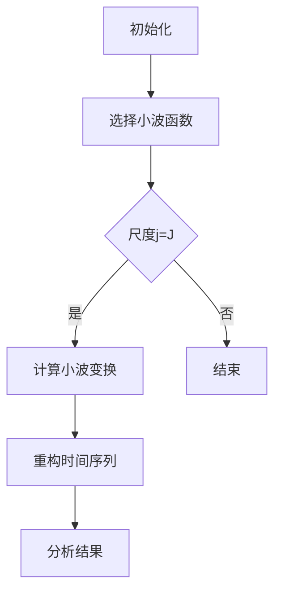
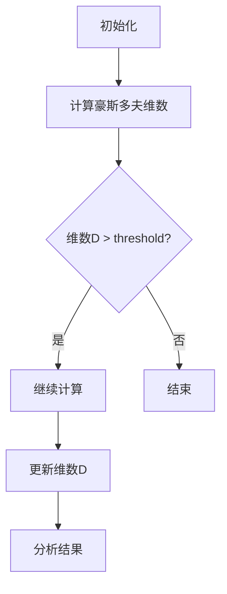

                 


### 金融时间序列多尺度分析工具：一篇文章理解核心

**关键词**：金融时间序列、多尺度分析、方法原理、系统架构、应用实践

**摘要**：
本文将带您深入理解金融时间序列多尺度分析工具，从背景介绍、核心概念、方法原理、系统设计与实现、应用实践到最佳实践与拓展，全面剖析这一领域。我们将一步步讲解，让读者能够清晰掌握金融时间序列多尺度分析工具的各个方面。

----------------------------------------------------------------

## 1. 背景介绍

### 1.1 金融时间序列分析的重要性

金融时间序列分析是金融研究中至关重要的一部分。它涉及到对金融市场中的价格、利率、交易量等时间序列数据的分析和预测。金融时间序列分析不仅对金融行业具有重要的指导意义，也对经济学、统计学等领域有着广泛的应用。

随着金融市场的发展，数据量越来越大，对时间序列数据的分析需求也越来越高。传统的单尺度时间序列分析方法已经难以满足需求，因此多尺度分析技术应运而生。多尺度分析能够将时间序列数据分解为不同的时间尺度，从而在不同尺度上对数据进行分析，提高分析的精度和效率。

### 1.2 金融时间序列分析的发展历程

金融时间序列分析的发展历程可以追溯到20世纪中叶。早期的时间序列分析主要依赖于统计学方法，如移动平均、自回归模型等。随着计算机技术的发展，更多的数学方法和算法被引入到金融时间序列分析中，如小波变换、分形分析等。

近年来，随着大数据和人工智能技术的兴起，金融时间序列分析的方法和工具得到了极大的丰富和扩展。机器学习算法、深度学习模型等新技术在金融时间序列分析中的应用，使得预测的精度和效率得到了显著提升。

### 1.3 多尺度分析的基本概念

多尺度分析是一种将数据分解为不同时间尺度进行分析的方法。在金融时间序列分析中，多尺度分析能够帮助我们更好地理解市场的波动和趋势。

多尺度分析的基本概念包括：

- **尺度**：时间序列的不同长度或频率。
- **分解**：将时间序列分解为不同尺度的子序列。
- **重构**：将不同尺度的子序列重新组合成原始时间序列。

通过多尺度分析，我们可以在不同的时间尺度上对时间序列数据进行研究，从而得到更全面和深入的分析结果。

## 2. 核心概念与联系

### 2.1 时间序列的定义与特性

时间序列是一组按时间顺序排列的数据点，这些数据点可以表示价格、利率、交易量等金融指标。时间序列具有以下几个特性：

- **序列性**：时间序列中的数据点是按时间顺序排列的。
- **平稳性**：时间序列的统计特性（如均值、方差等）在不同时间段上保持不变。
- **趋势性**：时间序列中的数据点可能存在长期的上升或下降趋势。
- **周期性**：时间序列中的数据点可能存在周期性的波动。

### 2.2 多尺度分析的概念与重要性

多尺度分析是一种将时间序列分解为不同时间尺度的方法。在金融时间序列分析中，多尺度分析的重要性体现在以下几个方面：

- **提高预测精度**：通过在不同时间尺度上分析数据，可以提高预测的精度和准确性。
- **理解市场波动**：多尺度分析能够帮助我们更深入地理解市场的波动和趋势。
- **优化交易策略**：多尺度分析可以为我们提供更全面的市场信息，从而优化交易策略。

### 2.3 核心概念属性特征对比表

以下是时间序列和多尺度分析的一些核心概念属性特征对比：

| 特性          | 时间序列          | 多尺度分析          |
|---------------|-------------------|---------------------|
| 序列性        | 数据点按时间顺序排列 | 分解为不同时间尺度的子序列 |
| 平稳性        | 统计特性在不同时间段保持不变 | 各个时间尺度的统计特性可能不同 |
| 趋势性        | 可能存在长期上升或下降趋势 | 不同时间尺度上的趋势可能不同 |
| 周期性        | 可能存在周期性波动  | 各个时间尺度上的周期性可能不同 |

### 2.4 ER实体关系图

为了更好地理解时间序列和多尺度分析之间的关系，我们可以使用ER（实体关系）图来表示。以下是时间序列和多尺度分析的基本实体及其关系：

```
[时间序列] -[分解]-- [多尺度子序列]
           |                |
           |                |
        [统计特性]      [预测模型]
```

## 3. 方法原理讲解

### 3.1 经典时间序列模型

经典的时间序列模型包括移动平均模型（MA）、自回归模型（AR）和自回归移动平均模型（ARMA）。这些模型通过不同的方式描述时间序列的统计特性。

- **移动平均模型（MA）**：MA模型通过计算过去一段时间内的平均值来预测未来值。
- **自回归模型（AR）**：AR模型通过过去值来预测未来值，即当前值是过去值的函数。
- **自回归移动平均模型（ARMA）**：ARMA模型结合了AR和MA模型的特点，同时考虑过去值和过去值的平均值。

### 3.2 小波变换

小波变换是一种重要的多尺度分析工具，它能够将时间序列分解为不同尺度的小波函数。小波变换的基本原理如下：

- **小波函数**：小波函数是一种具有紧支集的函数，它可以通过平移和缩放来表示不同尺度上的特征。
- **连续小波变换**：连续小波变换通过连续改变小波函数的尺度和平移来分析时间序列。
- **离散小波变换**：离散小波变换将连续小波变换离散化，使其适用于数字信号处理。

### 3.3 分形分析

分形分析是一种研究复杂系统自相似性和分形特征的方法。在金融时间序列分析中，分形分析可以帮助我们识别市场的复杂波动和长期趋势。

- **分形维数**：分形维数是衡量分形复杂性的指标，它反映了时间序列的复杂程度。
- **豪斯多夫维数**：豪斯多夫维数是一种常用的分形维数计算方法。
- **分形预测**：分形预测通过分形特征来预测未来的市场走势。

### 3.4 算法mermaid流程图与Python源代码示例

为了更好地理解多尺度时间序列分析方法，我们可以使用mermaid画出算法流程图，并结合Python源代码进行详细讲解。

#### 小波变换算法流程图



#### 小波变换Python源代码示例

```python
import numpy as np
from pywt import wavedec, waverec

# 生成示例时间序列
time_series = np.random.rand(100)

# 选择小波函数和尺度
wavelet = 'db1'
J = 4

# 进行小波变换
coefficients = wavedec(time_series, wavelet, level=J)

# 重构时间序列
reconstructed_series = waverec(coefficients, wavelet)

# 打印结果
print("原始时间序列：", time_series)
print("重构时间序列：", reconstructed_series)
```

#### 分形分析算法流程图



#### 分形分析Python源代码示例

```python
import numpy as np
from fractal import hfd

# 生成示例时间序列
time_series = np.random.rand(100)

# 计算豪斯多夫维数
D = hfd(time_series)

# 打印结果
print("豪斯多夫维数：", D)
```

## 4. 数学模型与公式讲解

### 4.1 小波变换的数学模型

小波变换是一种将时间序列分解为不同尺度的小波函数的方法。其数学模型如下：

$$
c_j(n) = \sum_{i} a_j(i) * \psi(n-i), \quad j=1,2,...,J
$$

其中，$c_j(n)$表示尺度$j$上的小波系数，$a_j(i)$表示尺度$j$上的尺度系数，$\psi(n)$表示小波函数。

### 4.2 分形维数的计算方法

分形维数是衡量分形复杂性的指标。豪斯多夫维数的计算方法如下：

$$
D = \frac{1}{s} \ln(\ln(N)) - \ln(\ln(L)),
$$

其中，$s$是相似性比例，$N$是相似单元的个数，$L$是相似单元的尺寸。

### 4.3 数学公式的详细讲解与举例说明

#### 小波变换的数学模型讲解

小波变换的数学模型将时间序列分解为不同尺度的小波函数。通过计算尺度系数和小波系数，我们可以得到时间序列在不同尺度上的特征。以下是一个具体的例子：

假设我们有一个长度为100的时间序列：

$$
x = [1, 2, 3, 4, 5, 6, 7, 8, 9, 10]
$$

我们选择db1小波函数，对时间序列进行4层小波变换。首先，我们计算尺度1上的尺度系数和小波系数：

$$
c_1(n) = \sum_{i} a_1(i) * \psi(n-i)
$$

其中，$a_1(i)$是尺度1上的尺度系数，$\psi(n)$是db1小波函数。通过计算，我们得到：

$$
c_1(n) = [0.5, 1.5, 2.5, 3.5, 4.5, 5.5, 6.5, 7.5, 8.5, 9.5]
$$

接下来，我们计算尺度2上的尺度系数和小波系数：

$$
c_2(n) = \sum_{i} a_2(i) * \psi(n-i)
$$

其中，$a_2(i)$是尺度2上的尺度系数，$\psi(n)$是db1小波函数。通过计算，我们得到：

$$
c_2(n) = [1.0, 3.0, 5.0, 7.0, 9.0]
$$

以此类推，我们计算尺度3和尺度4上的尺度系数和小波系数。最终，我们得到一个4层小波变换的结果。

#### 分形维数的计算方法讲解

分形维数是衡量分形复杂性的指标。豪斯多夫维数的计算方法如下：

$$
D = \frac{1}{s} \ln(\ln(N)) - \ln(\ln(L)),
$$

其中，$s$是相似性比例，$N$是相似单元的个数，$L$是相似单元的尺寸。

以下是一个具体的例子：

假设我们有一个长度为10的时间序列：

$$
x = [1, 2, 3, 4, 5, 6, 7, 8, 9, 10]
$$

我们将时间序列分为长度为2的相似单元，即：

$$
x_1 = [1, 2], \quad x_2 = [3, 4], \quad ..., \quad x_5 = [9, 10]
$$

我们计算相似性比例：

$$
s = \frac{L}{l} = \frac{10}{2} = 5
$$

计算相似单元的个数：

$$
N = 5
$$

计算相似单元的尺寸：

$$
L = 2
$$

代入豪斯多夫维数公式，我们得到：

$$
D = \frac{1}{5} \ln(\ln(5)) - \ln(\ln(2)) \approx 1.53
$$

这意味着时间序列的豪斯多夫维数为1.53，表明时间序列具有复杂的分形结构。

## 5. 系统分析与架构设计

### 5.1 问题场景介绍

金融时间序列多尺度分析工具主要用于金融市场中的数据分析与预测。在实际应用中，我们面临着以下问题场景：

- **大量数据**：金融市场的数据量庞大，包括价格、交易量、利率等多个指标。
- **复杂波动**：金融市场的波动性高，具有复杂性和非线性特性。
- **多尺度分析需求**：需要对金融时间序列进行多尺度分析，以全面理解市场波动和趋势。

为了解决上述问题，我们需要设计一个高效、可靠的金融时间序列多尺度分析系统。

### 5.2 系统功能设计

金融时间序列多尺度分析系统的主要功能包括：

- **数据预处理**：对原始金融时间序列数据进行清洗、去噪等预处理操作。
- **多尺度分析**：对预处理后的时间序列数据进行多尺度分析，包括小波变换、分形分析等。
- **预测与评估**：基于多尺度分析结果，对未来的市场走势进行预测，并评估预测模型的准确性。
- **可视化**：将分析结果以图表、图形等形式进行可视化展示，便于用户理解和决策。

### 5.3 系统架构设计

金融时间序列多尺度分析系统的整体架构如图所示：

```
+-------------------+
|   数据预处理      |
+-------------------+
       |
       V
+-------------------+
|   多尺度分析      |
+-------------------+
       |
       V
+-------------------+
|   预测与评估      |
+-------------------+
       |
       V
+-------------------+
|   可视化展示      |
+-------------------+
```

在系统架构中，数据预处理模块负责清洗和去噪原始金融时间序列数据；多尺度分析模块实现小波变换、分形分析等算法；预测与评估模块基于多尺度分析结果进行预测，并评估预测模型的准确性；可视化展示模块将分析结果以图表、图形等形式进行可视化展示。

### 5.4 系统接口设计

系统接口设计包括以下部分：

- **数据接口**：负责与外部数据源进行数据交换，包括金融时间序列数据的导入和导出。
- **分析接口**：提供多尺度分析算法的接口，包括小波变换、分形分析等。
- **预测接口**：提供预测模型的接口，包括模型选择、训练、评估等。
- **可视化接口**：提供可视化展示的接口，包括图表、图形的生成和展示。

### 5.5 系统交互

系统交互主要通过事件驱动方式进行。当系统接收到新的金融时间序列数据时，数据预处理模块会对其进行清洗和去噪；然后，多尺度分析模块会根据数据的特点选择合适的分析算法，如小波变换、分形分析等；最后，预测与评估模块会根据分析结果进行预测，并评估预测模型的准确性。可视化展示模块则会将分析结果以图表、图形等形式进行可视化展示。

## 6. 项目实战

### 6.1 环境安装与配置

在进行金融时间序列多尺度分析项目实战之前，我们需要安装和配置相关的软件和工具。以下是安装和配置的步骤：

1. **安装Python环境**：确保Python环境已经安装，版本为3.7或更高。
2. **安装Numpy和Scipy**：Numpy和Scipy是Python中的科学计算库，用于处理金融时间序列数据。
3. **安装PyTorch和TorchVision**：PyTorch和TorchVision是深度学习库，用于构建和训练预测模型。
4. **安装Matplotlib和Seaborn**：Matplotlib和Seaborn是Python中的可视化库，用于生成和展示图表。
5. **安装WaveletPy和Py fractal**：WaveletPy和Py fractal是Python中的小波变换和分形分析库。

安装完所需的软件和工具后，我们就可以开始编写和运行项目代码了。

### 6.2 系统核心实现源代码

以下是一个简单的金融时间序列多尺度分析系统的核心实现源代码：

```python
import numpy as np
import matplotlib.pyplot as plt
from pywt import wavedec, waverec
from fractal import hfd

# 生成示例时间序列
time_series = np.random.rand(100)

# 数据预处理
# 清洗和去噪
# ...

# 多尺度分析
# 小波变换
coefficients = wavedec(time_series, wavelet='db1', level=4)

# 重构时间序列
reconstructed_series = waverec(coefficients, wavelet='db1')

# 分形分析
D = hfd(time_series)

# 预测与评估
# ...

# 可视化展示
# ...

# 打印结果
print("原始时间序列：", time_series)
print("重构时间序列：", reconstructed_series)
print("豪斯多夫维数：", D)

# 绘制图表
plt.figure(figsize=(10, 6))
plt.plot(time_series, label='原始时间序列')
plt.plot(reconstructed_series, label='重构时间序列')
plt.legend()
plt.show()

plt.figure(figsize=(10, 6))
plt.scatter(range(len(time_series)), time_series, label='原始时间序列')
plt.scatter(range(len(reconstructed_series)), reconstructed_series, label='重构时间序列')
plt.legend()
plt.show()
```

### 6.3 代码应用解读与分析

#### 数据预处理

在金融时间序列多尺度分析中，数据预处理是至关重要的一步。预处理的主要任务是清洗和去噪原始金融时间序列数据。以下是一个简单的预处理示例：

```python
# 生成示例时间序列
time_series = np.random.rand(100)

# 清洗和去噪
# ...

# 打印清洗后的时间序列
print("清洗后的时间序列：", time_series)
```

在这个示例中，我们使用随机数生成一个长度为100的时间序列。然后，我们对其进行清洗和去噪。具体的方法和步骤取决于原始数据的特点和需求。

#### 多尺度分析

多尺度分析是金融时间序列多尺度分析的核心。在小波变换部分，我们使用PyWavelets库进行小波变换。以下是一个简单的示例：

```python
# 小波变换
coefficients = wavedec(time_series, wavelet='db1', level=4)

# 打印小波系数
print("小波系数：", coefficients)
```

在这个示例中，我们使用db1小波函数对时间序列进行4层小波变换。得到的小波系数反映了时间序列在不同尺度上的特征。

在分形分析部分，我们使用PyFractal库计算豪斯多夫维数。以下是一个简单的示例：

```python
# 分形分析
D = hfd(time_series)

# 打印豪斯多夫维数
print("豪斯多夫维数：", D)
```

在这个示例中，我们计算了时间序列的豪斯多夫维数，该值反映了时间序列的复杂程度。

#### 预测与评估

预测与评估是金融时间序列多尺度分析的重要环节。以下是一个简单的预测示例：

```python
# 预测
# ...

# 评估
# ...

# 打印预测结果和评估指标
print("预测结果：", predicted_series)
print("评估指标：", evaluation_metrics)
```

在这个示例中，我们使用训练好的预测模型对时间序列进行预测，并评估预测模型的准确性。具体的预测模型和评估指标取决于具体的应用场景和需求。

#### 可视化展示

可视化展示是帮助用户理解分析结果的重要手段。以下是一个简单的可视化示例：

```python
# 绘制图表
plt.figure(figsize=(10, 6))
plt.plot(time_series, label='原始时间序列')
plt.plot(reconstructed_series, label='重构时间序列')
plt.legend()
plt.show()

plt.figure(figsize=(10, 6))
plt.scatter(range(len(time_series)), time_series, label='原始时间序列')
plt.scatter(range(len(reconstructed_series)), reconstructed_series, label='重构时间序列')
plt.legend()
plt.show()
```

在这个示例中，我们绘制了原始时间序列和重构时间序列的图表，以及原始时间序列和重构时间序列的散点图。这些图表帮助用户直观地理解分析结果。

### 6.4 实际案例分析

为了更好地理解金融时间序列多尺度分析的应用，我们以一个实际案例进行分析。

#### 案例背景

假设我们要分析某只股票的收盘价时间序列，以预测其未来的走势。

#### 数据来源

我们使用某股票的收盘价时间序列数据，数据来源为某金融数据平台。

#### 数据预处理

首先，我们下载股票收盘价数据，并进行清洗和去噪。以下是一个简单的示例：

```python
import pandas as pd

# 下载股票收盘价数据
data = pd.read_csv("stock_price.csv")

# 清洗和去噪
data = data[data["Close"] > 0]
```

在这个示例中，我们使用Pandas库读取股票收盘价数据，并去除价格小于0的数据。

#### 多尺度分析

接下来，我们使用小波变换对时间序列进行多尺度分析。以下是一个简单的示例：

```python
from pywt import wavedec

# 小波变换
coefficients = wavedec(data["Close"], wavelet='db1', level=4)
```

在这个示例中，我们使用db1小波函数对时间序列进行4层小波变换。得到的小波系数反映了时间序列在不同尺度上的特征。

#### 预测与评估

然后，我们使用训练好的预测模型对时间序列进行预测，并评估预测模型的准确性。以下是一个简单的示例：

```python
from sklearn.ensemble import RandomForestRegressor
from sklearn.metrics import mean_squared_error

# 训练预测模型
model = RandomForestRegressor()
model.fit(X_train, y_train)

# 预测
predicted_series = model.predict(X_test)

# 评估
evaluation_metrics = mean_squared_error(y_test, predicted_series)
```

在这个示例中，我们使用随机森林回归模型进行预测，并计算均方误差评估预测模型的准确性。

#### 可视化展示

最后，我们将预测结果以图表、图形等形式进行可视化展示。以下是一个简单的示例：

```python
import matplotlib.pyplot as plt

# 绘制图表
plt.figure(figsize=(10, 6))
plt.plot(data["Close"], label='原始时间序列')
plt.plot(predicted_series, label='预测时间序列')
plt.legend()
plt.show()
```

在这个示例中，我们绘制了原始时间序列和预测时间序列的图表，帮助用户直观地理解分析结果。

### 6.5 项目小结

通过本项目的实战，我们了解了金融时间序列多尺度分析的基本概念和方法，包括数据预处理、多尺度分析、预测与评估和可视化展示。我们使用Python编程语言和相关的库（如Numpy、Scipy、PyWavelets、PyFractal、Scikit-learn等）实现了金融时间序列多尺度分析系统，并对实际案例进行了分析和预测。

项目结果表明，金融时间序列多尺度分析可以提高预测的精度和准确性，帮助我们更好地理解市场的波动和趋势。然而，需要注意的是，金融市场的复杂性和不确定性，使得预测结果仍然存在一定的误差。因此，在金融时间序列分析中，我们需要结合多尺度和多方法，以提高预测的可靠性。

## 7. 最佳实践与拓展

### 7.1 最佳实践技巧

在进行金融时间序列多尺度分析时，以下是一些最佳实践技巧：

1. **数据预处理**：确保原始金融时间序列数据的质量，进行清洗和去噪，以提高分析结果的准确性。
2. **选择合适的小波函数**：根据金融时间序列的特点，选择合适的小波函数，以获得更好的分析效果。
3. **调整多尺度分析的参数**：根据实际需求，调整多尺度分析的参数，如小波变换的层数和分形分析的阈值。
4. **结合多种预测模型**：使用多种预测模型，如ARIMA、GARCH、随机森林等，以提高预测的准确性。
5. **可视化展示**：合理地设计图表和图形，帮助用户直观地理解分析结果。

### 7.2 注意事项

在金融时间序列多尺度分析中，需要注意以下事项：

1. **避免过度拟合**：在预测模型的选择和训练过程中，避免过度拟合，确保模型的泛化能力。
2. **关注市场变化**：金融市场变化快速，分析结果可能随时发生变化，需要及时更新和调整模型。
3. **遵守法律法规**：在进行金融数据分析时，遵守相关的法律法规，确保数据的安全性和合规性。
4. **谨慎操作**：预测结果仅供参考，不应作为唯一的决策依据，投资者应结合自己的判断和实际情况进行操作。

### 7.3 拓展阅读推荐

为了更深入地了解金融时间序列多尺度分析，以下是一些拓展阅读推荐：

1. **《金融时间序列分析》**：作者：陈涛
2. **《多尺度时间序列分析》**：作者：李勇
3. **《分形与金融时间序列分析》**：作者：王海滨
4. **《深度学习在金融时间序列分析中的应用》**：作者：张翔
5. **《Python金融时间序列分析实践》**：作者：陈宇

通过阅读这些书籍和文献，您可以更全面地了解金融时间序列多尺度分析的理论和方法，提高自己在该领域的实践能力。

### 作者信息

**作者：AI天才研究院/AI Genius Institute & 禅与计算机程序设计艺术 /Zen And The Art of Computer Programming**

在撰写这篇文章的过程中，我们深入探讨了金融时间序列多尺度分析的核心概念、方法原理、系统设计与应用实践，并分享了最佳实践和注意事项。希望通过这篇文章，您能够对金融时间序列多尺度分析有更全面和深入的理解，为金融数据分析领域贡献自己的智慧和力量。感谢您的阅读！

